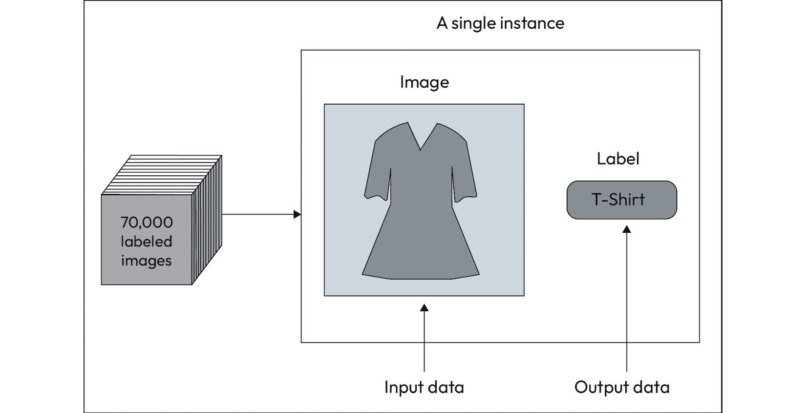
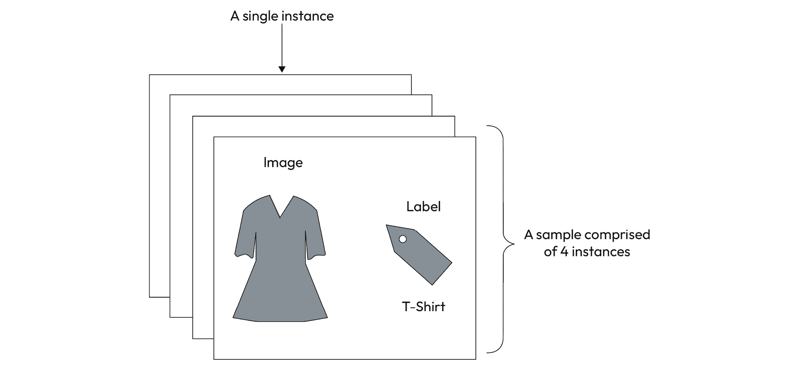
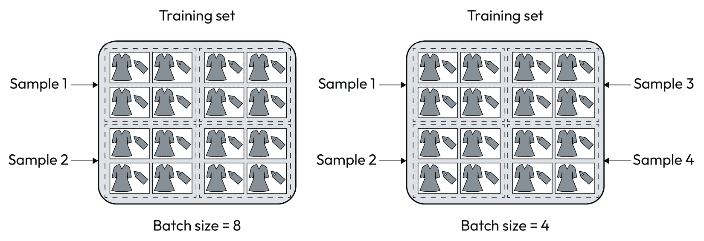
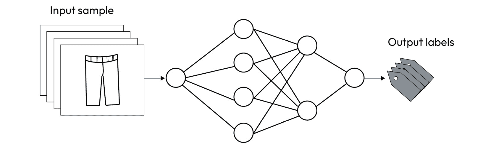
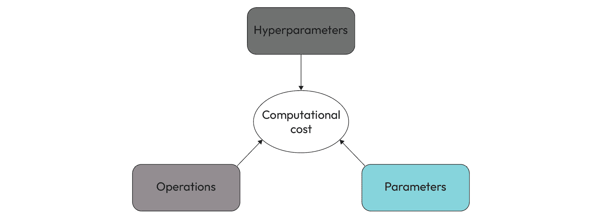
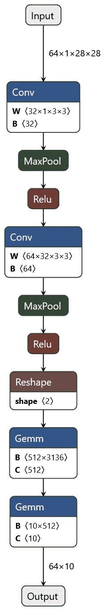

# 1

# 拆解训练过程

我们已经知道训练神经网络模型需要很长时间才能完成。否则，我们不会在这里讨论如何更快地运行这个过程。但是，是什么特征使得这些模型的构建过程如此计算密集呢？为什么训练步骤如此耗时？要回答这些问题，我们需要理解训练阶段的计算负担。

在本章中，我们首先要记住训练阶段是如何在底层运行的。我们将理解什么使训练过程如此计算密集。

以下是您将在本章的学习中了解到的内容：

+   记住训练过程

+   理解训练阶段的计算负担

+   理解影响训练时间的因素

# 技术要求

您可以在本章提到的示例的完整代码在书的 GitHub 仓库中找到，链接为[`github.com/PacktPublishing/Accelerate-Model-Training-with-PyTorch-2.X/blob/main`](https://github.com/PacktPublishing/Accelerate-Model-Training-with-PyTorch-2.X/blob/main)。

您可以访问您喜爱的环境来执行这个笔记本，比如 Google Colab 或 Kaggle。

# 记住训练过程

在描述神经网络训练带来的计算负担之前，我们必须记住这个过程是如何工作的。

重要提示

本节对训练过程进行了非常简要的介绍。如果您对这个主题完全不熟悉，您应该花些时间理解这个主题，然后再转到后面的章节。学习这个主题的一个很好的资源是 Packt 出版的书籍《使用 PyTorch 和 Scikit-Learn 进行机器学习》，作者是 Sebastian Raschka、Yuxi (Hayden) Liu 和 Vahid Mirjalili。

基本上来说，神经网络学习示例，类似于一个孩子观察成年人。学习过程依赖于向神经网络提供输入和输出值对，以便网络捕捉输入和输出数据之间的内在关系。这样的关系可以解释为模型获得的知识。所以，在人看到一堆数据时，神经网络看到的是隐藏的知识。

这个学习过程取决于用于训练模型的数据集。

## 数据集

**数据集**包含一组与某个问题、情景、事件或现象相关的**数据实例**。每个实例都有特征和目标信息，对应输入和输出数据。数据集实例的概念类似于表或关系数据库中的记录。

数据集通常分为两部分：训练集和测试集。训练集用于训练网络，而测试部分则用于针对未见过的数据测试模型。偶尔，我们也可以在每次训练迭代后使用另一部分来验证模型。

让我们来看看 Fashion-MNIST，这是一个常用于测试和教授神经网络的著名数据集。该数据集包含 70,000 张标记的服装和配饰图像，如裙子、衬衫和凉鞋，属于 10 个不同的类别。数据集分为 60,000 个训练实例和 10,000 个测试实例。

正如*图 1**.1*所示，该数据集的单个实例包括一个 28 x 28 的灰度图像和一个标签，用来识别其类别。在 Fashion-MNIST 的情况下，我们有 70,000 个实例，通常称为数据集的长度。



图 1.1 – 数据集实例的概念

除了数据集实例的概念外，我们还有**数据集样本**的概念。一个样本定义为一组实例，如*图 1**.2*所示。通常，训练过程执行的是样本而不仅仅是单个数据集实例。训练过程之所以采用样本而不是单个实例，与训练算法的工作方式有关。关于这个主题不用担心，我们将在接下来的章节中进行详细讨论：



图 1.2 – 数据集样本的概念

样本中的实例数量称为**批处理大小**。例如，如果我们将 Fashion-MNIST 训练集分成批次大小为 32 的样本，则得到 1,875 个样本，因为该集合有 60,000 个实例。

批处理大小越大，训练集中样本的数量越少，如*图 1**.3*中所示：



图 1.3 – 批处理大小的概念

在本例中，如果批处理大小为 8，则数据集被分为两个样本，每个样本包含八个数据集实例。另一方面，如果批处理大小较小（例如四个），则训练集将被分成更多的样本（四个样本）。

神经网络接收输入样本并输出一组结果，每个结果对应一个输入样本的实例。对于处理 Fashion-MNIST 分类图像问题的模型，神经网络接收一组图像并输出另一组标签，正如*图 1**.4*所示。每个标签表示输入图像对应的类别：



图 1.4 – 神经网络对输入样本的工作

要提取数据集中的内在知识，我们需要将神经网络提交给训练算法，以便它可以学习数据中存在的模式。让我们跳转到下一节，了解这个算法是如何工作的。

## 训练算法

训练算法是一个**迭代过程**，它接受每个数据集样本，并根据正确结果与预测结果之间的误差调整神经网络参数。

单次训练迭代被称为**训练步骤**。因此，在学习过程中执行的训练步骤数量等于用于训练模型的样本数量。正如我们之前所述，批量大小定义了样本数量，也确定了训练步骤的数量。

执行所有训练步骤后，我们称训练算法完成了一个**训练周期**。开发者在开始模型构建过程之前必须定义训练周期的数量。通常，开发者通过变化并评估生成模型的准确性来确定训练周期的数量。

单个训练步骤按照图*1**.5*顺序执行四个阶段：


图 1.5 – 训练过程的四个阶段

让我们逐步了解每一个步骤，理解它们在整个训练过程中的作用。

### 前向

在前向阶段，神经网络接收输入数据，执行计算，并输出结果。这个输出也称为神经网络预测的值。在 Fashion-MNIST 中，输入数据是灰度图像，预测的值是物品所属的类别。

考虑到训练步骤中执行的任务，前向阶段具有更高的计算成本。这是因为它执行神经网络中涉及的所有重计算。这些计算通常称为操作，将在下一节中解释。

有趣的是，前向阶段与推断过程完全相同。在实际使用模型时，我们持续执行前向阶段来推断一个值或结果。

### 损失计算

在前向阶段之后，神经网络将会输出一个预测值。然后，训练算法需要比较预测值与期望值，以查看模型所做预测的好坏程度。

如果预测值接近或等于真实值，则模型表现符合预期，训练过程朝着正确的方向进行。否则，训练步骤需要量化模型达到的错误，以调整参数与错误程度成比例。

重要提示

在神经网络术语中，这种误差通常称为**损失**或**成本**。因此，在讨论此主题时，文献中常见到损失或成本函数等名称。

不同类型的损失函数，每种适合处理特定类型的问题。**交叉熵**（**CE**）损失函数用于多类图像分类问题，其中我们需要将图像分类到一组类别中。例如，这种损失函数可以在 Fashion-MNIST 问题中使用。假设我们只有两个类别或分类。在这种情况下，面对二元类问题，建议使用**二元交叉熵**（**BCE**）函数而不是原始的交叉熵损失函数。

对于回归问题，损失函数与分类问题中使用的不同。我们可以使用诸如**均方误差**（**MSE**）的函数，该函数衡量神经网络预测值与原始值之间的平方差异。

### 优化

在获取损失之后，训练算法计算相对于网络当前参数的损失函数的偏导数。这个操作产生所谓的**梯度**，训练过程使用它来调整网络参数。

略去数学基础，我们可以将梯度视为需要应用于网络参数以最小化错误或损失的变化。

重要提示

您可以通过阅读 Packt 出版的《深度学习数学实战》一书（作者 Jay Dawani 编著）来了解深度学习中使用的数学更多信息。

与损失函数类似，优化器也有不同的实现方式。**随机梯度下降**（**SGD**）和 Adam 最常用。

### 反向传播

为完成训练过程，算法根据优化阶段获得的梯度更新网络参数。

重要提示

本节提供了训练算法的理论解释。因此，请注意，根据机器学习框架的不同，训练过程可能具有与前述列表不同的一组阶段。

本质上，这些阶段构成了训练过程的计算负担。请跟随我到下一节，以了解这种计算负担如何受不同因素影响。

# 理解模型训练阶段的计算负担

现在我们已经复习了训练过程的工作原理，让我们了解训练模型所需的计算成本。通过使用计算成本或负担这些术语，我们指的是执行训练过程所需的计算能力。计算成本越高，训练模型所需的时间就越长。同样，计算负担越高，执行训练模型所需的计算资源就越多。

本质上，我们可以说训练模型的计算负担由三个因素定义，如*图 1.6*所示。



图 1.6 – 影响训练计算负担的因素

这些因素中的每一个（在某种程度上）都对训练过程施加了计算复杂性。让我们分别讨论每一个。

## 超参数

**超参数**定义了神经网络的两个方面：神经网络配置和训练算法的工作方式。

关于神经网络配置，超参数确定了每个层的数量和类型以及每个层中的神经元数量。简单的网络有少量的层和神经元，而复杂的网络有成千上万个神经元分布在数百个层中。层和神经元的数量决定了网络的参数数量，直接影响计算负担。由于参数数量在训练步骤的计算成本中有显著影响，我们将在本章稍后讨论这个话题作为一个独立的性能因素。

关于训练算法如何执行训练过程，超参数控制着周期数和步数的数量，并确定了训练阶段使用的优化器和损失函数，等等。其中一些超参数对训练过程的计算成本影响微乎其微。例如，如果我们将优化器从 SGD 改为 Adam，对训练过程的计算成本不会产生任何相关影响。

然而，其他超参数确实会显著增加训练阶段的时间。其中最典型的例子之一是批大小。批大小越大，训练模型所需的训练步骤就越少。因此，通过少量的训练步骤，我们可以加快建模过程，因为训练阶段每个周期执行的步骤会减少。另一方面，如果批大小很大，我们可能需要更多时间执行单个训练步骤。这是因为在每个训练步骤上执行的前向阶段必须处理更高维度的输入数据。换句话说，这里存在一个权衡。

例如，考虑批大小等于*32*的 Fashion-MNIST 数据集的情况。在这种情况下，输入数据的维度为*32 x 1 x 28 x 28*，其中 32、1 和 28 分别表示批大小、通道数（颜色，在这种情况下）和图像大小。因此，对于这种情况，输入数据包括 25,088 个数字，这是前向阶段应该计算的数字数量。然而，如果我们将批大小增加到*128*，输入数据就会变为 100,352 个数字，这可能导致单个前向阶段迭代执行时间较长。

另外，更大的输入样本需要更多的内存来执行每个训练步骤。根据硬件配置的不同，执行训练步骤所需的内存量可能会显著降低整个训练过程的性能，甚至使其无法在该硬件上执行。相反，我们可以通过使用具有大内存资源的硬件加速训练过程。这就是为什么我们需要了解我们使用的硬件资源的细节以及影响训练过程计算复杂度的因素。

我们将在整本书中深入探讨所有这些问题。

## 操作

我们已经知道每个训练步骤执行四个训练阶段：前向、损失计算、优化和反向。在前向阶段，神经网络接收输入数据并根据神经网络的架构进行处理。除其他事项外，架构定义了网络层，每个层在前向阶段执行一个或多个操作。

例如，一个**全连接神经网络**（**FCNN**）通常执行通用的矩阵乘法运算，而**卷积神经网络**（**CNNs**）执行特殊的计算机视觉操作，如卷积、填充和池化。结果表明，一个操作的计算复杂度与另一个不同。因此，根据网络架构和操作，我们可以得到不同的性能行为。

没有什么比一个例子更好了，对吧？让我们定义一个类来实例化一个传统的 CNN 模型，该模型能够处理 Fashion-MNIST 数据集。

重要提示

本节中显示的完整代码可在[`github.com/PacktPublishing/Accelerate-Model-Training-with-PyTorch-2.X/blob/main/code/chapter01/cnn-fashion_mnist.ipynb`](https://github.com/PacktPublishing/Accelerate-Model-Training-with-PyTorch-2.X/blob/main/code/chapter01/cnn-fashion_mnist.ipynb)找到。

该模型接收大小为*64 x 1 x 28 x 28*的输入样本。这意味着模型接收到 64 张灰度图像（一个通道），高度和宽度均为 28 像素。因此，模型输出一个维度为*64 x 10*的张量，表示图像属于 Fashion-MNIST 数据集的 10 个类别的概率。

该模型有两个卷积层和两个全连接层。每个卷积层包括一个二维卷积、**修正线性单元**（**ReLU**）激活函数和池化。第一个全连接层有 3,136 个神经元连接到第二个全连接层的 512 个神经元。然后，第二层连接到输出层的 10 个神经元。

重要提示

如果您对 CNN 模型不熟悉，观看 Packt YouTube 频道上的视频*什么是卷积神经网络（CNN）*会很有用，链接在[`youtu.be/K_BHmztRTpA`](https://youtu.be/K_BHmztRTpA)。

通过将这个模型导出为 ONNX 格式，我们得到了*图 1.7*中所示的图表：



图 1.7 – CNN 模型的操作

重要提示

**开放神经网络交换**（**ONNX**）是机器学习互操作性的开放标准。除其他外，ONNX 提供了一种标准格式，用于从许多不同的框架和工具中导出神经网络模型。我们可以使用 ONNX 文件来检查模型细节，将其导入到另一个框架中，或执行推断过程。

通过评估*图 1.7*，我们可以看到五个不同的操作：

+   `Conv`: 二维卷积

+   `MaxPool`: 最大池化

+   `Relu`: 激活函数（ReLU）

+   `Reshape`: 张量维度转换

+   `Gemm`: 通用矩阵乘法

所以，在底层，神经网络在前向阶段执行这些操作。从计算的角度来看，这是机器在每个训练步骤中运行的真实操作集合。因此，我们可以从操作的角度重新思考这个模型的训练过程，并将其写成一个更简单的算法：

```py
for each epoch    for each training step
        result = conv(input)
        result = maxpool(result)
        result = relu(result)
        result = conv(result)
        result = maxpool(result)
        result = relu(result)
        result = reshape(result)
        result = gemm(result)
        result = gemm(result)
    loss = calculate_loss(result)
    gradient = optimization(loss)
    backwards(gradient)
```

如您所见，训练过程只是一系列按顺序执行的操作。尽管用于定义模型的函数或类，机器实际上是在运行这一系列操作。

结果表明，每个操作都具有特定的计算复杂性，因此需要不同级别的计算能力和资源来满足执行的要求。因此，我们可能会面对每个操作的不同性能增益和瓶颈。同样，一些操作可能更适合在特定的硬件架构中执行，这一点我们将在本书中看到。

要理解这个主题的实际意义，我们可以检查这些操作在训练阶段花费的时间百分比。因此，让我们使用**PyTorch Profiler**来获取每个操作的 CPU 使用百分比。以下列表总结了在 Fashion-MNIST 数据集的一个输入样本上运行 CNN 模型的前向阶段时的 CPU 使用情况：

```py
aten::mkldnn_convolution: 44.01%aten::max_pool2d_with_indices: 30.01%
aten::addmm: 13.68%
aten::clamp_min: 6.96%
aten::convolution: 1.18%
aten::copy_: 0.70%
aten::relu: 0.59%
aten::_convolution: 0.49%
aten::empty: 0.35%
aten::_reshape_alias: 0.31%
aten::t: 0.31%
aten::conv2d: 0.24%
aten::as_strided_: 0.24%
aten::reshape: 0.21%
aten::linear: 0.21%
aten::max_pool2d: 0.17%
aten::expand: 0.14%
aten::transpose: 0.10%
aten::as_strided: 0.07%
aten::resolve_conj: 0.00%
```

重要提示

ATen 是 PyTorch 用于执行基本操作的 C++库。您可以在[`pytorch.org/cppdocs/#aten`](https://pytorch.org/cppdocs/#aten)找到有关该库的更多信息。

结果显示，Conv 操作（此处标记为`aten::mkldnn_convolution`）占用了更高的 CPU 使用率（44%），其次是 MaxPool 操作（`aten::max_pool2d_with_indices`），占用 30%的 CPU 时间。另一方面，ReLU（`aten::relu`）和 Reshape（`aten::reshape`）操作消耗的 CPU 时间不到总 CPU 使用率的 1%。最后，Gemm 操作（`aten::addmm`）占用了约 14%的 CPU 时间。

通过这个简单的分析测试，我们可以确定前向阶段涉及的操作；因此，在训练过程中，存在不同级别的计算复杂性。我们可以看到，在执行 Conv 操作时，训练过程消耗了更多的 CPU 周期，而不是在执行 Gemm 操作时。请注意，我们的 CNN 模型具有两层，包含这两种操作。因此，在这个例子中，这两种操作被执行了相同的次数。

基于对神经网络操作的不同计算负担的了解，我们可以选择最佳的硬件架构或软件堆栈，以减少给定神经网络的主要操作的执行时间。例如，假设我们需要训练一个由数十个卷积层组成的 CNN 模型。在这种情况下，我们将寻找具有特殊能力的硬件资源，以更有效地执行 Conv 操作。尽管模型具有一些全连接层，但我们已经知道，与 Conv 相比，Gemm 操作可能计算负担较小。这就证明了，优先考虑能够加速卷积操作的硬件资源是合理的。

## 参数

除了超参数和操作外，神经网络参数是影响训练过程计算成本的另一个因素。正如我们之前讨论的那样，神经网络配置中层的数量和类型定义了网络上的总参数数量。

显然，参数数量越多，训练过程的计算负担越重。这些参数包括用于卷积操作的核值、偏置以及神经元之间连接的权重。

我们的 CNN 模型只有 4 层，却有 1,630,090 个参数。我们可以使用 PyTorch 的这个函数轻松地计算出网络中的总参数数量。

```py
def count_parameters(model):    parameters = list(model.parameters())
    total_parms = sum(
        [np.prod(p.size()) for p in parameters if p.requires_grad])
    return total_parms
```

如果我们在我们的 CNN 模型中添加一个额外的具有 256 个神经元的全连接层，并重新运行这个函数，我们将得到总共 1,758,858 个参数，增加了近 8%。

在训练和测试这个新的 CNN 模型之后，我们得到了与之前相同的准确性。因此，注意网络复杂度与模型准确性之间的权衡是至关重要的。在许多情况下，增加层和神经元的数量不一定会导致更好的效率，但可能会增加训练过程的时间。

参数的另一个方面是用于表示模型中这些数字的数值精度。我们将在*第七章*，*采用混合精度*中深入讨论这个话题，但现在请记住，用于表示参数的字节数对训练模型所需的时间有重要的贡献。因此，参数数量不仅影响训练时间，而且所选择的数值精度也会影响训练时间。

下一节将提出一些问题，帮助您巩固本章学到的内容。

# 测验时间！

让我们通过回答八个问题来复习本章学到的内容。首先，尝试在不查阅资料的情况下回答这些问题。

重要提示

所有这些问题的答案都可以在 [`github.com/PacktPublishing/Accelerate-Model-Training-with-PyTorch-2.X/blob/main/quiz/chapter01-answers.md`](https://github.com/PacktPublishing/Accelerate-Model-Training-with-PyTorch-2.X/blob/main/quiz/chapter01-answers.md) 找到。

在开始测验之前，请记住，这根本不是一次测试！本节旨在通过复习和巩固本章节所涵盖的内容来补充您的学习过程。

为以下问题选择正确选项：

1.  训练过程包括哪些阶段？

    1.  前向，处理，优化和反向。

    1.  处理，预处理和后处理。

    1.  前向，损失计算，优化和反向。

    1.  处理，损失计算，优化和后处理。

1.  哪些因素影响训练过程的计算负担？

    1.  损失函数，优化器和参数。

    1.  超参数，参数和操作。

    1.  超参数，损失函数和操作。

    1.  参数，操作和损失函数。

1.  在执行训练算法处理所有数据集样本后，训练过程完成了一个训练什么？

    1.  进化。

    1.  epoch。

    1.  步骤。

    1.  生成。

1.  数据集样本包含一组什么？

    1.  数据集集合。

    1.  数据集步骤。

    1.  数据集的 epochs。

    1.  数据集实例。

1.  哪个超参数更有可能增加训练过程的计算负担？

    1.  批次大小。

    1.  优化器。

    1.  epoch 数。

    1.  学习率。

1.  一个训练集有 2,500 个实例。通过定义批次大小分别为 1 和 50，训练过程执行的步骤数分别是以下哪一个？

    1.  500 和 5。

    1.  2,500 和 1。

    1.  2,500 和 50。

    1.  500 和 50。

1.  训练过程的分析显示，最耗时的操作是 `aten::mkldnn_convolution`。在这种情况下，训练过程中哪个计算阶段更重？

    1.  反向。

    1.  前向。

    1.  损失计算。

    1.  优化。

1.  一个模型有两个卷积层和两个全连接层。如果我们向模型添加两个额外的卷积层，将增加什么数量？

    1.  超参数。

    1.  训练步骤。

    1.  参数。

    1.  训练样本。

让我们总结一下这一章节我们学到的内容。

# 总结

我们已经完成了训练加速旅程的第一步。您从回顾训练过程如何工作开始了本章。除了复习数据集和样本等概念外，您还记得训练算法的四个阶段。

接下来，您了解到超参数，操作和参数是影响训练过程计算负担的三个因素。

现在你已经记住了训练过程，并理解了导致其计算复杂性的因素，是时候转向下一个主题了。

让我们迈出第一步，学习如何加速这一繁重的计算过程！
