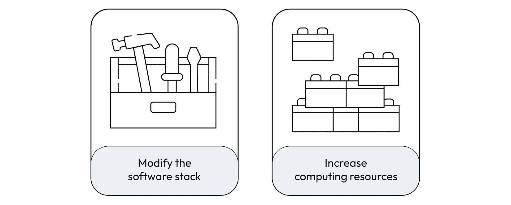
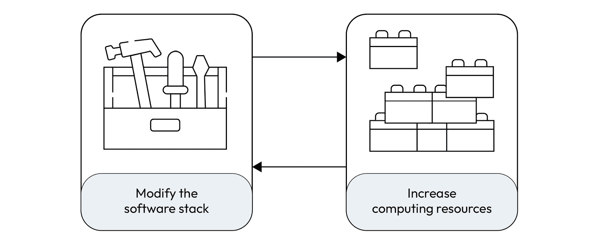
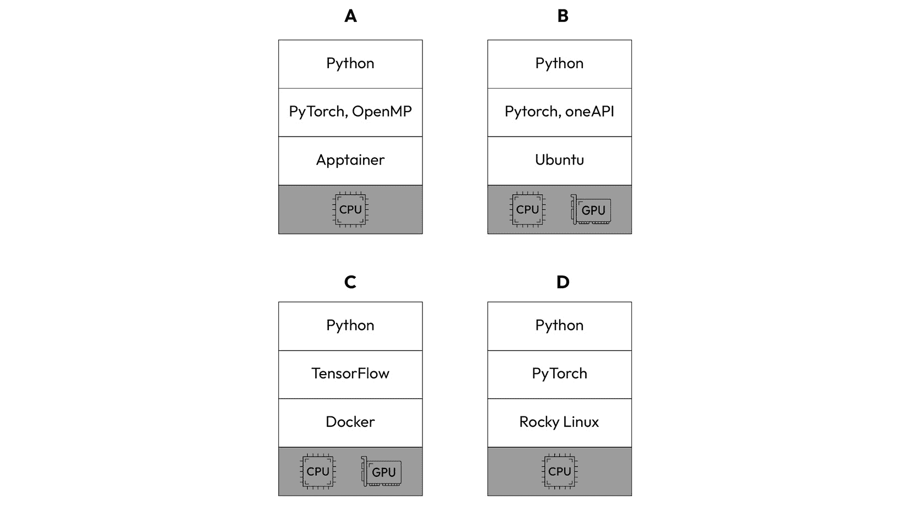
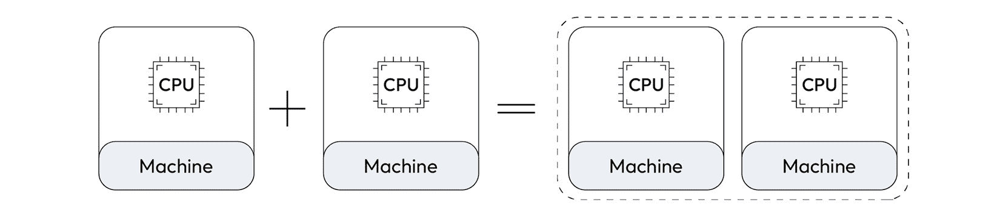
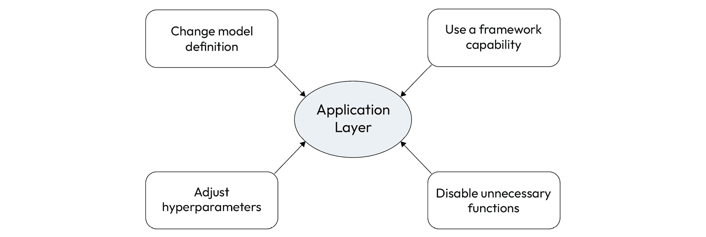

# 第二章：更快地训练模型

在上一章中，我们了解了增加训练过程的计算负担的因素。这些因素直接影响训练阶段的复杂性，从而影响执行时间。

现在是时候学习如何加快这一过程了。一般来说，我们可以通过改变软件堆栈中的某些内容或增加计算资源的数量来提高性能。

在本章中，我们将开始理解这两个选项。接下来，我们将学习可以在应用程序和环境层面进行修改的内容。

以下是本章的学习内容：

+   理解加速训练过程的方法

+   知道用于训练模型的软件堆栈的层次

+   学习垂直和水平扩展的区别

+   理解可以在应用程序层面修改以加速训练过程的内容。

+   理解可以在环境层面进行修改以提高训练阶段性能的内容

# 技术要求

你可以在本书的 GitHub 仓库中找到本章提到的示例的完整代码，网址为 [`github.com/PacktPublishing/Accelerate-Model-Training-with-PyTorch-2.X/blob/main`](https://github.com/PacktPublishing/Accelerate-Model-Training-with-PyTorch-2.X/blob/main)。

您可以访问您喜爱的环境来执行此笔记本，例如 Google Colab 或 Kaggle。

# 我们有哪些选择？

一旦我们决定加速模型训练过程，我们可以采取两个方向，如*图 2.1*所示：



图 2.1 – 加速训练阶段的方法

在第一个选项（**修改软件堆栈**）中，我们将遍历用于训练模型的每一层软件堆栈，寻找改进训练过程的机会。简而言之，我们可以更改应用程序代码，安装和使用专门的库，或者在操作系统或容器环境中启用特殊功能。

这第一种方法依赖于对性能调整技术的深刻了解。此外，它要求具有高度的调查意识，以识别瓶颈并应用最合适的解决方案来克服它们。因此，这种方法是通过提取计算系统的最大性能来利用最多的硬件和软件资源。

然而，请注意，根据我们运行训练过程的环境，我们可能没有必要权限来更改软件堆栈的较低层。例如，假设我们在像**Kaggle**或**Google Colab**这样的第三方环境提供的笔记本中运行训练过程。在这种情况下，我们无法更改操作系统参数或修改容器镜像，因为这个环境是受控制和限制的。我们仍然可以更改应用程序代码，但这可能不足以加速训练过程。

当在软件堆栈中无法改变事物或未提供预期性能增益时，我们可以转向第二个选项（**增加计算资源**）来训练模型。因此，我们可以增加处理器数量和主内存量，使用加速器设备，或将训练过程分布在多台机器上。自然地，我们可能需要花费金钱来实现这个选项。

请注意，在云端比在本地基础设施中采用这种方法更容易。使用云时，我们可以轻松地合同一台配备加速器设备的机器或在我们的设置中添加更多机器。我们可以通过几次点击准备好这些资源以供使用。另一方面，在本地基础设施中添加新的计算资源时可能会遇到一些约束，例如物理空间和能源容量限制。尽管如此，这并非不可能，只是可能更具挑战性。

此外，我们还有另一种情况，即我们的基础设施，无论是云端还是本地，已经拥有这些计算资源。在这种情况下，我们只需开始使用它们来加速训练过程。

因此，如果我们有资金购买或合同这些资源，或者如果它们已经在我们的环境中可用，问题解决了，对吗？并非一定如此。不幸的是，使用额外的资源在训练过程中不能自动提高性能的保证。正如本书将讨论的那样，性能瓶颈并非总是通过增加计算资源而得以克服，而需要重新思考整个流程、调整代码等。

这最后的断言给了我们一个宝贵的教训：我们必须将这两种方法视为一个循环，而不是两个孤立的选择。这意味着我们必须根据需要反复使用这两种方法，以达到所需的改进，如*图 2**.2*所示。



图 2.2 – 持续改进循环

让我们在接下来的几节中详细了解这两种方法的更多细节。

## 修改软件堆栈

用于训练模型的软件堆栈可以根据我们用于执行此过程的环境而异。为简单起见，在本书中，我们将从数据科学家的角度考虑软件堆栈，即作为计算服务或环境的用户。

总的来说，软件堆栈看起来像是图 *2**.3* 所示的层次结构：


图 2.3 – 用于训练模型的软件堆栈

从顶部到底部，我们有以下层次：

1.  **应用程序**：该层包含建模程序。该程序可以用任何能够构建神经网络的编程语言编写，如 R 和 Julia，但 Python 是主要用于此目的的语言。

1.  **环境**：用于构建应用程序的机器学习框架，支持此框架的库和工具位于此层。一些机器学习框架的例子包括**PyTorch**、**TensorFlow**、**Keras**和**MxNet**。关于库的集合，我们可以提到**Nvidia Collective Communication Library**（**NCCL**），用于 GPU 之间的高效通信，以及**jemalloc**，用于优化内存分配。

1.  **执行**：此层负责支持环境和应用层的执行。因此，容器解决方案或裸金属操作系统属于此层。虽然上层组件可以直接在操作系统上执行，但如今通常使用容器来封装整个应用程序及其环境。尽管 Docker 是最著名的容器解决方案，但更适合运行机器学习工作负载的选择是采用**Apptainer**和**Enroot**。

在软件堆栈的底部，有一个框代表执行上层软件所需的所有硬件资源。

为了实际理解这种软件堆栈表示，让我们看几个示例，如图 *2**.4* 所示：



图 2.4 – 软件堆栈示例

图 *2**.4* 中描述的所有场景都使用 Python 编写的应用程序。如前所述，应用程序可以是用 C++编写的程序或用 R 编写的脚本。这并不重要。需要牢记的重要提示是应用层代表我们代码的位置。在示例 **A**、**B** 和 **D** 中，我们有使用 PyTorch 作为机器学习框架的场景。情况 **A** 和 **B** 还依赖于额外的库，即**OpenMP**和**Intel One API**。这意味着 PyTorch 依赖于这些库来增强任务和操作。

最后，场景 **B** 和 **C** 的执行层使用容器解决方案来执行上层，而示例 **A** 和 **D** 的上层直接在操作系统上运行。此外，请注意，场景 **B** 和 **C** 的硬件资源配备了 GPU 加速器，而其他情况只有 CPU。

重要提示

请注意，我们正在抽象化用于运行软件堆栈的基础设施类型，因为在当前讨论阶段这是无关紧要的。因此，您可以考虑将软件堆栈托管在云端或本地基础设施中。

除非我们使用自己资源提供的环境，否则我们可能没有权限修改或添加执行层中的配置。在大多数情况下，我们使用公司配置的计算环境。因此，我们没有特权修改容器或操作系统层中的任何内容。通常，我们会将这些修改提交给 IT 基础设施团队。

因此，我们将专注于应用和环境层面，在这些层面上我们有能力进行修改和执行额外的配置。

本书的第二部分专注于教授如何改变软件堆栈，以便我们可以利用现有资源加速训练过程。

重要说明

在执行层面，有一些令人兴奋的配置可以提升性能。然而，它们超出了本书的范围。鉴于数据科学家是本材料的主要受众，我们将重点放在这些专业人士有权访问并自行修改和定制的层面上。

修改软件堆栈以加速训练过程有其局限性。无论我们采用多么深入和先进的技术，性能改进都会受到限制。当我们达到这个限制时，加速训练阶段的唯一方法是使用额外的计算资源，如下一节所述。

## 增加计算资源

在现有环境中增加计算资源有两种方法：垂直扩展和水平扩展。在垂直扩展中，我们增加单台机器的计算资源，而在水平扩展中，我们将更多机器添加到用于训练模型的设备池中。

在实际操作中，**垂直扩展**允许为机器配备加速器设备，增加主存储器，添加更多处理器核心等，正如*图 2**.5*所示的例子。进行这种扩展后，我们获得了一台资源更强大的机器：


图 2.5 – 垂直扩展示例

水平扩展与我们的应用使用的机器数量增加有关。如果我们最初使用一台机器来执行训练过程，我们可以应用水平扩展，使用两台机器共同训练模型，正如在*图 2**.6*的示例中所示：



图 2.6 – 水平扩展示例

无论扩展的类型如何，我们都需要知道如何利用这些额外的资源来提高性能。根据我们设置的资源类型，我们需要在许多不同的部分调整代码。在其他情况下，机器学习框架可以自动处理资源增加，而无需任何额外的修改。

正如我们在本节学到的，加速训练过程的第一步依赖于修改应用层。跟我来到下一节，了解如何操作。

# 修改应用层

应用层是性能提升旅程的起点。因为我们完全控制应用代码，所以可以独立进行修改，不依赖于任何其他人。因此，开始性能优化过程的最佳方式就是独立工作。

## 我们可以在应用层中做出哪些改变？

你可能会想知道我们如何修改代码以改善性能。好吧，我们可以减少模型复杂性，增加批量大小以优化内存使用，编译模型以融合操作，并禁用分析函数以消除训练过程中的额外开销。

无论应用层所作的变更如何，我们不能以牺牲模型准确性为代价来改善性能，因为这毫无意义。由于神经网络的主要目标是解决问题，加速无用模型的构建过程就显得毫无意义。因此，在修改代码以减少训练阶段时间时，我们必须注意模型质量。

在 *图 2**.7* 中，我们可以看到我们可以在应用层中进行的改变类型：



图 2.7 – 修改应用层以加快训练过程

让我们看看每个变化：

+   **修改模型定义**：修改神经网络架构以减少每层的层数、权重和执行的操作

+   **调整超参数**：更改超参数，如批量大小、迭代次数和优化器

+   **利用框架的能力**：充分利用像内核融合、自动混合精度和模型编译等框架能力

+   **禁用不必要的功能**：摆脱不必要的负担，如在验证阶段计算梯度

重要提示

一些框架能力依赖于在环境层进行的变更，比如安装额外的工具或库，甚至升级框架版本。

当然，这些类别并不涵盖应用层性能改进的所有可能性；它们的目的是为您提供一个明确的心理模型，了解我们可以有效地对代码做些什么以加速训练阶段。

## 实际操作

让我们通过仅更改应用代码来看一个性能改进的实际示例。我们的实验对象是前一章介绍的 CNN 模型，用于对 Fashion-MNIST 数据集中的图像进行分类。

重要提示

此实验中使用的计算环境的详细信息在此时无关紧要。真正重要的是这些修改所实现的加速效果，在相同环境和条件下考虑。

此模型有两个卷积层和两个全连接层，共**1,630,090**个权重。当训练阶段的批量大小为 64，训练时长为 148 秒。训练后的模型对来自测试数据集的 10,000 张图像的准确率达到了 83.99%，如您所见：

```py
Epoch [1/10], Loss: 0.9136Epoch [2/10], Loss: 0.6925
Epoch [3/10], Loss: 0.7313
Epoch [4/10], Loss: 0.6681
Epoch [5/10], Loss: 0.3191
Epoch [6/10], Loss: 0.5790
Epoch [7/10], Loss: 0.4824
Epoch [8/10], Loss: 0.6229
Epoch [9/10], Loss: 0.7279
Epoch [10/10], Loss: 0.3292
Training time: 148 seconds
Accuracy of the network on the 10000 test images: 83.99 %
```

重要提示

本节中展示的完整代码可在[`github.com/PacktPublishing/Accelerate-Model-Training-with-PyTorch-2.X/blob/main/code/chapter02/baseline.ipynb`](https://github.com/PacktPublishing/Accelerate-Model-Training-with-PyTorch-2.X/blob/main/code/chapter02/baseline.ipynb)找到。

通过仅对代码进行一个简单的修改，我们可以将该模型的训练时间减少 15%，同时保持与基线代码相同的准确性。改进后的代码完成时间为 125 秒，训练后的模型达到了 83.76%的准确率：

```py
Epoch [1/10], Loss: 1.0960Epoch [2/10], Loss: 0.6656
Epoch [3/10], Loss: 0.6444
Epoch [4/10], Loss: 0.6463
Epoch [5/10], Loss: 0.4772
Epoch [6/10], Loss: 0.5548
Epoch [7/10], Loss: 0.4800
Epoch [8/10], Loss: 0.4190
Epoch [9/10], Loss: 0.4885
Epoch [10/10], Loss: 0.4708
Training time: 125 seconds
Accuracy of the network on the 10000 test images: 83.76 %
```

重要提示

本节中展示的完整代码可在[`github.com/PacktPublishing/Accelerate-Model-Training-with-PyTorch-2.X/blob/main/code/chapter02/application_layer-bias.ipynb`](https://github.com/PacktPublishing/Accelerate-Model-Training-with-PyTorch-2.X/blob/main/code/chapter02/application_layer-bias.ipynb)找到。

我们通过禁用两个卷积层和两个全连接层的偏差参数来提高性能。下面的代码片段展示了如何使用`bias`参数来禁用函数的`Conv2d`和`Linear`层上的偏差权重：

```py
def __init__(self, num_classes=10):    super(CNN, self).__init__()
    self.layer1 = nn.Sequential(
        nn.Conv2d
            (1, 32, kernel_size=3, stride=1,padding=1, bias=False),
        nn.ReLU(),
        nn.MaxPool2d(kernel_size = 2, stride = 2))
    self.layer2 = nn.Sequential(
        nn.Conv2d
            (32, 64, kernel_size=3,stride=1,padding=1, bias=False),
        nn.ReLU(),
        nn.MaxPool2d(kernel_size = 2, stride = 2))
    self.fc1 = nn.Linear(64*7*7, 512, bias=False)
    self.fc2 = nn.Linear(512, num_classes, bias=False)
```

这一修改将神经网络权重数量从 1,630,090 减少到 1,629,472，仅降低了总体权重的 0.04%。正如我们所看到的，权重数量的变化并未影响模型的准确性，因为它的效率几乎与之前相同。因此，我们以几乎没有额外工作的情况下，将模型的训练速度提高了 15%。

## 如果我们改变批量大小会怎样？

如果我们将批量大小从 64 增加到 128，则性能提升比禁用偏差要好得多：

```py
Epoch [1/10], Loss: 1.1859Epoch [2/10], Loss: 0.7575
Epoch [3/10], Loss: 0.6956
Epoch [4/10], Loss: 0.6296
Epoch [5/10], Loss: 0.6997
Epoch [6/10], Loss: 0.5369
Epoch [7/10], Loss: 0.5247
Epoch [8/10], Loss: 0.5866
Epoch [9/10], Loss: 0.4931
Epoch [10/10], Loss: 0.4058
Training time: 96 seconds
Accuracy of the network on the 10000 test images: 82.14 %
```

重要提示

本节中展示的完整代码可在[`github.com/PacktPublishing/Accelerate-Model-Training-with-PyTorch-2.X/blob/main/code/chapter02/application_layer-batchsize.ipynb`](https://github.com/PacktPublishing/Accelerate-Model-Training-with-PyTorch-2.X/blob/main/code/chapter02/application_layer-batchsize.ipynb)找到。

我们通过将批量大小加倍来使模型训练速度提高了 54%。正如我们在*第一章*中学到的，*解构训练过程*，批量大小决定了训练阶段的步骤数。因为我们将批量大小从 64 增加到 128，每个 epoch 的步骤数减少了，即从 938 减少到 469。因此，学习算法执行了完成一个 epoch 所需阶段的一半。

然而，这样的修改是有代价的：准确率从 83.99% 降低到了 82.14%。这是因为学习算法在每个训练步骤中执行优化阶段。由于步骤数量减少而 epoch 数量保持不变，学习算法执行的优化阶段数量减少了，因此降低了减少训练成本的机会。

只是出于好奇，让我们看看将批量大小更改为 `256` 时会发生什么：

```py
Epoch [1/10], Loss: 1.5919Epoch [2/10], Loss: 0.9232
Epoch [3/10], Loss: 0.8151
Epoch [4/10], Loss: 0.6488
Epoch [5/10], Loss: 0.7208
Epoch [6/10], Loss: 0.5085
Epoch [7/10], Loss: 0.5984
Epoch [8/10], Loss: 0.5603
Epoch [9/10], Loss: 0.6575
Epoch [10/10], Loss: 0.4694
Training time: 76 seconds
Accuracy of the network on the 10000 test images: 80.01 %
```

尽管与从 64 改为 128 相比，训练时间缩短得更多，但效果并不明显。另一方面，模型效率降至 80%。与之前的测试相比，我们还可以观察到每个 epoch 的损失增加。

简言之，在调整批量大小时，我们必须在训练加速和模型效率之间找到平衡。理想的批量大小取决于模型架构、数据集特征以及用于训练模型的硬件资源。因此，在真正开始训练过程之前，通过一些实验来定义最佳批量大小是最好的方法。

这些简单的例子表明，通过直接修改代码可以加速训练过程。在接下来的部分中，我们将看看在环境层可以进行哪些更改以加速模型训练。

# 修改环境层

环境层包括机器学习框架及其执行所需的所有软件，例如库、编译器和辅助工具。

## 我们可以在环境层做哪些改变呢？

正如前面讨论过的，我们可能没有必要修改环境层的权限。这种限制取决于我们用于训练模型的环境类型。在第三方环境中，例如笔记本的在线服务中，我们没有灵活性进行高级配置，如下载、编译和安装专门的库。我们可以升级包或安装新的库，但不能做更多的事情。

为了克服这种限制，我们通常使用**容器**。容器允许我们配置运行应用程序所需的任何内容，而无需得到所有其他人的支持或权限。显然，我们讨论的是环境层，而不是执行层。正如我们之前讨论过的，修改执行层需要管理员权限，这在我们通常使用的大多数环境中是超出我们能力范围的。

重要提示

本节中展示的完整代码可在[`github.com/PacktPublishing/Accelerate-Model-Training-with-PyTorch-2.X/blob/main/code/chapter02/environment_layer.ipynb`](https://github.com/PacktPublishing/Accelerate-Model-Training-with-PyTorch-2.X/blob/main/code/chapter02/environment_layer.ipynb)找到。

对于环境层，我们可以修改这些内容：

+   **安装和使用专用库**：机器学习框架提供了训练模型所需的一切。但是，我们可以通过使用专门用于内存分配、数学运算和集体通信等任务的库来加快训练过程。

+   **通过环境变量控制库的行为**：库的默认行为可能不适合特定情景或特定设置。在这种情况下，我们可以通过应用程序代码直接修改它们的环境变量。

+   **升级框架和库到新版本**：这听起来可能很傻，但将机器学习框架和库升级到新版本可以比我们想象中提升训练过程的性能。

我们将在本书的进程中学习到许多这类事情。现在，让我们跳到下一节，看看实际中的性能改进。

## 实战

就像在上一节中所做的那样，我们将在这里使用基准代码来评估从修改环境层中获得的性能增益。请记住，我们的基准代码的训练过程花费了 148 秒。用于执行的环境层由 PyTorch 2.0（2.0.0+cpu）作为机器学习框架。

在对环境层进行两次修改后，我们获得了接近 40%的性能改进，同时模型的准确性几乎与之前相同，正如您所见：

```py
Epoch [1/10], Loss: 0.6036Epoch [2/10], Loss: 0.3941
Epoch [3/10], Loss: 0.4808
Epoch [4/10], Loss: 0.5834
Epoch [5/10], Loss: 0.6347
Epoch [6/10], Loss: 0.3218
Epoch [7/10], Loss: 0.4646
Epoch [8/10], Loss: 0.4960
Epoch [9/10], Loss: 0.3683
Epoch [10/10], Loss: 0.6173
Training time: 106 seconds
Accuracy of the network on the 10000 test images: 83.25 %
```

我们只进行了一个更改，将基准模型的训练过程加速了将近 40%：安装和配置了 Intel OpenMP 2023.1.0 版本。我们通过设置三个环境变量配置了该库的行为：

```py
import osos.environ['OMP_NUM_THREADS'] = "16"
os.environ['KMP_AFFINITY'] = "granularity=fine,compact,1,0"
os.environ['KMP_BLOCKTIME'] = "0"
```

简而言之，这些参数控制了 Intel Open 启动和编排线程的方式，并确定了库创建的线程数量。我们应该根据训练负担的特性和硬件资源来配置这些参数。请注意，在代码中设置这些参数属于修改环境层而不是应用程序层。即使我们在更改代码，这些修改也与环境控制相关，而不是模型定义。

重要提示

不必担心如何安装和启用 Intel OpenMP 库，以及本次测试中使用的每个环境变量的含义。我们将在*第四章*，*使用专用库*，中详细介绍这个主题。

尽管通过 PIP 安装的 PyTorch 包默认包含 GNU OpenMP 库，但在装有 Intel CPU 的机器上，Intel 版本往往会提供更好的结果。由于本次测试所用的硬件机器配备了 Intel CPU，建议使用 Intel 版本的 OpenMP 而不是 GNU 项目提供的实现。

我们可以看到，在环境层中进行少量更改可以在不消耗大量时间或精力的情况下获得显著的性能提升。

下一节提供了一些问题，帮助你巩固本章学到的内容。

# 测验时间！

让我们通过回答一些问题来回顾我们在本章学到的内容。起初，试着在不查阅材料的情况下回答这些问题。

重要说明

所有这些问题的答案都可以在[`github.com/PacktPublishing/Accelerate-Model-Training-with-PyTorch-2.X/blob/main/quiz/chapter02-answers.md`](https://github.com/PacktPublishing/Accelerate-Model-Training-with-PyTorch-2.X/blob/main/quiz/chapter02-answers.md)找到。

在开始测验之前，请记住这根本不是一次测试！本节旨在通过复习和巩固本章涵盖的内容来补充你的学习过程。

为以下问题选择正确答案：

1.  在单台机器上使用两个 GPU 运行训练过程后，我们决定添加两个额外的 GPU 来加速训练过程。在这种情况下，我们试图通过以下哪种方式来提高训练过程的性能？

    1.  水平扩展。

    1.  纵向扩展。

    1.  横向扩展。

    1.  分布式扩展。

1.  简单模型的训练过程花费了很长时间才能完成。调整批量大小并删减一个卷积层后，我们可以在保持相同精度的情况下更快地训练模型。在这种情况下，我们通过更改以下软件栈的哪个层来改善训练过程的性能？

    1.  应用层。

    1.  硬件层。

    1.  环境层。

    1.  执行层。

1.  以下哪种变化应用于环境层？

    1.  修改超参数。

    1.  采用另一种网络架构。

    1.  更新框架的版本。

    1.  在操作系统中设置参数。

1.  以下哪个组件位于执行层？

    1.  OpenMP。

    1.  PyTorch。

    1.  Apptainer。

    1.  NCCL。

1.  作为特定环境的用户，我们通常不修改执行层的任何内容。这是什么原因呢？

    1.  我们通常没有管理权限来更改执行层的任何内容。

    1.  在执行层没有任何变化可以加快训练过程。

    1.  执行层和应用层几乎是相同的。因此，在更改其中一个层和另一个层之间没有区别。

    1.  因为我们通常在容器上执行训练过程，所以在执行层没有任何变化可以改善训练过程。

1.  通过使用两台额外的机器和应用机器学习框架提供的特定能力，我们加速了给定模型的训练过程。在这种情况下，我们采取了哪些措施来改进训练过程？

    1.  我们进行了水平和垂直扩展。

    1.  我们已经进行了水平扩展并增加了资源数量。

    1.  我们已经进行了水平扩展并应用了对环境层的变更。

    1.  我们已经进行了水平扩展并应用了对执行层的变更。

1.  通过环境变量控制库的行为是应用在以下哪个层次上的变更？

    1.  应用层。

    1.  环境层。

    1.  执行层。

    1.  硬件层。

1.  增加批量大小可以提高训练过程的性能。但它也可能导致以下哪些副作用？

    1.  减少样本数量。

    1.  减少操作数量。

    1.  减少训练步骤的数量。

    1.  降低模型精度。

让我们总结一下本章中涵盖的内容。

# 总结

我们已经完成了书的介绍部分。我们从学习如何减少训练时间的方法开始了本章。接下来，我们了解了可以在应用和环境层中进行的修改，以加速训练过程。

我们在实践中经历了如何在代码或环境中进行少量更改，从而实现令人印象深刻的性能改进。

您已经准备好在性能之旅中继续前进！在下一章中，您将学习如何应用 PyTorch 2.0 提供的最令人兴奋的功能之一：模型编译。
