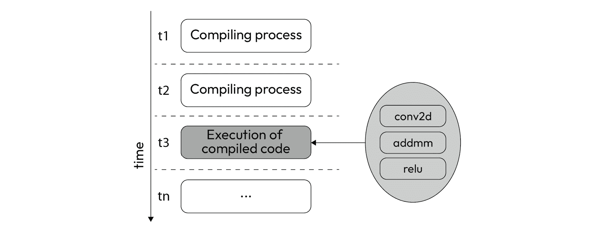
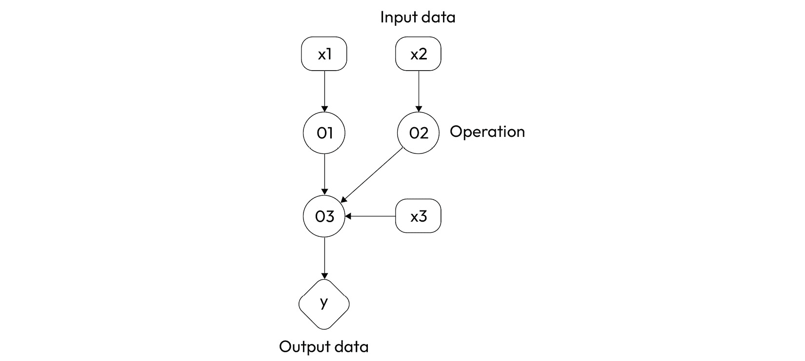
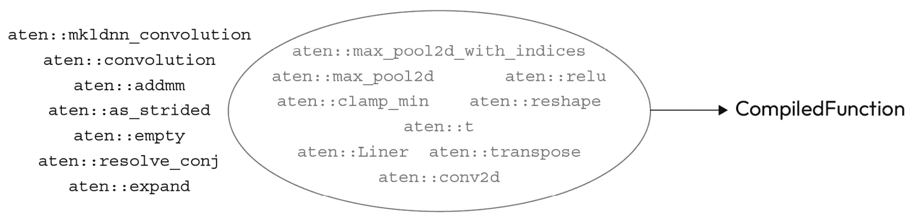
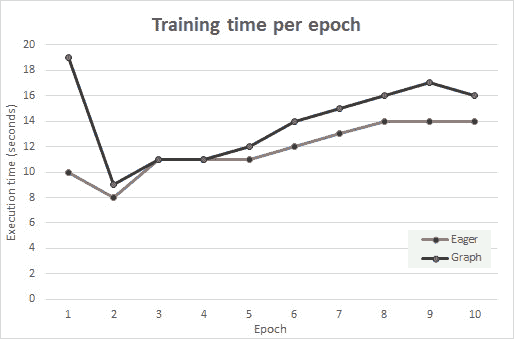
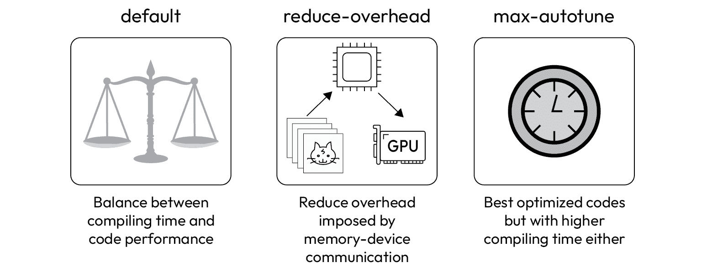
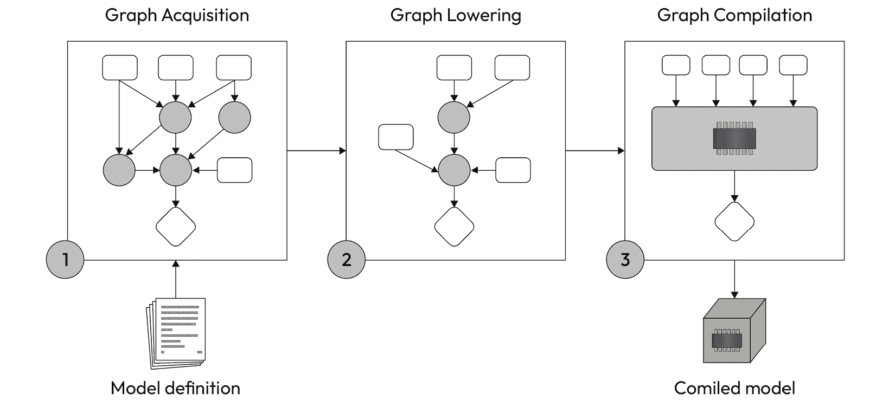
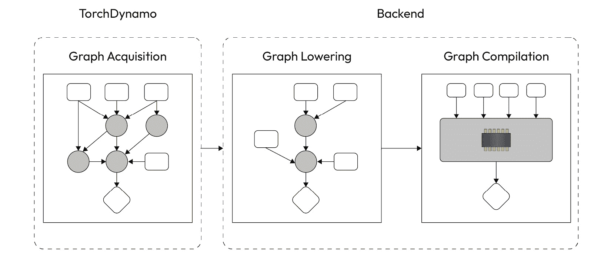

# 第三章：编译模型

引用一位著名的演讲者的话：“现在是时候了！”在完成我们朝性能改进迈出的初步步骤后，是时候学习 PyTorch 2.0 的新功能，以加速深度学习模型的训练和推断。

我们正在讨论在 PyTorch 2.0 中作为这个新版本最激动人心的功能之一呈现的 Compile API。在本章中，我们将学习如何使用这个 API 构建更快的模型，以优化其训练阶段的执行。

以下是本章的学习内容：

+   图模式比热切模式的好处

+   如何使用 API 编译模型

+   API 使用的组件、工作流程和后端

# 技术要求

你可以在本书的 GitHub 代码库中找到本章提到的所有示例的完整代码，链接为 [`github.com/PacktPublishing/Accelerate-Model-Training-with-PyTorch-2.X/blob/main`](https://github.com/PacktPublishing/Accelerate-Model-Training-with-PyTorch-2.X/blob/main)。

您可以访问您喜爱的环境来执行这个笔记本，比如 Google Collab 或者 Kaggle。

# 您所说的编译是什么意思？

作为程序员，您会立即将“编译”这个术语分配给从源代码构建程序或应用的过程。尽管完整的构建过程包括生成汇编代码并将其链接到库和其他对象等额外阶段，但这种思考方式是合理的。然而，乍一看，在这本书的上下文中考虑编译过程可能会有点令人困惑，因为我们讨论的是 Python。毕竟，Python 不是一种编译语言；它是一种解释语言，因此不涉及编译。

注意

需要澄清的是，Python 函数为了性能目的而使用编译过的函数，尽管它主要是一种解释语言。

那么，编译模型的含义是什么？在回答这个问题之前，我们必须理解机器学习框架的两种执行模式。接下来请跟我来到下一节。

## 执行模式

本质上，机器学习框架有两种不同的执行模式。在**热切模式**下，每个操作都按照代码中出现的顺序执行，这正是我们期望在解释语言中看到的。解释器 – 在这种情况下是 Python – 一旦操作出现，就立即执行操作。因此，在执行操作时没有评估接下来会发生什么：


图 3.1 – 热切执行模式

如*图 3**.1*所示，解释器在 t1、t2 和 t3 的瞬间依次执行这三个操作。术语“热切”表示在进行下一步之前立即执行事务而不停顿评估整个情景。

除了急切模式外，还有一种名为**图模式**的方法，类似于传统的编译过程。图模式评估完整的操作集以寻找优化机会。为了执行此过程，程序必须整体评估任务，如*图 3**.2*所示：



图 3.2 - 图执行模式

*图 3**.2*显示程序使用 t1 和 t2 执行编译过程，而不是像之前那样急切地运行操作。一组操作只在 t3 时执行编译后的代码。

术语“图”指的是由此执行模式创建的有向图，用于表示任务的操作和操作数。由于此图表示任务的处理流程，执行模式评估此表示以查找融合、压缩和优化操作的方法。

例如，考虑*图 3**.3*中的案例，该图表示由三个操作组成的任务。Op1 和 Op2 分别接收操作数 I1 和 I2。这些计算的结果作为 Op3 的输入，与操作数 I3 一起输出结果 O1：



图 3.3 - 表示在有向图中的操作示例

在评估了这个图表之后，程序可以决定将所有三个操作融合到一个编译后的代码中。如*图 3**.4*所示，这段代码接收三个操作数并输出一个值 O1：


图 3.4 - 编译操作示例

除了融合和减少操作外，编译模型 - 图模式的结果 - 可以专门针对某些硬件架构进行创建，以利用设备提供的所有资源和功能。这也是图模式比急切模式表现更好的原因之一。

和生活中的一切一样，每种模式都有其优点和缺点。简而言之，急切模式更容易理解和调试，并且在开始运行操作时没有任何延迟。另一方面，图模式执行速度更快，尽管更复杂，需要额外的初始时间来创建编译后的代码。

## 模型编译

现在您已经了解了急切模式和图模式，我们可以回到本节开头提出的问题：编译模型的含义是什么？

编译模型意味着*将前向和后向阶段的执行模式从急切模式改变为图模式*。在执行此操作时，机器学习框架提前评估所有涉及这些阶段的操作和操作数，以将它们编译成单一的代码片段。因此，请注意，当我们使用术语“编译模型”时，我们指的是编译在前向和后向阶段执行的处理流程。

但为什么我们要这样做呢？我们编译模型是为了加速其训练时间，因为编译后的代码往往比在急切模式下执行的代码**运行速度更快**。正如我们将在接下来的几节中看到的，性能提升取决于各种因素，如用于训练模型的 GPU 的计算能力。

然而需要注意的是，并非所有硬件平台和模型都能保证性能提升。在许多情况下，由于需要额外的编译时间，图模式的性能可能与急切模式相同甚至更差。尽管如此，我们应始终考虑编译模型以验证最终的性能提升，尤其是在使用新型 GPU 设备时。

此时，你可能会想知道 PyTorch 支持哪种执行模式。PyTorch 的默认执行模式是急切模式，因为它“更易于使用并且更适合机器学习研究人员”，正如 PyTorch 网站上所述。然而，PyTorch 也支持图模式！在 2.0 版本之后，PyTorch 通过**编译 API**本地支持图执行模式。

在这个新版本之前，我们需要使用第三方工具和库来启用 PyTorch 上的图模式。然而，随着编译 API 的推出，现在我们可以轻松地编译模型。让我们学习如何使用这个 API 来加速我们模型的训练阶段。

# 使用 Compile API

我们将从将 Compile API 应用于我们广为人知的 CNN 模型和 Fashion-MNIST 数据集的基本用法开始学习。之后，我们将加速一个更重的用于分类 CIFAR-10 数据集中图像的模型。

## 基本用法

不是描述 API 的组件并解释一堆可选参数，我们来看一个简单的例子，展示这个能力的基本用法。以下代码片段使用 Compile API 来编译在前几章中介绍的 CNN 模型：

```py
model = CNN()graph_model = torch.compile(model)
```

注意

此部分展示的完整代码可在[`github.com/PacktPublishing/Accelerate-Model-Training-with-PyTorch-2.X/blob/main/code/chapter03/cnn-graph_mode.ipynb`](https://github.com/PacktPublishing/Accelerate-Model-Training-with-PyTorch-2.X/blob/main/code/chapter03/cnn-graph_mode.ipynb)处获取。

要编译一个模型，我们需要调用一个名为`compile`的函数，并将模型作为参数传递进去。对于这个 API 的基本用法，没有其他必要的内容了。`compile`函数返回一个对象，在第一次调用时将被编译。其余代码保持和以前完全一样。

我们可以设置以下环境变量来查看编译过程是否发生：

```py
import osos.environ['TORCH_COMPILE_DEBUG'] = "1"
```

如果是这样，我们将会看到很多消息，如下所示：

```py
[INFO] Step 1: torchdynamo start tracing forward[DEBUG] TRACE LOAD_FAST self []
[DEBUG] TRACE LOAD_ATTR layer1 [NNModuleVariable()]
[DEBUG] TRACE LOAD_FAST x [NNModuleVariable()]
[DEBUG] TRACE CALL_FUNCTION 1 [NNModuleVariable(), TensorVariable()]
```

另一种验证我们成功编译模型的方法是使用 PyTorch Profiler API 来分析前向阶段：

```py
from torch.profiler import profile, ProfilerActivityactivities = [ProfilerActivity.CPU]
prof = profile(activities=activities)
input_sample, _ = next(iter(train_loader))
prof.start()
model(input_sample)
prof.stop()
print(prof.key_averages().table(sort_by="self_cpu_time_total", 
                                row_limit=10))
```

如果模型成功编译，分析结果将显示一个标记为`CompiledFunction`的任务，如以下输出的第一行所示：

```py
CompiledFunction: 55.50%aten::mkldnn_convolution: 30.36%
aten::addmm: 8.25%
aten::convolution: 1.06%
aten::as_strided: 0.63%
aten::empty_strided: 0.59%
aten::empty: 0.43%
aten::expand: 0.27%
aten::resolve_conj: 0.20%
detach: 0.20%
aten::detach: 0.16%
```

前述输出显示，`CompiledFunction`和`aten::mkldnn_convolution`几乎占据了执行前向阶段所需时间的 86%。如果我们在急切模式下分析模型，可以轻松识别哪些操作已被融合并转换为`CompiledFunction`。

```py
aten::mkldnn_convolution: 38.87%aten::max_pool2d_with_indices: 27.31%
aten::addmm: 17.89%
aten::clamp_min: 6.63%
aten::convolution: 1.88%
aten::relu: 0.87%
aten::conv2d: 0.83%
aten::reshape: 0.57%
aten::empty: 0.52%
aten::max_pool2d: 0.52%
aten::linear: 0.44%
aten::t: 0.44%
aten::transpose: 0.31%
aten::expand: 0.26%
aten::as_strided: 0.13%
aten::resolve_conj: 0.00%
```

通过评估急切和图模式的分析输出，我们可以看到编译过程将九个操作融合到`CompiledFunction`操作中，如*图 3**.5*所示。正如本例所示，编译过程无法编译所有涉及前向阶段的操作。这是由于诸如数据依赖等多种原因造成的：



图 3.5 – 编译函数中包含的一组操作

您可能会对性能改进感到好奇。毕竟，这就是我们来的目的！您还记得我们在本章开头讨论的并非在所有情况下都能实现性能改进的内容吗？嗯，这就是其中之一。

*图 3**.6*显示了在急切模式和图模式下运行的 CNN 模型每个训练时期的执行时间。正如我们所见，所有时期的执行时间在图模式下都比急切模式高。此外，图模式的第一个时期明显比其他时期慢，因为在那一刻执行了编译过程：



图 3.6 – 急切模式和图模式下 CNN 模型每个训练时期的执行时间

急切和图模式下模型训练的总时间分别为 118 和 140 秒。因此，编译模型比默认执行模式慢了 18%。

令人沮丧，对吧？是的，确实如此。然而，请记住我们的 CNN 只是一个玩具模型，因此真正改善性能的空间并不大。此外，这些实验是在非 GPU 环境中执行的，尽管编译过程往往在 GPU 设备上能够产生更好的结果。

话虽如此，让我们进入下一节，看看通过编译 API 实现显著的性能改进。

## 给我一个真正的挑战——训练一个更重的模型！

为了看到这种能力的全部效果，我们将其应用于一个更复杂的案例。我们这次的实验对象是`torchvision`模块。

注意

本节中显示的完整代码可在 [`github.com/PacktPublishing/Accelerate-Model-Training-with-PyTorch-2.X/blob/main/code/chapter03/densenet121_cifar10.ipynb`](https://github.com/PacktPublishing/Accelerate-Model-Training-with-PyTorch-2.X/blob/main/code/chapter03/densenet121_cifar10.ipynb) 获取。

CIFAR-10 是一个经典的图像分类数据集，包含 60,000 张大小为 32x32 的彩色图像。这些图像属于 10 个不同的类别，这也解释了数据集名称中的后缀“10”。

尽管每个数据集图像的尺寸为 32x32，但将它们调整大小以在模型训练中取得更好的结果是一种好方法。因此，我们将每个图像调整为 224x224，但保留原始的三个通道以表示 RGB 颜色编码。

我们使用以下超参数在 DenseNet121 模型上进行了这个实验：

+   **Batch** **size**：64

+   **Epochs**：50

+   **Learning** **rate**：0.0001

+   **Weight** **decay**：0.005

+   **Criterion**：交叉熵

+   **Optimizer**：Adam

与以前在 CNN 模型上进行的实验不同，这次测试是在具有新型 Nvidia A100 GPU 的环境中执行的。该 GPU 的计算能力等于 8.0，满足了 PyTorch 要求的利用编译 API 获得更好结果的条件。

注意

计算能力是 NVIDIA 分配给其 GPU 的评分。计算能力越高，GPU 提供的计算能力就越高。PyTorch 的官方文档表示，编译 API 在具有等于或高于 8.0 的计算能力的 GPU 上产生更好的结果。

以下代码片段显示了如何加载和启用 DenseNet121 模型进行训练：

```py
from torchvision import modelsdevice = "cuda"
weights = models.DenseNet121_Weights.DEFAULT
net = models.densenet121(weights=weights)
net.to(device)
net.train()
```

在这种情况下，使用编译 API 的用法几乎与之前一样，只有编译行中有一个轻微的变化：

```py
model = torch.compile(net, mode="reduce-overhead")
```

正如您所见，我们调用的是与前一个例子中使用的不同的编译模式。我们在**CNNxFashion-MNIST**案例中没有使用“mode”参数，因此编译函数采用了默认的编译模式。编译模式改变了整个工作流的行为，使我们能够调整生成的代码，以使其适应特定的情景或需求。

*图 3**.7*显示了三种可能的编译模式：



图 3.7 - 编译模式

这是一个详细解释：

+   `default`：在编译时间和模型性能之间取得平衡。顾名思义，这是该函数的默认编译模式。在许多情况下，此选项可能提供良好的结果。

+   `reduce-overhead`：这适用于小批量 - 这是我们目前的情况。此模式减少了将批量样本加载到内存并在计算设备上执行前向和后向阶段的开销。

+   `max-autotune`：可能的最优化代码。编译器需要尽可能多的时间来生成在目标机器或设备上运行的最佳优化代码。因此，与其他模式相比，编译模型所需的时间较长，这可能在许多实际情况下使此选项不可行。即便如此，该模式仍然对实验目的很有趣，因为我们可以评估并理解使该模型比使用默认和 reduce-overhead 模式生成的其他模型更好的特征。

在运行热切和已编译模型的训练阶段后，我们得到了列在*表 3.1*中的结果：

|  | **Eager 模型** | **已编译模型** |
| --- | --- | --- |
| **总体训练时间（s）** | 2,264 | 1,443 |
| **第一轮执行时间 (s)** | 47 | 146 |
| **中位数轮次执行时间 (s)** | 45 | 26 |
| **准确率 (%)** | 74.26 | 74.38 |

表 3.1 – 急切和编译模型训练结果

结果显示，我们训练编译模型比其急切版本快了 57%。预期地，第一轮执行编译版本花费的时间要比急切模式多得多，因为编译过程是在那时进行的。另一方面，剩余轮次的执行时间中位数从 45 降至 26，大约快了 1.73 倍。请注意，我们在不牺牲模型质量的情况下获得了这种性能改进，因为两个模型都达到了相同的准确率。

编译 API 将 DenseNet121xCIFAR-10 案例的训练阶段加速了近 60%。但为什么这种能力不能同样适用于 CNNxFashion-MNIST 示例呢？实质上，答案在于两个问题：计算负担和计算资源。让我们逐一来看：

+   **计算负担**: DenseNet121 模型有 7,978,856 个参数。与我们的 CNN 模型的 1,630,090 个权重相比，前者几乎是后者的四倍。此外，CIFAR-10 数据集的一个调整大小样本的维度为 244x244x3，远高于 Fashion-MNIST 样本的维度。正如在 *第一章* 中讨论的那样，拆解训练过程中的模型复杂性直接与训练阶段的计算负担有关。有了如此高的计算负担，我们有更多加速训练阶段的机会。否则，这就像从光亮表面上除去一粒灰尘一样；没有什么可做的。

+   **计算资源**: 我们在 CPU 环境中执行了之前的实验。然而，正如 PyTorch 官方文档所述，当在 GPU 设备上执行时，Compile API 倾向于在具有高于 8.0 的计算能力的 GPU 设备上提供更好的结果。这正是我们在 DenseNet121xCIFAR-10 案例中所做的，即训练过程在 GPU Nvidia A100 上执行。

简而言之，当使用 A100 训练 DenseNet121xCIFAR-10 案例时，计算负担与计算资源完美匹配。这种良好的匹配是通过编译 API 改善性能的关键。

现在，您已经确信将这一资源纳入性能加速工具包是一个好主意，让我们来了解编译 API 在幕后是如何工作的。

# 编译 API 在幕后是如何工作的？

编译 API 恰如其名：它是访问 PyTorch 提供的一组功能的入口，用于从急切执行模式转换为图执行模式。除了中间组件和流程之外，我们还有编译器，它是负责完成最终工作的实体。有半打编译器可用，每个都专门用于为特定架构或设备生成优化代码。

以下部分描述了编译过程中涉及的步骤以及使所有这些成为可能的组件。

## 编译工作流程和组件

到此为止，我们可以想象，编译过程比在我们的代码中调用一条单行要复杂得多。为了将急切模型转换为编译模型，编译 API 执行三个步骤，即图获取、图降低和图编译，如*图 3.8*所示：



图 3.8 – 编译工作流程

让我们讨论每个步骤：

1.  **图获取**：编译工作流程的第一步，图获取负责捕获模型定义，并将其转换为在前向和反向阶段执行的原始操作的代表性图形。

1.  **图降低**：拥有图形表示后，现在是时候通过融合、组合和减少操作来简化和优化过程。图形越简单，执行时间就越短。

1.  **图编译**：最后一步是为给定的目标设备生成代码，例如不同供应商和架构的 CPU 和 GPU，甚至是另一种设备，如**张量处理单元（TPU）**。

PyTorch 依赖于两个主要组件来执行这些步骤。**TorchDynamo**执行图获取，而**后端编译器**执行图降低和编译，如*图 3.9*所示：



图 3.9 – 编译工作流程的组件

TorchDynamo 使用在 CPython 中实现的新功能执行图获取。这种功能称为帧评估 API，并在**PEP 523**中定义。简而言之，TorchDynamo 在 Python 字节码执行前捕获它，以创建一个表示由该函数或模型执行的操作的图形表示。

注意

**PEP**代表**Python Enhancement Proposal**。这份文档向 Python 社区介绍了新功能、相关变更以及编写 Python 代码的一般指导。

之后，TorchDynamo 调用编译器后端，它负责将图形有效地转换为可以在硬件平台上运行的代码片段。编译器后端执行编译工作流程的图降低和图编译步骤。我们将在下一小节更详细地介绍这个组件。

## 后端

Compile API 支持使用半打后端编译器。 PyTorch 的默认后端编译器是**TorchInductor**，它通过 OpenMP 框架和 Triton 编译器分别为 CPU 和 GPU 生成优化代码。

注意

本节中显示的完整代码可在[`github.com/PacktPublishing/Accelerate-Model-Training-with-PyTorch-2.X/blob/main/code/chapter03/backends.ipynb`](https://github.com/PacktPublishing/Accelerate-Model-Training-with-PyTorch-2.X/blob/main/code/chapter03/backends.ipynb)找到。

要指定编译器后端，我们必须在`torch.compile`函数中设置参数 backend。如果该参数被省略，Compile API 将使用 TorchInductor。以下一行选择`cudagraphs`作为编译器后端：

```py
model = torch.compile(net, backend="cudagraphs")
```

通过运行以下命令，我们可以轻松发现给定环境支持的后端：

```py
torch._dynamo.list_backends()# available backends
['aot_ts_nvfuser',
 'cudagraphs',
 'inductor',
 'ipex',
 'nvprims_nvfuser',
 'onnxrt',
 'tvm']
```

此列表显示在我们实验中使用的环境中有七个可用的后端。请注意，通过`list_backends()`返回的后端，尽管受当前 PyTorch 安装支持，但不一定准备好使用。这是因为一些后端可能需要额外的模块、包和库来执行。

在我们的环境中可用的七个后端中，只有三个能够及时运行。*表 3.2*显示了我们测试 DenseNet121xCIFAR-10 案例并使用`aot_ts_nvfuser`、`cudagraphs`和`inductor`进行编译时取得的结果：

|  | **aot_ts_nvfuser** | **cudagraphs** | **inductor** |
| --- | --- | --- | --- |
| **整体训练时间 (s)** | 2,474 | 2,290 | 1,407 |
| **第一个 epoch 执行时间 (s)** | 142 | 86 | 140 |
| **中位数 epoch 执行时间 (s)** | 46 | 44 | 25 |
| **准确率 (%)** | 74.68 | 77.57 | 79.90 |

表 3.2 - 不同后端编译器的结果

结果显示，TorchInductor 比其他后端效果更好，因为它使训练阶段快了 63%。尽管 TorchInductor 在这种情况和场景下呈现出最佳结果，但测试所有环境中可用的后端始终是有意义的。此外，一些后端，如`onnxrt`和`tvm`，专门用于生成适合推理的模型。

下一节提供了一些问题，帮助您巩固本章学到的内容。

# 测验时间开始！

让我们通过回答一些问题来回顾本章学到的知识。最初，请尝试回答这些问题而不参考资料。

注意

所有这些问题的答案都可以在[`github.com/PacktPublishing/Accelerate-Model-Training-with-PyTorch-2.X/blob/main/quiz/chapter03-answers.md`](https://github.com/PacktPublishing/Accelerate-Model-Training-with-PyTorch-2.X/blob/main/quiz/chapter03-answers.md)找到。

在开始本次测验之前，请记住这不是一个测试！本节旨在通过复习和巩固本章内容来补充您的学习过程。

选择以下问题的正确选项：

1.  PyTorch 的两种执行模式是什么？

    1.  水平和垂直模式。

    1.  急切和图模式。

    1.  急切和分布模式。

    1.  急切和自动模式。

1.  PyTorch 在哪种执行模式下会立即执行代码中出现的操作？

    1.  图模式。

    1.  急切模式。

    1.  分布模式。

    1.  自动模式。

1.  PyTorch 在哪种执行模式下评估完整的操作集，寻找优化机会？

    1.  图模式。

    1.  急切模式。

    1.  分布模式。

    1.  自动模式。

1.  使用 PyTorch 编译模型意味着在训练过程的哪个阶段从急切模式切换到图模式执行？

    1.  前向和优化。

    1.  前向和损失计算。

    1.  前向和后向。

    1.  前向和训练。

1.  关于在急切模式和图模式下执行第一个训练时期的时间，我们可以做出什么断言？

    1.  在急切模式和图模式下执行第一个训练时期的时间总是相同的。

    1.  在图模式下执行第一个训练时期的时间总是小于在急切模式下执行。

    1.  在图模式下执行第一个训练时期的时间可能高于在急切模式下执行。

    1.  在急切模式下执行第一个训练时期的时间可能高于在图模式下执行。

1.  编译 API 执行的编译工作流程包括哪些阶段？

    1.  图前向、图后向和图编译。

    1.  图获取、图后向和图编译。

    1.  图获取、图降低和图优化。

    1.  图获取、图降低和图编译。

1.  TorchDynamo 是 Compile API 的一个组件，执行哪个阶段？

    1.  图后向。

    1.  图获取。

    1.  图降低。

    1.  图优化。

1.  TorchInductor 是 PyTorch Compile API 的默认编译器后端。其他编译器后端是哪些？

    1.  OpenMP 和 NCCL。

    1.  OpenMP 和 Triton。

    1.  Cudagraphs 和 IPEX。

    1.  TorchDynamo 和 Cudagraphs。

现在，让我们总结本章的要点。

# 总结。

在本章中，您了解了 Compile API，这是在 PyTorch 2.0 中推出的一项新功能，用于编译模型 - 即从急切模式切换到图模式的操作模式。在某些硬件平台上，执行图模式的模型往往训练速度更快。要使用 Compile API，我们只需在原始代码中添加一行代码。因此，这是加速我们模型训练过程的简单而强大的技术。

在下一章节中，您将学习如何安装和配置特定库，如 OpenMP 和 IPEX，以加快我们模型的训练过程。
