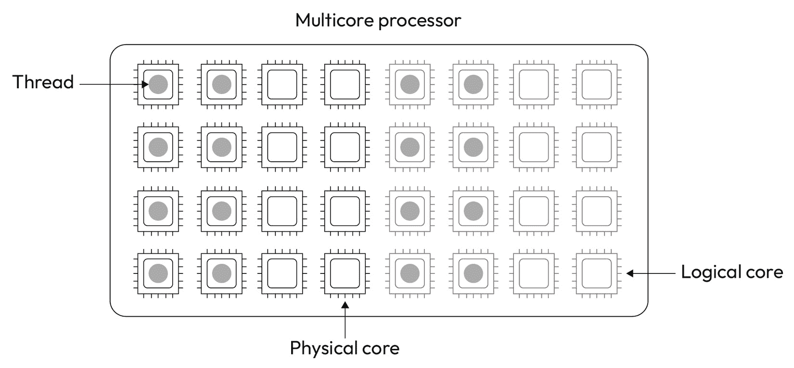

# 第四章：使用专门的库

没有人需要自己做所有的事情。PyTorch 也不例外！我们已经知道 PyTorch 是构建深度学习模型最强大的框架之一。然而，在模型构建过程中涉及许多其他任务时，PyTorch 依赖于专门的库和工具来完成工作。

在本章中，我们将学习如何安装、使用和配置库来优化基于 CPU 的训练和多线程。

比学习本章中呈现的技术细节更重要的是捕捉它所带来的信息：通过使用和配置 PyTorch 依赖的专门库，我们可以改善性能。在这方面，我们可以寻找比本书中描述的选项更多的选择。

作为本章的一部分，您将学到以下内容：

+   理解使用 OpenMP 进行多线程处理的概念

+   学习如何使用和配置 OpenMP

+   理解 IPEX – 一种用于优化在 Intel 处理器上使用 PyTorch 的 API

+   理解如何安装和使用 IPEX

# 技术要求

您可以在本书的 GitHub 存储库中找到本章提到的所有示例代码，网址为[`github.com/PacktPublishing/Accelerate-Model-Training-with-PyTorch-2.X/blob/main`](https://github.com/PacktPublishing/Accelerate-Model-Training-with-PyTorch-2.X/blob/main)。

您可以访问您喜欢的环境来执行此笔记本，例如 Google Colab 或 Kaggle。

# 使用 OpenMP 进行多线程处理

**OpenMP**是一个库，通过使用多线程技术，利用多核处理器的全部性能来并行化任务。在 PyTorch 的上下文中，OpenMP 被用于并行化在训练阶段执行的操作，以及加速与数据增强、归一化等相关的预处理任务。

多线程是这里的一个关键概念，要了解 OpenMP 是如何工作的，请跟我进入下一节来理解这项技术。

## 什么是多线程？

多线程是在多核系统中**并行化任务**的一种技术，这种系统配备有**多核处理器**。如今，任何计算系统都配备有多核处理器；智能手机、笔记本电脑甚至电视都配备了具有多个处理核心的 CPU。

举个例子，让我们看看我现在用来写这本书的笔记本。我的笔记本配备了一颗 Intel i5-8265U 处理器，具有八个核心，如*图 4**.1*所示：


图 4.1 – 物理核心和逻辑核心

现代处理器具有物理核心和逻辑核心。**物理核心**是完整的独立处理单元，能够执行任何计算。**逻辑核心**是从物理核心的空闲资源实例化出来的处理实体。因此，物理核心比逻辑核心提供更好的性能。因此，我们应该始终优先使用物理单元而不是逻辑单元。

尽管如此，从操作系统的角度来看，物理核心和逻辑核心没有区别（即，操作系统看到的核心总数，无论它们是物理还是逻辑的）。

重要提示

提供逻辑核心的技术称为**同时多线程**。每个厂商对于这项技术都有自己的商业名称。例如，Intel 称其为**超线程**。关于这个主题的详细信息超出了本书的范围。

我们可以使用 Linux 的`lscpu`命令来检查处理器的详细信息：

```py
[root@laptop] lscpuArchitecture: x86_64
  CPU op-mode(s): 32-bit, 64-bit
  Address sizes: 39 bits physical, 48 bits virtual
  Byte Order: Little Endian
CPU(s): 8
  On-line CPU(s) list: 0-7
Vendor ID: GenuineIntel
  BIOS Vendor ID: Intel(R) Corporation
  Model name: Intel(R) Core(TM) i5-8265U CPU @ 1.60GHz
    BIOS CPU family: 205
    CPU family: 6
    Model: 142
    Thread(s) per core: 2
    Core(s) per socket: 4
    Socket(s): 1
    Stepping: 12
    CPU(s) scaling MHz:  79%
    CPU max MHz: 3900,0000
    CPU min MHz: 400,0000
    BogoMIPS: 3600.00
```

输出显示有关处理器的大量信息，例如核心数、插槽数、频率、架构、厂商名称等等。让我们检查与我们案例最相关的字段：

+   **CPU(s)**：系统上可用的物理和逻辑核心总数。“CPU”在这里被用作“核心”的同义词。

+   **在线 CPU(s)列表**：系统上可用核心的识别。

+   `1`。

+   `1`，系统只有物理核心。否则，系统既有物理核心又有逻辑核心。

+   **每个插槽核心数**：每个多核处理器上可用的物理核心数量。

重要提示

我们可以使用`lscpu`命令获取运行硬件上可用的物理核心和逻辑核心数量。正如您将在接下来的部分中看到的那样，这些信息对于优化 OpenMP 的使用至关重要。

现代服务器拥有数百个核心。面对如此强大的计算能力，我们必须找到一种合理利用的方法。这就是多线程发挥作用的地方！

**多线程**技术涉及创建和控制一组线程来协作并完成给定任务。这些线程分布在处理器核心上，使得运行程序可以使用不同的核心来处理计算任务的不同部分。因此，多个核心同时处理同一任务以加速其完成。

**线程**是由进程创建的操作系统实体。由给定进程创建的一组线程共享相同的内存地址空间。因此，线程之间的通信比进程容易得多；它们只需读取或写入某个内存地址的内容。另一方面，进程必须依靠更复杂的方法，如消息交换、信号、队列等等。这就是为什么我们更倾向于使用线程来并行化任务而不是进程的原因：


图 4.2 – 线程和进程

然而，使用线程的好处是有代价的：我们必须小心我们的线程。由于线程通过共享内存进行通信，当多个线程试图在同一内存区域上写入时，它们可能会遇到竞争条件。此外，程序员必须保持线程同步，以防止一个线程无限期地等待另一个线程的某个结果或操作。

重要提示

如果线程和进程的概念对您来说很新，请先观看 YouTube 上的以下视频，然后再继续下一节：[`youtu.be/Dhf-DYO1K78`](https://youtu.be/Dhf-DYO1K78)。如果您需要更深入的资料，可以阅读 Roderick Bauer 撰写的文章，链接在[`medium.com/@rodbauer/understanding-programs-processes-and-threads-fd9fdede4d88`](https://medium.com/@rodbauer/understanding-programs-processes-and-threads-fd9fdede4d88)。

简而言之，手动编写线程（即自行编写）是一项艰苦的工作。然而，幸运的是，有 OpenMP 在这里帮忙。因此，让我们学习如何与 PyTorch 一起使用它，加速我们的机器学习模型训练阶段。

## 使用和配置 OpenMP

OpenMP 是一个能够封装和抽象许多与编写多线程程序相关的缺点的框架。通过这个框架，我们可以通过一组函数和原语并行化我们的顺序代码。在谈论多线程时，OpenMP 是事实上的标准。这也解释了为什么 PyTorch 将 OpenMP 作为默认的后端来并行化任务。

严格来说，我们不需要更改 PyTorch 的代码就可以使用 OpenMP。尽管如此，有一些配置技巧可以提高训练过程的性能。让我们在实践中看看！

重要提示

此部分中显示的完整代码可在[`github.com/PacktPublishing/Accelerate-Model-Training-with-PyTorch-2.X/blob/main/code/chapter04/baseline-cnn_cifar10.ipynb`](https://github.com/PacktPublishing/Accelerate-Model-Training-with-PyTorch-2.X/blob/main/code/chapter04/baseline-cnn_cifar10.ipynb)和[`github.com/PacktPublishing/Accelerate-Model-Training-with-PyTorch-2.X/blob/main/code/chapter04/gomp-cnn_cifar10.ipynb`](https://github.com/PacktPublishing/Accelerate-Model-Training-with-PyTorch-2.X/blob/main/code/chapter04/gomp-cnn_cifar10.ipynb)处查看。

首先，我们将运行与《第二章》*Chapter 2*中相同的代码，*更快地训练模型*，以使用 CIFAR-10 数据集训练 CNN 模型。环境配置有 GNU OpenMP 4.5，并且拥有一个总共 32 个核心的 Intel 处理器，一半是物理核心，一半是逻辑核心。

要检查当前环境中使用的 OpenMP 版本和线程数，我们可以执行`torch.__config__.parallel_info()`函数：

```py
ATen/Parallel:    at::get_num_threads() : 16
    at::get_num_interop_threads() : 16
OpenMP 201511 (a.k.a. OpenMP 4.5)
    omp_get_max_threads() : 16
Intel(R) oneAPI Math Kernel Library Version 2022.2
    mkl_get_max_threads() : 16
Intel(R) MKL-DNN v2.7.3
std::thread::hardware_concurrency() : 32
Environment variables:
    OMP_NUM_THREADS : [not set]
    MKL_NUM_THREADS : [not set]
ATen parallel backend: OpenMP
```

输出的最后一行确认了 OpenMP 是配置在环境中的并行后端。我们还可以看到它是 OpenMP 版本 4.5，以及设置的线程数和为两个环境变量配置的值。`hardware_concurrency()`字段显示了一个值为`32`，表明环境能够运行多达 32 个线程，因为系统最多有 32 个核心。

此外，输出提供了关于`get_num_threads()`字段的信息，这是 OpenMP 使用的线程数。OpenMP 的默认行为是使用与物理核心数量相等的线程数。因此，在这种情况下，默认线程数为 16。

训练阶段花费 178 秒来运行 10 个 epochs。在训练过程中，我们可以使用`htop`命令验证 OpenMP 如何将线程绑定到核心。在我们的实验中，PyTorch/OpenMP 进行了一种配置，如*图 4**.3*所描述的。



图 4.3 – 默认的 OpenMP 线程分配

OpenMP 将这组 16 个线程分配给了 8 个物理核心和 8 个逻辑核心。如前一节所述，物理核心比逻辑核心提供了更好的性能。即使有物理核心可用，OpenMP 也使用了逻辑核心来执行 PyTorch 线程的一半。

乍一看，即使有物理核心可用，决定使用逻辑核心也可能听起来很愚蠢。然而，我们应该记住，处理器是整个计算系统使用的 – 也就是说，它们用于除我们的训练过程之外的其他任务。因此，操作系统与 OpenMP 应该尽量对所有的需求任务公平 – 也就是说，它们也应该提供使用物理核心的机会。

尽管 OpenMP 的默认行为如此，我们可以设置一对环境变量来改变 OpenMP 分配、控制和管理线程的方式。下面的代码片段附加到我们的 CNN/CIFAR-10 代码的开头，修改了 OpenMP 操作以提高性能：

```py
os.environ['OMP_NUM_THREADS'] = "16"os.environ['OMP_PROC_BIND'] = "TRUE"
os.environ['OMP_SCHEDULE'] = "STATIC"
os.environ['GOMP_CPU_AFFINITY'] = "0-15"
```

这些行直接从 Python 代码设置了四个环境变量。在解释这些变量的含义之前，让我们先看看它们所提供的性能改进。

使用 CIFAR-10 数据集训练 CNN 模型的时间从 178 秒减少到 114 秒，显示出 56%的性能提升！在代码中没有其他更改！在这个执行过程中，OpenMP 创建了一个线程分配，如*图 4**.4*所描述的。


图 4.4 – 优化的 OpenMP 线程分配

正如您在*图 4**.4*中所见，OpenMP 使用了所有 16 个物理核心，但未使用逻辑核心。我们可以说，将线程绑定到物理核心是性能增加的主要原因。

让我们详细分析在这个实验中配置的环境变量集合，以了解它们如何有助于改进我们训练过程的性能：

+   `OMP_NUM_THREADS`：这定义了 OpenMP 使用的线程数。我们将线程数设置为 `16`，这与 OpenMP 默认设置的值完全相同。虽然此配置未在我们的场景中带来任何变化，但了解这个选项以控制 OpenMP 使用的线程数是至关重要的。特别是在同一服务器上同时运行多个训练过程时。

+   `OMP_PROC_BIND`：这确定了线程亲和性策略。当设置为`TRUE`时，这个配置告诉 OpenMP 在整个执行过程中保持线程在同一个核心上运行。这种配置防止线程从核心中移动，从而最小化性能问题，比如缓存未命中。

+   `OMP_SCHEDULE`：这定义了调度策略。因为我们希望静态地将线程绑定到核心，所以应将此变量设置为静态策略。

+   `GOMP_CPU_AFFINITY`：这指示 OpenMP 用于执行线程的核心或处理器。为了只使用物理核心，我们应指定与系统中物理核心对应的处理器标识。

这些变量的组合极大加速了我们 CNN 模型的训练过程。简而言之，我们强制 OpenMP 仅使用物理核心，并保持线程在最初分配的同一个核心上运行。因此，我们利用了所有物理核心的计算能力，同时最小化由频繁上下文切换引起的性能问题。

重要说明

本质上，当操作系统决定中断一个进程的执行以给另一个进程使用 CPU 的机会时，上下文切换就会发生。

OpenMP 除了本章介绍的变量外，还有几个变量来控制其行为。为了检查当前的 OpenMP 配置，我们可以在运行 PyTorch 代码时将 `OMP_DISPLAY_ENV` 环境变量设置为 `TRUE`：

```py
OPENMP DISPLAY ENVIRONMENT BEGIN  _OPENMP = '201511'
  OMP_DYNAMIC = 'FALSE'
  OMP_NESTED = 'FALSE'
  OMP_NUM_THREADS = '16'
  OMP_SCHEDULE = 'STATIC'
  OMP_PROC_BIND = 'TRUE'
  OMP_PLACES = '{0},{1},{2},{3},{4},{5},{6},{7},{8},{9},{10},{11},{12}
                ,{13},{14},{15}'
  OMP_STACKSIZE = '36668818'
  OMP_WAIT_POLICY = 'PASSIVE'
  OMP_THREAD_LIMIT = '4294967295'
  OMP_MAX_ACTIVE_LEVELS = '2147483647'
  OMP_CANCELLATION = 'FALSE'
  OMP_DEFAULT_DEVICE = '0'
  OMP_MAX_TASK_PRIORITY = '0'
OPENMP DISPLAY ENVIRONMENT END
```

学习每个环境变量如何改变 OpenMP 的操作是非常有趣的；因此，我们可以针对特定场景进行微调。这个输出也有助于验证环境变量的更改是否确实生效。

本节描述的实验使用了 GNU OpenMP，因为它是 PyTorch 采用的默认并行后端。然而，由于 OpenMP 实际上是一个框架，除了 GNU 提供的实现外，我们还有其他的 OpenMP 实现。其中一个实现是 Intel OpenMP，适用于 Intel 处理器环境。

然而，Intel OpenMP 是否带来了显著的改进？是否值得用它来取代 GNU 实现？请在下一节中自行查看！

## 使用和配置 Intel OpenMP

Intel 有自己的 OpenMP 实现，在 Intel 基础环境中承诺提供更好的性能。由于 PyTorch 默认使用 GNU 实现，我们需要采取三个步骤来使用 Intel OpenMP 替代 GNU 版本：

1.  安装 Intel OpenMP。

1.  加载 Intel OpenMP 库。

1.  设置特定于 Intel OpenMP 的环境变量。

重要提示

此部分展示的完整代码可在[`github.com/PacktPublishing/Accelerate-Model-Training-with-PyTorch-2.X/blob/main/code/chapter04/iomp-cnn_cifar10.ipynb`](https://github.com/PacktPublishing/Accelerate-Model-Training-with-PyTorch-2.X/blob/main/code/chapter04/iomp-cnn_cifar10.ipynb)找到。

第一步是最简单的一步。考虑到基于 Anaconda 或支持 PIP 的 Python 环境时，我们只需执行以下其中一个命令来安装 Intel OpenMP：

```py
pip install intel-openmpconda install intel-openmp
```

安装完成后，我们应优先加载 Intel OpenMP 库，而不是使用 GNU。否则，即使在系统上安装了 Intel OpenMP，PyTorch 仍将继续使用默认 OpenMP 安装的库。

重要提示

如果我们不使用 PIP 或基于 Anaconda 的环境，我们可以自行安装它。这个过程需要编译 Intel OpenMP，然后在环境中进一步安装它。

我们通过在运行代码之前设置`LD_PRELOAD`环境变量来执行此配置：

```py
export LD_PRELOAD=/opt/conda/lib/libiomp5.so:$LD_PRELOAD
```

在这些实验所使用的环境中，Intel OpenMP 库位于`/opt/conda/lib/libiomp5.so`。`LD_PRELOAD`环境变量允许在默认加载配置之前强制操作系统加载库。

最后，我们需要设置一些与 Intel OpenMP 相关的环境变量：

```py
import osos.environ['OMP_NUM_THREADS'] = "16"
os.environ['KMP_AFFINITY'] = "granularity=fine,compact,1,0"
os.environ['KMP_BLOCKTIME'] = "0"
```

`OMP_NUM_THREADS`与 GNU 版本具有相同的含义，而`KMP_AFFINITY`和`KMP_BLOCKTIME`则是 Intel OpenMP 的独有功能：

+   `KMP_AFFINITY`: 这定义了线程的分配策略。当设置为`granularity=fine,compact,1,0`时，Intel OpenMP 会将线程绑定到物理核心，尽力在整个执行过程中保持这种方式。因此，在使用 Intel OpenMP 时，我们不需要像 GNU 实现那样传递一个物理核心列表来强制使用物理处理器。

+   `KMP_BLOCKTIME`: 这确定线程在完成任务后应等待休眠的时间。当设置为零时，线程在完成工作后立即进入休眠状态，从而最小化因等待另一个任务而浪费处理器周期。

类似于 GNU 版本，当`OMP_DISPLAY_ENV`变量设置为`TRUE`时，Intel OpenMP 也会输出当前配置（简化的输出示例）：

```py
OPENMP DISPLAY ENVIRONMENT BEGIN   _OPENMP='201611'
  [host] OMP_AFFINITY_FORMAT='OMP: pid %P tid %i thread %n bound to OS 
                              proc set {%A}'
  [host] OMP_ALLOCATOR='omp_default_mem_alloc'
  [host] OMP_CANCELLATION='FALSE'
  [host] OMP_DEBUG='disabled'
  [host] OMP_DEFAULT_DEVICE='0'
  [host] OMP_DISPLAY_AFFINITY='FALSE'
  [host] OMP_DISPLAY_ENV='TRUE'
  [host] OMP_DYNAMIC='FALSE'
  [host] OMP_MAX_ACTIVE_LEVELS='1'
  [host] OMP_MAX_TASK_PRIORITY='0'
  [host] OMP_NESTED: deprecated; max-active-levels-var=1
  [host] OMP_NUM_TEAMS='0'
  [host] OMP_NUM_THREADS='16'
OPENMP DISPLAY ENVIRONMENT END
```

为了比较 Intel OpenMP 带来的性能，我们以 GNU 实现提供的结果作为基准。使用 CIFAR-10 数据集训练 CNN 模型的时间从 114 秒减少到 102 秒，性能提升约为 11%。尽管这不如第一次实验那样令人印象深刻，但性能的提升仍然很有趣。此外，请注意，我们可以通过使用其他模型、数据集和计算环境获得更好的结果。

总结一下，使用本节中展示的配置，我们的训练过程速度快了近 1.7 倍。为了实现这种改进，并不需要修改代码；只需在环境级别直接进行配置即可。

在接下来的部分中，我们将学习如何安装和使用 Intel 提供的 API，以加速 PyTorch 在其处理器上的执行。

# 优化 Intel CPU 使用 IPEX

**IPEX** 代表 **Intel extension for PyTorch**，是由 Intel 提供的一组库和工具，用于加速机器学习模型的训练和推理。

IPEX 是 Intel 强调 PyTorch 在机器学习框架中重要性的明显标志。毕竟，Intel 在设计和维护专门为 PyTorch 创建的 API 上投入了大量精力和资源。

有趣的是，IPEX 强烈依赖于 Intel oneAPI 工具集提供的库。oneAPI 包含特定于机器学习应用的库和工具，如 oneDNN，以及加速应用程序（如 oneTBB）的其他工具。

重要提示

本节展示的完整代码可在 [`github.com/PacktPublishing/Accelerate-Model-Training-with-PyTorch-2.X/blob/main/code/chapter04/baseline-densenet121_cifar10.ipynb`](https://github.com/PacktPublishing/Accelerate-Model-Training-with-PyTorch-2.X/blob/main/code/chapter04/baseline-densenet121_cifar10.ipynb) 和 [`github.com/PacktPublishing/Accelerate-Model-Training-with-PyTorch-2.X/blob/main/code/chapter04/ipex-densenet121_cifar10.ipynb`](https://github.com/PacktPublishing/Accelerate-Model-Training-with-PyTorch-2.X/blob/main/code/chapter04/ipex-densenet121_cifar10.ipynb) 处找到。

让我们学习如何在我们的 PyTorch 代码中安装和使用 IPEX。

## 使用 IPEX

IPEX 不会默认与 PyTorch 一起安装；我们需要单独安装它。安装 IPEX 的最简单方法是使用 PIP，与我们在上一节中使用 OpenMP 的方式类似。因此，在 PIP 环境中安装 IPEX，只需执行以下命令：

```py
pip install intel_extension_for_pytorch
```

安装完 IPEX 后，我们可以继续进行 PyTorch 的默认安装。一旦 IPEX 可用，我们就可以将其整合到我们的 PyTorch 代码中。第一步是导入 IPEX 模块：

```py
import intel_extension_for_pytorch as ipex
```

使用 IPEX 非常简单。我们只需将我们的模型和优化器用 `ipex.optimize` 函数包装起来，让 IPEX 完成其余工作。`ipex.optimize` 函数返回一个经过优化的模型和优化器（如 SGD、Adam 等），用于训练模型。

为了看到 IPEX 提供的性能改进，让我们使用 DenseNet121 模型和 CIFAR-10 数据集进行测试（我们在前几章介绍过它们）。

我们的基准执行涉及使用 CIFAR-10 数据集在 10 个 epochs 上训练 DenseNet121。为了公平起见，我们使用了 Intel OpenMP，因为我们使用的是基于 Intel 的环境。但在这种情况下，我们没有改变 `KMP_BLOCKTIME` 参数。

```py
import osos.environ['OMP_NUM_THREADS'] = "16"
os.environ['KMP_AFFINITY'] = "granularity=fine,compact,1,0"
```

基准执行完成 10 个 epochs 花费了 1,318 秒，并且结果模型的准确率约为 70%。

正如之前所述，使用 IPEX 非常简单；我们只需在基准代码中添加一行代码：

```py
model, optimizer = ipex.optimize(model, optimizer=optimizer)
```

虽然 `ipex.optimize` 可以接受其他参数，但通常以这种方式调用已经足够满足我们的需求。

我们的 IPEX 代码花了 946 秒来执行 DenseNet121 模型的训练过程，性能提升了近 40%。除了在代码开头配置的环境变量和使用的那一行之外，原始代码没有进行任何其他更改。因此，IPEX 只通过一个简单的修改加速了训练过程。

乍一看，IPEX 看起来类似于我们在*第三章*中学习的 Compile API，*编译模型*。两者都需要添加一行代码并使用代码包装的概念。然而，相似之处止步于此！与 Compile API 不同，IPEX 不会编译模型；它会用自己的实现替换一些默认的 PyTorch 操作。

跟我来到下一节，了解 IPEX 的内部工作原理。

## IPEX 是如何在内部工作的？

要理解 IPEX 的内部工作原理，让我们分析基准代码，检查训练过程使用了哪些操作。以下输出显示训练过程执行的前 10 个消耗最大的操作：

```py
aten::convolution_backward: 27.01%aten::mkldnn_convolution: 12.44%
aten::native_batch_norm_backward: 8.85%
aten::native_batch_norm: 7.06%
Optimizer.step#Adam.step: 6.80%
aten::add_: 3.75%
aten::threshold_backward: 3.21%
aten::add: 2.75%
aten::mul_: 2.45%
aten::div: 2.19%
```

我们 DenseNet121 和 CIFAR-10 的基准代码执行了那些常用于卷积神经网络的操作，例如 `convolution_backward`。这一点毫不意外。

看看 IPEX 代码的分析输出，验证 IPEX 对我们基准代码做出了哪些改变：

```py
torch_ipex::convolution_backward: 32.76%torch_ipex::convolution_forward_impl: 13.22%
aten::native_batch_norm: 7.98%
aten::native_batch_norm_backward: 7.08%
aten::threshold_backward: 4.40%
aten::add_: 3.92%
torch_ipex::adam_fused_step: 3.14%
torch_ipex::cat_out_cpu: 2.39%
aten::empty: 2.18%
aten::clamp_min_: 1.48%
```

首先要注意的是某些操作上的新前缀。除了表示默认 PyTorch 操作库的 `aten` 外，我们还有 `torch_ipex` 前缀。`torch_ipex` 前缀指示了 IPEX 提供的操作。例如，基准代码使用了 `aten` 提供的 `convolution_backward` 操作，而优化后的代码则使用了 IPEX 提供的操作。

正如您所见，IPEX 并没有替换每一个操作，因为它没有所有 `aten` 操作的优化版本。这种行为是预期的，因为有些操作已经是最优化的形式。在这种情况下，试图优化已经优化的部分是没有意义的。

*图 4**.5* 总结了默认 PyTorch 代码与 IPEX 和 Compile API 优化版本之间的差异：


图 4.5 – IPEX 和 Compile API 生成的默认和优化代码之间的差异

不像编译 API，IPEX 不会创建一个庞大的编译代码块。因此，通过`ipex.optimize`执行的优化过程要快得多。另一方面，编译后的代码往往会提供更好的性能，正如我们在*第三章*中详细讨论的那样，*编译* *模型*。

重要提示

有趣的是，我们可以将 IPEX 用作编译 API 的编译后端。通过这样做，`torch.compile`函数将依赖于 IPEX 来编译模型。

正如 IPEX 展示了 Intel 在 PyTorch 上所做的重大赌注，它在不断发展并接收频繁更新。因此，使用这个工具的最新版本以获得最新的改进非常重要。

下一节提供了一些问题，帮助您记住本章节学到的内容。

# 测验时间！

让我们通过回答几个问题来回顾本章节学到的内容。首先，尝试回答这些问题，而不查阅资料。

重要提示

所有这些问题的答案都可以在[`github.com/PacktPublishing/Accelerate-Model-Training-with-PyTorch-2.X/blob/main/quiz/chapter04-answers.md`](https://github.com/PacktPublishing/Accelerate-Model-Training-with-PyTorch-2.X/blob/main/quiz/chapter04-answers.md)找到。

在开始测验之前，请记住这根本不是一次测试！本节旨在通过复习和巩固本章节涵盖的内容来补充您的学习过程。

选择以下问题的正确选项。

1.  多核系统可以具有以下两种类型的计算核心：

    1.  物理和活动。

    1.  物理和数字的。

    1.  物理和逻辑的。

    1.  物理和向量的。

1.  由同一进程创建的一组线程...

    1.  可能共享相同的内存地址空间。

    1.  不共享相同的内存地址空间。

    1.  在现代系统中是不可能的。

    1.  共享相同的内存地址空间。

1.  以下哪个环境变量可用于设置 OpenMP 使用的线程数？

    1.  `OMP_NUM_PROCS`。

    1.  `OMP_NUM_THREADS`。

    1.  `OMP_NUMBER_OF_THREADS`。

    1.  `OMP_N_THREADS`。

1.  在多核系统中，使用 OpenMP 能够提升训练过程的性能，因为它可以...

    1.  将进程分配到主内存。

    1.  将线程绑定到逻辑核心。

    1.  将线程绑定到物理核心。

    1.  避免使用缓存内存。

1.  关于通过 Intel 和 GNU 实现 OpenMP，我们可以断言...

    1.  两个版本的性能无差异。

    1.  当在 Intel 平台上运行时，Intel 版本可以优于 GNU 的实现。

    1.  当在 Intel 平台上运行时，Intel 版本从不优于 GNU 的实现。

    1.  无论硬件平台如何，GNU 版本始终比 Intel OpenMP 更快。

1.  IPEX 代表 PyTorch 的 Intel 扩展，并被定义为...

    1.  一组低级硬件指令。

    1.  一组代码示例。

    1.  一组库和工具。

    1.  一组文档。

1.  IPEX 采用什么策略来加速训练过程？

    1.  IPEX 能够使用特殊的硬件指令。

    1.  IPEX 用优化版本替换了训练过程的所有操作。

    1.  IPEX 将训练过程的所有操作融合成一个单片代码。

    1.  IPEX 用自己优化的实现替换了训练过程中的一些默认 PyTorch 操作。

1.  在我们原始的 PyTorch 代码中，为使用 IPEX 需要做哪些改变？

    1.  一点儿也不需要。

    1.  我们只需导入 IPEX 模块。

    1.  我们需要导入 IPEX 模块，并使用 `ipex.optimize()` 方法包装模型。

    1.  我们只需使用最新的 PyTorch 版本。

让我们总结一下到目前为止我们讨论过的内容。

# 总结

您了解到 PyTorch 依赖于第三方库来加速训练过程。除了理解多线程的概念外，您还学会了如何安装、配置和使用 OpenMP。此外，您还学会了如何安装和使用 IPEX，这是由英特尔开发的一组库，用于优化在基于英特尔平台上执行的 PyTorch 代码的训练过程。

OpenMP 可通过使用多线程来并行执行 PyTorch 代码以加速训练过程，而 IPEX 则有助于通过优化专为英特尔硬件编写的操作来替换默认 PyTorch 库提供的操作。

在下一章中，您将学习如何创建一个高效的数据管道，以保持 GPU 在整个训练过程中处于最佳状态。
