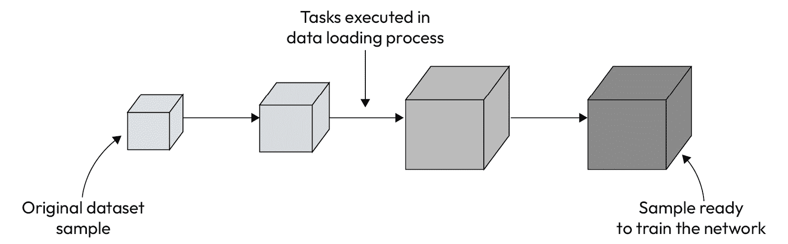
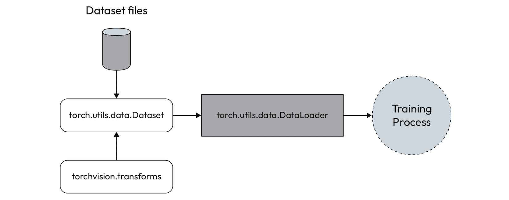
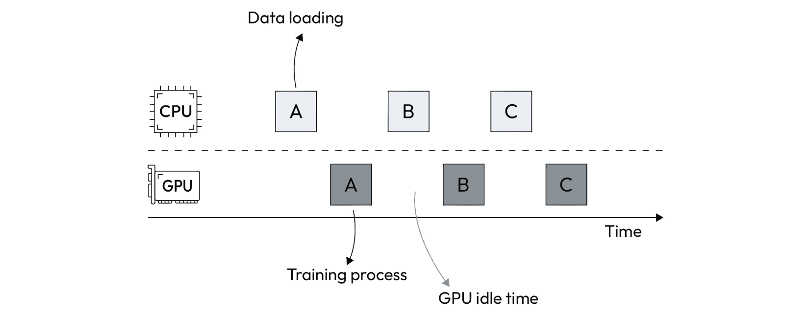
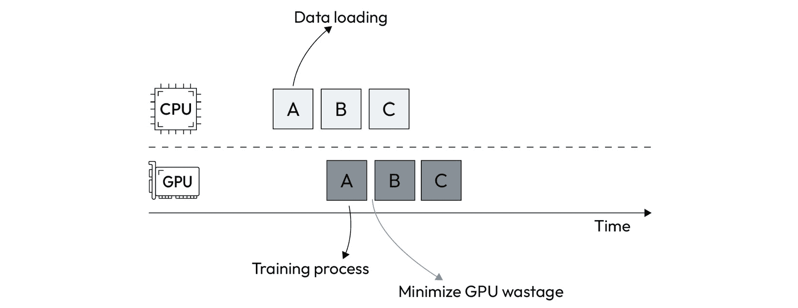
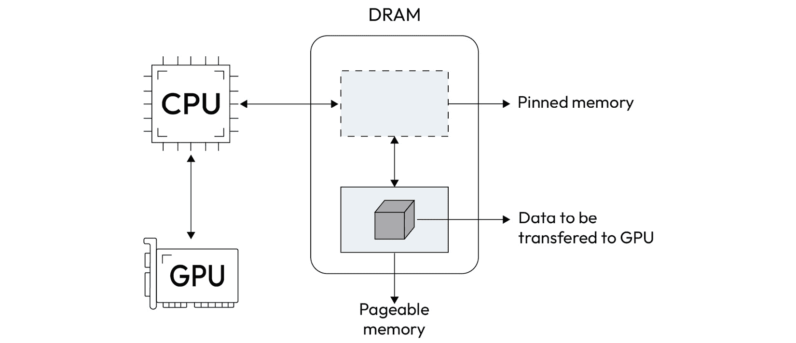
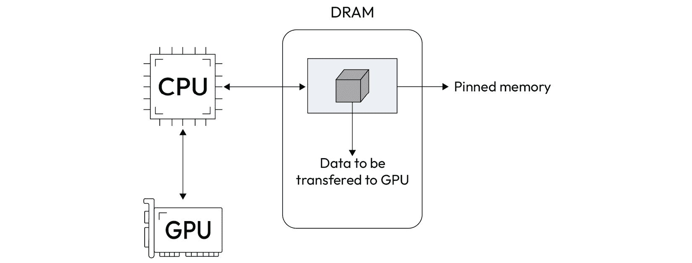
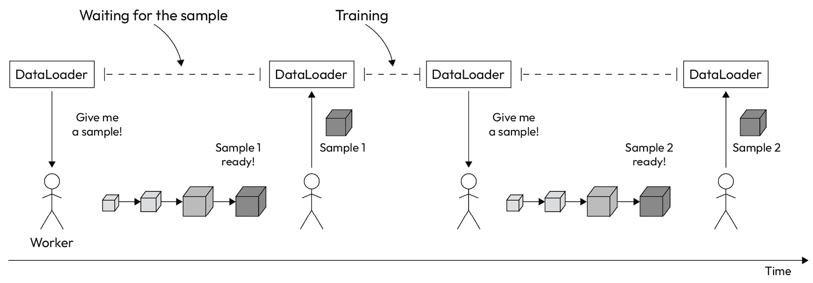
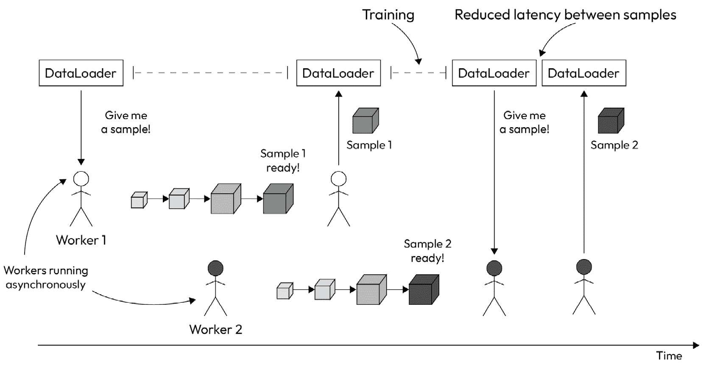

# 第五章：构建高效的数据管道

机器学习基于数据。简而言之，训练过程向神经网络提供大量数据，如图像、视频、声音和文本。因此，除了训练算法本身，数据加载是整个模型构建过程中的重要部分。

深度学习模型处理大量数据，如成千上万的图像和数百兆字节的文本序列。因此，与数据加载、准备和增强相关的任务可能会严重延迟整个训练过程。因此，为了克服模型构建过程中的潜在瓶颈，我们必须确保数据集样本顺畅地流入训练过程。

在本章中，我们将解释如何构建一个高效的数据管道，以确保训练过程的顺利运行。主要思路是防止训练过程因与数据相关的任务而停滞不前。

以下是本章的学习内容：

+   理解为何拥有高效的数据管道是必要的

+   学习如何通过内存固定来增加数据管道中的工作人员数量

+   理解如何加速数据传输过程

# 技术要求

您可以在这本书的 GitHub 仓库中找到本章提到的所有代码示例，网址为[`github.com/PacktPublishing/Accelerate-Model-Training-with-PyTorch-2.X/blob/main`](https://github.com/PacktPublishing/Accelerate-Model-Training-with-PyTorch-2.X/blob/main)。

您可以访问您喜欢的环境来执行这个笔记本，比如 Google Colab 或 Kaggle。

# 为什么我们需要一个高效的数据管道？

我们将从使您意识到拥有高效的数据管道的重要性开始本章。在接下来的几个小节中，您将了解数据管道的定义以及它如何影响训练过程的性能。

## 什么是数据管道？

正如您在*第一章*中学到的，*解构训练过程*，训练过程由四个阶段组成：前向、损失计算、优化和反向。训练算法在数据集样本上进行迭代，直到完成一个完整的周期。然而，我们在那个解释中排除了一个额外的阶段：**数据加载**。

前向阶段调用数据加载以获取数据集样本来执行训练过程。更具体地说，前向阶段在每次迭代中调用数据加载过程，以获取执行当前训练步骤所需的数据，如*图 5.1*所示：


图 5.1 – 数据加载过程

简而言之，数据加载执行三项主要任务：

1.  **加载**：此步骤涉及从磁盘读取数据并将其加载到内存中。我们可以将数据加载到主内存（DRAM）或直接加载到 GPU 内存（GRAM）。

1.  **准备**: 通常，我们在将数据用于训练过程之前需要对其进行准备，例如执行标准化和调整大小等操作。

1.  **增广**: 当数据集很小时，我们必须通过从原始样本派生新样本来增广它。否则，神经网络将无法捕捉数据中呈现的内在知识。增广任务包括旋转、镜像和翻转图像。

通常情况下，数据加载按需执行这些任务。因此，在前向阶段调用时，它开始执行所有任务，以将数据集样本传递给训练过程。然后，我们可以将整个过程看作是一个 **数据流水线**，在这个流水线中，在用于训练神经网络之前对数据进行处理。

数据流水线（在 *图 5.2* 中以图形描述）类似于工业生产线。原始数据集样本被顺序处理和转换，直到准备好供训练过程使用：



图 5.2 – 数据流水线

在许多情况下，模型质量取决于对数据集进行的转换。对于小数据集来说尤其如此——几乎是必需的增广——以及由质量低劣的图像组成的数据集。

在其他情况下，我们不需要对样本进行任何修改就能达到高度精确的模型，也许只需要改变数据格式或类似的内容。在这种情况下，数据流水线仅限于从内存或磁盘加载数据集样本并将其传递给前向阶段。

无论与数据转换、准备和转换相关的任务如何，我们都需要构建一个数据流水线来供给前向阶段。在 PyTorch 中，我们可以使用 `torch.utils.data` API 提供的组件来创建数据流水线，如我们将在下一节中看到的那样。

## 如何构建数据流水线

`torch.utils.data` API 提供了两个组件来构建数据流水线：`Dataset` 和 `DataLoader`（如 *图 5.3* 所示）。前者用于指示数据集的来源（本地文件、从互联网下载等）并定义要应用于数据集的转换集合，而后者用作从数据集获取样本的接口：



图 5.3 – DataLoader 和 Dataset 组件

在实际操作中，训练过程直接与 `DataLoader` 对话以消耗数据集样本。因此，前向阶段在每个训练步骤中向 `DataLoader` 请求数据集样本。

以下代码片段展示了 `DataLoader` 的基本用法：

```py
transform = transforms.Compose(transforms.Resize(255))dataset = datasets.CIFAR10(root=data_dir,
                           train=True,
                           download=True,
                           transform=transform)
dataloader = torch.utils.data.DataLoader(dataset, batch_size=128)
```

以下代码片段创建了一个 `DataLoader` 实例，即 `dataloader`，以批量大小为 128 提供样本。

注意

注意，在这种情况下没有直接使用 `Dataset`，因为 CIFAR-10 封装了数据集创建。

在 PyTorch 中建立数据管道的其他策略也有，但`Dataset`和`DataLoader`通常适用于大多数情况。

接下来，我们将学习一个低效的数据管道如何拖慢整个训练过程。

## 数据管道瓶颈

根据数据管道中任务的复杂性以及数据集样本的大小，数据加载可能需要一定的时间来完成。因此，我们可以控制整个构建过程的节奏。

通常情况下，数据加载在 CPU 上执行，而训练则在 GPU 上进行。由于 CPU 比 GPU 慢得多，GPU 可能会空闲，等待下一个样本以继续训练过程。数据喂养任务的复杂性越高，对训练阶段的影响越大。

如*图 5**.4*所示，数据加载使用 CPU 处理数据集样本。当样本准备好时，训练阶段使用它们来训练网络。这个过程持续执行，直到所有训练步骤完成：



图 5.4 – 由低效数据管道引起的瓶颈

尽管这个过程乍看起来还不错，但我们浪费了 GPU 的计算能力，因为它在训练步骤之间空闲。期望的行为更接近于*图 5**.5*所示：



图 5.5 – 高效数据管道

与前一场景不同，训练步骤之间的交错时间几乎被减少到最低，因为样本提前加载，准备好喂养在 GPU 上执行的训练过程。因此，我们在模型构建过程中总体体验到了加速。

在下一节中，我们将学习如何通过对代码进行简单的更改来加速数据加载过程。

# 加速数据加载

加速数据加载对于获得高效的数据管道至关重要。一般来说，以下两个改变足以完成这项工作：

+   优化 CPU 和 GPU 之间的数据传输

+   增加数据管道中的工作线程数量

换句话说，这些改变可能听起来比实际要难以实现。实际上，做这些改变非常简单 – 我们只需要在创建`DataLoader`实例时添加几个参数。我们将在以下子节中介绍这些内容。

## 优化 GPU 的数据传输

要将数据从主存储器传输到 GPU，反之亦然，设备驱动程序必须请求操作系统锁定一部分内存。在获得对该锁定内存的访问权限后，设备驱动程序开始将数据从原始内存位置复制到 GPU，但使用锁定内存作为**缓冲区**：



图 5.6 – 主存储器与 GPU 之间的数据传输

在此过程中使用固定内存是强制性的，因为设备驱动程序无法直接从可分页内存复制数据到 GPU。 这涉及到该过程中的架构问题，解释了这种行为。 无论如何，我们可以断言，这种**双重复制过程**可能会对数据管道的性能产生负面影响。

注意

您可以在此处找到有关固定内存传输的更多信息：[`developer.nvidia.com/blog/how-optimize-data-transfers-cuda-cc`](https://developer.nvidia.com/blog/how-optimize-data-transfers-cuda-cc)/。

要解决这个问题，我们可以告诉设备驱动程序立即分配一部分固定内存，而不是像通常那样请求可分页的内存区域。 通过这样做，我们可以消除可分页和固定内存之间不必要的复制，从而大大减少 GPU 数据传输中涉及的开销，如图*5**.7*所示：



图 5.7 – 使用固定内存的数据传输

要在数据管道上启用此选项，我们需要在创建`DataLoader`时打开`pin_memory`标志：

```py
dataloader = torch.utils.data.DataLoader(dataset,                                         batch_size=128,
                                         pin_memory=True)
```

没有其他必要的事情。 但是如果实现起来如此简单且收益颇丰，那么为什么 PyTorch 不默认启用此功能呢？ 这有两个原因：

+   *请求固定内存可能失败*：如 Nvidia 开发者博客所述，“*固定内存分配可能失败，因此您应始终检查错误*。” 因此，无法保证成功分配固定内存。

+   *内存使用增加*：现代操作系统通常采用分页机制来管理内存资源。 通过使用这种策略，操作系统可以将未使用的内存页面移到磁盘以释放主存储器上的空间。 但是，固定内存分配使操作系统无法移动该区域的页面，从而破坏内存管理过程并增加实际内存使用量。

除了优化 GPU 数据传输外，我们还可以配置工作者以加速数据管道任务，如下一节所述。

## 配置数据管道工作者

`DataLoader`的默认操作模式是等待样本的`DataLoader`保持空闲，浪费宝贵的计算资源。 这种有害行为在重型数据管道中变得更加严重：



图 5.8 – 单工作器数据管道

幸运的是，我们可以增加操作数据管道的进程数 - 也就是说，我们可以增加数据管道*工作者*的数量。 当设置为多个工作者时，PyTorch 将创建额外的进程以同时处理多个数据集样本：



图 5.9 – 多工作器数据管道

如*图 5**.9*所示，DataLoader 在请求新样本时会立即接收**Sample 2**，这是因为**Worker 2**已开始异步并同时处理该样本，即使没有收到请求也是如此。

要增加工作者数量，我们只需在创建`DataLoader`时设置`num_workers`参数：

```py
torch.utils.data.DataLoader(train_dataset,                            batch_size=128,
                            num_workers=2)
```

下一节我们将看一个实际的性能提升案例。

## 收获成果

注意

本节显示的完整代码可以在[`github.com/PacktPublishing/Accelerate-Model-Training-with-PyTorch-2.X/blob/main/code/chapter05/complex_pipeline.ipynb`](https://github.com/PacktPublishing/Accelerate-Model-Training-with-PyTorch-2.X/blob/main/code/chapter05/complex_pipeline.ipynb)找到。

要看到这些更改提供的相关性能改进，我们需要将它们应用于一个复杂的数据管道——也就是说，一个值得的数据管道！否则，性能提升的空间就不存在了。因此，我们将采用由七个任务组成的数据管道作为我们的基线，如下所示：

```py
transform = transforms.Compose(            [transforms.Resize(255),
             transforms.CenterCrop(size=224),
             transforms.RandomHorizontalFlip(p=0.5),
             transforms.RandomRotation(20),
             transforms.GaussianBlur(kernel_size=3),
             transforms.ToTensor(),
             transforms.Normalize([0.485, 0.456, 0.406],
                                  [0.229, 0.224, 0.225])
             ])
```

对于每个样本，数据加载过程应用五种转换，即调整大小、裁剪、翻转、旋转和高斯模糊。在应用这些转换后，数据加载将结果图像转换为张量数据类型。最后，数据根据一组参数进行标准化。

为了评估性能改进，我们使用此管道在**CIFAR-10**数据集上训练**ResNet121**模型。这个训练过程包括 10 个 epochs，共计 1,892 秒完成，即使在配备 NVIDIA A100 GPU 的环境下也是如此：

```py
Epoch [1/10], Loss: 1.1507, time: 187 secondsEpoch [2/10], Loss: 0.7243, time: 199 seconds
Epoch [3/10], Loss: 0.4129, time: 186 seconds
Epoch [4/10], Loss: 0.3267, time: 186 seconds
Epoch [5/10], Loss: 0.2949, time: 188 seconds
Epoch [6/10], Loss: 0.1711, time: 186 seconds
Epoch [7/10], Loss: 0.1423, time: 197 seconds
Epoch [8/10], Loss: 0.1835, time: 186 seconds
Epoch [9/10], Loss: 0.1127, time: 186 seconds
Epoch [10/10], Loss: 0.0946, time: 186 seconds
Training time: 1892 seconds
Accuracy of the network on the 10000 test images: 92.5 %
```

注意，这个数据管道比本书中到目前为止采用的那些要复杂得多，这正是我们想要的！

要使用固定内存并启用多工作进程能力，我们必须在原始代码中设置这两个参数：

```py
torch.utils.data.DataLoader(train_dataset,                            batch_size=128,
                            pin_memory=True,
                            num_workers=8)
```

在我们的代码中应用这些更改后，我们将得到以下结果：

```py
Epoch [1/10], Loss: 1.3163, time: 86 secondsEpoch [2/10], Loss: 0.5258, time: 84 seconds
Epoch [3/10], Loss: 0.3629, time: 84 seconds
Epoch [4/10], Loss: 0.3328, time: 84 seconds
Epoch [5/10], Loss: 0.2507, time: 84 seconds
Epoch [6/10], Loss: 0.2655, time: 84 seconds
Epoch [7/10], Loss: 0.2022, time: 84 seconds
Epoch [8/10], Loss: 0.1434, time: 84 seconds
Epoch [9/10], Loss: 0.1462, time: 84 seconds
Epoch [10/10], Loss: 0.1897, time: 84 seconds
Training time: 846 seconds
Accuracy of the network on the 10000 test images: 92.34 %
```

我们已将训练时间从 1,892 秒缩短至 846 秒，性能提升达到 123％，令人印象深刻！

下一节提供了几个问题，帮助您巩固本章学习的内容。

# 测验时间！

让我们通过回答一些问题来回顾本章学到的内容。初始时，请尝试不查阅材料回答这些问题。

注意

所有这些问题的答案都可以在[`github.com/PacktPublishing/Accelerate-Model-Training-with-PyTorch-2.X/blob/main/quiz/chapter05-answers.md`](https://github.com/PacktPublishing/Accelerate-Model-Training-with-PyTorch-2.X/blob/main/quiz/chapter05-answers.md)找到。

在开始本测验之前，请记住这不是一次测试！本节旨在通过复习和巩固本章内容来补充您的学习过程。

为以下问题选择正确的选项：

1.  数据加载过程执行的三个主要任务是什么？

    1.  加载、缩放和调整大小。

    1.  缩放、调整大小和加载。

    1.  调整大小、加载和过滤。

    1.  加载、准备和增强。

1.  数据加载是训练过程的哪个阶段？

    1.  向前。

    1.  向后。

    1.  优化。

    1.  损失计算。

1.  `torch.utils.data` API 提供的哪些组件可用于实现数据流水线？

    1.  `数据管道`和`数据加载器`。

    1.  `数据集`和`数据加载`。

    1.  `数据集`和`数据加载器`。

    1.  `数据管道`和`数据加载`。

1.  除了增加数据流水线中的工作人员数量，我们还能做什么来改善数据加载过程的性能？

    1.  减少数据集的大小。

    1.  不使用 GPU。

    1.  避免使用高维图像。

    1.  优化 CPU 和 GPU 之间的数据传输。

1.  我们如何加快 CPU 和 GPU 之间的数据传输？

    1.  使用更小的数据集。

    1.  使用最快的 GPU。

    1.  分配和使用固定内存而不是可分页内存。

    1.  增加主存储器的容量。

1.  我们应该做什么来启用在`DataLoader`上使用固定内存？

    1.  没有。它已经默认启用。

    1.  将`pin_memory`参数设置为`True`。

    1.  将`experimental_copy`参数设置为`True`。

    1.  更新 PyTorch 到 2.0 版本。

1.  为什么在 PyTorch 上使用多个工作人员可以加速数据加载？

    1.  PyTorch 减少了分配的内存量。

    1.  PyTorch 启用了使用特殊硬件功能的能力。

    1.  PyTorch 使用最快的链接与 GPU 通信。

    1.  PyTorch 同时处理多个数据集样本。

1.  在请求分配固定内存时，以下哪项是正确的？

    1.  它总是满足的。

    1.  它可能失败。

    1.  它总是失败。

    1.  不能通过 PyTorch 完成。

现在，让我们总结一下本章涵盖的内容。

# 摘要

在本章中，您了解到数据流水线是模型构建过程中的重要组成部分。因此，一个高效的数据流水线对于保持训练过程的连续运行至关重要。除了通过内存固定优化数据传输到 GPU 外，您还学会了如何启用和配置多工作人员数据流水线。

在下一章中，您将学习如何减少模型复杂性以加快训练过程，而不会影响模型质量。
