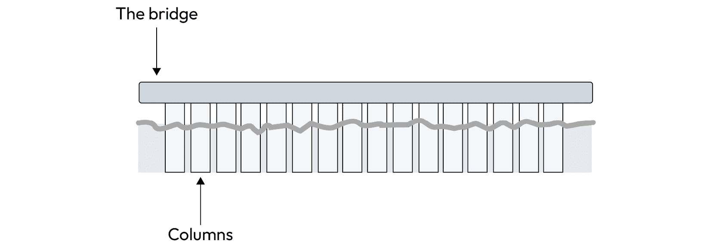
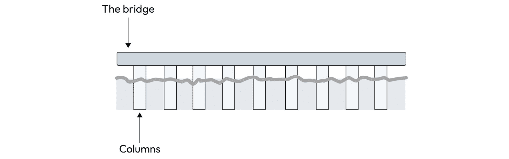
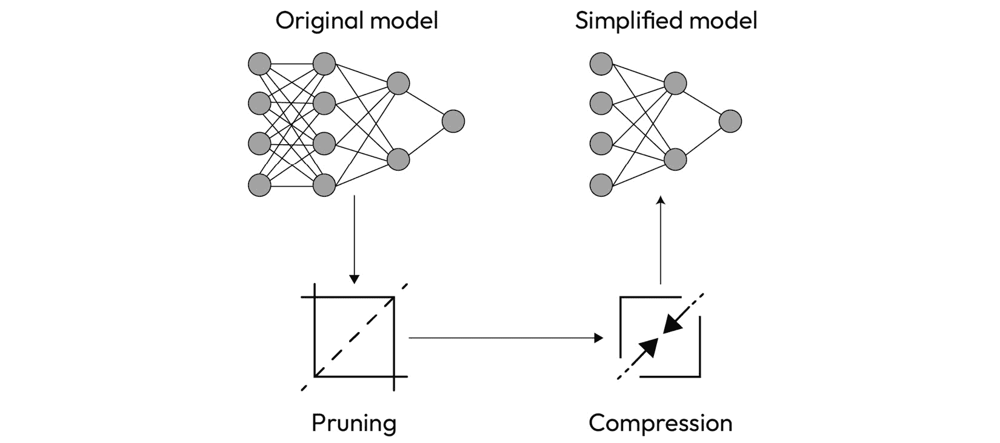
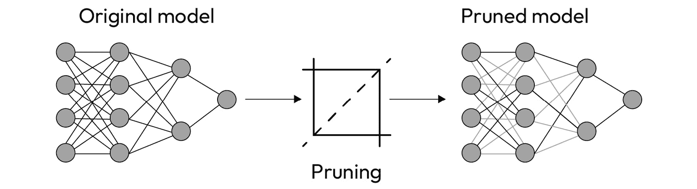
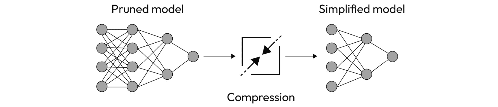

# 第六章：简化模型

您听说过“简约原则”吗？**简约原则**在模型估计的背景下，意味着尽可能保持模型简单。这一原则来自这样的假设：复杂模型（参数数量较多的模型）会过度拟合训练数据，从而降低泛化能力和良好预测的能力。

另外，简化神经网络有两个主要好处：减少模型训练时间和使模型能够在资源受限的环境中运行。简化模型的一种方法是通过使用修剪和压缩技术来减少神经网络参数的数量。

在本章中，我们展示如何通过减少神经网络参数的数量来简化模型，而不牺牲其质量。

以下是本章节将学到的内容：

+   简化模型的关键好处

+   模型修剪和压缩的概念与技术

+   如何使用 Microsoft NNI 工具包简化模型

# 技术要求

您可以在书的 GitHub 代码库中找到本章节提到的所有示例的完整代码，网址为 [`github.com/PacktPublishing/Accelerate-Model-Training-with-PyTorch-2.X/blob/main`](https://github.com/PacktPublishing/Accelerate-Model-Training-with-PyTorch-2.X/blob/main)。

您可以访问您喜爱的环境来执行这个笔记本，比如 Google Colab 或者 Kaggle。

# 了解模型简化的过程

简单来说，简化模型涉及移除神经网络的连接、神经元或整个层，以获得一个更轻的模型，即具有减少参数数量的模型。当然，简化版本的效率必须非常接近原始模型的效果。否则，简化模型就没有任何意义。

要理解这个主题，我们必须回答以下问题：

+   为什么要简化模型？（原因）

+   如何简化模型？（过程）

+   什么时候简化模型？（时机）

我们将在接下来的章节中逐一回答这些问题，以便全面理解模型简化。

注意

在继续本章之前，必须指出模型简化仍然是一个开放的研究领域。因此，本书中提到的一些概念和术语可能与其他资料或框架工具包中的使用稍有不同。

## 为什么要简化模型？（原因）

为了深入了解为什么需要简化模型，让我们利用一个简单而又生动的类比。

考虑这样一个假设情境，我们必须建造一座桥来连接河的两岸。为了安全起见，我们决定在桥每两米放置一个支柱，如*图 6**.1*所示：



图 6.1 – 桥梁类比

这座桥似乎非常安全，由其 16 根柱子支撑。然而，有人可能会看到这个项目并说我们不需要所有 16 根柱子来维持桥梁。作为桥梁设计者，我们可以主张安全第一；因此，增加柱子以确保桥梁完整性是没有问题的。

即使如此，如果我们可以稍微减少柱子数量而不影响桥梁的结构呢？换句话说，也许用 16 根柱子支撑桥梁在安全性上有些过剩。正如我们在图**6.2**中看到的那样，也许只需要九根柱子在这种情况下就足够了：



图**6.2** - 移除一些柱子后桥梁仍然保持竖立状态

如果我们在桥上减少柱子数量并保持其安全性，我们将减少预算和建造时间，同时简化未来的维护过程。没有合理的理由反驳这种方法。

这个天真的类比有助于加热我们关于简化模型原因的讨论。至于桥梁上的柱子，一个神经网络模型是否需要所有的参数来实现良好的准确性？答案并不简单，而是取决于问题类型和模型本身。然而，考虑到简化模型的表现与原始模型完全相同，为什么不尝试前者呢？

毕竟，简化模型具有明显的好处：

+   **加速训练过程**：通常，由较少参数组成的神经网络训练速度更快。正如在*第一章**，拆解训练过程*中讨论的那样，参数数量直接影响神经网络的计算负担。

+   **在资源受限环境中运行推理**：有些模型太大无法存储，执行起来太复杂，无法适应内存和计算能力有限的环境。在这种情况下，唯一的办法是尽可能简化模型来在这些环境中运行。

现在，简化模型的好处已经十分明显，让我们跳到下一节来学习如何执行这个过程。

## 如何简化模型？（过程）

我们通过应用包括两个步骤的工作流程来简化模型：**修剪**和**压缩**：



图 6.3 - 简化工作流程

如图**6.3**所示，简化工作流程接收密集神经网络作为输入，其中所有神经元都与自身完全连接，输出原始模型的简化版本。换句话说，该工作流程将密集神经网络转换为稀疏神经网络。

注

术语**密集**和**稀疏**来自数学，并用于描述矩阵。密集矩阵充满有用的数字，而稀疏矩阵则具有大量空值（零）。由于神经网络的参数可以用 n 维矩阵表示，非全连接神经网络也被称为稀疏神经网络，因为神经元之间的空连接数量很高。

让我们详细查看工作流程，以理解每个步骤的作用，从修剪阶段开始。

### 修剪阶段

**修剪阶段**负责接收原始模型并剪除连接（权重）、神经元（偏置）和滤波器（核值）中存在的参数，从而得到一个修剪过的模型：



图 6.4 – 修剪阶段

正如图 6.4 所示，原始模型中的许多连接已被禁用（在修剪模型中表示为不透明的线条）。修剪阶段根据过程中应用的**技术**决定应移除哪些参数。

修剪技术具有三个维度：

+   **准则**：定义要切断的参数

+   **范围**：确定是否丢弃整个结构（神经元、层或滤波器）或孤立的参数

+   **方法**：定义是一次性修剪网络还是迭代修剪模型，直到达到某个停止准则

注意

模型修剪是一个崭新的世界。因此，您可以轻松找到许多提出新方法和解决方案的科学论文。一篇有趣的论文名为*深度神经网络修剪调查：分类、比较、分析和建议*，概述了这一领域的最新进展，并简要介绍了诸如量化和知识蒸馏等其他简化技术。

实际上，修剪后的模型占用与原始模型相同的内存量，并且需要相同的计算能力。这是因为 null 参数虽然在前向和反向计算及结果上没有实际影响，但并未从网络中完全移除。

例如，假设由三个神经元组成的两个全连接层。连接的权重可以表示为一个矩阵，如图 6.5 所示：


图 6.5 – 权重表示为矩阵

在应用修剪过程后，神经网络有三个连接被禁用，正如我们在图 6.6 中所见：


图 6.6 – 修剪后的权重更改为 null

注意，权重已更改为 null（0.00），这些权重所代表的连接在网络计算中已被移除。因此，这些连接在神经网络结果的意义上实际上并不存在。

然而，数据结构与原始模型完全相同。我们仍然有九个浮点数，所有这些数仍然乘以它们各自神经元的输出（虽然没有实际效果）。从内存消耗和计算负担的角度来看，到目前为止什么都没有改变。

如果简化模型的目的是减少参数数量，为什么我们继续使用与之前相同的结构呢？保持冷静，让我们继续执行简化工作流的第二阶段：压缩阶段。

### 压缩阶段

如*图 6**.7*所示，**压缩阶段**接收修剪模型作为输入，并生成一个仅由未修剪参数组成的新脑模型，即修剪过程未触及的参数：



图 6.7 – 压缩阶段

新网络的形状可以与原始模型完全不同，神经元和层次的布置也各异。总之，压缩过程可以自由生成一个新模型，因为它遵循修剪步骤保留的参数。

因此，压缩阶段有效地去除了修剪模型的参数，从而得到一个真正简化的模型。让我们以*图 6**.8*中的例子来理解模型压缩后发生了什么：


图 6.8 – 应用于修剪网络的模型压缩

在这个例子中，一组禁用的参数——连接——已从模型中删除，将权重矩阵减少了三分之一。因此，权重矩阵现在占用更少的内存，并且在完成前向和后向阶段时需要更少的操作。

注意

我们可以把修剪和压缩阶段之间的关系想象成从磁盘中删除文件的过程。当我们要求操作系统删除文件时，它只是将分配给文件的块标记为自由。换句话说，文件内容仍然存在，只有当被新文件覆盖时才会被擦除。

## 我们何时简化模型？（时刻）

我们可以在训练神经网络之前或之后简化模型。换句话说，模型简化过程可以应用于未训练、预训练或已训练的模型，如下所述：

+   **未训练模型**：我们的目标是加快训练过程。由于模型尚未训练，神经网络填充有随机参数，大多数修剪技术无法有效地工作。为了解决这个问题，通常在简化模型之前会运行一个**预热阶段**，即在简化模型之前对网络进行单个时期的训练。

+   **预训练模型**：我们使用预训练网络来解决特定问题域的问题，因为这些网络在一般领域上具有通用的效率。在这种情况下，我们不需要执行预热阶段，因为模型已经训练好了。

+   **训练好的模型**：通常简化训练好的模型是为了在资源受限的环境中部署训练好的网络。

现在我们已经回答了关于模型简化的问题，我们应该使用 PyTorch 及其工具包来简化模型吗？请跟随我到下一节来学习如何做到这一点！

# 使用 Microsoft NNI 简化模型

**神经网络智能**（**NNI**）是微软创建的开源项目，旨在帮助深度学习从业者自动化任务，如超参数自动化和神经架构搜索。

NNI 还有一套工具集，用于更简单直接地处理模型简化。因此，我们可以通过在原始代码中添加几行代码来轻松简化模型。NNI 支持 PyTorch 和其他知名的深度学习框架。

注意

PyTorch 有自己的 API 来修剪模型，即`torch.prune`。不幸的是，在编写本书时，这个 API 不提供压缩模型的机制。因此，我们决定引入 NNI 作为完成此任务的解决方案。有关 NNI 的更多信息，请访问[`github.com/microsoft/nni`](https://github.com/microsoft/nni)。

让我们从下一节开始对 NNI 进行概述。

## NNI 概述

由于 NNI 不是 PyTorch 的本地组件，我们需要通过执行以下命令使用 pip 安装它：

```py
pip install nni
```

NNI 有很多模块，但为了简化模型，我们只会使用其中的两个，即`pruning`和`speedup`：

```py
from nni.compression.pytorch import pruning, speedup
```

### 修剪模块

`pruning`模块提供一组修剪技术，也称为**修剪器**。每个修剪器应用特定的方法来修剪模型，并需要一组特定的参数。在修剪器所需的参数中，有两个是强制性的：模型和**配置列表**。

配置列表是一个基于字典结构的结构，用于控制修剪器的行为。从配置列表中，我们可以指示修剪器必须处理哪些结构（层、操作或过滤器），以及哪些结构它应该保持不变。

例如，以下配置列表告诉修剪器处理所有实施`Linear`运算符的层（使用类`torch.nn.Linear`创建的层），除了名为`layer4`的层。此外，修剪器将尝试使 30%的参数归零，如`sparse_ratio`键中所示：

```py
config_list = [{    'op_types': ['Linear'],
    'exclude_op_names': ['layer4'],
    'sparse_ratio': 0.3
}]
```

注意

您可以在[`nni.readthedocs.io/en/stable/compression/config_list.html`](https://nni.readthedocs.io/en/stable/compression/config_list.html)找到配置列表接受的键值对的完整列表。

设置了配置列表后，我们就可以实例化修剪器，如下所示：

```py
pruner = pruning.L1NormPruner(model, config_list)
```

由修剪器提供的最关键方法称为`compress`。尽管名称暗示的是另一回事，它通过应用相应的剪枝算法执行剪枝过程。

`compress`方法返回一个名为**masks**的数据结构，该结构表示剪枝算法丢弃的参数。进一步使用此信息有效地从网络中移除被修剪的参数。

注意

如前所述，简化过程仍在进行中。因此，我们可能会遇到一些技巧，比如术语的不一致使用。这就是为什么 NNI 将剪枝阶段称为`compress`，尽管压缩步骤是由另一种称为`speedup`的方法完成的。

请注意，到目前为止，原始模型确实没有任何变化；还没有。要有效地移除被修剪的参数，我们必须依赖于`speedup`模块。

### speedup 模块

`speedup`模块提供了一个名为`ModelSpeedup`的类，用于创建**速度器**。速度器在修剪模型上执行压缩阶段，即有效地移除修剪器丢弃的参数。

在修剪器方面，我们还必须从`ModelSpeedup`类实例化一个对象。此类需要三个必填参数：修剪模型、一个输入样本和由修剪器生成的掩码：

```py
speeder = speedup.ModelSpeedup(model, input_sample, masks)
```

之后，我们只需调用`speedup_model`方法，使速度器可以压缩模型并返回原始模型的简化版本：

```py
speeder.speedup_model()
```

现在您已经概述了通过 NNI 简化模型的基本步骤，让我们跳到下一节，学习如何在实际示例中使用此工具包。

## NNI 的实际应用！

为了看到 NNI 在实践中的工作，让我们简化我们众所周知的 CNN 模型。在此示例中，我们将通过使用 CIFAR-10 数据集来简化此模型。

注意

此部分显示的完整代码可在[`github.com/PacktPublishing/Accelerate-Model-Training-with-PyTorch-2.X/blob/main/code/chapter06/nni-cnn_cifar10.ipynb`](https://github.com/PacktPublishing/Accelerate-Model-Training-with-PyTorch-2.X/blob/main/code/chapter06/nni-cnn_cifar10.ipynb)找到。

让我们从计算 CNN 模型的原始参数数目开始：

```py
model = CNN()print(count_parameters(model))
2122186
```

CNN 模型在偏差、权重和神经网络的滤波器之间有`2,122,186`个参数。我们仅在 CPU 机器上使用 CIFAR-10 数据集进行了 10 个时期的训练，因为我们有兴趣比较不同修剪配置之间的训练时间和相应的准确性。因此，原始模型在 122 秒内训练，达到 47.10%的准确性。

好的，让我们移除桥的一些支柱，看看它是否仍然站立。我们将通过考虑以下策略简化 CNN 模型：

+   操作类型：Conv2d

+   每层稀疏度：0.50

+   修剪器算法：L1 Norm

这个策略告诉简化过程只关注神经网络的卷积层，并且对于每一层，裁剪算法必须丢弃 50%的参数。由于我们正在简化一个全新的模型，我们需要执行预热阶段来为网络引入一些有价值的参数。

对于这个实验，我们选择了 L1 范数裁剪器，它根据 L1 范数测量的大小来移除参数。简单来说，裁剪器会丢弃对神经网络结果影响较小的参数。

注意

您可以在[L1 Norm pruner](https://nni.readthedocs.io/en/stable/reference/compression/pruner.html#l1-norm-pruner)找到更多关于 L1 范数裁剪器的信息。

下面的代码摘录显示了应用上述策略简化 CNN 模型所需的几行代码：

```py
config_list = [{'op_types': ['Conv2d'],                'sparsity_per_layer': 0.50}]
pruner = pruning.L1NormPruner(model, config_list)
_, masks = pruner.compress()
pruner._unwrap_model()
input_sample, _ = next(iter(train_loader))
speeder = speedup.ModelSpeedup(model, input_sample, masks)
speeder.speedup_model()
```

在简化过程中，NNI 将输出一堆如下的行：

```py
[2023-09-23 19:44:30] start to speedup the model[2023-09-23 19:44:30] infer module masks...
[2023-09-23 19:44:30] Update mask for layer1.0
[2023-09-23 19:44:30] Update mask for layer1.1
[2023-09-23 19:44:30] Update mask for layer1.2
[2023-09-23 19:44:30] Update mask for layer2.0
[2023-09-23 19:44:30] Update mask for layer2.1
[2023-09-23 19:44:30] Update mask for layer2.2
[2023-09-23 19:44:30] Update mask for .aten::size.8
[2023-09-23 19:44:30] Update mask for .aten::Int.9
[2023-09-23 19:44:30] Update mask for .aten::reshape.10
```

在完成这个过程后，我们可以验证原始神经网络的参数数量如预期般减少了约 50%：

```py
print(count_parameters(model))1059306
```

好吧，模型变得更小更简单了。但是训练时间和效率呢？让我们看看！

我们使用相同的超参数通过相同数量的 epochs 对 CIFAR-10 进行了简化模型的训练。简化模型的训练过程只需 89 秒完成，表现提升了 37%! 虽然模型的效率略有下降（从 47.10%降至 42.71%），但仍接近原始版本。

有趣的是要注意训练时间、准确性和稀疏比之间的权衡。如*表 6.1*所示，当从网络中移除 80%的参数时，模型的效率降至 38.87%。另一方面，训练过程仅需 76 秒完成，比训练原始网络快 61%：

| **每层稀疏度** | **训练时间** | **准确性** |
| --- | --- | --- |
| 10% | 118 | 47.26% |
| 20% | 113 | 45.84% |
| 30% | 107 | 44.66% |
| 40% | 100 | 45.18% |
| 50% | 89 | 42.71% |
| 60% | 84 | 41.90% |
| 70% | 81 | 40.84% |
| 80% | 76 | 38.87% |

表 6.1 – 模型准确性、训练时间和稀疏度水平之间的关系

俗话说，天下没有免费的午餐。因此，当简化模型时，准确性有望略微下降。这里的目标是在模型质量略微降低的情况下找到性能改进的平衡点。

在本节中，我们学习了如何使用 NNI 来简化我们的模型。通过在我们原始代码中改变几行代码，我们可以通过减少一定数量的连接来简化模型，从而减少训练时间，同时保持模型的质量。

下一节将提出一些问题，帮助您记住本章学到的内容。

# 测验时间！

让我们通过回答一些问题来回顾本章所学内容。首先，请尝试不查阅资料回答这些问题。

注意

所有这些问题的答案都可以在[`github.com/PacktPublishing/Accelerate-Model-Training-with-PyTorch-2.X/blob/main/quiz/chapter06-answers.md`](https://github.com/PacktPublishing/Accelerate-Model-Training-with-PyTorch-2.X/blob/main/quiz/chapter06-answers.md)找到。

在开始测验之前，请记住这根本不是一个测试！本节旨在通过回顾和巩固本章节涵盖的内容来补充您的学习过程。

为以下问题选择正确的选项。

1.  在简化工作流程时需要执行哪两个步骤？

    1.  减少和压缩。

    1.  剪枝和减少。

    1.  剪枝和压缩。

    1.  减少和压缩。

1.  剪枝技术通常具有以下维度：

    1.  标准、范围和方法。

    1.  算法、范围和大小。

    1.  标准、约束和目标。

    1.  算法、约束和目标。

1.  关于压缩阶段，我们可以断言以下哪一个？

    1.  它接收一个压缩过的模型作为输入，并验证模型的完整性。

    1.  它接收一个压缩过的模型作为输入，并生成一个仅由未剪枝参数部分组成的模型。

    1.  它接收一个被剪枝的模型作为输入，并生成一个仅由未剪枝参数组成的新脑模型。

    1.  它接收一个被剪枝的模型作为输入，并评估应用于该模型的剪枝程度。

1.  我们可以在以下哪些情况下执行模型简化过程？

    1.  仅预训练模型。

    1.  仅预训练和非训练模型。

    1.  仅非训练模型。

    1.  非训练、预训练和已训练模型。

1.  简化训练模型的主要目标之一是什么？

    1.  加速训练过程。

    1.  将其部署在资源受限的环境中。

    1.  提高模型的准确性。

    1.  没有理由简化已训练的模型。

1.  考虑以下配置列表传递给剪枝者：

    ```py
    config_list = [{ 'op_types': ['Conv2d'],                 'exclude_op_names': ['layer2'],                 'sparse_ratio': 0.25 }]
    ```

    剪枝者会执行以下哪些操作？

    1.  剪枝者将尝试使所有网络参数的 75%无效化。

    1.  剪枝者将尝试使所有全连接层参数的 25%无效化。

    1.  剪枝者将尝试使卷积层参数的 25%无效化，除了标记为“layer2”的那个。

    1.  剪枝者将尝试使卷积层参数的 75%无效化，除了标记为“layer2”的那个。

1.  在执行简化工作流程后，模型的准确性更可能发生什么变化？

    1.  模型的准确性倾向于增加。

    1.  模型的准确性肯定会增加。

    1.  模型的准确性倾向于降低。

    1.  模型的准确性保持不变。

1.  在简化以下哪些内容之前，有必要执行热身阶段？

    1.  非训练模型。

    1.  已训练的模型。

    1.  预训练模型。

    1.  以上都不是。

# 摘要

在本章中，您了解到通过减少参数数量来简化模型可以加速网络训练过程，使模型能够在资源受限的平台上运行。

接着，我们看到简化过程包括两个阶段：剪枝和压缩。前者负责确定网络中必须删除的参数，而后者则有效地从模型中移除这些参数。

尽管 PyTorch 提供了一个 API 来剪枝模型，但它并不完全有助于简化模型。因此，介绍了 Microsoft NNI，一个强大的工具包，用于自动化与深度学习模型相关的任务。在 NNI 提供的功能中，这个工具提供了一个完整的工作流程来简化模型。所有这些都是通过向原始代码添加几行新代码来实现的。

在接下来的章节中，您将学习如何减少神经网络采用的数值精度，以加快训练过程并减少存储模型所需的内存量。
