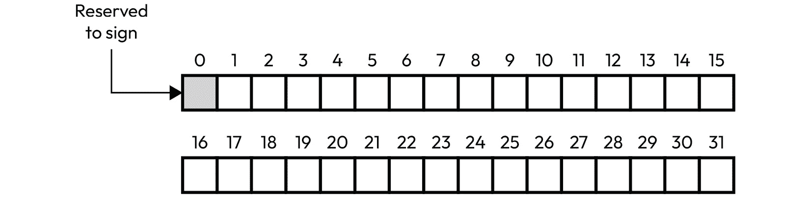
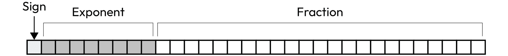
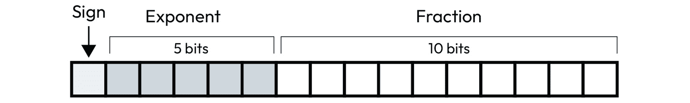
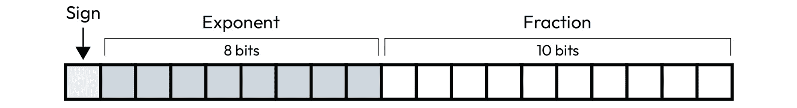
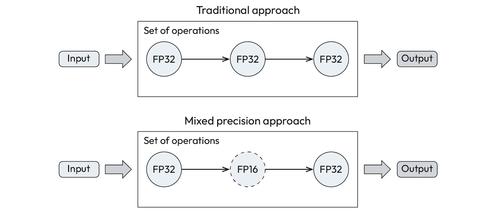
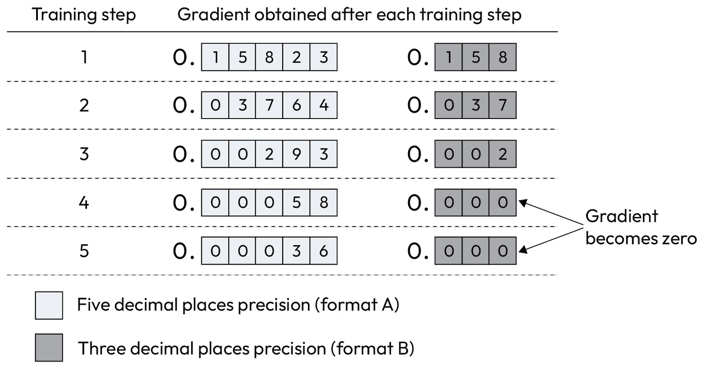
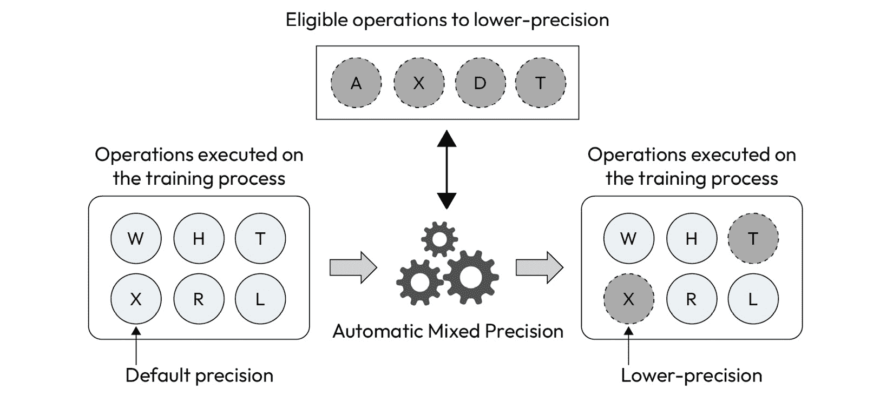
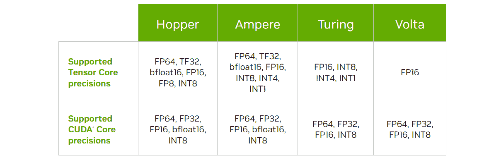

# 7

# 采用混合精度

科学计算是科学家用来推动已知界限的工具。生物学、物理学、化学和宇宙学是依赖科学计算来模拟和建模真实世界的领域的例子。在这些知识领域中，数值精度对于产生一致的结果至关重要。由于在这种情况下每个小数位都很重要，科学计算通常采用双精度数据类型来表示具有最高可能精度的数字。

然而，额外信息的需求是有代价的。数值精度越高，处理这些数字所需的计算能力就越高。此外，更高的精度还要求更高的内存空间，增加内存消耗。

面对这些缺点，我们必须问自己：我们是否需要如此高的精度来构建我们的模型？通常情况下，我们不需要！在这方面，我们可以针对一些操作降低数值精度，从而加快训练过程并节省一些内存空间。当然，这个过程不应影响模型产生良好预测的能力。

在本章中，我们将向您展示如何采用混合精度策略来加快模型训练过程，同时又不损害模型的准确性。除了总体上减少训练时间外，这种策略还可以利用特殊硬件资源，如 NVIDIA GPU 上的张量核心。

以下是本章的学习内容：

+   计算机系统中数值表示的概念

+   为什么降低精度可以减少训练过程的计算负担

+   如何在 PyTorch 上启用自动混合精度

# 技术要求

您可以在本书的 GitHub 仓库中找到本章中提到的示例代码的完整代码：[`github.com/PacktPublishing/Accelerate-Model-Training-with-PyTorch-2.X/blob/main`](https://github.com/PacktPublishing/Accelerate-Model-Training-with-PyTorch-2.X/blob/main)。

你可以使用你喜欢的环境来执行这段代码，比如 Google Colab 或者 Kaggle。

# 记住数值精度

在深入探讨采用混合精度策略的好处之前，重要的是让您理解数字表示和常见数据类型的基础知识。让我们首先回顾一下计算机如何表示数字。

## 计算机如何表示数字？

计算机是一种机器，拥有有限的资源，旨在处理比特，即它能管理的最小信息单位。由于数字是无限的，计算机设计师不得不付出很大努力，找到一种方法来在实际机器中表示这一理论概念。

为了完成这项工作，计算机设计师需要处理与数值表示相关的三个关键因素：

+   **符号**：数字是正数还是负数

+   **范围**：表示数字的区间。

+   **精度**：小数位数。

考虑到这些因素，计算机架构师成功地定义了数值数据类型，不仅可以表示整数和浮点数，还可以表示字符、特殊符号，甚至复数。

让我们通过一个例子来使事情更具体化。计算机架构和编程语言通常使用 32 位来通过所谓的 INT32 格式表示整数，如*图 7**.1*所示：



图 7.1 – 32 位整数的数字表示

在这 32 位中，有 1 位用于表示数字的符号，其中 0 表示正数，1 表示负数。其余的 31 位用于表示数字本身。有了 31 位，我们可以得到 2,147,483,648 个不同的 0 和 1 的组合。因此，这种表示法的数值范围为-2,147,483,648 到+2,147,483,647。注意正数部分比负数部分少一个数，因为我们必须表示零。

这是有符号整数表示的一个示例，其中 1 位用于确定数值的正负。然而，如果在某些情况下只有正数是相关的，可以使用无符号表示法。无符号表示法使用所有 32 位来表示数字，因此其数值区间为 0 到 4,294,967,295。

在不需要更大区间的情况下，可以采用更便宜的格式 - 仅有 8 位 - 来表示整数：INT8 表示法，如*图 7**.2*所示。此表示法的无符号版本提供 0 到 255 之间的区间：


图 7.2 – INT8 格式中数字的示例

假设 1 字节等于 8 位（在某些计算机架构上这种关系可能不同），INT32 格式需要 4 字节来表示一个整数，而 INT8 只需 1 字节即可。因此，INT32 格式比 INT8 昂贵四倍，需要更多的内存空间和计算能力来处理这些数字。

整数表示方法非常简单。然而，要表示浮点数（小数），计算机架构师们必须设计更复杂的解决方案，这是我们将在下一节中学习的内容。

## 浮点数表示

现代计算机采用 IEEE 754 标准来表示浮点数。该标准定义了两种浮点数表示方式，即单精度和双精度。**单精度**，也称为 FP32 或 float32，使用 32 位，而**双精度**，也称为 FP64 或 float64，使用 64 位。

单精度和双精度在结构上相似，由三个元素组成：符号、指数和分数部分（有效数字），如*图 7**.3*所示。



图 7.3 – 浮点表示结构

符号位与整数表示的意义相同，即定义数字是正数还是负数。**指数部分**定义了数值范围，而**分数部分**则决定了数值的精度，即小数位数。

两种格式都使用 1 位来表示符号。关于其他部分，FP32 和 FP64 分别使用 8 和 11 位来表示指数，23 和 52 位来表示分数部分。粗略地说，FP64 的范围略高于 FP32，因为前者在指数部分比后者多使用了 3 位。另一方面，FP64 由于为分数部分保留了 52 位，因此提供了超过 FP32 两倍的双精度。

FP64 提供的高数值精度使其非常适合科学计算，其中每一位额外的小数点对于解决这一领域的问题至关重要。由于双精度需要 8 字节来表示一个数字，通常仅在需要如此高精度的任务中使用。在没有这种要求的情况下，使用单精度数据类型更为合适。这也是为什么训练过程通常采用 FP32 的原因。

## 新型数据类型

根据 IEEE 754 标准定义，单精度是表示浮点数的默认格式。然而，随着时间的推移，新问题的出现要求新的方法、方法和数据类型。

在新型数据类型中，我们可以突出显示三种特别适合机器学习模型的类型：FP16、BFP16 和 TF32。

### FP16

**FP16** 或 float16，正如你可能猜到的那样，使用 16 位来表示浮点数，如 *图 7**.4* 所示。由于它只使用了单精度的一半 32 位，这种新数据类型被称为**半精度**。

FP16 的结构与其兄弟 FP32 和 FP64 相同。区别在于用于表示指数和分数部分的位数。FP16 使用 5 位和 10 位分别表示指数和分数部分：



图 7.4 – FP16 格式结构

在需要的精度超出 float32 提供的情况下，FP16 是 FP32 的一种替代方案。在这些情况下，使用更简单的数据类型来节省内存空间和减少操作数据所需的计算能力要好得多。

### BFP16

**BFP16** 或 bfloat16 是由谷歌大脑（Google Brain）——谷歌的人工智能研究团队创造的一种新型数据类型。BFP16 类似于 FP16，使用 16 位来表示浮点数。然而，与 FP16 不同，BFP16 的重点是保留与 FP32 相同的数值范围，同时显著降低精度。因此，BFP16 使用 8 位来表示指数部分（与 FP32 相同），但只使用 7 位来表示分数部分，如 *图 7**.5* 所示：


图 7.5 – BFP16 格式的结构

谷歌创建了 BFP16 以满足机器学习和人工智能工作负载的需求，其中精度并不是很重要。截至撰写时，bfloat16 受到英特尔 Xeon 处理器（通过 AVX-512 BF16 指令集）、谷歌 TPU v2 和 v3、NVIDIA GPU A100 以及其他硬件平台的支持。

请注意，虽然这些硬件平台支持 TF32，但不能保证 bfloat16 会被所有软件支持和实现。例如，PyTorch 只支持在 CPU 上使用 bfloat16，尽管 NVIDIA GPU 也支持这种数据类型。

### TF32

**TF32**代表 TensorFloat 32，尽管名字如此，但是这是由 NVIDIA 创建的 19 位格式。TF32 是 FP32 和 FP16 格式的混合体，因为它使用 8 位表示指数和 10 位表示小数部分，类似于 FP32 和 FP16 的格式。因此，TF32 结合了 FP16 提供的精度和 FP32 的数值范围。*图 7.6*以图形方式描述了 TF32 的格式：



图 7.6 – TF32 格式的结构

与 bfloat16 类似，TF32 也是专门为处理人工智能工作负载而创建的，目前受到较新的 GPU 代数的支持，从安培架构（NVIDIA A100）开始。除了在范围和精度之间提供平衡的好处外，TF32 还受 Tensor Core 的支持，这是 NVIDIA GPU 上可用的特殊硬件组件。我们稍后将在本章更详细地讨论 Tensor Core。

## 总结一下！

是的，当然！那是大量信息需要消化。因此，*表 7.1*对此进行了总结：

| **格式** | **指数位数** | **小数位数** | **字节数** | **别名** |
| --- | --- | --- | --- | --- |
| FP32 | 8 | 23 | 4 | Float32，单精度 |
| FP64 | 11 | 52 | 8 | Float64，双精度 |
| FP16 | 5 | 10 | 2 | Float16，半精度 |
| BFP16 | 8 | 7 | 2 | Bfloat16 |
| TF32 | 8 | 10 | 4 | TensorFloat32 |

表 7.1 – 数值格式摘要

注意

Grigory Sapunov 撰写了一个关于数据类型的好摘要。您可以在[`moocaholic.medium.com/fp64-fp32-fp16-bfloat16-tf32-and-other-members-of-the-zoo-a1ca7897d407`](https://moocaholic.medium.com/fp64-fp32-fp16-bfloat16-tf32-and-other-members-of-the-zoo-a1ca7897d407)找到它。

正如您可能已经注意到的那样，数值范围和精度越高，表示这些数字所需的字节数也越多。因此，数值格式会增加存储和处理这些数字所需的资源量。

如果我们不需要如此高的精度（和范围）来训练我们的模型，为什么不采用比通常的 FP32 更便宜的格式呢？这样做可以节省内存并加速整个训练过程。

我们有选择不必更改整个构建过程的数值精度，而是采用下面解释的混合精度方法的选项。

# 理解混合精度策略

使用低精度格式的好处是显而易见的。除了节省内存外，处理低精度数据所需的计算能力也比处理高精度数字所需的少。

加速机器学习模型训练过程的一种方法涉及采用**混合精度**策略。沿着*第六章*的思路，*简化模型*，我们将通过关于这种方法的一些简单问题（当然也会回答）来理解这一策略。

注意

当你搜索有关降低深度学习模型精度的信息时，你可能会遇到一个称为**模型量化**的术语。尽管这些是相关的术语，但混合精度的目标与模型量化有很大不同。前者旨在通过采用降低的数值精度格式加速训练过程。后者侧重于减少已训练模型的复杂性以在推理阶段使用。因此，务必不要混淆这两个术语。

让我们首先回答最基本的问题：这个策略到底是什么？

## 什么是混合精度？

正如你可能猜到的那样，混合精度方法将不同精度的数值格式混合使用。该方法旨在尽可能使用更便宜的格式 - 换句话说，它仅在必要时保留默认精度。

在训练过程的上下文中，我们希望将 FP32 - 在此任务中采用的默认数值格式 - 与 FP16 或 BFP16 等低精度表示混合。具体来说，我们在某些操作中使用 FP32，而在其他操作中使用低精度格式。通过这样做，我们在需要更高精度的操作上保持所需的精度，同时也享受半精度表示的优势。

正如*图 7**.7*所示，混合方法与传统策略相反，我们在训练过程中使用相同的数值精度：



图 7.7 – 传统与混合精度方法的差异

鉴于使用低精度格式的优势，你可能会想知道为什么不在训练过程中涉及的所有操作中使用纯低精度方法 - 比如说纯低精度方法而不是混合精度策略。这是一个合理的问题，我们将在接下来的部分中回答它。

## 为什么使用混合精度？

这里提出的问题不是关于使用混合精度的优势，而是为什么我们不应该采用绝对的低精度方法。

好吧，我们不能使用纯低精度方法，因为有两个主要原因：

+   梯度信息的丢失

+   缺乏低精度操作

让我们更详细地看一下每一种。

### 梯度信息的丢失

降低精度可能导致**梯度问题**，从而影响模型的准确性。随着优化过程的进行，由降低精度导致的梯度信息丢失可以阻碍整个优化过程，使模型无法收敛。因此，训练后的模型可能表现出较低的准确性。

我们应该澄清这个问题吗？假设我们处于一个假设情境，正在使用两种不同的精度格式 A 和 B 来训练模型。格式 A 支持五位小数精度，而格式 B 只支持三位小数精度。

假设我们已经对模型进行了五个训练步骤的训练。在每个训练步骤中，优化器计算了梯度来指导整体优化过程。然而，正如*图 7**.8*所示，在第三个训练步骤后，格式 B 上的梯度变为零。此后，优化过程将是盲目的，因为梯度信息已丢失：



图 7.8 – 梯度信息丢失

这是一个关于梯度信息丢失的朴素而形象的例子。然而，总体而言，这是我们在选择使用低精度格式时可能面临的问题。

因此，我们必须将一些操作保持在默认的 FP32 格式上运行，以避免这些问题。然而，当使用较低精度表示时，我们仍然需要注意梯度的处理，正如我们将在本章后面理解的那样。

### 缺乏低精度操作

关于第二个原因，我们可以说许多操作没有更低精度的实现。除了技术限制外，实施某些操作的低精度版本的成本效益比可能非常低，因此不值得这样做。

因此，PyTorch 维护了一个*合格操作*列表，以在较低精度下运行，以查看当前支持给定精度和设备的操作。例如，`conv2d`操作可以在 CUDA 设备上以 FP16 运行，在 CPU 上以 BFP16 运行。另一方面，`softmax`操作既不在 GPU 上也不在 CPU 上支持低精度运行。一般来说，在撰写本文时，PyTorch 仅在 CUDA 设备上支持 FP16，仅在 CPU 上支持 BFP16。

注意

您可以在 PyTorch 的[`pytorch.org/docs/stable/amp.html`](https://pytorch.org/docs/stable/amp.html)找到可以在低精度下运行的所有合格操作的完整列表。

也就是说，我们必须始终评估我们的模型是否至少执行了其中一个可以在低精度下运行的合格操作，然后再全力采用混合精度方法。否则，我们将徒劳地尝试从这种策略中获益。

即使可以减少训练过程的数值精度，我们也不应该期望在任何情景下都会有巨大的性能增益。毕竟，目前只有训练过程中执行的操作的子集支持较低精度的数据类型。另一方面，任何从无需费力的过程中获得的性能改进总是受欢迎的。

## 如何使用混合精度

通常，我们依赖于自动解决方案来应用混合精度策略到训练过程中。这种解决方案称为**自动混合精度**，简称 **AMP**。

如 *图 7**.9* 所示，AMP 自动评估在训练过程中执行的操作，以决定哪些操作可以以低精度格式运行：



图 7.9 – AMP 过程

一旦 AMP 发现符合要求以低精度执行的操作，它就会接管并用低精度版本替换以默认精度运行的操作。这是一个优雅而无缝的过程，旨在避免难以检测、调查和修复的错误。

尽管强烈建议使用自动解决方案来应用混合精度方法，但也可以手动进行。然而，我们必须意识到一些事情。一般来说，当自动解决方案提供的结果不好或不合理时，或者简单地不存在时，我们寻求手动实施过程。由于自动解决方案已经可用，并且无法保证手动操作能获得显著的性能改进，我们应该把手动方法仅作为采用混合精度的最后选择。

注意

您始终可以尝试并手动实施混合精度。深入了解这个主题可能是个好主意。您可以从 NVIDIA GTC 2018 上的材料开始，该材料可在 [`on-demand.gputechconf.com/gtc-taiwan/2018/pdf/5-1_Internal%20Speaker_Michael%20Carilli_PDF%20For%20Sharing.pdf`](https://on-demand.gputechconf.com/gtc-taiwan/2018/pdf/5-1_Internal%20Speaker_Michael%20Carilli_PDF%20For%20Sharing.pdf) 上获取。

## 张量核心如何？

张量核心是一种处理单元，能够加速矩阵乘法执行，这是在人工智能和高性能计算工作负载中经常执行的基本操作。为了使用这一硬件资源，软件（库或框架）必须能够处理张量核心支持的数值格式。如 *表 7.2* 所示，张量核心支持的数值格式根据 GPU 架构而异：



表 7.2 – 张量核心支持的数据类型（来自 NVIDIA 官方网站）

新型 GPU 模型的张量核心，如 Hopper 和 Ampere（分别为系列 H 和 A），支持 TF32、FP16 和 bfloat16 等低精度格式，以及双精度格式（FP64），这对于处理传统 HPC 工作负载特别重要。

注意

Hopper 架构开始支持 FP8，一种全新的数字表示，只使用 1 字节来表示浮点数。NVIDIA 创建了这种格式，以加速 Transformer 神经网络的训练过程。使用张量核心来运行 FP8 操作依赖于 Transformer 引擎库，超出了本书的范围。

另一方面，现有的架构都不配备支持 FP32 的张量核心，默认精度格式。因此，为了利用这种硬件能力的计算能力，我们必须调整我们的代码，以便它可以使用更低精度格式。

此外，激活张量核心取决于其他因素，超出了采用较低精度表示的范围。在其他事项中，我们必须注意给定架构、库版本和数字表示的矩阵维度所需的内存对齐。例如，在 A100（安培架构）的情况下，当使用 FP16 和 CuDNN 版本在 7.6.3 之前时，矩阵的维度必须是 8 字节的倍数。

因此，采用较低精度是使用张量核心的第一个条件，但这并不是启用此资源的唯一要求。

注意

您可以在[`docs.nvidia.com/deeplearning/performance/dl-performance-matrix-multiplication/index.html#requirements-tc`](https://docs.nvidia.com/deeplearning/performance/dl-performance-matrix-multiplication/index.html#requirements-tc)找到有关使用张量核心要求的更多详细信息。

现在我们了解了混合精度的基础知识，我们可以学习如何在 PyTorch 中使用这种方法。

# 启用 AMP

幸运的是，PyTorch 提供了方法和工具，通过在我们的原始代码中进行少量更改即可执行 AMP。

在 PyTorch 中，AMP 依赖于启用一对标志，用`torch.autocast`对象包装训练过程，并使用梯度缩放器。更复杂的情况是在 GPU 上实施 AMP，涉及这三个部分，而最简单的场景（基于 CPU 的训练）只需要使用`torch.autocast`。

让我们从涵盖更复杂的情况开始。因此，跟随我进入下一节，学习如何在我们基于 GPU 的代码中激活这种方法。

## 在 GPU 上激活 AMP。

要在 GPU 上激活 AMP，我们需要对我们的代码进行三处修改：

1.  启用 CUDA 和 CuDNN 后端标志。

1.  用`torch.autocast`对象包装训练循环。

1.  使用梯度缩放器。

让我们仔细看看。

### 启用后端标志

正如我们在*第四章*中学到的，*使用专业库*，PyTorch 依赖第三方库（在 PyTorch 术语中也称为后端）来帮助执行专业任务。在 AMP 的上下文中，我们必须启用与 CUDA 和 CuDNN 后端相关的*四个标志*。所有这些标志默认情况下都是禁用的，应在代码开头打开。

注意

CuDNN 是一个 NVIDIA 库，提供了在深度学习神经网络上常执行的优化操作。

第一个标志是`torch.backend.cudnn.benchmark`，它激活了 CuDNN 的基准模式。在此模式下，CuDNN 执行一组简短的测试，以确定在给定平台上执行哪些操作是最佳的。尽管此标志与混合精度不直接相关，但它在过程中发挥着重要作用，增强了 AMP 的正面效果。

CuDNN 在第一次被 PyTorch 调用时执行此评估。一般来说，这一时刻发生在第一个训练时期。因此，如果第一个时期执行比训练过程的其余时期需要更多的时间，请不要感到惊讶。

另外两个标志称为`cuda.matmul.allow_fp16_reduced_precision_reduction`和`cuda.matmul.allow_bf16_reduced_precision_reduction`。它们告诉 CUDA 在执行 FP16 和 BFP16 表示时使用减少精度的`matmul`操作。`matmul`操作与矩阵乘法相关，这是通常可以在神经网络上执行的最基本的计算任务之一。

最后一个标志是`torch.backends.cudnn.allow_tf32`，它允许 CuDNN 使用 TF32 格式，从而启用 NVIDIA Tensor Cores 支持的格式之一。

在启用这些标志之后，我们可以继续更改训练循环部分。

### 使用`torch.autocast`包装训练循环

`torch.autocast`类负责在 PyTorch 上实现 AMP。我们可以将`torch.autocast`用作上下文管理器或装饰器。其使用取决于我们如何实现我们的代码。无论使用哪种方法，AMP 的工作方式都是相同的。

具体来说，在上下文管理器的情况下，我们必须包装在训练循环中执行的前向和损失计算阶段。所有其他在训练循环中执行的任务必须排除在`torch.autocast`的上下文之外。

`torch.autocast` 接受四个参数：

+   `device_type`：这定义了自动转换将在哪种设备上执行 AMP。接受的值包括`cuda`、`cpu`、`xpu`和`hpu` – 即，我们可以分配给`torch.device`对象的相同值。自然地，这个参数最常见的值是`cuda`和`cpu`。

+   `dtype`：在 AMP 策略中使用的数据类型。此参数接受与我们想要在自动转换中使用的数据类型相关联的数据类型对象 – 从`torch.dtype`类实例化。

+   `enabled`：一个标志，用于启用或禁用 AMP 过程。默认情况下是启用的，但我们可以将其切换为`false`来调试我们的代码。

+   `cache_enabled`：在 AMP 过程中，`torch.autocast`是否应启用权重缓存。此参数默认启用。

使用`torch.autocast`必须传入`device_type`和`dtype`参数。其他参数是可选的，仅用于微调和调试。

下面的摘录展示了在训练循环中作为上下文管理器使用`torch.autocast`（为了简单起见，此示例仅显示了训练循环的核心部分）：

```py
with torch.autocast(device_type=device, dtype=torch.float16):    output = model(images).to(device)
    loss = criterion(output, labels)
```

训练循环中执行的其他任务没有被`torch.autocast`封装，因为我们只对前向和损失计算阶段应用 AMP 感兴趣。此外，训练过程的剩余任务都被梯度缩放器包装，如下所述。

### 梯度缩放器

正如我们在本章开头所学到的，使用低精度表示法可能导致梯度信息的丢失。为了解决这个问题，我们需要使用`torch.cuda.amp.GradScaler`来包装优化和反向传播阶段：

```py
scaler = torch.cuda.amp.GradScaler()with torch.autocast(device_type=device, dtype=torch.float16):
    output = model(images).to(device)
    loss = criterion(output, labels)
optimizer.zero_grad()
scaler.scale(loss).backward()
scaler.step(optimizer)
scaler.update()
```

首先，我们实例化了一个来自`torch.cuda.amp.GradScaler`的对象。接下来，我们将`optimizer.step()`和`loss.backward()`调用包装到梯度缩放器中，以便它控制这些任务。最后，训练循环要求缩放器最终更新网络参数。

我们将这些乐高积木拼接成一个独特的建筑块，看看 AMP 在下一节中能做些什么！

## AMP，展示你的能力！

为了评估使用 AMP 的好处，我们将使用 EfficientNet 神经网络架构进行训练，该架构位于`torch.vision.models`包中，并使用 CIFAR-10 数据集。

注意

此部分显示的完整代码可在[`github.com/PacktPublishing/Accelerate-Model-Training-with-PyTorch-2.X/blob/main/code/chapter07/amp-efficientnet_cifar10.ipynb`](https://github.com/PacktPublishing/Accelerate-Model-Training-with-PyTorch-2.X/blob/main/code/chapter07/amp-efficientnet_cifar10.ipynb)中找到。

在这个实验中，我们将在 GPU NVIDIA A100 上使用 FP16 和 BFP16 评估 AMP 的使用情况，运行 50 个 epochs。我们的基准执行涉及使用 EfficientNet 的默认精度（FP32），但启用了 CuDNN 基准标志。通过这样做，我们将使事情变得公平，因为尽管 CuDNN 基准标志对 AMP 过程很重要，但并不直接相关。

基准执行花了 811 秒完成，达到了 51%的准确率。这里我们不关心准确率本身；我们感兴趣的是评估 AMP 是否会影响模型的质量。

通过采用 BFP16 精度格式，训练过程耗时 754 秒完成，这表示性能提升了 8%，这是一个较为微小和令人失望的改进。这是因为仅实现了在 CPU 上执行的 BFP16-适用操作，尽管我们正在使用 GPU 训练模型，但仍然有一些操作在 CPU 上执行。因此，这种微小的性能改进来自于继续在 CPU 上执行的一小部分代码片段。

注意

我们正在 GPU 上使用 BFP16 运行这个实验，以展示处理 AMP 的细微差别。尽管 PyTorch 并未提供 BFP16-适用的操作在 GPU 上执行的功能，我们却没有收到任何关于此操作的警告。这是一个重要示例，说明了了解我们在代码中使用的过程细节是多么重要。

好的，但是 FP16 呢？嗯，在 Float16 下运行的 AMP 训练过程完成了 50 个 epochs，耗时 486 秒，性能提升了 67%。由于梯度缩放器的工作，模型的准确性没有受到使用低精度格式的影响。事实上，这种场景下训练的模型与基线代码达到了相同的 51% 准确率。

我们必须牢记，这种性能提升只是 AMP 加速训练过程的一个示例。根据模型、库和设备在训练过程中的使用情况，我们可以获得更令人印象深刻的结果。

下一节将提供几个问题，以帮助您巩固本章学到的内容。

# 测验时间！

让我们通过回答一些问题来回顾我们在本章学到的知识。首先，试着在不查阅材料的情况下回答这些问题。

注意

所有这些问题的答案都可以在 [`github.com/PacktPublishing/Accelerate-Model-Training-with-PyTorch-2.X/blob/main/quiz/chapter07-answers.md`](https://github.com/PacktPublishing/Accelerate-Model-Training-with-PyTorch-2.X/blob/main/quiz/chapter07-answers.md) 找到。

在开始测验之前，请记住这不是一次测试！本节旨在通过复习和巩固本章内容来补充您的学习过程。

选择以下问题的正确选项：

1.  以下哪种数值格式仅使用 8 位表示整数？

    1.  FP8。

    1.  INT32。

    1.  INT8。

    1.  INTFB8。

1.  FP16 是一种使用 16 位表示浮点数的数值表示。这种数值格式也被称为什么？

    1.  半精度浮点表示。

    1.  单精度浮点表示。

    1.  双精度浮点表示。

    1.  四分之一精度浮点表示。

1.  以下哪种数值表示是由 Google 创建，用于处理机器学习和人工智能工作负载的？

    1.  GP16。

    1.  GFP16。

    1.  FP16。

    1.  BFP16。

1.  NVIDIA 创建了 TF32 数据表示。以下哪种位数用于表示浮点数？

    1.  32 位。

    1.  19 位。

    1.  16 位。

    1.  20 位。

1.  PyTorch 在执行训练过程的操作时使用的默认数值表示是什么？

    1.  FP32。

    1.  FP8。

    1.  FP64。

    1.  INT32。

1.  混合精度方法的目标是什么？

    1.  混合精度试图在训练过程执行期间采用较低精度的格式。

    1.  混合精度试图在训练过程执行期间采用较高精度的格式。

    1.  混合精度在训练过程执行期间避免了使用较低精度的格式。

    1.  混合精度在训练过程执行期间避免了使用更高精度的格式。

1.  使用 AMP 方法而不是手动实现的主要优势是什么？

    1.  简单使用和性能提升的减少。

    1.  简单使用和减少功耗。

    1.  复杂使用和避免涉及数值表示的错误。

    1.  简单使用和避免涉及数值表示的错误。

1.  除了缺少低精度操作外，以下哪个选项是不使用纯低精度方法进行训练过程的另一个原因？

    1.  低性能提升。

    1.  高能耗。

    1.  梯度信息的丢失。

    1.  高使用主存储器。

# 总结

在本章中，您学习到采用混合精度方法可以加速我们模型的训练过程。

尽管可以手动实现混合精度策略，但最好依赖于 PyTorch 提供的 AMP 解决方案，因为这是一个优雅且无缝的过程，旨在避免涉及数值表示的错误发生。当出现此类错误时，它们非常难以识别和解决。

在 PyTorch 上实施 AMP 需要在原始代码中添加几行额外的代码。基本上，我们必须将训练循环包装在 AMP 引擎中，启用与后端库相关的四个标志，并实例化梯度放大器。

根据 GPU 架构、库版本和模型本身，我们可以显著改善训练过程的性能。

本章结束了本书的第二部分。接下来，在第三部分中，我们将学习如何将训练过程分布在多个 GPU 和机器上。
