# 8

# 一览分布式训练

当我们在现实生活中面对复杂问题时，通常会尝试通过将大问题分解为易于处理的小部分来解决。因此，通过结合从原始问题的小部分获得的部分解决方案，我们达到最终解决方案。这种称为**分而治之**的策略经常用于解决计算任务。我们可以说这种方法是并行和分布式计算领域的基础。

原来，将一个大问题分解成小块的想法在加速复杂模型的训练过程中非常有用。在单个资源无法在合理时间内训练模型的情况下，唯一的出路是分解训练过程并将其分散到多个资源中。换句话说，我们需要*分布训练过程*。

您将在本章中学到以下内容：

+   分布式训练的基本概念

+   用于分散训练过程的并行策略

+   在 PyTorch 中实现分布训练的基本工作流程

# 技术要求

您可以在本章提到的书籍 GitHub 存储库中找到完整的代码示例，网址为 [`github.com/PacktPublishing/Accelerate-Model-Training-with-PyTorch-2.X/blob/main`](https://github.com/PacktPublishing/Accelerate-Model-Training-with-PyTorch-2.X/blob/main)。

您可以访问您喜爱的环境来执行提供的代码，例如 Google Colab 或 Kaggle。

# 分布式训练的首次介绍

我们将从讨论将训练过程分布到多个资源中的原因开始本章。然后，我们将了解通常用于执行此过程的资源。

## 我们何时需要分布训练过程？

分布训练过程最常见的原因涉及*加速构建过程*。假设训练过程花费很长时间并且我们手头有多个资源，那么我们应该考虑在这些各种资源之间分布训练过程以减少训练时间。

将大型模型加载到单个资源中存在内存泄漏的第二个动机与分布式训练相关。在这种情况下，我们依靠分布式训练将大型模型的不同部分分配到不同的设备或资源中，以便可以将模型加载到系统中。

然而，分布式训练并非解决所有问题的*灵丹妙药*。在许多情况下，分布式训练可以达到与传统执行相同的性能，或者在某些情况下甚至更差。这是因为准备初始设置和在多个资源之间进行通信所带来的额外开销可能会抵消并行运行训练过程的好处。此外，我们可以首先尝试简化模型的复杂性，如*第六章*中描述的那样，*简化模型*，而不是立即转向分布式方法。如果成功，简化过程的结果模型现在可能适合设备上运行。

因此，分布式训练并不总是减少训练时间或将模型适配到给定资源的正确答案。因此，建议冷静下来，并仔细分析分布式训练是否有望解决问题。简而言之，我们可以使用图**8**.1 中描述的流程图来决定何时采用传统或分布式方法：

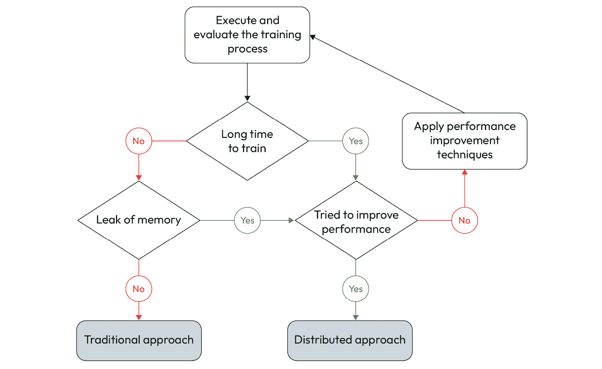

图 8.1 – 用于决定何时使用传统或分布式方法的流程图

面对内存泄漏或长时间训练，我们应该在考虑采用分布式方法之前，应用所有可能的性能改进技术。通过这样做，我们可以避免诸如浪费未有效使用的分配资源之类的问题。

除了决定何时分发训练过程外，我们还应评估在分布式方法中使用的资源量。一个常见的错误是获取所有可用资源来执行分布式训练，假设资源量越多，训练模型的时间就越短。然而，并没有保证增加资源量将会带来更好的性能。结果甚至可能更糟，正如我们之前讨论过的那样。

总之，分布式训练在训练过程需要较长时间完成或模型无法适应给定资源的情况下非常有用。由于这两种情况都可以通过应用性能改进技术来解决，因此我们应首先尝试这些方法，然后再考虑采用分布式策略。否则，我们可能会面临资源浪费等副作用。

在接下来的部分，我们将对用于执行此过程的计算资源提供更高层次的解释。

## 我们在哪里执行分布式训练？

更一般地说，我们可以说分布式训练涉及将训练过程划分为多个部分，每个部分管理整个训练过程的一部分。每个部分都分配在单独的计算**资源**上运行。

在分布式训练的背景下，我们可以在 CPU 或加速器设备上运行部分训练过程。尽管 GPU 是常用于此目的的加速器设备，但还存在其他不太流行的选项，如 FPGA、XPU 和 TPU。

这些计算资源可以在单台机器上或分布在多台服务器上。此外，一台单机可以拥有一个或多个这些资源。

换句话说，我们可以在 *一台具有多个计算资源的机器* 上分发训练过程，也可以跨 *具有单个或多个资源的多台机器* 进行分布。为了更容易理解这一点，*Figure 8**.2* 描述了在分布式训练过程中可以使用的可能计算资源安排：

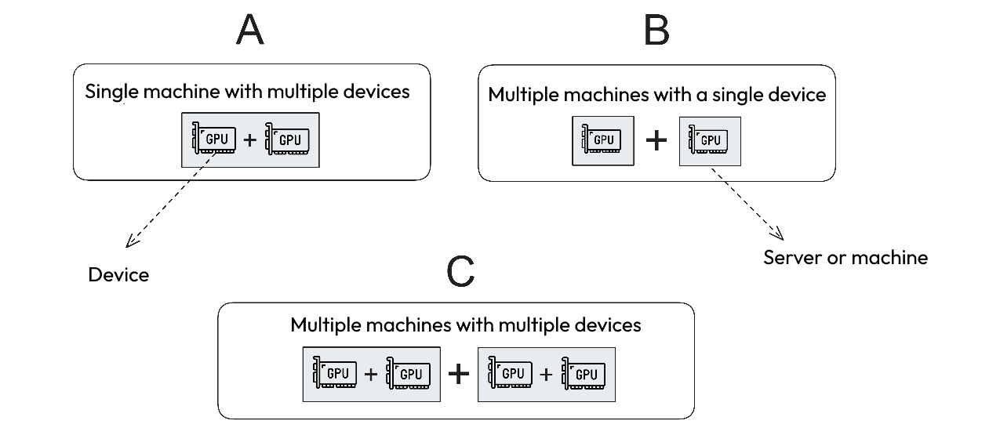

Figure 8.2 – 计算资源的可能安排

安排 **A**，即将多个设备放置在单个服务器中，是运行分布式训练过程最简单最快的配置。正如我们将在 *第十一章* 中了解的那样，*使用多台机器进行训练*，在多台机器上运行训练过程取决于用于互连节点的网络提供的性能。

尽管网络的性能表现不错，但使用此附加组件可能会单独降低性能。因此，尽可能采用安排 **A**，以避免使用网络互连。

关于安排 **B** 和 **C**，最好使用后者，因为它具有更高的每台机器设备比率。因此，我们可以将分布式训练过程集中在较少数量的机器上，从而避免使用网络。

然而，即使没有安排 **A** 和 **C**，使用安排 **B** 仍然是一个好主意。即使受到网络施加的瓶颈限制，分布式训练过程很可能会胜过传统方法。

通常情况下，GPU 不会在多个训练实例之间共享 – 即分布式训练过程会为每个 GPU 分配一个训练实例。在 CPU 的情况下，情况有所不同：一个 CPU 可以执行多个训练实例。这是因为 CPU 是一个多核设备，因此可以分配不同的计算核心来运行不同的训练实例。

例如，我们可以在具有 32 个计算核心的 CPU 中运行两个训练实例，其中每个训练实例使用可用核心的一半，如 *Figure 8**.3* 所示：

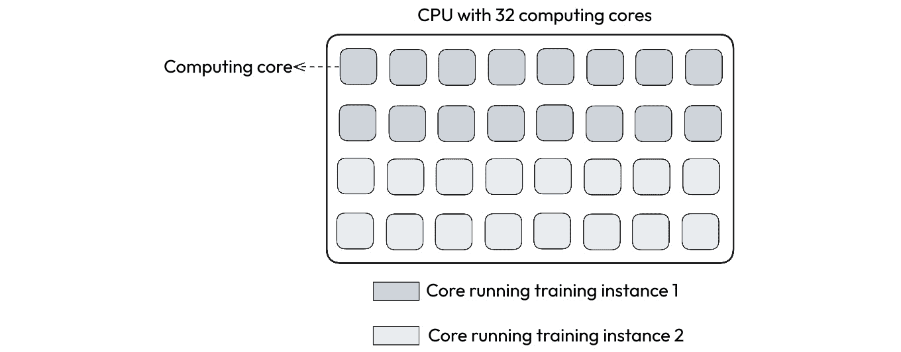

Figure 8.3 – 使用不同计算核心运行不同训练实例

尽管可以以这种方式运行分布式训练，但通常情况下在单台（或多台）多个 GPU 或多台多个机器上运行更为常见。这种配置在许多情况下可能是唯一的选择，因此了解如何操作非常重要。我们将在*第十章*，*使用* *多个 CPU*，中详细了解更多。

在了解了分布式训练世界之后，现在是时候跳到下一节，您将在这一节中学习这种方法的基本概念。

# 学习并行策略的基础知识

在前一节中，我们了解到分布式训练方法将整个训练过程分解为小部分。因此，整个训练过程可以并行解决，因为这些小部分中的每一个在不同的计算资源中同时执行。

并行策略定义如何将训练过程分解为小部分。主要有两种并行策略：模型并行和数据并行。接下来的章节将详细解释这两种策略。

## 模型并行

**模型并行**将训练过程中执行的操作集合划分为较小的计算任务子集。通过这样做，分布式过程可以在不同的计算资源上并行运行这些较小的操作子集，从而加快整个训练过程。

结果表明，在前向和后向阶段执行的操作彼此并非独立。换句话说，一个操作的执行通常依赖于另一个操作生成的输出。由于这种约束，模型并行并不容易实现。

尽管如此，卓越的人类头脑发明了三种技术来解决这个问题：**层间**、**操作内**和**操作间**范式。让我们深入了解。

### 层间范式

在**层间**范式中，每个模型层在不同的计算资源上并行执行，如*图 8.4*所示：


图 8.4 – 层间模型并行范式

然而，由于给定层的计算通常依赖于另一层的结果，层间范式需要依赖特定策略来实现这些条件下的分布式训练。

在采用这种范式时，分布式训练过程建立了一个连续的训练流程，使神经网络在同一时间处理多个训练步骤 – 也就是说，同时处理多个样本。随着事情的发展，一个层在给定的训练步骤中所需的输入已经在训练流程中被处理，并且现在可用作该层的输入。

因此，在特定时刻，分布式训练过程可以并行执行不同层。这个过程在前向和反向阶段都执行，从而进一步提高可以同时计算的任务的并行性水平。

在某种程度上，这种范式与现代处理器中实现的指令流水线技术非常相似，即多个硬件指令并行执行。由于这种相似性，内部层范式也被称为**流水线并行主义**，其中各阶段类似于训练步骤。

### 跨操作范式

**跨操作**范式依赖于将在每个层上执行的操作集合分成更小的可并行计算任务的**块**，如图*8**.5*所示。每个这些计算任务块在不同的计算资源上执行，因此并行化层的执行。在计算所有块之后，分布式训练过程将来自每个块的部分结果组合以得出层输出：

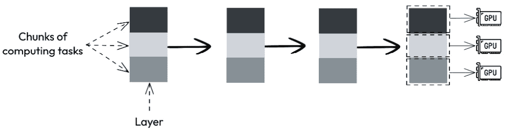

图 8.5 – **跨操作模型并行主义**范式

由于在层内执行的操作之间存在依赖关系，跨操作范式无法将依赖操作放入不同的块中。这种约束对将操作分割为并行计算任务块施加了额外的压力。

例如，考虑图*8**.6*中所示的图形，它表示在层中执行的计算。该图由两个输入数据块（矩形）和四个操作（圆形）组成，箭头表示操作之间的数据流动：

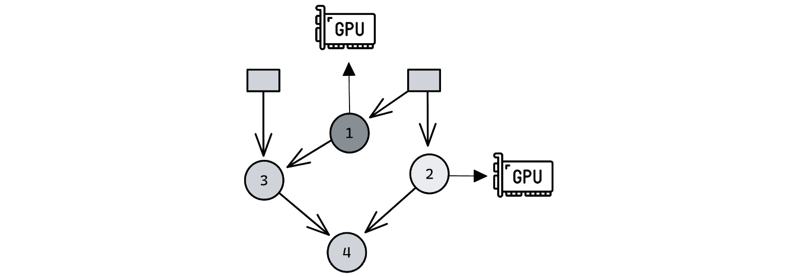

图 8.6 – 跨操作范式中操作分区的示例

易于看出，操作 1 和 2 仅依赖于输入数据，而操作 3 需要操作 1 的输出来执行其计算。操作 4 在图中的依赖最强，因为它依赖于操作 2 和 3 的结果才能执行。

因此，如图*8**.6*所示，这个图的独特分区为此图创建了两个并行操作块，以同时运行操作 1 和 2。由于操作 3 和 4 依赖于先前的结果，它们在其他任务完成之前无法执行。因此，根据层内操作之间的依赖程度，跨操作范式无法实现更高水平的并行性。

### 内部操作范式

**内部操作**范式将操作的执行分成较小的计算任务，其中每个计算任务在不同的输入数据块中应用操作。通常，跨操作方法需要结合部分结果来完成操作。

虽然间操作在不同计算资源上运行不同操作，内操作则将*同一操作的部分*分布到不同计算资源上，如图*8**.7*所示：

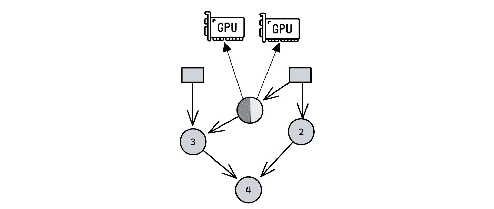

图 8.7 – 内操作模型并行化范式

例如，考虑一种情况，即图*8**.8*中所示，一个层执行矩阵到矩阵乘法。通过采用内操作范式，这种乘法可以分成两部分，其中每部分将在矩阵 A 和 B 的不同数据块上执行乘法。由于这些部分乘法彼此独立，因此可以同时在不同设备上运行这两个任务：

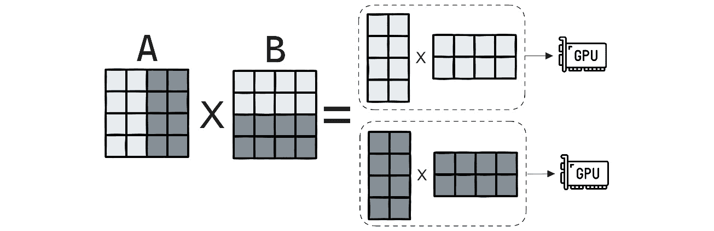

图 8.8 – 内操作范式中数据分区示例

在执行这两个计算任务之后，内操作方法需要将部分结果合并以生成最终的矩阵。

根据操作类型和输入数据的大小，内操作可以实现合理的并行性水平，因为可以创建更多数据块并提交给额外的计算资源。

然而，如果数据太少或操作太简单而无法进行计算，将计算分布到不同设备可能会增加额外的开销，超过并行执行操作的潜在性能改进。这种情况适用于内操作和间操作方法。

### 摘要

总结我们在本节学到的内容，*表 8.1*涵盖了每种模型并行化范式的主要特征：

| **范式** | **策略** |
| --- | --- |
| 间层 | 并行处理层 |
| 内操作 | 并行计算不同操作 |
| 间操作 | 并行计算同一操作的部分 |

表 8.1 – 模型并行化范式总结

虽然模型并行化可以加速训练过程，但它也有显著的缺点，比如扩展性差和资源使用不均衡，除此之外，还高度依赖网络架构。这些问题解释了为什么这种并行策略在数据科学家中并不那么流行，并且通常不是分布式训练过程的首选。

即便如此，模型并行化可能是在模型不适合计算资源的情况下的独特解决方案——也就是说，当设备内存不足以分配整个模型时。这种情况适用于**大型语言模型**（**LLMs**），这些模型通常有数千个参数，在内存中加载时占用大量字节。

另一种策略，称为数据并行化，更加健壮、可扩展且实现简单，我们将在下一节中学习。

## 数据并行化

数据并行策略的思想非常容易理解。与将网络执行的计算任务集合进行分割不同，数据并行策略将训练数据集分成更小的数据块，并使用这些数据块来训练原始模型的不同*副本*，如图*8**.9*所示。由于每个模型副本彼此独立，它们可以并行训练：

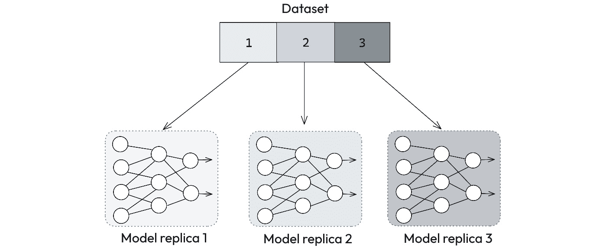

图 8.9 – 数据并行策略

在每个训练步骤结束时，分布式训练过程启动一个**同步阶段**，以更新所有模型副本的权重。此同步阶段负责收集并分享所有在不同计算资源中运行的模型之间的平均梯度。收到平均梯度后，每个副本根据此共享信息调整其权重。

同步阶段是数据并行策略的核心机制。简单来说，它确保了模型副本在执行单个训练步骤后获得的知识被与其他副本共享，反之亦然。因此，在完成分布式训练过程时，生成的模型具有与传统训练相同的知识：

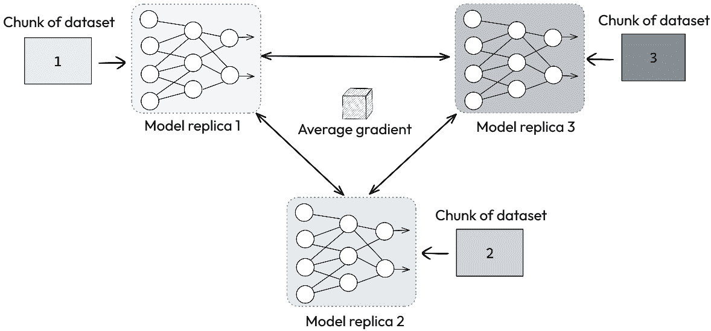

图 8.10 – 数据并行中的同步阶段

有半打方法执行此同步阶段，包括**参数服务器**和**全 reduce**。前者在可扩展性方面表现不佳，因为使用唯一服务器聚合每个模型副本获得的梯度，计算平均梯度，并将其发送到各处。随着训练过程数量的增加，参数服务器成为分布式训练过程的主要瓶颈。

另一方面，全 reduce 技术具有更高的可扩展性，因为所有训练实例均匀参与更新过程。因此，此技术已被所有框架和通信库广泛采用，以同步分布式训练过程的参数。

我们将在下一节详细了解它。

### 全 reduce 同步

全 reduce 是一种集体通信技术，用于简化由多个进程执行的计算。由于全 reduce 源自 reduce 操作，让我们在描述全 reduce 通信原语之前了解这种技术。

在分布式和并行计算的背景下，**reduce** 操作在多个进程中执行一个函数，并将该函数的结果发送给一个根进程。Reduce 操作可以执行任何函数，尽管通常应用于诸如求和、乘法、平均值、最大值和最小值等简单的函数。

*图 8**.11* 展示了将减少操作应用于四个进程持有的向量的示例。在这个示例中，减少原语执行四个向量的和，并将结果发送到进程 0，这是此场景中的根进程。


图 8.11 – Reduce 操作

All-Reduce 操作是减少原语的一个特例，其中所有进程接收函数的结果，如 *图 8**.12* 所示。因此，与仅将结果发送给根进程不同，All-Reduce 将结果与参与计算的所有进程共享。


图 8.12 – All-Reduce 操作

有不同的方式可以实施 All-Reduce 操作。在分布式训练环境中，最有效的解决方案之一是**环形 All-Reduce**。在这种实现中，进程使用逻辑环形拓扑（如 *图 8**.13* 所示）在它们之间交换信息。


图 8.13 – 环形 All-Reduce 实现

信息通过环路流动，直到所有进程最终拥有相同的数据。有一些库提供了优化版本的环形 All-Reduce 实现，比如 NVIDIA 的 NCCL 和 Intel 的 oneCCL。

### 总结

数据并行性易于理解和实施，而且灵活且可扩展。然而，正如万事皆有不完美之处一样，这种策略也有其缺点。

尽管与模型并行主义方法相比，它提供了更高层次的并行性，但它可能面临一些限制因素，这些因素可能阻碍其实现高度的可扩展性。由于每个训练步骤后梯度在所有副本之间共享，这些副本之间的通信延迟可能会减慢整个训练过程。

此外，数据并行策略并未解决训练大模型的问题，因为模型完全如原样加载到设备上。同一个大模型将以不同的计算资源加载，这反过来将无法支持它们。对于无法放入设备的模型，问题依旧存在。

即便如此，如今，数据并行策略是分布式训练过程的直接途径。这种策略的简单性和灵活性使其能够训练广泛的模型类型和架构，因此成为了默认的分布式训练选择。从现在开始，我们将使用术语**分布式训练**来指代基于数据并行策略的分布式训练。

构建机器学习模型的最常用框架都内置了分布式训练的实现，PyTorch 也不例外！在接下来的部分，我们将首次探讨如何实施这个过程。

# PyTorch 上的分布式训练

本节介绍了在 PyTorch 上实现分布式训练的基本工作流程，同时介绍了此过程中使用的组件。

## 基本工作流程

总体来说，实现 PyTorch 分布式训练的基本工作流程包括*图 8**.14*中展示的步骤：

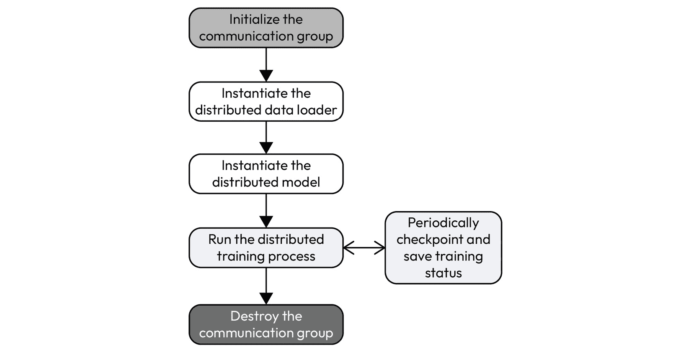

图 8.14 – 在 PyTorch 中实现分布式训练的基本工作流程

让我们更详细地看看每一步。

注意

本节展示的完整代码可在[`github.com/PacktPublishing/Accelerate-Model-Training-with-PyTorch-2.X/blob/main/code/chapter08/pytorch_ddp.py`](https://github.com/PacktPublishing/Accelerate-Model-Training-with-PyTorch-2.X/blob/main/code/chapter08/pytorch_ddp.py)找到。

### 初始化和销毁通信组

通信组是 PyTorch 用来定义和控制分布式环境的逻辑实体。因此，编写分布式训练的第一步涉及*初始化通信组*。通过实例化`torch.distributed`类的对象并调用`init_process_group`方法来执行此步骤，如下所示：

```py
import torch.distributed as distdist.init_process_group()
```

严格来说，初始化方法不需要任何参数。但是，有两个重要的参数，虽然不是必须的。这些参数允许我们选择通信后端和初始化方法。我们将在*第九章*中学习这些参数，*使用多 CPU 进行训练*。

在创建通信组时，PyTorch 识别将参与分布式训练的进程，并为每个进程分配一个唯一标识符。这个标识符称为`get_rank`方法：

```py
my_rank = dist.get_rank()
```

由于*所有进程执行相同的代码*，我们可以使用 rank 来区分给定进程的执行流程，从而将特定任务的执行分配给特定进程。例如，我们可以使用 rank 来分配执行最终模型评估的责任：

```py
if my_rank == 0:    test(ddp_model, test_loader, device)
```

在分布式训练中执行的最后一步涉及*销毁通信组*，这在代码开头创建。这个过程通过调用`destroy_process_group()`方法来执行：

```py
dist.destroy_process_group()
```

终止通信组是重要的，因为它告诉所有进程分布式训练已经结束。

### 实例化分布式数据加载器

由于我们正在实现数据并行策略，将训练数据集划分为小数据块以供每个模型副本使用是必需的。换句话说，我们需要实例化一个数据加载器，它了解分布式训练过程。

在 PyTorch 中，我们依赖于`DistributedSampler`组件来简化这个任务。`DistributedSampler`组件将程序员不需要的所有细节抽象化，并且非常易于使用：

```py
from torch.utils.data.distributed import DistributedSamplerdist_loader = DistributedSampler(train_dataset)
train_loader = torch.utils.data.DataLoader(train_dataset,
                                           batch_size=batch_size,
                                           shuffle=False,
                                           sampler=dist_loader)
```

唯一的变化是在原始的`DataLoader`创建行中添加了一个额外的参数，称为`sampler`。`sampler`参数必须填写一个从`DistributedSampler`组件实例化的对象，该对象仅需要原始数据集对象作为输入参数。

最终的数据加载器已准备好处理分布式训练过程。

### 实例化分布式模型

现在已经有了通信组和准备好的分布式数据加载器，是时候实例化原始模型的分布式版本了。

PyTorch 提供了本地的`DistributedDataParallel`组件（简称 DDP），用于封装原始模型并准备以分布式方式进行训练。DDP 返回一个新的模型对象，然后用于执行分布式训练过程：

```py
from torch.nn.parallel import DistributedDataParallel as DDPmodel = CNN()
ddp_model = DDP(model)
```

在实例化分布式模型之后，所有进一步的步骤都在分布式模型的版本上执行。例如，优化器接收分布式模型作为参数，而不是原始模型：

```py
optimizer = optimizer(ddp_model.parameters(), lr,                       weight_decay=weight_decay)
```

此时，我们已经具备运行分布式训练过程所需的一切。

### 运行分布式训练过程

令人惊讶的是，在分布式方式下执行训练循环几乎与执行传统训练相同。唯一的区别在于将 DDP 模型作为参数传递，而不是原始模型：

```py
train(ddp_model, train_loader, num_epochs, criterion, optimizer,       device)
```

除此之外不需要任何其他内容，因为到目前为止使用的组件具有执行分布式训练过程的内在功能。

PyTorch 持续运行分布式训练过程，直到达到定义的 epoch 数。在完成每个训练步骤后，PyTorch 会自动在模型副本之间同步权重。程序员无需进行任何干预。

### 检查点和保存训练状态

由于分布式训练过程可能需要很多小时才能完成，并涉及不同的计算资源和设备，因此更容易受到故障的影响。

因此，建议定期**检查点**和**保存**当前训练状态，以便在出现故障时恢复训练过程。我们将在*第十章*，*使用多个 GPU 进行训练*中详细讨论此主题。

### 总结

我们可能需要实例化其他模块和对象来实现分布式训练的特殊功能，但这个工作流程通常足以编写一个基本的——虽然功能齐全的——分布式训练实现。

## 通信后端和程序启动器

在 PyTorch 上实现分布式训练涉及定义一个**通信后端**，并使用**程序启动器**在多个计算资源上执行进程。

下面的小节简要解释了每个组件。

### 通信后端

正如我们之前所学的，在分布式训练过程中，模型副本彼此交换梯度信息。从另一个角度来看，运行在不同计算资源上的进程必须彼此通信，以传播这些数据。

同样地，PyTorch 依赖于后端软件来执行模型编译和多线程操作。它还依赖于通信后端来提供模型副本之间优化的通信渠道。

有些通信后端专注于与高性能网络配合工作，而其他一些适合处理单台机器内多个设备之间的通信。

PyTorch 支持的最常见的通信后端包括 Gloo、MPI、NCCL 和 oneCCL。每个这些后端在特定场景下的使用都非常有趣，我们将在接下来的几章中了解到。

### 程序启动器

运行分布式训练并不同于执行传统的训练过程。任何分布式和并行程序的执行都与运行任何传统和顺序程序有显著的区别。

在 PyTorch 的分布式训练环境中，我们使用程序启动器来启动分布式进程。这个工具负责设置环境并在操作系统中创建进程，无论是本地还是远程。

用于此目的的最常见启动器包括`mp.spawn`，该启动器由`torch.multiprocessing`包提供。

### 将所有内容整合起来

图 8.15 所示的*分布式训练过程概念图*展示了 PyTorch 提供的组件和资源：

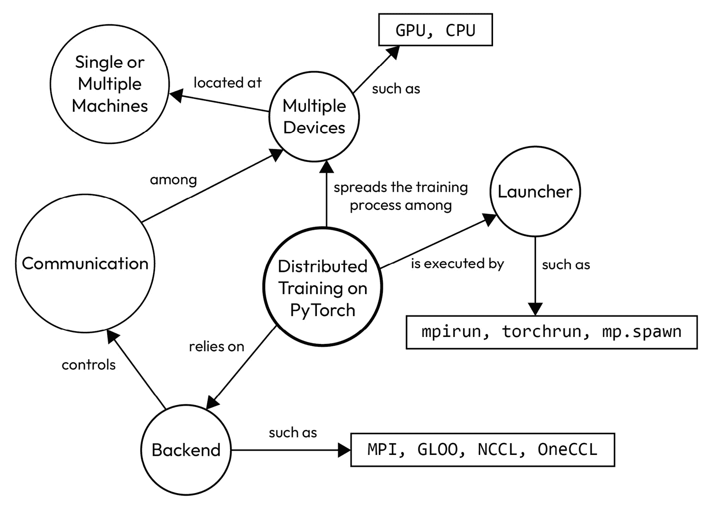

图 8.15 – PyTorch 分布式训练概念图

正如我们所学的，PyTorch 依赖于通信后端来控制多个计算资源之间的通信，并使用程序启动器将分布式训练提交到本地或远程操作系统。

有多种方法可以完成同样的事情。例如，我们可以使用某种程序启动器基于两种不同的通信后端执行分布式训练。反之亦然 – 也就是说，有些通信后端支持多个启动器的情况。

因此，定义元组*通信后端 x 程序启动器*将取决于分布式训练过程中使用的环境和资源。在接下来的几章中，我们将更多地了解这一点。

下一节提供了一些问题，帮助您记住本章学到的内容。

# 测验时间！

让我们通过回答一些问题来复习一下本章学到的内容。最初，试着在不查阅资料的情况下回答这些问题。

注意

所有这些问题的答案都可以在[`github.com/PacktPublishing/Accelerate-Model-Training-with-PyTorch-2.X/blob/main/quiz/chapter08-answers.md`](https://github.com/PacktPublishing/Accelerate-Model-Training-with-PyTorch-2.X/blob/main/quiz/chapter08-answers.md)找到。

在开始测验之前，请记住这不是一个测试！本节旨在通过复习和巩固本章节涵盖的内容来补充您的学习过程。

选择以下问题的正确选项。

1.  分布训练的两个主要原因是什么？

    1.  可靠性和性能改进。

    1.  内存泄漏和功耗。

    1.  功耗和性能改进。

    1.  内存泄漏和性能改进。

1.  分布训练过程的两个主要并行策略是哪些？

    1.  模型和数据并行。

    1.  模型和硬件并行。

    1.  硬件和数据并行。

    1.  软件和硬件并行。

1.  模型并行主义方法使用哪种范式？

    1.  模型间。

    1.  间数据。

    1.  内操作。

    1.  参数间。

1.  什么是内操作范式并行处理？

    1.  不同操作。

    1.  相同操作的部分。

    1.  模型的层。

    1.  数据集样本。

1.  除参数服务器外，数据并行策略还使用了哪种同步方法？

    1.  所有操作。

    1.  全部聚集。

    1.  全部减少。

    1.  全部分散。

1.  在 PyTorch 中执行分布式训练的第一步是什么？

    1.  初始化通信组。

    1.  初始化模型副本。

    1.  初始化数据加载器。

    1.  初始化容器环境。

1.  在 PyTorch 中的分布式训练背景下，使用哪个组件来启动分布式过程？

    1.  执行库。

    1.  通信后端。

    1.  程序启动器。

    1.  编译器后端。

1.  PyTorch 支持哪些作为通信后端？

    1.  NDL。

    1.  MPI。

    1.  AMP。

    1.  NNI。

# 总结

在本章中，您学到了分布式训练有助于加速训练过程以及训练不适合设备内存的模型。虽然分布式可能是这两种情况的出路，但在采用分布式之前，我们必须考虑应用性能改进技术。

我们可以通过采用模型并行策略或数据并行策略来进行分布式训练。前者采用不同的范式将模型计算分配到多个计算资源中，而后者创建模型副本，以便在训练数据集的各个部分上进行训练。

我们还了解到，PyTorch 依赖于第三方组件，如通信后端和程序启动器来执行分布式训练过程。

在下一章中，我们将学习如何分散分布式训练过程，使其可以在单台机器上的多个 CPU 上运行。
