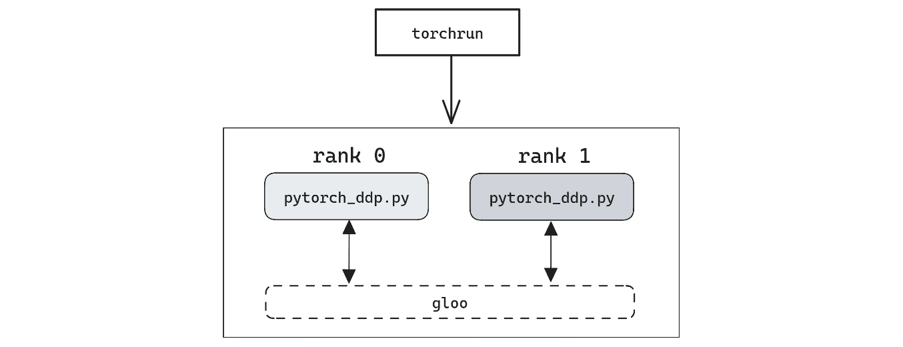

# 9

# 使用多个 CPU 进行训练

当加速模型构建过程时，我们立即想到配备 GPU 设备的机器。如果我告诉您，在仅配备多核处理器的机器上运行分布式训练是可能且有利的，您会怎么想？

尽管从 GPU 获得的性能提升是无法比拟的，但我们不应轻视现代 CPU 提供的计算能力。处理器供应商不断增加 CPU 上的计算核心数量，此外还创建了复杂的机制来处理共享资源的访问争用。

使用 CPU 来运行分布式训练对于我们无法轻松访问 GPU 设备的情况尤其有趣。因此，学习这个主题对丰富我们关于分布式训练的知识至关重要。

在本章中，我们展示了如何通过采用通用方法并使用 Intel oneCCL 后端，在单台机器上的多个 CPU 上执行分布式训练过程。

以下是本章的学习内容：

+   在多个 CPU 上分布训练的优势

+   如何在多个 CPU 之间分布训练过程

+   如何通过使用 Intel oneCCL 来突破分布式训练

# 技术要求

您可以在书籍的 GitHub 仓库中找到本章提到的示例的完整代码，网址为[`github.com/PacktPublishing/Accelerate-Model-Training-with-PyTorch-2.X/blob/main`](https://github.com/PacktPublishing/Accelerate-Model-Training-with-PyTorch-2.X/blob/main)。

您可以访问您喜爱的环境来执行此笔记本，如 Google Colab 或 Kaggle。

# 为什么要在多个 CPU 上分布训练？

乍一看，想象将训练过程分布在单台机器上的多个 CPU 之间听起来有点令人困惑。毕竟，我们可以增加训练过程中使用的线程数以分配所有可用的 CPU（计算核心）。

然而，正如巴西著名诗人卡洛斯·德·安德拉德所说，“*在路中央有一块石头。在路中央有一块石头*。” 让我们看看在具有多个核心的机器上仅增加线程数量时训练过程会发生什么。

## 为什么不增加线程数？

在*第四章*，*使用专用库*中，我们了解到 PyTorch 依赖于 OpenMP 通过采用多线程技术来加速训练过程。OpenMP 将线程分配给物理核心，旨在改善训练过程的性能。

因此，如果我们有一定数量的可用计算核心，为什么不增加训练过程中使用的线程数，而不是考虑分布式呢？答案实际上很简单。

当使用多线程运行训练过程时，PyTorch 对并行性的限制意味着在超过某个线程数后，性能不会有所提升。简单来说，达到一定阈值后，训练时间将保持不变，无论我们使用多少额外的核心来训练模型。

这种行为不仅限于 PyTorch 执行的训练过程。在许多种类的并行应用中，这种情况都很普遍。根据问题和并行策略的设计，增加线程数可能会导致并行任务变得太小和简单，以至于并行化问题的好处会被控制每个并行任务的开销所抑制。

看一个行为的实际例子。*表 9.1* 展示了使用一台装备有 16 个物理核心的机器，在 CIFAR-10 数据集上训练 CNN 模型五个周期的执行时间：

| **线程** | **执行时间** |
| --- | --- |
| 1 | 311 |
| 2 | 189 |
| 4 | 119 |
| 8 | 93 |
| 12 | 73 |
| 16 | 73 |

表 9.1 – 训练过程的执行时间

如 *表 9.1* 所示，无论是使用 12 还是 16 个核心来训练模型，执行时间都没有差异。由于并行级别的限制，尽管核心数量增加了超过 30%，PyTorch 在相同的执行时间上被限制住了。而且，即使训练过程使用了比之前多 50% 的线程（8 到 12），性能改善也不到 27%。

这些结果表明，在这种情况下，使用超过八个线程执行训练过程将不会显著减少执行时间。因此，我们会因为 PyTorch 分配了一定数量的核心而产生资源浪费，这些核心并没有加速训练过程。实际上，线程数越多，可能会增加通信和控制任务的开销，从而减慢训练过程。

要解决这种相反的效果，我们应考虑通过在同一台机器上运行不同的训练实例来分布训练过程。与其看代码，让我们直接看结果，这样您就能看到这种策略的好处！

## 救援上的分布式训练

我们使用与前一个实验相同的模型、参数和数据集进行了以下测试。当然，我们也使用了同一台机器。

在第一个测试中，我们创建了两个分布式训练过程的实例，每个实例使用八个核心，如 *图 9.1* 所示：


图 9.1 – 分布式训练实例的分配

分布式训练过程花费了 58 秒完成，代表了执行模型构建过程所需时间的*26%改善*。我们通过采用并行数据策略技术将执行时间减少了超过 25%。除此之外，硬件能力和软件堆栈都没有改变。此外，性能改善对于具有更多计算核心的机器来说可能会更高。

然而，正如本书中一直所言，一切通常都有代价。在这种情况下，成本与模型准确性有关。传统训练过程构建的模型准确性为 45.34%，而分布式训练创建的模型达到了 44.01%的准确性。尽管差异很小（约为 1.33%），但我们不应忽视它，因为模型准确性与分布式训练实例的数量之间存在关系。

*表格 9.2*展示了涉及不同训练实例组合和每个训练实例使用的线程数的测试结果。由于测试是在一个具有 16 个物理核心的机器上执行的，并考虑到 2 的幂次方，我们有三种可能的训练实例和线程组合：

| **训练实例** | **线程数** | **执行时间** | **准确性** |
| --- | --- | --- | --- |
| 2 | 8 | 58 | 44.01% |
| 4 | 4 | 45 | 40.11% |
| 8 | 2 | 37 | 38.63% |

表格 9.2 – 分布式训练过程的执行时间

如*表格 9.2*所示，训练实例数量越多，模型准确性越低。这种行为是预期的，因为模型副本根据*平均*梯度更新其参数，这导致了关于优化过程的信息损失。

相反，训练实例数量增加时，执行时间减少。当使用每个 8 个训练实例 2 个线程时，分布式训练过程仅需 37 秒即可完成，几乎比使用 16 个线程的传统训练快*两倍*。然而，准确性从 45%下降到 39%。

无可否认，将训练过程分布在多个处理核心之间在加速训练过程方面是有利的。我们只需关注模型的准确性。

在下一节中，我们将学习如何在多个 CPU 上编码和运行分布式训练。

# 在多个 CPU 上实施分布式训练

本节展示了如何使用**Gloo**，一种简单而强大的通信后端，在多个 CPU 上实施和运行分布式训练。

## Gloo 通信后端

在*第八章*，*一瞥分布式训练*，我们学习到 PyTorch 依赖于后端来控制涉及到的设备和机器之间的通信。

PyTorch 支持的最基本通信后端称为 Gloo。这个后端默认随 PyTorch 提供，不需要特别的配置。Gloo 后端是由 Facebook 创建的集体通信库，现在是一个由 BSD 许可证管理的开源项目。

注意

你可以在 [`github.com/facebookincubator/gloo`](http://github.com/facebookincubator/gloo) 找到 Gloo 的源代码。

由于 Gloo 使用简单且在 PyTorch 中默认可用，因此看起来是在只包含 CPU 和通过常规网络连接的机器的环境中运行分布式训练的第一选择。让我们在接下来的几节中实际看一下这个后端的运作。

## 编写在多个 CPU 上运行分布式训练的代码

本节展示了在 *单机多核心* 上运行分布式训练过程的代码。这段代码基本与 *第八章* 中展示的一致，只是与当前情境相关的一些细节不同。

注意

本节展示的完整代码可以在 [`github.com/PacktPublishing/Accelerate-Model-Training-with-PyTorch-2.X/blob/main/code/chapter09/gloo_distributed-cnn_cifar10.py`](https://github.com/PacktPublishing/Accelerate-Model-Training-with-PyTorch-2.X/blob/main/code/chapter09/gloo_distributed-cnn_cifar10.py) 找到。

因此，本节描述了调整基本工作流程以在多核心上运行分布式训练所需的主要更改。基本上，我们需要进行两个修改，如下两个部分所述。

### 初始化通信组

第一个修改涉及通信组的初始化。不再像以前那样调用 `dist.init_process_group` 而是要传入两个参数，正如我们在 *第八章* 中提到的 *一览分布式训练*：

```py
dist.init_process_group(backend="gloo", init_method="env://")
```

`backend` 参数告诉 PyTorch 使用哪个通信后端来控制多个训练实例之间的通信。在这个主要的例子中，我们将使用 Gloo 作为通信后端。所以，我们只需要向参数传递后端名称的小写字符串。

注意

要检查后端是否可用，我们可以执行 `torch.distributed.is_<backend>_available()` 命令。例如，要验证当前 PyTorch 环境中是否有 Gloo 可用，我们只需要调用 `torch.distributed.is_gloo_available()`。该方法在可用时返回 `True`，否则返回 `False`。

第二个名为 `init_method` 的参数，定义了 PyTorch 用于创建通信组的初始化方法。该方法告诉 PyTorch 如何获取其初始化分布式环境所需的信息。

现在，有三种可能的方法来通知初始化通信组所需的配置：

+   **TCP**：使用指定的 IP 地址和 TCP 端口

+   **共享文件系统**：使用一个对所有参与通信组的进程都可访问的文件系统

+   **环境变量**：使用操作系统范围内定义的环境变量

正如你可能猜到的那样，这个例子中使用的 `env://` 值，指的是初始化通信组的第三种方法，即环境变量选项。在下一节中，我们将了解用于设置通信组的环境变量。现在，重要的是记住 PyTorch 如何获取所需信息以建立通信组。

### CPU 分配映射

*第二次修改* 指的是定义每个训练实例中线程分配到不同核心的操作。通过这样做，我们确保所有线程使用独占的计算资源，不会竞争给定的处理核心。

为了解释这意味着什么，让我们举一个实际例子。假设我们希望在一个具有 16 个物理核心的机器上运行分布式训练。我们决定运行两个训练实例，每个实例使用八个线程。如果我们不注意这些线程的分配，两个训练实例可能会竞争同一个计算核心，导致性能瓶颈。这恰恰是我们所不希望的。

要避免这个问题，我们必须在代码开始时为所有线程定义分配映射。以下代码片段显示了如何做到这一点：

```py
import osnum_threads = 8
index = int(os.environ['RANK']) * num_threads
cpu_affinity = "{}-{}".format(index, (index + num_threads) - 1)
os.environ['OMP_NUM_THREADS'] = "{}".format(num_threads)
os.environ['KMP_AFFINITY'] = \
    "granularity=fine,explicit,proclist=[{}]".format(cpu_affinity)
```

注意

需要记住，所有通信组进程执行相同的代码。如果我们需要为进程定义不同的执行流程，必须使用等级。

让我们逐行理解这段代码在做什么。

我们首先定义每个参与分布式训练的进程使用的线程数：

```py
num_threads = 8
```

接下来，我们计算进程的 `index`，考虑其等级和线程数。等级从称为 `RANK` 的环境变量中获得，该变量由程序启动器正确定义：

```py
index = int(os.environ['RANK']) * num_threads
```

此索引用于标识分配给该进程的第一个处理核心。例如，考虑到 8 个线程和两个进程的情况，等级为 0 和 1 的进程的索引分别为 0 和 8。

从该索引开始，每个进程将为其线程分配后续的核心。因此，以前述场景为例，等级为 0 的进程将把其线程分配给计算核心 0、1、2、3、4、5、6 和 7。同样，等级为 1 的进程将使用计算核心 8、9、10、11、12、13、14 和 15。

由于 OpenMP 接受间隔列表格式作为设置 CPU 亲和性的输入，我们可以通过指示第一个和最后一个核心来定义分配映射。第一个核心是索引，最后一个核心通过将索引与线程数相加并从 1 中减去来获得：

```py
cpu_affinity = "{}-{}".format(index, (index + num_threads) - 1)
```

在考虑我们的例子时，等级为 0 和 1 的进程将使用变量 `cpu_affinity` 分别设置为“0-7”和“8-15”。

我们代码片段的最后两行根据之前获得的值定义了 `OMP_NUM_THREADS` 和 `KMP_AFFINITY` 环境变量：

```py
os.environ['OMP_NUM_THREADS'] = "{}".format(num_threads)os.environ['KMP_AFFINITY'] = \
    "granularity=fine,explicit,proclist=[{}]".format(cpu_affinity)
```

正如您应该记得的那样，这些变量用于控制 OpenMP 的行为。`OMP_NUM_THREADS` 变量告诉 OpenMP 在多线程中使用的线程数，`KMP_AFFINITY` 定义了这些线程的 CPU 亲和性。

这两个修改足以调整*第八章*中介绍的基本工作流程，以在多个 CPU 上执行分布式训练。

当代码准备好执行时，接下来的步骤涉及定义程序启动器和配置参数以启动分布式训练。

## 在多个 CPU 上启动分布式训练

正如我们在*第八章*中学到的，*一览分布式训练*，PyTorch 依赖程序启动器来设置分布环境并创建运行分布式训练所需的进程。

对于这个场景，我们将使用 `torchrun`，它是一个本地的 PyTorch 启动器。除了使用简单外，`torchrun` 已经包含在默认的 PyTorch 安装中。让我们看看关于这个工具的更多细节。

### torchrun

粗略地说，`torchrun` 执行两个主要任务：*定义与分布式环境相关的环境变量* 和 *在操作系统上实例化进程*。

`torchrun` 定义了一组环境变量，用于通知 PyTorch 关于初始化通信组所需的参数。设置适当的环境变量后，`torchrun` 将创建参与分布式训练的进程。

注意

除了这两个主要任务外，torchrun 还提供了更多高级功能，如恢复失败的训练进程或动态调整训练阶段使用的资源。

要在单台机器上运行分布式训练，torchrun 需要一些参数：

+   `nnodes`: 分布式训练中使用的节点数

+   `nproc-per-node`: 每台机器上运行的进程数

+   `master-addr`：用于运行分布式训练的机器的 IP 地址

执行我们示例的 `torchrun` 命令如下：

```py
maicon@packt:~$ torchrun --nnodes 1 --nproc-per-node 2 --master-addr localhost pytorch_ddp.py
```

由于分布式训练将在单台机器上运行，我们将 `nnodes` 参数设置为 `1`，并将 `master-addr` 参数设置为 localhost，这是本地机器的别名。在此示例中，我们希望运行两个训练实例；因此，`nproc-per-node` 参数设置为 `2`。

从这些参数中，`torchrun` 将设置适当的环境变量，并在本地操作系统上实例化两个进程来运行程序 `pytorch_ddp.py`，如*图 9**.2*所示。



图 9**.2 – torchrun 执行方案

如*图 9**.2*所示，每个进程都有其排名，并通过 Gloo 相互通信。此外，每个进程将创建八个线程，每个线程将在不同的物理核心上运行，如 CPU 分配图中定义的那样。尽管在同一台机器上执行并在相同的 CPU die 上运行，但这些进程将作为分布式训练过程的不同实例。

为了简化操作，我们可以创建一个 bash 脚本来简化 `torchrun` 在不同情况下的使用。让我们在下一节学习如何做到这一点。

### 启动脚本

我们可以创建一个 bash 脚本来简化分布式训练过程的启动，并在具有多个计算核心的单台机器上运行它。

此启动脚本的示例如下：

```py
TRAINING_SCRIPT=$1NPROC_PER_NODE=$2
NNODES= "1"
MASTER_ADDR= "localhost"
TORCHRUN_COMMAND="torchrun --nnodes $NNODES --nproc-per-node $NPROC_PER_NODE --master-addr $MASTER_ADDR $TRAINING_SCRIPT"
$TORCHRUN_COMMAND
```

重要提示

此部分显示的完整代码在 [`github.com/PacktPublishing/Accelerate-Model-Training-with-PyTorch-2.X/blob/main/scripts/chapter09/launch_multiple_cpu.sh`](https://github.com/PacktPublishing/Accelerate-Model-Training-with-PyTorch-2.X/blob/main/scripts/chapter09/launch_multiple_cpu.sh) 上可用。

此脚本设置不变的参数，如 `nnodes` 和 `master-addr`，并留下可自定义的参数，例如程序的名称和 `nproc-per-node`，以便在执行行中定义。因此，要运行我们之前的示例，只需执行以下命令：

```py
maicon@packt:~$ ./launch_multiple_cpu.sh pytorch_ddp.py 2
```

脚本 `launch_multiple_cpu.sh` 将使用适当的参数调用 `torchrun`。正如你所想象的那样，更改此脚本的参数以与其他训练程序一起使用，或者运行不同数量的训练实例，都非常简单。

此外，我们可以修改此脚本，以与 Apptainer 和 Docker 等解决方案提供的容器镜像一起使用。因此，不直接在命令行上调用 `torchrun`，而是在容器镜像中执行 `torchrun` 的脚本可以被修改为：

```py
TRAINING_SCRIPT=$1NPROC_PER_NODE=$2
SIF_IMAGE=$3
NNODES= "1"
MASTER_ADDR= "localhost"
TORCHRUN_COMMAND="torchrun --nnodes $NNODES --nproc-per-node $NPROC_PER_NODE --master-addr $MASTER_ADDR $TRAINING_SCRIPT"
apptainer exec $SIF_IMAGE $TORCHRUN_COMMAND
```

考虑到一个名为 `pytorch.sif` 的容器镜像，这个新版本 `local_launch` 的命令行将如下所示：

```py
maicon@packt:~$ ./launch_multiple_cpu_container.sh pytorch_ddp.py 2 pytorch.sif
```

在下一节中，我们将学习如何运行相同的分布式训练过程，但使用 Intel oneCCL 作为通信后端。

# 使用 Intel oneCCL 加速

在 *Table 9.2* 中显示的结果证明，Gloo 在 PyTorch 的分布式训练过程中很好地完成了通信后端的角色。

尽管如此，还有另一种选择用于通信后端，可以在 Intel 平台上更快地运行：Intel oneCCL 集体通信库。在本节中，我们将了解这个库是什么，以及如何将其用作 PyTorch 的通信后端。

## Intel oneCCL 是什么？

Intel oneCCL 是由英特尔创建和维护的集体通信库。与 Gloo 类似，oneCCL 还提供诸如所谓的“全局归约”之类的集体通信原语。

Intel oneCCL 自然地优化为在 Intel 平台环境下运行，尽管这并不一定意味着它在其他平台上无法工作。我们可以使用此库在同一台机器上执行的进程之间（进程内通信）或在多节点上运行的进程之间提供集体通信。

尽管其主要用途在于为深度学习框架和应用程序提供集体通信，但任何用 C++ 或 Python 编写的分布式程序都可以使用 oneCCL。

与 Intel OpenMP 一样，Intel oneCCL 不会默认随常规 PyTorch 安装一起提供；我们需要自行安装它。在考虑基于 pip 的环境时，我们可以通过执行以下命令轻松安装 oneCCL：

```py
pip install oneccl_bind_pt==2.1.0 --extra-index-url https://pytorch-extension.intel.com/release-whl/stable/cpu/us/
```

安装完 oneCCL 后，我们准备将其整合到我们的代码中，并启动分布式训练。让我们看看如何在接下来的章节中实现这一点。

注意

您可以在 [`oneapi-src.github.io/oneCCL/`](https://oneapi-src.github.io/oneCCL/) 找到关于 Intel oneCCL 的更多信息。

## 代码实现和启动

要将 Intel oneCCL 作为通信后端使用，我们必须更改前一节中呈现的代码的几个部分。

注意

本节展示的完整代码可在 [`github.com/PacktPublishing/Accelerate-Model-Training-with-PyTorch-2.X/blob/main/code/chapter09/oneccl_distributed-cnn_cifar10.py`](https://github.com/PacktPublishing/Accelerate-Model-Training-with-PyTorch-2.X/blob/main/code/chapter09/oneccl_distributed-cnn_cifar10.py) 找到。

第一个修改涉及导入一个 artifact 和设置三个环境变量：

```py
import oneccl_bindings_for_pytorchos.environ['CCL_PROCESS_LAUNCHER'] = "torch"
os.environ['CCL_ATL_SHM'] = "1"
os.environ['CCL_ATL_TRANSPORT'] = "ofi"
```

这些环境变量配置了 oneCCL 的行为。`CCL_PROCESS_LAUNCHER` 参数用于与 oneCCL 通信，并启动它。在我们的情况下，必须将此环境变量设置为 `torch`，因为 PyTorch 在调用 oneCCL。环境变量 `CCL_ATL_SHM` 和 `CCL_ATL_TRANSPORT` 分别设置为 `1` 和 `ofi`，以将共享内存配置为 oneCCL 用于进程间通信的手段。

共享内存是一种进程间通信技术。

注意

您可以通过访问此网站深入了解 Intel oneCCL 的环境变量：[`oneapi-src.github.io/oneCCL/env-variables.html`](https://oneapi-src.github.io/oneCCL/env-variables.html)。

第二次修改涉及更改初始化通信组中的后端设置：

```py
dist.init_process_group(backend="ccl", init_method="env://")
```

代码的其余部分和启动方法与 Gloo 的代码相同。我们可以将 `CCL_LOG_LEVEL` 设置为 `debug` 或 `trace` 环境变量，以验证是否正在使用 oneCCL。

在进行这些修改之后，您可能会想知道 oneCCL 是否值得。让我们在下一节中找出答案。

## oneCCL 真的更好吗？

如 *表 9.3* 所示，与 Gloo 的实现相比，oneCCL 将我们的训练过程加速了约 10%。如果与传统的 16 线程执行进行比较，使用 oneCCL 的性能改进几乎达到了 40%：

|  |  | **oneCCL** | **Gloo** |
| --- | --- | --- | --- |
| **训练** **实例** | **线程数** | **执行时间** | **准确率** | **执行时间** | **准确率** |
| 2 | 8 | 53 | 43.12% | 58 | 44.01% |
| 4 | 4 | 42 | 41.03% | 45 | 40.11% |
| 8 | 2 | 35 | 37.99% | 37 | 38.63% |

表 9.3 – 在 Intel oneCCL 和 Gloo 下运行的分布式训练过程的执行时间

关于模型的准确性，使用 oneCCL 和 Gloo 进行的分布式训练在所有场景中实际上取得了相同的结果。

因此，让我们心中产生的问题是，何时使用一种后端而不是另一种后端？如果我们使用的是基于 Intel 的环境，那么 oneCCL 更可取。毕竟，使用 Intel oneCCL 进行的训练过程比使用 Gloo 快了 10%。

另一方面，Gloo 默认与 PyTorch 一起使用，非常简单，并实现了合理的性能改进。因此，如果我们不在 Intel 平台上训练，也不追求最大可能的性能，那么 Gloo 是一个不错的选择。

下一节提供了一些问题，帮助您记住本章学到的内容。

# 测验时间！

让我们通过回答几个问题来回顾本章学到的内容。首先，尝试回答这些问题时不要查阅材料。

注意

所有这些问题的答案都可以在 [`github.com/PacktPublishing/Accelerate-Model-Training-with-PyTorch-2.X/blob/main/quiz/chapter09-answers.md`](https://github.com/PacktPublishing/Accelerate-Model-Training-with-PyTorch-2.X/blob/main/quiz/chapter09-answers.md) 上找到。

在开始测验之前，请记住这根本不是一个测试！本节旨在通过复习和巩固本章涵盖的内容来补充您的学习过程。

选择以下问题的正确选项。

1.  在多核系统中，通过增加 PyTorch 使用的线程数，可以改善训练过程的性能。关于这个话题，我们可以确认以下哪一个？

    1.  在超过一定数量的线程后，性能改进可能会恶化或保持不变。

    1.  性能改善始终在增加，无论线程数量如何。

    1.  增加线程数时没有性能改善。

    1.  仅使用 16 个线程时才能实现性能改善。

1.  PyTorch 支持的最基本的通信后端是哪一个？

    1.  NNI。

    1.  Gloo。

    1.  MPI。

    1.  TorchInductor。

1.  PyTorch 提供的默认程序启动器是哪一个？

    1.  PyTorchrun。

    1.  Gloorun。

    1.  MPIRun。

    1.  Torchrun。

1.  在 PyTorch 的上下文中，Intel oneCCL 是什么？

    1.  通信后端。

    1.  程序启动器。

    1.  检查点自动化工具。

    1.  性能分析工具。

1.  在考虑非 Intel 环境时，通信后端的最合理选择是什么？

    1.  Gloorun。

    1.  Torchrun。

    1.  oneCCL。

    1.  Gloo。

1.  在使用 Gloo 或 oneCCL 作为通信后端时，关于训练过程的性能，我们可以说以下哪些内容？

    1.  完全没有任何区别。

    1.  Gloo 比 oneCCL 总是更好。

    1.  oneCCL 在 Intel 平台上可以超越 Gloo。

    1.  oneCCL 总是比 Gloo 更好。

1.  在将训练过程分布在多个 CPU 和核心之间时，我们需要定义线程的分配以完成以下哪些任务？

    1.  保证所有线程都独占计算资源的使用。

    1.  保证安全执行。

    1.  保证受保护的执行。

    1.  保证数据在所有线程之间共享。

1.  **torchrun** 的两个主要任务是什么？

    1.  创建共享内存池并在操作系统中实例化进程。

    1.  定义与分布式环境相关的环境变量，并在操作系统上实例化进程。

    1.  定义与分布式环境相关的环境变量，并创建共享内存池。

    1.  确定在 PyTorch 中运行的最佳线程数。

# 概要。

在本章中，我们了解到，将训练过程分布在多个计算核心上比传统训练中增加线程数量更有优势。这是因为 PyTorch 在常规训练过程中可能会面临并行级别的限制。

要在单台机器上的多个计算核心之间分布训练，我们可以使用 Gloo，这是 PyTorch 默认提供的简单通信后端。结果显示，使用 Gloo 进行的分布式训练在保持相同模型精度的同时，实现了 25%的性能改善。

我们还了解到，Intel 的一个集体通信库 oneCCL 在 Intel 平台上执行时可以进一步加快训练过程。使用 Intel oneCCL 作为通信后端，我们将训练时间缩短了 40%以上。如果我们愿意稍微降低模型精度，可以加快两倍的训练速度。

在下一章中，我们将学习如何将分布式训练过程扩展到单台机器上的多个 GPU 上运行。
