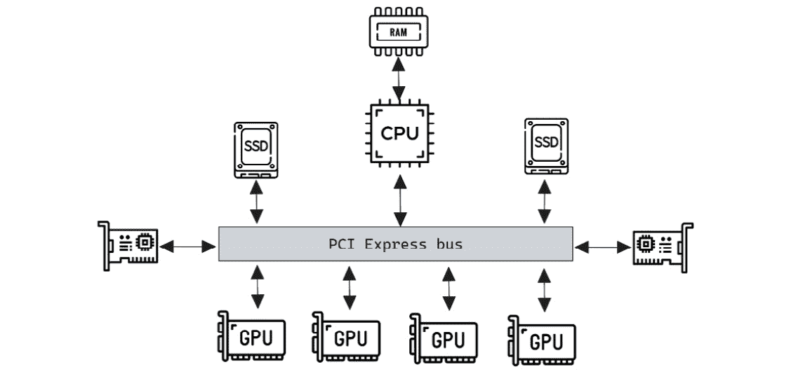
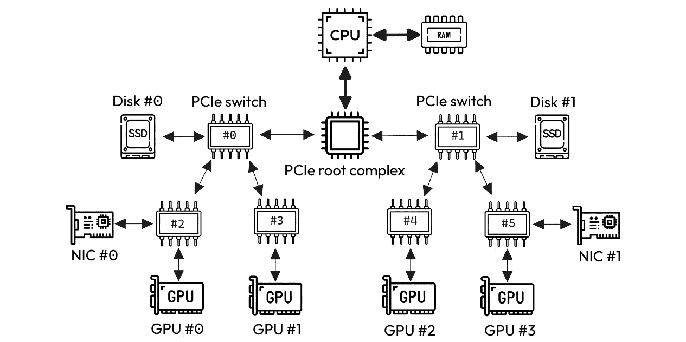
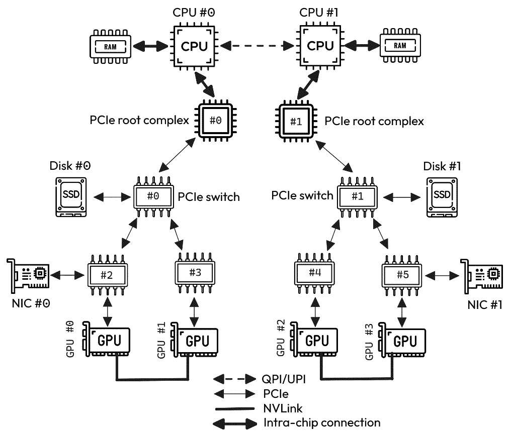

# 10

# 使用多个 GPU 进行训练

无疑，GPU 提供的计算能力是推动深度学习领域发展的因素之一。如果单个 GPU 设备可以显著加速训练过程，那么想象一下在多 GPU 环境下我们可以做什么。

在本章中，我们将展示如何利用多个 GPU 加速训练过程。在描述代码和启动过程之前，我们将深入探讨多 GPU 环境的特性和细微差别。

以下是您将在本章学到的内容：

+   多 GPU 环境的基础知识

+   如何将训练过程分布到多个 GPU 中

+   NCCL，NVIDIA GPU 上分布式训练的默认后端

# 技术要求

您可以在本书的 GitHub 仓库中找到本章提到的所有代码，网址为[`github.com/PacktPublishing/Accelerate-Model-Training-with-PyTorch-2.X/blob/main`](https://github.com/PacktPublishing/Accelerate-Model-Training-with-PyTorch-2.X/blob/main)。

您可以访问您喜欢的环境来执行此代码，例如 Google Colab 或 Kaggle。

# 解密多 GPU 环境

多 GPU 环境是一个具有多个 GPU 设备的计算系统。虽然只有一个 GPU 的多个互连机器可以被认为是多 GPU 环境，但我们通常使用此术语来描述每台机器具有两个或更多 GPU 的环境。

要了解此环境在幕后的工作原理，我们需要了解设备的连接性以及采用的技术，以实现跨多个 GPU 的有效通信。

然而，在我们深入讨论这些话题之前，我们将回答一个让您担忧的问题：我们是否能够访问像那样昂贵的环境？是的，我们可以。但首先，让我们简要讨论多 GPU 环境的日益流行。

## 多 GPU 环境的流行度

十年前，想象一台拥有多个 GPU 的机器是不可思议的事情。除了设备成本高昂外，GPU 的适用性仅限于解决科学计算问题，这是仅由大学和研究机构利用的一个小众领域。然而，随着**人工智能**（**AI**）工作负载的蓬勃发展，GPU 的使用在各种公司中得到了极大的普及。

此外，在过去几年中，随着云计算的大规模采用，我们开始看到云服务提供商以竞争性价格提供多 GPU 实例。例如，在**亚马逊网络服务**（**AWS**）中，有多种实例配备了多个 GPU，例如**p5.48xlarge**、**p4d.24xlarge**和**p3dn.24xlarge**，分别为 H100、A100 和 V100 型号提供了 8 个 NVIDIA GPU。

微软 Azure 和**谷歌云平台**（**GCP**）也提供多 GPU 实例。前者提供配备 4 个 NVIDIA A100 的**NC96ads**，而后者提供配备 8 个 NVIDIA H100 的**a3-highgpu-8g** 实例。即使是次要的云服务提供商，如 IBM、阿里巴巴和**Oracle 云基础设施**（**OCI**），也有多 GPU 实例。

在本地环境方面，我们有重要的供应商，如 Supermicro、惠普和戴尔，在其产品组合中提供多 GPU 平台。例如，NVIDIA 提供了专门设计用于运行 AI 工作负载的完全集成服务器，称为 DGX 系统。例如，DGX 版本 1 配备了 8 个 Volta 或 Pascal 架构的 GPU，而 DGX 版本 2 的 GPU 数量是其前身的两倍。

考虑到这些环境越来越受欢迎，可以合理地说，数据科学家和机器学习工程师迟早会接触到这些平台。需要注意的是，许多专业人士已经拥有这些环境，尽管他们不知道如何利用它们。

注意

虽然多 GPU 环境可以显著提高训练过程的性能，但也存在一些缺点，比如获取和维护这些环境的高成本，以及控制这些设备温度所需的大量能源。

为了有效地使用这个资源，我们必须学习这个环境的基本特征。所以，让我们朝着这个方向迈出第一步，了解 GPU 如何连接到这个平台。

## 理解多 GPU 互连

多 GPU 环境可以被视为资源池，不同的用户可以单独分配设备来执行其训练过程。然而，在分布式训练的背景下，我们有兴趣同时使用多个设备——也就是说，我们将每个 GPU 用于运行分布式训练过程的模型副本。

由于每个模型副本得到的梯度必须在所有其他副本之间共享，多 GPU 环境中的 GPU 必须连接，以便数据可以流过系统上的多个设备。GPU 连接技术有三种类型：PCI Express、NVLink 和 NVSwitch。

注意

您可以在由 Ang Li 等人撰写的论文*评估现代 GPU 互连：PCIe、NVLink、NV-SLI、NVSwitch 和 GPUDirect*中找到这些技术的比较。您可以通过 [`ieeexplore.ieee.org/document/8763922`](https://ieeexplore.ieee.org/document/8763922) 访问此论文。

下面的章节描述了每一个部分。

### PCI Express

**PCI Express**，也称为 PCIe，是连接各种设备（如网络卡、硬盘和 GPU）到计算机系统的默认总线，如*图 10**.1*所示。因此，PCIe 并不是一种特定的连接 GPU 的技术。相反，PCIe 是一种通用且与厂商无关的扩展总线，连接外围设备到系统中：



图 10.1 – PCIe 互连技术

PCIe 通过两个主要组件互连外围设备：**PCIe 根复杂**和**PCIe 交换机**。前者将整个 PCIe 子系统连接到 CPU，而后者用于将端点设备（外围设备）连接到子系统。

注意

PCIe 根复杂也称为 PCIe 主机桥或 PHB。在现代处理器中，PCIe 主机桥位于 CPU 内部。

如*图 10**.2*所示，PCIe 使用交换机以分层方式组织子系统，连接到同一交换机的设备属于同一层次结构级别。同一层次结构级别的外围设备之间的通信成本低于层次结构不同级别中的外围设备之间的通信成本：



图 10.2 – PCIe 子系统

例如，`GPU #0`与`NIC #0`之间的通信比`GPU #1`与`NIC #0`之间的通信要快。这是因为第一组连接到同一个交换机（`switch #2`），而最后一组设备连接到不同的交换机。

类似地，`GPU #3`与`Disk #1`之间的通信比`GPU #3`与`Disk #0`之间的通信要便宜。在后一种情况下，`GPU #3`需要穿过三个交换机和根复杂来到达`Disk #0`，而`Disk #1`距离`GPU #3`只有两个交换机的距离。

PCI Express 不提供直接连接一个 GPU 到另一个 GPU 或连接所有 GPU 的方法。为了解决这个问题，NVIDIA 发明了一种新的互连技术称为 NVLink，如下一节所述。

### NVLink

**NVLink**是 NVIDIA 的专有互连技术，允许我们直接连接成对的 GPU。NVLink 提供比 PCIe 更高的数据传输速率。单个 NVLink 可以提供每秒 25 GB 的数据传输速率，而 PCIe 允许的最大数据传输速率为每秒 1 GB。

现代 GPU 架构支持多个 NVLink 连接。每个连接可以用于连接 GPU 到不同的 GPU（如*图 10**.3 (a)*所示）或者将连接绑定在一起以增加两个或多个 GPU 之间的带宽（如*图 10**.3 (b)*所示）。例如，P100 和 V100 GPU 分别支持四个和六个 NVLink 连接：


图 10.3 – NVLink 连接

如今，NVLink 是连接 NVIDIA GPU 的最佳选择。与 PCIe 相比，使用 NVLink 的好处非常明显。通过 NVLink，我们可以直接连接 GPU，减少延迟并提高带宽。

尽管如此，PCIe 在一个方面胜过 NVLink：*可扩展性*。由于 GPU 中存在的连接数量有限，如果每个 GPU 仅支持四个 NVLink 连接，则 NVLink 将无法连接某些数量的设备。例如，如果每个 GPU 仅支持四个 NVLink 连接，那么是无法将八个 GPU 全部连接在一起的。另一方面，PCIe 可以通过 PCIe 交换机连接任意数量的设备。

要解决这个可扩展性问题，NVIDIA 开发了一种名为**NVSwitch**的 NVLink 辅助技术。我们将在下一节详细了解它。

### NVSwitch

NVSwitch 通过使用 NVLink 交换机扩展了 GPU 的连接度。粗略来说，NVSwitch 的思想与 PCIe 技术上使用交换机的方式相似 - 也就是说，两者的互连都依赖于像聚集器或集线器一样的组件。这些组件用于连接和聚合设备：


图 10.4 – NVSwitch 互连拓扑

正如*图 10**.4*所示，我们可以使用 NVSwitch 连接八个 GPU，而不受每个 GPU 支持的 NVLink 数量的限制。其他配置包括 NVLink 和 NVSwitch，如*图 10**.5*所示：


图 10.5 – 使用 NVLink 和 NVSwitch 的拓扑示例

在*图 10**.5*中所示的示例中，所有 GPU 都通过 NVSwitch 连接到自身。然而，一些 GPU 对通过两个 NVLink 连接，因此可以使这些 GPU 对之间的数据传输速率加倍。此外，还可以使用多个 NVSwitch 来提供 GPU 的完全连接性，改善设备对或元组之间的连接。

总之，在多 GPU 环境中，可以通过不同的通信技术连接 GPU，提供不同的数据传输速率和不同的设备连接方式。因此，我们可以有多条路径来连接两个或多个设备。

系统中设备连接的方式称为**互连拓扑**，在训练过程的性能优化中扮演着至关重要的角色。让我们跳到下一节，了解为什么拓扑是值得关注的。

## 互连拓扑如何影响性能？

为了理解互联拓扑对训练性能的影响，让我们考虑一个类比。想象一个城市，有多条道路，如高速公路、快速路和普通街道，每种类型的道路都有与速限、拥堵等相关的特征。由于城市有许多道路，我们有不同的方式到达同一目的地。因此，我们需要决定哪条路径是使我们的路线尽可能快的最佳路径。

我们可以把互联拓扑看作是我们类比中描述的城市。在城市中，设备之间的通信可以采用不同的路径，一些路径快速，如高速公路，而其他路径较慢，如普通街道。如同在城市类比中所述，我们应始终选择训练过程中使用的设备之间最快的连接。

要了解设备互联拓扑选择无意识可能影响的潜在影响，考虑*图 10.6*中的块图，该图代表一个用于运行高度密集计算工作负载作为训练过程的环境：



图 10.6 - 系统互联拓扑示意图示例

注意

*图 10.6*中显示的图表是真实互联拓扑的简化版本。因此，我们应将其视为真实拓扑结构方案的教学表现。

*图 10.6*中展示的环境可以被归类为多设备平台，因为它拥有多个 GPU、CPU 和其他重要组件，如超快速磁盘和网络卡。除了多个设备外，此类平台还使用多种互联技术，正如我们在前一节中学到的那样。

假设我们打算在*图 10.6*所描述的系统上使用两个 GPU 来执行分布式训练过程，我们应该选择哪些 GPU？

如果我们选择`GPU #0`和`GPU #1`，通信速度会很快，因为这些设备通过 NVLink 连接。另一方面，如果我们选择`GPU #0`和`GPU #3`，通信将穿越整个 PCIe 子系统。在这种情况下，与 NVLink 相比，通过 PCIe 进行通信具有较低的带宽，通信会穿过各种 PCIe 交换机、两个 PCIe 根复杂以及两个 CPU。

自然而然地，我们必须选择提供最佳通信性能的选项，这可以通过使用数据传输速率更高的链接和使用最近的设备来实现。换句话说，*我们需要使用具有最高亲和力的 GPU*。

您可能想知道如何发现您环境中的互联拓扑。我们将在下一节中学习如何做到这一点。

## 发现互联拓扑

要发现 NVIDIA GPU 的互联拓扑结构，我们只需执行带有两个参数的`nvidia-smi`命令：

```py
maicon@packt:~$ nvidia-smi topo –m
```

`topo`参数代表拓扑，并提供获取系统中采用的互连拓扑的更多信息的选项。`-m`选项告诉`nvidia-smi`以矩阵格式打印 GPU 的亲和性。

由`nvidia-smi`打印的矩阵显示了系统中每对可用 GPU 之间的亲和性。由于同一设备之间的亲和性是不合逻辑的，矩阵对角线标有 X。在其余坐标中，矩阵展示了标签，以表示该设备对的最佳连接类型。矩阵可能的标签如下（从`nvidia-smi`手册调整）：

+   **SYS**：连接通过 PCIe 以及 NUMA 节点之间的互联（例如 QPI/UPI 互联）

+   **NODE**：连接通过 PCIe 以及 NUMA 节点内 PCIe 根复杂的连接

+   **PHB**：连接通过 PCIe 以及 PCIe 根复杂（PCIe 主机桥）

+   **PXB**：连接通过多个 PCIe 桥（而不通过任何 PCIe 根复杂）

+   **PIX**：连接最多通过单个 PCIe 桥

+   **NV#**：连接通过一组#个 NVLink 的绑定

让我们评估一个由`nvidia-smi`生成的亲和矩阵的示例。在一个由 8 个 GPU 组成的环境中生成的表 10.1 所示的矩阵：

|  | **GPU0** | **GPU1** | **GPU2** | **GPU3** | **GPU4** | **GPU5** | **GPU6** | **GPU7** |
| --- | --- | --- | --- | --- | --- | --- | --- | --- |
| **GPU0** | X | NV1 | NV1 | NV2 | NV2 | 系统 | 系统 | 系统 |
| **GPU1** | NV1 | X | NV2 | NV1 | 系统 | NV2 | 系统 | 系统 |
| **GPU2** | NV1 | NV2 | X | NV2 | 系统 | 系统 | NV1 | 系统 |
| **GPU3** | NV2 | NV1 | NV2 | X | 系统 | 系统 | 系统 | NV1 |
| **GPU4** | NV2 | 系统 | 系统 | 系统 | X | NV1 | NV1 | NV2 |
| **GPU5** | 系统 | NV2 | 系统 | 系统 | NV1 | X | NV2 | NV1 |
| **GPU6** | 系统 | 系统 | NV1 | 系统 | NV1 | NV2 | X | NV2 |
| **GPU7** | 系统 | 系统 | 系统 | NV1 | NV2 | NV1 | NV2 | X |

表 10.1 - 由 nvidia-smi 生成的亲和矩阵示例

在*表 10.1*中描述的亲和矩阵告诉我们，一些 GPU 通过两个 NVLink 连接（标记为`NV2`），而其他一些只通过一个 NVLink 连接（标记为`NV1`）。此外，许多其他 GPU 没有共享 NVLink 连接，仅通过系统中的最大路径连接（标记为`SYS`）。

因此，在分布式训练过程中，如果我们需要选择两个 GPU 一起工作，建议使用例如 GPU `#0` 和 `#3`，GPU `#0` 和 `#4`，以及 GPU `#1` 和 `#2`，因为这些设备对通过两个绑定 NVLink 连接。相反，较差的选择将是使用 GPU `#0` 和 `#5`或者`#2` 和 `#4`，因为这些设备之间的连接跨越整个系统。

如果我们有兴趣了解两个特定设备的亲和性，可以执行带有`-i`参数的`nvidia-smi`，然后跟上 GPU 的 ID：

```py
maicon@packt:~$ nvidia-smi topo -p -i 0,1Device 0 is connected to device 1 by way of multiple PCIe switches.
```

在这个例子中，GPU `#0` 和 `#1` 通过多个 PCIe 开关连接，虽然它们不经过任何 PCIe 根复杂。

注意

另一种映射 NVIDIA GPU 拓扑的方法是使用 **NVIDIA 拓扑感知 GPU 选择**（**NVTAGS**）。NVTAGS 是 NVIDIA 创建的工具集，用于自动确定 GPU 之间最快的通信通道。有关 NVTAGS 的更多信息，您可以访问此链接：[`developer.nvidia.com/nvidia-nvtags`](https://developer.nvidia.com/nvidia-nvtags)

## 设置 GPU 亲和性

设置 GPU 亲和性最简单的方法是使用 `CUDA_VISIBLE_DEVICES` 环境变量。此变量允许我们指示哪些 GPU 将对基于 CUDA 的程序可见。要做到这一点，我们只需指定 GPU 的编号，用逗号分隔即可。

例如，考虑一个配备 8 个 GPU 的环境，我们必须将 `CUDA_VISIBLE_DEVICES` 设置为 `2,3`，以便可以使用 GPU `#2` 和 `#3`：

```py
CUDA_VISIBLE_DEVICES = "2,3"
```

注意 `CUDA_VISIBLE_DEVICES` 定义了 CUDA 程序将使用哪些 GPU，而不是设备的数量。因此，如果变量设置为 `5`，例如，CUDA 程序将只看到系统中可用的八个设备中的 GPU 设备 `#5`。

有三种方法可以设置 `CUDA_VISIBLE_DEVICES` 以选择我们想在训练过程中使用的 GPU：

1.  在启动训练程序之前 **导出** 变量：

    ```py
    maicon@packt:~$ export CUDA_VISIBLE_DEVICES="4,6"maicon@packt:~$ python training_program.py
    ```

1.  在训练程序内部 **设置** 变量：

    ```py
    os.environ['CUDA_VISIBLE_DEVICES'] ="4,6"
    ```

1.  在训练程序的同一命令行中 **定义** 变量：

    ```py
    maicon@packt:~$ CUDA_VISIBLE_DEVICES="4,6" python training_program.py
    ```

在下一节中，我们将学习如何在多个 GPU 上编写和启动分布式训练。

# 在多个 GPU 上实施分布式训练

在本节中，我们将向您展示如何使用 NCCL 在多个 GPU 上实施和运行分布式训练，NCCL 是 NVIDIA GPU 的 *事实上* 通信后端。我们将首先简要概述 NCCL，之后我们将学习如何在多 GPU 环境中编写和启动分布式训练。

## NCCL 通信后端

NCCL 代表 NVIDIA 集体通信库。顾名思义，NCCL 是为 NVIDIA GPU 提供优化集体操作的库。因此，我们可以使用 NCCL 来执行诸如广播、归约和所谓的全归约操作等集体例程。粗略地说，NCCL 在 Intel CPU 上的作用类似于 oneCCL。

PyTorch 原生支持 NCCL，这意味着默认安装的 PyTorch 针对 NVIDIA GPU 已经内置了 NCCL 版本。NCCL 可在单台或多台机器上工作，并支持高性能网络的使用，如 InfiniBand。

与 oneCCL 和 OpenMP 类似，NCCL 的行为也可以通过环境变量进行控制。例如，我们可以通过 `NCCL_DEBUG` 环境变量来控制 NCCL 的日志级别，接受 `trace`、`info` 和 `warn` 等值。此外，还可以通过设置 `NCCL_DEBUG_SUBSYS` 变量来根据子系统过滤日志。

注意

可以在 [`docs.nvidia.com/deeplearning/nccl/user-guide/docs/env.html`](https://docs.nvidia.com/deeplearning/nccl/user-guide/docs/env.html) 找到完整的 NCCL 环境变量集合。

在下一节中，我们将学习如何使用 NCCL 作为分布式训练过程中的通信后端，实现多 GPU 环境下的分布式训练。

## 编写和启动多 GPU 的分布式训练

将训练过程分布在多个 GPU 上的代码和启动脚本与《第九章》中介绍的几乎相同，即*多 CPU 训练*。在这里，我们将学习如何将它们调整为多 GPU 环境下的分布式训练。

### 编写多 GPU 的分布式训练

我们只需要对多 CPU 代码进行两处修改。

注意

本节展示的完整代码可以在 [`github.com/PacktPublishing/Accelerate-Model-Training-with-PyTorch-2.X/blob/main/code/chapter10/nccl_distributed-efficientnet_cifar10.py`](https://github.com/PacktPublishing/Accelerate-Model-Training-with-PyTorch-2.X/blob/main/code/chapter10/nccl_distributed-efficientnet_cifar10.py) 找到。

第一个修改涉及将 `nccl` 作为 `init_process_group` 方法（第 77 行）中 `backend` 参数的输入传递：

```py
dist.init_process_group(backend="nccl", init_method="env://")
```

第二个修改尽管最重要。由于我们正在多 GPU 环境中运行训练进程，因此需要确保每个进程专属地分配系统上可用的一个 GPU。

通过这样做，我们可以利用进程排名来定义将分配给进程的设备。例如，考虑一个由四个 GPU 组成的多 GPU 环境，进程排名 0 将使用 GPU `#0`，进程排名 1 将使用 GPU `#1`，依此类推。

尽管这个变更对于正确执行分布式训练至关重要，但实现起来非常简单。我们只需将存储在 `my_rank` 变量中的进程排名分配给 `device` 变量即可。

```py
device = my_rank
```

关于 GPU 的关联性，您可能会想知道，**如果每个进程分配对应于其排名的 GPU，那我们该如何选择要使用的 GPU 呢？** 这个问题是合理的，通常会导致很多混淆。幸运的是，答案很简单。

结果表明，`CUDA_VISIBLE_DEVICES`变量从训练程序中抽象出真实的 GPU 标识。因此，如果我们将该变量设置为`6,7`，训练程序将只看到两个设备 - 即标识为 0 和 1 的设备。因此，等级为 0 和 1 的进程将分配 GPU 号码 0 和 1，这些号码实际上是 6 和 7 的真实 ID。

总结一下，这两个修改就足以使代码在多 GPU 环境中准备好执行。那么，让我们继续下一步：启动分布式训练过程。

### 启动在多 GPU 上的分布式训练过程

在多 GPU 上执行分布式训练的脚本与我们用于在多 CPU 上运行分布式训练的脚本逻辑相同：

```py
TRAINING_SCRIPT=$1NGPU=$2
TORCHRUN_COMMAND="torchrun --nnodes 1 --nproc-per-node $NGPU --master-addr localhost $TRAINING_SCRIPT"
$TORCHRUN_COMMAND
```

在 GPU 版本中，我们将 GPU 数量作为输入参数传递，而不是进程数量。因为我们通常将一个完整的 GPU 分配给一个单独的进程，在分布式训练中，进程数量等于我们打算使用的 GPU 数量。

关于执行脚本的命令行，CPU 版本和 GPU 版本之间没有区别。我们只需调用脚本的名称并通知训练脚本，然后是 GPU 的数量：

```py
maicon@packt:~$ ./launch_multiple_gpu.sh nccl_distributed-efficientnet_cifar10.py 8
```

我们也可以调整脚本，使其像 CPU 实现一样使用容器：

```py
TRAINING_SCRIPT=$1NGPU=$2
SIF_IMAGE=$3
TORCHRUN_COMMAND="torchrun --nnodes 1 --nproc-per-node $NGPU --master-addr localhost $TRAINING_SCRIPT"
apptainer exec --nv $SIF_IMAGE $TORCHRUN_COMMAND
```

GPU 实现的独特差异涉及 Apptainer 命令行。当使用 NVIDIA GPU 时，我们需要使用`--nv`参数调用 Apptainer 来启用容器内这些设备的支持。

注意

本节展示的完整代码可在[`github.com/PacktPublishing/Accelerate-Model-Training-with-PyTorch-2.X/blob/main/scripts/chapter10/launch_multiple_gpu.sh`](https://github.com/PacktPublishing/Accelerate-Model-Training-with-PyTorch-2.X/blob/main/scripts/chapter10/launch_multiple_gpu.sh)获取。

现在，让我们看看使用多个 GPU 进行快速分布式训练的速度能有多快。

## 实验评估

为了评估在多个 GPU 上的分布式训练，我们使用了一台配备 8 个 NVIDIA A100 GPU 的单机对 CIFAR-10 数据集训练 EfficientNet 模型进行了 25 个 epoch。作为基准，我们将使用仅使用 1 个 GPU 训练此模型的执行时间，即 707 秒。

使用 8 个 GPU 训练模型的执行时间为 109 秒，相比仅使用 1 个 GPU 训练模型的执行时间，性能显著提升了 548%。换句话说，使用 8 个 GPU 进行的分布式训练比单个训练方法快了近 6.5 倍。

然而，与使用多个 CPU 进行的分布式训练过程一样，使用多 GPU 进行的训练也会导致模型准确率下降。使用 1 个 GPU 时，训练的模型达到了 78.76%的准确率，但使用 8 个 GPU 时，准确率降至 68.82%。

这种模型准确性的差异是相关的；因此，在将训练过程分配给多个 GPU 时，我们不应该将其置之不理。相反，我们应该考虑在分布式训练过程中考虑这一点。例如，如果我们不能容忍模型准确性差异达到 10%，我们应该尝试减少 GPU 的数量。

为了让您了解性能增益与相应模型准确性之间的关系，我们进行了额外的测试。结果显示在*表 10.2*中：

| **GPU 的数量** | **执行时间** | **准确性** |
| --- | --- | --- |
| 1 | 707 | 78.76% |
| 2 | 393 | 74.82% |
| 3 | 276 | 72.70% |
| 4 | 208 | 70.72% |
| 5 | 172 | 68.34% |
| 6 | 142 | 69.44% |
| 7 | 122 | 69.00% |
| 8 | 109 | 68.82% |

表 10.2 - 使用多个 GPU 进行分布式训练的结果

如*表 10.2*所示，随着 GPU 数量的增加，准确性往往会下降。然而，如果我们仔细观察，我们会发现 4 个 GPU 在保持准确性超过 70%的同时，实现了非常好的性能提升（240%）。

有趣的是，当我们在训练过程中使用 2 个 GPU 时，模型准确性下降了 4%。这个结果显示，即使使用最少数量的 GPU，分布式训练也会影响准确性。

另一方面，从 5 个设备开始，模型准确性几乎保持稳定在约 68%，尽管性能改进不断上升。

简而言之，在增加分布式训练过程中 GPU 数量时，注意模型准确性至关重要。否则，对性能提升的盲目追求可能会导致训练过程中不良结果的产生。

下一节提供了一些问题，以帮助您巩固本章学到的内容。

# 测验时间！

让我们通过回答几个问题来回顾本章学到的内容。最初，尝试在不查阅材料的情况下回答这些问题。

注意

所有这些问题的答案都可以在[`github.com/PacktPublishing/Accelerate-Model-Training-with-PyTorch-2.X/blob/main/quiz/chapter10-answers.md`](https://github.com/PacktPublishing/Accelerate-Model-Training-with-PyTorch-2.X/blob/main/quiz/chapter10-answers.md)找到。

在开始测验之前，请记住这不是一次测试！本节旨在通过复习和巩固本章内容来补充您的学习过程。

选择以下问题的正确选项。

1.  GPU 互联的三种主要类型是哪三种？

    1.  PCI Express、NCCL 和 GPU-Link。

    1.  PCI Express、NVLink 和 NVSwitch。

    1.  PCI Express、NCCL 和 GPU-Switch。

    1.  PCI Express、NVML 和 NVLink。

1.  NVLink 是一种专有的互联技术，允许您做哪些事情？

    1.  将 GPU 连接到 CPU。

    1.  将 GPU 连接到主存储器。

    1.  将 GPU 对直接连接到一起。

    1.  将 GPU 连接到网络适配器。

1.  用于定义 GPU 亲和性的环境变量是哪一个？

    1.  `CUDA_VISIBLE_DEVICES`。

    1.  `GPU_VISIBLE_DEVICES`。

    1.  `GPU_ACTIVE_DEVICES`。

    1.  `CUDA_AFFINITY_DEVICES`。

1.  什么是 NCCL？

    1.  NCCL 是用于连接 NVIDIA GPU 的互连技术。

    1.  NCCL 是用于分析在 NVIDIA GPU 上运行的程序的库。

    1.  NCCL 是用于为 NVIDIA GPU 生成优化代码的编译工具包。

    1.  NCCL 是为 NVIDIA GPU 提供优化集体操作的库。

1.  哪个程序启动器可用于在多个 GPU 上运行分布式训练？

    1.  GPUrun。

    1.  Torchrun。

    1.  NCCLrun。

    1.  oneCCL。

1.  如果我们将 `CUDA_VISIBLE_DEVICES` 环境变量设置为“`2,3`”，那么训练脚本将传递哪些设备号？

    1.  2 和 3。

    1.  3 和 2。

    1.  0 和 1。

    1.  0 和 7。

1.  如何获取有关在特定多 GPU 环境中采用的互连拓扑的更多信息？

    1.  运行带有 `-``interconnection` 选项的 `nvidia-topo-ls` 命令。

    1.  运行带有 `-``gpus` 选项的 `nvidia-topo-ls` 命令。

    1.  运行带有 `-``interconnect` 选项的 `nvidia-smi` 命令。

    1.  运行带有 `-``topo` 选项的 `nvidia-smi` 命令。

1.  PCI Express 技术用于在计算系统中连接 PCI Express 设备的哪个组件？

    1.  PCIe 交换机。

    1.  PCIe nvswitch。

    1.  PCIe 连接。

    1.  PCIe 网络。

# 摘要

在本章中，我们学习了如何通过使用 NCCL，在多个 GPU 上分发训练过程，这是优化的 NVIDIA 集体通信库。

我们从理解多 GPU 环境如何利用不同技术来互连设备开始本章。根据技术和互连拓扑，设备之间的通信可能会减慢整个分布式训练过程。

在介绍多 GPU 环境后，我们学习了如何使用 NCCL 作为通信后端和 `torchrun` 作为启动提供者，在多个 GPU 上编码和启动分布式训练。

我们的多 GPU 实现的实验评估显示，使用 8 个 GPU 进行分布式训练比单个 GPU 运行快 6.5 倍；这是显著的性能改进。我们还了解到，在多 GPU 上进行分布式训练可能会影响模型的准确性，因此在增加用于分布式训练过程中的设备数量时必须考虑这一点。

结束我们加速 PyTorch 训练过程的旅程，下一章中，我们将学习如何在多台机器之间分发训练过程。
