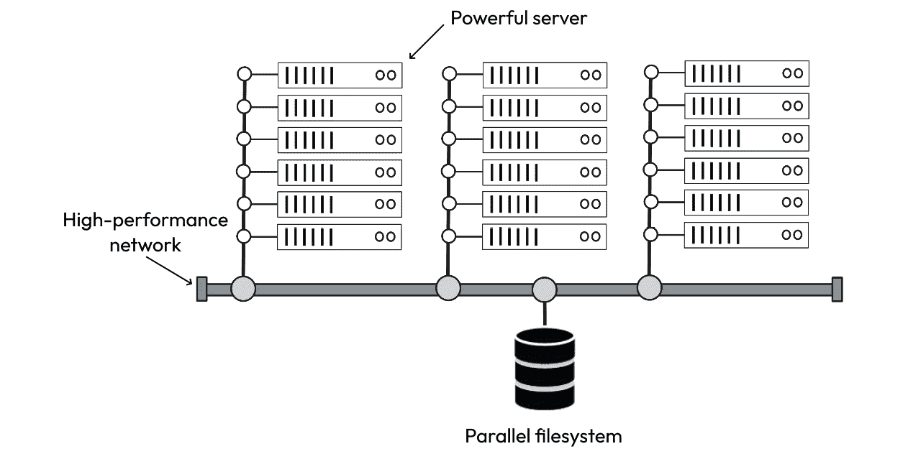
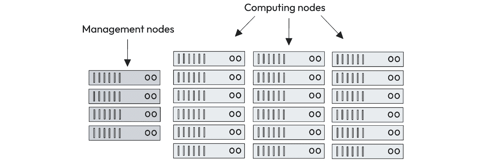
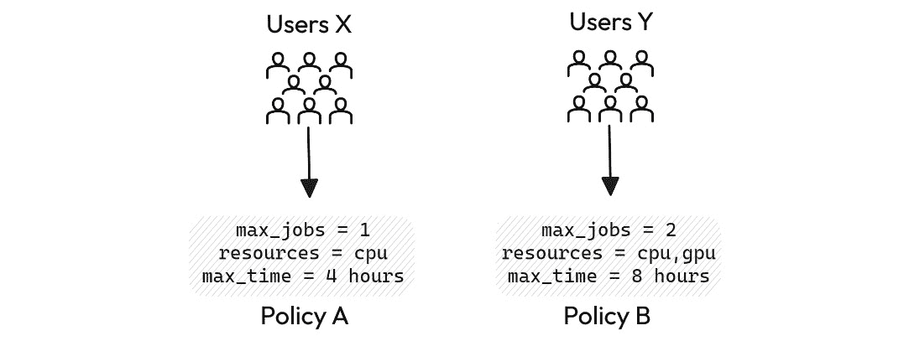
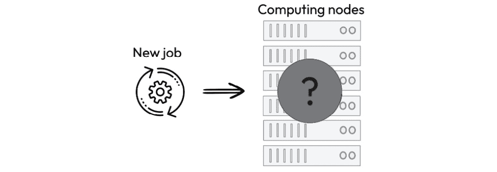
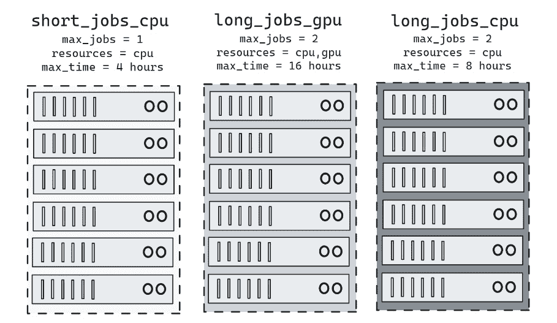
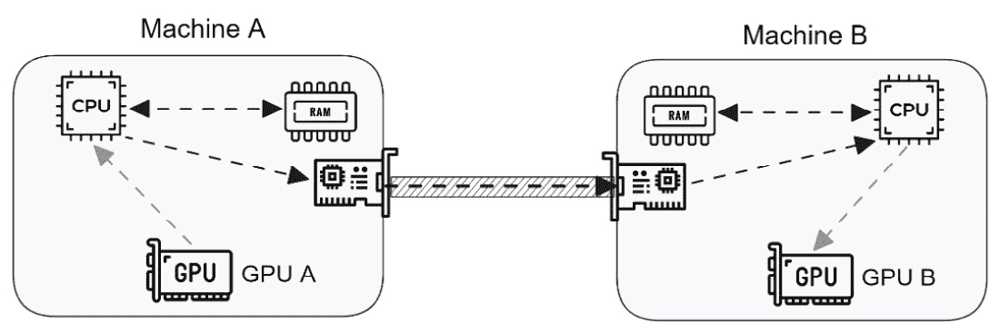
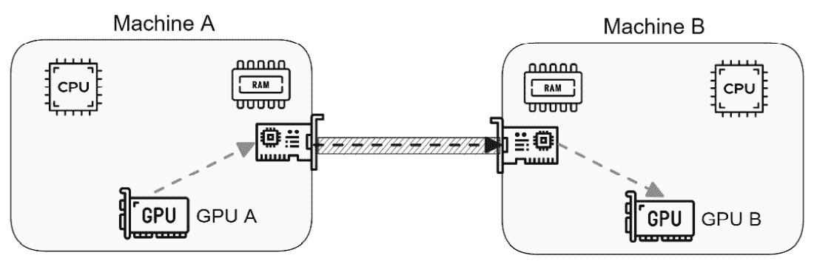

# 第十一章：使用多台机器进行训练

我们终于到达了性能提升之旅的最后一英里。在这最后阶段，我们将开阔视野，学习如何在多台机器或服务器间分布训练过程。所以，我们可以利用几十甚至上百个计算资源来训练我们的模型，而不仅仅是四台或八台设备。

一个由多个连接的服务器组成的环境通常被称为计算集群或简称为集群。这些环境被多个用户共享，并具有高带宽和低延迟网络等技术特性。

在本章中，我们将描述与分布式训练过程更相关的计算集群特性。接下来，我们将学习如何使用 Open MPI 作为启动器，以及 NCCL 作为通信后端，将训练过程分布到多台机器上。

以下是本章将学到的内容：

+   计算集群最相关的方面

+   如何在多个服务器间分布训练过程

+   如何使用 Open MPI 作为启动器和 NCCL 作为通信后端

# 技术要求

您可以在书的 GitHub 存储库中找到本章提到的示例的完整代码，网址为[`github.com/PacktPublishing/Accelerate-Model-Training-with-PyTorch-2.X/blob/main`](https://github.com/PacktPublishing/Accelerate-Model-Training-with-PyTorch-2.X/blob/main)。

您可以访问您喜爱的环境来执行此笔记本，例如 Google Colab 或 Kaggle。

# 什么是计算集群？

计算集群是由高性能网络互连的强大服务器系统组成的环境，如*图 11**.1*所示。此环境可以在本地部署或云中进行配置：



图 11.1 – 一个计算集群

这些机器提供的计算能力结合起来，用于解决复杂问题或执行高强度计算任务。计算集群也被称为**高性能计算**（**HPC**）系统。

每台服务器都拥有强大的计算资源，例如多个 CPU 和 GPU、快速内存设备、超快速磁盘和特殊的网络适配器。此外，计算集群通常还配备并行文件系统，提供高传输 I/O 速率。

虽然未正式定义，但我们通常使用术语“集群”来指代由至少四台机器组成的环境。一些计算集群有六台机器，而其他的则拥有超过两三百台服务器。

提交到集群的每个任务称为**作业**。当提交作业时，用户请求一定数量和类型的资源，并指示在环境中执行哪个程序。因此，运行在集群中的任何计算任务都被视为作业。

作业和操作系统进程有许多共同之处。作业像进程一样，在系统中由唯一编号标识，具有有限状态生命周期，并属于系统用户。

如*图 11**.2*形象地描述的那样，大部分服务器被用作**计算节点** – 换句话说，这些机器专门用于运行作业。一些机器，称为**管理节点**，用于执行监控和安装等管理任务，或提供辅助和补充服务，例如用户访问入口，通常称为**登录节点**。



图 11.2 – 管理和计算节点

托管在管理节点上的另一个重要服务是集群管理系统或**工作负载管理器**。由于集群被多个用户共享，有一个工作负载管理器是必不可少的，以确保资源的公平高效使用。让我们在下一节学习它。

## 工作负载管理器

工作负载管理器负责通过提供资源的公平高效使用来保持集群环境的顺畅运行。如*图 11**.3*所示，工作负载管理器位于用户和资源之间，接收来自用户的请求，处理这些请求，并授予或拒绝访问所需的资源：


图 11.3 – 工作负载管理器

在该系统执行的任务中，有两个任务脱颖而出：资源管理和作业调度。以下各节简要描述了它们。

### 资源管理

大致来说，集群可以看作是一组共享资源的池子，这些资源被一组用户消耗。**资源管理**的主要目标是确保这些资源的公平使用。

公平使用意味着避免不平衡的情况，例如贪婪用户消耗所有可用资源，防止不频繁的用户无法访问环境。

资源管理依赖于**资源分配策略**来决定何时以及如何处理用户的请求。此策略可用于定义优先级别、最大使用时间、最大运行作业数、资源类型以及许多其他条件。

基于这些策略，集群管理员可以根据由负责集群的组织或部门定义的标准，为用户分配不同的策略。

例如，集群管理员可以定义两种资源分配策略，以限制问题，如最大运行作业数、资源类型以及运行作业的最大允许时间。如*图 11**.4*所示，更严格的策略，命名为**A**，可以应用于用户组**X**，而更宽松的策略，命名为**B**，可以分配给用户**Y**：



图 11.4 – 资源分配策略示例

通过这样做，集群管理员可以确定集群的不同使用配置文件。

### 作业调度

工作负载管理器还负责资源的高效使用。为了达到这个目标，工作负载管理器必须在计算节点上执行一个最优（或次优）的作业分配。这个过程被称为**作业调度**，并定义为决定在哪里运行新作业的任务。

如 *图 11**.5* 所示，工作负载管理器必须选择新作业将在其中执行的计算节点。为了做出这一决定，工作负载管理器评估了请求资源的数量和类型以及所有计算节点中可用资源的数量和类型。通过这样做，作业调度得到了一组适合执行作业的潜在节点列表 – 换句话说，具有足够资源满足作业需求的节点。



图 11.5 – 作业调度

从潜在节点列表中，作业调度需要决定选择哪个节点来执行作业。此决策根据调度策略做出，该策略可能优先满足所有节点，然后再使用另一个节点，或者尽可能将作业分配到计算节点中，以避免因共享资源访问冲突而引起的干扰。

这些部分提供了工作负载管理器如何工作的一般解释。在实际操作中，真实的工作负载管理器具有特定的实现方式和资源管理和作业调度过程。

有一些工作负载管理器可供选择。有些是专有的和供应商特定的，而另一些是免费和开源的，比如 SLURM，它是目前最广泛使用的工作负载管理器。让我们在下一节介绍这个系统。

### 满足 SLURM 工作负载管理器

SLURM 的网站将其描述为一个“*开源、容错和高度可扩展的大型和小型 Linux 集群管理和作业调度系统*” – 这是正确的。

注意

您可以在此链接找到关于 SLURM 的更多信息：[`slurm.schedmd.com/`](https://slurm.schedmd.com/)

SLURM 强大、健壮、灵活且易于使用和管理。除了任何工作负载管理器中的基本功能外，SLURM 还提供特殊功能，如**QOS**（服务质量）、计费、数据库存储以及允许您获取环境信息的**API**（应用程序编程接口）。

这个工作负载管理器使用**分区**的概念来组织计算节点，并在可用资源上定义资源分配策略，如 *图 11**.6* 所示：



图 11.6 – SLURM 分区示例

在图 *11**.6* 中所示的示例中，我们有三个分区，每个分区有八个计算节点，但具有不同的资源分配策略。例如，`short_jobs_cpu` 分区允许您运行最长四小时的作业，而 `long_jobs_cpu` 分区的最长执行时间为八小时。此外，只有 `long_jobs_gpu` 分区拥有可以运行 GPU 作业的计算节点。

注意

SLURM 使用术语 **partition** 来表示其他工作负载管理器称为 **queue** 的内容。尽管如此，分区在本质上像一个队列，接收作业请求并根据资源分配和作业调度策略组织其执行。

因此，分区是 SLURM 架构的一个核心方面。有了分区，集群管理员可以使用不同的资源分配策略，并且可以将节点分开以运行特定应用程序或留待某个部门或用户组专属使用。

当用户提交作业时，他们必须指定作业将运行的分区。否则，SLURM 将作业提交到由集群管理员定义的默认分区。

当使用计算集群时，我们可能会遇到其他工作负载管理器，如 OpenPBS、Torque、LSF 和 HT Condor。然而，由于在高性能计算行业中的广泛采用，更有可能在您访问的集群上遇到 SLURM 作为工作负载管理器。因此，我们建议您投入一些时间来深入了解 SLURM。

除了工作负载管理外，计算集群还有另一个在这些环境中尤为重要的组件：高性能网络。下一节简要解释了这个组件。

## 理解高性能网络

在单台机器上运行分布式训练与使用计算集群之间的一个重要区别是用于连接服务器的网络。网络对参与分布式训练的进程间通信施加了额外的瓶颈。幸运的是，计算集群通常配备高性能网络，以连接环境中的所有服务器。

这种高性能网络与普通网络的区别在于其高带宽和非常低的延迟。例如，以太网 10 Gbps 的最大理论带宽约为 1.25 GB/s，而 **NVIDIA InfiniBand** 100 Gbps EDR，作为最广泛采用的高性能网络之一，提供的带宽接近 12.08 GB/s。换句话说，高性能网络可以提供比普通网络高出 10 倍的带宽。

注意

您可以在这个链接找到关于 NVIDIA InfiniBand 的更多信息：[`www.nvidia.com/en-us/networking/products/infiniband/`](https://www.nvidia.com/en-us/networking/products/infiniband/)

尽管 InfiniBand 提供的高带宽令人惊叹，但高性能网络之所以如此特别，是因为其非常低的延迟。与以太网 10 Gbps 相比，InfiniBand 100 Gbps EDR 的延迟几乎可以降低四倍。低延迟对于执行分布式应用程序至关重要。由于这些应用程序在计算过程中交换大量消息，消息中的任何延迟都可能使整个应用程序陷入停滞。

除了具有高带宽和低延迟之外，高性能网络（包括 InfiniBand）还具备另一种特殊功能，称为**远程直接内存访问**或**RDMA**。让我们在下一节中学习它。

### RDMA

RDMA 是高性能网络提供的一种功能，旨在减少设备之间的通信延迟。在了解使用 RDMA 的优势之前，我们首先应该记住常规通信是如何工作的。

**常规数据传输**涉及两个 GPU 的程序如*图 11.7*所示：



图 11.7 – 两个 GPU 之间的常规数据传输

首先，**GPU A**请求 CPU 将数据发送到位于**Machine B**上的**GPU B**。CPU 接收请求并在**Machine A**的主内存上创建缓冲区，用于存储要传输的数据。接下来，**GPU A**将数据发送到主内存，并通知 CPU 数据已经在主内存上准备就绪。因此，**Machine A**上的 CPU 将数据从主内存复制到网络适配器的缓冲区。然后，**Machine A**上的网络适配器与**Machine B**建立通信通道并发送数据。最后，**Machine B**上的网络适配器接收数据，并且**Machine B**执行与**Machine A**之前相同的步骤，将接收到的数据传递给**GPU B**。

请注意，此过程涉及许多主内存中数据的中介复制；换句话说，数据从 GPU 内存复制到主内存，然后从主内存复制到网络适配器的缓冲区，这两个方向都是如此。因此，很容易看出，此过程对位于远程机器上的 GPU 之间的通信施加了很高的开销。

为了克服这个问题，应用程序可以使用 RDMA 在设备之间传输数据。如*图 11.8*所示，RDMA 可以通过高性能网络直接从一个 GPU 传输数据到另一个 GPU。在完成初始设置后，网络适配器和 GPU 能够在*不涉及 CPU 和主内存*的情况下传输数据。因此，RDMA 消除了传输数据的大量中介复制，从而大幅降低通信延迟。这也是 RDMA 被称为**零拷贝**传输的原因。



图 11.8 – 两个 GPU 之间的 RDMA

要使用 RDMA，高性能网络、设备和操作系统必须支持此功能。因此，如果我们打算使用这个资源，我们应该首先与集群管理员确认在环境中是否可用以及如何使用它。

在学习了计算集群环境的主要特征后，我们可以继续学习如何在多台机器上实施分布式训练。

# 在多台机器上实施分布式训练

本节展示如何使用 Open MPI 作为启动提供程序和 NCCL 作为通信后端在多台机器上实施和运行分布式训练。让我们从介绍 Open MPI 开始。

## 介绍 Open MPI

**MPI**代表**消息传递接口**，是一个标准，规定了一套用于实现基于分布式内存的应用程序的通信例程、数据类型、事件和操作。MPI 对高性能计算行业非常重要，因此由全球知名的科学家、研究人员和专业人士组成的论坛管理和维护。

注意

您可以在此链接找到有关 MPI 的更多信息：[`www.mpi-forum.org/`](https://www.mpi-forum.org/)

因此，严格来说，MPI 不是软件；它是一种标准规范，可用于实现软件、工具或库。与非专有编程语言（如 C 和 Python）类似，MPI 也有许多实现。其中一些是供应商特定的，例如 Intel MPI，而另一些是免费和开源的，例如 MPICH。

在所有实现中，**Open MPI**作为最知名和采用最广泛的 MPI 实现之一脱颖而出。Open MPI 是免费的、开源的，并由包括 AMD、AWS、IBM、Intel 和 NVIDIA 在内的多家主要技术公司组成的贡献者联盟维护。该联盟还依靠著名大学和研究机构，如洛斯阿拉莫斯国家实验室和法国国家计算机科学与控制研究所(Inria)。

注意

您可以在此链接找到有关 Open MPI 的更多信息：[`www.open-mpi.org/`](https://www.open-mpi.org/)

Open MPI 不仅仅是一个用于应用程序上实现 MPI 例程的库，它还是一个提供编译器、调试器和完整运行时机制等其他组件的工具集。

下一节介绍如何执行 Open MPI 程序。这些知识对于学习如何启动分布式训练过程非常重要。

### 执行 Open MPI 程序

要执行 Open MPI 程序，我们应该调用`mpirun`命令并传递 MPI 程序和进程数量作为参数：

```py
maicon@packt:~$ mpirun --np 2 my_mpi_program
```

`--np`参数告诉 Open MPI 它必须创建的进程数。如果没有其他信息传递给 Open MPI，它将在本地创建这些进程 – 换句话说，在调用`mpirun`命令的机器上。要在远程机器上实例化进程，我们必须使用`--host`参数，后跟逗号分隔的远程机器列表：

```py
maicon@packt:~$ mpirun --np 2 --host r1:1,r2:1 my_mpi_program
```

在前面的示例中，`mpirun` 将执行两个进程，一个在`r1`远程机器上，另一个在`r2`远程机器上。名称后面的值表示该机器愿意接受的槽位（或进程）数。例如，如果我们要执行六个进程，其中四个在`r1`远程机器上，两个在`r2`远程机器上，我们应该调用以下`mpirun`命令：

```py
maicon@packt:~$ mpirun --np 6 --host r1:4,r2:2 my_mpi_program
```

Open MPI 将一些环境变量设置为由`mpirun`命令创建的每个进程的作用域。这些环境变量提供了关于分布式环境的重要信息，例如进程的排名。其中三个对我们的情况特别有趣：

+   `OMPI_COMM_WORLD_SIZE`：参与分布式执行的进程总数

+   `OMPI_COMM_WORLD_RANK`：进程的**全局排名**

+   `OMPI_COMM_WORLD_LOCAL_RANK`：进程的**局部排名**

要理解全局排名与局部排名的区别，让我们拿六个进程的前面示例，并在*表 11.1*中列出每个进程的全局和局部排名值：

| **进程** | **远程机器** | **全局排名** | **局部排名** |
| --- | --- | --- | --- |
| 0 | r1 | 0 | 0 |
| 1 | r1 | 1 | 1 |
| 2 | r1 | 2 | 2 |
| 3 | r1 | 3 | 3 |
| 4 | r2 | 4 | 0 |
| 5 | r2 | 5 | 1 |

表 11.1 – 全局排名与局部排名

正如*表 11.1*所示，**全局排名**是进程的全局标识 – 换句话说，无论进程在哪台机器上运行，它都有一个全局标识。

`r2`机器，那么进程 5 和 6 的局部排名分别等于 0 和 1。

局部排名的概念可能看起来违反直觉且无用，但事实并非如此。局部排名在分布式程序中非常有用，特别适合我们的分布式训练过程。等着瞧吧！

## 为什么要使用 Open MPI 和 NCCL？

你可能会想为什么我们使用 Open MPI 作为启动器和 NCCL 作为通信后端。事实上，也许你在问自己以下问题：

1.  是否可以同时使用 Open MPI 作为启动器和通信后端？

1.  是否可以使用 NCCL 作为通信后端和`torchrun`作为启动器？

对于这些问题的简短答案是：“*是的，这是可能的*。”然而，采用这些方法也存在一些缺点。让我们逐个讨论。

因为我们正在使用多 GPU 运行分布式训练，所以对于这种情况，最好的通信后端肯定是 NCCL。尽管可以使用 Open MPI 作为此场景的通信后端，但由 NCCL 提供的集体操作是针对 NVIDIA GPU 进行了最优化的。

因此，现在我们知道为什么应选择 NCCL 而不是 Open MPI 作为通信后端。但为什么不像到目前为止那样使用 `torchrun` 作为启动提供程序呢？

嗯，`torchrun` 是在本地运行分布式训练的一个很好的选择。但是，要在多台机器上运行分布式训练，我们需要在每台参与分布式环境的远程机器上手动执行 `torchrun` 实例。

与 `torchrun` 不同，Open MPI 在本地支持更轻松、更优雅地在远程机器上执行。通过使用其运行时机制，Open MPI 可以顺利在远程机器上创建进程，使我们的生活更加轻松。

简而言之，我们决定同时使用 NCCL 和 Open MPI，以获取两者结合的最佳效果。

## 为多台机器编写并启动分布式训练

分发训练进程的代码几乎与*第十章*中呈现的代码相同，*使用多个 GPU 进行训练*。毕竟，我们将执行多 GPU 训练，但是使用多台机器。因此，我们将调整多 GPU 实现，以使用 Open MPI 作为启动提供程序在多台机器上执行。

因为我们将使用 Open MPI 作为启动器，所以用于启动分布式训练的脚本将不会执行 `torchrun` 命令，就像我们在最后两章中所做的那样。因此，我们需要从头开始创建一个脚本来采用 Open MPI 作为启动方法。

让我们继续学习如何调整多 GPU 实现并创建在计算集群环境中进行分布式训练的启动脚本的以下部分。

### 为多台机器编写分布式训练代码

与*第十章*中呈现的多 GPU 实现相比，在计算集群中运行分布式训练的代码有以下三个修改：

```py
os.environ['RANK'] = os.environ['OMPI_COMM_WORLD_RANK']os.environ['WORLD_SIZE'] = os.environ['OMPI_COMM_WORLD_SIZE']
device = int(os.environ['OMPI_COMM_WORLD_LOCAL_RANK'])
```

注

此部分展示的完整代码可在 [`github.com/PacktPublishing/Accelerate-Model-Training-with-PyTorch-2.X/blob/main/code/chapter11/nccl_mpi_distributed-efficientnet_cifar10.py`](https://github.com/PacktPublishing/Accelerate-Model-Training-with-PyTorch-2.X/blob/main/code/chapter11/nccl_mpi_distributed-efficientnet_cifar10.py) 查看。

前两个修改涉及设置环境变量 `RANK` 和 `WORLD_SIZE`，这些变量被 `init_process_group` 方法所需，用于创建通信组。由于 Open MPI 使用其他变量名来存储这些信息，我们需要在代码中明确定义这些变量。

第三处修改与定义每个进程分配的设备（GPU，在本例中）有关。正如我们在前一节中学到的，本地排名是一个索引，用于标识每台机器上运行的进程。因此，我们可以利用这些信息作为选择每个进程使用的 GPU 的索引。因此，代码必须将`OMPI_COMM_WORLD_LOCAL_RANK`环境变量的内容分配给`device`变量。

例如，考虑使用每台装备有四个 GPU 的两台机器执行包含八个进程的分布式训练的情况。前四个进程的全局和本地排名分别为 0、1、2 和 3。因此，全局排名为 0 的进程，其本地排名为 0，将使用**第一台机器**上的`#0` GPU，其他进程依此类推。

关于第二台机器上的四个进程，全局排名为 4 的进程，也就是第二台机器上的第一个进程，其本地排名为 0。因此，全局排名为 4 的进程将访问**第二台机器**上的`#0` GPU。

只需对多 GPU 代码进行这三处修改即可使其在多台机器上运行。在下一节中，让我们看看如何通过使用 Open MPI 启动分布式训练。

### 在多台机器上启动分布式训练

要将 Open MPI 作为启动器使用，我们需要在计算集群环境中安装它。由于我们将 Open MPI 作为外部组件而不是内置在 PyTorch 中使用，因此这个安装应该由集群管理员提供。集群管理员应该按照 Open MPI 网站上描述的安装说明进行操作。

一旦我们在环境中安装了 Open MPI，我们有两种方法可以在多台机器上启动分布式训练。我们可以*手动执行*，也可以*提交作业*到工作负载管理器。让我们首先学习如何手动执行。

#### 手动执行

要手动执行分布式训练，我们可以使用类似以下的启动脚本：

```py
TRAINING_SCRIPT=$1NPROCS= "16"
HOSTS="machine1:8,machine2:8"
COMMAND="python $TRAINING_SCRIPT"
export MASTER_ADDR="machine1"
export MASTER_PORT= "12345"
mpirun -x MASTER_ADDR -x MASTER_PORT --np $NPROCS --host $HOSTS $COMMAND
```

注意

本节展示的完整代码可在[`github.com/PacktPublishing/Accelerate-Model-Training-with-PyTorch-2.X/blob/main/scripts/chapter11/launch_multiple_machines.sh`](https://github.com/PacktPublishing/Accelerate-Model-Training-with-PyTorch-2.X/blob/main/scripts/chapter11/launch_multiple_machines.sh)找到。

正如我们之前提到的，这个脚本不同于基于`torchrun`的脚本。脚本不再调用`torchrun`命令，而是执行`mpirun`，正如我们在前几节中学到的。此脚本中的`mpirun`命令使用五个参数执行。我们逐一来看它们。

前两个参数使用`mpirun`的`-x`参数将`MASTER_ADDR`和`MASTER_PORT`环境变量导出到训练程序中。

通过这样做，`init_process_group`方法可以正确地创建通信组。`MASTER_ADDR`环境变量指示启动脚本将在其中执行的机器。在我们的案例中，它在`machine1`上执行。`MASTER_PORT`环境变量定义通信组用于与参与分布式环境中所有进程建立通信的 TCP 端口号。我们可以选择一个较高的数字，以避免与任何绑定的 TCP 端口冲突。

`--np`参数确定进程数，`--host`参数用于指示`mpirun`将在其中创建进程的机器列表。在此示例中，我们考虑两台名为`machine1`和`machine2`的机器。由于每台机器都有八个 GPU，其名称后跟数字八，以指示每台服务器可以执行的最大进程数。

最后一个参数是基于 MPI 的程序。在我们的情况下，我们将传递 Python 解释器的名称，然后是训练脚本的名称。

要执行此脚本运行名为`distributed-training.py`的程序，我们只需运行以下命令：

```py
maicon@packt:~$ ./launch_multiple_machines.sh distributed-training.py
```

注意

本节中显示的完整代码可在[`github.com/PacktPublishing/Accelerate-Model-Training-with-PyTorch-2.X/blob/main/scripts/chapter11/launch_multiple_machines_container.sh`](https://github.com/PacktPublishing/Accelerate-Model-Training-with-PyTorch-2.X/blob/main/scripts/chapter11/launch_multiple_machines_container.sh)找到。

当然，此脚本可以定制以接受其他参数，如进程数量、主机列表等。然而，我们在这里的目的是展示手动使用 Open MPI 执行分布式训练的基本（尽管重要）方法。

#### 作业提交

考虑到工作负载管理器是 SLURM，我们必须执行以下步骤将作业提交到计算集群：

1.  创建一个批处理脚本来提交作业给 SLURM。

1.  使用`sbatch`命令提交作业。

在 SLURM 上提交分布式训练的批处理脚本如下所示：

```py
#!/bin/bash#SBATCH -n 16
#SBATCH --partition=long_job_gpu
#SBATCH --nodes=2
#SBATCH --gpus-per-node=8
export MASTER_ADDR=$(hostname)
export MASTER_PORT= "12345"
mpirun -x MASTER_ADDR -x MASTER_PORT --np 16 python /share/distributed-training.py
```

这个批处理脚本将提交一个作业请求两个节点，每个节点八个 GPU，在`long_job_gpu`分区上执行。就像在启动脚本中一样，我们还需要导出`MASTER_ADDR`和`MASTER_PORT`变量，以便`init_process_group`方法可以创建通信组。

创建脚本后，我们只需执行以下命令提交作业：

```py
maicon@packt:~$ sbatch distributed-training.sbatch
```

注意

之前提供的批处理脚本只是展示如何在 SLURM 上提交分布式训练作业的示例。由于每个计算集群环境可能有特殊性，最佳方法始终是遵循集群管理员关于使用 Open MPI 的指导方针。无论如何，您可以参考官方 SLURM 文档了解在[`slurm.schedmd.com/mpi_guide.html`](https://slurm.schedmd.com/mpi_guide.html)上运行 Open MPI 作业的详细信息。

在下一节中，我们将看一下在两台机器上运行分布式训练的结果。

## 实验评估

要评估在多台机器上进行的分布式训练效果，我们使用了两台每台装有 8 块 NVIDIA A100 GPU 的机器，对 EfficientNet 模型在 CIFAR-10 数据集上进行了 25 个 epochs 的训练作为实验基准，我们将使用在单台装有 8 块 GPU 的机器上训练此模型所需的执行时间作为基准，其时间为 109 秒。

使用 16 块 GPU 训练模型的执行时间为 64 秒，与在单台装有八块 GPU 的机器上训练模型所需的时间相比，性能提升了 70%。

乍一看，这个结果可能会有点令人失望，因为我们使用了双倍的计算资源，但只获得了 70%的性能提升。由于我们使用了两倍的资源，我们应该达到 100%的提升。

但是，我们应该记住，这个系统还有一个额外的组成部分：机器之间的互联。尽管它是一个高性能网络，但预计额外的元素会对性能产生一定影响。即便如此，这个结果还是相当不错的，因为我们接近了我们可以实现的最大性能改进——换句话说，接近了 100%。

正如预期的那样，模型的准确性从 68.82%降至 63.73%，证实了分布式训练中模型副本数量与精度之间关系的断言。

总结这些结果，我们可以强调两个有趣的见解如下：

+   当寻求性能改进时，我们必须始终关注模型的质量。正如我们在这里和前两章中看到的那样，在增加模型副本数量时，模型精度可能会出现潜在的降低。

+   当决定在多台机器之间分发训练时，我们应考虑互连网络可能带来的影响。根据具体情况，保持在单台多 GPU 机器内进行训练可能比使用多台服务器更有优势。

简而言之，盲目追求性能提升通常不是一个好主意，因为我们可能会因微小的性能提升或模型质量的悄然降低而导致资源浪费。因此，我们应始终注意性能改进、准确性和资源使用之间的权衡。

下一节提供了几个问题，帮助你巩固本章学到的内容。

# 测验时间！

让我们通过回答一些问题来回顾本章学到的内容。首先，尝试在不查阅材料的情况下回答这些问题。

注意

所有这些问题的答案都可以在[`github.com/PacktPublishing/Accelerate-Model-Training-with-PyTorch-2.X/blob/main/quiz/chapter11-answers.md`](https://github.com/PacktPublishing/Accelerate-Model-Training-with-PyTorch-2.X/blob/main/quiz/chapter11-answers.md)找到。

在开始测验之前，请记住这根本不是一个测试！本节旨在通过复习和巩固本章节涵盖的内容来补充您的学习过程。

选择以下问题的正确选项：

1.  提交给计算集群的任务称为什么？

    1.  线程。

    1.  进程。

    1.  作业。

    1.  工作。

1.  工作负载管理器执行的主要任务是什么？

    1.  资源管理和作业调度。

    1.  内存分配和线程调度。

    1.  GPU 管理和节点调度。

    1.  资源管理和节点调度。

1.  以下哪个是大型和小型 Linux 集群的开源、容错和高度可扩展的工作负载管理器？

    1.  MPI。

    1.  SLURM。

    1.  NCCL。

    1.  Gloo。

1.  计算集群通常配备高性能网络，如 NVIDIA InfiniBand。除了提供高带宽外，高性能互连还提供以下哪些功能？

    1.  高延迟。

    1.  高数量的连接。

    1.  低连接数量。

    1.  非常低的延迟。

1.  RDMA 显著降低了两个远程 GPU 之间的通信延迟，因为它使以下哪个操作成为可能？

    1.  在 GPU 上分配更高的内存空间。

    1.  GPU 上的特殊硬件能力。

    1.  在不涉及 CPU 和主内存的情况下进行数据传输。

    1.  在不涉及网络适配器和交换机的情况下进行数据传输。

1.  Open MPI 的最佳定义是以下哪个？

    1.  Open MPI 是用来创建分布式应用的编译器。

    1.  Open MPI 是一个工具集，包括编译器、调试器和完整的运行时机制，用于创建、调试和运行分布式应用。

    1.  [Open MPI](https://wiki.example.org/open_mpi) 是一个标准，指定了一组用于实现分布式应用的通信例程、数据类型、事件和操作。

    1.  Open MPI 是专门用于在 PyTorch 下运行分布式训练的通信后端。

1.  考虑这样一个情景，一个分布式训练在两台机器上运行四个进程（每台机器执行两个进程）。在这种情况下，Open MPI 为第二台机器上执行的两个进程分配了什么等级？

    1.  0 和 1。

    1.  0 和 2。

    1.  2 和 3。

    1.  0 和 3。

1.  关于将训练过程分布在多台机器上还是保留在单个主机的决定，合理考虑以下哪个选项？

    1.  使用网络适配器的功耗。

    1.  网络适配器上可用内存空间的泄漏。

    1.  没有；通常建议使用多台机器来运行分布式训练。

    1.  互连网络可能对参与分布式训练的进程之间的通信产生何种影响。

# 总结。

在本章中，我们学习了如何将训练过程分布到多台机器上的多个 GPU 上。我们使用 Open MPI 作为启动提供程序和 NCCL 作为通信后端。

我们决定使用 Open MPI 作为启动器，因为它提供了一种简单而优雅的方式在远程机器上创建分布式进程。虽然 Open MPI 也可以作为通信后端使用，但更推荐采用 NCCL，因为它在 NVIDIA GPU 上具有最优化的集合操作实现。

结果显示，使用两台机器上的 16 个 GPU 进行分布式训练比单机上的 8 个 GPU 运行速度快 70%。模型准确率从 68.82%降到了 63.73%，这是预料之中的，因为我们在分布式训练过程中复制了模型的数量。

本章结束了我们关于如何通过 PyTorch 加速训练过程的旅程。除了了解如何应用技术和方法来加快模型训练速度之外，我们希望您已经领悟到本书的核心信息：性能改进并不总是与新的计算资源或新型硬件有关；通过更有效地利用手头上的资源，我们可以加速训练过程。
