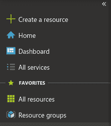
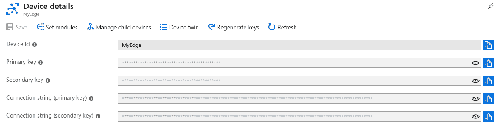
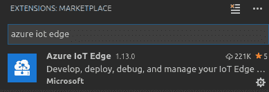
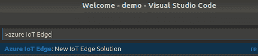
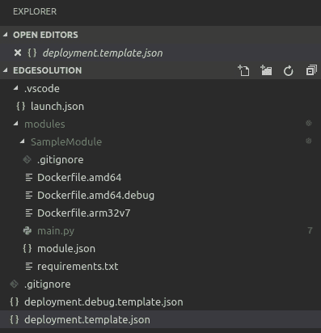
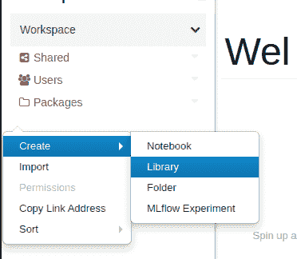
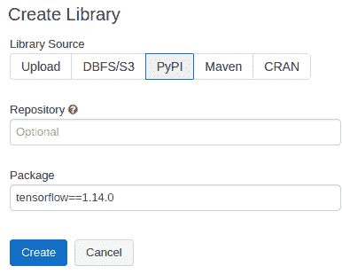

# 第一章：设置 IoT 和 AI 环境

**物联网**（**IoT**）和**人工智能**（**AI**）正在对人们的生活产生重大影响。像医疗这样的行业正在通过可穿戴传感器的革命性进展来监测病人出院后的情况。在工业设备上使用的**机器学习**（**ML**）通过异常检测、预测性维护和指导性行动等技术，实现了更好的监控和更少的停机时间。

构建能够提供结果的 IoT 设备依赖于收集正确信息。本书提供支持端到端 IoT/ML 生命周期的配方。下一章提供了确保设备配备正确传感器和数据最佳化以支持 ML 结果的配方。工具如解释性因子分析和数据收集设计被广泛使用。

本章将涵盖以下主题：

+   Choosing a device

+   设置 Databricks

将涵盖以下配方：

+   设置 IoT Hub

+   设置 IoT Edge 设备

+   将 ML 模块部署到 Edge 设备

+   设置 Kafka

+   在 Databricks 上安装 ML 库

# Choosing a device

在开始经典的食谱格式化烹饪书之前，我们将从涵盖几个基础主题开始。选择合适的硬件为 AI 铺平道路。在 IoT 中工作意味着要处理各种限制。在云端使用 ML 通常是一种经济高效的解决方案，只要数据量不大。图像、视频和音频数据通常会拖慢网络速度。更糟的是，如果使用蜂窝网络，成本可能会非常高昂。谚语*在硬件上没有钱*指的是大多数 IoT 赚钱来自销售服务，而不是生产昂贵设备。

## Dev kits

通常，公司会让电气工程师设计他们的设备，这是一种经济高效的选择。定制板不会有额外的组件，比如不必要的蓝牙或额外的 USB 端口。然而，在板设计时预测 ML 模型的 CPU 和 RAM 需求是困难的。入门套件可以是在了解硬件需求之前使用的有用工具。以下板块是市场上被广泛采用的：

+   Manifold 2-C 与 NVIDIA TX2

+   i.MX 系列

+   LattePanda

+   树莓派类

+   Arduino

+   ESP8266

它们通常被用作功能的标尺。例如，树莓派类设备在自定义视觉应用方面可能会有些吃力，但在音频或通用 ML 应用方面表现良好。许多数据科学家的一个决定性因素是编程语言。ESP8266 和 Arduino 需要用低级语言如 C 或 C++进行编程，而像树莓派类及以上的设备可以使用任何语言。

不同的设备具有不同的价格和功能。类似树莓派或更高级别的设备可以处理边缘 ML 运行，减少云成本但增加设备成本。决定是对设备收取一次性价格还是订阅模式可能有助于确定需要的设备类型。

### Manifold 2-C with NVIDIA TX2

NVIDIA Jetson 是运行复杂 ML 模型（如边缘实时视频）的最佳选择之一。NVIDIA Jetson 配备内置的 NVIDIA GPU。该产品的 Manifold 版本设计用于安装在 DJI 无人机上，并执行图像识别或自主飞行等任务。运行 NVIDIA Jetson 的唯一不利之处是其使用的 ARM64 架构。ARM64 在 TensorFlow 上表现不佳，尽管其他库如 PyTorch 在 ARM64 上运行良好。Manifold 的零售价为$500，这使其成为高价位选择，但在边缘实时 ML 方面通常是必要的：

| **价格** | **典型模型** | **使用案例** |
| --- | --- | --- |
| $500 | 强化学习，计算机视觉 | 自主飞行无人机，机器人技术 |

### **i.MX 系列**

i.MX 系列芯片是开源的，具有强大的 RAM 和 CPU 能力。开放设计有助于工程师轻松构建板卡。i.MX 系列使用 Freescale 半导体。Freescale 半导体保证 10 到 15 年的生产周期，这意味着板卡设计在未来数年内将保持稳定。i.MX 6 的成本可在$200 到$300 之间，并且可以轻松处理 CPU 密集型任务，例如实时流视频中的目标识别：

| **价格** | **典型模型** | **使用案例** |
| --- | --- | --- |
| $200+ | 计算机视觉，自然语言处理 | 情感分析，人脸识别，物体识别，语音识别 |

### **LattePanda**

**单板计算机**（**SBCs**）如 LattePanda 能够运行大量传感器工作负载。这些设备通常可以运行 Windows 或 Linux。像 i.MX 系列一样，它们能够在设备上运行目标识别；然而，识别对象的帧率可能较慢：

| **价格** | **典型模型** | **使用案例** |
| --- | --- | --- |
| $100+ | 人脸检测，语音识别，高速边缘模型 | 启用音频的信息亭，高频率心脏监测 |

### **树莓派类型**

树莓派是物联网的标准入门套件。以$35 的价格标签，它们为成本提供了很多功能：它们可以在边缘上通过容器运行 ML。它们具有 Linux 或 IoT Core 操作系统，可以轻松插拔组件，并有开发者社区构建类似的平台工具。尽管树莓派类型设备能够处理大多数 ML 任务，但在某些更具挑战性的任务（如视频识别）上可能存在性能问题：

| **价格** | **典型模型** | **使用案例** |
| --- | --- | --- |
| $35 | 决策树，人工神经网络，异常检测 | 智能家居，工业物联网 |

### **Arduino**

在$15 处，Arduino 是一种经济实惠的解决方案。Arduino 得到了大型社区的支持，使用 Arduino 语言，一组 C/C++函数。如果需要在 Arduino 设备上运行 ML 模型，则可以将建立在诸如 PyTorch 等流行框架上的 ML 模型打包到**嵌入式学习库**（**ELL**）中。ELL 允许在设备上部署 ML 模型，而无需大型操作系统的开销。由于 Arduino 的内存和计算能力有限，使用 ELL 或 TensorFlow Lite 移植 ML 模型可能具有挑战性：

| **价格** | **典型模型** | **使用案例** |
| --- | --- | --- |
| $15 | 线性回归 | 传感器读数分类 |

### **ESP8266**

在低于$5 的情况下，诸如 ESP8266 和更小的设备代表了一类设备，它们接收数据并将其传输到云端进行 ML 评估。除了价格低廉外，它们通常也是低功耗设备，因此可以通过太阳能、网络电源或长寿命电池供电：

| **价格** | **典型模型** | **使用案例** |
| --- | --- | --- |
| $5 或更低 | 仅在云中 | 仅在云中 |

# 设置 Databricks

在单台计算机上处理大量数据是不可能的。这就是像 Spark（由 Databricks 制作）这样的分布式系统的用武之地。Spark 允许您在许多计算机上并行处理大量工作负载。

Spark 的开发是为了帮助解决**Netflix Prize**，该奖项为开发最佳推荐引擎的团队提供了 100 万美元的奖金。Spark 使用分布式计算来处理大型和复杂的数据集。还有分布式 Python 等效库，如 Koalas，它是 pandas 的分布式等效版本。Spark 还支持需要大量计算和内存的分析和特征工程，如图理论问题。Spark 有两种模式：用于训练大型数据集的批处理模式和用于几乎实时评分数据的流处理模式。

IoT 数据通常是庞大且不平衡的。设备可能有 10 年的数据表明它在正常条件下运行，只有少数记录表明需要立即关闭以防止损坏。Databricks 在 IoT 中的价值是双重的。首先是处理数据和训练模型。在 TB 和 PB 级别上处理数据可能会超出单个机器的能力。Databricks 通过其可扩展性来解决这个问题。其次是其流处理能力。ML 模型可以在云中几乎实时地运行。然后可以将消息推送回设备。

设置 Databricks 非常简单。您可以访问您的云服务提供商，在门户中注册帐户或注册免费社区版。如果您要将产品投入生产，则应该选择 Azure、AWS 或 Google Cloud。

IoT 和 ML 从根本上讲是一个大数据问题。设备可能在数年间发送遥测数据，直到发送表明设备存在问题的遥测数据为止。从数据管理的角度来看，搜索数百万或数十亿条记录以找到所需的少数记录可能是具有挑战性的。因此，优化的数据存储是关键。

## 存储数据

如今有一些工具可以帮助处理大量数据变得更加容易。但需要记住几件事情。有一些优化的数据存储方式可以使处理大数据集更加容易。

处理数据时，来自 IoT 设备的大型数据集类型可能对许多公司来说成本过高。例如，将数据存储在 Delta Lake 中可以比通过 JSON 访问数据提供 340 倍的性能提升。接下来的三节将介绍三种可以将数据分析工作从数周缩短到数小时的存储方法。

### Parquet

Parquet 是大数据中最常见的文件格式之一。Parquet 的列式存储格式使其能够存储高度压缩的数据。其优势在于占用硬盘空间少，网络带宽消耗小，非常适合加载到 DataFrame 中。Parquet 在 Spark 中的数据导入速度比 JSON 快 34 倍。

### Avro

Avro 格式是 IoT 中常用的存储格式。虽然它没有 Parquet 那样的高压缩比，但由于使用了行级数据存储模式，存储数据的计算成本较低。Avro 是流数据（如 IoT Hub 或 Kafka）的常见格式。

### Delta Lake

Delta Lake 是由 Databricks 在 2019 年发布的开源项目。它将文件存储在 Parquet 中。此外，它还能够跟踪数据的检入，使数据科学家能够查看特定时间点的数据。这在尝试确定特定 ML 模型精度下降原因时非常有用。它还保存有关数据的元数据，使其在分析工作负载中比标准 Parquet 提供 10 倍的性能提升。

虽然在选择设备和设置 Databricks 时都需要考虑，但本章的其余部分将采用模块化、基于配方的格式。

# 设置 IoT Hub

开发 IoT 解决方案可能会很复杂。需要处理的问题包括 ML、边缘部署、安全性、监控设备状态以及云中遥测数据的摄取等。云服务提供商（如 Azure）提供了一个现成的解决方案，其中可能包括数据存储和云到设备消息等组件。

在本配方中，我们将在 Azure 中为 IoT Edge 设备设置 IoT Hub，该设备将在边缘上进行 ML 计算。

## 准备工作

在使用 IoT Hub 之前，您需要拥有一个设备和一个 Azure 订阅。如果您还没有订阅，可以使用免费试用订阅。您还需要某种类型的设备。

## 如何做…

要设置 IoT Hub，首先需要一个资源组。资源组类似于 Windows 或 macOS 上的文件夹。它们允许您将特定项目的所有资源放置在同一位置。资源组图标位于 Azure 门户左侧面板的收藏夹菜单中：



需要执行以下操作：

1.  选择 **创建资源**。然后，向导将指导您完成创建资源组的步骤。

1.  然后，点击顶部的 **+** 图标创建 IoT Hub 实例。

1.  在搜索框中键入 `IoT Hub`。然后，向导将指导您如何设置 IoT Hub。

在规模页面上需要注意的一点是，您需要选择 S1 或更高的定价层。S1 层使您可以与设备进行双向通信，并且还能使用高级功能，例如设备双和将 ML 模型推送到边缘设备的能力。

## 工作原理...

IoT Hub 是专为 IoT 开发的平台。解决影响 IoT 的问题，例如不可靠的通信，通过诸如**高级消息队列协议**（**AMQP**）和**消息队列遥测传输**（**MQTT**）等机制进行处理。IoT Hub 拥有丰富的工具生态系统，可帮助 IoT 开发人员，如设备双生，云到设备消息，设备安全中心，Kubernetes 集成以及边缘模块市场。

# 设置 IoT Edge 设备

在本示例中，我们将设置一个能够与 IoT Hub 通信并接收新的 ML 容器的 IoT Edge 设备，以便在设备上执行 ML 评估。

IoT Edge 设备比传统 IoT 设备有优势。主要优势在于它们能够通过**空中更新**（**OTA**）进行更新。通过使用容器，可以轻松部署模型，而无需担心设备砖化的问题。

## 准备工作

在创建 IoT Edge 设备之前，请确保您的设备受 IoT Edge 支持。某些设备架构（例如 ARM64）不受支持。接下来，请确保您在前一个示例中的 IoT Hub 实例正在运行。必须在设备上安装 IoT Edge 运行时。为了本教程的目的，我们将假设用户有一个 Raspberry Pi Class 设备。

## 如何做...

要设置 IoT Edge 设备，您需要同时设置云端和设备端。IoT 设备需要在云端有一个位置来发送其信息。本示例有两个部分。第一部分是在 IoT Hub 中配置 IoT Edge 设备。第二部分是配置设备与云端通信。

### 配置 IoT Edge 设备（云端）

步骤如下：

1.  在 IoT Hub 刀片中，选择 IoT Edge。

1.  点击“+ 添加 IoT Edge 设备”按钮。这将带您进入添加 IoT Edge 设备向导。

1.  给您的设备一个独特的设备 ID，并选择保存。

1.  屏幕中央将显示一个新设备。点击该设备并复制其主连接字符串：



接下来的部分解释了如何使设备与云端通信。为此，您将需要设备连接字符串。设备连接字符串可以在设备属性部分找到。点击您想要获取连接字符串的设备，并复制连接字符串。

### 配置 IoT Edge 设备（设备端）：

首先要做的是安装 Moby。Moby 是 Docker 的精简版本。Docker 允许您将 Edge 模块推送到设备上。这些模型可以是从传感器收集数据的模块，也可以是 ML 模块。步骤如下：

1.  下载并安装 Moby 引擎到设备上：

```py
curl -L https://aka.ms/moby-engine-armhf-latest -o moby_engine.deb && sudo dpkg -i ./moby_engine.deb
```

1.  下载并安装 Moby CLI：

```py
curl -L https://aka.ms/moby-cli-armhf-latest -o moby_cli.deb && sudo dpkg -i ./moby_cli.deb
```

1.  修复安装问题：

```py
sudo apt-get install -f
```

1.  安装 IoT Edge 安全管理器：

```py
curl -L https://aka.ms/libiothsm-std-linux-armhf-latest -o libiothsm-std.deb && sudo dpkg -i ./libiothsm-std.deb
```

1.  安装安全守护程序：

```py
curl -L https://aka.ms/iotedged-linux-armhf-latest -o iotedge.deb && sudo dpkg -i ./iotedge.deb
```

1.  修复安装问题：

```py
sudo apt-get install -f
```

1.  编辑 Edge 设备的配置文件。如果您的设备上尚未安装 `nano`，可能需要先安装它。`nano` 是基于命令行的文本编辑器，可通过 SSH 进行工作：

```py
 sudo nano /etc/iotedge/config.yaml
```

1.  在 `nano` 文本编辑器中查找设备连接字符串。然后，将您从 IoT Hub 门户复制的设备连接字符串粘贴到 `"<ADD DEVICE CONNECTION STRING HERE>"` 部分：

```py
provisioning:
  source: "manual"
  device_connection_string: "<ADD DEVICE CONNECTION STRING HERE>"
```

接下来，您需要保存并退出 `nano`。为此，请按下 *Ctrl* + *X*。终端将显示保存确认消息。按 *Y* 确认并保存。然后，是时候重新启动设备上的服务以应用更改了。

1.  使用以下命令重新启动 Edge 服务：

```py
sudo systemctl restart iotedge
```

## 工作原理如下...

在此教程中，我们创建了一个在云中具有特定密钥的设备。这是安全措施的一部分，每个设备都有自己的唯一密钥。如果设备被 compromise，可以关闭它。

然后我们将 IoT Edge SDK 添加到设备上，并将其连接到云端。在这一点上，设备已完全连接到云端，并准备好接收 ML 模型并将其遥测发送到云端。下一步是将 Edge 模块部署到设备上。这些 Edge 模块是 docker 化的容器，可以访问设备上的传感器，并将遥测发送到云端或运行经过训练的模型。

# 将 ML 模块部署到 Edge 设备：

Docker 是 IoT 设备部署的主要方法。Docker 允许您在本地创建和测试容器，并将其部署到边缘设备上。Docker 文件可以根据不同的芯片架构（如 x86 和 ARM）进行特别脚本化部署。在此教程中，我们将演示如何从云端创建一个带有 ML 库的 IoT Edge 模块。

## 准备工作：

要创建 IoT Edge 模块，首先安装 Visual Studio Code。安装并运行 Visual Studio Code 后，安装 Azure IoT Edge 扩展。可以通过在 Visual Studio Code 侧边栏中找到扩展图标（）来完成。在扩展搜索栏中搜索 `azure iot edge` 并安装扩展：



安装完扩展程序后，Visual Studio Code 现在有一个向导，可以创建 IoT Edge 部署。通过少量修改，可以配置它以部署 ML 模型。

## 如何操作...

此配方的步骤如下：

1.  在 Visual Studio Code 中，按下*Ctrl* + *Shift* + *P*以打开命令窗口，并找到 Azure IoT Edge: New IoT Edge Solution:



1.  选择代码的位置。

1.  输入解决方案名称。

1.  选择一种语言。为了本书的目的，我们将使用 Python 作为我们的语言。

1.  创建一个模块名称。

1.  选择本地端口以在本地运行代码。

## 工作原理...

完成向导后，您应该在 Visual Studio Code 的资源管理器中看到类似以下内容：



让我们探索为您创建的内容。项目的主入口点是 `main.py`。`main.py` 中有一个示例，可以帮助加快开发时间。要部署 `main.py`，您将使用 `deployment.template.json` 文件。右键单击 `deployment.template.json` 将弹出一个菜单，其中包含创建部署清单的选项。在 `modules` 文件夹中，有一个包含三个 Docker 文件的示例模块，用于 ARM32、AMD64 和调试模式下的 AMD64。这些是当前支持的芯片架构。`Dockerfile.arm32v7` 是支持树莓派 v3 的架构。

为了确保构建 ARM32 容器而不是 AMD64 容器，请进入 `module.json` 文件并删除任何其他 Docker 文件的引用。例如，以下内容有三个 Docker 引用：

```py
platforms": {
      "amd64": "./Dockerfile.amd64",
      "amd64.debug": "./Dockerfile.amd64.debug",
      "arm32v7": "./Dockerfile.arm32v7"
    }
```

删除两个未使用的 Docker 引用后，新文件现在应如下所示：

```py
platforms": {      
"arm32v7": "./Dockerfile.arm32v7"
}
```

## 还有更多...

要安装 TensorFlow（这是一个 ML 库）、Keras（这是一个在 TensorFlow 之上的抽象层，使编程更加简单）和 `h5py`（这是一个序列化层，允许您序列化和反序列化 TensorFlow 模型），请进入目标 Docker 容器，然后进入 `requirements.txt` 文件，并插入以下内容来安装库：

```py
tensorflow
keras
h5py
```

# 设置 Kafka

Kafka 是一个开源项目，在规模上非常经济实惠，可以以毫秒级延迟执行 ML 模型，并具有多主题发布/订阅模型。有几种设置 Kafka 的方式。它是一个开源项目，因此您可以下载 Kafka 项目并在本地运行 Zookeeper 和 Kafka。Kafka 的母公司 Confluent 提供了一个付费服务，提供许多额外的功能，如仪表板和 KSQL。它们在 Azure、AWS 和 Google Cloud 中作为托管服务提供，您也可以将 Kafka 作为 Docker 容器来进行开发使用。

使用 Kafka 的一个缺点是需要大量额外的开销来使其成为一个良好的物联网项目。例如，Kafka 默认情况下不安全。安全性通过一系列插件处理，包括设备端通过 x.509 证书以及云端通过**轻量级目录访问协议**（**LDAP**）、Ranger 或 Kerberos 插件。部署 ML 模型也并非易事。任何 ML 库都需要转换为 Java 编译器可用的形式。TensorFlow 有适用于 Java 的 TensorFlow，但许多 ML 库在 Java 中不可用。

## 准备就绪

在本示例中，我们将在`docker-compose`中使用 Confluent Kafka。您需要在计算机上安装 Git、Docker 和`docker-compose`才能运行此食谱。要将 ML 模型添加到 Kafka 流中，您需要使用在 Java 上运行的平台，例如 H2O 或 TensorFlow。

## 如何实现...

此食谱的步骤如下：

1.  克隆存储库：

```py
git clone https://github.com/confluentinc/cp-all-in-on
```

1.  运行`docker-compose`：

```py
docker-compose up -d --build
```

Confluent Kafka 带有许多容器。等待大约 10 分钟使容器完成启动后，打开浏览器，访问`localhost:9091`以查看 Kafka 控制中心。

## 工作原理...

Kafka 使用日志来记录来自最终用户的数据流入主题。这些主题可以被数据的消费者读取。使 Kafka 在物联网社区中成为流行工具的原因是其先进的特性。多个流可以合并，并且流可以转换为基于键/值的表格，其中最新的流更新表格。但更重要的是，对于本书的目的，ML 算法可以在毫秒级延迟的流数据上运行。本示例展示了如何将数据推送到 Kafka，然后创建一个 Java 项目以实时处理数据。

## 这还不是全部...

将数据流入 Kafka 相当简单。有生产者发送设备到云的消息和消费者接收云到设备的消息。在以下示例中，我们将实现一个生产者：

1.  下载示例项目：

```py
git clone https://github.com/Microshak/KafkaWeatherStreamer.git
cd KafkaWeatherStreamer
```

1.  安装必要的依赖：

```py
pip install -r requirements.txt
```

1.  运行`weather.py`文件：

```py
python3 weather.py
```

现在您应该能够查看 Kafka 控制中心，并看到数据正在流入。Kafka Streams API 是一个实时平台，可以以毫秒级延迟执行 ML 计算。Streams API 具有 KTables 和 KStreams 的概念。KStreams 是流入 Kafka 的各种主题的数据流。KTables 是流转换成表格，其中数据每次有与其主键关联的新记录时更新。这允许将多个流类似于数据库中的表进行联接，使 Kafka 能够不仅处理单个设备，还能够从多个源获取设备数据并将流组合在一起。

要使用 Streams API，您必须首先在计算机上安装 Java 和 Maven。此外，您还需要安装用于 Java 开发的集成开发环境，例如 IntelliJ。安装完所有先决条件后，运行 Maven 原型以生成启动 Kafka Streams API 项目所需的代码：

```py
mvn archetype:generate \
    -DarchetypeGroupId=org.apache.kafka \
    -DarchetypeArtifactId=streams-quickstart-java \
    -DarchetypeVersion=2.2.0 \
    -DgroupId=streams.examples \
    -DartifactId=streams.examples \
    -Dversion=0.1 \
    -Dpackage=myapps
```

在 IntelliJ 中打开新创建的项目，您就可以开始编写针对 Kafka Streams API 的代码了。Confluent，Kafka 的制造商的座右铭是：“*It's just Java*”。他们的意思是，一旦您进入 Streams API，您可以编写 Java 代码来做任何您想做的事情。这可能是向网站发送 WebSocket 信息或运行 ML 模型。如果可以用 Java 做到，那么在 KStreams 事件循环中也可以做到。有一些框架，如`deeplearning4j`，可以接受在 Python 中训练的 Keras 模型，并在 Java 中运行它们。

# 在 Databricks 上安装 ML 库

Databricks 是一个统一的大数据和分析平台。它非常适合训练 ML 模型并处理 IoT 中常见的大规模数据。有一些扩展如 Delta Lake 允许研究人员查看数据在特定时间段的存在方式，以便在模型漂移时进行分析。还有像 MLflow 这样的工具，允许数据科学家比较多个模型之间的差异。在这个示例中，我们将在 Databricks 上安装各种 ML 包，如 TensorFlow、PyTorch 和 GraphFrames。大多数 ML 包可以通过 PyPI 安装。例如，用于安装 TensorFlow 的格式可用于 OpenAI Gym、Sonnet、Keras 和 MXNet 等各种 ML 框架。Databricks 中有一些在 Python 中不可用的工具。对于这些工具，我们使用 GraphX 和 GraphFrame 探索的模式，通过 Java 扩展安装包。

## 准备工作

在我们开始之前，了解各组件如何互相配合是很重要的。让我们从工作空间开始。工作空间区域是您可以通过 Databricks 笔记本与数据科学家和工程师共享结果的地方。笔记本可以与 Databricks 中的文件系统进行互操作，以存储 Parquet 或 Delta Lake 文件。工作空间部分还存储诸如 Python 库和 JAR 文件等文件。在工作空间部分，您可以创建文件夹来存储共享文件。我通常创建一个`packages`文件夹来存储 Python 和 JAR 文件。在安装 Python 包之前，让我们首先通过转到集群部分来检查集群是什么。

在您的 Databricks 实例中，转到“Clusters”菜单。您可以创建一个集群或使用已创建的集群。对于集群，您可以指定所需的计算量。Spark 可以处理大型数据集，也可以用于 ML 优化工作负载的 GPU。一些集群预装了诸如 Conda 等 ML 工具，其他允许您安装自己的库。

## 如何做...

传统的机器学习笔记本可能存在与安装的机器学习包不同版本的问题。Databricks 通过允许用户设置预安装包资源来规避这些问题。在这个示例中，我们将把各种机器学习包安装到 Databricks 中。这些包可以分配给所有新的集群或特定的集群。这使得数据科学家可以灵活地使用新版本的机器学习包，同时支持他们开发的旧版机器学习模型。我们将在三个部分中介绍这个示例。

### 导入 TensorFlow

或许最简单的导入 Python 库（如 TensorFlow）的方法是使用 PyPI。只需访问 [`pypi.org/`](https://pypi.org/) 并搜索 TensorFlow。这将为您提供所需的信息，并能查看不同的版本。安装步骤如下：

1.  前往 [`pypi.org/`](https://pypi.org/) 并搜索 TensorFlow。

1.  复制您想要的名称和版本号，格式为 `tensorflow==1.14.0`。

1.  在 Databricks 的 Workspace 选项卡中，右键单击任何位置，然后从下拉菜单中选择创建，然后选择库：



1.  在创建库页面上，选择 PyPI 作为库源：



1.  复制库的名称和版本号，然后粘贴到“包”部分。

1.  点击创建。

如果您已经创建了集群，可以将 TensorFlow 附加到它上面。您也可以在所有集群上安装 TensorFlow。

### 安装 PyTorch

PyTorch 是一个流行的原生 Python 编写的机器学习库，内置支持 GPU。安装 PyTorch 非常类似于安装 TensorFlow。您可以在创建 | 库菜单中通过 PyPI 安装它。在 PyPI 导入库菜单中，输入当前版本的 PyPI (`torch==1.1.0.post2`)。安装步骤如下：

1.  前往 [`pypi.org/`](https://pypi.org/) 并搜索 PyTorch。

1.  复制您想要的名称和版本号，格式为 `torch==1.1.0.post2`。

1.  在 Databricks 的 Workspace 选项卡中，右键单击任何位置，然后从下拉菜单中选择创建，然后选择库。

1.  选择 PyPI 作为库源。

1.  复制库的名称和版本号，然后粘贴到“包”部分。

1.  点击创建。

如果您已经创建了集群，可以将 PyTorch 附加到它上面。您也可以在所有集群上安装 PyTorch。

### 安装 GraphX 和 GraphFrames

Spark 有一些分布式库，在数据科学中无法找到。GraphFrames 就是其中之一。在图论中，您可以执行诸如寻找最短路径、网络流、同源性、中心度和影响力等操作。因为 GraphFrames 是建立在 Java 库 GraphX 上的，所以您需要安装 Java 库，然后使用 Python 封装器，您需要 `pip` 安装访问 Java JAR 文件的 Python 库。安装步骤如下：

1.  从 [`spark-packages.org/package/graphframes/graphframes`](https://spark-packages.org/package/graphframes/graphframes) 下载一个 JAR 文件。你需要找到一个与你集群中运行的 Spark 版本匹配的版本。

1.  在 Databricks 的 Workspace 标签页中，右键点击任意位置，从下拉菜单中选择 Create，然后选择 Library。

1.  将 JAR 文件拖放到名为 Drop JAR here 的空间中。

1.  点击 Create。

1.  然后，导入另一个库。

1.  在 Databricks 的 Workspace 标签页中，右键点击任意位置，从下拉菜单中选择 Create，然后选择 Library。

1.  选择 PyPI 作为库源，并在 Package 部分输入 `graphframes`。

1.  点击 Create。

为了测试你的安装，你可以在这里下载一个示例笔记本和数据文件：[`github.com/Microshak/Databricks/tree/master/Graph`](https://github.com/Microshak/Databricks/tree/master/Graph)。

## 工作原理如下...

Databricks 专为数据工程师和数据科学家设计，支持多版本软件和多语言。通过允许用户分别为每个集群配置不同版本的 ML 包来实现此目的。TensorFlow 隐式安装在流处理集群上。另一个集群安装了流行的 Conda 环境。最后，测试环境没有安装 TensorFlow。
