# 第二章：处理数据

用于收集数据的技术通常决定了可以使用的模型类型。如果地震仪每小时只报告一次地震活动的当前读数，那就毫无意义。数据的高保真度不足以预测地震。在 IoT 项目中，数据科学家的工作并不是在收集数据之后开始，而是需要参与设备的建造。当设备建成时，数据科学家需要确定设备是否发出适合机器学习的数据。接下来，数据科学家帮助电气工程师确定传感器是否放置在正确的位置，传感器之间是否存在相关性，最后，数据科学家需要以高效的方式存储数据以进行分析。通过这样做，我们避免了 IoT 的第一个主要陷阱，即收集和存储最终对机器学习无用的数据。

本章将检查存储、收集和分析数据，以确保有足够的数据进行有效和高效的机器学习。我们将首先看看数据的存储和访问方式。然后，我们将查看数据收集设计，以确保设备上的数据适合机器学习。

本章将涵盖以下教程：

+   使用 Delta Lake 存储分析数据

+   数据收集设计

+   窗口化

+   探索因子分析

+   在 Mongo/hot path 存储中实现分析查询

+   将 IoT 数据导入 Spark

# 使用 Delta Lake 存储分析数据

如今，有许多处理分析数据的选择。您可以将其存储在数据湖、Delta Lake 或 NoSQL 数据库中。本教程涵盖数据存储和检索，并使用 Delta Lake。Delta Lake 提供了处理数据的最快方式和最有效的存储数据方式。它还允许您查看过去任意时间点存在的数据。

## 准备就绪

虽然 Delta Lake 是一个开源项目，但在 Delta Lake 中存储文件的最简单方法是通过 Databricks。Databricks 的设置在 第一章 中讨论过，《设置 IoT 和 AI 环境》。本教程假设您已经设置和运行了 Databricks。

## 如何执行...

将文件导入 Delta Lake 很容易。数据可以通过文件或流导入。本教程的步骤如下：

1.  在 Databricks 中，点击“数据”按钮打开数据面板，然后点击“添加数据”按钮，将文件拖入上传区域。

1.  在 Notebook 中点击“创建表”。为您生成的代码将从这里开始：

```py
# File location and type
file_location = "/FileStore/tables/soilmoisture_dataset.csv"
file_type = "csv"

# CSV options
infer_schema = "false"
first_row_is_header = "false"
delimiter = ","

df = spark.read.format(file_type) \
  .option("inferSchema", infer_schema) \
  .option("header", first_row_is_header) \
  .option("sep", delimiter) \
  .load(file_location)

display(df)
```

1.  查看数据，并在准备好保存到 Delta Lake 时，取消注释最后一行：

```py
# df.write.format("parquet").saveAsTable(permanent_table_name)
```

1.  然后，将 `"parquet"` 更改为 `"delta"`：

```py
df.write.format("delta").saveAsTable(permanent_table_name)
```

1.  从这里查询数据：

```py
%sql
SELECT * FROM soilmoisture
```

1.  或者，您可以优化 Delta Lake 保存文件的方式，使查询速度更快：

```py
%sql
OPTIMIZE soilmoisture ZORDER BY (deviceid)
```

Delta Lake 数据可以进行更新、过滤和聚合。此外，它可以轻松转换为 Spark 或 Koalas DataFrame。

## 工作原理...

Delta Lake 建立在 Parquet 之上。利用列压缩和元数据存储，可以使数据检索速度比标准 Parquet 快 10 倍。除了更快的性能外，Delta Lake 的数据版本控制允许数据科学家查看数据在特定时间点的情况，使数据科学家在模型漂移时进行根本原因分析。

# 数据采集设计

机器学习和物联网中最重要的因素是数据采集设计。如果收集的数据是*垃圾**数据*，那么上面无法进行机器学习。假设您正在查看泵的振动（如下图所示），以确定泵是否存在机械或滚珠轴承问题，以便在机器受到严重损坏之前进行预防性维护：

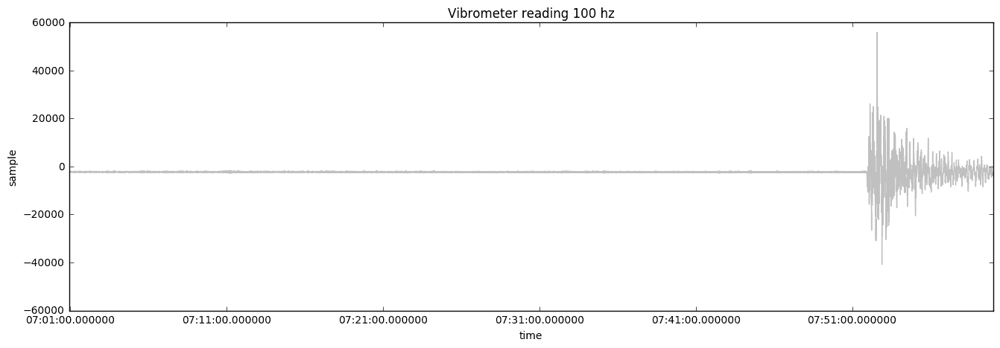

重要的是，以 100 Hz 的实时数据存储在云中是成本高昂的。为了降低成本，工程师通常以 1 分钟的频率发送数据。低频传感器数据通常不能准确表示所查看的问题。下图显示了仅每分钟采样一次时数据的外观：

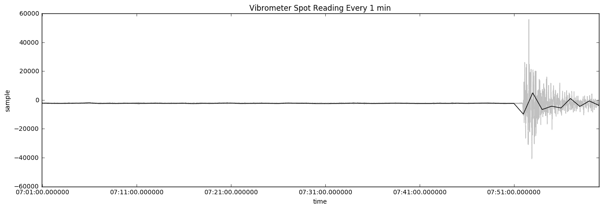

这里，我们看到与以 1 分钟间隔收集的数据叠加的振动计数据。数据有一定的用处，但不准确，因为它未显示数据发生的真实幅度。使用平均值更糟糕。下图显示了振动计在 1 分钟内的平均读数：

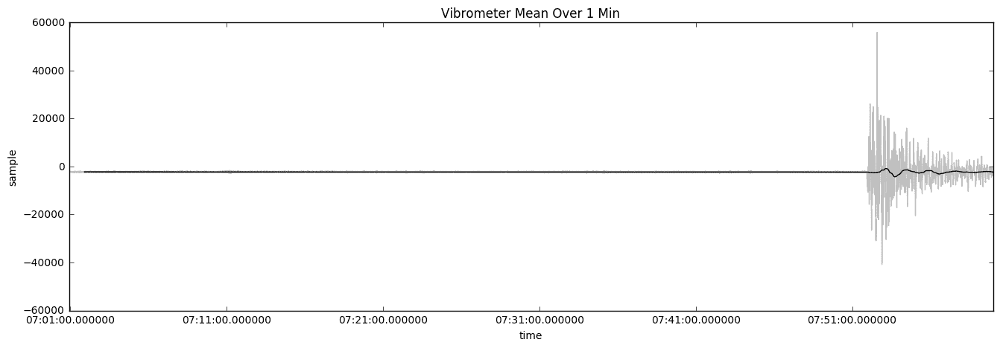

对于 1 分钟窗口内的平均读数取平均值是更糟糕的解决方案，因为在泵出现问题时平均值不会改变。下图显示了振动计在 1 分钟内的标准读数：

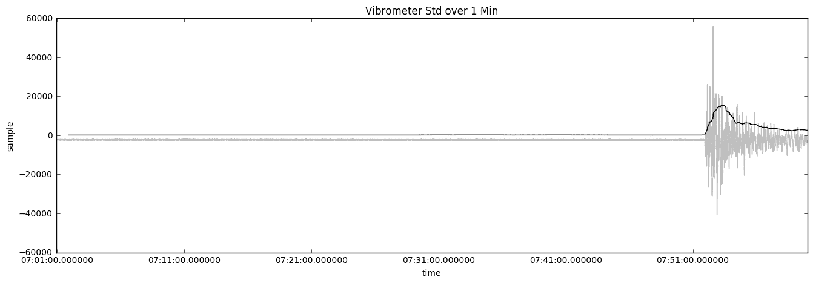

使用标准偏差技术与均值比较显示是否存在泵问题。这比平均技术更精确的解决方案。

使用 1 分钟窗口内的最小和最大值可以提供情况的最佳表示。下图显示了读数的样子：

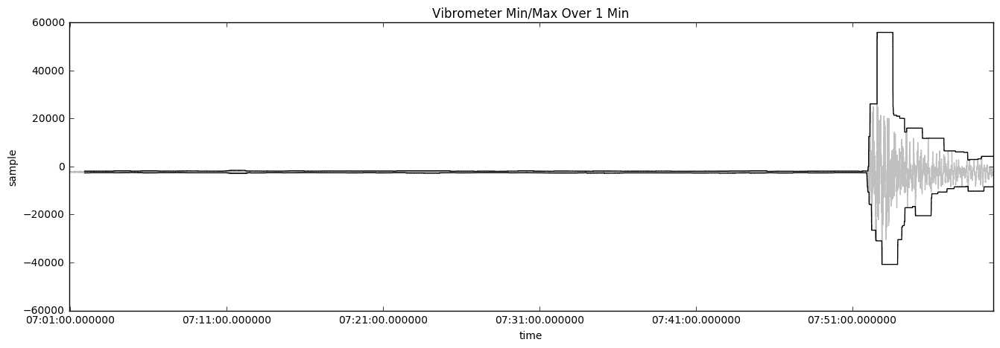

因为物联网设备可能在出现问题之前正常工作多年，并且在云中传送高频数据是成本高昂的，因此使用其他测量方法来确定设备是否需要维护。可以使用*最小/最大*、*标准偏差*或*峰值*等技术来触发云到设备的消息，告知设备以更高的频率发送数据。高频诊断数据可以使用 Blob 存储来存储大文件。

IoT 的一个挑战之一是在海量数据中找到有意义的数据。在本章中，我们将展示挖掘有价值数据的技术。

## 准备工作

为了准备好数据收集设计，您需要一个以高速率流式传输数据的设备。在《第一章》中，*设置 IoT 和 AI 环境*，我们讨论了将设备数据流入 IoT Hub 的过程。通常在生产中，设备数据以 15 秒或 1 分钟的间隔发送。但是在数据收集设计中，一个设备以 10 Hz 的高速率发送数据，即每秒 10 次。一旦数据流入，您可以将其拉入 Databricks 进行实时分析。

## 如何做…

在我们的 Databricks 笔记本中，我们将使用方差、Z-尖峰和最小/最大值技术分析 IoT 数据。

### 方差

方差是数据与均值的变化程度的度量。在接下来的代码中，我们使用 Koalas，即 `pandas` 的分布式克隆，来执行基本的数据工程任务，如确定方差。以下代码使用滚动窗口上的标准偏差来显示数据尖峰问题：

```py
import databricks.koalas as ks 

df = ks.DataFrame(pump_data)
print("variance: " + str(df.var()))
minuite['time'] = pd.to_datetime(minuite['time'])
minuite.set_index('time')
minuite['sample'] = minuite['sample'].rolling(window=600,center=False).std() 
```

在 IoT 产品线上使用占空比，直到收集到足够的数据用于机器学习。它们通常是简单的措施，例如设备是否过热或者振动过多。

我们还可以查看高低值，例如最大值，以确定传感器是否输出适当的读数。以下代码显示了我们数据集的最大读数：

```py
max = DF.agg({"averageRating": "max"}).collect()[0]
```

### Z-尖峰

尖峰可以帮助确定是否存在问题，方法是查看读数变化的快速程度。例如，户外 IoT 设备在南极和死亡谷直射阳光下的工作温度可能不同。找出设备是否存在问题的一种方法是查看温度变化的速度。Z-尖峰是典型的基于时间的异常检测方法。它的使用原因是它仅查看该设备的读数，并且可以提供独立于环境因素的数值。

Z-尖峰查看尖峰与标准偏差的差异。它使用统计 z 检验来确定尖峰是否大于人群中 99.5% 的尖峰。

### 最小/最大值

最小值和最大值可以显示系统上的最大压力值。以下代码展示了如何获取一个 1 分钟窗口的最小值和最大值：

```py
minute['max'] = minute['sample'].rolling(window=600,center=False).max() 

minute['sample'] = minute['sample'].rolling(window=600,center=False).min() 
```

最小值和最大值可以突出异常值。这在确定异常时非常有用。

# 窗口操作

有三种主要的窗口函数：滚动窗口、跳跃窗口和滑动窗口。Spark 和 Stream Analytics 都可以进行窗口操作。窗口操作允许您查看聚合函数，如平均值、计数和总和。它还允许您查看最小值和最大值。窗口操作是一种特征工程技术，有助于使数据更易管理。在本章中，我们将介绍几种窗口操作的工具和窗口的方式。

## 准备工作

要准备好，您还需要一个将数据流式传输到 IoT Hub 的设备。该流需要被 Azure 的流分析、Spark 或 Databricks 摄取。

## 如何实现...

使用 Databricks 笔记本或流分析工作空间执行配方。窗口化可以将大数据集的静态转化为机器学习模型的有意义特征。

### 滚动

滚动窗口函数将数据流分组为时间段（如下图所示）。滚动窗口意味着窗口不会重复或将数据从一个段落传递到下一个段落：

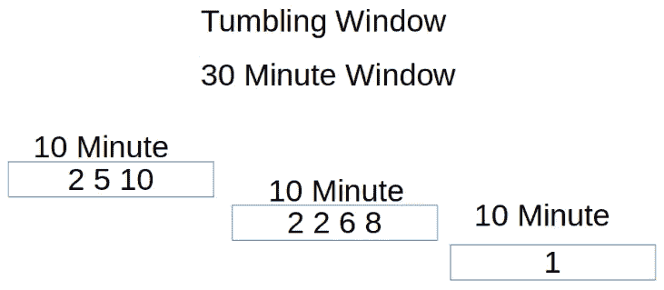

**流分析**

在流分析中，使用滚动窗口每 10 秒计算事件发生的一种方法如下：

```py
SELECT EventTime, Count(*) AS Count
FROM DeviceStream TIMESTAMP BY CreatedAt
GROUP by EventTime, TumbelingWindow(minuites, 10)
```

**Spark**

在 Spark 中，要每 10 分钟计算事件发生的次数，可以按以下步骤进行：

```py
from pyspark.sql.functions import * 
windowedDF = eventsDF.groupBy(window("eventTime", "10 minute")).count()
```

### 跳跃

跳跃窗口是重叠的滚动窗口。它们允许您设置特定的命令和条件，例如*每 5 分钟，给我过去 10 分钟内传感器读数的计数*。要使跳跃窗口与滚动窗口相同，需要将跳跃大小设置为窗口大小，如下图所示：

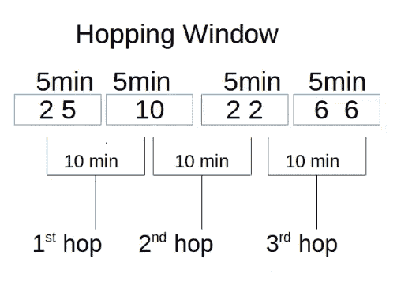

**流分析**

下面的流分析示例显示了在 10 分钟窗口内的消息计数。每 5 分钟进行一次计数：

```py
SELECT EventTime, Count(*) AS Count
FROM DeviceStream TIMESTAMP BY CreatedAt
GROUP by EventTime, HopingWindow(minuites, 10, 5)
```

**Spark**

在 PySpark 中，可以通过窗口函数来完成这一操作。下面的示例显示了一个窗口化的 Spark DataFrame，在 10 分钟时间段内每 5 分钟生成一个新的 DataFrame 条目：

```py
from pyspark.sql.functions import * 
windowedDF = eventsDF.groupBy(window("eventTime", "10 minute", "5 minute")).count()
```

### 滑动

滑动窗口在事件发生时产生输出。下图说明了这个概念：

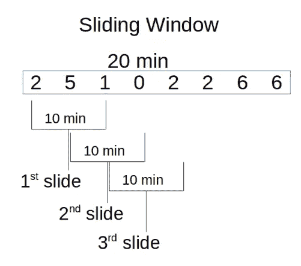

**流分析**

在流分析示例中，通过使用滑动窗口，只有在 10 分钟窗口内的消息数超过 100 条时才会收到结果。与查看确切时间窗口并显示该窗口的消息不同，在滑动窗口中，我们将在每个输入消息上收到一条消息。另一个用途是显示滚动平均值：

```py
SELECT EventTime, Count(*) AS Count
FROM DeviceStream TIMESTAMP BY CreatedAt
GROUP by EventTime,
SlidingWindow(minutes, 10)
WHERE COUNT(*) > 100
```

## 它的工作原理...

使用窗口化，IoT 数据可以显示诸如频率、总和、标准差和百分位分布等因素，时间段内的窗口化可以用于丰富数据的特征工程或将数据转换为聚合数据集。例如，窗口化可以显示工厂生产了多少设备或显示传感器读数中的调制。

# 探索性因子分析

垃圾数据是困扰物联网的主要问题之一。在收集数据之前，数据通常没有经过验证。常常存在与错误的传感器放置或数据看起来随机的问题，因为它不适合所使用的数据类型的适当度量。例如，由于中心极限定理，振动计可能显示数据集围绕平均值集中，而实际上数据显示了一个数量级的大增加。为了应对这些问题，对设备数据进行探索性因子分析至关重要。

在这个示例中，我们将探讨几种因子分析技术。在 Databricks 笔记本中使用聚合数据和原始遥测数据来执行此分析。

## 准备工作

您需要在 Databricks 的表中拥有数据，我们在*使用 Delta Lake 存储数据进行分析*示例中实现了这一点。一旦数据存储在 Spark 数据表中，即可进行因子分析。

## 如何做…

本示例由两个部分组成。第一部分是对数据进行视觉检查。视觉检查可以揭示软件缺陷，了解设备行为以及确定设备数据模式。第二部分则关注相关性和协方差。这些技术通常用于确定传感器是否冗余。

### 视觉探索

Spark 允许您查看基本的图表而无需太多代码。使用笔记本段落顶部的魔术符号，您可以轻松地从 Python 切换到 Scala 或 SQL。关于使用 Databricks 内置的图表系统的一个警告是，它只查看前 10,000 条记录。对于大型数据集，可以使用其他图表库。步骤如下：

1.  使用 `%sql` 魔法在 Databricks 中查询数据，如下所示：

```py
%sql
select * from Telemetry
```

1.  选择返回数据网格底部的图表图标。这将显示图表构建器 UI，如下屏幕截图所示：

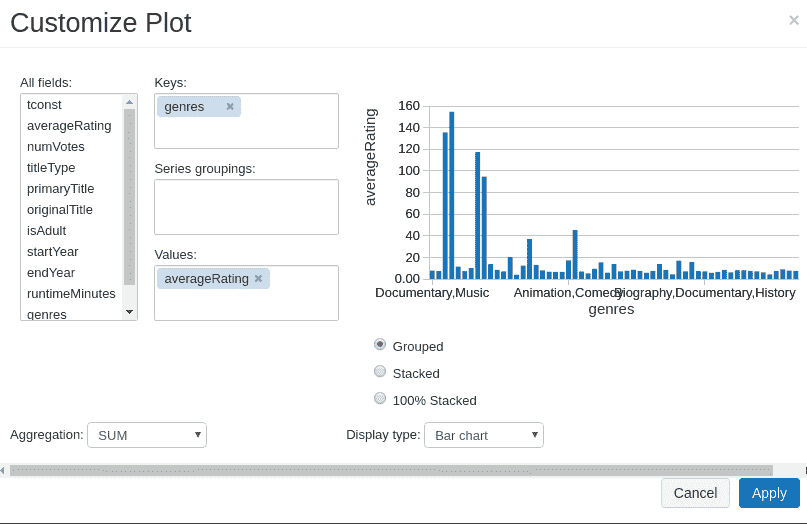

1.  选择最能代表数据的图表类型。有些图表更适合变量比较，而其他图表则可以帮助揭示趋势。

以下部分将审查何时以及为什么使用不同类型的图表。

#### 图表类型

不同类型的图表阐明了数据的不同方面，比如比较、组成、关系和分布。关系图表用于测试假设或查看一个因素如何影响其他因素。组成显示数据集的百分比分布。它通常用于显示各因素之间的比较情况。饼图是一种简单的组成图表。分布图表用于显示人群的分布情况。它们通常用于确定数据是否随机，是否具有较大的扩展或是否已归一化。比较图表用于将一个值与其他值进行比较。

**条形和柱形图**

条形图和柱形图用于比较项目之间的差异。条形图由于页面布局的关系可以有很多项。柱形图和条形图还可以显示随时间变化的情况。以下图表是条形图和柱形图的一个例子：

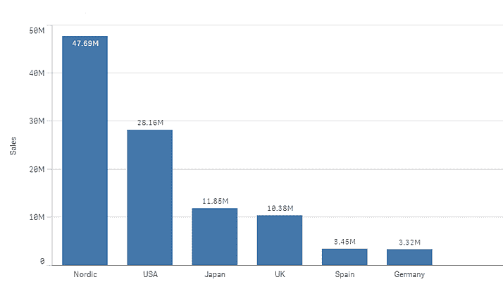

**散点图**

散点图可以显示两个变量之间的关系。它还可以显示趋势线。以下是散点图的一个例子：

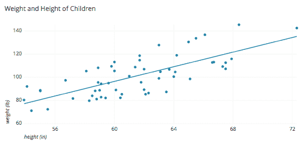

**气泡图**

当你想要展示三个变量之间的关系时，可以使用气泡图。这可以用来显示异常行为。以下是气泡图的一个例子：

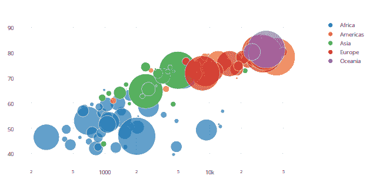

**折线图**

这些图表显示随时间变化的情况，并可用于显示设备数据在一天内的变化。如果设备具有季节性数据，则可能需要将时间作为算法的一部分或使用去季节性算法。以下是折线图的一个例子：

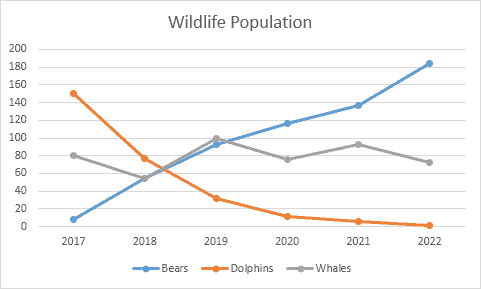

**面积图**

面积图类似于折线图，但用于显示一个部分的体积与另一个部分的比较。以下是面积图的一个例子：

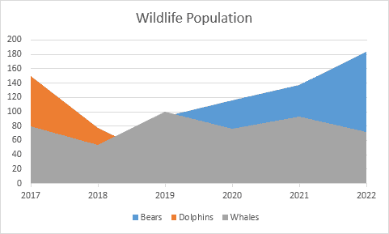

**分位数图**

通过将数据分成分段（分位数）来帮助确定人口形状。常见的分位数是 25%，50%和 75%，或 33%和 66%，或 5%和 95%（一般百分比是四分位数）。了解数据是否符合预期参数是理解设备是否存在问题的重要因素。以下是分位数图的一个例子：

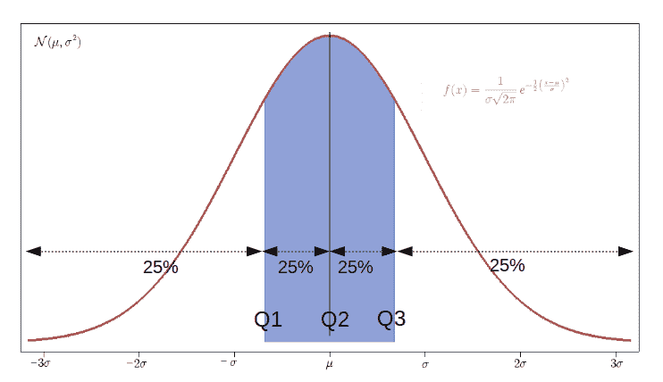

### 冗余传感器

物联网的一个挑战是确定传感器放置的位置以及需要多少个传感器。以泵为例：判断泵轴承是否损坏的一种方法是使用麦克风听高音尖叫声。另一种方法是使用参数来判断是否振动更多。还有一种方法是测量电流是否波动。没有一种确定泵轴承是否损坏的正确方法；然而，实施这三种技术可能成本过高且冗余。评估不同传感器之间的相关性的常见方法是使用热图。在下面的代码中，我们使用热图来找出传输冗余信息的传感器：

```py
import numpy as np
import pandas as pd
import matplotlib.pyplot as plt
import seaborn as sns    

# load the sample training data
train = pd.read_csv('/dbfs/FileStore/tables/Bike_train.csv')

for i in range(50):
    a = np.random.normal(5,i+1,10)
    b.append(a)
c = np.array(b)
cm =np.corrcoef(c)

plt.imshow(cm,interpolation='nearest')
plt.colorbar()

#heat map
plt.figure(figsize=(17,11))
sns.heatmap(train.iloc[:,1:30].corr(), cmap= 'viridis', annot=True)
display(plt.show())
```

下面的屏幕截图显示了热图：

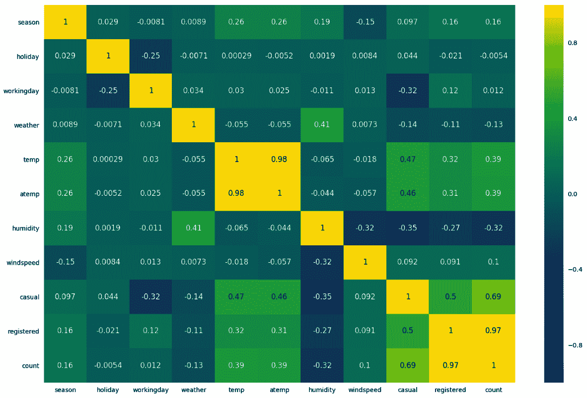

在上面的例子中，我们可以看到`count`和`registered`具有非常高的相关性，因为这两个数字接近 1。同样，我们可以看到`temp`和`atemp`之间有很高的相关性。如果在不去除相关数据的情况下使用这些数据，可能会给在数据集上训练的机器学习模型带来加权影响。

[](http://en.wikipedia.org/wiki/Contingency_table) 当设备数据很少时，仍然进行方差分析、分布和偏差分析可能很有价值。因为它的进入门槛低于机器学习，所以可以在机器生命周期的早期阶段部署。进行统计分析有助于确保设备设置的数据正确，不重复或虚假，并可用于机器学习。

交叉制表提供频率分布表。这可以用于确定两个不同传感器是否计算相同的情况。以下是显示交叉制表表格的代码：

```py
display(DF.stat.crosstab("titleType", "genres"))
```

### 样本协方差和相关性

协方差测量两个传感器相对于彼此的联合变化性。正数表明传感器报告相同的数据。负数表明传感器之间存在反向关系。可以使用 Spark DataFrame 中的 DataFrame `stat.cov`函数计算两个传感器的协方差：

```py
df.stat.cov('averageRating', 'numVotes')
```

## 工作原理...

在生产后修改物理设备可能很昂贵。本文展示了如何检查原型设备，以确保其产生的数据不会毫无意义。使用数据分析工具如 Databricks 进行初步数据分析，可以避免物联网和人工智能中常见的问题，如传感器放置不当、通信过度或不足以及无法用于机器学习的数据。执行标准的机器学习任务，如预测维护、异常检测或剩余有用寿命，取决于良好的数据。

## 更多内容...

您可以通过创建一个过滤小部件来进一步探索数据。例如，您可以使用如下所示的`CREATE WIDGET DROPDOWN`查询：

```py
%sql
CREATE WIDGET DROPDOWN tytleType DEFAULT "movie" CHOICES SELECT DISTINCT titleType FROM imdbTitles
```

创建一个小部件允许您创建一个数据查询，可以轻松分段，如下代码所示：

```py
%sql
select * from imdbTitles where titleType = getArgument("tytleType")
```

其他小部件类型，如文本、组合框和多选框，也是可用的。

# 在 Mongo/hot 路径存储中实现分析查询

在物联网架构中，存在热路径数据和冷路径数据。热路径数据可以立即访问。这通常存储在 NoSQL 或时间序列数据库中。例如，可以使用时间序列数据库如 InfluxDB 来计算每小时每台设备的重置次数。这可以用于辅助特征工程。热数据的另一个用途是精确分析。如果一个设备在现场故障，可以查询诸如 MongoDB 之类的数据库，仅获取该设备在过去一个月内生成的数据。

冷路径数据通常用于批处理，如机器学习和月度报告。冷路径数据主要存储在 Blob、S3 存储或 HDFS 兼容数据存储中。将热路径与冷路径分开通常涉及成本和可扩展性因素。IoT 数据通常属于大数据范畴。如果数据科学家从 NoSQL 数据库中查询多年的数据，使用它的 Web 应用程序可能会崩溃。对于存储在磁盘上的冷路径数据，这种情况并不适用。另一方面，如果数据科学家需要从数十亿条记录中查询几百条记录，那么 NoSQL 数据库就是合适的选择。

本文重点是处理热数据。本文主要关注从 MongoDB 提取 IoT 数据。首先，我们从一个设备中提取数据，然后我们将其在多个设备间进行聚合。

## 准备工作

流分析可以将 IoT 数据传输到 MongoDB。要做到这一点，请启动 MongoDB。可以通过 Azure Kubernetes Service 或使用 Atlas MongoDB 云提供商来完成此操作。一旦有了数据库，您可以使用函数应用程序在 IoT Hub 和 MongoDB 之间移动数据。

## 如何做...

Mongo 具有一系列与 SQL 可比较的过滤选项。以下代码显示了如何连接到 Mongo 的本地版本，并查询所有库存状态为`A`的产品：

```py
df = spark.read.format("mongo").option("uri",
"mongodb://127.0.0.1/products.inventory").load()
pipeline =  "{'deviceid':'8ea23889-3677-4ebe-80b6-3fee6e38a42c'}" 
df = spark.read.format("mongo").option("pipeline", pipeline).load()
df.show() 

```

下一个示例展示了如何执行复杂的过滤操作，接着进行分组操作。最终输出将显示状态为`A`的项目计数：

```py
pipeline = "[ { '$match': { 'status': 'A' } }, { '$group': { '_id': '$item', 'total': { '$sum': '$qty' } } } ]"
df = spark.read.format("mongo").option("pipeline", pipeline).load()
df.show() 
```

## 工作原理...

Mongo 将索引数据存储在多台计算机或分区上。这使得以毫秒为单位的延迟时间内检索特定数据成为可能。NoSQL 数据库可以为数据提供快速查找。在本文中，我们讨论了如何从 MongoDB 查询数据到 Databricks。

# 将 IoT 数据导入 Spark

要将 Spark 连接到 IoT Hub，首先创建一个消费者组。消费者组是指示消费者已达到的日志当前位置的指针。可以在同一数据日志的多个消费者之间存在多个消费者。消费者组是并行和可分布的，使您能够编写即使在大规模的情况下也能保持稳定的程序。

## 准备工作

对于本文，进入 Azure IoT Hub 门户，单击内置终端菜单选项。然后，通过输入一些文本来添加一个消费者组。在仍在该屏幕上的情况下，复制事件中心兼容端点连接字符串。

## 如何做...

本文的步骤如下：

1.  在 Databricks 中，启动一个新的笔记本，并输入连接到 IoT Hub 所需的信息。然后，输入以下代码：

```py
import datetime as dt
import json

ehConf = {}
ehConf['eventhubs.connectionString'] = ["The connection string you copies"]
ehConf['eventhubs.consumerGroup'] = "[The consumer group you created]"

startingEventPosition = {
  "offset": -1, 
  "seqNo": -1, #not in use
  "enqueuedTime": None, #not in use
  "isInclusive": True
}

endingEventPosition = {
  "offset": None, #not in use
  "seqNo": -1, #not in use
  "enqueuedTime": endTime,
  "isInclusive": True
}
ehConf["eventhubs.recieverTimeout"] = 100
```

1.  将数据放入 Spark DataFrame 中：

```py
df = spark \
 .readStream \
 .format("eventhubs") \
 .options(**ehConf) \
 .load()
```

1.  下一步是对数据应用结构，以便您可以使用结构化流处理：

```py
from pyspark.sql.types import *
Schema = StructType([StructField("deviceEndSessionTime", StringType()), StructField("sensor1", StringType()),
 StructField("sensor2", StringType()),
 StructField("deviceId", LongType()),
 ])
```

1.  最后一步是将架构应用到 DataFrame 中。这样可以使您像处理表格一样处理数据：

```py
from pyspark.sql.functions import *

rawData = df. \
  selectExpr("cast(Body as string) as json"). \
  select(from_json("json", Schema).alias("data")). \
 select("data.*")
```

## 工作原理...

在这个示例中，我们连接到了 IoT Hub 并将数据放入了一个 DataFrame 中。稍后，我们为该数据框架添加了结构，使我们能够像查询数据库表一样查询数据。

在接下来的几章中，我们将讨论如何创建模型。在使用冷路径数据创建模型之后，您可以通过将这些训练好的模型推送到 Databricks 结构化流中，实现几乎实时的机器学习。
