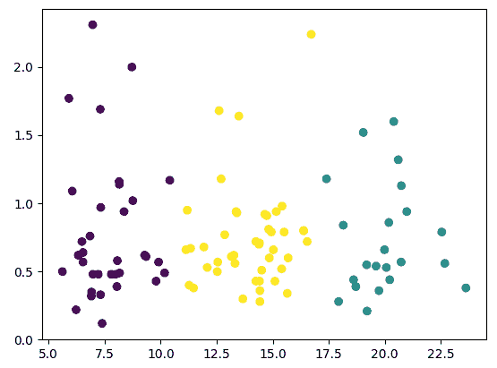
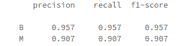
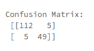
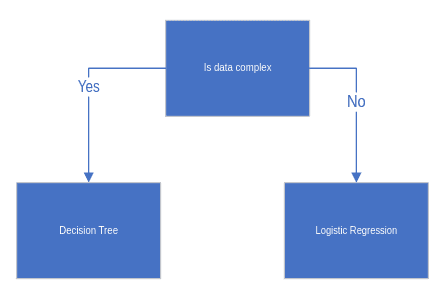
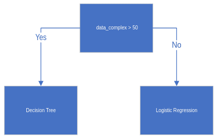

# 第三章：IoT 的机器学习

机器学习已经极大地改变了制造商在物联网（IoT）中的应用。今天，有许多行业有特定的物联网需求。例如，**医疗物联网**（**IoMT**）拥有像家中可穿戴的门诊心脏监测器这样的设备。这些设备通常需要在网络上传输大量数据或在边缘进行大量的计算以处理与心脏相关的事件。另一个例子是**农业物联网**（**AIoT**）设备，通常放置在没有 Wi-Fi 或蜂窝网络的地方。处方或模型被推送到这些半连接设备上。这些设备中的许多需要在边缘做出决策。当使用 LoRAWAN 或电视白色空间等技术最终建立连接时，模型被下载到设备上。

在本章中，我们将讨论使用逻辑回归和决策树等机器学习模型来解决常见的物联网问题，如分类医疗结果、检测不安全驾驶员和分类化学读数。我们还将探讨处理受限设备的技术，并研究使用无监督学习获取对原型等数据较少设备的见解的技术。

本章包含以下内容：

+   使用异常检测分析化学传感器

+   使用 IoMT 的逻辑回归

+   使用决策树对化学传感器进行分类

+   使用 XGBoost 进行简单的预测性维护

+   检测不安全的驾驶员

+   受限设备上的人脸检测

# 使用异常检测分析化学传感器

准确的预测模型需要大量的设备在现场失败，以便它们有足够的故障数据用于预测。对于一些精心制作的工业设备来说，这种规模的故障可能需要多年时间。异常检测可以识别不像其他设备的设备。它还可以用于筛选成千上万条类似消息，并确定不同于其他消息的消息。

机器学习中的异常检测可以是**无监督**的，**监督**的，或**半监督**的。通常，它从使用无监督机器学习算法将数据聚类为行为模式或群组开始。这将数据呈现为桶。当机器被检查时，一些桶识别出行为，而一些桶则识别出设备存在问题。设备可能在静止状态、使用状态、冷态或需要调查的状态中表现出不同的行为模式。

此配方假定使用的数据集中对数据了解不多。异常检测过程被用作发现过程的一部分，并且通常与原型一起使用。

## 准备工作

异常检测是最容易实现的机器学习模型之一。在这个示例中，我们将使用从化学传感器获取的数据集，检测中性、香蕉或葡萄酒。为了准备好，您需要导入 `numpy`、`sklearn` 和 `matplotlib` 库。

## 如何做...

完成这个示例需要遵循以下步骤：

1.  导入所需的库：

```py
import numpy as np
from sklearn.cluster import KMeans
import matplotlib.pyplot as plt
```

1.  将数据文件上传到 DataFrame：

```py
df = spark.read.format("csv" \
    .option("inferSchema", True) \
    .option("header", True) \
    .option("sep", "\t") \
    .load("/FileStore/tables/HT_Sensor_metadata.dat")
```

1.  查看数据集以查看数据分组是否与簇的数量相关：

```py
pdf = df.toPandas()

y_pred = KMeans(n_clusters=3, 
                random_state=2).fit_predict(pdf[['dt','t0']])

plt.scatter(pdf['t0'],pdf['dt'], c=y_pred)
display(plt.show())
```

输出如下：



上述图表显示了三组不同的数据。紧密聚集的簇代表具有明确定义边界的数据。如果我们将簇的数量调整为 `10`，可能会更好地分离不同的群组。这些簇段帮助我们识别数据的不同段落。这反过来可能帮助我们确定原型的最佳传感器放置或在机器学习模型中进行特征工程。

## 工作原理...

在这个示例中，我们使用 `numpy` 进行数据操作，`sklearn` 进行机器学习算法，`matplotlib` 查看结果。接下来，我们将制表符分隔的文件转换为 Spark 数据框架。在这一步中，我们将数据转换为 pandas DataFrame。然后我们使用三个簇运行 k-means 算法，输出图表。

K-means 是一种将数据分组成簇的算法。K-means 是一种流行的聚类算法，用于在没有标签的情况下检查数据。K-means 首先随机初始化簇的质心。在我们的例子中，它有三个簇的质心。然后将这些质心分配给最近的数据点。接下来，它将每个质心移动到其相应簇的中间位置。它重复这些步骤直到达到适当的数据点分割。

## 还有更多...

在图表中，您可能已经注意到异常值。在查看原型时，这些异常值非常重要。异常值可以代表机器内部的电力波动、传感器安置不当或其他问题。以下示例显示了我们数据的简单标准差计算。从这里，我们能够看到两个超出均值三个标准差的值：

```py
from numpy import mean
from numpy import std

data_mean, data_std = mean(pdf['dt']), std(pdf['dt'])

cut_off = data_std * 3
lower, upper = data_mean - cut_off, data_mean + cut_off

outliers = [x for x in pdf['dt'] if x < lower or x > upper]
print('Identified outliers: %d' % len(outliers))
print(outliers)
```

# 使用 IoMT 的逻辑回归

在这个示例中，我们将讨论使用逻辑回归来对乳腺 X 光数据进行分类。最近，IoMT 大大扩展。许多设备被患者佩戴，当他们离开医生时提供家庭医疗监测解决方案，同时其他设备则在医院内，为医生提供运行的医疗测试的额外反馈。在许多情况下，机器学习算法能够发现医生可能忽略的疾病和问题，或为他们提供额外的建议。在这个示例中，我们将使用乳腺癌数据集，并确定乳腺 X 光记录是恶性还是良性。

## 准备就绪

数据集与 Databricks 笔记本一起，可以在 GitHub 仓库中找到。 数据集笨重。 它有高度相关的坏列，这是说一些传感器是重复的，还有未使用的列和多余的数据。 为了便于阅读，在 GitHub 仓库中将有两个笔记本。 第一个笔记本执行所有数据操作，并将数据放入数据表中。 第二个笔记本进行机器学习。 我们将重点介绍数据操作笔记本。 在配方结束时，我们将讨论另外两个笔记本，以展示 MLflow 的示例。

在本配方中，您还需要一个 MLflow 工作区。 要设置 MLflow 工作区，您需要进入 Databricks 并为此实验创建工作区。 我们将在那里写入我们实验的结果。

## 如何实现...

按照以下步骤完成本配方:

1.  导入所需的库:

```py
import pandas as pd

from sklearn import neighbors, metrics
from sklearn.metrics import roc_auc_score, classification_report,\
precision_recall_fscore_support,confusion_matrix,precision_score, \
roc_curve,precision_recall_fscore_support as score
from sklearn.model_selection import train_test_split

import statsmodels.api as sm
import statsmodels.formula.api as smf
```

1.  导入数据:

```py
df = spark.sql("select * from BreastCancer")
pdf = df.toPandas()
```

1.  分割数据:

```py
X = pdf
y = pdf['diagnosis']

X_train, X_test, y_train, y_test = \
    train_test_split(X, y, test_size=0.3, random_state=40) 
```

1.  创建公式:

```py
cols = pdf.columns.drop('diagnosis')
formula = 'diagnosis ~ ' + ' + '.join(cols)
```

1.  训练模型:

```py
model = smf.glm(formula=formula, data=X_train, 
                family=sm.families.Binomial())
logistic_fit = model.fit()
```

1.  测试我们的模型:

```py
predictions = logistic_fit.predict(X_test)
predictions_nominal = [ "M" if x < 0.5 else "B" for x in \
                        predictions]
```

1.  评估模型:

```py
print(classification_report(y_test, predictions_nominal, digits=3))
```

输出显示了恶性 (`M`) 和良性 (`B`) 的 `精确度`、`召回率` 和 `f1-score`:



1.  评估混淆矩阵:

```py
cfm = confusion_matrix(y_test, predictions_nominal)
precision,recall,fscore,support=score(y_test, predictions_nominal,
                                      average='macro')

print('Confusion Matrix: \n', cfm, '\n')
```

输出如下:



结果显示，在我们的测试集中共有 171 条记录，其中 112 条是真负样本，49 条是真正样本，这意味着在 171 条记录中，它能够正确识别出 161 条记录。 其中 10 条预测是错误的: 5 条假负样本和 5 条假正样本。

## 它是如何工作的...

在本配方中，我们使用了逻辑回归。 逻辑回归是一种可用于传统统计学以及机器学习的技术。 由于其简单性和强大性，许多数据科学家将逻辑回归作为他们的第一个模型，并将其用作超越的基准。 逻辑回归是一个二元分类器，意味着它可以将某些东西分类为 `true` 或 `false`。 在我们的情况下，分类是良性或恶性。

首先，我们导入 `koalas` 进行数据操作，以及 `sklearn` 用于我们的模型和分析。 接下来，我们从我们的数据表中导入数据并将其放入 Pandas DataFrame 中。 然后，我们将数据分割为测试和训练数据集。 接下来，我们创建一个描述模型所使用的数据列的公式。 接下来，我们向模型提供公式、训练数据集以及它将使用的算法。 然后，我们输出一个可以用来评估新数据的模型。 现在我们创建一个名为 `predictions_nominal` 的 DataFrame，我们可以用它来与我们的测试结果数据集进行比较。 分类报告给出了 `精确度`、`召回率` 和 `f1-score`:

+   **精确度**: 正确报告的正预测与预期的正预测之比

+   **召回率**: 正确报告的正预测与总体人口的比率

+   **F 分数**: 精度和召回率的混合分数

接下来，我们可以查看模型的结果，并确定其如何准确预测真实值。我们将检查的一些因素如下：

+   **真阴性：**测试集中实际为负的预测负例

+   **假阳性**：训练模型在训练集中预测为正但实际不是

+   **假阴性**：测试集中实际上是正例但被预测为负例的假负例

+   **真阳性**：模型实际上正确获取的数量

## 还有更多...

我们将记录 MLflow 中的结果以与其他算法进行比较。我们还将保存其他参数，如使用的主要公式和预测族：

```py
import pickle
import mlflow

with mlflow.start_run():
    mlflow.set_experiment("/Shared/experiments/BreastCancer")

    mlflow.log_param("formula", formula)
    mlflow.log_param("family", "binomial")

    mlflow.log_metric("precision", precision)
    mlflow.log_metric("recall", recall)
    mlflow.log_metric("fscore", fscore)
    filename = 'finalized_model.sav'
    pickle.dump(model, open(filename, 'wb'))

    mlflow.log_artifact(filename)
```

# 使用决策树分类化学传感器

在本篇文章中，我们将使用**金属氧化物**（**MOx**）传感器的化学传感器数据来确定空气中是否有葡萄酒。这种类型的传感器通常用于确定空气中是否存在食品或化学颗粒。化学传感器可以检测对人类有害或仓库内食品泄漏的气体。

## 如何实现...

按照以下步骤完成这个配方：

1.  导入库：

```py
import pandas as pd
import numpy as np

from sklearn import neighbors, metrics
from sklearn.model_selection import train_test_split
from sklearn.tree import DecisionTreeClassifier 
from sklearn.preprocessing import OneHotEncoder
from sklearn.preprocessing import LabelEncoder
```

1.  导入数据：

```py
df = spark.sql("select * from ChemicalSensor")
pdf = df.toPandas()
```

1.  编码数值：

```py
label_encoder = LabelEncoder()
integer_encoded = \
    label_encoder.fit_transform(pdf['classification'])
onehot_encoder = OneHotEncoder(sparse=False)

integer_encoded = integer_encoded.reshape(len(integer_encoded), 1)
onehot_encoded = onehot_encoder.fit_transform(integer_encoded)
```

1.  测试/训练分割数据：

```py
X = pdf[feature_cols]
y = onehot_encoded

X_train, X_test, y_train, y_test = \
train_test_split(X, y, test_size=0.2, random_state=5)
```

1.  训练和预测：

```py
clf = DecisionTreeClassifier()
clf = clf.fit(X_train,y_train)
y_pred = clf.predict(X_test)
```

1.  评估准确性：

```py
print("Accuracy:",metrics.accuracy_score(y_test, y_pred))
print("AUC:",roc_auc_score(y_test, y_pred))
```

## 工作原理...

和往常一样，我们导入这个项目所需的库。接下来，我们将 Spark 数据表中的数据导入到 Pandas DataFrame 中。独热编码可以将分类值（例如我们的*葡萄酒*和*无葡萄酒*示例）更改为机器学习算法更好使用的编码值。在*步骤 4*中，我们将特征列和我们的独热编码列分割成一个测试和训练集。在*步骤 5*中，我们创建一个决策树分类器，使用`X_train`和`y_train`数据来训练模型，然后使用`X_test`数据创建一个`y_prediction`数据集。换句话说，最后，我们将根据数据集在`X_test`集上的预测得到一组名为`y_pred`的预测。在*步骤 6*中，我们评估模型的准确性和**曲线下面积**（**AUC**）。

当数据复杂时，决策树分类器被用来使用一系列逻辑规则进行分类。您可以像下图所示使用决策树跟随一组是/否问题：



机器学习算法可以训练决策树模型使用数值数据，如下图所示：



机器学习算法训练模型以准确选择给定可用数据的最佳路径。

## 还有更多...

`sklearn` 决策树分类器有两个超参数可以调整：**准则**和**最大深度**。通常会更改超参数以提高准确性。准则可以是基尼系数或信息熵。这两个准则评估子节点中的不纯度。接下来是最大深度。决策树的最大深度会影响欠拟合和过拟合。

**欠拟合与过拟合**

欠拟合的模型不准确，无法有效地表示它们所训练的数据。

过拟合的模型无法从训练数据中进行泛化。它会错过与训练集相似的数据，因为它只适用于与其训练时完全相同的数据。

# 使用 XGBoost 进行简单预测维护

每个设备都有寿命终止或需要定期维护。预测维护是物联网中最常用的机器学习算法之一。下一章将深入探讨预测维护，重点关注序列数据及其如何随季节性变化的情况。本配方将从分类的简单视角来看待预测维护。

在此配方中，我们将使用 NASA *涡轮风扇引擎退化模拟* 数据集。我们将看到三种分类情况。绿色表示引擎不需要维护；黄色表示引擎在接下来的 14 个维护周期内需要维护；红色表示引擎在下一个周期内需要维护。作为算法，我们将使用**极限梯度提升**（**XGBoost**）。近年来，XGBoost 因其在 Kaggle 竞赛中的表现优异而变得流行。

## 准备工作

要做好准备，您需要 NASA *涡轮风扇引擎退化模拟* 数据集。此数据以及一个 Spark 笔记本可以在本书的伴随 GitHub 仓库或 NASA 网站上找到。接下来，您需要确保在 Databricks 中安装 XGBoost 作为库。

## 如何实现...

此配方的步骤如下：

1.  导入库：

```py
import pandas as pd
import numpy as np
from pyspark.sql.types import *
import xgboost as xgb
from sklearn.model_selection import train_test_split
from sklearn.metrics import precision_score
import pickle
import mlflow
```

1.  导入数据：

```py
file_location = "/FileStore/tables/train_FD001.txt"
file_type = "csv"

schema = StructType([
                     StructField("engine_id", IntegerType()),
                     StructField("cycle", IntegerType()),
                     StructField("setting1", DoubleType()),
                     StructField("setting2", DoubleType()),
                     StructField("setting3", DoubleType()),
                     StructField("s1", DoubleType()),
                     StructField("s2", DoubleType()),
                     StructField("s3", DoubleType()),
                     StructField("s4", DoubleType()),
                     StructField("s5", DoubleType()),
                     StructField("s6", DoubleType()),
                     StructField("s7", DoubleType()),
                     StructField("s8", DoubleType()),
                     StructField("s9", DoubleType()),
                     StructField("s10", DoubleType()),
                     StructField("s11", DoubleType()),
                     StructField("s12", DoubleType()),
                     StructField("s13", DoubleType()),
                     StructField("s14", DoubleType()),
                     StructField("s15", DoubleType()),
                     StructField("s16", DoubleType()),
                     StructField("s17", IntegerType()),
                     StructField("s18", IntegerType()),
                     StructField("s19", DoubleType()),
                     StructField("s20", DoubleType()),
                     StructField("s21", DoubleType())
                     ])

df = spark.read.option("delimiter"," ").csv(file_location,
                                            schema=schema, 
                                            header=False)
```

1.  在数据上创建表视图：

```py
df.createOrReplaceTempView("raw_engine")
```

1.  转换数据：

```py
%sql

 drop table if exists engine;

 create table engine as
 (select e.*, CASE WHEN mc - e.cycle = 1 THEN 1 ELSE
 CASE WHEN mc - e.cycle < 14 THEN 2 ELSE
 0 END END as label
 from raw_engine e
 join (select max(cycle) mc, engine_id from raw_engine group by engine_id) m
 on e.engine_id = m.engine_id)
```

1.  测试、训练和拆分数据：

```py
new_input = spark.sql("select * from engine").toPandas()
training_df, test_df = train_test_split(new_input)
```

1.  准备模型：

```py
dtrain = xgb.DMatrix(training_df[['setting1','setting2','setting3', 's1', 's2', 's3',
 's4', 's5', 's6', 's7', 's8', 's9', 's10', 's11', 's12', 's13', 's14',
 's15', 's16','s17', 's18', 's19', 's20', 's21']], label=training_df["label"])
 param = {'max_depth': 2, 'eta': 1, 'silent': 1, 'objective': 'multi:softmax'}
 param['nthread'] = 4
 param['eval_metric'] = 'auc'
 param['num_class'] = 3
```

1.  训练模型：

```py
num_round = 10
 bst = xgb.train(param, dtrain, num_round)
```

1.  评估模型：

```py
dtest = xgb.DMatrix(test_df[['setting1', 'setting2', 'setting3', 
                             's1', 's2', 's3', 's4', 's5', 's6', 
                             's7', 's8', 's9', 's10', 's11', 
                             's12', 's13', 's14', 's15', 's16',
                             's17', 's18', 's19', 's20', 's21']])
ypred = bst.predict(dtest)

pre_score = precision_score(test_df["label"], ypred, 
                            average='micro')
print("xgb_pre_score:",pre_score)
```

1.  存储结果：

```py
with mlflow.start_run():
    mlflow.set_experiment("/Shared/experiments/\
                           Predictive_Maintenance")
    mlflow.log_param("type", 'XGBoost')
    mlflow.log_metric("precision_score", pre_score)
    filename = 'bst.sav'
    pickle.dump(bst, open(filename, 'wb'))
    mlflow.log_artifact(filename)
```

## 它的工作原理...

首先，我们导入`pandas`、`pyspark`和`numpy`进行数据处理，`xgboost`作为我们的算法，`sklearn`用于评分结果，最后使用`mlflow`和`pickle`保存这些结果。在*步骤 2* 中，我们在 Spark 中指定了一个模式。Databricks 的推断模式功能通常会出现模式错误。通常我们需要指定数据类型。在接下来的步骤中，我们创建了数据的临时视图，以便在 Databricks 中使用 SQL 工具。在*步骤 4* 中，我们在页面顶部使用魔术标签 `%sql` 将语言切换为 SQL。然后，我们创建了一个名为`engine`的表，该表包含引擎数据及一个新列，如果引擎剩余循环大于 14，则给出`0`，如果只剩一个循环，则给出`1`，如果剩余 14 个循环，则给出`2`。然后我们切换回默认的 Python 语言，并将数据拆分为测试和训练数据集。在*步骤 6* 中，我们指定了模型中的列以及超参数。从这里开始训练模型。然后我们测试我们的模型并打印精确度分数。接下来，我们将结果存储在 MLflow 中。在第四章，*预测性维护的深度学习*，我们将对此数据集进行其他实验，以查看哪种表现最佳。

XGBoost 有大量可以调整的参数。这些调整参数可以是允许算法使用的线程数，以及帮助提高准确性或防止过拟合和欠拟合的树参数。其中一些包括：

+   `learning_rate`: 学习率是算法更新节点的步长。它有助于防止过拟合，但也可能会对训练完成所需的时间产生负面影响。

+   `max_depth`: 深度树倾向于过拟合，浅树倾向于欠拟合。

+   `predictor`: 这是一个标志，告诉程序在 CPU 或 GPU 上进行计算。GPU 可以显著提高性能，但并非所有计算机都配备 GPU。

还有十几个可以在 XGBoost 中调整的参数。

XGBoost 决策树在内部采用弱学习器或浅树，并使用维度评分系统将它们组合成强学习器。这类似于从医生那里得到不良诊断，然后寻求第二和第三意见。第一个医生可能是错的，但不太可能三个医生都错。

# 检测不安全的驾驶员

在机器学习中的计算机视觉使我们能够判断道路上是否有事故或者不安全的工作环境，并且可以与复杂系统（如智能销售助手）结合使用。计算机视觉在物联网中开辟了许多可能性。从成本的角度来看，计算机视觉也是最具挑战性的之一。在接下来的两个示例中，我们将讨论两种不同的使用计算机视觉的方式。第一种方法是接收大量从物联网设备生成的图像，并使用高性能分布式 Databricks 格式对其进行预测和分析。在下一个示例中，我们将使用一种在边缘设备上执行机器学习的技术，使用低计算量的算法。

## 准备工作

准备工作，您将需要 Databricks。在这个示例中，我们将从 Azure Blob Storage 中提取图像。

## 如何做…

此示例的步骤如下：

1.  导入库和配置：

```py
from pyspark.ml.classification import LogisticRegression
from pyspark.ml import Pipeline
from sparkdl import DeepImageFeaturizer
from pyspark.ml.evaluation import \
MulticlassClassificationEvaluator
from pyspark.sql.functions import lit
import pickle
import mlflow

storage_account_name = "Your Storage Account Name"
storage_account_access_key = "Your Key"
```

1.  读取数据：

```py
safe_images = "wasbs://unsafedrivers@"+storage_account_name+\
               ".blob.core.windows.net/safe/"
safe_df = spark.read.format('image').load(safe_images)\
          .withColumn("label", lit(0))

unsafe_images = "wasbs://unsafedrivers@"+storage_account_name+\
                ".blob.core.windows.net/unsafe/"
unsafe_df = spark.read.format('image').load(unsafe_images)\
            .withColumn("label", lit(1))
```

1.  查询数据：

```py
display(unsafe_df)
```

1.  创建测试和训练数据集：

```py
unsafe_train, unsafe_test = unsafe_df.randomSplit([0.6, 0.4])
safe_train, safe_test = safe_df.randomSplit([0.6, 0.4])

train_df = unsafe_train.unionAll(safe_train)
test_df = safe_test.unionAll(unsafe_test)
```

1.  构建管道：

```py
featurizer = DeepImageFeaturizer(inputCol="image", 
                                 outputCol="features", 
                                 modelName="ResNet50")
lr = LogisticRegression(maxIter=20, regParam=0.05, 
                        elasticNetParam=0.3, labelCol="label")
p = Pipeline(stages=[featurizer, lr])
```

1.  训练模型：

```py
p_model = p.fit(train_df)
```

1.  评估模型：

```py
predictions = p_model.transform(test_df)

predictions.select("filePath", "prediction").show(truncate=False)
df = p_model.transform(test_df)

predictionAndLabels = df.select("prediction", "label")
evaluator = \
MulticlassClassificationEvaluator(metricName="accuracy")
print("Training set accuracy = " + \
       str(evaluator.evaluate(predictionAndLabels)))
```

1.  记录结果：

```py
with mlflow.start_run():
    mlflow.set_experiment("/Shared/experiments/Workplace Safety")

    mlflow.log_param("Model Name", "ResNet50")
    # Log a metric; metrics can be updated throughout the run
    precision, recall, fscore, support=score(y_test, y_pred,
                                             average='macro')

    mlflow.log_metric("Accuracy", \
                      evaluator.evaluate(predictionAndLabels))

    filename = 'finalized_model.sav'
    pickle.dump(p_model, open(filename, 'wb'))
    # Log an artifact (output file)
    mlflow.log_artifact(filename)
```

## 它是如何工作的…

首先，我们定义文件的位置。对于这个示例，我们使用 Azure Blob Storage，但是任何存储系统，比如 S3 或 HDFS，也同样适用。用你的 Blob Storage 账户的密钥替换`storage_account_name`和`storage_account_access_key`字段。从我们的存储账户中读取*安全*和*不安全*的图像到一个 Spark 图像 DataFrame 中。在我们的示例中，我们将安全图像放在一个文件夹中，不安全图像放在另一个文件夹中。查询图像 DataFrame 以查看是否成功获取了图像。创建安全和不安全的测试和训练集。然后，将我们的数据集合并成一个训练集和一个测试集。接下来，创建一个机器学习管道。我们使用 ResNet-50 算法作为特征提取器。然后，我们使用逻辑回归作为分类器。将它放入管道中并训练我们的模型。接下来，将我们的管道运行我们的训练 DataFrame，得出一个经过训练的模型。然后，评估我们模型的准确性。最后，将结果存储在 MLflow 中，以便与其他模型进行比较。

有许多图像分类模型已经开发出来，比如 ResNet-50 和 Inception v3。在我们的例子中，我们使用了 ResNet-50，这是一种调整过的卷积神经网络。ResNet-50 是一种强大的用于图像特征提取的机器学习模型。在机器学习中，有*无免费午餐定理*，它指出没有一个模型会在所有情况下表现最好。因此，数据科学家会测试不同的算法。可以通过改变参数如指标名称来简单地完成这一过程。

我们还使用了 Spark ML 流水线。流水线允许数据科学家声明处理过程的不同步骤，并独立实现它们。在我们的例子中，我们使用 ResNet-50 对图像进行特征化。ResNet-50 输出一个特征向量，可以通过分类器进行分类。在我们的情况下，我们使用逻辑回归，但也可以使用 XGBoost 或其他神经网络。

## 还有更多...

要将我们的流水线更改为使用 Inception 而不是`ResNet50`，我们只需更改模型：

```py
featurizer = DeepImageFeaturizer(inputCol="image", outputCol="features", 
                                 modelName="ResNet50")
```

使用`Inception v3`，我们能够在图像集上测试不同模型的准确性：

```py
featurizer = DeepImageFeaturizer(inputCol="image", outputCol="features",
                                 modelName="InceptionV3")
```

我们可以使用一系列模型，并在 MLflow 中记录结果：

```py
for m in ['InceptionV3', 'Xception','ResNet50', 'VGG19']:
    featurizer = DeepImageFeaturizer(inputCol="image", 
                                     outputCol="features", 
                                     modelName=m)
```

# 受限设备上的面部检测

深度神经网络往往优于其他分类技术。然而，在物联网设备上，RAM、计算能力或存储量并不是很大。在受限设备上，RAM 和存储通常以 MB 为单位，而不是 GB，使得传统的分类器不可行。一些云端视频分类服务每个设备的实时视频收费超过 10,000 美元。OpenCV 的 Haar 分类器具有与卷积神经网络相同的基本原理，但计算和存储量只是其一小部分。OpenCV 支持多种语言，并可以在一些受限制的设备上运行。

在本示例中，我们将设置一个 Haar 级联，以便检测人物是否靠近摄像头。这通常用于 Kiosk 和其他交互式智能设备。Haar 级联可以以高速运行，当发现接近设备的人脸时，可以通过云服务或其他设备上的机器学习模型发送该图像。

## 准备工作

我们需要做的第一件事是安装 OpenCV 框架：

```py
pip install opencv-python
```

接下来，我们下载模型。模型可以从 OpenCV GitHub 页面或书籍的 GitHub 页面下载。文件是`haarcascade_frontalface_default.xml`。

接下来，我们通过导入`haarcascade_frontalface_default.xml`文件并创建一个 Python 文件来创建一个新文件夹，以用于代码。最后，如果设备没有连接摄像头，请连接一个。在接下来的示例中，我们将使用 OpenCV 实现 Haar 级联。

## 如何操作...

此示例的步骤如下：

1.  导入库和设置：

```py
import cv2
from time import sleep

debugging = True
classifier = \
cv2.CascadeClassifier("haarcascade_frontalface_default.xml")
video = cv2.VideoCapture(0)
```

1.  初始化摄像头：

```py
while True:
    if not video.isOpened():
    print('Waiting for Camera.')
    sleep(5)
    pass
```

1.  捕获和转换图像：

```py
ret, frame = video.read()
gray = cv2.cvtColor(frame, cv2.COLOR_BGR2GRAY)
```

1.  对图像进行分类：

```py
faces = classifier.detectMultiScale(gray,
                                    minNeighbors=5,
                                    minSize=(100, 100)
                                    )
```

1.  调试图像：

```py
if debugging:
    # Draw a rectangle around the faces
    for (x, y, w, h) in faces:
        cv2.rectangle(frame, (x, y), (x+w, y+h), (0, 255, 0), 2)

    cv2.imshow('Video', frame)
    if cv2.waitKey(1) & 0xFF == ord('q'):
        break
```

1.  检测面部：

```py
if len(faces) > 0:
    # Your advanced code here
    pass
```

## 工作原理...

首先，导入库并设置设置。接下来，我们导入 `opencv` 和 `python` 库，同时也导入 `time` 以便在摄像头未就绪时等待。然后，我们设置一些调试标志，以便在调试时可以视觉化测试输出。接着，我们将 Haar Cascade XML 文件导入分类器。最后，我们打开连接到机器的第一个视频摄像头。在 *第 2 步* 中，我们等待摄像头就绪。在开发软件时，这通常不是问题，因为系统已经识别了摄像头。然后，我们将此程序设置为自动运行；当系统重新启动时，摄像头可能最多需要一分钟才能可用。我们还启动了一个无限循环来处理摄像头图像。在接下来的步骤中，我们捕获并将图像转换为黑白。接着，我们运行分类器。`detectMultiScale` 分类器可以检测不同尺寸的人脸。`minNeighbors` 参数指定在检测到一个人脸之前需要多少个相邻的协作检测。将 `minNeighbors` 参数设置得太小可能会导致误报。设置得太大可能根本无法检测到人脸。最后，还有人脸需要的最小像素大小。为了调试代码并确保摄像头工作准确，我们添加了一些调试代码，将视频和边界框输出到连接的监视器上。在部署设备上，这会增加相当大的负载。但是在测试中，这可以显示问题并允许进行调优。如果检测到人脸，则可以执行任务，如本地情感分析或将其发送到外部服务（如 Azure Face API）以通过人脸 ID 识别人员。

Haar Cascade 是高效的人脸检测分类器。在幕后，它会取图像的矩形部分，并将其与图像的另一部分进行比较，从而得出具有人脸特征的东西。在我们的示例中，我们使用设备上的摄像头，对其进行转换，然后使用 Haar Cascade 进行分类。
