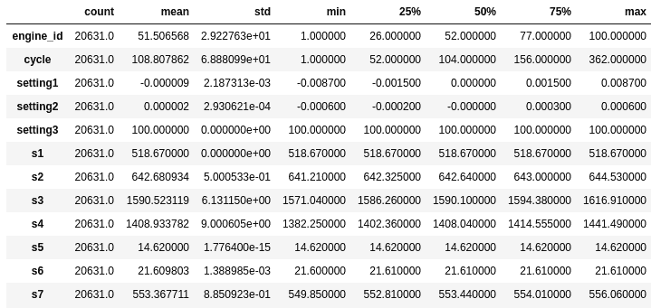
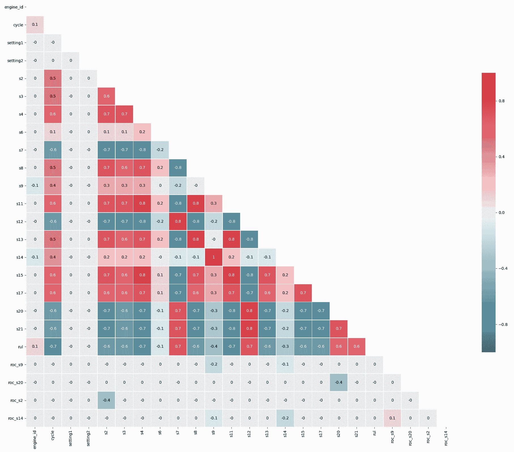
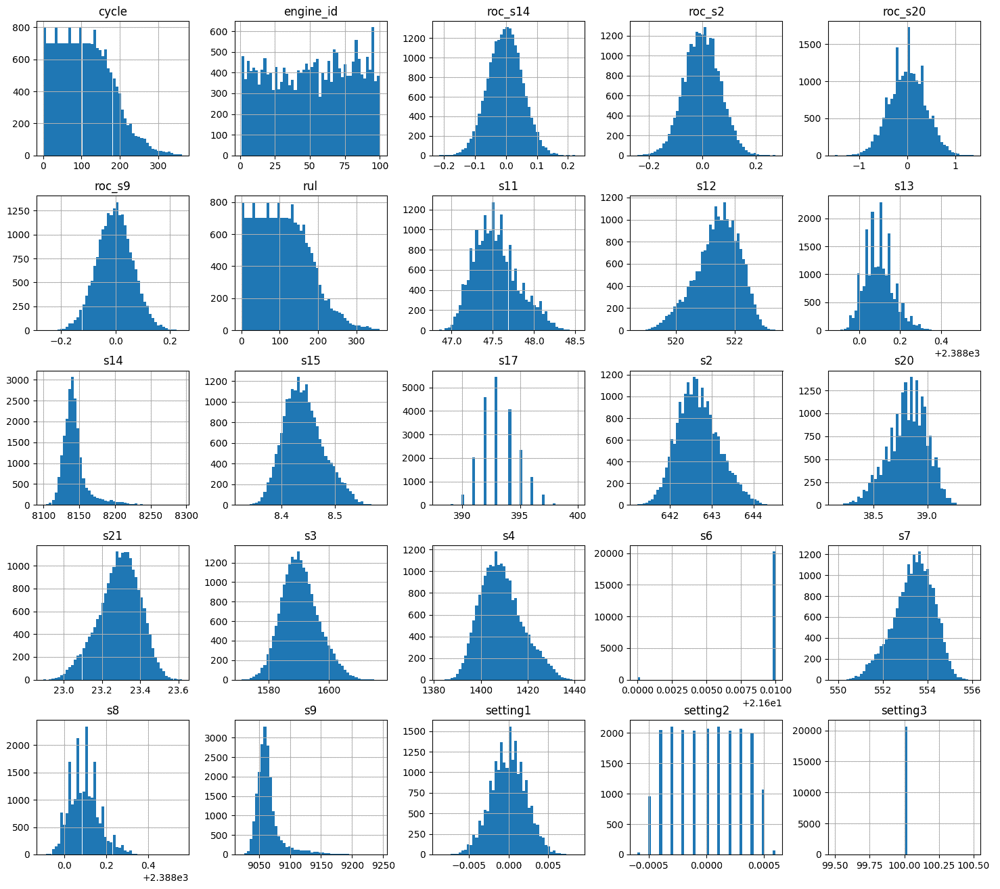
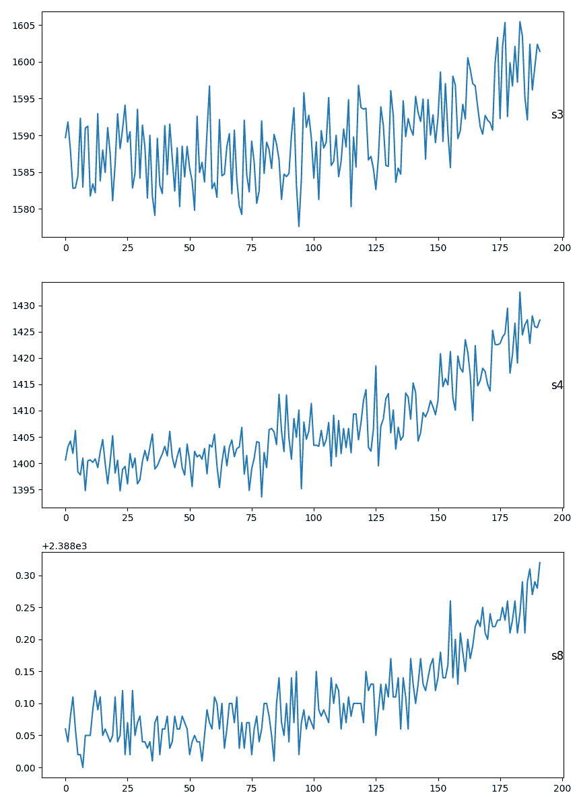
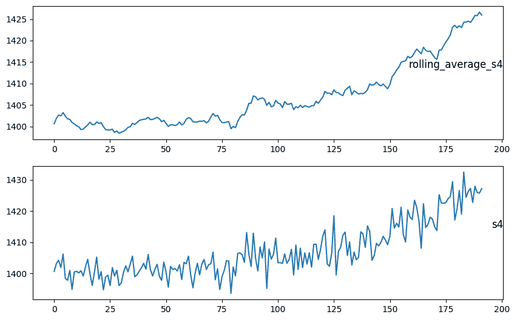
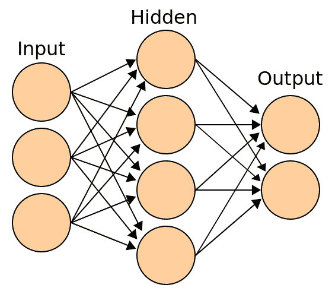
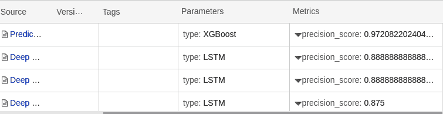

预测性维护的深度学习

预测性维护是物联网中最受追捧的机器学习解决方案之一。但它也是最难以捉摸的机器学习解决方案之一。机器学习的其他领域可以轻松解决，例如使用 OpenCV 或 Keras 等工具实现计算机视觉，可以在几小时内完成。要成功实施预测性维护，首先需要合适的传感器。第二章中的*数据采集设计*部分可以帮助确定适当的传感器位置。第二章中的*探索性因子分析*部分可以帮助确定数据存储的频率。实施预测性维护的最大难题之一是需要有足够数量的设备故障。对于坚固的工业设备来说，这可能需要很长时间。将维修记录与设备遥测数据进行关联也是关键步骤。

尽管挑战艰巨，回报是巨大的。一个正确实施的预测性维护解决方案可以通过确保关键设备在需要时准备就绪来拯救生命。它们还可以增加客户忠诚度，因为它们有助于公司比市场上类似产品少停机。最后，它们可以通过在服务设备之前提供服务技术人员所需的信息来降低成本并提高效率。这可以帮助他们诊断设备，并确保他们在服务设备时携带正确的零件。

在本章中，我们将继续使用 NASA Turbofan 数据集进行预测性维护，并涵盖以下配方：

+   利用特征工程增强数据

+   使用 Keras 进行跌倒检测

+   实施 LSTM 进行设备故障预测

+   部署模型到 Web 服务

# 利用特征工程增强数据

在改进模型中，最好的时间利用是特征工程。物联网生态系统有许多工具可以简化这一过程。设备可以通过数字孪生、图帧和 GraphX 进行地理连接或层次连接。这些工具可以增加一些特征，如显示与其他故障设备的联系程度。窗口化可以显示当前读数在一段时间内的差异。流式处理工具如 Kafka 可以合并不同的数据流，允许你将来自其他来源的数据进行整合。户外的机器可能会受到高温或潮湿的负面影响，而在气候控制建筑物内的机器则不会。

在这个配方中，我们将通过分析时间序列数据（如变化量、季节性和窗口化）来增强我们的数据。对于数据科学家来说，时间最宝贵的用途之一是进行特征工程。能够将数据切分为有意义的特征可以极大地提高我们模型的准确性。

## 准备工作

在上一章节的*使用 XGBoost 进行预测性维护*配方中，我们使用 XGBoost 来预测机器是否需要维护。我们导入了 NASA 的*涡轮风扇引擎退化模拟*数据集，可以在[`data.nasa.gov/dataset/Turbofan-engine-degradation-simulation-data-set/vrks-gjie`](https://data.nasa.gov/dataset/Turbofan-engine-degradation-simulation-data-set/vrks-gjie)找到。在本章的其余部分，我们将继续使用该数据集。为了做好准备，您将需要该数据集。

然后，如果您还没有将`numpy`、`pandas`、`matplotlib`和`seaborn`导入到 Databricks 中，请立即这样做。

## 如何做到这一点...

需要遵循此配方的以下步骤：

1.  首先，导入所需的库。我们将使用`pyspark.sql`、`numpy`和`pandas`进行数据操作，使用`matplotlib`和`seaborn`进行可视化：

```py
from pyspark.sql import functions as F
from pyspark.sql.window import Window

import pandas as pd
import numpy as np
np.random.seed(1385)

import matplotlib as mpl
import matplotlib.pyplot as plt
import seaborn as sns
```

1.  接下来，我们将导入数据并为其应用模式，以便正确使用数据类型。为此，我们通过向导导入数据文件，然后将我们的模式应用于它：

```py
file_location = "/FileStore/tables/train_FD001.txt"
file_type = "csv"

from pyspark.sql.types import *
schema = StructType([
  StructField("engine_id", IntegerType()),
  StructField("cycle", IntegerType()),
  StructField("setting1", DoubleType()),
  StructField("setting2", DoubleType()),
  StructField("setting3", DoubleType()),
  StructField("s1", DoubleType()),
  StructField("s2", DoubleType()),
  StructField("s3", DoubleType()),
  StructField("s4", DoubleType()),
  StructField("s5", DoubleType()),
  StructField("s6", DoubleType()),
  StructField("s7", DoubleType()),
  StructField("s8", DoubleType()),
  StructField("s9", DoubleType()),
  StructField("s10", DoubleType()),
  StructField("s11", DoubleType()),
  StructField("s12", DoubleType()),
  StructField("s13", DoubleType()),
  StructField("s14", DoubleType()),
  StructField("s15", DoubleType()),
  StructField("s16", DoubleType()),
  StructField("s17", IntegerType()),
  StructField("s18", IntegerType()),
  StructField("s19", DoubleType()),
  StructField("s20", DoubleType()),
  StructField("s21", DoubleType())
  ])
```

1.  最后，我们将其放入一个 Spark DataFrame 中：

```py
df = spark.read.option("delimiter"," ").csv(file_location, 
                                            schema=schema, 
                                            header=False)
```

1.  然后我们创建一个临时视图，以便我们可以在其上运行一个 Spark SQL 作业：

```py
df.createOrReplaceTempView("raw_engine")
```

1.  接下来，我们计算**剩余使用寿命** (**RUL**)。使用 SQL 魔法，我们从刚刚创建的`raw_engine`临时视图中创建一个名为`engine`的表。然后，我们使用 SQL 来计算 RUL：

```py
%sql

drop table if exists engine;

create table engine as
(select e.*
,mc - e.cycle as rul
, CASE WHEN mc - e.cycle < 14 THEN 1 ELSE 0 END as needs_maintenance 
from raw_engine e 
join (select max(cycle) mc, engine_id from raw_engine group by engine_id) m
on e.engine_id = m.engine_id)
```

1.  然后，我们将数据导入到一个 Spark DataFrame 中：

```py
df = spark.sql("select * from engine")
```

1.  现在我们计算**变化率** (**ROC**)。在 ROC 计算中，我们查看当前记录与上一记录之间的变化百分比。ROC 计算获取当前周期与前一个周期之间的变化百分比：

```py
my_window = Window.partitionBy('engine_id').orderBy("cycle")
df = df.withColumn("roc_s9", 
                   ((F.lag(df.s9).over(my_window)/df.s9) -1)*100)
df = df.withColumn("roc_s20", 
                   ((F.lag(df.s20).over(my_window)/df.s20) -1)*100)
df = df.withColumn("roc_s2", 
                   ((F.lag(df.s2).over(my_window)/df.s2) -1)*100)
df = df.withColumn("roc_s14", 
                   ((F.lag(df.s14).over(my_window)/df.s14) -1)*100)
```

1.  接下来，我们审查静态列。为了做到这一点，我们将 Spark DataFrame 转换为 Pandas，以便查看数据的汇总统计信息，如均值、四分位数和标准差：

```py
pdf = df.toPandas()
pdf.describe().transpose()
```

这将得到以下输出：



1.  现在，我们删除在这个练习中对我们没有价值的列。例如，我们将删除`settings3`和`s1`列，因为这些值从不改变：

```py
columns_to_drop = ['s1', 's5', 's10', 's16', 's18', 's19', 
                   'op_setting3', 'setting3']
df = df.drop(*columns_to_drop)
```

1.  接下来，我们将审查值之间的相关性。我们寻找完全相同的列。首先，在 DataFrame 上执行相关性函数。然后，使用`np.zeros_like`掩盖上三角。接下来，设置图表大小。然后，使用`diverging_palette`定义自定义颜色映射，接着使用`heatmap`函数绘制热力图：

```py
corr = pdf.corr().round(1)
mask = np.zeros_like(corr, dtype=np.bool)
mask[np.triu_indices_from(mask)] = True

f, ax = plt.subplots(figsize=(20, 20))

cmap = sns.diverging_palette(220, 10, as_cmap=True)

sns.heatmap(corr, mask=mask, cmap=cmap, vmin=-1, vmax=1, center=0,
            square=True, linewidths=.5, cbar_kws={"shrink": .5}, 
            annot=True)

display(plt.tight_layout())
```

下面的热力图显示了具有高度相关性的值。数值为`1`表示它们完全相关，因此可以从分析中删除：



1.  删除相似的列。我们发现`S14`与`S9`完全相同，因此我们将删除该列：

```py
columns_to_drop = ['s14']
df = df.drop(*columns_to_drop)
```

1.  现在我们拿到 DataFrame 并将其可视化。使用直方图或分布表显示数据的潜在问题，如异常值、偏斜数据、随机数据和不影响模型的数据：

```py
pdf = df.toPandas()

plt.figure(figsize = (16, 8))
plt.title('Example temperature sensor', fontsize=16)
plt.xlabel('# Cycles', fontsize=16)
plt.ylabel('Degrees', fontsize=16)
plt.xticks(fontsize=16)
plt.yticks(fontsize=16)
pdf.hist(bins=50, figsize=(18,16))
display(plt.show())
```

以下直方图截图展示了结果：



1.  然后我们检查模型的噪声，以确保它不会过度受到波动的影响：

```py
values = pdf[pdf.engine_id==1].values
groups = [5, 6, 7, 8, 9, 10, 11,12,13]
i = 1
plt.figure(figsize=(10,20))
for group in groups:
    plt.subplot(len(groups), 1, i)
    plt.plot(values[:, group])
    plt.title(pdf.columns[group], y=0.5, loc='right')
    i += 1
display(plt.show())
```

以下是输出结果：



1.  根据前一步骤，很明显数据是嘈杂的。这可能导致错误的读数。滚动平均可以帮助平滑数据。使用 7 个周期的滚动平均，我们去噪了数据，如下所示：

```py
w = (Window.partitionBy('engine_id').orderBy("cycle")\
     .rangeBetween(-7,0))
df = df.withColumn('rolling_average_s2', F.avg("s2").over(w))
df = df.withColumn('rolling_average_s3', F.avg("s3").over(w))
df = df.withColumn('rolling_average_s4', F.avg("s4").over(w))
df = df.withColumn('rolling_average_s7', F.avg("s7").over(w))
df = df.withColumn('rolling_average_s8', F.avg("s8").over(w))

pdf = df.toPandas()
values = pdf[pdf.engine_id==1].values
groups = [5, 25, 6, 26, 8, 27]
i = 1
plt.figure(figsize=(10,20))
for group in groups:
    plt.subplot(len(groups), 1, i)
    plt.plot(values[:, group])
    plt.title(pdf.columns[group], y=0.5, loc='right')
    i += 1
display(plt.show())
```

以下截图展示了 `rolling_average_s4` 相对于 `s4` 的图表：



1.  由于我们希望其他笔记本能访问这些数据，我们将其保存为一个 ML 准备好的表格：

```py
df.write.mode("overwrite").saveAsTable("engine_ml_ready") 

```

## 工作原理...

在这个配方中，我们进行了特征工程，使我们的数据更适用于我们的机器学习算法。我们移除了没有变化、高相关性的列，并对数据集进行了去噪。在 *步骤 8* 中，我们移除了没有变化的列。该方法用多种方式描述数据。审查图表显示许多变量根本不发生变化。接下来，我们使用热力图找到具有相同数据的传感器。最后，我们使用滚动平均值将原始数据集的数据平滑成新数据集。

## 还有更多...

到目前为止，我们只看过训练数据。但是我们还需要查看测试数据。有一个测试数据集和一个 RUL 数据集。这些数据集将帮助我们测试我们的模型。要导入它们，您需要运行额外的 2 个导入步骤：

1.  **导入测试数据**：依赖于训练集的架构，导入测试集并放入名为 `engine_test` 的表格中：

```py
# File location and type
file_location = "/FileStore/tables/test_FD001.txt"
df = spark.read.option("delimiter"," ").csv(file_location, 
                                            schema=schema, 
                                            header=False)
df.write.mode("overwrite").saveAsTable("engine_test")

```

1.  **导入 RUL 数据集**：接下来是导入剩余寿命数据集并将其保存到一个表格中：

```py
file_location = "/FileStore/tables/RUL_FD001.txt"
RULschema = StructType([StructField("RUL", IntegerType())])
df = spark.read.option("delimiter"," ").csv(file_location,
                                            schema=RULschema, 
                                            header=False)
df.write.mode("overwrite").saveAsTable("engine_RUL")
```

# 使用 keras 进行摔倒检测

一种预测性维护的策略是查看给定记录的设备故障模式。在这个配方中，我们将分类表现出在设备故障之前发生的模式的数据。

我们将使用 `keras`，这是一个非常强大的机器学习库。Keras 简化了 TensorFlow 和 PyTorch 的一些复杂性。对于机器学习初学者来说，Keras 是一个很好的框架，因为它易于入门，并且在 Keras 中学到的概念可以转移到更具表现力的机器学习库，如 TensorFlow 和 PyTorch。

## 准备工作

本配方扩展了我们在之前配方中进行的预测性维护数据集的特征工程。如果你还没有这样做，你需要将 `keras`、`tensorflow`、`sklearn`、`pandas` 和 `numpy` 库导入到你的 Databricks 集群中。

## 如何操作...

请注意以下步骤：

1.  首先，导入所需的库。我们导入`pandas`，`pyspark.sql`和`numpy`用于数据操作，`keras`用于机器学习，以及`sklearn`用于评估模型。在评估模型后，我们使用`io`，`pickle`和`mlflow`保存模型和结果，以便与其他模型进行比较：

```py
from pyspark.sql.functions import *
from pyspark.sql.window import Window

import pandas as pd
import numpy as np
import io
import keras
from sklearn.model_selection import train_test_split
from sklearn.metrics import precision_score
from sklearn.preprocessing import MinMaxScaler

from keras.models import Sequential
from keras.layers import Dense, Activation, LeakyReLU, Dropout

import pickle
import mlflow
```

1.  接下来，我们导入训练和测试数据。我们的训练数据将用于训练模型，而测试数据将用于评估模型：

```py
X_train = spark.sql("select rolling_average_s2, rolling_average_s3, 
                    rolling_average_s4, rolling_average_s7, 
                    rolling_average_s8 from \
                    engine_ml_ready").toPandas()

y_train = spark.sql("select needs_maintenance from \
                    engine_ml_ready").toPandas()

X_test = spark.sql("select rolling_average_s2, rolling_average_s3, 
                    rolling_average_s4, rolling_average_s7, 
                    rolling_average_s8 from \
                    engine_test_ml_ready").toPandas()

y_test = spark.sql("select needs_maintenance from \
                    engine_test_ml_ready").toPandas()
```

1.  现在我们对数据进行缩放。数据集的每个传感器具有不同的比例。例如，`S1`的最大值是`518`，而`S16`的最大值是`0.03`。因此，我们将所有值转换为`0`到`1`的范围。使每个度量影响模型的方式类似。我们将使用`sklearn`库中的`MinMaxScaler`函数调整比例：

```py
scaler = MinMaxScaler(feature_range=(0, 1))
X_train.iloc[:,1:6] = scaler.fit_transform(X_train.iloc[:,1:6])
X_test.iloc[:,1:6] = scaler.fit_transform(X_test.iloc[:,1:6])
dim = X_train.shape[1]
```

1.  第一层，即输入层，有 32 个节点。激活函数`LeakyReLU`在给定输入时定义输出节点。为了防止过拟合，在训练时将 25%的隐藏层和可见层丢弃：

```py
model = Sequential()
model.add(Dense(32, input_dim = dim))
model.add(LeakyReLU())
model.add(Dropout(0.25))
```

1.  类似于输入层，隐藏层使用 32 个节点作为输入层，`LeakyReLU`作为输出层。它还使用 25%的 dropout 来防止过拟合：

```py
model.add(Dense(32))
model.add(LeakyReLU())
model.add(Dropout(0.25))
```

1.  最后，我们添加一个输出层。我们给它一层，以便可以得到在`0`到`1`之间的输出。`sigmoid`作为我们的激活函数，有助于预测输出的概率。我们的优化器`rmsprop`和损失函数帮助优化数据模式并减少误差率：

```py
model.add(Dense(1))
model.add(Activation('sigmoid'))
model.compile(optimizer ='rmsprop', loss ='binary_crossentropy',
              metrics = ['accuracy'])
```

1.  现在我们训练模型。我们使用`model.fit`函数指定我们的训练和测试数据。批量大小用于设置算法迭代中使用的训练记录数量。`5`个 epoch 意味着它将通过数据集 5 次：

```py
model.fit(X_train, y_train, batch_size = 32, epochs = 5, 
          verbose = 1, validation_data = (X_test, y_test))
```

1.  下一步是评估结果。我们使用训练好的模型和我们的`X_test`数据集来获取预测值`y_pred`。然后，我们将预测结果与实际结果进行比较，并查看其准确性：

```py
y_pred = model.predict(X_test)
pre_score = precision_score(y_test,y_pred, average='micro')
print("Neural Network:",pre_score)
```

1.  接下来，我们将结果保存到`mlflow`中。结果将与本书中使用的其他预测维护 ML 算法进行比较：

```py
with mlflow.start_run():
    mlflow.set_experiment("/Shared/experiments/Predictive_Maintenance")
    mlflow.log_param("model", 'Neural Network')
    mlflow.log_param("Inputactivation", 'Leaky ReLU')
    mlflow.log_param("Hiddenactivation", 'Leaky ReLU')
    mlflow.log_param("optimizer", 'rmsprop')
    mlflow.log_param("loss", 'binary_crossentropy')
```

```py
    mlflow.log_metric("precision_score", pre_score)
    filename = 'NeuralNet.pickel'
    pickle.dump(model, open(filename, 'wb'))
    mlflow.log_artifact(filename)
```

## 工作原理...

通常神经网络有三个任务：

+   导入数据

+   通过训练识别数据的模式

+   预测新数据的结果

神经网络接收数据，训练自己识别数据的模式，然后用于预测新数据的结果。这个流程使用上一个流程中保存的清理和特征工程后的数据集。`X_train`数据集从`spark`数据表中取出并转换为 Panda DataFrame。训练数据集`X_train`和`y_train`用于训练模型。`X_test`提供了设备列表，这些设备已经发生了故障，而`y_test`提供了这些机器的实时故障。这些数据集用于训练模型和测试结果。

首先，我们有输入层。数据被馈送到我们的 32 个输入神经元中的每一个。神经元通过通道连接。通道被分配一个称为**权重**的数值。输入被相应的权重乘以，并且它们的总和被发送为输入到隐藏层中的神经元。每个这些神经元与一个称为**偏置**的数值相关联，该偏置被加到输入总和中。然后，这个值被传递到称为**激活函数**的阈值函数。激活函数决定神经元是否会被激活。在我们的前两层中，我们使用了 Leaky ReLU 作为我们的激活函数。**ReLU**或**修正线性单元**是一种流行的激活函数，因为它解决了梯度消失问题。在这个示例中，我们使用了 Leaky ReLU。Leaky ReLU 解决了 ReLU 存在的问题，即大梯度可能导致神经元永远不会被激活。激活的神经元通过通道将其数据传递到下一层。这种方法允许数据通过网络传播。这称为**前向传播**。在输出层中，具有最高层的神经元被激活并确定输出。

当我们首次将数据传入网络时，数据通常具有较高的误差程度。我们的误差和优化器函数使用反向传播来更新权重。前向传播和反向传播的循环重复进行，以达到更低的误差率。下图显示了输入、隐藏和输出层如何连接在一起：



## 还有更多...

在这个示例中，我们将`LeakyReLU`作为激活函数，`rmsprop`作为优化器，`binary_crossentropy`作为损失函数。然后我们将结果保存到`mlflow`。我们可以通过尝试不同的组合来调整这个实验的参数，比如神经元的数量或层数。我们也可以改变激活函数，使用 ReLU 或者 TanH。我们也可以将`Adam`作为优化器。将这些结果保存到`mlflow`可以帮助我们改进模型。

# 实施 LSTM 以预测设备故障

递归神经网络预测数据序列。在前一个示例中，我们查看了某一时刻并确定是否需要维护。正如我们在第一个示例中看到的那样，涡轮风扇失效数据集具有高度的变异性。在任何时间点读取的数据可能表明需要维护，而下一个时间点可能表明不需要维护。在确定是否派出技术员时，有一个振荡信号可能会导致问题。**长短期记忆网络**（**LSTM**）经常与时间序列数据一起使用，例如涡轮风扇失效数据集。

使用 LSTM，我们查看一系列数据，类似于窗口。LSTM 使用有序序列来帮助确定，例如，基于先前数据序列，涡轮风扇引擎是否即将故障。

## 准备工作

对于这个配方，我们将使用 NASA 的*涡轮风扇运行到故障*数据集。在这个配方中，我们将使用 Databricks 笔记本。此配方需要安装几个库。对于数据处理，我们需要安装`numpy`和`pandas`，用于创建 LSTM 模型的`keras`，以及用于评估和保存模型结果的`sklearn`和`mlflow`。

即使在先前的配方中我们添加了窗口处理和预处理数据，但在这个配方中我们将使用原始数据。LSTM 窗口化数据，并且还有大量与这种类型 ML 算法独特的提取和转换。

## 如何做…

我们将为这个配方执行以下步骤：

1.  首先，我们将导入后续需要使用的所有库。我们将导入`pandas`和`numpy`进行数据处理，`keras`用于 ML 模型，`sklearn`用于评估，以及`pickel`和`mlflow`用于存储结果：

```py
import pandas as pd
import numpy as np

import keras
from keras.models import Sequential
from keras.layers import Dense, Dropout, LSTM, Activation

from sklearn import preprocessing
from sklearn.metrics import confusion_matrix, recall_score, precision_score
import pickle
import mlflow
```

1.  接下来，我们将设置变量。我们将设置 2 个周期期间。此外，我们使用一个序列长度变量。序列长度允许 LSTM 回溯 5 个周期。这类似于第一章中讨论的窗口处理，*设置 IoT 和 AI 环境*。我们还将获取数据列的列表：

```py
week1 = 7
week2 = 14
sequence_length = 100
sensor_cols = ['s' + str(i) for i in range(1,22)]
sequence_cols = ['setting1', 'setting2', 'setting3', 'cycle_norm']
sequence_cols.extend(sensor_cols)
```

1.  接下来，我们从第三章的*IoT 机器学习中的简单预测性维护与 XGBoost*配方中导入`spark`数据表的数据。我们还删除`label`列，因为我们将重新计算标签。我们将导入三个数据框。`train`数据框用于训练模型。`test`数据框用于测试模型的准确性，而`truth`数据框则是`test`数据框的实际故障：

```py
train = spark.sql("select * from engine").toPandas()
train.drop(columns="label" , inplace=True)
test = spark.sql("select * from engine_test2").toPandas()
truth = spark.sql("select * from engine_rul").toPandas()
```

1.  然后，我们生成标签，显示设备是否需要维护。`label1`显示设备在 14 个周期内将会故障，而`label2`显示设备将在 7 个周期内故障。首先，我们创建一个 DataFrame，显示每台发动机的最大周期数基于 RUL。接下来，我们使用 RUL DataFrame 在我们的 train DataFrame 中创建一个 RUL 列。通过从当前周期中减去最大寿命来完成此操作。然后，我们放弃我们的`max`列。接下来，我们创建一个新列`label1`。如果 RUL 小于 14 个周期，则`label1`的值为`1`。然后将其复制到`label2`中，并且如果 RUL 小于 1 周，则添加值`2`：

```py
rul = pd.DataFrame(train.groupby('engine_id')['cycle']\
                   .max()).reset_index()
rul.columns = ['engine_id', 'max']
train = train.merge(rul, on=['engine_id'], how='left')
train['RUL'] = train['max'] - train['cycle']
train.drop('max', axis=1, inplace=True)
train['label1'] = np.where(train['RUL'] <= week2, 1, 0 )
train['label2'] = train['label1']
train.loc[train['RUL'] <= week1, 'label2'] = 2
```

1.  除了为训练数据生成标签外，我们还需要为测试数据做同样的事情。训练数据和测试数据有所不同。训练数据有一个表示机器故障时间的结束日期。训练集没有。相反，我们有一个`truth`数据框，显示了机器实际故障的时间。在我们计算标签之前，需要将`test`和`truth`数据集结合起来添加标签列：

```py
rul = pd.DataFrame(test.groupby('engine_id')['cycle'].max())\
                   .reset_index()
rul.columns = ['engine_id', 'max']
truth.columns = ['more']
truth['engine_id'] = truth.index + 1
truth['max'] = rul['max'] + truth['more']
truth.drop('more', axis=1, inplace=True)

test = test.merge(truth, on=['engine_id'], how='left')
test['RUL'] = test['max'] - test['cycle']
test.drop('max', axis=1, inplace=True)

test['label1'] = np.where(test['RUL'] <= week2, 1, 0 )
test['label2'] = test['label1']
test.loc[test['RUL'] <= week1, 'label2'] = 2
```

1.  由于列具有不同的最小值和最大值，我们将对数据进行归一化，以防止一个变量掩盖其他变量。为此，我们将使用`sklearn`库的`MinMaxScaler`函数。该函数将值转换为`0`到`1`之间的范围。在我们的情况下，由于没有很多异常值，这是一个很好的缩放器。我们将对训练集和测试集执行相同的归一化步骤：

```py
train['cycle_norm'] = train['cycle']
cols_normalize = train.columns.difference(['engine_id','cycle','RUL',
                                           'label1','label2'])
min_max_scaler = preprocessing.MinMaxScaler()
norm_train = \
pd.DataFrame(min_max_scaler.fit_transform(train[cols_normalize]), 
                                          columns=cols_normalize, 
                                          index=train.index)
join = \
train[train.columns.difference(cols_normalize)].join(norm_train)
train = join.reindex(columns = train.columns)

test['cycle_norm'] = test['cycle']
norm_test = \
pd.DataFrame(min_max_scaler.transform(test[cols_normalize]), 
                                      columns=cols_normalize, 
                                      index=test.index)
test_join = \
test[test.columns.difference(cols_normalize)].join(norm_test)
test = test_join.reindex(columns = test.columns)
test = test.reset_index(drop=True)
```

1.  Keras 中的 LSTM 算法要求数据以序列形式呈现。在我们的变量部分中，我们选择将`sequence_length`设为`100`。这是在实验过程中可以调整的超参数之一。由于这是对一段时间内数据的顺序观察，序列长度是我们训练模型所需数据序列的长度。关于序列的最佳长度没有明确的规则。但通过实验，小序列的准确性较低已经显而易见。为了生成我们的序列，我们使用函数以符合 LSTM 算法的预期方式返回顺序数据：

```py
def gen_sequence(id_df, seq_length, seq_cols):
    data_array = id_df[seq_cols].values
    num_elements = data_array.shape[0]
    for start, stop in zip(range(0, num_elements-seq_length), 
                           range(seq_length, num_elements)):
        yield data_array[start:stop, :]

seq_gen = (list(gen_sequence(train[train['engine_id']==engine_id],
                             sequence_length, sequence_cols)) 
           for engine_id in train['engine_id'].unique())

seq_array = np.concatenate(list(seq_gen)).astype(np.float32)
```

1.  下一步是构建神经网络。我们构建 LSTM 的第一层。我们从一个序列模型开始。然后给它输入形状和序列的长度。单元告诉我们输出形状的维度，它将传递给下一层。接下来，它返回`true`或`false`。然后我们添加`Dropout`以增加训练中的随机性，防止过拟合：

```py
nb_features = seq_array.shape[2]
nb_out = label_array.shape[1]

model = Sequential()

model.add(LSTM(input_shape=(sequence_length, nb_features), 
               units=100, return_sequences=True))
model.add(Dropout(0.25))
```

1.  接着，我们构建网络的隐藏层。与第一层类似，隐藏层是一个 LSTM 层。然而，与将整个序列状态传递给输出不同，它只传递最后节点的值：

```py
model.add(LSTM(units=50, return_sequences=False))
model.add(Dropout(0.25))
```

1.  接着，我们构建网络的输出层。输出层指定输出维度和`activation`函数。通过这样，我们已经建立了神经网络的形状：

```py
model.add(Dense(units=nb_out, activation='sigmoid'))
```

1.  接下来，我们运行`compile`方法来配置模型进行训练。在其中，我们设置我们正在评估的度量标准。在这种情况下，我们正在使用`accuracy`作为我们的度量标准。然后，我们定义我们的误差或损失度量。在这个例子中，我们使用`binary_crossentropy`作为我们的度量标准。最后，我们指定将减少每次迭代中的错误的优化器：

```py
model.compile(loss='binary_crossentropy', optimizer='adam', 
              metrics=['accuracy'])
print(model.summary())
```

1.  然后，我们使用`fit`函数来训练模型。我们的`epochs`参数意味着数据将通过 10 次。由于随机丢弃，额外的运行将提高准确性。我们使用`batch_size`为`200`。这意味着模型在更新梯度之前将通过 200 个样本进行训练。接下来，我们使用`validation_split`将 95% 的数据用于训练模型，将 5% 用于验证模型。最后，我们使用`EarlyStopping`回调函数在模型停止提高准确性时停止训练：

```py
model.fit(seq_array, label_array, epochs=10, batch_size=200, 
          validation_split=0.05, verbose=1, 
          callbacks = \
          [keras.callbacks.EarlyStopping(monitor='val_loss', 
                                         min_delta=0, patience=0, 
                                         verbose=0, mode='auto')])
```

1.  接下来，我们根据我们在训练数据上进行的 95%/5% 分割来评估我们的模型。结果显示我们的模型在评估我们保留的 5% 数据时达到了 87% 的准确性：

```py
scores = model.evaluate(seq_array, label_array, verbose=1, 
                        batch_size=200)
print('Accuracy: {}'.format(scores[1]))
```

1.  接下来，我们看一下混淆矩阵，它显示了引擎是否需要维护的正确或错误评估的矩阵：

```py
y_pred = model.predict_classes(seq_array,verbose=1, batch_size=200)
y_true = label_array
print('Confusion matrix\n- x-axis is true labels.\n- y-axis is predicted labels')
cm = confusion_matrix(y_true, y_pred)
cm
```

我们的混淆矩阵看起来像下面的网格：

|  | **实际不需要维护** | **预测需要维护** |
| --- | --- | --- |
| **实际不需要维护** | 13911 | 220 |
| **实际需要维护** | 201 | 1299 |

1.  然后我们计算精度和召回率。由于数据集不平衡，即不需要维护的值远远超过需要维护的值，精度和召回率是评估此算法的最合适的指标：

```py
precision = precision_score(y_true, y_pred)
recall = recall_score(y_true, y_pred)
print( 'precision = ', precision, '\n', 'recall = ', recall)
```

1.  接下来，我们需要转换数据，使得测试数据与训练数据的顺序数据类型相同。为此，我们执行类似于我们对训练数据所做的数据转换步骤：

```py
seq_array_test_last = [test[test['engine_id']==engine_id]\
[sequence_cols].values[-sequence_length:] for engine_id in \
test['engine_id'].unique() if \
len(test[test['engine_id']==engine_id]) >= sequence_length]

seq_array_test_last = \
np.asarray(seq_array_test_last).astype(np.float32)

y_mask = [len(test[test['engine_id']==engine_id]) >= \
          sequence_length for engine_id in \
          test['engine_id'].unique()]

label_array_test_last = \
test.groupby('engine_id')['label1'].nth(-1)[y_mask].values
label_array_test_last = label_array_test_last.reshape(
    label_array_test_last.shape[0],1).astype(np.float32)
```

1.  接下来，我们评估使用训练数据集生成的模型对测试数据集的准确性，以查看模型预测引擎何时需要维护的准确程度：

```py
scores_test = model.evaluate(seq_array_test_last, 
                             label_array_test_last, verbose=2)
print('Accuracy: {}'.format(scores_test[1]))
y_pred_test = model.predict_classes(seq_array_test_last)
y_true_test = label_array_test_last
print('Confusion matrix\n- x-axis is true labels.\n- y-axis is predicted labels')
cm = confusion_matrix(y_true_test, y_pred_test)
print(cm)

pre_score = precision_score(y_true_test, y_pred_test)
recall_test = recall_score(y_true_test, y_pred_test)
f1_test = 2 * (pre_score * recall_test) / (pre_score + recall_test)
print('Precision: ', pre_score, '\n', 'Recall: ', recall_test,
      '\n', 'F1-score:', f1_test )
```

1.  现在我们已经有了我们的结果，我们将这些结果与我们的模型一起存储在我们的 MLflow 数据库中：

```py
with mlflow.start_run():
    mlflow.set_experiment("/Shared/experiments/Predictive_Maintenance")
    mlflow.log_param("type", 'LSTM')
    mlflow.log_metric("precision_score", pre_score)
    filename = 'model.sav'
    pickle.dump(model, open(filename, 'wb'))
    mlflow.log_artifact(filename)
```

## 工作原理...

LSTM 是一种特殊类型的**循环神经网络**（**RNN**）。RNN 是一种神经网络架构，通过保持序列在内存中来处理序列数据。相比之下，典型的前馈神经网络不保持序列信息，不允许灵活的输入和输出。递归神经网络使用递归从一个输出调用到其输入，从而生成一个序列。它传递网络在任何给定时间的状态的副本。在我们的案例中，我们使用了两层 RNN。这一额外的层有助于提高准确性。

LSTM 通过使用门控函数解决了传统 RNN 存在的数据消失问题。数据消失问题是指神经网络过早停止训练但不准确的情况。通过使用丢失数据，我们可以帮助解决这个问题。LSTM 通过使用门控函数来实现这一点。

# 将模型部署到网络服务

模型的部署可以因设备能力而异。一些带有额外计算能力的设备可以直接运行机器学习模型。而其他设备则需要帮助。在本章中，我们将把模型部署到一个简单的网络服务中。使用现代化的云网络应用或 Kubernetes，这些网络服务可以扩展以满足设备群的需求。在下一章中，我们将展示如何在设备上运行模型。

## 准备工作

到目前为止，在这本书中，我们已经研究了三种不同的机器学习算法，用于解决 NASA Turbofan 故障预测数据集的预测性维护问题。我们记录了结果到 MLflow。我们可以看到，我们的 XGBoost 笔记本在性能上超过了更复杂的神经网络。以下截图显示了 MLflow 结果集，显示了参数及其相关分数。



从这里我们可以下载我们的模型并将其放入我们的 web 服务中。为此，我们将使用 Python Flask web 服务和 Docker 使服务可移植。在开始之前，使用 `pip install` 安装 python 的 `Flask` 包。还要在本地计算机上安装 Docker。Docker 是一个工具，允许您构建复杂的部署。

## 如何做...

在这个项目中，您需要创建三个文件来测试预测器 web 服务和一个文件来扩展到生产环境。首先创建 `app.py` 作为我们的 web 服务器，`requirements.txt` 作为依赖项，以及从 `mlflow` 下载的 XGBoost 模型。这些文件将允许您测试 web 服务。接下来，要投入生产，您需要将应用程序 docker 化。将文件 docker 化后，可以将其部署到诸如基于云的 web 应用程序或 Kubernetes 服务等服务中。这些服务易于扩展，使新的 IoT 设备接入无缝进行。

1.  文件 `app.py` 是 Flask 应用程序。为了 web 服务，导入 `Flask`，用于内存中读取模型的 `os` 和 `pickle`，数据操作的 `pandas`，以及运行我们的模型的 `xgboost`：

```py
from flask import Flask, request, jsonify
import os
import pickle
import pandas as pd
import xgboost as xgb
```

1.  接下来是初始化我们的变量。通过将 Flask 应用程序和 XGBoost 模型加载到内存中的函数外部，我们确保它仅在每次 web 服务调用时加载一次，而不是每次。通过这样做，我们极大地提高了 web 服务的速度和效率。我们使用 `pickle` 来重新加载我们的模型。`pickle` 可以接受几乎任何 Python 对象并将其写入磁盘。它还可以像我们的情况一样，从磁盘中读取并将其放回内存中：

```py
application = Flask(__name__)
model_filename = os.path.join(os.getcwd(), 'bst.sav')
loaded_model = pickle.load(open(model_filename, "rb"))
```

1.  然后我们创建 `@application.route` 来提供一个 `http` 端点。`POST` 方法部分指定它将仅接受 post web 请求。我们还指定 URL 将路由到 `/predict`。例如，当我们在本地运行时，可以使用 `http://localhost:8000/precict` URL 来发布我们的 JSON 字符串。然后我们将其转换为 `pandas` DataFrame，然后 XGBoost 数据矩阵变为调用 `predict`。然后我们确定它是否大于 `.5` 或小于并返回结果：

```py
@application.route('/predict', methods=['POST']) 
def predict():
    x_test = pd.DataFrame(request.json)
    y_pred = loaded_model.predict(xgb.DMatrix(x_test))
    y_pred[y_pred > 0.5] = 1
    y_pred[y_pred <= 0.5] = 0
    return int(y_pred[0])
```

1.  最后，在任何 Flask 应用程序中执行的最后一件事是调用 `application.run` 方法。此方法允许我们指定一个主机。在本例中，我们指定了一个特殊的主机 `0.0.0.0`，告诉 Flask 接受来自其他计算机的请求。接下来，我们指定一个端口。端口可以是任何数字。但是它确实需要与 Dockerfile 中的端口匹配：

```py
if __name__ == '__main__':
    application.run(host='0.0.0.0', port=8000)
```

1.  然后我们创建一个要求文件。`requirements.txt` 文件将安装项目的所有 python 依赖项。docker 将使用此文件安装依赖项：

```py
flask
pandas
xgboost
pickle-mixin
gunicorn
```

1.  接着，我们创建 Dockerfile。`docker`文件允许将预测器部署到 Web 端点。docker 文件的第一行将从 Docker Hub 拉取官方的 Python 3.7.5 镜像。接下来，我们将本地文件夹复制到名为`app`的 docker 容器中的新文件夹中。然后，我们设置工作目录为`app`文件夹。接着，我们使用`pip install`来安装我们在*步骤 5*中创建的要求文件中的要求。然后，我们暴露端口`8000`。最后，我们运行启动 Gunicorn 服务器的`gunicorn`命令：

```py
FROM python:3.7.5
ADD . /app
WORKDIR /app

RUN pip install -r requirements.txt

EXPOSE 8000
CMD ["gunicorn", "-b", "0.0.0.0:8000", "app"]
```

## 它的工作原理……

Flask 是一个轻量级的 Web 服务器。我们使用`pickle`从磁盘上保存的模型来恢复模型。然后，我们创建一个`http`端点进行调用。

## 这还不是全部……

现代基于云的 Web 应用程序，例如**Azure Web Apps**，可以自动将新的 Docker 镜像拉入生产环境。还有许多 DevOps 工具可以拉取镜像，并通过各种测试来运行它们，然后使用 Docker 容器实例或诸如 Kubernetes 之类的 Docker 编排工具部署它们。但要让它们这样做，首先必须将它们放入诸如**Azure Container Registry**或**Docker Hub**之类的容器注册表中。为此，我们需要执行几个步骤。首先，我们将构建我们的容器。接下来，我们可以运行我们的容器以确保它工作正常。然后，我们登录到我们的容器注册表服务并将容器推送到其中。详细步骤如下：

1.  首先，我们构建容器。为此，我们导航到包含 docker 文件的文件夹，并运行 docker build。我们将使用`-t`命令标记它为`ch4`。然后，我们使用句点`.`指定 docker 文件位于本地文件夹中：

```py
docker build -t ch4 .
```

1.  现在我们已经构建了一个 Docker 镜像，接下来我们将基于该镜像运行容器，使用`docker run`命令。我们将使用`-it`交互命令，以便能够查看服务器的任何输出。我们还将使用`-p`或`port`命令指定将 Docker 容器的内部端口`8000`映射到外部端口`8000`：

```py
docker run -it -p 8000:8000 ch4
```

1.  然后，我们需要将容器放入能够被我们计算资源访问的地方。为此，首先注册 Docker Registry 服务，如 Docker Hub 或 Azure Container Registry。然后创建一个新的仓库。仓库提供者将为该仓库提供一个路径。

1.  接下来是登录到您的容器注册表服务，标记容器并推送容器。请记住用注册表服务提供的注册名或路径替换`[Your container path]`：

```py
docker login

docker tag ch4 [Your container path]:v1
docker push [Your container path]:v1
```

然后，您可以使用启用了 docker 的云技术将该预测器服务推送到生产环境。然后，您的设备可以将其传感器读数发送到 Web 服务，并通过云到设备消息接收设备是否需要维护的反馈。
