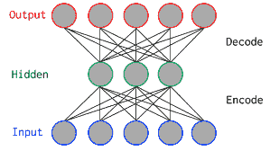
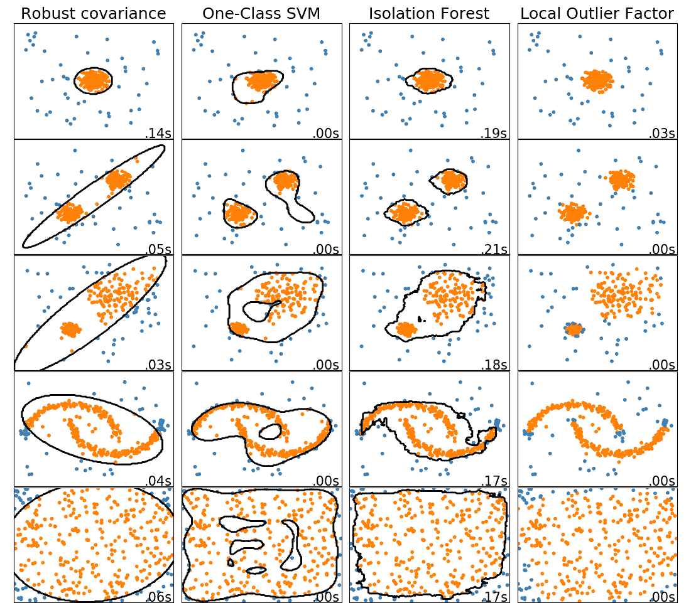
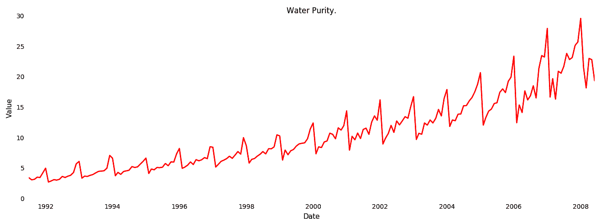
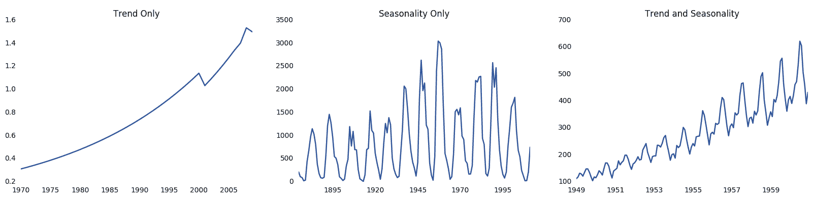

# 第五章：异常检测

设备的预测/处方 AI 生命周期始于数据收集设计。数据分析包括相关性和变异等因素。然后开始制造设备。除了少量样品设备外，通常没有导致机器学习模型的设备故障。为了弥补这一点，大多数制造商使用工作周期阈值来确定设备处于良好状态还是坏状态。这些工作周期标准可能是设备运行过热或传感器上设置了警报的任意值。但是数据很快需要更高级的分析。庞大的数据量可能对个人来说是令人生畏的。分析师需要查看数百万条记录，以找到大海捞针的情况。使用分析师中介方法结合异常检测可以有效帮助发现设备问题。异常检测通过统计、非监督或监督的机器学习技术来进行。换句话说，通常分析师首先查看正在检查的单个数据点，以检查是否存在尖峰和波谷等情况。然后，多个数据点被引入无监督学习模型，该模型对数据进行聚类，使数据科学家能够看到某组数值或模式与其他组的数值不同。最后，在发生足够的设备故障之后，分析师可以使用预测性维护所使用的相同类型的机器学习。一些机器学习算法，如孤立森林，更适合用于异常检测，但其原则是相同的。

异常检测可以在收集足够的数据进行监督学习之前进行，也可以作为连续监控解决方案的一部分。例如，异常检测可以警示您关于不同工厂的生产问题。当电气工程师将物理设计交给工厂时，他们进行物料清单（**BOM**）优化。简而言之，他们修改设计，使其更易组装或更具成本效益。大多数物理设备的生产周期为十年。在此期间，可能不再有设备初次制造时存在的零部件，这意味着需要对 BOM 进行更改。转向新的制造商也将改变设计，因为他们会进行自己的 BOM 优化。异常检测可以帮助精确定位在您的设备群中出现的新问题。

有多种方法可以观察异常检测。在第三章，*物联网的机器学习*，在*用异常检测分析化学传感器*的配方中，我们使用了 K 均值，一种流行的异常检测算法，来确定食物的化学特征是否与空气不同。这只是一种异常检测的类型。有许多不同类型的异常检测。有些是针对特定机器的，观察一段时间内是否异常。其他异常检测算法则通过监督学习来观察设备的正常和异常行为。有些设备受其本地环境或季节性影响。最后，在本章中，我们将讨论将异常检测部署到边缘设备上。

本章包含以下配方：

+   在 Raspberry Pi 和 Sense HAT 上使用 Z-Spikes

+   使用自编码器检测标记数据中的异常

+   对无标签数据使用孤立森林

+   使用 Luminol 检测时间序列异常

+   检测季节调整的异常

+   使用流式分析检测尖峰

+   在边缘检测异常

# 在 Raspberry Pi 和 Sense HAT 上使用 Z-Spikes

对个别设备的突然变化可能需要警报。物联网设备经常受到移动和天气影响。它们可能受到一天中的时间或一年中的季节的影响。设备群可能分布在全球各地。试图在整个设备群中获得清晰的洞察力可能是具有挑战性的。使用整个设备群的机器学习算法使我们能够单独处理每个设备。

Z-Spikes 的用例可以是电池的突然放电或温度的突然增加。人们使用 Z-Spikes 来判断是否被震动或突然振动了。Z-Spikes 可以用于泵，以查看是否存在堵塞。因为 Z-Spikes 在非同质环境中表现出色，它们经常成为边缘部署的一个很好的选择。

## 准备工作

在这个配方中，我们将在一个带有 Sense HAT 的 Raspberry Pi 上部署 Z-Spikes。硬件本身是一个相当常见的开发板和传感器设置，适合学习物联网的人使用。事实上，学生们可以将他们的代码发送到国际空间站上，以在他们的 Raspberry Pi 和 Sense HAT 上运行。如果你没有这个设备，GitHub 仓库中有一个模拟该设备的替代代码。

一旦您启动了 Raspberry Pi 并连接了 Sense HAT，您需要安装 SciPy。在 Python 中，通常可以使用`pip`安装所需的一切，但在这种情况下，您需要通过 Linux 操作系统来安装它。要做到这一点，请在终端窗口中运行以下命令：

```py
sudo apt update
apt-cache show python3-scipy
sudo apt install -y python3-scipy
```

您将需要`pip`安装`numpy`，`kafka`和`sense_hat`。您还需要在 PC 上设置 Kafka。在*设置 IoT 和 AI 环境*的*设置 Kafka*配方中有指南，请勿尝试在树莓派上设置 Kafka，因为其需要太多内存。请在 PC 上设置。

对于树莓派，您需要连接显示器、键盘和鼠标。开发者工具菜单中有 Python 编辑器。您还需要知道 Kafka 服务的 IP 地址。

## 如何做...

此配方的步骤如下：

1.  导入库：

```py
from scipy import stats
import numpy as np
from sense_hat import SenseHat
import json
from kafka import KafkaProducer
import time
```

1.  等待 Sense HAT 与操作系统注册：

```py
time.sleep(60)
```

1.  初始化变量：

```py
device= "Pi1"
server = "[the address of the kafka server]:9092"
producer = KafkaProducer(bootstrap_servers=server)
sense = SenseHat()
sense.set_imu_config(False, True, True) 
gyro = []
accel = [] 
```

1.  创建一个 Z-score 辅助函数：

```py
def zscore(data):
    return np.abs(stats.zscore(np.array(data)))[0]
```

1.  创建一个`sendAlert`辅助函数：

```py
def sendAlert(lastestGyro,latestAccel):
    alert = {'Gyro':lastestGyro, 'Accel':latestAccel}
    message = json.dumps(alert)
    producer.send(device+'alerts', key=bytes("alert", 
                                             encoding='utf-8'),
                  value=bytes(message, encoding='utf-8'))

```

1.  创建一个`combined_value`辅助函数：

```py
def combined_value(data):
    return float(data['x'])+float(data['y'])+float(data['z'])
```

1.  运行`main`函数：

```py
if __name__ == '__main__': 
    x = 0
    while True:
        gyro.insert(0,sense.gyro_raw)
        accel.insert(0,sense.accel_raw)
        if x > 1000: 
            gyro.pop() 
            accel.pop() 
        time.sleep(1)
        x = x + 1
        if x > 120:
            if zscore(gyro) > 4 or zscore(accel) > 4:
                sendAlert(gyro[0],accel[0]) 
```

## 它是如何工作的...

此算法正在检查最后一条记录是否比前 1,000 个值的 4 个标准偏差（*σ*）更多。*4σ* 应该在每 15,787 次读数或每 4 小时中有一个异常。如果我们将其更改为 4.5，则每 40 小时有一次异常。

我们导入`scipy`进行 Z-score 评估和`numpy`进行数据操作。然后我们将脚本添加到树莓派的启动中，这样每次有电源重置时脚本都会自动启动。设备需要等待外围设备初始化，如 Sense HAT。60 秒的延迟允许操作系统在尝试初始化 Sense HAT 之前感知 Sense HAT。然后我们初始化变量。这些变量是设备名称、Kafka 服务器的 IP 地址和 Sense HAT。然后我们启用 Sense HAT 的**内部测量单元**（**IMUs**）。我们禁用罗盘并启用陀螺仪和加速度计。最后，我们创建两个数组来存放数据。接下来，我们创建一个 Z-score 辅助函数，可以输入一个值数组并返回 Z-scores。接下来，我们需要一个函数来发送警报。`sense.gyro_raw`函数获取最新的陀螺仪和加速度计读数并将它们放入 Python 对象中，然后转换为 JSON 格式。然后我们创建一个 UTF-8 字节编码的键值。类似地，我们编码消息负载。接下来，我们创建一个 Kafka 主题名称。然后，我们将键和消息发送到主题。然后，我们在`__main__`下检查是否从命令行运行当前文件。如果是，我们将计数器`x`设置为`0`。然后我们开始一个无限循环。然后我们开始输入陀螺仪和加速度计数据。然后我们检查数组中是否有 1,000 个元素。如果是这样，我们会移除数组中的最后一个值，以保持数组的小型化。然后我们增加计数器以累积 2 分钟的数据。最后，我们检查是否超过了来自我们数组的 1,000 个值的 4 个标准偏差；如果是，我们发送警报。

虽然这是查看设备的一个很好的方式，但我们可能希望在整个设备群中进行异常检测。在接下来的配方中，我们将创建一个消息发送和接收器。如果我们要在这个配方中执行此操作，我们将创建一个 Kafka 生产者消息，以在循环的每次迭代中发送数据。

# 使用自编码器来检测标记数据中的异常

如果您有标记数据，您可以训练一个模型来检测数据是否正常或异常。例如，读取电动机的电流可以显示电动机由于如轴承失效或其他硬件失效而受到额外负载的情况。在物联网中，异常可能是先前已知的现象或以前未见过的新事件。顾名思义，自编码器接收数据并将其编码为输出。通过异常检测，我们可以看到模型能否确定数据是否非异常。在本配方中，我们将使用一个名为`pyod`的 Python 对象检测库。

## 准备工作

在本配方中，我们将使用从 Sense HAT 运动传感器收集的数据。本章最后的配方展示了如何生成此数据集。我们还将这个带标签的数据集放在了本书的 GitHub 存储库中。我们将使用一个名为`pyod`或**Python 异常检测**的 Python 异常检测框架。它包装了 TensorFlow 并执行各种机器学习算法，如自编码器和孤立森林。

## 如何操作...

此配方的步骤如下：

1.  导入库：

```py
from pyod.models.auto_encoder import AutoEncoder
from pyod.utils.data import generate_data
from pyod.utils.data import evaluate_print
import numpy as np
import pickle
```

1.  使用 NumPy 数组将文本文件加载到我们的笔记本中：

```py
X_train = np.loadtxt('X_train.txt', dtype=float)
y_train = np.loadtxt('y_train.txt', dtype=float)
X_test = np.loadtxt('X_test.txt', dtype=float)
y_test = np.loadtxt('y_test.txt', dtype=float)
```

1.  使用自编码器算法来修复模型到数据集：

```py
clf = AutoEncoder(epochs=30)
clf.fit(X_train)
```

1.  获取预测分数：

```py
y_test_pred = clf.predict(X_test) # outlier labels (0 or 1)
y_test_scores = clf.decision_function(X_test) # outlier scores
evaluate_print('AutoEncoder', y_test, y_test_scores)
```

1.  保存模型：

```py
pickle.dump( clf, open( "autoencoder.p", "wb" ) )
```

## 工作原理...

首先，我们导入`pyod`，我们的 Python 对象检测库。然后我们导入`numpy`进行数据操作和`pickle`用于保存我们的模型。接下来，我们使用`numpy`加载我们的数据。然后我们训练我们的模型并获得预测分数。最后，我们保存我们的模型。

自编码器将数据作为输入并通过较小的隐藏层减少节点数量，迫使其降低维度。自编码器的目标输出是输入。这允许我们使用机器学习来训练模型，以识别非异常情况。然后，我们可以确定一个值与训练模型相比的差距有多大。这些值将是异常的。以下图表概念性地展示了数据如何编码为一组输入。然后，在隐藏层中降低其维度，最后输出到一组较大的输出中：



## 还有更多...

在训练完我们的模型之后，我们需要知道在什么级别发送警报。在训练时，设置污染度（参见以下代码）确定触发警报功能所需的数据中异常值的比例：

```py
AutoEncoder(epochs=30, contamination=0.2)
```

我们还可以更改正则化器，如下例所示。正则化器用于平衡偏差和方差，以防止过度拟合和欠拟合：

```py
AutoEncoder(epochs=30, l2_regularizer=0.2)
```

我们还可以更改神经元的数量、损失函数或优化器。这通常被称为在数据科学中改变或调整超参数。调整超参数允许我们影响成功的指标，从而改善模型。

# 使用孤立森林处理无标签数据集

孤立森林是一种流行的异常检测机器学习算法。孤立森林可以帮助处理有重叠值的复杂数据模型。孤立森林是一种集成回归。与其他机器学习算法使用聚类或基于距离的算法不同，它将离群数据点与正常数据点分开。它通过构建决策树并计算基于节点遍历的分数来实现这一点。换句话说，它计算它遍历的节点数来确定结果。模型训练的数据越多，孤立森林需要遍历的节点数就越多。

与上一篇介绍类似，我们将使用 `pyod` 轻松训练一个模型。我们将使用 GitHub 仓库中的 Sense HAT 数据集。

## 准备就绪

如果您已经完成了关于自动编码器的前一篇介绍，那么您所需的一切都已准备就绪。在这个示例中，我们使用 `pyod` 进行目标检测库。本书的 GitHub 仓库中包含训练数据集和测试数据集。

## 如何执行……

本篇的步骤如下：

1.  导入库：

```py
from pyod.models.iforest import IForest
from pyod.utils.data import generate_data
from pyod.utils.data import evaluate_print
import numpy as np
import pickle
```

1.  上传数据：

```py
X_train = np.loadtxt('X_train.txt', dtype=float)
y_train = np.loadtxt('y_train.txt', dtype=float)
X_test = np.loadtxt('X_test.txt', dtype=float)
y_test = np.loadtxt('y_test.txt', dtype=float)
```

1.  训练模型：

```py
clf = IForest()
clf.fit(X_train)
```

1.  对测试数据进行评估：

```py
y_test_pred = clf.predict(X_test) # outlier labels (0 or 1)
y_test_scores = clf.decision_function(X_test) 
print(y_test_pred)

# evaluate and print the results
print("\nOn Test Data:")
evaluate_print('IForest', y_test, y_test_scores)
```

1.  保存模型：

```py
pickle.dump( clf, open( "IForest.p", "wb" ) )
```

## 工作原理……

首先，我们导入 `pyod`。然后导入 `numpy` 进行数据处理，以及 `pickle` 用于保存我们的模型。接下来，进行孤立森林训练。然后我们评估我们的结果。我们得到两种不同类型的结果：一种是用 `1` 或 `0` 表示是否正常或异常，另一种给出测试的分数。最后，保存我们的模型。

孤立森林算法使用基于树的方法对数据进行分割。数据越密集，分割得越多。孤立森林算法通过计算需要遍历的分割数量来查找不属于密集分割区域的数据。

## 还有更多内容……

异常检测是一种分析技术，可通过可视化帮助我们确定要使用的超参数和算法。scikit-learn 在其网站上有一个示例，展示了如何做到这一点（[`scikit-learn.org/stable/auto_examples/miscellaneous/plot_anomaly_comparison.html`](https://scikit-learn.org/stable/auto_examples/miscellaneous/plot_anomaly_comparison.html)）。这本书的 GitHub 存储库中有参考资料。接下来的图表是使用多种算法和设置进行异常检测的示例。在异常检测中不存在绝对正确的答案，只有适合手头问题的最佳解决方案：



# 使用 Luminol 检测时间序列异常

Luminol 是 LinkedIn 发布的时间序列异常检测算法。它使用位图来检查在数据集中具有稳健性的检测策略，往往会漂移。它还非常轻量级，可以处理大量数据。

在这个例子中，我们将使用芝加哥市的公共可访问的物联网数据集。芝加哥市有物联网传感器测量其湖泊的水质。因为数据集在进行异常检测之前需要进行一些整理，我们将使用`prepdata.py`文件从一个湖泊中提取一个数据点。

## 准备就绪

为了准备这个食谱，您需要从这本书的 GitHub 存储库下载 CSV 文件。接下来，您需要安装`luminol`：

```py
pip install luminol
```

## 如何操作...

此食谱涉及的步骤如下：

1.  使用 `prepdata.py` 准备数据:

```py
import pandas as pd 

df = pd.read_csv('Beach_Water_Quality_-_Automated_Sensors.csv', 
                  header=0)

df = df[df['Beach Name'] == 'Rainbow Beach']
df = df[df['Water Temperature'] > -100]
df = df[df['Wave Period'] > -100]
df['Measurement Timestamp'] = pd.to_datetime(df['Measurement
                                                 Timestamp'])

Turbidity = df[['Measurement Timestamp', 'Turbidity']]
Turbidity.to_csv('Turbidity.csv', index=False, header=False)
```

1.  在`Luminol.py`中导入库：

```py
from luminol.anomaly_detector import AnomalyDetector
import time
```

1.  执行异常检测：

```py
my_detector = AnomalyDetector('Turbidity.csv')
score = my_detector.get_all_scores()
```

1.  打印异常：

```py
for (timestamp, value) in score.iteritems():
    t_str = time.strftime('%y-%m-%d %H:%M:%S', 
                          time.localtime(timestamp))
    if value > 0:
        print(f'{t_str}, {value}')
```

## 工作原理...

在`dataprep` Python 库中，您只需导入`pandas`，这样我们就可以将 CSV 文件转换为`pandas` DataFrame。一旦我们有了`pandas` DataFrame，我们将会在`Rainbow Beach`上进行过滤（在我们的情况下，我们只关注`Rainbow Beach`）。然后，我们将剔除水温低于-100 度的异常数据。接着，我们将把`time`字符串转换成`pandas`可以读取的格式。我们这样做是为了输出时采用标准的时间序列格式。然后，我们只选择需要分析的两列，`Measurement Timestamp`和`Turbidity`。最后，我们将文件以 CSV 格式保存。

接下来，我们创建一个 Luminol 文件。从这里开始，我们使用`pip`安装`luminol`和`time`。然后，我们在 CSV 文件上使用异常检测器并返回所有分数。最后，如果我们的分数项的值大于 0，则返回分数。换句话说，只有在存在异常时才返回分数。

## 还有更多...

除了异常检测外，Luminol 还可以进行相关性分析。这有助于分析师确定两个时间序列数据集是否彼此相关。例如，芝加哥市的数据集测量了其湖泊中水质的各个方面。我们可以比较不同湖泊之间是否存在同时发生的共同影响。

# 检测季节性调整后的异常

如果设备在户外，温度传感器的数据可能会在一天中趋于上升。同样地，户外设备的内部温度在冬季可能会较低。并非所有设备都受季节性影响，但对于受影响的设备，选择处理季节性和趋势的算法至关重要。根据 Twitter 的数据科学家在研究论文《云中的自动异常检测通过统计学习》中指出，**季节性 ESD**是一种机器学习算法，通过考虑季节性和趋势来发现异常。

对于本示例，我们将使用芝加哥市湖泊水质数据集。我们将导入我们在*使用 Luminol 检测时间序列异常*示例中准备的数据文件。

## 准备工作

为了准备好，您将需要 Seasonal ESD 库。您可以通过以下`pip`命令简单安装：

```py
pip install sesd
```

本书的 GitHub 仓库中可以找到数据集。

## 如何执行...

执行这个示例的步骤如下：

1.  导入库：

```py
import pandas as pd 
import sesd
import numpy as np
```

1.  导入和操作数据：

```py
df = pd.read_csv('Beach_Water_Quality_-_Automated_Sensors.csv',
                  header=0)
df = df[df['Beach Name'] == 'Rainbow Beach']
df = df[df['Water Temperature'] > -100]
df = df[df['Wave Period'] > -100]
waveheight = df[['Wave Height']].to_numpy()
```

1.  执行异常检测：

```py
outliers_indices = sesd.seasonal_esd(waveheight, hybrid=True,
                                     max_anomalies=2)
```

1.  输出结果：

```py
for idx in outliers_indices:
    print("Anomaly index: {}, anomaly value: {}"\
           .format(idx, waveheight[idx]))
```

## 它是如何工作的...

在这个示例中，我们首先导入了`numpy`和`pandas`用于数据操作。接着，我们导入了我们的异常检测包`sesd`。然后，我们准备好了机器学习的原始数据。我们通过移除明显存在问题的数据（比如传感器工作不正常的数据）来完成这一步骤。接下来，我们将数据过滤到一个列中。然后，我们将该列数据输入季节性 ESD 算法中。

与第一个示例中的 Z-score 算法类似，本示例使用在线方法。在进行异常检测之前，它使用**局部加权回归分解的季节性和趋势分解**（STL）作为预处理步骤。数据源可能具有趋势和季节性，如下图所示：



分解的目的是让你能够独立查看趋势和季节性（如下图所示的趋势图）。这有助于确保数据不受季节性影响：



季节性 ESD 算法比 Z-score 算法更复杂。例如，Z-score 算法可能会在户外设备中显示错误的阳性结果。

# 使用流式分析检测尖峰

流分析是一个工具，它使用 SQL 接口将 IoT Hub 连接到 Azure 内部的其他资源。流分析将数据从 IoT Hub 移动到 Cosmos DB、存储块、无服务器函数或多个其他可扩展的选项。流分析内置了一些函数，您还可以使用 JavaScript 创建更多函数；异常检测就是其中之一。在本例中，我们将使用树莓派将陀螺仪和加速度数据流式传输到 IoT Hub。然后，我们将连接流分析，并使用其 SQL 接口仅输出异常结果。

## 准备工作

对于这个实验，您将需要 IoT Hub。接下来，您需要创建一个流分析作业。为此，您将进入 Azure 门户，并通过“创建新资源”向导创建一个新的流分析作业。创建新的流分析作业后，您将看到“概述”页面上有三个主要组件。这些是输入、输出和查询。输入如其名称所示，是您想要输入的流；在我们的情况下，我们正在输入 IoT Hub。要连接到 IoT Hub，您需要点击“输入”，然后选择 IoT Hub 的输入类型，然后选择您为此配方创建的 IoT Hub 实例。接下来，您可以创建一个输出。这可以是诸如 Cosmos DB 之类的数据库，或者是函数应用程序，以便通过任何数量的消息系统发送警报。为了简单起见，本配方不会指定输出。为测试目的，您可以在流分析查询编辑器中查看输出。

## 如何操作…

此配方的步骤如下：

1.  导入库：

```py
#device.py

import time
from azure.iot.device import IoTHubDeviceClient, Message
from sense_hat import SenseHat
import json
```

1.  声明变量：

```py
client = IoTHubDeviceClient.create_from_connection_string("your device key here")
sense = SenseHat()
sense.set_imu_config(True, True, True) 
```

1.  获取连接的设备值：

```py
def combined_value(data):
    return float(data['x'])+float(data['y'])+float(data['z'])
```

1.  获取并发送数据：

```py
while True:
    gyro = combined_value(sense.gyro_raw)
    accel = combined_value(sense.accel_raw)

    msg_txt_formatted = msg.format(gyro=gyro, accel=accel)
    message = Message(msg_txt_formatted)
    client.send_message(message)

    time.sleep(1)
```

1.  创建使用`AnomalyDetection_SpikeAndDip`算法检测异常的 SQL 查询：

```py
    SELECT
        EVENTENQUEUEDUTCTIME AS time,
        CAST(gyro AS float) AS gyro,
        AnomalyDetection_SpikeAndDip(CAST(gyro AS float), 95, 120, 'spikesanddips')
            OVER(LIMIT DURATION(second, 120)) AS SpikeAndDipScores
    INTO output
    FROM tempin
```

## 工作原理…

要在树莓派上导入库，您需要登录树莓派并使用`pip`安装`azure-iot-device`和`SenseHat`。接下来，您需要进入该设备并创建一个名为`device.py`的文件。然后，您将导入`time`、Azure IoT Hub、Sense HAT 和`json`库。接下来，您需要进入 IoT Hub，并通过门户创建设备，获取您的连接字符串，并将其输入到标有“在此处输入您的设备密钥”的位置。然后，初始化`SenseHat`并将内部测量单位设置为`True`，初始化我们的传感器。然后创建一个帮助函数，将我们的`x`、`y`和`z`数据结合起来。接下来，从传感器获取数据并将其发送到 IoT Hub。最后，在再次发送数据之前等待一秒钟。

接下来，进入您已设置的流分析作业，并单击“编辑查询”。从这里，创建一个公共表达式。公共表达式允许您简化复杂的查询。然后使用内置的异常检测尖峰和低谷算法，在 120 秒的窗口内执行。快速编辑器允许您测试实时数据流，并查看异常检测器给出的异常或非异常结果分数。

# 在边缘上检测异常：

在这个最终的教程中，我们将使用树莓派上的`SenseHat`来收集数据，在我们的本地计算机上训练这些数据，然后在设备上部署机器学习模型。为了避免冗余，在记录数据之后，您需要在本章前面的自编码器或孤立森林中运行任何一个配方。

人们在物联网中使用运动传感器来确保集装箱安全地运输到船上。例如，证明一个集装箱在特定港口被丢弃会有助于保险理赔。它们还用于保障工人的安全，以便检测跌倒或工人不安全行为。它们还用于设备在发生故障时产生振动的情况。例如，洗衣机、风力发电机和水泥搅拌机等设备。

在数据收集阶段，您需要安全地模拟跌倒或不安全工作。您还可以在不平衡的洗衣机上放置传感器。GitHub 仓库中的数据包含正常工作和来自跳舞的数据，我们称之为**异常**。

## 准备工作：

为了做好准备，您将需要一台带有 Sense HAT 的树莓派。您需要一种从树莓派获取数据的方式。您可以通过启用`SSH`或使用 USB 驱动器来完成。在树莓派上，您需要使用`pip`安装`sense_hat`和`numpy`。

## 如何操作...

该教程的步骤如下：

1.  导入库：

```py
#Gather.py

import numpy as np
from sense_hat import SenseHat
import json
import time
```

1.  初始化变量：

```py
sense = SenseHat()
sense.set_imu_config(True, True, True) 
readings = 1000
gyro,accel = sense.gyro_raw, sense.accel_raw
actions = ['normal', 'anomolous']
dat = np.array([gyro['x'], gyro['y'], gyro['z'], accel['x'],
                accel['y'], accel['z']])
x = 1
```

1.  等待用户输入开始：

```py
for user_input in actions:
     activity = input('Hit enter to record '+user_input + \
                      ' activity')
```

1.  收集数据：

```py
    x = 1
    while x < readings:
        x = x + 1
        time.sleep(0.1)
        gyro,accel = sense.gyro_raw, sense.accel_raw
        dat = np.vstack([dat, [[gyro['x'], gyro['y'], gyro['z'],
                         accel['x'], accel['y'], accel['z']]]])
        print(readings - x)
```

1.  将文件输出到磁盘进行训练：

```py
X_test = np.concatenate((np.full(800,0), np.full(800,1)), axis=0) 
y_test = np.concatenate((np.full(200,0), np.full(200,1)), axis=0) 
X_train = np.concatenate((dat[0:800,:],dat[1000:1800]))
y_train = np.concatenate((dat[800:1000],dat[1800:2000]))

np.savetxt('y_train.txt', y_train,delimiter=' ', fmt="%10.8f")
np.savetxt('y_test.txt',y_test, delimiter=' ',fmt="%10.8f") 
np.savetxt('X_train.txt', X_train,delimiter=' ', fmt="%10.8f")
np.savetxt('X_test.txt',X_test, delimiter=' ',fmt="%10.8f") 
```

1.  通过使用便携式存储设备，从树莓派复制文件到本地计算机。

1.  使用孤立森林配方训练孤立森林，并输出`pickle`文件。

1.  复制`iforrest.p`文件到树莓派，并创建一个名为`AnomalyDetection.py`的文件。

1.  导入库：

```py
#AnomalyDetection.py

import numpy as np
from sense_hat import SenseHat
from pyod.models.iforest import IForest
from pyod.utils.data import generate_data
from pyod.utils.data import evaluate_print
import pickle
sense = SenseHat()
```

1.  加载机器学习文件：

```py
clf = pickle.load( open( "IForrest.p", "rb" ) )
```

1.  为 LED 创建输出：

```py
def transform(arr):
    ret = []
    for z in arr:
        for a in z:
            ret.append(a)
    return ret

O = (10, 10, 10) # Black
X = (255, 0 ,0) # red

alert = transform([
        [X, X, O, O, O, O, X, X],
        [X, X, X, O, O, X, X, X],
        [O, X, X, X, X, X, X, O],
        [O, O, X, X, X, X, O, O],
        [O, O, X, X, X, X, O, O],
        [O, X, X, X, X, X, X, O],
        [X, X, X, O, O, X, X, X],
        [X, X, O, O, O, O, X, X]
        ])

clear = transform([
        [O, O, O, O, O, O, O, O],
        [O, O, O, O, O, O, O, O],
        [O, O, O, O, O, O, O, O],
        [O, O, O, O, O, O, O, O],
        [O, O, O, O, O, O, O, O],
        [O, O, O, O, O, O, O, O],
        [O, O, O, O, O, O, O, O],
        [O, O, O, O, O, O, O, O]
        ])
```

1.  预测异常：

```py
while True:
    dat = np.array([gyro['x'], gyro['y'], gyro['z'], accel['x'],
                    accel['y'], accel['z']])
    pred = clf.predict(dat)
    if pred[0] == 1:
        sense.set_pixels(alert)
    else:
        sense.set_pixels(clear)

    time.sleep(0.1)
```

## 工作原理...

我们创建两个文件 – 一个收集信息（称为`Gather.py`）和另一个在设备上检测异常（称为`AnomalyDetection.py`）。在`Gather.py`文件中，我们导入类，初始化`SenseHat`，设置一个变量来收集读数的数量，获取陀螺仪和加速度计读数，创建一个正常的匿名字符串数组，并设置初始的陀螺仪和传感器评分。然后，我们循环执行操作，并告诉用户在想要记录正常问候时按*Enter*，然后在想要记录异常读数时再次按*Enter*。从那里开始，我们收集数据并向用户反馈，告诉他们他们将收集多少个数据点。此时，您应该以正常的使用方式使用设备，例如通过将其靠近身体来检测跌落。然后，在下一个异常读数循环中，您会放下设备。最后，我们创建用于机器学习模型的训练集和测试集。然后，我们需要将数据文件复制到本地计算机，并像在本章早期使用孤立森林时一样执行分析。然后，我们将得到一个将在`AnomalyDetection.py`文件中使用的`pickle`文件。

从这里开始，我们需要创建一个名为`AnomalyDetection.py`的文件，该文件将在我们的树莓派上使用。然后我们加载我们的`pickle`文件，这是我们的机器学习模型。从这里开始，我们将创建`alert`和非`alert`（`clear`）变量，这些变量可以在 sense set 的 LED 显示上切换。最后，我们运行循环，如果预测设备行为异常，我们在 sense set 上显示一个`alert`信号；否则，我们显示一个`clear`信号。
