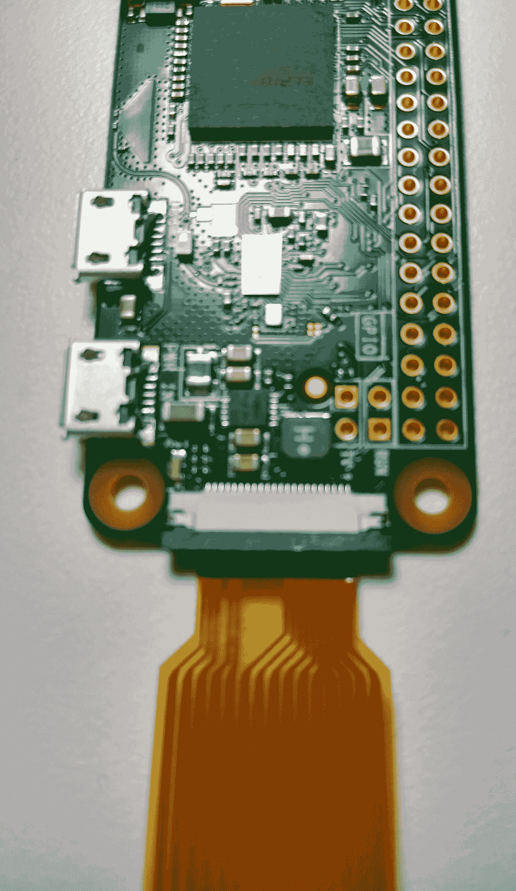

计算机视觉

近年来，计算机视觉取得了长足的进步。与许多其他需要复杂分析的机器学习形式不同，大多数计算机视觉问题来自简单的 RGB 摄像头。诸如 Keras 和 OpenCV 之类的机器学习框架内置了标准和高精度的神经网络。几年前，在 Python 中实现面部识别神经网络，例如，是复杂的，并且在高速设备上使用 C++或 CUDA 设置更是挑战。如今，这一过程比以往任何时候都更加简单和可访问。在本章中，我们将讨论在云中实现计算机视觉，以及在 NVIDIA Jetson Nano 等边缘设备上的应用。

我们将在本章节中涵盖以下的配方：

+   通过 OpenCV 连接摄像头

+   使用 Microsoft 的自定义视觉来训练和标记您的图像

+   使用深度神经网络和 Caffe 检测面部

+   在树莓派 4 上使用 YOLO 检测物体

+   在 NVIDIA Jetson Nano 上使用 GPU 检测物体

+   使用 PyTorch 在 GPU 上训练视觉

# 通过 OpenCV 连接摄像头

通过 OpenCV 连接摄像头非常简单。问题通常出现在安装 OpenCV 上。在台式电脑上，OpenCV 安装很容易，但在资源受限的设备上，可能需要额外的工作。例如，在树莓派 3 上，您可能需要启用交换空间。这允许系统将 SD 卡用作临时内存存储。根据设备的不同，有各种在线说明可以帮助您在具有挑战性的设备上安装 OpenCV。

在这个配方中，我们将 OpenCV 连接到树莓派 Zero 上的摄像头应用程序，但如果您没有硬件，您也可以在 PC 上运行代码。在接下来的配方中，我们将假设您已掌握这些知识，并简略解释正在进行的事情。

## 准备工作

从编码的角度来看，使用 OpenCV 可以屏蔽硬件的差异。无论您使用的是$5 的树莓派 Zero 还是$120 的 LattePanda，这个配方所需的唯一物品是一台电脑和一个摄像头。大多数笔记本电脑都有内置摄像头，但对于台式电脑或者如树莓派或 LattePanda 这样的**单板计算机（SBC）**，您将需要一个 USB 网络摄像头。

接下来，您需要安装 OpenCV。如前所述，有多种方法可以在受限设备上获取 OpenCV。这些方法都是根据具体设备的特性而定。在我们的情况中，我们将在树莓派 Zero 上安装 PiCam 模块。以下是 PiCam 模块的参考图像：


要将 PiCam 添加到 Pi Zero 上，您只需从连接器中拉出黑色标签，插入 PiCam 模块，然后将标签推入，如下图所示：



从这里开始，您需要在树莓派上启用摄像头。您需要将显示器、键盘和鼠标插入树莓派中。然后，通过执行以下命令确保您的系统是最新的：

```py
sudo apt-get update
sudo apt-get upgrade
```

然后，您可以通过进入 **Rasp Config** 菜单来启用摄像头。在终端中，键入以下内容：

```py
sudo raspi-config
```

从这里选择 **Camera** 然后启用它：


有三个不同的库可以使用 `pip` 安装：`opencv-contrib-python` 包含所有的 OpenCV 扩展功能，`opencv-python` 提供更快但功能更少的特性列表，最后 `opencv-cython` 提供更快的 Python 使用体验。

对于本书，我建议执行以下命令：

```py
pip install open-contrib-python
```

## 如何操作...

该示例的步骤如下：

1.  导入 OpenCV：

```py
import cv2
```

1.  选择摄像头：

```py
cap = cv2.VideoCapture(0)
```

1.  检查摄像头是否可用：

```py
if not (cap.isOpened()):
    print('Could not open video device')

```

1.  捕获、保存并显示摄像头帧：

```py
x = 0
while(True):
    ret, frame = cap.read()
    cv2.imshow('preview',frame)
    time.sleep(1)
    cv2.imwrite(f'./images/cap{x}.jpg', frame) 
    if cv2.waitKey(1) & 0xFF == ord('q'):
        break
```

1.  释放摄像头：

```py
cap.release()
cv2.destroyAllWindows()

```

## 工作原理...

在这个示例中，首先我们导入 OpenCV。然后我们选择它找到的第一个摄像头（`camera(0)`）。如果我们要找到第二个找到的摄像头，那么我们会增加摄像头号码（`camera(1)`）。接下来，我们检查摄像头是否可用。摄像头可能不可用的原因有几种。首先，它可能被其他东西打开了。例如，您可以在不同的应用程序中打开摄像头以查看其是否工作，这将阻止 Python 应用程序检测和连接到摄像头。另一个常见的问题是，代码中释放摄像头的步骤未执行，需要重新设置摄像头。接下来，我们捕获视频帧并在屏幕上显示，直到有人按下 *Q* 键。最后，在有人退出应用程序后，我们释放摄像头并关闭打开的窗口。

## 还有更多内容...

OpenCV 具有许多工具，可以将文本写入屏幕或在识别对象周围绘制边界框。此外，它还能够对 RGB 图像进行降采样或转换为黑白图像。过滤和降采样是机器学习工程师在允许它们高效运行的受限设备上执行的技术。

# 使用 Microsoft 的自定义视觉来训练和标记您的图像

微软的认知服务为训练图像和部署模型提供了一站式解决方案。首先，它提供了上传图像的方法。然后，它有一个用户界面，可以在图像周围绘制边界框，最后，它允许您部署和公开 API 端点，用于计算机视觉。

## 准备工作

要使用 Microsoft 的自定义视觉服务，您需要一个 Azure 订阅。然后，您需要启动一个新的自定义视觉项目。有一个免费层用于测试小型模型，有一个付费层用于更大的模型和规模化服务模型。在 Azure 门户中创建自定义视觉项目后，您将在资源组中看到两个新项目。第一个用于训练，第二个名称后附有`-prediction`标签，将用于预测。

然后，您将需要所分类物体的图像。在我们的情况下，我们正在识别含有铅和致癌物暴露的饮料。如果您完成了上一个配方，您将会有一个摄像机以每秒 1 次的间隔捕捉图像。要在认知服务中创建一个对象检测模型，您需要至少 30 张您要分类的每样东西的图像。更多图像将提高准确性。为了获得良好的准确性，您应该变化光线、背景、角度、大小和类型，并使用单独和组合的物体图像。

你还需要安装 Microsoft 的认知服务计算机视觉 Python 包。为此，请执行以下命令：

```py
pip3 install azure-cognitiveservices-vision-customvision
```

## 如何做...

本配方的步骤如下：

1.  转到您创建自定义视觉项目的 Azure 门户。

1.  将浏览器导航到[`customvision.ai`](https://customvision.ai)，并使用您的 Azure 凭据登录。这将带您到项目页面。有一些示例项目，但您会想创建自己的项目。点击“新项目”磁贴。然后，填写创建新项目向导。对于本配方，我们拍摄食品和饮料项目的照片，以便我们可以在工作场所安全计算机视觉项目中使用它们。这种计算机视觉可以在电子店中使用，在那里人们在含有铅或致癌物质等污染物的环境中进食。

1.  在项目的主页上，您会看到一个“标签”按钮。点击“未标记”选项（如下图所示），您将看到您上传的所有图像：


1.  点击图像，使用工具在图像周围绘制一个边界框。从这里开始，你可以在图像周围绘制边界框并打标签：


1.  接下来，点击绿色的“训练”按钮来训练模型：


1.  点击“训练”后，它将开始训练一个模型。这可能需要相当长的时间。一旦完成，点击迭代，然后点击“预测 URL”按钮：


这将为您提供一个窗口，其中包含发送图像到对象检测服务所需的一切。

测试模型的代码如下：

```py
import requests
file = open('images/drink1/cap0.jpg', 'rb')
url = 'Your iteration url goes here'
headers = {'Prediction-Key': 'key from the prediction url', \
           'Content-Type':'application/octet-stream'}
files = {'file': file}
r = requests.post(url, data=file, headers=headers)
json_data = r.json()
print(json_data)

```

## 工作原理如下...

认知服务使用标记的图像创建一个模型，以在更大的图像中查找这些图像。随着图像数量的增加，准确性也会提高。然而，随着准确性达到收敛点或者俗称的不再改善，会有一点。要找到这个收敛点，添加和标记更多图像，直到精度、召回率和 mAP 的迭代指标不再改善为止。下面的自定义视觉仪表板显示了我们用来显示模型准确性的三个因素：


# 使用深度神经网络和 Caffe 检测人脸

使用 OpenCV 的视觉神经网络实现的一个优势是它们适用于不同的平台。为了清晰和简洁起见，我们在安装了 Python 的环境中使用 Python。然而，在 ARM-CortexM3 上使用 OpenCV 的 C++实现或在 Android 系统上使用 OpenCV 的 Java 实现也可以得到相同的结果。在本示例中，我们将使用基于**Caffe**机器学习框架的 OpenCV 实现的人脸检测神经网络。本示例的输出将是 PC 上的一个窗口，其中有围绕面部的边界框。

## 准备工作

要运行此示例，您需要将网络摄像头连接到设备上。如果尚未安装 OpenCV、NumPy 和 Imutils，您需要先安装它们。在资源非常有限的设备上安装 OpenCV 可能会有挑战性。如果您无法在设备上本地安装它，可以尝试几种方法。许多具有额外存储空间的设备将允许您将磁盘用作内存的交换空间。如果相关设备支持 docker 化，那么可以在计算机上编译并在设备上运行容器。本示例使用了一个预训练模型，可以在本书的 GitHub 附录中的`Ch6`目录中找到。

## 如何做...

此示例的步骤如下：

1.  导入库：

```py
import cv2
import numpy as np
import imutils
```

1.  从`Ch6` GitHub 仓库的预训练模型中导入一个神经网络，然后初始化 OpenCV 的摄像头操作员：

```py
net = cv2.dnn.readNetFromCaffe("deploy.prototxt.txt", "res10_300x300_ssd_iter_140000.caffemodel")
cap = cv2.VideoCapture(0)
```

1.  创建一个函数，对图像进行降采样并将其转换为我们神经网络的预定义形状，然后执行推理：

```py
def FaceNN(frame):
    frame = imutils.resize(frame, width=300, height=300)
    (h, w) = frame.shape[:2]
    blob = cv2.dnn.blobFromImage(frame, 1.0, (300, 300), 
                                 (103.93, 116.77, 123.68))
    net.setInput(blob)
    detections = net.forward()
```

1.  绘制边界框：

```py
for i in range(0, detections.shape[2]):
    confidence = detections[0, 0, i, 2]
    if confidence < .8:
        continue
    box = detections[0, 0, i, 3:7] * np.array([w, h, w, h])
    (startX, startY, endX, endY) = box.astype("int")
    text = "{:.2f}%".format(confidence * 100)
    y = startY - 10 if startY - 10 > 10 else startY + 10
    cv2.rectangle(frame, (startX, startY), (endX, endY), 
                  (0, 0, 300), 2)
    cv2.putText(frame, text, (startX, y), cv2.FONT_HERSHEY_SIMPLEX, 
                0.45, (0, 0, 300), 2)
```

1.  返回带有边界框的图像：

```py
return frame
```

1.  创建一个无休止的循环，从摄像头读取图像，进行推理并获取叠加效果，然后将图像输出到屏幕上：

```py
while True:
    ret, frame = cap.read()
    image = FaceNN(frame)
    cv2.imshow('frame',image)
    if cv2.waitKey(1) & 0xFF == ord('q'):
        break
```

1.  最后，清理并销毁所有窗口：

```py
cap.release()
cv2.destroyAllWindows()
```

## 工作原理...

导入库后，我们将预训练的人脸检测模型导入到我们的 `net` 变量中。然后我们打开第一个摄像头（`0`）。接着我们使用 `FacNN` 来预测图像并绘制边界框。然后我们将图像缩小到适当的尺寸。接下来我们使用 `imutils` 来调整来自摄像头的大图像大小。然后我们将图像设置在网络中并获取人脸检测结果。接着我们获取人脸检测结果并获取对象确实是脸的置信度。在我们的例子中，我们使用了 `.8` 或 `80%` 的阈值。我们还过滤掉置信度较低的脸部。然后我们在脸部周围绘制边界框并在框上放置置信度文本。最后，我们将这些图像返回到我们的主 `while True` 循环并在屏幕上显示它们。我们还等待按下 *Q* 键来退出。最后，我们释放摄像头并销毁 UI 窗口。

# 在树莓派 4 上使用 YOLO 检测物体

**YOLO** 代表 **you only look once**。它是一个快速的图像分类库，专为 GPU 处理进行了优化。YOLO 往往优于所有其他计算机视觉库。在本教程中，我们将使用 OpenCV 实现的 YOLO 进行计算机视觉对象检测。在这个例子中，我们将使用一个已经训练好的模型，其中包含 40 种常见对象。

## 准备工作

准备好之后，您需要克隆本书的 GitHub 仓库。在 `Ch6` 部分，您会找到 `yolov3.cfg` 配置文件和 `yolov3.txt` 类别文本文件。接下来，您需要下载大的 `weights` 文件。为此，您需要打开命令提示符并 `cd` 到 `Ch6` 目录，然后使用以下命令下载 `weights` 文件：

```py
wget https://pjreddie.com/media/files/yolov3.weights
```

此外，您需要安装 OpenCV 和 NumPy。

## 如何做…

此教程的步骤如下：

1.  导入库：

```py
import cv2
import numpy as np
```

1.  设置变量：

```py
with open("yolov3.txt", 'r') as f:
    classes = [line.strip() for line in f.readlines()]
colors = np.random.uniform(0, 300, size=(len(classes), 3))
net = cv2.dnn.readNet("yolov3.weights", "yolov3.cfg")
cap = cv2.VideoCapture(0)
scale = 0.00392
conf_threshold = 0.5
nms_threshold = 0.4
```

1.  定义我们的输出层：

```py
def get_output_layers(net):
    layer_names = net.getLayerNames()
    output_layers = [layer_names[i[0] - 1] for i in \
                      net.getUnconnectedOutLayers()]
    return output_layers
```

1.  创建边界框：

```py
def create_bounding_boxes(outs,Width, Height):
    boxes = []
    class_ids = []
    confidences = []
    for out in outs:
        for detection in out:
            scores = detection[5:]
            class_id = np.argmax(scores)
            confidence = scores[class_id]
            if confidence > conf_threshold:
                center_x = int(detection[0] * Width)
                center_y = int(detection[1] * Height)
                w = int(detection[2] * Width)
                h = int(detection[3] * Height)
                x = center_x - w / 2
                y = center_y - h / 2
                class_ids.append(class_id)
                confidences.append(float(confidence))
                boxes.append([x, y, w, h])
    return boxes, class_ids, confidences
```

1.  绘制边界框：

```py
def draw_bounding_boxes(img, class_id, confidence, box): 
    x = round(box[0])
    y = round(box[1])
    w = round(box[2])
    h =round(box[3])
    x_plus_w = x+w
    y_plus_h = y+h
    label = str(classes[class_id])
    color = colors[class_id]
    cv2.rectangle(img, (x,y), (x_plus_w,y_plus_h), color, 2)
    cv2.putText(img, label, (x-10,y-10), cv2.FONT_HERSHEY_SIMPLEX, 
                0.5, color, 2)
```

1.  处理图像：

```py
def Yolo(image):
    try:
        Width = image.shape[1]
        Height = image.shape[0]
        blob = cv2.dnn.blobFromImage(image, scale, (416,416), 
                                     (0,0,0), True, crop=False)
        net.setInput(blob)
        outs = net.forward(get_output_layers(net))
        boxes, class_ids, confidences = \
            create_bounding_boxes(outs, Width, Height)
        indices = cv2.dnn.NMSBoxes(boxes, confidences, 
                                   conf_threshold, nms_threshold)

        for i in indices:
            i = i[0]
            box = boxes[i]

            draw_bounding_boxes(image, class_ids[i], 
                                confidences[i], box)
    except Exception as e:
    print('Failed dnn: '+ str(e))

    return image
```

1.  读取摄像头：

```py
while True:
    ret, frame = cap.read()
    image = Yolo(frame)
    cv2.imshow('frame',image)
    if cv2.waitKey(1) & 0xFF == ord('q'):
        break
```

1.  最后，清理和销毁所有窗口：

```py
cap.release()
cv2.destroyAllWindows()
```

## 工作原理…

YOLO 一次性查看图像并将图像分割成网格。然后它使用边界框来划分网格。YOLO 首先确定边界框是否包含对象，然后确定对象的类别。通过在算法中加入预过滤器，可以筛选掉不是对象的图像部分，从而显著加快搜索速度。

在本示例中，在导入我们的库之后，我们设置我们的变量。首先，我们打开`yolov3.txt`。这个文件包含我们将使用的预训练库的类别。接下来，我们创建一个随机的`color`数组来表示我们的不同对象为不同的颜色。然后，我们导入我们的库并设置我们的摄像头为计算机上的第一个摄像头。然后，我们设置阈值并缩放图像，以便图像大小适合分类器能够识别。例如，如果我们添加一个高分辨率图像，分类器可能只会识别非常小的物体而忽略较大的物体。这是因为 YOLO 试图确定围绕对象的边界框，以过滤掉物体。接下来，我们定义我们的输出层，并基于我们的置信度阈值创建边界框。然后，我们使用这些边界框在图像周围绘制矩形，并将该图像及其标签文本传回我们的图像处理器。我们的主要图像处理循环调用`Yolo`函数。最后，在清理资源之前，我们通过执行执行 YOLO 分析的主循环。

# 使用 NVIDIA Jetson Nano 在 GPU 上检测对象

NVIDIA 制造了一系列带 GPU 的 SBC。其中一些，如 TX2，因为它们轻便且能在其 GPU 启用系统下提供大量计算机视觉功能，所以被用于无人机上。与标准 CPU 相比，GPU 与**张量处理单元**（**TPUs**）能够提供多倍的计算机视觉能力。在本示例中，我们将使用 NVIDIA Jetson Nano，这是他们售价最低的开发板，售价为 99 美元。Jetson 有一个只能在他们产品上运行的库生态系统。

## 准备工作

首先，你需要一台 NVIDIA Jetson。接下来需要安装操作系统。为此，你需要使用 NVIDIA 的 Jetpack 映像来刷写一个 Micro USB。Jetpack 映像包含了一个基于 Ubuntu 的基础映像，并且包含了你启动所需的许多开发工具。一旦你有了操作系统映像，就将其放入 Jetson 中，并连接显示器、键盘、鼠标和网络。

然后，你将按以下步骤更新操作系统：

```py
sudo apt-get update
```

之后，你需要安装额外的软件来运行代码：

```py
sudo apt-get install git
sudo apt-get install cmake
sudo apt-get install libpython3-dev
sudo apt-get install python3-numpygpu sbc
```

一旦完成上述步骤，你将需要从 Jetson 下载起始项目：

```py
git clone --recursive https://github.com/dusty-nv/jetson-inference
```

接下来你将创建并导航至`build`目录：

```py
cd jetson-inference
mkdir build
cd build
```

从这里开始，我们将编译、安装并链接存储库中的代码：

```py
cmake ../
make
sudo make install
sudo ldconfig
```

运行`make`后，你将在终端中收到一个对话框，询问你是否要下载一些不同的预训练模型，以及 PyTorch，以便你可以训练自己的模型。使用向导首先选择你想要下载的模型：


工具将下载你选择的所有模型：


对于这个示例，您可以保留默认的模型。选择“确定”后，它将要求您安装 PyTorch，以便您可以训练自己的模型。选择 PyTorch，然后选择“确定”。

## 如何做...

这个示例的步骤如下：

1.  导入 Jetson 库：

```py
import jetson.inference
import jetson.utils
```

1.  设置变量：

```py
net = jetson.inference.detectNet("ssd-inception-v2", threshold=0.5)
camera = jetson.utils.gstCamera(1280,720,"/dev/video0")
display = jetson.utils.glDisplay()
```

1.  然后，运行摄像头显示循环：

```py
while display.IsOpen():
    img, width, height = camera.CaptureRGBA()
    detections = net.Detect(img,width, height)
    display.RenderOnce(img,width,height)
```

## 工作原理...

在这个示例中，我们添加了库，然后克隆了 Jetson 推理存储库。然后，我们运行了一系列的制作和链接工具，以确保安装正确运行。在此过程中，我们下载了大量预训练模型。然后我们开始编写我们的代码。由于 Jetson 在功能和内存方面有限，安装一个功能齐全的 IDE 可能会浪费资源。这个问题的一个解决方法是使用支持 SSH 的 IDE，比如 Visual Studio Code，并通过 IDE 远程连接到设备上。这样您就可以在不占用 Jetson Nano 资源的情况下与设备一起工作。

要构建这个项目，首先我们要导入 Jetson 推理和`utils`库。在之前的示例中，我们自己处理了许多低级工作，如使用 OpenCV 获取摄像头，然后使用其他库来操作图像并绘制边界框。使用 Jetson 的库，这些大部分代码都已为您处理好了。在导入了库之后，我们导入了之前下载的模型并设置了阈值。然后我们设置了摄像头的尺寸并将摄像头设置为`/dev/video0`。接下来，我们设置了视觉显示。最后，我们获取摄像头图像，运行检测算法，然后将带有边界框的摄像头图像输出到屏幕上。

## 还有更多...

正如我们之前提到的，NVIDIA 为他们的产品生态系统提供了支持。他们有帮助的容器、模型和教程，可以有效地与他们的硬件一起工作。为了帮助您，他们有一个产品网站，可以帮助您开始训练模型和构建容器化的笔记本电脑。他们提供了数十个预构建的容器，涵盖了不同的库，包括 PyTorch 和 TensorFlow 等。他们还有数十个使用从姿势检测到特定行业模型的预训练模型。他们甚至有自己的云，如果您愿意，可以在那里训练您的模型。但是您也可以在本地运行。他们的网站是[`ngc.nvidia.com/`](https://ngc.nvidia.com/)。

# 使用 PyTorch 在 GPU 上进行视觉训练

在前一个示例中，我们使用 GPU 和 NVIDIA Jetson Nano 实现了对象分类器。还有其他类型的启用 GPU 的设备。从能够放置在无人机上以进行实时管道分析的 NVIDIA TX2，到运行 GPU 并使用计算机视觉来执行工作场所安全性分析的工业 PC。在这个示例中，我们将通过向其添加我们自己的图像来训练并增加现有的图像分类模型。

物联网面临的挑战包括**空中升级（OTA）**和车队管理。物联网边缘是一个解决这些问题的概念框架。在 OTA 升级中，Docker 容器被用作升级机制。在不必担心设备完全失效的情况下，可以更新底层系统。如果更新不起作用，可以回滚系统，因为容器故障不会影响主操作系统，Docker 守护进程可以执行更新和回滚。

在这个示例中，我们将使用 NVIDIA Docker 容器来构建我们的模型。稍后，我们将使用该模型进行推断。

## 准备工作

为了做好准备，我们将使用版本大于 19 的 Docker 应用程序。在 Docker 19 中，添加了`--gpu`标签，允许您本地访问 GPU。根据您的 GPU，您可能需要安装额外的驱动程序以使 GPU 在您的计算机上工作。

我们还将使用**Visual Studio Code**（**VS Code**），借助插件，允许您直接在 NVIDIA 的 GPU PyTorch 容器中编写代码。您需要执行以下步骤：

1.  下载并安装 VS Code，然后使用扩展管理器通过点击扩展图标添加**Remote Development Extension Pack**。

1.  可选地，您可以注册 NVIDIA GPU Cloud，它具有容器和模型的目录。

1.  拉取用于 PyTorch 的 NVIDIA Docker 镜像：

```py
docker pull nvcr.io/nvidia/pytorch:20.02-py3
```

1.  在您希望将代码映射到的计算机上创建一个文件夹。然后，在终端窗口中，导航到您创建的目录。

1.  运行 Docker 容器：

```py
docker run --gpus all -it --rm -v $(pwd):/data/ nvcr.io/nvidia/pytorch:20.02-py3 
```

1.  打开 VS Code 并通过点击  按钮连接到您的容器，然后在对话框中输入`Remote-Containers: Attach to a running container`。这将为您列出正在运行的容器。接着，打开`/data`文件夹。

1.  将您的图像放在一个数据文件夹中，文件夹以类名标记。在 GitHub 仓库中有一个包含完整示例的文件夹及其图像。

1.  测试容器以确保容器已启动并运行，并安装了所有驱动程序。在您启动容器的终端窗口中，输入`python`，然后执行以下代码：

```py
import torch
print(torch.cuda.is_available())
```

如果返回`True`，您可以准备使用 GPU 进行训练。如果没有，您可能需要排查您的环境问题。

## 如何操作...

本示例的步骤如下：

1.  导入库：

```py
import numpy as np
import torch
from torch import nn
from torch import optim
import torch.nn.functional as F
from torchvision import datasets, transforms, models
from torch.utils.data.sampler import SubsetRandomSampler
```

1.  声明您的变量：

```py
datadir = './data/train'
valid_size = .3
epochs = 3
steps = 0
running_loss = 0
print_every = 10
train_losses = []
test_losses = []
```

1.  创建一个准确率打印机：

```py
def print_score(torch, testloader, inputs, device, model, criterion, labels):
test_loss = 0
accuracy = 0
model.eval()daimen

with torch.no_grad():
    for inputs, labels in testloader:
        inputs, labels = inputs.to(device), labels.to(device)
        logps = model.forward(inputs)
        batch_loss = criterion(logps, labels)
        test_loss += batch_loss.item()

        ps = torch.exp(logps)
        top_p, top_class = ps.topk(1, dim=1)
        equals = top_class == labels.view(*top_class.shape)
        accuracy += torch.mean(equals.type(torch.FloatTensor)).item()

train_losses.append(running_loss/len(trainloader))
test_losses.append(test_loss/len(testloader))
print(f"Epoch {epoch+1}/{epochs} \
      Train loss: {running_loss/print_every:.3f} \
      Test loss: {test_loss/len(testloader):.3f} \
      Test accuracy: {accuracy/len(testloader):.3f}")

 return test_loss, accuracy
```

1.  导入图像：

```py
train_transforms = transforms.Compose([transforms.Resize(224),
                                       transforms.ToTensor()])
test_transforms = transforms.Compose([transforms.Resize(224),
                                      transforms.ToTensor()])
train_data = datasets.ImageFolder(datadir, 
                                  transform=train_transforms)
test_data = datasets.ImageFolder(datadir, 
                                 transform=test_transforms)
num_train = len(train_data)
indices = list(range(num_train))
split = int(np.floor(valid_size * num_train))
np.random.shuffle(indices)
train_idx, test_idx = indices[split:], indices[:split]
train_sampler = SubsetRandomSampler(train_idx)
test_sampler = SubsetRandomSampler(test_idx)
trainloader = torch.utils.data.DataLoader(train_data, 
                                          sampler=train_sampler, 
                                          batch_size=1)
testloader = torch.utils.data.DataLoader(test_data, 
                                         sampler=test_sampler, 
                                         batch_size=1)
```

1.  设置网络：

```py
device = torch.device("cuda" if torch.cuda.is_available() else "cpu")
model = models.resnet50(pretrained=True)

for param in model.parameters():
    param.requires_grad = False

model.fc = nn.Sequential(nn.Linear(2048, 512), nn.ReLU(), 
                         nn.Dropout(0.2), nn.Linear(512, 10), 
                         nn.LogSoftmax(dim=1))
criterion = nn.NLLLoss()
optimizer = optim.Adam(model.fc.parameters(), lr=0.003)
model.to(device)
```

1.  训练模型：

```py
for epoch in range(epochs):
    for inputs, labels in trainloader:
        steps += 1
        inputs, labels = inputs.to(device), labels.to(device)
        optimizer.zero_grad()
        logps = model.forward(inputs)
        loss = criterion(logps, labels)
        loss.backward()
        optimizer.step()
        running_loss += loss.item()

        if steps % print_every == 0:
            test_loss, accuracy = print_score(torch, testloader, 
                                              inputs, device, 
                                              model, criterion,
                                              labels)
            running_loss = 0
            model.train()
```

1.  保存您的模型：

```py
torch.save(model, 'saftey.pth')
```

## 工作原理...

在这个示例中，我们使用了 NVIDIA 的 Docker 容器来跳过在本地计算机上安装 NVIDIA GPU 所需的许多步骤。我们使用 VS Code 连接到正在运行的 Docker 容器，并测试确保容器能够使用 GPU。然后，我们开发了我们的代码。

首先，像往常一样，我们导入了我们的库。然后我们声明了我们的变量。第一个变量是训练数据的位置，分割量，epochs 数量和运行步骤。然后我们制作了一个在屏幕上打印结果的功能，以便我们能够看到我们的模型是否随着超参数的更改而改进。然后我们从我们的训练文件夹导入了图像。之后，我们设置了我们的神经网络。接下来，我们导入了 ResNet 50 模型。我们将模型的`requires_grad`参数设置为`false`，这样我们的代码就不会影响已有的模型。我们正在使用一个使用 ReLU 作为激活函数的序列线性神经网络，丢失率为 20%。然后，我们添加了一个较小的网络作为我们的输出层，使用 softmax 作为我们的激活函数。我们使用`Adam`进行随机优化。然后我们通过我们的 epochs 运行它并训练模型。最后，模型被保存了。

## 还有更多...

你可能想测试你新训练的图像分类器。在本书的 GitHub 存储库中的`Ch6 -> pyImage -> inferance.py`目录下有一个推理测试器。在 NVIDIA 开发者门户网站上，你会找到一切所需信息，从如何在 Kubernetes 集群中有效管理 GPU 使用，到如何将刚刚创建的模型部署到像 TX2 这样的无人机设备上。
