自然语言处理和自助订购亭的机器人

近年来，语言理解已经取得了显著进展。新算法和硬件大大提高了语音激活系统的有效性和可行性。此外，计算机准确地模仿人类的能力已经接近完美。机器学习在近年来取得了重大进展的另一个领域是自然语言处理（**NLP**），或者有些人称之为语言理解。

将计算机语音与语言理解结合，就会为智能亭和智能设备等语音激活技术打开新的市场。

在本章中，我们将介绍以下几个示例：

+   唤醒词检测

+   使用 Microsoft Speech API 进行语音转文本

+   开始使用 LUIS

+   实施智能机器人

+   创建自定义语音

+   使用 QnA Maker 提升机器人功能

# 唤醒词检测

唤醒词检测用于确保您的语音激活系统不会出现意外行为。实现高准确率的音频是具有挑战性的。背景噪音会干扰主要的语音命令。实现更高准确率的一种方法是使用阵列麦克风。阵列麦克风用于消除背景噪音。在此示例中，我们使用 ROOBO 阵列麦克风和 Microsoft Speech Devices SDK。ROOBO 阵列麦克风非常适合语音亭，因为其形状使其可以平放在亭面上。

ROOBO 配备了一个基于 Android 的计算模块。Android 是亭子的常见平台，因为它价格低廉，并且具有触摸优先界面。在这个示例中，我们将使用 Microsoft Speech Devices SDK 的 Android 版本。Speech Devices SDK 与 Speech SDK 不同。Speech Devices SDK 可以同时使用阵列和圆形麦克风，而 Speech SDK 则用于单麦克风使用。以下是 ROOBO 阵列麦克风的照片：

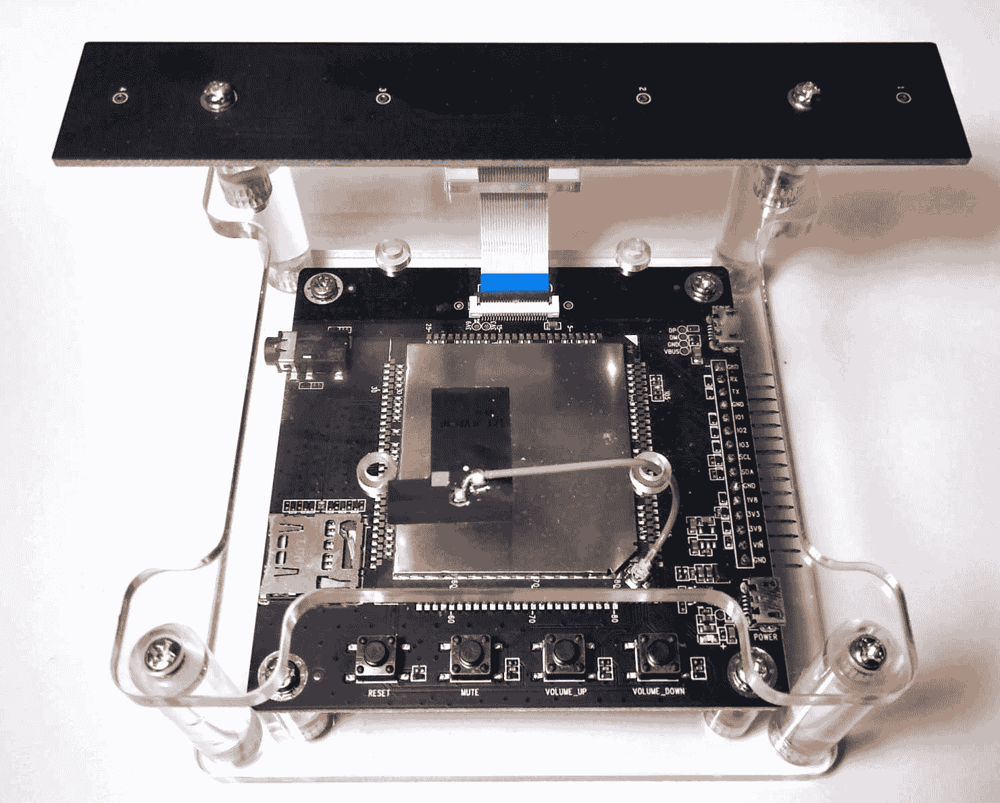

## 准备工作

对于这个示例，您将需要一个 Azure 订阅和 ROOBO 线性阵列或圆形麦克风。在您的个人电脑上，您还需要下载并安装 Android Studio 和 **Vysor**，以便与 ROOBO 一起使用。要设置设备，请执行以下步骤：

1.  下载并安装 Android Studio。

1.  下载并安装 Vysor。

1.  打开设备并将其连接到您的计算机。有两个 USB 连接器：一个标有电源，一个标有调试。将电源连接器连接到电源源，将调试 USB 电缆连接到您的计算机：

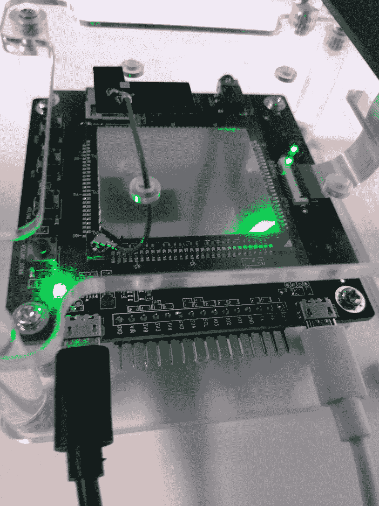

1.  打开 Vysor 并选择要查看的设备：

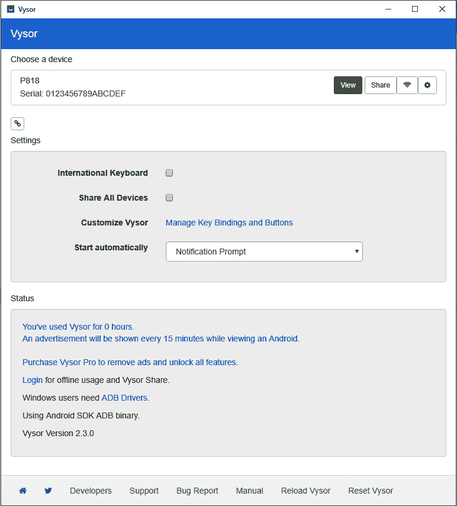

1.  点击设置：


现在我们已经完成了设备设置，让我们生成一个唤醒词。要生成唤醒词，请执行以下步骤：

1.  前往[`speech.microsoft.com/`](https://speech.microsoft.com/)，然后点击“开始使用”：

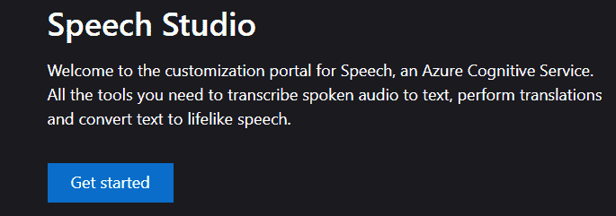

1.  选择**新项目**并填写自定义语音表单，然后点击**创建**：

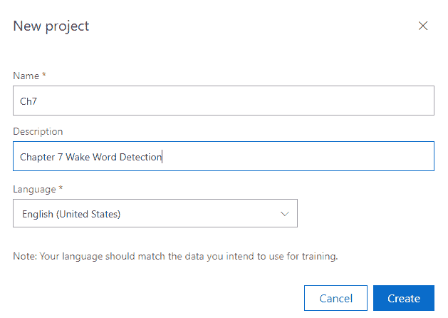

1.  点击“创建模型”。

1.  填写希望训练的唤醒词表单。然后，点击“下一步”：

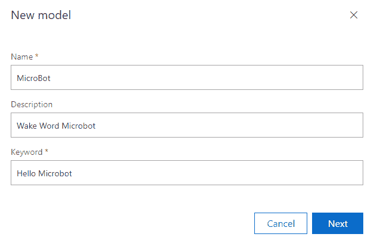

1.  听取并批准发音，然后点击“训练”：

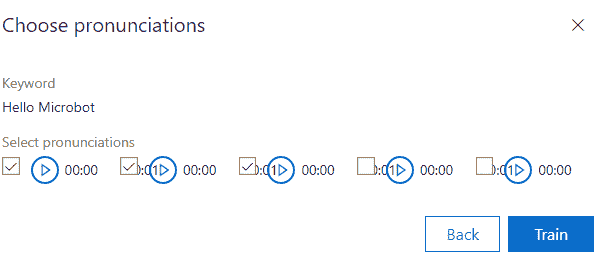

1.  模型将花费 20 分钟进行训练。完成后，点击下载。

## 如何实现…

此食谱的步骤如下：

1.  在 Android Studio 中，使用 Java 创建一个新项目：

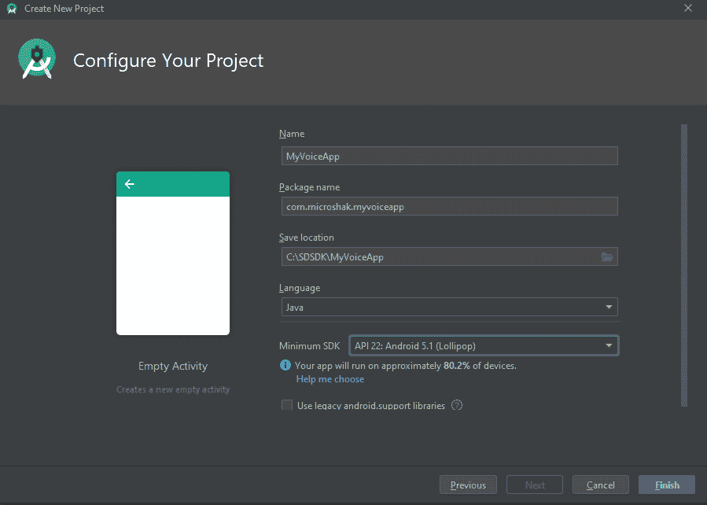

1.  在 Gradle 脚本部分，更改`Gradle Voice Projects`文件夹并添加对库的引用：

```py
allprojects {
    repositories {
        google()
        jcenter()
        mavenCentral()
        maven {
            url 'https://csspeechstorage.blob.core.windows.net/maven/'
        }
    }
}
```

1.  在 Gradle 脚本部分，在 Gradle 构建应用程序部分，将此行添加到依赖项部分：

```py
implementation 'com.microsoft.cognitiveservices.speech:client-sdk:1.10.0'
```

1.  导入此项目所需的库：

```py
import androidx.appcompat.app.AppCompatActivity;
import com.microsoft.cognitiveservices.speech.KeywordRecognitionModel;
import com.microsoft.cognitiveservices.speech.SpeechConfig;
import com.microsoft.cognitiveservices.speech.SpeechRecognizer;
import com.microsoft.cognitiveservices.speech.audio.AudioConfig;

import java.io.IOException;
import java.util.ArrayList;
import java.util.concurrent.ExecutorService;
import java.util.concurrent.Future;

import android.content.res.AssetManager;
import android.os.Bundle;
import android.text.Layout;
import android.text.TextUtils;
import android.view.View;
import android.widget.Button;
import android.widget.TextView;
```

1.  在主活动类中，添加训练模型的键和位置。此外，添加麦克风类型；在本例中，我们使用的是线性麦克风：

```py
public class MainActivity extends AppCompatActivity {
    private static String SpeechSubscriptionKey = "Your key here";
    private static String SpeechRegion = "westus2";
    //your location here

    private TextView recognizedTextView;
    private static String LanguageRecognition = "en-US";
    private Button recognizeKwsButton;

    private static String Keyword = "computer";
    private static String KeywordModel = "computer.zip";

    private static String DeviceGeometry = "Linear4";
    private static String SelectedGeometry = "Linear4";
    protected static ExecutorService s_executorService;

    final AssetManager assets = this.getAssets();
```

1.  创建将结果显示到 UI 的方法：

```py
    private void setTextbox(final String s) {
        MainActivity.this.runOnUiThread(() -> {
           recognizedTextView.setText(s);
           final Layout layout = recognizedTextView.getLayout();
           if (layout != null) {
               int scrollDelta = layout.getLineBottom(
                   recognizedTextView.getLineCount() - 1)
                       - recognizedTextView.getScrollY() - 
                       recognizedTextView.getHeight();
               if (scrollDelta > 0) {
                   recognizedTextView.scrollBy(0, scrollDelta);
               }
           }
       });
   }
```

1.  使用默认麦克风设置音频输入：

```py
    private AudioConfig getAudioConfig() {
        return AudioConfig.fromDefaultMicrophoneInput();
    }
```

1.  设置完成事件的任务监听器：

```py
    private interface OnTaskCompletedListener<T> {
        void onCompleted(T taskResult);
    }
```

1.  配置语音设置，如设备几何形状、语音区域和语言：

```py
    public static SpeechConfig getSpeechConfig() {
        SpeechConfig speechConfig = SpeechConfig.fromSubscription(
            SpeechSubscriptionKey, SpeechRegion);

        speechConfig.setProperty("DeviceGeometry", DeviceGeometry);
        speechConfig.setProperty("SelectedGeometry", 
                                  SelectedGeometry);
        speechConfig.setSpeechRecognitionLanguage(
            LanguageRecognition);

        return speechConfig;
    }
```

1.  设置一个完成任务监听器：

```py
private <T> void setOnTaskCompletedListener(Future<T> task,
    OnTaskCompletedListener<T> listener) {
        s_executorService.submit(() -> {
            T result = task.get();
            listener.onCompleted(result);
            return null;
        });
    }
```

1.  设置点击按钮和关键字监听器：

```py
@Override
    protected void onCreate(Bundle savedInstanceState) {
        super.onCreate(savedInstanceState);
        setContentView(R.layout.activity_main);

        recognizeKwsButton = 
        findViewById(R.id.buttonRecognizeKws);
        recognizedTextView = findViewById(R.id.recognizedText);

        recognizeKwsButton.setOnClickListener(new 
        View.OnClickListener() {
            private static final String delimiter = "\n";
            private final ArrayList<String> content = new 
            ArrayList<>();
            private SpeechRecognizer reco = null;

            @Override
            public void onClick(View view) {
                content.clear();
                content.add("");
                content.add("");
                try {
                    final KeywordRecognitionModel 
                    keywordRecognitionModel = 
                     KeywordRecognitionModel.fromStream(
                     assets.open(KeywordModel),Keyword,true);

                    final Future<Void> task = 
                    reco.startKeywordRecognitionAsync(
                        keywordRecognitionModel);
                    setOnTaskCompletedListener(task,result ->{
                        content.set(0, "say `" + Keyword + 
                                    "`...");
                        setTextbox(TextUtils.join(delimiter, 
                        content));
                    });

                } catch (IOException e) {
                    e.printStackTrace();
                }
            }});
    }
}
```

## 工作原理…

Microsoft Speech Devices SDK 设计用于与线性和圆形麦克风阵列配合使用。在本篇食谱中，我们创建了一个 Android 应用程序，为用户提供与语音相关的用户界面。Android 的触摸优先界面是亭子的常见形态因素。我们还在 Azure 的 Speech Studio 中创建了一个唤醒词文件。然后，我们从我们的服务中检索到了密钥。

## 更多信息…

Speech Devices SDK 不仅仅是创建唤醒词。它还包括语音识别、语言理解和翻译功能。如果您的亭子将被放置在可能会干扰语音识别主体的背景噪音环境中，那么阵列麦克风将是您最佳的选择。

在本篇食谱的开头，我们提到 Speech Devices SDK 也支持圆形麦克风。虽然阵列麦克风设计用于直接对准说话者，但圆形麦克风设计为垂直放置于说话人旁边。它们有助于确定说话人的方向，并且常用于多人说话情境，如日程安排。

# 使用 Microsoft Speech API 进行语音识别：

Microsoft Speech Services 是一个语音转文本、文本转语音和翻译等功能的生态系统。它支持多种语言，并具有高级功能，如自定义语音识别以支持口音、专有名称（如产品名称）、背景噪音和麦克风质量。在本示例中，我们将使用 Python 实现 Microsoft Speech SDK。

## 准备就绪

首先，您需要进入 Azure 门户并创建一个语音服务。然后，转到快速入门部分并复制下密钥。

然后，安装 Azure Speech SDK：

```py
 python -m pip install azure-cognitiveservices-speech
```

## 如何实现...

本示例的步骤如下：

1.  导入库：

```py
import azure.cognitiveservices.speech as speechsdk
import time
```

1.  导入在*准备就绪*部分生成的密钥：

```py
speech_key, service_region = "Your Key", "westus2"
```

1.  初始化语音服务：

```py
speech_config = speechsdk.SpeechConfig(subscription=speech_key,
                                       region=service_region)
speech_recognizer = \
speechsdk.SpeechRecognizer(speech_config=speech_config)
speech_recognizer.session_started.connect(lambda evt: \
    print('SESSION STARTED: {}'.format(evt)))
speech_recognizer.session_stopped.connect(lambda evt: \
    print('\nSESSION STOPPED {}'.format(evt)))
speech_recognizer.recognized.connect(lambda evt: \
    print('\n{}'.format(evt.result.text)))
```

1.  然后，通过使用无限循环执行连续语音识别：

```py
try:
    while True:
        speech_recognizer.start_continuous_recognition()
        time.sleep(10)
        speech_recognizer.stop_continuous_recognition()
```

1.  最后，清理并断开会话：

```py
except KeyboardInterrupt:
    speech_recognizer.session_started.disconnect_all()
    speech_recognizer.recognized.disconnect_all()
    speech_recognizer.session_stopped.disconnect_all()
```

## 工作原理...

认知服务将单个词汇使用机器学习组合成有意义的句子。SDK 负责找到麦克风，将音频发送到认知服务，并返回结果。

在下一个示例中，我们将使用语言理解来确定语音的含义。之后，我们将使用 Bot Framework 创建一个智能机器人，该框架建立在语言理解的基础上，为点餐自助服务点提供状态和逻辑。您可以将语音作为该系统的输入。

Microsoft Speech SDK 允许您通过其自定义语音服务考虑口音、发音和声音质量。您还可以在连接性受限的环境中使用 Docker 容器。

# 开始使用 LUIS

**语言理解**，或**LUIS**，来自 Microsoft，是一项服务，它从文本中提取实体、句子所涉及的主题、意图和句子的动作。由于有一个狭窄的专注领域可以帮助减少错误率，LUIS 授权服务帮助用户创建 LUIS 解析的预定义实体和意图列表。

## 准备就绪

LUIS 是 Azure 认知服务的一款产品。您需要登录 Azure 门户并创建 LUIS 资源。然后，转到[`preview.luis.ai`](https://preview.luis.ai)，点击新建用于对话的应用程序。然后，填写名称、语言和您设置的预测资源的表单。

然后，在侧边菜单中点击实体，并添加，如我们的餐厅点餐自助服务点的`奶酪汉堡`，`薯条`，`健怡可乐`，`奶昔`，`巧克力`，`香草`等等：

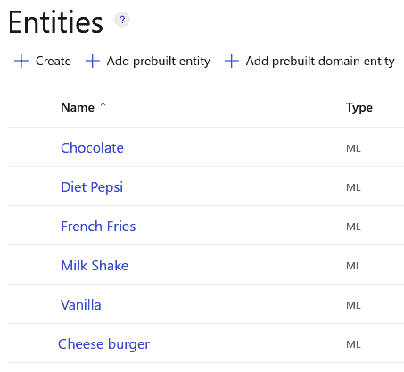

一旦您添加了足够的实体，您将需要添加意图。点击意图，然后添加一个意图。在我们的示例中，我们将添加一个`Menu.Add item`意图。然后，我们添加一些例句来展示某人如何在一个自助服务点点餐。然后，我们点击句子中的实体并对其进行标记：

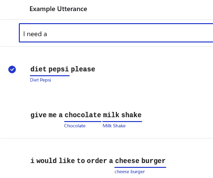

当有足够的内容来代表整个菜单时，点击窗口右上角的“训练”按钮。训练完成后，点击“发布”按钮。发布完成后，屏幕上将出现通知，提供密钥、端点和一个样本查询，您可以将其放入浏览器的 URL 栏以获取预测。

然后，为在点餐亭中采取的其他操作创建一个新的意图，例如从订单中删除项目或更改订单。复制该查询字符串，因为我们将稍后使用它。

## 如何做...

此教程的步骤如下：

1.  导入`requests`库以允许我们使用 web 服务：

```py
import requests
```

1.  输入您的订单文本：

```py
text_query = "give me a vanilla milk shake"
```

1.  发送消息给 LUIS：

```py
r = requests.get(f'Your Copied URL String={text_query}')
```

1.  从响应中获取意图和实体：

```py
message = r.json()
print(message['prediction']['topIntent'])
for entity in message['prediction']['entities']['$instance']:
    print(entity)
```

## 工作原理...

LUIS 是一个能够分解句子并提取其对象（实体）和动作（意图）的系统。在我们的教程中，我们创建了一组实体和意图。即使句子与我们键入的示例短语相似但并非完全相同，LUIS 也能够从中提取这些实体和意图。例如，短语*一杯香草奶昔将是可爱的*并不是我们模型训练的内容，但是 LUIS 仍然能够理解这是一个香草奶昔的订单。

## 还有更多内容...

向 LUIS 发送文本并获取 JSON 负载仅仅是 LUIS 的冰山一角。LUIS 与 Microsoft Speech SDK 集成，这意味着您可以使用麦克风从中获取实体和意图。您可以在设备如智能手机上使用内置语音识别，并将文本发送至 LUIS。就像我们的*唤醒词检测*教程一样，您可以使用阵列麦克风来过滤背景噪音或理解声音的方向性，并将其集成到 LUIS 中。

# 实施智能机器人

在这个教程中，我们将使用 Microsoft Bot Framework 创建智能机器人。智能机器人实现用户与机器人之间的对话。这些对话触发一系列操作。机器人跟踪对话状态，以便知道它在对话中的位置。机器人还跟踪用户状态，更确切地说，它跟踪用户输入的变量。

机器人已被用于输入复杂表单，如法律文件或财务文件。对于我们的自助点餐亭场景，我们将实施一个简单的机器人，允许用户添加食物到他们的订单中。我们将在前一个教程中实现的 LUIS 模型基础上进行构建。

## 准备工作

要在本地测试机器人，您需要从 Microsoft 下载并安装 Bot Framework Emulator。安装说明和文档链接可以在 GitHub 页面[`github.com/microsoft/BotFramework-Emulator`](https://github.com/microsoft/BotFramework-Emulator)找到。

接下来，您需要安装依赖项。对于此项目，我们使用 Python，并且有一个要求文件。要安装这些要求，请克隆本书的 GitHub 存储库并导航到 `Ch7/SmartBot` 文件夹。然后，输入以下 `pip install` 脚本：

```py
pip3 install -r requirements.txt
```

这将安装 Bot Framework 组件以及 Flask（我们的机器人将使用的 Web 服务器平台）和 `async.io`（一个异步库）。

## 如何做...

此处的步骤如下：

1.  创建一个 `app.py` 文件并导入所需的库：

```py
from flask import Flask,request,Response
from botbuilder.schema import Activity
from botbuilder.core import (
    BotFrameworkAdapter,
    BotFrameworkAdapterSettings,
    ConversationState,
    UserState,
    MemoryStorage
  )
import asyncio
from luisbot import LuisBot
```

1.  初始化 Flask Web 服务器：

```py
app = Flask(__name__)
```

1.  初始化事件循环：

```py
loop = asyncio.get_event_loop()
```

1.  初始化机器人的记忆和对话状态以及用户状态：

```py
botadaptersettings = BotFrameworkAdapterSettings("","")
botadapter = BotFrameworkAdapter(botadaptersettings)
memstore = MemoryStorage()
constate = ConversationState(memstore)
userstate = UserState(memstore)
botdialog = LuisBot(constate,userstate)
```

1.  设置 URL 路由：

```py
@app.route("/api/messages",methods=["POST"])
```

1.  循环执行 LUIS 和 Bot Framework 逻辑：

```py
def messages():
    if "application/json" in request.headers["content-type"]:
        body = request.json
    else:
        return Response(status = 415)

    activity = Activity().deserialize(request.json)

    auth_header = (request.headers["Authorization"] if \
                  "Authorization" in request.headers else "")

    async def call_fun(turncontext):
        await botdialog.on_turn(turncontext)

    task = \
    loop.create_task(botadapter.process_activity(activity,
                                                 "",call_fun))
    loop.run_until_complete(task)
```

1.  创建一个 `luisbot.py` 文件，并在 `luisbot.py` 文件中导入所需的库：

```py
from botbuilder.ai.luis import LuisApplication, \
LuisPredictionOptions, LuisRecognizer
from botbuilder.core import(
ConversationState
, UserState
, TurnContext
, ActivityHandler
, RecognizerResult
, MessageFactory
)
from enum import Enum
```

1.  创建一个 `Order` 数据存储。这将作为保存信息的地方：

```py
class EnumOrder(Enum): 

    ENTREE=1
    SIDE=2
    DRINK=3
    DONE=4

class Order:
    def __init__(self):
        self.entree = ""
        self.drink=""
        self.side=""

    @property
    def Entree(self):
        return self.entree
    @Entree.setter
    def Entree(self,entree:str):
        self.entree = entree

    @property
    def Drink(self):
        return self.drink
    @Drink.setter
    def Drink(self,drink:str):
        self.drink = drink

    @property
    def Side(self):
        return self.side
    @Side.setter
    def Side(self,side:str):
        self.side = side
```

1.  添加一个对话状态数据类。这将保存对话状态：

```py
class ConState:
    def __init__(self):
        self.orderstatus = EnumOrder.ENTREE
    @property
    def CurrentPos(self):
        return self.orderstatus
    @CurrentPos.setter
    def EnumOrder(self,current:EnumOrder):
        self.orderstatus = current
```

1.  创建一个 `LuisBot` 类并初始化变量：

```py
class LuisBot(ActivityHandler):
    def __init__(self, constate:ConversationState, 
    userstate:UserState):
        luis_app = LuisApplication("APP ID","primary starter key",\
                    "https://westus.api.cognitive.microsoft.com/")

        luis_option = LuisPredictionOptions(
            include_all_intents=True,include_instance_data=True)
        self.LuisReg = LuisRecognizer(luis_app,luis_option,True)
        self.constate = constate
        self.userstate = userstate
        self.conprop = self.constate.create_property("constate")
        self.userprop = self.userstate.create_property("userstate")
```

1.  在每次轮询中记录当前状态：

```py
    async def on_turn(self,turn_context:TurnContext):
        await super().on_turn(turn_context)
        await self.constate.save_changes(turn_context)
        await self.userstate.save_changes(turn_context)
```

1.  设置 `on_message_activity` 来从 LUIS 获取状态和实体：

```py
    async def on_message_activity(self,turn_context:TurnContext):
        conmode = await self.conprop.get(turn_context,ConState)
        ordermode = await self.userprop.get(turn_context,Order)
        luis_result = await self.LuisReg.recognize(turn_context)
        intent = LuisRecognizer.top_intent(luis_result)
        await turn_context.send_activity(f"Top Intent : {intent}")
        retult = luis_result.properties["luisResult"]
        item = ''
        if len(retult.entities) != 0:
            await turn_context.send_activity(f" Luis Result 
                                            {retult.entities[0]}")
            item = retult.entities[0].entity
```

1.  定义步骤逻辑。这将是我们完成订单所需的一组步骤：

```py
        if(conmode.orderstatus == EnumOrder.ENTREE):
            await turn_context.send_activity("Please enter a main \
                                             Entree")
            conmode.orderstatus = EnumOrder.SIDE
        elif(conmode.orderstatus == EnumOrder.SIDE):
            ordermode.entree = item
            await turn_context.send_activity("Please enter a side \
                                             dish")
            conmode.orderstatus = EnumOrder.DRINK
        elif(conmode.orderstatus == EnumOrder.DRINK):
            await turn_context.send_activity("Please a drink")
            ordermode.side = item
            conmode.orderstatus = EnumOrder.DONE
        elif(conmode.orderstatus == EnumOrder.DONE):
            ordermode.drink = item
            info = ordermode.entree + " " + ordermode.side + \
                    " " + ordermode.drink
            await turn_context.send_activity(info)
            conmode.orderstatus = EnumOrder.ENTREE
```

## 工作原理...

Bot Framework 是由 Microsoft 开发的一个机器人构建框架。它包括活动和状态。有许多不同类型的活动，例如消息、事件和对话结束。为了跟踪状态，有两个变量，即 `UserState` 和 `ConversationState`。用户状态用于记录用户输入的信息。在我们的示例中，这是食品订单。对话状态允许机器人按顺序询问问题。

## 还有更多...

Bot Framework 跟踪对话状态和用户数据，但不限于一个对话。例如，您可以使用 LUIS 确定意图可能属于不同的对话。在我们的订购场景中，您可以允许用户开始订购，然后允许他们询问营养信息或订单的当前成本。此外，您还可以添加文本转语音以为自助售货亭添加语音输出。

# 创建自定义语音

近年来，语音技术已经取得了长足的进步。几年前，合成语音很容易识别。它们都具有相同的语音字体，具有机器人的声音，是单调的，因此难以表达情感。如今，我们可以创建自定义语音字体，并为它们添加强调、速度和情感。在本文中，我们将介绍如何从您的声音或某位演员的声音创建自定义语音字体。

## 准备工作

要创建自定义语音字体，我们将使用 Microsoft 的自定义语音服务。要开始，请访问 [`speech.microsoft.com/portal`](https://speech.microsoft.com/portal) 并单击自定义语音。在自定义语音页面上，单击新建项目：

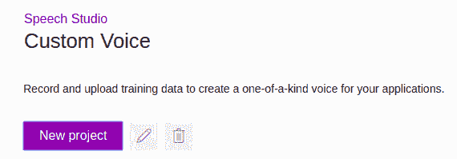

给你的项目起名字和描述后，是时候上传一些音频文件进行训练了。截至撰写本书时，最佳语音系统**神经语音**处于私人预览阶段。这意味着你需要申请访问权限才能使用它。如果你能访问神经语音功能，你将需要 1 小时的语音数据。为了获得略低保真度的语音合成，你可以使用标准的语音训练系统。你可以提供至少 1 小时的音频样本，但为了获得高质量的语音，你需要 8 小时的音频。

创建一个新项目后，你将进入微软语音工作室。首先，点击数据，然后上传数据。然后，选择仅音频，除非你有一些预转录的音频：

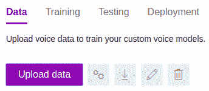

然后，将所有你的`.mp3`文件压缩成一个文件。根据你的音频数量不同，处理音频可能需要几个小时。然后，选择训练选项卡，点击训练模型。你将有三种不同的训练方法可选：统计参数化，连接法和神经网络：

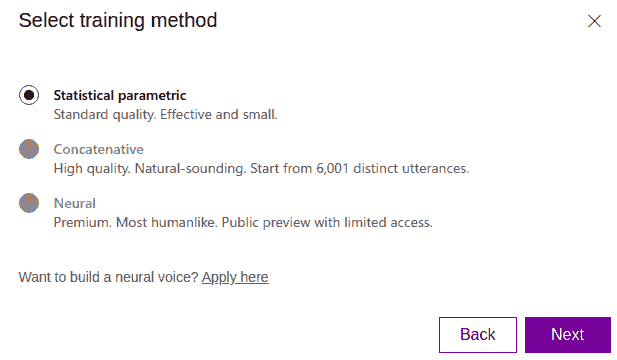

选择对你最适用的方法。统计参数化是最低质量的选项。它还需要最少的数据。接下来的方法，连接法，需要几个小时的音频。最后，质量最高的选项是神经网络，其训练可能需要几个小时。

训练完成后，转到测试选项卡并测试你的新语音。在测试选项卡中，你可以听到和下载音频。你可以使用文本生成音频或**语音合成标记语言**（**SSML**），这是一种基于 XML 的语音标记语言。SSML 允许你（如果你使用神经语音）添加情感，如愉快和共鸣。此外，它还允许你微调发音、重音和速度。

在测试完自定义语音后，转到部署选项卡并部署你的语音。这也可能需要一段时间进行处理。完成后，转到部署信息。你将需要这些信息发送请求给认知服务。

## 怎么做...

此处的步骤如下：

1.  导入库：

```py
import requests
from playsound import playsound
```

1.  设置变量。这些是我们在*准备工作*部分中检索的键和变量：

```py
Endpoint_key = "you will find this in your deployment"
location = 'the location you deployed it like australiaeast'
deploymentid = 'you will find this in your deployment' 
project_name = 'The name you gave to your entire project'
text = "Hey, this is a custom voice demo for Microsoft's Custom Voice"
```

1.  生成一个令牌：

```py
def get_token():
    fetch_token_url = f"https://{location}.api.cognitive.microsoft\
    .com/sts/v1.0/issueToken"
    headers = {
            'Ocp-Apim-Subscription-Key': Endpoint_key
        }
    response = requests.post(fetch_token_url, headers=headers)
    access_token = str(response.text)
    return access_token
```

1.  发送请求给定制语音，以及我们希望它创建并返回响应的单词：

```py
constructed_url = f"https://{location}.voice.speech.microsoft\
.com/cognitiveservices/v1?deploymentId={deploymentid}"
headers = {
     'Authorization': 'Bearer ' + get_token(),
     'Content-Type': 'application/ssml+xml',
     'X-Microsoft-OutputFormat': 'riff-24khz-16bit-mono-pcm',
     'User-Agent': project_name 
}

body = f"""<speak version=\"1.0\" xmlns=\"http://www.w3.org/2001/10/synthesis\" xmlns:mstts=\"http://www.w3.org/2001/mstts\" xml:lang=\"en-US\">
<voice name=\"Siraj\">{text}</voice></speak>""" 

response = requests.post(constructed_url, headers=headers, 
                         data=body)
```

1.  从响应中保存`.wav`文件，然后播放它：

```py
if response.status_code == 200:
    with open('sample.wav', 'wb') as audio:
        audio.write(response.content)
        playsound('sample.wav')
        print("\nStatus code: " + str(response.status_code) + 
              "\nYour TTS is ready for playback.\n")
else:
    print("\nStatus code: " + str(response.status_code) + 
          "\nSomething went wrong. Check your subscription\
      key and headers.\n")
```

## 工作原理...

在这个配方中，我们使用了认知服务的自定义语音转文本功能。自定义语音转文本既有预训练的语音字体，也允许您创建自己的自定义语音字体。在幕后，它接受语音输入，然后使用语音转文本从文本中解析单词，然后使用单词和语音集合创建自定义语音。培训完成后，您可以公开一个端点来从语音模型中检索音频。

# 使用 QnA Maker 增强机器人

Microsoft 的 QnA Maker 是一个工具，可以将常见问题（FAQs）转换为一组问题和答案，使用语言理解技术，允许用户以不同的方式提问，以获得与问题相匹配的答案。QnA Maker 可以处理一系列的数据源，包括以制表符分隔的值（TSVs）、FAQ 网页和 PDF 等。在这个配方中，我们将使用包含问题和答案的 TSV。

QnA Maker 解决了解释语音并确定用户问题的模糊逻辑。作为认知服务语音生态系统的一部分，它可以轻松与 Bot Framework 和语音集成，为客户提供丰富的互动体验。

## 准备工作

在使用 QnA Maker 之前，您需要一系列问题和答案。您可以指向一个网站并让它解析问题和答案，或者上传一个 TSV。对于这个配方，我们将使用一个 TSV。在本书的 Git 存储库中有一个示例。

要创建一个 QnA Maker 项目，请访问[`www.qnamaker.ai/`](https://www.qnamaker.ai/)，并单击创建知识库。它将带您完成一个五步向导来创建一个 QnA 机器人。第一步部署资源到 Azure 中。第二步让您选择语言，并将机器人与刚刚创建的新服务关联起来。然后，您将为项目命名并上传包含问题和答案的文件。

添加问题和答案的最直接方式是使用 TSV。您需要几个字段，包括`question`、`answer`、`source`和`meta`。`meta`和`source`是您可以用来查询数据的字段。例如，在我们的营养常见问题解答中，我们可能有几种不同的方式来理解和回答关于汉堡热量的查询。

在上传并创建服务后，我们可以查看系统上传的内容，并向现有数据添加问题和答案：

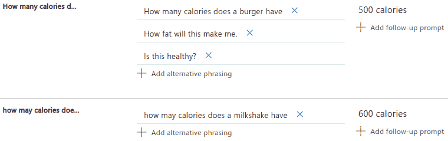

接下来，我们将点击查看选项，并选择显示元数据。我们将添加使用 Speech Studio 内容创建器创建的音频。我们在*创建自定义语音*配方中介绍了 Speech Studio。在元标签部分，我们将添加我们使用内容创建器创建的音频文件：

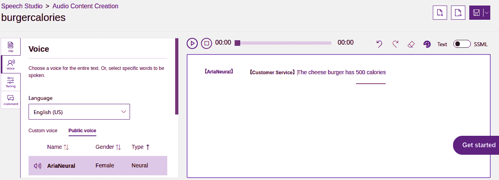

下一步是选择**保存和训练**按钮，保存模型后，选择测试按钮并与您的 QnA Maker 机器人聊天。一旦您对您的 QnA Maker 机器人满意，选择发布按钮。训练完成后，QnA Maker 将显示`curl`命令以向 QnA Maker 发送问题。从这里，我们将提取所需的密钥以将请求转换为 Python 字符串。

## 如何操作...

此示例的步骤如下：

1.  导入所需的库以发送网络请求和播放声音：

```py
import requests
import json
from playsound import playsound
```

1.  设置变量。密钥和项目 URL 可以在*准备就绪*部分找到：

```py
auth = 'EndpointKey '
question = 'how many calories in a cheese burger'
projectURL = ''
```

1.  生成正确格式的数据：

```py
headers = {
    'Authorization': auth,
    'Content-type': 'application/json',
}

data = '{ "question":"'+question+'"}'
```

1.  发送请求到项目 URL 上的语音服务：

```py
response = requests.post(projectURL, headers=headers, data=data)
json_data = json.loads(response.text)
```

1.  从响应中提取音频并在扬声器上播放：

```py
for meta in json_data['answers'][0]['metadata']:
    if meta['name'] == "file":
        audiofile = 'audio/' + meta['value']
        print(audiofile)
        playsound(audiofile)
```

## 工作原理...

在幕后，QnA Maker 使用机器学习来基于问题-答案对训练模型。然后解析传入的文本，确定客户正在询问哪些问题。在我们的亭台示例中，QnA Maker 用于回答诸如食物的营养价值和餐厅信息位置等简单问题。

在这个示例中，我们使用 QnA Maker 服务来访问训练好的模型。QnA Maker 通过`http post`进行访问。来自 QnA Maker 的结果被转换为音频文件并在扬声器上播放。

## 还有更多...

Chit-chat 已经整合到 QnA Maker 中。要启用它，在创建 QnA Maker 项目时，有一个关于 chit-chat 的选项。Chit-chat 允许用户输入更多的问题并与机器人进行非正式的对话。Chit-chat 有几种个性，例如专业和对话。
