使用 Microcontrollers 和 Pipelines 进行优化

大多数物联网设备运行在**微控制器单元**（**MCUs**）上，而大多数机器学习则发生在 CPU 上。人工智能领域最前沿的创新之一是在受限设备上运行模型。过去，人工智能局限于具有传统操作系统（如 Windows 或 Linux）的大型计算机。现在，小型设备可以使用 ONYX 和 TensorFlow Lite 等技术执行机器学习模型。这些受限设备成本低廉，可以在没有互联网连接的情况下使用机器学习，并且可以大大节省云成本。

许多物联网项目由于高昂的云成本而失败。物联网设备通常以固定价格出售，没有重复订阅模式。然后通过执行机器学习或分析产生高昂的云成本。没有理由这样做。即使对于微控制器，通过将机器学习和分析推送到设备本身，成本也可以大大降低。

在本章中，我们将重点介绍两种不同的开发板。第一种是**ESP32**，第二种是**STM32**。ESP32 是一种带有 Wi-Fi 功能的微控制器（MCU）。它们通常的成本在$5 - $10 之间，非常适合需要在设备上添加几个传感器的较小项目，比如天气站。相比之下，**STM32**开发板通常被电气工程师用来快速启动项目。有几十种不同类型的开发板，但它们使用不同的计算模块，如 Cortex M0、M4 和 M7。在 ESP32 方面，电气工程师通常将它们作为其物联网设备上的计算单元。而 STM32 等其他平台被视为入门套件，电气工程师用它们来确定所需的芯片组，并设计出专门满足其需求的板子。

让这些板子运行起来，与云通信，并运行机器学习模型是非常不平凡的。本章专注于使设备执行复杂计算并连接到云的过程。为此，我们将探索所需的具体工具。通常使用 Python 等高级语言进行机器学习，而设备通常使用 C 或 C++。

本章将涵盖以下配方：

+   介绍 ESP32 与物联网

+   实现 ESP32 环境监测器

+   优化超参数

+   处理 BOM 变更

+   使用 sklearn 构建机器学习流水线

+   使用 Spark 和 Kafka 进行流式机器学习

+   使用 Kafka 的 KStreams 和 KTables 丰富数据

让我们开始吧！

# 介绍 ESP32 与物联网

在这个配方中，我们将使用 ESP32 与 Azure IoT Hub 进行接口交互。使用低级设备，我们将编写网络接口的代码。我们还需要从计算机部署代码到 ESP32，然后使用串行监视器查看结果。

## 准备就绪

在这个示例中，我们将使用 Arduino 框架来编程裸金属 IoT 解决方案。在您的 PC 上，您需要安装 Arduino **集成开发环境**（**IDE**）。这将安装支持软件，以便我们可以使用 Arduino 框架来编程 ESP32。接下来，我们将安装 **Visual Studio Code**（**VS Code**）。VS Code IDE 有一个扩展程序，使得选择板子和添加库变得简单。它还有一个串行监视器和几个内置工具。

安装 Arduino IDE 和 VS Code 后，您需要在 VS Code 中找到所需的扩展工具。然后，在下面的屏幕截图中搜索 `platformIO`：

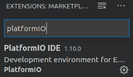

安装了 **PlatformIO IDE** 后，通过 USB 将您的 ESP32 连接到计算机。然后，在左侧面板中找到 **PlatformIO** 按钮。接下来，在 **快速访问** 菜单中，单击 **打开**：

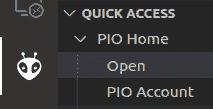

在这里，您可以找到主 PlatformIO 窗口，并单击 **打开项目**：

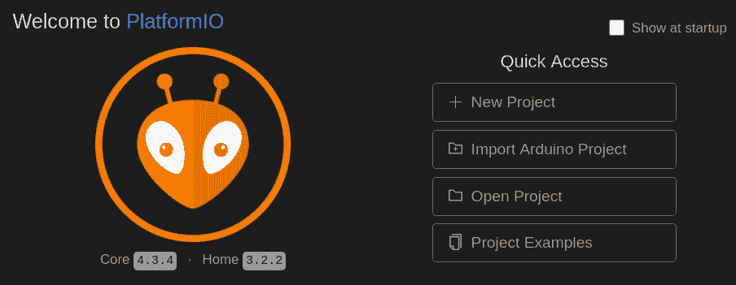

启动向导将引导您选择项目名称、框架（在我们的案例中为 Arduino）和板子类型。为了使引脚正确工作，您必须选择正确的板子类型。一些板子上有标记，可以让您查找板子类型，而其他板子则没有。因此，在购买 ESP32 时，确定板子类型非常重要：

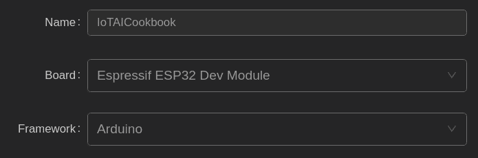

可选地，您可以更改项目存储位置。

接下来，您需要安装 Azure IoT Hub 库和快速入门代码。返回到 **快速访问** 菜单，单击 **库**。然后，在搜索菜单中键入 `Azure IoT`，并点击来自 Microsoft 的 **AzureIoTHub** 库。完成后，将发布版本更改为最新可用版本，然后单击 **安装**。然后，对于 **AzureIoTUtility**、**WiFi** 和 **AzureIoTProtocol_MQTT** 库，您需要执行相同的操作。

然后，返回到 **AzureIoTHub** 库。这里有一些快速入门代码，可以让您快速连接到本地 Wi-Fi 和 IoT Hub。对于此示例，我们将使用一些样例代码来测试与 IoT Hub 的连接。在 **示例** 部分，您将找到三个名为 `iothub_II_telemetry_sample`、`sample_init` 和 `iot_configs` 的代码文件，如下面的屏幕截图所示。从 `iothub_II_telemetry_sample` 中获取代码，并替换源代码中的 `main.cpp` 代码。接下来，创建两个新文件分别称为 `sample_init.h` 和 `iot_configs.h`，并将示例代码从 PlatformIO 示例中粘贴进去：

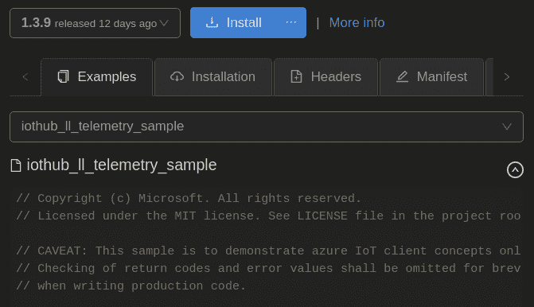

## 如何做…

此示例的步骤如下：

1.  添加您的 Wi-Fi 连接字符串。更改 `iot_configs.h` 文件中第 10 和第 11 行的字符串：

```py
#define IOT_CONFIG_WIFI_SSID "IoT_Net"
#define IOT_CONFIG_WIFI_PASSWORD "password1234"
```

1.  从 Azure IoT Hub 获取设备连接字符串，并将其插入到 `iot_configs.h` 的第 19 行：

```py
#define DEVICE_CONNECTION_STRING "HostName=myhub.azure-devices.net;DeviceId=somerandomname;SharedAccessKey=TWnLEcXf/sxZoacZry0akx7knPOa2gSojrkZ7oyafx0="
```

1.  将您的 ESP32 通过 USB 连接到计算机，在左侧面板中点击 **PlatformIO** 图标，然后点击 **上传并监控**：

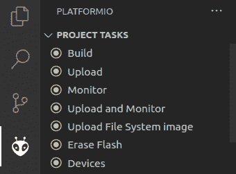

## 工作原理...

在这里，我们将代码上传到 ESP32 并启用了串行监视器。在 Visual Studio 的下方面板应该会在连接到 Wi-Fi 网络并向 IoT Hub 发送消息时开始显示文本。我们还创建了一些用于接收云到设备消息的示例代码。

## 更多内容...

在这个示例中，我们仅仅触及了 IoT Hub SDK 能做的一小部分。例如，我们甚至可以发送云到设备消息，允许我们为设备排队一组消息进行处理。我们也可以发送直接消息。这类似于云到设备消息，它发送消息到设备，但不会将消息排队。如果设备离线，消息就不会被发送。另一个选择是上传到 Blob。这允许我们安全地直接上传日志或二进制文件到 Blob 存储。最后，我们还可以使用设备双生对象，允许我们在设备上设置配置文件，并且可以在设备群中查询。这有助于我们找出更新未生效或设置未正确设置的情况。

# 实施 ESP32 环境监控

使用硬件设置简单的环境监控相当简单。在这个示例中，我们将使用一些简单的硬件来进行概念验证。在 *更多内容* 部分，我们将讨论如何进行设计，并进行批量生产，即使您的团队没有**电气工程师**（**EEs**）。为此，我们将介绍**Fritzing**，一个硬件设计工具。虽然它没有**KiCad**或**Altuim Designer**那么强大，但非电气工程师也能使用它，并将电路板设计并打印出来。

这个示例的目标并不是教您如何创建温度和湿度传感器。温度和湿度传感器是 IoT 的 *Hello World*。相反，这个示例侧重于通过制造快速在受限设备上实施这些功能。并非所有的 IoT 项目都可以这样做。当然也有需要电气工程师构建复杂设备的 IoT 项目，例如具有视频显示和声音的设备，或者医疗行业中使用的高速设备。

## 准备工作

在这个配方中，我们将基于前一个配方进行构建。我们将使用 ESP32，并且必须安装 Arduino IDE 和 VS Code。在 VS Code 中，我们将添加`PlatformIO`扩展。最终，我们将通过 USB 将 ESP32 连接到我们使用的计算机，但在连接传感器之前，请保持未连接状态。对于这个配方，您将需要一个 DHT11 数字湿度和温度传感器，跳线电缆，一个 10k 欧姆电阻器和一个面包板。您应该能够以大约 20 美元购买所有这些组件。

从这里开始，我们需要进入 VS Code，并使用`PlatformIO`扩展创建一个新项目。然后，您需要从`PlatformIO`库管理器安装 DHT 传感器库。您还需要下载 Fritzing。这是一个开源程序。您可以在其网站上为项目做出贡献并获得副本，但您还可以转到 GitHub，在**Releases**下下载并安装该程序。ESP32 有多个硬件版本。您的 ESP32 可能具有不同的引脚和功能。您 ESP32 的数据表将告诉您它具有哪些引脚。例如，有些引脚可以用来进行时钟周期或电压测量。还有各种引脚上的电源和地面。这些用于给外部传感器供电。通过查看 DHT11 和 ESP32，您可以创建各种组件的输入和输出的映射。

## 如何做到这一点...

此配方的步骤如下：

1.  打开 Fritzing，在右侧面板的**Parts**部分，单击菜单，然后选择**Import...**。然后，选择 ESP32 和 DHT11。这两者都可以在本章的源代码中找到：

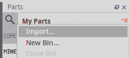

1.  在零件列表中搜索电阻器。一旦将其拖到屏幕上，调整其属性为**4.7kΩ**：

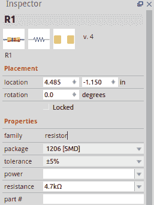

1.  现在，在板子上放置 DTH11 并使用 3.3 伏特和地面连接电源轨：

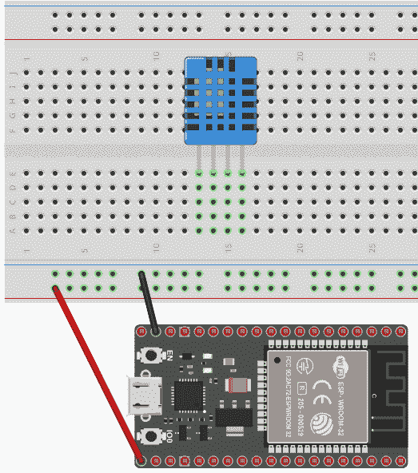

1.  然后，将电源轨连接到板上。同时，将**通用输入/输出**（**GPIO**）引脚 27 连接到 DHT11 的数据引脚。我们还必须在 3.3V 电源轨和 DHT11 的数据引脚之间添加一个 4.7k 欧姆电阻器：

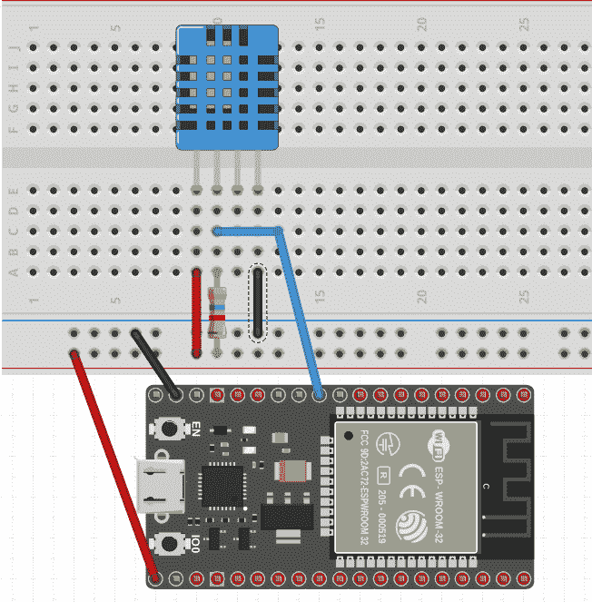

1.  接下来，将 ESP32 连接到计算机，并从我们在*准备工作*部分开始的`PlatformIO`项目中拉起`/src/main.cpp`文件。

1.  在`main.cpp`中，包含`DHT.h`库的引用：

```py
#include "DHT.h"
```

1.  创建对 ESP32 上的数据引脚和 DHT 传感器类型的引用：

```py
#define DHTPIN 27
#define DHTTYPE DHT11
```

1.  初始化`DHT`变量：

```py
DHT dht(DHTPIN, DHTTYPE);
```

1.  设置串行端口并打印测试消息。然后初始化`dht`对象：

```py
void setup()
{
    Serial.begin(115200);
    Serial.println("DHT11 sensor!");
    dht.begin();
}
```

1.  在主循环中，读取温度和湿度传感器的数据。然后，调用打印部分，并在继续循环之前等待 2 秒：

```py
void loop() {
    float h = dht.readHumidity();
    float t = dht.readTemperature();
    printResults(h,t);
    delay(2000);
}
```

1.  创建一个检查错误的函数。如果没有找到错误，则打印结果：

```py
void printResults(float h,float t)
{
    if (isnan(h) || isnan(t)) {
    Serial.println("Failed to read from DHT sensor!");
    return;
}
Serial.print("Humidity: ");
Serial.print(h);
Serial.print(" %\t");
Serial.print("Temperature: ");
Serial.print(t);
Serial.println(" *C ");
}
```

## 它的工作原理...

在这里，温湿度传感器从 ESP32 获取电源和地线。一旦我们确保这一点发生，我们指定了一个数据 GPIO 引脚，并添加了一个电阻来匹配电压。

当您购买 DHT11 时，有些带有三个引脚，而其他带有四个引脚。您可以根据传感器的引脚规格调整这些引脚。同样，ESP32 的不同制造商有不同的引脚规格。在处理任何硬件之前，检查该特定产品的数据表格总是很重要的。

## 还有更多...

此时，我们有一个工作原型。您可以选择多种路径来设计电路板，并在工厂中批量生产产品。您可以雇用电子工程师来完成此任务，但对于这种小型项目，您通常可以找一家专门从事电路板设计的公司，例如 Seeed Studios。许多制造工厂提供硬件设计服务，可以将 Fritzing 草图转化为产品。这些制造工厂通常可以打印出原型并在您准备就绪时批量生产电路板。

# 优化超参数

调整超参数有许多不同的方法。如果我们手动进行此操作，我们可以将随机变量放入我们的参数中，并查看哪一个是最好的。为了做到这一点，我们可以执行网格式的方法，其中我们映射可能的选项并放入一些随机尝试，并继续进行看起来产生最佳结果的路线。我们可能使用统计或机器学习来帮助我们确定哪些参数可以给我们带来最佳结果。这些不同的方法具有依赖于实验损失形状的优缺点。

有许多机器学习库可以帮助我们更轻松地执行这些常见任务。例如，`sklearn`具有一个`RandomizedSearchCV`方法，可以根据一组参数搜索最佳模型以获得最小损失。在本篇文章中，我们将从第三章的*物联网机器学习*中扩展*使用决策树分类化学传感器*的食谱，并使用随机森林。然而，我们还将添加网格搜索以优化我们的结果。

## 准备工作

在本篇文章中，我们将使用第三章的 MOX 传感器数据集，*物联网机器学习*中，我们将我们的数据保存在 Delta Lake 中。由于这一点，我们可以轻松地将其拉入我们的 Spark Notebook 中。我们还将使用 Python 包`koalas`，`sklearn`和`numpy`。

## 如何做...

此食谱的步骤如下：

1.  导入必要的库：

```py
import koalas as pd
import numpy as np

from sklearn.model_selection import train_test_split
from sklearn.ensemble import RandomForestClassifier
from sklearn.model_selection import GridSearchCV
```

1.  从 Databricks Delta Lake 导入数据：

```py
df = spark.sql("select * from ChemicalSensor where class <> 'banana'")
pdf = df.toPandas()
```

1.  选择和编码数据：

```py
from sklearn.preprocessing import OneHotEncoder
from sklearn.preprocessing import LabelEncoder

pdf.rename(columns = {'class':'classification'}, inplace = True) 
X = pdf
y = pdf['classification']

label_encoder = LabelEncoder()

integer_encoded = \
label_encoder.fit_transform(pdf['classification'])
onehot_encoder = OneHotEncoder(sparse=False)

integer_encoded = integer_encoded.reshape(len(integer_encoded), 1)
onehot_encoded = onehot_encoder.fit_transform(integer_encoded)

feature_cols = ['r1', 'r2', 'r4', 'r5', 'r6','r7', 'r8', 'temp',
                'humidity', 't0', 'td']
X = pdf[feature_cols]
y = onehot_encoded

X_train, X_test, y_train, y_test = \
train_test_split(X, y, test_size=0.3, random_state=40)
```

1.  选择您希望调整的参数：

```py
model_params = {
    'n_estimators': [50, 150, 250],
    'max_features': ['sqrt', 0.25, 0.5, 0.75, 1.0],
    'min_samples_split': [2, 4, 6]
}
```

1.  创建一个随机森林分类器算法的实例，以便我们稍后可以调整其超参数：

```py
rf_model = RandomForestClassifier(random_state=1)

```

1.  设置一个网格搜索估计器，以便我们可以调整参数：

```py
clf = GridSearchCV(rf_model, model_params, cv=5)
```

1.  训练决策树分类器：

```py
model = clf.fit(X_train,y_train)
```

1.  预测测试数据集的响应：

```py
y_pred = clf.predict(X_test)
```

1.  打印获胜的超参数集：

```py
from pprint import pprint
pprint(model.best_estimator_.get_params())
```

## 工作原理...

此算法是我们在第三章中使用的易于实施的算法，*物联网机器学习*。在那里，我们随意选择了一个算法。然后，我们让它运行一次代码以获得必要的输出。然而，在本示例中，我们使其运行更多次，以找到我们能找到的最佳估计器。我们可以使用电子表格做同样的事情来跟踪所有运行的结果。然而，这使我们能够自动化执行实验并跟踪结果的过程。

# 处理 BOM 更改

**物料清单**（**BOMs**）是构成设备的组件。这些可以是电阻器、芯片和其他组件。典型物联网产品的生命周期约为 10 年。在此期间，产品可能发生变化。例如，组件制造商可能会停产某个部件，如芯片系列。外包制造商通常会在电路板布局上进行 BOM 优化，尽管 BOM 优化可能会改变设备的质量。例如，它可能会改变传感器的灵敏度或设备的寿命。

这可能会影响经过训练的模型，并对剩余有效寿命的计算和预测性维护模型产生显著影响。在处理物联网和机器学习时，跟踪基于 BOM 和工厂更改的剩余有效寿命的变化可以帮助我们检测设备质量和寿命的问题。

这通常是通过数据库完成的。当设备在工厂中生产时，该设备的序列号、BOM 版本和工厂详细信息存储在该工厂中。这是可以为设备应用总预期寿命的地方。

## 准备工作

在本示例中，我们将启动一个 SQL Server 数据库的 Docker 实例。要开始，请安装 Docker。

下一步是使用`docker`构建和运行 SQL Server 数据库：

```py
docker pull mcr.microsoft.com/mssql/server:2017-latest 
```

然后，运行 Docker 容器：

```py
docker run -e 'ACCEPT_EULA=Y' -e 'MSSQL_AGENT_ENABLED=true' \
-e 'MSSQL_PID=Standard' -e 'SA_PASSWORD=Password!' \ 
-p 1433:1433 --name sqlserver_1 \ 
-d mcr.microsoft.com/mssql/server:2017-latest 
```

现在我们有一个工作的 SQL Server 数据库，我们需要为其添加一个数据库和两个表。你可以通过在 VS Code 中安装`mssql`插件，然后使用 Docker 文件中的用户名和密码连接到 SQL 数据库：

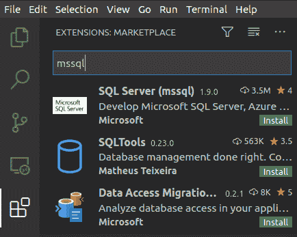

完成后，在左侧面板中点击新的 SQL Server 工具。然后，点击加号（**+**）按钮，跟随向导创建数据库连接。当向导询问**ado.net**连接字符串时输入`localhost`，它会要求你输入用户名和密码。用户名输入`sa`，密码输入`Password!`。

然后，通过点击屏幕右上角的绿色箭头运行以下 SQL 语句：

```py
CREATE DATABASE MLTracking
GO
USE MLTracking
GO
CREATE TABLE Product( 
  productid INTEGER IDENTITY(1,1) NOT NULL PRIMARY KEY, 
  productName VARCHAR(255) NOT NULL, 
  BeginLife Datetime NOT NULL, 
EndLife Datetime NULL, 
 ); 
GO
CREATE TABLE RUL( 
  RULid INTEGER IDENTITY(1,1) NOT NULL PRIMARY KEY, 
ProductId int,
TotalRULDays int, 
DateCalculated datetime not null 
) 
GO
```

从这里，从`pypi`安装`pyodbc`并在 VS Code 中创建一个新的 Python 脚本。

## 如何做到...

此示例的步骤如下：

1.  导入 `pyodbc` 库：

```py
import pyodbc 
```

1.  连接数据库：

```py

conn = pyodbc.connect('Driver={SQL Server};'
 'Server=localhost;'
 'Database=MLTracking;'
 'uid=sa;'
 'pwd=Password!;')
```

1.  创建数据库连接光标，以便可以运行查询：

```py
cursor = conn.cursor()
```

1.  将产品和制造日期插入 `Device` 表并提交事务：

```py
cursor.execute('''
  INSERT INTO MLTracking.dbo.Product (Product,BeginLife)
  VALUES
  ('Smoke Detector 9000',GETDATE()),
  ''')
conn.commit()
```

1.  一旦计算出产品的剩余有用寿命，请将该信息添加到数据库中：

```py
cursor.execute('''
  INSERT INTO MLTracking.dbo.RUL (ProductId,TotalRULDays,DateCalculated )
  VALUES
  (1,478,GETDATE()),
  ''')
conn.commit()
```

## 工作原理...

在这个示例中，我们向您展示了如何使用数据库来跟踪您随时间推移的结果。数据库允许我们随时间插入和更新有关我们模型的信息。

## 还有更多内容...

在这个例子中，我们关注的是产品。跟踪设备的寿命结束可以为我们的模型提供真实世界的反馈，并告诉我们何时应该重新训练它们。我们可以存储预测的错误或损失率，并将其与真实设备进行比较。

# 使用 sklearn 构建机器学习管道

`sklearn pipeline` 软件包使我们能够管理特征工程和建模的多个阶段。进行机器学习实验不仅仅是训练模型。它结合了几个因素。首先，您需要清洗和转换数据。然后，您必须通过特征工程丰富数据。这些常见任务可以组合成一系列称为**管道**的步骤。当我们在实验中尝试不同的变体时，我们可以使用这些管道来训练一系列非常复杂的步骤，使它们变成一些简单和可管理的东西，可以重复使用。

## 准备工作

在这个示例中，我们将使用之前在第四章的*增强数据使用特征工程*示例中进行特征工程的数据，*预测性维护的深度学习*。在那个示例中，我们将数据放入 Databricks，然后清洗数据，以便在其他实验中使用。要检索此数据，我们只需使用 Delta Lake 的`select`语句。对于这个示例，您需要在您的 Spark 集群上安装 `pandas` 和 `sklearn`。

## 如何操作...

此示例的步骤如下：

1.  导入 `pandas` 和 `sklearn`：

```py
import pandas as pd
from sklearn.pipeline import Pipeline
from sklearn.impute import SimpleImputer
from sklearn.preprocessing import StandardScaler, OneHotEncoder
from sklearn.ensemble import RandomForestClassifier
from sklearn.compose import ColumnTransformer
```

1.  从 Delta Lake 导入数据：

```py
train = spark.sql("select * from engine").toPandas()
train.drop(columns="label" , inplace=True)
test = spark.sql("select * from engine_test2").toPandas()
```

1.  创建转换器将数据转换为标准化的数值或分类数据：

```py
numeric_transformer = Pipeline(steps=[
    ('imputer', SimpleImputer(strategy='median')),
    ('scaler', StandardScaler())])
categorical_transformer = Pipeline(steps=[
    ('imputer', SimpleImputer(strategy='constant', 
                              fill_value='missing')),
    ('onehot', OneHotEncoder(handle_unknown='ignore'))])

```

1.  提取必要的特征并创建处理器：

```py
numeric_features = \
train.select_dtypes(include=['int64', 'float64']).columns
categorical_features = \
train.select_dtypes(include=['object']).drop(['cycle'], 
                                             axis=1).columns

preprocessor = ColumnTransformer(
    transformers=[
        ('num', numeric_transformer, numeric_features),
        ('cat', categorical_transformer, categorical_features)])
```

1.  创建随机森林管道步骤：

```py
rf = Pipeline(steps=[('preprocessor', preprocessor),
                     ('classifier', RandomForestClassifier())])
```

1.  拟合分类器：

```py
rf.fit(X_train, y_train)
```

1.  执行分类：

```py
y_pred = rf.predict(X_test)
```

## 工作原理...

机器学习流水线的构建在数据科学中非常普遍。它有助于简化复杂操作，并为软件代码增加了可重复使用性。在这个示例中，我们使用`sklearn`来在一个简单的流水线上执行复杂操作。在我们的流水线中，我们创建了一组转换器。对于数值数据，我们使用了一个缩放器，而对于分类数据，我们使用了独热编码。接下来，我们创建了一个处理器流水线。在我们的案例中，我们使用了一个随机森林分类器。请注意，这个流水线步骤是一个数组，所以我们可以将更多的分类器传递到我们的数组中。然而，为了简单起见，我们将把这个留到*更多内容*部分。最后，我们训练并从我们的模型中得到了预测结果。

## 更多内容...

正如我们在这个示例的介绍中提到的，流水线的目的是使您能够轻松调整流水线步骤。在本节中，我们将调整这些步骤以帮助我们实现更高的准确率。在这种情况下，我们只是扩展了前面的代码，并添加了一个机器学习算法分类器数组。从那里，我们将评分模型，以便确定哪一个是最好的。此代码如下所示：

```py
from sklearn.metrics import accuracy_score, log_loss
from sklearn.neighbors import KNeighborsClassifier
from sklearn.tree import DecisionTreeClassifier
from sklearn.ensemble import RandomForestClassifier, AdaBoostClassifier, GradientBoostingClassifier
from sklearn.discriminant_analysis import LinearDiscriminantAnalysis
from sklearn.discriminant_analysis import QuadraticDiscriminantAnalysis
classifiers = [
    KNeighborsClassifier(3),
    DecisionTreeClassifier(),
    RandomForestClassifier(),
    AdaBoostClassifier(),
    GradientBoostingClassifier()
    ]
for classifier in classifiers:
    pipe = Pipeline(steps=[('preprocessor', preprocessor),
                      ('classifier', classifier)])
    pipe.fit(X_train, y_train) 
    print(classifier)
    print("model score: %.3f" % pipe.score(X_test, y_test))
```

# 使用 Spark 和 Kafka 进行流式机器学习

Kafka 是一个实时流消息中心。结合 Kafka，Databrick 的能力可以实时摄取流并对其进行机器学习，从而使您能够在几乎实时中执行强大的机器学习。在这个示例中，我们将使用 Confluent。Confluent 是由 Kafka 的创造者创立的公司。他们在 Azure、GCP 和 AWS 上提供云服务。我们还将使用在 Azure、GCP 和 AWS 上可用的 Databricks。

## 准备就绪

在云市场中，启动 Confluent 和 Databricks。这将为您提供一个具有弹性可扩展性的 Kafka 和 Spark 系统。一旦您启动了这些系统，请访问 Confluent 网站[`confluent.cloud`](https://confluent.cloud)，并输入您在云市场中设置的用户名和密码。然后，点击**创建集群**。按照向导创建您的第一个集群。一旦您进入集群，请点击菜单中的**API 访问**。然后，找到创建密钥按钮，该按钮将允许您创建一个 API 访问密钥：

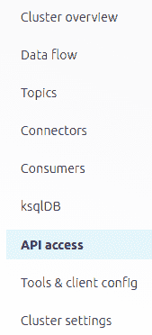

一旦您创建了密钥，请记下其用户名和密码；稍后您会需要这些详细信息。

接下来，转到**主题**部分，并使用**创建主题**按钮创建两个主题：一个名为`Turbofan`，另一个名为`Turbofan_RUL`。接下来，我们将创建一个 Python 文件，以便我们可以测试我们的新主题。创建一个带有以下代码的 Python 文件，以生成`TurboFan`主题的消息：

```py
from confluent_kafka import Producer
from datetime import datetime as dt
import json
import time

producer = Producer({
    'bootstrap.servers': "pkc-lgwgm.eastus2.azure.confluent.cloud:9092",
    'security.protocol': 'SASL_SSL',
    'sasl.mechanism': "PLAIN",
    "sasl.username": "",
    "sasl.password": "",
    'auto.offset.reset': 'earliest'
})

data = json.dumps({'Record_ID':1,'Temperature':'100','Vibration':120,
                   'age':1000, 'time':time.time()})
producer.send('TurboFan', data)
```

现在，您可以转到 Confluent Cloud UI 中的主题，并通过选择主题(**TurboFan**)然后点击**消息**来查看该主题上的消息：

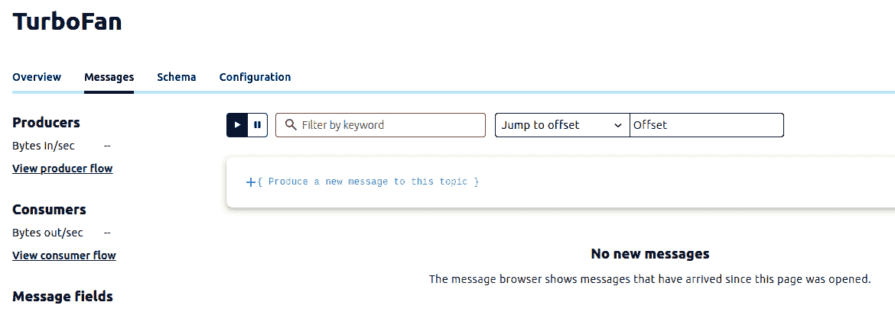

如果您运行上述代码，您将看到一条消息发送到 Kafka。

## 如何做到...

本配方的步骤如下：

1.  将 Kafka 流入 Databricks。在 Databricks 笔记本中，输入以下代码：

```py
from pyspark.sql.types import StringType
import json 
import pandas as pd
from sklearn.linear_model import LogisticRegression

 df.readStream.format("kafka") 
.option("kafka.bootstrap.servers", "...azure.confluent.cloud:9092") 
.option("subscribe", "TurboFan") 
.option("startingOffsets", "latest") 
.option("kafka.security.protocol","SASL_SSL") 
.option("kafka.sasl.mechanism", "PLAIN") 
.option("kafka.sasl.jaas.config", "kafkashaded.org.apache.kafka.common.security.plain.PlainLoginModule required username=\"Kafka UserName\" password=\"Kafka Password\";") 
.load() 
.select($"value") 
.withColumn("Value", $"value".cast(StringType)) 
```

1.  指定从 JSON 文件中的字段序列化为对象：

```py
val jsDF1 = kafka1.select( get_json_object($"Value", "$.Temperature").alias("Temp"), 
get_json_object($"Value", "$.Vibration").alias("Vibration") 
,get_json_object($"Value", "$.age").alias("Age") 
)
```

1.  定义执行推理的函数：

```py
def score(row):
    d = json.loads(row)
    p = pd.DataFrame.from_dict(d, orient = "index").transpose() 
    pred = model.predict_proba(p.iloc[:,0:10])[0][0]
    result = {'Record_ID': d['Record_ID'], 'pred': pred }
    return str(json.dumps(result))
```

1.  使用 UDF 执行推理并将结果保存到 DataFrame 中：

```py
df = df.selectExpr("CAST(value AS STRING)")
score_udf = udf(score, StringType()) 
df = df.select( score_udf("value").alias("value"))
```

1.  将失败的设备写入另一个 DataFrame：

```py
failure_df = df.filter(df.value > 0.9)
```

1.  将该 DataFrame 作为一个新主题流回 Kafka，并将结果写入 Kafka：

```py
query = df.writeStream.format("kafka") 
.option("kafka.bootstrap.servers", "{external_ip}:9092") 
.option("topic", "Turbofan_Failure") 
.option("kafka.security.protocol","SASL_SSL") 
.option("kafka.sasl.mechanism", "PLAIN") 
.option("kafka.sasl.jaas.config", "kafkashaded.org.apache.kafka.common.security.plain.PlainLoginModule required username=\"Kafka UserName\" password=\"Kafka Password\";") 
 .option("checkpointLocation", "/temp").start()
```

## 工作原理...

Kafka 是一个设计用于处理大量数据的流引擎。数据被摄取到 Kafka 中，然后发送到 Spark，可以将概率发送回 Kafka。在这个示例中，我们使用了 Confluent Cloud 和 Databricks。这些托管服务可以在所有主要的云市场上找到。

在这个配方中，我们从引擎接收了实时数据。然后，我们在 Spark 中将这些数据流式传输并对其进行推理。一旦我们收到结果，我们将其流回一个单独的 Kafka 主题。使用 Kafka 主题和 Kafka 本身，我们可以将这些数据推送到数据库、数据湖和微服务中，所有这些都来自一个单一的数据管道。

## 还有更多...

除了将所有数据放入主题以便将其转储到数据存储中，我们还可以将数据流式传输到警报系统中。为此，我们可以创建一个 Kafka 消费者，如下面的代码所示。在这里，我们将数据流式传输到本地系统，然后有一个`msg_process`函数，我们可以用它来写入警报系统，比如**Twilio**：

```py
from confluent_kafka import Consumer

conf = {'bootstrap.servers': "host1:9092,host2:9092",
        'group.id': "foo",
        'kafka.security.protocol':'SASL_SSL, 
        'kafka.sasl.mechanism':'PLAIN', 
        'kafka.sasl.jaas.config': 'kafkashaded.org.apache.kafka.common.security.plain.PlainLoginModule required username=\"Kafka UserName\" password=\"Kafka Password\";') 
        'auto.offset.reset': 'smallest'}

running = True
consumer = Consumer(conf)
consumer.subscribe('Turbofan_Failure')
 while running:
    msg = consumer.poll(timeout=1.0)
    if msg is None: continue
    msg_process(msg)

def msg_process(msg):
    pass
```

# 使用 Kafka 的 KStreams 和 KTables 丰富数据

在物联网中，经常有必须包含的外部数据源。这可能是影响设备性能的天气数据或来自其他附近设备的数据。一个简单的方法是使用 Kafka KSQL 服务器。与之前的示例一样，我们将使用 Confluent Cloud 的 KSQL 服务器，如果您有 Confluent Cloud 订阅的话。

在这个示例中，我们将从天气服务主题获取数据，并将其放入 KTable 中。KTable 类似于数据库表。所有进入 Kafka 的数据都以键值对的形式出现。使用 KTable 时，当新的键入数据到来时，我们将其插入到我们的 KTable 中。如果它包含在我们的 KTable 中已经存在的键，则我们会对其进行更新。我们还将把我们的主题转换为 KStream。这使我们可以在我们的表和流上运行标准类似 SQL 的查询。通过这样做，例如，我们可以查询当前天气并将其与我们之前的配方中的引擎数据进行连接。这样可以丰富数据。

## 准备工作

在**Confluent Cloud ksqlDB**门户中，转到**ksqlDB**选项卡并添加一个应用程序：

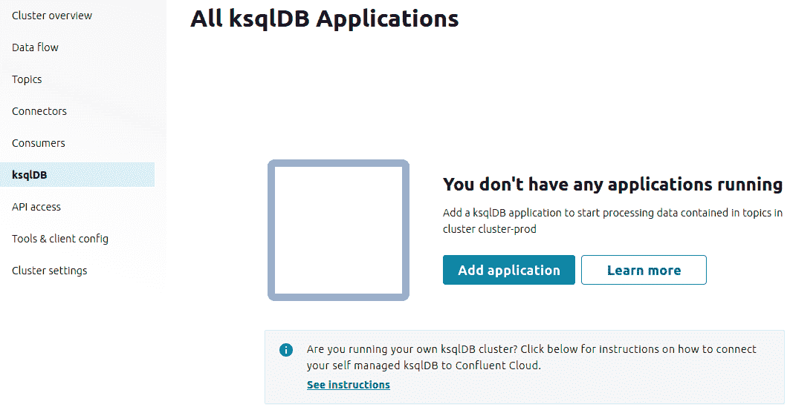

完成所有设置步骤后，您将拥有一个 KSQL 查询编辑器。从这里，我们将编辑我们的查询。

这个配方是上一个配方的延续。你需要运行在 Kafka 中设置的流数据`TurboFan`，还需要运行名为`weatherstreamer.py`的 Kafka 天气流 Python 脚本，该脚本可以在本书 GitHub 存储库的`ch10`目录中找到。

最后，你需要进入 ksqlDB，在那里你会找到查询编辑器。我们将使用该编辑器来创建我们的流和表。

## 如何做到…

这个配方的步骤如下：

1.  使用我们的天气主题创建一个 KTable：

```py
CREATE TABLE users (
     TurboFanNum BIGINT PRIMARY KEY,
     temperature BIGINT,
     humidity BIGINT
   ) WITH (
     KAFKA_TOPIC = 'weather', 
     VALUE_FORMAT = 'JSON'
   );
```

1.  将`TurboFan`主题转换为数据流：

```py
CREATE STREAM TurboFan (
    TurboFanNum BIGINT,
    HoursLogged BIGINT,
    VIBRATIONSCORE BIGING
  ) WITH (
    KAFKA_TOPIC='TurboFan',
    VALUE_FORMAT='JSON'
  );
```

1.  将表和流连接到一个新主题：

```py
CREATE STREAM TurboFan_Enriched AS
  SELECT 
     TurnboFan.TurboFanNum, 
     HoursLogged, 
     VIBRATIONSCORE, 
     temperature,
     humidity 

  FROM TurboFan
    LEFT JOIN Weather ON Weather.TurboFanNum = TurboFan.TurboFanNum
  EMIT CHANGES;
```

## 它是如何工作的…

KSQL Server 是建立在 Kafka Streams API 之上的技术。这个工具的目标是允许实时进行数据增强和数据转换。在这个配方中，我们获取了这些流并将其中一个转换为最近键的表。我们使用这些键来更新我们表中的值。接下来，我们取了一个主题，并在其上创建了一个流视图。最后，我们将我们的表与我们的流进行了连接，并创建了一个输出作为一个新的流。这也是 Kafka 中的一个新主题。

## 还有更多的…

使用 KSQL Server，我们可以利用 SQL 提供的更多语义，例如 group by、count 和 sum。由于 Kafka 是一个无尽的数据集，我们可以使用窗口来按时间段获取数据。例如，我们可能想知道平均温度是否超过了 100 度。我们可能想在 20 秒的时间段内查看这个数据。在 KSQL 中，我们可以将其远程化为另一个流：

```py
CREATE STREAM TurboFan_ToHot AS
  SELECT 
     TurnboFan.TurboFanNum, 
     avg(temperature)
  FROM TurboFan_Enriched
  WINDOW TUMBLING (SIZE 20 SECONDS)
  GROUP BY TurboFanNum
  HAVING avg(temperature) > 100
  EMIT CHANGES;
```
