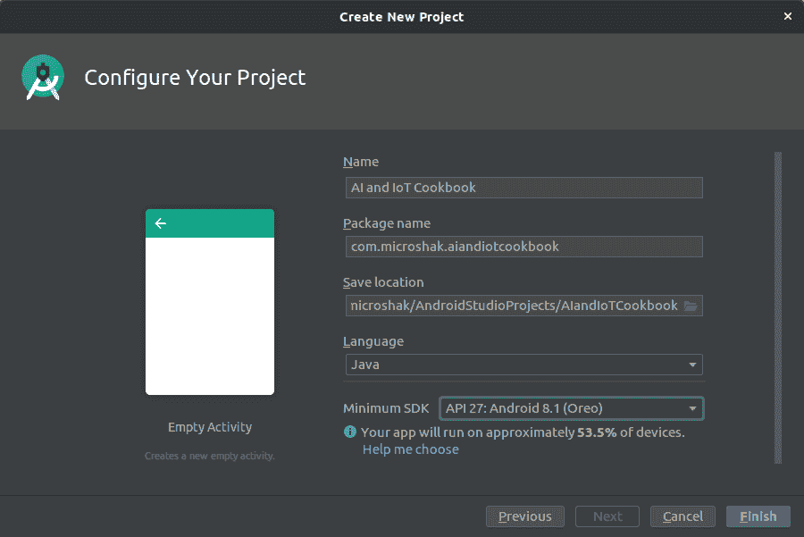
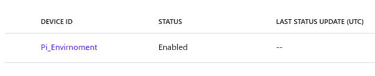

部署到边缘

在单个计算机上执行**机器学习和运维**（**MLOps**）可能具有挑战性。当我们考虑在成千上万台计算机上进行模型训练、部署和维护时，这样做的复杂性可能令人生畏。幸运的是，有减少此复杂性的方法，如使用容器化和**持续集成/持续部署**（**CI/CD**）流水线工具。在本章中，我们将讨论以安全、可更新且优化当前硬件的方式部署模型。

在构建可更新模型方面，我们将讨论使用 Azure IoT Hub Edge 设备在单一管理平面上实现**OTA**更新。我们还将使用设备双子来维护车队并推送配置设置到我们的模型中。此外，我们还将学习如何在一个计算机架构（如 x86）上训练模型并在 ARM 上运行。最后，我们将讨论如何使用雾计算在不同类型的设备上执行分布式机器学习。

本章包括以下步骤：

+   OTA 更新 MCU

+   使用 IoT Edge 部署模块

+   使用 TensorFlow.js 将负载卸载到网络

+   部署移动模型

+   使用设备双子维护你的车队

+   使用雾计算启用分布式机器学习

让我们开始吧！

# OTA 更新 MCU

OTA 更新对于部署安全更新、新功能和更新模型至关重要。有两种不同的 OTA 更新技术。第一种是构建一个自定义程序，理想情况下，它运行在与尝试更新的主程序不同的程序或线程上。这个软件会将新固件下载到闪存中，并注册并启动新固件。如果新固件启动失败，自定义软件可以启动工作版本的软件。通常需要将一半的可用闪存内存保存用于 OTA 更新。

第二种方法是使用 Azure IoT Edge 等系统来更新设备上的 Docker 容器。这需要设备运行完整操作系统，如 Raspbian、Ubuntu 或 Windows。大多数物联网设备无法支持 IoT Edge 所需的计算能力。在这个示例中，我们将讨论 MCU 的 OTA 更新，而在下一个示例中，我们将讨论 IoT Edge 上的 OTA 更新。

## 准备工作

在这个示例中，我们将使用 ESP32 对小型 MCU 设备进行 OTA 更新。使用 ESP32，我们将在 IDF 框架中进行编程。**Espressif IoT 开发框架**（**ESP-IDF**）是一个低级编程框架。它比 Arduino 框架具有较少的预构建组件，但更快速，更适合工业应用。

对于开发，我们将使用带有**PlatformIO**扩展的 VS Code。我们可以通过访问**PlatformIO**主页并选择**+ New Project**来创建项目：


接下来，添加项目名称，然后选择将要使用的开发板和开发框架。在我这里，我使用 NodeMCU-32S 作为开发板：


然后，在您的根目录中将`empty.c`重命名为`main.c`并开始编码。

## 如何操作...

这个配方的步骤如下：

1.  导入必要的库：

```py
#include <string.h>
#include "freertos/FreeRTOS.h"
#include "freertos/task.h"
#include "cJSON.h"
#include "driver/gpio.h"
#include "esp_system.h"
#include "esp_log.h"
#include "esp_http_client.h"
#include "esp_https_ota.h"
#include "wifi_functions.h"
```

1.  设置固件版本、证书和缓冲区大小：

```py
#define FIRMWARE_VERSION 0.1
#define UPDATE_JSON_URL "https://microshak.com/esp32/firmware.json"

extern const char server_cert_pem_start[] asm("_binary_certs_pem_start");
extern const char server_cert_pem_end[] asm("_binary_certs_pem_end");

char rcv_buffer[200];
```

1.  创建 HTTP 事件处理程序：

```py
esp_err_t _http_event_handler(esp_http_client_event_t *evt) 
{    
  switch(evt->event_id) {
        case HTTP_EVENT_ERROR:
            break;
        case HTTP_EVENT_ON_CONNECTED:
            break;
        case HTTP_EVENT_HEADER_SENT:
            break;
        case HTTP_EVENT_ON_HEADER:
            break;
        case HTTP_EVENT_ON_DATA:
            if (!esp_http_client_is_chunked_response(evt->client)){
              strncpy(rcv_buffer, (char*)evt->data, evt->data_len);
            }
            break;
        case HTTP_EVENT_ON_FINISH:
            break;
        case HTTP_EVENT_DISCONNECTED:
            break;
    }
    return ESP_OK;
}
```

1.  接下来，我们将创建一个无限循环（为简洁起见，我们将忽略机器学习算法）：

```py
void ml_task(void *pvParameter) 
{
    while(1) 
    {
        //ML on this thread
    }
}
```

1.  检查 OTA 更新。这样做会下载清单。然后，如果版本与当前版本不同，它将触发下载并重新启动设备：

```py
void check_update_task(void *pvParameter) 
{  
  while(1) 
  {
    printf("Looking for a new firmware...\n");

    esp_http_client_config_t config = 
    {
        .url = UPDATE_JSON_URL,
        .event_handler = _http_event_handler,
    };
    esp_http_client_handle_t client = 
        esp_http_client_init(&config);  
    esp_err_t err = esp_http_client_perform(client);
    if(err == ESP_OK) {      
      cJSON *json = cJSON_Parse(rcv_buffer);
      if(json == NULL) printf("downloaded file is not a valid json,
      aborting...\n");
      else { 
        cJSON *version = cJSON_GetObjectItemCaseSensitive(json, 
        "version");
        cJSON *file = cJSON_GetObjectItemCaseSensitive(json, 
        "file");
        if(!cJSON_IsNumber(version)) printf("unable to read new 
        version, aborting...\n");
        else {
          double new_version = version->valuedouble;
          if(new_version > FIRMWARE_VERSION) {           
            printf("current firmware version (%.1f) is lower than 
            the available one (%.1f), upgrading...\n", 
            FIRMWARE_VERSION, new_version);
            if(cJSON_IsString(file) && (file->valuestring != NULL)) 
            {
              printf("downloading and installing new 
                     firmware(%s)...\n", file->valuestring);              
              esp_http_client_config_t ota_client_config = 
              {
                .url = file->valuestring,
                .cert_pem = server_cert_pem_start,
              };              
              esp_err_t ret = esp_https_ota(&ota_client_config);
              if (ret == ESP_OK) 
              {
                printf("OTA OK, restarting...\n");
                esp_restart();
              } 
              else 
              {
                printf("OTA failed...\n");
              }
            }
            else printf("unable to read the new file name, 
                        aborting...\n");
          }
          else printf("current firmware version (%.1f) is greater
                      or equal to the available one (%.1f), 
                      nothing to do...\n", 
                      FIRMWARE_VERSION, new_version);
        }
      }
    }
    else printf("unable to download the json file, aborting...\n");

    esp_http_client_cleanup(client);

    printf("\n");
        vTaskDelay(60000 / portTICK_PERIOD_MS);
    }
}
```

1.  初始化 Wi-Fi：

```py
static EventGroupHandle_t wifi_event_group;
const int CONNECTED_BIT = BIT0;

static esp_err_t event_handler(void *ctx, system_event_t *event)
{
    switch(event->event_id) 
    {
      case SYSTEM_EVENT_STA_START:
            esp_wifi_connect();
            break;

      case SYSTEM_EVENT_STA_GOT_IP:
        xEventGroupSetBits(wifi_event_group, CONNECTED_BIT);
        break;

      case SYSTEM_EVENT_STA_DISCONNECTED:
        esp_wifi_connect();
        break;

      default:
        break;
    }

  return ESP_OK;
}

void wifi_initialise(void) 
{

  ESP_ERROR_CHECK(nvs_flash_init());

  wifi_event_group = xEventGroupCreate();
  tcpip_adapter_init();
  ESP_ERROR_CHECK(esp_event_loop_init(event_handler, NULL));
  wifi_init_config_t wifi_init_config = WIFI_INIT_CONFIG_DEFAULT();
  ESP_ERROR_CHECK(esp_wifi_init(&wifi_init_config));
  ESP_ERROR_CHECK(esp_wifi_set_storage(WIFI_STORAGE_RAM));
  ESP_ERROR_CHECK(esp_wifi_set_mode(WIFI_MODE_STA));
  wifi_config_t wifi_config = {
        .sta = {
            .ssid = "mynetwork",
            .password = "mywifipassword",
        },
    };
  ESP_ERROR_CHECK(esp_wifi_set_config(ESP_IF_WIFI_STA, 
                                      &wifi_config));
  ESP_ERROR_CHECK(esp_wifi_start());
}

void wifi_wait_connected()
{
  xEventGroupWaitBits(wifi_event_group, CONNECTED_BIT, false, true,
                      portMAX_DELAY);
}
```

1.  在主循环中，初始化 Wi-Fi 并创建两个任务（OTA 更新任务和我们的模拟机器学习任务）：

```py
void app_main() {

  printf("HTTPS OTA, firmware %.1f\n\n", FIRMWARE_VERSION);

  wifi_initialise();
  wifi_wait_connected();
  printf("Connected to wifi network\n");

  xTaskCreate(&ml_task, "ml_task", configMINIMAL_STACK_SIZE, NULL,
              5, NULL);
  xTaskCreate(&check_update_task, "check_update_task", 8192, NULL,
              5, NULL);
}
```

## 工作原理...

程序有三个任务。第一个任务是设置并确保连接到 Wi-Fi。在建立连接之前，它不会执行其他操作。该程序使用 Free RTOS 作为其实时操作系统。RTOS 允许线程独立执行。这使我们能够拥有两个非阻塞线程。我们的第一个线程执行机器学习任务，而第二个执行更新任务。更新任务允许我们以较低的频率轮询我们的 Web 服务器。

## 更多内容...

此配方中的 OTA 更新器需要一个清单，以便它可以根据其当前版本检查并找到要下载的文件。以下是清单的`.json`文件示例：

```py
{
    "version":1.2.
    "file":"https://microshak.com/firmware/otaml1_2.bin"
}
```

OTA 更新对任何 IoT 设备都是重要的事情。大多数芯片设备制造商，如 ESP32 或 STM32，已解决了这个 OTA 更新问题。这些制造商通常有示例代码，可以帮助您快速启动项目。

# 使用 IoT Edge 部署模块

在边缘部署模型可能存在风险。在前面的配方中，我们对小型 IoT 设备进行了简单的更新。如果更新导致整个设备群失败，它们可能永远丢失。如果我们有一个更强大的设备，那么我们可以启动独立运行的程序，彼此不受影响。如果更新失败，程序可以回滚到一个正常工作的版本。这就是 IoT Edge 的作用所在。IoT Edge 通过使用 Docker 技术专门处理在 IoT 设备上运行多个程序的问题。例如，这可能是需要执行地理围栏操作的采矿设备，用于设备故障预测的机器学习和用于自动驾驶汽车的强化学习。这些程序中的任何一个都可以更新，而不会影响其他模块。

在这个配方中，我们将使用 Azure 的 IoT Hub 和 IoT Edge 功能。这涉及使用 Docker 和 IoT Hub 将模型推送到设备。

## 准备工作

对于这个教程，您将需要一个位于云端的 Azure IoT Hub 和 Azure 容器注册表。您还需要安装了 Azure IoT 扩展的**Visual Studio Code**（**VS Code**）和一个 Raspberry Pi。对于这个教程，您将需要三个主要组件。第一个是我们的 Raspberry Pi，它必须进行设置。这将涉及安装 Moby，即 Docker 的轻量级版本。接下来是编写代码。在我们的情况下，我们将在基于 x86 的笔记本上编写代码，并将模型部署到基于 ARM 的 Raspberry Pi 上。最后，我们将把代码部署到一个或一系列设备上。

### 设置我们的 Raspberry Pi

对于这个教程，我们将远程从笔记本电脑上的 Raspberry Pi 进行编码。为了实现这一点，我们需要允许 SSH 并通过 VS Code 连接到 Raspberry Pi。在 Raspberry Pi 上，您需要转到**Menu** | **Preferences** | **Raspberry Pi Configuration**。然后，单击**Interfaces**并启用**SSH**：


在终端窗口中，输入以下命令：

```py
hostname -I
```

这将为您提供 Raspberry Pi 的 IP 地址。将该 IP 地址记录下来，然后回到您的桌面电脑，在 VS Code 中安装 SSH 插件并连接到 Raspberry Pi。然后，通过使用连接到 SSH 按钮连接到 Raspberry Pi。然后，按照向导的指示使用设备的 IP 地址和密码连接到 Raspberry Pi。完成这些步骤后，您可以在设备上创建一个新项目。

此外，在您使用设备时，您需要安装 IoT Edge 代理。要做到这一点，请按照[`docs.microsoft.com/en-us/azure/iot-edge/how-to-install-iot-edge-linux`](https://docs.microsoft.com/en-us/azure/iot-edge/how-to-install-iot-edge-linux)中的说明操作。

### 编码设置

现在，创建一个新的 IoT Edge 项目。要做到这一点，请打开 Visual Studio 并安装 Azure IoT Edge 扩展，以及 Docker 扩展。然后，使用*Ctrl* + *Shift* + *P*打开命令窗口，输入`Azure IoT Edge:`进入**搜索**栏，并选择**Azure IoT Edge: New IoT Edge Solution**：


完成这些步骤后，您将看到一个向导，要求您为项目命名。然后，向导将提示您添加一个模块。一个项目可以有多个执行不同任务的模块。这些模块可以用不同的语言编写，或者使用 Azure 机器学习服务来集成该平台上的预构建模型。在我们的情况下，我们正在制作一个自定义的 Python 模块。然后，它会要求您提供 Azure 容器注册表模块的位置，因此根据需要提供位置，如下面的屏幕截图所示：


从这里开始，我们可以在树莓派上进行开发。在树莓派上开发机器学习的一个需要注意的事项是，像环境构建这样的任务可能会花费 10 倍的时间。在具有 16 核心和 32 GB RAM 的桌面上，需要几分钟的机器学习 Docker 构建，在只有 1 个核心和 2 GB RAM 的情况下，可能需要 10 倍的时间来编译。

此时，VS Code 的代码生成器已创建了一个`main.py`文件，其中包含一个接收来自 IoT Hub 消息并将其回显的起始模板。在*如何执行……*部分，我们将修改它以包含用于您的机器学习代码的存根。在*还有更多……*部分，我们将讨论如何为 ARM32 环境构建模块。

## 如何执行……

此处的步骤如下：

1.  在`main.py`文件中，导入必要的库：

```py
import time
import os
import sys
import asyncio
from six.moves import input
import threading
from azure.iot.device.aio import IoTHubModuleClient
from azure.iot.device import Message
import uuid
```

1.  为您的 ML 代码创建一个存根：

```py
def MLCode():
    # You bispoke ML code here
    return True
```

1.  创建一个发送消息的函数：

```py
    async def send_d2c_message(module_client):
        while True:
            msg = Message("test machine learning ")
            msg.message_id = uuid.uuid4()
            msg.custom_properties["MachineLearningBasedAlert"]=\ 
            MLCode()
            await module_client.send_message_to_output(msg, 
                                                       "output1")
```

1.  创建一个接收消息的函数：

```py
def stdin_listener():
    while True:
        try:
            selection = input("Press Q to quit\n")
            if selection == "Q" or selection == "q":
                print("Quitting...")
                break
        except:
            time.sleep(10)
```

1.  启动我们的消息发送线程和消息接收线程：

```py
async def main():
    try:
        module_client = \
        IoTHubModuleClient.create_from_edge_environment()
        await module_client.connect()
        listeners = asyncio.gather(send_d2c_message(module_client))

        loop = asyncio.get_event_loop()
        user_finished = loop.run_in_executor(None, stdin_listener)

        # Wait for user to indicate they are done listening for 
        # messages
        await user_finished

        # Cancel listening
        listeners.cancel()

        # Finally, disconnect
        await module_client.disconnect()

    except Exception as e:
        print ( "Unexpected error %s " % e )
        raise
```

1.  设置标准的 Python 主程序入口点：

```py
if __name__ == "__main__":
    loop = asyncio.get_event_loop()
    loop.run_until_complete(main())
    loop.close()
```

## 工作原理……

在这个示例中，我们学习了如何为开发一个边缘模块准备设备和开发环境，您可以在其上部署代码。IoT Edge 编程范式的工作方式是接收消息、执行操作，然后发送消息。在这个示例的代码中，我们将这些操作分成了可以独立运行的不同任务。这使我们能够在慢速循环中执行获取和发送消息等操作，并在更快的循环中评估我们的数据。为此，我们使用了`asyncio`，这是一个在 Python 中支持多线程的库。一旦您的代码准备好，您可以构建一个 Docker 容器，并将其部署到安装有边缘模块或整个设备群的其他设备上。在*还有更多……*部分，我们将讨论如何执行这些操作。

## 还有更多……

现在您已将代码添加到设备上，您需要在设备的架构上本地构建代码。确保设备镜像正常运行后，您可以将其上传到您的容器注册表。这可以确保您的设备位于 IoT Hub 中。要执行此操作，请进入 Visual Studio 项目，并右键单击`module.json`文件。将出现一个新的上下文菜单，允许您选择本地构建或构建并推送到容器注册表：


从这里开始，您可以通过右键单击`deployment.template.json`文件并选择**生成 IoT Edge 部署清单**来创建一个部署清单。VS Code 将生成一个包含`deployment.arm32.json`文件的`config`文件夹：


定位并右键单击`deployemtn.arm32.json`文件；将出现一个新的上下文菜单，允许您部署到单个设备或设备群：


此相同的菜单还允许您推送到一组设备。一旦部署了更新，您可以在门户中查看更新。如果您让该部署更新设备双胞胎，您可以使用它来查询整个设备组的部署状态。

# 使用 TensorFlow.js 将计算卸载到 Web

IoT 中失败的最大驱动因素之一是成本。通常，设备以固定的低价格出售，然后对设备制造商来说有再发生的成本。有多种方法可以减少再发生的成本。其中一种方法是将一些机器学习计算卸载到访问数据的设备或应用程序中。在这个案例中，我们将使用 TensorFlow.js 将昂贵的计算卸载到查看网页的浏览器中。

## 准备工作

对于这个案例，我们将基于 第四章 中的 *实现 LSTM 预测设备故障* 案例进行扩展，该章节是关于预测维护的深度学习，我们研究了 NASA 的 *Turbofan Run to Failure* 数据集。您可以在本章的仓库中找到 Databricks 笔记本。对于这个案例，我们将使用 MLflow 实验来获取我们的模型。我们将把该模型转换为可以在前端使用 TensorFlow.js 运行的模型。在开始使用 TensorFlow.js 之前，您需要运行 `pip install tensorflowjs`。

接着，您需要找到从 MLflow artifact 下载的模型；也就是说，保存的 Keras 模型。为此，请运行以下命令：

```py
tensorflowjs_converter --input_format=keras model.h5 tfjs_model
```

在这里，`model.h5` 是从预测维护数据集中保存的 Keras LSTM 模型，`tfjs_model` 是该模型将被放置的文件夹。

接着，打开 Visual Studio。在这里，我们将写两个文件。第一个文件将是一个 HTML 文件，而第二个文件将是一个 JavaScript 文件。创建这些文件后，您可以在本章的 GitHub 仓库中使用 `webserver.py` 文件在本地运行它们。这将在您的 web 浏览器中运行 `index.html` 文件和任何其他文件，地址为 `http://localhost:8080/index.html`。本章的 GitHub 仓库中还有一个 `data.json` 文件，表示一个 Web 服务，该服务会向网页返回数据。

## 如何实现...

这个案例的步骤如下：

1.  在 `index.js` 文件中，添加一个 `GetData` 函数，从 `data.json` 中获取数据：

```py
async function GetData(){
$.get( "/data.json", function( data ) {
$( "#data" ).text( data["dat"] );
predict(data["dat"]) 
});
}
```

1.  制作一个函数，引入模型并评估数据：

```py
async function predict(dat)
{
    const model = await tf.loadLayersModel('/tfjs_model/model.json');
    console.log(model)
    dat = tf.tensor3d(dat, [1, 50, 25] )
    dat[0] = null
    console.log(dat)
    var pred = model.predict( dat)
    const values = pred.dataSync();
    let result = "Needs Maintenance"
    if(values[0] < .8)
        result = "Does not need Maintenance"

    $('#needed').html(result )
} 
```

1.  创建一个 `index.html` 文件，该文件将调用您的 `js` 文件：

```py
<!DOCTYPE html>
<html>
<head>
<title>Model</title>
<script src="img/tf.min.js"></script>
<script src="img/tfjs-vis.umd.min.js"></script>
</head>
<body>
    <button onclick="GetData()">Maintenance Needed</button>
<textarea id="data" style="width:400px;height:400px;"></textarea>
<div id="needed"></div>
</body>
<script src="img/jquery.min.js"></script>
<script type="text/javascript" src="img/index.js"></script>

</html>
```

## 工作原理是如何...

在这个案例中，我们采用了为 Python 编写的预训练模型，并使用转换工具将其转换为在 Web 上运行的模型。然后，我们从 Web 服务中获取数据，并将其与机器学习模型进行评估。最后，当我们的机器学习模型对涡轮风扇引擎的剩余寿命有 80% 的信心时，我们显示文本 `"Needs Maintenance"`。

## 还有更多内容...

近年来，Web 浏览器的功能大大增强。其中一个方面是能够处理数据并在后台进行处理。例如，可以在本书的 GitHub 存储库中找到一个例子，称为`Dexie`，展示了向浏览器的数据库添加数据的示例。您还可以在现代 Web 浏览器中使用服务工作者。**服务工作者**是在 Web 浏览器中后台运行的后台作业。它们甚至可以在页面不活动时工作。

# 部署移动模型

许多物联网场景要求具有图形用户界面，即高级计算、蓝牙、Wi-Fi 和蜂窝网络。大多数现代手机都有这些功能。一个廉价的物联网设备可以通过蓝牙与智能手机上的应用程序通信，并使用该应用程序执行机器学习并与云端通信。

使用手机可以缩短物联网设备的上市时间。这些设备可以使用安全且易于更新的应用程序将数据发送到云端。手机的便携性是一个优点，但也是一个缺点。一个设备持续与云端通信可能会耗尽手机的电池，以至于它的电池寿命只有短短 8 小时。因此，公司经常倾向于使用边缘处理来执行诸如机器学习之类的计算任务。这使得设备可以更少地发送数据。

手机如何用于物联网是无处不在的。像 Fitbit 和 Tile 这样的公司使用低功耗的**蓝牙低能耗**（**BLE**）将数据发送到消费者手机。物联网设备本身可以是低功耗的，并将大部分工作卸载到附加的手机上。其他设备，如患者心脏监测仪、仓库库存工具和语音激活的信息亭，可以拥有专门设计以满足应用程序需求的智能设备。

在这个示例中，我们将向您展示如何在 Android 上使用 TensorFlow Lite。我们将学习如何使用一个简单的 Android kiosk 关键词激活应用程序，并将其部署到设备上。然后，我们将学习如何将其侧载到设备上。

## 准备就绪

在这个示例中，我们将创建一个简单的 Android Studio 应用程序，并向其添加机器学习代码。为此，您需要下载并安装 Android Studio。从那里，创建一个新项目并按照以下步骤操作：

1.  打开 Android Studio 后，从“开始”菜单中选择**+开始一个新的 Android Studio 项目**：


1.  然后，您需要选择一个 UI 模板。在这个示例中，我们将选择一个空的活动：


1.  在接下来的屏幕上，您将看到一个向导，可以为项目命名并选择语言。对于这个项目，我们将选择**Java**作为我们的语言：



1.  好了，一个新项目就这样打开了。 现在，我们需要将 TensorFlow Lite 导入到我们的项目中。 要做到这一点，请转到**build.gradle（Module：app）**部分，在**Gradle Scripts**下：


1.  在`build.gradle`的 JSON 文件中，在`dependencies`部分下，添加对 TensorFlow Lite 的引用（`implementation 'org.tensorflow:tensorflow-lite:+'`）：


1.  从这里，在 Android Studio 中，右键单击**app**文件夹，选择**New**，然后选择**Folder**，然后**Assets folder**：


这是我们将放置我们训练过的模型的地方。 就像我们在*使用 TensorFlow.js 将数据外载至网络*的方法中使用了`tfliteJS`转换工具一样，我们可以使用`tflite`转换工具来转换我们的模型。

## 如何操作...

此方法的步骤如下：

1.  在`MainActivity.java`文件的头部部分，添加必要的 TensorFlow 引用：

```py
import org.tensorflow.lite.Interpreter
```

1.  在`variables`部分，初始化`tflite`解释器：

```py
Interpreter tflite;
```

1.  在`OnCreate`方法中，添加代码，从文件中加载模型到`tflite`解释器中：

```py
tflite = new Interpreter(loadModelFile(activity));
```

1.  然后，创建一个加载模型文件的方法：

```py
private MappedByteBuffer loadModelFile(Activity activity) throws IOException {
 AssetFileDescriptor fileDescriptor = 
  activity.getAssets().openFd(getModelPath());
 FileInputStream inputStream = new 
  FileInputStream(fileDescriptor.getFileDescriptor());
 FileChannel fileChannel = inputStream.getChannel();
 long startOffset = fileDescriptor.getStartOffset();
 long declaredLength = fileDescriptor.getDeclaredLength();
 return fileChannel.map(FileChannel.MapMode.READ_ONLY, startOffset, 
                        declaredLength);
 }
```

1.  在从蓝牙数据源调用的方法中执行必要的推理：

```py
tflite.run(inputdata, labelProbArray);
```

## 它是如何工作的...

类似于*使用 TensorFlow.js 将数据外载至网络*的方法，此方法接受一个 TensorFlow Lite 模型，执行推理，并返回概率值。 TensorFlow Lite 模型适用于 Android 等小型设备，并可用于应用程序和服务。

# 使用设备双重维护您的设备群

设备双重是一套旨在帮助我们处理设备群的工具。 它们可用于将信息传递给设备，例如该设备应使用的模型。 它们也可用于将更有状态的信息传递回云端，例如模型的实际错误率。

设备的双面。 在设备一侧，有一个行为像可写配置文件的 JSON 文件，而在云端，则有一个可写属性数据库。 这两个方面有序地同步，允许您推理您的设备群。

设备双重的一个优点是您可以看到模型部署是否实际有效。 通常，机器学习模型会随信息变化而更新，并将新模型推送到设备上。 这些模型可能会触发内存不足异常并失败； 它们也可能会使设备变砖。 在物联网产品的生命周期中，如果制造商更改硬件或某些组件不再可用，通常可以更换硬件。

在开始之前，我们需要讨论一些基本概念。 我们将在*它是如何工作的...*部分进行更深入的研究。 设备双重由三部分组成：

+   **标签区域**负责通用标签，如设备的名称、位置或所有者。 标签区域的数据由云端设置。

+   接下来是**期望的属性**。期望的属性部分也由云端设置。在概念上，这是云端希望设备处于的状态。例如，这可能是一个模型版本或阈值。

+   最后一个属性是一个**报告属性**。该属性由设备设置。它可以是数据值，也可以是对所需属性的响应。

例如，如果所需属性或模型版本发生更改，我们可以尝试更新到最新版本，并且如果更新成功，将我们的报告属性设置为所需版本。如果不起作用，我们可以在云中查询。我们还可以使用标签部分在称为**更新环**的集合中更新我们的设备。我们可以使用更新环来获取滚动更新，这使我们可以首先更新很少的设备，然后稍后更新多个设备。我们还可以根据设备的某些特征（例如位置和所有者）部署不同的模型。

## 准备工作：

在这个配方中，我们将使用 Azure IoT Hub 和 Python。我们示例中的 Python 版本需要在 3.6 以上。我们需要安装以下库：

```py
pip3 install azure-iot-device
pip3 install asyncio
```

您还需要从 IoT Hub 获取设备连接字符串。在第一章的*设置 IoT 和 AI 环境*配方中，我们向您展示了如何在 Azure 中设置 IoT Hub。从那里开始，您需要获取该单独设备的密钥。为此，请导航到您创建的 IoT Hub，并在左侧面板中单击**IoT 设备**菜单项。然后，单击**+**按钮并添加具有对称密钥身份验证的设备：


在这里，您将看到设备显示在设备列表中，如下面的截图所示。您可以单击该项并获取设备密钥：



您还需要进入共享访问策略菜单项并复制服务策略连接字符串。此连接字符串用于连接到 IoT Hub，以便您管理设备群。先前的密钥适用于单个设备。

## 如何操作...

此配方的步骤如下：

1.  在设备端，导入必要的库：

```py
import asyncio
from six.moves import input
from azure.iot.device.aio import IoTHubDeviceClient
```

1.  创建一个`main()`函数并连接到设备：

```py
async def main():
    device_client = \
    IoTHubDeviceClient.create_from_connection_string("Connection
                                                     String")

    await device_client.connect()
```

1.  创建一个孪生监听器：

```py
    def quit_listener():
        while True:
        selection = input("Press Q to quit\n")
        if selection == "Q" or selection == "q":
            print("Quitting...")
            break
```

1.  创建一个监听任务：

```py
    asyncio.create_task(twin_patch_listener(device_client))
```

1.  监听退出信号：

```py
    loop = asyncio.get_running_loop()
    user_finished = loop.run_in_executor(None, quit_listener)
```

1.  等待用户完成信号并断开连接：

```py
    await user_finished
    await device_client.disconnect()
```

1.  使用`asyncio`运行循环：

```py
if __name__ == "__main__":
    asyncio.run(main())
```

1.  在云端（这是帮助您管理设备群的计算机）使用以下代码设置期望的机器学习模型版本。首先，导入必要的库：

```py
import sys
from time import sleep
from azure.iot.hub import IoTHubRegistryManager
from azure.iot.hub.models import Twin, TwinProperties
```

1.  使用服务连接字符串连接到 IoT Hub：

```py
iothub_registry_manager = \
IoTHubRegistryManager("Service Connection String")
```

1.  设置所需的属性，使其成为模型版本：

```py
twin = iothub_registry_manager.get_twin("Device_id")
twin_patch = Twin( properties= \
TwinProperties(desired={'Vision_Model_Version' : 1.2}))
twin = iothub_registry_manager.update_twin(DEVICE_ID, twin_patch, 
                                           twin.etag)
```

1.  稍后，在另一个 Python 文件中，我们将查询版本是否已更新。首先，导入必要的库：

```py
import sys
from time import sleep
from azure.iot.hub import IoTHubRegistryManager
from azure.iot.hub.models import Twin, TwinProperties, \
QuerySpecification, QueryResult
```

1.  然后，我们可以查询所有具有报告属性但不符合我们期望属性的设备：

```py
query_spec = QuerySpecification(query="SELECT * FROM devices WHERE properties.reported.Vision_Model_Version <> 1.2")
query_result = iothub_registry_manager.query_iot_hub(query_spec, None, 100)
print("Devices that did not update: {}".format(', '.join([twin.device_id for twin in query_result.items])))
```

## 工作原理...

这个示例有三个不同的代码段。第一个在设备端。这段代码收集了通过设备双胞胎对设备进行的任何更改。在接下来的部分中，我们指示 IoT Hub 更新特定设备的报告属性。然后，我们查询了我们的设备群，并检查是否所有设备都更新到我们想要使用的模型。

## 还有更多...

设备双胞胎基本上是一个大的 JSON 文件，位于云端和设备端。它可用于调整设置、控制设备并设置关于设备的元数据。还有另一个服务建立在设备双胞胎之上。它被称为**数字双胞胎**。数字双胞胎在设备和云端之间同步相同的 JSON 文件。它们还有将设备连接成图的额外好处。图是将设备链接在一起的一种方式。这可以根据地理位置完成。换句话说，您可以根据位置将设备连接在一起。它还可以在本地将设备连接在一起。当您拥有相关设备时，这非常有用。例如，智能城市希望具有地理相关性的设备。在这个智能城市中，我们希望知道某个地理位置的所有交叉口是否有交通停止。在工厂中，可能有包含相关数据的制造线。这些制造线可能包含数十个提供不同类型读数的物联网设备。数字双胞胎可以帮助我们诊断慢装配线的问题，并进行根本原因分析。

# 使用雾计算启用分布式 ML

在物联网中工作通常意味着处理大数据。传感器可能会有详细说明，设备也可能很大。例如，CERN 的粒子加速器每秒产生超过一 PB 的数据。将这些原始数据发送到中央存储库将是不切实际的。许多公司面临处理极大数据集或极快速数据集时可能会面临挑战。

在这个示例中，我们将把工作负载分布到几个系统中，从而允许一个系统拍摄图像，另一个处理图像。在我们的示例中，一个小设备可以拍摄图像并将其流式传输到工业 PC 或工厂中一组服务器。在这里，我们将使用`docker`和`docker-compose`，而对于我们的算法，我们将使用 YOLO（一种图像分类算法）的 OpenCV 实现。

## 准备工作

本示例将在代码量上非常详细，但所有操作都将在 Docker 中完成。您可以使用 VS Code 的 Docker 扩展直接在 Docker 容器中工作。您还需要一个连接了摄像头的设备。这可以是带有摄像头的笔记本电脑或树莓派 – 这并不重要。在这个示例中，我们将设置一个机器学习服务、一个摄像头流服务，并允许设备知道其他设备的位置，并允许您查看您在整个设备群中的分类。

尽管这相当简单，但列出所有容器的代码将需要几十页。为了简洁起见，在这个示例中，我们将展示计算机视觉模块。其余模块可以使用 Docker 运行，并使用本书的 GitHub 仓库中的代码。

## 如何做…

本示例的步骤如下：

1.  在您的计算设备上，下载 YOLO 的机器学习模型文件：

```py
wget https://pjreddie.com/media/files/yolov3.weights
wget https://raw.githubusercontent.com/microshak/AI_Benchtest_Device/yolov3.txt
wget https://raw.githubusercontent.com/microshak/AI_Benchtest_Device/yolov3.cfg
```

1.  创建一个 `CPU` 文件夹，并在其中创建一个 `__init__.py` 文件：

```py
from flask import Flask
cpu = Flask(__name__)

from CPU.Yolo import yolo
from CPU.manifest import manifest
cpu.register_blueprint(yolo)
cpu.register_blueprint(manifest)
```

1.  创建一个 `manifest.py` 文件，将计算服务器的功能发送到集中服务器：

```py
from flask_apscheduler import APScheduler
from flask import Blueprint, request, jsonify, session
import requests
import socket
import json
import os
manifest = Blueprint('manifest','manifest',url_prefix='/manifest')
scheduler = APScheduler()

def set_manifest():
    f = open("manifest_cpu.json", "r")
    manifest = f.read()
    data = json.loads(manifest)
    data['host_name'] = socket.gethostname()
    gw = os.popen("ip -4 route show default").read().split()
    s = socket.socket(socket.AF_INET, socket.SOCK_DGRAM)
    s.connect((gw[2], 0))
    ipaddr = s.getsockname()[0]

    data['ip_address'] = ipaddr
    url = 'https://ai-benchtest.azurewebsites.net/device'
    r = requests.post(url = url, json =data)
    txt = r.text

set_manifest()
scheduler.add_job(id ='Scheduled task', func =set_manifest, 
                  trigger = 'interval', minutes = 10)
scheduler.start()
```

1.  创建一个 `Yolo.py` 文件并导入必要的库：

```py
import cv2
import pickle
from io import BytesIO
import time
import requests
from PIL import Image
import numpy as np
from importlib import import_module
import os
from flask import Flask, render_template, Response
from flask import request
import imutils
import json
import requests
from flask import Blueprint, request, jsonify, session
```

1.  将页面初始化为 Flask 页面：

```py
yolo = Blueprint('yolo', 'yolo', url_prefix='/yolo')
```

1.  初始化我们的绘图变量：

```py
classes = None
COLORS = np.random.uniform(0, 300, size=(len(classes), 3))
```

1.  导入模型类名称：

```py
with open("yolov3.txt", 'r') as f:
    classes = [line.strip() for line in f.readlines()]
```

1.  创建一个获取输出层的帮助函数：

```py
def get_output_layers(net):
    layer_names = net.getLayerNames()
    output_layers = [layer_names[i[0] - 1] for i in 
                     net.getUnconnectedOutLayers()]
    return output_layers
```

1.  创建一个帮助函数，该函数将在识别到的对象周围绘制一个矩形并插入分类文本：

```py
def draw_prediction(img, class_id, confidence, x, y, x_plus_w,
                    y_plus_h):
    label = str(classes[class_id])
    color = COLORS[class_id]
    cv2.rectangle(img, (x,y), (x_plus_w,y_plus_h), color, 2)
    cv2.putText(img, label, (x-10,y-10), cv2.FONT_HERSHEY_SIMPLEX, 
                0.5, color, 2)
```

1.  创建一个 `Yolo` 方法，该方法接收图像和神经网络，然后缩小图像：

```py
def Yolo(image, net):
    try:
        Width = image.shape[1]
        Height = image.shape[0]
        scale = 0.00392

        blob = cv2.dnn.blobFromImage(image, scale, (416,416), 
                                     (0,0,0), True, crop=False)
```

1.  将图像设置为神经网络的输入，并执行 YOLO 分析：

```py
        net.setInput(blob)
        outs = net.forward(get_output_layers(net))
```

1.  初始化变量并设置置信度阈值：

```py
        class_ids = []
        confidences = []
        boxes = []
        conf_threshold = 0.5
        nms_threshold = 0.4
```

1.  将机器学习结果集转换为我们可以应用于图像的坐标集：

```py
        for out in outs:
            for detection in out:
                scores = detection[5:]
                class_id = np.argmax(scores)
                confidence = scores[class_id]
                if confidence > 0.5:
                    center_x = int(detection[0] * Width)
                    center_y = int(detection[1] * Height)
                    w = int(detection[2] * Width)
                    h = int(detection[3] * Height)
                    x = center_x - w / 2
                    y = center_y - h / 2
                    class_ids.append(class_id)
                    confidences.append(float(confidence))
                    boxes.append([x, y, w, h])
```

1.  抑制任何不符合阈值标准的边界框：

```py
        indices = cv2.dnn.NMSBoxes(boxes, confidences, 
                                   conf_threshold,
                                   nms_threshold)
```

1.  获取边界框并在图像内绘制它们：

```py
        for i in indices:
            i = i[0]
            box = boxes[i]
            x = box[0]
            y = box[1]
            w = box[2]
            h = box[3]
            draw_prediction(image, class_ids[i], 
                            confidences[i], round(x),
                            round(y), round(x+w), 
                            round(y+h))
```

1.  返回图像：

```py
    return image
```

1.  创建一个名为 `gen` 的函数，该函数将导入模型并持续从摄像头设备获取图像：

```py
def gen(height,width, downsample, camera):

    net = cv2.dnn.readNet("yolov3.weights", "yolov3.cfg")
    while True:
        url = f'http://{camera}:5000/image.jpg?\
        height={height}&width={width}'
        r = requests.get(url) # replace with your ip address
        curr_img = Image.open(BytesIO(r.content))
```

1.  调整图像大小并调整颜色：

```py
        frame = cv2.cvtColor(np.array(curr_img), cv2.COLOR_RGB2BGR)
        dwidth = float(width) * (1 - float(downsample))
        dheight = float(height) * (1 - float(downsample))
        frame = imutils.resize(frame, width=int(dwidth), 
                               height=int(dheight))
```

1.  执行机器学习算法并返回结果流：

```py
        frame = Yolo(frame, net)

        frame = cv2.imencode('.jpg', frame)[1].tobytes()
        yield (b'--frame\r\n'
               b'Content-Type: image/jpeg\r\n\r\n' + 
               frame + b'\r\n\r\n')
```

1.  创建一个 Web 地址，将抓取 URL 参数并通过算法处理它们：

```py
@yolo.route('/image.jpg')
def image():

    height = request.args.get('height')
    width = request.args.get('width')
    downsample = request.args.get('downsample')
    camera = request.args.get('camera')

    """Returns a single current image for the webcam"""
    return Response(gen(height,width, downsample, camera), 
                    mimetype='multipart/x-mixed-replace; 
                    boundary=frame')
```

1.  回到根目录内，创建一个 `manifest.json` 文件，该文件将广播我们正在使用的机器的功能：

```py
{
     "FriendlyName":"Thinkstation",
     "name":"Thinkstation",
     "algorithm":[{"name":"Object Detection"
                    ,"category":"objectdetection"
                    ,"class":"Computer Vision"
                    ,"path":"yolo/image.jpg"}

     ]
     , "ram":"2gb"
     , "cpu": "amd"
 }
```

1.  创建一个 `runcpu.py` 文件。这将是启动 Flask 服务器并注册其他代码文件的文件：

```py
 from os import environ
 from CPU import cpu

 if __name__ == '__main__':
     HOST = environ.get('SERVER_HOST', '0.0.0.0')
     try:
         PORT = int(environ.get('SERVER_PORT', '8000'))
     except ValueError:
         PORT = 5555
     cpu.run(HOST, PORT)
```

## 它是如何工作的…

这个边缘计算配方展示了如何将几种不同类型的系统集成到一起以作为一个整体运行。在本示例中，我们展示了从另一个系统获取视频流的设备代码，对其进行计算，然后将其传递给另一个系统。在这种情况下，我们的最终系统是一个 Web 应用程序。

不同系统之间要进行通信，需要有集中式的状态管理。在这个示例中，我们使用了 Flask 和 Redis。我们集群中的每台机器每 10 分钟注册一次其状态和能力。这样其他机器就可以利用网络上的机器，避免一个机器成为瓶颈。当新机器上线时，它只需向我们的状态服务器注册其状态；只要它继续广播，就可以供其他机器使用。

## 还有更多...

这个示例依赖于其他组件。这些组件位于本章节的 GitHub 存储库中，位于`AI_Benchtest`文件夹下。您可以进入各自的文件夹并运行`docker`或`docker-compose`来启动这些程序。要在终端中运行摄像机服务器，请进入`AI_Benchtest_API`文件夹并运行以下命令：

```py
docker-compose up
```

接下来，您需要运行`AI_Benchtest_Cam`模块。在终端中，`CD`到`AI_Benchtest_Cam`文件夹，并运行与启动 API 服务器相同的`docker-compose`命令。此时，摄像机和计算服务器都将启动并向 API 服务器传输其状态。接下来，您需要运行一个 UI 服务器，以便可以向其他服务器发送命令。要做到这一点，请`CD`到`AI_Benchtest_API`文件夹，并运行以下`docker`命令来启动 UI 应用程序：

```py
docker build -t sample:dev . docker run -v ${PWD}:/app -v /app/node_modules -p 3001:3000 --rm sample:dev
```
