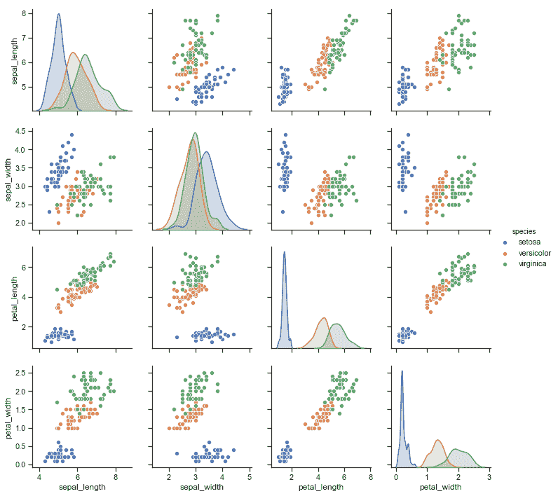
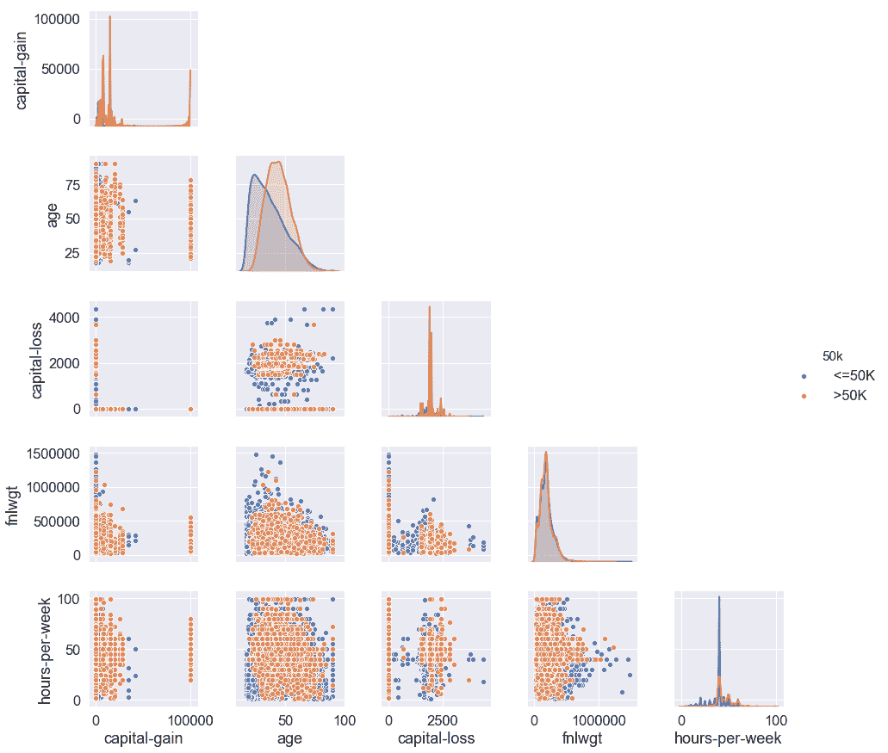
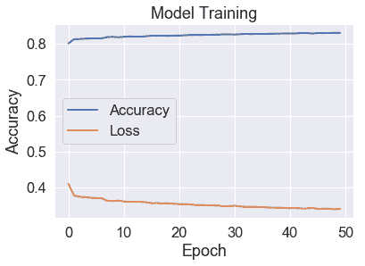

Python 中的人工智能入门

在本章中，我们将首先设置一个 Jupyter 环境来运行我们的实验和算法，我们将介绍不同的巧妙 Python 和 Jupyter 的 AI 技巧，我们将在 scikit-learn、Keras 和 PyTorch 中进行一个玩具示例，然后在 Keras 中进行稍微复杂的示例以完成这些事情。本章主要是介绍性的，本章中看到的许多内容将在后续章节中进一步构建，因为我们将涉及更高级的应用。

在本章中，我们将涵盖以下示例：

+   设置 Jupyter 环境

+   Python AI 熟练掌握

+   在 scikit-learn、Keras 和 PyTorch 中进行分类

+   使用 Keras 进行建模

# 技术要求

为了能够运行本书中的一些示例，您确实应该有一个 GPU 可用，或者最好使用 Google Colab。需要一些额外步骤来确保您安装了正确的 NVIDIA 图形驱动程序，以及一些额外的库。在 TensorFlow 网站上，Google 提供了有关最新的 NVIDIA 驱动程序的安装指南，网址为 https:/​/​www. tensorflow.​org/​install/​gpu。同样，PyTorch 版本对 NVIDIA 驱动程序版本有最低要求（您需要手动检查每个 PyTorch 版本）。让我们看看如何使用 Docker 环境来帮助设置这些。

您可以在本书的 GitHub 存储库中找到本章的示例，网址为 [`github.com/PacktPublishing/Artificial-Intelligence-with-Python-Cookbook`](https://github.com/PacktPublishing/Artificial-Intelligence-with-Python-Cookbook)。

# 设置 Jupyter 环境

正如你所知，自从你获取了这本书以来，Python 已经成为人工智能领域的主导编程语言。它拥有所有编程语言中最丰富的生态系统，包括许多最先进算法的实现，使用它们通常只需简单导入并设置少量参数。无需多言，在许多情况下我们将超越基本用法，并在我们深入实例时讨论很多潜在的思想和技术。

我们无法强调快速原型设计和查看其作为解决方案的效果的重要性。这通常是 AI 或数据科学工作的主要部分。当将想法转化为原型时，**读取-求值-打印循环**（REPL）是快速迭代的关键，您希望具有编辑历史、图形化等功能。这就解释了为什么 Jupyter Notebook（其中 **Jupyter** 简称 **Julia, Python, R**）在 AI 工作中如此重要。

请注意，尽管我们将专注于 Jupyter Notebook 或 Google Colab（它在云中运行 Jupyter 笔记本），但还有几个功能上类似的替代方案，例如 JupyterLab 或者使用远程解释器运行的 PyCharm。然而，Jupyter Notebook 仍然是最流行（可能也是最受支持）的选择。

在这个步骤中，我们将确保我们有一个正常工作的 Python 环境，并安装我们在本书中需要的软件库。我们将处理安装与 AI 相关的 Python 库，并设置一个 Jupyter Notebook 服务器。

## 准备工作

首先确保您已安装 Python，并有安装库的方法。根据以下两种情况使用和安装库有不同的方法：

+   您可以使用像 Google Colab 这样的服务来托管交互式笔记本。

+   您可以在自己的机器上安装 Python 库。

在 Python 中，**模块**是一个包含函数、变量或类的 Python 文件。**包**是在同一路径中包含多个模块的集合。**库**是相关功能的集合，通常以不同的包或模块形式存在。非正式地，将 Python 库称为包是很常见的，我们这里有时也会这样称呼。

## 如何实施...

让我们设置我们的 Python 环境！

正如我们提到的，我们将看两种情况：

+   使用 Google Colab

+   自行设置计算机以托管 Jupyter Notebook 实例

在第一种情况下，我们无需在服务器上设置任何东西，只需安装几个额外的库。在第二种情况下，我们将安装 Anaconda 发行版的环境，并查看 Jupyter 的设置选项。

在这两种情况下，我们将有一个交互式的 Python 笔记本，通过它我们将运行大部分的实验。

### 在 Google Colab 中安装库

Google Colab 是 Jupyter Notebook 的修改版本，在 Google 硬件上运行，并提供访问支持硬件加速（如 TPU 和 GPU）的运行时。

使用 Colab 的缺点是最长运行时间为 12 小时；也就是说，超过 12 小时的作业将停止。如果想要避开这个限制，可以采取以下任一方法：

+   使用本地内核运行 Colab。这意味着您使用 Colab 界面，但模型在您自己的计算机上计算（[`research.google.com/colaboratory/local-runtimes.html`](https://research.google.com/colaboratory/local-runtimes.html)）。

+   自行安装 Jupyter Notebook，不使用 Google Colab。

对于 Google Colab，只需访问 [`colab.research.google.com/`](https://colab.research.google.com/)，使用您的 Google 凭据登录。在接下来的部分，我们将处理在自己的机器上托管笔记本。

在 Google Colab 中，您可以将模型保存到 Google 服务器的远程磁盘并重新加载。从那里，您可以将模型下载到自己的计算机或与 Google Drive 同步。Colab GUI 为这些用例提供了许多有用的代码片段。以下是如何从 Colab 下载文件的方法：

`from joblib import dump`

`dump(`

`my_model,`

`'my_model_auc0.84.joblib'`

`)`

`files.download('my_model_auc0.84.joblib')`

### 自托管 Jupyter Notebook 环境

有不同的方法来维护您的 Python 库（有关更多详细信息，请参阅[`packaging.python.org/tutorials/installing-packages/`](https://packaging.python.org/tutorials/installing-packages/)）。对于 Jupyter Notebook 和所有库的安装，我们推荐 Anaconda Python 分发版，它与`conda`环境管理器兼容。

Anaconda 是一个 Python 发行版，带有自己的包安装程序和环境管理器，称为`conda`。这使得保持你的库更新更容易，它还处理系统依赖性管理以及 Python 依赖性管理。稍后我们会提到一些 Anaconda/conda 的替代方案；现在，我们将快速浏览本地安装的说明。在线材料中，您会找到说明如何为团队中的其他人提供类似安装，例如在使用 docker 化设置的公司中，这有助于管理设置一个或一组机器上的 Python 环境。

如果您的计算机已经设置好，并且您熟悉`conda`和`pip`，请随意跳过此部分。

对于 Anaconda 安装，我们需要下载一个安装程序，然后选择一些设置：

1.  转到 Anaconda 分发页面，网址是[`www.anaconda.com/products/individual`](https://www.anaconda.com/products/individual)，下载适合您系统的 Python 3.7 的安装程序，例如 64 位（x86）安装程序（506 MB）。

Anaconda 支持 Linux、macOS 和 Windows 安装程序。

对于 macOS 和 Windows，您也可以选择图形安装程序。这在 Anaconda 文档中都有详细说明；但是，我们将快速浏览终端安装。

1.  从您的终端执行下载的 shell 脚本：

```py
bash Anaconda3-2019.10-Linux-x86_64.sh
```

你需要阅读并确认许可协议。你可以通过按下空格键直到看到要求同意的问题。你需要按下*Y*然后按*Enter*。

您可以选择建议的下载位置或选择在您计算机上共享的目录。完成后，您可以享用美味的咖啡或观看 Python 和许多 Python 库的安装。

最后，您可以决定是否运行 `conda init` 程序。这将在您的终端上设置 PATH 变量，以便在输入 `python`、`pip`、`conda` 或 `jupyter` 时，conda 版本将优先于计算机上安装的任何其他版本。

请注意，在基于 Unix/Linux 的系统上，包括 macOS，您始终可以按如下方式检查您正在使用的 Python 二进制文件的位置：

```py
> which Python
```

在 Windows 上，您可以使用 `where.exe` 命令。

如果看到类似以下内容，则知道您正在使用正确的 Python 运行时：

```py
/home/ben/anaconda3/bin/Python
```

如果未看到正确的路径，可能需要运行以下命令：

```py
source ~/.bashrc
```

这将设置您的环境变量，包括 `PATH`。在 Windows 上，您需要检查您的 PATH 变量。

同一台机器上也可以设置和切换不同的环境。Anaconda 默认带有 Jupyter/iPython，因此您可以通过终端启动 Jupyter 笔记本，如下所示：

```py
> jupyter notebook
```

当您看到 Jupyter Notebook 服务器启动时，部分信息将打印到屏幕上，包括登录的 URL。

如果您从访问的服务器运行此操作，请确保使用 GNU screen 或 tmux 等屏幕复用器，以确保您的 Jupyter Notebook 客户端在终端断开连接后不会停止。

我们将在本书中使用许多库，如 pandas、NumPy、scikit-learn、TensorFlow、Keras、PyTorch、Dash、Matplotlib 等，因此在逐步介绍配方时，我们将经常进行安装，通常如下所示：

```py
pip install <LIBRARY_NAME>
```

或者，有时候像这样：

```py
conda install <LIBRARY_NAME>
```

如果使用 conda 的 `pip` 或直接使用 conda，这意味着所有库将由 Anaconda 的 Python 安装管理。

1.  您可以像这样安装前述的库：

```py
pip install scikit-learn pandas numpy tensorflow-gpu torch

```

请注意，对于 `tensorflow-gpu` 库，您需要有可用且准备好使用的 GPU。如果没有，将其更改为 `tensorflow`（即去掉 `-gpu`）。

这将使用 Anaconda 提供的 `pip` 二进制文件来安装前述库。请注意，Keras 是 TensorFlow 库的一部分。

或者，您可以如下运行 `conda` 包安装程序：

```py
conda install scikit-learn pandas numpy tensorflow-gpu pytorch
```

干得好！您已成功设置好计算机，准备开始使用即将介绍的许多精彩的配方。

## 工作原理...

Conda 是一个环境和包管理器。与本书中将使用的许多其他库以及 Python 语言本身一样，conda 是开源的，因此我们总是可以准确了解算法的操作并轻松修改它。Conda 还是跨平台的，不仅支持 Python，还支持 R 和其他语言。

包管理可能会带来许多棘手的挑战，如果您已经使用了一段时间，可能会记得花费许多时间处理诸如冲突依赖关系、重新编译包和修复路径等问题 —— 如果只是这些问题的话，您可能算是幸运的。

Conda 不仅仅是之前的 `pip` 包管理器（参见 [`pip.pypa.io/en/stable/`](https://pip.pypa.io/en/stable/)），它还检查环境中所有安装的包的依赖关系，并尝试找出解决所有要求的方法。它不仅安装包，还允许我们设置具有来自不同软件仓库的 Python 和二进制文件的环境，如 Bioconda（[`bioconda.github.io/`](https://bioconda.github.io/)，专门用于生物信息学）或 Anaconda 仓库（[`anaconda.org/anaconda/repo`](https://anaconda.org/anaconda/repo)）。

有数百个专门的渠道可以与 conda 一起使用。这些是包含数百甚至数千种不同包的子仓库。其中一些由开发特定库或软件的公司维护。

例如，您可以按如下方式从 PyTorch 渠道安装 `pytorch` 包：

```py
conda install -c pytorch pytorch
```

虽然尝试启用许多渠道以获取所有领域的最新技术是非常诱人的。然而，这里有一个要注意的地方。如果您启用了许多渠道，或者是非常大的渠道，conda 的依赖解析可能会变得非常慢。因此，在使用许多额外的渠道时要小心，特别是如果它们包含大量的库。

## 还有更多内容……

您可能应该熟悉一些 Jupyter 的选项。这些选项在文件 `$HOME/.jupyter/jupyter_notebook_config.py` 中。如果您还没有这个文件，可以使用以下命令创建它：

```py
> jupyter notebook --generate-config
```

这里是 `/home/ben/.jupyter/jupyter_notebook_config.py` 的一个示例配置：

```py
import random, string
from notebook.auth import passwd

c = get_config()
c.NotebookApp.ip = '*'

password = ''.join(random.SystemRandom().choice(string.ascii_letters + string.digits + string.punctuation) for _ in range(8))
print('The password is {}'.format(password))
c.NotebookApp.password = passwd(password)
c.NotebookApp.open_browser = False
c.NotebookApp.port = 8888
```

如果您将 Python 环境安装在希望从笔记本电脑访问的服务器上（我把我的本地计算服务器放在了阁楼上），您首先需要确保可以从其他计算机（如笔记本电脑）远程访问计算服务器（`c.NotebookApp.ip = '*'`）。

然后我们创建一个随机密码并进行配置。我们禁用在运行 Jupyter Notebook 时自动打开浏览器的选项，然后将默认端口设置为 `8888`。

因此，当您在浏览器中打开 `localhost:8888` 时，Jupyter Notebook 将可用。如果您作为较大组织中的团队一部分，大部分时间都在远程数值计算机上工作，那么为了方便起见，您或者您的系统管理员可以设置托管的 Jupyter Notebook 环境。这有几个优点：

+   您可以通过浏览器简单地访问强大服务器的资源。

+   您可以在该服务器上的封闭环境中管理您的包，而不会影响服务器本身。

+   您将发现自己正在与 Jupyter Notebook 熟悉的 REPL 交互，它允许您快速测试想法和原型项目。

如果你是单独工作，你不需要这个工具；但是，如果你在团队中工作，你可以使用 Docker 或 JupyterHub 将每个人放入独立的环境中。在线上，你可以找到设置 Jupyter 环境与 Docker 的设置指南。

## 另请参阅

你可以在以下各自的文档站点上阅读更多关于 conda、Docker、JupyterHub 及其他相关工具的信息：

+   conda 文档：[`docs.conda.io/en/latest/`](https://docs.conda.io/en/latest/)

+   Docker 文档：[`docs.docker.com/`](https://docs.docker.com/)

+   JupyterHub：[`jupyterhub.readthedocs.io/en/stable/`](https://jupyterhub.readthedocs.io/en/stable/)

+   Jupyter：[`jupyter.org/`](https://jupyter.org/)

+   JupyterLab：[`jupyterlab.readthedocs.io/en/stable/`](https://jupyterlab.readthedocs.io/en/stable/)

+   PyCharm：[`www.jetbrains.com/pycharm/`](https://www.jetbrains.com/pycharm/)

+   Colab：[`Colab.research.google.com`](https://colab.research.google.com)

+   Pipenv: [`pipenv-fork.readthedocs.io/en/latest/`](https://pipenv-fork.readthedocs.io/en/latest/)

+   Pip：[`pip.pypa.io/en/stable/`](https://pip.pypa.io/en/stable/)

# 在 Python AI 方面提高技能

在这组快速操作的示例中，我们将看看如何在 Jupyter 中变得更加高效，并编写更有效率的 Python 代码。如果你对 Jupyter Notebook 不熟悉，请先阅读一篇教程，然后再回到这里。你可以在[`realPython.com/jupyter-notebook-introduction/`](https://realpython.com/jupyter-notebook-introduction/)找到一篇写得很好的教程。在接下来的示例中，我们假设你对 Jupyter Notebook 有一定的了解。

让我们看看一些简单但非常实用的技巧，使在笔记本中工作更加舒适和高效。这些技巧适用于无论你是在本地环境还是托管的 Python 环境中工作。

在这个示例中，我们将探讨在你的笔记本中工作并为 AI 解决方案编写 Python 代码时，可以帮助你提高效率的各种技巧。一些内置或外部可用的魔术命令或扩展也可能会派上用场（详细信息请参阅[`iPython.readthedocs.io/en/stable/interactive/magics.html`](https://ipython.readthedocs.io/en/stable/interactive/magics.html)）。

当涉及到机器学习时，尤其是处理较大数据集或更复杂算法时，了解一些 Python 的效率技巧非常重要。有时，你的任务可能需要很长时间才能完成，但通常有解决的办法。例如，加速完成任务的一个相对容易的方法是使用并行处理。

以下简短的示例涵盖了以下内容：

+   获取 Jupyter 命令历史记录

+   自动重新加载包

+   调试

+   计时代码执行时间

+   编译你的代码

+   加速 pandas DataFrames

+   显示进度条

+   并行化你的代码

## 准备工作

如果您使用自己的安装，无论是直接在您的系统上还是在 Docker 环境中，都要确保它正在运行。然后将您的 Colab 或 Jupyter 笔记本实例的地址放入浏览器中，然后按下*Enter*键。

我们将使用以下库：

+   使用`tqdm`来显示进度条

+   使用`swifter`来加快 pandas 的处理速度

+   使用`ray`和`joblib`进行多进程处理

+   使用`numba`进行即时编译（JIT）

+   使用`jax`（稍后在本节中）进行带有自动微分的数组处理

+   使用`cython`在笔记本中编译 Cython 扩展

我们可以像之前一样使用`pip`来安装它们：

```py
pip install swifter tqdm ray joblib jax jaxlib seaborn numba cython
```

完成这些后，让我们来看看一些提高在 Jupyter 中工作效率的技巧。

## 怎么做...

这里的小贴士简洁明了，都提供了在 Jupyter 和 Python 中提高生产力的方法。

如果没有特别说明，所有的代码都需要在笔记本中运行，或者更准确地说，在一个笔记本单元格中。

让我们来看看这些小贴士吧！

### 获取 Jupyter 命令和输出的历史记录

在 Jupyter 单元格中，有很多不同的方式可以通过程序来获取代码。除了这些输入之外，还可以查看生成的输出。我们将介绍这两个方面，并可以使用全局变量来实现。

#### 执行历史记录

为了获取您的单元格执行历史记录，`_ih`列表保存了已执行单元格的代码。要获取完整的执行历史记录并将其写入文件，可以按以下步骤操作：

```py
with open('command_history.py', 'w') as file:
    for cell_input in _ih[:-1]:
        file.write(cell_input + '\n')
```

如果到目前为止，我们只运行了一个单元格，其中包含`print('hello, world!')`，那么在我们新创建的文件`command_history.py`中正好会看到这样的内容：

```py
!cat command_history.py
print('hello, world!')
```

在 Windows 上，要打印文件的内容，可以使用`type`命令。

我们可以使用`_ih`的简写来代替最近三个单元格的内容。 `_i`表示刚刚执行的单元格的代码，`_ii`表示上一个执行的单元格的代码，而`_iii`则表示再上一个。

#### 输出

为了获取最近的输出，可以使用`_`（单个下划线）、`__`（双下划线）和`___`（三个下划线），分别对应最近的、第二个和第三个最近的输出。

### 自动重新加载包

`autoreload`是一个内置扩展，当您对磁盘上的模块进行更改时会重新加载该模块。一旦您保存了模块，它就会自动重新加载模块。

不需要手动重新加载您的包或重新启动笔记本，使用`autoreload`，您只需要加载并启用该扩展，它将自动完成其工作。

我们首先加载扩展，如下所示：

```py
%load_ext autoreload 
```

然后我们按如下方式启用它：

```py
%autoreload 2
```

在开发（和测试）库或模块时，这可以节省大量时间。

### 调试

如果您找不到错误并且错误的回溯信息不足以找到问题，调试可以大大加快错误搜索过程。让我们快速看一下调试魔法：

1.  将以下代码放入一个单元格中：

```py
def normalize(x, norm=10.0):
  return x / norm

normalize(5, 1)
```

你应该看到单元格输出为`5.0`。

然而，在函数中有一个错误，我相信细心的读者已经注意到了。让我们进行调试！

1.  将这段代码放入新的单元格中：

```py
%debug
normalize(5, 0)
```

1.  通过按下*Ctrl* + *Enter*或*Alt* + *Enter*执行该单元格。您将会得到一个调试提示：

```py
> <iPython-input-11-a940a356f993>(2)normalize() 
     1 def normalize(x, norm=10): ----> 
     2   return x / norm 
     3 
     4 normalize(5, 1) 
ipdb> a 
x = 5 
norm = 0 
ipdb> q
--------------------------------------------------------------------------- ZeroDivisionError                         Traceback (most recent call last)
<iPython-input-13-8ade44ebcb0c> in <module>()
     1 get_iPython().magic('debug') ---->
     2 normalize(5, 0)

<iPython-input-11-a940a356f993> in normalize(a, norm)
     1 def normalize(x, norm=10): ----> 
     2   return x / norm 
     3 
     4 normalize(5, 1) 
ZeroDivisionError: division by zero
```

我们已经使用参数命令打印出执行函数的参数，然后使用`quit`命令退出调试器。您可以在**Python 调试器**（**pdb**）文档页面上找到更多命令，网址是[`docs.Python.org/3/library/pdb.html`](https://docs.python.org/3/library/pdb.html)。

让我们看看几个更有用的魔术命令。

### 代码执行计时

一旦您的代码按预期运行，通常会开始尽可能提高模型或算法的性能。为此，您将检查执行时间并使用它们创建基准测试。让我们看看如何计时执行。

有一个内置的计时单元执行的魔术命令 - `timeit`。`timeit`功能是 Python 标准库的一部分（网址是[`docs.Python.org/3/library/timeit.html`](https://docs.python.org/3/library/timeit.html)）。它默认在一个循环内运行一条命令 10,000 次，并显示平均执行时间：

```py
%%timeit -n 10 -r 1
import time
time.sleep(1)
```

我们看到以下输出：

```py
1 s ± 0 ns per loop (mean ± std. dev. of 1 run, 10 loops each)
```

`iPython-autotime`库（网址是[`github.com/cpcloud/iPython-autotime`](https://github.com/cpcloud/ipython-autotime)）是一个外部扩展，为执行的所有单元格提供时间，而不是每次都使用`%%timeit`：

1.  安装`autotime`如下所示：

```py
pip install iPython-autotime
```

请注意，这种语法适用于 Colab，但不适用于标准的 Jupyter Notebook。安装库的永远有效的方法是使用`pip`或`conda`的魔术命令，分别是`%pip`和`%conda`。此外，如果您在行首使用感叹号，如下所示，还可以从笔记本中执行任何 shell 命令：

```py
!pip install iPython-autotime
```

1.  现在让我们按如下方式使用它：

```py
%load_ext autotime
```

1.  使用以下命令测试简单列表理解所需的时间：

```py
sum([i for i in range(10)])
```

我们将看到这个输出：`time: 5.62 ms`。

希望您能看到这在比较不同实现时有多有用。特别是在处理大量数据或复杂处理的情况下，这非常有用。

### 显示进度条

即使您的代码已经优化，知道它将在几分钟、几小时或几天内完成也是很好的。`tqdm`提供带有时间估计的进度条。如果您不确定作业将运行多长时间，这只是一步之遥 - 在许多情况下，只需将`range`替换为`trange`即可：

```py
from tqdm.notebook import trange
from tqdm.notebook import tqdm
tqdm.pandas()
```

`tqdm` pandas 集成（可选）意味着您可以看到 pandas `apply`操作的进度条。只需将`apply`替换为`progress_apply`。

对于 Python 循环，只需用`tqdm`函数包装您的循环，完成时将显示进度条和时间估计！

```py
global_sum = 0.0
for i in trange(1000000):
   global_sum += 1.0
```

tqdm 提供了不同的方法来实现这一点，它们都需要最小的代码更改 - 有时仅仅是一个字母，正如您在前面的例子中所看到的。更通用的语法是像这样将您的循环迭代器用 `tqdm` 包装起来：

```py
for _ in tqdm(range(10)):
   print()
```

您应该看到类似以下截图的进度条：


因此，下次当您即将启动长时间运行的循环时，而且您不确定它将花费多长时间时，只需记住这个子方法，并使用 `tqdm`。

### 编译您的代码

Python 是一种解释性语言，这对于进行实验是一个很大的优势，但对速度可能是不利的。有不同的方法来编译您的 Python 代码，或者使用从 Python 编译的代码。

让我们首先看看 Cython。Cython 是一个用于 Python 的优化静态编译器，通过 Cython 编译器编译的编程语言。其主要思想是用一种非常类似 Python 的语言编写代码，并生成 C 代码。这些 C 代码可以编译为二进制 Python 扩展。SciPy（和 NumPy）、scikit-learn 等许多库的重要部分都使用 Cython 编写以加速。您可以在其网站 [`cython.org/`](https://cython.org/) 上了解更多关于 Cython 的信息：

1.  您可以在笔记本中使用 `Cython` 扩展来构建 Cython 函数：

```py
%load_ext Cython
```

1.  加载扩展后，将您的单元格标记如下：

```py
%%cython
def multiply(float x, float y):
    return x * y
```

1.  我们可以像调用任何 Python 函数一样调用这个函数 - 而且它已经编译好了，这是额外的好处：

```py
multiply(10, 5)  # 50
```

这可能不是编译代码最有用的例子。对于这样一个小函数，编译的开销太大了。您可能希望编译一些更复杂的内容。

Numba 是一个用于 Python 的 JIT 编译器（[`numba.pydata.org/`](https://numba.pydata.org/)）。您可以通过使用 `numba` 并编写符合 Python 习惯的代码，通常获得类似于 C 或 Cython 的加速：

```py
from numba import jit
@jit
def add_numbers(N):
    a = 0
    for i in range(N):
        a += i

add_numbers(10)
```

使用 `autotime` 激活后，您应该看到类似以下的输出：

```py
time: 2.19 s
```

因此，再次编译的开销对于产生有意义的影响来说太大了。当然，我们只有在与编译相抵消时才能看到其好处。然而，如果我们再次使用这个函数，应该会看到加速。您可以自行尝试！一旦代码已经编译，时间显著改善：

```py
add_numbers(10)
```

您应该看到类似以下的输出：

```py
time: 867 µs
```

还有其他提供 JIT 编译的库，包括 TensorFlow、PyTorch 和 JAX，这些都可以帮助您获得类似的好处。

下面的例子直接来自 JAX 文档，网址为 [`jax.readthedocs.io/en/latest/index.html`](https://jax.readthedocs.io/en/latest/index.html)：

```py
import jax.numpy as np
from jax import jit
def slow_f(x):
    return x * x + x * 2.0

x = np.ones((5000, 5000)) 
fast_f = jit(slow_f) 
fast_f(x)
```

因此，有不同的方法可以通过使用 JIT 或预编译来获得速度优势。我们将在接下来的部分看到一些加快代码速度的其他方法。

### 加速 pandas 的 DataFrames

在本书中最重要的库之一将是`pandas`，一个用于表格数据的库，非常适用于**提取**、**转换**、**加载**（**ETL**）任务。Pandas 是一个很棒的库，但是一旦涉及到更复杂的任务，您可能会遇到一些限制。Pandas 是处理数据加载和转换的首选库。数据处理的一个问题是，即使您向量化函数或使用`df.apply()`，它也可能速度较慢。

通过并行化`apply`可以进一步提升效率。某些库，如`swifter`，可以通过为您选择计算后端来帮助您，或者您可以自行选择：

+   如果您希望在同一台或多台机器上的多个核心上运行，可以使用 Dask DataFrames 代替 pandas 在网络上运行。

+   如果您希望在 GPU 上而不是 CPU 上运行计算，可以使用 CuPy 或 cuDF。它们与 Dask 稳定集成，因此可以在多核和多 GPU 上运行，并且仍然可以依赖于类似 pandas 的语法（参见[`docs.dask.org/en/latest/gpu.html`](https://docs.dask.org/en/latest/gpu.html)）。

如我们所提到的，`swifter`可以为您选择后端，而不改变语法。这里是使用`pandas`与`swifter`的快速设置：

```py
import pandas as pd
import swifter

df = pd.read_csv('some_big_dataset.csv')
df['datacol'] = df['datacol'].swifter.apply(some_long_running_function)
```

通常情况下，`apply()`要比循环 DataFrame 快得多。

通过直接使用底层的 NumPy 数组并访问 NumPy 函数，例如使用`df.values.apply()`，您可以进一步提高执行速度。NumPy 向量化真是太方便了。以下是在 pandas DataFrame 列上应用 NumPy 向量化的示例：

```py
squarer = lambda t: t ** 2
vfunc = np.vectorize(squarer)
df['squared'] = vfunc(df[col].values)
```

这只是两种方法之一，但如果您查看下一个子配方，应该能够编写并行映射函数作为另一种选择。

### 并行化您的代码

要更快地完成某些事情，一种方法是同时做多件事情。有不同的方法可以使用并行处理来实现您的例程或算法。Python 有许多支持此功能的库。让我们看看使用 multiprocessing、Ray、joblib 的几个示例，以及如何利用 scikit-learn 的并行处理。

multiprocessing 库作为 Python 标准库的一部分。让我们首先来看一下它。我们这里没有提供数百万点的数据集 – 关键是展示一个使用模式 – 不过，请想象一个大数据集。以下是使用我们的伪数据集的代码片段：

```py
# run on multiple cores
import multiprocessing

dataset = [
    {
        'data': 'large arrays and pandas DataFrames',
        'filename': 'path/to/files/image_1.png'
    }, # ... 100,000 datapoints
]

def get_filename(datapoint):
    return datapoint['filename'].split('/')[-1]

pool = multiprocessing.Pool(64)
result = pool.map(get_filename, dataset)
```

使用 Ray，除了多核心，还可以在多台机器上并行化，几乎不需要更改代码。Ray 通过共享内存（和零拷贝序列化）高效处理数据，并使用具有容错性的分布式任务调度器：

```py
# run on multiple machines and their cores
import ray
ray.init(ignore_reinit_error=True)

@ray.remote
def get_filename(datapoint):
    return datapoint['filename'].split('/')[-1]

result = []
for datapoint in dataset:
    result.append(get_filename.remote(datapoint))

```

Scikit-learn，我们之前安装的机器学习库，内部使用`joblib`进行并行化。以下是一个例子：

```py

from joblib import Parallel, delayed

def complex_function(x):
    '''this is an example for a function that potentially coult take very long.
    '''
    return sqrt(x)

Parallel(n_jobs=2)(delayed(complex_function)(i ** 2) for i in range(10))
```

这将给您 `[0.0, 1.0, 2.0, 3.0, 4.0, 5.0, 6.0, 7.0, 8.0, 9.0]`。我们从 `joblib` 并行循环示例中获取此示例，详细信息请参阅 [`joblib.readthedocs.io/en/latest/parallel.html`](https://joblib.readthedocs.io/en/latest/parallel.html)。

使用 scikit-learn 时，请注意具有 `n_jobs` 参数的函数。此参数直接传递给 `joblib.Parallel` ([`github.com/joblib/joblib/blob/master/joblib/parallel.py`](https://github.com/joblib/joblib/blob/master/joblib/parallel.py))。`none`（默认设置）意味着顺序执行，换句话说，没有并行化。因此，如果要并行执行代码，请务必设置此 `n_jobs` 参数，例如将其设置为 `-1`，以充分利用所有 CPU。

PyTorch 和 Keras 都支持多 GPU 和多 CPU 执行。多核并行化是默认的。Keras 中的多机执行在每个 TensorFlow 发布中都变得更加容易作为默认后端。

## 另请参阅

虽然笔记本很方便，但通常很混乱，不利于良好的编码习惯，并且无法干净地进行版本控制。Fastai 开发了一个称为 nbdev 的笔记本文学代码开发扩展（[`github.com/fastai/nbdev`](https://github.com/fastai/nbdev)），提供了导出和文档化代码的工具。

还有很多有用的扩展可以在不同的地方找到：

+   扩展索引：[`github.com/iPython/iPython/wiki/Extensions-Index`](https://github.com/ipython/ipython/wiki/Extensions-Index)

+   Jupyter contrib 扩展：[`jupyter-contrib-nbextensions.readthedocs.io/en/latest/nbextensions.html`](https://jupyter-contrib-nbextensions.readthedocs.io/en/latest/nbextensions.html)

+   The awesome-jupyter 列表：[`github.com/markusschanta/awesome-jupyter`](https://github.com/markusschanta/awesome-jupyter)

我们还想强调以下扩展：

+   SQL Magic，执行 SQL 查询的工具：[`github.com/catherinedevlin/iPython-sql`](https://github.com/catherinedevlin/ipython-sql)

+   Watermark，用于提取所用包的版本信息：[`github.com/rasbt/watermark`](https://github.com/rasbt/watermark)

+   Pyheatmagic，用于使用热图进行性能分析：[`github.com/csurfer/pyheatmagic`](https://github.com/csurfer/pyheatmagic)

+   Nose 测试，用于使用 nose 进行测试：[`github.com/taavi/iPython_nose`](https://github.com/taavi/ipython_nose)

+   Pytest 魔法，用于使用 pytest 进行测试：[`github.com/cjdrake/iPython-magic`](https://github.com/cjdrake/ipython-magic)

+   Dot 和其他工具，用于使用 graphviz 绘制图表：[`github.com/cjdrake/iPython-magic`](https://github.com/cjdrake/ipython-magic)

+   Scalene，一个 CPU 和内存分析器：[`github.com/emeryberger/scalene`](https://github.com/emeryberger/scalene)

本配方中使用或提到的其他库包括以下内容：

+   `Swifter`: [`github.com/jmcarpenter2/swifter`](https://github.com/jmcarpenter2/swifter)

+   `Autoreload`: [`iPython.org/iPython-doc/3/config/extensions/autoreload.html`](https://ipython.org/ipython-doc/3/config/extensions/autoreload.html)

+   `pdb`: [`docs.Python.org/3/library/pdb.html`](https://docs.python.org/3/library/pdb.html)

+   `tqdm`: [`github.com/tqdm/tqdm`](https://github.com/tqdm/tqdm)

+   `JAX`: [`jax.readthedocs.io/`](https://jax.readthedocs.io/)

+   `Seaborn`: [`seaborn.pydata.org/`](https://seaborn.pydata.org/)

+   `Numba`: [`numba.pydata.org/numba-doc/latest/index.html`](https://numba.pydata.org/numba-doc/latest/index.html)

+   `Dask`: [`ml.dask.org/`](https://ml.dask.org/)

+   `CuPy`: [`cupy.chainer.org`](https://cupy.chainer.org)

+   `cuDF`: [`github.com/rapidsai/cudf`](https://github.com/rapidsai/cudf)

+   `Ray`: [`ray.readthedocs.io/en/latest/rllib.html`](http://ray.readthedocs.io/en/latest/rllib.html)

+   `joblib`: [`joblib.readthedocs.io/en/latest/`](https://joblib.readthedocs.io/en/latest/)

# 在 scikit-learn、Keras 和 PyTorch 中进行分类

在本节中，我们将探讨数据探索和在三个最重要的库中建模。因此，我们将将事物分解为以下子食谱：

+   在 Seaborn 中可视化数据

+   在 scikit-learn 中进行建模

+   在 Keras 中进行建模

+   使用 PyTorch 进行建模

在这些食谱和随后的几个食谱中，我们将专注于首先涵盖 Python 中 AI 三个最重要库的基础：scikit-learn、Keras 和 PyTorch。通过这些，我们将介绍监督机器学习和深度神经网络等中级和基础技术。

我们将依次通过 scikit-learn、Keras 和 PyTorch 进行一个简单的分类任务。我们将同时运行这两个深度学习框架的离线模式。

这些食谱旨在介绍三个库的基础知识。但即使你已经使用过它们所有，你可能仍会发现一些感兴趣的内容。

## 准备工作

鸢尾花数据集是仍在使用的最古老的机器学习数据集之一。它由罗纳德·费希尔于 1936 年发布，用于说明线性判别分析。问题是基于萼片和花瓣的宽度和长度的测量来分类三种鸢尾花物种中的一种。

尽管这是一个非常简单的问题，但基本工作流程如下：

1.  加载数据集。

1.  可视化数据。

1.  预处理和转换数据。

1.  选择要使用的模型。

1.  检查模型性能。

1.  解释和理解模型（这个阶段通常是可选的）。

这是一个标准的流程模板，我们将不得不应用到本书中所展示的大多数问题上。典型的工业规模问题，*步骤 1*和*2*可能需要更长的时间（有时估计要花费大约 95%的时间），而不像在 Kaggle 竞赛或 UCI 机器学习存储库中获得的已预处理数据集那样。我们将在后面的食谱和章节中深入探讨每个步骤的复杂性。

我们假设您之前已安装了这三个库，并且您的 Jupyter Notebook 或 Colab 实例正在运行。此外，我们还将使用 seaborn 和 scikit-plot 库进行可视化，因此我们也会安装它们：

```py
!pip install seaborn scikit-plot
```

使用一个如此广为人知的数据集的便利之处在于，我们可以从许多包中轻松加载它，例如：

```py
import seaborn as sns
iris = sns.load_dataset('iris')
```

让我们直接开始，从数据可视化开始。

## 如何做…

让我们首先查看数据集。

### 在 seaborn 中可视化数据

在这个示例中，我们将介绍数据探索的基本步骤。理解问题的复杂性和数据中的任何潜在问题通常是很重要的：

1.  绘制一对图：

```py
%matplotlib inline
# this^ is not necessary on Colab
import seaborn as sns
sns.set(style="ticks", color_codes=True)

g = sns.pairplot(iris, hue='species')
```

这里是（在 seaborn 愉悦的间距和颜色中呈现）：



在 seaborn 中绘制一对图可视化数据集中的成对关系。每个子图显示一个散点图中的一个变量与另一个变量。对角线上的子图显示变量的分布。颜色对应于三个类别。

从这个图中，特别是沿着对角线看，我们可以看到弗吉尼亚和变色鸢尾品种并不是（线性）可分的。这是我们将要努力解决的问题，我们将不得不克服它。

1.  让我们快速查看数据集：

```py
iris.head()
```

我们只看到 setosa，因为花的种类是按顺序列出的：


1.  准备好训练的特征和目标如下：

```py
classes = {'setosa': 0, 'versicolor': 1, 'virginica': 2}
X = iris[['sepal_length', 'sepal_width', 'petal_length', 'petal_width']].values
y = iris['species'].apply(lambda x: classes[x]).values
```

最后一行将三个对应于三个类别的字符串转换为数字 - 这称为序数编码。多类别机器学习算法可以处理这个问题。对于神经网络，我们将使用另一种编码方式，稍后您将看到。

经过这些基本步骤，我们准备开始开发预测模型。这些模型可以根据特征预测花的类别。我们将依次看到 Python 中最重要的三个机器学习库中的每一个。让我们从 scikit-learn 开始。

### 在 scikit-learn 中建模

在这个示例中，我们将在 scikit-learn 中创建一个分类器，并检查其性能。

Scikit-learn（也称为 sklearn）是自 2007 年以来开发的 Python 机器学习框架。它也是可用的最全面的框架之一，与 pandas、NumPy、SciPy 和 Matplotlib 库兼容。Scikit-learn 的大部分都经过了 Cython、C 和 C++的优化，以提高速度和效率。

请注意，并非所有的 scikit-learn 分类器都能处理多类问题。所有分类器都能进行二元分类，但并非所有都能处理超过两类的情况。幸运的是，随机森林模型能够处理。随机森林模型（有时称为随机决策森林）是一种可以应用于分类和回归任务的算法，是决策树的集成。其主要思想是通过在数据集的自助采样上创建决策树，并对这些树进行平均，以提高精度。

以下几行代码中的一些应该对你来说是样板代码，并且我们会一遍又一遍地使用它们：

1.  分离训练和验证。

作为良好实践的一部分，我们应该始终在未用于训练的数据样本上测试模型的性能（称为**保留集**或**验证集**）。我们可以这样做：

```py
from sklearn.ensemble import RandomForestClassifier
from sklearn.model_selection import train_test_split

X_train, X_test, y_train, y_test = train_test_split(
    X, y, test_size=0.33, random_state=0
)
```

1.  定义一个模型。

在这里，我们定义我们的模型**超参数**，并使用这些超参数创建模型实例。在我们的情况下，过程如下：

超参数是不属于学习过程但控制学习的参数。在神经网络的情况下，这包括学习率、模型架构和激活函数。

```py
params = dict(
    max_depth=20,
    random_state=0,
    n_estimators=100,
)
clf = RandomForestClassifier(**params)
```

1.  训练模型。

在这里，我们将训练数据集传递给我们的模型。在训练过程中，调整模型的参数以获得更好的结果（其中“更好”由一个称为**成本函数**或**损失函数**的函数定义）。

对于训练，我们使用`fit`方法，该方法适用于所有与 sklearn 兼容的模型：

```py
clf.fit(X_train, y_train)
```

1.  检查模型的性能。

尽管模型内部有一个度量（成本函数），我们可能希望查看额外的度量。在建模的背景下，这些被称为指标。在 scikit-learn 中，我们可以方便地使用许多度量。对于分类问题，我们通常会查看混淆矩阵，并经常希望将其绘制出来：

```py
from sklearn.metrics import plot_confusion_matrix

plot_confusion_matrix(
    clf, X_test, y_test,
    display_labels=['setosa', 'versicolor', 'virginica'],
    normalize='true'
)
```

混淆矩阵相对直观，特别是在类似于 sklearn 的`plot_confusion_matrix()`中呈现得如此清晰的情况下。基本上，我们可以看到我们的类预测与实际类别的对应情况。我们可以看到预测值与实际标签之间的对比，按类别分组，因此每个条目对应于在给定实际类别 B 的情况下预测为类别 A 的次数。在这种情况下，我们对矩阵进行了归一化处理，使每行（实际标签）的总和为一。

这是混淆矩阵：


由于这是一个归一化矩阵，对角线上的数字也被称为**命中率**或**真正率**。我们可以看到 setosa 被预测为 setosa 的比例为 100%（1）。相比之下，versicolor 被预测为 versicolor 的比例为 95%（0.95），而 5%的时间（0.053）被预测为 virginica。

在命中率方面表现非常好，然而，正如预期的那样，我们在区分变色鸢尾和弗吉尼亚鸢尾之间有一点小问题。

让我们继续使用 Keras。

### 在 Keras 中建模

在这个示例中，我们将使用 Keras 预测花的种类。

Keras 是一个高级接口，用于（深度）神经网络模型，可以使用 TensorFlow 作为后端，但也可以使用**Microsoft Cognitive Toolkit**（**CNTK**）、Theano 或 PlaidML。Keras 是开发 AI 模型的接口，而不是一个独立的框架。Keras 已作为 TensorFlow 的一部分进行了集成，因此我们从 TensorFlow 导入 Keras。TensorFlow 和 Keras 都是由 Google 开发的开源工具。

由于 Keras 与 TensorFlow 紧密集成，Keras 模型可以保存为 TensorFlow 模型，然后部署在 Google 的部署系统 TensorFlow Serving 中（参见[`www.tensorflow.org/tfx/guide/serving`](https://www.tensorflow.org/tfx/guide/serving)），或者从任何编程语言（如 C++或 Java）使用。让我们深入了解一下：

1.  运行以下代码。如果您熟悉 Keras，您会认识到这是样板代码：

```py
from tensorflow.keras.models import Sequential
from tensorflow.keras.layers import Dense
import tensorflow as tf

def create_iris_model():
    '''
    Create the iris classification model
    '''
    iris_model = Sequential()
    iris_model.add(Dense(10, activation='selu', input_dim=4))
    iris_model.add(Dense(3, activation='softmax'))
    iris_model.compile(
        optimizer='rmsprop',
        loss='categorical_crossentropy',
        metrics=['accuracy']
    )
    iris_model.summary()
    return iris_model

iris_model = create_iris_model()
```

这导致以下模型构建：


我们可以用不同的方式可视化这个模型。我们可以使用内置的 Keras 功能如下：

```py
dot = tf.keras.utils.model_to_dot(
    iris_model,
    show_shapes=True,
    show_layer_names=True,
    rankdir="TB",
    expand_nested=True,
    dpi=96,
    subgraph=False,
)
dot.write_png('iris_model_keras.png')
```

这将把网络的可视化写入一个名为`iris_model_keras.png`的文件中。生成的图像如下所示：


这显示我们有 4 个输入神经元，10 个隐藏神经元和 3 个输出神经元，完全连接以前馈方式。这意味着输入中的所有神经元都馈送到隐藏层中的所有神经元，然后馈送到输出层中的所有神经元。

我们使用顺序模型构建（与图形相对）。顺序模型类型比图形类型更容易构建。层的构建方式相同；然而，对于顺序模型，您必须定义输入维度，`input_dim`。

我们使用两个密集层，中间层使用 SELU 激活函数，最后一层使用 softmax 激活函数。我们将在*工作原理……*部分解释这两者。至于**SELU 激活函数**，现在可以说它提供了必要的非线性，使得神经网络能够处理更多线性不可分的变量，正如我们的情况。实际上，在隐藏层中很少使用线性（**恒等函数**）激活。

最终层中的每个单元（或神经元）对应于三个类别中的一个。**softmax 函数**将输出层归一化，使其神经激活总和为 1。我们使用分类交叉熵作为损失函数进行训练。交叉熵通常用于神经网络的分类问题。二元交叉熵损失用于两类问题，而分类交叉熵损失用于两类或更多类问题（交叉熵将在 *工作原理...* 部分详细解释）。

1.  接下来，对特征进行独热编码。

这意味着我们有三列，每一列代表一个物种，其中一个将被设为 `1` 对应于相应的类别：

```py
y_categorical = tf.keras.utils.to_categorical(y, 3)
```

因此，我们的 `y_categorical` 的形状为 (150, 3)。这意味着，为了表示类别 0 作为标签，而不是使用 `0`（有时称为**标签编码**或**整数编码**），我们使用了一个向量 `[1.0, 0.0, 0.0]`。这被称为**独热编码**。每行的总和等于 1。

1.  对特征进行归一化。

对于神经网络，我们的特征应该以一种激活函数可以处理整个输入范围的方式进行归一化 —— 通常是到标准分布，其平均值为 0.0，标准差为 1.0：

```py
X = (X - X.mean(axis=0)) / X.std(axis=0)
X.mean(axis=0)
```

此单元格的输出如下：

```py
array([-4.73695157e-16, -7.81597009e-16, -4.26325641e-16, -4.73695157e-16])
```

我们看到每列的均值非常接近零。我们还可以通过以下命令查看标准差：

```py
X.std(axis=0)
```

输出如下：

```py
array([1., 1., 1., 1.])
```

标准差正好为 `1`，与预期一致。

1.  在 TensorBoard 中显示我们的训练进度。

TensorBoard 是一种神经网络学习的可视化工具，用于跟踪和可视化指标、模型图、特征直方图、投影嵌入等等：

```py
%load_ext tensorboard
import os

logs_base_dir = "./logs"
os.makedirs(logs_base_dir, exist_ok=True)
%tensorboard --logdir {logs_base_dir}
```

此时，应在笔记本中弹出一个 TensorBoard 小部件。我们只需确保它获得所需的信息：

1.  将 TensorBoard 的详细信息作为回调插入 Keras 训练函数，以便 TensorBoard 获取训练信息：

```py
import datetime

logdir = os.path.join(
  logs_base_dir,
  datetime.datetime.now().strftime("%Y%m%d-%H%M%S")
)
tensorboard_callback = tf.keras.callbacks.TensorBoard(
  logdir, histogram_freq=1
)
X_train, X_test, y_train, y_test = train_test_split(
    X, y_categorical, test_size=0.33, random_state=0
)
iris_model.fit(
  x=X_train,
  y=y_train,
  epochs=150,
  callbacks=[tensorboard_callback]
)
```

这会运行我们的训练。一个 epoch 是整个数据集通过神经网络的一次完整遍历。我们在这里使用了 `150`，这有点任意。我们可以使用停止准则，在验证和训练误差开始发散，或者换句话说，过拟合发生时自动停止训练。

为了像以前一样使用 `plot_confusion_matrix()` 进行比较，我们必须将模型包装在一个实现 `predict()` 方法的类中，并具有 `classes_` 列表和一个等于分类器的 `_estimator_type` 属性。我们将在在线资料中展示这一点。

1.  绘制混淆矩阵。

在这里，使用 `scikitplot` 函数会更容易：

```py
import scikitplot as skplt

y_pred = iris_model.predict(X_test).argmax(axis=1)
skplt.metrics.plot_confusion_matrix(
    y_test.argmax(axis=1),
    y_pred,
    normalize=True
)
```

同样地，我们归一化矩阵，以便得到分数。输出应该类似于以下内容：


这比我们在 scikit-learn 中之前的尝试稍逊一筹，但通过一些调整，我们可以达到一个可比较的水平，甚至可能有更好的表现。调整的例子包括改变模型的任何超参数，比如隐藏层中的神经元数，对网络架构的任何更改（添加新层），或者改变隐藏层的激活函数。

1.  查看来自 TensorBoard 的图表：训练进度和模型图。这里它们：


这些图显示了整个训练过程中的准确率和损失。我们还可以在 TensorBoard 中获得另一种对网络的可视化：


此处显示了所有网络层，损失和指标，优化器（RMSprop），以及训练过程，以及它们之间的关系。关于网络架构，我们可以看到四个密集层（所呈现的输入和目标不被视为网络的适当部分，因此呈白色）。网络由一个密集隐藏层（由输入提供数据），和一个密集输出层（由隐藏层提供数据）组成。损失函数在输出层激活和目标之间进行计算。优化器根据损失与所有层一起工作。您可以在 TensorBoard 的教程中找到更多信息：[`www.tensorflow.org/tensorboard/get_started`](https://www.tensorflow.org/tensorboard/get_started)。TensorBoard 的文档解释了更多的配置和选项。

因此，分类准确性随着训练周期的增加而提高，损失逐渐减少。最终的图表显示了网络和训练架构，包括两个密集层、损失和指标，以及优化器。

### 在 PyTorch 中建模

在这个示例中，我们将描述一个与之前在 Keras 中展示的网络等效的网络，训练它，并绘制其性能。

PyTorch 是一个基于 Torch 库开发的深度学习框架，主要由 Facebook 开发。一段时间以来，Facebook 一直在开发另一个深度学习框架，名为 Caffe2；然而，它在 2018 年 3 月并入了 PyTorch。PyTorch 在图像和语言处理应用中具有一些优势。除了 Python 外，Torch 还提供了一个 C++ 接口，用于学习和模型部署：

1.  让我们首先定义模型架构。这看起来与 Keras 非常相似：

```py
import torch
from torch import nn

iris_model = nn.Sequential(
  torch.nn.Linear(4, 10), # equivalent to Dense in keras
  torch.nn.SELU(),
  torch.nn.Linear(10, 3),
  torch.nn.Softmax(dim=1)
)
print(iris_model)
```

这与我们之前在 Keras 中定义的架构相同：这是一个前馈式、两层神经网络，隐藏层采用 SELU 激活函数，第一层有 10 个神经元，第二层有 3 个神经元。

如果您喜欢类似于 Keras 中 `summary()` 函数的输出，可以使用 `torchsummary` 包（[`github.com/sksq96/pytorch-summary`](https://github.com/sksq96/pytorch-summary)）。

1.  我们需要将 NumPy 数组转换为 Torch 张量：

```py
from torch.autograd import Variable

X_train = Variable(
    torch.Tensor(X_train).float()
)
y_train = Variable(torch.Tensor(
   y_train.argmax(axis=1)).long()
)
X_test = Variable(
    torch.Tensor(X_test).float()
)
y_test = Variable(
    torch.Tensor(y_test.argmax(axis=1)).long()
)
```

`y_train` 是我们之前创建的 one-hot 编码的目标矩阵。由于 PyTorch 交叉熵损失函数期望这样，我们将其转换回整数编码。

1.  现在我们可以进行训练，如下所示：

```py
criterion = torch.nn.CrossEntropyLoss()  # cross entropy loss
optimizer = torch.optim.RMSprop(
    iris_model.parameters(), lr=0.01
)
for epoch in range(1000):
  optimizer.zero_grad()
  out = iris_model(X_train)
  loss = criterion(out, y_train)
  loss.backward()
  optimizer.step()
  if epoch % 10 == 0:
    print('number of epoch', epoch, 'loss', loss)
```

1.  然后我们将使用`scikitplot`来可视化我们的结果，与之前类似：

```py
import scikitplot as skplt

y_pred = iris_model(X_test).detach().numpy()
skplt.metrics.plot_confusion_matrix(
    y_test,
    y_pred.argmax(axis=1),
    normalize=True
)
labels = ['setosa', 'versicolor', 'virginica']
ax.set_xticklabels(labels)
ax.set_yticklabels(labels)
```

这是我们得到的图表：


你的绘图可能有所不同。神经网络学习不是确定性的，因此你可能得到更好或更差的数字，或者完全不同的数字。

如果我们让这个过程运行更长时间，我们可以获得更好的性能。这留给你作为一个练习。

## 工作原理...

我们首先看看神经网络训练背后的直觉，然后稍微深入探讨一些我们将在 PyTorch 和 Keras 配方中使用的技术细节。

### 神经网络训练

机器学习的基本思想是通过改变模型的参数来尽量减少误差。这种参数的调整被称为学习。在监督学习中，误差由模型预测与目标之间的损失函数计算得出。这种误差在每一步计算，并且相应地调整模型参数。

神经网络是由可调的仿射变换(*f*)和激活函数(sigma)组成的可组合函数逼近器：


简而言之，在具有线性激活函数的单层前馈神经网络中，模型预测由系数与所有维度输入的乘积之和给出：


这被称为**感知器**，它是一个线性二元分类器。下图展示了具有四个输入的简单示例：


一维输入的预测器可以分解为二维中的斜率-截距形式的线，如图所示：。这里，*m* 是斜率，*b* 是 y-截距。对于更高维度的输入，我们可以写成（改变符号并向量化），具有偏置项 和权重。这仍然是一条线，只不过在与输入维度相同的空间中。请注意， 表示我们对于 的模型预测，对于我们知道的例子，我们可以计算两者之间的差异作为我们的预测误差。

我们也可以使用非常简单的线性代数来定义二元分类器，如下所示：


这仍然是非常简单的线性代数。这个只有一个层的线性模型，称为感知器，很难预测更复杂的关系。这导致了对神经网络限制的深刻担忧，这些担忧在 1969 年由 Minsky 和 Papert 的一篇有影响力的论文后变得流行。然而，自 1990 年以来，神经网络在支持向量机（**SVMs**）和多层感知器（**MLP**）的形式下经历了复苏。MLP 是一个前馈神经网络，其输入和输出之间至少有一层（**隐藏层**）。由于具有许多层线性激活的多层感知器可以被非平凡地减少为仅一个层，我们将引用具有隐藏层和非线性激活函数的神经网络。这些类型的模型可以近似任意函数，并执行非线性分类（根据通用逼近定理）。任何层上的激活函数都可以是任何可微的非线性函数；传统上，sigmoid 函数，，在这个目的上经常被使用。

为了说明，让我们用`jax`来写下这些内容：

```py
import jax.numpy as np
from jax import grad, jit
import numpy.random as npr

def predict(params, inputs):
    for W, b in params:
        outputs = np.dot(inputs, W) + b
        inputs = np.tanh(outputs)
    return outputs

def construct_network(layer_sizes=[10, 5, 1]):
    '''Please make sure your final layer corresponds to
    the target dimensionality.
    '''
    def init_layer(n_in, n_out):
        W = npr.randn(n_in, n_out)
        b = npr.randn(n_out,)
        return W, b
    return list(
        map(init_layer, layer_sizes[:-1], layer_sizes[1:])
    )

params = construct_network()
```

如果您看这段代码，您会发现我们可以同样地在 NumPy、TensorFlow 或 PyTorch 中进行操作。您还会注意到`construct_network()`函数接受一个`layer_sizes`参数。这是网络的超参数之一，在学习之前需要决定的内容。我们可以选择仅输出[1]来得到感知器，或者[10, 1]来得到一个两层感知器。这展示了如何将网络作为一组参数以及如何从该网络获得预测。我们还没有讨论如何学习这些参数，这将引出我们的错误。

有一句古语说，“*所有的模型都是错误的，但有些是有用的*”。我们可以测量我们模型的误差，这可以帮助我们计算我们可以对参数进行的变化的大小和方向，以减少误差。

给定一个（可微分的）损失函数（也称为成本函数），，例如**均方误差**（**MSE**），我们可以计算我们的误差。在 MSE 的情况下，损失函数如下：


然后为了得到我们权重的变化，我们将使用训练中点上损失的导数：


这意味着我们正在应用梯度下降，这意味着随着时间的推移，我们的误差将按梯度（乘以学习率）比例减少。让我们继续我们的代码：

```py
def mse(preds, targets):
    return np.sum((preds - targets)**2)

def propagate_and_error(loss_fun):
    def error(params, inputs, targets):
        preds = predict(params, inputs)
        return loss_fun(preds, targets)
    return error

error_grads = jit(grad(propagate_and_error(mse)))
```

PyTorch 和 JAX 都具有`autograd`功能，这意味着我们可以自动获取各种函数的导数（梯度）。

我们将在本书中遇到许多不同的激活和损失函数。在本章中，我们使用 SELU 激活函数。

### SELU 激活函数

**缩放指数线性单元**（**SELU**）激活函数是由 Klambauer 等人于 2017 年最近发布的（[`papers.nips.cc/paper/6698-self-normalizing-neural-networks.pdf`](http://papers.nips.cc/paper/6698-self-normalizing-neural-networks.pdf)）：


SELU 函数对于正值*x*是线性的，对于负值是缩放指数，*x*为 0 时为 0。在原始论文中可以找到详细信息。SELU 函数显示出比其他函数更好的收敛性能。您可以在 Padamonti（2018）的比较激活函数中找到更多信息，网址为[`arxiv.org/pdf/1804.02763.pdf`](https://arxiv.org/pdf/1804.02763.pdf)。

### Softmax 激活

作为我们神经网络输出层的激活函数，我们使用 softmax 函数。这作为输出层神经激活的归一化，总和为 1.0 的类激活。因此，输出可以解释为类概率。softmax 激活函数定义如下：


### 交叉熵

在使用神经网络进行多类训练时，通常会训练交叉熵。多类别情况下的二元交叉熵如下所示：


在这里，*M*是类的数量（setosa、versicolor 和 virginica），*y*是类标签*c*是否正确的 0 或 1，*p*是观测值*o*属于类*c*的预测概率。您可以在 ml-cheatsheet 网站上了解更多关于不同损失函数和度量的信息，网址为[`ml-cheatsheet.readthedocs.io/en/latest/loss_functions.html`](https://ml-cheatsheet.readthedocs.io/en/latest/loss_functions.html)。

## 另请参见

您可以在每个库的网站上找到本教程中使用的更多详细信息：

+   `Seaborn`：[`seaborn.pydata.org/`](https://seaborn.pydata.org/)

+   `Scikit-plot`：[`scikit-plot.readthedocs.io/`](https://scikit-plot.readthedocs.io/)

+   `Scikit-learn`：[`github.com/scikit-learn/scikit-learn`](https://github.com/scikit-learn/scikit-learn)

+   `Keras`：[`github.com/keras-team/keras`](https://github.com/keras-team/keras)

+   `TensorFlow`：[`tensorflow.org/`](http://tensorflow.org/)

+   `TensorBoard`：[`www.tensorflow.org/tensorboard`](https://www.tensorflow.org/tensorboard)

+   `PyTorch`：[`pytorch.org/`](https://pytorch.org/)

TensorboardX 是 TensorFlow 之外的其他深度学习框架（如 PyTorch、Chainer、MXNet 等）的 TensorBoard 接口，网址为[`github.com/lanpa/tensorboardX`](https://github.com/lanpa/tensorboardX)。

值得注意的是，scikit-plot 现在已不再维护。对于机器学习指标和图表的绘制，mlxtend 是一个很好的选择，网址是：[`rasbt.github.io/mlxtend/`](http://rasbt.github.io/mlxtend/)

我们在这里使用了一些其他库，而且在本书中我们将会遇到以下内容：

+   `Matplotlib`: [`matplotlib.org/`](https://matplotlib.org/)

+   `NumPy`: [`docs.scipy.org/doc/numpy`](https://docs.scipy.org/doc/numpy)

+   `SciPy`: [`docs.scipy.org/doc/scipy/reference`](https://docs.scipy.org/doc/scipy/reference)

+   `pandas`: [`pandas.pydata.org/pandas-docs/stable`](https://pandas.pydata.org/pandas-docs/stable)

在接下来的示例中，我们将通过 Keras 了解一个更实际的例子。

# 使用 Keras 进行建模

在这个示例中，我们将加载一个数据集，然后进行**探索性数据分析**（**EDA**），如可视化分布。

我们将执行典型的预处理任务，如编码分类变量，并进行归一化和缩放以用于神经网络训练。然后我们将在 Keras 中创建一个简单的神经网络模型，使用生成器进行训练，绘制训练和验证性能。我们将查看一个仍然相当简单的数据集：来自 UCI 机器学习库的成人收入数据集（也称为人口普查收入数据集）。在这个数据集中，目标是根据人口普查数据预测某人是否年收入超过 5 万美元。

由于我们有一些分类变量，我们还将处理分类变量的编码。

由于这仍然是一个入门的示例，我们将详细介绍这个问题。我们将包括以下部分：

+   数据加载和预处理：

    1.  加载数据集

    1.  检查数据

    1.  分类编码

    1.  绘制变量和分布图

    1.  绘制相关性

    1.  标签编码

    1.  规范化和缩放

    1.  保存预处理后的数据

+   模型训练：

    1.  创建模型

    1.  编写数据生成器

    1.  训练模型

    1.  绘制性能

    1.  提取性能指标

    1.  计算特征重要性

## 准备工作

除了之前安装的库外，这个示例还需要一些其他库：

+   `category_encoders` 用于编码分类变量

+   `minepy` 用于基于信息的相关性测量

+   `eli5` 用于检查黑盒模型

我们之前用过 Seaborn 进行可视化。

我们可以按以下方式安装这些库：

```py
!pip install category_encoders minepy eli5 seaborn
```

作为给您读者的一条注：如果您同时使用`pip`和`conda`，可能会导致一些库不兼容，造成环境混乱。我们建议在有`conda`版本的情况下使用`conda`，尽管通常使用`pip`更快。

这个数据集已经分成了训练集和测试集。让我们从 UCI 下载数据集，如下所示：

```py
!wget http://archive.ics.uci.edu/ml/machine-learning-databases/adult/adult.data
!wget http://archive.ics.uci.edu/ml/machine-learning-databases/adult/adult.test
```

`wget`在 macOS 上默认未包含；我们建议使用`brew`安装`wget`（[`formulae.brew.sh/formula/wget`](https://formulae.brew.sh/formula/wget)）。在 Windows 上，您可以访问前述两个 URL，并通过文件菜单下载这两个文件。确保您记住保存文件的目录，以便稍后找到它们。然而，也有一些其他替代方法：

+   您可以使用我们在第二章中提供的下载脚本，*监督机器学习的高级主题*，*在 PyTorch 中预测房价* 配方。

+   您可以安装`wget`库并运行`import wget; wget.download(URL, filepath)`。

我们从 UCI 数据集描述页面获得以下信息：

- age: 连续。

- workclass: 私人企业，自雇-无薪，自雇-有薪，联邦政府，地方政府，州政府，无报酬，从未工作过。

- fnlwgt: 连续。

- education: 学士，一些大学，11 年级，高中毕业，专业学校，副学士学位，副职业学位，9 年级，7 年级，12 年级，硕士，1-4 年级，10 年级，博士，5-6 年级，学前教育。

- education-num: 连续。

- marital-status: 已婚-市民配偶，离婚，从未结过婚，分居，丧偶，已婚-配偶缺席，已婚-空军。

- occupation: 技术支持，手工修理，其他服务，销售，执行管理，专业特长，处理器清洁工，机器操作检查，行政文员，农业捕捞，运输搬运，私人家务，保护服务，武装部队。

- relationship: 妻子，自己的孩子，丈夫，非家庭成员，其他亲戚，未婚。

- race: 白人，亚裔太平洋岛民，美印-爱斯基摩人，其他，黑人。

- sex: 女性，男性。

- capital-gain: 连续。

- capital-loss: 连续。

- hours-per-week: 连续。

- native-country: 美国，等等。

`fnlwgt`实际上代表最终权重；换句话说，构成条目的总人数。

请记住，这个数据集是一个知名的数据集，已经多次在科学出版物和机器学习教程中使用。我们在这里使用它来回顾一些 Keras 基础知识，而不需要专注于数据集。

## 如何实现...

正如我们之前提到的，我们首先加载数据集，进行一些探索性数据分析，然后在 Keras 中创建模型，训练它，并查看性能。

我们将这个配方分成数据加载和预处理，以及模型训练两部分。

### 数据加载和预处理

我们将从加载训练集和测试集开始：

1.  **加载数据集**：为了加载数据集，我们将再次使用 pandas。我们像之前一样使用 pandas 的`read_csv()`命令：

```py
import pandas as pd
cols = [
    'age', 'workclass', 'fnlwgt',
    'education', 'education-num',
    'marital-status', 'occupation',
    'relationship', 'race', 'sex',
    'capital-gain', 'capital-loss',
    'hours-per-week', 'native-country', '50k'
]
train = pd.read_csv(
    'adult.data',
    names=cols
)
test = pd.read_csv(
    'adult.test',
    names=cols
)
```

现在让我们看看数据！

1.  **检查数据**：我们可以用`head()`方法看到 DataFrame 的开头：

```py
train.head()
```

这导致以下输出：


接下来，我们将查看测试数据：

```py
test.head()
```

看起来如下：


第一行有 15 列中的 14 个空值和 1 列不可用列。我们将丢弃这一行：

```py
test.drop(0, axis=0, inplace=True)
```

然后它消失了。

1.  **分类编码**：让我们从分类编码开始。对于探索性数据分析（EDA），最好使用序数编码。这意味着对于分类特征，我们将每个值映射到一个不同的数字：

```py
import category_encoders as ce

X = train.drop('50k', axis=1)
encoder = ce.OrdinalEncoder(cols=list(
    X.select_dtypes(include='object').columns)[:]
)
encoder.fit(X, train['50k'])
X_cleaned = encoder.transform(X)

X_cleaned.head()
```

我们在这里分离*X*，即特征，和*y*，即目标。特征不包含标签；这就是`drop()`方法的目的——我们也可以使用`del train['50k']`。

这是结果：


在开始新任务时，最好进行探索性数据分析（EDA）。让我们绘制一些这些变量。

1.  要绘制变量和分布，请使用以下代码块：

```py
from scipy import stats
import seaborn as sns
sns.set(color_codes=True)
sns.set_context(
 'notebook', font_scale=1.5,
 rc={"lines.linewidth": 2.0}
)
sns.distplot(train['age'], bins=20, kde=False, fit=stats.gamma)
```

我们将得到以下绘图：


接下来，我们再次看一下配对图。我们将所有数值变量相互绘制：

```py
import numpy as np

num_cols = list(
  set(
    train.select_dtypes(
      include='number'
    ).columns
  ) - set(['education-num'])
) + ['50k']]
g = sns.pairplot(
 train[num_cols],
 hue='50k',
 height=2.5,
 aspect=1,
)
for i, j in zip(*np.triu_indices_from(g.axes, 1)):
  g.axes[i, j].set_visible(False)
```

如前所述，在对角线上的配对图中，显示了单变量的直方图——即变量的分布——其色调由类别定义。这里我们有橙色与蓝色（请参见图右侧的图例）。对角线上的子图显示了两个变量之间的散点图：



如果我们看一下对角线上的年龄变量（第二行），我们会发现两个类别有不同的分布，尽管它们仍然重叠。因此，年龄似乎在我们的目标类别方面具有区分性。

我们可以看到在分类图中也是如此：

```py
sns.catplot(x='50k', y='age', kind='box', data=train)
```

这是生成的图形：


完成这些后，让我们转向相关性图。

1.  **绘制相关性**：为了了解变量之间的冗余程度，我们将基于最大信息系数（MIC），这是一种基于信息熵的相关性度量，绘制相关性矩阵。我们将在本文末尾解释 MIC。

由于计算 MIC 可能需要一些时间，我们将采用之前介绍的并行化模式。请注意线程池的创建和`map`操作：

```py
import numpy as np
import os
from sklearn.metrics.cluster import adjusted_mutual_info_score
from minepy import MINE
import multiprocessing

def calc_mic(args):
  (a, b, i1, i2) = args
  mine = MINE(alpha=0.6, c=15, est='mic_approx')
  mine.compute_score(a, b)
  return (mine.mic(), i1, i2)

pool = multiprocessing.Pool(os.cpu_count())

corrs = np.zeros((len(X_cleaned.columns), len(X_cleaned.columns)))
queue = []
for i1, col1 in enumerate(X_cleaned.columns):
  if i1 == 1:
    continue
  for i2, col2 in enumerate(X_cleaned.columns):
    if i1 < i2:
      continue
    queue.append((X_cleaned[col1], X_cleaned[col2], i1, i2))

results = pool.map(calc_mic, queue)

for (mic, i1, i2) in results:
  corrs[i1, i2] = mic

corrs = pd.DataFrame(
    corrs,
    columns=list(X_cleaned.columns),
    index=list(X_cleaned.columns)
)
```

这可能仍然需要一些时间，但应该比按顺序计算要快得多。

让我们将相关性矩阵可视化为热图：由于矩阵是对称的，这里我们只显示下三角部分并应用一些漂亮的样式：

```py
mask = np.zeros_like(corrs, dtype=np.bool)
mask[np.triu_indices_from(mask)] = True
cmap = sns.diverging_palette(
    h_neg=220, h_pos=10, n=50, as_cmap=True
)
sns.set_context(
    'notebook', font_scale=1.1,
    rc={'lines.linewidth': 2.0}
)
sns.heatmap(
    corrs,
    square=True,
    mask=mask,
    cmap=cmap, vmax=1.0, center=0.5,
    linewidths=.5,
    cbar_kws={"shrink": .5}
)
```

如下所示：


我们可以看到在相关性矩阵热图中，大多数变量对之间的相关性都相当低（大多数相关性都低于 0.4），这意味着大多数特征相对不相关；然而，有一对变量明显突出，即`education-num`和`education`：

```py
corrs.loc['education-num', 'education']
```

输出为 `0.9995095286140694`。

这几乎是完美相关的情况。这两个变量实际上指向相同的信息。

让我们看看`education`中每个值的`education-num`的方差：

```py
train.groupby(by='education')['education-num'].std()
```

我们只看到零。没有变异。换句话说，`education`中的每个值都恰好对应于`education-num`中的一个值。这些变量完全相同！我们应该能够删除其中一个，例如通过`del train['education']`，或者在训练期间忽略其中一个。

UCI 描述页面提到了缺失变量。现在让我们来寻找缺失的变量：

```py
train.isnull().any()
```

对于每个变量，我们只看到`False`，因此在这里我们看不到任何缺失值。

在神经网络训练中，对于分类变量，我们可以选择使用嵌入（我们将在第十章，*自然语言处理*中讨论）或者将它们作为一位热编码来进行输入；这意味着每个因子，每个可能的值，都被编码为一个二进制变量，指示其是否存在。让我们试试一位热编码以简化问题。

因此，首先让我们重新编码变量：

```py
encoder = ce.OneHotEncoder(
    cols=list(X.select_dtypes(include='object').columns)[:]
)
encoder.fit(X, train['50k'])
X_cleaned = encoder.transform(X)
x_cleaned_cols = X_cleaned.columns
x_cleaned_cols
```

我们的`x_cleaned_cols`如下所示：


完成后，是时候对我们的标签进行编码了。

1.  **标签编码**：我们将在两列中对目标值进行编码，如果存在则为 1，如果不存在则为 0。需要记住，Python 的真值对应于 0 和 1，分别表示假和真。由于我们有一个二元分类任务（即，我们只有两个类别），我们可以在单个输出中使用 0 和 1。如果我们有超过两个类别，我们将不得不对输出进行分类编码，通常意味着我们使用与类别数量相同的输出神经元。通常情况下，我们需要尝试不同的解决方案来找出最佳的方法。

在以下代码块中，我们只是做了一个选择并坚持了下来：

```py
y = np.zeros((len(X_cleaned), 2))
y[:, 0] = train['50k'].apply(lambda x: x == ' <=50K')
y[:, 1] = train['50k'].apply(lambda x: x == ' >50K')
```

1.  **归一化和缩放**：我们必须将所有值转换为 z 值。这是通过减去均值并除以标准差来实现的，以便获得均值为 0.0，标准差为 1.0 的正态分布。对于神经网络输入并不一定需要正态分布。然而，重要的是将数值缩放到神经网络激活函数的敏感部分。将值转换为 z 分数是一种标准方法：

```py
from sklearn.preprocessing import StandardScaler

standard_scaler = StandardScaler()
X_cleaned = standard_scaler.fit_transform(X_cleaned)
X_test = standard_scaler.transform(encoder.transform(test[cols[:-1]]))
```

1.  **保存我们的预处理**：出于良好的实践，我们保存我们的数据集和转换器，以便有审计追踪。这对于更大的项目非常有用：

```py
import joblib
joblib.dump(
    [encoder, standard_scaler, X_cleaned, X_test],
    'adult_encoder.joblib'
)
```

我们现在准备好进行训练了。

### 模型训练

我们将创建模型，训练它，绘制性能，然后计算特征重要性。

1.  要创建模型，我们再次使用**`Sequential`**模型类型。这是我们的网络架构：

```py
from tensorflow.keras import Sequential
from tensorflow.keras.layers import Dense

model = Sequential()
model.add(Dense(20, activation='selu', input_dim=108))
model.add(Dense(2, activation='softmax'))
model.compile(
    optimizer='rmsprop',
    loss='categorical_hinge',
    metrics=['accuracy']
)
model.summary()
```

这是 Keras 模型的摘要：


1.  现在，让我们编写一个数据生成器。为了让这个过程更加有趣，这次我们将使用一个生成器来批量输入我们的数据。这意味着我们会逐批次地将数据流入，而不是一次性将所有训练数据放入`fit()`函数中。这对于非常大的数据集非常有用。

我们将使用`fit_generator()`函数如下：

```py
def adult_feed(X_cleaned, y, batch_size=10, shuffle=True):
  def init_batches():
    return (
        np.zeros((batch_size, X_cleaned.shape[1])),
        np.zeros((batch_size, y.shape[1]))
        )
  batch_x, batch_y = init_batches()
  batch_counter = 0
  while True: # this is for every epoch
    indexes = np.arange(X_cleaned.shape[0])
    if shuffle == True:
      np.random.shuffle(indexes)
    for index in indexes:
      batch_x[batch_counter, :] = X_cleaned[index, :]
      batch_y[batch_counter, :] = y[index, :]
      batch_counter += 1
      if batch_counter >= batch_size:
        yield (batch_x, batch_y)
        batch_counter = 0
        batch_x, batch_y = init_batches()
```

如果我们还没有进行预处理，我们可以将其放入此函数中。

1.  现在我们有了数据生成器，我们可以按如下方式训练我们的模型：

```py
history = model.fit_generator(
    adult_feed(X_cleaned, y, 10),
    steps_per_epoch=len(X_cleaned) // 10,
    epochs=50
)
```

因为这是一个小数据集，所以应该相对快速；然而，如果发现这太耗时，您可以减少数据集大小或训练周期数。

我们有来自训练的输出，如损失和指标，保存在我们的`history`变量中。

1.  这次我们将绘制来自 Keras 训练历史的训练进度随时间变化的图表，而不是使用 TensorBoard。由于我们没有验证，所以我们只绘制训练损失和训练准确率：

```py
import matplotlib.pyplot as plt

plt.plot(history.history['accuracy'])
plt.plot(history.history['loss'])
plt.title('Model Training')
plt.ylabel('Accuracy')
plt.xlabel('Epoch')
plt.legend(['Accuracy', 'Loss'], loc='center left')
```

请注意，在某些 Keras 版本中，准确率存储为`accuracy`而不是`acc`在历史记录中。

这是生成的图表：



在训练过程中，准确率在增加而损失在减少，这是一个好兆头。

1.  由于我们已经对测试数据进行了独热编码和缩放，我们可以直接进行预测并计算我们的性能。我们将使用 sklearn 内置函数计算**AUC**（曲线下面积）得分。AUC 得分来自接收器操作特性曲线，这是对*假阳率*（也称为误报率）在*x*轴上的可视化，与*真阳率*（也称为命中率）在*y*轴上的对比。该曲线下的积分，即 AUC 得分，是分类性能的常用指标，有助于理解高命中率和任何假警报之间的平衡：

```py
from sklearn.metrics import roc_auc_score

predictions = model.predict(X_test)
# Please note that the targets have slightly different names in the test set than in the training dataset. We'll need to take care of this here:
target_lookup = {' <=50K.': 0, ' >50K.': 1 }
y_test = test['50k'].apply(
    lambda x: target_lookup[x]
).values
roc_auc_score(y_test, predictions.argmax(axis=1))
```

我们获得了`0.7579310072282265`作为 AUC 得分。76%的 AUC 得分可以根据任务的难度而有好坏之分。对于这个数据集来说并不差，但我们可能通过进一步调整模型来提高性能。不过，目前我们会保留它如此。

1.  最后，我们将检查特征重要性。为此，我们将使用`eli5`库进行黑盒排列重要性评估。黑盒排列重要性包括一系列与模型无关的技术，大致上来说，它们会对特征进行排列以确定它们的重要性。您可以在*它是如何工作...*部分阅读更多关于排列重要性的信息。

为了使其工作，我们需要一个评分函数，如下所示：

```py
from eli5.permutation_importance import get_score_importances

def score(data, y=None, weight=None):
  return model.predict(data).argmax(axis=1)

base_score, score_decreases = get_score_importances(score, X_test, y_test)
feature_importances = np.mean(score_decreases, axis=0).mean(axis=1)
```

现在我们可以按排序顺序打印特征重要性：

```py
import operator

feature_importances_annotated = {col: imp for col, imp in zip(x_cleaned_cols, feature_importances)}
sorted_feature_importances_annotated = sorted(feature_importances_annotated.items(), key=operator.itemgetter(1), reverse=True)

for i, (k, v) in enumerate(sorted_feature_importances_annotated):
  print('{i}: {k}: {v}'.format(i=i, k=k, v=v))
  if i > 9:
        break
```

我们获得类似以下列表的内容：


您的最终列表可能会与此列表不同。神经网络训练并不确定性，尽管我们可以尝试固定随机生成器种子。在这里，正如我们所预料的，年龄是一个重要因素；然而，在关系状态和婚姻状况的某些类别中，年龄之前的因素也显现出来。

## 它是如何工作...

我们经历了机器学习中的典型流程：加载数据集，绘制和探索数据，对分类变量进行编码和归一化预处理。然后在 Keras 中创建和训练神经网络模型，并绘制训练和验证性能。让我们更详细地讨论我们所做的事情。

### 最大信息系数

有许多方法可以计算和绘制相关矩阵，我们将在接下来的示例中看到更多可能性。在这里，我们基于**最大信息系数**（**MIC**）计算了相关性。 MIC 来自于*基于最大信息的非参数探索*框架。这篇文章于 2011 年发表在*科学*杂志上，被誉为 21 世纪的相关度量标准（文章链接在[`science.sciencemag.org/content/334/6062/1518.full`](https://science.sciencemag.org/content/334/6062/1518.full)）。

应用于两个变量 *X* 和 *Y*，它启发性地搜索两个变量中的分箱，使得给定分箱时 *X* 和 *Y* 之间的互信息最大化。该系数的范围介于 0（无相关性）和 1（完全相关性）之间。与皮尔逊相关系数相比，它有一个优势，首先是找到非线性相关性，其次是可以处理分类变量。

### 数据生成器

如果你熟悉 Python 生成器，你就不需要解释这是什么，但也许需要一些澄清。使用生成器可以按需或在线加载数据，而不是一次性加载。这意味着你可以处理比可用内存大得多的数据集。

神经网络和 Keras 生成器的一些重要术语如下所示

+   *迭代*（`steps_per_epoch`）是完成一个 epoch 所需的批次数。

+   *批量大小*是单个批次中的训练示例数量。

有多种方法可以使用 Keras 实现生成器，例如以下方式：

+   使用任何 Python 生成器

+   实现 `tensorflow.keras.utils.Sequence`

对于第一个选项，我们可以使用任何生成器，但这里使用了一个带有 yield 函数。这意味着我们为 Keras 的 `fit_generator()` 函数提供了 `steps_per_epoch` 参数。

至于第二个选项，我们编写了一个继承自 `tensorflow.keras.utils.Sequence` 的类，该类实现了以下方法：

+   `len()`，以便 `fit_generator()` 函数知道还有多少数据要加载。这对应于 `steps_per_epoch`，并且是 。

+   `__getitem__()`，用于 `fit_generator` 请求下一个批次。

+   `on_epoch_end()` 在 epoch 结束时执行一些洗牌或其他操作 - 这是可选的。

为简单起见，我们采用了前一种方法。

我们稍后将看到，使用生成器进行批数据加载通常是在线学习的一部分，即我们根据数据增量地训练模型。

### 排列重要性

`eli5`库可以计算排列重要性，该重要性衡量了当特征不存在时预测错误的增加。这也称为**平均减少精度**（**MDA**）。与以一特征为一组的重新训练模型不同，可以将特征替换为随机噪声。该噪声从与特征相同的分布中绘制，以避免扭曲。实际上，最简单的方法是在行之间随机混洗特征值。您可以在 Breiman 的《*随机森林*》（2001）中找到有关排列重要性的更多细节，网址为[`www.stat.berkeley.edu/%7Ebreiman/randomforest2001.pdf`](https://www.stat.berkeley.edu/%7Ebreiman/randomforest2001.pdf)。

## 另请参阅

关于 Keras、底层 TensorFlow 库、在线学习和生成器，我们将在接下来的示例中详细讨论。我建议您熟悉层类型、数据加载器和预处理器、损失、指标和训练选项。所有这些都可以转移到其他框架，例如 PyTorch，其**应用程序编程接口**（**API**）不同，但基本原则相同。

以下是 TensorFlow/Keras 文档的链接：

+   层类型：[`www.tensorflow.org/api_docs/Python/tf/keras/layers`](https://www.tensorflow.org/api_docs/python/tf/keras/layers)

+   数据加载：[`www.tensorflow.org/guide/data`](https://www.tensorflow.org/guide/data)

+   损失：[`www.tensorflow.org/api_docs/Python/tf/keras/losses`](https://www.tensorflow.org/api_docs/python/tf/keras/losses)

+   指标：[`www.tensorflow.org/api_docs/Python/tf/keras/metrics`](https://www.tensorflow.org/api_docs/python/tf/keras/metrics)

+   训练：[`www.tensorflow.org/guide/keras/train_and_evaluate`](https://www.tensorflow.org/guide/keras/train_and_evaluate)

Keras/TensorFlow 组合和 PyTorch 都提供了许多有趣的功能，超出了本示例或本书的范围。举几个例子，PyTorch 具有自动区分功能（以 autograd 形式存在，详细信息请参见[`pytorch.org/docs/stable/autograd.html`](https://pytorch.org/docs/stable/autograd.html)），而 TensorFlow 具有估算器 API，这是与 Keras 类似的抽象（有关更多详细信息，请参见[`www.tensorflow.org/guide/estimator`](https://www.tensorflow.org/guide/estimator)）。

关于`eli5`的信息，请访问其网站：[`eli5.readthedocs.io/.`](https://eli5.readthedocs.io/)

对于更多数据集，以下三个网站是您的好帮手：

+   UCI 机器学习数据集：[`archive.ics.uci.edu/ml/datasets`](http://archive.ics.uci.edu/ml/datasets)

+   Kaggle 数据集：[`www.kaggle.com/datasets/`](https://www.kaggle.com/datasets/)

+   Google 数据集搜索：[`datasetsearch.research.google.com/`](https://datasetsearch.research.google.com/)
