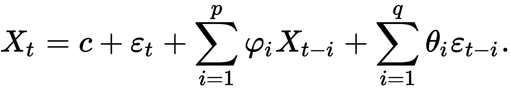

监督机器学习中的高级主题

在前一章节中跟随 scikit-learn、Keras 和 PyTorch 的尝试后，我们将进入更多端到端示例。这些示例更加先进，因为它们包括更复杂的转换和模型类型。

我们将使用 sklearn 预测伴侣选择，在这里我们会实现许多自定义转换步骤和更复杂的机器学习流程。然后，我们将在 PyTorch 中预测房价并可视化特征和神经元的重要性。之后，我们将执行主动学习来共同决定客户价值，并进行 sklearn 中的在线学习。在已知的多次违法者预测案例中，我们将建立一个没有种族偏见的模型。最后但同样重要的是，我们将预测 CO[2] 水平的时间序列。

**在线学习** 在这个上下文中（与基于互联网的学习相对），指的是一种包含顺序接收的训练数据的模型更新策略。这在数据集非常庞大（通常出现在图像、视频和文本中）或者由于数据变化的性质需要保持模型更新时非常有用。

在许多这些示例中，我们已经缩短了描述以突出特定概念的最显著细节。有关完整详情，请参阅 GitHub 上的笔记本。

在这一章中，我们将涵盖以下几个示例：

+   在 scikit-learn 中进行数据转换

+   使用 PyTorch 预测房价

+   实时决策客户价值

+   对抗算法偏见

+   预测 CO[2] 时间序列

# 技术要求

本章的代码和笔记本在 GitHub 上可供查阅：[`github.com/PacktPublishing/Artificial-Intelligence-with-Python-Cookbook/tree/master/chapter02`](https://github.com/PacktPublishing/Artificial-Intelligence-with-Python-Cookbook/tree/master/chapter02)

# 在 scikit-learn 中进行数据转换

在这个示例中，我们将使用混合类型的列式数据构建更复杂的管道。我们将使用由 Fisman 等人于 2006 年发布的速度约会数据集：[`doi.org/10.1162/qjec.2006.121.2.673`](https://doi.org/10.1162/qjec.2006.121.2.673)

或许这些示例将在多方面为我们提供信息，并且我们将了解到关于人类交配选择机制的一些有用机制。

在 OpenML 网站上的数据集描述如下：

这些数据是从 2002 年至 2004 年实验性速配活动的参与者中收集的。在活动中，与异性的每位参与者进行四分钟的**第一次约会**。在他们的 4 分钟结束时，参与者被问及是否愿意再见对方。他们还被要求评价约会对象的六个属性：吸引力、诚实、智力、趣味、野心和共同兴趣。数据集还包括在过程不同阶段收集的参与者问卷数据。这些字段包括人口统计信息、约会习惯、跨关键属性的自我感知、对伴侣所认为有价值的东西的信念以及生活方式信息。

问题是根据我们对参与者及其配对的了解来预测伴侣选择。这个数据集呈现了一些可以作为说明用途的挑战：

+   它包含 123 个不同类型的特征：

    +   分类

    +   数值

    +   范围特征

它还包括以下内容：

+   一些缺失值

+   目标不平衡

在解决预测伴侣选择问题的过程中，我们将在 scikit-learn 中构建自定义编码器和包含所有特征及其预处理步骤的管道。

本示例的主要焦点将放在管道和转换器上。特别是，我们将为处理范围特征构建一个自定义转换器，以及为数值特征构建另一个转换器。

## 准备工作

对于这个示例，我们将需要以下库：

+   OpenML 用于下载数据集

+   `openml_speed_dating_pipeline_steps` 用于使用我们的自定义转换器。

+   `imbalanced-learn` 用于处理不平衡的类别

+   `shap` 用于显示特征的重要性

为了安装它们，我们可以再次使用`pip`：

```py
pip install -q openml openml_speed_dating_pipeline_steps==0.5.5 imbalanced_learn category_encoders shap
```

OpenML 是一个旨在使数据科学和机器学习可复制的组织，因此更有利于研究。OpenML 网站不仅托管数据集，还允许将机器学习结果上传到公共排行榜，条件是实现必须完全依赖开源。有兴趣的任何人都可以查看这些结果及其详细获取方式。

为了检索数据，我们将使用 OpenML Python API。`get_dataset()` 方法将下载数据集；使用 `get_data()`，我们可以获取特征和目标的 pandas DataFrames，并且方便地获取分类和数值特征类型的信息：

```py
import openml
dataset = openml.datasets.get_dataset(40536)
X, y, categorical_indicator, _ = dataset.get_data(
  dataset_format='DataFrame',
  target=dataset.default_target_attribute
)
categorical_features = list(X.columns[categorical_indicator]) numeric_features = list(
  X.columns[[not(i) for i in categorical_indicator]]
)
```

在原始数据集的版本中，正如论文中所述，有很多工作要做。但是，在 OpenML 版本的数据集中，缺失值已表示为`numpy.nan`，这让我们可以跳过此转换。如果您感兴趣，可以在 GitHub 上查看此预处理器：[`github.com/benman1/OpenML-Speed-Dating`](https://github.com/benman1/OpenML-Speed-Dating)

或者，您可以使用来自 OpenML 数据集网页的下载链接，网址为[`www.openml.org/data/get_csv/13153954/speeddating.arff`](https://www.openml.org/data/get_csv/13153954/speeddating.arff)。

数据集加载完毕，并安装了库，我们已经准备好开始了。

## 如何做到…

管道是描述机器学习算法如何按顺序进行转换的一种方式，包括预处理步骤，然后应用最终预测器之前的原始数据集。我们将在本配方和本书中的其他概念示例中看到这些概念。

查看此数据集很快就会发现几个显著的特点。我们有很多分类特征。因此，在建模时，我们需要对它们进行数字编码，如第一章中的*Keras 中的建模和预测*配方中所述，*Python 人工智能入门*。

### 编码范围以数字形式显示

其中一些实际上是编码范围。这意味着这些是有序的序数类别；例如，`d_interests_correlate`特征包含如下字符串：

```py
[[0-0.33], [0.33-1], [-1-0]]
```

如果我们把这些范围视为分类变量，我们将失去有关顺序的信息，以及有关两个值之间差异的信息。但是，如果我们将它们转换为数字，我们将保留这些信息，并能够在其上应用其他数值转换。

我们将实现一个转换器插入到 sklearn 管道中，以便将这些范围特征转换为数值特征。转换的基本思想是提取这些范围的上限和下限，如下所示：

```py
def encode_ranges(range_str):
  splits = range_str[1:-1].split('-')
  range_max = splits[-1]
  range_min = '-'.join(splits[:-1])
  return range_min, range_max

examples = X['d_interests_correlate'].unique()
[encode_ranges(r) for r in examples]
```

我们将以示例为例：

```py
[('0', '0.33'), ('0.33', '1'), ('-1', '0')]
```

为了获得数字特征，我们可以取两个边界的平均值。正如我们之前提到的，在 OpenML 上，不仅显示结果，还透明显示模型。因此，如果我们要提交我们的模型，我们只能使用已发布的模块。我们在`pypi` Python 包存储库中创建了一个模块，并发布了它，您可以在此处找到完整代码包：[`pypi.org/project/openml-speed-dating-pipeline-steps/`](https://pypi.org/project/openml-speed-dating-pipeline-steps/)。

这里是`RangeTransformer`的简化代码：

```py
from sklearn.base import BaseEstimator, TransformerMixin
import category_encoders.utils as util

class RangeTransformer(BaseEstimator, TransformerMixin):
  def __init__(self, range_features=None, suffix='_range/mean', n_jobs=-1):
    assert isinstance(range_features, list) or range_features is None
    self.range_features = range_features
    self.suffix = suffix
    self.n_jobs = n_jobs

  def fit(self, X, y=None):
    return self

  def transform(self, X, y=None):
    X = util.convert_input(X)
    if self.range_features is None:
      self.range_features = list(X.columns)

    range_data = pd.DataFrame(index=X.index)
    for col in self.range_features:
      range_data[str(col) + self.suffix] = pd.to_numeric(
        self._vectorize(X[col])
      )
    self.feature_names = list(range_data.columns)
    return range_data

    def _vectorize(self, s):
        return Parallel(n_jobs=self.n_jobs)(
            delayed(self._encode_range)(x) for x in s
        )

    @staticmethod
    @lru_cache(maxsize=32)
    def _encode_range(range_str):
        splits = range_str[1:-1].split('-')
        range_max = float(splits[-1])
        range_min = float('-'.join(splits[:-1]))
        return sum([range_min, range_max]) / 2.0

    def get_feature_names(self):
        return self.feature_names
```

这是范围的自定义转换器的简短片段。请在 GitHub 上查看完整实现，网址为[`github.com/benman1/OpenML-Speed-Dating`](https://github.com/benman1/OpenML-Speed-Dating)。

请注意如何使用 `fit()` 和 `transform()` 方法。在 `fit()` 方法中，我们不需要做任何事情，因为我们总是应用相同的静态规则。`transform()` 方法应用这个规则。我们之前已经看过例子。在 `transform()` 方法中，我们会迭代列。这个转换器还展示了典型的 scikit-learn 并行化模式的使用。另外，由于这些范围经常重复，并且数量并不多，我们将使用缓存，以便不必进行昂贵的字符串转换，而是可以在处理完范围后从内存中检索范围值。

在 scikit-learn 中自定义转换器的一个重要事项是，它们应该继承自 `BaseEstimator` 和 `TransformerMixin`，并实现 `fit()` 和 `transform()` 方法。稍后，我们将需要 `get_feature_names()` 方法来获取生成特征的名称。

### 派生高阶特征

让我们实现另一个转换器。您可能已经注意到，我们有不同类型的特征，看起来涉及相同的个人属性：

+   个人偏好

+   自我评估

+   对另一个人的评估

似乎很明显，任何这些特征之间的差异可能是显著的，比如真诚的重要性与某人评估潜在伴侣的真诚程度之间的差异。因此，我们的下一个转换器将计算数值特征之间的差异，这有助于突出这些差异。

这些特征是从其他特征派生的，并结合了来自两个（或更多特征）的信息。让我们看看 `NumericDifferenceTransformer` 特征是什么样的：

```py
import operator

class NumericDifferenceTransformer(BaseEstimator, TransformerMixin):
    def __init__(self, features=None,
                 suffix='_numdist', op=operator.sub, n_jobs=-1
                 ):
        assert isinstance(
            features, list
        ) or features is None
        self.features = features
        self.suffix = suffix
        self.op = op
        self.n_jobs = n_jobs

    def fit(self, X, y=None):
        X = util.convert_input(X)
        if self.features is None:
            self.features = list(
                X.select_dtypes(include='number').columns
            )
        return self

    def _col_name(self, col1, col2):
        return str(col1) + '_' + str(col2) + self.suffix

    def _feature_pairs(self):
        feature_pairs = []
        for i, col1 in enumerate(self.features[:-1]):
            for col2 in self.features[i+1:]:
                feature_pairs.append((col1, col2))
        return feature_pairs

    def transform(self, X, y=None):
        X = util.convert_input(X)

        feature_pairs = self._feature_pairs()
        columns = Parallel(n_jobs=self.n_jobs)(
            delayed(self._col_name)(col1, col2)
            for col1, col2 in feature_pairs
        )
        data_cols = Parallel(n_jobs=self.n_jobs)(
            delayed(self.op)(X[col1], X[col2])
            for col1, col2 in feature_pairs
        )
        data = pd.concat(data_cols, axis=1)
        data.rename(
            columns={i: col for i, col in enumerate(columns)},
            inplace=True, copy=False
        )
        data.index = X.index
        return data

    def get_feature_names(self):
        return self.feature_names
```

这是一个自定义转换器，用于计算数值特征之间的差异。请参考 OpenML-Speed-Dating 库的完整实现，位于 [`github.com/benman1/OpenML-Speed-Dating`](https://github.com/benman1/OpenML-Speed-Dating)。

这个转换器与 `RangeTransformer` 结构非常相似。请注意列之间的并行化。`__init__()` 方法的一个参数是用于计算差异的函数，默认情况下是 `operator.sub()`。operator 库是 Python 标准库的一部分，它将基本运算符实现为函数。`sub()` 函数做的就是它听起来像：

```py
import operator
operator.sub(1, 2) == 1 - 2
# True
```

这为我们提供了标准操作符的前缀或功能语法。由于我们可以将函数作为参数传递，这使我们能够指定列之间的不同操作符。

这一次的 `fit()` 方法只是收集数值列的名称，我们将在 `transform()` 方法中使用这些名称。

### 结合转换

我们将使用 `ColumnTransformer` 和管道将这些转换器组合在一起。但是，我们需要将列与它们的转换关联起来。我们将定义不同的列组：

```py
range_cols = [
    col for col in X.select_dtypes(include='category')
    if X[col].apply(lambda x: x.startswith('[')
    if isinstance(x, str) else False).any()
]
cat_columns = list(
  set(X.select_dtypes(include='category').columns) - set(range_cols)
)
num_columns = list(
    X.select_dtypes(include='number').columns
)
```

现在我们有范围列、分类列和数值列，我们可以为它们分配管道步骤。

在我们的案例中，我们将其组合如下，首先是预处理器：

```py
from imblearn.ensemble import BalancedRandomForestClassifier
from sklearn.feature_selection import SelectKBest, f_classif
from sklearn.compose import ColumnTransformer
from sklearn.pipeline import Pipeline
from sklearn.preprocessing import FunctionTransformer
import category_encoders as ce
import openml_speed_dating_pipeline_steps as pipeline_steps

preprocessor = ColumnTransformer(
 transformers=[
 ('ranges', Pipeline(steps=[
 ('impute', pipeline_steps.SimpleImputerWithFeatureNames(strategy='constant', fill_value=-1)),
 ('encode', pipeline_steps.RangeTransformer())
 ]), range_cols),
 ('cat', Pipeline(steps=[
 ('impute', pipeline_steps.SimpleImputerWithFeatureNames(strategy='constant', fill_value='-1')),
 ('encode', ce.OneHotEncoder(
 cols=None, # all features that it given by ColumnTransformer
 handle_unknown='ignore',
 use_cat_names=True
 )
 )
 ]), cat_columns),
 ('num', pipeline_steps.SimpleImputerWithFeatureNames(strategy='median'), num_columns),
 ],
 remainder='drop', n_jobs=-1
)
```

然后，我们将预处理放入管道中，与估算器一起：

```py
def create_model(n_estimators=100):
    return Pipeline(
        steps=[('preprocessor', preprocessor),
               ('numeric_differences', pipeline_steps.NumericDifferenceTransformer()),
               ('feature_selection', SelectKBest(f_classif, k=20)),
               ('rf', BalancedRandomForestClassifier(
                  n_estimators=n_estimators,
                  )
               )]
       )
```

这里是测试集的表现：

```py
from sklearn.metrics import roc_auc_score, confusion_matrix
from sklearn.model_selection import train_test_split

X_train, X_test, y_train, y_test = train_test_split(
  X, y,
  test_size=0.33,
  random_state=42,
  stratify=y
)
clf = create_model(50)
clf.fit(X_train, y_train)
y_predicted = clf.predict(X_test)
auc = roc_auc_score(y_test, y_predicted)
print('auc: {:.3f}'.format(auc))
```

我们得到以下性能作为输出：

```py
auc: 0.779
```

这是一个非常好的性能，您可以将其与 OpenML 排行榜进行比较看到。

## 它是如何工作的…

现在是时候解释与此配方相关的基本 scikit-learn 术语了。这两个概念都不对应现有的机器学习算法，而是可组合的模块：

+   转换器（在 scikit-learn 中）：从 `sklearn.base.TransformerMixin` 派生的类；它具有 `fit()` 和 `transform()` 方法。这些涉及预处理步骤或特征选择。

+   预测器：从 `sklearn.base.ClassifierMixin` 或 `sklearn.base.RegressorMixin` 派生的类；它具有 `fit()` 和 `predict()` 方法。这些是机器学习估计器，换句话说，分类器或回归器。

+   管道：一个接口，将所有步骤包装在一起，并为转换的所有步骤和结果估计器提供单一接口。管道再次具有 `fit()` 和 `predict()` 方法。

有几点需要指出关于我们的方法。正如我们之前所说，我们有缺失值，因此必须用其他值填充（意思是替换）缺失值。在这种情况下，我们用 -1 替换缺失值。对于分类变量来说，这将成为一个新类别，而对于数值变量来说，这将成为分类器必须处理的特殊值。

`ColumnTransformer` 是 scikit-learn 版本 0.20 中引入的一个期待已久的功能。从那时起，`ColumnTransformer` 经常可以像这样看到，例如：

```py
from sklearn.compose import ColumnTransformer, make_column_transformer
from sklearn.preprocessing import StandardScaler, OneHotEncoder

feature_preprocessing = make_column_transformer(
  (StandardScaler(), ['column1', 'column2']),
  (OneHotEncoder(), ['column3', 'column4', 'column5']) 
)
```

`feature_preprocessing` 可以像往常一样使用 `fit()`、`transform()` 和 `fit_transform()` 方法：

```py
processed_features = feature_preprocessing.fit_transform(X)

```

这里，`X` 意味着我们的特征。

或者，我们可以像这样将 `ColumnTransformer` 作为管道的一步：

```py
from sklearn.pipeline import make_pipeline
from sklearn.linear_model import LogisticRegression

make_pipeline(
    feature_preprocessing,
    LogisticRegression()
)
```

我们的分类器是修改版的随机森林分类器。随机森林是一组决策树，每棵树都在训练数据的随机子集上进行训练。平衡的随机森林分类器（Chen *等人*：[`statistics.berkeley.edu/sites/default/files/tech-reports/666.pdf`](https://statistics.berkeley.edu/sites/default/files/tech-reports/666.pdf)）确保每个随机子集在两个类别之间平衡。

由于 `NumericDifferenceTransformer` 可以提供大量特征，我们将增加一步基于模型的特征选择。

## 还有更多内容…

您可以在 GitHub 上的`openml_speed_dating_pipeline_steps`库和笔记本中查看使用速配数据集、几个自定义转换器和扩展填充类的完整示例，链接如下：[`github.com/PacktPublishing/Artificial-Intelligence-with-Python-Cookbook/blob/master/chapter02/Transforming%20Data%20in%20Scikit-Learn.ipynb`](https://github.com/PacktPublishing/Artificial-Intelligence-with-Python-Cookbook/blob/master/chapter02/Transforming%20Data%20in%20Scikit-Learn.ipynb)。

`RangeTransformer` 和 `NumericDifferenceTransformer` 也可以使用 scikit-learn 中的 `FunctionTransformer` 实现。

`ColumnTransformer` 对于 pandas DataFrames 或 NumPy 数组特别方便，因为它允许为不同特征子集指定不同操作。然而，另一个选项是 `FeatureUnion`，它允许将来自不同转换的结果连接在一起。要了解另一种方法如何将我们的操作链在一起，请查看我们存储库中的 `PandasPicker`。

## 另请参阅

在此食谱中，我们使用 ANOVA F 值进行单变量特征选择，这相对简单但有效。单变量特征选择方法通常是简单的过滤器或统计测试，用于衡量特征与目标的相关性。然而，有许多不同的特征选择方法，scikit-learn 实现了很多：[`scikit-learn.org/stable/modules/feature_selection.html`](https://scikit-learn.org/stable/modules/feature_selection.html)。

# 在 PyTorch 中预测房价

在这个食谱中，问题的目标是预测艾奥瓦州埃姆斯的房价，给定描述房屋、区域、土地、基础设施、公用设施等 81 个特征。埃姆斯数据集具有良好的分类和连续特征组合，适量适度，并且最重要的是，不像其他类似数据集（例如波士顿房价数据集）那样受潜在的红线问题或数据输入问题的困扰。我们将在此处集中讨论 PyTorch 建模的主要方面。我们将进行在线学习，类似于 Keras，在第一章中的*Keras 中的建模和预测*食谱中。如果您想查看某些步骤的更多详细信息，请查看我们在 GitHub 上的笔记本。

作为一个额外的内容，我们还将演示在 PyTorch 中开发的模型的神经元重要性。您可以在 PyTorch 中尝试不同的网络架构或模型类型。这个食谱的重点是方法论，而不是对最佳解决方案的详尽搜索。

## 准备工作

为了准备这个食谱，我们需要做一些准备工作。我们将像之前的食谱一样下载数据，*在 scikit-learn 中转换数据*，并按以下步骤进行一些预处理：

```py
from sklearn.datasets import fetch_openml
data = fetch_openml(data_id=42165, as_frame=True)

```

您可以在 OpenML 上查看完整的数据集描述：[`www.openml.org/d/42165`](https://www.openml.org/d/42165)。

让我们看看这些特征：

```py
import pandas as pd
data_ames = pd.DataFrame(data.data, columns=data.feature_names)
data_ames['SalePrice'] = data.target
data_ames.info()
```

这是 DataFrame 的信息：

```py
<class 'pandas.core.frame.DataFrame'>
RangeIndex: 1460 entries, 0 to 1459
Data columns (total 81 columns):
Id               1460 non-null float64
MSSubClass       1460 non-null float64
MSZoning         1460 non-null object
LotFrontage      1201 non-null float64
LotArea          1460 non-null float64
Street           1460 non-null object
Alley            91 non-null object
LotShape         1460 non-null object
LandContour      1460 non-null object
Utilities        1460 non-null object
LotConfig        1460 non-null object
LandSlope        1460 non-null object
Neighborhood     1460 non-null object
Condition1       1460 non-null object
Condition2       1460 non-null object
BldgType         1460 non-null object
HouseStyle       1460 non-null object
OverallQual      1460 non-null float64
OverallCond      1460 non-null float64
YearBuilt        1460 non-null float64
YearRemodAdd     1460 non-null float64
RoofStyle        1460 non-null object
RoofMatl         1460 non-null object
Exterior1st      1460 non-null object
Exterior2nd      1460 non-null object
MasVnrType       1452 non-null object
MasVnrArea       1452 non-null float64
ExterQual        1460 non-null object
ExterCond        1460 non-null object
Foundation       1460 non-null object
BsmtQual         1423 non-null object
BsmtCond         1423 non-null object
BsmtExposure     1422 non-null object
BsmtFinType1     1423 non-null object
BsmtFinSF1       1460 non-null float64
BsmtFinType2     1422 non-null object
BsmtFinSF2       1460 non-null float64
BsmtUnfSF        1460 non-null float64
TotalBsmtSF      1460 non-null float64
Heating          1460 non-null object
HeatingQC        1460 non-null object
CentralAir       1460 non-null object
Electrical       1459 non-null object
1stFlrSF         1460 non-null float64
2ndFlrSF         1460 non-null float64
LowQualFinSF     1460 non-null float64
GrLivArea        1460 non-null float64
BsmtFullBath     1460 non-null float64
BsmtHalfBath     1460 non-null float64
FullBath         1460 non-null float64
HalfBath         1460 non-null float64
BedroomAbvGr     1460 non-null float64
KitchenAbvGr     1460 non-null float64
KitchenQual      1460 non-null object
TotRmsAbvGrd     1460 non-null float64
Functional       1460 non-null object
Fireplaces       1460 non-null float64
FireplaceQu      770 non-null object
GarageType       1379 non-null object
GarageYrBlt      1379 non-null float64
GarageFinish     1379 non-null object
GarageCars       1460 non-null float64
GarageArea       1460 non-null float64
GarageQual       1379 non-null object
GarageCond       1379 non-null object
PavedDrive       1460 non-null object
WoodDeckSF       1460 non-null float64
OpenPorchSF      1460 non-null float64
EnclosedPorch    1460 non-null float64
3SsnPorch        1460 non-null float64
ScreenPorch      1460 non-null float64
PoolArea         1460 non-null float64
PoolQC           7 non-null object
Fence            281 non-null object
MiscFeature      54 non-null object
MiscVal          1460 non-null float64
MoSold           1460 non-null float64
YrSold           1460 non-null float64
SaleType         1460 non-null object
SaleCondition    1460 non-null object
SalePrice        1460 non-null float64
dtypes: float64(38), object(43)
memory usage: 924.0+ KB
```

在 Colab 中，默认安装了 PyTorch 和 seaborn。我们假设，即使您现在使用自己托管的安装工作，也会安装这些库。

不过，我们还会使用一个库，`captum`，它允许检查 PyTorch 模型的特征和神经元重要性：

```py
!pip install captum
```

还有一件事。我们假设您的计算机有 GPU。如果您的计算机没有 GPU，我们建议您在 Colab 上尝试此方法。在 Colab 中，您需要选择一个带 GPU 的运行时类型。

在所有这些准备工作之后，让我们看看如何预测房屋价格。

## 如何做到...

Ames 房屋数据集是一个小到中等规模的数据集（1,460 行），包含 81 个特征，既包括分类特征又包括数值特征。没有缺失值。

在之前的 Keras 配方中，我们已经看到了如何缩放变量。在这里缩放很重要，因为所有变量具有不同的尺度。分类变量需要转换为数值类型，以便将它们输入到我们的模型中。我们可以选择独热编码，其中我们为每个分类因子创建虚拟变量，或者序数编码，其中我们对所有因子进行编号，并用这些编号替换字符串。我们可以像处理任何其他浮点变量一样输入虚拟变量，而序数编码则需要使用嵌入，线性神经网络投影，重新排列多维空间中的类别。

我们选择嵌入路线：

```py
import numpy as np
from category_encoders.ordinal import OrdinalEncoder
from sklearn.preprocessing import StandardScaler

num_cols = list(data_ames.select_dtypes(include='float'))
cat_cols = list(data_ames.select_dtypes(include='object'))

ordinal_encoder = OrdinalEncoder().fit(
    data_ames[cat_cols]
)
standard_scaler = StandardScaler().fit(
    data_ames[num_cols]
)

X = pd.DataFrame(
    data=np.column_stack([
        ordinal_encoder.transform(data_ames[cat_cols]),
        standard_scaler.transform(data_ames[num_cols])
    ]),
    columns=cat_cols + num_cols
)
```

我们在 GitHub 上的笔记本中更详细地进行数据分析，例如相关性和分布图。

现在，我们可以将数据分割为训练集和测试集，就像我们在之前的示例中所做的那样。在这里，我们还添加了一个数值变量的分层。这确保了不同部分（五个部分）在训练集和测试集中的等量包含：

```py
np.random.seed(12)  
from sklearn.model_selection import train_test_split

bins = 5
sale_price_bins = pd.qcut(
    X['SalePrice'], q=bins, labels=list(range(bins))
)
X_train, X_test, y_train, y_test = train_test_split(
    X.drop(columns='SalePrice'),
    X['SalePrice'],
    random_state=12,
    stratify=sale_price_bins
)
```

在继续之前，让我们使用一个与模型无关的技术来查看特征的重要性。

然而，在运行任何东西之前，让我们确保我们在 GPU 上运行：

```py
device = torch.device('cuda')
torch.backends.cudnn.benchmark = True
```

让我们构建我们的 PyTorch 模型，类似于《Python 中的人工智能入门》第一章中的 *在 scikit-learn、Keras 和 PyTorch 中分类* 的配方。

我们将使用 PyTorch 实现一个带批量输入的神经网络回归。这将涉及以下步骤：

1.  将数据转换为 torch 张量：

1.  定义模型架构：

1.  定义损失标准和优化器：

1.  创建批量数据加载器：

1.  运行训练：

没有进一步的序言，让我们开始吧：

1.  将数据转换为 torch 张量：

```py
from torch.autograd import Variable 

num_features = list(
    set(num_cols) - set(['SalePrice', 'Id'])
)
X_train_num_pt = Variable(
    torch.cuda.FloatTensor(
        X_train[num_features].values
    )
)
X_train_cat_pt = Variable(
    torch.cuda.LongTensor(
        X_train[cat_cols].values
    )
)
y_train_pt = Variable(
    torch.cuda.FloatTensor(y_train.values)
).view(-1, 1)
X_test_num_pt = Variable(
    torch.cuda.FloatTensor(
        X_test[num_features].values
    )
)
X_test_cat_pt = Variable(
   torch.cuda.LongTensor(
        X_test[cat_cols].values
    ).long()
)
y_test_pt = Variable(
    torch.cuda.FloatTensor(y_test.values)
).view(-1, 1)
```

这确保我们将数值和分类数据加载到不同的变量中，类似于 NumPy。如果在单个变量（数组/矩阵）中混合数据类型，它们将变成对象。我们希望将数值变量作为浮点数加载，并将分类变量作为长整型（或整型）索引类别。我们还要将训练集和测试集分开。

显然，ID 变量在模型中不应该很重要。在最坏的情况下，如果 ID 与目标变量有任何相关性，它可能会引入目标泄漏。因此，我们已经将其从进一步处理中移除。

1.  定义模型架构：

```py
class RegressionModel(torch.nn.Module): 

    def __init__(self, X, num_cols, cat_cols, device=torch.device('cuda'), embed_dim=2, hidden_layer_dim=2, p=0.5): 
        super(RegressionModel, self).__init__() 
        self.num_cols = num_cols
        self.cat_cols = cat_cols
        self.embed_dim = embed_dim
        self.hidden_layer_dim = hidden_layer_dim

        self.embeddings = [
            torch.nn.Embedding(
                num_embeddings=len(X[col].unique()),
                embedding_dim=embed_dim
            ).to(device)
            for col in cat_cols
        ]
        hidden_dim = len(num_cols) + len(cat_cols) * embed_dim,

        # hidden layer
        self.hidden = torch.nn.Linear(torch.IntTensor(hidden_dim), hidden_layer_dim).to(device)
        self.dropout_layer = torch.nn.Dropout(p=p).to(device)
        self.hidden_act = torch.nn.ReLU().to(device)

        # output layer
        self.output = torch.nn.Linear(hidden_layer_dim, 1).to(device)

    def forward(self, num_inputs, cat_inputs):
        '''Forward method with two input variables -
        numeric and categorical.
        '''
        cat_x = [
            torch.squeeze(embed(cat_inputs[:, i] - 1))
            for i, embed in enumerate(self.embeddings)
        ]
        x = torch.cat(cat_x + [num_inputs], dim=1)
        x = self.hidden(x)
        x = self.dropout_layer(x)
        x = self.hidden_act(x)
        y_pred = self.output(x)
        return y_pred

house_model = RegressionModel(
    data_ames, num_features, cat_cols
)
```

我们在两个线性层（Keras 术语中的密集层）上使用的激活函数是**修正线性单元激活**（**ReLU**）函数。请注意，由于在分类和数值类型上发生了不同的操作，我们不能轻松地将相同的架构封装为顺序模型。

1.  接下来，定义损失标准和优化器。我们以**均方误差**（**MSE**）作为损失函数，使用随机梯度下降作为优化算法：

```py
criterion = torch.nn.MSELoss().to(device)
optimizer = torch.optim.SGD(house_model.parameters(), lr=0.001)
```

1.  现在，创建一个数据加载器以一次输入一个数据批次：

```py
data_batch = torch.utils.data.TensorDataset(
    X_train_num_pt, X_train_cat_pt, y_train_pt
)
dataloader = torch.utils.data.DataLoader(
    data_batch, batch_size=10, shuffle=True
)
```

我们设置批量大小为 10。现在我们可以进行训练。

1.  开始训练！

由于这似乎比我们在《Python 人工智能入门第一章中看到的 Keras 中的分类》一书中的示例要冗长得多，我们对此代码进行了详细的注释。基本上，我们必须在每个 epoch 上进行循环，并在每个 epoch 内执行推断、计算误差，并根据误差应用优化器进行调整。

这是没有内部训练循环的 epoch 循环：

```py
from tqdm.notebook import trange

train_losses, test_losses = [], []
n_epochs = 30
for epoch in trange(n_epochs):
    train_loss, test_loss = 0, 0
    # training code will go here:
    # <...>

    # print the errors in training and test:
    if epoch % 10 == 0 :
        print(
            'Epoch: {}/{}\t'.format(epoch, 1000),
            'Training Loss: {:.3f}\t'.format(
                train_loss / len(dataloader)
            ),
            'Test Loss: {:.3f}'.format(
                test_loss / len(dataloader)
            )
        )
```

训练是在所有训练数据的批次循环内执行的。它看起来如下所示：

```py
    for (x_train_num_batch,
         x_train_cat_batch,
         y_train_batch) in dataloader:
        # predict y by passing x to the model 
        (x_train_num_batch,
         x_train_cat_batch, y_train_batch) = (
                x_train_num_batch.to(device),
                x_train_cat_batch.to(device),
                y_train_batch.to(device)
        )
        pred_ytrain = house_model.forward(
            x_train_num_batch, x_train_cat_batch
        )
        # calculate and print loss:
        loss = torch.sqrt(
            criterion(pred_ytrain, y_train_batch)
        ) 

        # zero gradients, perform a backward pass, 
        # and update the weights. 
        optimizer.zero_grad() 
        loss.backward() 
        optimizer.step()
        train_loss += loss.item()
        with torch.no_grad():
            house_model.eval()
            pred_ytest = house_model.forward(
                X_test_num_pt, X_test_cat_pt
            )
            test_loss += torch.sqrt(
                criterion(pred_ytest, y_test_pt)
            )

        train_losses.append(train_loss / len(dataloader))
        test_losses.append(test_loss / len(dataloader))
```

这是我们得到的输出。TQDM 为我们提供了一个有用的进度条。在每个第十个 epoch，我们打印一个更新，显示训练和验证性能：


请注意，我们对`nn.MSELoss`取平方根，因为 PyTorch 中的`nn.MSELoss`定义如下：

```py
((input-target)**2).mean()
```

让我们绘制模型在训练和验证数据集上的表现情况：

```py
plt.plot(
    np.array(train_losses).reshape((n_epochs, -1)).mean(axis=1),
    label='Training loss'
)
plt.plot(
    np.array(test_losses).reshape((n_epochs, -1)).mean(axis=1),
    label='Validation loss'
)
plt.legend(frameon=False)
plt.xlabel('epochs')
plt.ylabel('MSE')
```

以下图表显示了结果绘图：


我们在验证损失停止减少之前及时停止了训练。

我们还可以对目标变量进行排名和分箱，并将预测结果绘制在其上，以便查看模型在整个房价范围内的表现。这是为了避免在回归中出现的情况，特别是当损失函数为 MSE 时，只能在接近均值的中等价值范围内进行良好预测，而对其他任何值都表现不佳。您可以在 GitHub 笔记本中找到此代码。这称为提升图表（这里有 10 个分箱）：


我们可以看到，事实上，模型在整个房价范围内都预测得非常接近。事实上，我们得到了约 93% 的斯皮尔曼等级相关性，非常显著，这证实了这个模型具有很高的准确性。

## 如何运作...

深度学习神经网络框架使用不同的优化算法。其中流行的有**随机梯度下降**（**SGD**）、**均方根传播**（**RMSProp**）和**自适应矩估计**（**ADAM**）。

我们将随机梯度下降定义为我们的优化算法。或者，我们也可以定义其他优化器：

```py
opt_SGD = torch.optim.SGD(net_SGD.parameters(), lr=LR)
opt_Momentum = torch.optim.SGD(net_Momentum.parameters(), lr=LR, momentum=0.6)
opt_RMSprop = torch.optim.RMSprop(net_RMSprop.parameters(), lr=LR, alpha=0.1)
opt_Adam = torch.optim.Adam(net_Adam.parameters(), lr=LR, betas=(0.8, 0.98))
```

SGD 与梯度下降的工作方式相同，只是每次只对单个示例进行操作。有趣的是，其收敛性类似于梯度下降，并且对计算机内存的要求更低。

RMSProp 的工作原理是根据梯度的符号来调整算法的学习率。最简单的变体检查最后两个梯度的符号，然后根据它们是否相同增加或减少学习率的一小部分。

ADAM 是最流行的优化器之一。它是一种自适应学习算法，根据梯度的一阶和二阶矩来调整学习率。

Captum 是一个工具，可以帮助我们理解在数据集上学习的神经网络模型的细枝末节。它可以协助学习以下内容：

+   特征重要性

+   层重要性

+   神经元重要性

这在学习可解释神经网络中非常重要。在这里，使用了集成梯度来理解特征重要性。后来，还通过使用层导纳方法展示了神经元的重要性。

## 还有更多...

鉴于我们已经定义并训练了神经网络，让我们使用 captum 库找出重要的特征和神经元：

```py
from captum.attr import (
    IntegratedGradients,
    LayerConductance,
    NeuronConductance
)
house_model.cpu()
for embedding in house_model.embeddings:
    embedding.cpu()

house_model.cpu()
ing_house = IntegratedGradients(forward_func=house_model.forward, )
#X_test_cat_pt.requires_grad_()
X_test_num_pt.requires_grad_()
attr, delta = ing_house.attribute(
 X_test_num_pt.cpu(),
 target=None,
 return_convergence_delta=True,
 additional_forward_args=X_test_cat_pt.cpu()
)
attr = attr.detach().numpy()
```

现在，我们有一个特征重要性的 NumPy 数组。

也可以使用这个工具获取层和神经元的重要性。让我们看看我们第一层神经元的重要性。我们可以传递 `house_model.act1`，这是第一线性层上的 ReLU 激活函数：

```py
cond_layer1 = LayerConductance(house_model, house_model.act1)
cond_vals = cond_layer1.attribute(X_test, target=None)
cond_vals = cond_vals.detach().numpy()
df_neuron = pd.DataFrame(data = np.mean(cond_vals, axis=0), columns=['Neuron Importance'])
df_neuron['Neuron'] = range(10)
```

它看起来是这样的：


图表显示神经元的重要性。显然，有一个神经元并不重要。

我们还可以通过对我们之前获得的 NumPy 数组进行排序来查看最重要的变量：

```py
df_feat = pd.DataFrame(np.mean(attr, axis=0), columns=['feature importance'] )
df_feat['features'] = num_features
df_feat.sort_values(
    by='feature importance', ascending=False
).head(10)
```

这里是最重要的 10 个变量的列表：


特征重要性通常有助于我们理解模型，并且剪枝模型以使其变得不那么复杂（希望也不那么过拟合）。

## 另见

PyTorch 文档包含了关于层类型、数据加载、损失、度量和训练的一切信息：[`pytorch.org/docs/stable/nn.html`](https://pytorch.org/docs/stable/nn.html)

有关优化算法的详细讨论可以在以下文章中找到：[`imaddabbura.github.io/post/gradient-descent-algorithm/`](https://imaddabbura.github.io/post/gradient-descent-algorithm/)。Geoffrey Hinton 和其他人在演示幻灯片中详细解释了小批量梯度下降：[`www.cs.toronto.edu/~tijmen/csc321/slides/lecture_slides_lec6.pdf`](https://www.cs.toronto.edu/~tijmen/csc321/slides/lecture_slides_lec6.pdf)。最后，您可以在介绍它的文章中找到有关 ADAM 的所有细节：[`arxiv.org/abs/1412.6980`](https://arxiv.org/abs/1412.6980)。

Captum 为 PyTorch 模型的可解释性和模型检查提供了丰富的功能。您可以在其详尽的文档中找到更多信息：[`captum.ai/`](https://captum.ai/)。详细信息可以在原始论文中找到：[`arxiv.org/pdf/1703.01365.pdf`](https://arxiv.org/pdf/1703.01365.pdf)。

# 实时决策客户价值

假设我们有以下情景：我们有一份顾客名单，需要给他们打电话来销售我们的产品。每次电话都需要支付呼叫中心人员的工资，因此我们希望尽可能地减少这些成本。我们对每个顾客都有一些信息，这些信息可以帮助我们确定他们是否有可能购买。每次通话后，我们可以更新我们的模型。主要目标是只打给最有潜力的顾客，并提高我们对哪些顾客更可能购买我们产品的洞察力。

在这个配方中，我们将采用主动学习的方法，这是一种策略，我们可以主动决定接下来要探索（和学习）什么。我们的模型将帮助决定打给谁。因为我们将在每次查询（电话）后更新我们的模型，所以我们将使用在线学习模型。

## 准备工作

我们将通过下载数据集和安装几个库来准备我们的配方。

再次，我们将从 OpenML 获取数据：

```py
!pip install -q openml

import openml 
dataset = openml.datasets.get_dataset(1461)
X, y, categorical_indicator, _ = dataset.get_data(
  dataset_format='DataFrame',
  target=dataset.default_target_attribute
)
categorical_features = X.columns[categorical_indicator]
numeric_features = X.columns[
  [not(i) for i in categorical_indicator]
]
```

这个数据集被称为`bank-marketing`，您可以在 OpenML 上查看其描述：[`www.openml.org/d/1461`](https://www.openml.org/d/1461)。

对于每一行，描述一个人，我们有不同的特征，数值和分类的，告诉我们关于人口统计和顾客历史的信息。

为了模拟顾客签署我们的产品的可能性，我们将使用专门用于在线模型的 scikit-multiflow 包。我们还将再次使用`category_encoders`包：

```py
!pip install scikit-multiflow category_encoders
```

有了这两个库，我们可以开始这个配方了。

## 如何做…

我们需要实现一个探索策略和一个正在不断更新的模型。我们正在使用在线版本的随机森林，Hoeffding Tree，作为我们的模型。我们正在估计每一步的不确定性，并基于此返回下一个要呼叫的候选人。

与往常一样，我们需要定义一些预处理步骤：

```py
from sklearn.compose import ColumnTransformer
from sklearn.preprocessing import FunctionTransformer
import category_encoders as ce

ordinal_encoder = ce.OrdinalEncoder(
  cols=None,  # all features that it encounters
  handle_missing='return_nan',
  handle_unknown='ignore'
).fit(X)

preprocessor = ColumnTransformer(
  transformers=[
    ('cat', ordinal_encoder, categorical_features),
    ('num', FunctionTransformer(validate=False), numeric_features)
])
preprocessor = preprocessor.fit(X)
```

然后我们来到我们的主动学习方法本身。这受到了`modAL.models.ActiveLearner`的启发：

```py
import numpy as np
from skmultiflow.trees.hoeffding_tree import HoeffdingTreeClassifier 
from sklearn.metrics import roc_auc_score
import random

class ActivePipeline:
  def __init__(self, model, preprocessor, class_weights):
    self.model = model
    self.preprocessor = preprocessor
    self.class_weights = class_weights

  @staticmethod
  def values(X):
    if isinstance(X, (np.ndarray, np.int64)):
      return X
    else:
      return X.values

  def preprocess(self, X):
    X_ = pd.DataFrame(
      data=self.values(X),
      columns=[
        'V1', 'V2', 'V3', 'V4',
        'V5', 'V6', 'V7', 'V8',
        'V9', 'V10', 'V11', 'V12',
        'V13', 'V14', 'V15', 'V16'
      ])
    return self.preprocessor.transform(X_)

  def fit(self, X, ys):
    weights = [self.class_weights[y] for y in ys]
    self.model.fit(self.preprocess(X), self.values(ys))

  def update(self, X, ys):
    if isinstance(ys, (int, float)):
      weight = self.class_weights[y]
    else:
      weight = [self.class_weights[y] for y in ys]

    self.model.partial_fit(
      self.preprocess(X),
      self.values(ys),
      weight
    )

  def predict(self, X):
    return self.model.predict(
      self.preprocess(X)
    )

  def predict_proba(self, X):
    return self.model.predict_proba(
      self.preprocess(X)
    )

  @staticmethod
  def entropy(preds):
    return -np.sum(
      np.log((preds + 1e-15) * preds)
      / np.log(np.prod(preds.size))
    )

  def max_margin_uncertainty(self, X, method: str='entropy',
      exploitation: float=0.9, favor_class: int=1, k: int=1
  ):
    '''similar to modAL.uncertainty.margin_uncertainty
    ''' 
    probs = self.predict_proba(X)
    if method=='margin':
      uncertainties = np.abs(probs[:,2] - probs[:, 1]) / 2.0
    elif method=='entropy':
      uncertainties = np.apply_along_axis(self.entropy, 1, probs[:, (1,2)])
    else: raise(ValueError('method not implemented!'))

    if favor_class is None:
      weights = uncertainties 
    else: weights = (1.0 - exploitation) * uncertainties + exploitation * probs[:, favor_class]

    if self.sampling:
      ind = random.choices(
        range(len(uncertainties)), weights, k=k
      )
    else:
      ind = np.argsort(weights, axis=0)[::-1][:k]
    return ind, np.mean(uncertainties[ind])

  def score(self, X, y, scale=True):
    probs = self.predict_proba(X, probability=2)
    if scale:
      probs = np.clip(probs - np.mean(probs) + 0.5, 0, 1)
    return roc_auc_score(y, probs)
```

同样地，我们创建了一个与 scikit-learn 兼容的类。它基本上保存了一个机器学习模型和一个数据预处理器。我们实现了`fit()`和`predict()`，还有`score()`来获取模型的性能。我们还实现了一个`update()`方法，调用机器学习模型的`partial_fit()`。调用`partial_fit()`而不是`fit()`大大加快了计算速度，因为我们不必每次获取新数据时都从头开始。

创建主动学习管道的方法如下：

```py
active_pipeline = ActivePipeline(
  HoeffdingTreeClassifier(),
  preprocessor,
  class_weights.to_dict()
)
active_pipeline.model.classes = [0, 1, 2]
```

我们可以使用这个设置在我们的数据集上运行不同的模拟。例如，我们可以比较大量实验（0.5 开发利用）与仅开发利用（1.0），或者在第一批之后根本不学习。基本上我们通过一个循环进行：

+   通过`active_pipeline.max_margin_uncertainty()`，我们向主动管道呈现数据，并根据我们集成方法的偏好获取不确定性和目标预测的数据点数量。

+   一旦我们获得这些数据点的实际结果，我们就可以更新我们的模型：`active_pipeline.update()`。

您可以在 GitHub 的笔记本中看到一个例子。

我们可以看到，在几个示例之后，好奇心获胜。实际上，开发利用是最不成功的方案。通过不更新模型，性能随时间而恶化：


这是主动学习或强化学习的理想场景，因为，与强化学习类似，不确定性可以成为除了客户正面期望外的附加标准。随着模型对客户理解的提升，随时间减少这种熵寻求行为。

## 工作原理如下…

值得深入探讨这个配方中使用的一些概念和策略。

### 主动学习

主动学习意味着我们可以积极查询更多信息；换句话说，探索是我们策略的一部分。在我们必须主动决定学习什么以及我们学到了什么不仅影响我们的模型学习量和质量，还影响我们可以获得的投资回报的场景中，这是非常有用的。

### 霍夫丁树

霍夫丁树（也称为*非常快速决策树*，简称*VFDT*）由 Geoff Hulten 等人于 2001 年引入（*挖掘时间变化数据流*）。它是一个增量增长的用于数据流的决策树。树节点基于霍夫丁边界（或加法切尔诺夫边界）进行扩展。理论上已经证明，给定足够的训练数据，由霍夫丁树学习的模型与非增量学习者构建的模型非常接近。

霍夫丁边界定义如下：


需要注意的是，霍夫丁树不处理随时间变化的数据分布。

### 类加权

由于我们处理的是不平衡数据集，让我们使用类权重。这基本上意味着我们在少数类（注册）上采样，而在多数类（未注册）上进行下采样。

类权重的公式如下：


同样，在 Python 中，我们可以编写以下内容：

```py
class_weights = len(X) / (y.astype(int).value_counts() * 2)
```

然后我们可以使用这些类权重进行抽样。

我们将以几个额外的指针来结束本文。

## 另见

只有少数几个 scikit-learn 模型允许增量或在线学习。请参考[`scikit-learn.org/stable/modules/computing.html`](https://scikit-learn.org/stable/modules/computing.html)上的列表。

几个线性模型包括`partial_fit()`方法。scikit-multiflow 库专门用于增量和在线/流模型：[`scikit-multiflow.github.io/`](https://scikit-multiflow.github.io/)

您可以从最近关注生物医学图像处理的综述中找到更多关于主动学习的资源和想法（Samuel Budd 等人，*关于医学图像分析的主动学习和人机协同深度学习的调查*，2019 年；[`arxiv.org/abs/1910.02923`](https://arxiv.org/abs/1910.02923)）。

我们的方法受到 modalAI Python 主动学习包的启发，您可以在[`modal-python.readthedocs.io/`](https://modal-python.readthedocs.io/)找到它。如果您对主动学习方法感兴趣，我们建议您查看。还有一些其他 Python 包可供选择：

+   Alipy：Python 中的主动学习：[`parnec.nuaa.edu.cn/huangsj/alipy/`](http://parnec.nuaa.edu.cn/huangsj/alipy/)

+   主动学习：关于主动学习的 Google 仓库：[`github.com/google/active-learning`](https://github.com/google/active-learning)

主动学习中的主要决策之一是探索与利用之间的权衡。您可以在一篇名为*主动学习中的探索与利用：贝叶斯方法*的论文中找到更多信息：[`www.vincentlemaire-labs.fr/publis/ijcnn_2_2010_camera_ready.pdf`](http://www.vincentlemaire-labs.fr/publis/ijcnn_2_2010_camera_ready.pdf)

# 对抗算法偏见

**替代制裁的矫正罪犯管理剖析系统**（**COMPAS**）是一种商业算法，根据犯罪案件记录为刑事被告分配风险分数。该风险分数对应于再犯（累犯）和犯下暴力犯罪的可能性，并且此分数用于法庭上帮助确定判决。ProPublica 组织在佛罗里达州的一个县获得了约 7,000 人的分数和数据。等待 2 年后，他们审计了 2016 年的 COMPAS 模型，并发现了模型存在非常令人担忧的问题。ProPublica 的发现之一是在性别、种族和族裔方面存在歧视问题，特别是在对少数民族过度预测累犯率的情况下。

歧视对 AI 系统构成重大问题，说明了审核模型及其输入数据的重要性。如果忽视了这种偏见，基于人类决策建立的模型将放大人类偏见。我们不仅从法律角度考虑，而且从道德角度来说，我们希望构建不会给某些群体带来不利的模型。这为模型构建提出了一个有趣的挑战。

通常情况下，我们认为司法应对性别或种族视而不见。这意味着法院的决定不应考虑这些敏感变量如种族或性别。然而，即使我们在模型训练中省略了它们，这些敏感变量可能与其他变量相关，并因此仍然可能影响决策，对受保护群体如少数族裔或妇女造成损害。

在本节中，我们将使用 ProPublica 提供的 COMPAS 建模数据集。我们将检查是否存在种族偏见，并创建一个模型来消除它。您可以在 ProPublica 的原始分析中找到这些信息：[`github.com/propublica/compas-analysis`](https://github.com/propublica/compas-analysis)。

## 准备就绪

在我们开始之前，我们首先会下载数据，提及预处理中的问题，并安装所需的库。

让我们获取数据：

```py
!wget https://raw.githubusercontent.com/propublica/compas-analysis/master/compas-scores-two-years.csv
import pandas as pd
date_cols = [
    'compas_screening_date', 'c_offense_date',
    'c_arrest_date', 'r_offense_date', 
    'vr_offense_date', 'screening_date',
    'v_screening_date', 'c_jail_in',
    'c_jail_out', 'dob', 'in_custody', 
    'out_custody'
]
data = pd.read_csv(
    'compas-scores-two-years.csv',
    parse_dates=date_cols
)
```

每行代表犯人的暴力风险和累犯风险评分。最后一列`two_year_recid`表示我们的目标。

ProPublica 从不同来源编制了他们的数据集，他们根据罪犯的名字进行了匹配：

+   来自布罗沃德县法院书记处网站的刑事记录。

+   来自佛罗里达监狱部门网站的公共监禁记录。

+   他们通过公开记录信息请求获取的 COMPAS 评分。

我们可以突出几个数据集中的问题：

1.  种族一栏是受保护的类别。不应作为模型训练的特征，而应作为控制变量。

1.  数据集中有全名，这些全名可能没有用处，甚至可能透露出犯人的种族。

1.  数据集中有案件编号。这些可能不适合用于训练模型，尽管它们可能具有某种目标泄漏，即案件编号的增加可能表明时间，并且在目标上可能存在漂移效应。

1.  存在缺失值。我们需要进行插补。

1.  存在日期时间戳。这些可能不会有用，甚至可能会带来相关问题（见第 3 点）。然而，我们可以将这些特征转换为 UNIX 时间戳，即自 1970 年以来经过的秒数，然后计算日期时间戳之间的时间段，例如通过重新使用我们在之前示例中看到的`NumericDifferenceTransformer`。然后，我们可以将这些时间段用作模型特征，而不是日期时间戳。

1.  我们有几个分类变量。

1.  计费描述（`c_charge_desc`）可能需要清理。

Mathias Barenstein 指出（[`arxiv.org/abs/1906.04711`](https://arxiv.org/abs/1906.04711)）ProPublica 在处理数据时出现了一个错误，导致保留了比他们本应保留的再犯者多 40% 的数据。我们将他的修正应用于两年的截止日期：

```py
import datetime
indexes = data.compas_screening_date <= pd.Timestamp(datetime.date(2014, 4, 1))
assert indexes.sum() == 6216
data = data[indexes]
```

在本教程中我们将使用几个库，可以按以下方式安装：

```py
!pip install category-encoders
```

`category-encoders` 是一个提供超出 scikit-learn 所提供的分类编码功能的库。

## 如何做到……

让我们先了解一些基本术语。我们需要为公平性制定度量标准。但是公平性（或者，如果我们看不公平性，偏见）意味着什么？

公平性可以指两个非常不同的概念：

+   [**平等机会**]：模型预测与实际情况之间不应有差异；或

+   [**等结果**]：模型的结果应完全相同。

第一个也被称为**等几率**，而后者指的是**等假阳性率**。平等机会意味着每个群体都应该有同样的机会，而平等结果策略则意味着表现不佳的群体应该相对其他群体更加宽容或者有更多机会。

我们将采用假阳性率的概念，这在直觉上具有吸引力，并且在许多司法管辖区的平等就业机会案例中被确立为法律。关于这些术语，我们将在*参见*部分提供一些资源。

因此，影响计算的逻辑基于混淆矩阵中的数值，最重要的是假阳性，我们刚刚提到的。这些情况被预测为阳性，实际上却是阴性；在我们的情况下，被预测为再犯者的人，实际上不是再犯者。让我们为此编写一个函数：

```py
def confusion_metrics(actual, scores, threshold):
    y_predicted = scores.apply(
        lambda x: x >= threshold
    ).values
    y_true = actual.values
    TP = (
        (y_true==y_predicted) & 
        (y_predicted==1)
    ).astype(int)
    FP = (
        (y_true!=y_predicted) &
        (y_predicted==1)
    ).astype(int)
    TN = (
        (y_true==y_predicted) &
        (y_predicted==0)
    ).astype(int)
    FN = (
        (y_true!=y_predicted) &
        (y_predicted==0)
    ).astype(int)
    return TP, FP, TN, FN

```

现在我们可以使用这个函数来总结特定群体的影响，代码如下：

```py
def calculate_impacts(data, sensitive_column='race', recid_col='is_recid', score_col='decile_score.1', threshold=5.0):
    if sensitive_column == 'race':
      norm_group = 'Caucasian'
    elif sensitive_column == 'sex':
      norm_group = 'Male'
    else:
      raise ValueError('sensitive column not implemented')
    TP, FP, TN, FN = confusion_metrics(
        actual=data[recid_col],
        scores=data[score_col],
        threshold=threshold
    )
    impact = pd.DataFrame(
        data=np.column_stack([
              FP, TN, FN, TN,
              data[sensitive_column].values, 
              data[recid_col].values,
              data[score_col].values / 10.0
             ]),
        columns=['FP', 'TP', 'FN', 'TN', 'sensitive', 'reoffend', 'score']
    ).groupby(by='sensitive').agg({
        'reoffend': 'sum', 'score': 'sum',
        'sensitive': 'count', 
        'FP': 'sum', 'TP': 'sum', 'FN': 'sum', 'TN': 'sum'
    }).rename(
        columns={'sensitive': 'N'}
    )

    impact['FPR'] = impact['FP'] / (impact['FP'] + impact['TN'])
    impact['FNR'] = impact['FN'] / (impact['FN'] + impact['TP'])
    impact['reoffend'] = impact['reoffend'] / impact['N']
    impact['score'] = impact['score'] / impact['N']
    impact['DFP'] = impact['FPR'] / impact.loc[norm_group, 'FPR']
    impact['DFN'] = impact['FNR'] / impact.loc[norm_group, 'FNR']
    return impact.drop(columns=['FP', 'TP', 'FN', 'TN'])
```

这首先计算混淆矩阵，其中包括真阳性和假阴性，然后编码**不利影响比率**（**AIR**），在统计学中也被称为**相对风险比率**（**RRR**）。鉴于任何性能指标，我们可以写成以下形式：


这表达了一个期望，即受保护群体（非裔美国人）的指标应该与常规群体（白种人）的指标相同。在这种情况下，我们将得到 1.0\. 如果受保护群体的指标与常规群体相差超过 20 个百分点（即低于 0.8 或高于 1.2），我们将标记它为显著的歧视。

**规范组**：**一个规范组**，也称为**标准化样本**或**规范组**，是代表统计数据意图比较的人群样本。在偏见的语境中，其法律定义是具有最高成功率的群体，但在某些情况下，整个数据集或最频繁的群体被作为基线。实用上，我们选择白人群体，因为他们是最大的群体，也是模型效果最好的群体。

在前述函数中，我们按敏感群体计算假阳性率。然后，我们可以检查非洲裔美国人与白人之间的假阳性率是否不成比例，或者非洲裔美国人的假阳性率是否高得多。这意味着非洲裔美国人被频繁标记为再次犯罪者的情况。我们发现确实如此：


这张表格的简短解释如下：

+   再犯：再犯频率

+   分数：该群体的平均分数

+   N：组内的总人数

+   FPR：false positive rates

+   FNR：false negative rates

+   DFP：不成比例的假阳性

+   DFN：不成比例的假阴性

最后的 FPR 和 FNR 列一起可以给出关于模型总体质量的概念。如果两者都很高，那么模型在特定群体中的表现就不好。最后两列分别表达了 FPR 和 FNR 比率的不良影响比例，这是我们主要关注的内容。我们需要通过降低非裔美国人的 FPR 至可接受水平来减少模型中的种族偏见。

让我们进行一些预处理，然后我们将构建模型：

```py
from sklearn.feature_extraction.text import CountVectorizer
from category_encoders.one_hot import OneHotEncoder
from sklearn.model_selection import train_test_split
from sklearn.preprocessing import StandardScaler

charge_desc = data['c_charge_desc'].apply(lambda x: x if isinstance(x, str) else '')
count_vectorizer = CountVectorizer(
    max_df=0.85, stop_words='english',
    max_features=100, decode_error='ignore'
)
charge_desc_features = count_vectorizer.fit_transform(charge_desc)

one_hot_encoder = OneHotEncoder()
charge_degree_features = one_hot_encoder.fit_transform(
    data['c_charge_degree']
)

data['race_black'] = data['race'].apply(lambda x: x == 'African-American').astype(int)
stratification = data['race_black'] + (data['is_recid']).astype(int) * 2

```

`CountVectorizer`计算单词的词汇量，指示每个单词的使用频率。这被称为词袋表示法，并且我们将其应用于被指控描述列。我们排除英语停用词，这些词非常常见，例如介词（如**on**或**at**）和人称代词（例如**I**或**me**）；我们还将词汇限制为 100 个词以及不出现在超过 85%字段中的词汇。

我们对被指控程度应用虚拟编码（单热编码）。

为什么我们要使用两种不同的转换方式？基本上，描述是关于为什么某人被指控犯罪的文字描述。每个字段都是不同的。如果我们使用单热编码，每个字段将获得自己的虚拟变量，我们就无法看到字段之间的任何共性。

最后，我们创建一个新变量以分层化，以确保在训练和测试数据集中，再犯（我们的目标变量）和某人是否是非洲裔美国人的比例相似。这将帮助我们计算指标以检查歧视性：

```py
y = data['is_recid']
X = pd.DataFrame(
    data=np.column_stack(
        [data[['juv_fel_count', 'juv_misd_count',
 'juv_other_count', 'priors_count', 'days_b_screening_arrest']], 
          charge_degree_features, 
          charge_desc_features.todense()
        ]
    ),
    columns=['juv_fel_count', 'juv_misd_count', 'juv_other_count', 'priors_count', 'days_b_screening_arrest'] \
    + one_hot_encoder.get_feature_names() \
    + count_vectorizer.get_feature_names(),
    index=data.index
)
X['jailed_days'] = (data['c_jail_out'] - data['c_jail_in']).apply(lambda x: abs(x.days))
X['waiting_jail_days'] = (data['c_jail_in'] - data['c_offense_date']).apply(lambda x: abs(x.days))
X['waiting_arrest_days'] = (data['c_arrest_date'] - data['c_offense_date']).apply(lambda x: abs(x.days))
X.fillna(0, inplace=True)

columns = list(X.columns)
X_train, X_test, y_train, y_test = train_test_split(
    X, y, test_size=0.33,
    random_state=42,
    stratify=stratification
)  # we stratify by black and the target
```

我们进行一些数据工程，导出变量来记录某人在监狱中度过了多少天，等待了多久的审判，或者等待了多久的逮捕。

我们将使用类似于我们在《Python 中的人工智能入门》第一章中遇到的方法来构建一个 jax 神经网络模型。这次，我们将进行一个完整的实现：

```py
import jax.numpy as jnp
from jax import grad, jit, vmap, ops, lax
import numpy.random as npr
import numpy as onp
import random
from tqdm import trange
from sklearn.base import ClassifierMixin
from sklearn.preprocessing import StandardScaler

class JAXLearner(ClassifierMixin):
  def __init__(self, layer_sizes=[10, 5, 1], epochs=20, batch_size=500, lr=1e-2):
    self.params = self.construct_network(layer_sizes)
    self.perex_grads = jit(grad(self.error))
    self.epochs = epochs
    self.batch_size = batch_size
    self.lr = lr

  @staticmethod
  def construct_network(layer_sizes=[10, 5, 1]):
    '''Please make sure your final layer corresponds to targets in dimensions.
    '''
    def init_layer(n_in, n_out):
      W = npr.randn(n_in, n_out)
      b = npr.randn(n_out,)
      return W, b

    return list(map(init_layer, layer_sizes[:-1], layer_sizes[1:]))

  @staticmethod
  def sigmoid(X):  # or tanh
    return 1/(1+jnp.exp(-X))

  def _predict(self, inputs):
    for W, b in self.params:
      outputs = jnp.dot(inputs, W) + b
      inputs = self.sigmoid(outputs)
    return outputs

  def predict(self, inputs):
    inputs = self.standard_scaler.transform(inputs)
    return onp.asarray(self._predict(inputs))

  @staticmethod
  def mse(preds, targets, other=None):
    return jnp.sqrt(jnp.sum((preds - targets)**2))

  @staticmethod
  def penalized_mse(preds, targets, sensitive):
    err = jnp.sum((preds - targets)**2)
    err_s = jnp.sum((preds * sensitive - targets * sensitive)**2)
    penalty = jnp.clip(err_s / err, 1.0, 2.0)
    return err * penalty

  def error(self, params, inputs, targets, sensitive):
      preds = self._predict(inputs)
      return self.penalized_mse(preds, targets, sensitive)

  def fit(self, X, y, sensitive):
    self.standard_scaler = StandardScaler()
    X = self.standard_scaler.fit_transform(X)
    N = X.shape[0]
    indexes = list(range(N))
    steps_per_epoch = N // self.batch_size

    for epoch in trange(self.epochs, desc='training'):
        random.shuffle(indexes)
        index_offset = 0
        for step in trange(steps_per_epoch, desc='iteration'):
            grads = self.perex_grads(
                self.params, 
                X[indexes[index_offset:index_offset+self.batch_size], :], 
                y[indexes[index_offset:index_offset+self.batch_size]],
                sensitive[indexes[index_offset:index_offset+self.batch_size]]
            )
            # print(grads)
            self.params = [(W - self.lr * dW, b - self.lr * db)
                      for (W, b), (dW, db) in zip(self.params, grads)]
            index_offset += self.batch_size
```

这是一个 JAX 神经网络的 scikit-learn 包装器。为了与 scikit-learn 兼容，我们从`ClassifierMixin`继承并实现`fit()`和`predict()`。这里最重要的部分是惩罚 MSE 方法，除了模型预测和目标之外，还考虑了一个敏感变量。

让我们训练它并检查性能。请注意，我们输入`X`、`y`和`敏感训练`，它是用于训练数据集的非洲裔美国人的指示变量：

```py
sensitive_train = X_train.join(
    data, rsuffix='_right'
)['race_black']
jax_learner = JAXLearner([X.values.shape[1], 100, 1])
jax_learner.fit(
    X_train.values,
    y_train.values,
    sensitive_train.values
)

```

我们将统计数据可视化如下：

```py
X_predicted = pd.DataFrame(
    data=jax_learner.predict(
        X_test.values
    ) * 10,
    columns=['score'], 
    index=X_test.index
).join(
    data[['sex', 'race', 'is_recid']], 
    rsuffix='_right'
)
calculate_impacts(X_predicted, score_col='score')

```

这是我们得到的表格：


我们可以看到非洲裔美国人的不成比例的误报率非常接近（甚至低于）1.0，这正是我们想要的。测试集很小，没有足够的样本来计算亚裔和美洲原住民的有意义统计数据。然而，如果我们希望确保这两个群体的误报率相等，我们可以扩展我们的方法来涵盖这两个群体。

## 它的工作原理...

这种方法能起作用的关键是自定义的目标函数或损失函数。在 scikit-learn 中，这远非易事，尽管我们将在接下来的部分展示一个实现。

通常，有不同的可能性来实现自己的成本或损失函数。

+   LightGBM、Catboost 和 XGBoost 都提供了许多损失函数的接口和定义自定义损失函数的能力。

+   PyTorch 和 Keras（TensorFlow）提供了一个接口。

+   你可以从头开始实现你的模型（这就是我们在主食谱中所做的）。

对于 scikit-learn，通常没有公共 API 来定义自己的损失函数。对于许多算法，只有一个选择，有时候还有几个备选项。在使用树的分裂标准时，损失函数必须是高效的，只有 Cython 实现能保证这一点。这仅在非公共 API 中可用，这意味着使用起来更加困难。

最后，当没有（直接）方法来实现自定义损失时，可以将算法包装在如遗传算法等通用优化方案中。

在神经网络中，只要提供一个可微的损失函数，你可以插入任何你想要的东西。

基本上，我们能够将不利影响编码为具有**均方误差（MSE）**函数的惩罚项。这基于我们之前提到的 MSE，但具有不利影响的惩罚项。让我们再看一下损失函数：

```py
  @staticmethod
  def penalized_mse(preds, targets, sensitive):
    err = jnp.sum((preds - targets)**2)
    err_s = jnp.sum((preds * sensitive - targets * sensitive)**2)
    penalty = jnp.clip(err_s / err, 1.0, 2.0)
    return err * penalty
```

首先要注意的是，我们传递了三个变量而不是两个变量。`sensitive`是与不利影响相关的变量，指示我们是否有来自受保护群体的人。

计算方法如下：

1.  我们从模型预测和目标计算总体均方误差 err。

1.  我们计算受保护群体的均方误差，`err_s`。

1.  我们取受保护群体的均方误差与总体均方误差（AIR）的比值，并将其限制在 1.0 到 2.0 之间。我们不希望值低于 1，因为我们只关心 AIR 是否对受保护群体产生负面影响。

1.  然后我们将 AIR 乘以总体 MSE。

对于 2，MSE 可以简单地通过将预测和目标分别乘以`sensitive`来计算。这将取消所有`sensitive`等于 0 的点。

对于 4，看似可以取消总体误差，但实际上我们发现它似乎确实有效。我们可能也可以添加这两项，以便给两种错误赋予类似的重要性。

我们使用 Jax 中的 autograd 功能来进行微分。

## 还有更多内容……

在接下来的内容中，我们将使用非公开的 scikit-learn API 来为决策树实现自定义分裂标准。我们将使用这个来训练一个带有 COMPAS 数据集的随机森林模型：

这扩展了 Evgeni Dubov 的 Hellinger 准则的实现（[`github.com/EvgeniDubov/hellinger-distance-criterion`](https://github.com/EvgeniDubov/hellinger-distance-criterion)）。

```py
%%cython

from sklearn.tree._criterion cimport ClassificationCriterion
from sklearn.tree._criterion cimport SIZE_t

import numpy as np
cdef double INFINITY = np.inf

from libc.math cimport sqrt, pow
from libc.math cimport abs

cdef class PenalizedHellingerDistanceCriterion(ClassificationCriterion):    

    cdef double proxy_impurity_improvement(self) nogil:
        cdef double impurity_left
        cdef double impurity_right

        self.children_impurity(&impurity_left, &impurity_right)

        return impurity_right + impurity_left

    cdef double impurity_improvement(self, double impurity) nogil:
        cdef double impurity_left
        cdef double impurity_right

        self.children_impurity(&impurity_left, &impurity_right)
        return impurity_right + impurity_left

    cdef double node_impurity(self) nogil:
        cdef SIZE_t* n_classes = self.n_classes
        cdef double* sum_total = self.sum_total
        cdef double hellinger = 0.0
        cdef double sq_count
        cdef double count_k
        cdef SIZE_t k
        cdef SIZE_t c

        for k in range(self.n_outputs):
            for c in range(n_classes[k]):
                hellinger += 1.0

        return hellinger / self.n_outputs

    cdef void children_impurity(self, double* impurity_left,
                                double* impurity_right) nogil:
        cdef SIZE_t* n_classes = self.n_classes
        cdef double* sum_left = self.sum_left
        cdef double* sum_right = self.sum_right
        cdef double hellinger_left = 0.0
        cdef double hellinger_right = 0.0
        cdef double count_k1 = 0.0
        cdef double count_k2 = 0.0

        cdef SIZE_t k
        cdef SIZE_t c

        # stop splitting in case reached pure node with 0 samples of second class
        if sum_left[1] + sum_right[1] == 0:
            impurity_left[0] = -INFINITY
            impurity_right[0] = -INFINITY
            return

        for k in range(self.n_outputs):
            if(sum_left[0] + sum_right[0] > 0):
                count_k1 = sqrt(sum_left[0] / (sum_left[0] + sum_right[0]))
            if(sum_left[1] + sum_right[1] > 0):
                count_k2 = sqrt(sum_left[1] / (sum_left[1] + sum_right[1]))

            hellinger_left += pow((count_k1  - count_k2), 2)

            if(sum_left[0] + sum_right[0] > 0):    
                count_k1 = sqrt(sum_right[0] / (sum_left[0] + sum_right[0]))
            if(sum_left[1] + sum_right[1] > 0):
                count_k2 = sqrt(sum_right[1] / (sum_left[1] + sum_right[1]))

            if k==0:
              hellinger_right += pow((count_k1  - count_k2), 2)
            else:
              hellinger_right -= pow((count_k1  - count_k2), 2)

        impurity_left[0]  = hellinger_left  / self.n_outputs
        impurity_right[0] = hellinger_right / self.n_outputs
```

让我们用这个来训练并测试它：

```py
ensemble = [
    DecisionTreeClassifier(
      criterion=PenalizedHellingerDistanceCriterion(
        2, np.array([2, 2], dtype='int64')
      ),
      max_depth=100
    ) for i in range(100)
]
for model in ensemble:
    model.fit(
        X_train,
        X_train.join(
            data,
            rsuffix='_right'
        )[['is_recid', 'race_black']]
    )
Y_pred = np.array(
    [model.predict(X_test) for model in
     ensemble]
)
predictions2 = Y_pred.mean(axis=0)
```

这给了我们一个 AUC 值为 0.62：


我们可以看到，尽管我们已经取得了很大进展，但我们并没有完全消除所有偏见。30%（非洲裔美国人的 DFP）仍然被认为是不可接受的。我们可以尝试不同的改进或采样策略来改善结果。不幸的是，我们不能在实践中使用这个模型。

例如，解决此问题的一种方法是在随机森林中进行模型选择。由于每棵树都有其独特的分类方式，我们可以计算每棵单独树或树组合的不利影响统计数据。我们可以删除树，直到剩下一组满足我们不利影响条件的树。这超出了本章的范围。

## 另请参阅

您可以在不同的地方进一步了解算法公平性。有大量关于公平性的文献可供参考：

+   一篇关于 COMPAS 模型的《科学》杂志文章（Julia Dressel 和 Hany Farid，2018，《预测累犯的准确性、公平性和限制》，[`advances.sciencemag.org/content/4/1/eaao5580`](https://advances.sciencemag.org/content/4/1/eaao5580)）：

+   *A comparative study of fairness-enhancing interventions in machine learning*（Sorelle Friedler 和其他人，2018）：[`arxiv.org/pdf/1802.04422.pdf`](https://arxiv.org/pdf/1802.04422.pdf)

+   *A Survey on Bias and Fairness in Machine Learning*（Mehrabi 和其他人，2019）：[`arxiv.org/pdf/1908.09635.pdf`](https://arxiv.org/pdf/1908.09635.pdf)

+   解释公平性的效果（Jonathan Dodge 和其他人，2019）：[`arxiv.org/pdf/1901.07694.pdf`](https://arxiv.org/pdf/1901.07694.pdf)

有不同的 Python 库可用于解决偏差（或反算法公平性）问题：

+   fairlearn：[`github.com/fairlearn/fairlearn`](https://github.com/fairlearn/fairlearn)

+   AIF360：[`github.com/IBM/AIF360`](https://github.com/IBM/AIF360)

+   FairML：[`github.com/adebayoj/fairml`](https://github.com/adebayoj/fairml)

+   BlackBoxAuditing：[`github.com/algofairness/BlackBoxAuditing`](https://github.com/algofairness/BlackBoxAuditing)

+   Balanced Committee Election：[`github.com/huanglx12/Balanced-Committee-Election`](https://github.com/huanglx12/Balanced-Committee-Election)

最后，Scikit-Lego 中包含公平性的功能：[`scikit-lego.readthedocs.io/en/latest/fairness.html`](https://scikit-lego.readthedocs.io/en/latest/fairness.html)

虽然你可以通过进行 Google 数据集搜索（[`toolbox.google.com/datasetsearch`](https://toolbox.google.com/datasetsearch)）找到许多有关再犯率的数据集，但在其他应用程序和相关数据集中，公平性也很重要，例如信用评分、人脸识别、招聘或预测式执法等等。

有不同的了解自定义损失的方法。文章 *Custom loss versus custom scoring*（[`kiwidamien.github.io/custom-loss-vs-custom-scoring.html`](https://kiwidamien.github.io/custom-loss-vs-custom-scoring.html)）提供了一个很好的概述。要深入了解梯度提升中的自定义损失函数的实施，可以从 towardsdatascience（[`towardsdatascience.com/custom-loss-functions-for-gradient-boosting-f79c1b40466d`](https://towardsdatascience.com/custom-loss-functions-for-gradient-boosting-f79c1b40466d)）开始。

# 预测 CO[2] 的时间序列

在这个示例中，我们将使用 Facebook 的 Prophet 库对时间序列数据进行预测，测试一些着名的模型（ARIMA，SARIMA）和信号分解，以检查它们在预测 CO[2] 值的时间序列的性能。

## 准备工作

为了准备这个示例，我们将安装库并下载数据集。

我们将使用 `statsmodels` 库和 Prophet：

```py
pip install statsmodels fbprophet
```

我们将分析本教程中的 CO[2]浓度数据。您可以在附带本教程的 GitHub 笔记本中看到数据加载，或者在 scikit-learn 关于夏威夷毛纳罗亚气象观测站二氧化碳数据的**高斯过程回归**（**GPR**）示例中查看：[`scikit-learn.org/stable/auto_examples/gaussian_process/plot_gpr_co2.html#sphx-glr-auto-examples-gaussian-process-plot-gpr-co2-py`](https://scikit-learn.org/stable/auto_examples/gaussian_process/plot_gpr_co2.html#sphx-glr-auto-examples-gaussian-process-plot-gpr-co2-py)

该数据集是关于大气中二氧化碳早期记录之一。正如稍后将观察到的那样，这些数据呈现出正弦模式，冬季二氧化碳浓度上升，夏季由于植物和植被减少而下降：

```py
X,y = load_mauna_loa_atmospheric_co2()
```

数据集包含从 1958 年到 2001 年在夏威夷毛纳罗亚观测站测量的平均 CO[2]浓度。我们将根据这些数据对 CO[2]浓度进行建模。

## 怎么做...

现在我们将开始预测二氧化碳时间序列数据。首先我们会探索数据集，然后应用 ARIMA 和 SARIMA 技术。

1.  让我们来看看时间序列：

```py
df_CO2 = pd.DataFrame(data = X, columns = ['Year'])
df_CO2['CO2 in ppm'] = y
lm = sns.lmplot(x='Year', y='CO2 in ppm', data=df_CO2, height=4, aspect=4)
fig = lm.fig 
fig.suptitle('CO2 conc. mauna_loa 1958-2001', fontsize=12)
```

这里是图表：


这里的脚本显示了 CO[2]数据的时间序列季节性分解，显示出 CO[2]浓度的明显季节变化，可以追溯到生物学：

```py
import statsmodels.api as stmd
d = stm.datasets.co2.load_pandas()
co2 = d.data
co2.head()
y = co2['co2']
y = y.fillna(
    y.interpolate()
)  # Fill missing values by interpolation
```

现在我们已经对分解数据进行了预处理，让我们继续进行：

```py
from pylab import rcParams
rcParams['figure.figsize'] = 11, 9
result = stm.tsa.seasonal_decompose(y, model='additive')
pd.plotting.register_matplotlib_converters()
result.plot()
plt.show()
```

在这里，我们看到了分解结果：观察到的时间序列、其趋势、季节成分以及未解释的残差部分：


现在，让我们分析时间序列。

### 使用 ARIMA 和 SARIMA 分析时间序列

我们将对数据集拟合 ARIMA 和 SARIMA 模型。

我们将定义我们的两个模型，并将其应用于测试数据集中的每个点。在这里，我们迭代地在所有点上拟合模型并预测下一个点，作为一步预测。

1.  首先，我们分割数据：

```py
# taking a 90/10 split between training and testing:
future = int(len(y) * 0.9)
print('number of train samples: %d test samples %d' (future, len(y)-future)
)
train, test = y[:future], y[future:]

```

这使我们得到了 468 个样本用于训练和 53 个用于测试。

1.  接下来，我们定义模型：

```py
from statsmodels.tsa.arima_model import ARIMA
from statsmodels.tsa.statespace.sarimax import SARIMAX

def get_arima_model(history, order=(5, 1, 0)):
    return ARIMA(history, order=order)

def get_sarima_model(
    history,
    order=(5, 1, 1),
    seasonal_order=(0, 1, 1, 4)
    ):
    return SARIMAX(
        history,
        order=order,
        enforce_stationarity=True,
        enforce_invertibility=False,
        seasonal_order=seasonal_order
    )

```

1.  然后我们训练模型：

```py
from sklearn.metrics import mean_squared_error

def apply_model(train, test, model_fun=get_arima_model):
  '''we just roll with the model and apply it to successive
  time steps
  '''
  history = list(train)
  predictions = []
  for t in test:
    model = model_fun(history).fit(disp=0)
    output = model.forecast()
    predictions.append(output[0])
    history.append(t)
  error = mean_squared_error(test, predictions)
  print('Test MSE: %.3f' % error)
  #print(model.summary().tables[1])
  return predictions, error

predictions_arima, error_arima = apply_model(train, test)
predictions_sarima, error_sarima = apply_model(
    train, test, get_sarima_model
)
```

在测试中，我们得到 ARIMA 和 SARIMA 模型的均方误差分别为 0.554 和 0.405。让我们看看模型在图形上的拟合情况：


我们可以使用**阿卡信息准则**（**AIC**）进行参数探索，它反映了模型质量相对于模型中参数数量的情况。statsmodels 中拟合函数返回的模型对象包括 AIC 值，因此我们可以在一系列参数上进行网格搜索，选择最小化 AIC 的模型。

## 它是如何工作的...

时间序列数据是一组观察值*x(t)*，其中每个数据点都在时间*t*记录。在大多数情况下，时间是离散变量，即。我们正在进行预测，这是根据时间序列中的先前观察来预测未来值的任务。

为了解释我们使用的模型 ARIMA 和 SARIMA，我们将逐步进行，并依次解释每个模型：

+   **自回归** (**AR**)

+   **移动平均** (**MA**)

+   **自回归移动平均模型** (**ARMA**)

+   **自回归积分移动平均** (**ARIMA**)和

+   **季节性自回归积分移动平均模型** (**SARIMA**)

ARIMA 和 SARIMA 基于 ARMA 模型，这是一个**自回归移动平均**模型。让我们简要地了解一些基础知识。

ARMA 是一个线性模型，分为两部分。首先是自回归线性模型：


在这里，是参数，是常数，是白噪声，而是模型的阶数（或线性模型的窗口大小）。ARMA 的第二部分是移动平均，这同样是一个线性回归，但是是关于不可观测的滞后误差项的定义如下：


在这里，是移动平均的阶数，是参数，而是时间序列的期望或均值。ARMA(p, q)模型是这两个模型 AR(p)和 MA(q)的组合：



拟合过程有些复杂，特别是由于 MA 部分。如果您感兴趣，可以在 Wikipedia 上阅读有关 Box-Jenkins 方法的介绍：[`en.wikipedia.org/wiki/Box%E2%80%93Jenkins_method`](https://en.wikipedia.org/wiki/Box%E2%80%93Jenkins_method)

然而需要注意的几个限制。时间序列必须是以下的：

+   平稳性：基本上，观察值的均值和协方差必须随时间保持不变。

+   非周期性：虽然可以使用较大的 p 和 q 值来建模季节性，但这不是模型的一部分。

+   线性：每个值可以建模为前值和误差项的线性组合。

不同的 ARMA 扩展用于解决前两个限制，这就是 ARIMA 和 SARIMA 发挥作用的地方。

ARIMA（*p*, *d*, *q*）代表**自回归积分移动平均**。它带有三个参数：

+   **p**：自回归项数（自回归）

+   **d**：需要使时间序列平稳化的非季节性差分数（积分）

+   **q**：滞后的预测误差数（移动平均）

*积分*是指差异化。为了稳定均值，我们可以取连续观测之间的差异。这也可以去除趋势或消除季节性。可以写成如下形式：


这可以重复多次，并且这就是参数 d 描述的 ARIMA。请注意，ARIMA 可以处理漂移和非平稳时间序列。但是，它仍然无法处理季节性。

SARIMA 代表季节性 ARIMA，是 ARIMA 的扩展，因为它还考虑了数据的季节性。

*SARIMA*(*p*, *d*, *q*)(*P*, *D*, *Q*)*m*包含 ARIMA 的非季节性参数和额外的季节性参数。大写字母 P、D 和 Q 注释了季节性移动平均和自回归分量，其中*m*是每个季节中的周期数。通常这是一年中的周期数；例如*m=4*表示季度季节效应，意味着*D*表示观测*Xt*和*Xt-m*之间的季节性差异，*P*和*Q*表示具有 m 个滞后的线性模型。

在 Python 中，statsmodels 库提供了基于数据季节性的信号分解方法。

## 还有更多...

Prophet 是 Facebook 提供的用于预测时间序列数据的库。它采用加法模型并拟合非线性模型。当数据具有强烈的季节性效应并且有足够的历史趋势时，该库表现最佳。

让我们看看如何使用它：

```py
from fbprophet import Prophet

train_df = df_CO2_fb['1958':'1997']
test_df = df_CO2_fb['1998':'2001']
train_df = train_df.reset_index()
test_df = test_df.reset_index()Co2_model= Prophet(interval_width=0.95)

Co2_model.fit(train_df)
train_forecast = Co2_model.predict(train_df)
test_forecast = Co2_model.predict(test_df)
fut = Co2_model.make_future_DataFrame(periods=12, freq='M')
forecast_df = Co2_model.predict(fut)
Co2_model.plot(forecast_df)
```

这里是我们的模型预测：


我们得到与 ARIMA/SARIMA 模型相似的分解，即趋势和季节性组成部分：


每年的变化明显显示了二氧化碳浓度随季节变化的升降。趋势随时间显著上升，这可能在考虑全球变暖时令人担忧。

## 另请参阅

我们在这个示例中使用了以下库：

+   Statsmodels：[`statsmodels.sourceforge.net/stable/`](http://statsmodels.sourceforge.net/stable/)

+   Prophet：[`facebook.github.io/prophet/`](https://facebook.github.io/prophet/)

还有许多与时间序列相关的有趣库，包括以下内容：

+   在 statsmodels 中使用状态空间模型进行时间序列建模：

    [`www.statsmodels.org/dev/statespace.html`](https://www.statsmodels.org/dev/statespace.html)

+   GluonTS：MXNet 中的概率时间序列模型（Python）：[`gluon-ts.mxnet.io/`](https://gluon-ts.mxnet.io/)

+   SkTime：时间序列建模的统一接口：[`github.com/alan-turing-institute/sktime`](https://github.com/alan-turing-institute/sktime)
