模式、异常值和推荐

为了从数据中获取知识，理解数据集背后的结构非常重要。我们对数据集的表示方式可以使其更直观地在某种方式下工作，并因此更容易从中获得洞察力。工具的法则指出，当手持锤子时，一切似乎都像是钉子（基于安德鲁·马斯洛的《科学心理学》，1966 年），这是关于适应工具的趋势。然而，并没有银弹，因为所有方法都有它们在特定问题下的缺点。因此，了解可用工具库中的基本方法对于识别应该使用锤子而不是螺丝刀的情况至关重要。

在本章中，我们将探讨不同的数据表示方法，无论是为了可视化客户群体以及找到异常模式，还是投射数据以强调差异，根据客户自己以及其他客户的先前选择向客户推荐产品，并通过相似性识别欺诈者社区。

具体而言，我们将提供以下配方：

+   聚类市场段

+   发现异常

+   表示相似性搜索

+   推荐产品

+   发现欺诈者社区

# 聚类市场段

在这个配方中，我们将应用聚类方法以便为营销目的找到客户群体。我们将查看德国信用风险数据集，并尝试识别不同的客户段。理想情况下，我们希望找到既有利可图又不同的群体，以便进行定向广告。

## 准备工作

对于这个配方，我们将使用信用风险数据集，通常被完整称为德国信用风险数据集。每行描述了一位借款人的信息，给出了关于这个人的几个属性，并告诉我们这个人是否还了贷款（即信用是否良好或不良风险）。

我们需要按如下步骤下载和加载德国信用数据：

```py
import pandas as pd
!wget http://archive.ics.uci.edu/ml/machine-learning-databases/statlog/german/german.data
names = ['existingchecking', 'duration', 'credithistory',
         'purpose', 'creditamount', 'savings', 
         'employmentsince', 'installmentrate', 
         'statussex', 'otherdebtors', 'residencesince', 
         'property', 'age', 'otherinstallmentplans', 
         'housing', 'existingcredits', 'job', 
         'peopleliable', 'telephone', 'foreignworker', 
         'classification']

customers = pd.read_csv('german.data', names=names, delimiter=' ')
```

对于可视化，我们将使用`dython`库。`dython`库直接处理分类和数值变量，并针对数值-分类或分类-分类比较进行调整。请参阅详细文档，网址为 [`shakedzy.xyz/dython/`](http://shakedzy.xyz/dython/)。让我们按以下步骤安装该库：

```py
!pip install dython
```

现在我们可以使用`dython`库玩弄德国信用数据集，将其可视化，并看看如何将内部的人群聚合到不同的群组中。

## 如何实现...

我们首先将可视化数据集，进行一些预处理，并应用聚类算法。我们将试图从这些聚类中获得见解，并在新的见解基础上重新进行聚类。

我们将从可视化特征开始：

1.  **可视化相关性**：在这个示例中，我们将使用`dython`库。我们可以使用 dython 的`associations`函数计算分类变量、数值变量（Pearson 相关系数）和混合分类-数值变量的相关性函数：

```py
from dython.nominal import associations

associations(customers, clustering=True, figsize=(16, 16), cmap='YlOrBr');
```

此调用不仅计算相关性，还通过将相关的变量聚类在一起来清理相关矩阵。数据可视化如下截图所示：

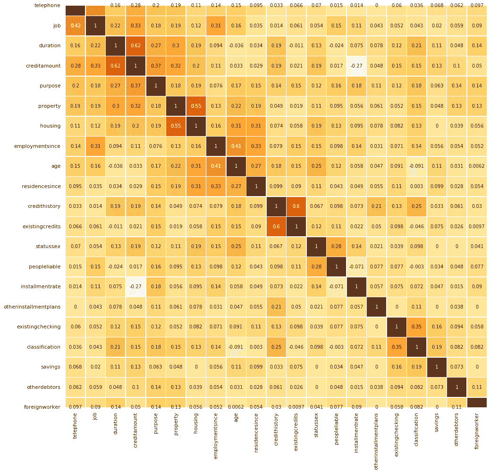

我们无法真正看到清晰的聚类界限；然而，如果你沿对角线观察，似乎有几个群体。

此外，一些变量如电话和职位与其他变量略有不同。在 GitHub 的笔记本中，我们尝试了降维方法，看看是否能改善我们的聚类。然而，降维并没有效果那么好，而直接聚类效果更佳：[`github.com/PacktPublishing/Artificial-Intelligence-with-Python-Cookbook/blob/master/chapter03/Clustering%20market%20segments.ipynb`](https://github.com/PacktPublishing/Artificial-Intelligence-with-Python-Cookbook/blob/master/chapter03/Clustering%20market%20segments.ipynb)。

作为聚类的第一步，我们将一些变量转换为虚拟变量；这意味着我们将对分类变量进行独热编码。

1.  **预处理变量**：我们对分类变量进行了独热编码（也称为*哑变换*），如下所示：

```py
catvars = ['existingchecking', 'credithistory', 'purpose', 'savings', 'employmentsince',
 'statussex', 'otherdebtors', 'property', 'otherinstallmentplans', 'housing', 'job', 
 'telephone', 'foreignworker']
numvars = ['creditamount', 'duration', 'installmentrate', 'residencesince', 'age', 
 'existingcredits', 'peopleliable', 'classification']

dummyvars = pd.get_dummies(customers[catvars])
transactions = pd.concat([customers[numvars], dummyvars], axis=1)
```

不幸的是，当我们将数据集可视化以突出客户差异时，结果并不理想。你可以在线查看笔记本以了解一些尝试。

1.  **聚类的第一次尝试**：聚类的典型方法是`kmeans`。让我们来试一试：

```py
from sklearn.cluster import KMeans
from matplotlib import pyplot as plt

sse = {}
for k in range(1, 15):
    kmeans = KMeans(n_clusters=k).fit(transactions)
    sse[k] = kmeans.inertia_ 
plt.figure()
plt.plot(list(sse.keys()), list(sse.values()))
plt.xlabel("Number of cluster")
plt.ylabel("SSE")
plt.show()
```

惯性是所有数据点到最近聚类中心的距离总和。在*k*-means 聚类算法中选择最佳聚类数（超参数`k`）的一种视觉标准称为**肘部准则**。

让我们可视化不同聚类数下的惯性：

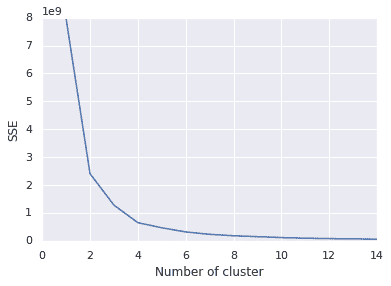

“肘部准则”的基本思想是选择误差或惯性变平的聚类数。根据肘部准则，我们可能会选择`4`个聚类。让我们重新获取这些聚类：

```py
kmeans = KMeans(n_clusters=4).fit(transactions)
y = kmeans.labels_
```

1.  **总结聚类**：现在我们可以总结这些聚类：

```py
clusters = transactions.join(
    pd.DataFrame(data=y, columns=['cluster'])
).groupby(by='cluster').agg(
    age_mean=pd.NamedAgg(column='age', aggfunc='mean'),
    age_std=pd.NamedAgg(column='age', aggfunc='std'),
    creditamount=pd.NamedAgg(column='creditamount', aggfunc='mean'),
    duration=pd.NamedAgg(column='duration', aggfunc='mean'),
    count=pd.NamedAgg(column='age', aggfunc='count'),
    class_mean=pd.NamedAgg(column='classification', aggfunc='mean'),
    class_std=pd.NamedAgg(column='classification', aggfunc='std'),
).sort_values(by='class_mean')
clusters
```

这是聚类的汇总表。我们包括了营销特征，如年龄，以及其他让我们了解客户带来的收益的因素。我们展示了一些标准偏差，以了解这些群体的一致性程度：

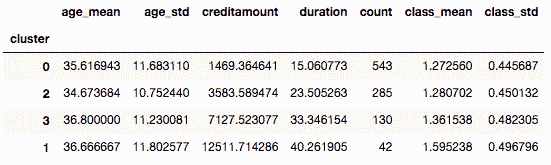

我们在这个小节中看到，差异主要是由信用金额的差异造成的。这使我们回到了最初的起点，即我们从聚类中获得的主要是我们输入的内容。解决这个问题没有简单的方法，但我们可以选择在我们的聚类中要关注的变量。

1.  **新的聚类尝试**：我们可以重新审视我们的目标，简化我们的目标，并从实际上我们想要找到的内容开始：满足两个特征的客户群体，即：

    +   这些聚类应该通过谁为我们赚钱来区分客户：这使我们关注如信用金额、贷款期限以及是否已经还清等变量。

    +   这些聚类应该突出与营销相关的不同特征，如年龄、性别或其他一些特征。

有了这个想法，我们将进行新的尝试：

```py
from scipy.spatial.distance import pdist, squareform
from sklearn.preprocessing import StandardScaler
from sklearn.cluster import AgglomerativeClustering

distances = squareform(pdist(
    StandardScaler().fit_transform(
        transactions[['classification', 'creditamount', 'duration']]
   )
))
clustering = AgglomerativeClustering(
    n_clusters=5, affinity='precomputed', linkage='average'
).fit(distances)
y = clustering.labels_
```

现在我们可以再次生成概览表，以查看群体统计信息：

```py
clusters = transactions.join(
    pd.DataFrame(data=y, columns=['cluster'])
).groupby(by='cluster').agg(
    age_mean=pd.NamedAgg(column='age', aggfunc='mean'),
    age_std=pd.NamedAgg(column='age', aggfunc='std'),
    creditamount=pd.NamedAgg(column='creditamount', aggfunc='mean'),
    duration=pd.NamedAgg(column='duration', aggfunc='mean'),
    count=pd.NamedAgg(column='age', aggfunc='count'),
    class_mean=pd.NamedAgg(column='classification', aggfunc='mean'),
    class_std=pd.NamedAgg(column='classification', aggfunc='std'),
).sort_values(by='class_mean')
clusters
```

接下来是新的摘要：

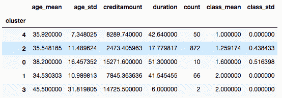

我会认为这比之前的聚类更有用，因为它清楚地显示了哪些客户能给我们带来利润，并突出了其他在营销中相关的差异。

## 它的工作原理...

在商业智能中，聚类是一种非常常见的可视化技术。在营销中，你会针对不同的人群进行定位，比如青少年与退休人员，某些群体比其他群体更有价值。通常作为第一步，会通过降维方法或特征选择减少维度，然后通过应用聚类算法将群体分离。例如，你可以首先应用**主成分分析**（**PCA**）来降低维度（特征数量），然后用*k*-均值找到数据点的群体。

由于视觉化很难客观评判，在前一节中，我们所做的是退后一步，看看实际目的，即我们想要达成的业务目标。我们采取以下步骤来实现这个目标：

+   我们专注于对我们的目标重要的变量。

+   我们创建了一个函数，帮助我们确定聚类的质量。

基于这个前提，我们尝试了不同的方法，并根据我们的业务目标对它们进行了评估。

如果你在查看配方时留意到，你可能已经注意到我们不对输出（z-分数）进行标准化。在使用 z-分数进行标准化时，原始分数 *x* 通过减去均值并除以标准偏差被转换为标准分数，因此每个标准化变量的平均值为 0，标准偏差为 1：

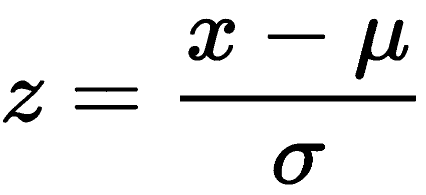

我们不应用标准化，因为已经进行虚拟转换的变量在因素数量上具有更高的重要性。简单来说，z 分数意味着每个变量具有相同的重要性。独热编码为每个可以采用的值提供了一个单独的变量。如果我们在进行虚拟转换后计算和使用 z 分数，一个被转换为许多新（虚拟）变量的变量，因为它有许多值，会比另一个具有较少值和因此较少虚拟列的变量更不重要。我们希望避免这种情况，所以我们不应用 z 分数。

然而，需要记住的重要一点是，我们必须专注于我们能够理解和描述的差异。否则，我们可能会得到用途有限的聚类。

在下一节中，我们将更详细地讨论*k*-均值算法。

## 还有更多……

PCA 提出于 1901 年（由卡尔·皮尔逊在《关于空间中一组点的最佳适合线和平面》中提出），*k*-均值提出于 1967 年（由詹姆斯·麦克昆在《关于多元观测分类和分析的一些方法》中提出）。虽然这两种方法在数据和计算资源稀缺时有其用武之地，但今天存在许多替代方法可以处理数据点和特征之间更复杂的关系。作为本书的作者，我们个人经常感到沮丧，看到依赖正态性或变量之间一种非常有限关系的方法，例如经典的 PCA 或*k*-均值方法，尤其是在存在更多更好的方法时。

PCA 和*k*-均值都存在严重缺陷，影响它们在实践中的有效性。由于 PCA 基于相关矩阵运作，它只能找到数据点之间的线性相关性。这意味着如果变量相关但不是线性相关（如在散点图中所见），PCA 将失败。此外，PCA 基于均值和方差，这些是高斯分布的参数。作为基于质心的聚类算法，*K*-均值只能在欧几里得空间中找到球形群体，因此它无法揭示任何更复杂的结构。有关更多信息，请参阅[`developers.google.com/machine-learning/clustering/algorithm/advantages-disadvantages`](https://developers.google.com/machine-learning/clustering/algorithm/advantages-disadvantages)。

还有其他强健的非线性方法可用，例如亲和传播、模糊*c*-均值、凝聚聚类等。然而，重要的是要记住，尽管这些方法将数据点分组，以下陈述也是正确的：

+   这是根据一种启发式方法完成的。

+   它基于数据集中显而易见的差异以及应用的距离度量。

+   聚类的目的是为了使人类观察者能够可视化和简化输出。

让我们更详细地看一下*k*-means 算法。实际上，这很简单，并且可以从头开始用`numpy`或`jax`编写。该实现基于 NapkinML 中的一个实现（[`github.com/eriklindernoren/NapkinML`](https://github.com/eriklindernoren/NapkinML)）：

```py
import jax.numpy as jnp
import numpy as np
from jax import jit, vmap
from sklearn.base import ClassifierMixin
import jax
import random
from scipy.stats import hmean

class KMeans(ClassifierMixin):
    def __init__(self, k, n_iter=100):
      self.k = k
      self.n_iter = n_iter
      self.euclidean = jit(vmap(
          lambda x, y: jnp.linalg.norm(
              x - y, ord=2, axis=-1, keepdims=False
          ), in_axes=(0, None), out_axes=0
      ))

    def adjust_centers(self, X):
        jnp.row_stack([X[self.clusters == c].mean(axis=0)
          for c in self.clusters
        ])

    def initialize_centers(self):
        '''roughly the kmeans++ initialization
        '''
        key = jax.random.PRNGKey(0)
        # jax doesn't have uniform_multivariate
        self.centers = jax.random.multivariate_normal(
            key, jnp.mean(X, axis=0), jnp.cov(X, rowvar=False), shape=(1,)
        )
        for c in range(1, self.k):
            weights = self.euclidean(X, self.centers)
            if c>1:
              weights = hmean(weights ,axis=-1)
              print(weights.shape)

            new_center = jnp.array(
                random.choices(X, weights=weights, k=1)[0],
                ndmin=2
            )
            self.centers = jnp.row_stack(
                (self.centers, new_center)
            )
            print(self.centers.shape)

    def fit(self, X, y=None):
        self.initialize_centers()
        for iter in range(self.n_iter):
            dists = self.euclidean(X, self.centers)
            self.clusters = jnp.argmin(dists, axis=-1)
            self.adjust_centers(X)
        return self.clusters
```

主要逻辑 - 如预期的那样 - 在`fit()`方法中。它分为三步，如下迭代：

1.  计算每个点与簇中心之间的距离。

1.  每个点被分配到其最近簇中心的簇。

1.  簇中心被重新计算为算术平均值。

令人惊讶的是，这样一个简单的想法竟然可以得出对人类观察者看起来有意义的结果。这里有一个使用它的例子。让我们试试用我们已经在第一章中*Python 中的人工智能入门*中知道的鸢尾花数据集来尝试它：

```py
import matplotlib.pyplot as plt
from sklearn.datasets import load_iris
X, y = load_iris(return_X_y=True)

kmeans = KMeans(k=3)
kmeans.fit(X)
```

最终我们得到可以可视化或检查的簇，类似于之前。

## 另请参见

为了获得不同聚类方法的概述，请参考一篇调查或评论文章。Saxena 等人在他们的文章*聚类技术与发展综述*（2017）中涵盖了大部分重要的术语。

我们建议查看与聚类和降维相关的以下方法（我们链接到实现）：

+   亲和传播（[`scikit-learn.org/stable/modules/generated/sklearn.cluster.AffinityPropagation.html`](https://scikit-learn.org/stable/modules/generated/sklearn.cluster.AffinityPropagation.html)）：一种聚类方法，作为其启发式算法的一部分找到多个簇。

+   模糊 c 均值（[`pythonhosted.org/scikit-fuzzy/auto_examples/plot_cmeans.html`](https://pythonhosted.org/scikit-fuzzy/auto_examples/plot_cmeans.html)）：*k*-means 算法的模糊版本

+   本地线性嵌入（[`scikit-learn.org/stable/modules/generated/sklearn.manifold.LocallyLinearEmbedding.html`](https://scikit-learn.org/stable/modules/generated/sklearn.manifold.LocallyLinearEmbedding.html)）：一个低维嵌入，保持局部相似性

+   T 分布随机邻居嵌入（[`scikit-learn.org/stable/modules/generated/sklearn.manifold.TSNE.html`](https://scikit-learn.org/stable/modules/generated/sklearn.manifold.TSNE.html)）：一种非线性降维方法，适合在二维或三维空间中进行可视化。

+   混合建模（[`mixem.readthedocs.io/en/latest/examples/old_faithful.html`](https://mixem.readthedocs.io/en/latest/examples/old_faithful.html)）

利用预先训练的随机森林来提供定制的内核的想法在*The Random Forest Kernel and other kernels for big data from random partitions* (2014)由 Alex Davies 和 Zoubin Ghahramani 讨论，可在[`arxiv.org/abs/1402.4293`](https://arxiv.org/abs/1402.4293)找到。

# 发现异常

异常是任何偏离预期或正常结果的情况。在工业过程监控（IPM）中，检测异常可以帮助实现更高水平的安全性、效率和质量。

在这个配方中，我们将探讨异常检测的方法。我们将通过使用 Python 异常检测（pyOD），这是一个实现许多最先进方法和可视化的异常检测工具箱，来演示时间序列中的异常检测示例。pyOD 的文档可以在[`pyod.readthedocs.io/en/latest/`](https://pyod.readthedocs.io/en/latest/)找到。

我们将应用基于相似性的自动编码器方法，并使用适用于查找数据流事件的在线学习方法。

## 准备工作

本文将专注于寻找异常值。我们将演示如何使用 pyOD 库包括自动编码器方法来做到这一点。我们还将概述不同方法的优缺点。

数据流是网站性能的 KPI 的时间序列。这个数据集提供在 DONUT 异常检测器库中，可以在[`github.com/haowen-xu/donut`](https://github.com/haowen-xu/donut)找到。

让我们按照以下步骤下载并加载它：

```py
import pandas as pd

!wget https://raw.githubusercontent.com/haowen-xu/donut/master/sample_data/cpu4.csv
cpu_data = pd.read_csv('cpu4.csv')
```

我们将使用来自 pyOD 的方法，因此也要安装它：

```py
!pip install pyOD
```

请注意，一些 pyOD 方法有依赖关系，如 TensorFlow 和 Keras，因此您可能需要确保这些也已安装。如果您收到`No Module named Keras`的消息，您可以单独安装 Keras 如下：

```py
!pip install keras
```

请注意，通常最好使用与 TensorFlow 一起提供的 Keras 版本。

让我们看一下我们的数据集，然后应用不同的异常检测方法。

## 如何实现...

我们将在本节中涵盖不同的步骤和方法。它们如下：

1.  可视化

1.  基准测试

1.  运行孤立森林

1.  运行自动编码器

让我们从探索和可视化我们的数据集开始：

1.  我们可以将我们的数据集随时间作为时间序列进行可视化：

让我们使用以下命令查看我们的数据集：

```py
cpu_data.head()
```

它看起来是这样的：

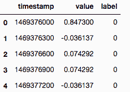

这些关键性能指标（KPIs）的时间序列旨在监控 Web 服务的运营和维护。如果服务出现问题，它们会带有一个标签，表示异常，即异常值：

```py
from datetime import datetime
import seaborn as sns

cpu_data['datetime'] = cpu_data.timestamp.astype(int).apply(
    datetime.fromtimestamp
)
# Use seaborn style defaults and set the default figure size
sns.set(rc={'figure.figsize':(11, 4)})

time_data = cpu_data.set_index('datetime')
time_data.loc[time_data['label'] == 1.0, 'value'].plot(linewidth=0.5, marker='o', linestyle='')
time_data.loc[time_data['label'] == 0.0, 'value'].plot(linewidth=0.5)
```

这是结果图，其中点代表异常值：

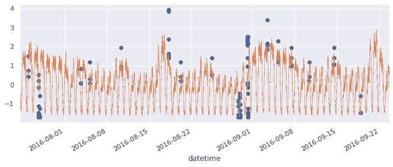

或者，我们可以看到异常值在关键绩效指标谱中的位置，以及它们与正常数据的区别有多明显，使用以下代码：

```py
import numpy as np
from matplotlib import pyplot as plt

markers = ['r--', 'b-^']

def hist2d(X, by_col, n_bins=10, title=None):
  bins = np.linspace(X.min(), X.max(), n_bins)

  vals = np.unique(by_col)
  for marker, val in zip(markers, vals):
    n, edges = np.histogram(X[by_col==val], bins=bins)
    n = n / np.linalg.norm(n)
    bin_centers = 0.5 * (edges[1:] + edges[:-1])
    plt.plot(bin_centers, n, marker, alpha=0.8, label=val)

  plt.legend(loc='upper right')
  if title is not None:
    plt.title(title)
  plt.show()

hist2d(cpu_data.value, cpu_data.label, n_bins=50, title='Values by label')
```

使用上述代码，我们绘制两个直方图的线图对比。或者，我们可以使用`hist()`函数并设置透明度。

下图显示了异常值分布密度，时间序列值位于*x*轴上，两条线分别表示被识别为正常和异常的值，0 表示正常数据点，1 表示异常值：

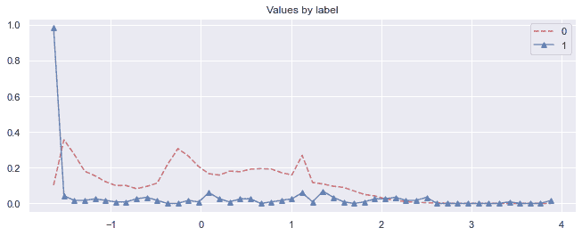

我们将为所有后续方法使用相同的可视化效果，以便进行图形比较。

异常值（用虚线表示）与正常数据点（方块）几乎无法区分，因此我们不会期望完美的表现。

1.  现在我们将实施基准测试。

在继续测试异常值检测方法之前，让我们制定一个比较它们的过程，这样我们就有了测试方法相对性能的基准。

我们像往常一样将数据分为训练集和测试集：

```py
from sklearn.model_selection import train_test_split

X_train, X_test, y_train, y_test = train_test_split(
    cpu_data[['value']].values, cpu_data.label.values
)
```

现在让我们编写一个测试函数，可以用不同的异常值检测方法进行测试：

```py
from pyod.utils.data import evaluate_print
from pyod.models.knn import KNN

def test_outlier_detector(X_train, y_train,
                          X_test, y_test, only_neg=True,
                          basemethod=KNN()):
  clf = basemethod
  if only_neg:
    clf.fit(X_train[y_train==0.0], np.zeros(shape=((y_train==0.0).sum(), 1)))
  else:
    clf.fit(X_train, y_train) # most algorithms ignore y

  y_train_pred = clf.predict(X_train) # labels_
  y_train_scores = clf.decision_scores_

  y_test_pred = clf.predict(X_test)
  y_test_scores = clf.decision_function(X_test)

  print("\nOn Test Data:")
  evaluate_print(type(clf).__name__, y_test, y_test_scores)
  hist2d(X_test, y_test_pred, title='Predicted values by label')
```

此函数在数据集上测试异常值检测方法。它训练一个模型，从模型中获取性能指标，并绘制可视化结果。

它接受这些参数：

+   `X_train`: 训练特征

+   `y_train`: 训练标签

+   `X_test`: 测试特征

+   `y_test`: 测试标签

+   `only_neg`: 是否仅使用正常点进行训练

+   `basemethod`: 要测试的模型

我们可以选择仅在正常点上进行训练（即不包括异常值的所有点），以便学习这些点的分布或一般特征，然后异常值检测方法可以决定新点是否符合这些特征。

现在这一步完成后，让我们测试两种异常值检测方法：孤立森林和自编码器。

孤立森林排名第一。

1.  我们将讨论孤立森林。

我们运行基准测试方法，并使用孤立森林检测方法：

```py
from pyod.models.iforest import IForest

test_outlier_detector(
    X_train, y_train, X_test, y_test, 
    only_neg=True, basemethod=IForest(contamination=0.01),
)
#On Test Data:
#IForest ROC:0.867, precision @ rank n:0.1
```

孤立森林预测的接收器操作特征曲线（ROC）性能相对于测试数据约为 0.86，因此表现相当不错。

然而，从下图可以看出，在关键绩效指标谱的较低范围内没有 1（预测的异常值）。该模型错过了较低范围的异常值：

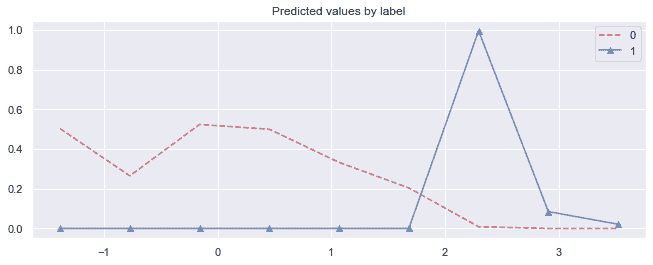

它仅识别具有更高值（*>=1.5*）的点作为异常值。

1.  接下来，让我们尝试运行一个自编码器：

```py
from pyod.models.auto_encoder import AutoEncoder

test_outlier_detector(
    X_train, y_train, X_test, y_test, 
    only_neg=False, 
    basemethod=AutoEncoder(hidden_neurons=[1], epochs=10)
)
```

我们可以看到 Keras 网络结构以及测试函数的输出：

```py
Layer (type)                 Output Shape              Param #   
=================================================================
dense_39 (Dense)             (None, 1)                 2         
_________________________________________________________________
dropout_30 (Dropout)         (None, 1)                 0         
_________________________________________________________________
dense_40 (Dense)             (None, 1)                 2         
_________________________________________________________________
dropout_31 (Dropout)         (None, 1)                 0         
_________________________________________________________________
dense_41 (Dense)             (None, 1)                 2         
_________________________________________________________________
dropout_32 (Dropout)         (None, 1)                 0         
_________________________________________________________________
dense_42 (Dense)             (None, 1)                 2         
=================================================================
Total params: 8
Trainable params: 8
Non-trainable params: 0

... 
On Test Data:
AutoEncoder ROC:0.8174, precision @ rank n:0.1
```

自编码器的性能与孤立森林非常相似；然而，自编码器在关键绩效指标谱的较低和较高范围都能找到异常值。

此外，我们在只提供正常数据或正常数据和异常值时并未获得明显差异。我们可以通过下图了解自动编码器的工作方式：

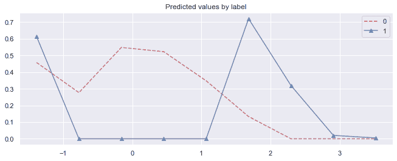

实际上这看起来并不太糟糕 —— 中间范围内的值被分类为正常，而在谱外的值则被分类为异常值。

请记住，这些方法是无监督的；当然，如果我们使用自己的数据集使用监督方法，这将需要我们额外的工作来注释异常，而无监督方法则无需如此。

## 它的工作原理...

异常值是偏离数据中其他观测值的极端值。在许多领域中，包括网络安全、金融、交通、社交媒体、机器学习、机器模型性能监控和监视中，异常值检测都是重要的。已提出了许多领域中的异常检测算法。最突出的算法包括***k*-最近邻**（**kNN**）、**局部异常因子**（**LOF**）和隔离森林，以及最近的自动编码器、**长短期记忆网络**（**LSTM**）和**生成对抗网络**（**GANs**）。我们将在后续的实例中探索其中一些方法。在这个实例中，我们使用了 kNN、自动编码器和隔离森林算法。让我们简要地谈谈这三种方法。

### k-最近邻

kNN 分类器是由 Thomas Cover 和 Peter Hart 提出的非参数分类器（见*最近邻模式分类*，1967）。其主要思想是一个新点很可能属于与其邻居相同的类。超参数 `k` 是要比较的邻居数。还有基于新点与其邻居相对距离的加权版本。

### 隔离森林

隔离森林的思想相对简单：创建随机决策树（这意味着每个叶子节点使用随机选择的特征和随机选择的分割值），直到只剩下一个点。穿过树获取到终端节点的路径长度指示出点是否是异常值。

您可以在原创文献中详细了解隔离森林，作者是 Liu 等人，*隔离森林*，ICDM 2008: 413–422: [`cs.nju.edu.cn/zhouzh/zhouzh.files/publication/icdm08b.pdf`](https://cs.nju.edu.cn/zhouzh/zhouzh.files/publication/icdm08b.pdf)。

### 自动编码器

自动编码器是一种神经网络架构，通过学习数据集的表示来实现。通常通过一个较小的隐藏层（**瓶颈**）来实现，从而可以恢复原始数据。这与许多其他降维方法类似。

自编码器由两部分组成：编码器和解码器。我们真正想学习的是编码器的转换，它给我们一个我们寻找的数据的代码或表示。

更正式地，我们可以将编码器定义为函数 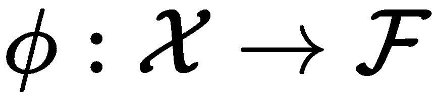，将解码器定义为函数 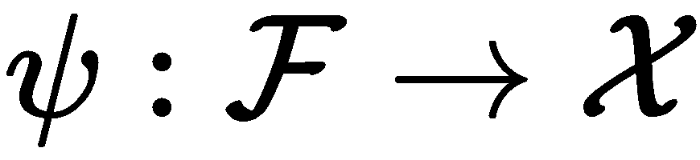。我们试图找到 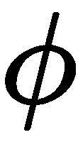 和 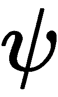，以使重建误差最小化：

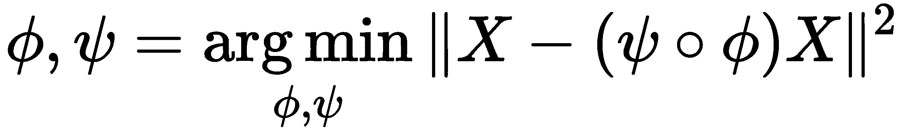

自动编码器在中间网络层中表示数据，它们在基于中间表示的重建越接近时，异常程度越低。

## 另请参阅

Python 中有许多异常检测的公开实现：

+   作为 Numenta 皮层学习算法的一部分：[`nupic.docs.numenta.org/stable/guides/anomaly-detection.html#temporalanomaly-model`](http://nupic.docs.numenta.org/stable/guides/anomaly-detection.html#temporalanomaly-model)

+   Banpei，用于奇异谱变换：[`github.com/tsurubee/banpei`](https://github.com/tsurubee/banpei)

+   用于时间序列的深度异常检测方法：[`github.com/KDD-OpenSource/DeepADoTS`](https://github.com/KDD-OpenSource/DeepADoTS)

+   Telemanom – 用于多变量时间序列数据的 LSTM：[`github.com/khundman/telemanom`](https://github.com/khundman/telemanom)

+   DONUT – 用于季节性 KPI 的变分自动编码器：[`github.com/haowen-xu/donut`](https://github.com/haowen-xu/donut)

关于异常检测的材料的一个极好资源是 PyOD 作者的专用存储库，位于[`github.com/yzhao062/anomaly-detection-resources`](https://github.com/yzhao062/anomaly-detection-resources)。

# 用于相似性搜索

在这个案例中，我们希望找到一种方法来确定两个字符串是否相似，给定这两个字符串的表示。我们将尝试改进字符串的表示方式，以便在字符串之间进行更有意义的比较。但首先，我们将使用更传统的字符串比较算法来建立基准。

我们将进行以下操作：给定一组成对字符串匹配的数据集，我们将尝试不同的函数来测量字符串的相似性，然后是基于字符 n-gram 频率的字符袋表示，最后是**共孪神经网络**（也称为**双胞胎神经网络**）的维度减少字符串表示。我们将设置一个双网络方法，通过字符 n-gram 频率学习字符串的潜在相似空间。

**暹罗神经网络**，有时也被称为**双胞胎神经网络**，是以联合双胞胎的类比来命名的。这是一种训练投影或度量空间的方法。两个模型同时训练，比较的是两个模型的输出而不是模型本身的输出。

## 准备工作

如往常一样，我们需要下载或加载数据集并安装必要的依赖项。

我们将使用一组配对字符串的数据集，根据它们的相似性来确定它们是否匹配：

```py
!wget https://raw.githubusercontent.com/ofrendo/WebDataIntegration/7db877abadd2be94d5373f5f47c8ccd1d179bea6/data/goldstandard/forbes_freebase_goldstandard_train.csv
```

我们可以按以下方式读取它：

```py
import pandas as pd

data = pd.read_csv(
    'forbes_freebase_goldstandard_train.csv',
    names=['string1', 'string2', 'matched']
)
```

数据集包含一对相匹配或不匹配的字符串。它的开始如下：

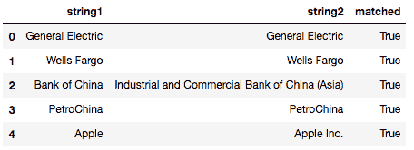

同一 GitHub 仓库还提供了一个测试数据集：

```py
!wget https://raw.githubusercontent.com/ofrendo/WebDataIntegration/7db877abadd2be94d5373f5f47c8ccd1d179bea6/data/goldstandard/forbes_freebase_goldstandard_test.csv
```

我们可以像以前一样将它读入 pandas DataFrame 中：

```py
test = pd.read_csv(
    'forbes_freebase_goldstandard_test.csv',
    names=['string1', 'string2', 'matched']
)
```

最后，我们将在本示例中使用一些库，可以像这样安装：

```py
!pip install python-Levenshtein annoy
```

**Levenshtein 距离**（有时也称为**编辑距离**）测量将一个字符串转换为另一个字符串所需的插入、删除和替换次数。它执行搜索以找出执行此转换的最短路径。这里使用的库是该算法的非常快速的实现。你可以在[`github.com/ztane/python-Levenshtein`](https://github.com/ztane/python-Levenshtein)了解更多关于`python-Levenshtein`库的信息。

`annoy`库提供了高度优化的最近邻搜索实现。给定一组点和一个距离，我们可以使用树表示索引所有点，然后对于任何点，我们可以遍历树以找到类似的数据点。你可以在[`github.com/spotify/annoy`](https://github.com/spotify/annoy)了解更多关于 annoy 的信息。

让我们开始吧。

## 如何做...

如前所述，我们将首先使用标准字符串比较函数计算基线，然后使用字符包法，最后采用暹罗神经网络方法学习投影。你可以在书的 GitHub 仓库中找到相应的笔记本，网址为[`github.com/PacktPublishing/Artificial-Intelligence-with-Python-Cookbook/blob/master/chapter03/Representing%20for%20similarity%20search.ipynb`](https://github.com/PacktPublishing/Artificial-Intelligence-with-Python-Cookbook/blob/master/chapter03/Representing%20for%20similarity%20search.ipynb)。

### Baseline – 字符串比较函数

让我们先实现几个标准字符串比较函数。

我们首先需要确保清理我们的字符串：

```py
def clean_string(string):
    return ''.join(map(lambda x: x.lower() if str.isalnum(x) else ' ', string)).strip()
```

我们将在接下来的代码中的每个字符串比较函数中使用这个清理函数。我们将使用这个函数在进行任何字符串距离计算之前去除特殊字符。

现在我们可以实现简单的字符串比较函数。首先做`Levenshtein`距离：

```py
import Levenshtein

def levenstein_distance(s1_, s2_):
    s1, s2 = clean_string(s1_), clean_string(s2_)
    len_s1, len_s2 = len(s1), len(s2)
    return Levenshtein.distance(
        s1, s2
    ) / max([len_s1, len_s2])
```

现在让我们来计算`Jaro-Winkler`距离，它是最小单字符转置次数：

```py
def jaro_winkler_distance(s1_, s2_):
    s1, s2 = clean_string(s1_), clean_string(s2_)
    return 1 - Levenshtein.jaro_winkler(s1, s2)
```

我们还将使用被比较对之间的最长公共子串。我们可以使用`SequenceMatcher`来完成这一点，它是 Python 标准库的一部分：

```py
from difflib import SequenceMatcher

def common_substring_distance(s1_, s2_):
    s1, s2 = clean_string(s1_), clean_string(s2_)
    len_s1, len_s2 = len(s1), len(s2)
    match = SequenceMatcher(
        None, s1, s2
    ).find_longest_match(0, len_s1, 0, len_s2)
    len_s1, len_s2 = len(s1), len(s2)
    norm = max([len_s1, len_s2])
    return 1 - min([1, match.size / norm])
```

现在我们可以对所有字符串对进行遍历，并基于每种方法计算字符串距离。对于这三种算法，我们可以计算**曲线下面积**（**AUC**）分数，以查看它们在分离匹配字符串和非匹配字符串方面的表现如何：

```py
import numpy as np
from sklearn.metrics import roc_auc_score

dists = np.zeros(shape=(len(data), 3))
for algo_i, algo in enumerate(
    [levenstein_distance, jaro_winkler_distance, common_substring_distance]
):
    for i, string_pair in data.iterrows():
        dists[i, algo_i] = algo(string_pair['string1'], string_pair['string2'])

    print('AUC for {}: {}'.format(
        algo.__name__, 
        roc_auc_score(data['matched'].astype(float), 1 - dists[:, algo_i])
    ))
#AUC for levenstein_distance: 0.9508904955034385
#AUC for jaro_winkler_distance: 0.9470992770234525
#AUC for common_substring_distance: 0.9560042320578381
```

所有算法的 AUC 分数约为 95%，看起来很不错。这三种距离方法表现已经相当不错了。让我们尝试超过这个水平。

### 字符包方法

现在我们将实现一种基于字符包的字符串相似性方法。

字符包表示意味着我们将创建一个字符的直方图，或者换句话说，我们将计算每个单词中字符的出现次数：

```py
from sklearn.feature_extraction.text import CountVectorizer

# We clean the strings as before and we take ngrams.
ngram_featurizer = CountVectorizer(
    min_df=1,
    analyzer='char',
    ngram_range=(1, 1), # this is the range of ngrams that are to be extracted!
    preprocessor=clean_string
).fit(
    np.concatenate(
        [data['string1'], data['string2']],
        axis=0
    )
)
```

我们已将`ngrams`的范围设置为`1`，这意味着我们只希望单个字符。然而，如果你希望包括字符之间更长范围的依赖关系而不仅仅是字符频率，这个参数可能会有趣。

让我们看看我们可以通过这个方法获得什么样的性能：

```py
string1cv = ngram_featurizer.transform(data['string1'])
string2cv = ngram_featurizer.transform(data['string2'])

def norm(string1cv):
    return string1cv / string1cv.sum(axis=1)

similarities = 1 - np.sum(np.abs(norm(string1cv) - norm(string2cv)), axis=1) / 2
roc_auc_score(data['matched'].astype(float), similarities)
#0.9298183741844471
```

如你在大约 93%的 AUC 分数中所见，这种方法整体表现还不如上面的方法好，尽管表现并非完全糟糕。因此，让我们尝试调整一下。

### Siamese 神经网络方法

现在我们将实现一个 Siamese 网络，学习表示字符串之间相似性（或差异）的投影。

如果你对 Siamese 网络方法感到有些陌生，可能会觉得有点令人畏惧。我们将在*工作原理...*部分进一步讨论它。

让我们从字符串特征化函数开始：

```py
from tensorflow.keras.models import Sequential, Model
from tensorflow.keras.layers import Dense, Lambda, Input
import tensorflow as tf
from tensorflow.keras import backend as K

def create_string_featurization_model(
    feature_dimensionality, output_dim=50):
    preprocessing_model = Sequential()
    preprocessing_model.add(
        Dense(output_dim, activation='linear', input_dim=feature_dimensionality)
    )
    preprocessing_model.summary()
    return preprocessing_model
```

`create_string_featurization_model`函数返回一个字符串特征化模型。特征化模型是字符包输出的非线性投影。

函数有以下参数：

+   `feature_dimensionality`：来自向量化器的特征数（即字符包输出的维度）

+   `output_dim`：我们试图创建的嵌入/投影的维度

接下来，我们需要创建这两个模型的**联合孪生体**。为此，我们需要一个比较函数。我们使用归一化的欧氏距离。这是两个*L2*归一化投影向量之间的欧氏距离。

向量*x*的*L2*范数定义如下：

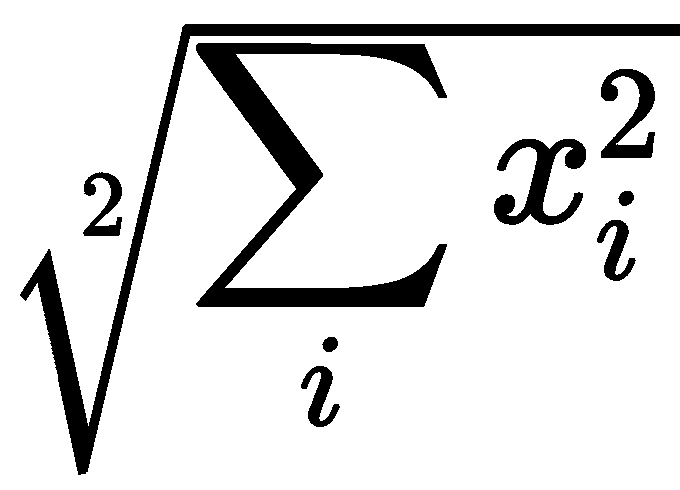

*L2*归一化是将向量*x*除以其范数。

我们可以如下定义距离函数：

```py
def euclidean_distance(vects):
    x, y = vects
    x = K.l2_normalize(x, axis=-1)
    y = K.l2_normalize(y, axis=-1)
    sum_square = K.sum(
        K.square(x - y),
        axis=1,
        keepdims=True
    )
    return K.sqrt(K.maximum(
        sum_square,
        K.epsilon()
    ))
```

现在 Siamese 网络可以通过将其包装为 Lambda 层来使用该函数。让我们定义如何联接孪生体，或者换句话说，我们如何将其包装成一个更大的模型，以便我们可以训练字符串对及其标签（即相似和不相似）。

```py
def create_siamese_model(preprocessing_models, #initial_bias =
                          input_shapes=(10,)):    
    if not isinstance(preprocessing_models, (list, tuple)):
        raise ValueError('preprocessing models needs to be a list or tuple of models')
    print('{} models to be trained against each other'.format(len(preprocessing_models)))
    if not isinstance(input_shapes, list):
        input_shapes = [input_shapes] * len(preprocessing_models)

    inputs = []
    intermediate_layers = []
    for preprocessing_model, input_shape in zip(preprocessing_models, input_shapes):
        inputs.append(Input(shape=input_shape))
        intermediate_layers.append(preprocessing_model(inputs[-1]))

    layer_diffs = []
    for i in range(len(intermediate_layers)-1): 
        layer_diffs.append(
            Lambda(euclidean_distance)([intermediate_layers[i], intermediate_layers[i+1]])
        ) 
    siamese_model = Model(inputs=inputs, outputs=layer_diffs)
    siamese_model.summary()
    return siamese_model
```

这是一种冗长的说法：取两个网络，计算归一化欧氏距离，并将距离作为输出。

让我们创建双网络并进行训练：

```py
def compile_model(model):
    model.compile(
        optimizer='rmsprop',
        loss='mse',
    )

feature_dims = len(ngram_featurizer.get_feature_names())
string_featurization_model = create_string_featurization_model(feature_dims, output_dim=10)

siamese_model = create_siamese_model(
    preprocessing_models=[string_featurization_model, string_featurization_model],
    input_shapes=[(feature_dims,), (feature_dims,)],
)
compile_model(siamese_model)
siamese_model.fit(
    [string1cv, string2cv],
    1 - data['matched'].astype(float),
    epochs=1000
)
```

创建一个输出为 10 维的模型；从 n-gram 特征提取器中获得了 41 维，这意味着我们总共有 420 个参数 (*41 * 10 + 10*)。

正如之前提到的，我们组合网络的输出是两个输出之间的欧氏距离。这意味着我们必须反转我们的目标（匹配）列，以便从相似变为不同，这样 1 对应不同，0 对应相同。我们可以通过简单地从 1 中减去来轻松实现这一点。

现在我们可以获得这种新投影的性能：

```py
from scipy.spatial.distance import euclidean

string_rep1 = string_featurization_model.predict(
    ngram_featurizer.transform(data['string1'])
)
string_rep2 = string_featurization_model.predict(
    ngram_featurizer.transform(data['string2'])
)
dists = np.zeros(shape=(len(data), 1))
for i, (v1, v2) in enumerate(zip(string_rep1, string_rep2)):
    dists[i] = euclidean(v1, v2)

roc_auc_score(data['matched'].astype(float), 1 - dists)
0.9802944806912361
```

我们已经成功地击败了其他方法。甚至在调整任何超参数之前，我们的投影显然在突出显示对字符串相似性比较重要的差异方面起作用。

## 工作原理...

scikit-learn 的 `CountVectorizer` 计算字符串中特征的出现次数。一个常见的用例是计算句子中的单词数 —— 这种表示称为**词袋**，在这种情况下，特征将是单词。在我们的情况下，我们对基于字符的特征感兴趣，因此我们只计算 **a ** 出现的次数、**b ** 出现的次数，依此类推。我们可以通过表示连续字符元组如 **ab** 或 **ba** 来使这种表示更加智能化；然而，这超出了我们当前的范围。

Siamese 网络训练是指两个（或更多）神经网络相互训练，通过比较给定一对（或元组）输入的网络输出以及这些输入之间的差异的知识。通常，Siamese 网络由相同的网络组成（即相同的权重）。两个网络输出之间的比较函数可以是诸如欧氏距离或余弦相似度之类的度量。由于我们知道两个输入是否相似，甚至知道它们有多相似，我们可以根据这些知识训练目标。

下图说明了信息流和我们将使用的不同构建块：

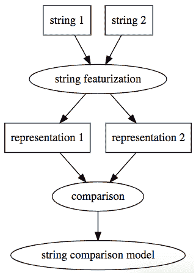

给定我们想要比较的两个字符串，我们将使用同一模型从每个字符串创建特征，从而得到两个表示。然后我们可以比较这些表示，希望比较结果与结果相关联，因此如果我们的比较显示很大的差异，那么字符串将是不相似的，如果比较显示很小的差异，那么字符串将是相似的。

我们实际上可以直接训练这个完整的模型，给定一个字符串比较模型和一个由字符串对和目标组成的数据集。这种训练将调整字符串特征化模型，使其表示更加有用。

# 推荐产品

在这个步骤中，我们将构建一个推荐系统。推荐系统是一个信息过滤系统，通过将内容和社交连接在一起预测排名或相似性。

我们将下载从 Goodreads 网站收集的图书评分数据集，用户在该网站上对阅读过的书籍进行排名和评论。我们将构建不同的推荐模型，并基于已知的评分推荐新书。

## 准备工作

为了准备我们的步骤，我们将下载数据集并安装所需的依赖项。

让我们获取数据集，并在这里安装我们将使用的两个库 – `spotlight` 和 `lightfm` 是推荐系统库：

```py
!pip install git+https://github.com/maciejkula/spotlight.git lightfm

```

然后我们需要获取图书评分的数据集：

```py
from spotlight.datasets.goodbooks import get_goodbooks_dataset
from spotlight.cross_validation import random_train_test_split 

import numpy as np

interactions = get_goodbooks_dataset()
train, test = random_train_test_split(
 interactions, random_state=np.random.RandomState(42)
)
```

数据集以交互对象的形式呈现。根据 spotlight 的文档，交互对象可以定义如下：

[它]至少包含一对用户-项目交互，但也可以丰富评分、时间戳和交互权重。

对于**隐性反馈**场景，只应提供已观察到交互的用户-项目对的用户 ID 和项目 ID。未提供的所有对都被视为缺失观察，并且通常被解释为（隐性）负信号。

对于**显性反馈**场景，应提供数据集中观察到的所有用户-项目-评分三元组的用户 ID、项目 ID 和评分。

我们有以下训练和测试数据集：

```py
<Interactions dataset (53425 users x 10001 items x 4781183 interactions)>
<Interactions dataset (53425 users x 10001 items x 1195296 interactions)>
```

要知道项目编号指的是哪些书籍，我们将下载以下 CSV 文件：

```py
!wget https://raw.githubusercontent.com/zygmuntz/goodbooks-10k/master/books.csv
```

接下来，我们将实现一个根据`id`获取书名的函数。这对于后续展示我们的推荐非常有用：

```py
import pandas as pd 
books = pd.read_csv('books.csv', index_col=0)

def get_book_titles(book_ids):
    '''Get book titles by book ids 
    ''' 
    if isinstance(book_ids, int): 
        book_ids = [book_ids]
    titles = []
    for book_id in book_ids:
        titles.append(books.loc[book_id, 'title'])
    return titles

book_labels = get_book_titles(list(train.item_ids))
```

现在我们可以按以下方式使用这个函数：

```py
get_book_titles(1) 
['The Hunger Games (The Hunger Games, #1)'] 
```

现在我们已经获取了数据集并安装了所需的库，我们可以开始我们的步骤了。

## 如何做...

我们首先使用矩阵分解模型，然后使用深度学习模型。您可以在 Jupyter 笔记本中找到更多示例，链接如下：[`github.com/PacktPublishing/Artificial-Intelligence-with-Python-Cookbook/blob/master/chapter03/Recommending_products.ipynb`](https://github.com/PacktPublishing/Artificial-Intelligence-with-Python-Cookbook/blob/master/chapter03/Recommending_products.ipynb)。

我们必须设置许多参数，包括潜在维度的数量和周期数：

```py
import torch
from spotlight.factorization.explicit import ExplicitFactorizationModel
from spotlight.evaluation import (
    rmse_score,
    precision_recall_score
)

model = ExplicitFactorizationModel(
    loss='regression',
    embedding_dim=128,
    n_iter=10,
    batch_size=1024,
    l2=1e-9,
    learning_rate=1e-3,
    use_cuda=torch.cuda.is_available()
)
model.fit(train, verbose=True)
train_rmse = rmse_score(model, train)
test_rmse = rmse_score(model, test)
print('Train RMSE {:.3f}, test RMSE {:.3f}'.format(
    train_rmse, test_rmse
))
```

结果显示在以下截图中：

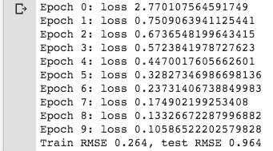

我们得到以下的推荐：

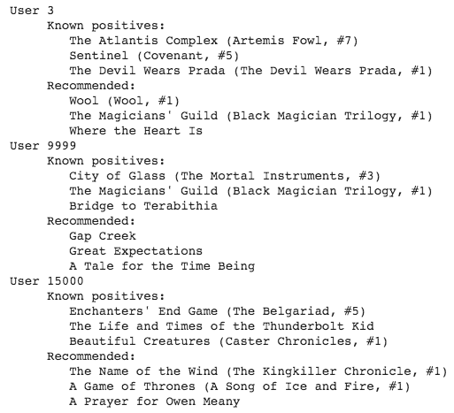

现在我们将使用`lightfm`推荐算法：

```py
from lightfm import LightFM
from lightfm.evaluation import precision_at_k

# Instantiate and train the model
model = LightFM(loss='warp')
model.fit(train.tocoo(), epochs=30, num_threads=2)
test_precision = precision_at_k(model, test.tocoo(), k=5)
print(
    'mean test precision at 5: {:.3f}'.format(
        test_precision.mean()
))
mean test precision at 5: 0.114
```

我们也可以查看推荐内容，如下所示：

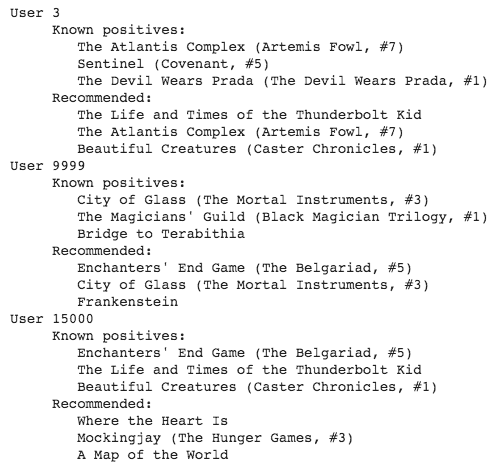

两个推荐系统都有它们的应用。基于精度在*k（k=5）*的基础上，我们可以得出结论，第二个推荐系统`lightfm`表现更好。

## 它的工作原理...

推荐系统向用户推荐产品。

他们可以根据不同的原则提出建议，例如以下内容：

+   他们可以基于这样一个假设进行预测：在以前的购买中表现出类似品味的顾客将来会购买类似的物品（**协同过滤**）。

+   基于顾客可能会对与他们过去购买的物品相似的物品感兴趣的理念进行预测（**基于内容的过滤**）。

+   基于协同过滤、基于内容的过滤或其他方法的组合预测（**混合推荐**）。

混合模型可以以不同方式组合方法，例如分别进行基于内容和基于协同的预测，然后将分数相加，或者将这些方法统一到一个单一模型中。

我们尝试的两个模型都基于这样一种想法，即我们可以分离用户和物品的影响。我们将依次解释每个模型及其如何结合方法，但首先让我们解释一下我们正在使用的度量标准：*k*的精度。

### k 处的精度

我们在这里提取的度量标准是**k 处的精度**。例如，精度在 10 处计算前*k*个文档中的相关结果数量，通常*k*=5 或*k*=10。

精度在*k*上不考虑在前*k*个结果中的排序，也不包括我们绝对应该捕捉到的真正好的结果的数量：这将是召回率。尽管如此，精度在*k*上是一个合理的度量标准，而且很直观。

### 矩阵分解

`spotlight`中的显式模型基于 Yehuda Koren 等人在《推荐系统的矩阵分解技术》（2009）中提出的矩阵分解技术。基本思想是将用户-物品（交互）矩阵分解为表示用户潜在因素和物品潜在因素的两个组成部分，以便根据给定物品和用户进行推荐，计算如下：

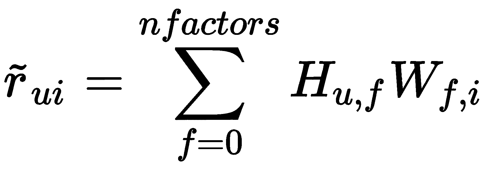

**矩阵分解**或**矩阵因子分解**是将矩阵分解为矩阵乘积的过程。存在许多不同的这类分解方法，用途各不相同。

一个相对简单的分解是**奇异值分解**（**SVD**），但现代推荐系统使用其他分解方法。`spotlight`矩阵分解和`lightfm`模型都使用线性整合。

### `lightfm`模型

`lightfm`模型是由 Kula 在《用户和物品冷启动推荐的元数据嵌入》（2015）中介绍的。更具体地说，我们使用的是 WARP 损失，该损失在 Jason Weston 等人于 2011 年的《WSABIE：大规模词汇图像注释的扩展》中有详细解释。

在 `lightfm` 算法中，用于预测的函数如下：

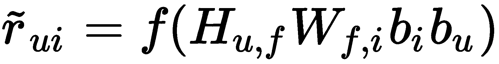

在前述函数中，我们为用户和项目有偏差项，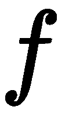 是 sigmoid 函数。

模型训练最大化数据在给定参数条件下的似然性表达如下：

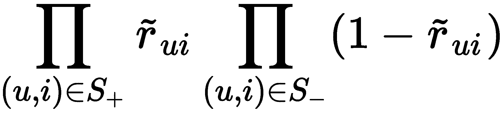

有多种方法可以衡量推荐系统的表现，而我们选择使用哪种方法取决于我们试图实现的目标。

## 另请参见

同样，有很多库可以轻松启动和运行。首先，我想强调这两个已经在本配方中使用过的库：

+   lightfm：[`github.com/lyst/lightfm`](https://github.com/lyst/lightfm)

+   Spotlight：[`maciejkula.github.io/spotlight`](https://maciejkula.github.io/spotlight)

但还有一些其他很有前景的方法：

+   Polara 包含一个名为 HybridSVD 的算法，似乎非常强大：[`github.com/evfro/polara`](https://github.com/evfro/polara)

+   DeepRec 提供基于 TensorFlow 的推荐深度学习模型：[`github.com/cheungdaven/DeepRec`](https://github.com/cheungdaven/DeepRec)

您可以在以下存储库中找到有关使用数据集进行项目排名的库功能演示：[`github.com/cheungdaven/DeepRec/blob/master/test/test_item_ranking.py`](https://github.com/cheungdaven/DeepRec/blob/master/test/test_item_ranking.py)

Microsoft 已经撰写了有关推荐最佳实践的文章：[`github.com/Microsoft/Recommenders`](https://github.com/Microsoft/Recommenders)

最后但同样重要的是，您可能会发现以下有关推荐系统的阅读列表有用：[`github.com/DeepGraphLearning/RecommenderSystems/blob/master/readingList.md`](https://github.com/DeepGraphLearning/RecommenderSystems/blob/master/readingList.md)

# 发现欺诈者社区

在这个配方中，我们将尝试使用网络分析方法来检测欺诈社区。这是一个在图分析中经常出现的用例，因为在进行欺诈检测时，我们关注的是人们之间的关系，比如他们是否住在附近，是否通过社交媒体连接，或者是否从事相同的工作。

## 准备工作

为了准备好制作这个配方，我们将安装所需的库并下载数据集。

我们将使用以下库：

+   `networkx` - 是一个图分析库：[`networkx.github.io/documentation`](https://networkx.github.io/documentation)

+   `annoy` - 是一个非常高效的最近邻实现：[`github.com/spotify/annoy`](https://github.com/spotify/annoy)

+   `tqdm` - 提供进度条：[`github.com/tqdm/tqdm`](https://github.com/tqdm/tqdm)

此外，我们将使用 SciPy，但这是在 Anaconda 分发中包含的：

```py
!pip install networkx annoy tqdm python-louvain
```

我们将使用以下欺诈信用卡交易数据集：[`www.kaggle.com/mlg-ulb/creditcardfraud`](https://www.kaggle.com/mlg-ulb/creditcardfraud)。

信用卡欺诈数据集包含了 2013 年 9 月欧洲持卡人使用信用卡的交易记录。该数据集包含了 284,807 笔交易，其中 492 笔是欺诈交易。该数据集非常不平衡：正类（欺诈）占所有交易的 0.172%。

让我们导入数据集，然后将其分割为训练集和测试集：

```py
import pandas as pd
from sklearn.datasets import fetch_openml
import random

X, y = fetch_openml(data_id=1597, return_X_y=True)

samples = random.choices(
    list(range(X.shape[0])), k=int(X.shape[0] * 0.33)
)
X_train = X[(samples), :]
```

我们准备好了！让我们来做这道菜吧！

## 如何做...

首先我们会创建一个邻接矩阵，然后我们可以对其应用社区检测方法，最后我们将评估生成社区的质量。整个过程由于大数据集而增加了难度，这意味着我们只能应用某些算法。

### 创建邻接矩阵

首先，我们需要计算所有点的距离。对于这样一个大数据集，这是一个真正的问题。你可以在网上找到几种方法。

我们使用 Spotify 的`annoy`库进行此目的，这是非常快速和内存高效的：

```py
from annoy import AnnoyIndex
t = AnnoyIndex(X_train.shape[1], 'euclidean') # Length of item vector that will be indexed
for i, v in enumerate(X_train):
    t.add_item(i, v)

t.build(10) # 10 trees
```

然后我们可以根据索引给出的距离初始化我们的邻接矩阵：

```py
from tqdm import trange
from scipy.sparse import lil_matrix

MAX_NEIGHBORS = 10000 # Careful: this parameter determines the run-time of the loop!
THRESHOLD = 6.0

def get_neighbors(i):
  neighbors, distances = t.get_nns_by_item(i, MAX_NEIGHBORS, include_distances=True)
  return [n for n, d in zip(neighbors, distances) if d < THRESHOLD]

n_rows = X_train.shape[0]
A = lil_matrix((n_rows, n_rows), dtype=np.bool_)
for i in trange(n_rows):
  neighborhood = get_neighbors(i)
  for n in neighborhood:
      A[i, n] = 1
      A[n, i] = 1
```

现在我们可以应用一些社区检测算法。

### 社区检测算法

我们矩阵的大小限制了我们的选择。我们将应用以下两个算法：

+   **强连通分量** (**SCC**)

+   Louvain 算法

我们可以直接在邻接矩阵上应用 SCC 算法，如下所示：

```py
from scipy.sparse.csgraph import connected_components

n_components, labels = connected_components(
    A,
    directed=False,
    return_labels=True
)
```

对于第二个算法，我们首先需要将邻接矩阵转换为图形；这意味着我们将矩阵中的每个点视为节点之间的边。为了节省空间，我们使用了一个简化的图形类：

```py
import networkx as nx

class ThinGraph(nx.Graph):
    all_edge_dict = {'weight': 1}

    def single_edge_dict(self):
        return self.all_edge_dict

    edge_attr_dict_factory = single_edge_dict

G = ThinGraph(A)
```

然后我们可以按以下方式应用 Louvain 算法：

```py
import community  # this is the python-louvain package

partition = community.best_partition(G)
```

现在我们有数据集的两个不同分区。让我们看看它们是否有价值！

### 评估社区

在理想情况下，我们期望一些社区只有欺诈者，而其他（大多数）社区则完全没有。这种纯度是我们在完美社区中寻找的。然而，由于我们可能也希望得到一些其他可能是欺诈者的建议，我们预计一些点会在大多数非欺诈组中被标记为欺诈者，反之亦然。

我们可以从观察每个社区的欺诈频率直方图开始。Louvain 欺诈者分布如下：

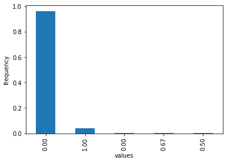

这表明社区中有很多非欺诈者，而其他数值很少。但我们能量化这有多好吗？

我们可以通过计算每个群集中的**类熵**来描述欺诈者分布。我们将在*它的工作原理...*部分解释熵。

然后我们可以创建适当选择的随机实验，以查看任何其他社区分配是否会导致更好的类熵。如果我们随机重新排序欺诈者，然后计算跨社区的熵，我们将得到一个熵分布。这将为我们提供 Louvain 社区熵的**p 值**，**统计显著性**。

**p 值**是我们仅凭偶然性就能获得这种（或更好）分布的概率。

您可以在 GitHub 上的笔记本中找到采样的实现。

我们得到了非常低的显著性，这意味着几乎不可能通过偶然得到类似的结果，这使我们得出结论，我们在识别欺诈者方面找到了有意义的聚类。

## 工作原理如下...

处理大数据集进行网络分析的最困难部分是构建邻接矩阵。您可以在在线笔记本中找到不同的方法。两个问题是运行时间和内存。这两者都可以随着数据点的数量呈指数增长。

我们的数据集包含 284,807 个点。这意味着在所有点之间建立完全连接的矩阵将占用数百 GB 空间（每个点 4 字节），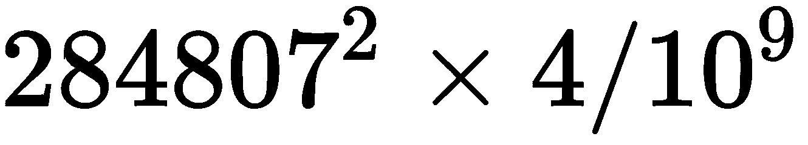。

我们使用稀疏矩阵，其中大多数邻接都是 0，如果它们不超过给定的阈值。我们将每个点之间的每个连接表示为布尔值（1 位），并且我们仅采用 33%的样本，即 93,986 个点，而不是全部数据集。

### 图形社区算法

让我们了解两个图形社区算法的工作原理。

#### Louvain 算法

我们在这个方案中使用了 Louvain 算法。该算法由 Blondel 等人于 2008 年发布（[`arxiv.org/abs/0803.0476`](https://arxiv.org/abs/0803.0476)）。由于其时间复杂度为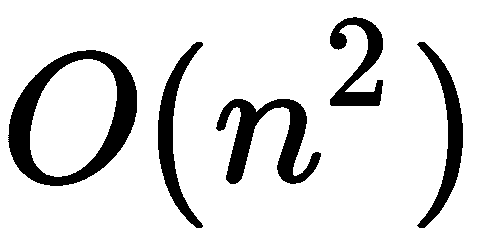，Louvain 算法已被用于包括 Twitter 在内的大数据集中，该数据集包含 2.4 百万节点和 3800 万链接。

Louvain 算法的主要思想是通过逐步合并社区来增加它们的连接性。连接性通过边模块度来衡量，这是社区内边缘与其他社区顶点相连的密度与其他社区顶点的比例。每个顶点的社区切换都有一个相关的。在将每个顶点分配到它们自己的社区后，启发式操作分为两步：将顶点贪婪地分配到社区，以及粗粒度化。

+   对于所有顶点 ，分配它们到社区，使得 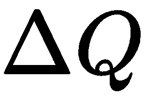 尽可能高。这一步骤可以重复几次，直到模块度不再改善。

+   所有社区都被视为顶点。这意味着边也被分组在一起，以便所有属于被分组顶点的边现在成为新创建顶点的边。

直到模块度再无改善为止，这两个步骤将被重复进行。

#### Girvan-Newman 算法

作为另一种算法的例子，让我们看看 Girvan-Newman 算法。Girvan-Newman 算法（由 Girvan 和 Newman，2002 年提出，相关论文请参见 [`www.pnas.org/content/99/12/7821`](https://www.pnas.org/content/99/12/7821)）基于节点间的最短路径概念。**边介数**是边上运行的节点之间最短路径数。

算法工作如下：

1.  计算所有边的边介数。

1.  移除具有最高边介数的边。

1.  重新计算边的边介数。

1.  重复 *步骤 2* 和 *步骤 3* 直到没有边剩余。

结果是一个树状图，显示了算法步骤中聚类的排列方式。

整个算法的时间复杂度为 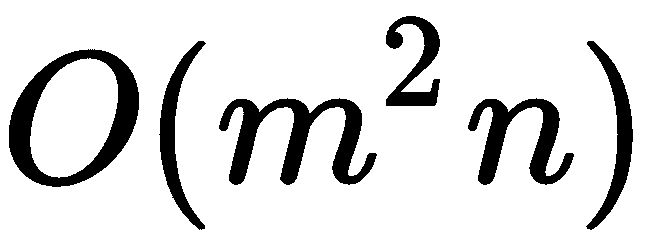，具有边数 *m* 和顶点数 *n*。

### 信息熵

给定一个离散随机变量 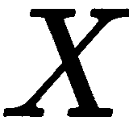，其可能值（或结果）为 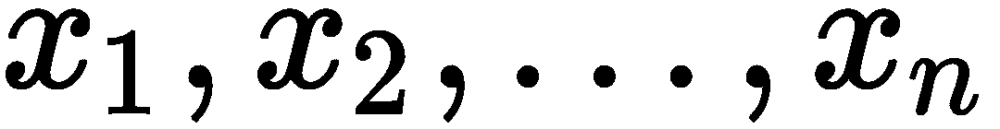，以概率 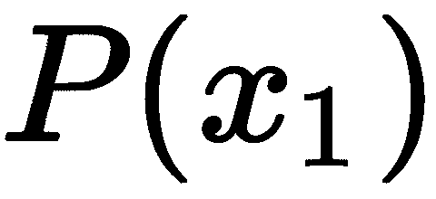 发生， 的熵正式定义如下：

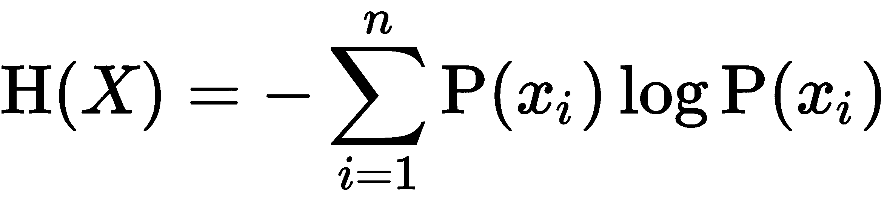

这通常被视为随机变量中的意外性、不确定性或混乱程度。

如果变量不是离散的，我们可以应用分箱（例如，通过直方图）或者使用非离散版本的公式。

## 还有更多...

我们也可以应用其他算法，如 2005 年由 David Pearce 发布的 SCC 算法（在《找到有向图的强连通分量的改进算法》中）。

我们也可以尝试这种方法：

```py
from scipy.sparse.csgraph import connected_components

n_components, labels = connected_components(
    A,
    directed=False,
    return_labels=True
)
```

SCC 社区欺诈分布如下：

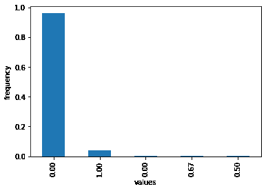

再次得到一个 p 值，显示出非常高的统计显著性。这意味着这不太可能仅仅是偶然发生的，表明我们的方法确实是欺诈的良好分类器。

我们也可以应用更传统的聚类算法。例如，亲和传播算法接受一个邻接矩阵，如下所示：

```py
from sklearn.cluster import AffinityPropagation

ap = AffinityPropagation(
    affinity='precomputed'
).fit(A)
```

还有许多其他方法可供我们应用。对于其中一些方法，我们需要将邻接矩阵转换为距离矩阵。

## 参见

您可以在 GitHub 上找到有关图分类和图算法的阅读材料，由 Benedek Rozemberczki 收集，网址为 [`github.com/benedekrozemberczki/awesome-graph-classification`](https://github.com/benedekrozemberczki/awesome-graph-classification)。

如果您对图卷积网络或图注意力网络感兴趣，还有一个对您有用的列表在 [`github.com/Jiakui/awesome-gcn`](https://github.com/Jiakui/awesome-gcn)。

Python 有一些非常好的图库，具有许多用于社区检测或图分析的实现：

+   Cdlib: [`cdlib.readthedocs.io/en/latest/`](https://cdlib.readthedocs.io/en/latest/)

+   Karateclub: [`karateclub.readthedocs.io/en/latest/`](https://karateclub.readthedocs.io/en/latest/)

+   Networkx：[`networkx.github.io/`](https://networkx.github.io/)

+   标签传播：[`github.com/yamaguchiyuto/label_propagation`](https://github.com/yamaguchiyuto/label_propagation)

大多数 Python 库适用于小到中型邻接矩阵（大约高达 1,000 条边）。适用于更大数据规模的库包括以下内容：

+   Snap.py：[`snap.stanford.edu/snappy/index.html`](https://snap.stanford.edu/snappy/index.html)

+   Python-louvain：[`github.com/taynaud/python-louvain`](https://github.com/taynaud/python-louvain)

+   Graph-tool：[`graph-tool.skewed.de/`](https://graph-tool.skewed.de/)

Cdlib 还包含 BigClam 算法，适用于大图。

一些图数据库如 neo4j，带有 Python 接口，实现社区检测算法：[`neo4j.com/docs/graph-algorithms/current/`](https://neo4j.com/docs/graph-algorithms/current/)。
