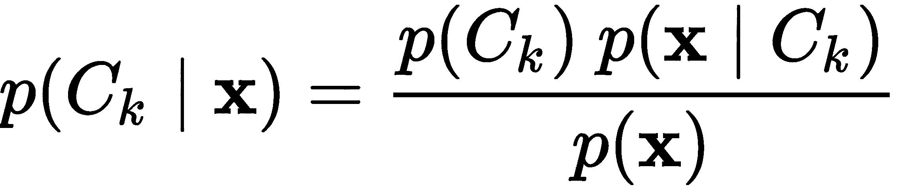

概率建模

本章讨论不确定性和概率方法。现代机器学习系统存在两个显著的缺点。

首先，它们在预测中可能过于自信（有时过于不自信）。在实践中，鉴于嘈杂的数据，即使我们观察到使用未见数据集进行交叉验证的最佳实践，这种信心也可能不合理。特别是在受监管或敏感环境中，如金融服务、医疗保健、安全和情报领域，我们需要非常谨慎地对待我们的预测及其准确性。

其次，机器学习系统越复杂，我们需要更多的数据来拟合我们的模型，过拟合的风险也越严重。

概率模型是使用随机采样技术产生概率推断的模型。通过参数化分布和固有的不确定性，我们可以克服这些问题，并获得否则需要更多数据才能获得的准确性。

在本章中，我们将使用不同的插件方法建立股票价格预测模型，并进行置信度估计。然后，我们将涵盖估计客户生命周期，这是为服务客户的企业所共有的问题。我们还将研究诊断疾病，并量化信用风险，考虑不同类型的不确定性。

本章涵盖以下配方：

+   以信心预测股票价格

+   估算客户生命周期价值

+   诊断疾病

+   阻止信用违约

# 技术要求

在本章中，我们主要使用以下内容：

+   如前所述的 scikit-learn

+   如前所述的 Keras

+   Lifetimes ([`lifetimes.readthedocs.io/`](https://lifetimes.readthedocs.io/))，用于客户生命周期价值的库

+   `tensorflow-probability` (**tfp**; [`www.tensorflow.org/probability`](https://www.tensorflow.org/probability))

您可以在 GitHub 上找到本章的代码，链接为 [`github.com/PacktPublishing/Artificial-Intelligence-with-Python-Cookbook/tree/master/chapter04`](https://github.com/PacktPublishing/Artificial-Intelligence-with-Python-Cookbook/tree/master/chapter04)。

# 以信心预测股票价格

有效市场假说假定在任何给定时间，股票价格集成了关于股票的所有信息，因此市场不能通过优越的策略或更一般地说更好的信息持续超越。然而，可以争论说当前在投资银行实践中，机器学习和统计被构建到算法交易系统中，这与之相矛盾。但这些算法可能会失败，正如 2010 年的闪电崩盘或系统风险被低估时所见，Roger Lowenstein 在他的书 *当天才失败时：长期资本管理的兴衰* 中讨论过。

在这个示例中，我们将在 scikit-learn 中构建一个简单的股票预测管道，并使用不同的方法生成概率估计。然后，我们将评估我们的不同方法。

## 准备好

我们将使用`yfinance`库检索历史股票价格。

这是我们安装它的方式：

```py
pip install yfinance
```

`yfinance` 将帮助我们下载历史股票价格。

## 如何做到...

在实际情况中，我们希望回答以下问题：在价格水平给定的情况下，它们会上涨还是下跌，以及幅度如何？

为了朝着这个目标取得进展，我们将按以下步骤进行：

1.  下载股票价格。

1.  创建一个特征化函数。

1.  编写一个评估函数。

1.  训练模型来预测股票并比较性能。

特别地，我们将比较以下生成置信度值的方法：

+   Platt 缩放

+   朴素贝叶斯

+   保序回归

我们将讨论这些方法及其背景在*它是如何工作...*部分。

让我们试一下！

1.  **下载股票价格**：我们将下载微软的价格：

```py
import yfinance as yf

msft = yf.Ticker('MSFT')
hist = msft.history(period='max')
```

现在我们有我们的股票价格作为`pandas` DataFrame `hist`可用。

1.  **创建一个特征化函数**：所以，让我们从一个函数开始，这个函数将为我们提供一个训练和预测的数据集，给定一个窗口大小和一个移动；基本上，我们想要为每个价格获取多少描述符，并且我们要看多远的未来：

```py
from typing import Tuple
import numpy as np
import pandas as pd
import scipy

def generate_data(
    data: pd.DataFrame, window_size: int, shift: int
) -> Tuple[np.array, np.array]:
    y = data.shift(shift + window_size)
    observation_window = []
    for i in range(window_size):
        observation_window.append(
            data.shift(i)
        )
    X = pd.concat(observation_window, axis=1)
    y = (y - X.values[:, -1]) / X.values[:, -1]
    X = X.pct_change(axis=1).values[:, 1:]
    inds = (~np. isnan(X).any(axis=1)) & (~np. isnan(y))
    X, y = X[inds], y[inds]
    return X, y
```

然后，我们将使用我们的新函数`generate_data()`生成我们的训练和测试数据集：

```py
from sklearn.model_selection import train_test_split

X, y = generate_data(hist.Close, shift=1, window_size=30)
X_train, X_test, y_train, y_test = train_test_split(X, y)
```

当然，这是一个常见的模式，我们在前面的示例中已经见过几次了：我们生成我们的数据集，然后将其拆分为训练和验证集，其中训练集用于训练（正如其名称所示），验证集用于检查我们的算法的工作效果（特别是我们是否过度拟合）。

我们的数据集大致符合正态分布。这是我们在训练中目标的样子：


我们可以看到有一个向左的偏斜，即比零更多的值在下方（大约 49%）而不是在上方（大约 43%）。这意味着在训练中，价格会下降而不是上涨。

我们的数据集还没有完成，但是我们需要进行另一次转换。我们的场景是，我们想应用这个模型来帮助我们决定是否购买股票，假设价格会上涨。我们将分离三个不同的类别：

+   价格上涨了 *x*。

+   价格保持不变。

+   价格下降了 *x*。

在下面的代码块中，我们根据`threshold`参数应用了`x`给定的截止值：

```py
def threshold_vector(x, threshold=0.02):
    def threshold_scalar(f):
        if f > threshold:
            return 1
        elif f < -threshold:
            return -1
        return 0
    return np.vectorize(threshold_scalar)(x)

y_train_classes, y_test_classes = threshold_vector(y_train), threshold_vector(y_test)
```

在此之后，我们对训练和测试（验证）的阈值化 *y* 值进行了处理。

1.  **编写一个评估函数**：这是为了衡量我们在使用给定模型预测股票价格时的性能。对于评估，我们需要一个帮助函数，将整数编码转换为一位有效编码。

在评估中，我们计算并打印**曲线下面积**（**AUC**）作为性能指标。我们创建了一个函数，`measure_perf()`，用于测量性能并打印相关指标，给定像这样的模型：

```py
from sklearn import metrics

def to_one_hot(a):
    """convert from integer encoding to one-hot"""
    b = np.zeros((
       a.size, 3
    ))
    b[np.arange(a.size), a+1] = 1
    return b

def measure_perf(model, y_test_classes):
  y_pred = model.predict(X_test)
  auc = metrics.roc_auc_score(
    to_one_hot(y_test_classes),
    to_one_hot(y_pred),
    multi_class='ovo'
  )
  print('AUC: {:.3f}'.format(auc))
```

现在我们可以使用我们的新方法来评估模型训练后的性能。

1.  **训练模型以预测股票并比较性能**：我们现在将比较以下方法，以从我们的三个模型中生成概率结果，前两种我们可以快速实现：

```py
from sklearn.ensemble import RandomForestClassifier
from sklearn.calibration import CalibratedClassifierCV

rf = RandomForestClassifier(
    n_estimators=500, n_jobs=-1
).fit(X_train, y_train_classes)
platt = CalibratedClassifierCV(
    rf, method='sigmoid'
).fit(X_train, y_train_classes)
isotonic = CalibratedClassifierCV(
    rf, method='isotonic'
).fit(X_train, y_train_classes)
print('Platt:')
measure_perf(platt, y_test_classes)
print('Isotonic:')
measure_perf(isotonic, y_test_classes)
#Platt:
#AUC: 0.504
#Isotonic:
#AUC: 0.505
```

对于朴素贝叶斯，我们尝试不同的变体：分类朴素贝叶斯和补集朴素贝叶斯：

```py
from sklearn.ensemble import StackingClassifier
from sklearn.naive_bayes import ComplementNB, CategoricalNB

def create_classifier(final_estimator):
    estimators = [
        ('rf', RandomForestClassifier(
            n_estimators=100,
            n_jobs=-1
        ))
    ] 
    return StackingClassifier(
        estimators=estimators,
        final_estimator=final_estimator,
        stack_method='predict_proba'
    ).fit(X_train, y_train_classes)

measure_perf(create_classifier(CategoricalNB()), y_test_classes)
measure_perf(create_classifier(ComplementNB()), y_test_classes)
#CategoricalNB:
#AUC: 0.500
#ComplementNB: 
#AUC: 0.591
```

我们发现，无论是 Platt 缩放（逻辑回归）还是等渗回归都无法很好地处理我们的数据集。朴素贝叶斯回归不比随机选择好多少，这让我们不愿意拿来押注，即使稍微比随机选择好一点。然而，补集朴素贝叶斯分类器的表现要好得多，达到了 59%的 AUC。

## 工作原理...

我们已经看到，我们可以创建一个股票价格预测器。我们将这个过程分解为创建数据、验证和训练模型。最终，我们找到了一种方法，可以让我们对其实际使用抱有希望。

让我们先生成数据，然后再使用我们的不同方法。

### 特征化

这对于任何人工智能工作都是至关重要的。在处理任何工作或首次查看数据集之前，我们应该问自己我们选择什么作为我们观察单位的单元，并且我们如何以有意义且可以被算法捕捉的方式描述我们的数据点。这是一种随着经验变得自动化的事情。

在我们的`generate_data()`函数中，我们从股票价格历史数据中提取了用于训练和测试的数据集。我们专注于预测单个价格，因此我们的观察单元是单个股票价格。对于每个价格，我们需要提取特征，即其他价格。我们跨越时间段提取价格，这可以帮助我们预测未来的值。更准确地说，我们不直接使用价格；我们必须先对其进行归一化，因此最好将其称为价格水平而不是价格。

使用我们的方法，我们为预测参数化我们的数据，不同的时间视野和一些点。价格水平是在一个窗口内提取的，一段时间内的天数（特征）。最后，将来的价格水平将被预测（目标）。时间段和偏移是我们的两个额外参数：`window_size` 和 `shift`。该函数返回*x*，包含其窗口内的股票价格历史，以及*y*，未来要预测的股票价格。

还有更多问题需要解决。我们已经看到了在时间序列数据处理中的一些方法，在《预测 CO2 时间序列》这一章节的《高级监督学习主题》中。特别是在这个配方中，平稳性和标准化也是需要考虑的问题（你可能想要翻回去看看那里的解释）。

特征被标准化为平均值为 0，然后作为百分比变化差异（每个窗口中的每个值到前一个值的差异）。差异步骤是为了引入平稳性度量。特别地，目标被表达为相对于窗口中最后一个值的百分比变化，即特征。

接下来我们将看一下 Platt 缩放，这是一种将模型预测缩放为概率输出的最简单方法之一。

### Platt 缩放

Platt 缩放（John Platt，1999 年，*支持向量机的概率输出及其与正则化似然方法的比较*）是我们使用的第一种模型结果缩放方法。简单来说，它是在我们的分类器预测之上应用逻辑回归。逻辑回归可以表达为以下形式（方程式 1）：


这里的 *A* 和 *B* 是通过最大似然方法学习得到的。

我们正在寻找 *A* 和 *B*，如下所示：


这里的 *p* 指的是前述的方程式 1。

作为梯度下降，我们可以迭代应用以下两个步骤之一：

1.  计算梯度作为似然函数的微分。

1.  根据学习速率缩放的梯度来更新参数。

在接下来的小节中，我们将探讨使用保序回归进行概率校准的替代方法。

### 保序回归

保序回归（Zadrozny 和 Elkan，2001 年，*当成本和概率均未知时的学习和决策*）是使用保序函数进行回归的方法，即作为函数逼近时，最小化均方误差的同时保持单调递增或非减。

我们可以表达为以下形式：


这里 *m* 是我们的保序函数，*x* 和 *y* 是特征和目标，*f* 是我们的分类器。

接下来，我们将看一个最简单的概率模型之一，朴素贝叶斯。

### 朴素贝叶斯

朴素贝叶斯分类器基于贝叶斯定理。

贝叶斯定理是关于条件概率的定理，表示事件 *A* 发生在 *B* 给定的条件下：


*P(A)* 是观察到 *A* 的概率（*A* 的边际概率）。考虑到公式中的 *P(B)* 在分母中，不能为零。这背后的推理值得一读。

朴素贝叶斯分类器涉及到给定特征的类别概率。我们可以将类别 *k* 和特征 *x* 插入到贝叶斯定理中，如下所示：



它被称为朴素是因为它假设特征彼此独立，因此提名者可以简化如下：


在接下来的部分中，我们将查看额外的材料。

## 请参阅

这里有一些资源供您参考：

+   对于 Platt 缩放，请参阅 John Platt 的*支持向量机的概率输出及与正则化似然方法的比较*（1999 年）。

+   对于同位素回归，在我们应用于分类中的概率估计，请参阅 Zadrozny, B.和 Elkan, C.的*将分类器分数转换为准确的多类别概率估计*（2002 年）。

+   对于两者的比较，请参阅 A. Niculescu-Mizil & R. Caruana 在 ICML（2005 年）上的*使用监督学习预测良好概率*。关于朴素贝叶斯算法，请参阅 Rennie, J. D.等人的*Tackling the Poor Assumptions of Naive Bayes Text Classifiers*（2003 年）。

+   scikit-learn 文档概述了置信度校准（[`scikit-learn.org/stable/auto_examples/calibration/plot_calibration_curve.html#sphx-glr-auto-examples-calibration-plot-calibration-curve-py`](https://scikit-learn.org/stable/auto_examples/calibration/plot_calibration_curve.html#sphx-glr-auto-examples-calibration-plot-calibration-curve-py)）。

+   对于应用于深度学习模型的方法，请参阅 Lee 等人在 ICLR 2018 年的论文，*训练置信度校准的分类器以检测分布外样本*（[`arxiv.org/abs/1711.09325`](https://arxiv.org/abs/1711.09325)）。他们的代码可在 GitHub 上找到：[`github.com/alinlab/Confident_classifier`](https://github.com/alinlab/Confident_classifier)。

您可以在以下链接找到更多关于不同框架下时间序列概率分析的示例：

+   **bayesloop**：分析股市波动 – [`docs.bayesloop.com/en/stable/examples/stockmarketfluctuations.html`](http://docs.bayesloop.com/en/stable/examples/stockmarketfluctuations.html)

+   **Tensorflow Probability**：不同方法 – [`www.tensorflow.org/probability/examples/Structural_Time_Series_Modeling_Case_Studies_Atmospheric_CO2_and_Electricity_Demand`](https://www.tensorflow.org/probability/examples/Structural_Time_Series_Modeling_Case_Studies_Atmospheric_CO2_and_Electricity_Demand)

+   **Pyro**：高斯过程时间序列建模 – [`pyro.ai/examples/timeseries.html`](https://pyro.ai/examples/timeseries.html)

# 估算客户生命周期价值

在本示例中，我们将学习如何计算生命周期价值以及顾客为公司提供的价值。这对于营销预算非常重要，例如基于客户细分的潜在获取或广告支出。我们将通过分别对时间内客户购买模式的变化和购买价值进行建模来实现这一点。

## 准备就绪

我们需要`lifetimes`包来完成这个配方。让我们按照以下代码安装它：

```py
pip install lifetimes
```

现在我们可以开始了。

## 如何做...

用于客户生命周期价值的数据集可以是交易性的，也可以是客户汇总的。

摘要数据应包括以下统计信息：

+   **T**：交易期间；客户第一次购买后经过的时间

+   **频率**：观察期内客户的购买次数

+   **货币价值**：购买的平均价值

+   **最近**：客户在最后一次购买时的年龄

让我们从第一步开始！

1.  我们首先将**BetaGeo**（**BD**）/**负二项分布**（**NBD**）模型拟合到客户交易摘要数据集上：

```py
from lifetimes.datasets import load_cdnow_summary_data_with_monetary_value
from lifetimes import BetaGeoFitter

bgf = BetaGeoFitter(penalizer_coef=0.0)
bgf.fit(
   data['frequency'],
    data['recency'],
    data['T']
)
```

1.  Gamma-Gamma 模型用于购买价值不能处理没有重复购买的客户，因此在拟合之前我们将排除这些客户：

```py
from lifetimes import GammaGammaFitter

data_repeat = data[data.frequency>0]
ggf = GammaGammaFitter(penalizer_coef=0.0)
ggf.fit(
    data_repeat.frequency,
    data_repeat.monetary_value
)
```

1.  然后，我们可以使用 Lifetimes 库的另一个方法结合预测模型（预测未来交易数量的模型`bgf`和预测平均购买价值的模型`ggf`）。它包括一个对未来价值进行折现的参数。我们将包括对应年化 12.7%的折现。我们将打印五个客户的生命周期价值：

```py
print(ggf.customer_lifetime_value(
    bgf,
    data['frequency'],
    data['recency'],
    data['T'],
    data['monetary_value'],
    time=12,
    discount_rate=0.01
).head(5))
```

输出显示了客户生命周期价值：

```py
customer_id
1      140.096218
2       18.943466
3       38.180575
4       38.180575
5       38.180575
```

现在我们知道谁是我们最好的客户，因此知道在哪里投资我们的时间和资源！

让我们看看这个配方中的一些方法。

## 工作原理...

在这个配方中，我们根据他们的购买模式估计了客户的生命周期价值。

每个客户对公司有一个价值。这对于市场预算非常重要 - 例如，基于客户细分的潜在获取或广告支出。实际的客户生命周期价值在客户离开公司后才知道；然而，我们可以为每个客户建立两个不同的概率预测模型：

+   建模购买更多产品的可能性

+   建模平均值（收入）的购买

我们使用 BG/NBD 模型建模购买频率 - 或者更精确地说，随时间变化的客户购买模式 - 并使用 Gamma-Gamma 模型建模购买价值。这两个模型都利用了变量之间的非线性关系。

最后，我们可以按照以下公式结合预测以获取生命周期价值：


让我们看看我们在这里使用的两个子模型。

### BG/NBD 模型

这考虑了客户的购买频率和客户的退出概率。

它包含以下假设：

+   每个客户的购买都遵循带有λ参数的泊松分布。

+   每次交易后，客户的流失概率*p*遵循贝塔分布。

+   交易率和客户之间的退出概率是独立的。

可以根据最大似然估计来估计λ和*p*参数。

### 伽玛-伽玛模型

此模型用于估计客户终身的平均交易价值，*E(M)*，我们对其有一个不完美的估计，如下所示：


在这里，*x*是客户终身内（未知的）总购买次数，*z*是每次购买的价值。

我们假设*z*是从伽玛分布中抽样的，因此，模型的拟合涉及在个体水平上找到形状和比例参数。

## 另请参见

这个示例比较短，因为 Lifetimes 库已经做了很多必要功能的插件和播放。关于这种分析的扩展解释可以在 Lifetimes 文档中找到（[`lifetimes.readthedocs.io/en/latest/Quickstart.html`](https://lifetimes.readthedocs.io/en/latest/Quickstart.html)）。

Lifetimes 库提供了一系列模型（称为**fitters**），您可能想要深入了解。关于本示例中两种方法的更多详细信息，请参阅 Fader 等人的*Counting your Customers the Easy Way: An Alternative to the Pareto/NBD Model*, 2005 年以及 Batislam 等人的*Empirical validation and comparison of models for customer base analysis*, *2007 年*。您可以在 Fader 和 Hardi 的报告*Gamma-Gamma Model of Monetary Value*（2013 年）中找到关于伽玛-伽玛模型的详细信息。

Google Cloud Platform GitHub 仓库展示了一个客户终身价值估算的模型比较（[`github.com/GoogleCloudPlatform/tensorflow-lifetime-value`](https://github.com/GoogleCloudPlatform/tensorflow-lifetime-value)），包括 Lifetimes，一个 TensorFlow 神经网络和 AutoML。你可以在 UCI 机器学习存档中找到一个非常类似的在线零售数据集（[`archive.ics.uci.edu/ml/datasets/Online+Retail`](http://archive.ics.uci.edu/ml/datasets/Online+Retail)）。

Lifelines 是一个由 Lifetimes 的作者 Cameron Davidson-Pilon 编写的生存回归库（[`lifelines.readthedocs.io/en/latest/Survival%20Regression.html`](https://lifelines.readthedocs.io/en/latest/Survival%20Regression.html)）。

# 诊断疾病

对于概率建模，实验性库不胜枚举。运行概率网络可能比算法（非算法）方法慢得多，直到不久前，它们几乎对除了非常小的数据集外的任何事物都不实用。事实上，大多数教程和示例都是关于玩具数据集的。

然而，由于硬件更快和变分推断的进步，在近年来这种情况发生了变化。利用 TensorFlow Probability，即使进行了概率抽样并且完全支持 GPU，也通常可以简单地定义架构、损失和层，并支持最新的实现来进行快速训练。

在这个示例中，我们将实现一个在医疗保健领域的应用程序 - 我们将诊断一种疾病。

## 准备工作

我们已经在之前的章节中安装了 scikit-learn 和 TensorFlow。

对于这个示例，我们还需要安装 `tensorflow-probability`。

```py
pip install tensorflow-probability
```

现在安装了 `tensorflow-probability`，我们将在下一节中广泛使用它。

## 怎样做…

我们将把这个过程分解为几个步骤：

1.  下载并准备数据

1.  创建神经网络

1.  模型训练

1.  验证

我们将从 Python 中获取数据集的步骤开始：

1.  **下载并准备数据**：我们将下载在匈牙利心脏病学院由 Andras Janosi 团队收集的症状和心脏病诊断数据集（[`www.openml.org/d/1565/`](https://www.openml.org/d/1565/)），然后在 Keras 中构建神经网络，并根据症状进行概率诊断。

如之前一样，我们将从 OpenML 下载数据集。您可以在那里看到完整的描述。原始目标编码了不同的状态，其中 0 表示健康，其他数字表示疾病。因此，我们将在健康和非健康之间分开，并将其视为二元分类问题。我们应用标准缩放器，以便将 z 分数馈送给神经网络。所有这些在 Chapter 1、*Getting Started with Artificial Intelligence in Python*、Chapter 2、*Advanced Topics in Supervised Machine Learning*、Chapter 3、*Patterns, Outliers, and Recommendations* 和 Chapter 4、*Probabilistic Modeling* 等几个早期的章节中应该是熟悉的：

```py
from sklearn.datasets import fetch_openml
from sklearn.preprocessing import StandardScaler
from sklearn.model_selection import train_test_split

X, y = fetch_openml(data_id=1565, return_X_y=True, as_frame=True)
target = (y.astype(int) > 1).astype(float)
scaler = StandardScaler()
X_t = scaler.fit_transform(X)
Xt_train, Xt_test, y_train, y_test = train_test_split(
    X_t, target, test_size=0.33, random_state=42
)
```

现在，我们已经预处理并将数据集拆分为训练集和测试集。

1.  **创建神经网络**：网络的构建本身很简单，看起来与我们之前见过的任何 Keras 网络非常相似。不同之处在于末端有一个 `DistributionLambda` 层，我们将在下一节中解释它：

```py
import tensorflow as tf
import tensorflow_probability as tfp
tfd = tfp.distributions
from tensorflow import keras

negloglik = lambda y, p_y: -p_y.log_prob(y)

model = keras.Sequential([
  keras.layers.Dense(12, activation='relu', name='hidden'),
  keras.layers.Dense(1, name='output'),
  tfp.layers.DistributionLambda(
      lambda t: tfd.Bernoulli(logits=t)
  ),
])

model.compile(optimizer=tf.optimizers.Adagrad(learning_rate=0.05), loss=negloglik)
```

需要注意的是，我们不像在二元分类任务中那样最后以 `Dense(2, activation='softmax'` 层结束，而是将输出减少到我们概率分布需要的参数数量，对于伯努利分布而言，仅需一个参数，即二进制结果的期望平均值。

我们使用的是一个只有 181 个参数的相对较小的模型。在 *How it works...* 节中，我们将解释损失函数。

1.  **模型训练**：现在，我们可以训练我们的模型。我们将在 `tensorboard` 中绘制训练损失，并启用早停：

```py
%load_ext tensorboard
callbacks = [
    keras.callbacks.EarlyStopping(patience=10, monitor='loss'),
    keras.callbacks.TensorBoard(log_dir='./logs'),
]
history = model.fit(
    Xt_train,
    y_train.values,
    epochs=2000,
    verbose=False,
    callbacks=callbacks
)
```

该网络将运行 2,000 个周期，完成可能需要一段时间。从 TensorBoard 中，我们可以看到各周期的训练损失：


1.  **验证模型**：现在我们可以从模型中进行抽样。每个网络预测都给出了均值和方差。我们可以查看单个预测。我们任意选择了第 `10` 个预测：

```py
from scipy.stats import norm
import matplotlib.pyplot as plt

y_pred = model(Xt_test)
a = y_pred.mean().numpy()[10]
b = y_pred.variance().numpy()[10]
fig, ax = plt.subplots(1, 1)
x = np.linspace(
    norm.ppf(0.001, a, b),
    norm.ppf(0.999, a, b),
    100
)
pdf = norm.pdf(x, a, b)
ax.plot(
    x, 
    pdf / np.sum(pdf), 
    'r-', lw=5, alpha=0.6, 
    label='norm pdf'
)
plt.ylabel('probability density')
plt.xlabel('predictions')
```

此预测如下所示：


因此，每个预测都是来自伯努利过程的样本。我们可以使用累积分布函数将每个预测转换为类别概率：

```py
def to_classprobs(y_pred):
    N = y_pred.mean().numpy().shape[0]
    class_probs = np.zeros(
        shape=(N, 2)
    )
    for i, (a, b) in enumerate(
        zip(
            y_pred.mean().numpy(),
            y_pred.variance().numpy()
        )
    ):
        conf = norm.cdf(0.5, a, b)
        class_probs[i, 0] = conf
        class_probs[i, 1] = 1 - conf
    return class_probs

class_probs = to_classprobs(y_pred)
```

现在，我们可以计算曲线下面积以及其他与测试目标相关的指标：

```py
import sklearn

def to_one_hot(a):
    """convert from integer encoding to one-hot"""
    b = np.zeros((a.size, 2))
    b[np.arange(a.size), np.rint(a).astype(int)] = 1
    return b

sklearn.metrics.roc_auc_score(
    to_one_hot(y_test),
    class_probs
)
print('{:.3f}'.format(sklearn.metrics.roc_auc_score(to_one_hot(y_test), class_probs)))
0.859
```

85% 的 AUC 听起来不错。但我们在医疗领域工作，因此我们需要检查召回率（也称为敏感性）和精度；换句话说，我们是否检测到了所有患病的患者，并且如果我们诊断某人，他们是否确实患病？如果我们漏掉某人，他们可能会死于未治疗的情况。如果我们将所有人都诊断为患病，将会给资源带来压力。

在以下代码段中，我们将更详细地查看我们得到的结果：

```py
from sklearn.metrics import plot_precision_recall_curve
import matplotlib.pyplot as plt
from sklearn.metrics import average_precision_score

class ModelWrapper(sklearn.base.ClassifierMixin):
    _estimator_type = 'classifier'
    classes_ = [0, 1]
    def predict_proba(self, X):
        pred = model(X)
        return to_classprobs(pred)

model_wrapper = ModelWrapper()
average_precision = average_precision_score(
    to_one_hot(y_test),
    class_probs
)
fig = plot_precision_recall_curve(
    model_wrapper, Xt_test, y_test
)
fig.ax_.set_title(
    '2-class Precision-Recall curve: '
    'AP={0:0.2f}'.format(average_precision)
)
```

这通过可视化我们的结果来更好地理解精度和召回率之间的权衡。

我们得到以下图表：


这条曲线展示了我们模型固有的召回率和精度之间的权衡。在我们的置信度（或类别概率）上采用不同的截断时，我们可以判断某人是否患病。如果我们想要找到所有人（`召回率=100%`），精度会下降到 40%以下。另一方面，如果我们希望在诊断某人患病时始终正确（`精度=100%`），那么我们将会错过所有人（`召回率=0%`）。

现在的问题是，分别错过人员或诊断过多的成本，以便对是否某人患病做出决定。考虑到治疗人员的重要性，也许在召回率约为 90%和精度约为 65%左右之间存在一个最佳点。

## 工作原理是这样的...

我们训练了一个神经网络来进行概率预测，用于诊断疾病。让我们分析一下这个过程，并了解我们在这里使用的内容。

### 随机不确定性

TensorFlow Probability 提供了多种用于建模不同类型不确定性的层。**随机不确定性**指的是在给定相同输入的情况下，结果的随机变化性——换句话说，我们可以学习数据中的分布情况。

我们可以通过在 Keras 和 TensorFlow Probability 中参数化描述预测的分布，而不是直接预测输入来实现这一点。基本上，`DistributionLambda`从分布中抽取样本（在我们的情况下是伯努利分布）。

### 负对数似然

我们使用负对数似然作为我们的损失函数。这种损失函数通常用于最大似然估计。

我们定义的是这样的：

```py
negloglik = lambda y, p_y: -p_y.log_prob(y)
```

损失函数接受两个值：`y`，目标值，以及提供`log_prob()`方法的概率分布。该方法返回`y`处概率密度的对数。由于高值代表好结果，我们希望通过取负值来反转该函数。

### 伯努利分布

伯努利分布（有时称为硬币翻转分布）是一个具有两个结果的离散事件分布，其发生概率为*p*和*q = 1 - p*。它有一个单一的参数*p*。我们也可以选择其他建模选项，例如在 softmax 激活层之上的分类分布。

### 指标

最后，我们涉及了召回率和精确率。

它们的定义如下：


我们之前见过**真阳性**（**tp**）、**假阳性**（**fp**）和**假阴性**（**fn**）。作为提醒，真阳性指的是正确的预测，假阳性指的是错误地预测为正面的值，假阴性指的是错误地预测为负面的值。

## 另请参阅

在这个配方中，您已经看到如何为健康应用程序使用概率模型。有许多其他数据集和执行概率推断的不同方式。请查看 TensorFlow Probability 作为最具影响力的概率建模框架之一（[`www.tensorflow.org/probability`](https://www.tensorflow.org/probability)）。它提供了广泛的教程。

# 停止信用违约

对于向客户提供信用延伸的公司，为了盈利，批准申请的最重要标准是他们是否能够偿还债务。这由一个称为信用评分的过程决定，它基于客户的财务历史和社会经济信息。传统上，用于信用评分的是评分卡，尽管近年来，这些简单模型已被更复杂的机器学习模型所取代。评分卡基本上是不同信息项目的检查表，每个项目与分数相关联，最终所有分数相加并与及格分数进行比较。

我们将使用一个相对较小的信用卡申请数据集；然而，它仍然可以为我们提供一些关于如何使用神经网络模型进行信用评分的见解。我们将实现一个包含权重分布和输出分布的模型。这被称为认知不确定性和随机不确定性，将为我们提供更可靠的预测信息。

## 准备工作

我们将使用`tensorflow-probability`。以防您跳过了前面的配方*诊断疾病*，这里是如何安装它：

```py
pip install tensorflow-probability
```

现在，我们应该准备好使用 Keras 和`tensorflow-probability`了。

## 如何做...

让我们获取数据集并进行预处理，然后创建模型，训练模型并验证它：

1.  **下载和准备数据集**：我们将在这个示例中使用的数据集是在 2009 年发布的（I-Cheng Yeh 和 Che-hui Lien，《信用卡客户违约概率数据挖掘技术的比较》，），最初托管在 UCI 机器学习库上，网址为[`archive.ics.uci.edu/ml/datasets/default+of+credit+card+clients`](https://archive.ics.uci.edu/ml/datasets/default+of+credit+card+clients)。

我们将使用 scikit-learn 的实用函数通过`openml`下载数据：

```py
import numpy as np
from sklearn.datasets import fetch_openml

openml_frame = fetch_openml(data_id=42477, as_frame=True)
data = openml_frame['data']
```

这给我们提供了关于客户人口统计信息及其申请的特征。

我们将使用一个非常标准的预处理过程，这在本书中我们已经看过很多次，并且我们将轻松处理。我们本可以更深入地检查特征，或者在转换和特征工程上做更多工作，但这与本示例无关。

所有特征都注册为数值，因此我们只应用标准缩放。这里是预处理步骤，然后我们将其分为训练和测试数据集：

```py
from sklearn.preprocessing import StandardScaler
from sklearn.model_selection import train_test_split

scaler = StandardScaler()
X = scaler.fit_transform(
    data
)
target_dict = {val: num for num, val in enumerate(list(openml_frame['target'].unique()))}
y = openml_frame['target'].apply(lambda x: target_dict[x]).astype('float').values
X_train, X_test, y_train, y_test = train_test_split(
    X, y, test_size=0.33, random_state=42
)
```

现在，工作完成了，让我们创建模型。

1.  **创建模型**：首先，我们需要先验和后验分布。这是通过直接按照在线 TensorFlow 概率教程（[`www.github.com/tensorflow/probability/blob/master/tensorflow_probability/examples/jupyter_notebooks/Probabilistic_Layers_Regression.ipynb`](http://www.github.com/tensorflow/probability/blob/master/tensorflow_probability/examples/jupyter_notebooks/Probabilistic_Layers_Regression.ipynb)）进行的，适用于正态分布：

```py
import tensorflow as tf
import tensorflow_probability as tfp
import matplotlib.pyplot as plt
tfd = tfp.distributions
%matplotlib inline

negloglik = lambda y, rv_y: -rv_y.log_prob(y)
def prior_trainable(kernel_size, bias_size=0, dtype=None):
    n = kernel_size + bias_size
    return tf.keras.Sequential([
    tfp.layers.VariableLayer(n, dtype=dtype),
    tfp.layers.DistributionLambda(lambda t: tfd.Independent(
        tfd.Normal(loc=t, scale=1),
        reinterpreted_batch_ndims=1)),
    ])
def posterior_mean_field(kernel_size, bias_size=0, dtype=None):
    n = kernel_size + bias_size
    c = np.log(np.expm1(1.))
    return tf.keras.Sequential([
    tfp.layers.VariableLayer(2 * n, dtype=dtype),
    tfp.layers.DistributionLambda(lambda t: tfd.Independent(
        tfd.Normal(
            loc=t[..., :n],
            scale=1e-5 + tf.nn.softplus(c + t[..., n:])
        ),
    reinterpreted_batch_ndims=1)),
    ])
```

请注意`DenseVariational`。

现在来看主模型，在这里我们将使用先验和后验分布。你会认出`DistributionLambda`。我们从之前的示例中替换了`Binomial`，*诊断疾病*，用`Normal`，这将给我们一个预测方差的估计：

```py
model = tf.keras.Sequential([
    tfp.layers.DenseVariational(2, posterior_mean_field, prior_trainable, kl_weight=1/X.shape[0]),
    tfp.layers.DistributionLambda(
        lambda t: tfd.Normal(
            loc=t[..., :1],
            scale=1e-3 + tf.math.softplus(0.01 * t[...,1:])
        )
    ),
])
model.compile(
    optimizer=tf.optimizers.Adam(learning_rate=0.01),
    loss=negloglik
)
callback = tf.keras.callbacks.EarlyStopping(monitor='val_loss', patience=5)
model.fit(
    X_train,
    y_train,
    validation_data=(X_test, y_test),
    epochs=1000,
    verbose=False,
    callbacks=[callback]
)
```

拟合后，我们将模型应用于测试数据集并对其进行预测。

1.  **验证**：让我们检查一下我们的模型表现如何：

```py
from sklearn.metrics import roc_auc_score
preds = model(X_test)
roc_auc_score(y_test, preds.mean().numpy())
```

我们得到了约 70%的 AUC。由于这个摘要数字通常不能完全揭示全部情况，让我们也看看混淆矩阵：

```py
from sklearn.metrics import confusion_matrix
import pandas as pd
import seaborn as sns

cm = confusion_matrix(y_test, preds.mean().numpy() >= 0.5)
cm = pd.DataFrame(
 data=cm / cm.sum(axis=0),
 columns=['False', 'True'],
 index=['False', 'True']
)
sns.heatmap(
 cm,
 fmt='.2f',
 cmap='Blues',
 annot=True,
 annot_kws={'fontsize': 18}
)
```

此代码给出了以下混淆矩阵：


这个混淆矩阵列出了对实际违约的预测。在点对角线上，假-假和真-真是正确的预测（真正例和真反例）。我们可以看到，正确预测的数量比错误预测高，这让人感到安慰。

然而，最有趣的一点是预测的方差与误差相关！

```py
import scipy
scipy.stats.spearmanr(np.abs(y_test - preds.mean().numpy().squeeze()), preds.variance().numpy().squeeze())
```

我们得到了绝对误差与预测方差之间约 60%的秩相关。

这给了我们一个非常有用的实践信心估计。我们发现，对于测试点，误差较高的方差较大，而在预期误差较低的地方，方差较小。我们可以在散点图中查看绝对误差和方差：


这就结束了我们的配方。这个配方作为一个练习，让你尝试更好的预处理，调整模型，或者切换分布。

## 它的工作原理...

信用评分模型通常使用 logistic 回归模型，我们在本章中的*预测股票价格和置信度*配方中遇到过。另外，提升模型或可解释的决策树也在使用中。鉴于在线学习的能力和表示残差不确定性的能力，`tensorflow-probability` 提供了另一个实用的选择。

在这个配方中，我们创建了一个与认知不确定性一起工作的概率性信用违约预测模型。现在是时候解释这意味着什么了。

### 认知不确定性

这是与不完整信息相关的不确定性 - 换句话说，模型固有的不确定性。在与嘈杂的现实世界数据集中经常遇到认知不确定性。

在 TensorFlow Probability 中，这可以建模为权重不确定性。在这个配方中，我们使用了贝叶斯神经网络，其中权重是概率分布而不是标量估计。这种权重不确定性转化为预测中的不确定性，这正是我们想要看到的。

作为我们最终的网络层，我们加入了来自正态分布的随机性，以模拟阿莱托里克不确定性。相反，我们也可以假设这种变异性是已知的。

## 另请参阅

还有其他探索途径，比如库或额外的材料，我们将在这里列出。

在线可以找到类似的问题，比如以下内容：

+   通过预测财务困境进行信用评分：[`www.kaggle.com/c/GiveMeSomeCredit/data`](https://www.kaggle.com/c/GiveMeSomeCredit/data).

+   Lending Club 提供了大量的贷款申请数据集：[`www.lendingclub.com/info/download-data.action`](https://www.lendingclub.com/info/download-data.action).

+   保险索赔的索赔严重性预测：[`www.kaggle.com/c/allstate-claims-severity/data`](https://www.kaggle.com/c/allstate-claims-severity/data).

由于版权限制，我们不能在这里使用这些内容。

至于库，我们建议您看看这些：

+   risk-slim 是一个用于定制风险评分的 Python 库：[`github.com/ustunb/risk-slim`](https://github.com/ustunb/risk-slim).

+   scorecardpy 是一个用于评分卡开发的库：[`github.com/ShichenXie/scorecardpy`](https://github.com/ShichenXie/scorecardpy).

至于教程，Open Risk Manual 提供了关于使用 Python 进行信用评分的开放资源：[`www.openriskmanual.org/wiki/Credit_Scoring_with_Python`](https://www.openriskmanual.org/wiki/Credit_Scoring_with_Python).

NumPyro 为离婚率提供了贝叶斯回归的教程：[`pyro.ai/numpyro/bayesian_regression.html#Regression-Model-to-Predict-Divorce-Rate`](http://pyro.ai/numpyro/bayesian_regression.html#Regression-Model-to-Predict-Divorce-Rate)。
