启发式搜索技术和逻辑推理

在本章中，我们将介绍一系列问题解决工具。我们将从本体论和基于知识的推理开始，然后转向**布尔可满足性** (**SAT**)和组合优化的优化，其中我们将模拟个体行为和社会协调的结果。最后，我们将实现蒙特卡洛树搜索以找到国际象棋中的最佳着法。

在本章中，我们将涉及各种技术，包括逻辑求解器、图嵌入、**遗传算法** (**GA**)、**粒子群优化** (**PSO**)、SAT 求解器、**模拟退火** (**SA**)、蚁群优化、多主体系统和蒙特卡洛树搜索。

在本章中，我们将涵盖以下配方：

+   基于知识做出决策

+   解决 n 皇后问题

+   查找最短的公交路线

+   模拟疾病的传播

+   编写带有蒙特卡洛树搜索的国际象棋引擎

让我们开始吧！

# 基于知识做出决策

当关于一个主题有大量背景知识可用时，为什么不在做出决策时使用它？这被称为基于知识的系统。专家系统中的推理引擎和逻辑求解器中的统一化就是其中的例子。

在做出决策时，另一种检索知识的方式是基于在图中表示知识。图中的每个节点表示一个概念，而每条边表示一种关系。两者都可以嵌入并表示为表达它们与图中其他元素位置关系的数值特征。

在本配方中，我们将为每种可能性举例两次。

从亚里士多德到林奈再到今天的数学家和物理学家，人们试图通过将对象分类到系统顺序中来对世界进行排序，这被称为分类学。在数学上，分类法被表示为图，它表示信息作为元组*(s, o)*，其中主题 s 与对象 o 相连；或者三元组*(s, p, o)*，其中主题 a 与谓词 p 相关联到 o。经常使用的一种类型是 ISA 分类法，其中关系为 is-a 类型。例如，汽车是车辆，飞机也是车辆。

## 准备就绪

在这个配方中，我们将使用从 Python 的`nltk` (**自然语言工具包**)库接口的逻辑求解器，然后使用被称为`networkx`和`karateclub`的图库。

您需要使用的`pip`命令如下：

```py
pip install nltk karateclub networkx
```

对于这个配方的第二部分，我们还需要从 Kaggle 下载动物园数据集，可在[`www.kaggle.com/uciml/zoo-animal-classification`](https://www.kaggle.com/uciml/zoo-animal-classification)获取。

## 如何做到...

正如我们在这个配方的介绍中解释的那样，我们将从两种不同的方法来看待两个不同的问题。

我们将从使用逻辑求解器开始进行逻辑推理。

### 逻辑推理

在这个配方的这一部分，我们将使用`nltk`库捆绑的一些库来简单展示逻辑推理的一个示例。还有许多其他方法可以处理逻辑推理，我们将在配方末尾的*参考资料*部分中看到一些。

我们将使用一个非常简单的玩具问题，你可以在任何*101 – 逻辑入门*书籍中找到，尽管解决这类问题的方法可以更复杂。

我们的问题是众所周知的：如果所有人类都是可死的，苏格拉底是一个人类，那么苏格拉底是可死的吗？

我们可以在`nltk`中非常自然地表达这个过程，如下所示：

```py
from nltk import *
from nltk.sem import Expression

p1 = Expression.fromstring('man(socrates)')
p2 = Expression.fromstring('all x.(man(x) -> mortal(x))')
c = Expression.fromstring('mortal(socrates)')
ResolutionProver().prove(c, [p1, p2], verbose=True)
```

前面的代码给出了以下输出：

```py
[1] {-mortal(socrates)}     A 
[2] {man(socrates)}         A 
[3] {-man(z2), mortal(z2)}  A 
[4] {-man(socrates)}        (1, 3) 
[5] {mortal(socrates)}      (2, 3) 
[6] {}                      (1, 5) 
True
```

求解器提供的推理也可以很自然地阅读，所以我们不会在这里解释这个过程。我们将在*如何工作...*部分中学习其内部工作原理。

接下来，我们将看看知识嵌入。

### 知识嵌入

在这个配方的这一部分，我们将尝试利用信息如何相互关联，将其嵌入到一个可以作为特征化一部分的多维空间中。

这里，我们将加载数据，预处理数据，嵌入数据，然后通过对其新特征进行分类来测试我们的嵌入效果。让我们开始吧：

1.  **数据集加载和预处理**：首先，我们将像之前那样将动物园数据集加载到 pandas 中。然后，我们将确保将二进制列表示为`bool`而不是`int`：

```py
import pandas as pd
zoo = pd.read_csv('zoo.csv')
binary_cols = zoo.columns[zoo.nunique() == 2]
for col in binary_cols:
    zoo[col] = zoo[col].astype(bool)
labels = [
    'Mammal', 'Bird', 'Reptile',
    'Fish', 'Amphibian', 'Bug',
    'Invertebrate'
]
training_size = int(len(zoo) * 0.8)
```

动物园数据集包含 101 种动物，每种动物都有描述其是否有毛发或产奶等特征。这里，目标类别是动物的生物学类别。

1.  **图嵌入**：`get_triplet()`函数以(*s*, *p*, *o*)的格式返回二进制和整数元素的三元组。注意，我们是从完整数据集中创建三元组，而不仅仅是训练集。但是，为了避免目标泄漏，我们不会从训练集外的数据点创建三元组：

```py
all_labels = { i+1: c for i, c in enumerate(labels) }
cols = list(zoo.columns)

triplets = []
def get_triplet(row, col):
    if col == 'class_type':
        return (
            all_labels[row[col]],
            'is_a',
            row['animal_name'],
        )
    # int properties:
    if col in ['legs']:
        #if row[col] > 0:
        return (
            row['animal_name'],
            'has' + col,
            str(row[col]) + '_legs'
        )
        #else:
        # return ()
    # binary properties:
    if row[col]:
        return (
            row['animal_name'],
            'has',
            str(col)
        )
    else:
        return ()

for i, row in zoo.iterrows():
    for col in cols:
        if col == 'animal_name':
            continue
        if col == 'class_type' and i > training_size:
                continue
        triplet = get_triplet(row, col)
        if triplet:
            triplets.append(triplet)
```

前面的代码将创建我们的三元组。让我们看一些示例，了解它们的样子。以下是我们得到的前 20 个条目；我们使用`triplets[:20]`来获取它们：

```py
[('aardvark', 'has', 'hair'),
 ('aardvark', 'has', 'milk'),
 ('aardvark', 'has', 'predator'),
 ('aardvark', 'has', 'toothed'),
 ('aardvark', 'has', 'backbone'),
 ('aardvark', 'has', 'breathes'),
 ('aardvark', 'haslegs', '4_legs'),
 ('aardvark', 'has', 'catsize'),
 ('Mammal', 'is_a', 'aardvark'),
 ('antelope', 'has', 'hair'),
 ('antelope', 'has', 'milk'),
 ('antelope', 'has', 'toothed'),
 ('antelope', 'has', 'backbone'),
 ('antelope', 'has', 'breathes'),
 ('antelope', 'haslegs', '4_legs'),
 ('antelope', 'has', 'tail'),
 ('antelope', 'has', 'catsize'),
 ('Mammal', 'is_a', 'antelope'),
 ('bass', 'has', 'eggs'),
 ('bass', 'has', 'aquatic')]
```

前面的代码块展示了一些结果三元组的示例。总共，我们从 101 行中得到了 842 个三元组。

现在，我们可以使用`networkx` API 将这个数据集加载到图中：

```py
import networkx as nx

class Vocabulary:
    label2id = {}
    id2label = {}
    def lookup(self, word):
        """get word id; if not present, insert"""
        if word in self.label2id:
            return self.label2id[word]
        ind = len(self.label2id)
        self.label2id[word] = ind
        return ind

    def inverse_lookup(self, index):
        if len(self.id2label) == 0:
            self.id2label = {
                ind: label
                for label, ind in self.label2id.items()
            }
        return self.id2label.get(index, None)

vocab = Vocabulary()
nx_graph = nx.Graph()
for (a, p, b) in triplets:
    id1, id2 = vocab.lookup(a), vocab.lookup(b)
    nx_graph.add_edge(id1, id2)
```

`Vocabulary`类是`label2id`和`id2label`字典的包装器。我们需要这个类是因为一些图嵌入算法不接受节点或关系的字符串名称。在这里，我们在将概念标签存储到图中之前将其转换为 ID。

现在，我们可以用不同的算法对图进行数值嵌入。这里我们将使用`Walklets`：

```py
from karateclub.node_embedding.neighbourhood import Walklets

model_w = Walklets(dimensions=5)
model_w.fit(nx_graph)
embedding = model_w.get_embedding()
```

前面的代码显示了图中每个概念将由一个 5 维向量表示。

现在，我们可以测试这些特征是否对预测目标（`动物`）有用：

```py
trainamals = [
    vocab.label2id[animal]
    for animal in zoo.animal_name.values[:training_size]
]
testimals = [
    vocab.label2id[animal]
    for animal in zoo.animal_name.values[training_size:]
]
clf = SVC(random_state=42)
clf.fit(embedding[trainamals, :], zoo.class_type[:training_size])

test_labels = zoo.class_type[training_size:]
test_embeddings = embedding[testimals, :]
print(end='Support Vector Machine: Accuracy: ')
print('{:.3f}'.format(
  accuracy_score(test_labels, clf.predict(test_embeddings)
))
print(confusion_matrix(test_labels, clf.predict(test_embeddings)))
```

输出如下所示：

```py
Support Vector Machine: Accuracy = 0.809
[[5 0 0 0 0 0 0]
 [0 4 0 0 0 0 0]
 [2 0 0 1 0 0 0]
 [0 0 0 3 0 0 0]
 [1 0 0 0 0 0 0]
 [0 0 0 0 0 2 0]
 [0 0 0 0 0 0 3]]
```

看起来很不错，尽管这项技术只有在我们拥有超越训练集的知识库时才会变得真正有趣。在不加载数百万个三元组或庞大图表的情况下，很难展示图嵌入。我们将在接下来的小节中提到一些大型知识库。

## 工作原理...

在本节中，我们将首先涵盖逻辑推理和逻辑证明器，然后再看知识嵌入和 Walklets 图嵌入的基本概念。

### 逻辑推理

逻辑推理是一个涵盖逻辑推断技术如演绎、归纳和引导的术语。**引导推理**，经常在专家系统中使用，是从现有观察中检查并推导可能结论（*最佳解释*）的过程。

专家系统是一种模拟人类专家决策能力的推理系统。专家系统通过推理处理知识体系，主要以 if-then-else 规则表示（这称为*知识库*）。

**归纳推理** 是在遵循初始前提和规则的情况下确定结论。在**演绎推理** 中，我们从观察中推断出一个规则。

要应用逻辑推理，语言陈述必须编码为良好形式的逻辑公式，以便我们可以应用逻辑演算。良好形式的公式可以包含以下实体：

+   断言符号如 *P*

+   等号符号，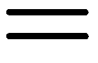

+   否定，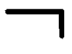

+   二元连接词如 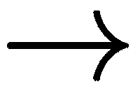

+   量词如 （对于所有）和 （存在）。

例如，推理*Socrates 是一个人。人是有限的。因此，苏格拉底是有限的*，可以用命题逻辑的逻辑陈述来表达，如下：

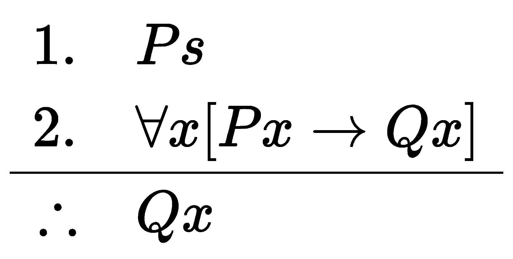

接下来，我们将看一下逻辑证明器。

### 逻辑证明器

自动定理证明是一个广泛的领域，包括基于逻辑定理和数学公式的工作。我们已经看过证明由逻辑等式组成的一阶逻辑方程的问题。搜索算法与逻辑方程结合，以便确定命题公式的可满足性（参见本章中的*Solving the n-queens problem*配方），以及在给定一组公理的情况下句子的*有效性*。`nltk`中的*解析定理证明器*提供了其他功能，如统一化、包含、以及**问答**（**QA**）：[`www.nltk.org/howto/resolution.html`](http://www.nltk.org/howto/resolution.html)。

在下一小节中，我们将看一下知识嵌入。

### 知识嵌入

**知识嵌入**（**KE**）指的是从概念关系中导出的分布式表示。这些通常在**知识图谱**（**KG**）中表示。

[知识图谱](https://wiki.example.org/feynmans_learning_method)的一个著名示例是**WordNet**（G.A. Miller 等人，《WordNet：一个在线词汇数据库》；1990 年），它提供了单词的同义词、上义词和其他扩展，类似于一本词典，并且在所有主要操作系统中都有不同的 GUI 和适当的命令行。WordNet 提供了 200 多种语言的版本，每个词（synset）都通过定向语义关系与其他词相关联，如上义词或下义词、部分或整体关系等。

知识图谱可以在**自然语言处理**（**NLP**）应用中使用，以支持决策，它们可以有效地作为查找引擎或推理的工具。

知识嵌入是概念关系的低维表示，可以使用嵌入或更通用的降维方法提取。在下一小节中，我们将看看 Walklet 嵌入方法。

### 用 Walklets 进行图嵌入

Walklet 算法基本上将 Word2Vec skipgram 算法应用于图中的顶点，因此我们将根据它们的连接而不是单词（Word2Vec 的原始应用）获得概念的嵌入。Walklet 算法在图的顶点上对短随机行走进行子采样，作为路径传递给浅层神经网络（见下图），用于 skipgram 训练。

skipgram 算法（Mikolov 等人，2013 年；[`arxiv.org/abs/1301.3781`](https://arxiv.org/abs/1301.3781)）根据单词本身预测单词（即顶点）的上下文。每个单词被表示为连续的词袋向量（实际上，每个单词都在我们使用的字典中得到索引），我们预测基于隐藏层投影的周围单词（概念）的索引。该隐藏层投影的维度和上下文的窗口大小是算法的主要参数。训练后，我们使用隐藏层作为嵌入。

下图说明了 skipgram 网络架构，包括输入层、隐藏层和单词预测的输出层：

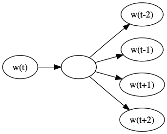

*w(t)*指的是当前单词（或概念），而*w(t-2)*、*w(t-1)*、*w(t+1)*和*w(t+2)*指的是当前单词之前和之后的两个单词。我们根据当前单词预测单词上下文。正如我们已经提到的，上下文的大小（窗口大小）是 skipgram 算法的超参数。

一个相关的算法是**连续词袋算法**（**CBOW**），其中架构被倒置 - 我们根据上下文预测单个词。两者都基于这样一个假设：共同出现的词具有相关的含义或分布相似性，这意味着它们在意义上是相似的。这被称为**分布假设**（Harris, 1954, *Distributional structure*）。

Walklet 算法在大型图上表现良好，并且由于它是神经网络，可以在线训练。关于 Walklets 的更多信息可以在 Brian Perozzi 等人的 2017 年论文*Don't Walk, Skip! Online Learning of Multi-scale** Network Embeddings*中找到（[`arxiv.org/abs/1605.02115`](https://arxiv.org/abs/1605.02115)）。

## 另见

下面是用于 Python 中逻辑推理的库：

+   SymPy：[`docs.sympy.org/latest/modules/logic.html`](https://docs.sympy.org/latest/modules/logic.html)

+   Kanren 逻辑编程：[`github.com/logpy/logpy`](https://github.com/logpy/logpy)

+   PyDatalog：[`sites.google.com/site/pydatalog/`](https://sites.google.com/site/pydatalog/)

我们一直在`nltk`的推理指南中遵循推理的指导。你可以在官方`nltk`网站找到更多工具：[`www.nltk.org/howto/inference.html`](http://www.nltk.org/howto/inference.html)。

一些用于图嵌入的其他库如下：

+   KarateClub：[`karateclub.readthedocs.io/en/latest/index.html`](https://karateclub.readthedocs.io/en/latest/index.html)

+   pykg2vec：[`github.com/Sujit-O/pykg2vec`](https://github.com/Sujit-O/pykg2vec)

+   PyTorch BigGraph（由 Facebook Research 提供）：[`github.com/facebookresearch/PyTorch-BigGraph`](https://github.com/facebookresearch/PyTorch-BigGraph)

+   GraphVite：[`graphvite.io/`](https://graphvite.io/)

+   AmpliGraph（由 Accenture 提供）：[`docs.ampligraph.org/`](https://docs.ampligraph.org/)

+   pyRDF2Vec：[`github.com/IBCNServices/pyRDF2Vec`](https://github.com/IBCNServices/pyRDF2Vec)

KarateClub 由爱丁堡大学的博士生 Benedek Rozemberczki 维护，包含许多无监督图嵌入算法的实现。

一些图库还提供链路预测。这意味着对于给定的节点集合，您可以推断是否存在与其他节点的关系。关于链路预测的评论可以在 Andrea Rossi 等人的论文*Knowledge Graph Embedding for Link Prediction: A Comparative Analysis*中找到（2020； [`arxiv.org/abs/2002.00819`](https://arxiv.org/abs/2002.00819)）。

一些关于推理真实世界和/或常识的资源如下：

+   ActionCores：[`www.actioncores.org/apidoc.html#pracinference`](http://www.actioncores.org/apidoc.html#pracinference)

+   KagNet：[`github.com/INK-USC/KagNet`](https://github.com/INK-USC/KagNet)

+   Allen AI Commonsense Knowledge Graphs: [`mosaic.allenai.org/projects/commonsense-knowledge-graphs`](https://mosaic.allenai.org/projects/commonsense-knowledge-graphs)

+   *Commonsense Reasoning Problem Page* at NYU CS: [`commonsensereasoning.org/problem_page.html`](http://commonsensereasoning.org/problem_page.html)

*Learning on graphs: Open Graph Benchmark: Datasets for Machine Learning on Graphs, Hu and others, 2020* ([`arxiv.org/pdf/2005.00687.pdf`](https://arxiv.org/pdf/2005.00687.pdf)) 是关于使用机器学习进行图形嵌入的另一个参考文献。

还有几个大型的现实世界知识数据库可供使用，例如以下内容：

+   Wikidata: [`www.wikidata.org/`](https://www.wikidata.org/)

+   Conceptnet5: [`github.com/commonsense/conceptnet5`](https://github.com/commonsense/conceptnet5)

+   The Open Multilingual Wordnet: [`compling.hss.ntu.edu.sg/omw/`](http://compling.hss.ntu.edu.sg/omw/)

+   Yago: [`github.com/yago-naga/yago3`](https://github.com/yago-naga/yago3)

# 解决 n-皇后问题

在数理逻辑中，可满足性是关于一个公式在某些解释（参数）下是否有效的问题。如果一个公式在任何解释下都不能成立，我们称其为不可满足。布尔可满足性问题（SAT）是关于一个布尔公式在其参数的任何值下是否有效（可满足）的问题。由于许多问题可以归约为 SAT 问题，并且存在针对它的求解器和优化方法，SAT 问题是一个重要的问题类别。

SAT 问题已被证明是 NP 完全的。NP 完全性（缩写为**非确定性多项式时间**）意味着问题的解决方案可以在多项式时间内验证。请注意，这并不意味着可以快速找到解决方案，只是可以快速验证解决方案。NP 完全问题通常使用搜索启发式和算法来解决。

在这个配方中，我们将以多种方式解决 SAT 问题。我们将以一个相对简单且深入研究的案例来解释，即 n-皇后问题，其中我们尝试在一个*n*乘*n*的棋盘上放置皇后，以使得任何列、行和对角线最多只能放置一个皇后。

首先，我们将应用遗传算法（GA），然后是粒子群优化（PSO），最后使用专门的 SAT 求解器。

## 准备工作

我们在这个配方中的一个方法中将使用`dd`求解器。要安装它，我们还需要`omega`库。我们可以使用`pip`命令获取这两个库，如下所示：

```py
pip install dd omega
```

我们稍后将使用`dd` SAT 求解器库，但首先我们将研究一些其他的算法方法。

## 如何做...

我们将从遗传算法（GA）开始。

### 遗传算法

首先，我们将定义染色体的表示方式和如何进行变异。然后，我们将定义一个反馈循环来测试和改变这些染色体。我们将在最后的*工作原理*部分详细解释算法本身。让我们开始吧：

1.  **表示解决方案**（一个染色体）：面向对象的风格适合定义染色体。让我们看看我们的实现。首先，我们需要知道染色体是什么以及它的作用：

```py
import random
from typing import Optional, List, Tuple

class Chromosome:
    def __init__(self, configuration: Optional[List]=None, nq: Optional[int]=None):
        if configuration is None:
            self.nq = nq
            self.max_fitness = np.sum(np.arange(nq))
            self.configuration = [
                random.randint(1, nq) for _ in range(nq)
            ]
        else:
            self.configuration = configuration
            self.nq = len(configuration)
            self.max_fitness = np.sum(np.arange(self.nq))

    def fitness(self):
        return cost_function(self.configuration) / self.max_fitness

    def mutate(self):
        ind = random.randint(0, self.nq-1)
        val = random.randint(1, self.nq)
        self.configuration[ind] = val
```

上述代码创建了我们的基本数据结构，其中包含一个候选解决方案，可以复制和突变。此代码涉及成本函数。

我们需要一个成本函数，以便知道如何适应我们的基因：

```py
def cost_function(props):
    res = 0
    for i1, q1 in enumerate(props[:-1]):
        for i2, q2 in enumerate(props[i1+1:], i1+1):
            if (q1 != q2) and (abs(i1 - i2) != abs(q1 - q2)):
                res += 1
    return res
```

我们可以根据这个成本函数（见`fitness()`方法）选择基因。

1.  **编写主要算法**：N 皇后问题的 GA 如下（我们在此省略了可视化）：

```py
class GeneticQueen:
    def __init__(self, nq, population_size=20, mutation_prob=0.5):
        self.nq = nq
        self.population_size = population_size
        self.mutation_prob = mutation_prob
        self.population = [Chromosome(nq=nq) for _ in range(population_size)]
        self.solution = None
        self.best_fitness = None

    def iterate(self):
        new_population = []
        best_fitness = -1
        for i in range(len(self.population)):
            p1, p2 = self.get_parents()
            child = Chromosome(self.cross_over(p1, p2))
            if random.random() < self.mutation_prob:
                child.mutate()
            new_population.append(child)
            fit = child.fitness()
            if fit > best_fitness:
                best_fitness = fit
            if fit == 1:
                self.solution = child
                break                
        self.best_fitness = best_fitness
        self.population = new_population

    def cross_over(self, p1, p2):
        return [
            yi
            if random.random() > 0
            else xi
            for xi, yi in zip(
                p1.configuration,
                p2.configuration
            )
        ]

    def get_parents(self) -> Tuple[Chromosome, Chromosome]:
        weights = [chrom.fitness() for chrom in self.population]
        return tuple(
            random.choices(
                self.population, 
                weights=weights,
                k=2
            )
        )
```

该类包含染色体的种群，并可以对其应用方法（如果您喜欢的话，如`get_parents()`和`cross_over()`）。请注意`iterate()`方法，在这里实现了主要逻辑。我们将在*它的工作原理...*部分对我们在这里做出的主要决策进行评论。

1.  **运行算法**：我们通过简单地实例化一个`GeneticQueen`并调用`iterate()`来执行我们的算法。我们还可以添加几行额外的代码来定期更新并随时间收集适应性数据。然后，我们像这样运行算法：

```py
def ga_solver(nq):
    fitness_trace = []
    gq = GeneticQueen(nq=nq)
    generation = 0
    while not gq.solution:
        gq.iterate()
        if (generation % 100) == 0:
            print('Generation {}'.format(generation))
            print('Maximum Fitness: {:.3f}'.format(gq.best_fitness))
        fitness_trace.append(gq.best_fitness)
        generation += 1

    gq.visualize_solution()
    return fitness_trace
```

最后，我们可以可视化解决方案。

如果我们运行上述代码，将得到一个看起来像这样的单次运行结果（您的结果可能会有所不同）：

```py
Generation 0
Maximum Fitness: 0.857
Generation 100
Maximum Fitness: 0.821
Generation 200
Maximum Fitness: 0.892
Generation 300
Maximum Fitness: 0.892
Generation 400
Maximum Fitness: 0.892
```

上述代码给出了以下输出：

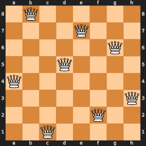

这个操作接近 8 秒才完成。

下图显示了算法每次迭代中最佳染色体的适应性：

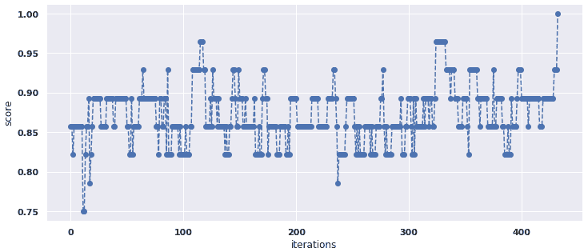

在这里，我们可以看到算法的适应性并不总是改善；它也可能下降。我们本可以选择在此处保留最佳染色体。在这种情况下，我们不会看到任何下降（但潜在的缺点是我们可能会陷入局部最小值）。

现在，让我们继续 PSO！

### 粒子群优化

在这个配方的这一部分，我们将从头开始实现 N 皇后问题的 PSO 算法。让我们开始吧：

1.  **表示解决方案**：与 GA 类似，我们需要定义解决方案的外观。在 PSO 中，这意味着我们定义一个粒子：

```py
class Particle:
    best_fitness: int = 0

    def __init__(
        self, N=None, props=None,
        velocities=None
    ):
        if props is None:
            self.current_particle = np.random.randint(0, N-1, N)
            self.best_state = np.random.randint(0, N-1, N)
            self.velocities = np.random.uniform(-(N-1), N-1, N)
        else:
            self.current_particle = props
            self.best_state = props
            self.velocities = velocities

        self.best_fitness = cost_function(self.best_state)

    def set_new_best(self, props: List[int], new_fitness: int): 
        self.best_state = props
        self.best_fitness = new_fitness

    def __repr__(self):
        return f'{self.__class__.__name__}(\n' +\
            f'\tcurrent_particle={self.current_particle}\n' +\
            f'\best_state={self.best_state}\n' +\
            f'\tvelocities={self.velocities}\n' +\
            f'\best_fitness={self.best_fitness}\n' +\
            ')'
```

这是我们将要处理的主数据结构。它包含一个候选解决方案。应用 PSO 将涉及更改一堆这些粒子。我们将在*它的工作原理...*部分详细解释`Particle`的工作原理。

我们将使用与我们为 GA 定义的相同成本函数。该成本函数告诉我们我们的粒子如何适应给定问题 - 换句话说，一个性质向量有多好。

我们将初始化和主算法封装到一个类中：

```py
class ParticleSwarm:
  def __init__(self, N: int, n_particles: int,
    omega: float, phip: float, phig: float
  ):
    self.particles = [Particle(N=N) for i in range(n_particles)]
    self.omega = omega
    self.phip = phip
    self.phig = phig

  def get_best_particle(self):
    best_particle = 0
    best_score = -1
    score = -1
    for i, particle in enumerate(self.particles):
        score = cost_function(particle.current_particle)
        if score > best_score:
            best_score = score
            best_ind = i
    return self.particles[best_ind].current_particle, best_score

  def iterate(self):
    for particle in self.particles:
      rg = np.random.rand((N))
      rp = np.random.rand((N))
      delta_p = particle.best_state - particle.current_particle
      delta_g = best_particle - particle.current_particle
      update = (rp * self.phip * delta_p +
        \ rg * self.phig * delta_g)  # local vs global
      particle.velocities = self.omega * particle.velocities + update
      particle.current_particle = (np.abs(
        particle.current_particle + particle.velocities
      ) % N ).astype(int)  # update the particle best
      current_fitness = cost_function(particle.current_particle)
      if current_fitness > particle.best_fitness:
        particle.set_new_best(
          particle.current_particle, current_fitness
        )
        particle_candidate, score_candidate = get_best_particle(particles)
        if best_score_cand > best_score:
          best_particle = particle_candidate
          best_score = score_candidate
    return best_particle, best_score
```

`get_best_particle()`方法返回最佳配置和最佳分数。请注意`iterate()`方法，它更新我们的粒子并返回最佳粒子及其分数。关于此更新的详细信息在*工作原理...*部分提供。优化过程本身使用几个相对简单的公式完成。

我们还想展示我们的解决方案。显示棋盘位置的代码如下：

```py
import chess
import chess.svg
from IPython.display import display

def show_board(queens):
    fen = '/'.join([queen_to_str(q) for q in queens])
    display(chess.svg.board(board=chess.Board(fen), size=300))
```

下面是 PSO 的主算法：

```py
def particle_swarm_optimization(
    N: int, omega: float, phip: float, phig: float,
    n_particles: int, visualize=False, max_iteration=999999
) -> List[int]:
  def print_best():
    print(f'iteration {iteration} - best particle: {best_particle}, score: {best_score}')
  solved_cost = np.sum(np.arange(N))
  pso = ParticleSwarm(N, n_particles, omega, phip, phig)
  iteration = 0
  best_particle, best_score = get_best_particle(particles)
  scores = [best_score]
  if visualize:
    print('iteration:', iteration)
    show_board(best_particle)
  while best_score < solved_cost and iteration < max_iteration:
    if (iteration % 500) == 0 or iteration == 0:
      print_best()
      best_particle, best_score = pso.iterate()
    if iteration > 0 and visualize:
      print('iteration:', iteration)
      show_board(best_particle)
    scores.append(best_score)
    iteration += 1
  print_best()
  return best_particle, scores
```

类似于我们在 GA 案例中所做的，我们追踪解决方案在迭代中的表现（通过我们的成本函数）。主函数返回以下内容：

+   `best_particle`：最佳解决方案

+   `scores`：我们迭代中的最佳分数

正如我们之前提到的，我们将在*工作原理...*部分解释所有这些内容的工作方式。

您可以查看使用*n = 8*运行的算法输出，网址为[`github.com/PacktPublishing/Artificial-Intelligence-with-Python-Cookbook/blob/master/chapter05/solving-n-queens.md`](https://github.com/PacktPublishing/Artificial-Intelligence-with-Python-Cookbook/blob/master/chapter05/solving-n-queens.md)。

我们在这里使用棋盘库进行可视化。

在下面的图表中，您可以看到解决方案在迭代中的质量：

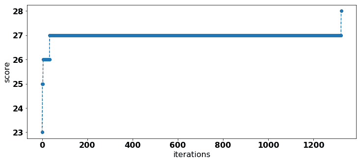

由于所有粒子都保持其最佳解的记录，分数永远不会下降。在第 1,323 次迭代时，我们找到了一个解决方案，算法停止了。

### SAT 求解器

这主要基于可以在`dd`库中找到的示例，版权属于加州理工学院，网址为[`github.com/tulip-control/dd/blob/0f6d16483cc13078edebac9e89d1d4b99d22991e/examples/queens.py`](https://github.com/tulip-control/dd/blob/0f6d16483cc13078edebac9e89d1d4b99d22991e/examples/queens.py)。

在 Python 中的现代 SAT 求解器中，我们可以将约束定义为简单的函数。

基本上，有一个公式包含所有约束条件。一旦所有约束条件满足（或所有约束条件的合取），就找到了解决方案：

```py
def queens_formula(n):
    present = at_least_one_queen_per_row(n)
    rows = at_most_one_queen_per_line(True, n)
    cols = at_most_one_queen_per_line(False, n)
    slash = at_most_one_queen_per_diagonal(True, n)
    backslash = at_most_one_queen_per_diagonal(False, n)
    s = conj([present, rows, cols, slash, backslash])
    return s
```

这是`at_least_one_queen_per_row`的约束条件：

```py
def at_least_one_queen_per_row(n):
    c = list()
    for i in range(n):
        xijs = [_var_str(i, j) for j in range(n)]
        s = disj(xijs)
        c.append(s)
    return conj(c)
```

在这里，我们对每行上的皇后进行析取。

主运行如下所示：

```py
def benchmark(n):
    t0 = time.time()
    u, bdd = solve_queens(n)
    t1 = time.time()
    dt = t1 - t0

    for i, d in enumerate(bdd.pick_iter(u)):
        if len(d) > 0:
            visualize_solution(d)
            break
    n_solutions = bdd.count(u)

    s = (
        '------\n'
        'queens: {n}\n'
        'time: {dt} (sec)\n'
        'node: {u}\n'
        'total nodes: {k}\n'
        'number solutions: {n_solutions}\n'
        '------\n'
    ).format(
        n=n, dt=dt, u=u, k=len(bdd),
        n_solutions=n_solutions,
    )
    print(s)
    return dt
```

当我们运行此代码时，应该看到一个示例解决方案。我们还应该得到一些关于找到多少解决方案以及花费多长时间找到它们的统计信息。

下面是八皇后问题的示例解决方案：

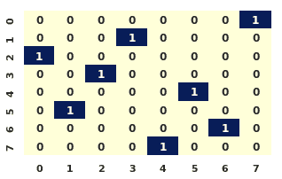

文本输出如下所示：

```py
queens: 8
time: 4.775595426559448 (sec)
node: -250797
total nodes: 250797
number solutions: 92
```

此求解器不仅获得了所有的解决方案（我们只显示了其中一个），而且比遗传算法快大约两倍！

## 工作原理...

在本节中，我们将解释在此配方中使用的不同方法，从遗传算法开始。

### 遗传算法

在本质上，遗传算法很简单：我们维护一组候选解决方案（称为染色体），并且我们有两种操作可以用来改变它们：

+   `cross-over`：两个染色体产生子代（这意味着它们混合）

+   `mutation:` 染色体随机变化

一个染色体存储在`configuration`中的候选解决方案。在初始化染色体时，我们必须给它皇后的数量或者初始配置。在本章的前文中，我们已经讨论了染色体的实际含义。如果没有给定配置，则需要使用列表推导创建一个，比如`[random.randint(1, nq) for _ in range(nq)]`。

一个染色体可以计算自己的适应度；在这里，我们使用了先前使用的相同成本函数，但这次我们将其缩放到 0 到 1 之间，其中 1 表示我们找到了一个解决方案，介于其中的任何值显示我们距离解决方案有多接近。染色体也可以对自己进行突变；也就是说，它可以随机改变其值之一。

算法的每一次迭代，我们都通过这两个操作创建新的染色体代。

1.  首先，我们使用代表解决方案不同参数的不同值初始化我们的第一代染色体。

1.  然后，我们计算我们的染色体的适应度。这可以通过与环境的交互来完成，或者它可能是解决方案本身固有的，就像我们的九皇后问题的组合问题一样。

1.  接下来，我们按以下方式创建新的染色体代：

    +   在考虑其适应度的情况下选择父母

    +   根据一定的概率突变几个染色体

1.  最后，我们从*第 2 步*开始重复，直到适应度足够高或者我们已经迭代了很多次。

我们在这里非常宽泛地表达了最后一步。基本上，我们可以决定何时适应度足够高以及我们想要迭代多少次。这些是我们的停止标准。

这在我们的`GeneticQueen.iterate()`的实现中非常清晰，因此为了可视化目的，让我们再看一眼（仅稍微简化）：

```py
def iterate(self):
  new_population = []
  for i in range(len(self.population)):
    p1, p2 = self.get_parents()
    child = Chromosome(self.cross_over(p1, p2))
    if random.random() < self.mutation_prob:
      child.mutate()
    new_population.append(child)
```

关于遗传算法（GA），我们必须做出的一个重要决策是是否保留最佳解决方案，或者是否所有染色体（包括最佳的）都必须死亡（可能在产生后代后）。在这里，每次迭代都会创建一个全新的代。

我们通过按其适应度加权随机选择父母，其中适应度最高的被选择的可能性更大。在我们的实现中，`cross-over`函数会随机在每个参数中的两个父母之间做出决策。

为 GA 必须做出的主要超参数和主要决策如下：

+   种群大小（我们有多少染色体？）

+   变异率（染色体变异时变化的程度是多少？）

+   多少（以及哪些）染色体产生后代？通常这些是具有最高适应度的染色体。

+   我们的停止标准是什么？通常，算法的适应度有一个阈值，并且有一个设定的迭代次数。

正如我们所见，遗传算法非常灵活且直观。在接下来的部分，我们将看看 PSO。

### 粒子群优化（Particle Swarm Optimization，PSO）

我们以`Particle`数据结构开始我们的实现。要初始化一个粒子，我们传入皇后数量（`N`）或者我们的速度和参数向量。基本上，一个粒子有一个配置，或者说一组参数 - 在这种情况下是一个向量，它与问题的某个程度匹配（`current_particle`），以及一个速度（类似于学习率）。每个粒子的属性向量表示皇后的位置。

PSO 然后以特定的方式对粒子应用变化。PSO 结合了局部搜索和全局搜索；也就是说，在每个粒子处，我们试图将搜索引导向全局最佳粒子和过去最佳粒子。一个粒子保持其最佳实例的记录；也就是说，其最佳参数的向量和相应的得分。我们还保持参数的相应速度。这些速度可以根据正在使用的公式而减慢、增加或改变方向。

PSO 需要一些参数，如下所示（大多数这些在我们的实现中已命名；这里省略了那些特定于我们的九皇后问题的参数）：

+   `omega`：衰减参数

+   `phip`：控制局部搜索的贡献

+   `phig`：控制全局搜索的贡献

+   `n_particles`：粒子的数量

+   `max_iterations`：用于没有解决方案的提前停止

在我们的 PSO 问题中，有两个增量，`delta_p` 和 `delta_g`，其中 *p* 和 *g* 分别代表粒子（particle）和全局（global）。这是因为其中一个是根据粒子的历史最佳计算的，另一个是根据粒子的全局最佳计算的。

更新根据以下代码计算：

```py
delta_p = particle.best_state - particle.current_particle
delta_g = best_particle - particle.current_particle
update = (rp * phip * delta_p +\
 rg * phig * delta_g) # local vs global
```

这里，`rp` 和 `rg` 是随机数，`phip` 和 `phig` 分别是局部和全局因子。它们分别指一个唯一的粒子或所有粒子，如`delta_p` 和 `delta_g` 变量所示。

还有另一个参数 `omega`，它调节当前速度的衰减。在每次迭代中，根据以下公式计算新的速度：

```py
particle.velocities = omega * particle.velocities + update
```

接着，根据它们的速度递增粒子参数。

请注意，算法对于`phip`、`phig`和`omega`的选择非常敏感。

我们的成本函数（或好度函数）根据给定的皇后配置为每个粒子计算分数。这个配置被表示为在范围]0, N-1*.*中的索引列表对于每对皇后，函数检查它们是否在对角线、垂直或水平方向上重叠。每个不冲突的检查都给予一个点，因此最大的得分是。

我们在配方中使用的 `dd` 求解器，使用**二进制决策图**（**BDD**）工作，这些图是由 Randal Bryant（*基于图的布尔函数操作算法*，1986 年）引入的。二进制决策图（有时称为**分支程序**）将约束表示为布尔函数，而不是其他编码方式，如否定范式。

在 BDD 中，一个算法或一组约束被表示为在维度为 *n* 的布尔域上的布尔函数，其评估为真或假：

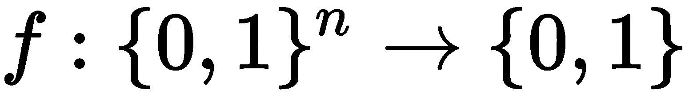

这意味着我们可以将问题表示为二叉树或等效地表示为真值表。

为了说明这一点，让我们看一个例子。我们可以枚举所有关于我们的二进制变量（*x1*，*x2* 和 *x3*）的状态，然后得出一个最终状态，即 *f* 的结果。以下真值表总结了我们变量的状态，以及我们的函数评估：

| *x1* | *x2* | *x3* | *f* |
| --- | --- | --- | --- |
| False | False | False | False |
| False | False | True | False |
| False | True | False | False |
| False | True | True | False |
| True | False | False | True |
| True | False | True | False |
| True | True | False | True |
| True | True | True | True |

这对应于以下二叉树：

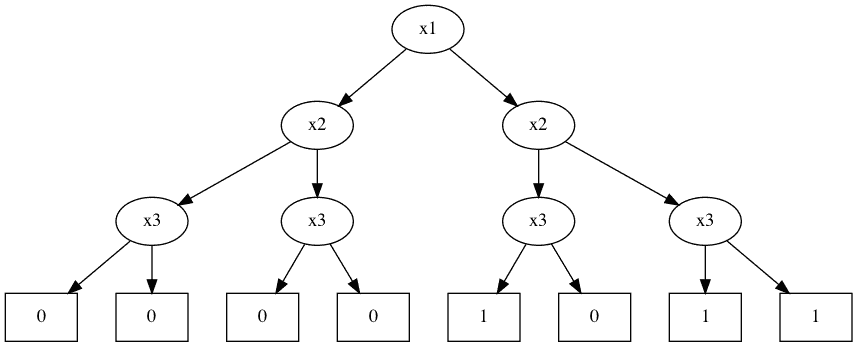

二叉树和真值表具有高度优化的库实现，因此它们可以运行非常快。这解释了我们如何如此快速地得到结果。

## 另见

Python 中还有许多其他 SAT 求解器，其中一些如下所示：

+   Microsoft 的 PDP 求解器：[`github.com/microsoft/PDP-Solver`](https://github.com/microsoft/PDP-Solver)

+   Z3，由微软研究院提供：[`github.com/Z3Prover/z3`](https://github.com/Z3Prover/z3)

+   Python 绑定到 picosat，由 Continuum 开发：[`github.com/ContinuumIO/pycosat`](https://github.com/ContinuumIO/pycosat)

关于 SAT 求解器在解数独中的应用讨论可在此找到：[`codingnest.com/modern-sat-solvers-fast-neat-underused-part-1-of-n/`](https://codingnest.com/modern-sat-solvers-fast-neat-underused-part-1-of-n/)。

[这里可以找到解决骑士和卫士问题的 Z3 示例：](https://jamiecollinson.com/blog/solving-knights-and-knaves-with-z3/) [`jamiecollinson.com/blog/solving-knights-and-knaves-with-z3/`](https://jamiecollinson.com/blog/solving-knights-and-knaves-with-z3/)

# 寻找最短公交路线

寻找最短公交路线意味着寻找一条连接地图上点（公交车站）的路径。这是旅行推销员问题的一个实例。在本篇文章中，我们将通过不同的算法来解决寻找最短公交路线的问题，包括模拟退火和蚁群优化。

## 准备工作

除了像`scipy`和`numpy`这样的标准依赖项外，我们还将使用`scikit-opt`库，该库实现了许多不同的群体智能算法。

群体智能是分散式、自组织系统的集体行为，这种行为在观察者眼中表现出明显的智能性。这个概念在基于人工智能的工作中被使用。自然系统，如蚂蚁群、鸟群、鹰的捕猎、动物群集和细菌生长，在全局层面展示出一定水平的智能，尽管蚂蚁、鸟类和鹰通常表现出相对简单的行为。受生物学启发的群体算法包括遗传算法、粒子群优化、模拟退火和蚁群优化。

我们可以使用`pip`安装`scikit-opt`，如下所示：

```py
pip install scikit-opt
```

现在，我们准备解决旅行推销员问题。

## 如何做...

正如我们之前提到的，我们将以两种不同的方式解决最短公交路线问题。

首先，我们需要为公交车站创建一组坐标（经度，纬度）。问题的难度取决于站点的数量（`N`）。在这里，我们将`N`设置为`15`：

```py
import numpy as np
N = 15
stops = np.random.randint(0, 100, (N, 2))
```

我们还可以预先计算站点之间的距离矩阵，如下所示：

```py
from scipy import spatial

distance_matrix = spatial.distance.cdist(stops, stops, metric='euclidean')
```

我们可以将这个距离矩阵输入到两个算法中以节省时间。

我们将从模拟退火开始。

### 模拟退火

在这个子节中，我们将编写我们的算法来寻找最短公交路线。这基于 Luke Mile 的 Python 实现的模拟退火，应用于旅行推销员问题：[`gist.github.com/qpwo/a46274751cc5db2ab1d936980072a134`](https://gist.github.com/qpwo/a46274751cc5db2ab1d936980072a134)。让我们开始吧：

1.  实现本身非常简短而简洁：

```py
def find_tour(stops, distance_matrix, iterations=10**5):
    def calc_distance(i, j):
        """sum of distance to and from i and j in tour
        """
        return sum(
            distance_matrix[tour[k], tour[k+1]]
            for k in [j - 1, j, i - 1, i]
        )

    n = len(stops)
    tour = np.random.permutation(n)
    lengths = []
    for temperature in np.logspace(4, 0, num=iterations):
        i = np.random.randint(n - 1) # city 1
        j = np.random.randint(i + 1, n) # city 2
        old_length = calc_distance(i, j)
        # swap i and j:
        tour[[i, j]] = tour[[j, i]]
        new_length = calc_distance(i, j)
        if np.exp((old_length - new_length) / temperature) < np.random.random():  # bad swap
            tour[[i, j]] = tour[[j, i]]  # undo swap
            lengths.append(old_length)
        else:
            lengths.append(new_length) 
    return tour, lengths
```

1.  接下来，我们需要调用算法，如下所示：

```py
from scipy.spatial.distance import euclidean
tour, lengths = find_tour(
    stops, distance_matrix, iterations=1000000
)
```

这是最终的解决方案 – 路径如下所示：

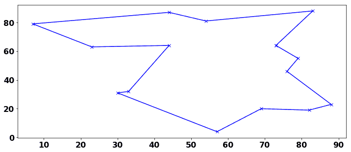

我们还可以绘制算法的内部距离度量。请注意，这个内部成本函数在约 800,000 次迭代之前一直下降：

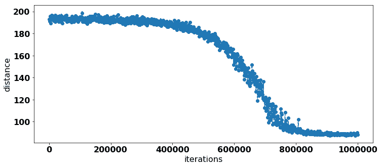

现在，让我们尝试蚁群优化算法。

### 蚁群优化

在这里，我们正在从库中加载实现。我们将在*它的工作原理...*部分解释细节：

```py
from sko.ACA import ACA_TSP

def cal_total_distance(tour):
    return sum([
        distance_matrix[tour[i % N], tour[(i + 1) % N]]
        for i in range(N)
    ])

aca = ACA_TSP(
    func=cal_total_distance,
    n_dim=N,
    size_pop=N,
    max_iter=200,
    distance_matrix=distance_matrix
)
best_x, best_y = aca.run()
```

我们使用基于我们之前获取的点距离的距离计算（`distance_matrix`）。

再次，我们可以绘制最佳路径和路径距离随迭代次数的变化情况，如下所示：

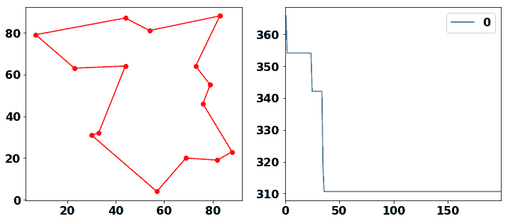

再次，我们可以看到最终路径，这是我们优化的结果（左侧子图），以及随着算法迭代距离逐渐减少的路径（右侧子图）。

## 工作原理...

最短巴士路线问题是旅行商问题（**TSP**）的一个示例，而 TSP 又是组合优化的一个众所周知的示例。

组合优化是指使用组合技术来解决离散优化问题。换句话说，它是在一组对象中找到解决方案的行为。在这种情况下，“离散”意味着有限数量的选项。组合优化的智能部分在于减少搜索空间或加速搜索。旅行商问题、最小生成树问题、婚姻问题和背包问题都是组合优化的应用。

TSP 可以表述如下：给定要访问的城镇列表，找出遍历所有城镇并回到起点的最短路径是什么？TSP 在规划、物流和微芯片设计等领域有应用。

现在，让我们更详细地看一下模拟退火和蚁群优化。

### 模拟退火

模拟退火是一种概率优化技术。其名称来源于冶金学，其中加热和冷却用于减少材料中的缺陷。简单来说，在每次迭代中，可以发生状态转换（即变化）。如果变化成功，则系统会降低其温度。这可以重复进行，直到状态足够好或达到一定迭代次数为止。

在这个示例中，我们随机初始化了我们的城市旅游路线，然后进行了模拟退火的迭代。SA 的主要思想是，变化的速率取决于一定的温度。在我们的实现中，我们从 4 逻辑地降低了温度到 0。在每次迭代中，我们尝试交换（也可以尝试其他操作）路径（旅游路线）中两个随机巴士站点的索引 *i* 和 *j*，其中 *i < j*，然后计算从 *i-1* 到 *i*、从 *i* 到 *i+1*、从 *j-1* 到 *j* 和从 *j* 到 *j+1* 的距离总和（见 `calc_distance`）。我们还需要一个距离度量来进行 `calc_distance`。我们选择了欧几里得距离，在这里，但我们也可以选择其他距离度量。

温度在我们需要决定是否接受交换时发挥作用。我们计算路径长度变化前后的指数差：

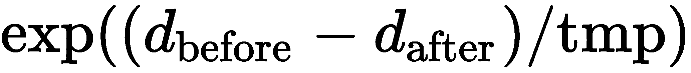

然后，我们生成一个随机数。如果这个随机数小于我们的表达式，我们就接受这个变化；否则，我们撤销它。

### 蚁群优化

正如其名称所示，**蚁群优化** 受到蚂蚁群体的启发。让我们使用蚂蚁分泌的信息素作为类比：这里，代理人具有候选解决方案，越接近解决方案，越有吸引力。

总体而言，蚂蚁编号 *k* 从状态 *x* 转移到状态 *y* 的概率如下：

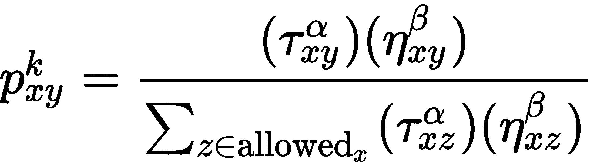

*Tau* 是在 *x* 和 *y* 之间沉积的信息素路径。*eta* 参数控制信息素的影响，其中 *eta* 的 *beta* 次幂是状态转换（例如转换成本的倒数）。信息素路径根据包括状态转换在内的整体解决方案的好坏而更新。

在这里，`scikit-opt` 函数起到了重要作用。我们只需传递几个参数，如距离函数、点数、种群中的蚂蚁数量、迭代次数和距离矩阵，然后调用 `run()`。

## 另请参阅

您也可以将此问题作为混合整数问题来解决。Python-MIP 库解决混合整数问题，您可以在 [`python-mip.readthedocs.io/en/latest/examples.html`](https://python-mip.readthedocs.io/en/latest/examples.html) 找到 TSP 的示例。

TSP 也可以用 Hopfield 网络解决，如本教程所述：[`www.tutorialspoint.com/artificial_neural_network/artificial_neural_network_optimization_using_hopfield.htm`](https://www.tutorialspoint.com/artificial_neural_network/artificial_neural_network_optimization_using_hopfield.htm)。在这里讨论了一种布谷鸟搜索方法：[`github.com/Ashwin-Surana/cuckoo-search`](https://github.com/Ashwin-Surana/cuckoo-search)。

`scikit-opt` 是一个强大的启发式算法库。它包括以下算法：

+   差分进化

+   遗传算法

+   粒子群优化

+   模拟退火

+   蚁群算法

+   免疫算法

+   人工鱼群算法

`scikit-opt` 文档包含更多解决 TSP（旅行推销员问题）的例子：[`scikit-opt.github.io/scikit-opt/#/en/README?id=_22-genetic-algorithm-for-tsptravelling-salesman-problem`](https://scikit-opt.github.io/scikit-opt/#/en/README?id=_22-genetic-algorithm-for-tsptravelling-salesman-problem)。另一个类似于 `scikit-opt` 的库是 `pyswarms`，可以在 [`pyswarms.readthedocs.io/en/latest/index.html`](https://pyswarms.readthedocs.io/en/latest/index.html) 找到。

正如我们在本文开头提到的，运输物流在 TSP 中有其独特的应用，甚至在其纯粹形式中。墨西哥拥有 30,000 辆公共汽车、小巴和面包车的数据集可以在 [`thelivinglib.org/mapaton-cdmx/`](https://thelivinglib.org/mapaton-cdmx/) 找到。

# 模拟疾病传播

诸如天花、结核病和黑死病等大流行病，长期以来显著影响了人类群体。截至 2020 年，新冠肺炎正在全球范围内传播，关于如何在尽可能少的伤亡情况下控制病毒的政治和经济问题已广泛讨论。

关于新冠肺炎，对于自由主义者来说，瑞典曾一度成为无需封锁的典范，尽管未考虑到诸如高比例的单人户和社会距离的文化倾向等次要因素。最近，瑞典的死亡人数有所上升，其人均发病率是已记录的最高之一（[`www.worldometers.info/coronavirus/`](https://www.worldometers.info/coronavirus/)）。

在英国，最初的反应是依赖群体免疫，只有在其他国家已经实施封锁数周后才宣布封锁。由于无法应对，国民健康服务系统（**NHS**）使用临时床位并租用商业医院的床位。

**多代理系统**（**MAS**）是由参与者（称为代理）组成的计算机模拟。这些个体代理可以根据启发式或基于强化学习作出响应。此外，这些代理相互响应以及对环境的响应的系统行为可以应用于研究以下主题：

+   合作与协调

+   分布式约束优化

+   交流与协商

+   分布式问题解决，尤其是分布式约束优化

在这个食谱中，一个相对简单的多代理模拟将展示不同的响应如何导致疫情的致命人数和传播方式上的差异。

## 准备就绪

我们将使用`mesa`多代理建模库来实现我们的多代理模拟。

用于此操作的`pip`命令如下：

```py
pip install mesa
```

现在，我们已经准备好了！

## 如何做…

这个模拟基于 Maple Rain Research Co., Ltd.的工作。对于这个食谱，我们已经做了一些更改，引入了因素如医院床位和封锁政策，并且我们也改变了感染和活跃病例的计算方式。你可以在[`github.com/benman1/covid19-sim-mesa`](https://github.com/benman1/covid19-sim-mesa)找到完整的代码。

声明：本食谱的目的不是提供医疗建议，我们也不是合格的医疗从业者或专家。

首先，我们将通过`Person`类来定义我们的代理：

```py
class Person(Agent):
    def __init__(self, unique_id, model):
        super().__init__(unique_id, model)
        self.alive = True
        self.infected = False
        self.hospitalized = False
        self.immune = False
        self.in_quarantine = False  # self-quarantine
        self.time_infected = 0
```

此定义将代理定义为拥有健康和隔离状态的人。

我们仍然需要一些方法来改变其他属性的变化方式。我们不会详细介绍所有这些方法，只是介绍那些足以让你理解所有内容如何结合在一起的方法。我们需要理解的核心是代理在感染时做什么。基本上，在感染期间，我们需要了解代理是否会传染给其他人，是否会因感染而死亡，或者是否会康复：

```py
    def while_infected(self):
        self.time_infected += 1
        if self.hospitalized:
            # stay in bed, do nothing; maybe die
            if self.random.random() < (
                    self.model.critical_rate *
                    self.model.hospital_factor
            ):
                # die
                self.alive = False
                self.hospitalized = False
                self.infected = False
                return
            self.hospitalized -= 1
            return
        if self.random.random() < (
            self.model.quarantine_rate /
            self.model.recovery_period
        ):
            self.set_quarantine()
        if not self.in_quarantine:
            self.infect_others()  # infect others in same cell
        if self.time_infected < self.model.recovery_period:
            if self.random.random() < self.model.critical_rate:
                if self.model.hospital_takeup:
                    self.hospitalized = self.model.hospital_period
                    self.set_quarantine()
                else:
                    self.alive = False # person died from infection
                    self.infected = False
        else:  # person has passed the recovery period so no longer infected
            self.infected = False
            self.quarantine = False
            if self.random.random() < self.model.immunity_chance:
                self.immune = True
```

在这里，我们可以看到几个在模型层面上定义的变量，例如`self.model.critical_rate`，`self.model.hospital_factor`和`self.model.recovery_period`。我们稍后会更详细地查看这些模型变量。

现在，我们需要一种方法让我们的代理记录它们的位置，这在`mesa`中被称为`MultiGrid`：

```py
    def move_to_next(self):
        possible_steps = self.model.grid.get_neighborhood(
            self.pos,
            moore=True,
            include_center=False
        )
        new_position = self.random.choice(possible_steps)
        self.model.grid.move_agent(self, new_position)
```

这是相对直接的。如果代理移动，它们只在它们的邻域内移动；也就是说，下一个相邻的单元。

被称为`step()`方法的入口方法在每个周期（迭代）都会被调用：

```py
    def step(self):
        if self.alive:
            self.move()
```

如果代理活着，它们在每一步都会移动。这是它们移动时会发生的事情：

```py
    def move(self):
        if self.in_quarantine or self.model.lockdown:
            pass
        else:
            self.move_to_next()
        if self.infected:
            self.while_infected()
```

这结束了我们的代理，也就是`Person`的主要逻辑。现在，让我们看看在模型层面上如何将所有内容整合在一起。这可以在`model.py`中的`Simulation`类中找到。

让我们看看代理是如何创建的：

```py
    def create_agents(self):
        for i in range(self.num_agents):
            a = Person(i, self)
            if self.random.random() < self.start_infected:
                a.set_infected()
            self.schedule.add(a)
            x = self.random.randrange(self.grid.width)
            y = self.random.randrange(self.grid.height)
            self.grid.place_agent(a, (x, y))
```

上述代码创建了我们需要的代理数量。其中一些会根据`start_infected`参数被感染。我们还将这些代理添加到一个以网格形式组织的单元地图中。

我们还需要定义一些数据收集器，如下所示：

```py
        def set_reporters(self):
            self.datacollector = DataCollector(
                model_reporters={
                    'Active Cases': active_cases,
                    'Deaths': total_deaths,
                    'Immune': total_immune,
                    'Hospitalized': total_hospitalized,
                    'Lockdown': get_lockdown,
                })
```

此字典列表中的变量在每个周期中都会追加，以便我们可以绘图或进行统计评估。例如，让我们看看`active_cases`函数是如何定义的：

```py
def active_cases(model):
    return sum([
        1
        for agent in model.schedule.agents
        if agent.infected
    ])
```

当被调用时，该函数会迭代模型中的代理，并计算状态为`infected`的代理数量。

同样地，就像对`Person`一样，`Simulation`的主要逻辑在`step()`方法中，该方法推进模型一个周期：

```py
    def step(self):
        self.datacollector.collect(self)
        self.hospital_takeup = self.datacollector.model_vars[
            'Hospitalized'
        ][-1] < self.free_beds
        self.schedule.step()
        if self.lockdown:
            self.lockdown -= 1
        else:
            if self.lockdown_policy(
                self.datacollector.model_vars['Active Cases'],
                self.datacollector.model_vars['Deaths'],
                self.num_agents
            ):
                self.lockdown = self.lockdown_period
        self.current_cycle += 1
```

让我们看看不同的封锁政策如何影响死亡和疾病的传播。

我们将在这些模拟中使用与之前相同的一组变量。我们设置它们以便它们大致对应于英国，按照 1/1,000 的因子：

```py
scale_factor = 0.001
area = 242495  # km2 uk
side = int(math.sqrt(area)) # 492

sim_params = {
    'grid_x': side,
    'grid_y': side,
    'density': 259 * scale_factor, # population density uk,
    'initial_infected': 0.05,
    'infect_rate': 0.1,
    'recovery_period': 14 * 12,
    'critical_rate': 0.05,
    'hospital_capacity_rate': .02,
    'active_ratio': 8 / 24.0,
    'immunity_chance': 1.0,
    'quarantine_rate': 0.6,
    'lockdown_policy': lockdown_policy,
    'cycles': 200 * 12,
    'hospital_period': 21 * 12,
}
```

我们将在*它是如何工作的……*部分解释网格的动机。

封锁由`lockdown_policy`方法声明，该方法被传递给`Simulation`的构造函数。

首先，让我们看看在没有引入封锁的情况下的数据。如果我们的`policy`函数始终返回`False`，我们可以创建这个策略：

```py
def lockdown_policy(infected, deaths, population_size):
    return 0
```

结果图显示了我们随时间收集的五个变量：

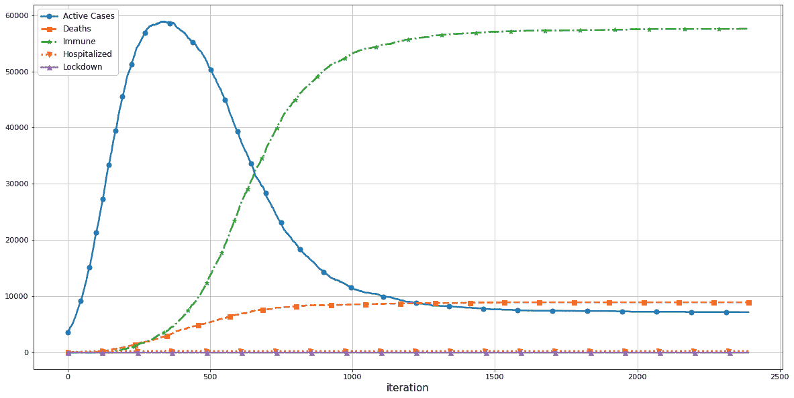

总体而言，我们有 8,774 例死亡。

在这里，我们可以看到随着这一政策早期解除封锁，多次感染的波动：

```py
def lockdown_policy(infected, deaths, population_size):
  if (
    (max(infected[-5 * 10:]) / population_size) > 0.6
    and 
    (len(deaths) > 2 and deaths[-1] > deaths[-2])
 ):
 return 7 * 12
 return 0
```

当我们运行这个模拟时，我们得到完全不同的结果，如下所示：

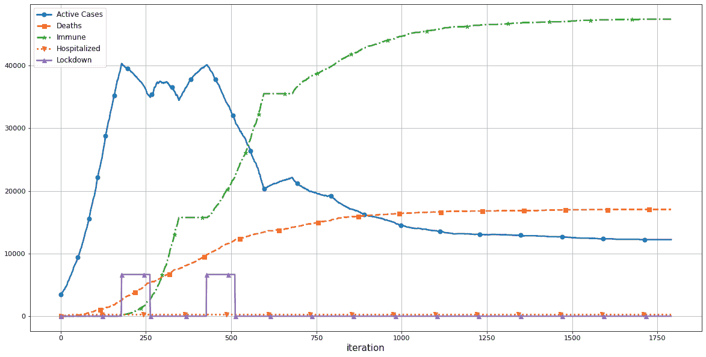

在 250 个迭代周围的矩形形状显示了封锁的宣布时间（忽略比例或形状）。总体而言，我们可以看到这导致了 20663 人的死亡。这种极高的死亡率——远高于`critical_rate`参数的设定——由于免疫前再感染，已经设定为 5%。

让我们将这与一个非常谨慎的政策进行比较，即每次死亡率上升或者感染率在（大致）3 周内超过 20%时宣布封锁：

```py
def lockdown_policy(infected, deaths, population_size):
    if infected[-1] / population_size > 0.2:
        return 21 * 12
    return 0
```

仅有一次封锁，我们得到了以下的图表，显示了大约 600 人的总死亡人数：

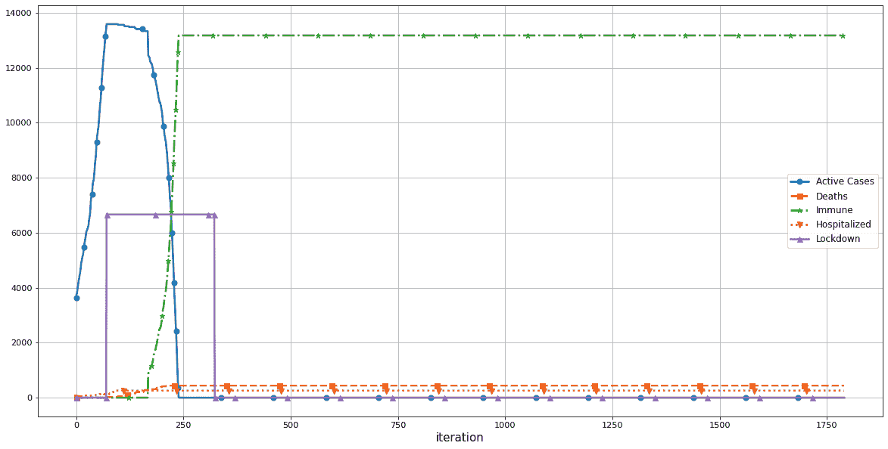

您可以更改这些参数或者调整逻辑，以创建更复杂和/或更真实的模拟。

更多关于原始工作的细节可以在线上找到（[`teck78.blogspot.com/2020/04/using-mesa-framework-to-simulate-spread.html`](https://teck78.blogspot.com/2020/04/using-mesa-framework-to-simulate-spread.html)）。

## 工作原理...

模拟非常简单：它由代理组成，并且在迭代（称为周期）中进行。每个代理代表人群的一部分。

在这里，某个群体被这种疾病感染。在每个周期（对应 1 小时）内，被感染者可以去医院（如果有空位）、死亡、或者朝着康复迈进。他们还可以进入隔离状态。在尚未康复、未隔离且尚未死亡的情况下，他们可以在与他们空间接近的人群中传播疾病。恢复时，代理可以获得免疫力。

在每个周期内，代理可以移动。如果他们不在隔离中或者国家实施了封锁，他们将会移动到一个新的位置；否则，他们将保持原地。如果一个人被感染，他们可以死亡、去医院、康复、传染给其他人，或者进入隔离状态。

根据死亡和感染率，可以宣布国家封锁，这是我们模拟的主要焦点：国家封锁的引入如何影响死亡人数？

我们需要考虑不同的变量。其中一个是人口密度。我们可以通过将我们的代理放在地图或网格上来引入人口密度，网格大小由`grid_x`和`grid_y`定义。`infect_rate` 参数必须根据网格大小和人口密度进行调整。

我们在这里需要考虑更多的参数，比如以下的参数：

+   `initial_infected` 是初始感染率。

+   `recovery_period` 声明了被感染后恢复所需的周期数（大致以小时计），`0` 表示永不恢复。

+   `critical_rate` 是在整个恢复期内患病者可能重症的比例，这意味着他们可能会去医院（如果可能的话）或者死亡。

+   `hospital_capacity_rate` 是全人口每人的医院床位数。我们通过在线搜索找到了这些信息（[`www.hsj.co.uk/acute-care/nhs-hospitals-have-four-times-more-empty-beds-than-normal/7027392.article`](https://www.hsj.co.uk/acute-care/nhs-hospitals-have-four-times-more-empty-beds-than-normal/7027392.article)，[`www.kingsfund.org.uk/publications/nhs-hospital-bed-numbers`](https://www.kingsfund.org.uk/publications/nhs-hospital-bed-numbers)）。

+   还有 `active_ratio` 定义一个人的活跃程度；`quarantine_rate` 决定一个人不去医院而进行自我隔离的可能性；以及 `immunity_chance` ，在康复后相关。

+   模拟将运行一定数量的 `cycles`，我们的封锁政策在 `lockdown_policy` 函数中声明。

在 `Simulation` 的 `step()` 方法中，我们进行了数据收集。然后，根据 `free_beds` 变量检查医院是否可以接收更多患者。接着，我们运行了代理器 `self.schedule.step()`。如果我们处于封锁状态，我们开始倒计时。封锁状态由 `False` 变量到 `lockdown_period` 变量设置（在 Python 的鸭子类型中有所改动）。

`lockdown_policy()` 函数确定国家封锁的持续时间，根据感染和死亡的人数随时间变化（列表）。在这里，0 意味着我们不宣布封锁。

## 还有更多...

由于模拟可能需要很长时间才能运行，尝试参数可能非常缓慢。而不是必须进行完整运行，然后才能看到是否产生预期效果，我们可以使用 `matplotlib` 的实时绘图功能。

为了获得更快的反馈，让我们实时绘制模拟循环，如下所示：

```py
%matplotlib inline
from collections import defaultdict
from matplotlib import pyplot as plt
from IPython.display import clear_output

def live_plot(data_dict, figsize=(7,5), title=''):
    clear_output(wait=True)
    plt.figure(figsize=figsize)
    for label,data in data_dict.items():
        plt.plot(data, label=label)
    plt.title(title)
    plt.grid(True)
    plt.xlabel('iteration')
    plt.legend(loc='best')
    plt.show()

model = Simulation(sim_params)
cycles_to_run = sim_params.get('cycles')
print(sim_params)
for current_cycle in range(cycles_to_run):
    model.step()
    if (current_cycle % 10) == 0:
        live_plot(model.datacollector.model_vars)

print('Total deaths: {}'.format(
    model.datacollector.model_vars['Deaths'][-1]
))
```

这将持续（每 10 个周期）更新我们的模拟参数绘图。如果没有达到预期效果，我们可以中止它，而不必等待完整模拟。

## 另请参见

您可以在 [`mesa.readthedocs.io/en/master/`](https://mesa.readthedocs.io/en/master/) 找到有关 mesa 的基于 Python 的多智能体建模的更多信息。以下是一些其他的多智能体库：

+   MAgent 专注于具有非常多代理的 2D 环境，通过强化学习进行学习：[`github.com/PettingZoo-Team/MAgent`](https://github.com/PettingZoo-Team/MAgent)。

+   osBrain 和 PADE 是通用的多智能体系统库。它们分别可以在 [`osbrain.readthedocs.io/en/stable/`](https://osbrain.readthedocs.io/en/stable/) 和 [`pade.readthedocs.io/en/latest/`](https://pade.readthedocs.io/en/latest/) 找到。

+   SimPy 是一个离散事件模拟器，可用于更广泛的模拟：[`simpy.readthedocs.io/en/latest/`](https://simpy.readthedocs.io/en/latest/)。

其他模拟器也已发布，其中最突出的是 CovidSim 微模型（[`github.com/mrc-ide/covid-sim`](https://github.com/mrc-ide/covid-sim)），由伦敦帝国学院全球传染病分析中心 MRC 开发。

# 使用蒙特卡洛树搜索编写国际象棋引擎

国际象棋是一种两人对弈的棋盘游戏，自 15 世纪以来作为智力游戏而广受欢迎。在 20 世纪 50 年代，计算机击败了第一个人类玩家（一个完全的新手），然后在 1997 年击败了人类世界冠军。此后，它们已经发展到拥有超人类的智能。编写国际象棋引擎的主要困难之一是搜索许多变化和组合并选择最佳策略。

在这个示例中，我们将使用蒙特卡洛树搜索来创建一个基本的国际象棋引擎。

## 准备好了

我们将使用`python-chess`库进行可视化，获取有效移动，并知道状态是否终止。我们可以使用`pip`命令安装它，如下所示：

```py
pip install python-chess
```

我们将使用这个库进行可视化，生成每个位置的有效移动，并检查是否达到了最终位置。

## 如何实现...

本示例基于 Luke Miles 在[`gist.github.com/qpwo/c538c6f73727e254fdc7fab81024f6e1`](https://gist.github.com/qpwo/c538c6f73727e254fdc7fab81024f6e1)上对蒙特卡洛树搜索的最小实现。

首先，我们将查看我们将用来定义我们的树搜索类的代码，然后看看搜索是如何工作的。之后，我们将学习如何将其适应于国际象棋。

### 树搜索

树搜索是一种利用搜索树作为数据结构的搜索方法。通常情况下，在搜索树中，节点（或叶子）表示一个概念或情况，这些节点通过边（分支）连接。树搜索遍历树以得出最佳解决方案。

让我们首先实现树搜索类：

```py
import random

class MCTS:
    def __init__(self, exploration_weight=1):
        self.Q = defaultdict(int)
        self.N = defaultdict(int)
        self.children = dict()
        self.exploration_weight = exploration_weight
```

我们将在*它的工作原理...*部分更详细地讨论这些变量。我们很快将向这个类添加更多方法。

我们的树搜索中的不同步骤在我们的`do_rollout`方法中执行：

```py
    def do_rollout(self, node):
        path = self._select(node)
        leaf = path[-1]
        self._expand(leaf)
        reward = self._simulate(leaf)
        self._backpropagate(path, reward)
```

每个`rollout()`调用都会向我们的树中添加一层。

让我们依次完成四个主要步骤：

1.  `select`步骤找到一个叶节点，从该节点尚未启动模拟：

```py
    def _select(self, node):
        path = []
        while True:
            path.append(node)
            if node not in self.children or not self.children[node]:
                return path
            unexplored = self.children[node] - self.children.keys()
            if unexplored:
                n = unexplored.pop()
                path.append(n)
                return path
            node = self._select(random.choice(self.children[node]))
```

这是递归定义的，因此如果我们找不到未探索的节点，我们就会探索当前节点的一个子节点。

1.  扩展步骤添加子节点——即通过有效移动到达的节点，给定一个棋盘位置：

```py
    def _expand(self, node):
        if node in self.children:
            return
        self.children[node] = node.find_children()
```

此函数使用后代（或子节点）更新`children`字典。这些节点是从当前节点通过单个移动可以到达的任何有效棋盘位置。

1.  模拟步骤运行一系列移动，直到游戏结束：

```py
    def _simulate(self, node):
        invert_reward = True
        while True:
            if node.is_terminal():
                reward = node.reward()
                return 1 - reward if invert_reward else reward
            node = node.find_random_child()
            invert_reward = not invert_reward
```

此函数执行模拟直到游戏结束。

1.  反向传播步骤将奖励与路径上的每一步关联起来：

```py
    def _backpropagate(self, path, reward):
        for node in reversed(path):
            self.N[node] += 1
            self.Q[node] += reward
            reward = 1 - reward
```

最后，我们需要一种选择最佳移动的方法，可以简单地通过查看`Q`和`N`字典并选择具有最大效用（奖励）的后代来实现：

```py
    def choose(self, node):
        if node not in self.children:
            return node.find_random_child()

        def score(n):
            if self.N[n] == 0:
                return float('-inf')
            return self.Q[n] / self.N[n]

        return max(self.children[node], key=score)
```

我们将看不见的节点的分数设置为`-infinity`，以避免选择未见过的移动。

### 实现一个节点

现在，让我们学习如何为我们的国际象棋实现使用一个节点。

因为这基于`python-chess`库，所以实现起来相对容易：

```py
import hashlib
import copy

class ChessGame:
    def find_children(self):
        if self.is_terminal():
            return set()
        return {
            self.make_move(m) for m in self.board.legal_moves
        }

    def find_random_child(self):
        if self.is_terminal():
            return None
        moves = list(self.board.legal_moves)
        m = choice(moves)
        return self.make_move(m)

    def player_win(self, turn):
        if self.board.result() == '1-0' and turn:
            return True
        if self.board.result() == '0-1' and not turn:
            return True
        return False

    def reward(self):
        if self.board.result() == '1/2-1/2':
            return 0.5
        if self.player_win(not self.board.turn):
            return 0.0

    def make_move(self, move):
        child = self.board.copy()
        child.push(move)
        return ChessGame(child)

    def is_terminal(self):
        return self.board.is_game_over()
```

我们在这里省略了一些方法，但不要担心 - 我们将在*工作原理...*部分进行覆盖。

现在一切准备就绪，我们终于可以下棋了。

### 下国际象棋

让我们下一盘国际象棋！

以下只是一个简单的循环，带有一个图形提示显示棋盘位置：

```py
from IPython.display import display
import chess
import chess.svg

def play_chess():
    tree = MCTS()
    game = ChessGame(chess.Board())
    display(chess.svg.board(board=game.board, size=300))
    while True:
        move_str = input('enter move: ')
        move = chess.Move.from_uci(move_str)
        if move not in list(game.board.legal_moves):
            raise RuntimeError('Invalid move')
        game = game.make_move(move)
        display(chess.svg.board(board=game.board, size=300))
        if game.is_terminal():
            break
        for _ in range(50):
            tree.do_rollout(game)
        game = tree.choose(game)
        print(game)
        if game.is_terminal():
            break
```

然后，您应该被要求输入一个移动到棋盘上某个位置的移动。每次移动后，将显示一个棋盘，显示当前棋子的位置。这可以在以下截图中看到：

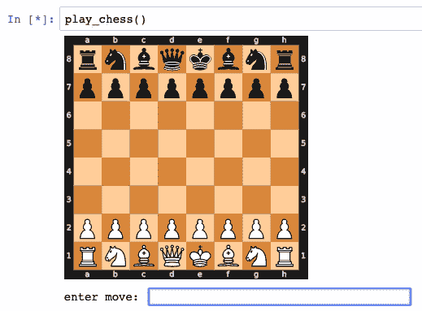

注意移动必须以 UCI 符号输入。如果以“square to square”格式输入移动，例如 a2a4，它应该总是有效。

这里使用的游戏强度并不是非常高，但是在玩弄它时应该仍然很容易看到一些改进。请注意，此实现没有并行化。

## 工作原理...

在**蒙特卡洛树搜索**（**MCTS**）中，我们应用蒙特卡洛方法 - 基本上是随机抽样 - 以获取关于玩家所做移动强度的概念。对于每个移动，我们随机进行移动直到游戏结束。如果我们做得足够频繁，我们将得到一个很好的估计。

树搜索维护不同的变量：

+   `Q`是每个节点的总奖励。

+   `N`是每个节点的总访问次数。

+   `children`保存每个节点的子节点 - 可以从一个棋盘位置到达的节点。

+   节点在我们的情况下是一个棋盘状态。

这些字典很重要，因为我们通过奖励对节点（棋盘状态）的效用进行平均，并根据它们被访问的频率（或者更确切地说，它们被访问的次数越少）对节点进行抽样。

搜索的每次迭代包括四个步骤：

1.  选择

1.  扩展

1.  模拟

1.  回传播

选择步骤，在其最基本的形式下，寻找一个尚未探索过的节点（例如一个棋盘位置）。

扩展步骤将`children`字典更新为所选节点的子节点。

模拟步骤很简单：我们执行一系列随机移动，直到到达终止位置，并返回奖励。由于这是一个两人零和棋盘游戏，当轮到对手时，我们必须反转奖励。

反向传播步骤按照反向方向的路径将奖励与探索路径中的所有节点关联起来。`_backpropagate()` 方法沿着一系列移动（路径）回溯所有节点，赋予它们奖励，并更新访问次数。

至于节点的实现，由于我们将它们存储在之前提到的字典中，所以节点必须是可散列且可比较的。因此，在这里，我们需要实现`__hash__`和`__eq__`方法。我们以前没有提到它们，因为我们不需要它们来理解算法本身，所以我们在这里补充了它们以保持完整性：

```py
    def __hash__(self):
        return int(
            hashlib.md5(
                self.board.fen().encode('utf-8')
            ).hexdigest()[:8],
            16
        )

    def __eq__(self, other):
        return self.__hash__() == other.__hash__()

    def __repr__(self):
        return '\n' + str(self.board)
```

当你在调试时，`__repr__()`方法可能非常有用。

对于`ChessGame`类的主要功能，我们还需要以下方法：

+   `find_children()`: 从当前节点查找所有可能的后继节点

+   `find_random_child()`: 从当前节点找到一个随机的后继节点

+   `is_terminal()`: 确定节点是否为终端节点

+   `reward()`: 为当前节点提供奖励

请再次查看`ChessGame`的实现，以了解它的运作方式。

## 这还不算完...

MCTS 的一个重要扩展是**上置信树**（**UCTs**），用于平衡探索和利用。在 9x9 棋盘上达到段位的第一个围棋程序使用了带有 UCT 的 MCTS。

要实现`UCT`扩展，我们需要回到我们的`MCTS`类，并进行一些更改：

```py
    def _uct_select(self, node):
        log_N_vertex = math.log(self.N[node])

        def uct(n):
            return self.Q[n] / self.N[n] + self.exploration_weight * math.sqrt(
                log_N_vertex / self.N[n]
            )

        return max(self.children[node], key=uct)
```

`uct()` 函数应用**上置信界限**（**UCB**）公式，为一个移动提供一个得分。节点*n*的得分是从节点*n*开始的所有模拟中赢得的模拟数量的总和，加上一个置信项：

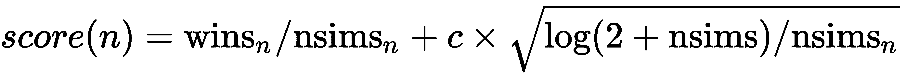

在这里，*c* 是一个常数。

接下来，我们需要替换代码的最后一行，以便使用`_uct_select()`代替`_select()`进行递归。在这里，我们将替换`_select()`的最后一行，使其陈述如下：

```py
            node = self._uct_select(node)
```

进行此更改应该会进一步增强代理程序的游戏强度。

## 另请参见

要了解更多关于 UCT 的信息，请查看 MoGO 关于在 9x9 棋盘上达到段位的第一个计算机围棋程序的文章：[`hal.inria.fr/file/index/docid/369786/filename/TCIAIG-2008-0010_Accepted_.pdf`](https://hal.inria.fr/file/index/docid/369786/filename/TCIAIG-2008-0010_Accepted_.pdf)。它还提供了 MCTS 的伪代码描述。

easyAI 库包含许多不同的搜索算法：[`zulko.github.io/easyAI/index.html`](https://zulko.github.io/easyAI/index.html)。
