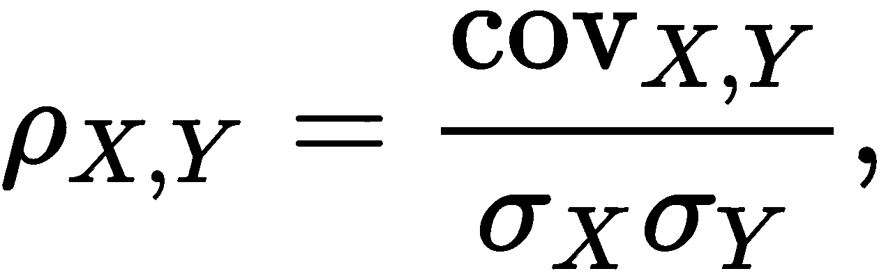
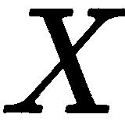
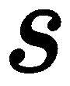

深度强化学习

**强化学习**是指通过优化它们在环境中的行动来自动化问题解决的目标驱动代理的发展。这涉及预测和分类可用数据，并训练代理成功执行任务。通常，代理是一个能够与环境进行交互的实体，学习是通过将来自环境的累积奖励的反馈来指导未来的行动。

可以区分三种不同类型的强化学习：

+   基于价值——价值函数提供当前环境状态的好坏估计。

+   基于策略——其中函数根据状态确定行动。

+   基于模型——包括状态转换、奖励和行动规划在内的环境模型。

在本章中，我们将从多臂赌博机的角度开始介绍强化学习在网站优化中的相对基础的用例，我们将看到一个代理和一个环境以及它们的交互。然后，我们将进入控制的简单演示，这时情况会稍微复杂一些，我们将看到一个代理环境和基于策略的方法 REINFORCE。最后，我们将学习如何玩二十一点，我们将使用**深度 Q 网络**（**DQN**），这是一个基于价值的算法，2015 年由 DeepMind 创建用于玩 Atari 游戏的 AI。

在本章中，我们将涵盖以下步骤：

+   优化网站

+   控制车杆

+   玩二十一点

# 技术要求

完整的笔记本可以在线上 GitHub 找到：[`github.com/PacktPublishing/Artificial-Intelligence-with-Python-Cookbook/tree/master/chapter06`](https://github.com/PacktPublishing/Artificial-Intelligence-with-Python-Cookbook/tree/master/chapter06)。

# 优化网站

在这个步骤中，我们将处理网站优化。通常，需要对网站进行变更（或者更好的是，单一变更）来观察其效果。在所谓的**A/B 测试**的典型情况下，将系统地比较两个版本的网页。A/B 测试通过向预定数量的用户展示网页版本 A 和版本 B 来进行。之后，计算统计显著性或置信区间，以便量化点击率的差异，目的是决定保留哪种网页变体。

这里，我们将从强化学习的角度来看待网站优化，即对每个访问者（或加载页面的用户），根据加载网站时可用数据选择最佳版本。在每次反馈（点击或未点击）后，我们会更新统计数据。与 A/B 测试相比，这种过程可能会产生更可靠的结果，并且随着时间推移，我们还会更频繁地展示最佳的网页变体。请注意，我们不限于两种变体，而是可以比较许多变体。

这个网站优化的使用案例将帮助我们介绍代理和环境的概念，并展示探索与利用之间的权衡。我们将在*工作原理...*部分解释这些概念。

## 怎么做...

为了实施我们的方案，我们需要两个组件：

+   我们的代理决定向用户展示哪个网页。

+   环境是一个测试平台，将给我们的代理提供反馈（点击或不点击）。

由于我们仅使用标准的 Python，无需安装任何东西，我们可以直接开始实施我们的方案：

1.  首先我们将实现我们的环境。我们将考虑这作为一个多臂老虎机问题，在*工作原理...*部分中会有详细解释。因此，我们将称我们的环境为`Bandit`：

```py
import random
import numpy as np

class Bandit:
    def __init__(self, K=2, probs=None):
        self.K = K
        if probs is None:
            self.probs = [
                random.random() for _ in range(self.K)
            ]
        else:
            assert len(probs) == K
            self.probs = probs

        self.probs = list(np.array(probs) / np.sum(probs))
        self.best_probs = max(self.probs)

    def play(self, i):
        if random.random() < self.probs[i]:
            return 1
        else:
            return 0
```

这个老虎机初始化时有可用选择的数量`K`。这将为每个选择设置一个点击的概率。在实践中，环境将是真实用户的反馈；在这里，我们模拟用户行为。`play()`方法会玩第`i`台机器，并返回`1`或`0`的奖励。

1.  现在我们需要与这个环境进行交互。这就是我们的代理要发挥作用的地方。代理需要做出决策，我们将为它提供一个决策策略。我们也会包括指标的收集。一个抽象的代理看起来是这样的：

```py
class Agent:
    def __init__(self, env):        
        self.env = env
        self.listeners = {}
        self.metrics = {}
        self.reset()

    def reset(self):
        for k in self.metrics:
            self.metrics[k] = []

    def add_listener(self, name, fun):
        self.listeners[name] = fun
        self.metrics[name] = []

    def run_metrics(self, i):
        for key, fun in self.listeners.items():
            fun(self, i, key)

    def run_one_step(self):
        raise NotImplementedError

    def run(self, n_steps):
        raise NotImplementedError
```

任何代理都需要一个环境来进行交互。它需要做出单一的决策（`run_one_step(self)`），为了看到其决策的好坏，我们需要运行一个模拟（`run(self, n_steps)`）。

代理将包含一个指标函数的查找列表，并且还会继承一个指标收集功能。我们可以通过`run_metrics(self, i)`函数来运行指标收集。

我们在这里使用的策略称为`UCB1`。我们将在*如何做...*部分解释这个策略：

```py

class UCB1(Agent):
    def __init__(self, env, alpha=2.):
        self.alpha = alpha
        super(UCB1, self).__init__(env)

    def run_exploration(self):
        for i in range(self.env.K):
            self.estimates[i] = self.env.play(i)
            self.counts[i] += 1
            self.history.append(i)
            self.run_metrics(i) 
            self.t += 1

    def update_estimate(self, i, r):
        self.estimates[i] += (r - self.estimates[i]) / (self.counts[i] + 1)

    def reset(self):
        self.history = []
        self.t = 0
        self.counts = [0] * self.env.K
        self.estimates = [None] * self.env.K
        super(UCB1, self).reset()

    def run(self, n_steps):
        assert self.env is not None
        self.reset()
        if self.estimates[0] is None:
            self.run_exploration()
        for _ in range(n_steps):
            i = self.run_one_step()
            self.counts[i] += 1
            self.history.append(i)
            self.run_metrics(i)

    def upper_bound(self, i):
        return np.sqrt(
            self.alpha * np.log(self.t) / (1 + self.counts[i])
        )

    def run_one_step(self):
        i = max(
            range(self.env.K),
            key=lambda i: self.estimates[i] + self.upper_bound(i)
        )
        r = self.env.play(i)
        self.update_estimate(i, r)
        self.t += 1
        return i
```

我们的`UCB1`代理需要一个环境（即老虎机）进行交互，并且还需要一个单一的参数 alpha，用于权衡探索动作的重要性（与利用已知最佳动作的程度）。代理会随着时间维护其选择的历史记录，以及每个可能选择的估计记录。

我们应该看一下`run_one_step(self)`方法，它通过选择最佳的乐观选择来做出单一选择。`run(self, n_step)`方法运行一系列选择，并从环境中获取反馈。

让我们跟踪两个指标：遗憾值，即由于次优选择而导致的预期损失之和，以及作为代理估计值与环境实际配置之间收敛性的衡量标准——斯皮尔曼等级相关系数（`stats.spearmanr()`）。

**斯皮尔曼等级相关系数**等于排名变量的皮尔逊相关系数（通常简称为相关系数或乘积矩法相关系数）。

两个变量和之间的皮尔逊相关性可以表示如下：



其中是和的协方差，而是的标准差。

斯皮尔曼相关性不是基于原始分数，而是基于排名分数计算。排名转换意味着变量按值排序，并为每个条目分配其顺序。给定在*X*中第*i*个点的排名，斯皮尔曼秩相关性计算如下：


这评估了两个变量之间关系能否被描述为单调函数的好坏，但不一定是线性的（如皮尔逊相关性的情况）。与皮尔逊相关性类似，斯皮尔曼相关性在完全负相关时为，在完全相关时为。表示没有相关性。

我们的跟踪函数是`update_regret()`和`update_rank_corr()`：

```py
from scipy import stats

def update_regret(agent, i, key):
    regret = agent.env.best_probs - agent.env.probs[i]
    if agent.metrics[key]:
        agent.metrics[key].append(
            agent.metrics[key][-1] + regret
        )
    else:
        agent.metrics[key] = [regret]

def update_rank_corr(agent, i, key):
    if agent.t < agent.env.K:
        agent.metrics[key].append(0.0)
    else:
        agent.metrics[key].append(
            stats.spearmanr(agent.env.probs, agent.estimates)[0]
        )
```

现在，我们可以跟踪这些指标，以便比较`alpha`参数（更多或更少的探索）的影响。随后，我们可以观察随时间的收敛和累积遗憾：

```py
random.seed(42.0)
bandit = Bandit(20)
agent = UCB1(bandit, alpha=2.0)
agent.add_listener('regret', update_regret)
agent.add_listener('corr', update_rank_corr)
agent.run(5000)
```

因此，我们有 20 个不同的网页选择，并收集定义的`regret`和`corr`，并进行`5000`次迭代。如果我们绘制这个，我们可以了解这个代理的表现如何：


对于第二次运行，我们将 alpha 更改为`0.5`，因此我们将进行较少的探索：


我们可以看到，*alpha=0.5*时的累积遗憾远低于*alpha=2.0*时；然而，估计值与环境参数的总体相关性较低。

因此，较少的探索使得我们的代理模型对环境的真实参数了解程度较差。这是因为较少的探索使得较低排名特征的排序没有收敛。尽管它们被排名为次优，但它们还没有被选择足够多次来确定它们是最差还是次差，例如。这就是我们在较少探索时看到的情况，这也可能是可以接受的，因为我们可能只关心知道哪种选择是最佳的。

## 工作原理如下...

在这个示例中，我们处理了网站优化问题。我们模拟用户对不同版本网页的选择，同时实时更新每个变体的统计数据，以及应该显示的频率。此外，我们比较了探索性场景和更加利用性场景的优缺点。

我们将用户对网页的响应框架化为多臂赌博问题。**多臂赌博**（**MABP**）是一种投币并拉动多个杠杆之一的老虎机，每个杠杆与不同的奖励分布相关联，而这对投资者来说是未知的。更普遍地说，**多臂赌博问题**（也称为**K 臂赌博问题**）是在资源在竞争选择之间分配的情况下，每个选择的结果仅部分已知，但随着时间的推移可能会更好地了解。当在做出决策时考虑世界的观察结果时，这被称为**上下文赌博**。

我们使用了**置信上界版本 1**（**UCB1**）算法（Auer 等人，*有限时间分析多臂赌博问题*，2002 年），这个算法易于实现。

运行方式如下：

+   为了获取平均奖励的初始估计值（探索阶段），每个动作都要执行一次。

+   对于每一轮 *t* 更新 *Q(a)* 和 *N(a)*，并根据以下公式执行动作 *a'*：


其中  是平均奖励的查找表，  是动作  被执行的次数，  是参数。

UCB 算法遵循在不确定性面前保持乐观的原则，通过选择在其置信区间上 UCB 最高的臂而不是估计奖励最高的臂来执行动作。它使用简单的均值估计器来估算动作奖励。

前述方程式中的第二项量化了不确定性。不确定性越低，我们越依赖 *Q(a)*。不确定性随着动作播放次数的增加而线性减少，并随着轮数的对数增加而对数增加。

多臂赌博在许多领域中非常有用，包括在线广告、临床试验、网络路由或在生产中两个或多个版本的机器学习模型之间的切换。

有许多变体的赌博算法来处理更复杂的场景，例如，选择之间切换的成本，或者具有有限生命周期的选择，例如秘书问题。秘书问题的基本设置是你想从一个有限的申请者池中雇佣一名秘书。每位申请者按随机顺序进行面试，面试后立即做出明确的决定（是否雇佣）。秘书问题也被称为婚姻问题。

## 另见

Ax 库在 Python 中实现了许多赌徒算法：[`ax.dev/`](https://ax.dev/)。

Facebook 的 PlanOut 是一个用于大规模在线实验的库：[`facebook.github.io/planout/index.html`](https://facebook.github.io/planout/index.html)。

作为阅读材料，我们建议这些书籍：

+   Russo 等人，2007 年，《关于汤普森采样的教程》([`arxiv.org/pdf/1707.02038.pdf`](https://arxiv.org/pdf/1707.02038.pdf))

+   Szepesvari 和 Lattimore，《赌徒算法》，2020 年（在线版本可用：([`tor-lattimore.com/downloads/book/book.pdf`](https://tor-lattimore.com/downloads/book/book.pdf))

# 控制一个倒立摆

倒立摆是 OpenAI Gym 中的一个控制任务，已经研究了多年。虽然与其他任务相比相对简单，但它包含了我们实施强化学习算法所需的一切，我们在这里开发的一切也可以应用于其他更复杂的学习任务。它还可以作为在模拟环境中进行机器人操作的示例。选择一个不那么苛刻的任务的好处在于训练和反馈更快。

**OpenAI Gym**是一个开源库，可以通过为代理与之交互的广泛环境标准化，帮助开发强化学习算法。OpenAI Gym 提供了数百个环境和集成，从机器人控制和三维行走到电脑游戏和自动驾驶汽车：[`gym.openai.com/`](https://gym.openai.com/)。

在 OpenAI Gym 环境的以下截图中展示了倒立摆任务，通过将购物车向左或向右移动来平衡一个立杆：


在这个示例中，我们将使用 PyTorch 实现 REINFORCE 策略梯度方法来解决倒立摆任务。让我们开始吧。

## 准备工作

有许多库提供了测试问题和环境的集合。其中一个集成最多的库是 OpenAI Gym，我们将在这个示例中使用它：

```py
pip install gym
```

现在我们可以在我们的示例中使用 OpenAI Gym 了。

## 实施方法...

OpenAI Gym 为我们节省了工作——我们不必自己定义环境，确定奖励信号，编码环境或说明允许哪些动作。

首先，我们将加载环境，定义一个深度学习策略用于动作选择，定义一个使用此策略来选择执行动作的代理，最后我们将测试代理在我们的任务中的表现：

1.  首先，我们将加载环境。每次杆子不倒下时，我们都会得到一个奖励。我们有两个可用的移动方式，向左或向右，并且观察空间包括购物车位置和速度的表示以及杆角度和速度，如下表所示：

    | **编号** | **观察值** | **最小值** | **最大值** |
    | --- | --- | --- | --- |
    | 0 | 购物车位置 | -2.4 | 2.4 |
    | 1 | 购物车速度 | -Inf | -Inf |
    | 2 | 杆角度 | ~ -41.8° | ~ 41.8° |
    | 3 | Pole Velocity At Tip | -Inf | -Inf |

您可以在这里了解更多关于此环境的信息：[`gym.openai.com/envs/CartPole-v1/`](https://gym.openai.com/envs/CartPole-v1/)。

我们可以加载环境并打印这些参数如下：

```py
import gym

env = gym.make('CartPole-v1')
print('observation space: {}'.format(
    env.observation_space
))
print('actions: {}'.format(
    env.action_space.n
))
#observation space: Box(4,)
#actions: 2
```

因此，我们确认我们有四个输入和两个动作，我们的代理将类似于前面的示例*优化网站*定义，只是这次我们会在代理外部定义我们的神经网络。

代理将创建一个策略网络，并使用它来做出决策，直到达到结束状态；然后将累积奖励馈送到网络中进行学习。让我们从策略网络开始。

1.  让我们创建一个策略网络。我们将采用一个全连接的前馈神经网络，根据观察空间预测动作。这部分基于 PyTorch 实现，可以在[`github.com/pytorch/examples/blob/master/reinforcement_learning/reinforce.py`](https://github.com/pytorch/examples/blob/master/reinforcement_learning/reinforce.py)找到：

```py
import torch as T
import torch.nn as nn
import torch.nn.functional as F
import numpy as np

class PolicyNetwork(nn.Module):
    def __init__(
        self, lr, n_inputs,
        n_hidden, n_actions
    ):
        super(PolicyNetwork, self).__init__()
        self.lr = lr
        self.fc1 = nn.Linear(n_inputs, n_hidden)
        self.fc2 = nn.Linear(n_hidden, n_actions)
        self.optimizer = optim.Adam(self.parameters(), lr=self.lr)

        self.device = T.device(
            'cuda:0'
            if T.cuda.is_available()
            else 'cpu:0'
        )
        self.to(self.device)

    def forward(self, observation):
        x = T.Tensor(observation.reshape(-1).astype('float32'),
        ).to(self.device)
        x = F.relu(self.fc1(x))
        x = F.softmax(self.fc2(x), dim=0)
        return x
```

这是一个神经网络模块，用于学习策略，换句话说，从观察到动作的映射。它建立了一个具有一层隐藏层和一层输出层的两层神经网络，其中输出层中的每个神经元对应于一个可能的动作。我们设置了以下参数：

+   `lr`: 学习率

+   `n_inputs`: 输入数量

+   `n_hidden`: 隐藏神经元数量

+   `n_actions`: 输入维度

1.  现在我们可以定义我们的**代理人**了：

```py
class Agent:
    eps = np.finfo(
        np.float32
    ).eps.item()

    def __init__(self, env, lr, params, gamma=0.99):
        self.env = env
        self.gamma = gamma
        self.actions = []
        self.rewards = []
        self.policy = PolicyNetwork(
            lr=lr,
            **params
        )

    def choose_action(self, observation):
        output = self.policy.forward(observation)
        action_probs = T.distributions.Categorical(
            output
        )
        action = action_probs.sample()
        log_probs = action_probs.log_prob(action)
        action = action.item()
        self.actions.append(log_probs)
        return action, log_probs
```

代理人评估策略以执行动作并获得奖励。 `gamma` 是折扣因子。

使用 `choose_action(self, observation)` 方法，我们的代理根据观察选择动作。动作是根据我们网络的分类分布进行抽样。

我们省略了`run()` 方法，其内容如下：

```py
    def run(self):
        state = self.env.reset()
        probs = []
        rewards = []
        done = False
        observation = self.env.reset()
        t = 0
        while not done:
            action, prob = self.choose_action(observation.reshape(-1))
            probs.append(prob)
            observation, reward, done, _ = self.env.step(action)
            rewards.append(reward)
            t += 1

        policy_loss = []
        returns = []
        R = 0
        for r in rewards[::-1]:
            R = r + self.gamma * R
            returns.insert(0, R)
        returns = T.tensor(returns)
        returns = (returns - returns.mean()) / (returns.std() + self.eps)

        for log_prob, R in zip(probs, returns):
            policy_loss.append(-log_prob * R)

        if(len(policy_loss)) > 0:
            self.policy.optimizer.zero_grad()
            policy_loss = T.stack(policy_loss, 0).sum()
            policy_loss.backward()
            self.policy.optimizer.step()
        return t
```

`run(self)` 方法类似于之前的示例，*优化网站*，在环境中运行完整的模拟直到结束。这是直到杆几乎倒下或达到 500 步（即 `env._max_episode_steps` 的默认值）为止。

1.  接下来，我们将测试我们的代理人。我们将在环境中运行我们的代理人，通过模拟与环境的交互来开始。为了获得我们学习率的更干净的曲线，我们将`env._max_episode_steps`设置为`10000`。这意味着模拟在 10000 步后停止。如果我们保持默认值`500`，算法将在达到约 500 步后停滞或性能达到某个水平。相反，我们试图做更多的优化：

```py
env._max_episode_steps = 10000
input_dims = env.observation_space.low.reshape(-1).shape[0]
n_actions = env.action_space.n

agent = Agent(
    env=env,
    lr=0.01,
    params=dict(
        n_inputs=input_dims,
        n_hidden=10,
        n_actions=n_actions
    ),
    gamma=0.99,
)
update_interval = 100
scores = []
score = 0
n_episodes = 25000
stop_criterion = 1000
for i in range(n_episodes):
    mean_score = np.mean(scores[-update_interval:])
    if (i>0) and (i % update_interval) == 0:
        print('Iteration {}, average score: {:.3f}'.format(
            i, mean_score
        ))
        T.save(agent.policy.state_dict(), filename)

    score = agent.run()
    scores.append(score)
    if score >= stop_criterion:
        print('Stopping. Iteration {}, average score: {:.3f}'.format(
            i, mean_score
        ))
        break
```

我们应该看到以下输出：

```py
Iteration 100, average score: 31.060
Iteration 200, average score: 132.340
Iteration 300, average score: 236.550
Stopping. Iteration 301, average score: 238.350
```

在进行模拟时，我们每 100 次迭代看到一次更新的平均分数。一旦达到 1000 分，我们就会停止。这是我们的分数随时间的变化情况：


我们可以看到我们的策略正在持续改进——网络正在成功学习如何操作杆车。请注意，您的结果可能会有所不同。网络可能学习得更快或更慢。

在下一节中，我们将深入了解这个算法的实际工作原理。

## 它是如何工作的...

在这个案例中，我们看了一个杆车控制场景中的基于策略的算法。让我们更详细地看看其中的一些内容。

策略梯度方法通过给定的梯度上升找到一个策略，以最大化相对于策略参数的累积奖励。我们实现了一种无模型的基于策略的方法，即 REINFORCE 算法（R. Williams，《简单的统计梯度跟随算法用于连接主义强化学习》，1992 年）。

在基于策略的方法中，我们有一个策略函数。策略函数定义在一个环境  和一个动作  上，并返回给定环境下执行动作的概率。在离散选择的情况下，我们可以使用 softmax 函数：


这就是我们在策略网络中所做的，这有助于我们做出我们的动作选择。

值函数 （有时用  表示）返回给定环境中任何动作的奖励。策略的更新定义如下：


其中  是学习率。

在参数初始化之后，REINFORCE 算法通过每次执行动作时应用此更新函数来进行。

您应该能够在任何 Gym 环境上运行我们的实现，几乎不需要更改。我们故意做了一些事情（例如，将观测数据重塑为向量），以便更容易重用它；但是，请确保您的网络架构与观测数据的性质相对应。例如，如果您的观测数据是时间序列（例如股票交易或声音），您可能希望使用 1D 卷积网络或递归神经网络，或者如果您的观测数据是图像，则可以使用 2D 卷积。

## 还有更多内容...

还有一些其他的事情可以让我们玩得更开心。首先，我们想看到代理与杆互动，其次，我们可以使用库来避免从零开始实施代理。

### 观察我们在环境中的代理

我们可以玩数百场游戏或尝试不同的控制任务。如果我们真的想在 Jupyter 笔记本中观看我们的代理与环境的互动，我们可以做到：

```py
from IPython import display
import matplotlib.pyplot as plt
%matplotlib inline

observation = env.reset()
img = plt.imshow(env.render(mode='rgb_array'))
for _ in range(100):
    img.set_data(env.render(mode='rgb_array'))
    display.display(plt.gcf())
    display.clear_output(wait=True)
    action, prob = agent.choose_action(observation)
    observation, _, done, _ = agent.env.step(action)
    if done:
        break
```

现在我们应该看到我们的代理与环境互动了。

如果您正在远程连接（例如在 Google Colab 上运行），您可能需要做一些额外的工作：

```py
!sudo apt-get install -y xvfb ffmpeg 
!pip install 'gym==0.10.11'
!pip install 'imageio==2.4.0'
!pip install PILLOW
!pip install 'pyglet==1.3.2'
!pip install pyvirtualdisplay
display = pyvirtualdisplay.Display(
    visible=0, size=(1400, 900)
).start()
```

在接下来的部分，我们将使用一个实现在库中的强化学习算法，`RLlib`。

### 使用 RLlib 库

我们可以使用 Python 库和包中的实现，而不是从头开始实现算法。例如，我们可以训练 PPO 算法（Schulman 等人，《Proximal Policy Optimization Algorithms》，2017），该算法包含在`RLlib`包中。 RLlib 是我们在《Python 人工智能入门》第一章中遇到的`Ray`库的一部分。 PPO 是一种政策梯度方法，引入了一个替代目标函数，可以通过梯度下降进行优化：

```py
import ray
from ray import tune
from ray.rllib.agents.ppo import PPOTrainer

ray.init()
trainer = PPOTrainer

analysis = tune.run(
    trainer,
    stop={'episode_reward_mean': 100},
    config={'env': 'CartPole-v0'},
    checkpoint_freq=1,
)
```

这将开始训练。 您的代理将存储在本地目录中，以便稍后加载它们。 RLlib 允许您使用`'torch': True`选项来使用 PyTorch 和 TensorFlow。

## 另见

一些强化学习库提供了许多深度强化学习算法的实现：

+   OpenAI 的 Baselines（需要 TensorFlow 版本 < 2）：[`github.com/openai/baselines`](https://github.com/openai/baselines)

+   RLlib（`Ray`的一部分）是一个可扩展（和分布式）强化学习库：[`docs.ray.io/en/master/rllib-algorithms.html`](https://docs.ray.io/en/master/rllib-algorithms.html)。

+   Machin 是基于 PyTorch 的强化学习库：[`github.com/iffiX/machin`](https://github.com/iffiX/machin)。

+   TF-Agents 提供了许多工具和算法（适用于 TensorFlow 版本 2.0 及更高版本）：[`github.com/tensorflow/agents`](https://github.com/tensorflow/agents)。

请注意，安装这些库可能需要一段时间，并可能占用几个 GB 的硬盘空间。

最后，OpenAI 提供了一个与强化学习相关的教育资源库：[`spinningup.openai.com/`](https://spinningup.openai.com/)。

# 玩 21 点游戏

强化学习中的一个基准是游戏。 研究人员或爱好者设计了许多与游戏相关的不同环境。 有些游戏的里程碑已经在《Python 人工智能入门》第一章中提到。 对许多人来说，游戏的亮点肯定是在国际象棋和围棋两方面击败人类冠军——1997 年国际象棋冠军加里·卡斯帕罗夫和 2016 年围棋冠军李世石——并在 2015 年达到超人类水平的 Atari 游戏中表现出色。

在这个示例中，我们开始使用最简单的游戏环境之一：21 点游戏。 21 点游戏与现实世界有一个有趣的共同点：不确定性。

Blackjack 是一种纸牌游戏，在其最简单的形式中，您将与一名纸牌荷官对战。您面前有一副牌，您可以"hit"，意味着您会得到一张额外的牌，或者"stick"，这时荷官会继续抽牌。为了赢得比赛，您希望尽可能接近 21 分，但不能超过 21 分。

在这个教程中，我们将使用 Keras 实现一个模型来评估给定环境配置下不同动作的价值函数。我们将实现的变体称为 DQN，它在 2015 年的 Atari 里程碑成就中被使用。让我们开始吧。

## 准备工作

如果您尚未安装依赖项，则需要进行安装。

我们将使用 OpenAI Gym，并且我们需要安装它：

```py
pip install gym
```

我们将使用 Gym 环境来进行 21 点游戏。

## 如何做...

我们需要一个代理人来维护其行为影响的模型。这些行动是从其内存中回放以进行学习的。我们将从一个记录过去经验以供学习的内存开始：

1.  让我们实现这个记忆。这个记忆本质上是一个 FIFO 队列。在 Python 中，您可以使用一个 deque；然而，我们发现 PyTorch 示例中的回放内存实现非常优雅，因此这是基于 Adam Paszke 的 PyTorch 设计：

```py
#this is based on https://pytorch.org/tutorials/intermediate/reinforcement_q_learning.html
from collections import namedtuple

Transition = namedtuple(
    'Transition',
    ('state', 'action', 'next_state', 'reward')
)

class ReplayMemory:
    def __init__(self, capacity=2000):
        self.capacity = capacity
        self.memory = []
        self.position = 0

    def push(self, *args):
        if len(self.memory) < self.capacity:
            self.memory.append(None)
        self.memory[self.position] = Transition(*args)
        self.position = (self.position + 1) % self.capacity

    def sample(self, batch_size):
        batch = random.sample(self.memory, batch_size)
        batch = Transition(
            *(np.array(el).reshape(batch_size, -1) for el in zip(*batch))
        )
        return batch

    def __len__(self):
        return len(self.memory)
```

我们实际上只需要两个方法：

+   如果我们的容量已满，我们需要推入新的记忆，并覆盖旧的记忆。

+   我们需要为学习抽样记忆。

最后一点值得强调：我们不是使用所有的记忆来进行学习，而是只取其中的一部分。

在`sample()`方法中，我们做了一些修改以使我们的数据符合正确的形状。

1.  让我们看看我们的代理：

```py
import random
import numpy as np
import numpy.matlib
import tensorflow as tf
from tensorflow.keras import layers
from tensorflow.keras import optimizers
from tensorflow.keras import initializers

class DQNAgent():
    def __init__(self, env, epsilon=1.0, lr=0.5, batch_size=128):
        self.env = env
        self.action_size = self.env.action_space.n
        self.state_size = env.observation_space
        self.memory = ReplayMemory()
        self.epsilon = epsilon
        self.lr = lr
        self.batch_size = batch_size
        self.model = self._build_model()

    def encode(self, state, action=None):
        if action is None:
            action = np.reshape(
                list(range(self.action_size)),
                (self.action_size, 1)
            )
            return np.hstack([
                np.matlib.repmat(state, self.action_size, 1),
                action
            ])
        return np.hstack([state, action])

    def play(self, state):
        state = np.reshape(state, (1, 3)).astype(float)
        if np.random.rand() <= self.epsilon:
            action = np.random.randint(0, self.action_size)
        else:
            action_value = self.model.predict(self.encode(state)).squeeze()
            action = np.argmax(action_value)

        next_state1, reward, done, _ = self.env.step(action)
        next_state = np.reshape(next_state1, (1, 3)).astype(float)
        if done:
            self.memory.push(state, action, next_state, reward)
        return next_state1, reward, done

    def learn(self):
        if len(self.memory) < self.batch_size:
            return
        batch = self.memory.sample(
            self.batch_size
        )
        result = self.model.fit(
            self.encode(batch.state, batch.action),
            batch.reward,
            epochs=1,
            verbose=0
        )
```

请注意在`play()`方法开始时的动作选择。我们掷一个骰子来确定我们是要随机选择一个动作，还是要遵循我们模型的判断。这被称为**ε-贪心动作选择**，它可以促进更多的探索并更好地适应环境。

该代理人带有一些用于配置的超参数：

+   `lr`: 网络的学习率。

+   `batch_size`: 从内存和网络训练中进行抽样的批大小。

+   `epsilon`: 此因子位于`0`到`1`之间，控制我们希望响应中的随机性程度。`1`表示完全随机的探索，`0`表示没有探索（完全利用）。

我们发现这三个参数可以显著改变我们学习的轨迹。

我们从列表中省略了一个方法，该方法定义了神经网络模型：

```py
    def _build_model(self):
        model = tf.keras.Sequential([
            layers.Dense(
                100,
                input_shape=(4,),
                kernel_initializer=initializers.RandomNormal(stddev=5.0),
                bias_initializer=initializers.Ones(),
                activation='relu',
                name='state'
            ),
            layers.Dense(
                2,
                activation='relu'
            ),
            layers.Dense(1, name='action', activation='tanh'),
        ])
        model.summary()
        model.compile(
            loss='hinge',
            optimizer=optimizers.RMSprop(lr=self.lr)
        )
        return model
```

这是一个三层神经网络，有两个隐藏层，一个有 100 个神经元，另一个有 2 个神经元，采用 ReLU 激活函数，并带有一个输出层，有 1 个神经元。

1.  让我们加载环境并初始化我们的代理。我们初始化我们的代理和环境如下：

```py
import gym
env = gym.make('Blackjack-v0')

agent = DQNAgent(
    env=env, epsilon=0.01, lr=0.1, batch_size=100
)
```

这加载了**Blackjack** OpenAI Gym 环境和我们在本教程的*第 2 步*中实现的**DQNAgent**。

`epsilon` 参数定义了代理的随机行为。我们不希望将其设置得太低。学习率是我们在实验后选择的值。由于我们在进行随机卡牌游戏，如果设置得太高，算法将会非常快速地遗忘。批处理大小和记忆大小参数分别决定了每一步的训练量以及关于奖励历史的记忆。

我们可以看到这个网络的结构（由 Keras 的`summary()`方法显示）。

```py
_________________________________________________________________
Layer (type)                 Output Shape              Param #   
=================================================================
state (Dense)                (None, 100)               500       
_________________________________________________________________
dense_4 (Dense)              (None, 2)                 202       
_________________________________________________________________
action (Dense)               (None, 1)                 3         
=================================================================
Total params: 705
Trainable params: 705
Non-trainable params: 0
```

对于模拟来说，我们的关键问题之一是`epsilon`参数的值。如果设置得太低，我们的代理将无法学到任何东西；如果设置得太高，我们将会因为代理做出随机动作而亏钱。

1.  现在让我们来玩 21 点吧。我们选择以线性方式稳定减少`epsilon`，然后在一定数量的回合内进行利用。当`epsilon`达到`0`时，我们停止学习：

```py
num_rounds = 5000
exploit_runs = num_rounds // 5
best_100 = -1.0

payouts = []
epsilons = np.hstack([
 np.linspace(0.5, 0.01, num=num_rounds - exploit_runs), 
 np.zeros(exploit_runs)
])
```

这是实际开始玩 21 点的代码：

```py
from tqdm.notebook import trange

for sample in trange(num_rounds):
  epsilon = epsilons[sample]
  agent.epsilon = epsilon
  total_payout = 0
  state = agent.env.reset()
  for _ in range(10):
    state, payout, done = agent.play(state)
    total_payout += payout
    if done:
      break
  if epsilon > 0:
    agent.learn()

  mean_100 = np.mean(payouts[-100:])
    if mean_100 > best_100:
      best_100 = mean_100

  payouts.append(total_payout)
  if (sample % 100) == 0 and sample >= 100:
    print('average payout: {:.3f}'.format(
      mean_100
    ))
    print(agent.losses[-1])

print('best 100 average: {:.3f}'.format(best_100))
```

在模拟过程中，我们收集了网络训练损失的统计数据，并且收集了连续 100 次游戏中的最大津贴。

在 OpenAI Gym 中，奖励或者如果我们想保持 21 点的术语，就是津贴，可以是-1（我们输了），0（什么也没有），或者 1（我们赢了）。我们使用学习的策略随时间的津贴如下所示：


由于巨大的可变性，我们并未展示原始数据，而是绘制了移动平均线，分别为 100 和 1,000，结果呈现两条线：一条高度变化，另一条平滑，如图所示。

随着时间推移，我们确实看到了津贴的增加；然而，平均来看我们仍然亏损。即使在停止学习的开发阶段也会发生这种情况。

我们的 21 点环境没有奖励阈值，认为达到此阈值即解决问题；但是，一篇报道列出了 100 个最佳剧集，平均为 1.0，这也是我们达到的：[`gym.openai.com/evaluations/eval_21dT2zxJTbKa1TJg9NB8eg/`](https://gym.openai.com/evaluations/eval_21dT2zxJTbKa1TJg9NB8eg/)。

## 它是如何工作的...

在这个案例中，我们看到了强化学习中更高级的算法，更具体地说是一种基于价值的算法。在基于价值的强化学习中，算法构建了价值函数的估计器，进而让我们选择策略。

代理需要一些额外的评论。如果你读过之前的配方，*控制倒立摆*，你可能会觉得没有太多的事情发生——有一个网络，一个`play()`方法来决定动作，和一个`learn()`方法。代码相对较少。一个基本的阈值策略（我的牌加起来是 17 吗？）已经相当成功，但希望本配方展示的内容对于更复杂的用例仍然有教育意义和帮助。与我们之前见过的策略网络不同，这次，网络不是直接建议最佳动作，而是将环境和动作的组合作为输入，并输出预期奖励。我们的模型是一个两层的前馈模型，隐藏层有两个神经元，在由一个单个神经元组成的最终层中求和。代理以ε贪婪的方式进行游戏——它以概率`epsilon`随机移动；否则，根据其知识选择最佳移动。`play`函数通过比较所有可用动作的预期结果来建议具有最高效用的动作。

Q 值函数  定义如下：


其中  是时间  时的奖励，状态和动作。  是折扣因子；策略  选择动作。

在最简单的情况下， 可以是一个查找表，每个状态-动作对都有一个条目。

最优 Q 值函数定义如下：


因此，可以根据以下公式确定最佳策略：


在**神经拟合 Q 学习（NFQ）**（Riedmiller，《神经拟合 Q 迭代——数据高效的神经强化学习方法的第一次经验》，2005 年），神经网络对给定状态进行前向传播，输出对应的可用动作。神经 Q 值函数可以通过梯度下降根据平方误差进行更新：


其中  指的是迭代  的参数，而  指的是下一个时间步骤的动作和状态。

DQN（Mnih 等人，《使用深度强化学习玩 Atari 游戏》，2015 年）基于 NFQ 进行了一些改进。这些改进包括仅在几次迭代中的小批量更新参数，基于来自重播记忆的随机样本。由于在原始论文中，该算法从屏幕像素值学习，网络的第一层是卷积层（我们将在第七章，*高级图像应用*中介绍）。

## 参见

这是 Sutton 和 Barto 的开创性著作《强化学习导论》的网站：[`incompleteideas.net/book/the-book-2nd.html`](http://incompleteideas.net/book/the-book-2nd.html)。

他们在那里描述了一个简单的 21 点游戏代理。如果您正在寻找其他卡牌游戏，可以查看 neuron-poker，这是一个 OpenAI 扑克环境；他们实现了 DQN 和其他算法：[`github.com/dickreuter/neuron_poker`](https://github.com/dickreuter/neuron_poker)。

关于 DQN 及其使用的更多细节，我们建议阅读 Mnih 等人的文章，《使用深度强化学习玩 Atari 游戏》：[`arxiv.org/abs/1312.5602`](https://arxiv.org/abs/1312.5602)。

最后，DQN 及其后继者，双 DQN 和对决 DQN，构成了 AlphaGo 的基础，该成果发表于《自然》杂志（Silver 等人，2017 年），题为《无需人类知识掌握围棋》：[`www.nature.com/articles/nature24270`](https://www.nature.com/articles/nature24270)。
