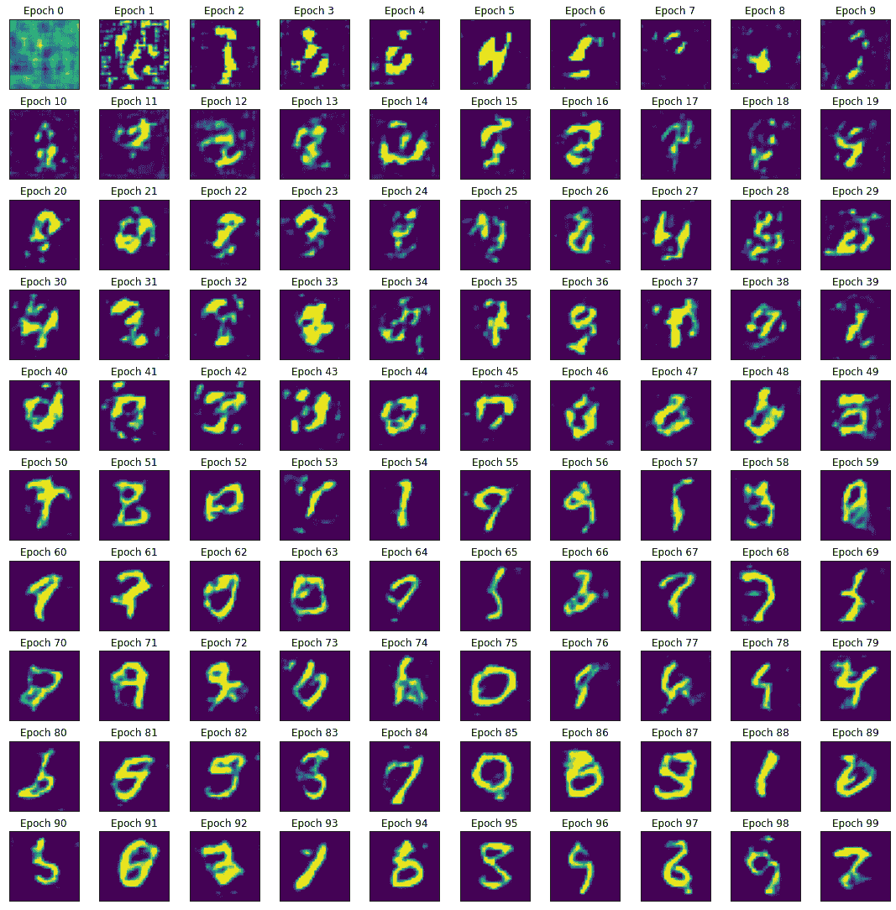

高级图像应用

计算机视觉中的人工智能应用包括机器人技术、自动驾驶汽车、人脸识别、生物医学图像中的疾病识别以及制造业的质量控制等。

在本章中，我们将从图像识别（或图像分类）开始，我们将探讨基本模型和更高级的模型。然后，我们将使用**生成对抗网络**（**GANs**）创建图像。

在本章中，我们将涵盖以下内容：

+   识别服装项目

+   生成图像

+   编码图像和样式

# 技术要求

我们将使用许多标准库，如 NumPy、Keras 和 PyTorch，但我们也会看到一些在每个配方开始时会提到的更多库，因为它们变得相关。

你可以在 GitHub 上找到本章配方的笔记本：[`github.com/PacktPublishing/Artificial-Intelligence-with-Python-Cookbook/tree/master/chapter07`](https://github.com/PacktPublishing/Artificial-Intelligence-with-Python-Cookbook/tree/master/chapter07)。

# 识别服装项目

图像分类的一个流行例子是 MNIST 数据集，其中包含不同风格的数字从 0 到 9。在这里，我们将使用一种称为 Fashion-MNIST 的可替换数据集，其中包含不同的服装。

Fashion-MNIST 是 Zalando 的服装图片数据集，包括一个由 60,000 个示例组成的训练集和一个由 10,000 个示例组成的测试集：[`github.com/zalandoresearch/fashion-mnist`](https://github.com/zalandoresearch/fashion-mnist)。

这里是数据集中的一些示例：


在这个配方中，我们将使用不同的模型识别服装项目——我们将从通用图像特征（**高斯差分**或**DoG**）和支持向量机开始；然后我们将转向前馈**多层感知器**（**MLP**）；接着我们将使用**卷积神经网络**（**ConvNet**）；最后，我们将使用 MobileNet 进行迁移学习。

## 准备工作

在我们开始之前，我们必须安装一个库。在这个配方中，我们将使用`scikit-image`，这是一个用于图像变换的库，因此我们将快速设置它：

```py
pip install scikit-image
```

现在我们已经准备好进入配方了！

## 如何实现...

我们将首先加载和准备数据集，然后我们将使用不同的方法学习 Fashion-MNIST 数据集中服装项目的分类模型。让我们从加载 Fashion-MNIST 时尚数据集开始。

我们可以通过`keras`工具函数直接获取数据集：

```py
from tensorflow import keras
from matplotlib import pyplot as plt

(train_images, train_labels), (test_images, test_labels) = keras.datasets.fashion_mnist.load_data()
train_images = train_images / 255.0
test_images = test_images / 255.0
plt.imshow(train_images[0])
plt.colorbar()
plt.grid(False)
```

我们还将图像标准化为 0 到 1 的范围，通过除以最大像素强度（`255.0`），并且我们可视化第一张图像。

我们应该看到一张运动鞋的图片，这是训练集中的第一张图片：


正如我们在本配方介绍中提到的，我们将在接下来的几节中应用不同的方法：

+   DoG 特征

+   MLP

+   LeNet

+   使用 MobileNet 进行迁移学习

让我们从 DoG 开始。

### 高斯差分

在深度学习在图像识别中取得突破之前，图像是使用来自拉普拉斯差分或高斯的滤波器进行特征化的。这些功能在 `scikit-image` 中实现，因此我们可以采用现成的实现。

让我们编写一个函数，使用高斯金字塔提取图像特征：

```py
import skimage.transform
import numpy as np

def get_pyramid_features(img):
    return np.hstack([
        layer.reshape(-1)
        for layer in skimage.transform.pyramids.pyramid_gaussian(img)
    ])
```

`get_pyramid_features()` 函数应用高斯金字塔并将这些特征展平为一个向量返回。我们将在 *它是如何工作...* 部分解释什么是高斯金字塔。

我们几乎准备好开始学习了。我们只需迭代所有图像并提取我们的高斯金字塔特征。让我们创建另一个执行此操作的函数：

```py
from sklearn.svm import LinearSVC

def featurize(x_train, y_train):
    data = []
    labels = []
    for img, label in zip(x_train, y_train):
        data.append(get_pyramid_features(img))
        labels.append(label)

    data = np.array(data)
    labels = np.array(labels)
    return data, labels
```

为了训练模型，我们在我们的训练数据集上应用 `featurize()` 函数。我们将使用线性支持向量机作为我们的模型。然后，我们将此模型应用于从我们的测试数据集中提取的特征 - 请注意，这可能需要一些时间才能运行：

```py
x_train, y_train = featurize(train_images, train_labels)
clf = LinearSVC(C=1, loss='hinge').fit(x_train, y_train)

x_val, y_val = featurize(test_images, test_labels)
print('accuracy: {:.3f}'.format(clf.score(x_val, y_val)))
```

使用这些特征的线性支持向量机在验证数据集上获得了 84% 的准确率。通过调整滤波器，我们可以达到更高的性能，但这超出了本文的范围。在 2012 年 AlexNet 发布之前，这种方法是图像分类的最先进方法之一。

训练模型的另一种方法是将图像展平，并直接将归一化的像素值输入到分类器中，例如 MLP。这是我们现在要尝试的。

### 多层感知器

用 MLP 对图像进行分类的一个相对简单的方法是。在这种情况下，使用了一个具有 10 个神经元的两层 MLP，你可以将隐藏层看作是 10 个特征检测器的特征提取层。

在本书中我们已经多次看到 MLP 的示例，因此我们将跳过此处的细节；可能感兴趣的是，我们将图像从 28x28 展平为 784 的向量。至于其余部分，可以说我们训练分类交叉熵，并监视准确性。

你将在以下代码块中看到这一点：

```py
import tensorflow as tf
from tensorflow.keras.losses import SparseCategoricalCrossentropy

def compile_model(model):
  model.summary()
  model.compile(
    optimizer='adam',
    loss=SparseCategoricalCrossentropy(
      from_logits=True
    ),
    metrics=['accuracy']
  ) 

def create_mlp():
  model = tf.keras.Sequential([
    tf.keras.layers.Flatten(input_shape=(28, 28)),
    tf.keras.layers.Dense(128, activation='relu'),
    tf.keras.layers.Dense(10)
  ])
  compile_model(model)
  return model
```

这个模型在两层及其连接之间有 101,770 个可训练参数。

我们将使用以下函数封装我们的训练集。这应该是相当容易理解的：

```py
def train_model(model, train_images, test_images):
    model.fit(
        train_images,
        train_labels,
        epochs=50,
        verbose=1,
        validation_data=(test_images, test_labels)
    )
    loss, accuracy = model.evaluate(test_images, test_labels, verbose=0)
    print('loss:', loss)
    print('accuracy:', accuracy)
```

经过 50 个周期，我们在验证集上的准确率为 0.886。

下一个模型是经典的 ConvNet，为 MNIST 提出，使用卷积、池化和全连接层。

### LeNet5

LeNet5 是一个前馈神经网络，具有卷积层和最大池化，以及用于导致输出的特征的全连接前馈层。让我们看看它的表现：

```py
from tensorflow.keras.layers import (
  Conv2D, MaxPooling2D, Flatten, Dense
)

def create_lenet():
    model = tf.keras.Sequential([
        Conv2D(
            filters=6,
            kernel_size=(5, 5),
            padding='valid',
            input_shape=(28, 28, 1),
            activation='tanh'
        ),
        MaxPooling2D(pool_size=(2, 2)),
        Conv2D(
            filters=16,
            kernel_size=(5, 5),
            padding='valid',
            activation='tanh'
        ),
        MaxPooling2D(pool_size=(2, 2)),
        Flatten(),
        Dense(120, activation='tanh'),
        Dense(84, activation='tanh'),
        Dense(10, activation='softmax')
    ])
    compile_model(model)
    return model
```

`create_lenet()` 函数构建我们的模型。我们只需调用它，并使用它运行我们的 `train_model()` 函数，以适应训练数据集并查看我们的测试表现：

```py
train_model(
    create_lenet(),
    train_images.reshape(train_images.shape + (1,)),
    test_images.reshape(test_images.shape + (1,)),
)
```

经过 50 集数，我们的验证准确率为 0.891。

我们还可以查看混淆矩阵，以查看我们如何区分特定的服装类别：


让我们继续进行我们最后一次尝试对服装项进行分类。

### MobileNet 迁移学习

MobileNetV2 模型是在 ImageNet 上训练的，这是一个包含 1400 万张图像的数据库，已手动注释为 WordNet 分类系统的类别。

MobileNet 可以下载用于迁移学习的权重。这意味着我们保持大部分或所有 MobileNet 的权重固定。在大多数情况下，我们只需添加一个新的输出投影来区分 MobileNet 表示之上的新类别集：

```py
base_model = tf.keras.applications.MobileNetV2(
    input_shape=(224, 224, 3),
    include_top=False,
    weights='imagenet'
)
```

MobileNet 包含 2,257,984 个参数。下载 MobileNet 时，我们有方便的选项可以省略输出层（`include_top=False`），这样可以节省工作量。

对于我们的迁移模型，我们必须附加一个池化层，然后像前两个神经网络一样附加一个输出层：

```py
def create_transfer_model():
    base_model = tf.keras.applications.MobileNetV2(
        input_shape=(224, 224, 3),
        include_top=False,
        weights='imagenet'
    )
    base_model.trainable = False
    model = tf.keras.Sequential([
      base_model,
      tf.keras.layers.GlobalAveragePooling2D(),
      tf.keras.layers.Dense(10)
    ])
    compile_model(model)
    return model
```

请注意，在 MobileNet 模型中，我们会冻结或固定权重，只学习我们添加在顶部的两个层。

当我们下载 MobileNet 时，您可能已经注意到一个细节：我们指定了 224x224x3 的尺寸。MobileNet 有不同的输入形状，224x224x3 是最小的之一。这意味着我们必须重新缩放我们的图像，并将它们转换为 RGB（通过串联灰度）。您可以在 GitHub 上的在线笔记本中找到详细信息。

MobileNet 迁移学习的验证准确率与 LeNet 和我们的 MLP 非常相似：0.893。

## 工作原理...

图像分类包括为图像分配标签，这是深度学习革命开始的地方。

从前述 URL 获取的以下图表说明了 ImageNet 图像分类基准随时间的性能提高：


图上的 TOP 1 准确率（也更简单地称为准确率）在*y*轴上是一个度量，用于衡量所有预测中正确预测的比例，或者换句话说，正确识别对象的频率的比率。随着时间的推移（*x*轴），图上的最先进线一直在持续改进，直到现在，使用 NoisyStudent 方法达到了 87.4%的准确率（详细信息请见此处：[`paperswithcode.com/paper/self-training-with-noisy-student-improves`](https://paperswithcode.com/paper/self-training-with-noisy-student-improves)）。

在下面的图表中，您可以看到图像识别中深度学习的时间线，可以看到复杂性（层数）的增加以及 ImageNet 大规模视觉识别挑战(ILSVRC)中错误率的降低：


您可以在[`www.image-net.org/challenges/LSVRC/`](http://www.image-net.org/challenges/LSVRC/)找到有关挑战的更多详细信息。

### 高斯差分

高斯金字塔是原始图像的一系列经过递归缩小的版本，其中缩小是使用高斯滤波器完成的。您可以在 Scholarpedia 上详细了解 [`www.scholarpedia.org/article/Scale_Invariant_Feature_Transform`](http://www.scholarpedia.org/article/Scale_Invariant_Feature_Transform)。

我们使用 `skimage` 的实用函数来提取特征，然后在顶部应用线性支持向量机作为分类器。为了提高性能，我们本可以尝试其他分类器，如随机森林或梯度提升。

### LeNet5

CNN 或 ConvNet 是至少包含一个卷积层的神经网络。LeNet 是 ConvNet 的经典示例，最初由 Yann LeCun 等人提出，1989 年的原始形式是 (*应用于手写邮政编码识别的反向传播*)，1998 年的修订形式（称为 LeNet5）是 (*应用于文档识别的基于梯度的学习*)。

您可以在以下图表中看到 LeNet 的架构（使用 NN-SVG 工具在 [`alexlenail.me/NN-SVG`](http://alexlenail.me/NN-SVG) 创建）：


卷积在图像识别中是非常重要的转换，也是非常深的神经网络中图像识别的重要组成部分。卷积包括前馈连接，称为过滤器或卷积核，应用于图像的矩形补丁（上一层）。然后，每个生成的映射是核在整个图像上滑动的结果。这些卷积映射通常后面跟随由池化层进行的子采样（在 LeNet 的情况下，是从每个核中提取的最大值）。

### MobileNet 迁移学习

MobileNets（Howard 等人，*MobileNets: 高效卷积神经网络用于移动视觉应用*；2017；[`arxiv.org/abs/1704.04861`](https://arxiv.org/abs/1704.04861)）是由 Google 开发的一类模型，专为移动和嵌入式应用而设计，明确权衡延迟与准确性。MobileNet 主要由不同形状的堆叠卷积层组成。所有卷积层后跟批归一化和 ReLU 激活。最后一个卷积层后是一个平均池化层，去除空间维度，以及一个带有 softmax 函数的最终密集输出层。

在 Keras 中，加载模型只需一条命令。`tf.keras.applications` 包提供了许多模型的架构和权重，例如 DenseNet、EfficientNet、Inception-ResNet V2、Inception V3、MobileNetV1、MobileNetV2、NASNet-A、ResNet、ResNet v2、VGG16、VGG19 和 Xception V1。在我们的案例中，我们有一个预训练模型，这意味着它具有使用 `tf.keras.applications.MobileNetV2()` 函数的架构和权重。

我们可以重新训练（微调）模型以提高应用性能，或者我们可以使用原始模型，并在其上添加额外的层以对新类进行分类。

我们加载模型的操作是这样的：

```py
    base_model = tf.keras.applications.MobileNetV2(
        input_shape=(224, 224, 3),
        include_top=False,
        weights='imagenet'
    )
```

正如之前提到的，我们可以从多个选择中指定不同的输入形状。`include_top`指定是否包含分类层。如果我们想要使用在 ImageNet 数据集上训练过的原始模型输出，我们会将其设置为`True`。由于我们的数据集中有不同的类别，我们想将其设置为`False`。

如果我们想要微调模型（带或不带顶部），我们将保持基础模型（MobileNetV2）可训练。显然，这种训练方式可能需要更长的时间，因为需要训练更多的层。这就是为什么在训练过程中我们冻结了所有 MobileNetV2 的层，并将其`trainable`属性设置为`False`。

## 另请参阅

你可以在*Khan 等人（2020）在 arXiv 上发表的《深度卷积神经网络最近架构的综述》中找到对 ConvNet 的回顾，从 LeNet 到 AlexNet 再到更近期的架构，可在此链接获取：[`arxiv.org/pdf/1901.06032.pdf`](https://arxiv.org/pdf/1901.06032.pdf)。

一个更近期的架构是 EfficientNet（Mingxing Tan 和 Quoc V. Le，2019），在 ImageNet 上实现了最先进的性能，同时比最佳 ConvNet 小约一个数量级，并且比最佳 ConvNet 快大约五倍：[`arxiv.org/abs/1905.11946`](https://arxiv.org/abs/1905.11946)。

# 生成图像

2014 年由 Ian Goodfellow 等人引入的 GAN 对抗学习，是一种通过两个网络相互对抗的框架来拟合数据集的分布，其中一个模型生成示例，另一个模型区分这些示例是真实的还是虚假的。这可以帮助我们使用新的训练示例扩展我们的数据集。使用 GAN 的半监督训练可以在使用少量标记训练示例的同时，实现更高的监督任务性能。

本篇重点是在 MNIST 数据集上实现**深度卷积生成对抗网络**（**DCGAN**）和鉴别器，这是最知名的数据集之一，包含 60,000 个 0 到 9 之间的数字。我们将在*工作原理...*部分解释术语和背景。

## 准备工作

对于这个步骤，我们不需要任何特殊的库。我们将使用 TensorFlow 与 Keras，NumPy 和 Matplotlib，这些都是我们之前见过的。为了保存图像，我们将使用 Pillow 库，你可以按以下方式安装或升级：

```py
pip install --upgrade Pillow
```

让我们马上开始吧。

## 如何操作...

对于我们的 GAN 方法，我们需要一个生成器——一个接受某些输入（可能是噪声）的网络——以及一个鉴别器，一个图像分类器，例如本章中*识别服装项目*食谱中看到的那样。

生成器和鉴别器都是深度神经网络，并将一起进行训练。训练后，我们将看到训练损失、各个时期的示例图像以及最后时期的复合图像。

首先，我们将设计鉴别器。

这是一个经典的 ConvNet 示例。它是一系列卷积和池化操作（通常是平均或最大池化），接着是平坦化和输出层。更多详情，请参见本章的*识别服装项目*示例：

```py
def discriminator_model():
    model = Sequential([
        Conv2D(
            64, (5, 5),
            padding='same',
            input_shape=(28, 28, 1),
            activation='tanh'
        ),
        MaxPooling2D(pool_size=(2, 2)),
        Conv2D(128, (5, 5), activation='tanh'),
        MaxPooling2D(pool_size=(2, 2)),
        Flatten(),
        Dense(1024, activation='tanh'),
        Dense(1, activation='sigmoid')
    ])
  return model
```

这与我们在本章的*识别服装项目*示例中介绍的 LeNet 卷积块非常相似。

接下来，我们设计生成器。

虽然鉴别器通过卷积和池化操作对其输入进行下采样，生成器则进行上采样。我们的生成器接受一个 100 维的输入向量，并通过执行与 ConvNet 相反方向的操作生成图像。因此，这种类型的网络有时被称为 DeconvNet。

生成器的输出通过 Tanh 激活函数重新标准化到-1 到 1 的范围内。DCGAN 论文（Alec Radford 等人，2015 年，《无监督学习中的深度卷积生成对抗网络》）的一个主要贡献之一是在反卷积操作后引入批标准化。在 Keras 中，有两种实现反卷积的方法：一种是使用`UpSampling2D`（参见[`www.tensorflow.org/api_docs/python/tf/keras/layers/UpSampling2D`](https://www.tensorflow.org/api_docs/python/tf/keras/layers/UpSampling2D)），另一种是使用`Conv2DTranspose`。这里，我们选择了`UpSampling2D`：

```py
from tensorflow.keras.models import Sequential
from tensorflow.keras.layers import (
    Dense, Reshape, Activation,
    Flatten, BatchNormalization,
    UpSampling2D, Conv2D, MaxPooling2D
)

def create_generator_model():
    model = Sequential([
        Dense(input_dim=100, units=1024, activation='tanh'), Dense(128*7*7),
        BatchNormalization(),
        Activation('tanh'),
        Reshape((7, 7, 128), input_shape=(128*7*7,)),
        UpSampling2D(size=(2, 2)),
        Conv2D(64, (5, 5), padding='same'),
        Activation('tanh'),
        UpSampling2D(size=(2, 2)),
        Conv2D(1, (5, 5), padding='same'),
        Activation('tanh'),
    ])
    model.summary()
    return model
```

调用此函数，我们将使用`summary()`获取我们网络架构的输出。我们将看到有 6,751,233 个可训练参数。我们建议在强大的系统上运行此示例，例如 Google Colab。

为了训练网络，我们加载并标准化了 MNIST 数据集：

```py
from tensorflow.keras.datasets import mnist

(X_train, y_train), (X_test, y_test) = mnist.load_data()
X_train = (X_train.astype(np.float32) - 127.5) / 127.5
X_train = X_train[:, :, :, None]
X_test = X_test[:, :, :, None]
```

图像以灰度形式呈现，像素值范围在 0–255 之间。我们将其标准化到-1 到+1 的范围内，然后重新调整为在末尾具有单例维度。

为了将误差传递给生成器，我们将生成器与鉴别器链在一起，如下所示：

```py
def chain_generator_discriminator(g, d):
    model = Sequential()
    model.add(g)
    model.add(d)
    return model
```

作为我们的优化器，我们将使用 Keras 的随机梯度下降：

```py
from tensorflow.keras.optimizers import SGD

def optim():
    return SGD(
        lr=0.0005,
        momentum=0.9,
        nesterov=True
    )
```

现在，让我们创建并初始化我们的模型：

```py
d = discriminator_model()
g = generator_model()
d_on_g = chain_generator_discriminator(g, d)
d_on_g.compile(loss='binary_crossentropy', optimizer=optim())
d.compile(loss='binary_crossentropy', optimizer=optim())
```

单个训练步骤包括三个步骤：

+   生成器从噪声中生成图像。

+   鉴别器学习区分生成的图像和真实的图像。

+   生成器通过鉴别器的反馈学习创建更好的图像。

让我们依次进行这些步骤。首先是从噪声生成图像：

```py
import numpy as np

def generate_images(g, batch_size):
    noise = np.random.uniform(-1, 1, size=(batch_size, 100))
    image_batch = X_train[index*batch_size:(index+1)*batch_size]
    return g.predict(noise, verbose=0)
```

然后，鉴别器在给定假和真实图像时进行学习：

```py
def learn_discriminate(d, image_batch, generated_images, batch_size):
    X = np.concatenate(
        (image_batch, generated_images)
    )
    y = np.array(
        [1] * batch_size + [0] * batch_size
    )
    loss = d.train_on_batch(X, y)
    return loss
```

我们将真实的`1`和假的`0`图像串联起来，作为鉴别器的输入。

最后，生成器从鉴别器的反馈中学习：

```py
def learn_generate(d_on_g, d, batch_size):
    noise = np.random.uniform(-1, 1, (batch_size, 100))
    d.trainable = False
    targets = np.array([1] * batch_size)
    loss = d_on_g.train_on_batch(noise, targets)
    d.trainable = True
    return loss
```

请注意，在这个函数中，鉴别器目标的反转。与以前的假 0 不同，我们现在输入 1。同样重要的是，在生成器学习期间，鉴别器的参数是固定的（否则我们将再次忘记）。

我们可以在训练中加入额外的命令，以保存图像，以便可以通过视觉方式欣赏我们生成器的进展：

```py
from PIL import Image

def save_images(generated_images, epoch, index):
    image = combine_images(generated_images)
    image = image*127.5+127.5
    Image.fromarray(
        image.astype(np.uint8)
    ).save('{}_{}.png'.format(epoch, index))
```

我们的训练通过交替进行以下步骤来进行：

```py
from tqdm.notebook import trange

batch_size = 1024
generator_losses = []
discriminator_losses = []
for epoch in trange(100):
    for index in trange(nbatches):
        image_batch = X_train[index*batch_size:(index+1)*batch_size]
        generated_images = generate_images(g, batch_size)
        d_loss = learn_discriminate(
            d, image_batch, generated_images, batch_size
        )
        g_loss = learn_generate(d_on_g, d, batch_size)
        discriminator_losses.append(d_loss)
        generator_losses.append(g_loss)
        if (index % 20) == 0:
            save_images(generated_images, epoch, index)
```

我们让它运行。`tqdm` 进度条将显示剩余时间。在 Google Colab 上可能需要大约一个小时。

在 100 个 epochs 中，我们的训练错误看起来如下：


我们已经保存了图像，因此我们也可以查看生成器在 epochs 中的输出。以下是每个 100 个 epochs 中单个随机生成的数字的画廊：



我们可以看到图像通常变得越来越清晰。有趣的是，生成器的训练误差似乎在前几个 epochs 之后保持在相同的基线水平。这是一个显示最后一个 epoch 期间生成的 100 个图像的图像：


图像并不完美，但大部分可以识别为数字。

## 如何运作...

生成模型可以生成具有与训练集相同统计特性的新数据，这对半监督和无监督学习很有用。GAN 由 Ian Goodfellow 等人在 2014 年（*Generative Adversarial Nets*，NIPS；[`papers.nips.cc/paper/5423-generative-adversarial-nets`](https://papers.nips.cc/paper/5423-generative-adversarial-nets)）引入，而 DCGAN 由 Alec Radford 等人在 2015 年（*Unsupervised Representation Learning with Deep Convolutional Generative Adversarial Networks*；[`arxiv.org/abs/1511.06434`](https://arxiv.org/abs/1511.06434)）引入。自原始论文以来，已提出许多增量改进。

在 GAN 技术中，生成网络学习将一个种子（例如，随机输入）映射到目标数据分布，而鉴别网络评估并区分生成器产生的数据和真实数据分布。

生成网络生成数据，鉴别网络评估数据。这两个神经网络相互竞争，生成网络的训练增加了鉴别网络的错误率，而鉴别器的训练增加了生成器的错误率，从而进行武器竞赛，迫使彼此变得更好。

在训练中，我们将随机噪声输入生成器，然后让鉴别器学习如何对生成器输出与真实图像进行分类。然后，给定鉴别器的输出，或者说其反向的生成器进行训练。鉴别器判断图像为假的可能性越小，对生成器越有利，反之亦然。

## 另请参见

原始的 GAN 论文，*Generative Adversarial Networks*（Ian Goodfellow 等人，2014 年），可以在 arXiv 上找到：[`arxiv.org/abs/1406.2661`](https://arxiv.org/abs/1406.2661)。

DCGAN 论文，*Unsupervised Representation Learning with Deep Convolutional Generative Adversarial Networks*（Alec Radford 等人，2015 年），也可以在 arXiv 上找到：[`arxiv.org/abs/1511.06434`](https://arxiv.org/abs/1511.06434)。

你可以在 PyTorch 网站上找到有关 DCGAN 的教程：[`pytorch.org/tutorials/beginner/dcgan_faces_tutorial.html`](https://pytorch.org/tutorials/beginner/dcgan_faces_tutorial.html)。

还有许多值得探索的 GAN 架构。Erik Linder-Norén 在 PyTorch 和 Keras 中实现了数十种最先进的架构。你可以在他的 GitHub 仓库中找到它们：[`github.com/eriklindernoren/PyTorch-GAN`](https://github.com/eriklindernoren/PyTorch-GAN)和[`github.com/eriklindernoren/Keras-GAN`](https://github.com/eriklindernoren/Keras-GAN)。

# 图像和风格编码

自编码器在有效地表示输入方面非常有用。在 2016 年的一篇论文中，Makhazani 等人展示了对抗自编码器可以比变分自编码器创建更清晰的表示，并且——与我们在前一示例中看到的 DCGAN 类似——我们获得了学习创建新示例的额外好处，这对半监督或监督学习场景有帮助，并且允许使用更少的标记数据进行训练。以压缩方式表示还有助于基于内容的检索。

在这个示例中，我们将在 PyTorch 中实现对抗自编码器。我们将实现监督和无监督两种方法，并展示结果。在无监督方法中，类别之间有很好的聚类效果；在监督方法中，我们的编码器-解码器架构能够识别风格，从而使我们能够进行风格转移。在这个示例中，我们将使用计算机视觉的*hello world*数据集 MNIST。

## 准备工作

对于这个示例，我们将需要使用`torchvision`。这将帮助我们下载我们的数据集。我们将快速安装它：

```py
!pip install torchvision
```

对于 PyTorch，我们需要先进行一些准备工作，比如启用`CUDA`并设置`tensor`类型和`device`：

```py
use_cuda = True
use_cuda = use_cuda and torch.cuda.is_available()
print(use_cuda)
if use_cuda:
    dtype = torch.cuda.FloatTensor
    device = torch.device('cuda:0')
else:
    dtype = torch.FloatTensor
    device = torch.device('cpu')
```

与其他示例风格不同，我们还会先导入必要的库：

```py
import numpy as np
import torch
from torch import autograd
import torch.nn as nn
import torch.nn.functional as F
from torch.utils.data import DataLoader, dataset
from torchvision.datasets import MNIST
import torchvision.transforms as T
from tqdm.notebook import trange
```

现在，让我们开始吧。

## 怎么做…

在这个示例中，我们将实现一个对抗自编码器，并将其应用于 MNIST 手写数字数据集。这段代码基于 Maurits Diephuis 和 Shideh Rezaeifar 的实现：[`github.com/mdiephuis/adversarial-autoencoders`](https://github.com/mdiephuis/adversarial-autoencoders)。

首先我们将导入必要的库。然后，我们将加载我们的数据集，定义模型组件，包括编码器、解码器和判别器，然后进行训练，最后我们将可视化生成的表示。

首先是加载数据集。

我们需要设置一些全局变量，这些变量将定义训练和数据集。然后，我们加载我们的数据集：

```py
EPS = torch.finfo(torch.float32).eps
batch_size = 1024
n_classes = 10
batch_size = 1024
n_classes = 10

train_loader = torch.utils.data.DataLoader(
    MNIST(
        'Data/',
        train=True,
        download=True,
        transform=T.Compose([
                T.transforms.ToTensor(),
                T.Normalize((0.1307,), (0.3081,))
        ])
    ),
    batch_size=batch_size,
    shuffle=True
)

val_loader = torch.utils.data.DataLoader(
    MNIST(
        'Val/',
        train=False,
        download=True,
        transform=T.Compose([
                T.transforms.ToTensor(),
                T.Normalize((0.1307,), (0.3081,))
        ])
    ),
    batch_size=batch_size,
    shuffle=False
)
```

规范化中的转换对应于 MNIST 数据集的均值和标准差。

接下来是定义自编码器模型。

自编码器由编码器、解码器和判别器组成。如果您熟悉自编码器，这对您来说不是什么新东西。在下一节*工作原理……*中，我们将对其进行详细解释和分解。

首先，我们将定义我们的编码器和解码器：

```py
dims = 10
class Encoder(nn.Module):
    def __init__(self, dim_input, dim_z):
        super(Encoder, self).__init__()
        self.dim_input = dim_input # image size
        self.dim_z = dim_z
        self.network = []
        self.network.extend([
            nn.Linear(self.dim_input, self.dim_input // 2),
            nn.Dropout(p=0.2),
            nn.ReLU(),
            nn.Linear(self.dim_input // 2, self.dim_input // 2),
            nn.Dropout(p=0.2),
            nn.ReLU(),
            nn.Linear(self.dim_input // 2, self.dim_z),
        ])
        self.network = nn.Sequential(*self.network)
    def forward(self, x):
        z = self.network(x)
        return z
```

请注意`dim`参数，它表示表示层的大小。我们选择`10`作为我们编码层的大小。

然后，我们将定义我们的解码器：

```py
class Decoder(nn.Module):
    def __init__(self, dim_input , dim_z, supervised=False):
        super(Decoder, self).__init__()
        self.dim_input = dim_input
        self.dim_z = dim_z
        self.supervised = supervised
        self.network = []
        self.network.extend([
            nn.Linear(self.dim_z, self.dim_input // 2) if not self.supervised
            else nn.Linear(self.dim_z + n_classes, self.dim_input // 2),
            nn.Dropout(p=0.2),
            nn.ReLU(),
            nn.Linear(self.dim_input // 2, self.dim_input // 2),
            nn.Dropout(p=0.2),
            nn.ReLU(),
            nn.Linear(self.dim_input // 2, self.dim_input),
            nn.Sigmoid(),
        ])
        self.network = nn.Sequential(*self.network)
    def forward(self, z):
        x_recon = self.network(z)
        return x_recon
```

顺便说一下，我们还可以定义我们的判别器来与我们的编码器竞争：

```py
class Discriminator(nn.Module):
    def __init__(self, dims, dim_h):
        super(Discriminator,self).__init__()
        self.dim_z = dims
        self.dim_h = dim_h
        self.network = []
        self.network.extend([
            nn.Linear(self.dim_z, self.dim_h),
            nn.Dropout(p=0.2), 
            nn.ReLU(),
            nn.Dropout(p=0.2), 
            nn.Linear(self.dim_h, self.dim_h),
            nn.ReLU(),
            nn.Linear(self.dim_h, 1),
            nn.Sigmoid(),
        ])
        self.network = nn.Sequential(*self.network)

    def forward(self, z):
        disc = self.network(z)
        return disc
```

请注意，为了保持在 0 和 1 的范围内，我们压缩了我们的输出。这对我们的损失函数非常重要。

然后是训练模型。

对抗自编码器可以在有监督的方式下使用，其中标签被输入到解码器中，除了编码输出之外，我们还需要一个实用函数，将变量进行独热编码：

```py
def one_hot_encoding(labels, n_classes=10):
    cat = np.array(labels.data.tolist())
    cat = np.eye(n_classes)[cat].astype('float32')
    cat = torch.from_numpy(cat)
    return autograd.Variable(cat)
```

我们将展示如何在有标签和无标签情况下使用对抗自编码器：

```py
def train_validate(
        encoder,
        decoder,
        Disc,
        dataloader,
        optim_encoder,
        optim_decoder,
        optim_D,
        train):
    total_rec_loss = 0
    total_disc_loss = 0
    total_gen_loss = 0
    if train:
        encoder.train()
        decoder.train()
        Disc.train()
    else:
        encoder.eval()
        decoder.eval()
        Disc.eval()

    iteration = 0
    for (data, labels) in dataloader:
        # [ training loop here, see next code segment ]

    M = len(dataloader.dataset)
    return total_rec_loss / M, total_disc_loss / M, total_gen_loss / M
```

如您在评论中所见，我们已经拆分出训练循环。训练循环如下所示：

```py
    for (data, labels) in dataloader:
        # Reconstruction loss:
        for p in Disc.parameters():
            p.requires_grad = False

        real_data_v = autograd.Variable(data).to(device).view(-1, 784)
        encoding = encoder(real_data_v)

        if decoder.supervised:
            categories = one_hot_encoding(labels, n_classes=10).to(device)
            decoded = decoder(torch.cat((categories, encoding), 1))
        else:
            decoded = decoder(encoding)

        reconstruction_loss = F.binary_cross_entropy(decoded, real_data_v)
        total_rec_loss += reconstruction_loss.item()
        if train:
            optim_encoder.zero_grad()
            optim_decoder.zero_grad()
            reconstruction_loss.backward()
            optim_encoder.step()
            optim_decoder.step()

        encoder.eval()
        z_real_gauss = autograd.Variable(
            torch.randn(data.size()[0], dims) * 5.0
        ).to(device)
        z_fake_gauss = encoder(real_data_v)
        D_real_gauss = Disc(z_real_gauss)
        D_fake_gauss = Disc(z_fake_gauss)

        D_loss = -torch.mean(
            torch.log(D_real_gauss + EPS) +
            torch.log(1 - D_fake_gauss + EPS)
        )
        total_disc_loss += D_loss.item()

        if train:
            optim_D.zero_grad()
            D_loss.backward()
            optim_D.step()

        if train:
            encoder.train()
        else:
            encoder.eval()
        z_fake_gauss = encoder(real_data_v)
        D_fake_gauss = Disc(z_fake_gauss)

        G_loss = -torch.mean(torch.log(D_fake_gauss + EPS))
        total_gen_loss += G_loss.item()

        if train:
            optim_encoder_reg.zero_grad()
            G_loss.backward()
            optim_encoder_reg.step()

        if (iteration % 100) == 0:
            print(
                'reconstruction loss: %.4f, discriminator loss: %.4f , generator loss: %.4f' %
                (reconstruction_loss.item(), D_loss.item(), G_loss.item()))

        iteration += 1
```

对于这段代码，我们将在*工作原理……*部分讨论如何计算和反向传播三种不同的损失。还请注意监督参数，它定义了我们是要使用监督还是无监督训练。

现在，让我们初始化我们的模型和优化器：

```py
encoder = Encoder(784, dims).to(device)
decoder = Decoder(784, dims, supervised=True).to(device)
Disc = Discriminator(dims, 1500).to(device)

lr = 0.001
optim_encoder = torch.optim.Adam(encoder.parameters(), lr=lr)
optim_decoder = torch.optim.Adam(decoder.parameters(), lr=lr)
optim_D = torch.optim.Adam(Disc.parameters(), lr=lr)
optim_encoder_reg = torch.optim.Adam(encoder.parameters(), lr=lr * 0.1)
```

现在我们可以开始训练：

```py
train_loss = []
val_loss = []
for epoch in trange(n_epochs):
    l1, l2, l3 = train_validate(
        encoder, decoder, Disc,
        train_loader, optim_encoder, optim_decoder,
        optim_D, train=True
    )
    print('epoch: {} ---- training loss: {:.8f}'.format(epoch, l1))
    train_loss.append(l1)

    if (epoch % 5) == 0:
        l1, l2, l3 = train_validate(
            encoder, decoder, Disc,
            val_loader, optim_encoder,
            optim_decoder, optim_D, False
        )
        print('epoch: {} ---- validation loss: {:.8f}'.format(epoch, l1))
        val_loss.append(l1)
```

这没什么大不了的，除了之前定义的`train_validate()`函数的调用，一次是`train=True`选项，一次是`train=False`选项。从这两个调用中，我们分别收集用于训练和验证的错误。

训练和验证错误持续下降，正如我们在下面的图表中所见：


如果您运行此代码，比较生成器和判别器的损失——看到生成器和判别器的损失如何相互影响是很有趣的。

下一步是可视化表示：

在有监督条件下，编码器空间的投影与类别关系不大，正如您在下面的`tsne`图中所见：


这是编码器数字表示空间的二维可视化。颜色（或者如果您在黑白显示器上看的话，阴影）代表不同的数字，它们都被集中在一起，而不是分成群集。编码器根本不区分不同的数字。

编码的东西完全是别的，那就是风格。事实上，我们可以分别在两个维度上变化输入到解码器中，以展示这一点：


前五行对应第一个维度的线性范围，第二个维度保持恒定，然后在接下来的五行中，第一个维度固定，第二个维度变化。我们可以看到第一个维度对应厚度，第二个维度对应倾斜度。这被称为风格转移。

我们还可以尝试无监督训练，通过设置`supervised=False`。我们应该看到这样的投影，其中类别在`tsne`投影的 2D 空间中聚类：


这是数字编码器表示空间的二维可视化。每种颜色（或阴影）代表不同的数字。我们可以看到不同的聚类将同一数字的实例组合在一起。编码器区分不同的数字。

在下一节中，我们将讨论其工作原理。

## 工作原理...

**自编码器**是一个由两部分组成的网络 - 编码器和解码器 - 其中编码器将输入映射到潜在空间，解码器重建输入。自编码器可以通过重建损失进行训练，该损失通常是原始输入与恢复输入之间的平方误差。

对抗自编码器于 2016 年由 Makhazani 等人引入（*对抗自编码器*; [`arxiv.org/pdf/1511.05644.pdf`](https://arxiv.org/pdf/1511.05644.pdf)）。该出版物展示了它们如何在聚类和半监督训练中使用，或者它们如何解相关类别表示。对抗自编码器是一种使用 GAN 执行变分推断的概率自编码器。与直接匹配输入和输出不同，自编码器的隐藏编码向量的聚合后验被匹配到任意先验分布。

由于对抗自编码器是 GAN，因此依赖于生成器和鉴别器之间的竞争，训练比普通自编码器更复杂一些。我们计算三种不同类型的错误：

+   标准重建误差

+   鉴别器的一个错误，量化了无法区分真实随机数和编码器输出的失败

+   对编码器错误的惩罚，因为它未能欺骗鉴别器

在我们的情况下，我们强制先验分布和解码器输出在 0 和 1 之间的范围内，并且因此可以使用交叉熵作为重建误差。

可能有助于突出显示负责计算不同类型误差的代码段。

重建误差如下所示：

```py
if decoder.supervised:
    categories = one_hot_encoding(labels, n_classes=10).to(device)
    decoded = decoder(torch.cat((categories, encoding), 1))
else:
    decoded = decoder(encoding)
    reconstruction_loss = F.binary_cross_entropy(decoded, real_data_v)
```

有一个额外的标志用于将标签作为监督训练输入到解码器中。我们发现在监督设置中，编码器并不表示数字，而是表示风格。我们认为这是因为在监督设置中，重建误差不再依赖于标签。

鉴别器损失计算如下：

```py
        # i) latent representation:
        encoder.eval()
        z_real_gauss = autograd.Variable(
            torch.randn(data.size()[0], dims) * 5.0
        ).to(device)
        z_fake_gauss = encoder(real_data_v)
        # ii) feed into discriminator
        D_real_gauss = Disc(z_real_gauss)
        D_fake_gauss = Disc(z_fake_gauss)

        D_loss = -torch.mean(
            torch.log(D_real_gauss + EPS) +
            torch.log(1 - D_fake_gauss + EPS)
        )
```

请注意，这是为了训练鉴别器，而不是编码器，因此有`encoder.eval()`语句。

生成器损失计算如下：

```py
        if train:
            encoder.train()
        else:
            encoder.eval()
        z_fake_gauss = encoder(real_data_v)
        D_fake_gauss = Disc(z_fake_gauss)

        G_loss = -torch.mean(torch.log(D_fake_gauss + EPS))
        total_gen_loss += G_loss.item()
```

在下一节中，我们将查看更多的材料和背景。

## 另请参见

对于更更新、更全面的对抗自编码器实现，请参考 Maurits Diephuis 维护的存储库：[`github.com/mdiephuis/generative-models`](https://github.com/mdiephuis/generative-models)。

关于自编码器和对抗自编码器的更多历史和数学背景，请参阅 Lilian Weng 在她的博客上的优秀概述文章*From Autoencoder to Beta-VAE*：[`lilianweng.github.io/lil-log/2018/08/12/from-autoencoder-to-beta-vae.html`](https://lilianweng.github.io/lil-log/2018/08/12/from-autoencoder-to-beta-vae.html)。

最后，请查看 Maurits Diephuis 等人的*Variational Saccading: Efficient Inference for Large Resolution Images*（Ramapuram 等人，2019）。他们引入了一个概率算法，用于专注于更大图像中感兴趣的区域，灵感来源于眼睛的扫视运动。你可以在 GitHub 上找到他们的代码：[`github.com/jramapuram/variational_saccading`](https://github.com/jramapuram/variational_saccading)。
