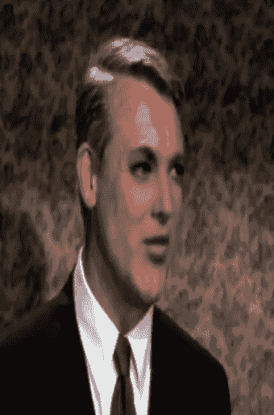

# 第八章：处理动态图像

本章涉及视频应用。虽然应用于图像的方法可以应用于视频的单帧，但通常会导致时间上的一致性损失。我们将尝试在消费者硬件上找到可能性和趣味性之间的平衡，并展示和实施。

谈论视频时应该考虑到很多应用程序，例如目标跟踪、事件检测（监视）、深度伪造、3D 场景重建和导航（自动驾驶汽车）。

很多伪造视频需要耗费数小时或数天的计算时间。我们将尝试在可能性和趣味性之间找到一个合理的平衡。这种平衡可能比其他章节更为明显，因为视频的计算不像单独的图像计算那样耗费资源。作为这种平衡的一部分，我们将逐帧处理视频，而不是跨时间域处理。尽管如此，我们仍将通过提供实际的真实应用示例或至少类似的示例来解决问题。

在本章中，我们将从图像检测开始，其中算法将图像识别模型应用于图像的不同部分以定位对象。然后我们将展示如何将其应用到视频流中。然后我们将使用深度伪造模型创建视频，并参考更多相关的模型，用于创建和检测深度伪造。

在本章中，我们将看到以下示例：

+   定位对象

+   视频伪造

# 技术要求

我们将使用许多标准库，包括`keras`和`opencv`，但在每个示例开始之前我们会提到更多的库。

您可以在 GitHub 上找到本章示例的笔记本，链接为[`github.com/PacktPublishing/Artificial-Intelligence-with-Python-Cookbook/tree/master/chapter08`](https://github.com/PacktPublishing/Artificial-Intelligence-with-Python-Cookbook/tree/master/chapter08)。

# 定位对象

对象检测是指在图像和视频中识别特定类别的对象。例如，在自动驾驶汽车中，必须识别行人和树木以避让。

在这个示例中，我们将在 Keras 中实现一个对象检测算法。我们将首先将其应用于单个图像，然后应用于我们的笔记本摄像头。在*工作原理...*部分，我们将讨论理论和更多关于对象检测的算法。

## 准备工作

对于这个示例，我们将需要**开放计算机视觉库**（**OpenCV**）和`scikit-image`的 Python 绑定：

```py
!pip install -U opencv-python scikit-image
```

作为我们的示例图像，我们将从一个对象检测工具箱中下载一张图像：

```py
def download_file(url: str, filename='demo.jpg'):
    import requests
    response = requests.get(url)
    with open(filename, 'wb') as f:
        f.write(response.content)

download_file('https://raw.githubusercontent.com/open-mmlab/mmdetection/master/demo/demo.jpg')
```

请注意，任何其他图像都可以。

我们将使用基于`keras-yolo3`库的代码，只需进行少量更改即可快速设置。我们也可以快速下载这个：

```py
download_file('https://gist.githubusercontent.com/benman1/51b2e4b10365333f0af34f4839f86f27/raw/991b41e5d5d83174d3d75b55915033550e16adf8/keras-yolo3.py', 'keras_yolo3.py')
```

最后，我们还需要`YOLOv3`网络的权重，可以从 darknet 开源实现中下载：

```py
download_file('https://pjreddie.com/media/files/yolov3.weights', 'yolov3.weights')
```

现在，你应该在本地目录中拥有示例图像、`yolo3-keras` Python 脚本以及 `YOLOv3` 网络权重，从中运行你的笔记本。

## 如何实现它……

在本节中，我们将使用 Keras 实现一个物体检测算法。

我们将导入 `keras-yolo3` 库，加载预训练的权重，然后对给定的图像或摄像头视频流进行物体检测：

1.  由于我们在 `keras-yolo3` 脚本中已实现了大部分物体检测功能，所以我们只需要导入它：

```py
from keras_yolo3 import load_model, detect
```

1.  我们可以按以下方式加载带有预训练权重的网络。请注意，权重文件相当大 - 它们将占用大约 237 MB 的磁盘空间：

```py
yolov3 = load_model('yolov3.weights')
```

我们的模型现在可作为 Keras 模型使用。

1.  然后，我们可以对我们的示例图像执行物体检测：

```py
from matplotlib import pyplot as plt

plt.imshow(detect(yolov3, 'demo.jpg'))
```

我们应该看到我们的示例图像标注了每个边界框的标签，如下截图所示：


我们可以使用 `OpenCV` 库扩展此功能以处理视频。我们可以逐帧捕获连接到计算机的摄像头的图像，运行物体检测，并显示带标注的图像。

请注意，此实现未经优化，可能运行比较慢。要获取更快的实现，请参考*参考资料*部分中链接的 darknet 实现。

当你运行以下代码时，请注意你可以按 `q` 键停止摄像头：

```py
import cv2
from skimage import color

cap = cv2.VideoCapture(0)

while(True):
    ret, frame = cap.read()

    img = cv2.cvtColor(frame, cv2.COLOR_BGR2RGB)    
    img = detect(yolov3, img)
    cv2.imshow('frame', img)
    if cv2.waitKey(1) & 0xFF == ord('q'):
        break

cap.release()
cv2.destroyAllWindows()
```

我们以灰度方式捕获图像，但随后必须使用 `scikit-image` 将其转换回 RGB，通过堆叠图像来检测对象并显示带标注的帧。

这是我们获得的图像：


在下一节中，我们将讨论这个配方及其背景解释。

## 它是如何工作的……

我们已经使用 Keras 实现了一个物体检测算法。这是一个标准库的开箱即用功能，但我们将其连接到摄像头，并应用到了一个示例图像上。

图像检测的主要算法如下：

+   快速 R-CNN (Ross Girshick, 2015)

+   **单发多框检测器** (**SSD**); Liu 等人，2015: [`arxiv.org/abs/1512.02325`](https://arxiv.org/abs/1512.02325))

+   **你只需看一次** (**YOLO**); Joseph Redmon 等人，2016: [`arxiv.org/abs/1506.02640`](https://arxiv.org/abs/1506.02640))

+   YOLOv4 (Alexey Bochkovskiy 等人，2020: [`arxiv.org/abs/2004.10934`](https://arxiv.org/abs/2004.10934))

物体检测的主要需求之一是速度 – 你不希望在识别前等待撞上树。

图像检测是基于图像识别的基础上，增加了在图像中搜索候选位置的复杂性。

Fast R-CNN 是 R-CNN 的改进（2014 年同一作者）。每个感兴趣区域，即由边界框定义的矩形图像块，通过图像金字塔进行尺度归一化。卷积网络然后可以通过一次前向传递处理这些对象提议（从几千到成千上万）。作为实现细节，Fast R-CNN 使用奇异值分解压缩完全连接层以提高速度。

YOLO 是一个单一网络，直接从图像中提出边界框和类别。在其实验中，作者以每秒 45 帧和 155 帧的速度运行了不同版本的 YOLO。

SSD 是一种单阶段模型，摒弃了独立对象提议生成的需要，而选择通过网络传递一组离散的边界框。然后在不同分辨率和边界框位置上组合预测结果。

顺便提一下，Joseph Redmon 发表并维护了他的 YOLO 架构的多个增量改进，但他已经离开了学术界。 YOLO 系列的最新实现由 Bochkovskiy 等人在相同的精神中进行，也在 Redmon 的 GitHub 仓库上得到了认可：[`github.com/AlexeyAB/darknet`](https://github.com/AlexeyAB/darknet)。

YOLOv4 在其 CNN 中引入了几种新的网络特性，展示了快速的处理速度，同时保持了显著优于 YOLOv3 的精度水平（43.5% **平均精度** (**AP**)，在 Tesla V100 GPU 上实时速度约为每秒 65 帧，针对 MS COCO 数据集）。

## 还有更多...

与网络摄像头交互的方式有多种，并且甚至有一些移动应用程序允许您流式传输摄像头内容，这意味着您可以将其插入在云上运行的应用程序中（例如 Colab 笔记本）或服务器上。

最常见的库之一是`matplotlib`，也可以从网络摄像头实时更新 matplotlib 图形，如下所示的代码块：

```py
%matplotlib notebook
import cv2
import matplotlib.pyplot as plt

def grab_frame(cap):
    ret, frame = cap.read()
    if not ret:
        print('No image captured!')
        exit()
    return cv2.cvtColor(frame, cv2.COLOR_BGR2RGB)

cap = cv2.VideoCapture(0)
fig, ax = plt.subplots(1, 1)
im = ax.imshow(grab_frame(cap))

plt.tick_params(
    top=False, bottom=False, left=False, right=False,
    labelleft=False, labelbottom=False
)
plt.show()

while True:
    try:
        im.set_data(grab_frame(cap))
        fig.canvas.draw()
    except KeyboardInterrupt:
        cap.release()
        break
```

这是初始化视频源并在 matplotlib 子图中显示的基本模板。我们可以通过中断内核来停止。

我们将在下一节中提到更多的库以供玩耍。

## 另请参见

我们建议您查看 YOLOv4 论文，可在 arxiv 上找到：[`arxiv.org/abs/2004.10934`](https://arxiv.org/abs/2004.10934)。

有关对象检测，有几个库可用：

+   YOLOv4 论文的第一作者在维护一个支持对象检测的开源框架，darknet（最初由 Joseph Redmon 开发）：[`github.com/AlexeyAB/darknet`](https://github.com/AlexeyAB/darknet)。

+   Detectron2 是 Facebook AI Research 提供的一个库，实现了多种物体检测算法：[`github.com/facebookresearch/detectron2`](https://github.com/facebookresearch/detectron2).

+   谷歌在 TensorFlow 中实现了多种物体检测模型，包括最近发布的 SpineNet ([`ai.googleblog.com/2020/06/spinenet-novel-architecture-for-object.html`](https://ai.googleblog.com/2020/06/spinenet-novel-architecture-for-object.html))，可以在 GitHub 上找到：[`github.com/tensorflow/models/tree/master/official/vision/detection`](https://github.com/tensorflow/models/tree/master/official/vision/detection).

+   Valkka Live 是一个开源的 Python 视频监控平台：[`elsampsa.github.io/valkka-live/_build/html/index.html`](https://elsampsa.github.io/valkka-live/_build/html/index.html).

+   MMDetection 是一个开放的检测工具箱，涵盖了许多流行的检测方法，并提供大约 200 个网络模型的预训练权重：[`mmdetection.readthedocs.io/en/latest/`](https://mmdetection.readthedocs.io/en/latest/).

+   SpineNet 是一种新的模型，通过大规模超参数探索，用于 TensorFlow 中的物体检测：[`github.com/tensorflow/models/tree/master/official/vision/detection`](https://github.com/tensorflow/models/tree/master/official/vision/detection).

+   PyTracking 是一个基于 PyTorch 的对象追踪和视频对象分割库，具有许多强大的、最先进的模型，可以直接插入网络摄像头输入之上：[`github.com/visionml/pytracking`](https://github.com/visionml/pytracking).

+   PySlowFast 提供了许多用于视频分类和检测任务的预训练模型：[`github.com/facebookresearch/SlowFast`](https://github.com/facebookresearch/SlowFast).

+   在此处提供了一个用于实时手势识别的 PyTorch 模型实现：[`github.com/ahmetgunduz/Real-time-GesRec`](https://github.com/ahmetgunduz/Real-time-GesRec).

让我们继续下一个步骤吧！

# 伪造视频

深度伪造是通过深度学习应用制作的操纵视频。潜在的不道德用途在媒体上已经存在一段时间。您可以想象这可能如何落入试图破坏政府的宣传机制之手中。请注意，我们建议不要出于不正当目的制作深度伪造视频。

深度伪造技术存在一些道德应用，其中一些非常有趣。您是否想过史泰龙可能会在《终结者》中看起来如何？今天您可以实现！

在本教程中，我们将学习如何使用 Python 创建深度伪造。我们将下载两部电影的公共领域视频，并通过替换其中一个人物的脸部来制作深度伪造。《Charade》是一部 1963 年由斯坦利·多南导演的电影，风格类似于希区柯克的影片。影片中 50 多岁的凯瑞·格兰特与 30 多岁的奥黛丽·赫本搭档。我们认为让这对配对年龄更合适。在一番搜索后，我们找到了 1963 年约翰·韦恩主演的《McLintock!》中的莫琳·奥哈拉，以取代奥黛丽·赫本。

## 准备工作

`Faceit`是围绕`faceswap`库的一个包装器，它简化了我们进行深度伪造所需的许多任务。我们已经在[`github.com/benman1/facei`](https://github.com/benman1/faceit)[t](https://github.com/benman1/faceit)上分支了`faceit`仓库。

我们需要做的是下载`faceit`仓库并安装必需的库。

你可以用`git`克隆（`clone`）这个仓库（如果在`ipython`笔记本中输入此命令，请加上感叹号）：

```py
git clone https://github.com/benman1/faceit
```

我们发现 Docker 容器非常适合安装依赖项（这需要安装 Docker）。我们可以像这样创建一个 Docker 容器：

```py
./dockerbuild.sh
```

这个过程可能需要一些时间来构建。请注意，Docker 镜像基于 Nvidia 的容器，因此您可以在容器内使用 GPU。

请注意，尽管有一个轻量级模型可供使用，我们强烈建议您在配备 GPU 的机器上运行深度伪造技术。

最后，我们可以这样进入我们的容器：

```py
./dockerrun.sh
```

在容器内部，我们可以运行 Python 3.6\. 以下所有命令都假定我们在容器内并且在 `/project` 目录下。

## 如何做...

我们需要将视频和面部定义为深度伪造过程的输入。

1.  我们可以像这样在 Python（Python 3.6）中定义我们的模型：

```py
from faceit import *

faceit = FaceIt('hepburn_to_ohara', 'hepburn', 'ohara')
```

这清楚地表明我们想要用`ohara`替换`hepburn`（这是我们在进程内部对它们命名的方式）。我们必须将图像放在`data/persons`目录下分别命名为`hepburn.jpg`和`ohara.jpg`。我们已经在仓库的便利性部分提供了这些图像。

如果我们没有提供图像，`faceit`将提取所有的面部图像，不论它们显示的是谁。然后我们可以将其中两张图像放在`persons`目录下，并删除`data/processed/`目录下面部的目录。

1.  接下来，我们需要定义我们要使用的视频。我们可以选择使用完整的电影或短片。我们没有找到《McLintock!》电影的好短片，因此我们正在使用整部电影。至于《Charade》，我们专注于单场景的片段。我们将这些片段保存在磁盘上，名称为`mclintock.mp4`和`who_trust.mp4`。

请注意，只能从允许下载或不禁止下载的网站下载视频，即使是公共领域的视频：

```py
faceit.add('ohara', 'mclintock.mp4')
faceit.add('hepburn', 'who_trust.mp4')
FaceIt.add_model(faceit)
```

这定义了我们的模型使用的数据为一对视频。Faceit 允许一个可选的第三参数，它可以是一个链接到视频的链接，从中可以自动下载。但是，在您从 YouTube 或其他网站下载视频之前，请确保这在其服务条款中允许，并且在您的司法管辖区内合法。

1.  然后，通过几行代码（和大量的调整和等待）启动深度伪造的创建：

```py
faceit.preprocess()
faceit.train()
faceit.convert('who_trust.mp4', face_filter=True, photos=False)
```

预处理步骤包括下载视频，提取所有帧作为图像，最后提取面部。我们已经提供了这些面部，因此您不必执行预处理步骤。

下面的图片显示奥黛丽·赫本在左边，莫琳·奥哈拉在右边扮演奥黛丽·赫本：


这些变化可能看起来很微妙。如果你想要更清晰的东西，我们可以使用同样的模型将凯瑞·格兰特替换为莫琳·奥哈拉：



实际上，我们可以通过在转换中禁用面部过滤器来制作一部名为*《成为莫琳·奥哈拉》*的电影。

我们本可以使用更先进的模型，更多的训练来改进深度伪造，或者我们可以选择一个更简单的场景。然而，有时候结果看起来并不差。我们已将我们的伪造视频上传到 YouTube，您可以在此观看：[`youtu.be/vDLxg5qXz4k`](https://youtu.be/vDLxg5qXz4k)。

## 它的工作原理...

典型的深度伪造流程包括我们在配方中方便地忽略的一些步骤，因为 Faceit 提供了的抽象。这些步骤是以下，给定人物 A 和人物 B，其中 A 将被 B 替换：

+   选择 A 和 B 的视频，并将视频分割成帧。

+   从这些帧中使用人脸识别为 A 和 B 提取面部。这些面部，或面部表情和面部姿势，理想情况下应该代表你将制作的视频。确保它们不模糊，不被遮挡，不显示除 A 和 B 之外的任何人，并且它们不要太重复。

+   你可以训练一个模型处理这些面孔，该模型可以用 B 替换面孔 A。你应该让训练运行一段时间。这可能需要几天，甚至几周或几个月，具体取决于面孔数量和模型复杂性。

+   现在我们可以通过运行面部识别和模型在其上进行转换视频。

在我们的情况下，面部识别库（`face-recognition`）在检测和识别方面表现非常出色。然而，它仍然存在高假阳性和假阴性。这可能导致体验不佳，特别是在有几个面部的帧中。

在当前版本的 `faceswap` 库中，我们将从目标视频中提取帧以获取所有脸部对齐的地标。然后，我们可以使用 GUI 手动检查和清理这些对齐，以确保它们包含正确的脸部。这些对齐将用于转换：[`forum.faceswap.dev/viewtopic.php?t=27#align`](https://forum.faceswap.dev/viewtopic.php?t=27#align).

每个步骤都需要非常注意。整个操作的核心是模型。可以有不同的模型，包括生成对抗自编码器和其他模型。faceswap 中的原始模型是带有变化的自编码器。我们之前在第七章中使用过自编码器，*高级图像应用*。这个相对传统，我们可以从那里的自编码器实现中获取我们的自编码器实现。但是为了完整起见，我们将展示其基于 `keras`/`tensorflow` 的实现（简化）：

```py
from keras.models import Model
from keras.layers import Input, Dense, Flatten, Reshape
from keras.layers.advanced_activations import LeakyReLU
from keras.layers.convolutional import Conv2D
from keras.optimizers import Adam
from lib.PixelShuffler import PixelShuffler

IMAGE_SHAPE = (64, 64, 3)
ENCODER_DIM = 1024

def conv(self, filters):
    def block(x):
    x = Conv2D(filters, kernel_size=5, strides=2, padding='same')(x)
    x = LeakyReLU(0.1)(x)
    return x
 return block

def upscale(self, filters):
    def block(x):
    x = Conv2D(filters * 4, kernel_size=3, padding='same')(x)
    x = LeakyReLU(0.1)(x)
    x = PixelShuffler()(x)
    return x
 return block

def Encoder():
    input_ = Input(shape=IMAGE_SHAPE)
    x = input_
    x = conv(128)(x)
    x = conv(256)(x)
    x = conv(512)(x)
    x = conv(1024)(x)
    x = Dense(ENCODER_DIM)(Flatten()(x))
    x = Dense(4 * 4 * 1024)(x)
    x = Reshape((4, 4, 1024))(x)
    x = upscale(512)(x)
    return Model(input_, x)

def Decoder():
    input_ = Input(shape=(8, 8, 512))
    x = input_
    x = upscale(256)(x)
    x = upscale(128)(x)
    x = upscale(64)(x)
    x = Conv2D(3, kernel_size=5, padding='same', activation='sigmoid')(x)
    return Model(input_, x)
```

这段代码本身并不是非常有趣。我们有两个函数，`Decoder()` 和 `Encoder()`，分别返回解码器和编码器模型。这是一个卷积编码器-解码器架构。在解码器的放大操作中，`PixelShuffle` 层通过排列将数据从深度重新排列为空间数据块。

现在，自编码器更有趣的部分在于训练是如何进行的，作为两个模型：

```py
optimizer = Adam(lr=5e-5, beta_1=0.5, beta_2=0.999)
x = Input(shape=IMAGE_SHAPE)

encoder = Encoder()
decoder_A, decoder_B = Decoder(), Decoder()
autoencoder_A = Model(x, decoder_A(encoder(x)))
autoencoder_B = Model(x, decoder_B(encoder(x)))

autoencoder_A.compile(optimizer=optimizer, loss='mean_absolute_error')
autoencoder_B.compile(optimizer=optimizer, loss='mean_absolute_error')
```

我们有两个自编码器，一个用于训练 `A` 脸部，另一个用于训练 `B` 脸部。两个自编码器都在最小化输出与输入之间的重建误差（以平均绝对误差度量）。如前所述，我们有一个单一编码器，它是两个模型的一部分，并且因此将在 `A` 脸部和 `B` 脸部上都进行训练。解码器模型在两个脸部之间是分开的。这种架构确保我们在 `A` 脸部和 `B` 脸部之间有一个共同的潜在表示。在转换中，我们可以从 `A` 中取出一个脸部，表示它，然后应用 `B` 的解码器以获得对应于潜在表示的 `B` 脸部。

## 另请参阅

我们整理了一些关于玩弄视频和深度伪造以及检测深度伪造的进一步参考资料。

### 深度伪造

我们整理了一些关于深度伪造以及与创建深度伪造过程相关的链接。

在这个示例中，面部识别库已经被用来选择图像区域进行训练和应用变换。该库在 GitHub 上可获得：[`github.com/ageitgey/face_recognition`](https://github.com/ageitgey/face_recognition)。

这里有一些简单视频伪造应用的不错示例：

+   OpenCV 可以使用掩码来选择性地操作图像的部分，例如隐形斗篷：[`www.geeksforgeeks.org/invisible-cloak-using-opencv-python-project/`](https://www.geeksforgeeks.org/invisible-cloak-using-opencv-python-project/)。

+   基于检测到的面部地标添加胡子的类似尝试：[`sublimerobots.com/2015/02/dancing-mustaches/`](http://sublimerobots.com/2015/02/dancing-mustaches/)。

对于更复杂的视频操作，如深度伪造，有很多可用的工具，我们将重点介绍两个：

+   faceswap 库有 GUI 和一些指南：[`github.com/deepfakes/faceswap`](https://github.com/deepfakes/faceswap)。

+   DeepFaceLab 是一个用于创建深度伪造的 GUI 应用程序：[`github.com/iperov/DeepFaceLab`](https://github.com/iperov/DeepFaceLab)。

提出并实现了许多不同的模型，包括以下内容：

+   **ReenactGAN** *– 通过边界转移学习重新演绎面部*（2018，[`arxiv.org/abs/1807.11079`](https://arxiv.org/abs/1807.11079)）

    +   官方实现：[`github.com/wywu/ReenactGAN`](https://github.com/wywu/ReenactGAN)。

+   **DiscoGAN** *–* Taeksoo Kim 等人，《通过生成对抗网络学习发现跨领域关系》（2017，[`arxiv.org/abs/1703.05192`](https://arxiv.org/abs/1703.05192)）

    +   在此演示了实时视频源：[`github.com/ptrblck/DiscoGAN`](https://github.com/ptrblck/DiscoGAN)。

+   带有注意机制的去噪对抗自编码器用于面部交换，详见：[`github.com/shaoanlu/faceswap-GAN`](https://github.com/shaoanlu/faceswap-GAN)。

faceit live 仓库（[`github.com/alew3/faceit_live`](https://github.com/alew3/faceit_live)）是 faceit 的一个分支，可以在实时视频源上运行，并配有一个反馈视频给恶作剧参与者的 hack。

### 深度伪造检测

以下链接与检测深度伪造相关：

+   Yuchen Luo 收集了许多关于检测深度伪造的链接：[`github.com/592McAvoy/fake-face-detection`](https://github.com/592McAvoy/fake-face-detection)。

+   特别感兴趣的是通过对抗攻击进行检测，详情请见：[`github.com/natanielruiz/disrupting-deepfakes`](https://github.com/natanielruiz/disrupting-deepfakes)。

+   Google、Google Jigsaw、慕尼黑工业大学和那不勒斯费德里科二世大学为深度伪造研究提供了大量数据集：[`github.com/ondyari/FaceForensics/`](https://github.com/ondyari/FaceForensics/)。

论文《DeepFakes and Beyond: A Survey of **Face Manipulation and Fake Detection*》（Ruben Tolosana 等人，2020）提供了更多的链接和数据集资源及方法。
