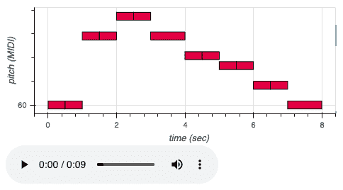

# 第九章：音频和语音中的深度学习

在本章中，我们将处理声音和语音。声音数据以波形的形式出现，因此需要与其他类型的数据进行不同的预处理。

在音频信号的机器学习中，商业应用包括语音增强（例如助听器）、语音到文本和文本到语音、噪声取消（例如耳机）、根据用户喜好推荐音乐（如 Spotify）以及生成音频。在音频中可以遇到许多有趣的问题，包括音乐流派的分类、音乐的转录、生成音乐等等。

我们将在本章中实现几个与声音和语音相关的应用。首先，我们将做一个简单的分类任务的例子，尝试区分不同的词汇。这将是智能家居设备中区分不同命令的典型应用。然后，我们将研究一个文本到语音的架构。您可以应用这个架构从文本创建自己的音频书籍，或者为您自己的智能家居设备的语音输出。最后，我们将结束于生成音乐的配方。从商业角度来看，这可能更多是一个利基应用，但您可以为了乐趣或娱乐您的视频游戏用户而构建自己的音乐。

在本章中，我们将看看以下的配方：

+   识别语音命令

+   从文本合成语音

+   生成旋律

# 技术要求

您可以在 GitHub 上找到与本章配方相关的笔记本的源代码：[`github.com/PacktPublishing/Artificial-Intelligence-with-Python-Cookbook/tree/master/chapter09`](https://github.com/PacktPublishing/Artificial-Intelligence-with-Python-Cookbook/tree/master/chapter09)。

我们将在本章中使用音频处理库 `librosa`（[`librosa.org/doc/latest/index.html`](https://librosa.org/doc/latest/index.html)）。您可以按如下方式安装它：

```py
!pip install librosa
```

Librosa 在 Colab 中默认安装。

对于本章中的配方，请确保您有一个可用的 GPU。在 Google Colab 上，请确保您激活了 GPU 运行时。

# 识别语音命令

在这个配方中，我们将在谷歌的语音命令数据集上解决一个简单的声音识别问题。我们将把声音命令分类到不同的类别中。然后，我们将建立一个深度学习模型并进行训练。

## 准备工作

对于本配方，我们需要在章节开头提到的 `librosa` 库。我们还需要下载语音命令数据集，为此我们首先需要安装 `wget` 库：

```py
!pip install wget
```

或者，我们可以在 Linux 和 macOS 中使用 `!wget` 系统命令。我们将创建一个新目录，下载带有数据集的存档文件，并提取 `tarfile`：

```py
import os
import wget
import tarfile

DATA_DIR = 'sound_commands'
DATASET_URL = 'http://download.tensorflow.org/data/speech_commands_v0.01.tar.gz'
ARCHIVE = os.path.basename(DATASET_URL)
os.mkdir(DATA_DIR)
os.chdir(DATA_DIR)
wget.download(DATASET_URL)
with tarfile.open(ARCHIVE, 'r:gz') as tar:
  tar.extractall(path='data/train')
os.remove(ARCHIVE)
```

这为我们在 `data/train` 目录下获得了许多文件和目录：

```py
_background_noise_  five     marvin        right             tree
bed                 four     nine       seven             two
bird                go       no         sheila            up
cat                 happy    off        six               validation_list.txt
dog                 house    on         stop              wow
down                left     one        testing_list.txt  yes
eight               LICENSE  README.md  three             zero
```

大多数指的是语音命令；例如，`bed` 目录包含了 `bed` 命令的示例。

有了这些，我们现在准备好开始了。

## 如何做...

在这个教程中，我们将训练一个神经网络来识别语音命令。这个教程的灵感来自于 TensorFlow 在语音命令上的教程，网址是 [`www.tensorflow.org/tutorials/audio/simple_audio`](https://www.tensorflow.org/tutorials/audio/simple_audio)。

首先进行数据探索，然后导入和预处理数据集进行训练，接着创建模型，训练并在验证中检查其性能：

1.  让我们从一些数据探索开始：我们将听一个命令，查看其波形，然后查看其频谱。`librosa` 库提供了将声音文件加载到向量中的功能：

```py
import librosa
x, sr = librosa.load('data/train/bed/58df33b5_nohash_0.wav')
```

我们还可以获得一个 Jupyter 小部件来听声音文件或加载的向量：

```py
import IPython.display as ipd
ipd.Audio(x, rate=sr)
```

小部件看起来像这样：


按下播放，我们听到声音。请注意，即使在远程连接上（例如使用 Google Colab），这也可以工作。

现在让我们看一下声音波形：

```py
%matplotlib inline
import matplotlib.pyplot as plt
import librosa.display

plt.figure(figsize=(14, 5))
librosa.display.waveplot(x, sr=sr, alpha=0.8)
```

波形看起来像这样：


这也称为压力-时间图，显示随时间变化的（有符号的）振幅。

我们可以如下绘制频谱：

```py
X = librosa.stft(x)
Xdb = librosa.amplitude_to_db(abs(X))
plt.figure(figsize=(14, 5))
librosa.display.specshow(Xdb, sr=sr, x_axis='time', y_axis='log')
plt.colorbar()
```

频谱看起来像这样：


请注意，我们在*y*轴上使用了对数尺度。

1.  现在，让我们进行数据导入和预处理。我们需要迭代文件，并将它们存储为向量：

```py
from tqdm.notebook import tqdm

def vectorize_directory(dirpath, label=0):
 features = []
  labels = [0]
  files = os.listdir(dirpath)
  for filename in tqdm(files):
    x, _ = librosa.load(
        os.path.join(dirpath, filename)
    )
    if len(x) == 22050:
      features.append(x)
  return features, [label] * len(features)

features, labels = vectorize_directory('data/train/bed/')
f, l = vectorize_directory('data/train/bird/', 1)
features.extend(f)
labels.extend(l)
f, l = vectorize_directory('data/train/tree/', 2)
features.extend(f)
labels.extend(l)
```

为简单起见，我们这里只使用了三个命令：`bed`、`bird` 和 `tree`。这已足以说明深度神经网络在声音分类中的问题和应用，也足够简单，不会花费太多时间。然而，这个过程仍然可能需要一些时间。在 Google Colab 上大约需要一个小时。

最后，我们需要将 Python 特征列表转换为 NumPy 数组，并且需要分割训练和验证数据：

```py
import numpy as np
from sklearn.model_selection import train_test_split

features = np.concatenate([f.reshape(1, -1) for f in features], axis=0)
labels = np.array(labels)
X_train, X_test, y_train, y_test = train_test_split(
 features, labels, test_size=0.33, random_state=42
)
```

现在我们需要对我们的训练数据做一些处理。我们需要一个可以训练的模型。

1.  让我们创建一个深度学习模型，然后进行训练和测试。首先我们需要创建我们的模型和标准化。让我们先进行标准化操作：

```py
import tensorflow.keras as keras
from tensorflow.keras.layers import *
from tensorflow.keras.regularizers import l2
from tensorflow.keras.models import Model
import tensorflow.keras.backend as K

def preprocess(x):
    x = (x + 0.8) / 7.0
    x = K.clip(x, -5, 5)
    return x

Preprocess = Lambda(preprocess)
```

接下来是以下内容：

```py
def relu6(x):
    return K.relu(x, max_value=6)

def conv_layer(x, num_filters=100, k=3, strides=2):
    x = Conv1D(
          num_filters,
          (k),
          padding='valid',
          use_bias=False,
          kernel_regularizer=l2(1e-6)
        )(x)
    x = BatchNormalization()(x)
    x = Activation(relu6)(x)
    x = MaxPool1D(pool_size=num_filters, strides=None, padding='valid')(x)
    return x

def create_model(classes, nlayers=1, filters=100, k=100):
    input_layer = Input(shape=[features.shape[1]])
    x = Preprocess(input_layer)
    x = Reshape([features.shape[1], 1])(x)
    for _ in range(nlayers):
        x = conv_layer(x, num_filters=filters, k=k)
        x = Reshape([219 * filters])(x)
        x = Dense(
            units=len(classes), activation='softmax',
            kernel_regularizer=l2(1e-2)
        )(x)
    model = Model(input_layer, x, name='conv1d_sound')
    model.compile(
        optimizer=keras.optimizers.Adam(lr=3e-4),
        loss=keras.losses.SparseCategoricalCrossentropy(),
        metrics=[keras.metrics.sparse_categorical_accuracy])
    model.summary()
    return model

model = create_model(classes
```

请注意 `conv_layer()` 函数，它提供了网络的核心部分。在视觉中可以使用非常类似的一维卷积模块，这里只是我们在这里使用了一维卷积。

这给了我们一个相对较小的模型，仅约有 75,000 个参数：

```py
Layer (type)                 Output Shape              Param #   
=================================================================
input_46 (InputLayer)        [(None, 22050)]           0         
_________________________________________________________________
lambda_44 (Lambda)           (None, 22050)             0         
_________________________________________________________________
reshape_86 (Reshape)         (None, 22050, 1)          0         
_________________________________________________________________
conv1d_56 (Conv1D)           (None, 21951, 100)        10000     
_________________________________________________________________
batch_normalization_43 (Batc (None, 21951, 100)        400       
_________________________________________________________________
activation_43 (Activation)   (None, 21951, 100)        0         
_________________________________________________________________
max_pooling1d_29 (MaxPooling (None, 219, 100)          0         
_________________________________________________________________
reshape_87 (Reshape)         (None, 21900)             0         
_________________________________________________________________
dense_33 (Dense)             (None, 3)                 65703     
=================================================================
Total params: 76,103
Trainable params: 75,903
Non-trainable params: 200
_________________________________________________________________
```

请注意，最大的层（按参数计算）是最后的密集层。我们可以通过修改密集层之前的卷积或最大池化操作进一步减少参数数量。

现在我们可以进行训练和验证：

```py
import sklearn

model.fit(X_train, y_train, epochs=30)
predicted = model.predict(X_test)
print('accuracy: {:.3f}'.format(
    sklearn.metrics.accuracy_score(y_test, predicted.argmax(axis=1))
))
```

在验证集中，模型的准确率输出应该大约为 0.805。

## 工作原理...

声音与其他领域并无太大不同，除了预处理。了解如何在文件中存储声音至关重要。在基本水平上，声音以振幅随时间和频率存储。声音以离散间隔采样（这是*采样率*）。48 kHz 是 DVD 的典型录音质量，指的是每秒 48,000 次的采样频率。*比特深度*（也称为*动态范围*）是信号振幅的分辨率（例如，16 比特意味着振幅范围为 0-65,535）。

对于机器学习，我们可以从波形中进行特征提取，并在原始波形上使用 1D 卷积，或在声谱图表示（例如，Mel 声谱图 – Davis 和 Mermelstein，*连续语音中基于音节的识别实验*，1980 年）上使用 2D 卷积。我们之前在第七章中处理过卷积，*高级图像应用*。简而言之，卷积是对层输入上的矩形补丁应用的前向滤波器。生成的映射通常在池化层之后进行子采样。

卷积层可以非常深度堆叠（例如，Dai 等人，2016：[`arxiv.org/abs/1610.00087`](https://arxiv.org/abs/1610.00087)）。我们已经为读者实验堆叠层提供了便利。层数`nlayers`是`create_model()`的参数之一。

有趣的是，许多语音识别模型使用递归神经网络。然而，一些模型，如 Facebook 的 wav2letter ([`github.com/facebookresearch/wav2letter`](https://github.com/facebookresearch/wav2letter))，例如，使用完全卷积模型，这与本方案中采用的方法并无太大不同。

## 参见

除了`librosa`，在 Python 中用于音频处理的有用库还包括`pydub` ([`github.com/jiaaro/pydub`](https://github.com/jiaaro/pydub)) 和 `scipy`。`pyAudioProcessing` 库提供了音频的特征提取和分类功能：[`github.com/jsingh811/pyAudioProcessing`](https://github.com/jsingh811/pyAudioProcessing)。

还有一些有趣的库和存储库值得探索：

+   wav2letter++ 是 Facebook AI Research 的语音处理开源工具包，并带有 Python 绑定：[`github.com/facebookresearch/wav2letter`](https://github.com/facebookresearch/wav2letter)。

+   一个硕士论文项目 – *结构化自编码器及其在音乐流派识别中的应用*：[`github.com/mdeff/dlaudio`](https://github.com/mdeff/dlaudio)。

+   Erdene-Ochir Tuguldur 在 GitHub 维护一个用 PyTorch 实现的蒙古语音识别库，包括从零开始的训练：[`github.com/tugstugi/mongolian-speech-recognition`](https://github.com/tugstugi/mongolian-speech-recognition)。

# 文本转语音合成

一个文本到语音程序，对人类来说很容易理解，可以让有视觉或阅读障碍的人听到家用电脑上的书写文字，或者在驾车时让您享受阅读一本书。在这个示例中，我们将加载一个文本到语音模型，并让它朗读给我们听。在 *它是如何工作的……* 部分，我们将介绍模型实现和模型架构。

## 准备工作完成

对于这个示例，请确保您有一个可用的 GPU。在 Google Colab 上，请确保您激活了 GPU 运行时。我们还需要安装 `wget` 库，可以在笔记本中如下安装：

```py
!pip install wget
```

我们还需要从 GitHub 克隆`pytorch-dc-tts`存储库并安装其要求。请从笔记本运行此命令（或在终端中运行，不带前导感叹号）：

```py
from os.path import exists

if not exists('pytorch-dc-tts'):
 !git clone --quiet https://github.com/tugstugi/pytorch-dc-tts

!pip install --ignore-installed librosa
```

请注意，您需要安装 Git 才能使其正常工作。如果您没有安装 Git，您可以直接从您的 Web 浏览器中下载存储库。

我们已经准备好处理主要示例了。

## 如何操作……

我们将下载 Torch 模型文件，加载它们到 Torch 中，然后从句子中合成语音：

1.  **下载模型文件**：我们将从`dropbox`下载数据集：

```py
import wget

if not exists('ljspeech-text2mel.pth'):
    wget.download(      'https://www.dropbox.com/s/4t13ugxzzgnocbj/step-300K.pth',
        'ljspeech-text2mel.pth'
    )

if not exists('ljspeech-ssrn.pth'):
    wget.download(
   'https://www.dropbox.com/s/gw4aqrgcvccmg0g/step-100K.pth',
        'ljspeech-ssrn.pth'
    )
```

现在我们可以在 torch 中加载模型。

1.  **加载模型**：让我们先处理依赖关系：

```py
import sys
sys.path.append('pytorch-dc-tts')
import numpy as np
import torch
import IPython
from IPython.display import Audio
from hparams import HParams as hp
from audio import save_to_wav
from models import Text2Mel, SSRN
from datasets.lj_speech import vocab, idx2char, get_test_data
```

现在我们可以加载模型：

```py
torch.set_grad_enabled(False)
text2mel = Text2Mel(vocab)
text2mel.load_state_dict(torch.load('ljspeech-text2mel.pth').state_dict())
text2mel = text2mel.eval()
ssrn = SSRN()
ssrn.load_state_dict(torch.load('ljspeech-ssrn.pth').state_dict())
ssrn = ssrn.eval()
```

最后，我们可以大声朗读这些句子。

1.  **语音合成**：我们选择了一些花园路径句子。这些句子在语法上是正确的，但会误导读者关于它们最初的理解。

以下句子是花园路径句子的例子——这些句子会误导听众关于单词如何相互关联的理解。我们选择它们是因为它们既简短又有趣。您可以在学术文献中找到这些及更多花园路径句子，比如在《Up the Garden Path》（Tomáš Gráf；2013 年发表于 Acta Universitatis Carolinae Philologica）中：

```py
SENTENCES = [
 'The horse raced past the barn fell.',
 'The old man the boat.',
 'The florist sent the flowers was pleased.',
 'The cotton clothing is made of grows in Mississippi.',
 'The sour drink from the ocean.',
 'Have the students who failed the exam take the supplementary.',
 'We painted the wall with cracks.',
 'The girl told the story cried.',
 'The raft floated down the river sank.',
 'Fat people eat accumulates.'
]
```

我们可以按照以下步骤从这些句子生成语音：

```py
for i in range(len(SENTENCES)):    
    sentences = [SENTENCES[i]]
    max_N = len(sentences[0])
    L = torch.from_numpy(get_test_data(sentences, max_N))
    zeros = torch.from_numpy(np.zeros((1, hp.n_mels, 1), np.float32))
    Y = zeros
    A = None

    for t in range(hp.max_T):
      _, Y_t, A = text2mel(L, Y, monotonic_attention=True)
      Y = torch.cat((zeros, Y_t), -1)
      _, attention = torch.max(A[0, :, -1], 0)
      attention = attention.item()
      if L[0, attention] == vocab.index('E'): # EOS
          break

    _, Z = ssrn(Y)
    Z = Z.cpu().detach().numpy()
    save_to_wav(Z[0, :, :].T, '%d.wav' % (i + 1))
    IPython.display.display(Audio('%d.wav' % (i + 1), rate=hp.sr))
```

在 *还有更多...* 部分，我们将看一下如何为不同数据集训练模型。

## 它是如何工作的……

语音合成是通过程序产生人类语音的过程，称为语音合成器。从自然语言到语音的合成称为**文本到语音**（**TTS**）。合成的语音可以通过连接来自录制片段的音频生成，这些片段以单位如独特的声音、音素和音素对（双音素）出现。

让我们稍微深入了解两种方法的细节。

### 基于引导注意力的深度卷积网络

在这个示例中，我们加载了 Hideyuki Tachibana 和其他人发表的模型，《基于深度卷积网络和引导注意力的高效可训练文本到语音系统》（2017 年；[`arxiv.org/abs/1710.08969`](https://arxiv.org/abs/1710.08969)）。我们使用了在 [`github.com/tugstugi/pytorch-dc-tts`](https://github.com/tugstugi/pytorch-dc-tts) 上的实现。

发表于 2017 年，这种方法的新颖之处在于在网络中不使用循环，而是依赖于卷积，这一决定导致训练和推断比其他模型快得多。事实上，他们声称在一台配备两个现成的 GPU 的游戏 PC 上训练他们的深度卷积 TTS 网络只需大约 15 小时。在**librivox**公共领域有声书项目的数据集上进行了 15 小时的训练后，众包的平均意见分数似乎没有增加。作者提供了一个演示页面，展示了训练不同阶段的音频样本，您可以听到说出的句子，例如*Wasserstein GAN 的两人零和博弈是通过考虑 Kantorovich-Rubinstein 对偶导出的*：[`tachi-hi.github.io/tts_samples/`](https://tachi-hi.github.io/tts_samples/)。

该架构由两个子网络组成，可以分别训练，一个用于从文本合成频谱图，另一个用于从频谱图创建波形。文本到频谱图部分包括以下模块：

+   文本编码器

+   音频编码器

+   注意力

+   音频解码器

这个方法的有趣之处在于标题中提到的引导注意力，它负责将字符与时间对齐。他们约束这个注意力矩阵几乎是线性随时间的，而不是随机顺序阅读字符，给定一个**引导注意力损失**：


这偏爱矩阵对角线上的值而不是矩阵外的值。他们认为这种约束有助于显著加快训练时间。

### WaveGAN

在*还有更多...*部分，我们将加载一个不同的模型，WaveGAN，由 Chris Donahue 等人发布，标题为*WaveGAN: 使用生成对抗网络学习合成原始音频*（2018 年；[`arxiv.org/abs/1802.04208`](https://arxiv.org/abs/1802.04208)）。

Donahue 等人在无监督环境中训练了一个 GAN 以合成原始音频波形。他们尝试了两种不同的策略：

+   一种名为**Spectrogram-Strategy**（**SpecGAN**）的方法，他们使用了 DCGAN（请参阅第七章中的*生成图像*章节，*高级图像应用*），并将其应用于频谱图（频率随时间变化）

+   一种名为**Waveform-Strategy**（**WaveGAN**）的方法，他们将架构展平（1D 卷积）

对于第一种策略，他们必须开发一个能够将频谱图转换回文本的方法。

对于 WaveGAN，他们将 2D 卷积展平为 1D，同时保持大小（例如，5x5 的核变为 25 的 1D 核）。步幅为 2x2 变为 4。他们移除了批标准化层。他们使用了 Wasserstein GAN-GP 策略进行训练（Ishaan Gulrajani 等人，2017 年；*Wasserstein GANs 的改进训练*；[`arxiv.org/abs/1704.00028`](https://arxiv.org/abs/1704.00028)）。

他们的 WaveGAN 在人类评判（平均意见分数）方面表现明显不如他们的 SpecGAN。您可以在 [`chrisdonahue.com/wavegan_examples/`](https://chrisdonahue.com/wavegan_examples/) 找到一些生成的声音示例。

## 还有更多......

我们还可以使用 WaveGAN 模型从文本合成语音。

我们将下载在前一教程中遇到的语音命令上训练的模型检查点。然后我们将运行模型生成语音：

1.  **下载 TensorFlow 模型检查点**：我们将按以下方式下载模型数据：

```py
import wget

wget.download(
  'https://s3.amazonaws.com/wavegan-v1/models/timit.ckpt.index',
  'model.ckpt.index'
)
wget.download(
  'https://s3.amazonaws.com/wavegan-v1/models/timit.ckpt.data-00000-of-00001',
  'model.ckpt.data-00000-of-00001')
wget.download(
  'https://s3.amazonaws.com/wavegan-v1/models/timit_infer.meta',
  'infer.meta'
);
```

现在我们可以将计算图加载到内存中：

```py
import tensorflow as tf

tf.reset_default_graph()
saver = tf.train.import_meta_graph('infer.meta')
graph = tf.get_default_graph()
sess = tf.InteractiveSession()
saver.restore(sess, 'model.ckpt');
```

现在我们可以生成语音。

1.  **生成语音**：模型架构涉及字母的潜在表示。我们可以根据潜在表示的随机初始化来听模型构建的内容：

```py
import numpy as np
import PIL.Image
from IPython.display import display, Audio
import time as time

_z = (np.random.rand(2, 100) * 2.) - 1.
z = graph.get_tensor_by_name('z:0')
G_z = graph.get_tensor_by_name('G_z:0')[:, :, 0]
G_z_spec = graph.get_tensor_by_name('G_z_spec:0')

start = time.time()
_G_z, _G_z_spec = sess.run([G_z, G_z_spec], {z: _z})
print('Finished! (Took {} seconds)'.format(time.time() - start))

for i in range(2):
    display(Audio(_G_z[i], rate=16000))
```

这应该展示了两个使用 Jupyter 小部件的生成声音示例：


如果这些听起来并不特别自然，不要担心。毕竟，我们使用了潜在空间的随机初始化。

## 另请参阅

*基于深度卷积网络和引导注意力的高效可训练文本到语音系统* ([`arxiv.org/abs/1710.08969`](https://arxiv.org/abs/1710.08969))。在 Erdene-Ochir Tuguldur 的 GitHub 仓库中，您可以找到该论文的 PyTorch 实现。蒙古文文本到语音是在《蒙古圣经》的 5 小时音频上训练的：[`github.com/tugstugi/pytorch-dc-tts`](https://github.com/tugstugi/pytorch-dc-tts)。

在 Chris Donahue 的 WaveGAN GitHub 仓库中，您可以看到 WaveGAN 的实现以及从 MP3、WAV、OGG 等格式的音频文件中进行训练的示例，而无需预处理 ([`github.com/chrisdonahue/wavegan`](https://github.com/chrisdonahue/wavegan))。

Mozilla 开源了他们的 TensorFlow 实现 Baidu 的 Deep Speech 架构（2014 年），您可以在这里找到：[`github.com/mozilla/DeepSpeech`](https://github.com/mozilla/DeepSpeech)。

# 生成旋律

**人工智能** (**AI**) 在音乐中是一个迷人的话题。如果您最喜欢的 70 年代乐队正在推出新歌，但可能更现代化会很酷吧？索尼与披头士合作做到了这一点，您可以在 YouTube 上听到一首歌，完整地包含了自动生成的歌词，名为 *Daddy's car*：[`www.youtube.com/watch?v=LSHZ_b05W7o`](https://www.youtube.com/watch?v=LSHZ_b05W7o)。

在这个教程中，我们将生成一个旋律。更具体地说，我们将使用 Magenta Python 库中的功能继续一首歌曲。

## 准备工作

我们需要安装 Magenta 库以及一些系统库作为依赖。请注意，为了安装系统依赖项，您需要管理员权限。如果您不是在 Linux（或 *nix）上，您将需要找到与您的系统对应的依赖项。

在 macOS 上，这应该相对简单。否则，在 Colab 环境中运行可能更容易：

```py
!apt-get update -qq && apt-get install -qq libfluidsynth1 fluid-soundfont-gm build-essential libasound2-dev libjack-dev
!pip install -qU pyfluidsynth pretty_midi
!pip install -qU magenta
```

如果您在 Colab 上，您需要另一种调整以允许 Python 找到您的系统库：

```py
import ctypes.util
orig_ctypes_util_find_library = ctypes.util.find_library
def proxy_find_library(lib):
  if lib == 'fluidsynth':
    return 'libfluidsynth.so.1'
  else:
    return orig_ctypes_util_find_library(lib)
ctypes.util.find_library = proxy_find_library
```

这是 Python 外部库导入系统的一个聪明的解决方法，取自原始的 Magenta 教程，位于[`colab.research.google.com/notebooks/magenta/hello_magenta/hello_magenta.ipynb`](https://colab.research.google.com/notebooks/magenta/hello_magenta/hello_magenta.ipynb)。

是时候发挥创造力了！

## 如何做...

我们首先组合一段旋律的开头，然后从 Magenta 加载`MelodyRNN`模型让它继续旋律：

1.  让我们一起编曲。我们将使用*小星星*。Magenta 项目使用一种名为`NoteSequence`的音符序列表示，附带许多实用工具，包括与 MIDI 之间的转换。我们可以像这样向序列添加音符：

```py
from note_seq.protobuf import music_pb2

twinkle_twinkle = music_pb2.NoteSequence()
twinkle_twinkle.notes.add(pitch=60, start_time=0.0, end_time=0.5, velocity=80)
twinkle_twinkle.notes.add(pitch=60, start_time=0.5, end_time=1.0, velocity=80)
twinkle_twinkle.notes.add(pitch=67, start_time=1.0, end_time=1.5, velocity=80)
twinkle_twinkle.notes.add(pitch=67, start_time=1.5, end_time=2.0, velocity=80)
twinkle_twinkle.notes.add(pitch=69, start_time=2.0, end_time=2.5, velocity=80)
twinkle_twinkle.notes.add(pitch=69, start_time=2.5, end_time=3.0, velocity=80)
twinkle_twinkle.notes.add(pitch=67, start_time=3.0, end_time=4.0, velocity=80)
twinkle_twinkle.notes.add(pitch=65, start_time=4.0, end_time=4.5, velocity=80)
twinkle_twinkle.notes.add(pitch=65, start_time=4.5, end_time=5.0, velocity=80)
twinkle_twinkle.notes.add(pitch=64, start_time=5.0, end_time=5.5, velocity=80)
twinkle_twinkle.notes.add(pitch=64, start_time=5.5, end_time=6.0, velocity=80)
twinkle_twinkle.notes.add(pitch=62, start_time=6.0, end_time=6.5, velocity=80)
twinkle_twinkle.notes.add(pitch=62, start_time=6.5, end_time=7.0, velocity=80)
twinkle_twinkle.notes.add(pitch=60, start_time=7.0, end_time=8.0, velocity=80) 
twinkle_twinkle.total_time = 8
twinkle_twinkle.tempos.add(qpm=60);
```

我们可以使用 Bokeh 可视化序列，然后播放音符序列：

```py
import note_seq

note_seq.plot_sequence(twinkle_twinkle)
note_seq.play_sequence(twinkle_twinkle,synth=note_seq.fluidsynth)
```

看起来如下：



我们可以听歌的前 9 秒。

1.  让我们从`magenta`加载`MelodyRNN`模型：

```py
from magenta.models.melody_rnn import melody_rnn_sequence_generator
from magenta.models.shared import sequence_generator_bundle
from note_seq.protobuf import generator_pb2
from note_seq.protobuf import music_pb2

note_seq.notebook_utils.download_bundle('attention_rnn.mag', '/content/')
bundle = sequence_generator_bundle.read_bundle_file('/content/basic_rnn.mag')
generator_map = melody_rnn_sequence_generator.get_generator_map()
melody_rnn = generator_map'basic_rnn'
melody_rnn.initialize()
```

这应该只需几秒钟。与本书中遇到的其他模型相比，Magenta 模型非常小。

现在，我们可以将之前的旋律和一些参数一起输入，以继续这首歌曲：

```py
def get_options(input_sequence, num_steps=128, temperature=1.0):
    last_end_time = (max(n.end_time for n in input_sequence.notes)
                      if input_sequence.notes else 0)
    qpm = input_sequence.tempos[0].qpm 
    seconds_per_step = 60.0 / qpm / melody_rnn.steps_per_quarter
    total_seconds = num_steps * seconds_per_step

    generator_options = generator_pb2.GeneratorOptions()
    generator_options.args['temperature'].float_value = temperature
    generate_section = generator_options.generate_sections.add(
      start_time=last_end_time + seconds_per_step,
      end_time=total_seconds)
    return generator_options

sequence = melody_rnn.generate(input_sequence, get_options(twinkle_twinkle))
```

现在我们可以绘制和播放新音乐：

```py
note_seq.plot_sequence(sequence)
note_seq.play_sequence(sequence, synth=note_seq.fluidsynth)
```

再次，我们得到了 Bokeh 库的绘图和播放小部件：


我们可以像这样从我们的音符序列创建一个 MIDI 文件：

```py
note_seq.sequence_proto_to_midi_file(sequence, 'twinkle_continued.mid')
```

这将在磁盘上创建一个新的 MIDI 文件。

在 Google Colab 上，我们可以这样下载 MIDI 文件：

```py
from google.colab import files
files.download('twinkle_continued.mid')
```

我们可以通过 MIDI 文件将不同的旋律输入模型，或者我们可以尝试其他参数；我们可以增加或减少随机性（`temperature`参数），或让序列继续较长时间（`num_steps`参数）。

## 工作原理...

MelodyRNN 是一种基于 LSTM 的音符语言模型。为了理解 MelodyRNN，我们首先需要了解**长短期记忆**（**LSTM**）的工作原理。1997 年由 Sepp Hochreiter 和 Jürgen Schmidhuber 发布（*长短期记忆*：[`doi.org/10.1162%2Fneco.1997.9.8.1735`](https://doi.org/10.1162%2Fneco.1997.9.8.1735)），LSTM 是**循环神经网络**（**RNN**）的最著名例子，代表了处理图像识别、语音识别、自然语言处理和时间序列等任务的最先进模型。LSTM 曾或正在背后支持 Google、Amazon、Microsoft 和 Facebook 的流行工具，用于语音识别和语言翻译。

LSTM 层的基本单元是 LSTM 单元，由几个调节器组成，我们可以在下面的示意图中看到：


本图表基于 Alex Graves 及其它人的*深度递归神经网络语音识别*（2013），摘自维基百科关于 LSTMs 的英语条目，网址为[`en.wikipedia.org/wiki/Long_short-term_memory`](https://en.wikipedia.org/wiki/Long_short-term_memory)。

监管机构包括以下内容：

+   一个输入门

+   一个输出门

+   一个遗忘门

我们可以解释这些门背后的直觉，而不陷入方程的细节。一个输入门调节输入对单元的影响力，一个输出门减少传出单元的激活，而遗忘门则衰减单元的活动。

LSTMs 能够处理不同长度的序列，这是它们的优点。然而，随着序列长度的增加，它们的性能会下降。为了学习更长的序列，Magenta 库提供了包含注意力机制的模型（Dzmitry Bahdanau 及其它人，2014 年，*通过联合学习对齐和翻译来进行神经机器翻译*；[`arxiv.org/abs/1409.0473`](https://arxiv.org/abs/1409.0473)）。Bahdanau 及其它人表明，他们的注意力机制显著改善了处理长序列的性能。

在 MelodyRNN 中，注意力掩码*a*的应用如下：


您可以在 Magenta 文档中找到更多细节：[`magenta.tensorflow.org/2016/07/15/lookback-rnn-attention-rnn/`](https://magenta.tensorflow.org/2016/07/15/lookback-rnn-attention-rnn/)。

## 另见

请注意，Magenta 有不同版本的 MelodyRNN 模型可用（[`github.com/magenta/magenta/tree/master/magenta/models/melody_rnn`](https://github.com/magenta/magenta/tree/master/magenta/models/melody_rnn)）。除了 MelodyRNN 外，Magenta 还提供了其他模型，包括用于生成音乐的变分自编码器，以及许多基于浏览器的工具用于探索和生成音乐：[`github.com/magenta/magenta`](https://github.com/magenta/magenta)。

DeepBeat 是一个用于嘻哈节拍生成的项目：[`github.com/nicholaschiang/deepbeat`](https://github.com/nicholaschiang/deepbeat)。

Jukebox 是基于 Dhariwal 及其它人的论文*Jukebox: A Generative Model for Music*（2020 年；[`arxiv.org/abs/2005.00341`](https://arxiv.org/abs/2005.00341)）的开源项目。您可以在[`openai.com/blog/jukebox/`](https://openai.com/blog/jukebox/)找到许多音频样本。

您可以在[`github.com/pkmital/time-domain-neural-audio-style-transfer`](https://github.com/pkmital/time-domain-neural-audio-style-transfer)找到 Parag K. Mital 的 NIPS 论文*时域神经音频风格转换*（2017 年）的原始实现。
