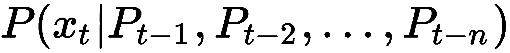

# 第十章：自然语言处理

**自然语言处理** (**NLP**) 是关于分析文本并设计处理文本的算法，从文本中进行预测或生成更多文本。NLP 涵盖了与语言相关的任何内容，通常包括类似于我们在第九章中看到的*识别语音命令*配方，*深度学习中的音频和语音*。您可能还想参考第二章中*对抗算法偏差*配方或第三章中*用于相似性搜索的表示*配方，以了解更传统的方法。本章大部分内容将涉及近年来突破性进展背后的深度学习模型。

语言通常被视为与人类智能密切相关，并且机器掌握沟通能力长期以来一直被认为与实现**人工通用智能** (**AGI**) 的目标密切相关。艾伦·图灵在他 1950 年的文章*计算机与智能*中建议了一个测试，后来称为**图灵测试**，在这个测试中，询问者必须找出他们的交流对象（在另一个房间里）是计算机还是人类。然而，有人认为，成功地欺骗询问者以为他们在与人类交流并不是真正理解（或智能）的证据，而是符号操纵的结果（**中文房间论证**；约翰·西尔，*思想、大脑和程序*，1980 年）。不管怎样，在最近几年里，随着像 GPU 这样的并行计算设备的可用性，NLP 在许多基准测试中取得了令人瞩目的进展，例如在文本分类方面：[`nlpprogress.com/english/text_classification.html`](http://nlpprogress.com/english/text_classification.html)。

我们首先将完成一个简单的监督任务，确定段落的情感，然后我们将设置一个响应命令的 Alexa 风格聊天机器人。接下来，我们将使用序列到序列模型翻译文本。最后，我们将尝试使用最先进的文本生成模型写一本流行小说。

在本章中，我们将进行以下配方：

+   对新闻组进行分类

+   与用户聊天

+   将文本从英语翻译成德语

+   写一本流行小说

# 技术要求

与迄今为止大多数章节一样，我们将尝试基于 PyTorch 和 TensorFlow 的模型。我们将在每个配方中应用不同的更专业的库。

如往常一样，您可以在 GitHub 上找到配方笔记本：[`github.com/PacktPublishing/Artificial-Intelligence-with-Python-Cookbook/tree/master/chapter10`](https://github.com/PacktPublishing/Artificial-Intelligence-with-Python-Cookbook/tree/master/chapter10)。

# 对新闻组进行分类

在这个配方中，我们将做一个相对简单的监督任务：基于文本，我们将训练一个模型来确定文章的主题，从一系列话题中选择。这是一个在 NLP 中相对常见的任务；我们将试图概述不同的解决方法。

您可能还想比较在《第二章》中 *算法偏差对抗* 的配方中，使用词袋法（在 scikit-learn 中的 `CountVectorizer`）来解决这个问题的方法。在这个配方中，我们将使用词嵌入和使用词嵌入的深度学习模型。

## 准备工作

在这个配方中，我们将使用 scikit-learn 和 TensorFlow（Keras），正如本书的许多其他配方一样。此外，我们将使用需要下载的词嵌入，并且我们将使用 Gensim 库的实用函数在我们的机器学习管道中应用它们：

```py
!pip install gensim
```

我们将使用来自 scikit-learn 的数据集，但我们仍然需要下载词嵌入。我们将使用 Facebook 的 fastText 词嵌入，该词嵌入是在 Wikipedia 上训练的：

```py
!pip install wget
import wget
wget.download(
    'https://dl.fbaipublicfiles.com/fasttext/vectors-wiki/wiki.en.vec',
    'wiki.en.vec'
)
```

请注意，下载可能需要一些时间，并且需要大约 6 GB 的磁盘空间。如果您在 Colab 上运行，请将嵌入文件放入 Google Drive 的目录中，这样当您重新启动笔记本时就不需要重新下载。

## 如何做...

新闻组数据集是大约 20,000 个新闻组文档的集合，分为 20 个不同的组。20 个新闻组集合是在 NLP 中测试机器学习技术（如文本分类和文本聚类）的流行数据集。

我们将把一组新闻组分类为三个不同的主题，并且我们将使用三种不同的技术来解决这个任务，以便进行比较。首先获取数据集，然后应用词袋法技术，使用词嵌入，在深度学习模型中训练定制的词嵌入。

首先，我们将使用 scikit-learn 的功能下载数据集。我们将新闻组数据集分两批下载，分别用于训练和测试。

```py
from sklearn.datasets import fetch_20newsgroups

categories = ['alt.atheism', 'soc.religion.christian', 'comp.graphics', 'sci.med']
twenty_train = fetch_20newsgroups(
    subset='train',
    categories=categories,
    shuffle=True,
    random_state=42
  )
twenty_test = fetch_20newsgroups(
    subset='test',
    categories=categories,
    shuffle=True,
    random_state=42
)
```

这方便地为我们提供了训练和测试数据集，我们可以在这三种方法中使用。

让我们开始覆盖第一个方法，使用词袋法。

### 词袋法

我们将构建一个单词计数和根据它们的频率重新加权的管道。最终的分类器是一个随机森林。我们在训练数据集上训练这个模型：

```py
import numpy as np
from sklearn.pipeline import Pipeline
from sklearn.feature_extraction.text import CountVectorizer
from sklearn.feature_extraction.text import TfidfTransformer
from sklearn.ensemble import RandomForestClassifier

text_clf = Pipeline([
  ('vect', CountVectorizer()),
  ('tfidf', TfidfTransformer()),
  ('clf', RandomForestClassifier()),
])
text_clf.fit(twenty_train.data, twenty_train.target)
```

`CountVectorizer` 计算文本中的标记，而 `tfidfTransformer` 重新加权这些计数。我们将在 *工作原理...* 部分讨论**词项频率-逆文档频率**（**TFIDF**）重新加权。

训练后，我们可以在测试数据集上测试准确率：

```py
predicted = text_clf.predict(twenty_test.data)
np.mean(predicted == twenty_test.target)
```

我们的准确率约为 0.805。让我们看看我们的另外两种方法表现如何。下一步是使用词嵌入。

### 词嵌入

我们将加载我们之前下载的词嵌入：

```py
from gensim.models import KeyedVectors

model = KeyedVectors.load_word2vec_format(
    'wiki.en.vec',
    binary=False, encoding='utf8'
)
```

将文本的最简单策略向量化是对单词嵌入进行平均。对于短文本，这通常至少效果还不错：

```py
import numpy as np
from tensorflow.keras.preprocessing.text import text_to_word_sequence

def embed_text(text: str):
  vector_list = [
    model.wv[w].reshape(-1, 1) for w in text_to_word_sequence(text)
    if w in model.wv
  ]
  if len(vector_list) > 0:
    return np.mean(
        np.concatenate(vector_list, axis=1),
        axis=1
    ).reshape(1, 300)
  else:
   return np.zeros(shape=(1, 300))

assert embed_text('training run').shape == (1, 300)
```

然后我们将这种向量化应用于我们的数据集，然后在这些向量的基础上训练一个随机森林分类器：

```py
train_transformed = np.concatenate(
    [embed_text(t) for t in twenty_train.data]
)
rf = RandomForestClassifier().fit(train_transformed, twenty_train.target)
```

然后我们可以测试我们方法的性能：

```py
test_transformed = np.concatenate(
    [embed_text(t) for t in twenty_test.data]
)
predicted = rf.predict(test_transformed)
np.mean(predicted == twenty_test.target)
```

我们的准确率约为 0.862。

让我们看看我们的最后一种方法是否比这个更好。我们将使用 Keras 的嵌入层构建定制的词嵌入。

### 自定义词嵌入

嵌入层是在神经网络中即时创建自定义词嵌入的一种方式：

```py
from tensorflow.keras import layers

embedding = layers.Embedding(
    input_dim=5000, 
    output_dim=50, 
    input_length=500
)
```

我们必须告诉嵌入层希望存储多少单词，词嵌入应该具有多少维度，以及每个文本中有多少单词。我们将整数数组输入嵌入层，每个数组引用字典中的单词。我们可以将创建嵌入层输入的任务委托给 TensorFlow 实用函数：

```py
from tensorflow.keras.preprocessing.text import Tokenizer

tokenizer = Tokenizer(num_words=5000)
tokenizer.fit_on_texts(twenty_train.data)
```

这创建了字典。现在我们需要对文本进行分词并将序列填充到适当的长度：

```py
from tensorflow.keras.preprocessing.sequence import pad_sequences

X_train = tokenizer.texts_to_sequences(twenty_train.data)
X_test = tokenizer.texts_to_sequences(twenty_test.data)
X_train = pad_sequences(X_train, padding='post', maxlen=500)
X_test = pad_sequences(X_test, padding='post', maxlen=500)
```

现在我们准备构建我们的神经网络：

```py
from tensorflow.keras.models import Sequential
from tensorflow.keras.losses import SparseCategoricalCrossentropy
from tensorflow.keras import regularizers

model = Sequential()
model.add(embedding)
model.add(layers.Flatten())
model.add(layers.Dense(
    10,
    activation='relu',
    kernel_regularizer=regularizers.l1_l2(l1=1e-5, l2=1e-4)
))
model.add(layers.Dense(len(categories), activation='softmax'))
model.compile(optimizer='adam',
              loss=SparseCategoricalCrossentropy(),
              metrics=['accuracy'])
model.summary()
```

我们的模型包含 50 万个参数。大约一半位于嵌入层，另一半位于前馈全连接层。

我们对网络进行了几个 epoch 的拟合，然后可以在测试数据上测试我们的准确性：

```py
model.fit(X_train, twenty_train.target, epochs=10)
predicted = model.predict(X_test).argmax(axis=1)
np.mean(predicted == twenty_test.target)
```

我们获得约为 0.902 的准确率。我们还没有调整模型架构。

这完成了我们使用词袋模型、预训练词嵌入和自定义词嵌入进行新闻组分类的工作。现在我们来探讨一些背景。

## 工作原理...

我们已经根据三种不同的特征化方法对文本进行了分类：词袋模型、预训练词嵌入和自定义词嵌入。让我们简要地深入研究词嵌入和 TFIDF。

在第五章的*基于知识做决策*配方中，我们已经讨论了*Skipgram*和**Continuous Bag of Words**（**CBOW**）算法，在*启发式搜索技术与逻辑推理*（在*使用 Walklets 进行图嵌入*子节中）。

简而言之，词向量是一个简单的机器学习模型，可以根据上下文（CBOW 算法）预测下一个词，或者可以根据一个单词预测上下文（Skipgram 算法）。让我们快速看一下 CBOW 神经网络。

### CBOW 算法

CBOW 算法是一个两层前馈神经网络，用于从上下文中预测单词（更确切地说是稀疏索引向量）：


这幅插图展示了在 CBOW 模型中，基于周围上下文预测单词的方式。在这里，单词被表示为词袋向量。隐藏层由上下文的加权平均值组成（线性投影）。输出单词是基于隐藏层的预测。这是根据法语维基百科关于词嵌入的页面上的一幅图片进行调整的：[`fr.wikipedia.org/wiki/Word_embedding`](https://fr.wikipedia.org/wiki/Word_embedding)。

我们还没有讨论这些词嵌入的含义，这些词嵌入在它们出现时引起了轰动。这些嵌入是单词的网络激活，并具有组合性质，这为许多演讲和少数论文赋予了标题。我们可以结合向量进行语义代数或进行类比。其中最著名的例子是以下内容：


直观地说，国王和王后是相似的社会职位，只是一个由男人担任，另一个由女人担任。这在数十亿个单词学习的嵌入空间中得到了反映。从国王的向量开始，减去男人的向量，最后加上女人的向量，我们最终到达的最接近的单词是王后。

嵌入空间可以告诉我们关于我们如何使用语言的很多信息，其中一些信息有些令人担忧，比如当单词向量展现出性别刻板印象时。


这可以通过仿射变换在一定程度上进行校正，如 Tolga Bolukbasi 等人所示（*Man* *is to Computer Programmer as Woman is to Homemaker? Debiasing Word Embeddings*, 2016; [`arxiv.org/abs/1607.06520`](https://arxiv.org/abs/1607.06520))。

让我们快速看看在这个方法的词袋法中采用的重新加权。

### TFIDF

在*词袋模型*部分，我们使用`CountVectorizer`来计数单词。这给了我们一个形状为的向量，其中是词汇表中的单词数量。词汇表必须在`fit()`阶段之前创建，然后`transform()`可以基于词汇表中标记（单词）的位置创建（稀疏）向量。

通过在多篇文档上应用`CountVectorizer`，我们可以得到一个形状为的稀疏矩阵，其中是语料库（文档集合），而是文档的数量。这个矩阵中的每个位置表示某个标记在文档中出现的次数。在这个方法中，一个标记对应一个单词，但它同样可以是字符或任何一组字符。

有些词可能出现在每个文档中；其他词可能只出现在文档的一个小子集中，这表明它们更为特定和精确。这就是 TFIDF 的直觉，即如果一个词在语料库（文档集合）中的频率低，则提升计数（矩阵中的列）的重要性。

给定一组文档  的反向术语  的定义如下：


这里  是术语的计数  在文档  中，以及  是术语  出现的文档数。您应该看到 TFIDF 值随  的增加而减少。随着术语出现在更多文档中，对数和 TFIDF 值接近 0。

在本章的下一个示例中，我们将超越单词的编码，研究更复杂的语言模型。

## 还有更多...

我们将简要介绍如何使用 Gensim 学习自己的词嵌入，构建更复杂的深度学习模型，并在 Keras 中使用预训练的词嵌入：

1.  我们可以在 Gensim 上轻松地训练自己的词嵌入。

让我们读入一个文本文件，以便将其作为 fastText 的训练数据集：

```py
from gensim.utils import tokenize
from gensim.test.utils import datapath

class FileIter(object):
  def __init(self, filepath: str):
    self.path = datapath(filepath)

  def __iter__(self):
    with utils.open(self.path, 'r', encoding='utf-8') as fin:
      for line in fin:
        yield list(tokenize(line))
```

这对于迁移学习、搜索应用或在学习嵌入过程中花费过长时间的情况非常有用。在 Gensim 中，这只需几行代码（改编自 Gensim 文档）。

训练本身很简单，并且由于我们的文本文件很小，所以相对快速：

```py
from gensim.models import FastText

model = FastText(size=4, window=3, min_count=1)
model.build_vocab(
  sentences=FileIter(
    'crime-and-punishment.txt'
))
model.train(sentences=common_texts, total_examples=len(common_texts), epochs=10)
```

您可以在 Project Gutenberg 找到《罪与罚》等经典小说：[`www.gutenberg.org/ebooks/2554`](http://www.gutenberg.org/ebooks/2554)。

您可以像这样从训练好的模型中检索向量：

```py
model.wv['axe']
```

Gensim 具有丰富的功能，我们建议您阅读一些其文档。

1.  构建更复杂的深度学习模型：对于更困难的问题，我们可以在嵌入层之上使用堆叠的`conv1d`层，如下所示：

```py
x = Conv1D(128, 5, activation='relu')(embedded_sequences)
x = MaxPooling1D(5)(x)
```

卷积层具有非常少的参数，这是使用它们的另一个优点。

1.  在 Keras 模型中使用预训练的词嵌入：如果我们想要使用已下载的（或之前定制的）词嵌入，我们也可以这样做。首先，我们需要创建一个字典，在加载它们后我们可以很容易地自己完成，例如，使用 Gensim：

```py
word_index = {i: w for i, w in enumerate(model.wv.vocab.keys())}
```

然后我们可以将这些向量馈送到嵌入层中：

```py
from tensorflow.keras.layers import Embedding

embedding_layer = Embedding(
    len(word_index) + 1,
    300,
    weights=[list(model.wv.vectors)],
    input_length=500,
    trainable=False
)
```

为了训练和测试，您必须通过在我们的新词典中查找它们来提供单词索引，并像之前一样将它们填充到相同的长度。

这就结束了我们关于新闻组分类的配方。我们应用了三种不同的特征化方法：词袋模型、预训练词嵌入以及简单神经网络中的自定义词嵌入。

## 另请参阅

在这个配方中，我们使用了词嵌入。已经介绍了许多不同的嵌入方法，并且已经发布了许多训练自数百亿字词和数百万文档的词嵌入矩阵。如果在租用的硬件上进行大规模训练，这可能会耗费数十万美元。最流行的词嵌入包括以下内容：

+   GloVe: [`nlp.stanford.edu/projects/glove/`](https://nlp.stanford.edu/projects/glove/)

+   fastText: [`fasttext.cc/docs/en/crawl-vectors.html`](https://fasttext.cc/docs/en/crawl-vectors.html)

+   Word2vec: [`code.google.com/archive/p/word2vec/`](https://code.google.com/archive/p/word2vec/)

处理词嵌入的流行库包括以下内容：

+   Gensim: [`radimrehurek.com/gensim/`](https://radimrehurek.com/gensim/)

+   fastText: [`fasttext.cc/`](https://fasttext.cc/)

+   spaCy: [`spacy.io/`](https://spacy.io/)

`Kashgari` 是建立在 Keras 之上用于文本标注和文本分类的库，包括 Word2vec 和更高级的模型，如 BERT 和 GPT2 语言嵌入：[`github.com/BrikerMan/Kashgari`](https://github.com/BrikerMan/Kashgari)。

Hugging Face 变压器库（[`github.com/huggingface/transformers`](https://github.com/huggingface/transformers)）包含许多先进的架构和许多变压器模型的预训练权重，可用于文本嵌入。这些模型可以在许多自然语言处理任务中实现最先进的性能。例如，谷歌等公司已将许多语言应用转移到 BERT 架构上。我们将在本章的*将英语翻译为德语的文本*配方中学习更多有关变压器架构的信息。

fast.ai 提供了关于使用 PyTorch 进行深度学习的许多教程和课程的综合信息；它还包含许多有关自然语言处理的资源：[`nlp.fast.ai/`](https://nlp.fast.ai/)。

最后，在自然语言处理中，分类任务中常常涉及成千上万甚至数百万个不同的标签。这种情况被称为**eXtreme MultiLabel**（**XML**）场景。你可以在这里找到关于 XML 的笔记本教程：[`github.com/ppontisso/Extreme-Multi-Label-Classification`](https://github.com/ppontisso/Extreme-Multi-Label-Classification)。

# 与用户聊天

1966 年，约瑟夫·韦伊岑鲍姆发表了一篇关于他的聊天机器人 ELIZA 的文章，名为*ELIZA - 人与机器之间自然语言交流研究的计算机程序*。以幽默的方式展示技术的局限性，该聊天机器人采用简单的规则和模糊的开放性问题，以表现出对话中的移情理解，并以具有讽刺意味的方式经常被视为人工智能的里程碑。该领域已经发展，今天，AI 助手就在我们身边：您可能有 Alexa、Google Echo 或市场上其他任何商业家庭助手。

在这个教程中，我们将构建一个 AI 助手。这其中的困难在于，人们表达自己的方式有无数种，而且根本不可能预料到用户可能说的一切。在这个教程中，我们将训练一个模型来推断他们想要什么，并且我们会相应地做出回应。

## 准备工作

对于这个教程，我们将使用 Fariz Rahman 开发的名为**Eywa**的框架。我们将从 GitHub 使用`pip`安装它：

```py
!pip install git+https://www.github.com/farizrahman4u/eywa.git
```

Eywa 具有从对话代理中预期的主要功能，我们可以查看其代码，了解支撑其功能的建模。

我们还将通过`pyOWM`库使用 OpenWeatherMap Web API，因此我们也将安装这个库：

```py
!pip install pyOWM
```

使用这个库，我们可以作为我们聊天机器人功能的一部分响应用户请求并请求天气数据。如果您想在自己的聊天机器人中使用此功能，您应该在[OpenWeatherMap.org](https://openweathermap.org/)注册一个免费用户账户并获取您的 API 密钥，每天最多可请求 1,000 次。

让我们看看我们如何实现这一点。

## 如何做…

我们的代理将处理用户输入的句子，解释并相应地回答。它将首先预测用户查询的意图，然后提取实体，以更准确地了解查询的内容，然后返回答案：

1.  让我们从意图类开始 - 基于一些短语示例，我们将定义诸如`greetings`、`taxi`、`weather`、`datetime`和`music`等意图：

```py
from eywa.nlu import Classifier

CONV_SAMPLES = {
    'greetings' : ['Hi', 'hello', 'How are you', 'hey there', 'hey'],
    'taxi' : ['book a cab', 'need a ride', 'find me a cab'],
    'weather' : ['what is the weather in tokyo', 'weather germany',
                   'what is the weather like in kochi',
                   'what is the weather like', 'is it hot outside'],
    'datetime' : ['what day is today', 'todays date', 'what time is it now',
                   'time now', 'what is the time'],
    'music' : ['play the Beatles', 'shuffle songs', 'make a sound']
}

CLF = Classifier()
for key in CONV_SAMPLES:
    CLF.fit(CONV_SAMPLES[key], key)
```

我们已经创建了基于对话样本的分类器。我们可以使用以下代码块快速测试其工作原理：

```py
print(CLF.predict('will it rain today')) # >>> 'weather'
print(CLF.predict('play playlist rock n\'roll')) # >>> 'music'
print(CLF.predict('what\'s the hour?')) # >>> 'datetime'
```

我们可以成功预测所需操作是否涉及天气、酒店预订、音乐或时间。

1.  作为下一步，我们需要了解意图是否有更具体的内容，例如伦敦的天气与纽约的天气，或者播放披头士与坎耶·韦斯特。我们可以使用`eywa`实体提取来实现此目的：

```py
from eywa.nlu import EntityExtractor

X_WEATHER = [
  'what is the weather in tokyo',
  'weather germany',
  'what is the weather like in kochi'
]
Y_WEATHER = [
  {'intent': 'weather', 'place': 'tokyo'},
  {'intent': 'weather', 'place': 'germany'},
  {'intent': 'weather', 'place': 'kochi'}
]

EX_WEATHER = EntityExtractor()
EX_WEATHER.fit(X_WEATHER, Y_WEATHER)
```

这是为了检查天气预测的特定位置。我们也可以测试天气的实体提取：

```py
EX_WEATHER.predict('what is the weather in London')
```

我们询问伦敦的天气，并且我们的实体提取成功地返回了地点名称：

```py
{'intent': 'weather', 'place': 'London'}
```

1.  ELIZA

```py
from pyowm import OWM

mgr = OWM('YOUR-API-KEY').weather_manager()

def get_weather_forecast(place):
    observation = mgr.weather_at_place(place)
    return observation.get_weather().get_detailed_status()

print(get_weather_forecast('London'))
```

介绍中提到的原始 ELIZA 有许多语句-响应对，例如以下内容：

```py
overcast clouds
```

没有问候和日期，没有一个聊天机器人是完整的：

在匹配正则表达式的情况下，会随机选择一种可能的响应，如果需要，动词会进行转换，包括使用如下逻辑进行缩写：

```py
X_GREETING = ['Hii', 'helllo', 'Howdy', 'hey there', 'hey', 'Hi']
Y_GREETING = [{'greet': 'Hii'}, {'greet': 'helllo'}, {'greet': 'Howdy'},
              {'greet': 'hey'}, {'greet': 'hey'}, {'greet': 'Hi'}]
EX_GREETING = EntityExtractor()
EX_GREETING.fit(X_GREETING, Y_GREETING)

X_DATETIME = ['what day is today', 'date today', 'what time is it now', 'time now']
Y_DATETIME = [{'intent' : 'day', 'target': 'today'}, {'intent' : 'date', 'target': 'today'},
              {'intent' : 'time', 'target': 'now'}, {'intent' : 'time', 'target': 'now'}]

EX_DATETIME = EntityExtractor()
EX_DATETIME.fit(X_DATETIME, Y_DATETIME)
```

1.  “您今天还有其他问题或疑虑需要我帮助您吗？”

```py
_EXTRACTORS = {
  'taxi': None,
  'weather': EX_WEATHER,
  'greetings': EX_GREETING,
  'datetime': EX_DATETIME,
  'music': None
}
```

Eywa，一个用于对话代理的框架，具有三个主要功能：

```py
import datetime

_EXTRACTORS = {
  'taxi': None,
  'weather': EX_WEATHER,
  'greetings': EX_GREETING,
  'datetime': EX_DATETIME,
  'music': None
}

def question_and_answer(u_query: str):
    q_class = CLF.predict(u_query)
    print(q_class)
    if _EXTRACTORS[q_class] is None:
      return 'Sorry, you have to upgrade your software!'

    q_entities = _EXTRACTORS[q_class].predict(u_query)
    print(q_entities)
    if q_class == 'greetings':
      return q_entities.get('greet', 'hello')

    if q_class == 'weather':
      place = q_entities.get('place', 'London').replace('_', ' ')
      return 'The forecast for {} is {}'.format(
          place,
          get_weather_forecast(place)
      )

    if q_class == 'datetime':
      return 'Today\'s date is {}'.format(
          datetime.datetime.today().strftime('%B %d, %Y')
      )

    return 'I couldn\'t understand what you said. I am sorry.'
```

在我们详细讨论这些内容之前，看一下介绍中提到的 ELIZA 聊天机器人可能会很有趣。这将希望我们了解需要理解更广泛语言集的改进。

这些是 Jez Higgins 在 GitHub 上的 ELIZA 仿制品的摘录：[`github.com/jezhiggins/eliza.py`](https://github.com/jezhiggins/eliza.py)。

```py
while True:
    query = input('\nHow can I help you?')
    print(question_and_answer(query))
```

**实体提取器** - 从句子中提取命名实体

你应该能够询问不同地方的日期和天气情况，但如果你询问出租车或音乐，它会告诉你需要升级你的软件。

## <问候>

对于机器而言，在开始阶段，硬编码一些规则会更容易，但如果您想处理更多复杂性，您将构建解释意图和位置等参考的模型。

...

这总结了我们的配方。我们实现了一个简单的聊天机器人，首先预测意图，然后基于规则提取实体回答用户查询。

### 我们省略了呼叫出租车或播放音乐的功能：

“感谢您的来电，我的名字是 _。今天我能为您做什么？”

```py
[r'Is there (.*)', [
    "Do you think there is %1?",
    "It's likely that there is %1.",
    "Would you like there to be %1?"
]],
```

我们可以使用 Python OpenWeatherMap 库（`pyOWM`）请求给定位置的天气预报。在撰写本文时，调用新功能`get_weather_forecast()`，将`London`作为参数传入，结果如下：

```py
 gReflections = {
  #...
  "i'd" : "you would",
}
```

ELIZA 是如何工作的？

如果你有兴趣，你应该能够自己实现和扩展这个功能。

让我们基于分类器和实体提取创建一些互动。我们将编写一个响应函数，可以问候，告知日期和提供天气预报：

Eywa

请注意，如果您想执行此操作，您需要使用您自己的（免费）OpenWeatherMap API 密钥。

我们已经为基本任务实现了一个非常简单但有效的聊天机器人。很明显，这可以扩展和定制以处理更多或其他任务。

`question_and_answer()`函数回答用户查询。

### 不幸的是，可能与呼叫中心的经历看起来很相似。它们通常也使用脚本，例如以下内容：

这是如何运作的…

+   如果我们问它问题，我们现在可以与我们的代理进行有限的对话：

+   我们还需要编码我们对话代理的功能，例如查找天气预报。让我们首先进行天气请求：

+   **模式匹配** – 基于词性和语义意义进行变量匹配

这三者使用起来非常简单，但功能强大。我们在“如何做...”部分看到了前两者的功能。让我们看看基于语义上下文的食品类型模式匹配：

```py
from eywa.nlu import Pattern

p = Pattern('I want to eat [food: pizza, banana, yogurt, kebab]')
p('i\'d like to eat sushi')
```

我们创建一个名为 food 的变量，并赋予样本值：`pizza`、`banana`、`yogurt` 和 `kebab`。在类似上下文中使用食品术语将匹配我们的变量。这个表达式应该返回这个：

```py
{'food' : 'sushi'}
```

使用看起来与正则表达式非常相似，但正则表达式基于单词及其形态学，`eywa.nlu.Pattern` 则在语义上锚定在词嵌入中工作。

**正则表达式**（简称：regex）是定义搜索模式的字符序列。它由 Steven Kleene 首次形式化，并由 Ken Thompson 和其他人在 Unix 工具（如 QED、ed、grep 和 sed）中实现于 1960 年代。这种语法已进入 POSIX 标准，因此有时也称为**POSIX 正则表达式**。在 1990 年代末，随着 Perl 编程语言的出现，出现了另一种标准，称为**Perl 兼容正则表达式**（**PCRE**），已在包括 Python 在内的不同编程语言中得到采用。

这些模型如何工作？

首先，`eywa` 库依赖于来自 explosion.ai 的 sense2vec 词嵌入。sense2vec 词嵌入由 Andrew Trask 和其他人引入（*sense2vec – A Fast and Accurate Method for Word Sense Disambiguation In Neural Word Embeddings*, 2015）。这个想法被 explosion.ai 接受，他们在 Reddit 讨论中训练了词性消歧的词嵌入。您可以在 explosion.ai 的网站上阅读更多信息：[`explosion.ai/blog/sense2vec-reloaded`](https://explosion.ai/blog/sense2vec-reloaded)。

分类器通过存储的对话项目并根据这些嵌入选择具有最高相似度分数的匹配项。请注意，`eywa` 还有另一个基于递归神经网络的模型实现。

## 另请参阅

创建聊天机器人的库和框架非常丰富，包括不同的想法和集成方式：

+   ParlAI 是一个用于训练和测试对话模型的库。它自带了超过 80 个对话数据集，并且可以与 Facebook Messenger 和 Mechanical Turk 集成：[`github.com/facebookresearch/ParlAI`](https://github.com/facebookresearch/ParlAI)。

+   NVIDIA 拥有自己的用于对话 AI 应用的工具包，并提供许多模块，如自动语音识别和语音合成：[`github.com/NVIDIA/NeMo`](https://github.com/NVIDIA/NeMo)。

+   谷歌研究开源了他们用于开放域对话系统的代码：[`github.com/google-research/google-research/tree/master/meena`](https://github.com/google-research/google-research/tree/master/meena)。

+   Rasa 在每次交互中都会整合反馈以改进聊天机器人：[`rasa.com/`](https://rasa.com/)。

+   Chatterbot，基于 spaCy 的库：[`spacy.io/universe/project/Chatterbot`](https://spacy.io/universe/project/Chatterbot)。

# 将文本从英语翻译成德语

在这个食谱中，我们将从头开始实现一个 Transformer 网络，并将其用于从英语到德语的翻译任务。在*它是如何工作的...*部分，我们将详细介绍很多细节。

## 准备就绪

我们建议使用带有**GPU**的机器。强烈推荐使用 Colab 环境，但请确保您正在使用启用了 GPU 的运行时。如果您想检查是否可以访问 GPU，可以调用 NVIDIA 系统管理接口：

```py
!nvidia-smi
```

你应该看到类似这样的东西：

```py
Tesla T4: 0MiB / 15079MiB
```

这告诉您正在使用 NVIDIA Tesla T4，已使用 1.5GB 的 0MB（1MiB 大约相当于 1.049MB）。

我们需要一个相对较新版本的`torchtext`，这是一个用于`pytorch`的文本数据集和实用工具库。

```py
!pip install torchtext==0.7.0
```

对于*还有更多...*部分，您可能需要安装额外的依赖项：

```py
!pip install hydra-core
```

我们正在使用 spaCy 进行标记化。这在 Colab 中预先安装。在其他环境中，您可能需要`pip-install`它。我们确实需要安装德语核心功能，例如`spacy`的标记化，在这个食谱中我们将依赖它：

```py
!python -m spacy download de
```

我们将在食谱的主要部分加载此功能。

## 如何做...

在这个食谱中，我们将从头开始实现一个 Transformer 模型，并且将其用于翻译任务的训练。我们从 Ben Trevett 关于使用 PyTorch 和 TorchText 实现 Transformer 序列到序列模型的优秀教程中适应了这个笔记本：[`github.com/bentrevett/pytorch-seq2seq`](https://github.com/bentrevett/pytorch-seq2seq)。

我们将首先准备数据集，然后实现 Transformer 架构，接着进行训练，最后进行测试：

1.  准备数据集 - 让我们预先导入所有必需的模块：

```py
import torch
import torch.nn as nn
import torch.optim as optim

import torchtext
from torchtext.datasets import Multi30k
from torchtext.data import Field, BucketIterator

import matplotlib.pyplot as plt
import matplotlib.ticker as ticker

import spacy
import numpy as np

import math
```

我们将要训练的数据集是 Multi30k 数据集。这是一个包含约 30,000 个平行英语、德语和法语短句子的数据集。

我们将加载`spacy`功能，实现函数来标记化德语和英语文本：

```py
spacy_de = spacy.load('de')
spacy_en = spacy.load('en')

def tokenize_de(text):
    return [tok.text for tok in spacy_de.tokenizer(text)]

def tokenize_en(text):
    return [tok.text for tok in spacy_en.tokenizer(text)]
```

这些函数将德语和英语文本从字符串标记化为字符串列表。

`Field`定义了将文本转换为张量的操作。它提供了常见文本处理工具的接口，并包含一个`Vocab`，将标记或单词映射到数值表示。我们正在传递我们的前面的标记化方法：

```py
SRC = Field(
    tokenize=tokenize_en, 
    init_token='<sos>', 
    eos_token='<eos>', 
    lower=True, 
    batch_first=True
)

TRG = Field(
    tokenize=tokenize_de, 
    init_token='<sos>', 
    eos_token='<eos>', 
    lower=True, 
    batch_first=True
)
```

我们将从数据集中创建一个训练-测试-验证拆分。`exts`参数指定要用作源和目标的语言，`fields`指定要提供的字段。之后，我们从训练数据集构建词汇表：

```py
train_data, valid_data, test_data = Multi30k.splits(
    exts=('.en', '.de'), 
    fields=(SRC, TRG)
)
SRC.build_vocab(train_data, min_freq=2)
TRG.build_vocab(train_data, min_freq=2)
```

然后我们可以定义我们的数据迭代器，覆盖训练、验证和测试数据集：

```py
device = torch.device('cuda' if torch.cuda.is_available() else 'cpu')
BATCH_SIZE = 128

train_iterator, valid_iterator, test_iterator = BucketIterator.splits(
    (train_data, valid_data, test_data), 
     batch_size=BATCH_SIZE,
     device=device
)
```

现在我们可以在训练此数据集之前构建我们的变压器架构。

1.  在实施变压器架构时，重要部分是多头注意力和前馈连接。让我们先定义它们，首先从注意力开始：

```py
class MultiHeadAttentionLayer(nn.Module):
    def __init__(self, hid_dim, n_heads, dropout, device):
        super().__init__()
        assert hid_dim % n_heads == 0
        self.hid_dim = hid_dim
        self.n_heads = n_heads
        self.head_dim = hid_dim // n_heads
        self.fc_q = nn.Linear(hid_dim, hid_dim)
        self.fc_k = nn.Linear(hid_dim, hid_dim)
        self.fc_v = nn.Linear(hid_dim, hid_dim)
        self.fc_o = nn.Linear(hid_dim, hid_dim)
        self.dropout = nn.Dropout(dropout)
        self.scale = torch.sqrt(torch.FloatTensor([self.head_dim])).to(device)

    def forward(self, query, key, value, mask = None):
        batch_size = query.shape[0]
        Q = self.fc_q(query)
        K = self.fc_k(key)
        V = self.fc_v(value)
        Q = Q.view(batch_size, -1, self.n_heads, self.head_dim).permute(0, 2, 1, 3)
        K = K.view(batch_size, -1, self.n_heads, self.head_dim).permute(0, 2, 1, 3)
        V = V.view(batch_size, -1, self.n_heads, self.head_dim).permute(0, 2, 1, 3)
        energy = torch.matmul(Q, K.permute(0, 1, 3, 2)) / self.scale
        if mask is not None:
            energy = energy.masked_fill(mask == 0, -1e10)
        attention = torch.softmax(energy, dim = -1)
        x = torch.matmul(self.dropout(attention), V)
        x = x.permute(0, 2, 1, 3).contiguous()
        x = x.view(batch_size, -1, self.hid_dim)
        x = self.fc_o(x)
        return x, attention
```

前馈层只是一个带有非线性激活、dropout 和线性读出的单向传递。第一个投影比原始隐藏维度大得多。在我们的情况下，我们使用隐藏维度为 512 和`pf`维度为 2048：

```py
class PositionwiseFeedforwardLayer(nn.Module):
    def __init__(self, hid_dim, pf_dim, dropout):
        super().__init__()
        self.fc_1 = nn.Linear(hid_dim, pf_dim)
        self.fc_2 = nn.Linear(pf_dim, hid_dim)
        self.dropout = nn.Dropout(dropout)

    def forward(self, x):
        x = self.dropout(torch.relu(self.fc_1(x)))
        x = self.fc_2(x)
        return x
```

我们需要`Encoder`和`Decoder`部分，每个部分都有自己的层。然后我们将这两者连接成`Seq2Seq`模型。

这是编码器的外观：

```py
class Encoder(nn.Module):
    def __init__(self, input_dim, hid_dim,
                 n_layers, n_heads, pf_dim,
                 dropout, device,
                 max_length=100):
        super().__init__()
        self.device = device
        self.tok_embedding = nn.Embedding(input_dim, hid_dim)
        self.pos_embedding = nn.Embedding(max_length, hid_dim)
        self.layers = nn.ModuleList(
            [EncoderLayer(
                hid_dim,
                n_heads,
                pf_dim,
                dropout,
                device
            ) for _ in range(n_layers)])
        self.dropout = nn.Dropout(dropout)
        self.scale = torch.sqrt(torch.FloatTensor([hid_dim])).to(device)

    def forward(self, src, src_mask):
        batch_size = src.shape[0]
        src_len = src.shape[1]
        pos = torch.arange(
            0, src_len
        ).unsqueeze(0).repeat(
            batch_size, 1
        ).to(self.device)
        src = self.dropout(
            (self.tok_embedding(src) * self.scale) +
            self.pos_embedding(pos)
        )
        for layer in self.layers:
            src = layer(src, src_mask)
        return src
```

它由多个编码器层组成。它们看起来如下所示：

```py
class EncoderLayer(nn.Module):
    def __init__(self, hid_dim, n_heads,
                 pf_dim, dropout, device):
        super().__init__()
        self.self_attn_layer_norm = nn.LayerNorm(hid_dim)
        self.ff_layer_norm = nn.LayerNorm(hid_dim)
        self.self_attention = MultiHeadAttentionLayer(hid_dim, n_heads, dropout, device)
        self.positionwise_feedforward = PositionwiseFeedforwardLayer(
            hid_dim, pf_dim, dropout
        )
        self.dropout = nn.Dropout(dropout)

    def forward(self, src, src_mask):
        _src, _ = self.self_attention(src, src, src, src_mask)
        src = self.self_attn_layer_norm(src + self.dropout(_src))
        _src = self.positionwise_feedforward(src)
        src = self.ff_layer_norm(src + self.dropout(_src))
        return src
```

解码器与编码器并没有太大的不同，但是它附带了两个多头注意力层。解码器看起来像这样：

```py
class Decoder(nn.Module):
    def __init__(self, output_dim, hid_dim,
                 n_layers, n_heads, pf_dim,
                 dropout, device, max_length=100):
        super().__init__()
        self.device = device
        self.tok_embedding = nn.Embedding(output_dim, hid_dim)
        self.pos_embedding = nn.Embedding(max_length, hid_dim)
        self.layers = nn.ModuleList(
            [DecoderLayer(
                hid_dim, n_heads,
                pf_dim, dropout,
                device
            ) for _ in range(n_layers)]
        )
        self.fc_out = nn.Linear(hid_dim, output_dim)
        self.dropout = nn.Dropout(dropout)
        self.scale = torch.sqrt(torch.FloatTensor([hid_dim])).to(device)

    def forward(self, trg, enc_src, trg_mask, src_mask):
        batch_size = trg.shape[0]
        trg_len = trg.shape[1]
        pos = torch.arange(0, trg_len).unsqueeze(0).repeat(
            batch_size, 1
        ).to(self.device)
        trg = self.dropout(
            (self.tok_embedding(trg) * self.scale) +
            self.pos_embedding(pos)
        )
        for layer in self.layers:
            trg, attention = layer(trg, enc_src, trg_mask, src_mask)
        output = self.fc_out(trg)
        return output, attention
```

在序列中，解码器层执行以下任务：

+   带掩码的自注意力

+   前馈

+   退出率

+   残差连接

+   标准化

自注意力层中的掩码是为了避免模型在预测中包含下一个标记（这将是作弊）。

让我们实现解码器层：

```py
class DecoderLayer(nn.Module):
    def __init__(self, hid_dim, n_heads,
                 pf_dim, dropout, device):
        super().__init__()
        self.self_attn_layer_norm = nn.LayerNorm(hid_dim)
        self.enc_attn_layer_norm = nn.LayerNorm(hid_dim)
        self.ff_layer_norm = nn.LayerNorm(hid_dim)
        self.self_attention = MultiHeadAttentionLayer(hid_dim, n_heads, dropout, device)
        self.encoder_attention = MultiHeadAttentionLayer(hid_dim, n_heads, dropout, device)
        self.positionwise_feedforward = PositionwiseFeedforwardLayer(
            hid_dim, pf_dim, dropout
        )
        self.dropout = nn.Dropout(dropout)

    def forward(self, trg, enc_src, trg_mask, src_mask):
        _trg, _ = self.self_attention(trg, trg, trg, trg_mask)
        trg = self.self_attn_layer_norm(trg + self.dropout(_trg))
        _trg, attention = self.encoder_attention(trg, enc_src, enc_src, src_mask)
        trg = self.enc_attn_layer_norm(trg + self.dropout(_trg))
        _trg = self.positionwise_feedforward(trg)
        trg = self.ff_layer_norm(trg + self.dropout(_trg))
        return trg, attention
```

最后，在`Seq2Seq`模型中一切都汇聚在一起：

```py
class Seq2Seq(nn.Module):
    def __init__(self, encoder, decoder,
                 src_pad_idx, trg_pad_idx, device):
        super().__init__()
        self.encoder = encoder
        self.decoder = decoder
        self.src_pad_idx = src_pad_idx
        self.trg_pad_idx = trg_pad_idx
        self.device = device

    def make_src_mask(self, src):
        src_mask = (src != self.src_pad_idx).unsqueeze(1).unsqueeze(2)
        return src_mask

    def make_trg_mask(self, trg):
        trg_pad_mask = (trg != self.trg_pad_idx).unsqueeze(1).unsqueeze(2)
        trg_len = trg.shape[1]
        trg_sub_mask = torch.tril(torch.ones((trg_len, trg_len), device=self.device)).bool()
        trg_mask = trg_pad_mask & trg_sub_mask
        return trg_mask

    def forward(self, src, trg):
        src_mask = self.make_src_mask(src)
        trg_mask = self.make_trg_mask(trg)
        enc_src = self.encoder(src, src_mask)
        output, attention = self.decoder(trg, enc_src, trg_mask, src_mask)
        return output, attention
```

现在我们可以用实际参数实例化我们的模型：

```py
INPUT_DIM = len(SRC.vocab)
OUTPUT_DIM = len(TRG.vocab)
HID_DIM = 256
ENC_LAYERS = 3
DEC_LAYERS = 3
ENC_HEADS = 8
DEC_HEADS = 8
ENC_PF_DIM = 512
DEC_PF_DIM = 512
ENC_DROPOUT = 0.1
DEC_DROPOUT = 0.1

enc = Encoder(INPUT_DIM, 
    HID_DIM, ENC_LAYERS, 
    ENC_HEADS, ENC_PF_DIM, 
    ENC_DROPOUT, device
)

dec = Decoder(OUTPUT_DIM, 
    HID_DIM, DEC_LAYERS, 
    DEC_HEADS, DEC_PF_DIM, 
    DEC_DROPOUT, device
)
SRC_PAD_IDX = SRC.vocab.stoi[SRC.pad_token]
TRG_PAD_IDX = TRG.vocab.stoi[TRG.pad_token]

model = Seq2Seq(enc, dec, SRC_PAD_IDX, TRG_PAD_IDX, device).to(device)
```

整个模型共有 9,543,087 个可训练参数。

1.  训练翻译模型时，我们可以使用 Xavier 均匀归一化来初始化参数：

```py
def initialize_weights(m):
    if hasattr(m, 'weight') and m.weight.dim() > 1:
        nn.init.xavier_uniform_(m.weight.data)

model.apply(initialize_weights);
```

我们需要将学习率设置得比默认值低得多：

```py
LEARNING_RATE = 0.0005

optimizer = torch.optim.Adam(model.parameters(), lr=LEARNING_RATE)
```

在我们的损失函数`CrossEntropyLoss`中，我们必须确保忽略填充的标记：

```py
criterion = nn.CrossEntropyLoss(ignore_index=TRG_PAD_IDX)
```

我们的训练函数如下所示：

```py
def train(model, iterator, optimizer, criterion, clip):
    model.train()
    epoch_loss = 0
    for i, batch in enumerate(iterator):
        src = batch.src
        trg = batch.trg
        optimizer.zero_grad()
        output, _ = model(src, trg[:, :-1])
        output_dim = output.shape[-1]
        output = output.contiguous().view(-1, output_dim)
        trg = trg[:,1:].contiguous().view(-1)
        loss = criterion(output, trg)
        loss.backward()
        torch.nn.utils.clip_grad_norm_(model.parameters(), clip)
        optimizer.step()
        epoch_loss += loss.item()
    return epoch_loss / len(iterator)
```

然后在循环中执行训练：

```py
N_EPOCHS = 10
CLIP = 1
best_valid_loss = float('inf')

for epoch in range(N_EPOCHS):    
    train_loss = train(model, train_iterator, optimizer, criterion, CLIP)

    print(f'\tTrain Loss: {train_loss:.3f} | Train PPL: {math.exp(train_loss):7.3f}')
```

我们在这里略微简化了事情。您可以在 GitHub 上找到完整的笔记本。

这个模型训练了 10 个时期。

1.  测试模型时，我们首先必须编写函数来为模型编码一个句子，并将模型输出解码回句子。然后我们可以运行一些句子并查看翻译。最后，我们可以计算测试集上的翻译性能指标。

为了翻译一个句子，我们必须使用之前创建的源词汇表将其数值化编码，并在将其馈送到我们的模型之前附加停止标记。然后，必须从目标词汇表中解码模型输出：

```py
def translate_sentence(sentence, src_field, trg_field, model, device, max_len=50):
    model.eval()
    if isinstance(sentence, str):
        nlp = spacy.load('en')
        tokens = [token.text.lower() for token in nlp(sentence)]
    else:
        tokens = [token.lower() for token in sentence]
    tokens = [src_field.init_token] + tokens + [src_field.eos_token]
    src_indexes = [src_field.vocab.stoi[token] for token in tokens]
    src_tensor = torch.LongTensor(src_indexes).unsqueeze(0).to(device)
    src_mask = model.make_src_mask(src_tensor)
    with torch.no_grad():
        enc_src = model.encoder(src_tensor, src_mask)
    trg_indexes = [trg_field.vocab.stoi[trg_field.init_token]]
    for i in range(max_len):
        trg_tensor = torch.LongTensor(trg_indexes).unsqueeze(0).to(device)
        trg_mask = model.make_trg_mask(trg_tensor)
        with torch.no_grad():
            output, attention = model.decoder(trg_tensor, enc_src, trg_mask, src_mask)
        pred_token = output.argmax(2)[:, -1].item()
        trg_indexes.append(pred_token)
        if pred_token == trg_field.vocab.stoi[trg_field.eos_token]:
            break
    trg_tokens = [trg_field.vocab.itos[i] for i in trg_indexes]
    return trg_tokens[1:], attention
```

我们可以看一个示例对并检查翻译：

```py
example_idx = 8

src = vars(train_data.examples[example_idx])['src']
trg = vars(train_data.examples[example_idx])['trg']

print(f'src = {src}')
print(f'trg = {trg}')
```

我们得到了以下对：

```py
src = ['a', 'woman', 'with', 'a', 'large', 'purse', 'is', 'walking', 'by', 'a', 'gate', '.']
trg = ['eine', 'frau', 'mit', 'einer', 'großen', 'geldbörse', 'geht', 'an', 'einem', 'tor', 'vorbei', '.']
```

我们可以将其与我们模型获得的翻译进行比较：

```py
translation, attention = translate_sentence(src, SRC, TRG, model, device)
print(f'predicted trg = {translation}')
```

这是我们的翻译句子：

```py
predicted trg = ['eine', 'frau', 'mit', 'einer', 'großen', 'handtasche', 'geht', 'an', 'einem', 'tor', 'vorbei', '.', '<eos>']
```

我们的翻译实际上比原始翻译好看。钱包（`geldbörse`）不是真正的钱包，而是一个小包（`handtasche`）。

然后，我们可以计算我们模型与黄金标准的 BLEU 分数的指标：

```py
from torchtext.data.metrics import bleu_score

def calculate_bleu(data, src_field, trg_field, model, device, max_len=50):
    trgs = []
    pred_trgs = []

    for datum in data:
        src = vars(datum)['src']
        trg = vars(datum)['trg']
        pred_trg, _ = translate_sentence(src, src_field, trg_field, model, device, max_len)

        #cut off <eos> token
        pred_trg = pred_trg[:-1]

        pred_trgs.append(pred_trg)
        trgs.append([trg])

    return bleu_score(pred_trgs, trgs)

bleu_score = calculate_bleu(test_data, SRC, TRG, model, device)

print(f'BLEU score = {bleu_score*100:.2f}')
```

我们得到了 33.57 的 BLEU 分数，这个分数还不错，同时训练参数更少，训练时间只需几分钟。

在翻译中，一个有用的度量标准是**双语评估助手**（**BLEU**）分数，其中 1 是最佳值。它是候选翻译部分与参考翻译（黄金标准）部分的比率，其中部分可以是单个词或一个词序列（**n-grams**）。

这就是我们的翻译模型了。我们可以看到实际上创建一个翻译模型并不是那么困难。然而，其中有很多理论知识，我们将在下一节中进行介绍。

## 它的工作原理...

在这个示例中，我们为英语到德语的翻译任务从头开始训练了一个变压器模型。让我们稍微了解一下变压器是什么，以及它是如何工作的。

不久之前，**长短期记忆网络**（**LSTMs**）一直是深度学习模型的主要选择，然而，由于单词是按顺序处理的，训练可能需要很长时间才能收敛。在前面的示例中，我们已经看到递归神经网络如何用于序列处理（请与*第九章*中的*生成旋律*食谱进行比较，*音频和语音中的深度学习*）。在其他示例中，例如在*第九章*中的*识别语音命令*食谱中，我们讨论了卷积模型如何替代这些递归网络，以提高速度和预测性能。在自然语言处理中，卷积网络也已经尝试过（例如，Jonas Gehring 等人的*卷积序列到序列学习*，2017 年），相较于递归模型，速度和预测性能有所改善，然而，变压器架构证明更加强大且更快。

变压器架构最初是为机器翻译而创建的（Ashish Vaswani 等人的*注意力机制就是你所需要的*，2017 年）。变压器网络摒弃了递归和卷积，训练和预测速度大大加快，因为单词可以并行处理。变压器架构提供了通用的语言模型，在许多任务中推动了技术发展，如**神经机器翻译**（**NMT**），**问答系统**（**QA**），**命名实体识别**（**NER**），**文本蕴涵**（**TE**），抽象文本摘要等。变压器模型通常被拿来即插即用，并针对特定任务进行微调，以便从长期和昂贵的训练过程中获得的通用语言理解中受益。

Transformers 由两部分组成，类似于自动编码器：

+   **一个编码器** – 它将输入编码为一系列上下文向量（也称为隐藏状态）。

+   **一个解码器** – 它接收上下文向量并将其解码为目标表示。

我们的示例中实现与原始变压器实现（Ashish Vaswani 等人的*注意力机制就是你所需要的*，2017 年）之间的差异如下：

+   我们使用了学习的位置编码而不是静态的编码。

+   我们使用固定的学习率（没有预热和冷却步骤）。

+   我们不使用标签平滑处理。

这些变化与现代转换器（如 BERT）保持同步。

首先，输入通过嵌入层和位置嵌入层传递，以编码序列中令牌的位置。令牌嵌入通过缩放为（隐藏层大小的平方根），并添加到位置嵌入中。最后，应用 dropout 进行正则化。

然后编码器通过堆叠模块传递，每个模块包括注意力、前馈全连接层和归一化。注意力层是缩放的乘法（点积）注意力层的线性组合（**多头注意力**）。

一些转换器架构只包含其中的一部分。例如，OpenAI GPT 转换器架构（Alec Radfor 等人，《通过生成预训练改进语言理解》，2018 年），生成了非常连贯的文本，由堆叠的解码器组成，而 Google 的 BERT 架构（Jacob Devlin 等人，《BERT: 深度双向转换器的预训练用于语言理解》，2019 年），也由堆叠的编码器组成。

## 还有更多...

Torch 和 TensorFlow 都有预训练模型的存储库。我们可以从 Torch Hub 下载一个翻译模型并立即使用它。这就是我们将快速展示的内容。对于`pytorch`模型，我们首先需要安装一些依赖项：

```py
!pip install fairseq fastBPE sacremoses
```

完成之后，我们可以下载模型。它非常大，这意味着它会占用大量磁盘空间：

```py
import torch

en2de = torch.hub.load(
    'pytorch/fairseq',
    'transformer.wmt19.en-de',
    checkpoint_file='model1.pt:model2.pt:model3.pt:model4.pt',
    tokenizer='moses',
    bpe='fastbpe'
)
en2de.translate('Machine learning is great!')
```

我们应该得到这样的输出：

```py
Maschinelles Lernen ist großartig!
```

这个模型（Nathan Ng 等人，《Facebook FAIR 的 WMT19 新闻翻译任务提交》，2019 年）在翻译方面处于技术领先地位。它甚至在精度（BLEU 分数）上超越了人类翻译。`fairseq`附带了用于在您自己的数据集上训练翻译模型的教程。

Torch Hub 提供了许多不同的翻译模型，还有通用语言模型。

## 另请参阅

您可以在哈佛大学自然语言处理组的网站上找到关于转换器架构的指南，包括 PyTorch 代码（以及关于位置编码的解释），它还可以在 Google Colab 上运行：[`nlp.seas.harvard.edu/2018/04/03/attention.html`](http://nlp.seas.harvard.edu/2018/04/03/attention.html)。

OpenAI 的 Lilian Weng 已经写过关于语言建模和转换器模型的文章，并提供了简明清晰的概述：

+   泛化语言模型 - 关于语言历史和**神经机器翻译模型**（**NMTs**）的文章：[`lilianweng.github.io/lil-log/2019/01/31/generalized-language-models.html`](https://lilianweng.github.io/lil-log/2019/01/31/generalized-language-models.html)

+   关于变压器模型家族的历史：[`lilianweng.github.io/lil-log/2020/04/07/the-transformer-family.html`](https://lilianweng.github.io/lil-log/2020/04/07/the-transformer-family.html)。

至于支持翻译任务的库，`pytorch` 和 `tensorflow` 都提供预训练模型，并支持在翻译中有用的架构：

+   `fairseq` 是 PyTorch 中用于序列到序列模型的库：[`github.com/pytorch/fairseq`](https://github.com/pytorch/fairseq)。

+   您可以在 GitHub 上找到由 Google Research 提供的 TensorFlow 教程：[`github.com/tensorflow/nmt`](https://github.com/tensorflow/nmt)。

最后，OpenNMT 是一个基于 PyTorch 和 TensorFlow 的框架，用于翻译任务，拥有许多教程和预训练模型：[`opennmt.net/`](https://opennmt.net/)。

# 撰写一本流行小说

我们之前提到过图灵测试，用于判断计算机是否足够智能以欺骗审问者认为它是人类。一些文本生成工具生成的文章可能在外表上看起来有意义，但在科学语言背后缺乏智力价值。

一些人类的文章和言论也可能如此。纳西姆·塔勒布在他的书《随机漫步的傻子》中认为，如果一个人的写作无法与人工生成的文章区分开来（一种**逆图灵测试**），则可以称其为不聪明。类似地，艾伦·索卡尔在 1996 年的恶作剧文章《超越边界：走向量子引力的转变诠释学》被一位物理学教授故意编造，以揭露缺乏思维严谨和对科学术语的误用。一个可能的结论是，模仿人类可能不是智力进步的正确方向。

OpenAI GPT-3 拥有 1750 亿个参数，显著推动了语言模型领域的发展，学习了物理学的事实，能够基于描述生成编程代码，并能够撰写娱乐性和幽默性的散文。

数百万全球粉丝已经等待 200 多年，想知道伊丽莎白和达西先生的《傲慢与偏见》故事如何继续。在这个配方中，我们将使用基于变压器的模型生成《傲慢与偏见 2》。

## 准备就绪

Project Gutenberg 是一个数字图书馆（大部分为公有领域电子书），拥有超过 60,000 本书籍，以纯文本、HTML、PDF、EPUB、MOBI 和 Plucker 等格式提供。Project Gutenberg 还列出了最受欢迎的下载：[`www.gutenberg.org/browse/scores/top`](http://www.gutenberg.org/browse/scores/top)。

在撰写本文时，简·奥斯汀的浪漫 19 世纪初的小说*傲慢与偏见*在过去 30 天内下载量最高（超过 47,000 次）。我们将以纯文本格式下载这本书：

```py
!wget -O pride_and_prejudice.txt http://www.gutenberg.org/files/1342/1342-0.txt

```

我们将文本文件保存为`pride_and_prejudice.txt`。

我们将在 Colab 中工作，您将可以访问 Nvidia T4 或 Nvidia K80 GPU。但是，您也可以使用自己的计算机，使用 GPU 甚至 CPU。

如果您在 Colab 中工作，您需要将您的文本文件上传到您的 Google Drive ([`drive.google.com`](https://drive.google.com))，这样您可以从 Colab 访问它。

我们将使用一个称为`gpt-2-simple`的 OpenAI GPT-2 的包装库，由 BuzzFeed 的数据科学家 Max Woolf 创建和维护：

```py
%tensorflow_version 1.x
!pip install -q gpt-2-simple
```

此库将使模型对新文本进行微调并在训练过程中显示文本样本变得更加容易。

然后我们可以选择 GPT-2 模型的大小。OpenAI 已经发布了四种大小的预训练模型：

+   **小**（124 百万参数；占用 500 MB）

+   **中等**（355 百万参数；1.5 GB）

+   **大**（774 百万）

+   **超大**（1,558 百万）

大模型目前无法在 Colab 中进行微调，但可以从预训练模型生成文本。超大模型太大以至于无法加载到 Colab 的内存中，因此既不能进行微调也不能生成文本。尽管较大的模型会取得更好的性能并且具有更多知识，但它们需要更长时间来训练和生成文本。

我们将选择小模型：

```py
import gpt_2_simple as gpt2
gpt2.download_gpt2(model_name='124M')
```

让我们开始吧！

## 如何做...

我们已经下载了一本流行小说*傲慢与偏见*的文本，并将首先对模型进行微调，然后生成类似*傲慢与偏见*的文本：

1.  微调模型：我们将加载一个预训练模型，并对我们的文本进行微调。

我们将挂载 Google Drive。`gpt-2-simple`库提供了一个实用函数：

```py
gpt2.mount_gdrive()
```

此时，您需要授权 Colab 笔记本访问您的 Google Drive。我们将使用之前上传到 Google Drive 的*傲慢与偏见*文本文件：

```py
gpt2.copy_file_from_gdrive(file_name)
```

然后我们可以基于我们下载的文本开始微调：

```py
sess = gpt2.start_tf_sess()

gpt2.finetune(
    sess,
    dataset=file_name,
    model_name='124M',
    steps=1000,
    restore_from='fresh',
    run_name='run1',
    print_every=10,
    sample_every=200,
    save_every=500
)
```

我们应该看到训练损失在至少几个小时内下降。我们在训练过程中会看到生成文本的样本，例如这个：

```py
she will now make her opinions known to the whole of the family, and
 to all their friends.

 “At a time when so many middle-aged people are moving into
 town, when many couples are making fortunes off each other, when
 many professions of taste are forming in the society, I am
 really anxious to find some time here in the course of the next three
 months to write to my dear Elizabeth, to seek her informed opinion
 on this happy event, and to recommend it to her husband’s conduct as well
 as her own. I often tell people to be cautious when they see
 connections of importance here. What is to be done after my death?
 To go through the world in such a way as to be forgotten?”

 Mr. Bennet replied that he would write again at length to write
 very near to the last lines of his letter. Elizabeth cried
 out in alarm, and while she remained, a sense of shame had
 entered her of her being the less attentive companion she had been
 when she first distinguished her acquaintance. Anxiety increased
 every moment for the other to return to her senses, and
 every opportunity for Mr. Bennet to shine any brighter was given
 by the very first letter.
```

`gpt-2-simple`库确实使得训练和继续训练变得非常容易。所有模型检查点都可以存储在 Google Drive 上，因此在运行时超时时它们不会丢失。我们可能需要多次重启，因此始终在 Google Drive 上备份是个好习惯：

```py
gpt2.copy_checkpoint_to_gdrive(run_name='run1')
```

如果我们希望在 Colab 重新启动后继续训练，我们也可以这样做：

```py
# 1\. copy checkpoint from google drive:
gpt2.copy_checkpoint_from_gdrive(run_name='run1')

# 2\. continue training:
sess = gpt2.start_tf_sess()
gpt2.finetune(
    sess,
    dataset=file_name,
    model_name='124M',
    steps=500,
    restore_from='latest',
    run_name='run1',
    print_every=10,
    overwrite=True,
    sample_every=200,
    save_every=100
)
# 3\. let's backup the model again:
gpt2.copy_checkpoint_to_gdrive(run_name='run1')
```

现在我们可以生成我们的新小说了。

1.  写我们的新畅销书：我们可能需要从 Google Drive 获取模型并将其加载到 GPU 中：

```py
gpt2.copy_checkpoint_from_gdrive(run_name='run1')
sess = gpt2.start_tf_sess()
gpt2.load_gpt2(sess, run_name='run1')
```

请注意，您可能需要再次重启笔记本（Colab），以避免 TensorFlow 变量冲突。

1.  现在我们可以调用`gpt-2-simple`中的一个实用函数将文本生成到文件中。最后，我们可以下载该文件：

```py
gen_file = 'gpt2_gentext_{:%Y%m%d_%H%M%S}.txt'.format(datetime.utcnow())

gpt2.generate_to_file(
  sess,
  destination_path=gen_file,
  temperature=0.7,
  nsamples=100,
  batch_size=20
)
files.download(gen_file)
```

`gpt_2_simple.generate()` 函数接受一个可选的`prefix`参数，这是要继续的文本。

*傲慢与偏见*——传奇继续；阅读文本时，有时可以看到一些明显的连续性缺陷，然而，有些段落令人着迷。我们总是可以生成几个样本，这样我们就可以选择我们小说的继续方式。

## 工作原理...

在这个示例中，我们使用了 GPT-2 模型来生成文本。这被称为**神经故事生成**，是**神经文本生成**的一个子集。简而言之，神经文本生成是构建文本或语言的统计模型，并应用该模型生成更多文本的过程。

XLNet、OpenAI 的 GPT 和 GPT-2、Google 的 Reformer、OpenAI 的 Sparse Transformers 以及其他基于变换器的模型有一个共同点：它们是由于建模选择而具有生成性——它们是自回归而不是自编码的。这种自回归语言生成基于这样的假设：在给定长度为的上下文序列时，可以预测令牌的概率：



可以通过最小化预测令牌与实际令牌的交叉熵来近似这一过程。例如，LSTM、**生成对抗网络**（**GANs**）或自回归变换器架构已经用于此目的。

在文本生成中，我们需要做出的一个主要选择是如何抽样，我们有几种选择：

+   贪婪搜索

+   束搜索

+   Top-k 抽样

+   Top-p（核心）抽样

在贪婪搜索中，每次选择评分最高的选择，忽略其他选择。相比之下，束搜索（beam search）并行跟踪几个选择的分数，以选择最高分序列，而不是选择高分令牌。Top-k 抽样由 Angela Fan 等人提出（*Hierarchical Neural Story Generation*, 2018）。在 top-k 抽样中，除了最可能的*k*个词语外，其他词语都被丢弃。相反，在 top-p（也称为核心抽样）中，选择高分词汇超过概率阈值*p*，而其他词语则被丢弃。可以结合使用 top-k 和 top-p 以避免低排名词汇。

尽管`huggingface transformers`库为我们提供了所有这些选择，但是使用`gpt-2-simple`时，我们可以选择使用 top-k 抽样和 top-p 抽样。

## 参见

有许多出色的库可以使模型训练或应用现成模型变得更加容易。首先，也许是`Hugging Face transformers`，这是一个语言理解和生成库，支持 BERT、GPT-2、RoBERTa、XLM、DistilBert、XLNet、T5 和 CTRL 等架构和预训练模型：[`github.com/huggingface/transformers`](https://github.com/huggingface/transformers)。

`Hugging Face transformers` 库提供了一些预训练的变换器模型，包括精简版的 GPT-2 模型，该模型在性能上接近 GPT-2，但参数数量减少了约 30%，带来更高的速度和更低的内存及处理需求。你可以从 Hugging Face 的 GitHub 仓库中找到几篇链接的笔记本，描述了文本生成和变换器模型的微调：[`github.com/huggingface/transformers/tree/master/notebooks#community-notebooks`](https://github.com/huggingface/transformers/tree/master/notebooks#community-notebooks).

此外，Hugging Face 还提供了一个名为*Write with Transformers*的网站，根据他们的口号，该网站可以*自动补全你的思路*：[`transformer.huggingface.co/`](https://transformer.huggingface.co/).

在 TensorFlow 文档中，你可以找到关于**循环神经网络**文本生成的教程：[`www.tensorflow.org/tutorials/text/text_generation`](https://www.tensorflow.org/tutorials/text/text_generation).

这些模型还预装在诸如 textgenrnn 这样的库中：[`github.com/minimaxir/textgenrnn`](https://github.com/minimaxir/textgenrnn).

更复杂的基于变换器的模型也可以从 TensorFlow Hub 获取，正如另一个教程所示：[`www.tensorflow.org/hub/tutorials/wiki40b_lm`](https://www.tensorflow.org/hub/tutorials/wiki40b_lm).
