生产中的人工智能

在涉及**人工智能**（**AI**）的系统创建中，实际上 AI 通常只占总工作量的一小部分，而实施的主要部分涉及周围基础设施，从数据收集和验证开始，特征提取，分析，资源管理，到服务和监控（David Sculley 等人，《机器学习系统中隐藏的技术债务》，2015 年）。

在本章中，我们将处理监控和模型版本控制、作为仪表板的可视化以及保护模型免受可能泄露用户数据的恶意黑客攻击。

在本章中，我们将介绍以下配方：

+   可视化模型结果

+   为实时决策服务模型

+   保护模型免受攻击

# 技术要求

对于 Python 库，我们将使用在 TensorFlow 和 PyTorch 中开发的模型，并在每个配方中应用不同的、更专业的库。

你可以在 GitHub 上找到配方笔记本，网址是[`github.com/PacktPublishing/Artificial-Intelligence-with-Python-Cookbook/tree/master/chapter11`](https://github.com/PacktPublishing/Artificial-Intelligence-with-Python-Cookbook/tree/master/chapter11)。

# 可视化模型结果

与业务股东的频繁沟通是获取部署 AI 解决方案的关键，并应从思路和前提到决策和发现开始。结果如何传达可以决定在商业环境中成功或失败的关键因素。在这个配方中，我们将为一个**机器学习**（**ML**）模型构建一个可视化解决方案。

## 准备工作

我们将在`streamlit` ([`www.streamlit.io/`](https://www.streamlit.io/))中构建我们的解决方案，并使用来自`altair`的可视化工具，这是`streamlit`集成的众多 Python 绘图库之一（还包括`matplotlib`和`plotly`）。让我们安装`streamlit`和`altair`：

```py
pip install streamlit altair
```

在这个配方中，我们不会使用笔记本。因此，在这个代码块中，我们已经省略了感叹号。我们将从终端运行所有内容。

Altair 有一种非常愉快的声明性方法来绘制图形，我们将在配方中看到。Streamlit 是一个创建数据应用程序的框架 - 在浏览器中具有可视化功能的交互式应用程序。

让我们继续构建一个交互式数据应用程序。

## 如何做…

我们将构建一个简单的应用程序用于模型构建。这旨在展示如何轻松创建一个面向浏览器的视觉交互式应用程序，以向非技术或技术观众展示发现。

作为对`streamlit`的快速实用介绍，让我们看看如何在 Python 脚本中的几行代码可以提供服务。

### Streamlit hello-world

我们将以 Python 脚本形式编写我们的 streamlit 应用程序，而不是笔记本，并且我们将使用 streamlit 执行这些脚本以进行部署。

我们将在我们喜爱的编辑器（例如 vim）中创建一个新的 Python 文件，假设名为`streamlit_test.py`，并编写以下代码行：

```py
import streamlit as st

chosen_option = st.sidebar.selectbox('Hello', ['A', 'B', 'C'])
st.write(chosen_option)
```

这将显示一个选择框或下拉菜单，标题为*Hello*，并在选项*A*、*B*和*C*之间进行选择。这个选择将存储在变量`chosen_option`中，在浏览器中可以输出。

我们可以从终端运行我们的简介应用程序如下：

```py
streamlit run streamlit_test.py --server.port=80
```

服务器端口选项是可选的。

这应该在新标签页或窗口中打开我们的浏览器，显示带有三个选项的下拉菜单。我们可以更改选项，新值将显示出来。

这应该足够作为介绍。现在我们将进入实际的步骤。

### 创建我们的数据应用

我们数据应用的主要思想是将建模选择等决策纳入我们的应用程序，并观察其后果，无论是用数字总结还是在图表中直观显示。

我们将从实现核心功能开始，如建模和数据集加载，然后创建其界面，首先是侧边栏，然后是主页面。我们将所有代码写入一个单独的 Python 脚本中，可以称之为`visualizing_model_results.py`：

1.  加载数据集 – 我们将实现数据集加载器：

让我们从一些预备工作开始，如导入：

```py
import numpy as np
import pandas as pd
import altair as alt
import streamlit as st

from sklearn.datasets import (
    load_iris,
    load_wine,
    fetch_covtype
)
from sklearn.model_selection import train_test_split
from sklearn.ensemble import (
    RandomForestClassifier,
    ExtraTreesClassifier,
)
from sklearn.tree import DecisionTreeClassifier
from sklearn.metrics import roc_auc_score
from sklearn.metrics import classification_report

```

如果您注意到了 hello-world 介绍，您可能会想知道界面如何与 Python 通信。这由 streamlit 处理，每次用户点击某处或输入字段时重新运行您的脚本。

我们需要将数据集加载到内存中。这可能包括下载步骤，对于更大的数据集，下载可能需要很长时间。因此，我们将缓存此步骤到磁盘上，所以不是每次点击按钮时都要下载，我们将从磁盘缓存中检索它：

```py
dataset_lookup = {
    'Iris': load_iris,
    'Wine': load_wine,
    'Covertype': fetch_covtype,
}

@st.cache
def load_data(name):
    iris = dataset_lookup[name]()
    X_train, X_test, y_train, y_test = train_test_split(
        iris.data, iris.target, test_size=0.33, random_state=42
    )
    feature_names = getattr(
        iris, 'feature_names',
        [str(i) for i in range(X_train.shape[1])]
    )
    target_names = getattr(
        iris, 'target_names',
        [str(i) for i in np.unique(iris.target)]
    )
    return (
        X_train, X_test, y_train, y_test,
        target_names, feature_names
    )
```

这实现了建模和数据集加载器的功能。

请注意使用 streamlit 缓存装饰器，`@st.cache`。它处理装饰函数（在这种情况下是`load_data()`）的缓存，使得传递给函数的任意数量的参数都将与相关输出一起存储。

这里，数据集加载可能需要一些时间。但是，缓存意味着我们只需加载每个数据集一次，因为随后的数据集将从缓存中检索，因此加载速度会更快。这种缓存功能，可以应用于长时间运行的函数，是使 streamlit 响应更快的核心。

我们正在使用 scikit-learn 数据集 API 下载数据集。由于 scikit-learn 的`load_x()`类型函数（如`load_iris()`，主要用于玩具数据集）包括`target_names`和`feature_names`等属性，但是 scikit-learn 的`fetch_x()`函数（如`fetch_covtype()`）用于更大、更严肃的数据集，我们将为这些分别生成特征和目标名称。

训练过程同样被装饰成可以缓存。但请注意，为了确保缓存与模型类型、数据集以及所有超参数都是唯一的，我们必须包含我们的超参数：

```py
@st.cache
def train_model(dataset_name, model_name, n_estimators, max_depth):
    model = [m for m in models if m.__class__.__name__ == model_name][0]
    with st.spinner('Building a {} model for {} ...'.format(
            model_name, dataset_name
    )):
        return model.fit(X_train, y_train)
```

建模函数接受模型列表，我们将根据超参数的选择进行更新。我们现在将实施这个选择。

1.  在侧边栏中呈现关键决策：

在侧边栏中，我们将呈现数据集、模型类型和超参数的选择。让我们首先选择数据集：

```py
st.sidebar.title('Model and dataset selection')
dataset_name = st.sidebar.selectbox(
    'Dataset',
    list(dataset_lookup.keys())
)
(X_train, X_test, y_train, y_test,
 target_names, feature_names) = load_data(dataset_name)
```

这将在我们在 iris、wine 和 cover type 之间做出选择后加载数据集。

对于模型的超参数，我们将提供滑动条：

```py
n_estimators = st.sidebar.slider(
    'n_estimators',
    1, 100, 25
)
max_depth = st.sidebar.slider(
    'max_depth',
    1, 150, 10
)
```

最后，我们将再次将模型类型暴露为一个下拉菜单：

```py
models = [
    DecisionTreeClassifier(max_depth=max_depth),
    RandomForestClassifier(
        n_estimators=n_estimators,
        max_depth=max_depth
    ),
    ExtraTreesClassifier(
        n_estimators=n_estimators,
        max_depth=max_depth
    ),
]
model_name = st.sidebar.selectbox(
    'Model',
    [m.__class__.__name__ for m in models]
)
model = train_model(dataset_name, model_name, n_estimators, max_depth)
```

最后，在选择后，我们将调用`train_model()`函数，参数为数据集、模型类型和超参数。

此截图显示了侧边栏的外观：

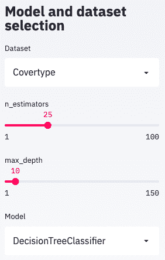

这显示了浏览器中的菜单选项。我们将在浏览器页面的主要部分展示这些选择的结果。

1.  在主面板上报告分类结果：

在主面板上，我们将展示重要的统计数据，包括分类报告、几个图表，应该能够揭示模型的优势和劣势，以及数据本身的视图，在这里模型错误的决策将被突出显示。

我们首先需要一个标题：

```py
st.title('{model} on {dataset}'.format(
    model=model_name,
    dataset=dataset_name
))
```

然后我们将展示与我们的建模结果相关的基本统计数据，例如曲线下面积、精度等等：

```py
predictions = model.predict(X_test)
probs = model.predict_proba(X_test)
st.subheader('Model performance in test')
st.write('AUC: {:.2f}'.format(
    roc_auc_score(
        y_test, probs,
        multi_class='ovo' if len(target_names) > 2 else 'raise',
        average='macro' if len(target_names) > 2 else None
    )
))
st.write(
    pd.DataFrame(
        classification_report(
            y_test, predictions,
            target_names=target_names,
            output_dict=True
        )
    )
) 
```

然后，我们将展示一个混淆矩阵，表格化每个类别的实际和预测标签：

```py
test_df = pd.DataFrame(
    data=np.concatenate([
        X_test,
        y_test.reshape(-1, 1),
        predictions.reshape(-1, 1)
    ], axis=1),
    columns=feature_names + [
        'target', 'predicted'
    ]
)
target_map = {i: n for i, n in enumerate(target_names)}
test_df.target = test_df.target.map(target_map)
test_df.predicted = test_df.predicted.map(target_map)
confusion_matrix = pd.crosstab(
    test_df['target'],
    test_df['predicted'],
    rownames=['Actual'],
    colnames=['Predicted']
)
st.subheader('Confusion Matrix')
st.write(confusion_matrix)
```

我们还希望能够滚动查看被错误分类的测试数据样本：

```py
def highlight_error(s):
    if s.predicted == s.target:
        return ['background-color: None'] * len(s)
    return ['background-color: red'] * len(s)

if st.checkbox('Show test data'):
    st.subheader('Test data')
    st.write(test_df.style.apply(highlight_error, axis=1))
```

错误分类的样本将以红色背景突出显示。我们将这种原始数据探索设为可选项，需要通过点击复选框激活。

最后，我们将展示变量在散点图中相互绘制的面板图。这部分将使用`altair`库：

```py
if st.checkbox('Show test distributions'):
    st.subheader('Distributions')
    row_features = feature_names[:len(feature_names)//2]
    col_features = feature_names[len(row_features):]
    test_df_with_error = test_df.copy()
    test_df_with_error['error'] = test_df.predicted == test_df.target
    chart = alt.Chart(test_df_with_error).mark_circle().encode(
            alt.X(alt.repeat("column"), type='quantitative'),
            alt.Y(alt.repeat("row"), type='quantitative'),
            color='error:N'
    ).properties(
            width=250,
            height=250
    ).repeat(
        row=row_features,
        column=col_features
    ).interactive()
    st.write(chart)
```

这些图中突出显示了错误分类的例子。同样，我们将这部分设为可选项，通过标记复选框激活。

主页上部分用于`Covetype`数据集的样式如下：

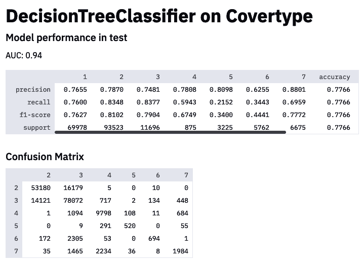

您可以看到分类报告和混淆矩阵。在这些内容之下（不在截图范围内），将是数据探索和数据图表。

这结束了我们的演示应用程序。我们的应用程序相对简单，但希望这个方法能作为构建这些应用程序以进行清晰沟通的指南。

## 工作原理如下...

本书关注于实践学习，我们也推荐这种方式用于 streamlit。在使用 streamlit 时，您可以快速实施更改并查看结果，直到您对所见到的内容满意为止。

如果你愿意，Streamlit 提供了一个本地服务器，可以通过浏览器远程访问。因此，你可以在 Azure、Google Cloud、AWS 或你公司的云上运行你的 Streamlit 应用服务器，并在本地浏览器中查看你的结果。

重要的是理解 Streamlit 的工作流程。小部件的值由 Streamlit 存储。其他值在用户与小部件交互时每次都会根据 Python 脚本从头到尾重新计算。为了避免昂贵的计算，可以使用`@st.cache`装饰器进行缓存，就像我们在这个示例中看到的那样。

Streamlit 的 API 集成了许多绘图和图表库。这些包括 Matplotlib、Seaborn、Plotly、Bokeh，以及 Altair、Vega Lite、用于地图和 3D 图表的 deck.gl 等交互式绘图库，以及 graphviz 图形。其他集成包括 Keras 模型、SymPy 表达式、pandas DataFrames、图像、音频等。

Streamlit 还配备了多种类型的小部件，如滑块、按钮和下拉菜单。Streamlit 还包括一个可扩展的组件系统，每个组件由 HTML 和 JavaScript 构成的浏览器前端以及 Python 后端组成，能够双向发送和接收信息。现有组件接口进一步与 HiPlot、Echarts、Spacy 和 D3 等库进行集成：[`www.streamlit.io/components`](https://www.streamlit.io/components).

你可以玩转不同的输入和输出，可以从头开始，也可以改进这个*食谱*中的代码。我们可以扩展它以显示不同的结果，构建仪表板，连接到数据库进行实时更新，或者为专业主题专家建立用户反馈表单，例如注释或批准。

## 参见

AI 和统计可视化是一个广泛的领域。Fernanda Viégas 和 Martin Wattenberg 在 NIPS 2018 上进行了一场名为*机器学习可视化*的概述演讲，并且你可以找到他们的幻灯片和演讲录像。

这是一些有趣的 Streamlit 演示列表：

+   使用一个实时的 TensorFlow 会话来创建一个交互式的人脸-GAN 探索器：[`github.com/streamlit/demo-face-gan/`](https://github.com/streamlit/demo-face-gan/).

+   一个用于 Udacity 自动驾驶车辆数据集和实时目标检测的图像浏览器：[`github.com/streamlit/demo-self-driving`](https://github.com/streamlit/demo-self-driving).

+   一个地图、音频、图像以及其他多个组件的演示：[`fullstackstation.com/streamlit-components-demo`](https://fullstackstation.com/streamlit-components-demo).

除了 Streamlit，还有其他可以帮助创建交互式仪表板、演示和报告的库和框架，比如 Bokeh、Jupyter Voilà、Panel 和 Plotly Dash。

如果您正在寻找具有数据库集成的仪表板和实时图表，诸如 Apache Superset 这样的工具非常方便：[`superset.apache.org/`](https://superset.apache.org/)。

# 为实时决策提供模型服务

AI 专家经常被要求建模、呈现或提出模型。但是，即使解决方案可能在商业上具有影响力，实际上，将概念验证（**POC**）生产化以进行实时决策实施，往往比最初提出模型更具挑战性。一旦我们基于训练数据创建了模型，并对其进行分析以验证其按预期标准运行，并与利益相关者进行沟通，我们希望使该模型可用，以便为新决策的数据提供预测。这可能意味着满足特定要求，例如延迟（用于实时应用程序）和带宽（用于为大量客户提供服务）。通常，模型部署为诸如推断服务器之类的微服务的一部分。

在这个示例中，我们将从头开始构建一个小型推断服务器，并专注于将人工智能引入生产环境的技术挑战。我们将展示如何通过稳健性、按需扩展、及时响应的软件解决方案将 POC 开发成适合生产的解决方案，并且可以根据需要快速更新。

## 准备工作

在这个示例中，我们将在终端和 Jupyter 环境之间切换。我们将在 Jupyter 环境中创建和记录模型。我们将从终端控制`mlflow`服务器。我们会注意哪个代码块适合哪个环境。

我们将在这个示例中使用`mlflow`。让我们从终端安装它：

```py
pip install mlflow
```

我们假设您已经安装了 conda。如果没有，请参考《Python 人工智能入门》中的*设置 Jupyter 环境*一章，以获取详细说明。

我们可以像这样从终端启动我们的本地`mlflow`服务器，使用`sqlite`数据库作为后端存储：

```py
mlflow server --backend-store-uri sqlite:///mlflow.db --host 0.0.0.0 --default-artifact-root file://$PWD/mlruns
```

我们应该看到一条消息，指出我们的服务器正在监听[`0.0.0.0:5000`](http://0.0.0.0:5000)。

这是我们可以从浏览器访问此服务器的地方。在浏览器中，我们可以比较和检查不同的实验，并查看我们模型的指标。

在*更多内容...*部分，我们将快速演示如何使用`FastAPI`库设置自定义 API。我们也将快速安装此库：

```py
!pip install fastapi
```

有了这个，我们就准备好了！

## 如何实现...

我们将从一个**逗号分隔值**（**CSV**）文件中构建一个简单的模型。我们将尝试不同的建模选项，并进行比较。然后我们将部署这个模型：

1.  下载和准备数据集：

我们将下载一个数据集作为 CSV 文件并准备进行训练。在这个示例中选择的数据集是葡萄酒数据集，描述了葡萄酒样本的质量。我们将从 UCI ML 存档中下载并读取葡萄酒质量的 CSV 文件：

```py
import pandas as pd
import numpy as np
from sklearn.model_selection import train_test_split

csv_url =\
    'http://archive.ics.uci.edu/ml/machine-' \
    'learning-databases/wine-quality/winequality-red.csv'
data = pd.read_csv(csv_url, sep=';')
```

我们将数据分割为训练集和测试集。预测列是**quality 列**：

```py
train_x, test_x, train_y, test_y = train_test_split(
    data.drop(['quality'], axis=1),
    data['quality']
)
```

1.  使用不同的超参数进行训练：

我们可以在`mlflow`服务器中跟踪我们喜欢的任何东西。我们可以创建一个用于性能指标报告的函数，如下所示：

```py
from sklearn.metrics import mean_squared_error, mean_absolute_error, r2_score

def eval_metrics(actual, pred):
    rmse = np.sqrt(mean_squared_error(actual, pred))
    mae = mean_absolute_error(actual, pred)
    r2 = r2_score(actual, pred)
    return rmse, mae, r2
```

在运行训练之前，我们需要将`mlflow`库注册到服务器上：

```py
import mlflow

mlflow.set_tracking_uri('http://0.0.0.0:5000')
mlflow.set_experiment('/wine')
```

我们设置了我们的服务器 URI。我们还可以给我们的实验起个名字。

每次我们使用不同选项运行训练集时，MLflow 都可以记录结果，包括指标、超参数、被 pickled 的模型，以及作为 MLModel 捕获库版本和创建时间的定义。

在我们的训练函数中，我们在训练数据上训练，在测试数据上提取我们的模型指标。我们需要选择适合比较的适当超参数和指标：

```py
from sklearn.linear_model import ElasticNet
import mlflow.sklearn

np.random.seed(40)

def train(alpha=0.5, l1_ratio=0.5):
 with mlflow.start_run():
 lr = ElasticNet(alpha=alpha, l1_ratio=l1_ratio, random_state=42)
 lr.fit(train_x, train_y)
 predicted = lr.predict(test_x)
 rmse, mae, r2 = eval_metrics(test_y, predicted)

        model_name = lr.__class__.__name__
        print('{} (alpha={}, l1_ratio={}):'.format(
            model_name, alpha, l1_ratio
        ))
        print(' RMSE: %s' % rmse)
        print(' MAE: %s' % mae)
        print(' R2: %s' % r2)

        mlflow.log_params({key: value for key, value in lr.get_params().items()})
        mlflow.log_metric('rmse', rmse)
        mlflow.log_metric('r2', r2)
        mlflow.log_metric('mae', mae)
        mlflow.sklearn.log_model(lr, model_name)
```

我们拟合模型，提取我们的指标，将它们打印到屏幕上，在`mlflow`服务器上记录它们，并将模型工件存储在服务器上。

为了方便起见，我们在`train()`函数中暴露了我们的模型超参数。我们选择使用`mlflow`记录所有超参数。或者，我们也可以仅记录像这样与存储相关的参数：`mlflow.log_param('alpha', alpha)`。

我们还可以计算更多伴随模型的工件，例如变量重要性。

我们还可以尝试使用不同的超参数，例如以下方式：

```py
train(0.5, 0.5)
```

我们应该得到性能指标作为输出：

```py
ElasticNet (alpha=0.5, l1_ratio=0.5):
  RMSE: 0.7325693777577805
  MAE: 0.5895721434715478
  R2: 0.12163690293641838
```

在我们使用不同参数多次运行之后，我们可以转到我们的服务器，比较模型运行，并选择一个模型进行部署。

1.  将模型部署为本地服务器。我们可以在浏览器中比较我们的模型。我们应该能够在服务器的实验选项卡下找到我们的葡萄酒实验。

然后我们可以在概述表中比较不同模型运行，或者获取不同超参数的概述图，例如这样：

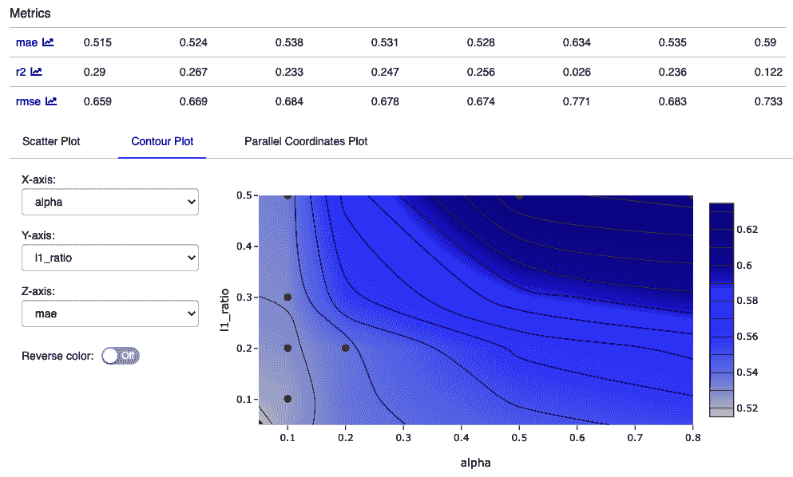

这个等高线图向我们展示了我们针对**平均绝对误差**（**MAE**）改变的两个超参数。

我们可以选择一个模型进行部署。我们可以看到我们最佳模型的运行 ID。可以通过命令行将模型部署到服务器，例如像这样：

```py
mlflow models serve -m /Users/ben/mlflow/examples/sklearn_elasticnet_wine/mlruns/1/208e2f5250814335977b265b328c5c49
/artifacts/ElasticNet/
```

我们可以将数据作为 JSON 传递，例如使用 curl，同样是从终端。这可能看起来像这样：

```py
curl -X POST -H "Content-Type:application/json; format=pandas-split" --data '{"columns":["alcohol", "chlorides", "citric acid", "density", "fixed acidity", "free sulfur dioxide", "pH", "residual sugar", "sulphates", "total sulfur dioxide", "volatile acidity"],"data":[[1.2, 0.231, 0.28, 0.61, 4.5, 13, 2.88, 2.1, 0.26, 63, 0.51]]}' http://127.0.0.1:1234/invocations
```

有了这个，我们完成了使用`mlflow`进行模型部署的演示。

## 工作原理是这样的...

将模型产品化的基本工作流程如下：

+   在数据上训练模型。

+   将模型本身打包为可重复使用和可再现的模型格式，以及提取模型预测的胶水代码。

+   将模型部署在启用您进行预测评分的 HTTP 服务器中。

这通常导致一个通过 JSON 通信的微服务（通常这被称为 RESTful 服务）或 GRPC（通过 Google 的协议缓冲区进行远程过程调用）。这具有将决策智能从后端分离出来，并让 ML 专家完全负责他们的解决方案的优势。

**微服务** 是一个可以独立部署、维护和测试的单个服务。将应用程序结构化为一组松散耦合的微服务称为**微服务架构**。

另一种方法是将您的模型和粘合代码打包部署到公司现有企业后端中。此集成有几种替代方案：

+   在诸如**预测模型标记语言**（**PMML**）等模型交换格式中，这是由数据挖掘组织联合开发的一种格式。

+   一些软件实现，如 LightGBM、XGBoost 或 TensorFlow，具有多种编程语言的 API，因此可以在 Python 中开发模型，并从诸如 C、C++或 Java 等语言中加载。

+   重新工程化您的模型：

    +   一些工具可以帮助将决策树等模型转换为 C 或其他语言。

    +   这也可以手动完成。

MLflow 具有命令行、Python、R、Java 和 REST API 接口，用于将模型上传到模型库，记录模型结果（**实验**），再次下载以便在本地使用，控制服务器等等。它提供了一个服务器，还允许部署到 Azure ML、Amazon Sagemaker、Apache Spark UDF 和 RedisAI。

如果您希望能够远程访问您的`mlflow`服务器，例如通常在将模型服务器作为独立服务（微服务）时的情况，我们希望将根设置为`0.0.0.0`，就像我们在示例中所做的那样。默认情况下，本地服务器将在`http://127.0.0.1:5000`上启动。

如果我们想要访问模型，我们需要从默认的后端存储（这是存储指标的地方）切换到数据库后端，并且我们必须使用 URI 中的协议定义我们的工件存储，例如对于本地`mlruns/`目录，使用`file://$PWD/mlruns`。我们已经启用了后端的 SQLite 数据库，这是最简单的方式（但可能不适合生产环境）。我们也可以选择 MySQL、Postgres 或其他数据库后端。

然而，这只是挑战的一部分，因为模型可能变得陈旧或不适用，这些事实只有在我们具备监视部署中模型和服务器性能的能力时才能确认。因此，需要关注监控问题。

### 监控

在监控 AI 解决方案时，我们特别关注的是操作性或与适当决策相关的指标。前一种类型的指标如下：

+   **延迟** – 在数据上执行预测需要多长时间？

+   **吞吐量** – 我们能在任何时间段内处理多少数据点？

+   **资源使用率** – 在完成推理时，我们分配了多少 CPU、内存和磁盘空间？

以下指标可以作为监控决策过程的一部分：

+   统计指标，例如在一定时间内预测的平均值和方差

+   异常值和漂移检测

+   决策的业务影响

要了解检测异常值的方法，请参阅第三章中的*发现异常*配方，*模式、异常值和推荐*。

可以从头开始构建独立的监控，类似于本章中*可视化模型结果*的模板，或者与更专业的监控解决方案集成，如 Prometheus、Grafana 或 Kibana（用于日志监控）。

## 另请参阅

这是一个非常广泛的话题，在本文档的*工作原理……*部分中提到了许多生产化方面。在 ML 和**深度学习**（**DL**）模型中有许多竞争激烈的工业级解决方案，考虑到空间限制，我们只能尝试给出一个概述。像往常一样，在本书中，我们主要集中于避免供应商锁定的开源解决方案：

+   MLflow 致力于管理整个 ML 生命周期，包括实验、可复现性、部署和中心化模型注册：[`mlflow.org/`](https://mlflow.org/)。

+   BentoML 创建一个高性能 API 端点，用于提供训练好的模型：[`github.com/bentoml/bentoml`](https://github.com/bentoml/bentoml)。

虽然某些工具只支持一个或少数几个建模框架，但其他工具，特别是 BentoML 和 MLflow，支持部署在所有主要 ML 训练框架下训练的模型。这两者提供了在 Python 中创建的任何东西的最大灵活性，并且它们都具有用于监控的跟踪功能。

我们的配方是从 `mlflow` 教程示例中调整的。MLflow 在 GitHub 上有更多不同建模框架集成的示例：[`github.com/mlflow/mlflow/`](https://github.com/mlflow/mlflow/)。

其他工具包括以下内容：

+   Elyra 是一个基于云的 Jupyter 笔记本部署解决方案，配备了可视化数据流编辑器：[`elyra.readthedocs.io/en/latest/index.html`](https://elyra.readthedocs.io/en/latest/index.html)。

+   RedisAI 是一个用于执行 DL/ML 模型和管理它们数据的 Redis 模块：[`oss.redislabs.com/redisai/`](https://oss.redislabs.com/redisai/)。

+   TFX 是一个由 Google 推出的生产级 ML 平台：[`www.tensorflow.org/tfx/guide`](https://www.tensorflow.org/tfx/guide)。

+   TorchServe 是一个用于服务 PyTorch 模型的工具：[`pytorch.org/serve/`](https://pytorch.org/serve/)。

此外，还有许多库可用于创建自定义微服务。其中最受欢迎的两个库是：

+   Flask：[`palletsprojects.com/p/flask/`](https://palletsprojects.com/p/flask/)

+   FastAPI：[`fastapi.tiangolo.com/`](https://fastapi.tiangolo.com/)

使用这些，您可以创建端点，该端点可以接收像图像或文本这样的数据，并返回预测结果。

# 保护模型免受攻击

**对抗攻击**在机器学习中指的是通过输入欺骗模型的行为。这种攻击的示例包括通过改变几个像素向图像添加扰动，从而导致分类器误分类样本，或者携带特定图案的 T 恤以逃避人物检测器（**对抗 T 恤**）。一种特定的对抗攻击是**隐私攻击**，其中黑客可以通过成员推理攻击和模型反演攻击获取模型的训练数据集知识，从而可能暴露个人或敏感信息。

在医疗或金融等领域，隐私攻击尤为危险，因为训练数据可能涉及敏感信息（例如健康状态），并且可能可以追溯到个人身份。在本配方中，我们将构建一个免受隐私攻击的模型，因此无法被黑客攻击。

## 准备工作

我们将实现一个 PyTorch 模型，但我们将依赖由 Nicolas Papernot 和其他人创建和维护的 TensorFlow/privacy 存储库中的脚本。我们将按以下步骤克隆存储库：

```py
!git clone https://github.com/tensorflow/privacy
```

配方后期，我们将使用分析脚本计算我们模型的隐私边界。

## 如何操作...

我们必须为教师模型和学生模型定义数据加载器。在我们的情况下，教师和学生架构相同。我们将训练教师，然后从教师响应的聚合训练学生。我们将最终进行隐私分析，执行来自隐私存储库的脚本。

这是从 Diego Muñoz 的 GitHub 笔记本调整而来的：[`github.com/dimun/pate_torch`](https://github.com/dimun/pate_torch)：

1.  让我们从加载数据开始。我们将使用`torch`实用程序函数下载数据：

```py
from torchvision import datasets
import torchvision.transforms as transforms

batch_size = 32

transform = transforms.Compose(
    [transforms.ToTensor(),
     transforms.Normalize((0.1307,), (0.3081,))]
)

train_data = datasets.MNIST(
    root='data', train=True,
    download=True,
    transform=transform
)
test_data = datasets.MNIST(
    root='data', train=False,
    download=True,
    transform=transform
)
```

这将加载 MNIST 数据集，可能需要一段时间。转换将数据转换为`torch.FloatTensor`。`train_data`和`test_data`分别定义了训练和测试数据的加载器。

请参阅第七章中的*识别服装项目*配方，简要讨论 MNIST 数据集，以及同一章节中的*生成图像*配方，用于使用该数据集的另一个模型。

请注意，我们将在整个配方中以临时方式定义一些参数。其中包括`num_teachers`和`standard_deviation`。您将在*工作原理...*部分看到算法的解释，希望那时这些参数会变得合理。

另一个参数，`num_workers`，定义了用于数据加载的子进程数。`batch_size`定义了每批加载的样本数。

我们将为教师定义数据加载器：

```py
num_teachers = 100

def get_data_loaders(train_data, num_teachers=10):
    teacher_loaders = []
    data_size = len(train_data) // num_teachers

    for i in range(num_teachers):
        indices = list(range(i * data_size, (i+1) * data_size))
        subset_data = Subset(train_data, indices)
        loader = torch.utils.data.DataLoader(
            subset_data,
            batch_size=batch_size,
            num_workers=num_workers
        )
        teacher_loaders.append(loader)

    return teacher_loaders

teacher_loaders = get_data_loaders(train_data, num_teachers)
```

`get_data_loaders()`函数实现了一个简单的分区算法，返回给定教师所需的数据部分。每个教师模型将获取训练数据的不相交子集。

我们为学生定义一个训练集，包括 9000 个训练样本和 1000 个测试样本。这两个集合都来自教师的测试数据集，作为未标记的训练点 - 将使用教师的预测进行标记：

```py
import torch
from torch.utils.data import Subset

student_train_data = Subset(test_data, list(range(9000)))
student_test_data = Subset(test_data, list(range(9000, 10000)))

student_train_loader = torch.utils.data.DataLoader(
    student_train_data, batch_size=batch_size, 
    num_workers=num_workers
)
student_test_loader = torch.utils.data.DataLoader(
    student_test_data, batch_size=batch_size, 
    num_workers=num_workers
)
```

1.  定义模型：我们将为所有教师定义一个单一模型：

```py
import torch.nn as nn
import torch.nn.functional as F
import torch.optim as optim

class Net(nn.Module):
    def __init__(self):
        super(Net, self).__init__()
        self.conv1 = nn.Conv2d(1, 10, kernel_size=5)
        self.conv2 = nn.Conv2d(10, 20, kernel_size=5)
        self.conv2_drop = nn.Dropout2d()
        self.fc1 = nn.Linear(320, 50)
        self.fc2 = nn.Linear(50, 10)

    def forward(self, x):
        x = F.relu(F.max_pool2d(self.conv1(x), 2))
        x = F.relu(F.max_pool2d(self.conv2_drop(self.conv2(x)), 2))
        x = x.view(-1, 320)
        x = F.relu(self.fc1(x))
        x = F.dropout(x, training=self.training)
        x = self.fc2(x)
        return F.log_softmax(x)
```

这是用于图像处理的卷积神经网络。请参阅第七章，*高级图像应用*，了解更多图像处理模型。

让我们为预测创建另一个工具函数，给定一个`dataloader`：

```py
def predict(model, dataloader):
    outputs = torch.zeros(0, dtype=torch.long).to(device)
    model.to(device)
    model.eval()
    for images, labels in dataloader:
        images, labels = images.to(device), labels.to(device)
        output = model.forward(images)
        ps = torch.argmax(torch.exp(output), dim=1)
        outputs = torch.cat((outputs, ps))

    return outputs
```

现在我们可以开始训练教师。

1.  训练教师模型：

首先，我们将实现一个训练模型的函数：

```py
device = torch.device('cuda:0' if torch.cuda.is_available() else 'cpu')

def train(model, trainloader, criterion, optimizer, epochs=10, print_every=120):
    model.to(device)
    steps = 0
    running_loss = 0
    for e in range(epochs):
        model.train()
        for images, labels in trainloader:
            images, labels = images.to(device), labels.to(device)
            steps += 1         
            optimizer.zero_grad()     
            output = model.forward(images)
            loss = criterion(output, labels)
            loss.backward()
            optimizer.step()
            running_loss += loss.item()
```

现在我们准备训练我们的教师：

```py
from tqdm.notebook import trange

def train_models(num_teachers):
    models = []
    for t in trange(num_teachers):
        model = Net()
        criterion = nn.NLLLoss()
        optimizer = optim.Adam(model.parameters(), lr=0.003)
        train(model, teacher_loaders[t], criterion, optimizer)
        models.append(model)
    return models

models = train_models(num_teachers) 
```

这将实例化并训练每个教师的模型。

1.  训练学生：

对于学生，我们需要一个聚合函数。您可以在*工作原理...*部分看到聚合函数的解释：

```py
import numpy as np

def aggregated_teacher(models, data_loader, standard_deviation=1.0):
    preds = torch.torch.zeros((len(models), 9000), dtype=torch.long)
    print('Running teacher predictions...')
    for i, model in enumerate(models):
        results = predict(model, data_loader)
        preds[i] = results

    print('Calculating aggregates...')
    labels = np.zeros(preds.shape[1]).astype(int)
    for i, image_preds in enumerate(np.transpose(preds)):
        label_counts = np.bincount(image_preds, minlength=10).astype(float)
        label_counts += np.random.normal(0, standard_deviation, len(label_counts))
        labels[i] = np.argmax(label_counts)

    return preds.numpy(), np.array(labels)

standard_deviation = 5.0
teacher_models = models
preds, student_labels = aggregated_teacher(
    teacher_models,
    student_train_loader,
    standard_deviation
)
```

`aggregated_teacher()`函数为所有教师做出预测，计数投票，并添加噪声。最后，它通过`argmax`返回投票和结果的聚合。

`standard_deviation`定义了噪声的标准差。这对隐私保证至关重要。

学生首先需要一个数据加载器：

```py
def student_loader(student_train_loader, labels):
    for i, (data, _) in enumerate(iter(student_train_loader)):
        yield data, torch.from_numpy(labels[i*len(data):(i+1)*len(data)])
```

这个学生数据加载器将被提供聚合的教师标签：

```py
student_model = Net()
criterion = nn.NLLLoss()
optimizer = optim.Adam(student_model.parameters(), lr=0.001)
epochs = 10
student_model.to(device)
steps = 0
running_loss = 0
for e in range(epochs):
    student_model.train()
    train_loader = student_loader(student_train_loader, student_labels)
    for images, labels in train_loader:
        images, labels = images.to(device), labels.to(device)
        steps += 1
        optimizer.zero_grad()
        output = student_model.forward(images)
        loss = criterion(output, labels)
        loss.backward()
        optimizer.step()
        running_loss += loss.item()
        # <validation code omitted>
```

这将运行学生训练。

由于简洁起见，本代码中的某些部分已从训练循环中省略。验证如下所示：

```py
        if steps % 50 == 0:
            test_loss = 0
            accuracy = 0
            student_model.eval()
            with torch.no_grad():
                for images, labels in student_test_loader:
                    images, labels = images.to(device), labels.to(device)
                    log_ps = student_model(images)
                    test_loss += criterion(log_ps, labels).item()

                    ps = torch.exp(log_ps)
                    top_p, top_class = ps.topk(1, dim=1)
                    equals = top_class == labels.view(*top_class.shape)
                    accuracy += torch.mean(equals.type(torch.FloatTensor))
            student_model.train()
            print('Training Loss: {:.3f}.. '.format(running_loss/len(student_train_loader)),
                  'Test Loss: {:.3f}.. '.format(test_loss/len(student_test_loader)),
                  'Test Accuracy: {:.3f}'.format(accuracy/len(student_test_loader)))
            running_loss = 0
```

最终的训练更新如下：

```py
Epoch: 10/10..  Training Loss: 0.026..  Test Loss: 0.190..  Test Accuracy: 0.952
```

我们看到这是一个好模型：在测试数据集上准确率为 95.2%。

1.  分析隐私：

在 Papernot 等人（2018）中，他们详细介绍了如何计算数据相关的差分隐私界限，以估算训练学生的成本。

他们提供了一个基于投票计数和噪声标准差的分析脚本。我们之前克隆了这个仓库，因此可以切换到其中一个目录，并执行分析脚本：

```py
%cd privacy/research/pate_2018/ICLR2018
```

我们需要将聚合后的教师计数保存为一个 NumPy 文件。然后可以通过分析脚本加载它：

```py
clean_votes = []
for image_preds in np.transpose(preds):
    label_counts = np.bincount(image_preds, minlength=10).astype(float)
    clean_votes.append(label_counts)

clean_votes = np.array(counts)
with open('clean_votes.npy', 'wb') as file_obj:
  np.save(file_obj, clean_votes)
```

这将`counts`矩阵放在一起，并将其保存为文件。

最后，我们调用隐私分析脚本：

```py
!python smooth_sensitivity_table.py  --sigma2=5.0 --counts_file=clean_votes.npy --delta=1e-5
```

隐私保证的ε估计为 34.226（数据独立）和 6.998（数据相关）。ε值本身并不直观，但需要在数据集及其维度的背景下进行解释。

## 工作原理...

我们从数据集中创建了一组教师模型，然后从这些教师模型中引导出了一个能提供隐私保证的学生模型。在本节中，我们将讨论机器学习中隐私问题的一些背景，差分隐私，以及 PATE 的工作原理。

泄露客户数据可能会给公司带来严重的声誉损失，更不用说因违反数据保护和隐私法（如 GDPR）而遭到监管机构处罚的费用。因此，在数据集的创建和机器学习中考虑隐私问题至关重要。作为一个例子，来自著名的 Netflix 奖数据集的 50 万用户的数据通过与公开可用的亚马逊评论的关联而被重新匿名化。

尽管几列的组合可能泄露特定个体的太多信息，例如，地址或邮政编码再加上年龄，对于试图追踪数据的人来说是一个线索，但是建立在这些数据集之上的机器学习模型也可能不安全。当遭受成员推断攻击和模型反演攻击等攻击时，机器学习模型可能会泄漏敏感信息。

**成员攻击** 大致上是识别目标模型在训练输入上的预测与在未经训练的输入上的预测之间的差异。您可以从论文*针对机器学习模型的成员推断攻击*（Reza Shokri 等人，2016）了解更多信息。他们表明，Google 等公司提供的现成模型可能容易受到这些攻击的威胁。

在**反演攻击**中，通过 API 或黑盒访问模型以及一些人口统计信息，可以重建用于训练模型的样本。在一个特别引人注目的例子中，用于训练人脸识别模型的面部被重建了。更令人关注的是，Matthew Fredrikson 等人表明，个性化药物基因组学模型可以暴露个体的敏感基因信息（*个性化华法林剂量定制的隐私*：*个案研究；2014*）。

**差分隐私** (**DP**) 机制可以防止模型反演和成员攻击。接下来的部分，我们将讨论差分隐私，然后是关于 PATE 的内容。

### 差分隐私

差分隐私的概念，最初由 Cynthia Dwork 等人在 2006 年提出（*在私有数据分析中校准噪声和灵敏度*），是机器学习中隐私的金标准。它集中在个体数据点对算法决策的影响上。大致而言，这意味着，模型的任何输出都不会泄露是否包含了个人信息。在差分隐私中，数据会被某种分布的噪声干扰。这不仅可以提供防止隐私攻击的安全性，还可以减少过拟合的可能性。

为了正确解释差分隐私，我们需要介绍邻近数据库（类似*数据集*）的概念，这是一个只在单个行或者说单个个体上有所不同的数据库。两个数据集，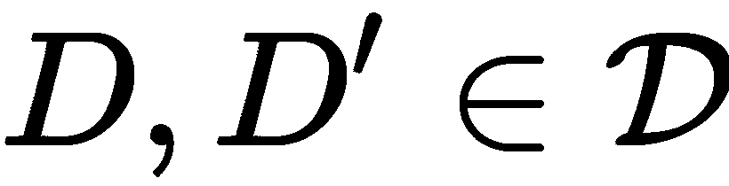，仅在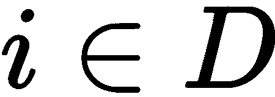和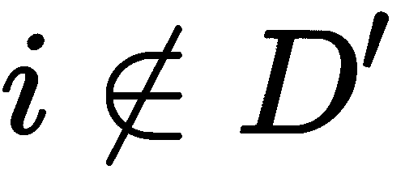事实上的不同之处。

关键是设定一个上限要求映射（或机制）在相邻数据库上的行为几乎完全相同！[](img/ac721097-c2e1-4ff1-8681-e7dca18cf7e7.png)。


这被称为算法的 epsilon-delta 参数化差分隐私，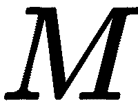，在任何邻近数据库和任何结果子集上。

在这个表述中，epsilon 参数是乘法保证，delta 参数是概率几乎完全准确结果的加法保证。这意味着个人由于其数据被使用而产生的差异隐私成本是最小的。Delta 隐私可以被视为 epsilon 为*0*的子集或特殊情况，而 epsilon 隐私则是 delta 为*0*的情况。

这些保证是通过掩盖输入数据中的微小变化来实现的。例如，斯坦利·L·沃纳在 1965 年描述了这种掩盖的简单程序（*随机化响应：消除逃避性答案偏差的调查技术*）。调查中的受访者对敏感问题如*你有过堕胎吗？*以真实方式或根据硬币翻转决定：

1.  抛一枚硬币。

1.  如果反面，真实回答：没有。

1.  如果正面，再翻一枚硬币，如果正面回答*是*，如果反面回答*否*。

这提供了合理的否认能力。

### 教师集合的私有聚合

基于 Nicolas Papernot 等人（2017）的论文*来自私有训练数据的半监督知识转移*，**教师集合的私有聚合**（**PATE**）技术依赖于教师的嘈杂聚合。2018 年，Nicolas Papernot 等人（*具有 PATE 的可扩展私有学习*）改进了 2017 年的框架，提高了组合模型的准确性和隐私性。他们进一步展示了 PATE 框架在大规模、真实世界数据集中的适用性。

PATE 训练遵循这个过程：

1.  基于不共享训练示例的不同数据集创建了模型集合（**教师模型**）。

1.  学生模型是基于查询教师模型的嘈杂聚合决策进行训练。

1.  只能发布学生模型，而不能发布教师模型。

正如提到的，每个教师都在数据集的不相交子集上训练。直觉上，如果教师们就如何对新的输入样本进行分类达成一致意见，那么集体决策不会透露任何单个训练样本的信息。

查询中的聚合机制包括**Gaussian NoisyMax**（**GNMax**），具有高斯噪声的 argmax，如下所定义：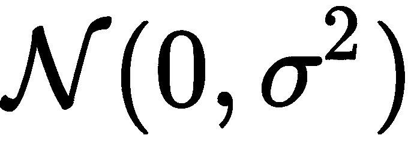。

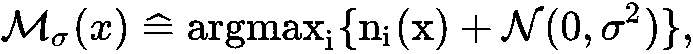

这有一个数据点 ，类别 ，以及教师  在 x 上的投票 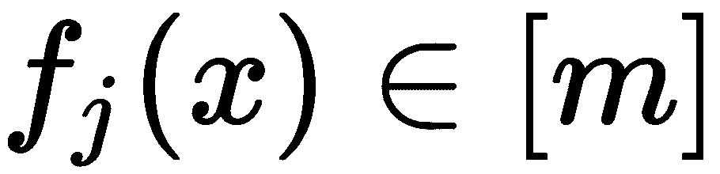。

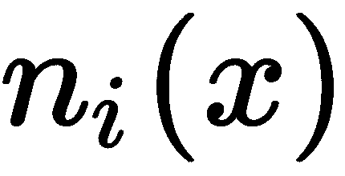 表示类别  的投票计数：

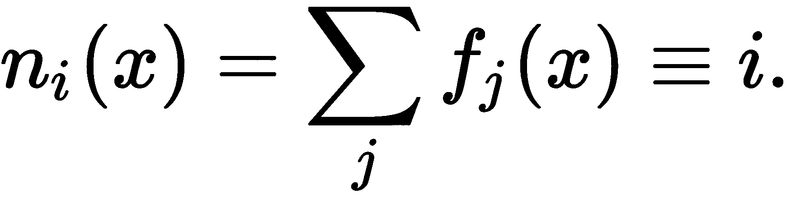

直观上，准确性随噪声的方差增加而降低，因此方差必须选择足够紧密以提供良好的性能，但又足够宽以保护隐私。

ε值取决于聚合，特别是噪声水平，还取决于数据集及其维度的上下文。请参阅*Jaewoo Lee 和 Chris Clifton 的《多少是足够的？选择差分隐私的敏感性参数》*（2011 年），以进行讨论。

## 另见

关于 DP 概念的详细概述可以在*Cynthia Dwork 和 Aaron Roth 的《差分隐私的算法基础》*中找到。请参阅我们为此配方采用的第二篇 PATE 论文（Nicolas Papernot 等人 2018 年；[`arxiv.org/pdf/1802.08908.pdf`](https://arxiv.org/pdf/1802.08908.pdf)）。

至于与 DP 相关的 Python 库，有许多选择：

+   Opacus 允许使用 DP 训练 PyTorch 模型：[`github.com/pytorch/opacus`](https://github.com/pytorch/opacus).

+   PySyft 适用于 PyTorch，TensorFlow 和 Keras，包括许多机制，包括 PATE：[`github.com/OpenMined/PySyft`](https://github.com/OpenMined/PySyft).

+   TensorFlow 的 cleverhans 库提供了用于评估模型对对抗攻击的工具：[`github.com/tensorflow/cleverhans`](https://github.com/tensorflow/cleverhans).

TensorFlow 的隐私库包含与 DP 相关的优化器和模型。它还包含使用不同机制的教程，例如 DP 随机梯度下降，DP Adam 优化器或 PATE，适用于成人，IMDB 或其他数据集：[`github.com/tensorflow/privacy`](https://github.com/tensorflow/privacy).

有关 TensorFlow 和 PyTorch 的加密 ML 框架：

+   tf-encrypted 涉及 TensorFlow 中的隐私保护 ML 和加密：[tf-encrypted.io/](https://tf-encrypted.io/).

+   Facebook 的 CrypTen 也涉及 PyTorch，包括对模型和数据的加密：[`github.com/facebookresearch/CrypTen`](https://github.com/facebookresearch/CrypTen).
