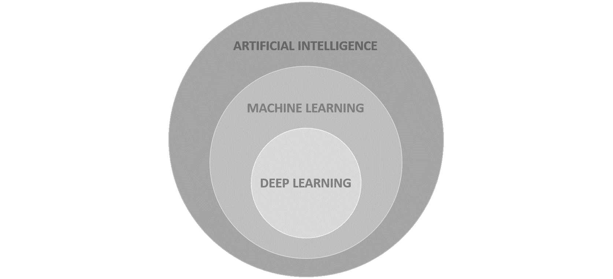
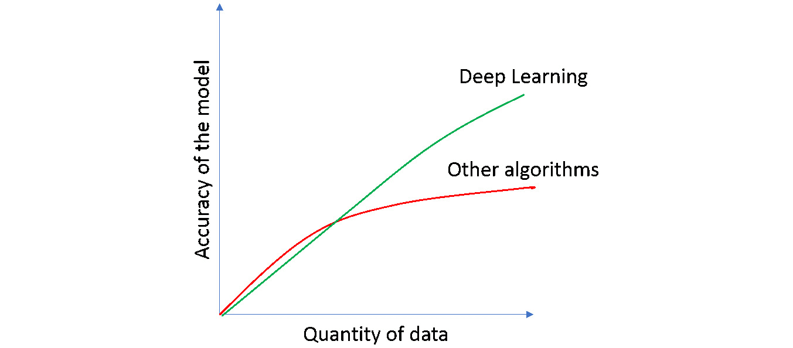

# 第一章：深度学习和 PyTorch 简介

## 学习目标

在本章结束时，您将能够：

+   解释深度学习是什么，其重要性以及它如何适用于 AI 和 ML

+   确定可以使用深度学习解决的数据问题类型

+   通过理解该库的优缺点，区分 PyTorch 与其他机器学习库

+   使用 PyTorch 创建单层神经网络

在本章中，我们将探讨深度学习与人工智能以及机器学习的共鸣。通过对 PyTorch 的介绍，我们将探索基本的编程练习，以应用 PyTorch 语法上的知识。

## 介绍

深度学习是机器学习的一个子集，专注于使用深度神经网络来解决复杂的数据问题。由于软件和硬件的进步允许收集和处理大量数据（我们谈论的是数百万甚至数十亿条记录），因此深度学习如今变得越来越流行，考虑到神经网络目前是唯一能够通过向模型提供更多数据来达到更高准确度水平的算法。

有了这个想法，对于更快的处理时间的需求是不可避免的。PyTorch 诞生于 2017 年，其主要特点在于利用 GPU 的力量来运行使用张量的数据。这使得算法能够以非常高的速度运行，并且同时为其用户提供了灵活性和标准的语法，以获得许多数据问题的最佳结果。

本书专注于使用 PyTorch 揭示神经网络的神秘，以消除隐含在神经网络架构复杂性周围的一些恐惧。

考虑到这一点，本章专注于介绍深度学习和 PyTorch 的主题。在这里，您将学习深度学习是什么，它如何适用于机器学习和人工智能的世界，它在一般条件下的工作原理，以及一些当前最流行的应用。此外，您还将了解 PyTorch 的工作原理，其主要模块和特征，以及对其用户提出的主要优缺点。

## 理解深度学习

要理解深度学习是什么，以及为什么它如今变得如此流行，首先定义人工智能和机器学习的概念是很重要的，以及深度学习如何融入这个世界。



###### 图 1.1: 人工智能、机器学习和深度学习的图表

如前所示，**人工智能**（**AI**）是一个涵盖机器学习和深度学习的通用类别。它指的是机器展示的任何智能，最终导致解决问题。这些技术包括遵循一组规则或逻辑，或从先前的数据中学习，等等。考虑到这一点，人工智能解决方案可能具有或不具有学习能力以实现最优解。

具有学习能力的人工智能解决方案属于机器学习的子集。简单来说，**机器学习**只是实现人工智能的一种方式，它由能够在没有明确编程的情况下学习的算法组成。这意味着算法能够解析数据、从中学习，并据此做出决策（预测）。这种机器学习方法称为“监督学习”，基本上意味着算法同时接收输入数据和目标值（期望的输出）。

另一种机器学习方法称为“无监督学习”，与前述方法相比，只输入数据，没有与输出相关的任何关系。这里算法的目标是理解手头的数据以寻找相似之处。

最后，**深度学习**是机器学习的一个子集，使用多层神经网络（大型神经网络），灵感来自于人类大脑的生物结构，在一个层中的神经元接收一些输入数据，处理它，并将输出发送到下一层。这些神经网络可以由数千个互连的节点（神经元）组成，大多数以不同的层次组织，其中一个节点连接到前一层中的几个节点，接收其输入数据，同时连接到下一层中的几个节点，将经过处理的输出数据发送给它们。

神经网络的结构和功能将在本书的后续部分进一步解释。

### 深度学习为什么重要？为什么变得流行？

总体而言，深度学习之所以流行是因为准确性问题。深度学习在非常复杂的数据问题上实现了比以往任何时候都更高的准确性水平。这种出色表现的能力已经达到了机器可以胜过人类的水平，这不仅使模型能够优化流程，还能提高其质量。由于这一点，在对安全至关重要的革命性领域，如自动驾驶汽车，准确性的进步是显著的。

尽管神经网络理论上几十年前就存在，但它们最近变得流行有两个主要原因：

+   神经网络需要大量标记数据才能达到最优解，并且实际上利用这些数据。这意味着为了算法能够创建出优秀的模型，需要拥有数十万条记录（对于某些数据问题甚至需要数百万条），其中包含特征和目标值。

    #### 注意

    标记数据指的是包含一组特征（描述一个实例的特征）和目标值（要实现的值）的数据。



###### 图 1.2：深度学习在数据量方面与其他算法的性能比较

这种现象现在得以实现，得益于软件方面的进步，允许收集如此详细的数据，同时硬件方面的进步则允许对其进行处理。

+   神经网络需要大量的计算能力来处理这些数据，正如前面提到的。这是至关重要的，否则传统网络的训练时间将需要数周（甚至更长时间），考虑到实现最佳模型的过程是基于试错的，需要尽可能高效地运行训练过程。

    通过使用 GPU，可以将神经网络的训练时间从几周缩短到几小时。

    #### 注意

    此外，为了加速深度学习以利用大量的训练数据并构建最先进的模型，主要的云计算提供商（如 AWS、Microsoft Azure 和 Google）正在开发 FPGA（现场可编程门阵列）和 TPU（张量处理单元）。

### 深度学习的应用

深度学习正在彻底改变我们所知的技术，因为基于其应用的许多发展目前正在影响我们的生活。此外，据认为在接下来的 5 到 10 年内，许多处理过程的方式将发生根本性变化。

此外，深度学习可以应用于广泛的情况，从医疗和安全用途到更琐碎的任务，如给黑白图像上色或实时翻译文本。

以下是目前正在开发或正在使用的一些深度学习应用场景：

+   **自动驾驶车辆**：谷歌等多家公司正在开发部分或完全自动驾驶的车辆，这些车辆通过使用数字传感器来识别周围的物体学习驾驶。


###### 图 1.3：Google 的自动驾驶汽车

+   **医学诊断**：深度学习正在重新定义这一行业，通过提高诊断脑部和乳腺癌等终末疾病的准确性。这是通过对新患者的图像进行分类来完成的，基于先前患者的标记图像，这些图像表明患者是否患有癌症。

+   **语音助手**: 这可能是当今最流行的应用之一，因为不同的语音激活智能助手大量普及，例如苹果的 Siri、Google Home 和亚马逊的 Alexa。


###### 图 1.4: 亚马逊的 Alexa 智能助手

+   **自动文本生成**: 这涉及基于输入的句子生成新的文本。在电子邮件撰写中，这被广泛应用，其中电子邮件提供商根据迄今为止写入的文本向用户建议接下来的几个词。


###### 图 1.5: Gmail 的文本生成功能

+   **广告**: 这里的主要思想是通过针对正确的受众或创建更有效的广告等方法来增加广告投资的回报率。

+   **价格预测**: 对于初学者来说，这是通过使用机器学习算法可以实现的典型示例。价格预测包括基于实际数据训练模型，包括在房地产领域中，物业特征及其最终价格，以便仅基于物业特征预测未来条目的价格。

## PyTorch 简介


###### 图 1.6: PyTorch 图书馆标志

PyTorch 是一个开源库，主要由 Facebook 的人工智能研究小组开发，作为 Torch 的 Python 版本，于 2017 年 1 月首次向公众发布。它利用**图形处理单元**（**GPU**）的强大能力来加速张量的计算，从而加快复杂模型的训练时间。

该库具有 C++ 后端，与 Torch 深度学习框架结合，比起许多带有多个深度学习功能的本地 Python 库，可以实现更快的计算。另一方面，其前端是 Python，这一点帮助了它的流行，因为新手数据科学家可以轻松构建非常复杂的神经网络。而且，由于与 Python 的集成，可以将 PyTorch 与其他流行的 Python 包一起使用。

尽管这个库相对较新，但由于使用了来自该领域许多专家的反馈，它迅速获得了广泛的流行，这使它成为了为用户而创建的库。在下一节中讨论了使用它的许多优缺点。

### 优势

如今有几个库可用于开发深度学习解决方案，那么为什么选择 PyTorch？因为 PyTorch 是一个动态库，允许用户以非常灵活的方式开发可以适应每个特定数据问题的复杂架构。

因此，它已被大量研究人员和人工智能开发人员采纳，这使得它成为机器学习领域求职必备。

这里显示了需要强调的关键方面：

+   **易用性**：关于 API，PyTorch 具有简单的界面，使得开发和运行模型非常容易。许多早期采用者认为它比其他库（如 TensorFlow）更直观。它具有 Pythonic 风格，这意味着它与 Python 集成，在许多开发者看来，即使对于许多开发者来说，这个库还是新的，但是也很直观，易于使用。这种集成还允许使用许多 Python 包，如 NumPy 和 SciPy，以扩展其功能。

+   **速度**：PyTorch 利用 GPU 进行加速张量计算。这使得该库训练速度比其他深度学习库更快。当需要测试不同的近似值以获得最佳模型时，速度是至关重要的。此外，即使其他库也可能有使用 GPU 加速计算的选项，PyTorch 只需输入几行简单的代码就可以完成此操作。

    #### 注意

    下面的 URL 包含了对不同深度学习框架的速度基准测试（考虑到在处理大量训练数据时，训练时间的差异显而易见）：

    [`github.com/u39kun/deep-learning-benchmark`](https://github.com/u39kun/deep-learning-benchmark)

+   **便利性**：PyTorch 非常灵活。它使用动态计算图，允许您在运行时更改网络。此外，它在构建架构时提供了极大的灵活性，因为很容易对传统架构进行调整。

+   **命令式**：PyTorch 还是命令式的。每行代码都是单独执行的，允许您实时跟踪模型，以及以更方便的方式调试模型。

+   **预训练模型**：最后，它包含许多预训练模型，非常易于使用，是解决某些数据问题的绝佳起点。

### 缺点

虽然优点很多，但仍然有一些需要考虑的缺点，这里进行了解释：

+   **社区小**：与 TensorFlow 等其他库相比，这个库的适配者社区非常小。然而，尽管只有两年的时间向公众开放，PyTorch 如今已经是实施深度学习解决方案的第三大流行库，并且其社区日益壮大。

+   **文档不完善**：考虑到该库的新颖性，文档不如 TensorFlow 等更成熟的库完整。然而，随着库的功能和能力的增加，文档正在不断扩展。此外，随着社区的持续增长，互联网上将会有更多的信息可用。

+   **不适用于生产环境**：尽管有关该库的许多投诉集中在其无法用于生产的能力上，但在版本 1.0 发布后，该库包含了生产能力，可以导出最终模型并在生产环境中使用。

### 什么是张量？

与 NumPy 类似，PyTorch 使用张量来表示数据，这些张量是类似于矩阵的 *n* 维结构，如 *图 1.7* 所示，不同之处在于张量可以在 GPU 上运行，这有助于加速数值计算。此外，值得一提的是，对于张量来说，维度被称为秩。

![图 1.7：不同维度张量的视觉表示

![图 1.7：不同维度张量的视觉表示

###### 图 1.7：不同维度张量的视觉表示

与矩阵相反，张量是包含在结构中可以与其他数学实体交互的数学实体。当一个张量转换另一个张量时，前者也携带自己的转换。

这意味着张量不仅仅是数据结构，而是容器，当提供一些数据时，它们可以与其他张量进行多线性映射。

### 练习 1：使用 PyTorch 创建不同秩的张量

#### 注意

所有练习和活动将主要在 Jupyter 笔记本中开发。建议为不同的作业保留单独的笔记本，除非另有建议。

在此练习中，我们将使用 PyTorch 库创建一秩、二秩和三秩的张量。

#### 注意

对于本章中的练习和活动，您需要安装 Python 3.6、Jupyter、Matplotlib 和 PyTorch 1.0。

#### 注意

要克隆包含本书中所有练习和活动的存储库，请在导航到所需路径后，在您的 CMD 或终端中使用以下命令：

`git clone https://github.com/TrainingByPackt/Applied-Deep-Learning-with-PyTorch.git`

1.  打开 Jupyter 笔记本以实现此练习。

    打开您的 CMD 或终端，导航至所需路径，并使用以下命令打开 Jupyter 笔记本：`jupyter notebook`。

    #### 注意

    此命令可能会根据您的操作系统及其配置而变化。

1.  导入名为 `torch` 的 PyTorch 库：

    ```py
    import torch
    ```

1.  创建以下秩的张量：1、2 和 3。

    使用介于 0 和 1 之间的值填充您的张量。可以根据您的需求定义张量的大小，只要创建正确的秩即可：

    ```py
    tensor_1 = torch.tensor([0.1,1,0.9,0.7,0.3])
    tensor_2 = torch.tensor([[0,0.2,0.4,0.6],[1,0.8,0.6,0.4]])
    tensor_3 = torch.tensor([[[0.3,0.6],[1,0]], [[0.3,0.6],[0,1]]])
    ```

    当使用启用 GPU 的机器时，请使用以下脚本创建张量：

    ```py
    tensor_1 = torch.cuda.tensor([0.1,1,0.9,0.7,0.3])
    tensor_2 = torch.cuda.tensor([[0,0.2,0.4,0.6],[1,0.8,0.6,0.4]])
    tensor_3 = torch.cuda.tensor([[[0.3,0.6],[1,0]], [[0.3,0.6],[0,1]]])
    ```

1.  使用 `shape` 属性打印每个张量的形状，就像您在 NumPy 数组中所做的那样：

    ```py
    print(tensor_1.shape)
    print(tensor_2.shape)
    print(tensor_3.shape)
    ```

    每个张量的最终形状应如下：

    ```py
    torch.Size([5])
    torch.Size([2, 4])
    torch.Size([2, 2, 2])
    ```

恭喜！您已成功创建不同秩的张量。

### PyTorch 的关键元素

像任何其他库一样，PyTorch 有各种模块、库和包，用于开发不同的功能。在本节中，将解释构建深度神经网络所使用的三个最常用元素，并提供一个语法的简单示例。

**PyTorch autograd 库**

`autograd`库包含一种称为自动微分的技术。它的目的是数值计算函数的导数。这对我们将在下一章节学习的反向传播概念至关重要，这是在训练神经网络时执行的操作。

#### 注意

后续章节将详细解释神经网络，包括训练模型所采取的不同步骤。

要计算梯度，只需调用`backward()`函数，如下所示：

```py
a = torch.tensor([5.0, 3.0], requires_grad=True)
b = torch.tensor([1.0, 4.0])
ab = ((a + b) ** 2).sum()
ab.backward()
```

在上述代码中，创建了两个张量。我们在这里使用`requires_grad`参数告诉 PyTorch 计算该张量的梯度。然而，在构建您的神经网络时，此参数是不需要的。

接下来，使用两个张量的值定义了一个函数。最后，使用`backward()`函数计算了梯度。

**PyTorch nn 模块**

`autograd`库本身可以用来构建简单的神经网络，考虑到更复杂的部分（梯度计算）已经处理好。然而，这种方法可能会有些麻烦，因此引入了 nn 模块。

nn 模块是一个完整的 PyTorch 模块，用于创建和训练神经网络，通过使用不同的元素，可以进行非常简单和非常复杂的开发。例如，`Sequential()`容器允许轻松创建按预定义模块（或层）序列排列的网络架构，无需太多的知识。

#### 注意

可以在后续章节进一步解释可以用于每种神经网络架构的不同层。

此外，该模块还具备定义损失函数以评估模型的能力，以及许多更高级的功能，本书将对其进行讨论。

将神经网络架构建立为一系列预定义模块的过程可以在几行代码中完成，如下所示：

```py
import torch.nn as nn
model = nn.Sequential(nn.Linear(input_units, hidden_units),         nn.ReLU(),         nn.Linear(hidden_units, output_units),         nn.Sigmoid())
loss_funct = torch.nn.MSELoss()
```

首先，导入模块。接下来，定义模型架构。`input_units`指的是输入数据包含的特征数，`hidden_units`指的是隐藏层节点数，`output_units`指的是输出层节点数。

可以看出，网络的架构包含一个隐藏层，具有 ReLU 激活函数，以及一个具有 sigmoid 激活函数的输出层。

最后，将损失函数定义为**均方误差**（**MSE**）。

#### 注意

为了创建不遵循现有模块序列的模型，使用了自定义的 nn 模块。我们将在本书的后续部分介绍这些内容。

**PyTorch 优化包**

使用`optim`包定义优化器，该优化器将用于更新每次迭代中的参数（在接下来的章节中将进一步解释），使用`autograd`模块计算的梯度。在这里，可以从可用的优化算法中选择，例如 Adam、**随机梯度下降**（**SGD**）和 RMSprop 等。

要设置要使用的优化器，以下代码行足以：

```py
optimizer = torch.optim.SGD(model.parameters(), lr=0.01)
```

在这里，`model.parameters()`参数指的是先前创建的模型的权重和偏差，而`lr`指的是学习率，设置为`0.01`。

接下来，显示运行 100 次迭代的优化过程，正如您所看到的，使用了 nn 模块创建的模型和由`autograd`库计算的梯度：

```py
for i in range(100):
    # Call to to the model to perform a prediction
    y_pred = model(x)
    # Calculation of loss function based on y_pred and y
    loss = loss_func(y_pred, y)
    # Zero the gradients so that previous ones don't accumulate
    optimizer.zero_grad()
    # Calculate the gradients of the loss function
    loss.backward()
    # Call to the optimizer to perform an update of the parameters
    optimizer.step()
```

每次迭代中，调用模型以获取预测值（`y_pred`）。将该预测值和地面真值（`y`）馈送到损失函数中，以确定模型逼近地面真值的能力。

然后，将梯度归零，并使用`backward()`函数计算损失函数的梯度。

最后，调用`step()`函数来基于优化算法和先前计算的梯度更新权重和偏差。

### 活动 1：创建单层神经网络

对于此活动，我们将创建一个单层神经网络，这将是我们未来活动中创建深度神经网络的起点。让我们看看以下情景。

您正在申请一家主要技术公司的工作，并且已经通过了所有筛选面试。招聘过程的下一步是在面试中实时展示您的编程机器学习技能。他们要求您使用 PyTorch 构建一个单层神经网络：

1.  导入所需的库。

1.  创建随机值的虚拟输入数据（`x`）和只包含 0 和 1 的虚拟目标数据（`y`）。将数据存储在张量中。张量`x`的大小应为（100,5），而`y`的大小应为（100,1）。

    #### 注意

    PyTorch 张量可以像 NumPy 数组一样操作。使用`torch.randn(number_instances, number_features)`创建`x`。使用`torch.randint(low=0, high, size)`创建`y`。请注意，`randint`是上限独占的。确保将`y`张量转换为`FloatTensor`类型，因为这是 nn 模块处理的默认类型。为此，请使用`.type(torch.FloatTensor)`。

1.  定义模型的架构并将其存储在名为`model`的变量中。记得创建单层模型。

1.  定义要使用的损失函数。

    使用均方误差损失函数。

1.  定义模型的优化器。

    使用 Adam 优化器。

1.  运行 100 次迭代的优化。在每次迭代中，打印并保存损失值。

    #### 注意

    使用以下代码行将每次迭代步骤的损失值附加到在 for 循环之外预先创建的列表（losses）中：`losses.append(loss.item())`

1.  打印最终权重和偏置值的数值。应该有五个权重值（每个输入数据的特征一个）和一个偏置值：

    ```py
    model.state_dict()
    ```

1.  制作一条线图显示每次迭代步骤的损失值。

    #### 注意

    此活动的解决方案可以在第 186 页找到。

## 总结

在过去几年中，人工智能这个词变得越来越流行。我们在电影中看到它，也在现实生活中看到它，它基本上指的是机器展示的任何形式的智能，目的是优化人类的任务。人工智能的一个子类专注于那些能够从数据中学习的算法，称为机器学习。

深度学习是机器学习的一个子集，灵感来源于人类大脑的生物结构。它使用深度神经网络通过大量数据解决复杂的数据问题。尽管理论几十年前就已经发展，但最近由于硬件和软件的进步，这些理论得以应用，使得可以收集和处理数百万条数据。

随着深度学习解决方案的普及，已经开发了许多深度学习库。其中，最近的一个是 PyTorch。PyTorch 使用 C++后端来加速计算，同时拥有 Python 前端，使得库易于使用。

它使用张量来存储数据，这些张量是类似于 n 级矩阵的结构，可以在 GPU 上运行以加快处理速度。它提供了三个主要元素，对于以较少的工作量创建复杂的神经网络架构非常有用。

`autograd`库可以计算函数的导数，这些导数被用作优化模型的权重和偏差的梯度。此外，`nn`模块帮助您轻松地将模型的架构定义为一系列预定义模块，并确定用于测量模型的损失函数。最后，`optim`包用于选择优化算法以更新先前计算的梯度。
