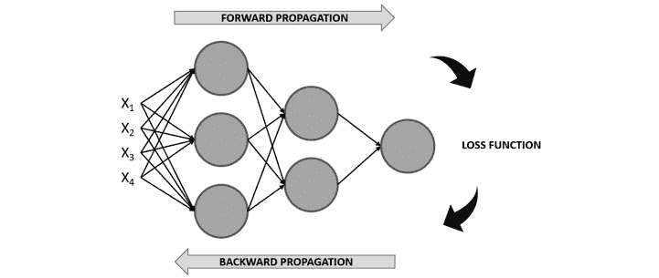
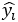

# 第二章：神经网络的基本构建模块

## 学习目标

通过本章结束时，您将能够：

+   识别神经网络的优缺点

+   区分神经网络解剖学中的不同组成部分

+   识别最流行的神经网络架构并了解它们主要用于什么

+   使用技术准备数据输入到神经网络中

+   使用简单的架构解决回归问题

+   通过解决高偏差或高方差来提高模型的性能

在本章中，我们将探讨神经网络的基本构建模块。我们将探索不同的架构来解决各种任务。最后，我们将学习如何使用 PyTorch 构建神经网络。

## 简介

尽管神经网络理论几十年前就已经发展，概念起源于感知机，但是近年来已经创建了不同的架构来解决不同的数据问题。这主要是由于现实数据问题中可以找到的不同数据格式，如文本、音频和图像。本章的目的是介绍神经网络的主题及其主要优缺点，以便更好地理解何时以及如何使用它们。接下来，本章将详细解释最流行的神经网络架构的构建模块：**人工神经网络**（**ANNs**）、**卷积神经网络**（**CNNs**）和**循环神经网络**（**RNNs**）。

随后，通过解决实际的回归问题来解释构建有效模型的过程。这包括准备输入到神经网络中的数据（也称为数据预处理）、定义要使用的神经网络架构，最后评估模型的性能，以确定如何改进以实现最佳解决方案。

前述过程将使用前一章学习的神经网络架构之一来完成，考虑到每个数据问题的解决方案应使用最适合该数据类型的架构。其他架构将在后续章节中用于解决涉及使用图像和文本序列作为输入数据的更复杂的数据问题。

#### 注意

作为提醒，包含本章中使用的所有代码的 GitHub 存储库可以在以下链接找到：[`github.com/TrainingByPackt/Applied-Deep-Learning-with-PyTorch`](https://github.com/TrainingByPackt/Applied-Deep-Learning-with-PyTorch )

## 简介神经网络

几十年前发展起来的神经网络需要从训练数据中学习，而不是按照一套规则编程来解决特定任务。学习过程可以遵循以下方法之一：

+   **监督学习**：这是学习的最简单形式，因为它包括一个带标签的数据集，神经网络需要找到解释特征与目标之间关系的模式。学习过程中的迭代旨在最小化预测值与真实值之间的差异。一个例子是基于叶子属性对植物进行分类。

+   **无监督学习**：与前述方法相比，无监督学习包括使用未标记数据（即没有目标值）训练模型。其目的是更好地理解输入数据，通常网络会接收输入数据，对其进行编码，然后从编码版本中重建内容，理想情况下保留相关信息。例如，给定一段文字，神经网络可以映射单词以输出实际关键的单词，这些单词可以用作描述段落的标签。

+   **强化学习**：这种方法论包括利用手头的数据进行学习，其主要目标是在长期内最大化奖励函数。因此，决策不是基于即时奖励，而是基于整个学习过程中的累积奖励，例如将资源分配给不同任务，以期减少减缓整体性能的瓶颈。

    #### 注

    从提到的学习方法中，最常用的是监督学习，这也是后续章节中主要使用的学习方法。这意味着大多数练习、活动和示例将使用带标签的数据集作为输入数据。

### 神经网络是什么？

简而言之，神经网络是一种机器学习算法，其模型建立在人脑解剖学基础上，利用数学方程从训练数据的观察中学习模式。

然而，要真正理解神经网络通常遵循的训练过程背后的逻辑，首先理解感知器的概念非常重要。

感知器在 20 世纪 50 年代由 Frank Rosenblatt 开发，是一种人工神经元，类似于人脑中的神经元，接收多个输入并产生二进制输出，成为后续神经元的输入。它们是神经网络的基本构建块（就像神经元是人脑的构建块一样）。


###### 图 2.1：感知器示意图

这里，X1、X2、X3 和 X4 表示感知器接收的不同输入，可能有任意数量的输入。灰色圆圈表示感知器，在这里处理输入以得出结果。

罗森布拉特还引入了权重（w1, w2, …, wn）的概念，这些是表达每个输入重要性的数字。输出可以是 0 或 1，这取决于输入的加权和是高于还是低于给定的阈值，可以作为感知器的参数设置，如下所示：


###### 图 2.2：感知器输出方程

### 练习 2：执行感知器的计算

下面的练习不需要任何编程；相反，它包含简单的计算，以帮助你理解感知器的概念。要执行这些计算，请考虑以下情景。

下周五你的城里有个音乐节，但你病了，正考虑是否去参加（其中 0 表示你会去，1 表示你不会去）。为了做出决定，你决定考虑三个因素：

+   天气会好吗？（X1）

+   你有人可以一起去吗？（X2）

+   你喜欢这里的音乐吗？（X3）

针对上述因素，如果问题的答案是是，则我们将使用 1，如果答案是否，则使用 0。另外，由于你病得很厉害，天气因素相关性很高，你决定给这个因素的权重是其他两个因素的两倍。因此，因素的权重为 4（w1）、2（w2）和 2（w3）。现在，考虑一个阈值为 5：

1.  下周五天气不好，但你有人可以一起去音乐节，并且喜欢那里的音乐：


###### 图 2.3：感知器的输出

考虑到输出低于阈值，最终结果将等于 1，意味着你不应该去音乐节，以避免病情加重的风险。

恭喜！你成功地执行了感知器的计算。

### 多层感知器

考虑到前述情况，多层网络的概念包括多个感知器（也称为节点或神经元）堆叠在一起的网络，如此处所示：


###### 图 2.4：多层感知器的图示

#### 注

神经网络中用于指代层次的符号如下：第一层也称为输入层，最后一层也称为输出层，中间的所有层称为隐藏层。

在这里，再次使用一组输入来训练模型，但不是将输入馈送到单个感知器，而是馈送到第一层中的所有感知器（神经元）。接下来，从该层获得的输出被用作下一层感知器的输入，依此类推，直到达到最终层，负责输出结果。

需要指出的是，感知器的第一层通过加权输入来处理简单的决策过程，而后续层可以根据前一层的输出处理更复杂和抽象的决策，因此深度神经网络（使用许多层的网络）在处理复杂数据问题时表现出色。

与传统的感知器不同，神经网络已经演变为能够在输出层具有一个或多个节点，以便将结果呈现为二进制或多类别。

### 神经网络的学习过程

一般来说，神经网络是多个神经元的连接，其中每个神经元计算一个线性函数以及一个激活函数，以便根据一些输入得出输出。此输出与权重相关联，代表其重要性水平，以供后续层次的计算使用。

此外，这些计算是在整个网络架构中进行的，达到最终输出。此输出用于确定网络性能与真实情况的比较，然后用于调整网络的不同参数，以重新开始计算过程。

考虑到这一点，神经网络的训练过程可以被视为一个迭代过程，通过网络的各层前进和后退，以达到一个最优结果，如下图所示，并将详细解释：



###### 图 2.5：神经网络学习过程的图示

**前向传播**

这是通过网络架构从左到右进行的过程，同时使用输入数据进行计算，以得出可以与真实情况进行比较的预测。这意味着网络中的每个神经元都会根据其关联的权重和偏置转换输入数据（初始数据或来自前一层的数据），并将输出发送到下一层，直到达到最终层并进行预测。

每个神经元中进行的计算包括一个线性函数，该函数将输入数据乘以一些权重再加上偏置，然后通过激活函数传递。激活函数的主要目的是打破模型的线性性，这在考虑到大多数使用神经网络解决的现实生活数据问题不是线性定义，而是由复杂函数定义时非常关键。相关公式可以在这里找到：


###### 图 2.6：每个神经元执行的计算

此处，如前所述，X 指输入数据，W 是确定输入数据重要性水平的权重，b 是偏置值，sigma（）表示应用于线性函数的激活函数。

激活函数的作用在于向模型引入非线性。现今常用的激活函数如下：

+   **Sigmoid**：它呈 S 形，基本上将值转换为介于 0 和 1 之间的简单概率，sigmoid 函数得到的大多数输出将接近 0 和 1 的极端值：


###### 图 2.7：Sigmoid 激活函数


###### 图 2.8：Sigmoid 激活函数的图形表示

+   **Softmax**：与 sigmoid 函数类似，它计算一个事件在 n 个事件中的概率分布，这意味着其输出不是二元的。简单来说，该函数计算输出属于目标类别之一的概率，相对于其他类别：


###### 图 2.9：Softmax 激活函数

考虑到其输出为概率，这种激活函数通常出现在分类网络的输出层中。

+   **Tanh**：该函数表示双曲正弦和双曲余弦之间的关系，其结果在 -1 到 1 之间。该激活函数的主要优势在于能更轻松地处理负值：


###### 图 2.10：tanh 激活函数。


###### 图 2.11：tanh 激活函数的图形表示

+   **修正线性单元函数（ReLU）**：基本上激活一个节点，条件是线性函数的输出大于 0，否则其输出将为 0。如果线性函数的输出大于 0，则该激活函数的结果将是其接收的原始数字：


###### 图 2.12：ReLU 激活函数

传统上，该激活函数用于所有隐藏层：


###### 图 2.13：ReLU 激活函数的图形表示

**损失函数的计算**

一旦前向传播完成，训练过程的下一步是通过比较预测结果与真实值来计算损失函数，以估计模型的误差。考虑到这一点，理想的值应为 0，这意味着两个值之间没有偏差。

这意味着在训练过程的每个迭代中，目标是通过改变参数（权重和偏置）来最小化损失函数，在前向传播期间执行计算。

再次强调，有多种损失函数可供选择。然而，用于回归和分类任务的最常用的损失函数在此有解释：

+   **均方误差（MSE）**：广泛用于衡量回归模型性能，MSE 函数计算实际值和预测值之间距离的平方和：


###### 图 2.14: 均方误差损失函数

这里，*n* 是样本数， 是实际值，而  是预测值。

+   **交叉熵/多类交叉熵**：这个函数通常用于二元或多类分类模型。它衡量两个概率分布之间的差异；一个较大的损失函数将代表较大的差异。因此，这里的目标是尽量减少损失函数：


###### 图 2.15: 交叉熵损失函数

再次强调，n 代表样本数。 和  分别是实际值和预测值。

**反向传播（反向传递）**

训练过程的最后一步是沿着网络架构从右到左计算损失函数对每一层权重和偏置的偏导数，以便更新这些参数（权重和偏置），以便在下一次迭代步骤中减少损失函数。

此外，优化算法的最终目标是找到损失函数达到可能的最小值的全局极小值，如下图所示：

#### 注意

提醒一下，局部极小值指的是函数定义域中的最小值。另一方面，全局极小值指的是整个函数定义域的最小值。


###### 图 2.16: 通过迭代步骤优化损失函数。二维空间。

这里，最左边的点（A）是损失函数的初始值，在任何优化之前。最右边最底部的点（B）是经过多次迭代步骤后损失函数被最小化的值。从一个点到另一个点的过程称为**步骤**。

然而，重要的是要提到，损失函数并不总是像前面的那样平滑，这可能在优化过程中引入达到局部极小值的风险。

这个过程也称为优化，有不同的算法以不同的方法达到相同的目标。接下来将解释最常用的优化算法。

**梯度下降**

梯度下降是数据科学家中最广泛使用的优化算法，也是许多其他优化算法的基础。在计算每个神经元的梯度后，权重和偏置会朝梯度的相反方向进行更新，更新步骤的大小由学习率控制（用于控制每次优化中的步骤大小），如下方程式所示。

在训练过程中，学习率至关重要，因为它可以防止权重和偏置的更新过度/不足，这可能会阻止模型达到收敛或延迟训练过程。

在梯度下降算法中，权重和偏置的优化如下所示：


###### 图 2.17：梯度下降算法中参数的优化

在这里，α 表示学习率，dw/db 表示给定神经元中权重或偏置的梯度。这两个值的乘积从权重或偏置的原始值中减去，以惩罚那些导致计算大损失函数的较高值。

对梯度下降算法的改进称为随机梯度下降，它基本上遵循相同的过程，但不同之处在于它以随机批次方式获取输入数据，而不是一次性获取整个数据块，这可以提高训练时间同时达到卓越的性能。此外，这种方法允许使用更大的数据集，因为通过使用数据集的小批次作为输入，我们不再受到计算资源的限制。

### 优势和劣势

下面是神经网络的优势和劣势的解释。

**优势**

过去几年中，神经网络因四个主要原因变得越来越受欢迎：

+   **数据**：神经网络以其利用大量数据的能力而广为人知，多亏了硬件和软件的进步，现在可以回忆和存储大量数据库。这使得神经网络在输入更多数据时展现出了其真正的潜力。

+   **复杂数据问题**：正如前面所述，神经网络非常适合解决其他机器学习算法无法解决的复杂数据问题。这主要是因为它们能够处理大规模数据集并揭示复杂的模式。

+   **计算能力**：技术的进步也提升了当今可用的计算能力，这对于训练使用数百万数据的神经网络模型至关重要。

+   **学术研究**：由于前述三点，关于这一主题的大量学术研究可在互联网上找到，这不仅促进了每天新研究的涌现，还有助于保持算法及硬件/软件需求的最新性。

**缺点**

只因为使用神经网络有很多优点，并不意味着每个数据问题都应该用这种方式解决。这是一个常见的错误。没有一种算法适用于所有数据问题，选择算法应该依赖于可用的资源以及数据问题本身。

尽管神经网络被认为能够胜任几乎所有的机器学习算法，但重要的是也要考虑它们的缺点，以权衡对数据问题最为重要的因素。

+   **黑盒子**：这是神经网络最常见的缺点之一。它基本上意味着神经网络如何以及为什么会得出特定的输出是未知的。例如，当神经网络错误地将一张猫的图片预测为狗时，无法知道错误的原因是什么。

+   **数据需求**：为了达到最佳结果，神经网络需要大量的数据，这既是优点也是缺点。神经网络需要比传统机器学习算法更多的数据，这可能是某些数据问题中选择它们与其他算法之间的主要原因。当任务是有监督学习时，即数据需要被标记，这一问题变得尤为突出。

+   **训练时间**：与前述的缺点相关联，对大量数据的需求也使得训练过程比传统机器学习算法更长，而在某些情况下这是不可选的。通过使用 GPU 可以缩短训练时间，因为 GPU 能加速计算过程。

+   **计算成本高昂**：再次强调，神经网络的训练过程是计算成本高昂的。虽然一个神经网络可能需要数周才能收敛，其他机器学习算法则可能只需几小时或几分钟即可完成训练。所需的计算资源取决于手头数据的量以及网络的复杂性；更深层次的神经网络需要更长的训练时间。

    #### 注意

    神经网络的架构种类繁多。本章将解释其中三种最常用的架构，并在后续章节中介绍它们的实际实现。然而，如果你希望了解其他架构，请访问[`www.asimovinstitute.org/neural-network-zoo/`](http://www.asimovinstitute.org/neural-network-zoo/)。

### 人工神经网络简介

**人工神经网络**（**ANNs**），也称为多层感知器，是多个感知器的集合，如前所述。这里重要的是提到，感知器之间的连接发生在层之间，其中一个层可以拥有任意多的感知器，并且它们都与前后层的所有其他感知器相连接。

网络可以有一个或多个层。具有超过四层的网络被认为是深度神经网络，并且通常用于解决复杂和抽象的数据问题。

ANN 通常由三个主要元素组成，在前面已经详细解释过，也可以在*图 2.18*中看到：

1.  **输入层**：这是网络的第一层，传统上位于网络图表的最左侧。它在执行任何计算之前接收输入数据，并完成第一组计算，在这里最通用的模式被揭示。

    对于监督学习问题，输入数据由特征和目标值的一对组成。网络的任务是揭示输入和输出之间的相关性或依赖关系。

1.  **隐藏层**：接下来，可以找到隐藏层。神经网络可以拥有尽可能多的隐藏层。层数越多，它可以处理的数据问题越复杂，但训练时间也会更长。也有一些神经网络架构完全不包含隐藏层，这在单层网络中是适用的情况。

    在每一层中，基于从前一层接收到的输入信息进行计算，输出一个预测结果，成为后续层的输入。

1.  **输出层**：这是网络的最后一层，位于网络图表的最右侧。它在所有神经元处理数据后接收数据，以生成和显示最终预测。

    输出层可以有一个或多个神经元。前者是指解决方案是二进制形式的模型，即 0 或 1 的形式。另一方面，后者包括输出实例属于每个可能类标签（目标）的概率，这意味着该层将具有与类标签数量相同的神经元。


###### 图 2.18：具有两个隐藏层的神经网络架构

### 卷积神经网络介绍

卷积神经网络（CNNs）主要用于计算机视觉领域，在这个领域，近几十年来，机器已经达到甚至超过人类能力的准确性水平，因此它们变得越来越受欢迎。

受人类大脑启发，CNN 搜索创建模型，利用不同组的神经元识别图像的不同方面。这些组应该能够相互通信，以便共同形成整体图像。

考虑到这一点，CNN 架构中的层分割它们的识别任务。第一层专注于简单的模式，网络末端的层使用这些信息揭示更复杂的模式。

例如，在识别图片中的人脸时，前几层专注于查找将一个特征与另一个分开的边缘。接下来的层强调人脸的某些特征，如鼻子。最后，最后几层使用这些信息将整个人脸拼合在一起。

通过使用滤波器或核心来激活一组神经元以在遇到特定特征时激活的想法，这是通过使用卷积神经网络结构的主要构建块之一来实现的。然而，它们并不是结构中唯一存在的元素，这就是为什么将提供对 CNN 的所有组成部分的简要解释：

#### 注

当使用 CNN 时可能听说过的填充和步幅的概念，将在本书的后续章节中进行解释。

1.  **卷积层**：在这些层中，图像（表示为像素矩阵）与滤波器之间进行卷积计算。这种计算产生特征图作为输出，最终作为下一层的输入。

    计算取图像矩阵的一个子部分，并执行值的乘法。然后，乘积的总和被设定为该图像部分的输出，如下图所示：

    

    ###### 图 2.19：图像与滤波器之间的卷积操作

    这里，左侧的矩阵是输入数据，中间的矩阵是滤波器，右侧的矩阵是计算的输出。可以在这里看到通过红框突出显示的值进行的计算：

    

    ###### 图 2.20：图像第一部分的卷积

    这种卷积乘法对图像的所有子部分进行。图 2.21 展示了相同示例的另一个卷积步骤：

    

    ###### 图 2.21：卷积操作的进一步步骤

    卷积层的一个重要概念是，它们是不变的，每个滤波器都有一个特定的功能，在训练过程中不会变化。例如，负责检测耳朵的滤波器在整个训练过程中只专注于这个功能。

    此外，卷积神经网络通常会有多个卷积层，每个层都会根据所使用的滤波器专注于识别图像的特定特征。此外，需要指出的是，在两个卷积层之间通常有一个池化层。

1.  **池化层**：尽管卷积层能够从图像中提取相关特征，但当分析复杂的几何形状时，其结果可能会变得庞大，这会使得训练过程在计算能力方面变得不可能。因此，池化层的发明就显得尤为重要。

    这些层不仅达到了减少卷积层输出的目标，而且实现了去除特征中存在的噪声，从而最终提高了模型的准确性。

    可应用两种主要类型的池化层，并且它们的理念在于检测在图像中表达出更强烈影响的区域，从而可以忽略其他区域：

    +   **最大池化**：此操作包括取矩阵中给定大小的子段，并将该子段中的最大数作为最大池化操作的输出。


###### 图 2.22：最大池化操作

在上述图中，通过使用 3x3 的最大池化滤波器，得到了右侧的结果。在这里，黄色区域（左上角）的最大值为 4，而橙色区域（右上角）的最大值为 5。

+   **平均池化**：类似地，平均池化操作会取矩阵的子段并输出符合规则的数字，这种情况下是该子段中所有数字的平均值。


###### 图 2.23：平均池化操作

在这里，使用 3x3 的滤波器，我们得到了黄色区域（左上角）所有数字的平均值为 8.6，而橙色区域（右上角）的平均值为 9.6。

1.  **全连接层**：最后，考虑到如果网络只能检测一组特征而无法将其分类到类别标签中，那么网络将毫无用处，因此在 CNN 的末端使用全连接层，将前一层（称为特征图）检测到的特征输出，并输出这些特征组属于类别标签的概率，这被用于进行最终预测。

    像人工神经网络一样，全连接层利用感知器根据给定的输入计算输出。此外，需要提到的是，卷积神经网络通常在架构末端有多个全连接层。

结合所有这些概念，可以得到卷积神经网络的传统结构，其中每种类型可以有任意多层，每个卷积层可以有任意多个滤波器（每个用于特定任务），池化层应具有相同数量的滤波器，如下图所示：


###### 图 2.24：卷积神经网络结构图

### 递归神经网络简介

前述神经网络的主要限制在于它们仅通过考虑当前事件（正在处理的输入）来学习，而不考虑先前或随后的事件，这在我们人类的思考方式中是不方便的。例如，在阅读一本书时，通过考虑上一段落或更多的上下文，你可以更好地理解每个句子。

因此，考虑到神经网络的优化过程通常由人类完成，设计能够考虑输入和输出序列的网络变得至关重要，因此递归神经网络（RNNs）应运而生。它们是一种强大的神经网络类型，通过使用内部记忆解决复杂的数据问题。

简而言之，这些网络包含了其中的循环，允许信息在其内存中保留更长时间，即使正在处理后续信息。这意味着 RNN 中的感知器不仅将输出传递给下一个感知器，还会向自身传递一些信息，这对于分析下一个信息片段是有用的。这种记忆保持能力使得它们在预测接下来会发生什么方面非常准确。

递归神经网络的学习过程，类似于其他网络，试图映射输入（x）和输出（y）之间的关系，不同之处在于这些模型还考虑了全部或部分先前输入的历史。

RNNs 允许处理数据序列，可以是输入序列、输出序列，甚至同时处理两者，如下图所示：


###### 图 2.25：递归神经网络处理的数据序列

在这里，每个框都是一个矩阵，箭头表示发生的函数。底部框是输入，顶部框是输出，中间框表示该点的 RNN 状态，保存了网络的记忆。

从左到右，以下是前述图表的解释：

1.  典型的模型不需要 RNN 解决。它具有固定的输入和固定的输出。例如，这可以是图像分类。

1.  这个模型接受一个输入并产生一系列的输出。例如，一个接收图像作为输入并输出图像标题的模型。

1.  与上述相反，这个模型接受一系列的输入并生成一个单一的输出。这种类型的架构可以在情感分析问题中看到，其中输入是要分析的句子，输出是句子背后的预测情感。

1.  最后两个模型接受一系列的输入并返回一系列的输出，不同之处在于第一个模型首先分析整个输入集，然后生成输出集。例如，在语言翻译中，需要先完全理解一种语言中的整个句子，然后再进行实际翻译。另一方面，第二个多对多模型同时分析输入并同时生成输出。例如，标记视频每一帧时。

## 数据准备

在收集数据之后，任何深度学习模型的开发的第一步，应该是数据的准备。这对于正确理解手头的数据并能够正确界定项目范围至关重要。

许多数据科学家未能这样做，导致模型性能不佳，甚至模型无用，因为它们根本不解决数据问题。

准备数据的过程可以分为三个主要任务：1）理解数据并处理任何潜在问题，2）重新缩放特征以确保不会由于错误引入偏差，以及 3）拆分数据以能够准确地衡量性能。所有这三个任务将在下一节中进一步解释。

#### 注意

所有先前解释的任务在应用任何机器学习算法时基本相同，因为它们涉及到预先准备数据所需的技术。

### 处理混乱数据

这项任务主要包括执行**探索性数据分析**（**EDA**）以理解可用的数据，并检测可能影响模型开发的潜在问题。

EDA 过程非常有用，因为它帮助开发人员发现对行动计划定义至关重要的信息。这些信息在这里解释：

1.  **数据量**：这既涉及实例的数量，也涉及特征的数量。前者对于确定是否有必要甚至可能使用神经网络或深度神经网络解决数据问题至关重要，考虑到这类模型需要大量数据才能达到高精度水平。而后者则有助于确定是否在开发之前采用某些特征选择方法，以减少特征数量、简化模型并消除任何冗余信息。

1.  **目标特征**：对于监督模型，数据需要被标记。考虑到这一点，选择目标特征（建立模型时希望达到的目标）非常重要，以评估特征是否存在许多缺失或异常值。此外，这有助于确定开发的目标，该目标应与可用数据保持一致。

1.  **噪声数据/异常值**：噪声数据指的是明显不正确的数值，例如年龄为 200 岁的人。另一方面，异常值指的是虽然可能是正确的数值，但离均值很远，例如 10 岁的大学生。

    检测异常值并没有确切的科学方法，但有些方法学是被普遍接受的。假设一个正态分布的数据集，其中最流行的方法之一是将任何偏离所有数值均值约 3-6 个标准偏差的值定义为异常值，无论是正方向还是负方向。

    识别异常值的一个同样有效的方法是选择处于 99 分位和 1 分位的数值。

    处理此类数值非常重要，特别是当它们代表特征数据的 5%以上时，因为不处理可能会引入模型偏差。处理这些数值的方法与任何其他机器学习算法一样，要么删除异常值，要么使用均值或回归插补技术赋予新值。

1.  **缺失值**：与前述情况类似，数据集中存在许多缺失值可能会引入模型偏差，考虑到不同模型会对这些值做出不同的假设。同样，当缺失值占特征值的 5%以上时，应通过删除或替换它们的方式进行处理，同样可以使用均值或回归插补技术。

1.  **定性特征**：最后，检查数据集是否包含定性数据也是一个关键步骤，因为移除或编码数据可能会导致更准确的模型。

    此外，在许多研究开发中，会在同一数据上测试多个算法，以确定哪一个表现更好，而其中一些算法不能容忍使用定性数据，因此转换或编码它们以能够将所有算法用同样的数据进行输入显得尤为重要。

### 练习 3：处理混乱数据

#### 注意

本章所有的练习将使用 UC Irvine 机器学习库中的`Appliances energy prediction Dataset`进行，可以通过以下 URL 下载，使用`Data Folder`超链接：[`archive.ics.uci.edu/ml/datasets/Appliances+energy+prediction`](https://archive.ics.uci.edu/ml/datasets/Appliances+energy+prediction)

在这个练习中，我们将使用 Python 的一个受欢迎的包来探索手头的数据，并学习如何检测缺失值、异常值和定性值：

#### 注意

对于本章中的练习和活动，您需要安装 Python 3.6、Jupyter、NumPy 和 Pandas（至少版本 0.21）。

1.  打开 Jupyter 笔记本以实施这个练习。

    打开您的 cmd 或终端，导航到所需路径，并使用以下命令打开 Jupyter 笔记本：`jupyter notebook`

1.  导入 pandas 库：

    ```py
    import pandas as pd
    ```

1.  使用 pandas 读取先前从 UC Irvine 机器学习库站点下载的包含数据集的 CSV 文件。

    然后，删除名为`date`的列，因为我们不打算在接下来的练习中考虑它。

    最后，打印 DataFrame 的头部：

    ```py
    data = pd.read_csv("energydata_complete.csv")
    data = data.drop(columns=["date"])
    data.head()
    ```

1.  检查数据集中的分类特征：

    ```py
    cols = data.columns
    num_cols = data._get_numeric_data().columns
    list(set(cols) - set(num_cols))
    ```

    结果列表为空，这表明没有分类特征需要处理。

1.  使用 Python 的`isnull()`和`sum()`函数来查找数据集每一列中是否有缺失值：

    ```py
    data.isnull().sum()
    ```

    此命令计算每列中的空值数量。对于正在使用的数据集，不应该有任何缺失值。

1.  使用三个标准差作为测量值，以检测数据集中所有特征的异常值：

    ```py
    outliers = {}
    for i in range(data.shape[1]):
        min_t = data[data.columns[i]].mean() – (3 *             data[data.columns[i[[.std())
        max_t = data[data.columns[i]].mean() + (3 *             data[data.columns[i[[.std())

        count = 0
        for j in data[data.columns[i]]:
            if j < min_t or j > max_t:
                count += 1

        percentage = count / data.shape[0]
        outliers[data.columns[i]] = "%.3f" % percentage
    ```

    结果字典显示了数据集中所有特征的列表，以及异常值的百分比。从这些结果可以得出结论，由于异常值比例低于 5%，因此无需处理。

恭喜！您已成功探索了数据集并处理了潜在问题。

### 数据重缩放

尽管数据不需要重新缩放以供算法训练，但这是提高模型准确性的重要步骤。基本上是因为每个特征具有不同的比例可能会导致模型认为某个特征比其他特征更重要，因为它具有更高的数值。

举例来说，考虑两个特征：一个测量一个人有几个孩子，另一个说明这个人的年龄。尽管年龄特征可能有更高的数值，但在推荐学校的研究中，孩子数量特征可能更重要。

考虑到这一点，如果所有特征被等比例缩放，模型实际上可以根据目标特征的重要性给予更高的权重，而不是它们具有的数值。此外，它还可以通过消除模型学习数据的不变性来加速训练过程。

数据科学家中有两种主要的重新缩放方法，虽然没有选择其中一种的规则，但重要的是要强调它们应该单独使用（一种或另一种）。

可以在这里找到这两种方法的简要说明：

+   **归一化**：这包括重新调整值，使得所有特征的所有值都在 0 到 1 之间，使用以下方程：


###### 图 2.26：数据归一化

+   **标准化**: 相反，这种缩放方法通过以下方程将所有值转换为均值为 0、标准差为 1。


###### 图 2.27: 数据标准化

### 练习 4: 数据重新缩放

在本练习中，我们将对上一个练习中的数据进行重新缩放：

#### 注意

使用与上一个练习中相同的 Jupyter 笔记本。

1.  将特征与目标分开。这样做是为了只对特征数据进行重新缩放：

    ```py
    X = data.iloc[:, 1:]
    Y = data.iloc[:, 0]
    ```

1.  使用归一化方法对特征数据进行重新缩放。显示结果 DataFrame 的前几行以验证结果:

    ```py
    X = (X - X.min()) / (X.max() - X.min())
    X.head()
    ```

恭喜！您已成功地对数据集进行了重新缩放。

### 数据分割

将数据集分为三个子集的目的是，使模型可以适当地进行训练、微调和测量，而不引入偏差。以下是每个集合的解释:

+   **训练集**: 如其名称所示，此集合被馈送到神经网络进行训练。对于监督学习来说，它包括特征和目标值。考虑到神经网络需要大量数据进行训练，因此这通常是三个集合中最大的集合。

+   **验证集（开发集）**: 主要用于衡量模型的性能，以便调整超参数以提高性能。这个微调过程是为了找到能够获得最佳结果的超参数配置。

    尽管模型没有在这些数据上进行训练，但它间接影响了这些数据，这就是为什么不应该在这些数据上进行最终的性能评估，因为它可能会产生偏差。

+   **测试集**: 这个集合对模型没有影响，因此用于对未见数据进行最终评估，这成为衡量模型在未来数据集上表现的指导。

没有关于将数据分成所提到的三个集合的完美比例的实际科学，考虑到每个数据问题都不同，并且开发深度学习解决方案通常需要试错方法。尽管如此，众所周知，较大的数据集（数十万和数百万个实例）的分割比例应为 98%/1%/1%，因为对于训练集来说，尽可能使用尽可能多的数据至关重要。对于较小的数据集，传统的分割比例是 60%/20%/20%。

### 练习 5: 分割数据集

在本练习中，我们将从上一个练习中的数据集中分割出三个子集。为了学习目的，我们将探索两种不同的方法。首先，将使用索引来分割数据集。接下来，将使用 scikit-learn 的`train_test_split()`函数来实现相同的目的，使用这两种方法都可以达到相同的结果:

#### 注意

使用与上一个练习中相同的 Jupyter 笔记本。

1.  打印数据集的形状，以确定要使用的拆分比例。

    ```py
    X.shape
    ```

    此操作的输出应为`(19735, 28)`。这意味着可以使用 60%/20%/20%的拆分比例用于训练、验证和测试集。

1.  获取用作训练集和验证集底限的值。这将用于使用索引拆分数据集：

    ```py
    train_end = int(len(X) * 0.6)
    dev_end = int(len(X) * 0.8)
    ```

1.  对数据集进行洗牌：

    ```py
    X_shuffle = X.sample(frac=1)
    Y_shuffle = Y.sample(frac=1)
    ```

1.  使用索引将洗牌后的数据集拆分为三个集合，分别用于特征和目标数据：

    ```py
    x_train = X_shuffle.iloc[:train_end,:]
    y_train = Y_shuffle.iloc[:train_end]
    x_dev = X_shuffle.iloc[train_end:dev_end,:]
    y_dev = Y_shuffle.iloc[train_end:dev_end]
    x_test = X_shuffle.iloc[dev_end:,:]
    y_test = Y_shuffle.iloc[dev_end:]
    ```

1.  打印所有三个集合的形状：

    ```py
    print(x_train.shape, y_train.shape)
    print(x_dev.shape, y_dev.shape)
    print(x_test.shape, y_test.shape)
    ```

    前面操作的结果应如下所示：

    ```py
    (11841, 27) (11841, )
    (3947, 27) (3947, )
    (3947, 27) (3947, )
    ```

1.  从 scikit-learn 的`model_selection`模块导入`train_test_split()`函数：

    ```py
    from sklearn.model_selection import train_test_split
    ```

1.  拆分洗牌后的数据集：

    ```py
    x_new, x_test_2, y_new, y_test_2 = train_test_split(X_shuffle, Y_shuffle, test_size=0.2, random_state=0)
    dev_per = x_test_2.shape[0]/x_new.shape[0]
    x_train_2, x_dev_2, y_train_2, y_dev_2 = train_test_split(x_new, y_new, test_size=dev_per, random_state=0)
    ```

    第一行代码执行初始拆分。该函数接受两个要拆分的数据集（X 和 Y）、`test_size`（测试集中包含的实例百分比）以及`random_state`（确保结果可重现）。该代码的结果是将每个数据集（X 和 Y）分为两个子集。

    为了创建一个额外的集合（验证集），我们将执行第二次拆分。前面代码的第二行负责确定用于第二次拆分的`test_size`，以便测试集和验证集具有相同的形状。

    最后，代码的最后一行执行第二次拆分，使用先前计算的值作为`test_size`。

1.  打印所有三个集合的形状：

    ```py
    print(x_train_2.shape, y_train_2.shape)
    print(x_dev_2.shape, y_dev_2.shape)
    print(x_test_2.shape, y_test_2.shape)
    ```

    前面操作的结果应如下所示：

    ```py
    (11841, 27) (11841, )
    (3947, 27) (3947, )
    (3947, 27) (3947, )
    ```

    可以看到，两种方法得到的结果集具有相同的形状。使用其中一种方法还是另一种方法是一种个人偏好。

恭喜！您已成功将数据集分割为三个子集。

### 活动 2：执行数据准备

对于接下来的活动，我们将准备一个包含多个属性的歌曲列表数据集，这些属性有助于确定歌曲发布的年份。这一数据准备步骤对本章节内后续活动至关重要。让我们看看以下场景。

您在音乐唱片公司工作，他们想要揭示区分不同时间段唱片的细节，因此他们已经整理了一个包含数据的数据集，该数据集包含了 515,345 条记录，发布年份从 1922 年到 2011 年不等。他们委托您准备数据集，以便输入神经网络使用。

#### 注意

要下载数据集，请访问以下 UC Irvine Machine Learning Repository 的网址：[`archive.ics.uci.edu/ml/datasets/YearPredictionMSD`](https://archive.ics.uci.edu/ml/datasets/YearPredictionMSD)

1.  导入所需的库。

1.  使用 pandas，加载文本文件。由于先前下载的文本文件与 CSV 文件的格式相同，因此可以使用`read_csv()`函数进行读取。确保将头部参数设置为`None`。

1.  验证数据集中是否存在任何定性数据。

1.  检查缺失值。

    如果您在先前用于此目的的代码行中添加额外的`sum()`函数，您将得到整个数据集中缺失值的总和，而不是按列区分。

1.  检查异常值。

1.  将特征与目标数据分开。

1.  使用标准化方法重新调整数据。

1.  将数据分成三组：训练集、验证集和测试集。使用您喜欢的方法。

    #### 注意

    正解可以在第 188 页找到。

## 构建深度神经网络

从一般角度来看，构建神经网络可以通过非常简单的方式实现，使用像 scikit-learn 这样的库（不适用于深度学习），它会为您完成所有数学运算，但灵活性不高；或者通过非常复杂的方式实现，从头编写训练过程的每一个步骤，或者使用更强大的框架，它可以在同一个地方允许两者的近似。如前所述，它有一个 nn 模块，专门用于使用顺序容器轻松预定义简单架构的实现，同时允许创建引入灵活性的自定义模块，以构建非常复杂的架构过程。

另一方面，PyTorch 是考虑了领域内许多开发者的输入构建的，具有允许在同一地方进行两者近似的优势。如前所述，它有一个 nn 模块，专门用于使用顺序容器轻松预定义简单架构的实现，同时允许创建引入灵活性的自定义模块，以构建非常复杂的架构过程。

在本节中，我们将进一步讨论使用顺序容器开发深度神经网络的使用，以揭开它们的复杂性。然而，在本书的后续章节中，我们将继续探讨更复杂和抽象的应用，这些应用也可以通过极少的努力实现。

正如前面提到的，顺序容器是一个模块，用于包含按顺序跟随的模块序列。它包含的每个模块都会对给定的输入应用一些计算，以得出结果。

可以在顺序容器内使用的一些最受欢迎的模块（层）以开发常规分类模型在这里进行解释：

#### 注意

用于其他类型架构（如卷积神经网络和循环神经网络）的模块将在接下来的章节中进行解释。

+   `True` 默认情况下）作为参数。

+   `False` 默认情况下。

    **Tanh**：将逐元素 tanh 函数应用于包含输入数据的张量。它不接受任何参数。

    **Sigmoid**：将之前解释过的 sigmoid 函数应用于包含输入数据的张量。它不接受任何参数。

    **Softmax**：将 softmax 函数应用于包含输入数据的 n 维张量。输出经过重新缩放，使得张量元素位于介于零到一之间的范围内，并且总和为一。它接受作为参数应计算 softmax 函数的维度。

+   `False` 默认情况下。这种技术通常用于处理过拟合模型，稍后将进一步解释。

+   **归一化层**：有不同的方法可以用来在顺序容器中添加归一化层。其中一些方法包括 BatchNorm1d、BatchNorm2d 和 BatchNorm3d。其背后的想法是对前一层的输出进行归一化，最终在较短的训练时间内达到类似的准确性水平。

### 练习 6：使用 PyTorch 构建深度神经网络

在这个练习中，我们将使用 PyTorch 库定义一个四层深度神经网络的架构，然后使用之前准备好的数据集进行训练：

#### 注：

使用与之前练习中使用的相同的 Jupyter 笔记本。

1.  从 PyTorch 库中导入所需的库，称为`torch`，以及来自 PyTorch 的`nn`模块：

    ```py
    import torch
    import torch.nn as nn
    ```

    #### 注：

    尽管不同的包和库根据实际学习目的在需要时被导入，但是始终将它们导入到代码的开头是一个良好的实践。

1.  从之前的练习中分离出特征列和目标列，对于每个创建的数据集。另外，将最终的数据框转换为张量：

    ```py
    x_train = torch.tensor(x_train.values).float()
    y_train = torch.tensor(y_train.values).float()
    x_dev = torch.tensor(x_dev.values).float()
    y_dev = torch.tensor(y_dev.values).float()
    x_test = torch.tensor(x_test.values).float()
    y_test = torch.tensor(y_test.values).float()
    ```

1.  使用`sequential()`容器定义网络架构。确保创建一个四层网络。

    对于前三层使用 ReLU 激活函数，并且考虑到我们处理的是回归问题，最后一层不使用激活函数。

    每层的单元数应为：100、50、25 和 1：

    ```py
    model = nn.Sequential(nn.Linear(x_train.shape[1], 100),
                          nn.ReLU(),
                          nn.Linear(100, 50),
                          nn.ReLU(),
                          nn.Linear(50, 25),
                          nn.ReLU(),
                          nn.Linear(25, 1))
    ```

1.  将损失函数定义为均方误差：

    ```py
    loss_function = torch.nn.MSELoss()
    ```

1.  将优化器算法定义为 Adam 优化器：

    ```py
    optimizer = torch.optim.Adam(model.parameters(), lr=0.01)
    ```

1.  使用`for`循环在训练数据上进行 100 次迭代步骤训练网络：

    ```py
    for i in range(100):
        y_pred = model(x_train)
        loss = loss_function(y_pred, y_train)
        print(i, loss.item())
        optimizer.zero_grad()
        loss.backward()
        optimizer.step()
    ```

1.  为了测试模型，对测试集的第一个实例进行预测，并将其与基准值（目标值）进行比较：

    ```py
    pred = model(x_test[0])
    print(y_test[0], pred)
    ```

    从这个结果可以看出，模型表现不佳，因为目标值与预测值差异很大。在本书的后续部分，您将学习如何提高模型的性能。

祝贺！您已成功创建并训练了一个深度神经网络，以解决回归问题。

### 活动 3：为回归问题开发深度学习解决方案

在下一个活动中，我们将创建并训练一个四层隐藏层神经网络，以解决之前活动中提到的回归问题。让我们看一下以下的场景：

您继续在音乐唱片公司工作，看到您在准备数据集方面做得很出色后，他们信任您来定义网络的架构和代码，并使用准备好的数据集进行训练：

#### 注：

使用与之前活动中使用的相同的 Jupyter 笔记本。

1.  导入所需的库。

1.  从之前活动中分离特征和目标，针对所有三组数据。将数据框转换为张量。

1.  定义网络的架构。可以尝试不同的层数和每层的单元数组合。

1.  定义损失函数和优化算法。

1.  使用`for`循环训练网络进行 100 次迭代。

1.  通过在测试集的第一个实例上进行预测并将其与真实值进行比较来测试您的模型。

您的输出应该与以下类似：


###### 图 2.28：活动的输出

#### 注意

这项活动的解决方案可以在第 190 页找到。

## 概要

几十年前，由 Frank Rosenblatt 开发的理论孕育了神经网络。它始于感知器的定义，这是一个受人类神经元启发的单元，它接收数据作为输入并对其进行转换。它包括为输入数据分配权重以进行计算，以便最终结果要么是一种结果，要么是另一种，取决于结果。

神经网络最广为人知的形式是由一系列感知器组成的，这些感知器堆叠在一起形成层，其中一列感知器（层）的输出是下一列的输入。

根据这一点，解释了神经网络的典型学习过程。在这个主题上，有三个主要过程需要考虑：前向传播、损失函数的计算和反向传播。

这个过程的最终目标是通过更新伴随着神经网络每个输入值的权重和偏差来最小化损失函数。这通过一个迭代过程实现，可能需要几分钟、几小时，甚至几周，具体取决于数据问题的性质。

三种类型的神经网络的主要架构也进行了讨论：人工神经网络、卷积神经网络和循环神经网络。第一种用于解决传统分类问题，第二种因其解决计算机视觉问题（图像分类）的能力而广受欢迎，而最后一种能够处理序列数据，对于诸如语言翻译之类的任务非常有用。
