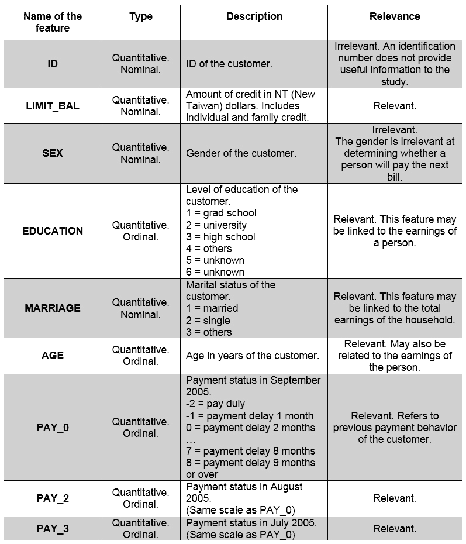
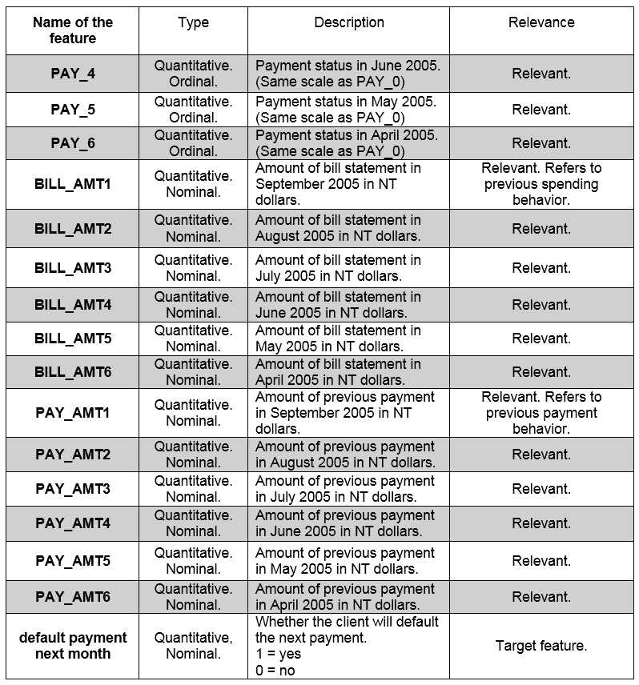
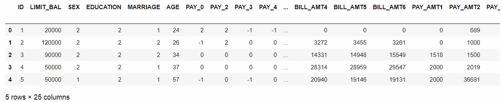
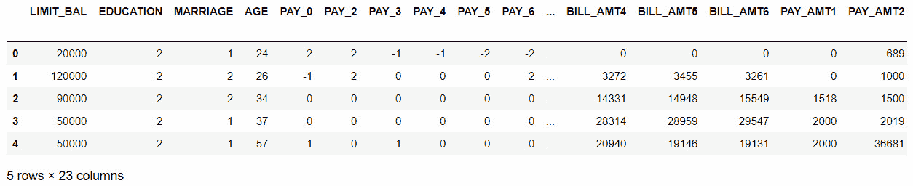
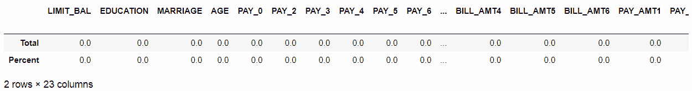
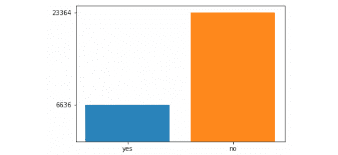
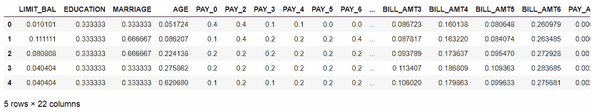
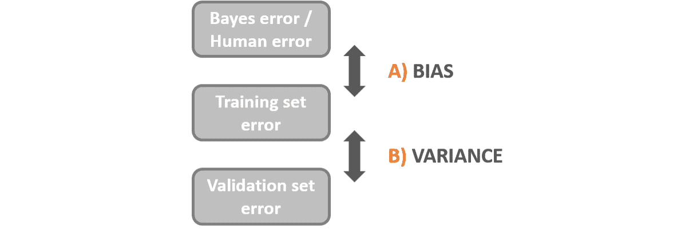

# 第三章：使用 DNN 解决分类问题

## 学习目标

在本章结束时，您将能够：

+   解释深度学习在银行业的应用

+   区分为回归任务和分类任务构建神经网络

+   应用 PyTorch 中的自定义模块概念来解决问题

+   使用深度神经网络解决分类问题

+   处理欠拟合或过拟合的模型

+   部署 PyTorch 模型

在本章中，我们将专注于使用 DNN 解决简单的分类任务，以巩固我们对深度神经网络的知识。

## 引言

虽然深度神经网络（DNNs）可以用来解决回归问题，正如前一章所见，但它们更常用于解决分类任务，目标是从一系列选项中预测结果。

利用这些模型的一个领域是银行业。这主要是由于他们需要基于人口统计数据预测未来行为，以及确保长期盈利的主要目标。在银行业的一些应用包括评估贷款申请、信用卡批准、预测股市价格和通过分析行为检测欺诈。

本章将专注于使用深度人工神经网络解决银行业的分类问题，遵循到达有效模型所需的所有步骤：数据探索、数据准备、架构定义和模型训练、模型微调、错误分析，最后是最终模型的部署。

#### 注意

提醒一下，在本章中使用的所有代码的 GitHub 仓库可以在以下网址找到：[`github.com/TrainingByPackt/Applied-Deep-Learning-with-PyTorch`](https://github.com/TrainingByPackt/Applied-Deep-Learning-with-PyTorch)。

## 问题定义

定义问题和构建模型或提高准确性同等重要。为什么呢？因为即使您可能使用了最强大的算法，并使用了最先进的方法来改进其结果，如果您解决了错误的问题或使用了错误的数据，这一切可能都是无用的。

此外，学会深入思考理解什么可以做和不能做，以及如何完成可以做的事情至关重要。特别是考虑到当我们学习应用机器学习或深度学习算法时，问题总是清楚呈现的，除了模型训练和性能改进外，不需要进一步的分析；另一方面，在现实生活中，问题通常令人困惑，数据也常常混乱。

因此，在本节中，您将学习如何根据组织需求和手头数据的最佳实践来定义问题。

为此，需要完成以下事项：

+   理解问题的“什么”、“为什么”和“如何”。

+   分析手头的数据以确定我们模型的一些关键参数，例如要执行的学习任务类型、必要的准备工作和性能指标的定义。

+   进行数据准备以减少向模型引入偏见的概率。

### 银行业中的深度学习

类似于健康领域，银行和金融机构每天都处理大量信息，这些信息需要做出关键决策，这些决策不仅影响到他们自己组织的未来，还影响到信任他们的数百万个人的未来。

每一秒都在做出这些决策，在 1990 年代，银行业人士过去依赖于基本上利用人类专家知识来编码基于规则的程序的专家系统。毫不奇怪，这些程序表现不佳，因为它们要求所有信息或可能的情景在前期都进行编程，这使得它们对处理不确定性和高度变化的市场效率低下。

随着技术的进步以及获取客户数据的能力的提高，银行业已经引领了向更专业的系统过渡，这些系统利用统计模型来帮助做出此类决策。此外，由于银行需要同时考虑自身的盈利能力和客户的盈利能力，它们被认为是那些不断跟上技术进步以日益提高效率和准确性的行业之一。

如今，与医疗市场一样，银行和金融行业正在推动神经网络市场。这主要是因为神经网络能够利用大量先前数据来预测未来行为中的不确定性。这是人类专家知识基础系统无法实现的，考虑到人类大脑无法分析如此大量的数据。

以下简要介绍了银行和金融服务领域中使用深度学习的一些领域：

+   **贷款申请评估**：银行根据不同因素向客户发放贷款，包括人口统计信息、信用历史等。他们在此过程中的主要目标是最小化客户违约贷款的数量（最小化失败率），从而最大化通过发放贷款获得的回报。

    神经网络被用来帮助决定是否批准贷款。通常使用以前未能按时还款的贷款申请人以及按时还款的贷款申请人的数据来训练它们。一旦建立了模型，想法就是将新申请人的数据输入到模型中，以便预测他们是否会还款，考虑到模型的重点是减少误判（即模型预测会违约贷款的客户，但实际上他们没有）。

    行业已知神经网络的失败率低于依赖人类专业知识的传统方法。

+   **欺诈检测**: 对于银行和金融服务提供商来说，欺诈检测至关重要，现在比以往任何时候都更加重要，考虑到技术的进步，尽管使我们的生活更轻松，但也使我们在网上银行平台上面临更大的财务风险。

    在这个领域使用神经网络，具体来说是卷积神经网络（CNN），用于字符和图像识别，以检测图像中隐藏的抽象模式，以确定用户是否被替代。

+   `.xls` 文件。

### 探索数据集

在接下来的章节中，我们将专注于使用**信用卡客户违约**（**DCCC**）数据集解决与信用卡付款相关的分类任务，该数据集已经从 UC Irvine Repository 网站上下载。

本节的主要目的是清楚地说明数据问题的什么、为什么和如何，这将有助于确定研究目的和评估指标。此外，在本节中，我们将详细分析手头的数据，以便识别准备数据时需要的一些步骤（例如，将定性特征转换为它们的数值表示）。

首先，让我们定义什么、为什么和如何。考虑到这一点，应该确保识别组织的真实需求：

**什么**: 构建一个能够确定客户是否会在即将到期的付款中违约的模型。

**为什么**: 能够预见下个月将收到的付款金额（以货币形式）。这将帮助公司确定该月的支出策略，此外还允许他们为每个客户定义应采取的行动，既确保那些将支付账单的客户未来的付款，又提高那些将违约客户的支付概率。

**如何**: 使用包含客户人口统计信息、信用历史和之前账单声明的历史数据来训练模型。在对输入数据进行训练后，该模型应能够确定客户是否有可能在下一个付款中违约。

考虑到这一点，似乎目标特征应该是一个说明客户是否会违约下一个付款的特征，这意味着学习任务是一个分类任务，因此损失函数应该能够测量这种类型学习的差异（例如，交叉熵函数，如前一章所述）。

一旦问题定义清楚，就需要确定最终模型的优先级。这意味着确定所有输出类是否同等重要。例如，一个测量肺部肿块是否恶性的模型应主要集中在最小化`假阴性`（模型预测为没有恶性肿块的患者，但实际上是恶性的肿块）。另一方面，一个用于识别手写字符的模型不应专注于一个特定字符，而应最大化在识别所有字符方面的性能。

考虑到这一点，以及为什么声明中的解释，`信用卡客户违约`数据集的模型优先级应该是最大化模型的整体性能，而不优先考虑任何类标签。这主要是因为为什么声明宣称，研究的主要目的应该更好地了解银行将收到的款项，并对可能违约付款的客户执行某些操作，以及对不会违约的客户执行不同的操作。

根据此，本案例研究中要使用的性能指标是**准确度**，其侧重点是最大化**正确分类的实例**。这指的是任何类标签的正确分类实例与总实例数之间的比率。

下表包含数据集中每个特征的简要解释，这可以帮助确定它们对研究目的的相关性，并确定需要执行的一些准备任务。



###### 图 3.1：来自 DCCC 数据集的特征描述



###### 图 3.2：来自 DCCC 数据集的特征描述，继续

综合考虑这些信息，可以得出结论，在 25 个特征（包括目标特征）中，有 2 个需要从数据集中移除，因为它们被认为与研究目的无关。请记住，对于本研究无关的特征可能在其他研究中是相关的。例如，关于私密卫生产品的研究可能认为性别特征是相关的。

此外，所有特征都是定量的，这意味着除了重新缩放它们之外，无需转换它们的值。目标特征也已转换为其数值表示，其中下次付款违约的客户表示为 1，而未违约的付款客户表示为 0。

### 数据准备

虽然在这方面有一些良好的实践，但在准备数据集以开发深度学习解决方案时，没有固定的步骤集，大多数情况下，需要采取的步骤将取决于手头的数据、要使用的算法以及研究的其他特性。

尽管如此，在开始训练模型之前，有一些必须遵循的关键方面作为良好的实践。其中大部分您已经从前一章中了解到，将针对所讨论的数据集进行修订，另外还要对目标特征的类别不平衡进行修订：

#### 注意

在本节中将处理准备 DCCC 数据集的过程，并附上简要说明。随时打开 Jupyter 笔记本，复制这个过程，考虑到这将是后续活动的起点。

+   使用`skiprows`参数移除 Excel 文件的第一行，该行不相关，因为它包含第二组标题。

    根据给定的代码行，得出以下结果：



###### 图 3.3：DCCC 数据集的头部

数据集的形状是 30,000 行和 25 列，可以使用以下代码行获取：  

```py
print("rows:",data.shape[0]," columns:", data.shape[1])
```

+   **删除不相关的特征**：通过对每个特征的分析，确定了两个特征与研究目的无关，因此应将其从数据集中移除。

    ```py
    data_clean = data.drop(columns=["ID", "SEX"])
    data_clean.head()
    ```

    最终的数据集应包含 23 列，而不是原来的 25 列：



###### 图 3.4：删除不相关特征后的 DCCC 数据集的头部

+   **检查缺失值**：接下来是检查数据集是否存在缺失值，并计算它们在每个特征中所占的百分比，可以使用以下代码行完成：

    ```py
    total = data_clean.isnull().sum()
    percent = (data_clean.isnull().sum()/
                     data_clean.isnull().count()*100)
    pd.concat([total, percent], axis=1, 
    keys=['Total', 'Percent']).transpose()
    ```

    第一行对数据集的每个特征的缺失值进行求和。接下来，计算每个特征中缺失值在所有值中的参与度。最后，将之前计算的两个值连接起来，以表格形式显示结果。结果显示在*图 3.5*中：

。



###### 图 3.5：DCCC 数据集中缺失值的计数

从这些结果可以看出，数据集中没有缺失任何值，因此在这里不需要进一步的步骤。

+   `BILL_AMT1` 和 `BILL_AMT4`，每个占总实例的 2.3%。

    这意味着考虑到它们的参与度太低，并且不太可能对最终模型产生影响，因此不需要进一步操作。

    **检查类别不平衡**：当目标特征中的类标签表示不均匀时，就会发生类别不平衡；例如，一个包含 90%未来未违约客户与 10%违约客户的数据集被认为是不平衡的。

    处理类别不平衡的几种方法，其中一些在这里解释：

    **收集更多数据**：尽管这并非总是可行的途径，但可能有助于平衡类别，或者允许删除过度表示类别而不严重减少数据集。

    **更改性能指标**：某些指标，如准确性，不适合用于衡量不平衡数据集的性能。因此，建议使用精确度或召回率等指标来衡量分类问题的性能。

    **对数据集进行重新采样**：这包括改变数据集以平衡各类别。可以通过两种不同的方式实现：1）添加欠表示类别的副本（称为过采样），或者，2）删除过度表示类别的实例（称为欠采样）。

    可以通过简单地计算目标特征中每个类别的出现次数来检测类别不平衡，如下所示：

    ```py
    target = data_clean["default payment next month"]
    yes = target[target == 1].count()
    no = target[target == 0].count()
    print("yes %: " + str(yes/len(target)*100) + " - no %: " + str(no/len(target)*100))
    ```

    从前述代码中可以得出结论，违约支付客户的数量占数据集的 22.12%。这些结果也可以使用以下代码行显示在图中：

    ```py
    import matplotlib.pyplot as plt
    fig, ax = plt.subplots()
    plt.bar("yes", yes)
    plt.bar("no", no)
    ax.set_yticks([yes,no])
    plt.show()
    ```

    这导致以下图表：



###### 图 3.6：目标特征的类别计数

为了解决这个问题，并考虑到没有更多数据可以添加，并且性能指标实际上是准确性，需要进行数据重新采样。

以下是执行数据集过采样的代码片段，随机创建欠表示类别的重复行：

```py
data_yes = data_clean[data_clean["default payment next month"]                       == 1]
data_no = data_clean[data_clean["default payment next month"]                      == 0]
over_sampling = data_yes.sample(no, replace=True, random_state                                 = 0)
data_resampled = pd.concat([data_no, over_sampling], axis=0)
```

首先，我们将每个类标签的数据分别放入独立的 DataFrame 中。接下来，我们使用 pandas 的`sample()`函数构建一个包含与过度表示的类别 DataFrame 相同数量的重复实例的新 DataFrame。

最后，使用`concat()`函数将过度表示类别的 DataFrame 和相同大小的新 DataFrame 连接起来。

通过计算整个数据集中每个类别的参与度，结果应显示出均衡的类别。此外，到目前为止数据集的最终形状应为（46728，23）。

+   **从目标中分离特征**：我们将数据集分割成特征矩阵和目标矩阵，以避免重新调整目标值：

    ```py
    X = data_clean.drop(columns=["default payment next month"])
    y = data_clean["default payment next month"] 
    ```

+   **重新调整数据**：最后，我们重新调整特征矩阵的值，以避免向模型引入偏差：

    ```py
    X = (X - X.min())/(X.max() - X.min())
    X.head()
    ```

    前面几行代码的结果显示在*图 3.7*中：



###### 图 3.7：归一化后的特征矩阵

#### 注意事项

注意，**婚姻**和**教育**都是序数特征，意味着它们遵循一定的顺序或层次；在选择重新缩放方法时，请确保保持顺序。

为了方便后续活动使用准备好的数据集，特征（`X`）和目标（`y`）矩阵将连接成一个 pandas DataFrame，并保存到 CSV 文件中，使用以下代码：

```py
final_data = pd.concat([X, y], axis=1)
final_data.to_csv("dccc_prepared.csv", index=False)
```

完成所有这些步骤后，DCCC 数据集已准备就绪（保存在新的 CSV 文件中），以用于训练模型，这将在接下来的章节中进行解释。

### 模型构建

一旦问题被定义，并且探索和准备手头的数据，就是定义模型的时候了。在进行先前分析之后，应处理网络架构、层类型、损失函数等的定义。这主要是因为在机器学习中没有“一刀切”的方法，尤其在深度学习中更是如此。

与分类任务不同，回归任务需要不同的方法，聚类、计算机视觉或机器翻译也是如此。因此，在接下来的章节中，您将找到解决分类任务的模型构建的关键特征，以及如何得到“好”的架构以及如何何时使用 PyTorch 中的自定义模块的解释。

### 用于分类任务的人工神经网络（ANN）

如前一章中的活动所示，用于回归任务的神经网络使用输出作为连续值，这就是为什么输出函数没有激活函数，只有一个输出节点（实际值）的原因，例如基于房屋特征和社区特征来预测房价的模型。

考虑到这一点，性能的测量应通过计算地面真实值与预测值之间的差异来完成，就像计算 125.3（预测值）与 126.38（地面真实值）之间的距离一样。如前所述，有许多方法可以衡量这种差异，其中**均方误差**（**MSE**）或其变体**均方根误差**（**RMSE**）是最常用的度量标准。

相反，分类任务的输出是某组输入特征属于每个输出标签或类别的概率，这是通过使用 Sigmoid（用于二分类）或 Softmax（用于多类分类）激活函数来完成的。此外，对于二分类任务，输出层应包含一个（用于 Sigmoid）或两个（用于 Softmax）输出节点，而对于多类分类任务，输出节点应等于类标签的数量。

能够计算属于每个输出类的可能性的这种能力，再加上`argmax`函数，将检索具有更高概率的类作为最终预测。

#### 注

在 Python 中，`argmax`是一个函数，能够返回沿着轴的最大值的索引。

考虑到这一点，模型的性能应该是实例是否已被分类到正确的类别标签的问题，而不是与测量两个值之间的距离有关的任何事情，因此训练神经网络用于分类问题的使用不同的损失函数（交叉熵是最常用的），以及使用不同的性能指标，如准确率、精确率和召回率。

### 一个良好的架构

首先，正如本书中所解释的那样，重要的是理解手头的数据问题，以确定神经网络的一般拓扑结构。再次强调，普通的分类问题不需要与计算机视觉问题相同的网络架构。

一旦定义了这一点，并考虑到在确定隐藏层数量、其类型或每个层中单元数量方面没有正确答案，最好的方法是从一个初始架构开始，然后可以改进以增加性能。

为什么这么重要？因为有大量参数需要调整时，有时很难承诺并开始。这是不幸的，因为在训练神经网络时，有几种方法可以确定一旦训练和测试了初始架构后需要改进的内容。实际上，将数据集分成三个子集的整个目的是允许用一个集合训练数据集，用另一个集合测量和微调模型，并最终用一个之前未使用过的最终子集测量最终模型的性能。

考虑到所有这些，将解释以下一套惯例和经验法则，以帮助决策过程，定义人工神经网络的初始架构：

+   **输入层**：这很简单 - 只有一个输入层，其单元数取决于训练数据的形状。具体来说，输入层中的单元数应该等于输入数据包含的特征数。

+   **隐藏层**：隐藏层的数量可以不同。人工神经网络可以有一个、多个或者没有隐藏层。要选择合适的数量，重要的是考虑以下几点：

    数据问题越简单，需要的隐藏层就越少。请记住，可以线性可分的数据问题应该只有一个隐藏层。另一方面，随着深度学习的进步，现在可以使用许多隐藏层（没有限制）来解决非常复杂的数据问题。

    要开始的隐藏单元数应该在输入层单元数和输出层单元数之间。

+   **输出层**：同样，任何人工神经网络只有一个输出层。它包含的单元数取决于要开发的学习任务以及数据问题。如前所述，对于回归任务，只会有一个单元，即预测值。另一方面，对于分类问题，单元数应等于可用的类标签数，考虑到模型的输出应该是一组特征属于每个类标签的概率。

+   **其他参数**：传统上，应该将其他参数保留为网络的第一个配置的默认值。这主要是因为在考虑可能表现同样良好或更差但需要更多资源的更复杂近似方法之前，测试数据问题上最简单的模型是一种良好的实践。

一旦定义了初始架构，就是训练和评估模型性能的时候了，以便进行进一步的分析，这很可能会导致网络架构或其他参数值的更改，例如学习率的更改或添加正则化项。

### PyTorch 自定义模块

PyTorch 的开发团队创建了自定义模块，以允许用户更进一步地灵活性。与前几章探讨的 `Sequential` 容器相反，只要希望构建更复杂的模型架构或者希望在每一层的计算中具有更多控制权，就应该使用自定义模块。

尽管如此，这并不意味着自定义模块方法只能在这种情况下使用。相反，一旦学会同时使用两种方法，选择在较不复杂的架构中使用哪种方法就成为一种偏好问题。

例如，以下代码片段展示了使用 `Sequential` 容器定义的两层神经网络：

```py
import torch.nn as nn
model = nn.Sequential(nn.Linear(D_i, D_h),
                      nn.ReLU(),
                      nn.Linear(D_h, D_o),
                      nn.Softmax())
```

这里，`D_i` 指的是输入维度（输入数据中的特征），`D_h` 指的是隐藏层的节点数（隐藏维度），`D_o` 指的是输出维度。

使用自定义模块，可以构建一个等效的网络架构，如下所示：

```py
import torch
from torch import nn, optim
import torch.nn.functional as F
class Classifier(nn.Module):
    def __init__(self, input_size):
        super().__init__()
        self.hidden_1 = nn.Linear(input_size, 100)
        self.hidden_2 = nn.Linear(100, 100)
        self.hidden_3 = nn.Linear(100, 50)
        self.hidden_4 = nn.Linear(50,50)
        self.output = nn.Linear(50, 2)

        self.dropout = nn.Dropout(p=0.1)
        #self.dropout_2 = nn.Dropout(p=0.1)

    def forward(self, x):
        z = self.dropout(F.relu(self.hidden_1(x)))
        z = self.dropout(F.relu(self.hidden_2(z)))
        z = self.dropout(F.relu(self.hidden_3(z)))
        z = self.dropout(F.relu(self.hidden_4(z)))
        out = F.log_softmax(self.output(z), dim=1)

        return out
```

需要提及的是，交叉熵损失函数要求网络输出是原始的（在通过 softmax 激活函数获得概率之前），这就是为什么在没有激活函数的情况下找到用于分类问题的神经网络架构是常见的。此外，在采用这种方法后，为了得到预测结果，需要在训练后将 softmax 激活函数应用于网络输出。

处理此限制的另一种方法是在输出层使用`log_softmax`激活函数。接下来，损失函数被定义为负对数似然损失(`nn.NLLLoss`)。最后，可以通过从网络输出中取指数来获取属于每个类标签的实际概率。这是本章活动中将要使用的方法。

一旦模型架构被定义，接下来的步骤将是编写负责在训练数据上训练模型并测量其在训练和验证集上性能的部分代码。

这里，将给出按步骤编码我们讨论过的内容的说明：

```py
model = Classifier()
criterion = nn.NLLLoss()
optimizer = optim.Adam(model.parameters(), lr=0.005)
epochs = 10
batch_size = 100
```

如可见，第一步是定义在网络训练期间将使用的所有变量。

#### 注意

提醒一下，“`epochs`”指的是整个数据集通过网络结构前后传递的次数。“`batch_size`”是单个批次（数据集的一个片段）中的训练样本数。最后，“iterations”指的是完成一个 epoch 所需的批次数。

接下来，首先使用一个`for`循环遍历之前定义的 epoch 次数。随后，使用一个新的`for`循环遍历总数据集的每个批次，直到一个 epoch 完成。在这个循环内，发生以下计算：

1.  模型在训练集的一个批次上进行训练。这里得到一个预测。

1.  通过比较上一步的预测和训练集（地面真实）的标签来计算损失。

1.  梯度被归零，并且针对当前步骤再次计算。

1.  根据梯度更新网络的参数。

1.  在训练数据上计算模型的准确率如下：

    +   获取模型预测的指数，以获得给定数据属于每个类标签的概率。

    +   使用`topk()`方法获取具有较高概率的类标签。

    +   使用 scikit-learn 的指标部分计算准确率、精确率或召回率。您还可以探索其他性能指标。

1.  关闭梯度计算，以验证当前模型在验证数据上的表现，具体操作如下：

    +   模型对验证集中的数据进行预测。

    +   通过比较前一个预测和验证集标签来计算损失函数。

    +   要计算模型在验证集上的准确率，使用与在训练数据上进行相同计算的步骤：

        ```py
        train_losses, dev_losses, train_acc, dev_acc= [], [], [], []
        for e in range(epochs):
            X, y = shuffle(X_train, y_train)
            running_loss = 0
            running_acc = 0
            iterations = 0
            for i in range(0, len(X), batch_size):
                iterations += 1
                b = i + batch_size
                X_batch = torch.tensor(X.iloc[i:b,:].values).float()
                y_batch = torch.tensor(y.iloc[i:b].values)
                pred = model(X_batch)
                loss = criterion(pred, y_batch)
                optimizer.zero_grad()
                loss.backward()
                optimizer.step()
                running_loss += loss.item()
                ps = torch.exp(pred)
                top_p, top_class = ps.topk(1, dim=1)
                running_acc += accuracy_score(y_batch, top_class)
            dev_loss = 0
            acc = 0
            with torch.no_grad():
                pred_dev = model(X_dev_torch)
                dev_loss = criterion(pred_dev, y_dev_torch)
                ps_dev = torch.exp(pred_dev)
                top_p, top_class_dev = ps_dev.topk(1, dim=1)
                acc = accuracy_score(y_dev_torch, top_class_dev)
            train_losses.append(running_loss/iterations)
            dev_losses.append(dev_loss)
            train_acc.append(running_acc/iterations)
            dev_acc.append(acc)
            print("Epoch: {}/{}.. ".format(e+1, epochs),
                  "Training Loss: {:.3f}.. ".format(running_loss/iterations),
                  "Validation Loss: {:.3f}.. ".format(dev_loss),
                  "Training Accuracy: {:.3f}.. ".format(running_acc/iterations),
                  "Validation Accuracy: {:.3f}".format(acc))
        ```

上述代码片段将打印出训练集和验证集数据的损失和准确率。

### 活动 4：构建人工神经网络

为了此活动，使用先前准备好的数据集，我们将构建一个能够确定客户是否会违约下一个付款的四层模型。为此，我们将使用自定义模块的方法。

让我们看看以下场景：您在一家专门为全球各地的银行提供机器/深度学习解决方案的数据科学精品公司工作。他们最近接受了一个银行的项目，希望预测下个月不会收到的付款。探索性数据分析团队已经为您准备好了数据集，并要求您构建模型并计算模型的准确性：

1.  导入以下库。

    ```py
    import pandas as pd
    import numpy as np
    from sklearn.model_selection import train_test_split
    from sklearn.utils import shuffle
    from sklearn.metrics import accuracy_score
    import torch
    from torch import nn, optim
    import torch.nn.functional as F
    import matplotlib.pyplot as plt
    ```

    #### 注意

    即使使用了种子，由于每个 epoch 之前训练集都会被洗牌，因此这些活动的确切结果也无法再现。

1.  读取先前准备好的数据集，该数据集应命名为`dccc_prepared.csv`。

1.  将特征和目标分开。

1.  使用 scikit-learn 的`train_test_split`函数，将数据集分割为训练集、验证集和测试集。使用 60/20/20%的分割比例。将`random_state`设置为 0。

1.  将验证集和测试集转换为张量，考虑到特征矩阵应为 float 类型，而目标矩阵则不应为 float 类型。目前保持训练集未转换，因为它们将经历进一步的转换。

1.  构建一个自定义模块类来定义网络的各层。包括一个 forward 函数，指定将应用于每个层输出的激活函数。在所有层中使用 ReLU，除了输出层，其中应使用`log_softmax`。

1.  定义训练模型所需的所有变量。将 epoch 数设置为 50，批量大小设置为 128。使用学习率 0.001。

1.  使用训练集数据训练网络。使用验证集来衡量性能。因此，在每个 epoch 中保存训练集和验证集的损失和准确性。

    #### 注意

    训练过程可能需要几分钟，具体取决于您的资源。添加打印语句是查看训练进程的良好实践。

1.  绘制两个数据集的损失。

1.  绘制两个数据集的准确性。

    #### 注意

    此活动的解决方案可以在第 192 页找到。

## 处理欠拟合或过拟合模型

建立深度学习解决方案不仅仅是定义架构然后使用输入数据训练模型的问题；相反，大多数人认为那只是简单部分。创建高科技模型的艺术在于实现超过人类性能的高准确性水平。鉴于此，本节将介绍错误分析的主题，该主题通常用于诊断已训练模型，以发现哪些操作更有可能对模型的性能产生积极影响。

### 错误分析。

误差分析顾名思义是对训练和验证数据集的错误率进行初步分析。然后使用这个分析来确定改进模型性能的最佳方案。

为了执行误差分析，需要确定贝叶斯误差，也称为不可约误差，这是可达到的最小误差。几十年前，贝叶斯误差等同于人类误差，这意味着那时专家可以达到的最低误差水平。

如今，随着技术和算法的改进，估计这个值变得越来越困难，因为机器能够超越人类的表现，但我们无法衡量它们相比于人类能做得更好多少，因为我们只能理解到我们的能力所及。

通常将贝叶斯误差初步设置为人类误差，以执行误差分析。然而，这种限制并不是一成不变的，研究人员知道，超越人类表现也应该是一个最终目标。

执行误差分析的过程如下所示：

1.  计算选择的指标来衡量模型的表现。这个度量应该在训练集和验证集上都计算。

1.  使用这个度量，通过从 1 中减去先前计算的性能指标来计算每个集合的错误率。例如，使用以下方程式：

    ###### 图 3.8：计算模型在训练集上错误率的方程式

1.  从训练集误差（A）中减去贝叶斯误差。保存这个差值，将用于进一步分析。

1.  从验证集错误（B）中减去训练集错误，并保存差值的值。

    +   取步骤 3 和 4 中计算的差异，并使用以下一组规则：

    +   如果步骤 3 中计算的差异高于其他差异，则模型欠拟合，也称为高偏差。

1.  如果步骤 4 中计算的差异高于其他差异，则模型过拟合，也称为高方差：



###### 图 3.9：展示如何执行误差分析的图表

我们解释的规则并不表明模型只能遭受提到的问题之一，而是高差异的那个问题对模型性能影响更大，修复它将更大程度地提高性能。

让我们解释如何处理每个问题：

+   **高偏差**：欠拟合模型，或者受到高偏差影响的模型，是一种不能理解训练数据的模型，因此，它不能揭示模式并且不能与其他数据集泛化。这意味着该模型在任何数据集上的表现都不佳。

    为了减少影响模型的偏差，建议定义更大/更深的网络（增加隐藏层）或增加训练迭代次数。通过增加层数和增加训练时间，网络有更多资源来发现描述训练数据的模式。

+   **高方差**：一个过拟合的模型或者受到高方差影响的模型，是指模型在泛化训练数据时出现困难；它过于深入学习训练数据的细节，包括异常值。这意味着模型在训练数据上表现过好，但在其他数据集上表现不佳。

    通常可以通过向训练集添加更多数据或在损失函数中添加正则化项来处理这种情况。第一种方法旨在强制网络泛化到数据，而不是理解少量示例的细节。另一种方法则通过惩罚具有更高权重的输入来忽略异常值，并平等考虑所有值。

考虑到这一点，处理影响模型的一个条件可能会导致另一个条件的出现或增加。例如，一个受到高偏差影响的模型，在处理后可能会改善其在训练数据上的表现，但在验证数据上却没有改善，这意味着模型开始受到高方差的影响，并需要采取另一组补救措施。

一旦对模型进行了诊断并采取了必要的措施来提高性能，应选择最佳模型进行最终测试。每个模型都应用于对测试集的预测（这是唯一不会影响模型构建的数据集）。

考虑到这一点，可以选择在测试数据上表现最佳的模型作为最终模型。这主要是因为在测试数据上的表现作为模型在未来未见数据集上性能的指标，这是最终目标。

### 练习 7：执行误差分析

使用前一活动计算的准确度指标，在本活动中我们将执行错误分析，帮助我们确定下一活动中需要执行的行动：

#### 注意

此活动无需编码，而是要分析前一活动的结果。

1.  假设贝叶斯错误率为 0.15，执行错误分析并诊断模型：

    ```py
    Bayes error (BE) = 0.15
    Training set error (TSE) = 1 – 0.715 = 0.285
    Validation set error (VSE) = 1 – 0.706 = 0.294
    ```

    作为两个集合准确性的值（0.715 和 0.706），它们是在前一活动的最后迭代中获得的。

    ```py
    Bias = TSE – BE = 0.135
    Variance = VSE – TSE = 0.009
    ```

    根据此，模型存在高偏差问题，意味着模型欠拟合。

1.  确定要遵循以提高模型准确性的行动方案。

    为了提高模型的性能，可以采取以下两种行动方案：增加迭代次数并增加隐藏层和/或单元数。

    根据此，可以进行一系列测试，以达到最佳结果。

恭喜！您已成功进行了错误分析。

### 活动 5：改善模型性能

对于接下来的活动，我们将实施在练习中定义的操作，以减少影响模型性能的高偏差。让我们看一下以下情景：在将模型交付给您的队友后，他们对您的工作以及您组织代码的方式印象深刻（做得好！），但他们要求您尝试将性能提高到 80%，考虑到这是他们向客户承诺的。

#### 注意

使用不同的笔记本进行此活动。在那里，您将再次加载数据集，并执行与上一个活动类似的步骤，不同之处在于训练过程将多次进行，以训练不同的架构和训练时间。

1.  导入与上一个活动相同的库。

1.  加载数据并将特征与目标分离。然后，将数据分成三个子集（训练、验证和测试），使用 60:20:20 的分割比例。最后，将验证和测试集转换为 PyTorch 张量，就像您在上一个活动中所做的那样。

1.  考虑到模型正在遭受高偏差，重点应放在增加 epochs 的数量或通过添加额外的层或单位来增加网络的大小。目标应该是将测试集上的准确性近似到 80%。

    #### 注意

    考虑到选择先进行哪项测试没有正确的方法，因此要有创造性和分析能力。如果模型架构的更改减少或消除了高偏差，但引入了高方差，则考虑保留这些更改，同时添加一些措施来对抗高方差。

1.  绘制两组数据的损失和准确率。

1.  使用表现最佳的模型，对测试集进行预测（在微调过程中不应使用）。通过计算模型在此集合上的准确性，将预测与实际情况进行比较。

    #### 注意

    可在第 196 页找到此活动的解决方案。

## 部署您的模型

到目前为止，已经讨论并实践了用于常规回归和分类问题构建出色深度学习模型的关键概念和技巧。在现实生活中，模型不仅仅是为了学习目的而构建的。相反，当为除研究目的以外的目的训练模型时，主要思想是能够在未来重复使用它们，以对新数据执行预测，即使该模型未经训练，也应该表现出类似的良好性能。

在小型组织中，序列化和反序列化模型的能力就足够了。然而，当模型需要被大型企业、用户使用或用于改变重要且大型任务时，将模型转换为能在大多数生产环境中使用的格式，如 API、网站、在线和离线应用等，会是更好的做法。

根据此文，本节中我们将学习如何保存和加载模型，以及如何使用 PyTorch 的最新功能将您的模型转换为高度通用的 C++ 应用程序。

### 保存和加载您的模型

您可能想象，每次使用模型都重新训练是非常不实际的，尤其是考虑到大多数深度学习模型可能需要相当长的时间来训练（根据您的资源）。

相反，PyTorch 中的模型可以被训练、保存和重新加载，以进行进一步的训练或推断。这可以通过保存每个 PyTorch 模型层的参数（权重和偏置）到 `state_dict` 字典中来实现。

这里提供了关于如何保存和加载训练过的模型的逐步指南：

1.  最初，模型的检查点仅包括模型的参数。然而，在加载模型时，不仅需要这些信息，还可能需要保存其他信息，例如输入单元的数量，这取决于分类器接受的参数。因此，第一步是定义要保存的信息：

    ```py
    checkpoint = {"input": X_train.shape[1],
                  "state_dict": model.state_dict()}
    ```

    当加载模型时，将保存输入层中的单位数到检查点中将非常有用。

1.  使用您选择的文本编辑器创建一个 Python 文件，导入 PyTorch 库，并包含创建模型网络架构的类。这样做是为了能够方便地将模型加载到不同于训练模型所用的工作表中。

1.  使用 PyTorch 的 `save()` 函数保存模型：

    ```py
    torch.save(checkpoint, "checkpoint.pth")
    ```

    第一个参数是先前创建的字典，第二个参数是要使用的文件名。

1.  要加载模型，让我们创建一个执行三个主要操作的函数：

    ```py
    def load_model_checkpoint(path):
        checkpoint = torch.load(path)
        model = final_model.Classifier(checkpoint["input"],
                           checkpoint["output"],
                          checkpoint["hidden"])
        model.load_state_dict(checkpoint["state_dict"])
        return model
    model = load_model_checkpoint("checkpoint.pth")
    ```

    函数接收保存的模型文件路径作为输入。首先加载检查点，接着使用保存在 Python 文件中的网络架构初始化模型。这里，`final_model` 是 Python 文件的名称，应该已经被导入到新的工作表中，而 `Classifier()` 是保存在该文件中的类的名称。此模型将具有随机初始化的参数。最后，将检查点中的参数加载到模型中。

    调用时，该函数返回经过训练的模型，现在可以用于进一步训练或进行推断。

### PyTorch 用于 C++ 生产环境

根据框架名称，PyTorch 的主要接口是 Python 编程语言。这主要是因为许多用户偏爱这种编程语言，因为它的动态性和用于开发机器学习解决方案的易用性。

然而，在某些情况下，Python 的特性变得不利。这正是为生产环境开发的场景，其他编程语言被证明更有用的情况。例如，C++广泛用于机器/深度学习解决方案的生产目的。

鉴于此，PyTorch 最近提出了一个简单的方法，允许用户享受两个世界的好处。虽然他们继续以 Python 方式编程，但现在有可能将模型序列化为可以在 C++中加载和执行的表示形式，不依赖于 Python。

将 PyTorch 模型转换为 Torch Script 是通过 PyTorch 的 JIT（即时编译）模块完成的。通过将你的模型以及示例输入传递给`torch.jit.trace()`函数来实现，如下所示：

```py
traced_script = torch.jit.trace(model, example)
```

这将返回一个脚本模块，可以像常规的 PyTorch 模块一样使用，如下所示：

```py
prediction = traced_script(input)
```

上述操作将返回通过模型运行输入数据得到的输出。

### 活动 6：利用你的模型

对于这个活动，保存在前一活动中创建的模型。此外，保存的模型将加载到一个新的笔记本中供使用。我们将把模型转换为一个序列化的表示形式，可以在 C++上执行。让我们看一下以下的情景：哇！大家都对你改进模型的承诺以及最终版本感到非常满意，因此他们要求你保存模型，并将其转换为可以用于客户端构建在线应用程序的格式。

#### 注意

这个活动将使用两个 Jupyter 笔记本。首先，我们将使用与前一活动相同的笔记本保存最终模型。接下来，我们将打开一个新的笔记本，用于加载保存的模型。

1.  打开你用于前一活动的 Jupyter 笔记本。

1.  保存一个包含定义你的最佳性能模块架构的类的 Python 文件。确保导入 PyTorch 所需的库和模块。命名为`final_model.py`。

1.  保存表现最佳的模型。确保保存每层单元的信息以及模型的参数。命名为`checkpoint.pth`。

1.  打开一个新的 Jupyter 笔记本。

1.  导入 PyTorch，以及之前创建的 Python 文件。

1.  创建一个加载模型的函数。

1.  通过将以下张量输入到你的模型中进行预测。

    ```py
    torch.tensor([[0.0606, 0.5000, 0.3333, 0.4828, 0.4000, 0.4000, 0.4000, 0.4000, 0.4000, 0.4000, 0.1651, 0.0869, 0.0980, 0.1825, 0.1054, 0.2807, 0.0016, 0.0000, 0.0033, 0.0027, 0.0031, 0.0021]]).float()
    ```

1.  使用 JIT 模块转换模型。

1.  通过输入相同的张量到你的模型的追踪脚本中执行预测。

    #### 注意

    此活动的解决方案可在 202 页找到。

## 总结

在前几章涵盖了大部分理论知识之后，本章通过一个真实案例研究来巩固我们的知识。其想法是通过实践和动手操作来鼓励学习。

本章首先解释了深度学习在需要精确度的广泛行业中的影响。推动深度学习增长的主要行业之一是银行和金融，这些算法在诸如评估贷款申请、欺诈检测以及评估过去决策以预见未来行为等领域中得到应用，主要是由于这些算法在这些方面能够超越人类的表现。

本章使用了一个来自亚洲银行的真实数据集，目标是预测客户是否会违约。本章从解决方案的开发开始，通过解释定义数据问题的什么、为什么和如何的重要性，以及分析手头的数据来最大程度地利用它。

一旦数据根据问题定义准备好，本章探讨了定义“好”架构的想法。在这个主题中，即使有几个经验法则可以考虑，主要的要点是不要过度思考，构建一个初始架构以获得一些可以用于执行错误分析以改进模型性能的结果。

错误分析的概念包括分析模型在训练集和验证集上的错误率，以确定模型是否在更大比例上受到高偏差或高方差的影响。然后利用模型的这一诊断来修改模型的架构和一些学习参数，从而提高性能。

最后，本章探讨了两种利用表现最佳模型的主要方法。第一种方法是保存模型，然后将其重新加载到任何编码平台以继续训练或执行推断。另一种方法主要用于将模型投入生产，并通过使用 PyTorch 的 JIT 模块来实现，该模块创建了一个可以在 C++上运行的模型的序列化表示。

下一章中，我们将专注于使用深度神经网络解决简单的分类任务。
