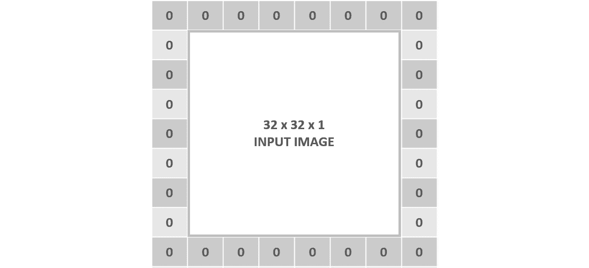

# 第四章：卷积神经网络

## 学习目标

在本章结束时，您将能够：

+   解释卷积神经网络（CNN）的训练过程

+   执行数据增强

+   对 CNN 应用批归一化

+   使用 CNN 解决图像分类问题

在本章中，您将被介绍 CNN。您将学习卷积、池化、填充和步幅等概念。

## 引言

尽管当前神经网络领域都很受欢迎，但 CNN 可能是所有神经网络架构中最受欢迎的。这主要是因为尽管它们在许多领域都适用，但它们在处理图像时特别出色，技术的进步使得收集大量图像来解决当今各种挑战成为可能。

从图像分类到对象检测，CNN 被用于诊断癌症患者、检测系统中的欺诈行为，以及构建深思熟虑的自动驾驶车辆，将彻底改变未来。

本章将重点解释卷积神经网络（CNN）在处理图像时优于其他架构的原因，以及更详细地解释它们的架构构建模块。它将涵盖构建 CNN 解决图像分类数据问题的主要编码结构。

此外，本章将探讨数据增强和批归一化的概念，这些将用于改善模型的性能。本章的最终目标是比较使用 CNN 解决图像分类问题的三种不同方法的结果。

#### 注意

作为提醒，本章中使用的所有代码的 GitHub 仓库可以在[`github.com/TrainingByPackt/Applied-Deep-Learning-with-PyTorch`](https://github.com/TrainingByPackt/Applied-Deep-Learning-with-PyTorch)找到。

## 构建 CNN

众所周知，处理图像数据问题时 CNN 是首选。然而，它们通常被低估，因为它们通常只被认为适用于图像分类，而事实上它们在处理图像方面的能力扩展到了更多领域。本章不仅将解释 CNN 在理解图像方面的优势，还将识别可以处理的不同任务，并给出一些现实生活中应用的示例。

此外，本章将探索 CNN 的不同构建模块及其在 PyTorch 中的应用，最终构建一个使用 PyTorch 图像分类数据集解决数据问题的模型。

### 为什么选择 CNN？

图像是像素矩阵，因此你可能会问，为什么我们不将矩阵展平成向量，然后使用传统的神经网络架构进行处理呢？答案是，即使是最简单的图像，也存在一些像素依赖关系会改变图像的含义。例如，猫眼的表现、车轮的轮胎，甚至是物体的边缘都是由几个以特定方式布置的像素构成的。展平图像会导致这些依赖关系丢失，传统模型的准确性也会因此丧失：


###### 图 4.1：展平矩阵的表示

另一方面，CNN 能够捕捉图像的空间依赖关系，因为它将图像处理为矩阵并一次性分析整个图像的区块，这取决于滤波器的大小。例如，使用大小为 3x3 的卷积层将一次性分析 9 个像素，直到覆盖整个图像。

图像的每个区块都被赋予一组参数（权重和偏差），这些参数将根据手头的滤波器确定该像素区块与整个图像的相关性。这意味着垂直边缘滤波器将赋予包含垂直边缘的图像区块更大的权重。因此，通过减少参数数量并分析图像的区块，CNN 能够更好地呈现图像的表现。

### 输入

正如前面提到的，CNN 的典型输入是以矩阵形式表示的图像。矩阵中的每个值代表图像中的一个像素，其数值由颜色的强度确定，取值范围从 0 到 255。

在灰度图像中，白色像素由数字 255 表示，黑色像素由数字 0 表示。灰色像素是介于两者之间的任意数字，取决于颜色的强度；灰色越浅，数字越接近 255。

彩色图像通常使用 RGB 系统表示，其中每种颜色表示为红、绿和蓝的组合。每个像素将具有三个维度，每个颜色一个维度。每个维度的值范围从 0 到 255。颜色越浓，数字越接近 255。

根据前面的段落，给定图像的矩阵是三维的，其中第一维度表示图像的高度（以像素数表示），第二维度表示图像的宽度（以像素数表示），第三维度称为通道，表示图像的颜色方案。

彩色图像的通道数为三（RGB 系统中每种颜色一个通道）。而灰度图像只有一个通道：


###### 图 4.2：图像的矩阵表示。左边是彩色图像，右边是灰度图像。

与文本数据不同，输入到 CNN 中的图像不需要太多预处理。 图像通常按原样输入，唯一的变化是将值标准化以加快学习过程并提高性能，并且作为良好实践，可以将图像缩小，考虑到 CNN 模型通常是使用较小的图像构建的，这也有助于加快学习过程。

规范化输入的最简单方法是取每个像素的值并将其除以 255，最终得到在 0 到 1 之间的值范围。 然而，有不同的规范化图像的方法，例如均值中心化技术。 在选择使用其中一种方法时，通常是个人偏好的问题； 但是，当使用预训练模型时，强烈建议使用第一次训练模型时使用的相同技术，这些信息始终包含在预训练模型的文档中。

### CNN 的应用

尽管 CNN 主要用于计算机视觉问题，但重要的是提到它们解决其他学习问题的能力，主要是关于分析数据序列。 例如，CNN 已知在文本、音频和视频序列上表现良好，有时结合其他网络架构使用，或通过将序列转换为图像以供 CNN 处理。 可以使用 CNN 处理数据序列的一些特定问题包括文本的机器翻译、自然语言处理和视频帧标记等。

此外，CNN 可以执行适用于所有监督学习问题的不同任务。 然而，从现在开始，本章将集中在计算机视觉上。 以下是每个任务的简要解释，以及每个任务的一个现实示例：

**分类**：这是计算机视觉中最常见的任务。 主要思想是将图像的一般内容分类为一组标签。

例如，分类可以确定图像是狗、猫还是任何其他动物。 此分类通过输出图像属于每个类的概率来完成，如下图所示：


###### 图 4.3: 分类任务

**定位**：主要目的是生成描述图像中物体位置的边界框。 输出包括一个类标签和一个边界框。

它可以在传感器中使用，以确定对象是在屏幕的左侧还是右侧：


###### 图 4.4: 定位任务

**检测**：此任务包括在图像中对所有对象执行对象定位。 输出包括多个边界框以及多个类标签（每个框一个）。

它被用于自动驾驶汽车的建设中，旨在能够定位交通标志、道路、其他车辆、行人和任何可能影响安全驾驶的对象：


###### 图 4.5：检测任务

**分割**：这里的任务是输出每个对象的类别标签和轮廓。主要用于标记图像中的重要对象，以进行进一步分析。

例如，它可以严格地限定在患者整个肺部图像中对应肿瘤的区域：


###### 图 4.6：分割任务

从这一节开始，本章将重点讲述如何训练模型来执行图像分类，使用 PyTorch 的图像数据集之一。

### CNN 的基本组成部分

如前所述，深度卷积网络将图像作为输入，经过一系列卷积层、池化层和全连接层，最终应用 `softmax` 激活函数对图像进行分类。与人工神经网络一样，分类通过计算图像属于每个类别的概率来进行，给每个类别标签赋予介于零和一之间的值。概率较高的类别标签被选择为该图像的最终预测。

下面详细解释了每个发现的层，以及如何在 PyTorch 中定义这些层的编码示例：

**卷积层**

这是从图像中提取特征的第一步。其目标是通过学习图像的小部分来保持附近像素之间的关系。

在这一层进行数学运算，输入两个（图像和滤波器），得到一个输出。如前所述，该操作包括对滤波器和与滤波器大小相同的图像部分进行卷积。这个操作对图像的所有子部分都会重复进行。

#### 注

回顾*第二章*，*神经网络的基本组成部分*，标题为卷积神经网络介绍，以便回忆输入与滤波器之间的确切计算。

结果矩阵的形状取决于输入的形状，其中图像矩阵的大小为 (h x w x c)，滤波器的大小为 (fh x fw x c)，将根据以下方程输出矩阵：


###### 方程式 4.7：卷积层的输出高度、宽度和深度

在这里，h 是输入图像的高度，w 是宽度，c 是深度（也称为通道数），fh 和 fw 是用户根据滤波器大小设定的值。


###### 图 4.8：输入、滤波器和输出的尺寸

需要强调的是，在单个卷积层中，可以对同一图像应用多个相同形状的滤波器。考虑到这一点，对于将两个滤波器应用于其输入的卷积层而言，其输出形状的深度是两个，正如以下图所示：


###### 图 4.9：具有两个滤波器的卷积层

这些滤波器中的每一个将执行不同的操作，以便从图像中发现不同的特征。例如，在具有两个滤波器的单个卷积层中，操作可能包括垂直边缘检测和水平边缘检测。此外，随着网络在层数上的增长，滤波器将执行更复杂的操作，利用先前检测到的特征，例如使用边缘检测器的输入来检测人物轮廓的操作。

此外，滤波器通常会在每一层中增加。这意味着，虽然第一个卷积层有八个滤波器，但通常会创建第二个卷积层，其滤波器数量是前者的两倍（16），依此类推。

然而，需要提到的是，在 PyTorch 中，如同许多其他框架一样，你只需定义要使用的滤波器数量，而无需指定滤波器的类型（例如，垂直边缘检测器）。每个滤波器配置（用于检测特定特征的数字）是系统变量的一部分。

关于卷积层，还有两个额外的概念需要介绍，将在接下来进行解释：

**填充**：

填充功能正如其名称所示，用零填充图像。这意味着在图像的每一侧添加额外的像素，并用零填充。

下图显示了一个图像示例，其每一侧都添加了一个填充像素：



###### 图 4.10：图像输入在一侧填充一个图形表示

这被用来在通过滤波器后保持输入矩阵的形状。这是因为，特别是在前几层，目标应该是尽可能保留原始输入中的信息，以便从中提取最多的特征。

为了更好地理解填充的概念，请考虑以下情景：

对于形状为 32 x 32 x 3 的彩色图像应用一个 3 x 3 的滤波器将得到一个形状为 30 x 30 x 1 的矩阵。这意味着输入到下一层的图像尺寸已经减小。另一方面，通过在输入图像上添加填充值为 1，输入的形状则变为 34 x 34 x 3，使用同样的滤波器将得到一个输出尺寸为 32 x 32 x 1 的矩阵。

当使用填充时，可以使用以下方程式计算输出宽度：


###### 图 4.11：使用填充后卷积层的输出宽度

这里，W 是输入矩阵的宽度，F 是滤波器的宽度，P 是填充。同样的方程可以适应计算输出的高度。

要获得与输入矩阵相同形状的输出矩阵，请使用以下方程来计算填充值（考虑步幅等于一）：


###### 图 4.12：获得与输入矩阵相同大小的输出矩阵所需的填充数

请记住，输出通道（深度）的数量始终等于应用于输入的滤波器数。

**步幅**：

此参数是指滤波器在输入矩阵上水平和垂直移动的像素数。正如我们迄今所见，滤波器从图像的左上角通过，然后向右移动一个像素，依此类推，直到垂直和水平地通过图像的所有部分。这个例子是步幅为一的卷积层，默认配置为此参数。

当步幅为二时，移动将为两个像素，如下图所示：


###### 图 4.13：步幅为二的卷积层的图形表示

可以看到，初始操作发生在左上角，然后向右移动两个像素，第二次计算发生在右上角。接下来，计算向下移动两个像素，以在左下角执行计算，最后再次向右移动两个像素，最终计算发生在右下角。

#### 注意

*图 4.13* 中的数字是虚构的，不是实际计算。重点应放在解释步幅为二时的移动过程的方框上。

当使用步幅时，可以使用以下方程来计算输出宽度：


###### 方程 4.14：使用步幅进行卷积层后的输出宽度

这里，W 是输入矩阵的宽度，F 是滤波器的宽度，S 是步幅。同样的方程可以适应计算输出的高度。

一旦引入这些参数，计算来自卷积层的矩阵输出形状（宽度和高度）的最终方程如下：


###### 方程 4.15：使用填充和步幅后的卷积层的输出宽度

每当数值为浮点数时，应向下取整。这基本上意味着输入的某些区域被忽略，并且不会从中提取任何特征。

最终，一旦输入通过所有的过滤器，输出将被送入激活函数中，以打破线性，类似于传统神经网络的过程。虽然在这一步骤中有几种激活函数可供使用，但首选的是 ReLU 函数，因为它在 CNN 中表现出色。在此处获得的输出成为下一层的输入，通常是一个池化层。

### 练习 8：计算卷积层的输出形状

考虑给定的方程式，考虑以下情景并计算输出矩阵的形状。

#### 注释

这个练习不需要编码，而是由先前提到的概念练习组成。

1.  输入形状为 64 x 64 x 3。形状为 3 x 3 x 3 的过滤器：

    ```py
    Output height = 64 -3 + 1 = 62
    Output width = 64 - 3 + 1 = 62
    Output depth = 1
    ```

1.  输入形状为 32 x 32 x 3。5 个形状为 5 x 5 x 3 的过滤器。填充为 2：

    ```py
    Output height = 32 - 5 + (2 * 2) + 1 = 32
    Output width = 32-5 + (2 * 2) + 1 = 32
    Output depth = 10
    ```

1.  输入形状为 128 x 128 x 1。5 个形状为 5 x 5 x 1 的过滤器。步长为 3：

    ```py
    Output height = (128 - 5)/ 3 + 1 = 42
    Output width = (128 - 5)/ 3 + 1 = 42
    Output depth = 5
    ```

1.  输入形状为 64 x 64 x 1。形状为 8 x 8 x 1 的过滤器。填充为 3，步长为 3：

    ```py
    Output height = ((64 - 8 + (2 * 3)) / 3) +1 = 21.6 ≈ 21
    Output width = ((64 - 8 + (2 * 3)) / 3) +1 = 21.6 ≈ 21
    Output depth = 1
    ```

恭喜！您成功地计算出源自卷积层的矩阵输出形状。

在 PyTorch 中编写卷积层非常简单。使用自定义模块，只需创建`network`类，其中包含网络的各层，以及一个`forward`函数，定义通过先前定义的不同层传递信息的步骤，如下面的代码片段所示：

```py
import torch.nn as nn
import torch.nn.functional as F
class CNN_network(nn.Module):
    def __init__(self):
        super(CNN_network, self).__init__()
# input channels = 3, output channels = 18,
# filter size = 3, stride = 1 and padding = 1
        self.conv1 = nn.Conv2d(3, 18, 3, 1, 1)
        def forward(self, x):
            x = F.relu(self.conv1(x))
        return x
```

在定义卷积层时，从左到右传递的参数是指输入通道数，输出通道数（过滤器数量），核大小（滤波器大小），步长和填充。

考虑到这一点，前述的例子由具有三个输入通道，18 个大小为 3 的过滤器组成，步长和填充均为 1 的卷积层组成。

另一种有效的方法，相当于前面的例子，包括来自自定义模块的语法组合和使用`Sequential`容器，如下面的代码片段所示：

```py
import torch.nn as nn
class CNN_network(nn.Module):
    def __init__(self):
        super(CNN_network, self).__init__()
        self.conv1 = nn.Sequential(nn.Conv2d(1, 16, 5, 1, 2,),                               nn.ReLU())
    def forward(self, x):
        x = self.conv1(x)

        return x
```

在这里，层的定义发生在`Sequential`容器内。通常，一个容器会包含一个卷积层，一个激活函数和一个池化层。在下面的不同容器中将包含一组新的层。

**池化层**

按照惯例，池化层是特征选择步骤的最后部分，这就是为什么池化层大多数情况下可以在卷积层之后找到的原因。正如在前面的章节中解释的那样，其思想是从图像的子部分中提取最相关的信息。池化层的大小通常为 2，步长等于其大小。

根据前文，池化层通常通过减半输入的高度和宽度来实现。这很重要，考虑到为了让卷积层在图像中找到所有特征，需要使用多个滤波器，并且该操作的输出可能会变得过大，这意味着有很多参数需要考虑。池化层旨在通过保留最相关的特征来减少网络中的参数数量。在图像的子区域中选择相关特征的方法可以是获取最大数量或对该区域中的数字进行平均。

对于图像分类任务，最常用的是最大池化层，而不是平均池化层。这是因为前者在保留最相关特征的任务中表现更好，而后者在平滑图像等任务中被证明更有效。

可以使用以下方程式来计算输出矩阵的形状：


###### 方程式 4.16：池化层后的输出矩阵宽度

在这里，W 指的是输入的宽度，F 指的是滤波器的大小，S 指的是步长。可以将相同的方程式用于计算输出的高度

输入的通道或深度保持不变，因为池化层将在图像的所有通道上执行相同的操作。这意味着池化层的结果仅影响输入的宽度和长度。

### 练习 9：计算一组卷积和池化层的输出形状

下面的练习将结合卷积层和池化层。目标是确定经过一组层后的输出矩阵的大小。

#### 注意

这个活动不需要编码，而是基于之前提到的概念进行的实践练习。

考虑以下一组层，并指定在所有变换结束时输出层的形状：

1.  输入图像大小为 256 x 256 x 3。

1.  具有 16 个大小为三的滤波器、步长和填充均为一的卷积层。

1.  一个池化层，滤波器大小为二，步长大小也为二。

1.  具有八个大小为七、步长为一、填充为三的滤波器的卷积层。

1.  一个池化层，滤波器大小为二，步长也为二。

    下面展示了通过每个层后经过的矩阵的输出大小：

    ```py
    # After the first convolutional layer
    output_matrix_size = 256 x 256 x 16
    # After the first pooling layer
    output_matrix_size = 128 x 128 x 16
    # After the second convolutional layer
    output_matrix_size = 128 x 128 x 8
    # After the second pooling layer
    output_matrix_size = 64 x 64 x 8
    ```

    恭喜！您已成功计算出通过一系列卷积和池化层导出的矩阵的输出形状。

    使用与之前相同的编码示例，定义池化层的 PyTorch 方式如下代码片段所示：

    ```py
    import torch.nn as nn
    import torch.nn.functional as F
    class CNN_network(nn.Module):
        def __init__(self):
            super(CNN_network, self).__init__()
            self.conv1 = nn.Conv2d(3, 18, 3, 1, 1)
            self.pool1 = nn.MaxPool2d(2, 2)
            def forward(self, x):
                x = F.relu(self.conv1(x))
                x = self.pool1(x)
            return x
    ```

    在这里，进入最大池化层的参数从左到右依次是滤波器的大小和步长。

    再次展示了一个同样有效的方法，使用自定义模块和`Sequential`容器：

    ```py
    import torch.nn as nn
    class CNN_network(nn.Module):
        def __init__(self):
            super(CNN_network, self).__init__()
            self.conv1 = nn.Sequential(nn.Conv2d(1, 16, 5, 1, 2,),                               nn.ReLU(),
                                  nn.MaxPool2d(2, 2))
        def forward(self, x):
            x = self.conv1(x)

            return x
    ```

如前所述，池化层也包含在与卷积层和激活函数相同的容器中。后续的一组层（卷积、激活和池化）将在新的`Sequential`容器中定义。

**全连接层**

全连接（FC）层或层在网络架构末端定义，在输入通过一组卷积和池化层之后。从前一个全连接层之前的输出数据被从矩阵扁平化为向量，可以被馈送到全连接层（与传统神经网络中的隐藏层相同）。

这些 FC 层的主要目的是考虑前面层次检测到的所有特征，以便对图像进行分类。

不同的 FC 层通过激活函数传递，通常是 ReLU，除非是最后一层，该层将使用 softmax 函数输出输入属于每个类标签的概率。

第一个全连接层的输入大小对应于前一层的扁平化输出矩阵的大小。输出大小由用户定义，与 ANNs 一样，设置这个数字并没有确切的科学依据。最后一个 FC 层的输出大小应等于类标签的数量。

要在 PyTorch 中定义一组 FC 层，请考虑以下代码片段：

```py
import torch.nn as nn
import torch.nn.functional as F
class CNN_network(nn.Module):

def __init__(self):
    super(CNN_network, self).__init__()

    self.conv1 = nn.Conv2d(3, 18, 3, 1, 1)    
    self.pool1 = nn.MaxPool2d(2, 2)
    self.linear1 = nn.Linear(32*32*16, 64)
    self.linear2 = nn.Linear(64, 10)

def forward(self, x):
    x = F.relu(self.conv1(x))
    x = self.pool1(x)
    x = x.view(-1, 32 * 32 *16)
    x = F.relu(self.linear1(x))
    x = F.log_softmax(self.linear2(x), dim=1)
    return x
```

在这里，向网络添加了两个全连接层。接下来，在前向函数内部，使用`view()`函数将池化层的输出扁平化。然后，它通过第一个 FC 层，该层应用激活函数。最后，数据通过最后一个 FC 层及其激活函数传递。

使用自定义模块和`Sequential`容器定义全连接层的代码如下所示：

```py
import torch.nn as nn
class CNN_network(nn.Module):
    def __init__(self):
        super(CNN_network, self).__init__()
        self.conv1 = nn.Sequential(nn.Conv2d(1, 16, 5, 1, 2,),                               nn.ReLU(),
                              nn.MaxPool2d(2, 2))
        self.linear1 = nn.Linear(32*32*16, 64)
        self.linear2 = nn.Linear(64, 10)
    def forward(self, x):
        x = self.conv1(x)

        x = x.view(-1, 32 * 32 *16)
        x = F.relu(self.linear1(x))
        x = F.log_softmax(self.linear2(x), dim=1)

        return x
```

一旦网络架构被定义，定义不同参数（包括损失函数和优化算法）以及训练过程的后续步骤可以像 ANNs 一样处理。

### 旁注 - 从 PyTorch 下载数据集

要从 PyTorch 加载数据集，请使用以下代码。除了下载数据集外，它还展示了如何使用数据加载器按批次加载图像以节省资源：

```py
from torchvision import datasets
import torchvision.transforms as transforms
batch_size = 20
transform = transforms.Compose([transforms.ToTensor(),
transforms.Normalize((0.5, 0.5, 0.5), (0.5, 0.5, 0.5))])
train_data = datasets.MNIST(root='data', train=True,
download=True, transform=transform)
test_data = datasets.MNIST(root='data', train=False,
                           download=True, transform=transform)
dev_size = 0.2
idx = list(range(len(train_data)))
np.random.shuffle(idx)
split_size = int(np.floor(dev_size * len(train_data)))
train_idx, dev_idx = idx[split_size:], idx[:split_size]
train_sampler = SubsetRandomSampler(train_idx)
dev_sampler = SubsetRandomSampler(dev_idx)
train_loader = torch.utils.data.DataLoader(train_data, batch_size=batch_size, sampler=train_sampler)
dev_loader = torch.utils.data.DataLoader(train_data, batch_size=batch_size, sampler=dev_sampler)
test_loader = torch.utils.data.DataLoader(test_data, batch_size=batch_size)
```

在上述代码中，要下载的数据集是 MNIST。这是一个流行的数据集，包含从零到九的手写灰度数字的图像。在下载数据集之前定义的`transform`变量负责对数据集执行一些转换。在这种情况下，数据集将被转换为张量并在所有维度上进行归一化。

使用 PyTorch 中的`SubsetRandomSampler()`函数，通过随机采样索引将原始训练集分为训练集和验证集。此外，`DataLoader()`函数负责按批次加载图像。该函数的结果变量（`train_loader`、`dev_loader`和`test_loader`）将分别包含特征和目标的值。

### 活动 7：为图像分类问题构建 CNN

#### 注意

问题越复杂，网络越深，模型训练时间越长。考虑到这一点，本章的活动可能比之前的章节需要更长的时间。

在下一个活动中，将在 PyTorch 的图像数据集上训练 CNN。让我们看一下以下情景：

您在一家人工智能公司工作，该公司为客户的需求开发定制模型。您的团队目前正在创建一个能够区分车辆和动物的模型，更具体地说，是一个能够区分不同动物和不同类型车辆的模型。他们为您提供了包含 60,000 张图像的数据集，并希望您构建这样一个模型。

#### 注意

对于本章中的活动，您需要准备 Python 3.6、Jupyter、NumPy 和 Matplotlib。

1.  导入以下库：

    ```py
    import numpy as np
    import torch
    from torch import nn, optim
    import torch.nn.functional as F
    from torchvision import datasets
    import torchvision.transforms as transforms
    from torch.utils.data.sampler import SubsetRandomSampler
    from sklearn.metrics import accuracy_score
    import matplotlib.pyplot as plt
    ```

    #### 注意

    将使用的数据集是 PyTorch 中的 CIFAR10，其中包含总共 60,000 张车辆和动物的图像。有 10 个不同的类标签。训练集包含 50,000 张图像，测试集包含剩余的 10,000 张。

1.  设置对数据执行的转换，即将数据转换为张量并对像素值进行归一化。

1.  设置批量大小为 100 张图像，并从 CIFAR10 数据集下载训练和测试数据。

1.  使用 20%的验证大小，定义用于将数据集分为这两组的训练和验证采样器。

1.  使用`DataLoader()`函数定义每组数据集使用的批次。

1.  定义您的网络架构。使用以下信息来完成：

    +   Conv1：一个卷积层，以彩色图像作为输入，并通过 10 个大小为 3 的滤波器进行处理。填充和步幅均设置为 1。

    +   Conv2：一个卷积层，通过 20 个大小为 3 的滤波器处理输入数据。填充和步幅均设置为 1。

    +   Conv3：一个卷积层，通过 40 个大小为三的滤波器处理输入数据。填充和步幅均设置为 1。

    +   在每个卷积层后使用 ReLU 激活函数。

    +   每个卷积层后使用池化层，滤波器大小和步幅均为 2。

    +   在展平图像后设置 20%的丢失率。

    +   Linear1：接收来自上一层的展平矩阵作为输入，并生成 100 个单元的输出。对于这一层，使用 ReLU 激活函数。此处的丢弃项设置为 20%。

    +   Linear2：生成 10 个输出的全连接层，每个类标签一个。对输出层使用 `log_softmax` 激活函数。

1.  定义训练模型所需的所有参数。训练 50 个 epoch。

1.  训练您的网络，并确保保存训练和验证集的损失和准确性值。

1.  绘制两个集的损失和准确性。

    #### 注意

    由于每个 epoch 中数据的重新排序，结果将不完全可再现。但是，您应该能够得到类似的结果。

1.  检查测试集上的模型准确性。

    #### 注意

    可在第 204 页找到此活动的解决方案。

## 数据增强

学习如何有效编写神经网络是开发最先进解决方案的步骤之一。此外，要开发出优秀的深度学习解决方案，还必须找到一个可以提供解决当前挑战的领域（顺便说一句，这并不是一件容易的事情）。但是，一旦所有这些都完成了，我们通常会面临同样的问题：获取一个足够大的数据集以使我们的模型性能良好，无论是通过自我收集还是来自互联网和其他可用来源。

正如您可能想象的那样，即使现在可以收集和存储大量数据，由于相关的成本，这并不是一件容易的任务。因此，大多数情况下，我们都在处理包含数万条记录的数据集，而在涉及图像时，这个数字甚至更少。

在开发计算机视觉问题的解决方案时，这变成一个相关问题，主要有两个原因：

+   数据集越大，结果越好，较大的数据集对于获得足够好的模型至关重要。这是真实的，考虑到训练模型是调整一堆参数的过程，使其能够尽可能接近地图输入和输出之间的关系，并通过最小化损失函数来预测值。在这里，模型越复杂，需要的参数就越多。

    考虑到这一点，有必要向模型提供足够数量的示例，以便它能够找到这些模式，其中训练示例的数量应与要调整的参数数量成比例。

+   此外，计算机视觉问题中最大的挑战之一是使您的模型在图像的多种变化上表现良好。这意味着图像不需要按特定对齐方式或具有固定质量进行馈送，而是可以以其原始格式进行馈送，包括不同的位置、角度、光照和其他失真。因此，有必要找到一种方法来将这些变化输入模型。

因此，设计了数据增强技术。简单来说，它是通过轻微修改现有示例来增加训练示例的数量。例如，可以复制当前可用的实例，并对这些副本添加一些噪声，以确保它们并非完全相同。

在计算机视觉问题中，这意味着通过改变现有图像来增加训练数据集中的图像数量，可以通过微调当前图像来创建略有不同的重复版本。

对这些图像的微小调整可以是轻微的旋转、物体在帧内位置的变化、水平或垂直翻转、不同的色彩方案和扭曲等形式。这种技术有效，因为卷积神经网络将认为每个这样的图像是不同的图像。

例如，以下图示展示了一只狗的三张图像，对于人眼来说它们是带有某些变化的同一图像，但对于神经网络来说它们是完全不同的：


###### 图 4.17: 增强图像

能够独立于任何形式的变化识别图像中对象的 CNN 被认为具有不变性属性。事实上，CNN 可以对每种类型的变化都具有不变性。

### 使用 PyTorch 进行数据增强

使用 `torchvision` 包在 PyTorch 中执行数据增强非常简单。该包除了包含流行的数据集和模型架构外，还包含常用的图像转换函数来处理数据集。

#### 注意

在本节中，将提及一些这些图像转换。要获取所有可能的转换列表，请访问 [`pytorch.org/docs/stable/torchvision/transforms.html`](https://pytorch.org/docs/stable/torchvision/transforms.html).

与前一个活动中用于归一化和将数据集转换为张量的过程相似，执行数据增强需要我们首先定义所需的转换，然后将其应用于数据集，如下面的代码片段所示：

```py
transform = transforms.Compose([
            transforms.HorizontalFlip(probability_goes_here), 
            transforms.RandomGrayscale(probability_goes_here),
            transforms.ToTensor(),
            transforms.Normalize((0.5, 0.5, 0.5), (0.5, 0.5, 0.5))])
train_data = datasets.CIFAR10('data', train=True, download=True, transform=transform)
test_data = datasets.CIFAR10('data', train=False, download=True, transform=transform)
```

在这里，将要下载的数据将经历水平翻转（考虑到定义图像是否将被翻转的概率值），并将被转换为灰度图像（同样考虑到概率）。然后，数据被转换为张量并进行归一化。

考虑到模型是通过迭代过程进行训练的，其中训练数据被多次输入，这些转换确保第二次通过数据集时不会向模型提供完全相同的图像。

此外，重要的是提到可以为不同的数据集设置不同的转换。这是有用的，因为数据增强的目的是增加训练示例的数量，但用于测试模型的图像应该保持大部分不变。尽管如此，测试集应调整大小，以便将等尺寸的图像输入模型。

可以如下所示完成：

```py
transform = {
    "train": transforms.Compose([
    transforms.RandomHorizontalFlip(probability_goes_here), 
    transforms.RandomGrayscale(probability_goes_here),
    transforms.ToTensor(),
    transforms.Normalize((0.5, 0.5, 0.5), (0.5, 0.5, 0.5))]),
    "test": transforms.Compose([
    transforms.ToTensor(),
    transforms.Normalize((0.5, 0.5, 0.5), (0.5, 0.5, 0.5)),
    transforms.Resize(size_goes_here)])}
train_data = datasets.CIFAR10('data', train=True, download=True, transform=transform["train"])
test_data = datasets.CIFAR10('data', train=False, download=True, transform=transform["test"])
```

如图所示，定义了一个包含训练和测试集各自转换的字典。然后，根据需要调用它们来应用转换。

### 活动 8：实施数据增强

在下一个活动中，将引入数据增强到先前活动创建的模型中，以测试是否可以提高其准确性。让我们看看以下情景：

您创建的模型很好，但准确率尚未令任何人印象深刻。他们要求您考虑一种能够改进模型性能的方法论。

1.  复制上一个活动中的笔记本。

1.  将`transform`变量的定义修改，除了将数据标准化并转换为张量外，还包括以下转换：

    +   对于训练/验证集，使用概率为 50%（0.5）的`RandomHorizontalFlip`函数和概率为 10%（0.1）的`RandomGrayscale`函数。

    +   对于测试集，不添加任何其他转换。

1.  将模型训练 100 个 epochs。

    #### 注意

    由于每个 epoch 中数据的洗牌，结果将不会完全可复制。然而，您应该能够得到类似的结果。

1.  计算在测试集上得到的模型准确性。

    #### 注意

    此活动的解决方案可以在第 209 页找到。

## 批量标准化

通常在尝试加快学习速度的同时，对输入层进行标准化以及通过重新缩放所有特征到相同尺度来提高性能是很常见的。因此，问题在于，如果模型从输入层的标准化中获益，为什么不试图通过标准化所有隐藏层的输出来进一步提高训练速度呢？

**批量标准化**，顾名思义，标准化隐藏层的输出，以减少每层的方差，这也被称为协方差偏移。减少协方差偏移对于使模型能够在遵循与训练图像不同分布的图像上表现良好也是有用的。

以检测动物是否为猫为目的的网络为例。当网络仅使用黑猫图像进行训练时，批量标准化可以帮助网络通过标准化数据，使黑色和彩色猫图像都遵循相似的分布，从而对不同颜色的猫的新图像进行分类。这类问题如下图所示：


###### 图 4.18：猫分类器。即使仅使用黑猫进行训练，该模型也能识别有色猫。

此外，除了上述内容，批量归一化还为训练模型的过程引入以下好处，最终帮助您得到表现更好的模型：

+   它允许设置更高的学习率，因为批量归一化有助于确保输出不会过高或过低。更高的学习率等同于更快的学习速度。

+   它有助于减少过拟合，因为它具有正则化效果。这使得可以将丢弃概率设置为较低的值，这意味着每次前向传递中会忽略较少的信息。

    #### 注意

    提醒一下，我们不应过于依赖批量归一化来处理过拟合问题。

如前面各层所述，对隐藏层输出进行归一化是通过减去批量均值并除以批量标准差完成的。

此外，重要的是提到，批量归一化通常应用于卷积层以及全连接层（不包括输出层）。

### 使用 PyTorch 进行批量归一化

在 PyTorch 中，添加批量归一化就像是向网络架构添加新层一样简单，考虑到这里所解释的两种不同类型：

**BatchNorm1d**：此层用于对二维或三维输入实施批量归一化。它接收前一层的输出节点数作为参数。这在全连接层上通常使用。

**BatchNorm2d**：这对四维输入应用批量归一化。同样，它接收前一层的输出节点数作为参数。它通常用于卷积层，因此它接收的参数应等于前一层的通道数。

根据这个，CNN 中批量归一化的实现如下：

```py
class CNN(nn.Module):
    def __init__(self):
        super(CNN, self).__init__()
        self.conv1 = nn.Conv2d(3, 16, 3, 1, 1)
        self.norm1 = nn.BatchNorm2d(16)
        self.pool = nn.MaxPool2d(2, 2)
        self.linear1 = nn.Linear(16 * 16 * 16, 100)
        self.norm2 = nn.BatchNorm1d(100)
        self.linear2 = nn.Linear(100, 10)
        def forward(self, x):
            x = self.pool(self.norm1(F.relu(self.conv1(x))))
            x = x.view(-1, 16 * 16 * 16)
            x = self.norm2(F.relu(self.linear1(x)))
            x = F.log_softmax(self.linear2(x), dim=1)
        return x
```

可见，批量归一化层的初始化方式与任何其他层类似。接下来，在激活函数后应用于其相应层的输出。

### 活动 9：实现批量归一化

对于接下来的活动，我们将在上一个活动的架构上实现批量归一化，以查看是否可能进一步改善模型在测试集上的性能。让我们看看以下情景：

哇！您以最后的性能改进给队友留下了深刻印象，现在他们期待您更多。他们要求您最后再试一次改进模型，以便将准确率提高到 80%：

1.  复制来自上一个活动的笔记本。

1.  将批归一化添加到每个卷积层以及第一个全连接层。

1.  训练模型进行 100 个 epochs。

    #### 注意

    由于每个 epoch 中数据的洗牌，结果将无法完全复现。不过，你应该能够得到相似的结果。

1.  计算模型在测试集上的准确率。

    #### 注意

    本活动的解决方案可在第 211 页找到。

## 总结

上一章集中讨论了 CNN（卷积神经网络），这是一种在计算机视觉问题上表现出色的神经网络架构。它首先解释了为什么 CNN 在处理图像数据集时被广泛使用的主要原因，并介绍了可以通过它们解决的不同任务的概述。

此外，本章解释了网络架构的不同构建模块，从解释卷积层的性质开始，然后转向池化层，最后解释全连接层。在每个部分中，都包括了每个层的目的解释，以及有效编写 PyTorch 架构所需的代码片段。

这导致引入一个图像分类问题，使用之前解释过的构建模块来解决。

接下来，数据增强被引入为一个工具，通过增加训练示例的数量来提高网络性能，而无需收集更多图像。该技术专注于对现有图像进行一些变化，以创建“新”图像供模型使用。

通过实施数据增强，本章的第二个活动旨在解决同一图像分类问题，并旨在比较结果。

最后，本章解释了批归一化的概念。它包括对每个隐藏层的输出进行归一化，以加快学习速度。在解释如何在 PyTorch 中应用批归一化的过程后，本章的最后一个活动再次旨在使用批归一化解决同一图像分类问题。
