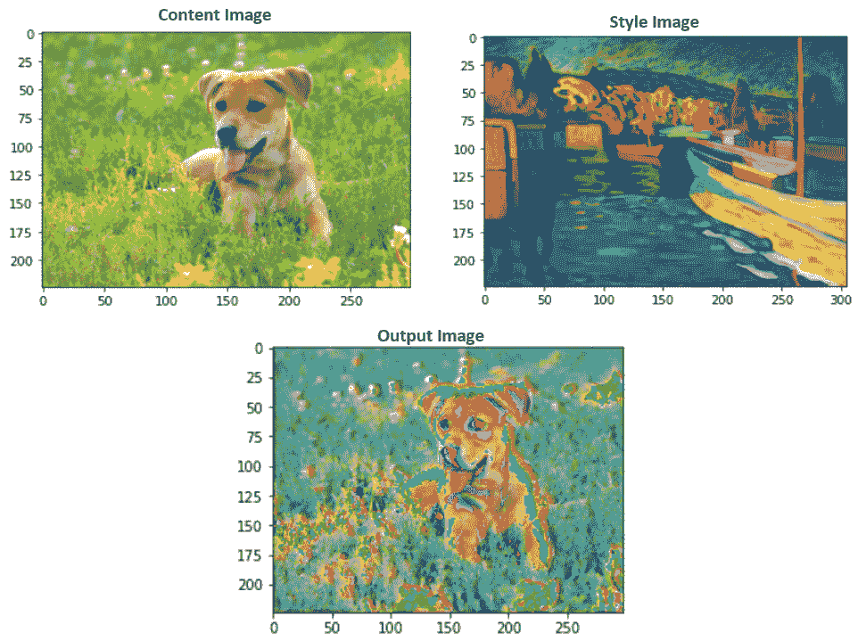
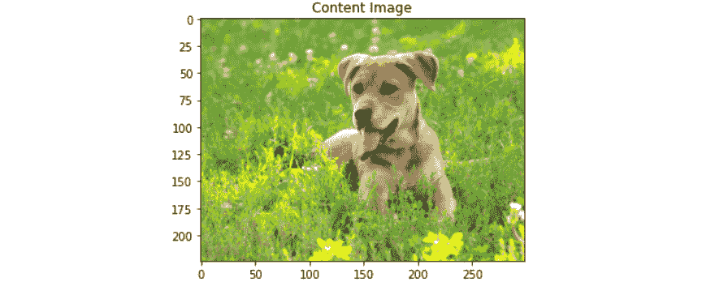
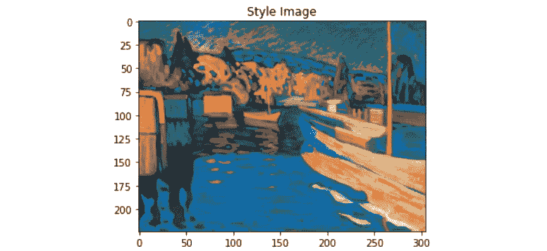
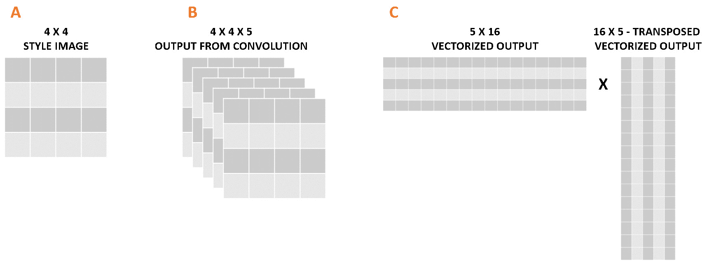
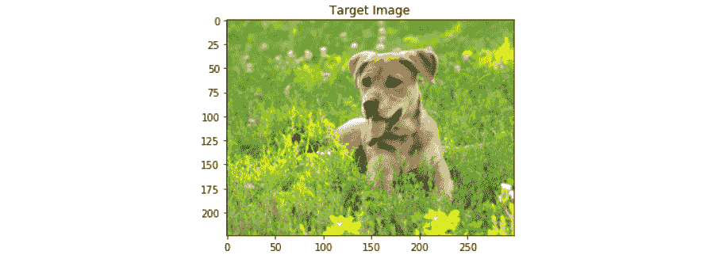
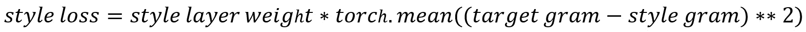
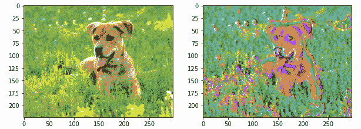

# *第五章*

# 风格转移

## 学习目标

到本章末尾，您将能够：

+   从 PyTorch 加载预训练模型

+   提取图像的风格

+   获取图像的内容

+   创建一个新图像，使用一张图像的风格和另一张图像的内容

在本章中，您将学习如何将艺术风格从一张图片转移到另一张图片。这样，您就能够将日常图片转变为艺术杰作。

## 介绍

上一章详细解释了传统卷积神经网络（CNNs）的不同构建模块，以及一些技术，以提高性能并减少训练时间。尽管那里解释的架构是典型的，但并非一成不变，相反，已经出现了大量用于解决不同数据问题的 CNN 架构，更常见的是在计算机视觉领域。

这些架构因配置和学习任务而异。如今非常流行的一种架构是由牛津视觉几何组（Visual Geometry Group）创建的 VGG 架构。它是为了对象识别而开发的，通过依赖大量参数，实现了最先进的性能。其在数据科学家中的流行原因之一是训练模型的参数（权重和偏差）的可用性，这使得研究人员可以在不进行训练的情况下使用它，同时模型的性能也非常出色。

在本章中，我们将使用这个预训练模型来解决一个计算机视觉问题，这个问题因社交媒体频道的普及而变得特别有名，专门用于分享图像。它包括执行风格转移，以改善图像的外观，使其具有另一张图像的风格（颜色和纹理）。

在每天应用滤镜来提高社交媒体上常规图像质量和吸引力的过程中，进行了数百万次前述任务。尽管在使用时似乎是一个简单的任务，但本章将解释在这些图像编辑应用程序的幕后发生的魔法。

#### 注意

作为提醒，包含本章所有代码的 GitHub 存储库可以在[`github.com/TrainingByPackt/Applied-Deep-Learning-with-PyTorch`](https://github.com/TrainingByPackt/Applied-Deep-Learning-with-PyTorch)找到。

## 风格转移

简单来说，风格转移包括修改图像的风格，同时保留其内容。例如，将动物图像的风格转换为梵高风格的绘画，如下图所示：



###### 图 5.1：风格转移的输入和输出。本章最终练习的结果。

根据前述图示，预训练模型有两个输入：内容图像和样式图像。内容指的是物体，而样式指的是颜色和纹理。因此，模型的输出应该是包含内容图像中物体和样式图像艺术外观的图像。

### 工作原理是怎样的？

与解决传统计算机视觉问题不同（如前一章所述），风格转移需要按不同步骤有效地将两个图像作为输入并创建新图像作为输出。

以下是解决风格转移问题时遵循的步骤的简要解释：

1.  **输入数据的提供**：内容图像和样式图像都需要输入模型，并且它们的形状必须相同。在这里的常见做法是将样式图像调整为与内容图像相同的形状。

1.  **加载模型**：牛津大学视觉几何组创建了一个在风格转移问题上表现出色的模型架构，称为 VGG 网络。此外，他们还提供了模型的参数，以便任何人可以缩短或跳过模型的训练过程。

    #### 注

    VGG 网络有不同版本，使用不同数量的层。为了区分不同的版本，其命名方式会在缩写后加上一个破折号和数字，代表该特定架构的层数。本章将使用网络的 19 层版本，即被称为 VGG-19 的版本。

    因此，利用 PyTorch 的预训练模型子包，可以加载预训练模型，以执行风格转移任务，无需使用大量图像训练网络。

1.  **确定层的功能**：鉴于有两个主要任务（识别图像内容和区分另一个图像的样式），不同的层将有不同的功能来提取不同的特征；对于样式图像，重点应放在颜色和纹理上；而对于内容图像，则应关注边缘和形式。在这一步骤中，不同的层被分配到不同的任务中。

1.  **定义优化问题**：与任何其他监督问题一样，需要定义一个损失函数，它负责衡量输出和输入之间的差异。与其他监督问题不同的是，风格转移问题需要最小化三种不同的损失函数：

    内容损失：仅考虑与内容相关的特征，衡量内容图像和输出之间的距离。

    风格损失：仅考虑与样式相关的特征，衡量样式图像和输出之间的距离。

    总损失：这结合了内容损失和风格损失。内容损失和风格损失都有一个相关的权重，用于确定它们在计算总损失中的贡献。

1.  **参数更新**：此步骤使用梯度来更新网络的不同参数。

## 使用 VGG-19 网络架构实现风格迁移的实施

VGG-19 是一个包含 19 层的卷积神经网络。它使用来自 ImageNet 数据库的数百万图像进行训练。该网络能够将图像分类为 1000 个不同的类标签，包括大量的动物和各种工具。

#### 注意

若要探索 ImageNet 数据库，请使用以下网址：[`www.image-net.org/`](http://www.image-net.org/)。

考虑到其深度，该网络能够从各种图像中识别复杂的特征，这使其特别适合风格迁移问题，其中在不同阶段和不同目的下的特征提取至关重要。

下一节将专注于解释如何使用预训练的 VGG-19 模型进行风格迁移的过程。本章的最终目的是将动物或风景图像（作为内容图像）和知名艺术家的绘画图像（作为风格图像）合成新的带有艺术风格的常规物体图像。

然而，在深入到过程之前，以下是导入的解释及其用途的简要解释：

+   **NumPy**：将用于将图像转换为显示的格式。

+   **torch, torch.nn 和 torch.optim**：这些将实现神经网络，并定义优化算法。

+   **PIL.Image**：这将加载图像。

+   **matplotlib.pyplot**：这将显示图像。

+   **torchvision.transforms 和 torchvision.models**：这些将把图像转换为张量并加载预训练模型。

### 输入：加载和显示

执行风格迁移的第一步包括加载内容图像和风格图像。在此步骤中，处理基本的预处理，其中图像必须是相同大小的（最好是用于训练预训练模型的图像大小），这也将是输出图像的大小。此外，图像被转换为 PyTorch 张量，并且可以根据需要进行归一化。

此外，始终将加载的图像显示出来是一个好习惯，以确保它们如预期一样。考虑到图像已经转换为张量并在此时进行了归一化，应克隆张量，并进行新一组转换，以便使用 Matplotlib 显示它们。

定义函数来加载和显示图像可以节省时间，并确保内容图像和风格图像上的处理过程相同。此过程将在后续练习中展开。

#### 注意

本章的所有练习都要在同一个笔记本中编写，因为它们将一起执行风格转移任务。

### 练习 10：加载和显示图像

这是进行风格转移的四个步骤中的第一步。本章的目标是加载和显示图像（内容和风格），这些图像将在后续练习中使用。

#### 注意

在 GitHub 仓库（本章开头分享的链接）中，您可以找到将在本章中不同练习和活动中使用的不同图像。

1.  导入所有进行风格转移所需的包：

    ```py
    import numpy as np
    import torch
    from torch import nn, optim
    from PIL import Image
    import matplotlib.pyplot as plt
    from torchvision import transforms, models
    ```

1.  设置用于两幅图像的图像大小。此外，设置应在图像上执行的变换，其中包括调整图像大小、将其转换为张量并进行归一化：

    ```py
    imsize = 224
    loader = transforms.Compose([
             transforms.Resize(imsize), 
             transforms.ToTensor(),
             transforms.Normalize((0.485, 0.456, 0.406), (0.229, 0.224, 0.225))])
    ```

    #### 注意

    VGG 网络是使用归一化图像训练的，其中每个通道分别具有均值 0.485、0.456 和 0.406，标准差为 0.229、0.224 和 0.225。

1.  定义一个函数，该函数将接收图像路径作为输入，并使用 PIL 打开图像。接下来，它应该对图像应用变换：

    ```py
    def image_loader(image_name):
        image = Image.open(image_name)
        image = loader(image).unsqueeze(0)
        return image
    ```

1.  调用函数以加载内容图像和风格图像。将狗图像作为内容，将马蒂斯图像作为风格，这两者都可在 GitHub 仓库中找到：

    ```py
    content_img = image_loader("images/dog.jpg")
    style_img = image_loader("images/matisse.jpg")
    ```

1.  要显示图像，将它们转换回 PIL 图像并恢复归一化过程。将这些变换定义在一个变量中：

    ```py
    unloader = transforms.Compose([
               transforms.Normalize((-0.485/0.229, -0.456/0.224,            -0.406/0.225), (1/0.229, 1/0.224, 1/0.225)),
               transforms.ToPILImage()])
    ```

    要恢复归一化，需要使用与用于数据归一化的均值相反的均值，除以先前用于数据归一化的标准差。此外，新的标准差应等于归一化数据之前使用的标准差的倒数。

1.  创建一个函数，克隆张量，压缩它，并最终对张量应用变换：

    ```py
    def tensor2image(tensor):
        image = tensor.clone() 
        image = image.squeeze(0)  
        image = unloader(image)
        return image
    ```

1.  对两幅图像调用函数并绘制结果：

    ```py
    plt.figure()
    plt.imshow(tensor2image(content_img))
    plt.title("Content Image")
    plt.show()
    plt.figure()
    plt.imshow(tensor2image(style_img))
    plt.title("Style Image")
    plt.show()
    ```

结果图像应如下所示：



###### 图 5.2：内容图像



###### 图 5.3：风格图像

恭喜！您已成功加载并显示用于风格转移的内容和风格图像。

### 加载模型

与许多其他框架一样，PyTorch 拥有一个子包，其中包含之前训练过的不同模型，并已公开供使用。这一点很重要，因为从头开始训练神经网络非常耗时，而使用预训练模型可以帮助减少这些训练时间。这意味着可以加载预训练模型以使用它们的最终参数（应为最小化损失函数的参数），而无需经历迭代过程。

如前所述，用于执行风格转移任务的架构是 VGG 网络的 19 层，也被称为 VGG-19。预训练模型位于 `torchvision` 的模型子包下。在 PyTorch 中保存的模型被分成两部分，如下所述和解释的那样：

1.  **vgg19.features**：这包括网络的所有卷积和池化层以及其参数。这些层负责从图像中提取特征，其中一些层专门处理风格特征，如颜色，而其他层专门处理内容特征，如边缘。

1.  **vgg19.classifier**：这指的是网络末端的线性层（也称为全连接层），包括它们的参数。这些层负责将图像分类为标签类别之一。

    #### 注意

    要了解 PyTorch 中提供的其他预训练模型，请访问 [`pytorch.org/docs/stable/torchvision/models.html`](https://pytorch.org/docs/stable/torchvision/models.html)。

根据前述信息，应仅加载模型的特征部分，以便提取内容和风格图像的必要特征。加载模型包括调用模型的子包，后跟模型的名称，确保预训练参数设置为 `True`，并且仅加载特征层。

此外，应保持每层的参数不变，考虑到这些参数将有助于检测所需的特征。可以通过定义模型不需要计算这些层的任何梯度来实现这一点。

### 练习 11：在 PyTorch 中加载预训练模型

使用与前一练习中相同的笔记本，本练习旨在加载预训练模型，该模型将在随后的练习中使用，以执行使用先前加载的图像执行风格转移任务：

1.  打开之前练习中的笔记本。

1.  加载来自 PyTorch 的 VGG-19 预训练模型：

    ```py
    model = models.vgg19(pretrained=True).features
    ```

    根据先前解释的内容选择模型的特征部分。这将允许访问模型的所有卷积和池化层，这些层将用于在本章后续练习中执行特征提取。

1.  通过之前加载的模型的参数进行 `for` 循环。将每个参数设置为不需要计算梯度：

    ```py
    for param in model.parameters():
        param.requires_grad_(False)
    ```

    通过将梯度计算设置为 `False`，我们确保在创建目标图像的过程中不需要对梯度进行计算。

恭喜！您已成功加载了预训练模型。

### 提取特征

正如前面提到的，VGG-19 网络包含 19 层不同的层，包括卷积层、池化层和全连接层。每个池化层之前都有卷积层堆叠，整个架构中有五个堆叠。

在风格转移领域，已经有不同的论文确定了那些识别内容和风格图像中相关特征的关键层。根据这一点，通常认为每个堆栈的第一个卷积层能够提取风格特征，而只有第四个堆栈的第二个卷积层应用于提取内容特征。从现在开始，我们将称提取风格特征的层为 `conv1_1`、`conv2_1`、`conv3_1`、`conv4_1` 和 `conv5_1`，而负责提取内容特征的层将称为 `conv4_2`。

#### 注意

本章的指导文件可以通过以下网址访问：[`www.cv-foundation.org/openaccess/content_cvpr_2016/papers/Gatys_Image_Style_Transfer_CVPR_2016_paper.pdf`](https://www.cv-foundation.org/openaccess/content_cvpr_2016/papers/Gatys_Image_Style_Transfer_CVPR_2016_paper.pdf)。

这意味着风格图像应通过五个不同的层，而内容图像只需通过一个层。每个层的输出用于比较输出图像与输入图像，其目标是修改目标图像的参数，使其类似于内容图像的内容和风格图像的风格，这可以通过优化三个不同的损失函数来实现（这将在本章中进一步解释）。

要确定目标图像是否包含与内容图像相同的内容，我们需要检查两者中是否存在某些特征。然而，要检查目标图像和风格图像的风格表示，需要检查它们之间的相关性，而不是严格的特征存在。这是因为两者的风格特征不会完全相同，而是近似。

为了实现这一点，引入了格拉姆矩阵。它由创建一个矩阵组成，该矩阵查看给定层中不同风格特征的相关性。这是通过将卷积层的向量化输出与相同的转置向量化输出相乘来完成的，如下图所示：



###### 图 5.4：格拉姆矩阵的计算

在上图中，A 表示输入的风格图像，具有四乘四的尺寸（高度和宽度），B 表示通过五个滤波器的卷积层后的输出。最后，C 表示格拉姆矩阵的计算，其中左侧的图像代表 B 的向量化版本，右侧的图像是其转置版本。通过向量化输出的乘积，创建了一个五乘五的格拉姆矩阵，其值指示了不同通道（滤波器）中风格特征的相似性（相关性）。

这些相关性可以用来确定对图像的风格表示而言重要的特征，随后可用于修改目标图像。考虑到风格特征是从五个不同的层获取的，可以安全地假设网络能够检测到风格图像的小和大特征，因为每个层都必须创建一个 Gram 矩阵。

### 练习 12：设置特征提取过程

使用前一练习中的网络架构和本章第一次练习中的图像，我们将创建一对函数，能够从输入图像中提取特征并为风格特征创建 Gram 矩阵：

1.  打开前一练习中的笔记本。

1.  打印在前一练习中加载的模型的架构。这将有助于识别执行风格迁移任务所需的相关层：

    ```py
    print(model)
    ```

1.  创建一个将相关层的索引（键）映射到名称（值）的字典。这将简化未来调用相关层的过程：

    ```py
    relevant_layers = {'0': 'conv1_1', '5': 'conv2_1', '10': 'conv3_1', '19': 'conv4_1', '21': 'conv4_2', '28': 'conv5_1'}
    ```

    要创建字典，我们使用从上一步的输出，显示网络中每一层的输出。在那里，可以观察到第一个堆栈的第一层标记为`0`，而第二个堆栈的第一层标记为`5`，依此类推。

1.  创建一个函数，从输入图像中提取相关特征（仅从相关层提取的特征）。命名为`features_extractor`，确保它以图像、模型和先前创建的字典作为输入：

    ```py
    def features_extractor(x, model, layers):
        features = {}
        for index, layer in model._modules.items():
            if index in layers:
                x = layer(x)
                features[layers[index]] = x
        return features
    ```

    `model._modules` 包含一个字典，其中存储了网络的每一层。通过对不同层进行`for`循环，我们将图像通过感兴趣的层（之前创建的`layers`字典内的层）并将输出保存到`features`字典中。

    输出字典包含键，其中包含层的名称，值包含该层的输出特征。

1.  在本章第一次练习中加载的内容和风格图像上调用`features_extractor`函数：

    ```py
    content_features = features_extractor(content_img, model,                                       relevant_layers)
    style_features = features_extractor(style_img, model, relevant_layers)
    ```

1.  对风格特征执行 Gram 矩阵计算。考虑到风格特征来自不同的层，因此应创建不同的 Gram 矩阵，每层的输出各一个：

    ```py
    style_grams = {}
    for i in style_features:
        layer = style_features[i]
        _, d1, d2, d3 = layer.shape
        features = layer.view(d1, d2 * d3)
        gram = torch.mm(features, features.t())
        style_grams[i] = gram
    ```

1.  创建一个初始目标图像。稍后将与内容图像和风格图像进行比较，并在达到所需相似度之前进行更改：

    ```py
    target_img = content_img.clone().requires_grad_(True)
    ```

    将初始目标图像创建为内容图像的副本是一种良好的做法。此外，设置为需要计算梯度是至关重要的，因为我们希望能够在迭代过程中修改它，直到内容与内容图像相似，风格与风格图像相似。

1.  使用本章第一个练习期间创建的`tensor2image`函数，绘制目标图像，该图像应与内容图像相同：

    ```py
    plt.figure()
    plt.imshow(tensor2image(target_img))
    plt.title("Target Image")
    plt.show()
    ```

    输出图像如下：



###### 图 5.5：目标图像

恭喜！您已成功执行特征提取并计算格拉姆矩阵，以执行样式转移任务。

### 优化算法、损失和参数更新

尽管样式转移是使用预训练网络执行的，其中参数保持不变，但创建目标图像涉及一个迭代过程，其中通过仅更新与目标图像相关的参数来计算并最小化三种不同的损失函数。

为了实现这一目标，计算了两种不同的损失函数（内容损失和样式损失），然后将它们结合在一起计算出总损失函数，以优化得到一个合适的目标图像。然而，考虑到以内容和样式为度量精确度是非常不同的，以下是对计算内容和样式损失函数以及描述如何计算总损失的说明：

**内容损失**

这包括一个函数，根据给定层获得的特征映射计算内容图像和目标图像之间的距离。在 VGG-19 网络的情况下，仅基于`conv4_2`层的输出计算内容损失。

内容损失函数的主要思想是最小化内容图像和目标图像之间的距离，使得后者在内容上高度类似于前者。

内容损失可以通过以下方程计算，即内容和目标图像在相关层（`conv4_2`）的特征映射之间的均方差差异来实现：


###### 图 5.6：内容损失函数

**样式损失**

与内容损失类似，样式损失是一个函数，通过计算样式特征（例如颜色和纹理）的均方差差异来衡量样式和目标图像之间的距离。

与内容损失相反，样式损失不是比较来自不同层的特征映射，而是比较基于样式和目标图像的特征映射计算得到的格拉姆矩阵。

需要提到的是，样式损失必须使用`for`循环来计算所有相关层（在本例中为五层）。这将导致一个损失函数，考虑了来自两幅图像的简单和复杂样式表示。

此外，将这些层的样式表示加权在 0 到 1 之间是一个很好的做法，以便更强调从样式图像中提取较大和更简单特征的层。通过给予更早的层（`conv1_1` 和 `conv2_1`）更高的权重，从而实现这一点，这些层从样式图像中提取更通用的特征。

鉴于此，可以使用以下方程来计算每个相关层的样式损失：



###### 图 5.7：样式损失计算

**总损失**

最后，总损失函数由内容损失和样式损失的组合构成。在创建目标图像的迭代过程中，通过更新目标图像的参数来最小化其值。

同样，建议分配内容和样式损失的权重，以确定它们在最终输出中的参与程度。这有助于确定目标图像的风格化程度，同时仍然保持内容的可见性。考虑到这一点，将内容损失的权重设置为 1 是一个很好的做法，而样式损失的权重必须更高，以实现您喜欢的比例。

被分配给内容损失的权重通常被称为α，而被分配给样式损失的权重则被称为β。

计算总损失的最终方程可以如下所示：


###### 图 5.8：总损失计算

一旦确定了损失的权重，就是设置迭代步数和优化算法的时候了，这只会影响目标图像。这意味着，在每个迭代步中，将计算这三个损失，然后利用梯度来优化与目标图像相关的参数，直到最小化损失函数并实现具有所需外观的目标函数。

与以前的神经网络优化类似，每次迭代中遵循以下步骤：

1.  从目标图像获取内容和样式的特征。在初始迭代中，此图像将是内容图像的精确副本。

1.  计算内容损失。这是通过比较内容和目标图像的内容特征图来完成的。

1.  计算所有相关层的平均样式损失。这是通过比较样式和目标图像的所有层的格拉姆矩阵来实现的。

1.  计算总损失。

1.  计算目标图像参数（权重和偏置）的总损失函数的偏导数。

1.  直到达到所需的迭代次数为止重复此过程。

最终输出将是一个内容类似于内容图像且风格类似于样式图像的图像。

### 练习 13：创建目标图像

在本章的最后一个练习中，将实现风格转移任务。本练习包括编写负责在优化损失函数的同时执行不同迭代的部分的代码，以达到理想的目标图像。为此，关键是利用本章之前编程的代码片段：

1.  打开上一个练习中的笔记本。

1.  定义一个包含每个负责提取风格特征层的权重的字典：

    ```py
    style_weights = {'conv1_1': 1., 'conv2_1': 0.8, 'conv3_1': 0.6, 'conv4_1': 0.4, 'conv5_1': 0.2}
    ```

    确保使用与前一章节中给出的层相同的名称作为键。

1.  定义与内容损失和风格损失相关联的权重：

    ```py
    alpha = 1
    beta = 1e6
    ```

1.  定义迭代步骤的数量以及优化算法。我们也可以设置在特定迭代之后要看到创建图像的情况。

    ```py
    print_statement = 500
    optimizer = torch.optim.Adam([target_img], lr=0.001)
    iterations = 2000
    ```

    优化算法应更新目标图像的参数。

    #### 注意

    如本练习中的示例所示，运行 2,000 次迭代将需要相当长的时间，这取决于您的资源。然而，要达到风格转移的卓越结果，通常需要更多的迭代（大约 6,000 次）。

    为了欣赏从迭代到迭代发生在目标图像上的变化，几次迭代就足够了，但建议您尝试更长时间的训练。

1.  定义一个 `for` 循环，在其中计算所有三个损失函数，并执行优化：

    ```py
        for i in range(1, iterations+1):
        target_features = features_extractor(target_img, model, relevant_    layers)
        content_loss = torch.mean((target_features['conv4_2'] - content_    features['conv4_2'])**2)
        style_losses = 0
        for layer in style_weights:
        target_feature = target_features[layer]
            _, d1, d2, d3 = target_feature.shape
        target_reshaped = target_feature.view(d1, d2 * d3)
        target_gram = torch.mm(target_reshaped, target_reshaped.t())
        style_gram = style_grams[layer]
        style_loss = style_weights[layer] * torch.mean((target_gram -     style_gram)**2)
        style_losses += style_loss / (d1 * d2 * d3)
        total_loss = alpha * content_loss + beta * style_loss
        optimizer.zero_grad()
        total_loss.backward()
        optimizer.step()
        if  i % print_statement == 0 or i == 1:
        print('Total loss: ', total_loss.item())
        plt.imshow(tensor2image(target_img))
        plt.show()
    ```

1.  绘制内容和目标图像以比较结果：

    ```py
    fig, (ax1, ax2) = plt.subplots(1, 2, figsize=(20, 10))
    ax1.imshow(tensor2image(content_img))
    ax2.imshow(tensor2image(target_img))
    plt.show()
    ```

    最终的图像应该看起来类似于以下的图例：



###### 图 5.9：内容和目标图像的比较

恭喜！你成功地完成了风格转移任务。

### 活动 10：执行风格转移

在这个活动中，我们将执行风格转移任务。为此，我们将编写本章学到的所有概念。让我们看看以下情况：

你是一个环球旅行者，决定创建一个记录你旅行的博客。然而，你还热衷艺术，并希望所有的图片看起来都像莫奈的画作一样具有艺术感。为了实现这一目标，你决定创建一个使用预训练神经网络执行风格转移任务的代码：

1.  导入所需的库。

1.  指定要对输入图像执行的转换。确保将它们调整为相同的大小，转换为张量，并进行归一化。

1.  定义一个图像加载函数。它应该打开并加载图像。调用图像加载函数以加载两个输入图像。

1.  为了能够显示这些图片，设置转换以恢复图片的归一化，并将张量转换为 PIL 图像。

1.  创建一个能够在张量上执行先前转换的函数。为两个图像调用该函数并绘制结果。

1.  加载 VGG-19 模型。

1.  创建一个将相关层的索引（键）映射到名称（值）的字典。然后，创建一个函数来提取相关层的特征映射。使用它们来提取两个输入图像的特征。

1.  计算风格特征的 Gram 矩阵。同时，创建初始目标图像。

1.  设置不同风格层的权重，以及内容和风格损失的权重。

1.  运行 500 次迭代的模型。在开始训练模型之前，定义 Adam 优化算法，并使用 0.001 作为学习率。

    #### 注意

    根据您的资源情况，训练过程可能需要数小时，考虑到为了获得出色的结果，建议进行数千次迭代的训练。添加打印语句是查看训练过程进展的良好实践。

    根据先前的信息，本章的结果是通过运行大约 30,000 次迭代实现的，如果没有 GPU，运行时间会很长（此配置可以在 GitHub 的存储库中找到）。然而，为了看到一些细微的变化，仅需运行几百次迭代即可，正如本活动中推荐的那样（500 次）。

1.  绘制内容图像和目标图像以比较结果。

    #### 注意

    本活动的解决方案可以在第 214 页找到。

## 摘要

本章介绍了风格转换，这是当今流行的任务之一，可以使用 CNN 来解决。它包括将内容和风格图像作为输入，并返回一个新创建的图像作为输出，该图像保留了一个图像的内容和另一个图像的风格。通常用于通过将随机常规图像与伟大艺术家的绘画相结合来赋予图像艺术感。

尽管使用 CNN 解决了风格转换问题，但创建新图像的过程并不是通过传统训练网络来实现的。本章详细解释了如何通过使用预训练网络，考虑到一些特别擅长识别特定特征的相关层的输出。

本章解释了开发能够执行风格转换任务的代码的每个步骤，其中第一步是加载和显示输入。如前所述，模型有两个输入（内容和风格图像）。每个图像都要经历一系列转换步骤，目的是将图像调整为相同大小，转换为张量，并进行归一化，以便网络正确处理它们。

接下来，加载预训练模型。如本章所述，VGG-19 是解决此类任务中最常用的体系结构之一。它由 19 层组成，包括卷积、池化和全连接层，对于所讨论的任务，仅使用其中的一些卷积层。加载预训练模型的过程相当简单，因为 PyTorch 提供了一个子包，其中包含几种预训练的网络体系结构。

此外，一旦加载网络，就解释了如何确定网络的某些层被标识为过度表现者来检测对样式转移至关重要的某些特征。虽然有五个不同的层能够提取与图像样式相关的特征，比如颜色和纹理，但其中一个层在提取边缘和形状等内容特征方面表现异常出色。因此，定义这些相关层是至关重要的，这些层将用于从输入图像中提取信息，以创建所需的目标图像。

最后，是编写迭代过程的时候，该过程能够创建具有所需特征的目标图像。为此，计算了三种不同的损失。一种是比较内容图像与目标图像在内容方面的差异（内容损失），另一种是比较样式图像与目标图像在样式方面的差异，这是通过计算格拉姆矩阵来实现的（样式损失）。最后一种是结合了这两种损失的总损失。

然后，通过减少总损失值的方法实现了目标图像，这可以通过更新与目标图像相关的参数来完成。尽管使用了预训练网络，但到达理想的目标图像可能需要数千次迭代和相当长的时间。
