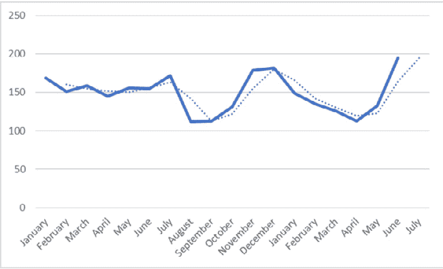
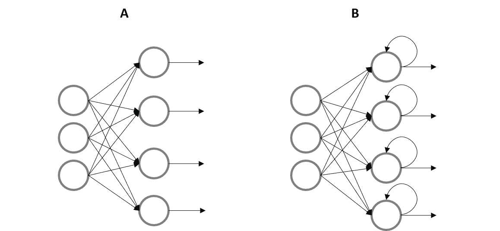
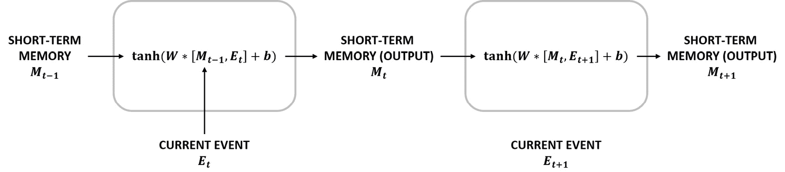
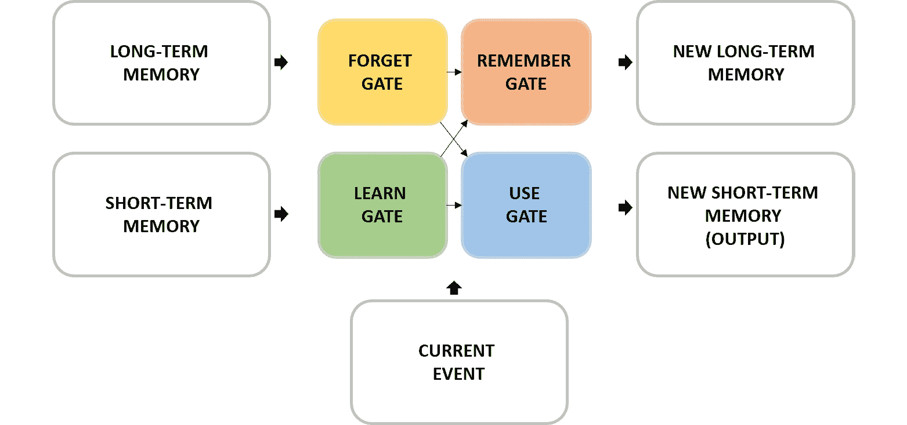
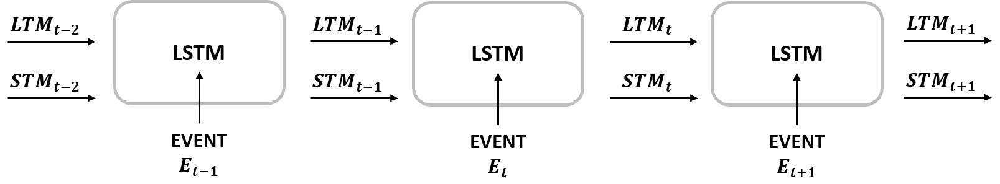
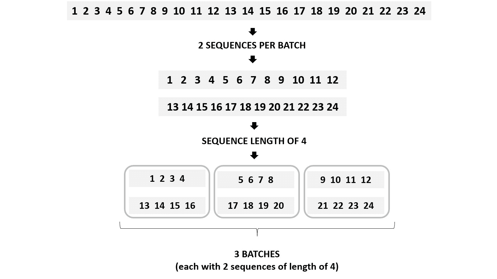
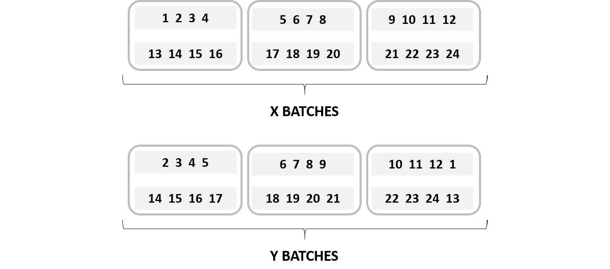
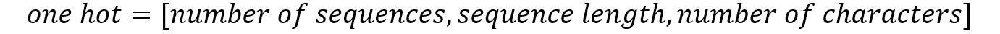

# *第六章*

# 使用 RNN 分析数据序列

## 学习目标

在本章结束时，您将能够：

+   解释递归神经网络（RNNs）的概念

+   构建一个简单的 RNN 架构来解决预测数据问题

+   使用长短期记忆（LSTM）架构工作，并使用 LSTM 网络生成文本

+   使用长期和短期记忆解决数据问题

+   使用 RNN 解决自然语言处理（NLP）问题

在本章中，您将学习如何使用 RNN 解决 NLP 问题所需的技能。

## 简介

在前面的章节中，解释了不同的网络架构——从传统的人工神经网络（ANNs），可以解决分类和回归问题，到卷积神经网络（CNNs），主要用于通过执行目标分类、定位、检测和分割的任务来解决计算机视觉问题。

在本章的最后，我们将探讨**递归神经网络**（**RNNs**）的概念，并解决序列数据问题。这些网络架构能够处理序列数据，其中上下文至关重要，这得益于它们能够保持来自先前预测的信息，这称为记忆。这意味着例如在分析句子时，逐词处理时，当处理最后一个词时，RNNs 有能力保持来自句子第一个词的信息。

此外，本章还将探索**长短期记忆**（**LSTM**）网络架构，这是一种能够同时保持长期和短期记忆的 RNN 类型，特别适用于长序列数据，如视频剪辑。

最后，本章还将探讨**自然语言处理**（**NLP**）的概念。NLP 指的是计算机与人类语言的交互，这是一个当前流行的话题，得益于提供定制客户服务的虚拟助手的兴起。尽管如此，本章将使用 NLP 来进行情感分析，其目的是分析句子背后的含义。这对于理解客户对产品或服务的情感态度非常有用，基于客户的评价。

#### 注意

作为提醒，本章节使用的所有代码都可以在[`github.com/TrainingByPackt/Applied-Deep-Learning-with-PyTorch`](https://github.com/TrainingByPackt/Applied-Deep-Learning-with-PyTorch)找到。

## 递归神经网络

就像人类不会每秒都重新思考一样，旨在理解人类语言的神经网络也不应该这样做。这意味着为了理解段落甚至整本书中的每个单词，您或模型需要理解先前的单词，这有助于给那些可能有不同含义的单词提供上下文。

传统神经网络，正如我们迄今所讨论的，无法执行这些任务——因此产生了 RNN 的概念和网络架构。如前所述，这些网络架构在不同节点之间包含循环。这使得信息能够在模型中保留更长时间。因此，模型的输出既是预测，也是记忆，当通过模型传递下一个序列文本片段时将使用该记忆。

这个概念可以追溯到 20 世纪 80 年代，尽管近年来才因技术进步而受到欢迎，这些技术进步提高了机器的计算能力，并允许数据的收集，还有 1990 年代 LSTM RNN 概念的发展，增加了它们的行动范围。由于能够存储内部记忆，RNN 是最有前途的网络架构之一，这使它们能够高效处理数据序列并解决各种数据问题。

### RNN 的应用

尽管我们已经非常清楚 RNN 最适合处理数据序列，比如文本、音频片段和视频，但仍有必要解释 RNN 在现实问题中的不同应用，以理解它们为什么每天都在日益增长的流行度。

这里简要解释了通过使用 RNN 可以执行的不同任务：

+   **自然语言处理（NLP）**：这指的是机器代表人类语言的能力。如今，这可能是深度学习中最受关注的领域之一，无疑也是在利用 RNN 时首选的数据问题。其思想是使用文本作为输入数据来训练网络，比如诗歌和书籍等，目的是创建一个能够生成这些文本的模型。

    NLP 通常用于创建聊天机器人（虚拟助手）。通过学习以前的人类对话，NLP 模型能够帮助人解决常见问题或查询。您可能在尝试通过在线聊天系统联系银行时经历过这种情况，在这种情况下，一般会在查询超出常规范围时转接到人工操作员。


###### 图 6.1：Facebook 的 Messenger 聊天机器人

+   **语音识别**：类似于自然语言处理（NLP），语音识别试图理解和表达人类语言。然而，这里的区别在于前者（NLP）是经过训练并以文本形式输出结果，而后者（语音识别）则使用音频片段。随着该领域的发展以及大公司的兴趣，这些模型能够理解不同的语言，甚至不同的口音和发音。

    语音识别设备的一个流行例子是 Alexa - 亚马逊的语音激活虚拟助理模型：


###### 图 6.2：亚马逊的 Alexa

+   **机器翻译**：这指的是机器有效地翻译人类语言的能力。根据这一原理，输入是源语言（例如西班牙语），输出是目标语言（例如英语）。自然语言处理与机器翻译的主要区别在于，后者的输出是在将整个输入馈送到模型之后构建的。

    随着全球化的兴起和休闲旅行的流行，现代人需要访问多种语言。因此，涌现了能够在不同语言之间进行翻译的设备的大量使用。其中最新的创新之一是 Google 推出的 Pixel Buds，可以实时进行翻译：


###### 图 6.3：Google Pixel Buds

+   **时间序列预测**：RNN 的一个较少被使用的应用是基于历史数据预测未来数据点序列。由于 RNN 具有保持内部记忆的能力，因此特别擅长这项任务，使得时间序列分析能够考虑过去不同时间步中的数据来进行未来的预测或一系列预测。

    这经常用于预测未来的收入或需求，帮助公司为不同的情况做好准备：



###### 图 6.4：每月销量（数量）的预测

例如，通过预测多种健康产品的需求，确定其中一种产品将增加而另一种将减少，公司可以决定生产更多这种产品而减少其他产品的生产量。

+   **图像识别**：结合 CNN，RNN 可以给图像加上标题或描述。这种模型组合使得您能够检测图像中的所有物体，并因此确定图像的主要构成。输出可以是图像中存在的对象的一组标签，图像的描述，或者是图像中相关对象的标题，如下图所示：


###### 图 6.5：使用 RNN 进行图像识别

### RNN 如何工作？

简而言之，RNN 接收一个输入（x）并返回一个输出（y）。在这里，输出不仅受输入影响，还受过去输入的整个历史影响。这些输入的历史通常称为模型的内部状态或记忆，这些是按顺序排列并相互关联的数据序列，例如时间序列，即按顺序列出的数据点（例如销售），这些数据点相互关联。

#### 注意

请记住，RNN 的一般结构可能会根据具体问题而变化。例如，它们可以是一对多类型或多对一类型，如*第二章*中所述，*神经网络的基本构建块*。

为了更好地理解 RNN 的概念，重要的是解释 RNN 与传统神经网络之间的区别。传统神经网络通常被称为前馈神经网络，因为信息只沿着一个方向移动，即从输入到输出，不会经过节点两次进行预测。这些网络对过去输入的记忆没有任何信息，这也是它们无法预测序列中接下来发生什么的原因。

另一方面，在循环神经网络中，信息通过循环来循环使用，以便每个预测都考虑输入和先前预测的记忆。它通过复制每个预测的输出，并将其传递回网络进行下一个预测。这样，循环神经网络有两个输入：当前值和过去的信息：



###### 图 6.6：网络的图形表示，其中 A 显示了前馈神经网络，B 显示了 RNN

#### 注意

传统 RNN 的内部记忆仅限于短期。然而，我们将在后面探讨一种能够存储长期和短期记忆的架构。

通过使用先前预测的信息，网络使用一系列有序数据进行训练，从而预测下一个步骤。这是通过将当前信息与前一步骤的输出合并为单个操作来实现的（如*图 6.7*所示）。这个操作的输出将成为预测结果，同时也是后续预测的一部分输入：



###### 图 6.7：每个预测的 RNN 计算

如你所见，节点内部的操作与任何其他神经网络相同；最初，数据通过线性函数传递。权重和偏差是训练过程中要更新的参数。接下来，使用激活函数打破这个输出的线性性质。在这种情况下，使用的是`tanh`函数，因为多项研究表明它对大多数数据问题能够达到更好的结果：


###### 图 6.8：传统 RNN 的数学计算

在这里，Mt-1 指的是从先前预测导出的记忆，W 和 b 是权重和偏差，而 E 则指当前事件。

考虑一个产品过去两年的销售数据。RNNs 能够预测下个月的销售情况，因为它们通过存储过去几个月的信息，可以检查销售是增加还是减少。

使用 *Figure 6.7*，可以通过使用上个月的销售数据（即当前事件）和短期记忆（这是过去几个月数据的表示）进行下个月的预测。这个操作的输出将包含下个月的预测以及过去几个月的相关信息，这些信息反过来将成为后续预测的新的短期记忆。

此外，还需提到一些 RNN 架构，如 LSTM 网络，也能考虑两年甚至更早的数据（因为它存储了长期记忆），这将帮助网络了解某个月份的减少趋势是否可能继续减少或开始增加。我们稍后会更详细地探讨这个话题。

### PyTorch 中的 RNN

在 PyTorch 中，就像任何其他层一样，递归层在一行代码中定义。然后会在网络的前向函数中调用，如下面的代码所示：

```py
class RNN(nn.Module):
    def __init__(self, input_size, hidden_size, num_layers):
        super().__init__()
        self.hidden_size = hidden_size
        self.rnn = nn.RNN(input_size, hidden_size, num_layers,
        batch_first=True)
        self.output = nn.Linear(hidden_size, 1)
        def forward(self, x, hidden):
            out, hidden = self.rnn(x, hidden)
            out = out.view(-1, self.hidden_size)
            out = self.output(out)
            return out, hidden
```

在此，递归层必须定义为接受输入中预期特征的数量 (`input_size`)；由用户定义的隐藏状态中的特征数量 (`hidden_size`)；以及递归层数量 (`num_layers`)。

#### 注意

与任何其他神经网络类似，隐藏大小指的是该层中的节点（神经元）数量。

`batch_first` 参数设置为 `True`，以定义输入和输出张量为批处理、序列和特征的形式。

在 `forward` 函数中，输入通过递归层并展开，以通过完全连接的层传递。

此类网络的训练可以如下处理：

```py
for i in range(1, epochs+1):

    hidden = None

    for inputs, targets in batches:
       pred, hidden = model(inputs, hidden)

       loss = loss_function(pred, targets)
       optimizer.zero_grad()
       loss.backward()
       optimizer.step()
```

对于每个 epoch，隐藏状态被初始化为 `none`。这是因为在每个 epoch 中，网络将尝试将输入映射到目标（在给定一组参数的情况下）。这种映射应该在不受来自先前数据集运行的偏置（隐藏状态）的影响下进行。

接下来，通过 `for` 循环遍历不同的数据批次。在此循环内，进行预测，并保存隐藏状态以供下一个批次使用。

最后，计算损失函数，用于更新网络的参数。然后，这个过程会再次开始，直到达到期望的 epoch 数量。

### 活动 11：使用简单的 RNN 进行时间序列预测

对于下面的活动，将使用一个简单的 RNN 来解决时间序列问题。考虑以下情景：您的公司希望能够提前预测所有产品的需求。这是因为每个产品的生产需要相当长的时间，并且程序成本高昂。因此，他们不希望在产品可能被销售之前花费时间和金钱。为了预测这一点，他们提供了一个数据集，其中包含去年销售的所有产品的每周需求（销售交易量）：

#### 注意

包含用于下面活动的数据集的 CSV 文件可以在本书的 GitHub 仓库中找到。该仓库的 URL 在本章的介绍中提到。它也可以在线访问：[`archive.ics.uci.edu/ml/datasets/Sales_Transactions_Dataset_Weekly.`](https://archive.ics.uci.edu/ml/datasets/Sales_Transactions_Dataset_Weekly.)

1.  首先，导入所需的库。

1.  然后，将 `seed` 设置为 `0`，以在本书中重现结果，使用以下代码行：

    ```py
    torch.manual_seed(0)
    ```

1.  加载数据集并对其进行切片，以包含所有行但只包含从索引 1 到 52 的列。

1.  绘制来自整个数据集的五种随机选择产品的每周销售交易。在进行随机抽样时，请使用随机种子 `0`，以获得与当前活动中相同的结果。

1.  创建将输入到网络以创建模型的 `inputs` 和 `targets` 变量。这些变量应该具有相同的形状，并转换为 PyTorch 张量。

    `inputs` 变量应该包含所有产品在所有周的数据，除了最后一周，因为模型的想法是预测这最后一周。

    `targets` 变量应该比 `inputs` 变量提前一步 - 也就是说，`targets` 变量的第一个值应该是 `inputs` 变量的第二个值，依此类推，直到 `targets` 变量的最后一个值（应该是在 `inputs` 变量之外剩下的最后一周）。

1.  创建一个包含网络架构的类；请注意全连接层的输出大小应为 1。

1.  初始化包含模型的类函数。输入大小、每个递归层中的神经元数（10）和递归层的数量（1）。

1.  定义损失函数、优化算法和训练网络的 epochs 数量；使用均方误差损失函数、Adam 优化器和 10,000 个 epochs。

1.  使用 `for` 循环执行训练过程，遍历所有 epochs。在每个 epoch 中，必须进行预测，同时计算损失函数并优化网络参数。然后，保存每个 epoch 的损失。

1.  绘制所有 epochs 的损失。

1.  使用散点图显示在训练过程的最后一个时期获得的预测结果与地面真实值（即上周销售交易）的对比。

    #### 注意

    此活动的解决方案可在第 219 页找到。

## 长短期记忆网络（LSTM）

如前所述，RNN 只存储短期记忆。在处理长序列数据时会出现问题，网络将难以将早期步骤的信息传递到最终步骤。

例如，以诗人埃德加·爱伦·坡创作的诗《乌鸦》为例，全文超过 1000 字。试图使用传统的 RNN 处理它，目的是创建一个相关的后续诗歌，将导致模型忽略第一段落中的关键信息。这反过来可能导致输出与诗歌的初始主题无关。例如，它可能会忽略事件发生在夜晚，从而使新诗歌不够可怕。

这种无法保持长期记忆的问题是因为传统的 RNN 遇到了称为梯度消失的问题。当梯度变得极小以至于不再对网络的学习过程有贡献时，用于更新网络参数以最小化损失函数的梯度在网络的早期层次通常会出现这种情况，导致网络忘记了一段时间前看到的信息。

因此，**LSTM** 网络被开发出来。LSTM 网络能够像计算机一样在长时间内记住信息，通过使用门控的方式来读取、写入和删除信息。

这些门有助于网络决定保留哪些信息以及删除哪些信息（是否打开门），根据它分配给每个信息位的重要性。这非常有用，因为它不仅允许存储更多信息（作为长期记忆），而且还有助于丢弃可能改变预测结果的无用信息，例如句子中的冠词。

### 应用

除了先前解释的应用外，LSTM 网络存储长期信息的能力使数据科学家能够解决复杂的数据问题，这些问题利用大量数据序列作为输入，下面将进一步解释其中一些：

+   **文本生成**：生成任何文本，比如你正在阅读的文本，可以转换为 LSTM 网络的任务。这通过基于所有先前的字母选择每个字母来实现。执行此任务的网络使用大文本进行训练，例如著名书籍的文本。这是因为最终模型将创建与训练文本写作风格相似的文本。例如，经过诗歌训练的模型将具有与与邻居交谈不同的叙述。

+   **音乐生成**：就像文本序列可以输入到网络中以生成类似的新文本一样，音符序列也可以输入到网络中以生成新的音乐音符序列。跟踪先前的音符将有助于实现和谐的旋律，而不仅仅是一系列随机的音乐音符。例如，输入来自 The Beatles 的一首流行歌曲的音频文件将产生一系列音乐音符，这些音符类似于该组合的和声。

+   **手写生成和识别**：在这里，每个字母也是所有前一个字母的产物，这将导致一组有意义的手写字母。同样，LSTM 网络也可以用于识别手写文本，其中一个字母的预测将依赖于先前预测的所有字母。

### LSTM 网络如何工作？

到目前为止，已经明确了 LSTM 网络与传统 RNN 的区别在于它们具有长期记忆的能力。然而，值得一提的是，随着时间的推移，非常旧的信息不太可能影响下一个输出。考虑到这一点，LSTM 网络还具有考虑数据位之间距离和底层上下文的能力，以便还可以决定遗忘一些不再相关的信息。

那么，LSTM 网络如何决定何时记住何时遗忘？与传统的 RNN 不同，传统的 RNN 在每个节点只执行一个计算，而 LSTM 网络执行四种不同的计算，允许网络的不同输入之间的交互（即当前事件、短期记忆和长期记忆）得出结果。

要理解 LSTM 网络背后的过程，让我们考虑用于管理网络中信息的四个门，这些门在下图中表示：



###### 图 6.9：LSTM 网络门

*图 6.9* 中每个门的功能可以解释如下：

+   `tanh`). 这个输出乘以一个忽略因子，去除任何不相关的信息。要计算忽略因子，将短期记忆和当前事件通过线性函数传递。然后，它们通过`sigmoid`激活函数挤压在一起：


###### 图 6.10: 学习门中发生的数学计算

在这里，STM 指的是从先前预测中得出的短期记忆，W 和 b 是权重和偏置，E 指当前事件。

+   `sigmoid`）：


###### 图 6.11: 忘记门中发生的数学计算

在这里，STM 指的是从先前预测中得出的短期记忆，LSM 是从先前预测中得出的长期记忆，W 和 b 是权重和偏置，E 指当前事件。

+   **记忆门**：在忘记门中未被遗忘的长期记忆和从学习门中保留的信息在记忆门中合并在一起，成为新的长期记忆。从数学上讲，这通过将来自学习门和忘记门的输出相加来实现：


###### 图 6.12: 记忆门中发生的数学计算

在这里，L 指的是来自学习门的输出，而 F 是来自忘记门的输出。

+   `tanh`）对忘记门的输出执行线性和激活函数（`sigmoid`）。其次，它对短期记忆和当前事件的输出进行线性和激活函数（`sigmoid`）运算。第三，它将前述步骤的输出相乘。第三步的输出将成为新的短期记忆和当前步骤的预测：


###### 图 6.13: 使用门中发生的数学计算

在这里，STM 指的是从先前预测中得出的短期记忆，W 和 b 是权重和偏置，E 指当前事件。

#### 注意

尽管使用不同的激活函数和数学运算符似乎是随意的，但之所以这样做是因为它已被证明适用于处理大量数据序列的大多数数据问题。

模型执行的每一个预测都会进行上述过程。例如，对于一个用于创建文学作品的模型，学习、遗忘、记忆和使用信息的过程将针对每个将由模型生成的字母执行，如下图所示：



###### 图 6.14: LSTM 网络随时间的过程

## PyTorch 中的 LSTM 网络

在 PyTorch 中定义 LSTM 网络架构的过程与我们迄今讨论的任何其他神经网络类似。然而，重要的是要注意，当处理与数字不同的数据序列时，需要进行一些预处理，以便将数据馈送到网络中进行理解和处理。

考虑到这一点，将会对训练模型的一般步骤进行解释，以便能够将文本数据作为输入并检索到新的文本数据。重要的是要提到，并非所有在此处解释的步骤都是严格必需的，但作为一组，它们使得使用 LSTM 处理文本数据的代码简洁且可重复使用：

### 预处理输入数据

第一步是将文本文件加载到代码中。此数据将经过一系列转换，以便正确地馈送到模型中。这是必要的，因为神经网络执行一系列数学计算以产生输出，这意味着所有输入必须是数值型的。此外，将数据以批次形式馈送到模型中也是一个好习惯，而不是一次性全部馈送，因为这有助于减少训练时间，特别是对于长数据集。这些转换过程如下所述：

**编号标签**

首先，从输入数据中获取一个无重复字符的列表。每个字符都被分配一个数字。然后，通过将每个字符替换为分配的数字来对输入数据进行编码。例如，单词"hello"将根据以下字符和数字的映射被编码为 123344：


###### 图 6.15：字符和数字的映射

**生成批次**

对于 RNNs，批次是使用两个变量创建的。首先是每个批次中的序列数，其次是每个序列的长度。这些值用于将数据分割成矩阵，有助于加快计算速度。

使用一个包含 24 个整数的数据集，每批次的序列数设置为 2，序列长度为 4，划分过程如下：



###### 图 6.16：用于 RNN 的批次生成

如*图 6.16*所示，创建了 3 个批次，每个批次包含 2 个长度为 4 的序列。

这个批次生成过程应该对`x`和`y`分别进行，前者是网络的输入，后者代表目标。根据这一点，网络的思想是找到一种方法来映射`x`和`y`之间的关系，考虑到`y`将比`x`提前 1 步。

`x`的批次是按照前述图表（图 6.16）中解释的方法创建的。然后，`y`的批次将与`x`的长度相同。这是因为`y`的第一个元素将是`x`的第二个元素，依此类推，直到`y`的最后一个元素（它将是`x`的第一个元素）：

#### 注意

有多种不同的方法可以用来填充`y`的最后一个元素，这里提到的方法是最常用的方法。选择方法通常是偏好的问题，尽管某些数据问题可能更适合某种方法而不是其他方法。



###### 图 6.17：X 和 Y 的批次表示

#### 注意

尽管生成批次被认为是数据预处理的一部分，但通常在训练过程的`for`循环内编程。

### 单热编码

将所有字符转换为数字并不足以将它们馈送到模型中。这是因为此近似会为您的模型引入一些偏差，因为转换为较高数值的字符将被视为更重要。为了避免这种情况，最好的做法是将不同批次编码为单热矩阵。这包括创建一个由零和一组成的三维矩阵，其中零表示事件的缺失，而一表示事件的存在。请记住，矩阵的最终形状应如下所示：



###### 方程式 6.18：单热矩阵维度

这意味着对于批次中的每个位置，它将创建一个长度等于整个文本中字符总数的值序列。对于每个字符，它将放置一个零，除了在该位置存在的字符（在该位置将放置一个一）。

#### 注意

您可以在[`hackernoon.com/what-is-one-hot-encoding-why-and-when-do-you-have-to-use-it-e3c6186d008f`](https://hackernoon.com/what-is-one-hot-encoding-why-and-when-do-you-have-to-use-it-e3c6186d008f)找到更多关于单热编码的信息。

### 构建架构

与其他神经网络类似，LSTM 层可以在一行代码中轻松定义。然而，网络架构的类现在必须包含一个函数，允许初始化隐藏状态和细胞状态的特征（即网络的两个记忆）。以下是 LSTM 网络架构的示例：

```py
class LSTM(nn.Module):
    def __init__(self, char_length, hidden_size, n_layers):
        super().__init__()
        self.hidden_size = hidden_size
        self.n_layers = n_layers
        self.lstm = nn.LSTM(char_length, hidden_size, n_layers,                             batch_first=True)
        self.output = nn.Linear(hidden_size, char_length)

    def forward(self, x, states):
        out, states = self.lstm(x, states)
        out = out.contiguous().view(-1, self.hidden_size)
        out = self.output(out)

        return out, states

    def init_states(self, batch_size):
        hidden = next(self.parameters()).data.new(self.n_layers,                  batch_size, self.hidden_size).zero_()
        cell = next(self.parameters()).data.new(self.n_layers,                batch_size, self.hidden_size).zero_()
        states = (hidden, cell)

        return states
```

#### 注意

再次，当输入和输出张量以批次、序列和特征的形式存在时，`batch_first`参数被设置为`True`。否则，无需定义它，因为其默认值为`False`。

正如所示，LSTM 层在一行中定义，其参数包括输入数据中的特征数（即非重复字符的数量）、隐藏维度（神经元数）和 LSTM 层的数量。

前向函数与任何其他网络一样，定义了数据在前向传递过程中在网络中的移动方式。

最后，定义一个函数来在每个 epoch 中将隐藏状态和单元状态初始化为零。这通过`next(self.parameters()).data.new()`来实现，它获取模型的第一个参数，并创建一个相同类型的新张量，其内部括号中指定的维度被填充为零。隐藏状态和单元状态被作为元组输入到模型中。

### 训练模型

一旦损失函数和优化算法被定义，就可以开始训练模型了。这通过遵循与其他神经网络架构类似的方法来实现，如下面的代码片段所示：

```py
for e in range(1, epochs+1):
    states = model.init_states(n_seq)

    for b in range(0, x.shape[1], seq_length):
        x_batch = x[:,b:b+seq_length]

        if b == x.shape[1] - seq_length:
            y_batch = x[:,b+1:b+seq_length]
            y_batch = np.hstack((y_batch, indexer["."] *                       np.ones((y_batch.shape[0],1))))
        else:
            y_batch = x[:,b+1:b+seq_length+1]

        x_onehot = torch.Tensor(index2onehot(x_batch))
        y = torch.Tensor(y_batch).view(n_seq * seq_length)

        pred, states = model(x_onehot, states)
        loss = loss_function(pred, y.long())
        optimizer.zero_grad()
        loss.backward(retain_graph=True)
        optimizer.step()
```

如前面的代码所示，遵循以下步骤：

1.  需要多次通过数据以获得更好的模型；因此，需要设置一个 epoch 数。

1.  每个 epoch 中，必须初始化隐藏状态和单元状态。这通过调用在类中之前创建的函数来实现。

1.  数据以批次输入到模型中；需要考虑将输入数据编码为一个独热矩阵。

1.  通过调用模型在一批数据上的输出，然后计算损失函数，最后优化参数来获取网络的输出。

### 进行预测

在训练模型之前，提供前几个字符给训练模型是一个好的实践，以便进行具有一定目的的预测。这个初始字符应该在不进行任何预测的情况下输入到模型中，但目的是生成一个记忆。接下来，每个新字符是通过将前一个字符和记忆输入到网络中来创建的。然后，模型的输出通过`softmax`函数传递，以获取新字符成为每个可能字符的概率。最后，从具有较高概率的字符中随机选择一个。

### 活动 12：使用 LSTM 网络进行文本生成

#### 注意

用于接下来的活动的文本数据可以在互联网上免费获取，尽管您也可以在本书的 GitHub 存储库中找到它。存储库的 URL 在本章的介绍中有提及。

对于以下活动，我们将使用《爱丽丝梦游仙境》训练一个 LSTM 网络，然后能够向模型提供一个起始句子并让它完成句子。让我们考虑以下情景：你喜欢能让生活更轻松的事物，并决定建立一个模型，帮助你在写电子邮件时完成句子。为此，你已经决定使用一本流行的儿童书籍来训练一个网络：

#### 注意

值得一提的是，虽然本活动中的网络经过了足够的迭代以显示出不错的结果，但它并未经过训练和配置以达到最佳性能。鼓励您进行调整以改善性能。

1.  导入所需的库。

1.  打开并读取《爱丽丝梦游仙境》的文本到笔记本中。打印前 100 个字符的摘录和文本文件的总长度。

1.  创建一个包含数据集中不重复字符的列表变量。然后，创建一个字典，将每个字符映射到一个整数，其中字符将是键，整数将是值。

1.  将数据集中的每个字母编码为它们配对的整数。打印前 100 个编码字符和编码版本的总长度。

1.  创建一个函数，接受一个批次并将其编码为一个独热矩阵。

1.  创建定义网络架构的类。该类应包含一个额外的函数，用于初始化 LSTM 层的状态。

1.  确定要从数据集中创建的批次数，记住每个批次应包含 100 个序列，每个序列长度为 50。接下来，将编码数据拆分为 100 个序列。

1.  使用 256 作为两个递归层的隐藏单元数来初始化您的模型。

1.  定义损失函数和优化算法。使用 Adam 优化器和交叉熵损失。

1.  训练网络 20 个时期，记住每个时期数据必须分成具有 50 个序列长度的批次。这意味着每个时期将有 100 个序列，每个长度为 50。

    #### 注意

    请牢记，批次不仅适用于输入和目标，其中后者是前者的副本，但向前推进一步。

1.  绘制损失函数随时间的进展。

1.  使用以下句子作为训练模型的开头，并完成句子："So she was considering in her own mind "

    #### 注意

    本活动的解决方案可以在第 223 页找到。

## 自然语言处理（NLP）

计算机擅长分析标准化数据，例如财务记录或存储在表格中的数据库。事实上，它们比人类更擅长这样做，因为它们能够同时分析数百个变量。另一方面，人类擅长分析非结构化数据，例如语言，这是计算机在没有一套规则的情况下理解得不太好的事情。

有鉴于此，计算机在处理人类语言方面最大的挑战是，即使计算机在非常长时间内在非常大的数据集上经过训练后能够很好地分析人类语言，它们仍然无法理解句子背后的真实含义，因为它们既不直观，也无法读懂行间之义。

这意味着，虽然人类能理解这样一句话：“昨晚他火力全开。多么精彩的比赛！”指的是某种体育运动中某位运动员的表现，但计算机会按照字面意义理解它，即将其解释为昨晚某人确实着火了。

自然语言处理（NLP）是人工智能（AI）的一个子领域，通过使计算机能够理解人类语言来运作。虽然可能总是人类在这项任务上更胜一筹，但 NLP 的主要目标是使计算机在理解人类语言方面更接近人类。

思路是创建专注于理解人类语言特定领域的模型，如机器翻译和文本摘要。这种任务的专业化有助于计算机开发出能够解决现实数据问题的模型，而无需一次处理所有人类语言的复杂性。

当今非常流行的人类语言理解领域之一是情感分析。

### 情感分析

总体而言，情感分析包括理解输入文本背后的情感。随着社交媒体平台的兴起，每天公司接收到的消息和评论数量呈指数级增长，情感分析因此变得越来越受欢迎。这使得实时手动检查和回复每条消息的任务变得不可能，这可能对公司形象造成损害。

情感分析专注于提取句子的关键组成部分，同时忽略细节。这有助于解决两个主要需求：

1.  辨认顾客最关心的产品或服务的关键方面。

1.  提取每个方面背后的情感，以确定哪些方面引起了积极和消极反应，并因此能够相应地进行转化：


###### 图 6.19：一条推特的示例

从上图可见，进行情感分析的模型可能会获取以下信息：

"Debates" 作为推文的主要话题。

"Sad" 表示从中产生的情感。

"America" 作为该话题情感的主要地点。

正如您所见，情感分析的概念对于任何具有在线存在的公司都可能至关重要，因为它将能够对那些需要立即关注的评论作出令人惊讶的快速反应，并且具有与人类相似的精度。

作为情感分析的示例用途，一些公司可能选择对他们每天接收的大量消息执行情感分析，以便为那些包含投诉或负面情绪的消息优先进行响应。这不仅有助于缓解特定客户的负面情绪；还有助于公司迅速改进他们的错误并与客户建立信任关系。

关于情感分析的自然语言处理（NLP）过程将在接下来的部分中进一步解释。我们将解释词嵌入的概念以及您可以执行的不同步骤来在 PyTorch 中开发这样一个模型，这将是本章最后活动的目标。

## 在 PyTorch 中的情感分析

在 PyTorch 中构建情感分析模型与我们迄今为止看到的 RNNs 非常相似。不同之处在于，这次文本数据将逐词进行处理。下面列出了构建这样一个模型所需的步骤。

### 预处理输入数据

与任何其他数据问题一样，首先将数据加载到代码中，记住不同数据类型使用不同的方法。除了将整套单词转换为小写之外，数据还经历了一些基本的转换，这将允许您将数据馈送到网络中。最常见的转换如下所示：

+   **消除标点符号**：在处理文本数据时，逐词进行自然语言处理时，去除任何标点符号是一个良好的实践。这是为了避免将同一个单词视为两个不同的单词，因为其中一个后面跟着句点、逗号或任何其他特殊字符。一旦实现了这一点，就可以定义一个包含词汇表（即输入文本中存在的所有单词集合）的列表。

+   **数字标签**：与先前解释的字符映射过程类似，词汇表中的每个单词都映射到一个整数，该整数将用于替换输入文本中的单词以供输入到网络中：


###### Equation 6.20: 单词和数字的映射

与执行独热编码不同，PyTorch 允许您在包含网络架构的类内部定义一行代码，该代码可以嵌入单词，这将在接下来解释。

### 构建架构

再次强调，定义网络架构的过程与我们迄今为止所学的相似。然而，正如前面提到的，网络还应包括一个嵌入层，该层将接收已转换为数值表示的输入数据，并为每个词分配一个相关度。也就是说，在训练过程中，将更新这些值，直到最相关的词被赋予更高的权重。

接下来，显示了一个架构示例：

```py
class LSTM(nn.Module):
    def __init__(self, vocab_size, embed_dim, hidden_size, n_layers):
        super().__init__()
        self.hidden_size = hidden_size
        self.embedding = nn.Embedding(vocab_size, embed_dim)
        self.lstm = nn.LSTM(embed_dim, hidden_size, n_layers
        self.output = nn.Linear(hidden_size, 1)

    def forward(self, x, states):
        out = self.embedding(x)
        out, states = self.lstm(out, states)
        out = out.contiguous().view(-1, self.hidden_size)
        out = self.output(out)

        return out, states
```

如您所见，嵌入层将以整个词汇表的长度和由用户设置的嵌入维度作为参数。这个嵌入维度将是 LSTM 层的输入大小，其余的架构将与之前保持一致。

### 训练模型

最后，在定义损失函数和优化算法之后，训练模型的过程与其他神经网络相同。数据可能根据研究的需求和目的分为不同的集合。为了将数据分成批次，定义了一些时期和方法。网络的内存通常在数据的批次之间保持不变，但在每个时期都会初始化为零。通过对数据批次调用模型来获得网络的输出，然后计算损失函数并优化参数。

### 活动 13：进行情感分析的自然语言处理

#### 注意

包含以下活动将使用的数据集的文本文件可以在本书的 GitHub 仓库中找到。仓库的 URL 在本章的介绍中提到。它也可以在[`archive.ics.uci.edu/ml/datasets/Sentiment+Labelled+Sentences`](https://archive.ics.uci.edu/ml/datasets/Sentiment+Labelled+Sentences)上找到。

在以下活动中，将使用 LSTM 网络分析一组评论以确定它们背后的情感。假设以下情景：您在互联网提供商的公共关系部门工作，并且审查公司社交媒体个人资料上每个查询的过程需要相当长的时间。最大的问题是那些对服务有问题的客户比没有问题的客户更加缺乏耐心，因此您需要优先处理他们的回应。由于您在空闲时间喜欢编程，您决定尝试构建一个能够确定消息是负面还是正面的神经网络：

#### 注意

需要提到的是，本活动中的数据并未分为不同的数据集，这些数据集允许对模型进行微调和测试。这是因为活动的主要重点是展示创建一个能够执行情感分析的模型的过程。

1.  导入所需的库。

1.  加载包含 1,000 条亚马逊产品评论及其标签（0 表示负面评论，1 表示正面评论）的数据集。将数据分成两个变量：一个包含评论，另一个包含标签。

1.  从评论中删除标点符号。

1.  创建一个包含整个评论集词汇的变量。另外，创建一个将每个单词映射到整数的字典，其中单词是键，整数是值。

1.  通过用其对应的整数替换评论中的每个单词来对评论数据进行编码。

1.  创建一个包含网络架构的类。确保包含嵌入层。

    #### 注意

    在训练过程中，数据不会以批次方式提供，因此在前向函数中没有必要返回状态。然而，这并不意味着模型没有记忆，而是记忆用于处理每个评论，因为一个评论不依赖于下一个评论。

1.  使用 64 个嵌入维度和 128 个神经元初始化模型，以及 3 层 LSTM。

1.  定义损失函数、优化算法和训练的 epoch 数。例如，可以使用二元交叉熵损失作为损失函数，Adam 优化器，并训练 10 个 epoch。

1.  创建一个 `for` 循环，遍历不同的 epoch 和每个单独的评论。对于每个评论，进行预测，计算损失函数，并更新网络的参数。另外，计算训练数据的准确率。

1.  绘制损失函数和准确率随时间的进展情况。

    #### 注意

    此活动的解决方案可以在第 228 页找到。

## 概要

在本章中，讨论了 RNN。这种类型的神经网络是为了解决序列数据问题而开发的。这意味着单个实例并不包含所有相关信息，因为它依赖于前面实例的信息。

有几个应用程序符合此类描述。例如，文本（或语音）的特定部分如果没有其余文本的上下文可能意义不大。然而，尽管自然语言处理主要探索了 RNN，但在其他应用中文本的上下文仍然很重要，比如预测、视频处理或音乐相关问题。

RNN 的工作方式非常聪明；网络不仅输出结果，还输出一个或多个通常称为记忆的值。这个记忆值被用作未来预测的输入。

还存在不同类型的 RNN 配置，这些配置基于架构的输入和输出。例如，在一对多配置中，多个示例（如单词）可能导致单个最终输出（例如评论是否粗鲁）。在一对多配置中，多个输入将导致多个输出，如语言翻译问题中，输入单词和输出单词不同。

在处理涉及非常大序列的数据问题时，传统的循环神经网络（RNNs）存在一个称为梯度消失的问题，其中梯度变得极小，以至于不再对网络的学习过程做出贡献，通常发生在网络的较早层，导致网络无法具有长期记忆。

为了解决这个问题，开发了 LSTM 网络。这种网络架构能够存储两种类型的记忆，因此得名。此外，在这种网络中发生的数学计算也使其能够遗忘信息——只存储过去的相关信息。

最后，解释了一个非常流行的自然语言处理问题：情感分析。在这个问题中，重要的是理解文本提取背后的情感。对于机器来说，这是一个非常困难的问题，考虑到人类可以使用许多不同的词语和表达形式（例如讽刺）来描述事件背后的情感。然而，由于社交媒体使用的增加，这导致了对文本数据更快处理的需求增加，这个问题因此在大公司中变得非常流行，它们投入了大量时间和资金来创建几种近似解决方案，正如本章的最后一部分所展示的。
