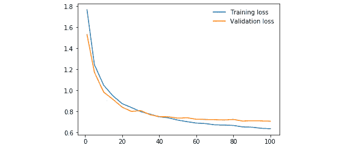
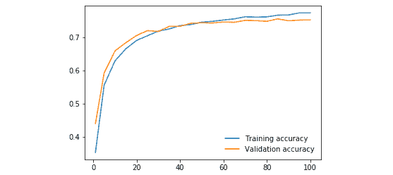
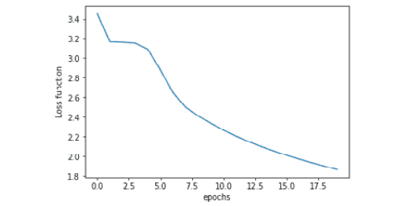

# *附录*

## 关于

这一部分包括帮助学生执行书中活动的步骤。它包括详细的步骤，学生需要执行这些步骤以实现活动的目标。

## 第一章：深度学习和 PyTorch 简介

### 活动 1：创建单层神经网络

解决方案：

1.  导入所需库：

    ```py
    import torch
    import torch.nn as nn
    import matplotlib.pyplot as plt
    ```

1.  创建随机值的虚拟输入数据 (`x`) 和仅包含 0 和 1 的虚拟目标数据 (`y`)。将数据存储在 PyTorch 张量中。张量 `x` 应该大小为 (100,5)，而 `y` 的大小应为 (100,1)：

    ```py
    x = torch.randn(100,5)
    y = torch.randint(0, 2, (100, 1)).type(torch.FloatTensor)
    ```

1.  定义模型的架构并将其存储在名为 `model` 的变量中。记得创建一个单层模型：

    ```py
    model = nn.Sequential(nn.Linear(5, 1),
                          nn.Sigmoid())
    ```

    定义要使用的损失函数。使用均方误差损失函数：

    ```py
    loss_function = torch.nn.MSELoss()
    ```

    定义模型的优化器。使用 Adam 优化器和学习率为 0.01：

    ```py
    optimizer = torch.optim.Adam(model.parameters(), lr=0.01)
    ```

1.  运行 100 次优化迭代。在每次迭代中，打印并保存损失值：

    ```py
    losses = []
    for i in range(100):
        y_pred = model(x)
        loss = loss_function(y_pred, y)
        print(loss.item())
        losses.append(loss.item())
        optimizer.zero_grad()
        loss.backward()
        optimizer.step()
    ```

    最终损失应约为 0.238。

1.  打印最终权重和偏置的值。应该有五个权重（每个输入数据特征一个）和一个偏置值：

    ```py
    model.state_dict()
    ```

1.  制作线图以显示每次迭代步骤的损失值：

    ```py
    plt.plot(range(0,100), losses)
    plt.show()
    ```

    结果图应该如下所示：


###### 图 1.8：训练过程中的损失函数

## 第二章：神经网络的构建模块

### 活动 2：执行数据准备

解决方案：

1.  导入所需库：

    ```py
    import pandas as pd
    ```

1.  使用 pandas 加载文本文件。考虑到之前下载的文本文件与 CSV 文件的格式相同，可以使用 `read_csv()` 函数读取它。确保将 header 参数更改为 `None`：

    ```py
    data = pd.read_csv("YearPredictionMSD.txt", header=None, nrows=50000)
    data.head()
    ```

    #### 注意

    为避免内存限制，在读取文本文件时使用 `nrows` 参数以读取整个数据集的较小部分。在上述示例中，我们读取了前 50,000 行。

1.  验证数据集中是否存在任何定性数据。

    ```py
    data.iloc[0,:]
    ```

1.  检查缺失值。

    如果在之前用于此目的的代码行中添加额外的 `sum()` 函数，则将获得整个数据集中缺失值的总和，而不区分列：

    ```py
    data.isnull().sum().sum() 
    ```

1.  检查异常值：

    ```py
    outliers = {}
    for i in range(data.shape[1]):
        min_t = data[data.columns[i]].mean() - (            3 * data[data.columns[i]].std())
        max_t = data[data.columns[i]].mean() + (            3 * data[data.columns[i]].std())
        count = 0
        for j in data[data.columns[i]]:
            if j < min_t or j > max_t:
                count += 1
        percentage = count/data.shape[0]
        outliers[data.columns[i]] = "%.3f" % percentage
    print(outliers)
    ```

1.  将特征与目标数据分开：

    ```py
    X = data.iloc[:, 1:]
    Y = data.iloc[:, 0]
    ```

1.  使用标准化方法对特征数据进行重新缩放：

    ```py
    X = (X - X.mean())/X.std()
    X.head()
    ```

1.  将数据分割为三组：训练集、验证集和测试集。使用您偏好的方法：

    ```py
    from sklearn.model_selection import train_test_split
    X_shuffle = X.sample(frac=1)
    Y_shuffle = Y.sample(frac=1)
    x_new, x_test, y_new, y_test = train_test_split(X_shuffle,                                                 Y_shuffle,                                                 test_size=0.2,                                                 random_state=0)
    dev_per = x_test.shape[0]/x_new.shape[0]
    x_train, x_dev, y_train, y_dev = train_test_split(x_new,                                                   y_new,                                                   test_size=dev_per,                                                   random_state=0)
    ```

结果的形状应该如下所示：

```py
(30000, 90) (30000, )
(10000, 90) (10000, )
(10000, 90) (10000, )
```

### 活动 3：执行数据准备

解决方案：

1.  导入所需库：

    ```py
    import torch
    import torch.nn as nn
    ```

1.  将先前活动中创建的所有三组数据的特征与目标分离。将 DataFrame 转换为张量：

    ```py
    x_train = torch.tensor(x_train.values).float()
    y_train = torch.tensor(y_train.values).float()
    x_dev = torch.tensor(x_dev.values).float()
    y_dev = torch.tensor(y_dev.values).float()
    x_test = torch.tensor(x_test.values).float()
    y_test = torch.tensor(y_test.values).float()
    ```

1.  定义网络的架构。可以尝试不同的层数和每层单元的组合：

    ```py
    model = nn.Sequential(nn.Linear(x_train.shape[1], 10),
                            nn.ReLU(),
                            nn.Linear(10, 7),
                            nn.ReLU(),
                            nn.Linear(7, 5),
                            nn.ReLU(),
                            nn.Linear(5, 1))
    ```

1.  定义损失函数和优化器算法：

    ```py
    loss_function = torch.nn.MSELoss()
    optimizer = torch.optim.Adam(model.parameters(), lr=0.01)
    ```

1.  使用 `for` 循环训练网络进行 100 次迭代步骤：

    ```py
    for i in range(100):
        y_pred = model(x_train)
        loss = loss_function(y_pred, y_train)
        print(i, loss.item())
        optimizer.zero_grad()
        loss.backward()
        optimizer.step()
    ```

1.  通过对测试集的第一个实例进行预测并将其与实际值进行比较来测试您的模型：

    ```py
    pred = model(x_test[0])
    print(y_test[0], pred)
    ```

您的输出应类似于此：


###### 图 2.29：活动输出

## 第三章：使用深度神经网络的分类问题

### 活动 4：构建人工神经网络

解决方案：

1.  导入以下库：

    ```py
    import pandas as pd
    import numpy as np
    from sklearn.model_selection import train_test_split
    from sklearn.utils import shuffle
    from sklearn.metrics import accuracy_score
    import torch
    from torch import nn, optim
    import torch.nn.functional as F
    import matplotlib.pyplot as plt
    ```

1.  读取之前准备好的数据集，该数据集应命名为`dccc_prepared.csv`：

    ```py
    data = pd.read_csv("dccc_prepared.csv")
    ```

1.  将特征从目标分离开：

    ```py
    X = data.iloc[:,:-1]
    y = data["default payment next month"]
    ```

1.  使用 scikit-learn 的`train_test_split`函数将数据集分割为训练、验证和测试集。使用 60/20/20%的分割比例。将`random_state`设置为 0：

    ```py
    X_new, X_test, y_new, y_test = train_test_split(X, y, test_size=0.2, random_state=0)
    dev_per = X_test.shape[0]/X_new.shape[0]
    X_train, X_dev, y_train, y_dev = train_test_split(X_new, y_new, test_size=dev_per, random_state=0)
    ```

    各个集合的最终形状如下所示：

    ```py
    Training sets: (28036, 22) (28036,)
    Validation sets: (9346, 22) (9346,)
    Testing sets: (9346, 22) (9346,)
    ```

1.  将验证和测试集转换为张量，考虑到特征矩阵应为浮点类型，而目标矩阵不应为浮点类型。

    暂时保持训练集未转换，因为它们将经历进一步的转换。

    ```py
    X_dev_torch = torch.tensor(X_dev.values).float()
    y_dev_torch = torch.tensor(y_dev.values)
    X_test_torch = torch.tensor(X_test.values).float()
    y_test_torch = torch.tensor(y_test.values)
    ```

1.  构建自定义模块类来定义网络的层。包括一个前向函数，该函数指定将应用于每个层输出的激活函数。对于所有层使用 ReLU，输出层使用`log_softmax`：

    ```py
    class Classifier(nn.Module):
        def __init__(self, input_size):
            super().__init__()
            self.hidden_1 = nn.Linear(input_size, 10)
            self.hidden_2 = nn.Linear(10, 10)
            self.hidden_3 = nn.Linear(10, 10)
            self.output = nn.Linear(10, 2)
        def forward(self, x):
            z = F.relu(self.hidden_1(x))
            z = F.relu(self.hidden_2(z))
            z = F.relu(self.hidden_3(z))
            out = F.log_softmax(self.output(z), dim=1)
            return out
    ```

1.  定义训练模型所需的所有变量。将训练周期设置为 50，批量大小设置为 128。使用学习率为 0.001：

    ```py
    model = Classifier(X_train.shape[1])
    criterion = nn.NLLLoss()
    optimizer = optim.Adam(model.parameters(), lr=0.001)
    epochs = 50
    batch_size = 128
    ```

1.  使用训练集数据训练网络。使用验证集来衡量性能。在每个周期中保存训练和验证集的损失和准确率：

    ```py
    train_losses, dev_losses, train_acc, dev_acc= [], [], [], []
    for e in range(epochs):
        X_, y_ = shuffle(X_train, y_train)
        running_loss = 0
        running_acc = 0
        iterations = 0
        for i in range(0, len(X_), batch_size):
            iterations += 1
            b = i + batch_size
            X_batch = torch.tensor(X_.iloc[i:b,:].values).float()
            y_batch = torch.tensor(y_.iloc[i:b].values)
            log_ps = model(X_batch)
            loss = criterion(log_ps, y_batch)
            optimizer.zero_grad()
            loss.backward()
            optimizer.step()
            running_loss += loss.item()
            ps = torch.exp(log_ps)
            top_p, top_class = ps.topk(1, dim=1)
            running_acc += accuracy_score(y_batch, top_class)
            dev_loss = 0
            acc = 0
            with torch.no_grad():
                log_dev = model(X_dev_torch)
                dev_loss = criterion(log_dev, y_dev_torch)
                ps_dev = torch.exp(log_dev)
                top_p, top_class_dev = ps_dev.topk(1, dim=1)
                acc = accuracy_score(y_dev_torch, top_class_dev)
                train_losses.append(running_loss/iterations)
                dev_losses.append(dev_loss)
                train_acc.append(running_acc/iterations)
                dev_acc.append(acc)
                print("Epoch: {}/{}.. ".format(e+1, epochs),
                "Training Loss: {:.3f}.. ".format(running_loss/iterations),
                "Validation Loss: {:.3f}.. ".format(dev_loss),
                "Training Accuracy: {:.3f}.. ".format(running_acc/                                                  iterations),
                "Validation Accuracy: {:.3f}".format(acc))
    ```

1.  绘制两组数据的损失：

    ```py
    plt.plot(train_losses, label='Training loss')
    plt.plot(dev_losses, label='Validation loss')
    plt.legend(frameon=False)
    plt.show()
    ```

    生成的图表应该与此处类似，尽管由于训练数据的洗牌可能会导致略有不同的结果。

    

    

    ###### 图 3.10：显示训练和验证损失的图表

1.  绘制两组数据的准确率：

    ```py
    plt.plot(train_acc, label="Training accuracy")
    plt.plot(dev_acc, label="Validation accuracy")
    plt.legend(frameon=False)
    plt.show()
    ```

    这是从此代码片段生成的图表：


###### 图 3.11：显示集合准确度的图表

### 活动 5：提升模型性能

解决方案：

1.  导入与上一个活动中相同的库：

    ```py
    import pandas as pd
    import numpy as np
    from sklearn.model_selection import train_test_split
    from sklearn.utils import shuffle
    from sklearn.metrics import accuracy_score
    import torch
    from torch import nn, optim
    import torch.nn.functional as F
    import matplotlib.pyplot as plt
    torch.manual_seed(0)
    ```

1.  加载数据并将特征与目标分离。然后，使用 60:20:20 的比例将数据分割为三个子集（训练、验证和测试），最后，像在上一个活动中一样将验证和测试集转换为 PyTorch 张量：

    ```py
    data = pd.read_csv("dccc_prepared.csv")
    X = data.iloc[:,:-1]
    y = data["default payment next month"]
    X_new, X_test, y_new, y_test = train_test_split(X, y, test_size=0.2, random_state=0)
    dev_per = X_test.shape[0]/X_new.shape[0]
    X_train, X_dev, y_train, y_dev = train_test_split(X_new, y_new, test_size=dev_per, random_state=0)
    X_dev_torch = torch.tensor(X_dev.values).float()
    y_dev_torch = torch.tensor(y_dev.values)
    X_test_torch = torch.tensor(X_test.values).float()
    y_test_torch = torch.tensor(y_test.values)
    ```

1.  考虑到模型存在高偏差问题，重点应该是增加训练周期或者通过增加额外的层或单元来扩展网络的规模。

    目标应该是将验证集的准确率近似到 80%。

    下面的代码片段来自经过多次微调后表现最佳的模型：

    ```py
    # class defining model's architecture and operations between layers
    class Classifier(nn.Module):
        def __init__(self, input_size):
            super().__init__()
            self.hidden_1 = nn.Linear(input_size, 100)
            self.hidden_2 = nn.Linear(100, 100)
            self.hidden_3 = nn.Linear(100, 50)
            self.hidden_4 = nn.Linear(50,50)
            self.output = nn.Linear(50, 2)
            self.dropout = nn.Dropout(p=0.1)
            #self.dropout_2 = nn.Dropout(p=0.1)
        def forward(self, x):
            z = self.dropout(F.relu(self.hidden_1(x)))
            z = self.dropout(F.relu(self.hidden_2(z)))
            z = self.dropout(F.relu(self.hidden_3(z)))
            z = self.dropout(F.relu(self.hidden_4(z)))
            out = F.log_softmax(self.output(z), dim=1)
            return out
    # parameters definition
    model = Classifier(X_train.shape[1])
    criterion = nn.NLLLoss()
    optimizer = optim.Adam(model.parameters(), lr=0.001)
    epochs = 3000
    batch_size = 128
    # training process
    train_losses, dev_losses, train_acc, dev_acc= [], [], [], []
    x_axis = []
    for e in range(1, epochs + 1):
        X_, y_ = shuffle(X_train, y_train)
        running_loss = 0
        running_acc = 0
        iterations = 0

        for i in range(0, len(X_), batch_size):
            iterations += 1
            b = i + batch_size
            X_batch = torch.tensor(X_.iloc[i:b,:].values).float()
            y_batch = torch.tensor(y_.iloc[i:b].values)

            log_ps = model(X_batch)
            loss = criterion(log_ps, y_batch)
            optimizer.zero_grad()
            loss.backward()
            optimizer.step()

            running_loss += loss.item()
            ps = torch.exp(log_ps)
            top_p, top_class = ps.topk(1, dim=1)
            running_acc += accuracy_score(y_batch, top_class)

        dev_loss = 0
        acc = 0
        # Turn off gradients for validation, saves memory and computations       with torch.no_grad():
            log_dev = model(X_dev_torch)
            dev_loss = criterion(log_dev, y_dev_torch)
            ps_dev = torch.exp(log_dev)
            top_p, top_class_dev = ps_dev.topk(1, dim=1)
            acc = accuracy_score(y_dev_torch, top_class_dev)
        if e%50 == 0 or e == 1:
            x_axis.append(e)

            train_losses.append(running_loss/iterations)
            dev_losses.append(dev_loss)
            train_acc.append(running_acc/iterations)
            dev_acc.append(acc)

            print("Epoch: {}/{}.. ".format(e, epochs),
                  "Training Loss: {:.3f}.. ".format(running_loss/                                                iterations),
                  "Validation Loss: {:.3f}.. ".format(dev_loss),
                  "Training Accuracy: {:.3f}.. ".format(running_acc/                                                    iterations),
                  "Validation Accuracy: {:.3f}".format(acc))
    ```

    #### 注意

    与此活动相关的 Jupyter 笔记本可以在之前分享的 GitHub 存储库中找到。在那里，您将找到微调模型的不同尝试及其结果。表现最佳的模型位于笔记本的末尾。

1.  绘制两组数据的损失和准确性图表：

    #### 注意

    ```py
    plt.plot(x_axis,train_losses, label='Training loss')
    plt.plot(x_axis, dev_losses, label='Validation loss')
    plt.legend(frameon=False)
    plt.show()
    ```

    

    ###### Figure 3.12: 显示损失的图表

    ```py
    plt.plot(x_axis, train_acc, label="Training accuracy")
    plt.plot(x_axis, dev_acc, label="Validation accuracy")
    plt.legend(frameon=False)
    plt.show()
    ```

    

    ###### Figure 3.13: 显示准确性的图表

1.  使用表现最佳的模型，在测试集上进行预测（在微调过程中不应使用）。通过计算模型在此集合上的准确性，将预测与实际情况进行比较：

    ```py
    model.eval()
    test_pred = model(X_test_torch)
    test_pred = torch.exp(test_pred)
    top_p, top_class_test = test_pred.topk(1, dim=1)
    acc_test = accuracy_score(y_test_torch, top_class_test)
    ```

    通过上述模型架构和定义的参数，获得的准确率应约为 80%。

### 活动 6：使用您的模型

解决方案：

1.  打开您用于上一个活动的 Jupyter 笔记本。

1.  保存一个 Python 文件，其中包含定义表现最佳模块架构的类。确保导入 PyTorch 所需的库和模块。将其命名为`final_model.py`。

    文件应如下所示：

    

    ###### Figure 3.14: final_model.py 的屏幕截图

1.  保存表现最佳的模型。确保保存输入单元的信息以及模型的参数。将其命名为`checkpoint.pth`：

    ```py
    checkpoint = {"input": X_train.shape[1],
                  "state_dict": model.state_dict()}
    torch.save(checkpoint, "checkpoint.pth")
    ```

1.  打开一个新的 Jupyter 笔记本。

1.  导入 PyTorch 以及先前创建的 Python 文件：

    ```py
    import torch
    import final_model
    ```

1.  创建一个加载模型的函数：

    ```py
    def load_model_checkpoint(path):
        checkpoint = torch.load(path)
        model = final_model.Classifier(checkpoint["input"])
        model.load_state_dict(checkpoint["state_dict"])
        return model
    model = load_model_checkpoint("checkpoint.pth")
    ```

1.  将以下张量输入到模型中进行预测：

    ```py
    example = torch.tensor([[0.0606, 0.5000, 0.3333, 0.4828, 0.4000, 0.4000, 0.4000, 0.4000, 0.4000, 0.4000, 0.1651, 0.0869, 0.0980, 0.1825, 0.1054, 0.2807, 0.0016, 0.0000, 0.0033, 0.0027, 0.0031, 0.0021]]).float()
    pred = model(example)
    pred = torch.exp(pred)
    top_p, top_class_test = pred.topk(1, dim=1)
    ```

    通过打印`top_class_test`，我们获得模型的预测结果，这里等于 1（是）。

1.  使用 JIT 模块转换模型：

    ```py
    traced_script = torch.jit.trace(model, example, check_trace=False)
    ```

1.  通过将以下信息输入到模型的跟踪脚本中进行预测：

    ```py
    prediction = traced_script(example)
    prediction = torch.exp(prediction)
    top_p_2, top_class_test_2 = prediction.topk(1, dim=1)
    ```

    通过打印`top_class_test_2`，我们从模型的跟踪脚本表示中获取预测结果，再次等于 1（是）。

## 第四章：卷积神经网络

### 活动 7：为图像分类问题构建 CNN

解决方案：

1.  导入以下库：

    ```py
    import numpy as np
    import torch
    from torch import nn, optim
    import torch.nn.functional as F
    from torchvision import datasets
    import torchvision.transforms as transforms
    from torch.utils.data.sampler import SubsetRandomSampler
    from sklearn.metrics import accuracy_score
    import matplotlib.pyplot as plt
    ```

1.  设置在数据上执行的转换，即将数据转换为张量并标准化像素值：

    ```py
    transform = transforms.Compose([transforms.ToTensor(), transforms.Normalize((0.5, 0.5, 0.5), (0.5, 0.5, 0.5))])
    ```

1.  设置一个批次大小为 100 张图像，并从`CIFAR10`数据集下载训练和测试数据：

    ```py
    batch_size = 100
    train_data = datasets.CIFAR10('data', train=True, download=True, transform=transform)
    test_data = datasets.CIFAR10('data', train=False, download=True, transform=transform)
    ```

1.  使用 20%的验证集大小，定义训练和验证采样器，用于将数据集分成这两组：

    ```py
    dev_size = 0.2
    idx = list(range(len(train_data)))
    np.random.shuffle(idx)
    split_size = int(np.floor(dev_size * len(train_data)))
    train_idx, dev_idx = idx[split_size:], idx[:split_size]
    train_sampler = SubsetRandomSampler(train_idx)
    dev_sampler = SubsetRandomSampler(dev_idx)
    ```

1.  使用`DataLoader()`函数定义每组数据的批处理：

    ```py
    train_loader = torch.utils.data.DataLoader(train_data, batch_size=batch_size, sampler=train_sampler)
    dev_loader = torch.utils.data.DataLoader(train_data, batch_size=batch_size, sampler=dev_sampler)
    test_loader = torch.utils.data.DataLoader(test_data, batch_size=batch_size)
    ```

1.  定义网络的架构。使用以下信息来完成这一步骤：

    +   Conv1：一个卷积层，以彩色图像作为输入，并通过大小为 3 的 10 个滤波器进行处理。填充和步长都应设置为 1。

    +   Conv2：一个卷积层，将输入数据通过大小为 3 的 20 个滤波器进行处理。填充和步长都应设置为 1。

    +   Conv3：一个卷积层，将输入数据通过大小为 3 的 40 个滤波器进行处理。填充和步长都应设置为 1。

    +   在每个卷积层后使用 ReLU 激活函数。

    +   每个卷积层后都有一个池化层，滤波器大小和步长均为 2。

    +   在展平图像后设置的 20% 的 dropout 项。

    +   Linear1：一个完全连接的层，接收前一层展平矩阵作为输入，并生成 100 个单元的输出。此层使用 ReLU 激活函数。这里的 dropout 项设置为 20%。

    +   Linear2：一个完全连接的层，生成 10 个输出，每个类标签一个。输出层使用 `log_softmax` 激活函数：

        ```py
        class CNN(nn.Module):
            def __init__(self):
                super(CNN, self).__init__()
                self.conv1 = nn.Conv2d(3, 10, 3, 1, 1)
                self.conv2 = nn.Conv2d(10, 20, 3, 1, 1)
                self.conv3 = nn.Conv2d(20, 40, 3, 1, 1)
                self.pool = nn.MaxPool2d(2, 2)

                self.linear1 = nn.Linear(40 * 4 * 4, 100)
                self.linear2 = nn.Linear(100, 10)
                self.dropout = nn.Dropout(0.2)
            def forward(self, x):
                x = self.pool(F.relu(self.conv1(x)))
                x = self.pool(F.relu(self.conv2(x)))
                x = self.pool(F.relu(self.conv3(x)))

                x = x.view(-1, 40 * 4 * 4)
                x = self.dropout(x)
                x = F.relu(self.linear1(x))
                x = self.dropout(x)
                x = F.log_softmax(self.linear2(x), dim=1)

                return x
        ```

1.  定义训练模型所需的所有参数。将其训练 100 个 epochs：

    ```py
    model = CNN()
    loss_function = nn.NLLLoss()
    optimizer = optim.Adam(model.parameters(), lr=0.001)
    epochs = 50
    ```

1.  训练你的网络，并确保保存训练和验证集的损失和准确性值：

    ```py
    train_losses, dev_losses, train_acc, dev_acc= [], [], [], []
    x_axis = []
    for e in range(1, epochs+1):
        losses = 0
        acc = 0
        iterations = 0

        model.train()
        for data, target in train_loader:
            iterations += 1
            pred = model(data)
            loss = loss_function(pred, target)
            optimizer.zero_grad()
            loss.backward()
            optimizer.step()

            losses += loss.item()
            p = torch.exp(pred)
            top_p, top_class = p.topk(1, dim=1)
            acc += accuracy_score(target, top_class)

        dev_losss = 0
        dev_accs = 0
        iter_2 = 0

        if e%5 == 0 or e == 1:
            x_axis.append(e)

            with torch.no_grad():
                model.eval()

                for data_dev, target_dev in dev_loader:
                    iter_2 += 1

                    dev_pred = model(data_dev)
                    dev_loss = loss_function(dev_pred, target_dev)
                    dev_losss += dev_loss.item()
                    dev_p = torch.exp(dev_pred)
                    top_p, dev_top_class = dev_p.topk(1, dim=1)
                    dev_accs += accuracy_score(target_dev,                 dev_top_class)

            train_losses.append(losses/iterations)
            dev_losses.append(dev_losss/iter_2)
            train_acc.append(acc/iterations)
            dev_acc.append(dev_accs/iter_2)

            print("Epoch: {}/{}.. ".format(e, epochs),
                  "Training Loss: {:.3f}.. ".format(losses/iterations),
                  "Validation Loss: {:.3f}.. ".format(dev_losss/iter_2),
                  "Training Accuracy: {:.3f}.. ".format(acc/iterations),
                  "Validation Accuracy: {:.3f}".format(dev_accs/iter_2))
    ```

1.  绘制两组集合的损失和准确性：

    ```py
    plt.plot(x_axis,train_losses, label='Training loss')
    plt.plot(x_axis, dev_losses, label='Validation loss')
    plt.legend(frameon=False)
    plt.show()
    ```

    结果图应该类似于这样：

    

    ###### 图 4.19：显示集合损失的结果图

    ```py
    plt.plot(x_axis, train_acc, label="Training accuracy")
    plt.plot(x_axis, dev_acc, label="Validation accuracy")
    plt.legend(frameon=False)
    plt.show()
    ```

    准确性应该类似于下一个图表：

    

    ###### 图 4.20：显示集合准确性的结果图

    可以看出，在第十五个 epoch 后，过拟合开始影响模型。

1.  检查模型在测试集上的准确性：

    ```py
    model.eval()
    iter_3 = 0
    acc_test = 0
    for data_test, target_test in test_loader:
        iter_3 += 1
        test_pred = model(data_test)
        test_pred = torch.exp(test_pred)
        top_p, top_class_test = test_pred.topk(1, dim=1)
        acc_test += accuracy_score(target_test, top_class_test)
    print(acc_test/iter_3)
    ```

    测试集上的准确性非常接近于其他两个集合的准确性，这意味着模型在未见数据上同样表现出色。应该约为 72%。

### 活动 8：实施数据增强

解决方案：

1.  复制前一个活动中的笔记本。

    要解决此活动，除了在下一步中提到的变量定义外，不会更改任何代码。

1.  更改 `transform` 变量的定义，除了将数据标准化并转换为张量外，还包括以下转换：

    +   对于训练/验证集，使用 `RandomHorizontalFlip` 函数，概率为 50%（0.5），以及 `RandomGrayscale` 函数，概率为 10%（0.1）。

    +   对于测试集，不添加任何其他转换：

        ```py
        transform = {
            "train": transforms.Compose([
            transforms.RandomHorizontalFlip(0.5), 
            transforms.RandomGrayscale(0.1),
            transforms.ToTensor(),
            transforms.Normalize((0.5, 0.5, 0.5), (0.5, 0.5, 0.5))]),
            "test": transforms.Compose([
            transforms.ToTensor(),
            transforms.Normalize((0.5, 0.5, 0.5), (0.5, 0.5, 0.5))])}
        ```

1.  将模型训练 100 个 epochs。

    在训练和验证集上的损失和准确性的结果图应与以下显示的图表类似：

    

    ###### 图 4.21：显示集合损失的结果图

    

    ###### 图 4.22：显示集合准确性的结果图

    通过增加数据增强，可以改善模型的性能，并减少过拟合现象。

1.  计算模型在测试集上的准确率。

    模型在测试集上的性能提升到了约 76%。

### 活动 9：实现批量归一化

解决方案：

1.  复制上一个活动的笔记本。

1.  在每个卷积层以及第一个全连接层中添加批量归一化。

    网络的最终架构应如下所示：

    ```py
    class Net(nn.Module):
        def __init__(self):
            super(Net, self).__init__()
            self.conv1 = nn.Conv2d(3, 10, 3, 1, 1)
            self.norm1 = nn.BatchNorm2d(10)
            self.conv2 = nn.Conv2d(10, 20, 3, 1, 1)
            self.norm2 = nn.BatchNorm2d(20)
            self.conv3 = nn.Conv2d(20, 40, 3, 1, 1)
            self.norm3 = nn.BatchNorm2d(40)
            self.pool = nn.MaxPool2d(2, 2)
            self.linear1 = nn.Linear(40 * 4 * 4, 100)
            self.norm4 = nn.BatchNorm1d(100)
            self.linear2 = nn.Linear(100, 10)
            self.dropout = nn.Dropout(0.2)
        def forward(self, x):
            x = self.pool(self.norm1(F.relu(self.conv1(x))))
            x = self.pool(self.norm2(F.relu(self.conv2(x))))
            x = self.pool(self.norm3(F.relu(self.conv3(x))))
            x = x.view(-1, 40 * 4 * 4)
            x = self.dropout(x)
            x = self.norm4(F.relu(self.linear1(x)))
            x = self.dropout(x)
            x = F.log_softmax(self.linear2(x), dim=1)
            return x
    ```

1.  将模型训练 100 个 epochs。

    在训练和验证集上显示的损失和准确率的结果图应与接下来显示的图表类似：

    

    ###### 图 4.23：显示损失的结果图

    

    ###### 图 4.24：显示损失的结果图

    尽管模型再次出现过拟合问题，但可以看到两组数据的性能都有所提升。

    #### 注意

    虽然本章未探讨此项内容，但理想的步骤将是在网络架构中添加 dropout，以减少高方差。随时尝试，看看能否进一步提升性能。

1.  计算模型在测试集上的准确率。

    模型在测试集上的准确率应该在 78%左右。

## 第五章：风格转移

### 活动 10：执行风格转移

解决方案：

#### 注意

为了能够在许多迭代（30,000 次）中运行此活动，使用了 GPU。根据这一点，可以在 GitHub 的存储库中找到适用于 GPU 的代码副本。

1.  导入所需的库：

    ```py
    import numpy as np
    import torch
    from torch import nn, optim
    from PIL import Image
    import matplotlib.pyplot as plt
    from torchvision import transforms, models
    ```

1.  指定对输入图像执行的转换。确保将它们调整为相同大小，转换为张量并进行归一化：

    ```py
    imsize = 224
    loader = transforms.Compose([
    transforms.Resize(imsize), 
    transforms.ToTensor(),
    transforms.Normalize((0.485, 0.456, 0.406), (0.229, 0.224, 0.225))])
    ```

1.  定义一个图像加载函数。它应打开并加载图像。调用图像加载函数加载两幅输入图像：

    ```py
    def image_loader(image_name):
        image = Image.open(image_name)
        image = loader(image).unsqueeze(0)
        return image
    content_img = image_loader("images/landscape.jpg")
    style_img = image_loader("images/monet.jpg")
    ```

1.  为了能够显示图像，设置转换以恢复图像的归一化，并将张量转换为 PIL 图像：

    ```py
    unloader = transforms.Compose([
    transforms.Normalize((-0.485/0.229, -0.456/0.224, -0.406/0.225), (1/0.229, 1/0.224, 1/0.225)),
    transforms.ToPILImage()])
    ```

1.  创建一个能够对张量执行前述变换的函数。为两幅图像调用该函数并绘制结果：

    ```py
    def tensor2image(tensor):
        image = tensor.clone()
        image = image.squeeze(0)
        image = unloader(image)
        return image
    plt.figure()
    plt.imshow(tensor2image(content_img))
    plt.title("Content Image")
    plt.show()
    plt.figure()
    plt.imshow(tensor2image(style_img))
    plt.title("Style Image")
    plt.show()
    ```

1.  加载 VGG-19 模型：

    ```py
    model = models.vgg19(pretrained=True).features
    for param in model.parameters():
        param.requires_grad_(False)
    ```

1.  创建一个将相关层的索引（键）映射到名称（值）的字典。然后，创建一个函数来提取相关层的特征图。使用它们来提取两个输入图像的特征：

    ```py
    relevant_layers = {'0': 'conv1_1', '5': 'conv2_1', '10': 'conv3_1', '19': 'conv4_1', '21': 'conv4_2', '28': 'conv5_1'}
    def features_extractor(x, model, layers):
        features = {}
        for index, layer in model._modules.items():
            if index in layers:
                x = layer(x)
                features[layers[index]] = x
        return features
    content_features = features_extractor(content_img, model, relevant_layers)
    style_features = features_extractor(style_img, model, relevant_layers)
    ```

1.  计算样式特征的 Gram 矩阵。同时，创建初始目标图像：

    ```py
    style_grams = {}
    for i in style_features:
        layer = style_features[i]
        _, d1, d2, d3 = layer.shape
        features = layer.view(d1, d2 * d3)
        gram = torch.mm(features, features.t())
    style_grams[i] = gram
    target_img = content_img.clone().requires_grad_(True)
    ```

1.  设置不同风格层的权重，以及内容和风格损失的权重：

    ```py
    style_weights = {'conv1_1': 1., 'conv2_1': 0.8, 'conv3_1': 0.6, 'conv4_1': 0.4, 'conv5_1': 0.2}
    alpha = 1
    beta = 1e6
    ```

1.  运行 500 次迭代的模型。在开始训练模型之前，定义 Adam 优化算法，并使用 0.001 作为学习率。

    #### 注意

    ```py
    for i in range(1, iterations+1):

        target_features = features_extractor(target_img, model,                                          relevant_layers)
        content_loss = torch.mean((target_features['conv4_2'] -                                content_features['conv4_2'])**2)

        style_losses = 0
        for layer in style_weights:

            target_feature = target_features[layer]
            _, d1, d2, d3 = target_feature.shape

            target_reshaped = target_feature.view(d1, d2 * d3)
            target_gram = torch.mm(target_reshaped, target_reshaped.t())
            style_gram = style_grams[layer]

            style_loss = style_weights[layer] * torch.mean((target_gram -                                                         style_gram)**2)
            style_losses += style_loss / (d1 * d2 * d3)

        total_loss = alpha * content_loss + beta * style_loss

        optimizer.zero_grad()
        total_loss.backward()
        optimizer.step()

        if  i % print_statement == 0 or i == 1:
            print('Total loss: ', total_loss.item())
            plt.imshow(tensor2image(target_img))
            plt.show()
    ```

1.  绘制内容和目标图像以比较结果：

    ```py
    fig, (ax1, ax2) = plt.subplots(1, 2, figsize=(20, 10))
    ax1.imshow(tensor2image(content_img))
    ax2.imshow(tensor2image(target_img))
    plt.show()
    ```

    以下是从此代码片段衍生的图：


###### 图 5.10：内容和目标图像的绘图

## 第六章：使用 RNN 分析数据序列

### 活动 11：使用简单 RNN 进行时间序列预测

解决方案：

1.  导入所需的库，如下所示：

    ```py
    import pandas as pd
    import matplotlib.pyplot as plt
    import torch
    from torch import nn, optim
    ```

1.  将种子设置为 0 以在本书中重现结果，使用以下代码行：

    ```py
    torch.manual_seed(10)
    ```

1.  载入数据集，然后将其切片，使其包含所有行但只有从索引 1 到 52 的列：

    ```py
    data = pd.read_csv("Sales_Transactions_Dataset_Weekly.csv")
    data = data.iloc[:,1:53]
    data.head()
    ```

1.  绘制整个数据集中五种随机选择产品每周的销售交易。在进行随机抽样时使用随机种子 0，以获得与当前活动相同的结果：

    ```py
    plot_data = data.sample(5, random_state=0)
    x = range(1,53)
    plt.figure(figsize=(10,5))
    for i,row in plot_data.iterrows():
        plt.plot(x,row)
        plt.legend(plot_data.index)
        plt.xlabel("Weeks")
        plt.ylabel("Sales transactions per product")
    plt.show()
    ```

1.  结果图应如下所示：

    ###### 图 6.21：输出的绘图

1.  创建将馈送到网络以创建模型的`inputs`和`targets`变量。这些变量应具有相同的形状，并转换为 PyTorch 张量。

1.  `inputs`变量应包含所有产品所有周的数据，除了最后一周 — 因为模型的想法是预测这最后一周。

1.  `targets`变量应比`inputs`变量超前一步 — 即`targets`变量的第一个值应为`inputs`变量的第二个值，依此类推，直到`targets`变量的最后一个值（即`inputs`变量之外的最后一周）：

    ```py
    data_train = data.iloc[:,:-1]
    inputs = torch.Tensor(data_train.values).unsqueeze(1)
    targets = data_train.shift(-1, axis="columns", fill_value=data.iloc[:,-1]).astype(dtype = "float32")
    targets = torch.Tensor(targets.values)
    ```

1.  创建包含网络架构的类；请注意完全连接层的输出大小应为 1：

    ```py
    class RNN(nn.Module):
        def __init__(self, input_size, hidden_size, num_layers):
            super().__init__()
            self.hidden_size = hidden_size
            self.rnn = nn.RNN(input_size, hidden_size, num_layers,                           batch_first=True)
            self.output = nn.Linear(hidden_size, 1)

        def forward(self, x, hidden):
            out, hidden = self.rnn(x, hidden)
            out = out.view(-1, self.hidden_size)
            out = self.output(out)

            return out, hidden
    ```

1.  初始化包含模型的`class`函数；然后，输入大小、每个循环层中的神经元数（10）和循环层数（1）：

    ```py
    model = RNN(data_train.shape[1], 10, 1) 
    ```

1.  定义损失函数、优化算法和要训练网络的时期数；例如，可以使用均方误差损失函数、Adam 优化器和 10,000 个时期：

    ```py
    loss_function = nn.MSELoss()
    optimizer = optim.Adam(model.parameters(), lr=0.001)
    epochs = 10000
    ```

1.  使用`for`循环通过所有时期执行训练过程。在每个时期中，必须进行预测，并随后计算损失函数并优化网络参数。保存每个时期的损失：

    #### 注意

    ```py
    losses = []
    for i in range(1, epochs+1):
        hidden = None
        pred, hidden = model(inputs, hidden)
        loss = loss_function(targets, pred)
        optimizer.zero_grad()
        loss.backward()
        optimizer.step()
        losses.append(loss.item())
        if i%1000 == 0:
            print("epoch: ", i, "=... Loss function: ", losses[-1])
    ```

1.  绘制所有时期的损失如下：

    ```py
    x_range = range(len(losses))
    plt.plot(x_range, losses)
    plt.xlabel("epochs")
    plt.ylabel("Loss function")
    plt.show()
    ```

1.  结果图应如下所示：

    ###### 图 6.22：显示所有时期损失的绘图

1.  使用散点图，显示在训练过程的最后一个时期获得的预测值与基准真值（即上周的销售交易）：

    ```py
    x_range = range(len(data))
    target = data.iloc[:,-1].values.reshape(len(data),1)
    plt.figure(figsize=(15,5))
    plt.scatter(x_range[:20], target[:20])
    plt.scatter(x_range[:20], pred.detach().numpy()[:20])
    plt.legend(["Ground truth", "Prediction"])
    plt.xlabel("Product")
    plt.ylabel("Sales Transactions")
    plt.xticks(range(0, 20))
    plt.show()
    ```

1.  最终的图应如下所示：


###### 图 6.23：显示预测的散点图

### 活动 12：使用 LSTM 网络生成文本

解决方案：

1.  导入所需的库如下：

    ```py
    import math
    import numpy as np
    import matplotlib.pyplot as plt
    import torch
    from torch import nn, optim
    import torch.nn.functional as F
    ```

1.  打开并读取《爱丽丝梦游仙境》中的文本到笔记本中。打印前 100 个字符的摘录和文本文件的总长度：

    ```py
    with open('alice.txt', 'r', encoding='latin1') as f:
        data = f.read()
        print("Extract: ", data[:50])
        print("Length: ", len(data))
    ```

1.  创建一个包含数据集中不重复字符的列表变量。接着，创建一个字典，将每个字符映射为一个整数，其中字符作为键，整数作为值：

    ```py
    chars = list(set(data))
    indexer = {char: index for (index, char) in enumerate(chars)}
    ```

1.  将数据集中的每个字母编码为它们的配对整数。打印前 100 个编码字符和您的数据集编码版本的总长度：

    ```py
    indexed_data = []
    for c in data:
        indexed_data.append(indexer[c])

    print("Indexed extract: ", indexed_data[:50])
    print("Length: ", len(indexed_data))
    ```

1.  创建一个函数，接收一个批次并将其编码为一个独热矩阵：

    ```py
    def index2onehot(batch):
        batch_flatten = batch.flatten()
        onehot_flat = np.zeros((batch.shape[0] * batch.shape[1],len(indexer)))
        onehot_flat[range(len(batch_flatten)), batch_flatten] = 1
        onehot = onehot_flat.reshape((batch.shape[0],
        batch.shape[1], -1))
        return onehot
    ```

1.  创建定义网络架构的类。该类应包含一个额外的函数，初始化 LSTM 层的状态：

    ```py
    class LSTM(nn.Module):
        def __init__(self, char_length, hidden_size, n_layers):
            super().__init__()
            self.hidden_size = hidden_size
            self.n_layers = n_layers
            self.lstm = nn.LSTM(char_length, hidden_size,
            n_layers, batch_first=True)
            self.output = nn.Linear(hidden_size, char_length)
        def forward(self, x, states):
            out, states = self.lstm(x, states)
            out = out.contiguous().view(-1, self.hidden_size)
            out = self.output(out)
            return out, states
        def init_states(self, batch_size):
            hidden = next(self.parameters()).data.new(
            self.n_layers, batch_size,
            self.hidden_size).zero_()
            cell = next(self.parameters()).data.new(self.n_layers,                                                batch_size,                                                 self.hidden_size).                                                zero_()
            states = (hidden, cell)
            return states
    ```

1.  确定要从数据集中创建的批次数量，每个批次应包含 100 个序列，每个序列长度为 50。然后，将编码数据拆分为 100 个序列：

    ```py
    n_seq = 100 ## Number of sequences per batch
    seq_length =  50
    n_batches = math.floor(len(indexed_data) / n_seq / seq_length)
    total_length = n_seq * seq_length * n_batches
    x = indexed_data[:total_length]
    x = np.array(x).reshape((n_seq,-1))
    ```

1.  初始化您的模型，使用 256 作为总共 2 个循环层的隐藏单元数：

    ```py
    model = LSTM(len(chars), 256, 2)
    ```

1.  定义损失函数和优化算法。使用 Adam 优化器和交叉熵损失：

    ```py
    loss_function = nn.CrossEntropyLoss()
    optimizer = optim.Adam(model.parameters(), lr=0.001)
    epochs = 20
    ```

1.  训练网络 20 个时期，每个时期的数据需分为序列长度为 50 的批次。这意味着每个时期将有 100 个批次，每个批次有一个长度为 50 的序列：

    ```py
    losses = []
    for e in range(1, epochs+1):
        states = model.init_states(n_seq)
        batch_loss = []

        for b in range(0, x.shape[1], seq_length):
            x_batch = x[:,b:b+seq_length]

            if b == x.shape[1] - seq_length:
                y_batch = x[:,b+1:b+seq_length]
                y_batch = np.hstack((y_batch, indexer["."] *                       np.ones((y_batch.shape[0],1))))
            else:
                y_batch = x[:,b+1:b+seq_length+1]

            x_onehot = torch.Tensor(index2onehot(x_batch))
            y = torch.Tensor(y_batch).view(n_seq * seq_length)

            pred, states = model(x_onehot, states)
            loss = loss_function(pred, y.long())
            optimizer.zero_grad()
            loss.backward(retain_graph=True)
            optimizer.step()

            batch_loss.append(loss.item())

        losses.append(np.mean(batch_loss))

        if e%1 == 0:
            print("epoch: ", e, "... Loss function: ", losses[-1])
    ```

1.  绘制随时间推移的`loss`函数进展：

    ```py
    x_range = range(len(losses))
    plt.plot(x_range, losses)
    plt.xlabel("epochs")
    plt.ylabel("Loss function")
    plt.show()
    ```

1.  图表应如下所示：

    ###### 图 6.24：显示损失函数进展的图表

1.  将以下句子开头输入训练好的模型，并完成该句子：

    "她正在自己的心里考虑"

    ```py
    starter = "So she was considering in her own mind "
    states = None
    for ch in starter:
        x = np.array([[indexer[ch]]])
        x = index2onehot(x)
        x = torch.Tensor(x)

        pred, states = model(x, states)
    counter = 0
    while starter[-1] != "." and counter < 50:
        counter += 1
        x = np.array([[indexer[starter[-1]]]])
        x = index2onehot(x)
        x = torch.Tensor(x)

        pred, states = model(x, states)
        pred = F.softmax(pred, dim=1)
        p, top = pred.topk(10)
        p = p.detach().numpy()[0]
        top = top.numpy()[0]
        index = np.random.choice(top, p=p/p.sum())

        starter += chars[index]
        print(starter)
    ```

1.  最终句子会因为在选择每个字符时存在随机因素而有所不同，但它应该看起来像这样：

    ```py
    So she was considering in her own mind of would the cace to she tount ang to ges seokn.
    ```

1.  前一句并没有意义，因为网络一次选择一个字符，没有长期记忆以前创建的单词。然而，我们可以看到在仅仅 20 个时期后，网络已经能够形成一些有意义的单词。

### 活动 13：进行情感分析的自然语言处理

解决方案：

1.  导入所需的库：

    ```py
    import pandas as pd
    import numpy as np
    import matplotlib.pyplot as plt
    from string import punctuation
    from sklearn.metrics import accuracy_score
    import torch
    from torch import nn, optim
    import torch.nn.functional as F
    ```

1.  载入包含 1,000 条亚马逊产品评论及其标签（0 表示负面评论，1 表示正面评论）的数据集。将数据分为两个变量 – 一个包含评论，另一个包含标签：

    ```py
    data = pd.read_csv("amazon_cells_labelled.txt", sep="\t",        header=None)
    reviews = data.iloc[:,0].str.lower()
    sentiment = data.iloc[:,1].values
    ```

1.  移除评论中的标点符号：

    ```py
    for i in punctuation:
        reviews = reviews.str.replace(i,"")
    ```

1.  创建一个包含整个评论集的词汇表的变量。此外，创建一个字典，将每个单词映射为一个整数，其中单词作为键，整数作为值：

    ```py
    words = ' '.join(reviews)
    words = words.split()
    vocabulary = set(words)
    indexer = {word: index for (index, word) in enumerate(vocabulary)}
    ```

1.  通过用每个单词在评论中的配对整数替换来对评论数据进行编码：

    ```py
    indexed_reviews = []
    for review in reviews:
        indexed_reviews.append([indexer[word] for word in     review.split()])
    ```

1.  创建一个包含网络架构的类。确保包含嵌入层：

    ```py
    class LSTM(nn.Module):
        def __init__(self, vocab_size, embed_dim, hidden_size,     n_layers):
            super().__init__()
            self.hidden_size = hidden_size
            self.embedding = nn.Embedding(vocab_size, embed_dim)
            self.lstm = nn.LSTM(embed_dim, hidden_size, n_layers,                     batch_first=True)
            self.output = nn.Linear(hidden_size, 1)

        def forward(self, x):
            out = self.embedding(x)
            out, _ = self.lstm(out)
            out = out.contiguous().view(-1, self.hidden_size)
            out = self.output(out)
            out = out[-1,0]
            out = torch.sigmoid(out)

            return out
    ```

1.  使用 64 个嵌入维度和 128 个神经元的 3 个 LSTM 层来初始化模型：

    ```py
    model = LSTM(len(vocabulary), 64, 128, 3)
    ```

1.  定义损失函数、优化算法和训练的时期数。例如，您可以使用二元交叉熵损失作为损失函数，Adam 优化器，并训练 10 个时期：

    ```py
    loss_function = nn.BCELoss()
    optimizer = optim.Adam(model.parameters(), lr=0.001)
    epochs = 10
    ```

1.  创建一个`for`循环，遍历不同的时期和每个单独的评论。对于每个评论，执行预测，计算损失函数，并更新网络的参数。另外，计算网络在该训练数据上的准确率：

    ```py
    losses = []
    acc = []
    for e in range(1, epochs+1):
        single_loss = []
        preds = []
        targets = []
        for i, r in enumerate(indexed_reviews):
            if len(r) <= 1:
                continue
            x = torch.Tensor([r]).long()
            y = torch.Tensor([sentiment[i]])

            pred = model(x)
            loss = loss_function(pred, y)
            optimizer.zero_grad()
            loss.backward()
            optimizer.step()

            final_pred = np.round(pred.detach().numpy())
            preds.append(final_pred)
            targets.append(y)
            single_loss.append(loss.item())

        losses.append(np.mean(single_loss))
        accuracy = accuracy_score(targets,preds)
        acc.append(accuracy)
        if e%1 == 0:
            print("Epoch: ", e, "... Loss function: ", losses[-1],         "... Accuracy: ", acc[-1])
    ```

1.  绘制损失函数和准确率随时间的进展：

    ```py
    x_range = range(len(losses))
    plt.plot(x_range, losses)
    plt.xlabel("epochs")
    plt.ylabel("Loss function")
    plt.show()
    ```

1.  输出图应如下所示：

    ###### 图 6.25：显示损失函数进展的图表

    ```py
    x_range = range(len(acc))
    plt.plot(x_range, acc)
    plt.xlabel("epochs")
    plt.ylabel("Accuracy score")
    plt.show()
    ```

1.  图应如下所示：


###### 图 6.26：显示准确率进展
