# 第一章：介绍使用 Zapier 进行业务流程自动化

在开始构建第一个自动化工作流之前，您应该了解**业务流程自动化**(**BPA**)是什么，以及它如何轻松处理手动和重复的流程。我们将涵盖应用程序如何与其他应用程序连接以传输数据，以及 Zapier 如何影响无代码革命来自动化任务而不需要开发人员。这些背景信息将使您更好地理解 Zapier 使用的术语和概念，并帮助您了解 Zapier 的功能和功能，以及平台的工作原理。

如果您刚开始使用 Zapier，您可能不知道哪种定价计划最适合您的企业，以及升级的正确时间是什么时候。在本章中，我们将涵盖每个定价计划的可用功能，并解释选择其中一个的利弊。然后，我们将描述如何设置 Zapier 账户，并概述平台的结构，以使您能够有效地找到自己的方法。我们将以讨论如何自定义您的设置和偏好来结束本章。

在本章中，我们将涵盖以下主要主题：

+   流程自动化如何帮助企业提高生产力

+   “无代码革命”和使用 Zapier 进行工作流自动化

+   了解 Zapier 使用的关键术语

+   选择适合您的 Zapier 计划

+   创建 Zapier 账户

+   熟悉 Zapier 平台上的导航

+   更改您的设置和偏好

一旦您完成了每个主题的工作，您就准备好开始构建您的第一个工作流自动化了。

# 技术要求

要开始，我们建议您注册一个 Zapier 账户，这将为您提供 14 天的免费试用。我们将在*创建 Zapier 账户*部分讨论如何设置一个账户。Zapier 免费计划足以在本章中完成内容。

# 流程自动化如何帮助企业提高生产力

无论是独立业主还是拥有团队的企业，每个成功的企业都致力于充分利用其资源，并提高生产力，以便有更多时间增加收入。许多公司拥有彼此之间可能不通信的系统，因此将会有手动、耗时和容易出错的流程。

我们生活在一个技术不断发展的时代，这个时代的技术帮助我们更容易地完成工作，而且实施和运行这些技术的成本比以往任何时候都更加简单和经济。通过引入适当的业务技术工具、连接这些工具，并自动化手动和重复的任务，企业可以显著提高生产力。接下来，我们将探讨这一点。

## 介绍 BPA

根据 Zapier 的说法，“*业务流程自动化（BPA）是使用软件自动执行与公司基本程序相关的重复任务的做法。您可以使用 BPA 来优化和简化销售、营销、人力资源、合规性、培训等方面的流程。*” BPA 的核心在于利用技术改善我们的工作方式，通过自动执行通常需要人工干预的重复任务。它最终侧重于流程中的人的因素，而不是实际使用的应用程序。当然，您使用的工具是基本的，需要是适合其工作的正确工具；然而，真正的目标是帮助使用这些系统的人们更加高效，并专注于对组织的成功和增长真正重要的任务。

BPA 原则侧重于流程简化、优化和数字化、系统集成以及云技术（或基于云的应用）的自动化。

以下是一些 BPA 可以帮助您摆脱手动任务并提高生产力的例子：

+   在多个社交媒体渠道上发布相同的信息

+   将新的网络表单潜在客户信息输入到您的客户数据库

+   将销售发票和付款信息从电子商务平台导入会计软件

+   汇总来自多个来源的报告信息

+   处理客户的反馈和推荐

+   将会议事件添加到您的日历中

+   发送文件进行签署

+   跟进潜在客户

学习和成功实施 BPA 需要时间；然而，由此产生的价值远远超过时间投入。以下是使用 BPA 的一些好处：

+   减少手动数据输入和错误

+   降低运营成本

+   为增加销售留更多时间

+   更好的客户服务

+   增加员工参与度和工作满意度

使用 BPA 最显著的好处是节省时间。自动化平台的用户通过自动化某些任务（如社交媒体发布）每周节省几个小时的时间，到自动化整个销售周期或运营功能而每月节省超过 160 个小时。时间节省的价值相对于个体情况而定。例如，每周节省 2 或 3 小时的时间对于一位单打独斗的企业家来说可能具有重要价值，而每月节省 160 小时则相当于免费拥有一名全职员工。这些小时的节省将转化为资源时间上的数千美元的节省。

Zapier 的网站上有几个案例研究和客户成功故事：[`zapier.com/customers`](https://zapier.com/customers)。以下是一些成功使用自动化的案例，帮助企业变得更加高效和壮大：

+   一位房地产经纪人将潜在客户管理减少了 40%

+   一家数字代理公司通过消息漏斗自动化每周节省 30 个小时

+   一家咖啡店利用自动化技术提供在线订购服务

+   一家家庭娱乐公司自动化其整个销售周期

+   自由职业者自动化客户入职并发展他们的业务

BPA 基本上允许各种规模和任何行业的公司通过使用基于云的技术来更好、更有效地工作，并保持领先。您可以通过 BPA 为您的业务进行的可能改进是无穷无尽的。

尽管自动化的功能是使流程更好地运作，但必须牢记将自动化应用于已经效率低下的操作将增加其低效性。总的来说，BPA 需要您采取具体步骤来全面看待您的流程，理解并简化它们，识别哪些系统可以连接，然后再决定哪些任务可以从自动化中受益。在*第二章*，*准备自动化您的流程*中，我们将通过所需步骤来绘制出我们的业务流程，并通过确定可以简化、数字化和自动化的内容来优化它们。

重要提示

在本书中，我们将随意使用**工作流自动化**一词来替代 BPA。

在我们可以专注于改进和自动化我们的操作的实际方面之前，我们需要了解网络应用程序如何相互通信以及企业连接其工具的可用选项。

## 您的业务应用程序如何相互通信

允许您的业务应用程序彼此通信，然后在可能的情况下自动化任务对于提高生产力至关重要。在我们探讨 Zapier 与此有何关联之前，我们需要了解如何使用**API 集成**连接业务应用程序。

**应用程序编程接口**（**API**）是软件程序可以与另一个软件程序通信的一种方式。它基本上允许在它们通过某种形式的**中间件**连接时，来自不同系统的数据在它们之间传递。如果你想象两个软件程序在它们的 API 中有自己的语言——例如，一个法语和一个西班牙语——中间件就像是两者之间的翻译者。

当这种方式将两个软件程序通过它们的 API 和中间件连接在一起时，它们被称为“集成”。当一个`服务器上未找到请求的 URL`，显示 404 错误响应时。API 集成的创建和定制定义了可以请求的信息范围。

API 集成的目标是在两个连接的应用程序之间高效共享数据，必须有一种方式来识别这些资源中的变化。例如，如果你希望在电子表格应用中创建新行，当新订阅者被添加到你的电子邮件营销应用时，你需要知道首先创建了新联系人。在撰写本文时，用于识别变化的两种最流行的方法是**轮询端点**和**webhooks**。

使用轮询方法，对于新事件的请求（例如创建、检索和删除资源）会在预定义的间隔内重复发送，等待响应。如果没有响应，则表示没有新事件发生。因此，在上述示例中，轮询方法将定期搜索创建联系记录的新事件，比如每隔 15 分钟。

然而，使用 Webhooks 时，您不是发送请求，而是提供一个 URL，您的源应用程序会监视该 URL，以获取新事件的信息，从而实时接收信息。因此，在上述示例中，当创建新的联系记录时，信息将会立即提供。Webhooks 是一种即时且更高效的传递事件信息的方式。我们将在*第十一章*中更详细地讨论 Webhooks，*由 Zapier 提供的高级内置应用程序*。

## 企业连接其工具的可用选项

构建 API 集成需要软件编程和开发技能，可能是一个漫长且昂贵的过程。您目前用于业务流程的大多数应用程序很可能在其网站上有一个部分，其中包含与其本地集成的其他应用程序的列表。在这些应用市场或**应用生态系统**中列出的应用程序通过使用 API 创建集成，使这两个应用程序能够彼此通信。软件提供商投入时间、金钱和技术技能来构建和维护这些**本地集成**。通常，这些提供商会创建一个满足大多数用户最重要需求的集成，以自动执行最常用的活动类型。他们还可能将集成开发资源优先考虑放在其他更常用的应用程序上，而不是较小、不太流行的应用程序。

在某些情况下，某些软件的用户可能需要连接未在应用生态系统中列出的另一个工具，或者可能需要完成使用现有本地集成不可用的特定任务。在这种情况下，企业可以雇用程序员编写**代码**，以使用软件提供商提供的 API 创建**自定义集成**。对于大多数公司来说，开发自定义集成的过程并不是一个经济上可行的选择。因此，通常会依赖这些应用生态系统中提供的集成以及它们的灵活性。

到目前为止，您应该对 BPA 是什么以及流程自动化如何帮助提高生产力有了更好的理解。接下来，我们将探讨这与 Zapier 的关系。

# “无代码革命”和通过 Zapier 进行工作流自动化

幸运的是，随着技术的发展，现在可以创建数字化流程，而无需编写任何代码。因此，任何人都可以学习如何构建网站、创建电子邮件模板，并使用在许多情况下是可视化拖放编辑器来连接他们的系统。这些编辑器使您能够在模板中添加和删除可视块，而不是在计算机编程语言中编写代码。与使用开发人员编写此代码不同，具备基本 IT 技能的普通人可以自己创建这些流程。这些进步被描述为**无代码革命**，因为软件提供商已经前进，开发出将帮助非 IT 劳动力执行以前只能由软件工程师完成的任务的解决方案。

Zapier 是这些技术解决方案之一，它允许您在不编写代码的情况下自动化和管理您的业务流程。Zapier 本质上是成千上万的基于云的应用程序之间的连接器或翻译器，这些应用程序可能没有彼此的本地集成，或者对事件请求的限制更多，使它们能够相互通信。该平台使用户能够使用预构建的集成和可视化编辑器构建业务特定的工作流程自动化，以便在没有人类干预的情况下无缝执行手工和重复的任务。

Zapier 是前瞻性创始人**韦德·福斯特**、**布莱恩·赫尔米格**和**迈克·库诺普**的杰作。他们认识到了困扰中小企业的生产力障碍，许多重复性任务都是手工处理的，而且出错的机会越来越大。他们开发了一个强大的解决方案，帮助企业提高效率，允许它们连接其网络应用程序，并使用定制的工作流程自动执行枯燥和重复的任务。最重要的是，这个解决方案允许普通企业所有者及其团队在不需要编写代码的情况下使用该软件。Zapier 平台的首次发布是在 2012 年，从那时起，他们已经将他们的集成市场发展到超过 5,000 个应用连接。Zapier 总部位于美国加利福尼亚州，作为积极支持远程工作理念的公司，他们已经将其全球团队发展到超过 600 人，分布在美国和全球其他 20 多个国家。

除了允许不太技术的用户构建自定义工作流程外，Zapier 平台还允许应用程序开发人员构建与 Zapier 的集成，将其应用程序连接到平台。这反过来又允许他们的客户使用 Zapier 作为连接器或中间件，将他们的应用程序与数千个其他应用程序创建自定义集成。本质上，Zapier 用户变成了开发人员，而无需使用代码。使用无代码技术，我们不再需要高级技术技能来利用**集成自动化**的强大功能。

要帮助您更好地了解 BPA 和无代码革命，您可以在这里免费获取一门大师课程：[`bit.ly/zapier-book`](https://bit.ly/zapier-book)。

您现在对 Zapier 和 BPA 如何携手合作帮助企业提高生产力有了更好的理解。在下一节中，我们将介绍 Zapier 和本书中经常使用的关键术语。

# 理解 Zapier 使用的关键术语

Zapier 在整个平台上使用特定的术语。我们将在本书中经常使用这些术语。在讨论 Zapier 定价计划中可用功能之前，了解和理解最常用的术语是很有用的。

## 什么是应用程序？

一个**应用程序**（**应用**）是一种技术工具或基于云的网络服务。Zapier 与数千个应用程序集成，使您能够在它们之间传输数据并自动化您的手动和重复的任务。大多数应用程序可供使用，无论您使用哪种 Zapier 定价计划，除了**高级应用程序**，如**Salesforce**、**Facebook 领先广告**和**Xero**，它们仅在付费计划中提供。Zapier 拥有超过 6,000 个应用程序集成的**应用生态系统**列在一个目录中。我们将在*第二章*中更详细地介绍 Zapier 的应用生态系统目录，*准备自动化您的流程*。

## 什么是 Zap？

一个**Zap**是一种逐步自动化工作流程，允许用户在两个或多个应用程序之间创建数据流。当一个应用程序中发生事件时，这会在另一个应用程序中产生活动，比如动作或事件。Zaps 允许您连接不同的应用程序并在它们之间自动化重复的任务。我们将在*第三章*中介绍如何创建一个 Zap，*构建你的第一个自动化工作流程（Zap）*。

## 什么是触发器？

一个**触发器**是开始自动化工作流的原始事件。触发器始终是工作流的第一步，并且在一个 Zap 中只会存在一个触发器步骤。

## 什么是动作？

一个**动作**是当触发器启动自动化工作流时发生的结果活动。Zaps 可以有一个或多个动作。动作也可以包括**搜索**。

## 什么是任务？

一旦一个 Zap 被构建、测试并启用，一个应用程序中的触发器将导致另一个应用程序中发生一个动作。一个**任务**是 Zap 完成的活动。您的 Zapier 定价计划定义了您的每月任务限制。已完成的动作、搜索和通过的过滤器都算作一个任务，反过来又算作您的每月任务限制。例如，如果您有一个单步 Zap，其中包含一个动作，并且 Zap 一天触发五次，那么您的任务计数将是五。然而，如果您有一个多步 Zap，其中包含三个动作，并且它一天触发五次，那么您的任务计数将是 15。

小贴士

使用 BPA 原则来策划你的工作流程，而不是实际构建你的 Zaps。 这样做将允许你减少工作流程的步骤数量，最小化任务使用。 每个任务都计入你在 Zapier 定价计划上的花费。 从一开始就拥有简单的流程将使你能够经济有效地使用 Zapier。 你可以设置 Zap 来提醒你与你的月度配额相关的任务使用量。 我们将在*第十二章*中更详细地讨论这一点，*使用内置应用管理* *你的 Zapier 帐户*。

## 什么是 Zap 编辑器？

**Zap 编辑器**是一个可视化编辑器，允许你使用简单的下拉列表和系统化的过程来创建和修改你的 Zap。 Zap 编辑器使你能够在工作流程中添加触发应用和操作应用，并运行条件。 我们将在*第三章*中更详细地讨论 Zap 编辑器，*构建你的第一个自动化* *工作流程（Zap）*。

## 更新时间/同步间隔是什么？

大多数应用触发器使用轮询方法来检索事件的新数据。 **更新时间**（或**同步间隔**）是指你的自动化工作流程触发的速度，取决于轮询运行以检查触发应用的新信息的频率。 Zapier 每 1 到 15 分钟检查新活动以触发自动工作流程，你的 Zapier 定价计划定义了这个时间间隔。 使用轮询方法的触发器以**定时**一词表示。

重要提示

一些应用触发器使用 Webhooks（即时）方法，并在新的事件信息可用时立即运行自动化工作流程。 这些触发器以**即时**一词表示。

## 什么是过滤器？

**过滤器**是你可以添加到一个 Zap 中的条件，以防止工作流程继续移动到下一个操作步骤。 过滤器仅在付费的 Zapier 定价计划中可用。 我们将在*第七章*中详细讨论如何使用过滤器，*开始使用内置应用*。

## 什么是格式化程序？

**格式化程序**是一种允许你修改数字、文本、日期和时间的功能，还可以执行诸如从列表中查找数据的任务。 格式化程序仅在付费的 Zapier 定价计划中可用。 我们将全面介绍由 Zapier 构建的各种格式化程序应用，包括*第十四章*，*日期和时间格式化*，*第十五章*，*数字格式化*，*第十六章*，*Zapier 中的文本格式化函数 – 第一部分*，*第十七章*，*Zapier 中的文本格式化函数 – 第二部分*，以及*第十八章*，*Zapier 的* *实用程序函数*。

## 什么是路径？

**路径**允许你创建使用“如果这样，那么”**条件逻辑**来根据多个条件执行不同操作的复杂 Zap。例如，如果触发应用中发生*X*，则在一个或多个操作步骤中执行*Y*。路径仅适用于专业、团队和公司计划。我们将在*第七章*中全面介绍路径，*开始使用内置应用*。

## 什么是多步骤 Zap？

**多步骤 Zap**是涉及一个触发器和多个操作的工作流程，与**单步骤 Zap**相对，后者包含一个触发器和只有一个操作。使用多步骤 Zap，你还可以向工作流程添加过滤器、格式化器步骤、搜索和复杂路径，从而创建灵活的自动化工作流程。多步骤 Zap 仅适用于付费 Zapier 定价计划。我们将在*第六章*中详细介绍如何构建多步骤 Zap，*创建多步骤 Zap 和使用内置应用*。

## 什么是 Zap 历史记录？

**Zap 历史记录**显示了每个 Zap 的详细活动日志。你可以查看通过工作流程的每个步骤传递的数据，并使用此数据来排除错误。我们将在*第五章*中更详细地介绍 Zap 历史记录，*故障排除和处理 Zap 错误*。

## 什么是自动重播？

有时，任务会因应用程序停机或临时错误而失败。如果发生这种情况，你可以启用**自动重播**功能，使 Zapier 立即重试运行这些任务，并在错误仍然存在时重复几次。自动重播功能在专业、团队和公司计划中可用，并且可以在**任务历史记录**中找到。如果你使用大量任务，这个功能非常方便。我们将在*第五章*中更详细地介绍自动重播功能，*故障排除和处理 Zap 错误*。

## 一个演示使用这些术语的例子

为了帮助你理解其中一些术语，让我们来看一个例子。你可以使用 Zap 编辑器构建一个涉及 Google Forms 和 Google Sheets 应用的 Zap，如下所示：

+   **触发器**：Google Form 新提交

+   **搜索操作（查找）**：Google Sheet 查找行（按电子邮件地址搜索）

+   **筛选器**：仅在……行找到时继续

+   **操作（创建或更新）**：Google Sheet 更新行（使用*第 2 步*中的行 ID）

你现在对 Zapier 平台使用的关键术语有了更好的理解。接下来，我们将讨论不同的 Zapier 定价计划，每个计划包含的内容以及如何选择适合你需求的计划。

# 选择正确的 Zapier 计划

Zapier 提供了五种定价选项，以满足你的业务需求，如下所示：

+   **免费计划**

+   **入门计划**

+   **专业计划**

+   **团队计划**

+   **公司计划**

下图总结了每个 Zapier 定价计划提供的功能：

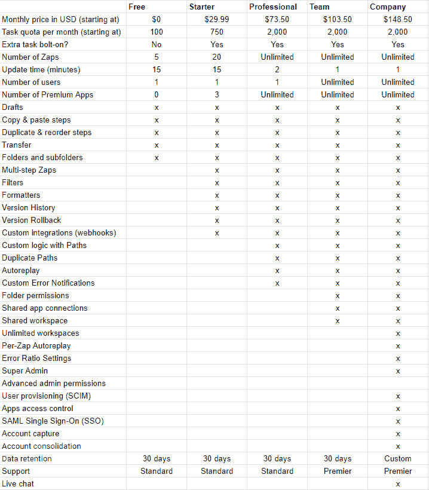

图 1.1- 每个 Zapier 定价计划可用功能汇总

重要提示

所有价格和计划结构在出版本书时均是正确的。你可能还会发现，根据你的地区，定价和计划结构略有不同。

每个定价计划的功能都有所不同；然而，主要根据每月可用任务数量、可以设置的 Zaps 数量以及同步间隔的时间来分类。在大多数计划中（免费计划除外），你可以支付额外费用保留功能并添加额外任务。所有计划都包括 Zap 历史数据的可用性以及在线客户服务和技术支持的访问。

免费计划永久免费，所有付费的 Zapier 计划均可选择按月或年付款。

Zapier 提供一个为期 14 天的试用计划，该计划让你在 Professional 计划中获得大部分功能和 1000 个任务的访问，但不包括 Autoreplay。

登录到 Zapier 账户后，你可以通过点击以下导航选项中的链接查看每个计划的功能和定价的详细列表，并根据需要更改你的计划：

+   **账单和使用**（**设置**）

+   **钱包**（展开式左侧边栏）

+   **定价**（信息页面上的顶部菜单）

+   **定价**（页脚菜单）

重要提示

你每月的任务分配不会延续到下个月。在每个计费周期结束时，如果你有未使用的任务，并且你使用的任务少于需要的数量，你可以降级到更低的订阅并保留你的定价计划功能。

接下来，让我们来看看适合你的企业的不同 Zapier 计划。

## 对于你的企业来说，应该选择哪个 Zapier 计划？

Zapier 适用于任何希望自动化流程的企业。独立创业者或小型、大型团队的公司都可以使用。自由职业者和顾问也可以使用它来管理客户的流程。

你的企业需求将决定最适合使用的价格计划。你想要自动化多少流程以及这些流程有多复杂，都会影响你的决策。

### 免费计划

对于只有一个用户且只需自动执行少量简单任务的企业来说，这个计划是最合适的。您将能够构建最多五个单步工作流程，使用 Zapier 集成的大多数应用程序（不包括高级应用程序）。Zapier 将每 15 分钟在您的触发应用程序中搜索新数据并运行您的 Zaps，每月可处理最多 100 个任务。在您初步了解 Zapier 的基本工作原理时，免费计划是开始的最佳计划。您还将获得标准功能的访问权限，例如在草稿中创建您的 Zaps、复制和粘贴步骤以及复制和重新排序步骤。您还可以将您的 Zaps 组织成文件夹和子文件夹。

### 起始计划

如果您仍然只有一个用户和相对较少的需要自动化的流程，但需要在一个或多个应用程序中自动执行多个活动（包括高达三个高级应用程序），请尝试起始计划。您可以利用其他功能，例如在过滤器中使用条件、格式化文本、数字和日期、访问版本历史记录，以及使用 Webhook 创建自定义集成。您可以构建多达 20 个 Zaps，并每月获得 750 个任务的访问权限（对于更高的订阅付款为 1,500）。更新时间保持在 15 分钟。

### 专业计划

专业计划适用于想要提升并充分利用 Zapier 的单个用户。如果您的业务中有大量复杂的多步骤流程，需要条件逻辑，并且使用了三个以上的高级应用程序，则此计划最适合您。所有起始计划功能都包括在内，以及创建、复制和重新排序路径的能力、使用 Autoreplay、创建自定义错误通知以及恢复到 Zaps 的先前版本。您可以利用无限数量的高级应用程序、无限数量的 Zaps、两分钟的更新时间以及每月 2,000 至 2,000,000 个任务的访问权限（取决于您的订阅付款）。

### 团队计划

负责自动化和管理流程的两个或更多团队成员的企业应该利用团队计划提供的功能。团队计划包含专业计划的所有元素，还增加了更新时间更快的优势，为一分钟，您将能够导出 Zaps 并访问审计日志。团队计划允许团队以安全、有组织的方式协作和自动化其流程。团队成员可以安全地访问多个应用程序，无需彼此共享密码和**API 密钥**，共享工作区，并选择谁可以访问特定的文件夹和应用程序。此计划的额外好处是获得高级支持团队，快速、优先响应。

### 公司计划

公司计划适用于需要企业级安全考虑并希望将用户分组的组织。你仍然可以访问团队计划的所有功能，此外还可以访问多个工作区、每个 Zap 的自动重播和调整错误比例设置的功能。安全功能包括用户管理、应用程序访问控制、安全的**单点登录**（**SSO**）和顶级帐户管理。

此计划的额外奖励是能够根据你公司的监管要求定制 Zap 历史数据保留时间，而不是其他计划上的标准 30 天，以及通过实时聊天提供实时支持。

现在你更好地了解了每个 Zapier 计划包含的功能和功能，并且知道哪个计划最适合你的业务。接下来，我们将介绍如何设置 Zapier 账户。

# 创建 Zapier 账户

要开始使用 Zapier，你需要做的第一件事就是创建一个 Zapier 账户。

重要提示

Zapier 团队非常积极地努力为用户创造最佳体验，并经常在用户群体上测试不同的**用户界面**（**UI**）更改。用户界面更新、新功能和导航更改会定期发布，所以当你阅读本书时，我们使用的截图与当前实际情况略有不同，不要感到意外。

按照以下步骤创建你的新 Zapier 账户：

1.  打开你的网络浏览器，导航到 Zapier 网站首页（[`zapier.com/`](https://zapier.com/)），然后点击**注册**按钮。

1.  通过输入你的企业电子邮件地址、你的名字和姓氏来创建一个 Zapier 账户。然后，点击**免费开始**，如下面的截图所示。或者，你也可以使用你的 Google、Facebook 或 Microsoft 凭据进行注册：

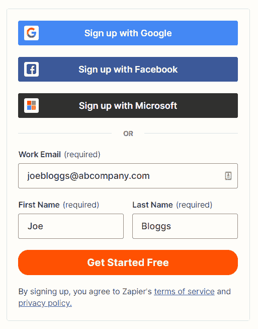

图 1.2 – Zapier 主页注册区域

1.  添加密码并点击**免费开始**，如下面的截图所示：

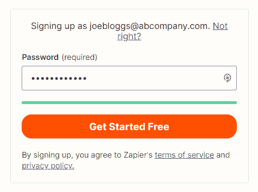

图 1.3 – 在 Zapier 主页注册区域填写详细信息

1.  在注册过程的第一步中，通过确定你的角色、添加你公司的员工数量并点击**继续**来完成入职流程的第一步，如下面的截图所示：

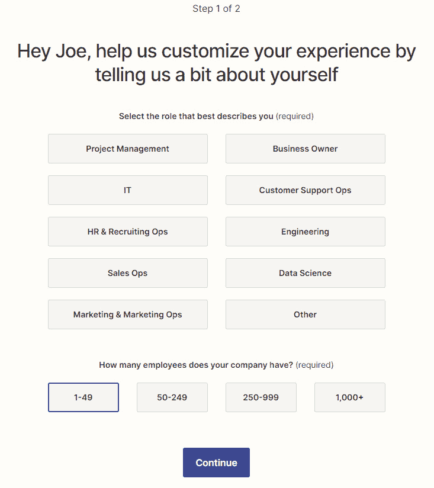

图 1.4 – Zapier 注册入职流程的第一步

1.  在注册过程的第二步中，选择你在业务中使用的五个或更多应用程序，以便 Zapier 可以为你提供定制的建议。然后，点击**完成设置**，如下面的截图所示：

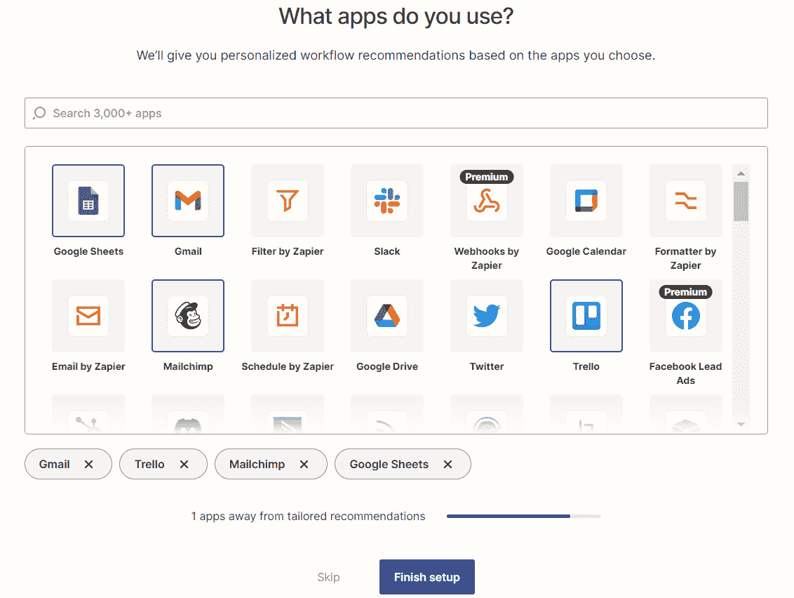

图 1.5- Zapier 注册引导过程的第二步

重要提示

通过准确地完成这个两步的引导过程，Zapier 将能够定制您的用户体验，并为您提供定制的工作流建议。这些建议将为您提供使用业务应用程序自动化何种类型任务的想法。您可以选择适当填写此信息，也可以跳过这些步骤。

现在你已经设置好了 Zapier 账户，距离构建你的第一个工作流自动化更近了一步。在下一部分，我们将介绍 Zapier 平台上的导航。

# 熟悉 Zapier 平台导航

Zapier 通过简单易用的界面帮助您在平台上轻松导航。当您登录 Zapier 时，您将看到主要的**仪表板**。中央仪表板区域提供有用的信息，帮助您开始使用教程，创建工作流，以及使用一些预先构建的工作流示例。

仪表板的布局如下所示：

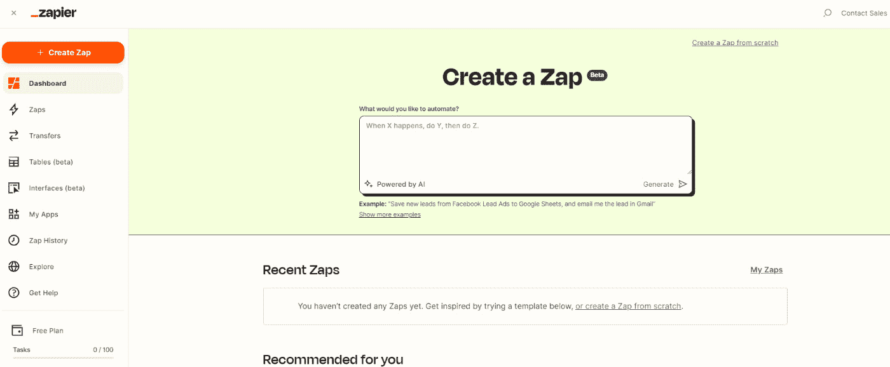

图 1.6- Zapier 主仪表板布局概览

在平台的大多数页面上，您有多种导航选项：

+   左边栏中的图标

+   右上角的图标

+   页脚菜单

重要提示

这些导航选项在大多数 Zapier 页面上都可用，除了信息页面和设置区域和 Zap 编辑器模块。

## 左边栏中的图标

左边栏是 Zapier 中最常用的导航栏。它可以在平台的每个页面中找到（除了信息页面和设置区域和 Zap 编辑器模块中）。侧边栏可以使用汉堡菜单旁边的 Zapier 徽标展开和缩小。下面的截图显示了此栏中的导航选项：

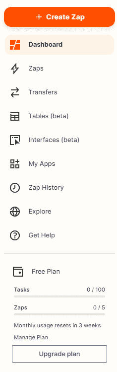

图 1.7-左边栏中的导航选项

这些导航选项如下：

+   **+ 创建 Zap**：此按钮直接进入 Zap 编辑器，您可以开始构建 Zap。我们将在*第三章*，*构建你的第一个自动化工作流（Zap）*中详细介绍 Zap 编辑器。

+   **仪表板**：此图标链接将随时带您返回主仪表板。

+   **Zaps**: 这个图标链接将带你进入你的 Zap 管理区域。这个区域给你列出了你的所有 Zap，你可以将它们整理到不同的文件夹中，更改团队共享偏好设置，并启用或禁用特定的 Zaps。我们将在*第四章*，*管理你的 Zaps*中详细介绍 Zap 管理区域。

+   **转移**：此图标链接将带您到**转移**区域，您可以在其中批量从一个应用程序发送数据到另一个应用程序。我们将在*第十三章*中更详细地介绍**转移**功能，*新发布的应用程序* *和功能*。

+   **表格（测试版）**：此图标链接将带您到表格创建器。在测试阶段，此菜单选项可能不会在所有帐户中可见。我们将在*第十三章*中更详细地介绍**表格**功能，*新发布的应用程序* *和功能*。

+   **接口（测试版）**：此图标链接将带您到**接口**创建器。在测试阶段，此菜单选项可能不会在所有帐户中可见。我们将在*第十三章*中更详细地介绍**接口**功能，*新发布的应用程序* *和功能*。

+   **我的应用程序**：**我的应用程序**图标链接将带您到您连接的应用程序列表。从那里，您可以连接和验证所有相关的业务应用程序。我们将在*第三章*和*第四章*中更详细地介绍**我的应用程序**模块以及如何连接您的应用程序。

+   **Zap 历史**：此图标链接将带您进入您的 Zap 历史记录，在那里您可以查看已在触发 Zaps 中运行的数据。我们将在*第五章*中更详细地介绍**Zap 历史**功能，*故障排除和处理* *Zap 错误*。

+   **探索**：此图标链接将带您到**探索**区域，在那里您将找到有关使用 Zapier 自动化您的业务流程的不同方法的广泛信息。

+   **获取帮助**：**获取帮助**图标链接将带您到帮助中心，其中包含全面的操作手册、常见问题解答和支持选项。我们将在*第五章*中更详细地介绍此功能，*故障排除和处理* *Zap 错误*。

+   **钱包**：这为您提供了当前计划、任务使用情况相对于您的月度限制以及与您的计划限制相关的 Zap 数量的便捷快照视图。您还可以使用提供的链接管理或升级您的计划。

## 右上角的图标

在右上角，您可以找到以下图标：

+   **放大镜**：此图标允许您搜索应用程序，以了解 Zapier 是否与它们集成。应用程序生态系统目录包含一份详尽的应用程序集成列表和有关它们的详细信息。

+   **人物图标**：此图标显示一个下拉菜单，其中包含您的帐户设置和注销 Zapier 的选项。此图标也可能显示为您的姓名首字母缩写。

## 页脚菜单

在页脚菜单中，您将找到所有页面均可访问的其他导航选项。其中最有用的两个选项如下：

+   **定价**：此链接将带您转到**计划**页面，其中将显示不同的 Zapier 计划、功能和相关价格。您可以在查看不同计划的功能和定价时选择试用、升级或降级您的计划。

+   **帮助**：此链接将带您转到我们先前描述的**帮助**区域。

您现在对 Zapier 平台的导航有了更好的理解和熟悉。接下来，我们将讨论如何更改我们的设置和偏好。

# 更改您的设置和偏好

确保您的设置正确，并了解特定设置如何影响您帐户的其他区域对于成功的帐户管理至关重要。

您可以通过点击仪表板右上角包含您姓名首字母的圆形图标并选择齿轮图标/设置选项来访问您的设置。设置菜单将显示在左侧边栏中，如下面的截图所示：

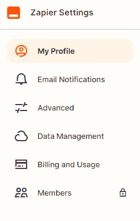

图 1.8 - 设置区域的左侧边栏菜单

重要提示

团队和公司计划具有额外的**组织**菜单项，并且公司计划具有**高级安全性**选项。我们将在*第五章*中讨论这些设置，*故障排除和处理 Zap 错误*。

## 我的资料

此区域包含有关您的基本数据，并允许您执行以下操作：

+   验证您的电子邮件地址

+   使用 Gravatar（将您的图片与您的电子邮件地址关联的在线服务）添加/更改个人资料图片

+   更改您的电子邮件地址、名字、姓氏、密码和公司

+   更改您的角色

+   调整您的时区

以下截图显示了**我的资料**区域的布局：

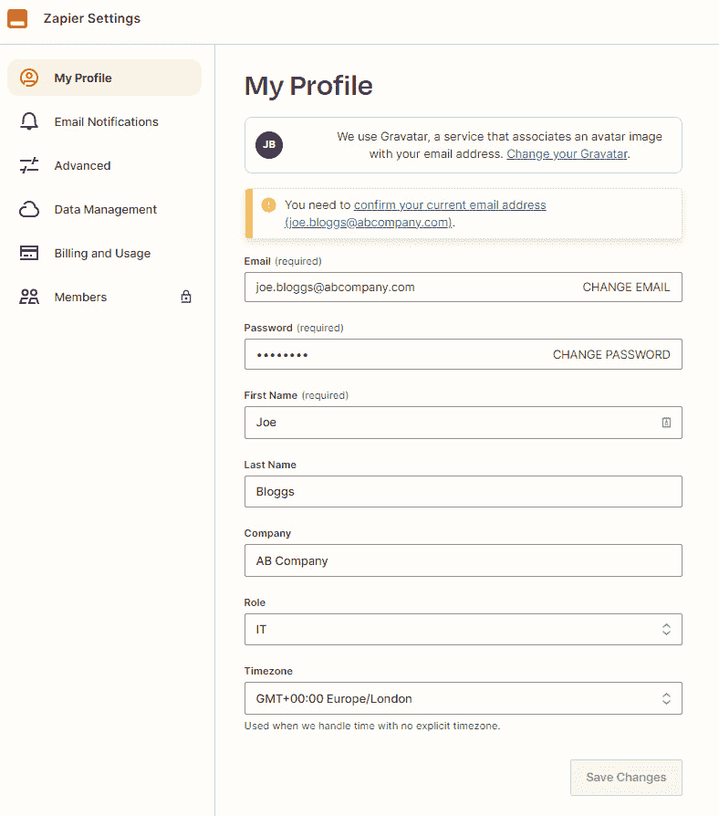

图 1.9 - 我的资料区域的布局

### 在**我的资料**中定制的重要设置

一旦您设置了 Zapier 帐户，您应该做一些事情：

+   验证您的电子邮件地址

+   添加您的角色

+   添加您的时区

让我们逐步了解如何在 Zapier 中执行这些操作。

#### 验证您的电子邮件地址

通过以下步骤调整这些设置：

1.  点击高亮的文本（标记为重要）以确认您的电子邮件地址。

1.  按照您从 Zapier 收到的电子邮件中的说明操作。

这是保护您的帐户并确保 Zapier 有正确的电子邮件地址发送通知的第一步。

#### 添加您的角色

如果在设置 Zapier 帐户时您没有在两步入门过程中添加您的角色，您可以在此处执行此操作。要执行此操作，请滚动到**角色**并从下拉列表中选择与您角色最接近的匹配项。完成此步骤将使 Zapier 根据其他具有相同角色的用户可能正在使用的内容进行工作流建议。

#### 添加您的时区

要调整这些设置，请滚动到**时区**并从下拉列表中选择您的**时区**。

完成此步骤将使 Zapier 在显示和处理时间时使用您的时区。默认为**协调世界时**（**UTC**）。

例如，您的 Zap 历史记录中会显示时间。时间将以您的时区而不是 UTC 显示。如果在您的时区中进行错误调查，那么跟踪时间就容易得多。

重要提示

指定您的时区对于 Zapier 如何定义和使用您的 Zaps 中的日期至关重要。不应忽视将时区添加到您的帐户中的重要性。

## 电子邮件通知

此区域将使您能够更改您希望何时以及何种方式接收电子邮件通信的首选项。以下屏幕截图显示了**电子邮件** **通知**区域的布局：

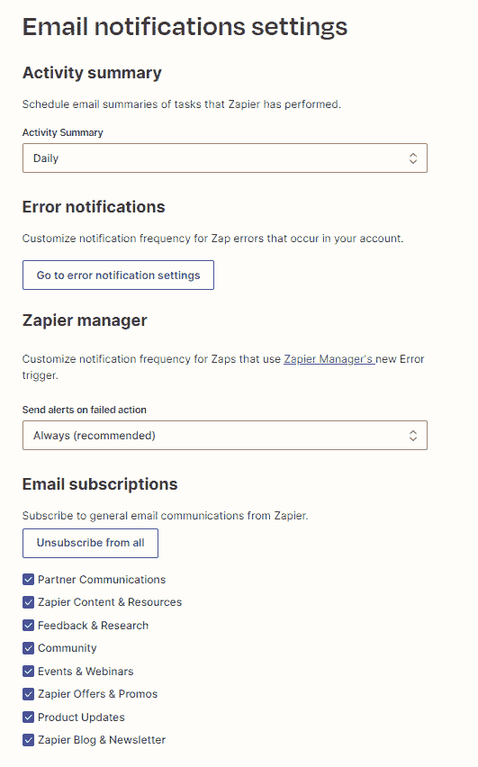

图 1.10 – 电子邮件通知区域的布局

您可以更改以下首选项：

+   **活动摘要**：Zapier 定期向您发送在一定时间内（在设置的频率内）执行的所有任务的摘要。您可以选择每天或每周接收活动摘要，或者如果您愿意，从不接收。

+   **错误通知**：在专业、团队和公司帐户中，您可以通过调整自定义错误通知来自定义 Zap 错误通知的频率。点击**转到错误通知设置**按钮。在**默认通知规则**部分，选择要应用于所有 Zap 的通知频率，包括**立即**、**每小时摘要**和**从不**。在**自定义通知规则**部分，您可以为选择的特定 Zaps 创建自定义通知规则。使用**选择一个 Zap**下拉列表选择 Zap，然后使用**选择一个频率**下拉列表选择**立即**、**每小时摘要**或**从不**。如下屏幕截图所示：

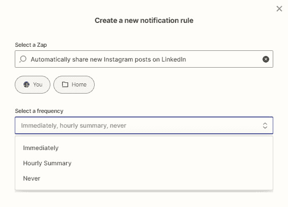

图 1.11 – 自定义错误通知概览

然后，点击**保存通知规则**按钮以保存规则。您可以从仪表板查看 Zap 的名称，使用下拉列表更改其**频率**，或从三个点的图标菜单中**删除**该 Zap。还可以从 Zap 历史记录区域访问错误通知设置，我们将在*第五章*中更详细地讨论*故障排除和处理*Zap 错误*。

+   **Zapier 管理器**：在**发送失败操作警报**部分，您可以选择在您的任何操作出现问题时接收警报。拥有此信息非常有用，因此您可以在问题发生后尽快解决问题。您可以选择重复接收失败的操作警报，始终（这是推荐设置），或者如果您愿意，永远不接收。您还可以将此通知设置与 Zapier 管理器内置应用触发器配对，我们将在*第五章*中更详细地讨论*故障排除和处理* *Zap 错误*。

+   **电子邮件订阅**：您可以选择希望 Zapier 向您发送的内容类型。您也可以取消订阅接收任何新闻通讯内容。

## 高级

在**高级**区域，您可以更改以下首选项：

+   **双因素认证**：**双因素认证**（**2FA**）通过要求您输入标准登录详细信息（电子邮件地址和密码），以及生成并发送到指定电子邮件地址或手机号码的身份验证代码，为您提供更多安全性。建议您在您的帐户上设置 2FA。

+   **授权的应用程序**：这显示了您已授予访问您的 Zapier 帐户的应用程序列表。您可以根据需要从此区域删除应用程序。此区域与**我的应用程序**中的连接应用程序不同。

+   **SSL 检查**：SSL 证书允许在 Zapier 和其合作伙伴之间发送加密信息。这些设置默认情况下是“开启”的，只有在您有更改它们的经验并且知道后果，或者如果 Zapier 支持团队建议您这样做时，才应该更改。

+   **使用以下登录**：这允许您更改登录设置，以便您可以使用您的 Google 帐户而不是标准的电子邮件和密码。

+   **删除我的帐户**：如果您想关闭您的 Zapier 帐户并删除所有帐户数据，您可以使用此区域进行操作。如果您希望定期删除一些数据，您可以通过**数据管理**区域执行此操作。

## 数据管理

Zapier 为帐户所有者提供了控制其数据的能力。在这个区域，您可以定期导出和删除您的数据，并阅读更多关于数据监管和 GDPR 合规性的信息。

团队和企业计划还具有额外的**数据管理**设置，允许您批量导入和导出 Zaps（在**JSON**文件中），以便您可以备份或与其他人共享。

## 帐户

如果您可以访问您的帐户以及一个或多个团队或公司帐户，将显示一个下拉选项，允许您在不同帐户之间导航以查看每个帐户的设置。

## 计费和使用情况

这个区域对与账单、任务和 Zap 使用相关的任何事情都至关重要。您将可以访问比左侧可展开导航栏中的快照钱包中更详细的关于您的使用情况的信息。在这里，您可以看到有关您的限制的使用了多少任务和构建了多少个 Zap，以及您的使用情况何时重置的详细信息。您还将能够调整您的价格计划、支付方式和账单信息，并查看您的发票。

## 成员

除非您是团队或公司计划的成员，否则此区域将被锁定，并带有一个挂锁图标。

**成员** 区域为您提供了与由该成员构建和拥有的 Zaps 相关的任务的概览。您可以按照以下方式调整团队成员设置：

+   添加或移除成员

+   更改成员角色（**管理员** 或 **成员**）

现在，您更好地了解了如何更改您的设置和偏好。

# 总结

在本章中，我们首先概述了 BPA 的原理以及如何利用它提高生产力。我们讨论了应用程序如何使用 API 进行集成并在它们之间传输数据。然后，我们介绍了 Zapier，这是一个无代码工具，它与数千个商业应用程序集成，帮助您无需开发人员即可自动化任务。我们介绍了 Zapier 平台上使用的关键术语，并介绍了如何为您的业务需求选择正确的定价计划。然后，我们讨论了如何设置 Zapier 账户并熟悉平台导航。最后，我们介绍了如何自定义各种可用的设置。

您现在知道如何为您的企业选择正确的 Zapier 定价计划，设置您的 Zapier 账户，轻松浏览 Zapier 平台，并自定义您的设置。

在下一章中，我们将介绍如何利用 BPA 的原理来改进我们的流程，然后再进入自动化它们。然后，我们将讨论如何战略性地规划工作流程，为构建一个 Zap 做准备以及如何探索 Zapier 的应用集成生态系统并使用其功能。

# 问题

1.  BPA 的两个好处是什么？

1.  两个或更多应用程序如何具有相互通信的能力？

1.  在免费计划中，你可以连接多少个高级应用到 Zapier？

1.  为什么在入职过程中添加五个或更多您使用的应用程序是重要的？
