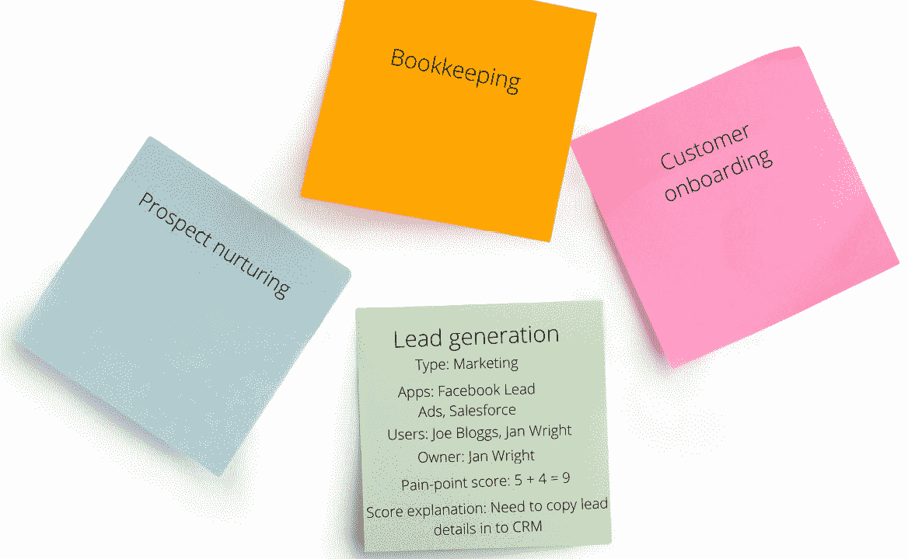

# 第二章：准备自动化您的流程

在本章中，我们将运用业务流程自动化的原理来帮助您准备自动化流程。正如我们在上一章中讨论的那样，在尝试自动化之前简化您的流程至关重要。因此，我们将从描述如何改进您的业务流程开始，然后确定可以自动化的内容。然后，我们将探讨如何查找有关您的业务应用及其与 Zapier 集成的信息。我们将在本章的 *充分利用* *Zapier* *应用生态系统目录* 部分展开讨论，其中我们将介绍如何在应用集成目录中导航以及如何查找新的应用程序以使用。

我们将在本章中涵盖以下关键主题：

+   简化您的流程并评估可以自动化的内容

+   确立你的业务应用与 Zapier 集成的方式

+   充分利用 Zapier 应用生态系统目录

一旦您完成了每个主题的学习，您将成功地改进和简化了您的流程，了解了您的业务应用程序是如何连接的，并学会了如何导航 Zapier 的应用集成目录。

# 技术要求

要在本章中学习内容和练习，您需要访问 Zapier 帐户。Zapier 免费计划足以完成本章的内容。您可以在 [`bit.ly/zapier-book`](https://bit.ly/zapier-book) 获取本章使用的系统和流程审计模板。

# 简化您的流程并评估可以自动化的内容

在寻求自动化流程的好处之前，重要的是要分析、了解和简化您现有的手动流程。遵循这种方法将确保您拥有更强大的流程，并帮助减少您的 Zaps 步骤数量。这将有助于降低当您的工作流运行时对您每月 Zapier 任务限制的贡献的任务数量。

当您听到 **流程映射** 这个术语时，您可能会立即认为您需要聘请具有分析能力的人来帮助您详细说明流程的流程图和文档。您可能还认为这与您或您的业务无关。事实是，您很可能已经以某种方式绘制了流程图，例如当您为新员工创建培训文档和检查表时。编制文件化的程序允许您、业务所有者、经理和使用该流程的团队成员清楚地了解特定任务应如何一致地完成。所有企业，无论大小，都可以从记录他们做事的方式中受益；我们将将这一点分解为一个易于遵循的练习，以帮助您完成此任务。

要确定业务流程自动化如何最适合您的业务，我们建议您全面审视所有流程和系统，评估业务目标，然后逐个审查每个流程。此练习涉及以下关键领域：

+   评估您的顶层管理目标

+   吸纳您的团队

+   对您的流程进行头脑风暴并对其进行优先排序

+   分析和简化您的流程

+   辨识可自动化的内容

+   记录新流程

在您通过每个阶段时，使用一个改编自著名问题解决技巧**5W1H 方法**，您应该牢记以下问题：

+   *在哪里？*：这个任务发生在哪里？流程中涉及哪些应用程序？如果没有应用程序，是否需要人为干预以确保准确执行？

+   *如何？*：任务如何完成？需要哪些步骤？

+   *何时？*：这个步骤在流程中何时发生？

+   *什么？*：你需要什么来完成任务？需要哪些数据？

+   *谁？*：谁参与了这个流程？这些可能是团队成员、你的领导或客户。

+   *为什么？*：为什么这个步骤重要，为什么它受益于自动化？

您可以在这里阅读更多关于 5W1H 方法的信息：[`en.wikipedia.org/wiki/Five_Ws`](https://en.wikipedia.org/wiki/Five_Ws).

让我们深入研究每个步骤的细节，以改进和简化您的业务流程。

## 评估您的顶层管理目标

首先，审查您的顶层业务目标将使总体意图更加明确，便于与您的团队沟通。记录以下问题的答案：

1.  接下来 6 到 12 个月内您的业务目标是什么？

1.  您希望解决的前五个最耗时的手动流程问题是什么？

1.  简化和自动化会为这些流程和参与其中的团队成员带来什么好处？

1.  这些好处如何与您的业务目标相一致？

1.  您愿意允许自己和团队花费多少时间来改进和自动化您的流程？

当您继续进行接下来的几个部分时，请记住这些问题的答案。

现在您对顶层目标有了更清晰的了解，我们将看一下将团队纳入练习的重要性。

## 吸纳您的团队

吸纳那些经常使用流程的人是至关重要的。如果你有一个跨越不同部门或角色的团队（无论规模大小），这尤其重要。包括所有相关团队成员将确保他们在变革过程中参与和授权，并允许团队持续协作地拥有和管理流程。解释练习的目的是至关重要的（记住你的顶层目标），并提醒你的团队自动化将帮助他们更好地和更高效地完成工作。鼓励你的团队学习如何在日常工作中使用 BPA 将提高生产率和工作满意度。

接下来，你需要列出所有的流程，并对它们进行优先排序，这样你就知道先从哪里开始工作。

## 对你的流程进行头脑风暴并对其进行优先排序

这个练习最好以视觉方式进行。你可以在白板或墙上添加便签，然后以电子表格格式形成正式记录各种数据集。拍摄你的头脑风暴练习的照片；这将帮助你可视化和结构化流程改进练习的其他部分。你还可以使用数字白板工具，如**Miro** ([`miro.com/`](https://miro.com/)) 或 **Mural** ([`www.mural.co/`](https://www.mural.co/)) 来与团队在线协作。

要开始这个练习，指定一个团队成员来推动和负责整个项目。然后，与你的核心团队成员一起完成以下步骤：

1.  对所有流程进行头脑风暴，并列出每个流程的目的。将这些流程分类为市场营销、销售、运营、财务或者你认为最合理的业务功能。你可能会发现一些流程跨越部门；因此，请做好记录。下面是使用 Miro 应用程序的示例：

图 2.1 – 使用 Miro 进行数字白板头脑风暴练习

1.  对你的业务中使用的所有应用程序和工具进行头脑风暴，记录它们的具体功能，并对你正在考虑用其他应用程序替换的任何其他应用程序进行同样的操作。同样，你可以使用白板或将它们添加到电子表格中。以下是使用电子表格的示例：

图 2.2 – 系统审计文件

如果你想要一份系统和流程审计模板的副本，你可以在这里获取：[`bit.ly/zapier-book`](https://bit.ly/zapier-book)。

1.  确定并列出所有流程使用者。

1.  指定一个流程使用者负责每个持续的流程。

1.  为每个流程在以下各项中打分，分数范围为 1 到 5（其中*1*为低，*5*为高）：

    +   当前执行它时耗费的时间有多久

    +   当前执行它时容易出错的程度

1.  将这些分数相加以计算总分，这将给出每个流程的整体痛点分数。

1.  对每个分数添加说明，详细说明痛点及为何需要解决这些问题。

以下图显示了*步骤 3*至*7*的示例：

图 2.3 – 一个具有更细节的业务流程头脑风暴练习

1.  按优先顺序对每个流程进行编号，首先处理最重要的工作。

1.  从优先列表中选择得分最高的前五个流程。审查你的顶层目标，并问自己这个列表是否与你所注意到的顶层管理目标相一致。

现在你有了一份要处理的优先流程列表，让我们看看如何最好地分析和简化每一个流程。

## 分析和简化你的流程

对你确定的前五个优先流程，逐个按照以下步骤进行工作。确保涉及到针对每个流程具体的用户团队。再次强调，最好使用传统白板或远程协作的数字白板进行视觉化。让我们来看看如何做到这一点：

1.  描述该流程的重要性以及它所实现的目标。

1.  将流程分解为可管理和系统化的步骤。

1.  如果该流程跨越业务职能，则将每个步骤分类为市场营销、销售、运营或财务职能，或使用适合你业务的其他类别。

1.  从你之前创建的应用程序列表中，确定你目前为每个步骤使用的业务工具。

1.  回顾、理解并描述每个步骤的重要性。

1.  确定可修改和改进的步骤，可能通过引入其他应用来实现。

1.  消除无关紧要、无效、不必要或浪费的步骤。

1.  回顾新流程的准确性并评估任何变更风险。

对剩余的前五个优先流程重复此方法。

为了帮助你可视化这个流程，让我们看一个例子。

一家小型整脊医疗实践的接待团队目前在**Smartsheet**中记录所有咨询。这些咨询来自多个来源，如他们网站上的网络表单和电子邮件。首次联系时未预约任何咨询的需要进行第二次通话跟进。这些任务在**Trello**中创建，一旦预约成功，就会在实践管理系统中创建患者记录和预约。所有后续跟进和预约记录都记录在表格中，以便追溯。这个流程非常手动化，容易出错，因为任务经常被遗忘。以下图显示了*步骤 1*至*4*：

图 2.4 – 分析现有流程

然后团队单独讨论和记录*步骤* *5*的要素。

在这个例子中，实践工作人员已经确定他们的实践管理系统具有新的功能，可以允许他们提取报告和使用任务，因此他们不再需要使用 Smartsheet 进行报告或使用 Trello 进行任务管理。他们现在可以简化流程并消除不必要的步骤。步骤 6 和 7 如下图所示：

图 2.5 - 简化流程

团队认为使用这个新流程没有重大的风险，如步骤 8 所示。

现在我们已经优化了我们的重点流程并将它们拆分成可管理的步骤，我们可以确定每个步骤是否可以部分或完全自动化。接下来我们会详细看看这个。

## 确定可以自动化的内容

按照上一节的优先级列表和步骤，识别可以自动化的内容如下：

1.  提出以下问题：

    1.  它是否可重复？

    1.  它是否可以以最少的逻辑思考和人为干预来完成？

    1.  如果手动操作容易出错，该怎么办？

    1.  它是否在所有业务操作中保持一致？

如果每个问题的答案都是“是”，那么这个流程就是自动化的首选对象。如果你对其中任何一个问题的答案是“否”，讨论部分自动化流程的可行选项。如果该流程在所有业务操作中不一致，只要前三个问题的答案是“是”，就可能通过将工作流程复制到业务操作来包括各种细微差别。

1.  如果您的流程可以部分或完全自动化，记下两到三个快速解决方案和长期解决方案，并预计达成这些方案的时间表。

使用上一节的示例，实践团队讨论并记录各个问题的答案，如下图所示：

图 2.6 - 确定哪些步骤可以自动化

任务 1、2 和 3 可以分别按以下方式完全自动化：

+   任务 1，涉及将线索记录到实践管理系统中，可以自动化，因为实践管理系统与 Zapier 集成，现有的网络表单应用程序也是如此。电子邮件可以转发并解析以提取信息，然后通过 Zapier 添加。

+   创建跟进任务，任务 2，可以完全自动化，因为软件中提供了工作流自动化。

+   实践管理系统允许将线索转换为新患者并应用于任务 3 的自动化。

所有这些自动化任务都可以在决定更改流程后一周内实施。

现在您可以重复使用此方法来处理剩余的流程。您不需要一次性完成这些流程，但这将为您提供应用程序如何链接和协同工作的更好的图片。

接下来，让我们讨论如何充分记录您的新流程。

## 记录您的流程

到目前为止，我们一直在使用白板工具来说明我们的例子。这种方法可能不适合你；然而，无论你使用哪种方法来简化流程并确定哪些可以自动化，我们建议你在完成练习后正式记录它们。你可以在电子表格中记录你的新流程，使用数字白板工具，比如 Miro 或 Mural，或使用流程图工具，比如**Microsoft Visio**或**Draw.io**。你还可以使用检查列表式工作流管理工具，比如**Process Street**或**Process Bliss**，它们允许你创建数字**标准操作规程（SOPs）**。

重要说明

在记录新流程时，将关键信息保持最少。记录流程的一个简单而有效的方法是说明涉及的应用程序、任务中发生的情况以及是否需要手动干预或自动化。

另一个以视觉方式记录的过程示例如下图所示：

图 2.7 – 使用 Miro 进行数字化文档化的过程

提示

如果你使用的是白板工具或流程图，你可以垂直或水平表示你的流程图。

如果你想在流程图中添加更多细节，你可以在流程图中概括你在解决问题过程中整理的信息，使用 5W1H 方法。这种方法作为提醒，确保你应该在流程图中总结所有相关信息：

+   *在哪里？*：流程位于何处？也就是说，涉及到哪些应用程序？

+   *如何？*：确定此步骤是自动化的还是需要人工干预。

+   *何时？*：此步骤在流程中何时发生？

+   *什么？*：列出关键数据值，比如姓名或电子邮件地址。

+   *谁？*：列出任何参与流程的团队成员、你的领导或客户。

+   *为什么？*：记录一些关键痛点。

我们将在*第三章*中向您展示一个视觉示例，*构建您的第一个自动化工作流程（Zap）*。

现在，你已经简化了流程并评估了哪些部分可以自动化，让我们讨论一下最佳的方法来确定 Zapier 如何与你的应用集成，以便你可以开始自动化这些流程。

# 确定你的业务应用如何与 Zapier 集成

在你开始自动化任何任务之前，我们需要确定你的业务工具中哪些与 Zapier 集成，并且如果有集成的话，集成中已经开发了哪些触发器、动作和搜索功能。

在前一节的练习中，您列出了所有业务应用程序的列表。您还注意到了哪些应用程序与您映射的每个流程步骤相关联。从您的五个优先流程开始，现在我们可以逐个查看与这些流程相关的应用程序列表，以确定您的应用程序中有哪些与 Zapier 集成。

您应该采取的步骤来确定您的业务应用程序如何与 Zapier 集成如下：

1.  搜索有关您的应用程序的信息。

1.  审查 **应用程序** **概要** 页面上的信息。

1.  评估如何使用您的应用程序与 Zapier。

让我们逐个审查这些。

## 搜索有关您的应用程序的信息

找出您的应用程序是否与 Zapier 集成的最简单方法是点击顶部菜单栏中的放大镜图标按应用程序搜索，如下图所示：

图 2.8 – 使用放大镜图标按应用程序搜索 Zapier

将出现一个搜索栏，您可以在其中输入您的应用程序的名称。当您输入时，任何匹配的名称建议都将在下拉列表中突出显示，如下图所示：

图 2.9 – 在 Zapier 中按应用程序搜索时的应用程序下拉列表

从那里，您可以选择您的应用程序，并将被带到应用程序概要页面。

重要提示

如果你使用的是较不流行的应用程序，可能会发现你的应用程序在搜索中没有显示出来。首先，请检查你使用的拼写是否与应用程序的官方命名规范匹配。如果仍然没有显示，这很可能意味着目前在 Zapier 中不存在与之集成，或者尚未在目录中发布。我们将在 *充分利用 Zapier 应用生态系统* *目录* 部分讨论在这种情况下应该做什么。

接下来，让我们探讨如何审查有关应用程序的信息。

## 审查应用程序概要页面上的信息

应用程序概要页面显示了有关特定应用程序以及如何将该应用程序与 Zapier 结合使用的丰富信息。我们建议您彻底审查应用程序概要页面上的信息，因为这将帮助您了解使用 Zapier 的自动化功能与您的应用程序的能力。

每个页面都有导航选项卡，如下所示：

+   **集成**

+   **帮助**

我们将使用 **Calendly** 来说明这一点，如下图所示：

图 2.10 – Calendly 应用程序概要页面

在 **集成** 和 **帮助** 选项卡的页面底部，您将找到一些有关该应用程序的详细信息。这显示了应用程序的徽标图像、简短的描述性摘要和应用程序网站的链接。

提示

当你浏览应用程序概要页上可用的信息时，请记住所有涉及这个特定应用程序的流程。参考你头脑风暴练习的可视化内容，这样你就可以看到所有应用程序是如何结合在一起的。创建特定于应用程序的图表会有所帮助。记下任何能帮助你可视化和策划工作流的关键要点。

让我们来看一下每个不同标签中显示的信息。

### 集成

**集成** 选项卡向你展示了有关应用程序的详细信息，结构化在以下几个部分中：

+   **与…集成更多**：点击 **连接到 6,000+ 应用** 按钮时，这个部分将提供一个指向「Zap 编辑器」的链接，以及一个 **搜索配对应用** 的搜索栏，让你可以搜索要连接的其他应用。

+   **选择配对应用**：这一部分会展示几个 **配对应用** 的可视化表示。点击每个 logo 图标，都会带你到专为该应用配对设计的 **集成** 页面。在列表下方的箭头上滚动将显示更多应用。我们将使用 **Calendly** 和 **Slack** 集成来突出显示这一点，如下截图所示：

图 2.11 – Calendly 和 Slack 集成的应用配对页面

在该页面上，你可以使用 **连接 … + …** 按钮开始使用预构建的工作流程。

+   **常见的使用方式…工作流程**：这一部分列出了您应用程序的热门预构建工作流程。您可以在搜索栏中输入您的商业工具列表中的另一个应用程序的名称，并显示出要使用的引导工作流程列表。我们将使用 **Twitter** 来突出显示这一点：

图 2.12 – Twitter 集成 – 连接到超过 6,000 个应用

点击 **加载更多** 按钮将展开此列表。点击任何引导工作流程，然后选择 **尝试** 按钮来使用工作流程，或者从三个点的图标中选择 **查看 Zap 详细信息** 下拉选项。

+   **支持的触发器和操作**：这一部分提供了有关 Zapier 支持的可供选择的触发器、操作和搜索功能的信息，这些功能可以从下拉菜单中选择。每个功能都有一个简短的描述性标题和它的作用摘要。我们将使用 **Intercom** 来突出显示这一点：

图 2.13 – Intercom 触发器、操作和搜索显示在集成选项卡中

对于某些应用程序，每个支持的触发器、操作和搜索都有一个由向下指向的箭头图标表示的下拉菜单。单击此图标将展开框，显示在构建 Zap 时将显示的字段和变量。当您在构建 Zap 之前起草它们时，这非常有用，这样您就拥有了构建 Zap 所需的所有信息，节省了您在构建 Zap 期间的时间。下面的屏幕截图显示了这一点，其中使用了谷歌驱动器**复制文件**操作事件的示例：

图 2.14 – 展开以显示字段信息的谷歌驱动器复制文件操作事件

我们将在*第三章*、*构建您的第一个自动化工作流程（Zap）*和*第六章*、*创建多步骤 Zap 并使用内置应用程序*中更详细地讨论使用触发器、操作和搜索。

提示

使用**支持的触发器和操作**部分作为快速参考，了解您的应用程序如何与 Zapier 集成以及可用于使用的触发器、操作和搜索。这些支持的触发器、操作和搜索通常不包括应用程序 API 中可用的所有端点。通过使用 API 和内置 Zapier 功能（如 Zapier 的 Webhook、Zapier 的 Code 和 API 请求动作步骤），通常可以在标准 Zapier 集成之上执行更多操作。我们将在*第十一章*、*Zapier 的高级内置应用程序*中更详细地讨论这些功能。

接下来，让我们看一下**帮助**标签。

### 帮助

**帮助**标签结构如下：

+   **帮助与支持**：此部分向您呈现了有关如何入门以及如何使用 Zapier 与应用程序的提示，以及有关应用程序集成的常见错误和问题以及如何解决它们的有用文章。

+   **教程**：此部分显示了 Zapier 创建的内容，以帮助您开始使用所讨论的应用程序与 Zapier 一起使用。这包括如何解决常见问题，呈现使用您的应用程序的流行预构建 Zap 示例，并提供其他有用的内容。

让我们探讨如何使用您选择的应用程序与 Zapier 一起使用。

## 如何将您的应用程序与 Zapier 一起使用

现在，我们已经查看了应用程序在应用程序配置文件页面上的信息，我们应该特别关注**支持的触发器和操作**部分，该部分可以在**集成**标签中找到。

对于每个应用程序，请列出所有功能标题和类型。对于触发器，请记录它们是定时还是即时触发。例如，对于**Google Sheets**，一个可用的触发器是**新电子表格行**，这是即时的。还要注意您的应用是否标记为**高级**，因为您需要确保您订阅了支持高级应用程序的价格计划，如*第一章*中所讨论的，*使用 Zapier 进行业务流程自动化*。

以下图示是一个示例：

图 2.15 - 记录 Salesforce 触发器类型的 Zapier 集成选项

您现在可以将此方法应用于前五个优先流程中的每个关联业务应用程序。完成后，您可以处理其他业务应用程序。您不需要一次完成所有这些; 但是，全面审视您的应用程序和业务流程将在您使用 Zapier 创建工作流程时更好地确定您的想法。

重要提示

至少应该认真研究我们在你的首要流程中为应用程序描述的内容是至关重要的。这将让你更清楚地了解你的应用程序如何连接，以便你可以开始自动化你的流程。

现在您了解了如何评估 Zapier 与每个应用程序的集成方式，我们可以看一看使用应用程序生态系统目录的好处。

# 充分利用 Zapier 应用程序生态系统目录

在本章的前一部分中，我们讨论了如何使用顶部菜单栏中的放大镜图标搜索您的应用程序，还有一个地方可以做到这一点是应用程序生态系统目录中。应用程序生态系统目录不仅对于搜索您现有的应用程序非常有用，而且如果您的应用程序没有与 Zapier 集成，它还可以引导您。最重要的是，应用程序目录是一个全面的资源，可以帮助您找到您可能希望在您的业务中开始使用的应用程序。

您可以在信息页面的顶部菜单导航中找到应用程序目录，如*第一章*中所描述的，*使用 Zapier 进行业务流程自动化*。也可以在[`zapier.com/apps`](https://zapier.com/apps)上找到它。

让我们开始熟悉应用程序目录。

## 浏览应用程序生态系统目录

应用程序目录由左侧导航侧栏和中央导航窗格组成，如下面的屏幕截图所示：

图 2.16 - Zapier 应用程序生态系统目录

现在我们将逐个查看这些导航选项。

### 应用程序生态系统目录中央导航窗格

中央导航区域显示了我们在本章前一部分讨论应用程序配置文件页面时熟悉的信息，并结构如下：

+   **搜索应用程序**：搜索栏允许您通过应用程序搜索目录。它类似于我们在本章前一部分讨论的放大镜图标搜索栏。

+   **1-10 个 6,000+ 应用程序中最受欢迎的**：本部分提供了目录中列出的所有应用程序中 10 个最受欢迎应用程序的列表，带有快照详细信息。

+   **精选**，**新增操作**，**即将推出** 和 **最近添加**：本部分显示四种不同的应用程序，这些应用程序可能由 Zapier 推荐；已添加新触发器、操作或搜索；即将与 Zapier 集成；或最近与 Zapier 集成。

+   **6,000+ 应用程序中最受欢迎的**：本部分提供了一个更广泛的最受欢迎的应用程序列表，不包含快照详细信息。如果您点击**加载更多**按钮滚动到列表底部，列表将展开。

### 左侧导航边栏

左侧导航边栏用于按组显示应用程序，并显示如下区块：

+   **按应用程序排序**：您可以按照应用程序的受欢迎程度、它们的**高级**或**Beta**（正在测试中尚未正式发布的集成）状态，或者最近是否已添加来对应用程序进行排序。单击每个链接将更改中央导航窗格中的应用程序列表。

+   **应用程序类别**：您可以按类别和子类别对应用程序进行排序 - 例如，**商业**类别和**会计**子类别。中央导航窗格视图稍有改变，以显示与类别/子类别相关的有用博客文章，并列出一些热门应用程序，如下面的屏幕截图所示：

图 2.17 - 应用程序目录的中央导航窗格显示会计应用程序

+   **请求一个应用程序**：如果您的应用程序在应用程序目录中不存在，这可能意味着尚未与 Zapier 进行集成，或者尚未在目录中列出。您可以联系应用程序提供者的客户服务团队，查询该应用程序是否与 Zapier 集成。或者，应用程序提供者可能会在其网站上列出有关 Zapier 集成的详细信息，您也可以通过谷歌搜索找到这些信息。从**请求一个应用程序**块中，您可以单击**给我们发送今天想要添加的应用程序的电子邮件！**链接，并提交一个请求，以便将该应用程序添加到 Zapier 中。

+   **添加一个应用程序**：如果您是软件提供商或开发人员，您可以通过单击**访问开发者平台**链接，进入开发者门户，以集成您的应用程序，并创建触发器、操作和搜索。

+   **获取更新**：单击**转到更新博客**链接将带您转到更新博客页面，在那里您可以注册获取有关新应用程序和功能发布的博客更新。

单击任何应用程序图标将弹出应用程序概要摘要弹出窗口，接下来我们将讨论。

### 应用程序概要摘要弹出窗口

当您单击应用程序目录中的任何应用程序徽标时，您将看到**PandaDoc**的弹出窗口，如以下截图所示：

图 2.18 - PandaDoc 应用程序概要摘要弹出窗口

这是应用程序概要页面的快速参考摘要，也采用了左侧边栏和中央导航窗格结构。

#### 左侧边栏

左侧边栏包含以下内容：

+   **应用程序徽标**：显示应用程序的徽标

+   **引导工作流程**：显示为此应用程序创建的预构建工作流程的数量

+   **配对应用程序**：显示此应用程序通常与工作流程中的其他应用程序配对的数量

+   **查看应用程序概要**：单击此按钮将带您转到应用程序概要页面

+   **开始使用**：单击此按钮将直接进入 Zap 编辑器，以便您可以使用此应用程序作为触发器开始构建 Zap

#### 中央导航窗格

中央导航窗格包含以下内容：

+   **应用程序名称**：应用程序的名称。

+   **摘要**：描述应用程序是什么以及它如何使用的几句话。

+   **很好的配对应用程序**：此选项卡显示与此应用程序配合良好的 10 个应用程序的徽标。单击**查看更多应用程序**将带您转到应用程序概要页面的**集成**选项卡。

+   **Zaps**：此选项卡显示两个热门的预构建工作流程。单击**查看更多 Zaps**将带您转到应用程序概要页面的**集成**选项卡。

接下来，让我们讨论如何为您的企业选择新应用程序。

## 为您的企业选择新应用程序的简要指南

**数字化转型**的复杂考虑可能会是一本独立的书。然而，有几点是必要提及的，这将帮助您寻找可以添加到您的业务中或替代当前使用的应用程序的新应用程序。这些在此列出：

+   探索您的选择

+   列出您的主要功能和要求

+   定义您的核心应用程序

+   搜索应用程序生态系统

+   搜索 Zapier 应用程序生态系统目录

+   搜索应用程序比较目录

+   回顾反馈

+   安排产品演示和测试支持资源

+   试用您的应用程序简表

+   规划过渡到新应用程序

重要说明

如果您的任何流程相互关联，并且您将受益于将多个应用程序连接以自动化任务，请始终确定您当前的应用程序和您正在考虑的应用程序是否与 Zapier 集成，以及以何种方式进行集成。在创建您的简表时请记住这一点。

我们现在将依次查看每个要点。

### 探索您的选择

尽管选择一个知名应用程序似乎是合乎逻辑的，但探索您的选项总是明智的。随着**软件即服务**（**SaaS**）成为一个更受欢迎的行业，过去几年中市场上推出了成千上万的新应用程序已经变得司空见惯。有很多竞争对手，有许多不同的应用程序可适用于各种用例。因此，花更多的时间来调查您的选项。

### 列出您的关键功能和要求

如果您正在寻找替代当前正在使用的应用程序的应用程序，那么请列出您现有应用程序中对您业务方式至关重要的所有功能。此外，还要回顾本章前面定义的内容，即 *简化您的流程并评估可自动化的内容* 部分。这些信息将帮助您评估您将需要的其他功能。同样，如果您正在寻找一个新的应用程序来数字化您现有的流程，这些信息非常重要。记下哪些功能是关键的，哪些只是“好有的”功能。

### 定义您的核心应用程序

我们之前提到过，全面了解您的应用程序和流程非常重要，这样您就知道应用程序和流程之间的联系。同样重要的是要确定您业务中最关键的应用程序 - 您认为是真相之源的应用程序。例如，这可能是您的**客户关系管理**（**CRM**）工具或项目管理工具。如果这个应用程序对您的业务至关重要，了解它原生集成的应用程序以及集成方式将使您能够更好地决定要引入的新应用程序。正如我们在*第一章*中讨论的那样，*使用 Zapier 进行业务流程自动化简介*，您的基于云的应用程序很可能会有一个其他应用程序的列表，这些应用程序原生集成，并且可以在该应用程序的市场或生态系统中找到。

### 搜索应用程序生态系统

应用程序生态系统通常包含丰富的关于应用程序如何与您的核心应用程序集成的信息。您可能会找到用户反馈、详尽的帮助文档和视频，以及定价和功能信息。如果您正在寻找与您现有核心应用程序和附属应用程序一起使用的新应用程序，这些生态系统是一个很好的起点。

您现在可以开始创建一个简短的候选名单，进行功能比较、定价，并了解它们与您的核心应用程序的集成方式。

### 搜索 Zapier 应用程序生态系统目录

Zapier 应用程序生态系统目录是查找最接近您的功能的替代应用程序信息的良好起点。您还可以使用左侧边栏按类别和子类别对应用程序进行排序，以寻找要使用的新应用程序。

你现在可以根据潜在的应用程序与 Zapier（触发器、操作和搜索）的集成情况来补充你的候选名单。

### 搜索应用程序目录

免费目录（例如**Get App**([`www.getapp.com/`](https://www.getapp.com/)））允许您搜索特定类别、行业和用例的应用程序。 您将可以访问经过验证的用户评论、比较表和文章。 您还可以使用他们的应用查找工具根据您的公司规模，行业和您当前使用的应用程序来创建一份推荐应用程序的列表。

**Product Hunt** ([`www.producthunt.com/`](https://www.producthunt.com/))是另一个显示产品和新功能的信息及好评/差评的目录。

您现在可以比较您的应用程序并向您的入围名单添加信息。

### 审查反馈

Get App 并不是唯一可以找到应用程序反馈的地方。 您可以在社交媒体、**Reddit**（[`www.reddit.com/`](https://www.reddit.com/)）等论坛以及**Trustpilot**([`www.trustpilot.com/`](https://www.trustpilot.com/)）等信任网站上搜索用户反馈。 与发表评论的用户联系或在在线商业群组和社区（例如 Facebook 或 LinkedIn）上寻求反馈也可能是有益的。 仔细审查反馈并评估利弊。

### 安排产品演示和测试支持资源

产品演示（演示）提供了一种比免费试用更好的评估工具的方式。 您可能最初会认为只有较大的软件提供商才会提供其产品的演示。 正如前面提到过的，SaaS 行业变得愈发竞争激烈，即使较小的提供商也提供一对一的演示，从而使您作为潜在买家可以根据自己的用例提出问题。 如果软件提供商的网站上并没有明确提供产品演示，则只需向其客户服务团队咨询是否有可能提供产品演示。 在提供演示的同时灵活一些还可以让您初步了解一旦您购买了产品后，客户支持和服务水平可能是什么样子。

提示

客户服务的可用性和服务水平在您开始使用新应用程序时通常至关重要。 确定与您的时区相对应的客户服务可用性和查询响应时间将帮助您判断是否符合您的需求。

### 充分进行您的应用程序入围名单的试用

在您进行比较后，选择两个应用程序进行试用，与现有的应用程序一起进行比较。 使用现有应用程序或流程的代表性数据（如果您目前还没有应用程序），进行几周的试用，以充分评估功能的并行性。 免费试用期通常不足以充分评估应用程序的适用性，因此在开始试用之前，请查询是否可以延长试用期。

提示

选择超过两个应用进行试用可能会耗费团队的时间并使人不知所措。 投资较多时间进行比较准备工作，将您的名单缩减到两个应用程序上是值得的。

确保按照软件提供商提供的指导和最佳实践设置应用程序，并确保流程的关键用户参与测试。软件提供商通常提供全面的操作指南和培训视频，并且可能会随时提供帮助解决某些问题。您可能还会发现一些提供商提供免费的设置和入门服务。

### 迁移到新应用的计划

一旦您决定要永久实施的应用程序，确保已创建详细的项目计划来管理过渡到使用新应用程序并淘汰旧的应用程序和流程。该计划应包括系统设置审查和定制，数据备份，数据导入，流程文档和员工培训。

您现在更好地了解如何有效地使用 Zapier 的应用集成生态系统目录，可以找到关于 Zapier 如何与您的应用程序集成的信息，并且可以找到和评估可用于您的业务的新应用程序。

# 摘要

在本章中，我们首先讨论了如何改进您的业务流程，然后确定哪些内容可以自动化。我们探讨了如何找到关于您的业务应用程序以及它们如何与 Zapier 集成的信息。我们讨论了在应用程序生态系统目录中的导航以及如何有效地使用它来探索可用于您的业务的新应用程序。最后，我们简要描述了如何找到和评估可用于公司的应用程序。

您现在知道如何简化流程，确定哪些内容可以自动化，浏览应用程序目录，并找到可用于您的业务的应用程序。

在接下来的章节中，我们将讨论如何在自动化之前制定和规划个人工作流程的策略。我们将介绍连接您的应用程序到 Zapier 所需的步骤，讨论 Zap 编辑器中的导航，并通过一个示例来帮助您创建您的第一个 Zap。我们将向您展示如何查找并使用预构建的工作流程，解释字段类型和数据处理，最后介绍持续改进。

# 提问

1.  “5W1H”代表什么？

1.  要确定是否可以考虑自动化某个流程，有哪三个关键问题需要问？

1.  您在哪里可以找到关于您的业务应用如何与 Zapier 集成的信息？
