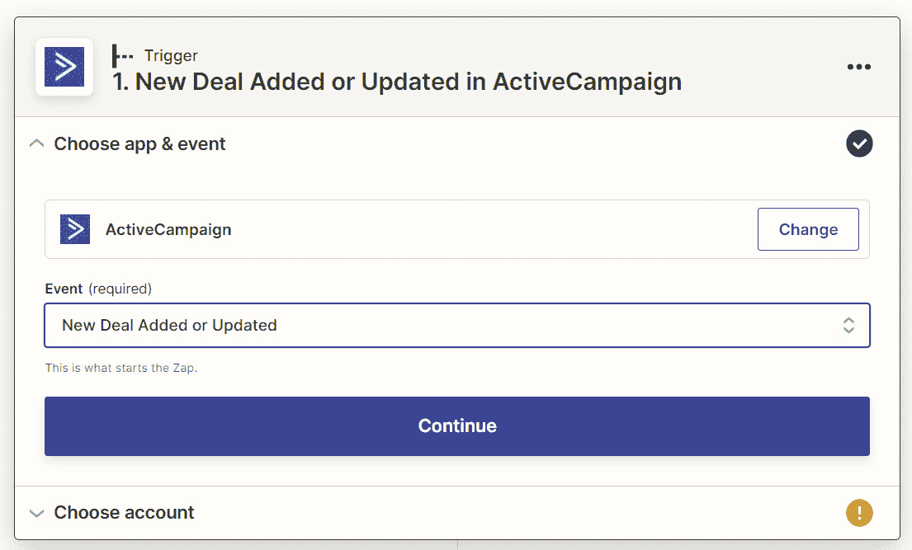
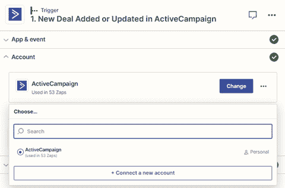

# 第三章：构建您的第一个自动化工作流程（Zap）

在本章中，我们将涵盖所有必须了解的信息，以帮助您开始自动化业务中的手动和重复性任务。我们将首先介绍如何制定和计划个别工作流程，然后深入研究逐步连接您的应用程序到 Zapier 的过程，介绍 Zap 编辑器的两个版本，并通过一个示例来帮助您从头开始创建您的第一个 Zap。然后，我们将向您展示如何编辑您的 Zap 并在不同版本之间切换，以及如何访问由 Zapier 创建的各种预构建或指导工作流程，以加快您的 Zap 构建过程。我们将解释您可能在操作步骤中看到的不同字段类型，以及如何使用正确的数据格式进行其字段。我们将通过深入探讨最佳实践来确保持续改进您的流程来结束本章。

在本章中，我们将涵盖以下关键主题：

+   制定您的第一个工作流程

+   将您的应用程序连接到 Zapier

+   在 Zap 编辑器中创建您的第一个 Zap

+   了解字段数据类型

+   确保您的流程和自动化保持最新

一旦您完成了每个主题，您将成功地使用 Zapier 构建您的第一个工作流程自动化。

# 技术要求

要完成本章的内容，您需要访问 Zapier 账户。Zapier 的免费计划足以完成本章的内容。要使用版本，您必须订阅付费的 Zapier 计划。您可以在此处获取本章中使用的**Zap 模板**：`bit.ly/zapier-book`。使用这些模板将帮助您可视化流程如何运作。

# 制定您的第一个工作流程

在本书中，我们已经讨论了如何简化您的流程，确定可以自动化的内容，并评估您的业务应用程序与 Zapier 集成的方式。现在您已经准备好开始计划您的第一个工作流程了。

制定工作流程的以下步骤是必需的：

1.  回顾您的流程和应用程序信息

1.  创建逐步工作流程计划

让我们来看看这些中的每一个。

## 回顾您的流程和应用程序信息

从您的流程列表中，选择满足以下条件的五个优先级流程之一：

+   流程可以部分或完全自动化

+   与流程相关联的一个或多个应用程序与 Zapier 集成

+   您已经为每个应用程序制定了触发器、操作和搜索列表

现在，让我们探讨如何创建工作流程计划。

## 创建逐步工作流程计划

从您选择的流程中，选择一个您之前确定可以自动化的最简单的快速解决方案。使用您流程的这一部分来完成以下步骤，以制定工作流程。然后我们将在本章的下一部分中创建这个工作流程自动化。

我们将使用销售流程的示例来说明我们需要采取的步骤来制定工作流。

您的公司没有复杂的销售流程。您有两名销售人员使用 **ActiveCampaign** 管理您的销售管道。当市场营销线索达到一定的线索分数时，自动营销活动的打开和链接点击会在管道中创建新的交易。您的管理团队中也有一些成员，他们不需要访问 ActiveCampaign，但需要知道与这些新交易相关的特定细节的摘要。销售团队在创建了 ActiveCampaign 中的交易后，将此信息手动添加到 Google Sheets 电子表格中。管理团队已经发现，偶尔会有交易未添加到电子表格中，并且数据中经常出现转录错误。销售团队提到该流程耗时且容易出错，随着数量的增加而增加。您已经在前面的章节中完成了所有步骤，以简化此流程，确定它是否可以自动化，并评估 ActiveCampaign 和 Google Sheets 是否与 Zapier 集成以及以何种方式集成。

以下图显示了前述示例作为一个利用了 5W1H 方法的映射流程，我们在*第二章*中介绍了 *准备自动化您的流程*：

图 3.1 – 用于可视化示例的流程图

让我们使用这个例子逐步进行策略性工作流程：

1.  **确定您的触发应用程序**：在我们的示例中，触发应用程序是 **ActiveCampaign**。

1.  **确定您的触发步骤事件**：在我们的示例中，Zapier 触发步骤是 **新交易已添加或已更新**。当在 ActiveCampaign 中创建新交易时，此事件将触发 Zapier 中的工作流的开始。以下是相关的截图：

图 3.2 – 展示了 ActiveCampaign 应用程序概要配置的新交易已添加或已更新触发事件。

1.  **确定触发器是定时的还是即时的**：在我们的示例中，此触发器是即时的，这意味着在 ActiveCampaign 中创建交易后，Zapier 中的工作流将被触发。

提示

了解您的工作流程将多频繁更新是很方便的。如果您已经注意到您的触发器是定时的而不是即时的，请查看您的 Zapier 定价计划，以确定您的工作流程可能何时启动。例如，如果您使用免费计划，则更新时间为每 15 分钟，这意味着 Zapier 将每 15 分钟查找该触发应用程序中的新数据，以便它可以启动您的工作流程。这在*第一章*中讨论过，*使用 Zapier 进行业务流程自动化简介*。

1.  **确定你的操作应用程序**：在我们的示例中，操作应用程序是**Google Sheets**。

1.  **审查您需要用于操作步骤的数据**：在我们的示例中，我们想要从 ActiveCampaign 的交易中捕获以下信息，并将其添加到我们的 Google Sheets 电子表格中：

    +   交易名称

    +   公司

    +   联系人

    +   联系人电子邮件

    +   交易价值（以美元计）

    +   预期关闭日期

    +   交易所有者

我们的 ActiveCampaign 交易如下屏幕截图所示：

图 3.3 – 作为工作示例使用的 ActiveCampaign 交易（由 ActiveCampaign 提供）

1.  **确定您的操作步骤事件**：在我们的示例中，Zapier 操作步骤是**创建电子表格行**。此操作将在您指定的电子表格中创建一行新记录。如下屏幕截图所示：

图 3.4 – Google Sheets 应用程序概要，显示创建电子表格行操作事件

接下来，我们需要了解我们需要在操作应用程序中捕获哪些数据。在这种情况下，它是一个 Google Sheets 电子表格。其结构如下屏幕截图所示：

图 3.5 – 用于我们示例的 Google Sheets 电子表格（由 Google 提供）

您的数据标题在各种应用程序中可能有稍微不同的措辞；因此，最好记录下您可能希望在两个应用程序之间进行映射的内容。当我们开始在 Zapier 中构建工作流程时，这个练习将使我们的**数据映射**步骤更容易遵循。我们的示例如下图所示：

图 3.6 – 触发器和操作步骤之间的数据映射

现在您已经制定了工作流程，您可以开始将您的应用程序连接到 Zapier，然后在 Zapier 平台上创建您的第一个工作流程自动化。

# 将您的应用程序连接到 Zapier

在我们开始构建自动化之前，我们需要连接我们的应用程序到 Zapier，以允许 Zapier 检索和发布其中的数据。

重要提示

了解 Zapier 如何处理您的数据和安全性是一个重要话题。允许 Zapier 使用认证协议访问您的应用程序对于 Zapier 能够代表您执行任务自动化是必不可少的。您用于对应用程序进行身份验证以便 Zapier 可以与其连接的凭据使用银行级加密存储。Zapier 创建了一份关于数据隐私和安全性的全面资源，您可以在这里阅读：`zapier.com/help/account/data-management/security-at-zapier`。

应用程序连接可以从两个地方执行：

+   左侧边栏中的**我的应用程序**链接。

+   我们在触发器、操作或搜索步骤中的 Zap 编辑器。我们将在 *在 Zap 编辑器中创建您的第一个 Zap* 部分和 *设置触发器步骤* 中详细介绍这一点。

让我们首先看看 **我的应用程序** 方法。

## 在“我的应用程序”中连接您的应用程序

跟随以下步骤连接您的每个应用程序：

1.  在搜索栏中开始键入应用程序名称以显示下拉列表。然后，选择您的应用程序并单击 **连接** 按钮。您也可以只需单击 **添加连接** 按钮以显示一个弹出窗口，您可以在其中使用搜索栏搜索应用程序。如下截图所示：

图 3.7 – 连接新帐户的概述在“我的应用程序”

1.  选择您的应用程序后，将打开一个新窗口，提供有关如何授权该应用程序的说明。您可能需要输入以下一些详细信息：

    +   Google 帐户详细信息（用于使用 **Google 登录**）

    +   用户名和密码

    +   应用程序域或子域 URL

    +   API 密钥或令牌

小贴士

Zapier 提供说明，以解释您需要填写的字段以及如果此信息不立即显而易见如何找到此信息。

以下截图显示了 **Freshdesk** 的子域和 API 密钥请求示例：

图 3.8 – 使用 Freshdesk 中的子域和 API 密钥授权您的应用程序

重要说明

如果您选择要连接的应用程序时没有出现新的浏览器选项卡或窗口，请尝试禁用浏览器的弹出窗口拦截器。

1.  然后，您将被带到一个批准页面，告知您 Zapier 希望访问您的帐户以及如果您批准访问将允许 Zapier 执行的操作。您可以阅读有关隐私和风险的更多信息，如果您愿意继续，请单击 **允许**。这段文字可能在应用程序之间有所不同。下图显示了使用 Google 帐户的示例：

图 3.9 – 确认允许 Zapier 访问应用程序的 Google 批准页面

重要说明

如果您已使用用户名和密码将应用程序连接到 Zapier，并且您已更改了应用程序中的密码，则可能需要重新连接应用程序。以下是有关应用程序身份验证和重新连接要求的更多详细信息：`zapier.com/help/manage/app-connections/what-should-i-do-in-zapier-if-i-change-an-app-account-password`。

对涉及触发器和操作步骤的所有应用程序执行 *步骤 1* 至 *3*。

现在您可以在您的工作流程中使用已连接的应用程序，这意味着您可以专注于创建您的第一个 Zap。接下来，我们将讨论如何从 Zap 编辑器内连接应用程序。

# 在 Zap 编辑器中创建您的第一个 Zap

您可以创建 Zap 的三种方法：

+   **创建 Zap（测试版）功能**：这是一项当前处于测试版的 AI Zap 构建器功能。它允许您使用一个提示，该提示将使用 AI 功能为您生成一个草稿 Zap。我们将在*第十九章*中更详细地讨论此功能，*AI* *和自动化*。

+   **建议的工作流模板**：一旦您添加了您使用的应用程序，在您的仪表板中，您将看到一些可以使用的工作流模板建议，以便快速开始使用 Zapier。我们将在本章后面讨论这个问题。

+   **从头开始构建**：学习如何使用 Zapier 自动化您的流程的最佳方式是从头开始构建您的 Zaps。

所有工作流都是在 Zap 编辑器中创建、编辑和维护的。可以随时从可展开的左侧边栏菜单中，通过单击 **+ 创建 Zap** 按钮来访问 Zap 编辑器。首先，让我们看看如何导航 Zap 编辑器。

## 导航 Zap 编辑器

Zap 编辑器由两个视图组成，您可以在其中构建您的 Zaps：

+   **经典编辑器**：这是多年来 Zap 编辑器的原始用户界面，显示以静态块垂直堆叠的步骤。以下截图显示了此内容：

图 3.10 – 经典编辑器视图的结构

+   **可视化编辑器**：这是一个新发布的功能，允许您完全可视化您的 Zap，将整个 Zap 移动和重新定位到屏幕上，放大和缩小以更改视图，并导出您的 Zap 的图像。大多数新用户帐户将默认为 **可视化编辑器**。以下截图显示了此内容：

图 3.11 – 可视化编辑器视图的结构

两个 Zap 编辑器都由顶部栏中的文本字段、图标和按钮组成，并且在 **经典编辑器** 的右侧可展开面板或 **可视化编辑器** 的左侧可展开面板中。让我们更详细地看看这个结构，以了解每个部分为我们提供了什么。

### 顶部栏

顶部栏从左到右包含以下文本字段、图标和按钮：

+   **后退箭头**：单击此图标将带您到 Zap 管理区域。我们将在*第四章*中更详细地讨论这个区域，*管理* *您的 Zaps*。

+   **无标题 Zap**：这是一个可编辑的文本字段，允许您为您的 Zap 指定一个自定义名称。适当命名您的 Zap 是管理工作流的重要部分。我们将在*第四章*中更详细地讨论这个问题，*管理* *您的 Zaps*。

+   **经典编辑器/可视化编辑器下拉菜单**：此下拉菜单允许您在 **经典编辑器** 和 **可视化编辑器** 之间导航。

+   **“开/关”按钮**：此按钮在您创建了 Zap、测试了它并消除了任何错误后才可用。您必须将您的 Zap **打开**以使用实时数据。

+   **发布按钮修复**：此按钮允许您在发布后编辑您的 Zap。仅在您的 Zap 第一次发布后才可见。

+   **三个点菜单**：单击此菜单项会显示**分享此 Zap**按钮，该按钮允许您与拥有 Zapier 账户的任何人分享您创建的 Zap。仅在您发布您的 Zap 后才可见。我们将在*第四章*中更详细地讨论 Zap 分享，*管理您的 Zaps*。

**Visual Editor 中的左侧面板**和**Classic Editor 中的右侧面板**包含几个图标，一旦您用光标突出显示，就会显示以下文本，从上到下：

+   **状态**：此部分在菜单中以感叹号图标表示。与您的 Zap 中特定步骤相关的任何错误都将在此处突出显示。您可以单击通知以获取有关错误特定内容的更多信息。在尝试打开您的 Zap 之前，解决任何已突出显示的错误非常重要。

+   **大纲**：此部分在菜单中以列表图标表示。仅在您发布您的 Zap 后才在**Visual Editor**中可见。它显示了 Visual Editor 中构建出的 Zap 的所有步骤的摘要。选择此部分中的任何步骤会突出显示编辑器中的步骤。一旦开始创建复杂的多步骤 Zap，使用此部分作为快速参考工具对于识别工作流程中特定步骤所在的位置以及管理 Zaps 中的步骤（重命名、删除、重新排序和复制）非常方便。搜索栏同样重要，用于根据标题搜索步骤。我们将在*第四章*中讨论如何最好地命名您的 Zaps，*管理您的 Zaps*。当您开始创建多步骤 Zaps 并且在*第六章*中覆盖如何重命名、删除、复制和重新排序步骤时，我们将应用这些命名原则到步骤中。

+   **设置**：此部分在菜单中以齿轮图标表示，并允许您从任一编辑器内管理您的 Zap。您可以编辑 Zap 的名称，更改其存储的文件夹，添加或更改其描述（这对于做笔记很有用），并更改 Zap 的时区设置。我们将在*第四章*中详细讨论此内容，*管理您的 Zaps*。

+   **版本**: 此部分由菜单中的框和两条线表示，只有在您发布了您的 Zap 后才可见。付费计划的用户将能够查看每个保存的草稿和已发布版本的 Zap。专业计划及以上用户还可以恢复以前的版本。我们将在*编辑您的 Zaps - 草稿和* *版本*部分进行更详细的讨论。

+   **历史**: 此部分由菜单中的时钟图标表示，并链接到**Zap 历史**模块。只有在您的 Zap 第一次被发布后才会可见。我们将在*第五章*中详细介绍**Zap 历史**，*故障排除和处理* *Zap 错误*。

+   **详情**: 该部分以页面和闪电图标表示，只有在您的 Zap 发布后才可见。点击该图标将带您到 Zap 的**详情**页面。我们将在*第四章*中详细讨论这一点，*管理* *您的 Zap*。

+   **帮助**: 该部分由菜单中的问号图标表示。这是一个有用的内置帮助台，显示可以从 Zap 编辑器内查看的“如何”帮助文章和视频。如果您在使用 Zap 时遇到问题，在页面底部，您会找到一个**获取帮助**链接，它将带您到 Zapier 支持页面，您可以在那里提交支持请求。

+   **注释**: 该部分由一个评论框图标表示，可用于添加有关 Zap 中步骤的更多信息。以下 Zapier 帮助文章提供了如何使用此功能的更多背景信息：`help.zapier.com/hc/en-us/articles/16791272000525`。我们将在*第十九章*中探讨如何使用 AI 功能生成 Zap 注释，*AI* *和自动化*。

+   **显示**: 底部的任一面板上显示一个箭头图标。在**经典编辑器**中，箭头图标是向左的，而在**可视编辑器**中，箭头图标是向右的。点击这个图标可以展开面板的视图，显示其他图标和它们的名称。

### 可视编辑器视图的左下部分

**可视编辑器**视图的左下部分显示了可以执行以下操作的控件：

+   **放大**: 您可以使用**+**图标来增加屏幕缩放百分比。缩放百分比显示在**+**和**-**图标之间。

+   **缩小**: 您可以使用**-**图标减少屏幕缩放百分比。

+   **适合查看**: 这个控件由一个指向盒子每个角的四个箭头图标表示。点击这个控件可以让您调整您的 Zap，以便全屏查看。

+   **导出为图像**: 这个控件由一个向下的箭头和一条线图标表示。它允许您将当前视图的图像下载到您的设备上。

如下截图所示：

图 3.12 – 底部左侧的可视化编辑器控件

### 编辑区域

编辑区域是 Zapier 真正发挥魔力的地方。这是你可以逐步创建工作流自动化的地方。编辑区域的结构如下：

+   **创建一个 Zap AI 构建器功能（测试版）**：新的 Zapier 账户用户可能看不到此功能显示，因为它目前仍处于测试版阶段。我们将在*第十九章*，*AI 和自动化*中更详细地讨论这个功能。

+   **触发步骤框**：这是你的触发步骤。你可以通过搜索或选择要添加到触发步骤的应用程序来开始构建你的 Zap。当你创建一个新的 Zap 时，触发步骤可能会显示为弹出窗口。

+   **加号（+）图标**：这些图标出现在所有步骤之间和最后一个步骤之后。点击这个图标可以在现有步骤之间添加操作、搜索、过滤、延迟和格式化步骤，以及在最后一个步骤之后添加路径。我们将从*第六章*更详细地讨论这个问题，*创建多步骤 Zap 和使用内置应用程序*。

+   **操作步骤框**：这是你的操作步骤。点击这个步骤来开始设置你的操作步骤。

在**经典编辑器**中，Zap 的定制是在主编辑区域进行的，而在**可视化编辑器**中，右侧面板会展开以允许你对步骤进行编辑。一旦你将一个应用程序添加到了触发或操作步骤中，步骤框的右上角会显示一个图标，即一个**三点图标**。点击这个图标将允许你重命名、重新排序、复制和粘贴、去重步骤。对于操作步骤，你还可以选择删除此步骤。你不能删除触发步骤，但你可以编辑它。我们将在本章稍后详细讨论这个问题。

现在我们对如何在两个编辑器中进行导航有了更好的理解，我们可以开始创建我们的 Zap 了。我们之前确定了我们的触发和操作应用程序，我们相关的步骤以及我们将在应用程序之间映射的数据。

重要提示

为了简化起见，本书其余章节中显示的所有截屏都是从**经典编辑器**视图中获取的。在相关情况下，我们将讨论**经典编辑器**和**可视化编辑器**视图之间的差异。

我们现在将使用本章前面的工作示例来说明如何创建一个 Zap。你可以按照你之前制定的工作流程来完成这些步骤。

## 设置你的触发步骤

首先，我们将从触发步骤开始。让我们逐步使用我们的示例来设置我们的触发步骤：

1.  **开始编辑触发步骤**：当你打开**经典编辑器**视图时，触发步骤将会自动打开。在**可视化编辑器**视图中，这将以弹出窗口的形式呈现。

1.  **选择您的触发应用程序**：从触发步骤中呈现的应用程序列表中选择一个作为触发应用程序连接。如果您在列表中没有看到它，请在上方的搜索栏中搜索它。搜索栏允许您在应用程序列表中未显示时搜索您选择的应用程序。选择任何应用程序都将允许您开始自定义您的触发和动作步骤。在我们的示例中，我们将选择**ActiveCampaign**。在**经典编辑器**视图中，更改将在主编辑区域内进行，而在**可视化编辑器**视图中，右侧面板会展开，以便您进行编辑。

1.  **选择您的触发事件**：现在，选择您的触发事件。在我们的示例中，我们将选择**New Deal Added or Updated**作为我们的触发事件，如下截图所示：

图 3.13 – 在 Zap 编辑器中使用 ActiveCampaign 应用程序的 New Deal Added or Updated 触发事件

点击**继续**按钮。

1.  **选择你的触发器应用程序帐户**：从下拉列表中选择你的应用程序帐户。列表只会显示与您在*步骤 2*中选择的应用程序相关的帐户，以及您之前连接到 Zapier 的帐户。您也可以点击**更改**按钮，然后点击**连接新帐户**按钮来连接和验证新的应用程序帐户。这将带您完成我们在本章*将您的应用程序连接到 Zapier*部分讨论的相同流程。另一个选择是点击**在此处管理您所有已连接的帐户**链接，这将使您能够在**我的应用程序**模块中编辑您的连接。如下截图所示：

图 3.14 – 在触发步骤中连接 ActiveCampaign 帐户到 Zapier

点击**继续**按钮。

1.  **选择你的样本数据并测试你的触发器**：接下来，我们需要从我们的应用程序（以我们的示例为例，是 ActiveCampaign）中找到样本数据来测试我们的触发器。这将确认我们正在使用正确的应用程序帐户，并且触发器步骤正常工作。点击**测试**按钮。Zapier 将在您的应用程序中搜索数据，几秒钟后，将这些数据拉入编辑器中，编辑器将显示记录被拉入的日期。

提示

我们建议您在测试 Zaps 时尽可能创建测试数据、样本数据集或虚拟数据。这可以帮助您避免在您的应用程序帐户中损坏实时数据。

1.  `测试公司交易`，与`deal_title`数据标签相关联。我们将使用此交易的名称作为**唯一标识符**来检查我们是否有正确的示例数据用于测试。您可以浏览数据或使用搜索栏查找您的数据。使用搜索栏将突出显示包含该文本的数据值的数量；您可以使用箭头键和滚动条轻松找到它们。如下截图所示：

图 3.15 – 使用唯一标识符在示例中搜索数据

1.  **更改示例数据**：您可以通过使用上下箭头选择示例标头（对于我们的示例，*图 3**.15*标示为**交易 G**）并选择其他选项（如果可用）来更改示例数据。要检索更多示例数据，请选择**查找** **新记录**。

1.  **完成触发器步骤**：选择**继续使用所选记录**以继续进行操作步骤。如果您的触发器设置正确，则将在应用程序徽标旁边看到一个绿色的勾号，如下截图所示：

图 3.16 – 在 Zap 编辑器中完成的触发器步骤

重要提示

一些应用程序集成只允许通过有限数量的示例数据集。在某些情况下，只会传递最近创建的数据。在测试触发器时，您可能需要创建额外的示例集。此外，某些应用程序集成在应用程序中拉取任何现有示例数据时存在问题，并将为您提供虚拟示例数据供您使用。在这些情况下，使用虚拟示例数据来测试您的触发器步骤。当 Zap 打开时，您的 Zap 将正确地使用“实时”数据。如果这不起作用，请联系 Zapier 支持。

接下来，我们将设置我们的操作步骤。

## 设置您的操作步骤

在操作步骤中，您将找到两种主要的字段类型：

+   **选择值…**，您可以从中选择从我们的操作应用程序中带入的下拉列表中的设置值，或添加**自定义值**。当我们探讨多步 Zaps 时，我们将更详细地讨论使用自定义值。

+   在 Google Sheets 电子表格中的`交易名称`单元格，当创建新行时始终显示`测试交易`，我们将在该步骤的字段中输入`测试交易`。另一方面，使用动态数据意味着该值在运行 Zap 时将代表实时数据。此数据是从您的触发器应用程序检索的（或者如果您正在使用多步 Zaps，则是从先前的操作步骤检索的）。

提示

在表格中绘制数据有助于您识别不同应用程序中的动态数据名称。通常，数据的标题可能与您期望的不同。这些命名约定是基于 API 字段在应用程序中给出的标题。关于*图 3**.6*中的数据表和*图 3**.15*中的触发器数据，在我们的示例中，我们可能希望看到`deal_title`的值，而不是`contact_orgname`或`deal_orgname`。随着您对触发器和操作步骤中的字段数据命名和呈现方式越来越熟悉，您可以向数据映射表中添加一个额外的列，显示 API 字段的名称。

在以下截图中显示了一个示例，在其中在两个单独的动作步骤中的**交易名称**字段中使用了静态文本和动态文本：

图 3.17 – 使用动态数据（在方框内）和键入静态文本（由箭头指示）来映射 Google Sheets 动作步骤字段

现在，让我们逐步指南来设置我们的操作步骤，如下所示：

1.  **开始新的步骤**：单击标记为**2\. 操作**的第二步，以显示应用程序列表。

1.  **选择您的操作应用程序**：从显示的应用程序列表中选择您的操作应用程序。如果在列表中找不到它，请在上方的搜索栏中搜索它。在我们的示例中，我们将选择**Google Sheets**。

1.  **选择您的操作事件**：现在，选择您的操作事件。在我们的示例中，我们将选择**创建电子表格行**作为我们的操作事件。点击**继续**按钮。

1.  **选择您的操作应用程序帐户**：从下拉列表中选择您的应用程序帐户。此步骤的功能与触发器应用程序帐户步骤相同。点击**继续**按钮。

1.  **自定义您的操作步骤**：接下来，我们需要自定义我们的操作步骤。在我们的示例中，我们需要做的第一件事是选择 Zapier 要将数据添加到的电子表格。使用**选择值…**字段，Zapier 将从我们的动作应用程序中带入一组固定值的列表。在我们的示例中，Zapier 将带入一组电子表格，并且一旦选择了电子表格，就会显示该表内的工作表列表。如下截图所示：

图 3.18 – 选择要在 Zapier 动作步骤中使用的 Google Sheets 电子表格和工作表

在我们的示例中，其余的字段类型都是**输入文本或插入数据…**；我们将使用此来描述如何映射您的字段。

一旦您选择了要映射的领域（在本例中使用**输入文本或插入数据…**字段），将显示动态数据的下拉列表。此动态数据将以以下格式呈现：

+   **图标**，代表起始应用程序（在我们的示例中为 ActiveCampaign）。它将类似于应用程序的标志。

+   `1.` 在多步 Zaps 中，此编号将帮助您确定要从哪个步骤映射数据。

+   **加粗的文本带有冒号**，代表应用程序中编码的字段名称 – 即，**API** **字段名称**。

+   **普通样式的文本**，代表应用程序中的动态数据。

这在下面的屏幕截图中显示：

图 3.19 – 动态数据的结构

您可以选择**显示所有选项**以显示所有数据，您可以滚动浏览，或者使用搜索栏搜索特定文本。

现在我们可以利用*图 3**.6*中的信息来协助我们映射我们的字段数据。使用我们的示例，我们可以在搜索栏中输入 `Test Company` `deal` 标题，如下面的屏幕截图所示：

图 3.20 – 在操作步骤中搜索动态数据

确定要映射到该字段的正确数据集，并选择相关数据。对每个字段重复此操作。

重要提示

填写任何标记为**必填**的字段。如果没有这些字段，您将无法测试您的操作步骤。

一旦您映射了所有字段，生成的操作步骤表单将类似于下面的屏幕截图（使用我们的示例）：

图 3.21 – 带有映射字段的完成操作步骤表单

如您从*图 3**.21*中可以看到的，您可以将两个或更多值动态映射到字段中以形成新单词。例如，在 `Deal Owner First Name` 数据值和 `Deal Owner Last Name` 数据值中显示完整姓名。

1.  **测试您的数据**：一旦您满意您的**字段映射**是正确的，点击**继续**。接下来，我们需要通过将数据发送到我们的操作应用程序，Google Sheets，来测试我们的数据。您可以查看我们将发送的数据，并点击**测试操作**按钮。未填写的字段将在**空字段**部分中突出显示。这在下面的屏幕截图中显示：

图 3.22 – 操作步骤中测试操作块中的数据测试选项

如果您不想发送测试数据，您也可以选择**跳过测试**。

如果您的请求成功，您将看到一个突出显示的成功消息。您可以选择**重新测试操作**以保持在**测试**块中看到另一个结果，或者选择**发布**以发布您的草稿并打开您的 Zap。

会弹出一个提示框，显示**准备发布您的 Zap？**和一个**发布**按钮。点击**发布**按钮以发布并打开您的 Zap。

1.  **检查您的操作应用中的数据**：始终检查您的数据是否已正确发送到您的操作中。如下截图所示，包括填写的预期截止日期：

图 3.23 – 成功发送测试数据的操作步骤显示在 Google Sheets 中（由 Google 提供）

提示

Zapier 根据步骤的功能为触发器和操作步骤分配标准名称。养成更改这些标准名称并使用适用于您的工作流程的关键字重命名操作步骤的习惯。然后，您可以使用右侧菜单中的**大纲**图标搜索步骤。当您有复杂的多步 Zap 并且正在与团队合作时，这将非常方便。

您可以在此处获取此 Zap 的模板并将其添加到您的 Zapier 帐户：https://bit.ly/zapier-book。使用此 Zap 模板将帮助您可视化该过程的工作方式。

提示

对于我们的示例，您需要记住，触发器将在每次在 ActiveCampaign 中添加或更新新交易时运行。这意味着我们也将把更新后的交易添加到 Google Sheets 电子表格中作为新行。您可以使用搜索操作步骤来检查 Google Sheets 电子表格，以查看交易是否已存在于表中，然后立即使用 Filter by Zapier 步骤仅在交易不在表中时允许 Zap 继续。我们将在*第六章*中讨论使用搜索操作步骤，*创建多步 Zap 和使用内置应用程序*，以及在*第七章*中使用 Filter by Zapier，*入门* *内置应用程序*。

## 理解步骤中的状态

在构建 Zap 时，请注意步骤中的状态。这将帮助您确定 Zap 中是否存在功能问题，并确保您的 Zap 可以无错误地发布。状态显示在两个地方：

+   **在步骤块内**：如果步骤的部分处于正常工作状态，则用**绿色勾号图标**表示，如果需要操作，则用**黄色感叹号图标**表示。如下截图所示：

图 3.24 – 步骤块内的状态

+   **在右侧面板中的状态部分**：此部分突出显示 Zap 中的问题，并指示哪个步骤存在问题，问题可能是什么以及如何解决。如下截图所示：

图 3.25 – 在经典编辑器视图中右侧面板中的状态

重要提示

在尝试发布您的 Zap 之前，请解决任何状态问题。

现在你已经创建了触发器和操作步骤，解决了任何状态问题，并测试了你的 Zap，你需要给它命名并打开它，以便它可以触发所选事件的触发器应用程序并在实时数据上运行。

## 给你的 Zap 起个名字和启动它

让我们给 Zap 命名，以便可以轻松识别它。我们可以在顶部面板的`新的 ActiveCampaign 里添加新交易时创建新的 Google Sheets 行`中进行这样的操作。我们将在*第四章*，*管理你的 Zaps*中详细讨论如何最好地命名 Zaps。

你需要做的最后一件事是启动你的 Zap。可以使用顶部菜单中的**发布**按钮或 Zap 编辑器底部的弹出窗口完成此操作。一旦发布，你的 Zap 将处于只读模式，不能进行调整。

干得好，你刚刚从头开始创建了你的第一个工作流自动化！

接下来，让我们了解如何编辑你的 Zap 并理解草稿和版本功能。

## 编辑你的 Zap - 草稿和版本

当您开始创建一个 Zap 时，Zapier 将自动将任何更改保存为**草稿**。一旦 Zap 首次发布，您可以在不关闭它的情况下对其进行编辑。这意味着在您对 Zap 进行更改时，Zap 将继续触发和运行。即使您退出特定 Zap 的 Zap 编辑器，对 Zap 的更改也将保存。

在编辑你的 Zap 时，上次保存的草稿的时间会显示在 Zap 标题下方的文字中，如下面的屏幕截图所示：

图 3.26-草稿保存时间戳

要对你的 Zap 进行编辑，点击 Zap 编辑器底部的**编辑**按钮或右上面板的**编辑 Zap**按钮。如下面的屏幕截图所示：

图 3.27-编辑 Zap

如果你之前编辑过你的 Zap 并保存了草稿，将会弹出一个弹窗，给你选择删除草稿的选项，点击**放弃**按钮即可。你也可以点击**编辑**草稿按钮来继续使用和编辑你之前创建的草稿：

图 3.28-编辑带有现有保存草稿的 Zap

你可以继续编辑之前保存的草稿。

提示

无法在已保存但未发布的草稿上保存有关整体更改的注释，如果你还没有发布更改，很容易忘记所做的更改。如果你计划在发布之前将来进一步处理草稿，请记下你的更改，并在右侧面板的**设置**下的**描述**框中进行。这将确保您有您未发布更改的记录。

### 发布新版本的 Zap

当您准备好发布更改时，请单击**发布**按钮。 您将收到一个弹出窗口，以便您可以通过输入**版本**名称来发布新版本。 在**版本名称**字段中填写尽可能多的描述性信息，以帮助您记住您所做的更改。 单击**取消**按钮取消发布操作或单击**发布**以继续发布 Zap 的新版本：

图 3.29 – 发布 Zap 的新版本

重要提示

**版本**功能在免费计划中不可用。 在入门版计划中，版本历史记录保存 1 周，在专业版计划中保存 1 个月，在团队版计划中保存 6 个月，在公司版计划中保存 1 年。 版本回滚仅适用于专业版计划及更高版本

现在，您已经发布了 Zap 的新版本，请让我们探索如何管理 Zap 的版本历史记录。

### 管理 Zap 的各个发布版本

您可以通过单击**官方编辑器**视图中右侧面板或**可视编辑器**视图中左侧面板中的**版本**按钮，来管理 Zap 的不同发布版本。 这将显示您 Zap 的先前发布版本的列表，最旧的版本在底部，最新版本通常标有**正在使用**标签。 还将显示发布该版本的用户以及发布时间。 然后可以执行以下操作：

+   **重命名版本**：单击任何版本旁边的**三个点图标**，显示一个下拉菜单，在其中单击**重命名版本**选项即可更改版本的名称

+   **恢复到以前的版本**：单击该版本以显示编辑器中的该版本，然后单击下拉菜单，并选择**从该版本开始编辑**选项，以将该版本带入编辑器进行更改或者发布不更改

如下截图所示：

图 3.30 – 管理 Zap 的各个发布版本

现在，让我们讨论使用预构建工作流的好处。

## 使用 Zapier 的引导式工作流（Zap 模板）

使用 Zap 编辑器开始构建您的 Zaps 是学习如何使用 Zapier 的最佳方式。 但是，您可以通过探索和使用预构建的模板或称为 Zap 模板的引导工作流来节省时间。 Zapier 已经使用常见的应用程序组合和相应的触发器或操作事件创建了数千个单步 Zap。 可以从本章节中提到的各个位置访问这些 Zap 模板；然而，使用引导式工作流的最实用位置是从主仪表板开始，并使用**制作 Zap**交互式工具。 

您只需输入要连接的两个应用程序以及您的触发器和操作事件。然后，Zapier 将为您提供一个预构建的 Zap 供您使用。选择 **尝试** 继续，这将直接带您进入 Zap 编辑器，或者选择 **取消** 重新开始。以下截图显示了使用我们的示例工作流的情况：

图 3.31 - 使用“制作 Zap”预构建工作流工具

Zapier 提供了交互工具的变体，例如主仪表板上的 **为您推荐的工作流** 选项。这通过命名目标提供了一种更具体的方法。例如，您可以选择一个模板将新的 WordPress 帖子发布到您的 Facebook 页面，然后按照连接您的 WordPress 和 Facebook 页面帐户的步骤来自定义 Zap，测试它并发布它。

重要提示

一些帐户可能在仪表板中显示 **创建 Zap (beta)** AI 功能，从而取代 **制作 Zap** 交互式工具。我们将在*第十九章*中更详细地探讨此功能，*AI* *和自动化*。

您现在应该对如何从头开始创建 Zap，以及如何使用 Zapier 创建的预构建工作流有了更好的了解。现在，让我们看看在操作步骤中可能显示的不同字段类型。

# 了解字段数据类型

现在我们已经创建了我们的第一个 Zap，我们必须详细说明您在 Zapier 操作步骤中可能看到的不同类型的字段。

在前一节中，我们介绍了两种常见的字段类型，**选择值...** 和 **输入文本或插入数据...**，以及如何使用它们来映射您的 Zaps 中的字段。除了这两种常见的字段类型之外，还有五种不同的字段数据类型，允许您以特定格式添加数据。每种字段数据类型都由一个图标表示，如下表所示：

图 3.32 - 操作步骤字段数据类型

这些字段数据类型由您的操作应用程序的数据发布格式要求所决定。例如，如果您的操作应用程序是 Xero（一个会计应用程序），并且您想要创建一个新的发票，那么您的发票日期字段将仅允许您添加日期/时间数据值以使请求成功。

我们将依次讨论这些字段数据类型。

## 日期/时间

**日期/时间字段** 类型由并排的日历和时钟图标表示。此字段需要以日期形式的数据，可以带有或不带有时间。

下面是来自会计应用程序操作步骤的日期/时间字段的示例截图：

图 3.33 - 会计应用程序操作步骤中的日期/时间字段

### 支持的格式

Zapier 识别并支持各种时间/日期格式，如下所示：

+   **标准国际** (**ISO**) 格式 - 例如，2020-07-15T13:05

+   Unix 时间戳（自 1970 年 1 月 1 日以来的秒数）– 例如，1591537509

+   今天中午

+   下周一下午 5 点

+   2020 年 5 月 15 日下午 9 点美东时间

### 时区设置

在*第一章*，*通过 Zapier 进行业务流程自动化简介*，以及本章早期，我们讨论了如何更改您的账户时区设置和 Zap 时区设置。如果您在时间/日期数据中未指定时区，例如`今天中午`，Zapier 将使用您的账户或 Zap 时区设置。

您应在字段中使用的格式是为操作应用程序所需的。每个应用程序都有不同的所需日期/时间格式和时区设置。每个应用程序都将识别某些时间格式/时区设置，而不是其他。如果您不确定您的操作应用程序所需的确切格式，或者如果数据未如预期般发布，您应联系 Zapier 支持。

我们将在*第十四章*中讨论如何格式化日期和时间值。

## 数字（整数）

**数字（整数）**字段类型由数字**1 2 3**表示。此字段需要以整数形式提供数据，这是一个正数或负数的整数（也可以是零）。此字段通常用于选择唯一标识符记录，例如用户、公司和项目的 ID 编号，以及在操作应用程序中的数字特定字段中发布数字字符串。

短信发送应用程序操作步骤中数字（整数）字段的示例显示在以下屏幕截图中：

图 3.34 – 来自 CRM 应用程序操作步骤的数字（整数）字段，指示 ID 值的输入

## 布尔（真/假）

`true` 或 `false` 值表示字段在操作应用程序中的表示方式。这些值可以转换如下：

+   `true`、`yes`、`t`或`1`

+   `false`、`no`、`f`或`0`

在下面的屏幕截图示例中，当在 Xero 会计软件中创建发票时，您可以选择将发票标记为**发送给联系人**。值为 **True** 表示是，而值为 **False** 表示否：

图 3.35 – 来自 Xero 会计应用程序操作步骤的布尔（真/假）字段

## 文件

**文件**字段类型由**文档图标**表示。这些字段需要以在线可访问文档文件的形式提供数据，而不是文档的名称。通常，这些文档文件由动态数据中的文本表示（标记为**（存在但未显示）**），并且可以是各种文件格式。

电子邮件应用程序操作步骤中两种不同格式的文件字段的示例显示在以下屏幕截图中：

图 3.36 - 来自电子邮件应用程序操作步骤的文件字段，映射了两种不同的格式

注意

只能向一个字段添加单个文件。

您可以在字段中键入文本，Zapier 将其转换为包含填充内容的`.txt`文件。然后将其上传到操作应用程序。您还可以添加一个 URL，Zapier 将检查内容，尝试相应命名，并将其上传到操作应用程序 - 例如，如果您添加了图像的 URL，而不是图像文件本身。

## 十进制

**十进制**字段类型由**1.0**表示。这些字段需要以小数形式的数字数据，并且可以是可变小数位数的。其理论与数字（整数）字段类似；但是，如果缺少小数部分，则 Zapier 将在将数据发布到操作应用程序之前添加它。

下图显示了会计应用程序操作步骤中的十进制字段示例：

图 3.37 - 来自会计应用程序操作步骤的十进制字段

您现在应该对操作步骤中使用的不同类型的字段数据有了更好的了解。现在，让我们探讨如何使您的工作流自动化保持最新状态。

# 确保您的流程和自动化保持最新状态

在*第一章*、*通过 Zapier 实现业务流程自动化的介绍*，以及*第二章*、*准备自动化您的流程* 中，我们介绍了使用业务流程自动化原则来改善您管理流程的方式，并通过自动化使其更加高效。现在，我们需要讨论以持续改进为目标构建您的工作流程的重要性。

由于经济影响、员工流动、优先级和目标以及增长，企业不断变化。因此，公司的工作方式以及任务的执行方式经常会发生变化。此外，应用程序集成经常会更新和改进。定期审查您的流程将确保您从这些升级中受益，并与您的业务当前功能的方式保持一致。业务流程自动化原则考虑到企业和技术不断发展，并促进制定持续改进计划。

实现有效的工作流自动化在您的业务中成功实施的五个关键步骤如下：

1.  **发现**：分析和简化您的流程，并逐步规划您的工作流程。

1.  **创建**：构建您的工作流程并进行测试。根据需要调整您的工作流程。

1.  **实施**：记录您的工作流程，培训所有用户，并让其他相关团队成员了解新流程。启动您的工作流程。

1.  **复盘**：不断监控工作流程性能。定期审查您的流程，评估是否可以改进。您可以通过重复*第二章*, *准备自动化您的流程*中描述的练习，并检查它们是否仍然相关、有用，并且没有多余或浪费来做到这一点。

1.  **改进**：评估哪些步骤可以被改变和改进。

完成所有五个步骤后，定期计划地重复*第 1 步*。

通过定期重新评估您的 Zapier 工作流程，您将能够去除不必要的步骤，最终减少任务使用。遵循这些原则将确保您的流程和后续自动化与当前情况保持一致，并保持精简和无差错。

# 总结

在本章中，我们首先讨论了如何制定个人工作流程的战略，然后深入研究了将您的应用程序连接到 Zapier 并在 Zapier 中创建您的第一个工作流程自动化（Zap）的逐步过程。我们探讨了如何编辑您的 Zaps 并利用版本历史记录在不同版本之间切换的方式，以及如何访问并使用各种预构建的工作流程。我们还探讨了动作步骤中可以找到的不同类型的字段以及如何正确使用这些字段。最后，我们深入探讨了确保持续改进流程的最佳实践。

您现在知道如何计划您的工作流程并从头开始或使用 Zap 模板在 Zapier 中创建它们。您还知道如何使用不同类型的字段数据并通过不断改进您的流程。您还创建了您的第一个自动化工作流程。

下一章中，我们将介绍如何通过为 Zap 命名和使用文件夹的方式来组织您的 Zap 的最佳方法。我们将讨论如何管理单个 Zap，并帮助您了解 Zap 的状态。我们还将介绍如何管理连接到您的 Zapier 账号的应用程序，然后描述如何与其他 Zapier 用户共享单个 Zap 的副本以及如何与团队共享 Zaps 和文件夹。

# 问题

1.  Zapier 可以要求您以三种方式连接和验证您的应用程序吗？

1.  添加数据到动作步骤的三种选项是什么？

1.  除了两种通用类型的数据字段外，还有哪五种特定的字段数据类型？
