# 第四章：管理你的 Zaps

在本章中，我们将讨论管理和维护你的 Zapier 账户中数据的最佳方法。随着你构建更多的 Zaps，保持它们有序将变得更加重要以保持结构。因此，我们将从解释如何使用最佳命名约定和使用文件夹来保持你的工作流程在 Zap 管理区域中组织有序开始本章。接下来，我们将讨论如何管理单个 Zaps 并利用 Zap **设置** 区域。然后，我们将帮助你理解 Zap 状态，然后讨论如何最好地管理你连接的应用程序。最后，我们将讨论如何与其他 Zapier 用户分享你的工作流程。

我们将在本章讨论以下关键话题：

+   保持你的 Zaps 有序

+   如何管理你的 Zaps

+   理解 Zap 状态

+   管理你连接的应用程序

+   分享你的 Zaps 和文件夹

一旦你完成了每个主题的学习，你就会知道如何保持你的工作流程组织有序，如何维护和分享它们，以及如何管理你连接的应用程序。

# 技术要求

要完成本章的内容和练习，你需要访问 Zapier 账户。Zapier 免费计划足以完成本章大部分内容。对于 *分享你的 Zaps 和文件夹* 部分的一些说明，你需要在团队或公司计划上拥有 Zapier 账户。

# 保持你的 Zaps 有序

在 *第三章*，*构建你的第一个自动化工作流（Zap）* 中，我们介绍了创建第一个工作流自动化所需的步骤。随着你重复这个过程，你将建立更多的 Zaps 来自动化你的其他业务流程。确保你已经创建了一个组织工作流的系统是更加重要的。因此，在你建立了一些工作流程之后，开始理解如何最好地保持你的 Zaps 有序并启动这个过程是一个很好的实践。

这是你可以采取的几个步骤来帮助你保持你的 Zaps 有序：

+   给你的 Zaps 添加适当的标签

+   在 Zap 管理区域使用文件夹和子文件夹

让我们讨论一下它们。

## 给你的 Zaps 添加适当的标签

从组织的角度来看，你应该用足够的信息来命名你的 Zaps，以确保标题足够描述该 Zap 的功能。适当地标记你的 Zaps 将使你能够将它们分组，搜索它们，并在 **Zap 历史记录** 中快速识别它们以及在排除错误时。

你可以用几种方式来命名你的 Zaps，你选择哪种方式取决于你的业务和个人偏好。以下是一些常用的 Zap 命名方法：

+   使用触发器和操作描述

+   使用唯一标识符

+   添加数字、字母或罗马数字

当我们审查每个内容时，想一想能帮助你识别你的 Zaps 的关键字。

### 使用触发器和操作描述

最明显的方法是在触发应用程序中的事件触发时，使用简短描述描述操作步骤中发生的情况。在第三章，*创建您的第一个自动化工作流程（Zap）* 中，我们使用一个实例来说明 Zap 构建过程。在我们的示例中，我们建立了一个工作流程，当在 ActiveCampaign 中创建新交易时触发，结果导致在 Google Sheets 电子表格中添加一行。我们选择将该 Zap 命名为 `在 ActiveCampaign 中创建新交易时，创建新 Google Sheets 行`。如果您的 Zap 触发器是新联系人添加至`在 SendinBlue 中添加新联系人时，创建新项目`。

这是您将在大多数 Zapier 预构建/引导式工作流程中看到的典型安排。

### 使用唯一标识符

如果突出显示这一点特别重要，您还可以选择指定一个唯一标识符，例如参与触发器或操作步骤的用户、文件或应用程序帐户。例如，如果您有多个 Zaps 完成类似结果但基于不同条件触发，比如特定于某用户的情况，您可以将用户的名字添加到标题中以帮助您区分这些工作流程之间的区别。在我们的示例中，我们可能选择突出使用的 Google Sheets 电子表格，并将 Zap 命名为 `在 ActiveCampaign 中创建新交易时，创建新 Google Sheets（我们的交易）行`。

提示

当您开始构建多步骤的 Zaps 时，使用这种方法命名您的 Zaps 可能会变得复杂。不要过度复杂化命名过程。尽可能缩写，使用关键词，并使您的 Zap 标题简短但描述性。

使用唯一标识符对基于关键字筛选和搜索 Zaps 尤为有用。

### 添加数字、字母或罗马数字

另一种经常使用的 Zap 命名方法是在短触发器/操作描述之前添加数字、字母、罗马数字或适当的组合。在我们的示例中，我们可能选择编号并命名 Zap 为 `1a. 创建新 Google Sheets（我们的交易）行，当在 ActiveCampaign 中创建新交易时`。如果您已经将工作流程拆分成镜像实际自动化流程步骤的工作流程，那么这种方法尤其有用。由于 Zaps 在 Zap 管理区域以字母数字顺序列出，因此以这种方式命名您的 Zaps 对于按特定顺序查看 Zaps 也很有帮助。对 Zaps 进行编号也有助于快速查阅 Zap 历史信息。

在开始使用 Zapier 自动化流程后不久，即可开始使用合适的命名系统，这将在日后组织您的 Zaps 时节省时间和精力。

提示

尽管 Zapier 显示 Zap 的变更日志和修订历史，但版本历史仅适用于付费计划。如果您使用的是免费计划或与团队合作，您可能会发现向 Zap **设置描述**框中添加有关对 Zap 的更改很有用，我们将在本章后面的部分*在 Zap 编辑器中使用 Zap 设置选项卡*中进一步讨论此情况。

现在，让我们回顾如何使用文件夹为您的 Zapier 账户带来更多组织。

## 在 Zap 管理区使用文件夹和子文件夹

充分命名您的 Zaps 无疑是一个良好的做法。如果我们将其与将 Zaps 分类到文件夹和子文件夹（文件夹中的文件夹）相结合，那么您的 Zaps 将很容易找到和维护。文件夹可以在 Zap 管理区中创建和管理，可以通过单击左侧边栏中的**Zaps**图标或导航至[`zapier.com/app/zaps`](https://zapier.com/app/zaps)来找到。

Zap 管理区分为左侧面板和中央面板，如下面的截图所示：

图 4.1 – Zapier Zap 管理区概述

我们将在*如何管理您的 Zaps*部分讨论中央面板，因此让我们深入研究如何使用左侧面板来管理文件夹。

左侧面板用于管理文件夹，结构如下：

+   **搜索栏**：您可以使用搜索栏使用关键字过滤您的 Zaps。这些经过筛选的 Zaps 将在中央面板上显示，并显示具有该关键字搜索结果的标题。如下截图所示：

图 4.2 – 使用关键字搜索筛选您的 Zaps

+   **私人文件夹**：此部分显示您拥有的所有文件夹以及其中包含的 Zaps。如果您使用团队或公司计划，这些文件夹和其中的 Zaps 将仅对您可见。

+   **共享文件夹**：此部分仅在您订阅团队或公司计划时可用。在此创建的文件夹可以与个别用户共享，或者，如果您使用公司计划，可以与您在团队中设置的特定用户组共享。我们将在*共享您的 Zaps 和文件夹*部分更详细地讨论使用共享文件夹。

+   **暂停**：此文件夹包含已暂停的 Zaps。我们将在*第五章*，*故障排除和处理 Zap 错误*中更详细地讨论**暂停**Zap 运行。

+   **回收站**：此文件夹保存已删除的 Zaps。已删除的 Zaps 在永久删除之前将在此文件夹中保存 30 天。

提示

您可以将您的 Zaps 存档而不是永久删除它们。 创建一个名为`Archived`的文件夹来存储您将来可能需要参考的 Zaps，以便如果您将它们添加到**回收站**中，则不会永久删除它们。

从左侧面板，您可以执行以下操作：

+   创建和命名文件夹

+   选择文件夹以查看其内容

+   管理您的文件夹

让我们逐个来看看这些。

### 创建和命名文件夹

您可以通过单击**私人文件夹**和**共享文件夹**旁边的**+**图标来创建新文件夹（如果使用团队或公司帐户）。 将出现一个弹出窗口，您可以添加最多 255 个字符的标题，以帮助您识别文件夹。 然后，如果您希望取消，则单击**取消**按钮，如果您希望保存新标题，则单击**完成**按钮。

#### 命名您的文件夹

正如我们在本章前面讨论过的那样，适当命名您的 Zaps 对于组织它们至关重要。 您选择将 Zaps 分组到文件夹中的方式同样重要。 再次强调，这将取决于个人偏好和符合您业务需求的内容。 但是，以下是一些对文件夹进行分类的方式的示例：

+   **按焦点应用程序或应用程序类别**：您可以根据触发器和动作步骤中使用的主要应用程序将 Zaps 分组，例如“Salesforce”。 或者，您可以按应用程序类别将它们分组，例如“调查”。

+   **按部门或业务功能**：您可以将 Zaps 分组，例如“市场营销”，“销售”和“运营”。

+   **按客户**：如果您是自由职业者或承包商，并且您在自己的帐户中管理了几个客户的工作流程，您可以相应地将您的 Zaps 分开。

与 Zaps 一样，文件夹按字母数字顺序列出。 每个文件夹显示为其中存储的 Zaps 的名称和数量。

### 选择文件夹以查看其内容

您可以选择一个文件夹来显示和管理文件夹中的 Zaps。

### 管理您的文件夹

单击**三个点图标**（不适用于**主页**文件夹）以显示下拉列表，允许您执行以下操作：

+   **移动**：选择此选项将允许您将文件夹移动到另一个文件夹中，从而创建一个**子文件夹**。

+   **重命名**：选择此选项将允许您编辑文件夹名称。

+   **新文件夹**：选择此选项将允许您在另一个文件夹中创建一个子文件夹。 使用子文件夹对于保持您的 Zapier 帐户组织良好非常有用。

+   **分享**：此选项适用于团队或公司帐户的用户。 您可以共享一个文件夹以及该文件夹中的所有 Zaps。 **分享**选项将在文件夹的所有者的**私人文件夹**中提供。 一旦共享，**共享**选项将显示在**共享文件夹**中，并且仅适用于管理员用户。 如果您正在使用团队或公司帐户，则将显示此选项。 我们将在*分享您的 Zaps 和* *文件夹*部分中更详细地讨论这一点。

+   **删除**：选择此选项将允许您删除文件夹。存储在此文件夹中的所有 Zaps 将自动移回**首页**文件夹，并且不会被删除。此选项仅适用于团队和公司账户的文件夹所有者。

重要提示

**首页**文件夹是默认文件夹，无法重命名，删除或共享。但是 Zaps 可以添加到此文件夹，并从中移除。

现在我们已经探索了如何通过使用命名技巧和将其与文件夹进行排序来管理您的 Zaps 的方法，让我们深入了解如何管理您的个别 Zaps。

# 如何管理您的 Zaps

Zap 管理区的中心面板显示了您的 Zap 列表，这些 Zap 来自您选择的文件夹，或者是使用搜索栏的结果。当您首次进入 Zap 管理区时，默认视图为**首页**文件夹。您可以从中心面板管理您的 Zap，并且显示文件夹标题作为头部，顶部导航栏以及您的 Zap 列表。

每个 Zap 都以清晰定义的部分呈现，并且点击 Zap 名称中的链接将直接带您进入 Zap 编辑器，在那里您可以编辑特定的 Zap。在每个 Zap 框的左侧还会找到一个复选框。您可以使用复选框来选择一个或多个 Zaps，以便使用顶部导航栏中的选项来管理。可以通过以下方式管理单个 Zaps：

+   使用顶部导航栏

+   在特定 Zap 行内使用选项

+   从**回收站**文件夹中移除

+   从 Zap 编辑器中的 Zap **设置**选项卡中利用

我们将依次审查每个。

## 使用顶部导航栏管理您的 Zap

顶部导航栏位于文件夹标题正下方，可用于使用以下选项管理您的 Zaps：

+   **向下箭头图标**：您可以使用向下箭头图标根据 Zaps 的暂停状态（**关闭**）选择多个 Zaps，或者选择所有 Zaps。一旦您选择了您的 Zaps，您还可以使用此下拉菜单进行**移动到文件夹**，**导出**，**删除**（将 Zap 移动到**回收站**文件夹），**更改所有者**，**选择所有 Zaps**，**清除选择**或**选择已暂停**操作。如果您是团队或公司账户的管理员用户，您可以将**导出**选项导出为 JSON 文件。如果您是 Zap 所有者或团队或公司账户的管理员用户，将会显示此选项。如下截图所示：

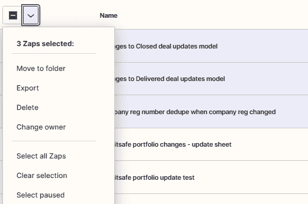

图 4.3 - Zap 管理区域中 Zap 多选下拉箭头的概览

+   **创建 + 按钮**: 尽管此按钮不会帮助您在 Zap 管理区域内管理 Zaps，但它是一个便捷的导航工具，允许您从此视图创建一个新的 Zap。通过点击此按钮，您将直接进入 Zap 编辑器以构建新的 Zap。

+   **三个点的图标**: 您可以使用此下拉菜单执行 **移动文件夹**、**重命名文件夹**、**共享文件夹** 或 **删除文件夹** 操作。这些选项在 **主页** 文件夹中不可用。

现在，让我们讨论如何通过其 Zap 行管理 Zap。

## 通过其特定的 Zap 行管理你的 Zap

每个 Zap 都显示在显示以下内容的行内：

+   **应用程序图标**: 单步 Zap 显示为触发器和动作应用程序图标并排。有两个动作步骤的 Zaps，显示为触发器和两个动作应用程序图标串联。具有多个动作步骤的 Zap 显示为触发器和动作应用程序图标，中间有一个带有 **+** 标志和动作步骤数的图标，例如 **+2**，如以下截图所示:

图 4.4 – 区分单步和多步 Zap 的概述

+   **名称**: 此列显示完整的 Zap 标题。

+   **所有者**: 如果使用团队或企业帐户，则此列显示创建 Zap 的用户的名称。

+   **警告**: 任何 Zap 的问题都会在此列显示。例如，如果一个应用程序已断开连接，则文本 **1 个连接已过期** 将显示并链接至 **我的应用程序** 区域，以允许您重新连接应用程序。如果没有任何问题，则默认文本为 **无警告**。

+   **上次编辑**: 显示对 Zap 进行的最后一次记录的编辑的时间戳。例如，如果过去两周进行了编辑，则会显示文本 **2w 前**。

+   **运行** **（打开/关闭切换按钮）**: 此处显示 Zap 的状态。您可以使用此切换按钮将 Zap 打开或关闭。

+   **三个点的图标**: 点击此图标将显示一个下拉列表，给您提供多种管理 Zap 的选项。如以下截图所示:

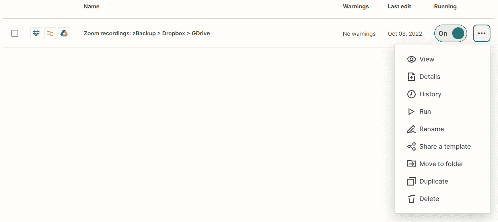

图 4.5 – 使用 Zap 方框中的下拉选项管理你的 Zap

下拉菜单为您提供以下选项:

+   **查看**: 点击此选项可直接进入 Zap 编辑器，在其中查看或编辑您的 Zap。

+   **详细信息**: 点击此选项将带您进入 **Zap 详细信息** 区域。我们将在下一节中详细讨论这个。

+   **历史记录**: 点击此选项将直接带您进入此特定 Zap 的 Zap 历史记录。我们将在 *第五章*，《故障排除和处理 Zap 错误》中详细讨论 **Zap 历史记录** 模块。

+   **运行**：如果 Zap 触发器类型是**定时的**，您可以通过点击**运行**选项来强制 Zap 搜索触发器数据。这在测试 Zap 时很有用，因为它**开启**，这样您就不必等待**更新时间**过去。如果触发器是**瞬时的**，将不会提供此选项。

+   **重命名**：您可以直接从 Zap 管理区域方便地重新命名您的 Zap，而无需转到 Zap 编辑器。

+   **分享一个模板**：你可以通过链接分享你的 Zap 的副本。我们将在下一节详细讨论这个问题。

+   **更改所有权**：您可以将所有权更改为另一个用户，这将授予新用户访问所有相关的文件夹和连接的权限。这个选项只有在您使用团队或公司帐户时才会显示，并且只有 Zap 的所有者才能使用。

+   **移动到文件夹**：点击此选项将允许您将 Zap 移动到另一个文件夹中。

+   **复制**：您可以复制任何 Zap，然后将其用作创建另一个 Zap 的模板。

+   **删除**：您可以通过点击此选项将您的 Zap 发送到**垃圾箱**文件夹中。移动到**垃圾箱**文件夹中的 Zap 将在 30 天后永久删除。

提示

**复制**选项非常方便，如果您打算构建具有相似步骤但可能有些差异的多个工作流程。使用此选项允许您复制一个 Zap 并在本质上将其用作模板。如果您有复杂的多步骤工作流程，并希望将其用于不同的触发器和其他条件，这个功能尤其有用，可以节省时间。

接下来，让我们探索**Zap** **详情**区域。

### Zap 详情区域

**Zap 详情**区域是您个人 Zap 的一个方便的管理区域，允许您从一个位置执行特定功能，例如添加或更改 Zap 的标题、描述和时区，查看和测试已连接的应用程序的连接，并切换 Zap 的**打开**或**关闭**状态。在那里，您还可以使用**在编辑器中查看**，**移动到文件夹**，**运行**（如果触发器使用轮询方法），**分享一个模板**或**删除**（如果它已关闭或为草稿）按钮。如下截图所示：

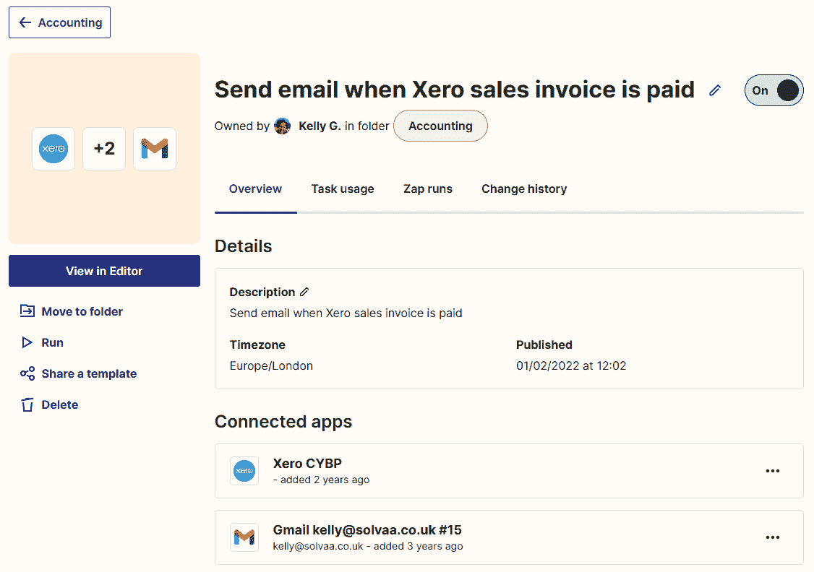

图 4.6 – Zap 详情区域

如果使用团队或公司帐户，则将可用**更改所有者**和**导出**选项。

您还将能够在**任务使用**选项卡中看到任务使用的条形图表示，**Zap 运行**选项卡中的 Zap 运行信息，以及**更改历史**选项卡中的一些基本的 Zap 更改历史记录。所有这些对于了解您的 Zap 如何运行非常有用。以下是**任务使用**选项卡中数据的一个示例：

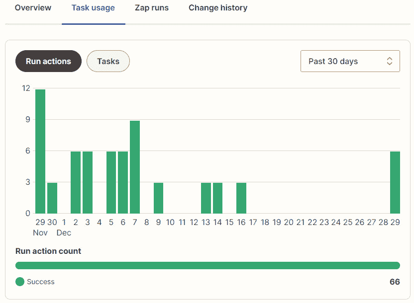

图 4.7 – Zap 任务使用信息

**更改历史**选项卡显示了与 Zap 相关的活动变更日志。您可以使用**日期**下拉菜单按日期范围进行筛选，并可以使用**更改类型**下拉菜单筛选 Zap 的更改方式。您可以从此菜单中选择的更改类型包括**启用 Zap**，**禁用 Zap**，**创建 Zap**，**丢弃 Zap**，**Zap 所有者更改**，**恢复 Zap**和**发布 Zap 版本**。显示的历史将包括更改类型和相关图标，更改的日期和时间戳以及进行更改的用户。如下截图所示：

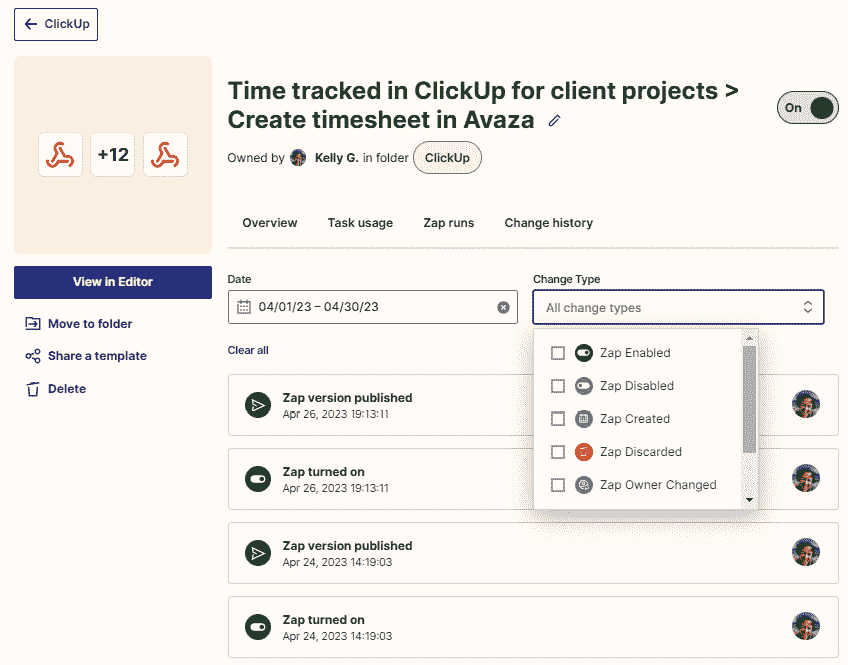

图 4.8 – Zap 的更改历史信息概述

我们将在*第五章*中更详细地探讨**Zap 运行**选项卡，*故障排除和处理 Zap 错误*。

接下来，让我们来回顾一下如何恢复已移到**垃圾箱**中的 Zap。

## 从垃圾箱中恢复 Zap

已发送到**垃圾箱**中的 Zap 将在被永久删除之前暂时保存 30 天。一旦 Zap 在**垃圾箱**中，您将无法对其进行编辑，直到其被恢复；但是，在此时间段内可以恢复。  

当 Zap 处于**垃圾箱**中时，单击**三点图标**将允许您通过单击**详细信息**选项查看 Zap 详细信息，通过单击**历史记录**选项查看 Zap 历史记录，或通过单击**移动到文件夹**选项将其移到另一个文件夹中，如下截图所示：

图 4.9 – 从垃圾箱恢复 Zap

选择**移动到文件夹**选项并选择一个指定的文件夹来恢复 Zap。

重要提示

Zapier 不会显示对 Zaps 进行的详细更改历史记录，因此将无法知道 Zap 已在**垃圾箱**中停留多长时间以及何时将被永久删除。请记住，您可以创建另一个文件夹来存档 Zaps，以便它们不会被永久删除。

现在，让我们来看看如何在 Zap 编辑器中最好地使用 Zap **设置**选项卡来管理您的 Zaps。

## 在 Zap 编辑器中使用 Zap 设置选项卡

正如我们在*第三章*中讨论的那样，*构建您的第一个自动化工作流（Zap）*，您可以使用 Zap 编辑器内的**设置**部分来管理 Zaps。当您在 Zap 编辑器中打开 Zap 时，可以通过单击右侧菜单中的**设置**图标找到**设置**部分。选项如下所示：

+   **名称**：显示您的 Zap 的名称。您可以快速更改它，而无需在 Zap 编辑器中更改它。

+   **添加到文件夹…**：使用此选项可以更改存储 Zap 的文件夹。

+   **描述**：您可以在这里添加新文本或修改任何现有说明。当名称太长时，这非常有用，例如，添加上次编辑的日期，如适用的用户缩写，以及有关 Zap 的额外详细信息和背后的逻辑，以帮助其他用户更好地理解它。

+   **时区**：如果你希望你的 Zap 在不同于帐户设置中指定的时区中运行，可以修改 Zap 的**时区**设置。**时区**设置只能在编辑处于草稿状态的 Zap 或尚未发布的 Zap 时进行修改。

这在以下截图中显示：

图 4.10 – Zap 编辑器中的 Zap 设置部分

提示

除了自定义步骤标题外，Zapier 不允许您在 Zap 的各个步骤中添加注释。此外，Zapier 也不显示 Zap 的详细更改日志或版本历史。因此，**描述**框对于添加详细步骤说明和指定 Zap 更改的日期非常有用。如果您在团队中工作，您可以记录进行修订的用户的缩写，以及为其他团队成员记录其他说明。

现在，您应该更好地了解如何管理您的 Zaps。现在让我们来看一看可能分配给您的 Zaps 的不同状态。这将帮助您更好地管理您的个人 Zaps。

# 理解 Zap 状态

理解不同状态及何时您可能会看到您的 Zaps 处于这些状态是管理您的 Zaps 的有用工具。当您在 Zap 管理区域查看您的 Zaps 时，它们将显示为以下状态之一：

+   **开启**：正如我们在*第三章*中讨论的*建立您的第一个自动化工作流(Zap)*，一旦您建立并测试了您的 Zap，您必须发布您的 Zap 并将其**开启**，才能处理来自触发应用程序的实时数据。一旦 Zap 被**开启**，Zapier 将在触发应用程序中寻找新数据，然后启动工作流并执行操作步骤。

+   **关闭**：如果您的 Zap 处于**关闭**状态，Zapier 将不会主动寻找触发应用程序中的新数据。Zapier 可能会出于以下原因自动将您的**开启**的 Zap 转为**关闭**状态：

    +   你的 Zapier 定价计划从付费计划降级为免费计划，因此你将失去付费计划功能的访问权限，如多步骤 Zaps 或高级应用程序。

    +   当您的 Zap 运行时遇到多个错误时，Zapier 将向账户所有者发送电子邮件，通知您 Zap 已被转为**关闭**状态。

+   **不完整**：不完整的 Zaps 通常没有足够的信息来发布。它们要么缺少触发器或操作步骤，或两者都缺失，或者步骤尚未完成和测试。不完整的 Zaps 显示为**已关闭**状态，并且无法更改为**已启用**，如下截图所示：

图 4.11 - Zap 管理区域概览，显示已启用、已关闭和不完整的 Zaps

在某些情况下，除了**已启用**或**已关闭**之外，您的 Zaps 还可能显示以下状态，这将显示在**警告**部分中：

+   **已暂停**：您可能会看到您的 Zaps 被高亮显示并带有**Zap 运行已暂停**标签。会显示一个链接，您可以在 Zap 历史记录区域运行您的暂停的 Zap。

这可能发生的一个原因是在较短的时间间隔内触发了太多次的 Zap。Zapier 将会通知您 Zap 运行被暂停。您可以选择重新启用您的 Zap 并忽略已暂停的 Zap 运行。我们将在*第五章* *故障排除和处理* *Zap 错误*中对此进行更详细的讨论。

+   **过期连接**：有时，您的连接应用可能会断开。如果发生这种情况，您的 Zap 将显示**过期连接**状态，表示您的 Zap 中的一个或多个应用已断开。您可以通过点击链接重新连接您的应用程序，这将导航您至**我的应用程序**模块。

现在您了解了 Zap 状态，让我们看看如何管理您的已连接应用程序。

# 管理您的已连接应用程序

一旦将您的应用程序连接到 Zapier，了解如何管理这些连接就变得非常有用了。这些都可以在**应用程序**模块中完成。您可以通过在左侧边栏点击**我的应用程序**图标链接或导航至[`zapier.com/app/connections`](https://zapier.com/app/connections)来进入该模块。

在**应用程序**模块中，您可以在**所有应用程序**选项卡下看到已连接的应用程序列表、已添加的连接数量以及它们参与的 Zap 数量。您还会看到一个名为**自定义集成**的选项卡，其中会列出您帐户中涉及的任何自定义与非公共应用程序相关的集成。

如果您使用的是团队或公司计划，您的连接将被分为两个部分，如下所示：

+   **我的应用程序**：只有您可以使用这些账户。但是，您可以选择与您的团队共享您的应用程序连接。

+   **与我共享**：这是其他团队成员拥有的账户，但已由其他团队成员提供给您使用。

+   **自定义集成**：这些是专门连接到您的账户的私有应用程序连接。

+   **所有应用程序**：如果您是管理员用户，您将能够看到并管理连接到该账户的所有应用程序。

如下截图所示：

图 4.12 – Apps 模块中的连接应用

您可以通过点击**箭头**按钮然后选择**三个点**下拉菜单来管理您的连接应用，如下面的屏幕截图所示：

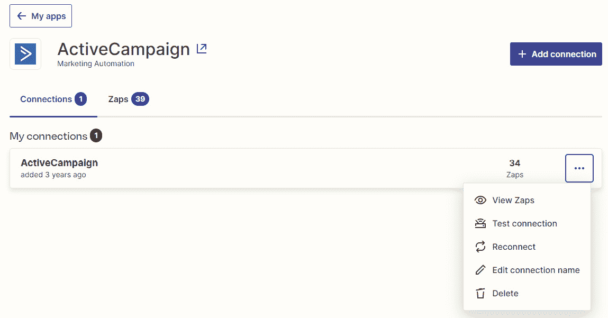

图 4.13 – 我的应用中的应用连接

您随后可以选择以下选项之一：

+   **查看 Zaps**：您可以通过点击三个点下拉菜单中的**查看 Zaps**选项来查看与连接关联的所有 Zaps。或者，点击**Zaps**选项卡显示所有使用此连接的 Zaps。

+   **测试连接**：测试您的应用是否存在连接问题非常有用。您可以通过点击下拉菜单中的**测试连接**选项来进行测试。成功连接将以绿色突出显示，并显示**成功**字样，因此无需进一步操作。

+   **重新连接**：当 Zapier 将一个应用标识为需要重新连接时，该应用将被警告标记。您可以通过点击**箭头**图标按钮并按照提示重新连接您的应用。如下面的屏幕截图所示：

图 4.14 – 需要重新连接的应用

+   **编辑连接名称**：您可以通过点击旁边的文本来编辑连接的名称。如果您要连接多个电子邮件帐户，您可以修改连接名称以区分不同的帐户，这非常方便。

+   **更改所有权**：在团队和公司帐户中，您将看到此选项，它允许您将连接转移给其他用户。如果您将不再访问 Zapier 账户，例如，如果您将不再与公司合作，并且需要将应用连接的所有权转移给管理员用户，则此选项尤其有用。

+   **删除**：您可能希望完全断开与 Zapier 账户的应用连接。您可以通过点击**删除**选项来实现这一点。系统将提示您确认。确认后，该应用连接将不再显示在您的**我的应用**列表中。

最后，点击**Zaps**选项卡可以查看您的应用关联的 Zaps 的详细信息，包括其状态、上次更改时间以及运行的任务数量。如下面的屏幕截图所示：

图 4.15 – 使用 Bonjoro 作为连接应用的 Zaps 列表

接下来我们讨论如何分享您的连接应用。

## 分享您的连接应用

当您与团队合作时，您可能希望团队的其他成员有权使用您拥有的特定应用连接。例如，如果您的团队都可以访问特定的应用程序，您可以将该应用程序连接到 Zapier，并通过与他们共享来允许他们使用该应用程序连接。

### 共享连接的应用账户

您可以按照以下方式与团队中的其他人分享您的应用连接。通过点击**分享**按钮，将会弹出一个窗口，如下屏幕截图所示：

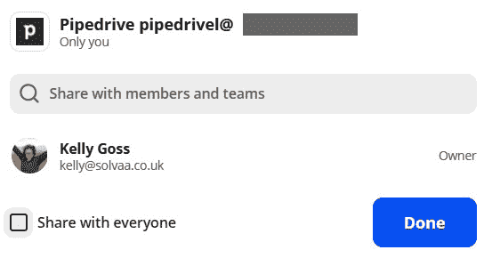

图 4.16 – 私人应用连接的共享选项

添加特定成员或团队或勾选**与所有人共享**框，然后点击**完成**按钮进行确认。有些应用程序会要求您授权允许访问，并会弹出窗口询问您是否授权团队访问该应用连接。下面的屏幕截图显示了以 Cognito Forms 为例的情况：

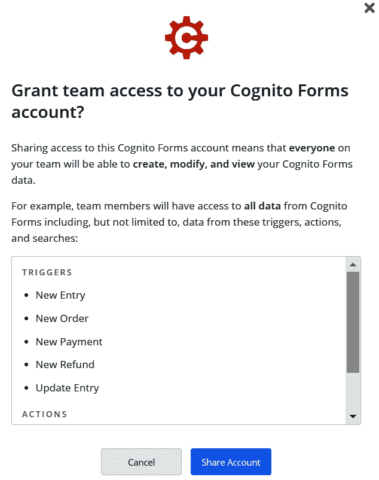

图 4.17 – 授权连接的应用程序与团队共享

只需点击**分享账户**按钮继续。共享状态按钮将变为**所有人**。

重要提示

如果您使用的是企业计划，您将能够指定您想与哪个用户或团队共享连接的应用程序。您还可以与所有人共享应用连接。

一旦应用连接已与您的团队共享，所有用户都将能够执行以下操作：

+   在触发步骤中以共享应用连接的形式查看应用的示例数据

+   查看从此共享应用连接中的 Zap 历史信息

+   在触发器和操作中使用共享应用连接，在私人和共享 Zaps 中检索数据并更新应用程序

+   编辑使用此共享连接的 Zaps 步骤

重要提示

仅在确定想要其他团队成员访问该账户中的数据时，才分享对应应用的访问权限。例如，如果分享您的私人邮件应用连接，其他团队成员将能够访问所有收到的邮件，并能够从该账户发送邮件。您可以相反地为特定目的创建一个共享的电子邮件账户，比如用于发送发票和接收账单，例如，`accounts@yourcompany.com`。

### 停止共享连接的应用账户

您可以取消对共享连接的应用访问权限，步骤如下：

1.  点击**所有人**按钮。

1.  取消勾选**与所有人共享**框。请注意，如果连接的应用只与一名成员共享，则会显示**1 个成员**。

1.  点击**完成**继续。

重要提示

一旦你再次将共享的应用连接设为私有，任何使用该连接应用构建的 Zaps 将继续运行并使用该帐户数据。你的团队成员仍然可以看到使用该连接应用的任何步骤中的数据，尽管只有你可以编辑这些步骤。要阻止在这些步骤中访问数据，你需要从每个步骤中移除应用连接，并用另一个应用连接替换它。

你现在应该对如何在 Zapier 平台上管理和共享你的连接应用有了更好的理解。现在让我们讨论如何分享单个 Zaps 和文件夹。

# 分享你的 Zaps 和文件夹

通过你的流程并创建你的 Zaps 将需要一些初始时间投入。然而，一旦你掌握了使用 Zapier 等工作流自动化工具的能力，你将开始从自动化工作流中节省时间和提高生产率中受益。你可能希望其他人也能受益于你在构建工作流中投入的时间，因此 Zapier 为你提供了一些选项，以便与他人共享你的工作流。如果你与一个团队合作，共同构建和维护 Zaps 来自动化公司流程，则这尤其有用。

你可以通过两种方式分享你的 Zapier 工作流程：

+   将你的 Zaps 副本与公司外的其他 Zapier 用户分享。

+   如果你订阅了团队或公司计划，可以与其他团队成员分享你的 Zaps 和文件夹。

首先，我们将看看如何与其他 Zapier 用户分享你的 Zaps 的副本。

## 与你的帐户外的 Zapier 用户分享你的 Zap 的副本

如果你想分享你的 Zap 的副本，你可以在不共享连接的帐户、数据和 Zap 历史的风险下进行。通过生成一个可以在需要时禁用的链接来共享 Zap 的副本。你只能分享已完全设置并启用的 Zap 的副本。

重要提示

具有 **Paths by Zapier** 和 **Looping by Zapier** 步骤的 Zaps 无法与 Zapier 帐户外的其他用户共享。

### 允许分享你的 Zap 的副本

你可以从以下两个位置分享你的 Zap 的副本：

+   **Zap 管理区域**：点击 **三个点图标**，然后选择 **分享模板**

+   **Zap 编辑器**：点击顶部栏的 **三个点图标**（**更多操作**）下拉菜单，并选择 **分享此 Zap** 选项

一旦你选择了共享选项，你可以通过自定义 Zap 模板的标题（从 Zap 的名称中提取）和描述来自定义你的 Zap 模板共享页面，以帮助接收者识别 Zap 并了解其目的。如果你打算在社交媒体上分享链接，这也很有用。在**Zap 描述**字段中，你可以输入额外的信息，比如在相关的电子邮件操作中更改电子邮件签名或更改在帐户连接之间不同的字段数据映射。这对你与之分享 Zap 的人非常有用。如下截图所示：

图 4.18 – 分享 Zap 副本时添加名称和描述的概览

你可以单击**预览**链接来查看模板在其他人查看时的样子。或者，单击**分享**按钮以打开一个弹出窗口，如下截图所示：

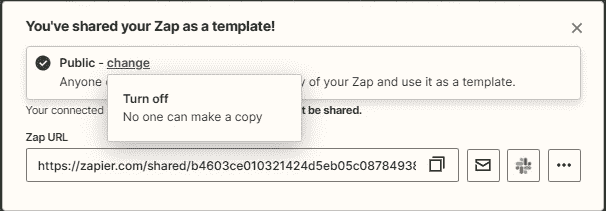

图 4.19 – Zap 共享选项概览

然后，你可以按照以下选项操作：

+   **更改**：点击**更改**链接选择是否希望将 Zap 模板与互联网上的任何人共享（**公开共享**），或者你可以选择**关闭**选项来禁用链接的共享

+   **复制或分享**：通过单击**复制图标**按钮复制链接，或通过电子邮件、Slack、Facebook、Twitter 或 LinkedIn 使用相关图标或**三个点图标**分享链接

一旦你完成了选项，点击**x**图标。

重要提示

对 Zap 的更新不会反映在通过链接共享的副本中。要分享更新，你必须更新链接。你可以通过导航到 Zap 编辑器中的**共享偏好设置**选项并按照提示操作来实现这一点。

无论你订阅哪种定价计划，你都可以通过链接与团队共享 Zap 的副本。但是，如果你有团队或公司计划，你还可以在你的 Zapier 帐户中与团队成员共享 Zaps 和文件夹。

## 在你的团队或公司帐户中共享 Zaps 和文件夹

如果你有团队或公司计划的账户，你可以与团队成员分享你拥有的单个 Zap 和文件夹。你还可以将 Zap 的所有权转移给团队的另一成员。

### 与你的团队共享文件夹

正如我们在本章前面讨论的那样，文件夹是从左侧面板管理的。要共享一个私有文件夹，请将鼠标悬停在文件夹上以显示可点击的**三个点图标**。一旦点击了这个图标，选择**分享**。这将把文件夹移动到**共享文件夹**部分，并且默认情况下将与团队管理员和团队所有者用户共享。所有团队成员都将能够查看和编辑共享文件夹中的任何 Zap。

重要提示

您无法取消共享文件夹。一旦您分享了一个私人文件夹，如果您想删除共享访问权限，您需要将各个 Zap 移回私人文件夹中。

接下来，让我们来看一下如何管理共享文件夹。

### 管理共享文件夹

一旦您分享了一个文件夹，您可以在两个地方更改共享偏好设置，具体如下：

+   **左侧面板**：您可以通过单击任何文件夹的三个点图标并选择**共享**选项来完成此操作。

+   **中央面板**：从 **三个点图标** 下拉菜单（靠近 **+ 创建** 按钮），选择**共享** **文件夹**选项

如下屏幕截图所示：

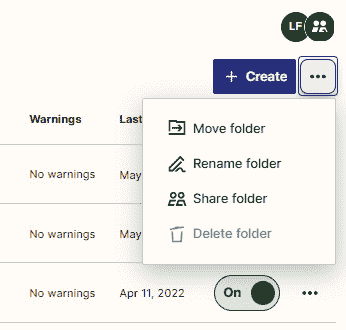

图 4.20 - 中央面板中的共享文件夹选项概述

选择后，将弹出一个弹出窗口，在其中您可以选择通过选择 **与所有用户共享** 来与每个用户共享文件夹，或通过在搜索栏中输入其名称或电子邮件地址来选择用户。如果您有一家公司帐户，您还可以选择一组用户在团队中。

### 转让 Zap 的所有权

您可以通过显示在单个 Zap 方框中 **On**/**Off** 切换按钮左侧的缩写名称来识别 Zap 的所有者。如果您是 Zap 的所有者、团队管理员或团队所有者，您可以将 Zap 的所有权转让给另一个团队成员。您可以选择一个 Zap，单击三个点图标，然后从下拉菜单中选择**更改所有权** 选项来完成此操作。然后，您可以输入另一位帐户上的成员的姓名或电子邮件地址来转移 Zap 所有权。如下屏幕截图所示：

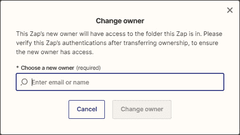

图 4.21 - 将所有权转移给另一个团队成员

现在，让我们来介绍如何在个人和团队帐户之间移动您的 Zaps。

### 在个人和团队帐户之间移动 Zaps

如果您有个人帐户且是团队帐户的成员，则可以在帐户之间移动各个 Zap 和文件夹。您可以通过导航到右上方菜单栏中的 Gravatar 或缩写，并从下拉菜单中选择 **移动 Zaps** 选项 或导航到[`zapier.com/app/move-zaps/`](https://zapier.com/app/move-zaps/) 来完成此操作。

然后，您可以选择要从哪个个人帐户转移 Zap，并选择要将其移动到的团队帐户，如下屏幕截图所示：

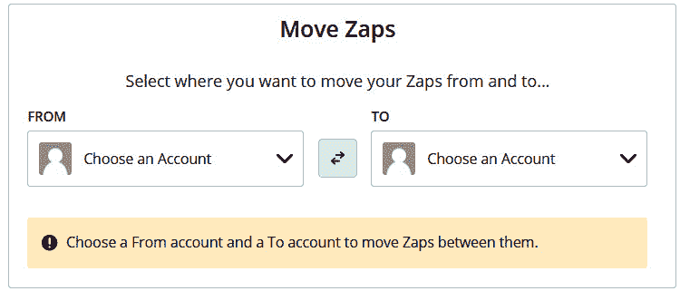

图 4.22 - 将您的 Zaps 从一个帐户移到另一个

您将会看到一个文件夹和 Zap 的列表。然后，您可以选择想要共享的各个 Zap 或整个文件夹，然后选择**移动这些 Zap** 选项。

重要提示

数据传输可能需要一些时间，具体取决于您要传输的 Zaps 的数量。在传输过程中，请确保不要离开页面。

您现在应该更好地了解如何共享 Zaps 的副本。此外，您应该知道如何与您的团队共享单个的 Zaps 和文件夹。

# 总结

在本章中，我们首先描述了如何通过适当命名和使用文件夹来组织您的工作流程，以使其保持有序。然后，我们讨论了如何管理单个的 Zaps 并介绍了不同的 Zap 状态。我们探讨了如何管理您连接的应用程序，最后，我们讨论了如何与团队和其他 Zapier 用户共享您的 Zaps。

您现在了解了如何在 Zapier 帐户中管理和维护您的 Zaps 和应用程序连接的最佳方法，以及如何保持工作流程的组织，以及如何与团队或其他公司之外的 Zapier 用户共享它们。

在下一章中，我们将讨论如何最佳使用 Zap 历史信息，并介绍典型的 Zap 行为以及处理和排除错误的最佳方法。我们将通过调整您的帐户设置和使用内置应用程序**Zapier Manager**来设置 Zap 警报。我们还将讨论可用于用户的各种支持渠道。

# 问题

1.  请说明两种在 Zapier 帐户中保持 Zaps 井井有条的方法。

1.  您可以在哪里添加有关 Zap 的更多详细信息或注释？

1.  哪些 Zaps 不能与外部帐户共享？
