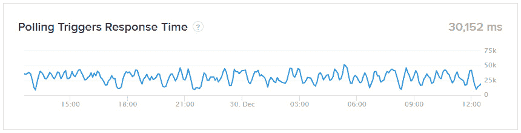

# 第五章：故障排除和处理 Zap 错误

当你对 Zapier 越来越熟悉并开始构建复杂的工作流时，偶尔可能会遇到问题。一般来说，当出现错误时，可能是由于 Zap 设置的方式，工作流中一个应用程序的问题，或者 Zapier 应用程序本身的一般性能问题造成。解决这些问题的最佳方法是在寻求额外帮助之前，自己做一些初始调查工作。

在本章中，我们将讨论在使用 Zapier 时，处理意外错误所需的关键信息。我们将首先讨论通过调整账户设置来管理 Zap 错误通知，并通过使用内置应用程序 **Zapier Manager** 设置一个 Zap。然后，我们将介绍如何通过监控 **Zapier 状态** 页面和通过内置应用程序 **App Status by Zapier** 设置一个 Zap，来管理应用程序状态警报。之后，我们将向你展示如何最好地使用 Zap 历史信息来评估你的 Zaps 运行情况，并收集信息以帮助解决问题。最后，我们将介绍在 Zapier 平台上寻求额外支持的渠道。

在本章中，我们将涵盖以下关键主题：

+   管理 Zap 错误警报

+   管理应用程序状态警报

+   利用 Zap 历史信息进行故障排除

+   寻求帮助—帮助中心，客户支持，社区，专家和研讨会

当你学习完这些主题后，你将了解 Zapier 如何处理数据，知道如何使用 Zap 历史进行故障排除，并能够调整你的警报通知偏好。

# 技术要求

要学习本章内容，你需要访问 Zapier 帐户。Zapier 的 **免费** 计划对于本章大部分内容是足够的。若要学习 *管理 Zap 历史数据* 部分，你需要访问 **Starter** 计划或更高版本，以获取部分内容，并且需要访问 **Professional** 计划或更高版本，以获取 **自动重播** 功能相关的内容。你可以在这里获取本章使用的 Zap 模板：[`bit.ly/zapier-book`](https://bit.ly/zapier-book)。

# 管理 Zap 错误警报

使用 Zapier 等工作流自动化工具的好处之一是，在你专注于其他事务的同时，你的流程可以自动运行。但是，你可能希望在你的工作流遇到错误时及时得知，以便及时解决任何问题，确保持续性。Zapier 在运行时监控所有 Zaps 的性能。每当检测到任何 Zaps 的运行方式出现故障时，Zapier 都会强调发生了问题。监视你的工作流中的任何问题并迅速解决它们的最佳方法是确保在出现任何问题时接收通知。

你可以通过以下方式管理接收警报的方式：

+   调整你的电子邮件通知设置

+   使用 Zapier 管理器内置应用程序设置错误警报工作流

随后，你将能够更及时地管理你的警报并采取行动。

提示

如果你是 Zapier 账户的系统管理员，并且需要接收警报，因为也许你无法访问 Zapier 账户所有者的电子邮件以接收电子邮件通知，则使用 Zapier 管理器内置应用程序的警报特别有用。对于团队或公司账户用户来说，由于同样的原因，这也很方便。

现在，让我们逐个查看管理警报的每种方法。

## 调整你的电子邮件通知设置

标准情况下，Zapier 会为触发器和动作错误警报发送电子邮件通知，以及 Zaps 中连接的应用程序的问题。如*第一章*所讨论的，*使用 Zapier 进行业务流程自动化的介绍*，你可以在账户设置的**电子邮件通知**区域调整这些警报的频率。对于专业、团队和公司账户，可以直接通过**Zap** **历史**区域的**自定义错误通知**按钮访问自定义错误通知设置。

提示

尽管 Zapier 将包括与工作流程中连接的应用程序相关的警报在电子邮件通知中，但你可能希望设置特定于应用程序的状态警报。这将为你提供有关连接的应用程序发生的事件的及时信息。我们将在*管理应用程序状态*部分详细讨论这一点。

现在，让我们回顾一下如何使用 Zapier 管理器内置应用程序来触发警报工作流。

## 使用内置的 Zapier 管理器应用程序设置错误警报工作流

你可以通过设置使用 Zapier 管理器内置应用程序作为触发器的 Zap 来定制想要接收通知的警报。我现在将解释如何使用 Zapier 管理器设置 Zap 错误警报工作流，并给出一些你可以用于操作步骤的应用程序和事件的示例。你可以使用我们在*第三章*中描述的详细步骤有效地设置你的 Zap。

### 选择你的触发事件

导航到 Zap 编辑器后，选择要在触发步骤中使用的 Zapier 管理器内置应用程序。然后，选择你选择的触发事件。Zapier 管理器内置应用程序有多个触发事件可供选择；然而，有三个触发事件选项专门用于管理错误。它们列举如下：

+   **新 Zap 错误**：如果你希望在你的任何 Zap 遇到错误时触发此警报工作流，可以选择此触发事件。

+   **新停止任务**：如果你希望此 Zap 警报在你的工作流程中的任务之一具有**已停止停止**状态时触发，可以选择此触发事件。我们将在*了解任务状态*部分讨论任务状态。

+   **Zap 已关闭**：如果您希望在 Zapier 关闭或暂停您的某个 Zap 时触发此警报工作流程，则可以选择此触发事件。这通常发生在 Zap 反复出现多个错误时。

这些选项显示在以下屏幕截图中：

图 5.1 – 设置 Zapier 管理器触发器概览

我们将在 *第十二章* 中介绍其他 Zapier 管理器触发事件，*使用内置应用程序管理您的 Zapier 帐户*。

### 自定义触发事件

接下来，自定义触发事件以指定以下内容：

+   **账户**：如果您是多个团队账户的成员，则可以指定要接收警报的账户。

+   **文件夹**：您可以指定要接收警报的特定文件夹。如果您指定了一个文件夹，那么该错误警报工作流将为该文件夹中的所有 Zaps 触发，除非您在下一个字段中指定了一个 Zap。

+   **Zap**：您可以指定要接收警报的特定 Zap。

这些字段都不是触发器正常工作所必需的，因此如果您希望接收所有账户中所有 Zaps 的警报，则可以将它们留空。

一旦您自定义了触发事件，您就可以确认要使用的样本数据来测试触发器，测试它，然后继续设置您的操作步骤。

现在，让我们讨论一些您可以在操作步骤中使用的应用程序和事件示例。

### 设置您的错误警报操作步骤

设置了触发步骤后，您可以继续添加一个或多个操作步骤，并将样本数据映射到相关字段。要完成工作流程，我们需要添加一个操作步骤，允许 Zapier 向一个或多个人发送通知。以下是我们可以使用的一些通信应用程序和事件示例：

+   在 **Slack** 中向您的团队发送直接、私密或频道消息

+   使用 **Gmail**、**Microsoft Outlook** 或 **Email by Zapier** 向您和您的团队发送电子邮件

+   使用 **SMS by Zapier** 向自己发送短信

如果您使用的是起步计划或更高版本，则可以创建多步 Zaps 并向您的工作流程添加额外步骤。然后，您可以添加进一步的步骤，将所有 Zap 错误警报的日志添加到 Google Sheets 电子表格中，并创建一个任务以在任务管理应用程序（如 Trello）中审查警报。

我们创建了一个使用 Slack 作为通知应用程序、一个 Google Sheets 电子表格记录警报历史记录和一个 Trello 任务来检查警报的 Zap 错误警报模板。您可以在这里获得此 Zap 模板的副本：[`bit.ly/zapier-book`](https://bit.ly/zapier-book)。

提示

如果您只想要接收使用您构建的 Zapier 管理器工作流触发的错误警报的通知，请记得将您的电子邮件通知设置更改为 **Only Zapier Manager Trigger**。

现在您应该对如何调整通知设置以及使用 Zapier Manager 内置应用程序管理 Zap 错误警报有了更好的了解。

现在，让我们看看如何管理应用程序状态警报。

# 管理应用程序状态警报

在前一节中，我们描述了如何管理与您的 Zap 触发器、操作和连接的应用程序出现的问题有关的 Zap 状态警报。在进行故障排除时，了解如何查找 Zapier 应用程序本身的整体性能信息以及查看工作流程中连接的应用程序的任何已知问题的更新也将非常有用。这将帮助您在开始调查特定 Zap 的问题时排除这些外部问题。

您可以通过以下方式查找 Zapier 应用程序的性能信息并管理应用程序状态警报：

+   监控 **Zapier** **状态** 页面

+   使用内置应用程序状态的应用程序状态设置警报工作流程

让我们看看每种方法。

## 监控 Zapier 状态页面

当尝试调查工作流程出现的意外问题时，检查与 Zapier 应用程序本身的功能或工作流程中其他连接的应用程序存在的任何已知问题相关的事件将是有用的。查找已知事件的最佳位置是 **Zapier 状态** 页面。您可以使用以下 URL 导航到此页面：[`status.zapier.com/`](https://status.zapier.com/)。

**Zapier 状态** 页面分为两个部分，重点关注摘要信息，然后是更详细的指标和状态。

在 **摘要** 部分，Zapier 报告影响以下内容的已知事件：

+   **网站**：这涉及您管理 Zaps 和由运行工作流程产生的相关任务的 [zapier.com](http://zapier.com) 网站

+   **Zaps**：这涉及 Zaps 的一般工作，包括 **即时触发器**（由 Webhook 或其他即时方法提供支持）、**轮询触发器**（由周期性轮询提供支持）和 **搜索与写入**（例如搜索、过滤和数据写入）的操作

+   **应用程序**：这涉及 Zapier 集成的所有应用程序，并提供关于重大问题的一般报告

+   **开发者平台**：这涉及 Zapier 的开发者平台

如果其中任何系统不可用，Zapier 将突出显示此问题并指明问题所在。

在接下来的部分中，Zapier 将在单独的选项卡中更详细地报告以下内容：

+   **系统指标**

+   **应用程序状态**

+   **事件历史**

此处显示如下屏幕截图：

图 5.2 – Zapier 状态页面概览

让我们分别看看这些。

### 系统指标选项卡

**系统指标** 选项卡显示轮询和即时触发器可靠性以及响应时间的详细信息，如下所示：

+   **触发器可靠性**：这表示显示为百分比的平均 Zap 成功率

+   **轮询触发响应时间**：这表示由轮询或即时触发器驱动的平均 Zap 的平均速度，并以毫秒显示

重要说明

显示的**轮询触发响应时间**值不包括基于您的价格计划（每 1、2 或 15 分钟）的轮询时间。它纯粹反映了 Zapier 发现新事件后的响应时间。

指标以图形方式显示，您可以选择按天、周或月显示它们。您还可以沿着图形移动光标，以显示具有指标的确切日期和时间，如下图所示：

图 5.3 – 轮询触发响应时间指标图表概览

当尝试了解 Zap 错误事件是否与 Zapier 的停机时间和性能相关联时，系统指标尤其有用，并且可以帮助排除特定应用程序的问题。这一点很重要，要与**事件历史**选项卡中的信息一起查看，因为这将更多地解释问题的背景。

### 应用程序状态选项卡

**应用状态**选项卡显示了以方框标记的应用程序列表，每个方框显示以下每个细节：

+   **应用图标**：显示表示应用程序的图像。

+   **应用名称**：显示应用程序的名称，显示为可点击的链接，点击将带您到应用程序配置文件页面。

+   **响应时间**：这显示了应用程序对 Zapier 查询的响应时间，以毫秒为单位。

+   **过去一小时**：这显示了上一小时的应用程序响应时间的图表。

+   **更多选项**菜单：用三个水平点的图标表示。如果您点击此图标，将出现使用 App Status by Zapier 内置应用程序创建警报的预建工作流程的选项。我们将在稍后的 *使用 Zapier 内置的 App Status 设置应用程序状态警报工作流程* 部分中更详细地讨论此问题。

您可以使用位于应用程序列表正上方的搜索栏搜索应用程序。

重要的是要在**事件历史**选项卡中的信息旁边查看**应用状态**数据，因为这将更多地解释问题的背景。

### 事件历史选项卡

**事件历史**选项卡显示了最近事件的日志，按天记，并注明了上次更新的时间。如果您尝试追溯问题的来源，或者在特定日期或时间段内遇到 Zap 的问题，则此日志特别有用。您可以单击页面底部的**事件历史**链接，或导航到[`status.zapier.com/history`](https://status.zapier.com/history)查看历史事件历史。您可以使用后退和前进箭头按月滚动。

提示

您还可以订阅更新，以便在 Zapier 创建新事件并更新或解决现有事件时收到通知。如果您可以访问多个 Zapier 帐户并需要监视问题，则这非常方便。您可以通过单击**订阅更新**按钮来实现此目的，该按钮位于**Zapier 状态**页面顶部。

现在，让我们回顾一下如何使用 Zapier 内置应用程序的应用程序状态来触发应用程序状态警报工作流程。

## 使用 Zapier 内置应用程序设置应用程序状态警报工作流程

您可以使用 Zapier 内置应用程序作为触发器设置自定义工作流程，以便通知您有关应用程序状态问题。您可以从 Zap 编辑器内从头开始构建一个 Zap，或者您可以直接从**Zapier 状态**页面上的应用程序框中选择三个预构建的工作流程。我们现在将解释如何使用来自预构建工作流程的 App Status by Zapier 设置应用程序状态警报工作流程。您可以使用我们在*第三章*中描述的详细步骤来有效地设置您的 Zap。

### 选择使用哪个预构建的工作流

从**Zapier 状态**页面，导航到**应用状态**选项卡，并使用搜索栏搜索要监视的应用程序。然后，使用**更多选项**图标显示以下预构建 Zaps 的下拉菜单：

+   **Slack 警报**：选择此选项以使用将 Slack 消息发送为操作步骤的模板。您可以自定义此步骤，以便在 Slack 中向您的团队发送直接、私人或频道消息。

+   **短信警报**：选择此选项以使用将短信发送为操作步骤的模板。您可以自定义此步骤，以使用 Zapier 的短信将短信发送给自己。

+   **电子邮件警报**：选择此选项以使用将出站电子邮件发送为操作步骤的模板。您可以自定义此步骤，以使用 Zapier 内置的电子邮件应用向您和您的团队发送电子邮件。

这些选项显示在以下截图中：

图 5.4 - Salesforce 的应用状态显示了预构建 Zaps 的选项

选择一个选项，您将被带到 Zap 编辑器，您可以在其中自定义模板。

接下来，让我们回顾一下如何设置 Zapier 内置应用程序的应用程序状态以在您的触发步骤中使用。

### 自定义您的触发事件

Zapier 的应用状态仅具有一个触发事件选项，即**新建或更新的应用程序事件**。此事件将在新的、更新的和解决的应用程序状态事件上触发。因此，我们可以继续自定义您的触发事件以指定以下内容：

+   **要监控的应用程序**：如果您正在使用模板，并且从**Zapier 状态**页面跳转过来，您选择的应用程序将显示在此处。您可以通过在连续的字段中搜索来添加多个应用程序到列表中。您还可以通过选择、拖动和放置来重新排序应用程序。如果您想要接收所有应用程序的警报，可以将此部分留空。

+   **状态**：从下拉菜单中选择您想要接收警报的状态。您可以从**已安排**、**正在调查 / 进行中**、**已识别 / 进行中**、**正在监控 / 验证**和**已解决 / 已完成**中进行选择。您可以通过在连续的字段中搜索来添加多个状态到列表中。您还可以通过选择、拖动或放置来重新排序状态。如果您希望 Zap 对所有状态触发警报，可以将此部分留空。

如下截图所示：

图 5.5 – 自定义 App 状态的 Zapier 触发器概述

定制完触发事件后，您可以确认要用于测试触发器的示例数据，然后进行测试，并继续设置您的操作步骤。

### 设置您的错误警报操作步骤

设置完触发步骤后，您可以根据自己的需求自定义模板化的操作步骤。如果需要，您还可以添加额外的操作步骤。

我们将在*第八章*中更详细地讨论通过 Zapier 发送短信和电子邮件的使用情况，*内置* *通信应用程序*。

您现在应该更好地了解了如何查看**Zapier 状态**页面上的信息以及如何使用 App Status by Zapier 内置应用程序管理您的应用程序状态警报。

现在，让我们讨论如何使用 Zap 历史信息来解决错误。

# 利用 Zap 历史信息进行故障排除

到目前为止，在本章中，我们帮助您了解了如何管理 Zap 错误和应用程序状态警报，以便您可以及时处理出现的任何问题。此外，我们还讨论了如何评估 Zapier 在**Zapier 状态**页面上提供的信息，因为当您调查单个 Zaps 的问题时，有这些信息在手将帮助您排除外部问题的影响。接下来，我们将讨论如何使用**Zap** **历史**页面上可用的信息来排除单个 Zaps 的错误。

让我们开始了解什么是 Zap 历史记录，以及在解决工作流程问题时如何使用它。

## 了解 Zap 历史页面

**Zap 历史**页面为您提供了有关所有 Zap 活动的详细日志。此日志显示了已成功触发的所有 Zap，当触发应用程序中发现新数据时。它还显示了在 Zap 中已成功完成和未完成的操作步骤。当调试工作流出现意外事件时，能够查看此信息非常有用，以及评估每个 Zap 的任务使用情况。

重要提示

Zapier 仅保证保留 Zap 历史信息最长一个月。因此，及时审查问题或定期下载历史记录非常重要。我们将在*管理 Zap 历史数据*部分讨论下载 Zap 历史数据。

可以通过以下方式找到**Zap 历史**页面：

+   点击左侧导航边栏中的**Zap 历史**链接

+   在 Zap 管理区域中的各个 Zap 行的三点下拉菜单中点击**历史**链接

+   点击 Zap 编辑器右侧面板中的**Zap 历史**时钟图标链接

+   导航到[`zapier.com/app/history`](https://zapier.com/app/history)

从主面板导航或使用 URL 将带您转到**Zap 历史**日志页面，显示工作流事件的列表视图以及任务使用情况。从 Zap（从 Zap 管理区域中的 Zap 标题链接框或 Zap 编辑器内部）导航将带您转到默认的**任务使用情况**选项卡。单击**Zap 运行**选项卡将显示针对特定 Zap 的任务历史记录的过滤列表。

**Zap 运行**选项卡位于以列表视图显示的**Zap 历史**页面中，如下所示的屏幕截图：

图 5.6 - Zap 历史页面概览

现在让我们讨论**Zap 历史**页面上的导航选项。

### 导航到 Zap 历史页面

**Zap 历史**页面分为两个选项卡，如下所示：

+   **任务使用情况**

+   **Zap 运行**

让我们来看看每一个。

#### 任务使用情况选项卡

**任务使用情况**选项卡是导航到**Zap 历史**页面时的默认视图，并显示了关于每个 Zap 的任务信息，如下所示：

+   **应用程序图标**：显示了工作流每个连续步骤中涉及的应用程序的图标。最多显示三个应用程序图标，因此，如果 Zap 涉及的步骤多于三个，则将显示第一个和最后一个步骤中的应用程序以及表示中间附加应用程序步骤的数字。

+   **Zap 详情**：显示了 Zap 的标题，Zap 是否为**开启**或**关闭**状态，以及上次运行的时间和日期。

+   **使用的任务**：显示了在过去 30 天内使用的任务数量。

提示

在对你的 Zaps 进行持续改进审查时，在**任务使用**选项卡中看到的信息对于了解哪些 Zap 具有高任务使用量非常有用。这些信息将帮助您优先考虑首先审查哪些 Zap，以评估是否可以删除步骤以减少任务使用量。通过从 Zap 块的三个点下拉菜单导航到**查看 Zap 详情**页面，您可以获得进一步了解。

+   **Gravatar 或缩写**：这个标识着 Zap 的所有者。

+   **三个点的图标**：如果你点击这个图标，你将会获得三个选项。如果你点击**编辑**，你将被带到 Zap 编辑器，你可以在那里编辑该 Zap。如果你点击**查看详情**，你可以查看详细的 Zap 信息页面。如果你点击**查看运行**，你将被带到过滤特定 Zap 的 Zap 历史记录。

你可以通过点击各自标题中的箭头图标来对 Zap 的列表进行排序，其中**Zap 详情**按字母数字顺序排序，而**已使用任务**按数字顺序排序。

重要提示

**任务使用**选项卡应仅用作参考，可能无法准确代表实际使用情况。要获取准确的信息，您应该参考您的月度发票。

现在，让我们看一下**Zap 运行**选项卡。

#### Zap 运行选项卡

**Zap 运行**选项卡显示了已运行的单个 Zap 工作流事件的历史记录，最近的事件显示在顶部。在列表视图中，每个工作流事件都显示有以下信息：

+   **复选框**：这允许你选择特定的工作流事件并删除、下载或重新运行该事件。我们将在*管理 Zap 历史数据*部分讨论如何使用复选框。

+   **任务状态图标**：这显示了工作流事件运行状态的图标。我们将在*了解任务状态*部分详细讨论任务状态。

+   **应用图标**：这显示了每个工作流程连续步骤中涉及的应用图标。这类似于**任务使用**选项卡中显示的内容。

+   **Zap 详情**：这显示了 Zap 的标题以及工作流事件运行的时间和日期。

+   **已使用任务**：这显示了工作流事件运行时使用了多少个任务。

+   **Gravatar 或缩写**：这个标识着 Zap 的所有者。

+   **向前箭头图标**：如果你点击这个图标，你将会跳转到工作流事件的详细视图。我们将在*查看详细的 Zap 运行信息*部分讨论这个。

**Zap 运行**选项卡中的工作流事件示例如下所示：

图 5.7 – Zap 运行选项卡概览

每页显示 10 个工作流事件，你可以通过在**Zap 运行**选项卡底部使用箭头按钮来浏览页面。

在工作流事件列表上方，您还会发现以下选项：

+   **复选框图标**：您可以使用此下拉菜单批量选择或取消工作流事件。我们将在*管理 Zap 历史数据*部分讨论使用此复选框进行下载、删除和重播任务。

+   **任务状态**：您可以使用下拉列表函数按任务状态筛选您的 Zap 历史记录。我们将在*了解任务状态*部分更详细地查看任务状态。

+   **自动重播开/关切换按钮**：您可以使用此切换按钮将**自动重播**功能打开或关闭。我们将在*管理 Zap 历史数据*部分详细讨论使用**自动重播**功能。

现在，让我们讨论如何通过过滤和搜索查看工作流事件。

### 查看工作流事件列表、搜索和过滤

默认视图是显示所有工作流事件，最近的事件位于列表顶部。您可以使用搜索栏按关键字搜索工作流事件。例如，您可能想找到所有使用姓名为`Joe Bloggs`、电子邮件地址为`joebloggs@abcompany.com`或文件 ID 为`12345`的工作流事件。如果要清除搜索，请点击搜索栏中的**X**图标。

您还可以使用多个过滤选项来过滤工作流事件，如下所示：

+   **日期范围**：此过滤器允许您选择与工作流事件运行时间相关的日期范围。例如，您可以筛选显示上周的工作流事件。请注意，超过一个月的工作流事件将不会显示。

+   **Zaps**：此过滤器允许您从下拉列表中选择一个或多个 Zaps，以仅显示来自该 Zap 的工作流事件。

+   **应用程序**：此过滤器允许您搜索一个或多个应用程序，并选择它们以筛选使用该应用程序的 Zap 的工作流事件。

+   **文件夹**：此过滤器允许您从下拉列表中选择一个或多个文件夹，以仅显示存储在该文件夹中的 Zap 的工作流事件。

+   **所有者**：此过滤器允许您在使用团队或公司帐户时选择一个或多个 Zap 所有者。

**所有状态**标签下的另一个过滤器可用于选择多个选项，以显示具有这些任务状态的工作流事件。例如，您可以仅筛选显示成功或被筛选并停止的工作流事件。我们将在下一部分*了解任务状态*中更详细地查看任务状态。

您可以使用**刷新**图标按钮刷新页面并获得新结果，或使用**清除所有过滤器**按钮清除过滤器并列出所有工作流事件。您还可以通过点击任何字段中的**X**图标清除单个过滤器字段。

提示

正如我们在*第四章*中讨论的*管理您的 Zaps*中所述，如果您有大量的 Zaps，确保充分标记它们可以帮助您快速在 Zap 历史记录中识别它们和相关工作流事件。 在 Zap 名称中使用数字，字母和罗马数字通常有助于打破单调的字词描述，这可以帮助您在**Zap runs**标签中以视觉方式轻松识别它们，并通过在**Task usage**标签中对它们进行排序。

现在，让我们讨论您在 Zap 历史记录中可能看到的不同任务状态。

## 理解任务状态

当您查看 Zap 历史记录时，您可能会看到列出了工作流事件的一个或多个以下任务状态：

+   **成功**：这表示 Zap 运行，并且该工作流事件中的所有任务都成功完成了。

+   **已过滤**：这表示 Zap 运行，但在工作流程中某个时间点有一个过滤器，阻止它继续处理该工作流程事件后续步骤。

+   **停止**：这表示 Zap 在运行工作流事件时遇到了错误。 工作流事件可能有一个**已停止出错**的任务状态，意味着 Zap 运行时发生了问题，或者**已停止暂停**，这意味着 Zapier 阻止了任务的执行。 连续出现**出错**状态将导致 Zapier 暂停或关闭 Zap，而**暂停**状态则不会导致这种情况发生。

+   **等待中**：这表示工作流事件正在等待完成，因为它具有**延迟**动作步骤或计划使用**自动重播**功能重新播放。 如果 Zap 具有**延迟**步骤，则状态将被标记为**等待延迟**。 如果工作流事件计划使用**自动重播**功能再次运行，则状态将被标记为**等待计划**。

+   **正在运行**：这表示工作流事件仍在进行中。

+   **持有**：这表示工作流事件因几个原因而被保留。

让我们回顾**持有**任务状态的原因。

### 暂停任务状态的原因

工作流事件可能因以下原因显示为**持有**状态：

+   **高任务使用**：多个（100 个或更多）工作流事件同时触发。 Zapier 使用此机制作为一项预防措施，以阻止高数量的任务运行，直到您确认要运行这些任务为止。 这可以防止高任务使用率。 它还可以防止您必须纠正大量潜在不正确的记录的可能性。

+   **需要重新连接应用程序**：已命名的应用程序已断开连接，在您重新播放任何已保留的任务之前必须重新连接。 您可以从**我的应用程序**页面重新连接该应用程序。

+   **需要升级**：您的帐户已超出了 Zap、任务或高级应用的限制。如果升级涉及任务，则您需要在重新执行任务之前升级您的计划。或者，您可以删除保留的任务或评估您的 Zaps 数量和高级应用，而不是升级。

+   **支付问题**：您的账单支付方式已过期。在重新执行任务之前，您需要更新您的支付方式。

我们将讨论如何删除或重新执行保存在*管理 Zap 历史记录*数据部分中的任务。

现在，让我们讨论如何查看与单个工作流事件相关的详细 Zap 运行信息。

## 查看详细的 Zap 运行信息

能够查看详细任务信息是**Zap 历史记录**的最大优势。访问此信息使您能够深入了解异常事件的具体原因。在本节中，我们将讨论以下关键点：

+   浏览详细的**Zap 运行**页面

+   评估步骤数据

+   理解**数据输入**和**数据输出**信息

让我们逐一审查。  

### 浏览详细的 Zap 运行页面

您可以通过单击**Zap 运行**日志中的单个工作流事件来访问详细的任务信息。下面是详细任务信息页面的示例截图：

图 5.8 – 详细 Zap 信息页面概览

详细的**Zap 运行**页面显示以下信息：

+   **状态图标**：该工作流事件的整体任务状态。

+   **运行 ID**：此字符串表示工作流事件的 ID，并显示在 URL 中，以及右上角，如果您点击它，则可以复制到剪贴板。

重要说明

**运行 ID** 是一个重要标识符，允许您在与 Zapier 客户支持进行通信时引用特定的工作流事件。

+   **Zap 名称**：Zap 的名称。

+   **日期**：工作流事件开始运行的日期。您可以通过单击标有**为此 Zap 运行历史记录**的链接来查看该 Zap 的筛选任务历史记录。

+   `America/Denver`。您可以点击标有**编辑 Zap 设置**的链接来编辑 Zap 的时区。

+   **使用的总任务数**：Zap 运行中使用的任务数量。

+   **步骤数据**：Zap 中每个触发器和动作步骤的所有数据流动的历史记录显示在标签为**数据输入**和**数据输出**的单独选项卡中。

在**停止**任务内，您可以通过单击**故障排除错误**按钮访问有关错误的帮助文档。如下截图所示：

图 5.9 – 从停止任务中访问文档和帮助的概览

您还将看到一个**获取帮助**按钮，可用于提出客户支持查询，该查询填充了相关的 Zap 和特定任务 ID 信息。

您可以通过单击页面顶部的**返回箭头**图标，返回**Zap 运行**日志。

提示

您可以使用 AI 的神奇功能来排除在特定步骤中出现**已停止**或**错误**状态的 Zap 运行问题。我们将在*第十九章*中详细介绍 AI 强化的故障排除和自动化。

现在，让我们回顾如何评估步骤数据。

### 评估步骤数据

Zap 中的每个步骤将显示在详细的任务信息页上，并用一个框表示，其中包含以下信息：

+   **应用程序图标**：这显示了每个步骤连接的应用程序的图标。

+   **任务状态**：这显示了每个任务的状态图标。单独任务的状态图标可能与工作流事件中的其他任务不同。

+   `1\. 在 Gmail 中找到了 1 封与搜索相匹配的新电子邮件。`

+   **日期和时间**：这显示了工作流每个步骤开始的日期和时间。此信息对于确定事件发生的时间非常有用。

+   **编辑此步骤链接**：您可以单击此链接在 Zap 编辑器中编辑该步骤。

+   **Data in** 选项卡：这显示了在任何给定步骤中发送到连接应用程序的所有数据。此选项卡不会显示在**筛选器**和**路径**步骤中。

+   **Data out** 选项卡：这显示了在任何给定步骤中由连接应用程序接收的所有数据。此选项卡不会显示在**筛选器**和**路径**步骤中。

**Data in**和**Data out**选项卡中包含有关通过 Zapier 传递的数据的关键信息。接下来我们来看看这个。

### 理解 Data in 和 Data out 信息

在查看**Data in**和**Data out**信息时，您可能需要注意以下几点：

+   连接的应用程序一般提供有关添加到应用程序中以及被其接收的数据的信息，这些信息会发布在**Data out**选项卡中。但是，在某些情况下，连接的应用程序不会发布任何信息，因此在此选项卡中可能无法看到任何数据。

+   您可能会发现数据发布到您的行动应用程序中用花括号标注，例如 `{{text}}`。这通常表示您在 Zap 编辑器中映射的上一步骤的该字段的数据丢失。您可以在您的行动步骤的 **Data in** 选项卡找到此字符串。您可以通过在前一个步骤的**Data out**选项卡中找到正确的字段并使用来自触发器的新示例数据重新映射 Zap 编辑器中的该字段来解决此问题。

+   您可以在搜索栏中输入关键字以查找特定信息。当您想要查找可以识别 Zap 运行步骤中发生情况的特定数据时，这非常有用。

+   **筛选器**和**路径**步骤不会显示选项卡中的**Data in**或**Data out**信息。它们仅显示筛选器条件是否满足。

提示

正如我们在*第一章*中讨论的那样，*使用 Zapier 进行业务流程自动化简介*，请确保在您的帐户设置中指定了您的时区，以便日期和时间根据其显示。当您尝试在时间轴上准确定位错误时，这将非常有帮助。您还可以在 Zap 编辑器的**设置**中指定适用于该 Zap 的特定时区。

现在您能够评估 Zap 历史数据了，让我们看看如何最好地管理您的 Zap 历史。

## 管理 Zap 历史数据

Zapier 允许您单独或批量删除、下载、播放或重播 Zap 历史记录中的任务，如果您使用付费的 Zapier 定价计划。如果您想批量选择或取消选择工作流事件，则可以使用以下**复选框**图标选项：

+   **选择显示的**：这允许您仅选择该特定页面上显示的工作流事件（最多 10 个）。

+   **全选（每次 5000 个）**：这允许您选择显示的所有工作流事件。您可以使用过滤器显示您想要管理的事件。

+   **取消所有选择**：这允许您批量取消所有选中的复选框。

重要说明

在使用**复选框**图标选项之前，请使用过滤器显示您想要选择的工作流事件列表。如果未应用过滤器，则使用**每次全选（5000 个）**将选择整个历史记录是非常重要的。

所选工作流事件将显示为蓝色复选框，并且工作流事件框将突出显示。当选择了任何工作流事件时，将突出显示以下选项：

+   **播放 x**：只有当您管理具有**等待**状态的工作流事件时，**播放**按钮才会显示出来，因为这些工作流尚未运行。单击此按钮将允许您手动运行这些工作流。

+   **重新播放 x**：单击此按钮将允许您手动重放任何带有**停止错误**或**停止暂停**状态的任务。对于被暂停的任务，**重新播放**按钮将不会显示。使用**重新播放**功能将仅重播在 ZAP 中失败或未成功的任何步骤，而不是整个工作流事件。例如，您的 Zap 中可能有两个操作步骤——第一个是将新交易添加到您的**客户关系管理**（**CRM**）系统，第二个是发送电子邮件。如果第一步成功但第二步失败，则**重新播放**功能将仅尝试重播第二步，以发送电子邮件。

+   **删除 x**：单击此按钮将永久删除任何选定的工作流事件。从**Zap 历史**中成功播放的任务删除不会减少您在计费周期内的任务使用量。然而，此功能对于删除您不想播放的暂停任务非常有用。

+   `.csv` 文件，该文件将通过电子邮件发送到与您的个人资料相关联的电子邮件地址，并通过在七天内到期的链接访问。您可以一次下载高达 5,000 个工作流事件；但是，如果您希望下载更多事件，您可以联系 Zapier 支持。建议您定期下载您的**Zap 历史**，因为 Zapier 仅保留 30 天的历史记录。

每个按钮将显示所选工作流事件的数量，而不是**X**图标。

现在，让我们看看如何使用**自动重播**功能自动重播失败的任务。

### 使用自动重播功能

我们已经讨论过如何手动重播任务。如果您使用专业计划或更高版本，您将可以使用**自动重播**功能，该功能允许您自动重播由于临时错误或停机导致失败的任务。您可以通过使用下面的截图中显示的**自动重播**开/关切换按钮来打开此功能：

图 5.10 – 定位“自动重播”开/关切换按钮的概览

让我们来探讨一下**自动重播**功能的工作原理。

#### **自动重播**功能的工作原理

一旦您打开了**自动重播**功能，如果工作流事件中的某个步骤失败，Zapier 将尝试根据以下时间表重试最多五次：5 分钟后，另外 30 分钟后，再过 1 小时，再过 3 小时，最后再过 6 小时。因此，在原始错误发生后的 10 小时 35 分钟后将是重播任务的最后尝试。直到安排的所有重播尝试完成，Zapier 才会发送错误电子邮件或触发 Zapier 管理器，仅当任务在最后一次尝试中未能重播时才会触发。在此期间，您将无法手动重播任务，所有正在重播或计划重播的任务都将显示为**等待安排**状态。**自动重播**功能只会在工作流事件遇到错误时才会启动；但是，任何状态为**停止**、**错误**和**筛选**的任务都将被重播。触发器永远不会显示为错误，并且不会因为查找新数据的机制而重播。

在重播计划运行时，您可以对您的 Zap 进行小的更改，以尝试解决任何错误，**自动重播**功能将在下次预定的重播中纳入这些更改。然而，如果在下次预定的重播时间正好关闭了 Zap，或者**自动重播**功能被关闭，所有后续的预定尝试都将被取消。

现在，让我们来看看如何解释为什么任务没有重播。

### 理解为什么任务没有重播

您可能会发现，在手动重播任务或使用**自动重播**功能时，仍然有一些任务尚未重播。 如果您的 Zap 已关闭或暂停，如果它已被删除，或者如果自错误发生以来已对其进行了重大更改（而不是小的调整），则可能会发生这种情况。 Zapier 会发送通知以提醒您在重播时间到期之前可以重播任务。 超过 30 天的 Zap 运行时间，已成功运行的 Zap 以及正在重播或计划重播的 Zap 不能重播。

在[`community.zapier.com/troubleshooting-99/troubleshooting-your-zaps-session-from-zapconnect-2021-18274`](https://community.zapier.com/troubleshooting-99/troubleshooting-your-zaps-session-from-zapconnect-2021-18274)中可以看到一个*ZapConnect*视频记录中如何排除错误的示例。

在本节中，我们回顾了在解决问题时如何使用**Zap 历史**页面。 我们讨论了任务状态，详细的 Zap 信息以及如何管理您的 Zap 历史数据。

现在，您应该更好地了解如何有效地使用 Zap 历史信息来解决工作流事件中的问题。 现在，让我们看看如何在 Zapier 平台上寻求帮助。

# 寻求帮助-帮助中心，客户支持，社区，专家和研讨会

一旦您进行了一些初步调查来排除 Zaps 和工作流事件中的错误，您会发现了解在 Zapier 平台上寻求额外帮助的地方非常有用。 Zapier 为您提供了几种获取帮助的方式，从自助信息查找到实际支持。 在 Zapier 平台上获取帮助的几种方式如下：

+   在应用程序概要中查找特定于应用程序的帮助

+   利用 Zapier 帮助中心

+   参与 Zapier 社区

+   联系 Zapier 客户支持

+   雇用 Zapier 认证专家

+   课程，研讨会和私人主办的社区

这些选项适用于 Zapier 的所有用户，无论您使用哪种定价计划订阅。

让我们探索其中的每一个。

## 在应用程序概要中查找特定于应用程序的帮助

正如我们在*第二章*中讨论的，*准备自动化您的流程*，每个与 Zapier 集成的应用程序都列在 Zapier 生态系统目录中，并且每个应用程序都有一个应用程序概要。 在应用程序概要的**帮助**选项卡下，您将找到与用户提出的常见支持问题相关的文章。 许多热门应用程序将在其应用程序概要中列出三篇热门文章，如下所示：

+   *如何开始使用（应用程序名称）*

+   *（应用程序名称）*的常见问题

+   *（应用程序名称）*的技巧与窍门

如果您想解决与特定应用程序相关的问题，这是一个很好的起点。当您首次在工作流程中使用应用程序时，事先了解您可能遇到的问题也很方便。

## 利用 Zapier 帮助中心

当您的工作流程出问题时，另一个可以查找相关解决方案的地方是在 Zapier**帮助中心**中搜索。帮助中心为您提供了所有故障排除方面的综合性文章。您可以使用主**帮助**页面上的搜索栏输入搜索关键字和术语。有些文章还提供视频和教程形式的信息。

帮助中心可通过以下方式访问：

+   一些页面中右下角的**获取帮助**按钮

+   左侧边栏中的**获取帮助**图标

+   页脚菜单中的**帮助**链接

+   在已停止步骤的**Zap 历史记录**区域或单个详细任务历史记录底部的**获取帮助**按钮

+   Zap 编辑器右侧面板中的**帮助**链接

+   通过导航到[`help.zapier.com/`](https://help.zapier.com/)

下图显示了其中一些：

图 5.11 - 导航至帮助中心

还有一个指向**Zapier 客户支持**页面的**获取帮助**链接。

如需特定的故障排除信息，您可以导航到[`help.zapier.com/hc/zh-cn/sections/360004541173-故障排除-Zaps`](https://help.zapier.com/hc/zh-cn/sections/360004541173-故障排除-Zaps)。您将找到一些科目特别相关的文章，这些文章将帮助您解决特定的错误通知，例如涉及状态代码的错误。

## 与 Zapier 社区互动

Zapier 社区论坛是寻找特定和行业问题解决方案的绝佳途径。您还可以发布问题的详细信息，社区成员将以有用的建议和评论作出回应。它甚至是与其他 Zapier 用户、Zapier 客户支持人员、开发人员和专家互动的好地方。

在主**帮助中心**页面底部以及每个帮助文章中，都会有一个指向 Zapier 社区的链接。您还可以点击仪表板底部的**问社区**链接（如*图 5.11*所示），并使用[`community.zapier.com`](https://community.zapier.com)导航到社区。

## 联系 Zapier 客户支持

有时您可能需要一些额外的、更个性化的帮助来解决您在工作流中可能遇到的问题。**Zapier 客户支持**团队向所有 Zapier 用户提供免费的电子邮件支持服务，并通常在您提交查询后的几个小时内做出响应，无论您所在的时区如何，确保问题得到迅速解决。他们可以访问比您在**Zap 状态**页面更新和警报中能看到的更详细的后端信息。如果您使用团队和公司计划，您将享有首要支持，这意味着您的支持查询很可能会得到更快的响应和解决，而不是普通的支持。

提示

当联系 Zapier 客户支持时，请提供尽可能多的背景信息。如果可能，提供问题的截图或视频演示，以及来自**Zap 历史**的多个示例。详细说明您已经尝试的纠正问题的方法，并且表达清楚、具体。这将减少误解的机会。

在主要**帮助中心**页面的底部和每篇帮助文章中，您将找到指向 Zapier 支持页面的链接。您也可以使用 [`zapier.com/app/get-help`](https://zapier.com/app/get-help) 导航到那里。

公司账户的用户还可以使用其账户中的**实时聊天**选项联系 Zapier 客户支持。

## 聘请 Zapier 认证专家

当您需要帮助解决非常具体的问题，并已尝试所有其他支持途径时，可以聘请**Zapier 认证专家**。他们是经过 Zapier 认证计划的个人或机构，并得到了 Zapier 的认可，为 Zapier 用户提供收费支持。Zapier 认证专家被列在**Zapier 专家目录**中，并获得徽章，以展示在他们的网站和社交媒体渠道上。由于他们都是独立顾问，他们的背景、经验和服务可能有细微差别，但通常提供培训、技术支持和高级工作流构建服务。大多数 Zapier 认证专家很可能提供电话和视频会议支持等一对一的体验。

在主**帮助中心**页面的底部以及每篇帮助文章中，您会找到指向 Zapier 专家目录的链接。您也可以点击仪表板底部的**雇佣专家**链接，如*图 5**.11*所示，并通过 [`zapier.com/experts`](https://zapier.com/experts) 导航到那里。列出的这些独立顾问已经被 Zapier 正式认可为认证专家。目前全球认证 Zapier 专家不到 100 位，专注于不同的业务领域和应用。例如，Solvaa 自动化学院与咨询位列认证专家前 15 名，您可以通过导航至 [`zapier.com/experts/solvaa-automation-academy-consulting`](https://zapier.com/experts/solvaa-automation-academy-consulting) 查看他们的列表。

## 课程、研讨会和私人托管社区

如果您需要在学习之旅中获得额外帮助，请考虑参加经过审查的课程或研讨会，或加入专门致力于使用 Zapier 进行无代码业务流程自动化的托管社区。

### Zapier 大学和 YouTube 频道

Zapier 创建了许多学习选项，将帮助您实现自动化学习目标。具体列出如下：

+   **Zapier 大学**：您可以在 *Zapier 101* 中访问两个学习流，其中解释了一些使用 Zapier 的基本原理，以及 *Zapier 102*，您可以在其中学习一些更高级的技能。您可以通过点击仪表板底部的**学习中心**链接，如*图 5**.11*所示，并通过 [`zapier.com/university`](https://zapier.com/university) 导航到 Zapier 大学课程。

+   **Zapier 的 YouTube 频道**：您可以访问 Zapier 的主要 YouTube 频道上的各种视频，该频道位于 `www.youtube.com/@Zapier`，以及 *Zapier 学院* YouTube 频道，该频道位于 `www.youtube.com/@ZapierAcademy`。

### Solvaa 自动化学院

Solvaa 自动化学院提供了一系列课程和现场研讨会，帮助您掌握业务流程精简、改进和自动化。您还可以了解数字化转型的最佳实践，流程改进基础知识，流程映射，制定**标准操作程序**（**SOP**），以及为您的业务找到合适的应用程序。通过预录视频、私人学生专属播客中的音频内容、现场研讨会和问答环节进行学习。

您还可以从 Solvaa 自动化学院的教练和培训师以及托管社区中的其他自动化爱好者获得支持，帮助您在自动化掌握之旅中前进。通过导航至 [`academy.solvaa.com`](https://academy.solvaa.com) 进行导航。现在，作为 Zapier 用户，您应该对可用的不同支持选项有了更好的了解。

# 总结

在本章中，我们介绍了解决使用 Zapier 时出现错误所需的基本信息。我们首先介绍了如何使用电子邮件通知和 Zapier 管理器内置应用程序来管理错误警报。接下来，我们介绍了如何通过监控 **Zapier 状态** 页面和使用 App Status by Zapier 内置应用程序来管理应用状态警报。然后，我们详细讨论了如何使用 Zap 历史信息来帮助您解决与 Zaps、应用程序和个别数据问题相关的问题。最后，我们回顾了在 Zapier 平台上获取额外支持的渠道。

您现在知道如何通过更新电子邮件通知偏好设置来管理您的警报，以及如何理解 **Zapier 状态** 页面上的信息。您还知道如何使用 Zapier 管理器和 App Status by Zapier 内置应用程序创建警报工作流程，以及如何理解 Zap 历史信息以帮助解决错误。最后，您现在知道如何在 Zapier 平台上寻求帮助。

在下一章中，您将学习如何设置和自定义多步骤 Zaps，如何使用 Zapier 的非常重要的搜索功能，以及如何复制和重新排列您的步骤。您还将介绍最常用的内置 Zapier 应用程序，并通过构建您的第一个多步骤 Zap 来测试您的知识。

# 问题

1.  告诉我两个 Zapier 内置应用程序，可以帮助你管理 Zapier 账户中的错误和维护警报。

1.  Zapier 的哪三个本地功能将帮助您解决错误？

1.  在解决问题时，您有哪六种方法可以找到额外的帮助？
