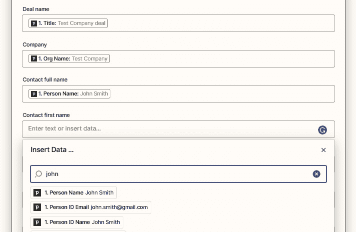
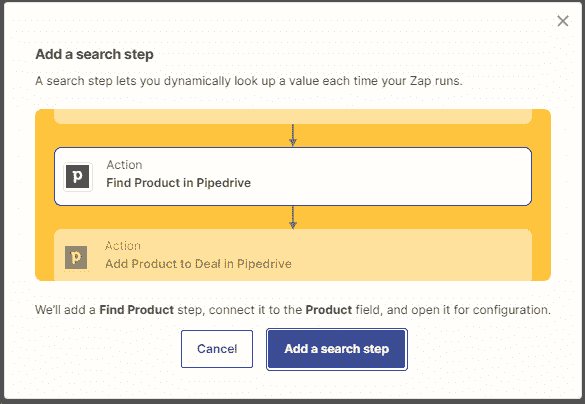

# 第六章：创建多步骤 Zap 并使用内置应用程序

随着您对使用 Zapier 自动化业务工作流程的熟悉程度增加，您会发现在许多情况下，您可能需要比单步工作流提供的更灵活的操作。您将开始构建更复杂的工作流程，这将允许您自动化涉及各种应用程序任务的多个操作步骤。您可能会经常发现所需用于后续操作的数据在触发器和现有动作步骤中不可用。在这些情况下，您将需要知道如何使用搜索动作事件来检索数据。为了补充使用触发器和动作，您可能还想通过使用 Zapier 创建的各种内置工具来进一步定制您的 Zaps，以便您可以在 Zapier 平台内转换和操作数据。

在*第三章*，*构建您的第一个自动化工作流程（Zap）*，我们介绍了如何创建单步 Zap 的基础知识。在本章中，我们将在您已获得的知识基础上继续讨论如何使用多个动作和搜索来开发多步骤 Zaps，并向您介绍 Zapier 创建的各种内置应用程序。我们将首先介绍如何通过回顾使用动作步骤并添加搜索步骤来创建多步骤 Zaps。然后，我们将探讨如何删除、复制、重新排序和重命名 Zaps。您还将通过参与一个多步骤 Zap 的练习来测试自己的知识。然后，我们将简要介绍所有由 Zapier 创建的内置应用程序的功能，这些功能将在后续章节中详细介绍。

本章将涵盖以下关键主题：

+   创建具有多个动作和搜索步骤的多步骤 Zaps

+   删除、复制、重新排序和重命名步骤

+   介绍 Zapier 的应用程序

一旦您学习完这些主题，您将了解如何创建多步骤 Zap 并在动作步骤中使用搜索功能。您还将更好地了解 Zapier 所有内置应用程序的基本功能。

# 技术要求

要学习本章内容，您需要访问 Zapier 账户。要构建多步骤 Zaps，您至少需要订阅 Zapier Starter 计划。您可以在此处获取本章中使用的 Zap 模板：[`bit.ly/zapier-book`](https://bit.ly/zapier-book)。使用这些模板将帮助您可视化该流程的工作方式。

# 创建具有多个动作和搜索步骤的 Zaps

在*第三章*，*构建您的第一个自动化工作流（Zap），*我们逐步介绍了创建我们第一个单步 Zap 的过程。在*第五章*，*故障排除和处理 Zap 错误*，我们使用这些知识使用 Zapier Manager 和 App Status by Zapier 创建了警报 Zaps。现在您已经第一手体验了 Zapier 在单步工作流中所能提供的内容，是时候探索多步工作流的无限自动化可能性，以提高您的生产力。

正如我们在*第三章*，*构建您的第一个自动化工作流（Zap）*中所讨论的，一旦您设置了触发步骤，您可以在触发器之后和任何操作步骤之间添加操作、搜索、筛选和延迟，并在最后添加路径，使用**+**图标。

重要说明

您可以向 Zap 添加最多 99 个操作步骤；然而，出于控制目的，最好将工作流程缩短，并在可能的情况下将您的流程分解为更易管理的 Zap。

我们将在*第七章*，*使用内置应用程序入门*后面讨论如何将筛选器、延迟和路径添加到您的工作流程中，届时我们将探索一些 Zapier 的内置应用程序。不过在此之前，我们需要了解如何在操作步骤中使用搜索功能。搜索功能允许您动态查找可能不在触发器和现有操作步骤中的数据。只要您打算使用的应用程序有通过集成可用的搜索动作事件，这就是可能的。

重要说明

很多应用程序都为您提供了搜索数据的选项。难以用言语来表达搜索操作功能的用处。它可以让用户提取您可能在触发步骤或之前的操作步骤中无法获得的信息。一个常见的例子是在**Shopify**中进行了销售，您会得到与销售关联的产品 ID。在这种情况下，您可能想要搜索与产品相关的其他信息，然后在其他步骤中使用。

有两种方法可以将**搜索**操作步骤添加到您的 Zap 中：

+   使用**+**图标

+   通过转到**选择值...**字段并使用**自定义**标题选项 

让我们依次来看一下。在我们通过本节时，您会发现很多示例和截图都是关于**Pipedrive CRM**的。我们选择了这个例子，因为它很好地解释了搜索操作的功能。请记住，很多应用程序都有搜索操作功能，您可以根据需要利用它们。

## 使用+图标添加搜索步骤

如果您正在使用的应用程序通过集成有可用的搜索操作事件，则将用**查找...**加上项目来表示。例如，在 Pipedrive 中，以下搜索操作事件是可用的：

+   **找到个人**

+   **查找潜在客户**

+   **查找用户**

+   **查找组织**

+   **查找交易**

+   **查找活动**

+   **查找产品**

+   **查找产品**

搜索通常使用项目的唯一标识符进行，例如名称、电子邮件地址、主题、代码和记录 ID。具有搜索操作事件集成的大多数应用程序都将允许多种搜索项。

重要提示

许多用户经常犯的一个常见错误是通过与记录 ID 关联的“名称”进行搜索。在大多数情况下，记录 ID 是搜索项的最佳方式，因为记录 ID 在应用程序中的项目之间通常是唯一的。例如，在 CRM 中，可能存在联系人的重复，这些重复可能在数据上有所不同；然而，只有一个记录 ID 存在来区分这些重复项。

让我们用一个例子来说明实现搜索操作事件。我们将使用*第三章*中的一个修改过的示例，*构建您的第一个自动化工作流程（Zap）*，我们将把触发应用程序更改为 Pipedrive，并且触发事件将是**新交易**。在这种情况下，我们可能希望在我们的 Google Sheets 电子表格中的列中添加联系人的全名以及他们的名字和姓氏。当我们尝试搜索该人的名字时，我们看到从触发步骤中提取的数据只显示了联系人的全名。如下截图所示：

图 6.1 – 通过名字搜索无结果概览

在这种情况下，由于 Pipedrive 集成具有**查找人物**搜索操作事件，我们可以在触发器和现有操作步骤之间添加一个搜索操作步骤来检索这些详细信息。我们可以通过点击**+**图标来执行此操作。

提示

另一个选择是使用 Zapier 内置的 Formatter by Zapier 应用程序添加一步。在这里，您可以添加一个`Person Name`数据，以便您提取名字和姓氏。我们将在*第十七章*中介绍 Formatter by Zapier 的文本拆分功能，*Zapier 中的文本格式化函数 – 第二部分*。

接下来，我们可以将 Pipedrive 添加为我们的应用程序，**查找人物**作为我们的操作事件，如下截图所示：

图 6.2 – 查找人物操作事件概览

将其添加到我们的 Pipedrive 帐户后，我们可以自定义我们的搜索 – 例如，通过添加以下内容：

+   **要搜索的字段**：在这种情况下，我们可以使用人的记录 ID 进行搜索，所以我们将从下拉列表中选择**ID**值。

+   **ID（术语）**：在这种情况下，我们将从触发步骤映射**Person ID**动态数据值到这个字段。ID 字段是一个数字（整数）字段，我们输入的值（静态或动态）应该是这样的。

+   **搜索精确匹配**？：在这种情况下，我们将选择**是**选项，因为我们希望搜索精确匹配。

+   **如果没有找到，此步骤是否应被视为“成功”**：使用此布尔字段从下拉菜单中选择**是（true）**或**否（false）**，输入文本，或从前面的步骤中插入数据，以便在搜索中如果没有找到东西则将此步骤视为“成功”。这个字段的默认值是**否（false）**，如果您希望在没有找到东西时此步骤“停止”，那么您应该选择此选项，因为这是最常见的用例。这意味着 Zapier 将会产生一个您不会收到通知的软错误；Zap 将不会暂停。但是，所有依赖此步骤中数据的后续步骤都将被跳过。如果您希望允许 Zap 继续运行并运行后续步骤，则选择**是（true）**选项。如果选择此选项，则最佳做法是通过添加**Filter by Zapier**或**Paths by Zapier**条件逻辑来在工作流程中更多控制，并根据搜索是否返回结果来允许这些步骤通过或停止。我们将在*第七章*中学习如何使用此字段选项进行条件工作流程，*使用内置应用* *入门*。

+   **如果还不存在，则创建 Pipedrive 人员？**：如果希望在搜索没有返回现有记录时创建新记录，请勾选此复选框。勾选后，该步骤将刷新并显示与**创建人员**操作事件相同的字段。您在指定应用程序中想要搜索的实体（例如，**Pipedrive 人员**）将在不同的应用程序之间有所不同，以及**创建**实体也会不同。

如下截图所示：

图 6.3 – 自定义 Pipedrive 搜索操作步骤中的查找人员事件概览

然而，我们也可以选择使用任何其他现有的静态或动态数据值进行搜索。例如，如果我们确信它们足够独特以能够找到特定记录，我们可以使用人的电子邮件地址或姓名作为搜索项。

重要提示

搜索操作事件变量在操作事件和应用程序之间会有所不同。因此，在**操作**部分看到的内容可能与我们的示例不同。Zap 编辑器会显示有关每个字段中可以包含的有用注释。

最后，如果我们已正确映射了字段，使用此测试将检索正确的联系人以及所有必要的详细信息。我们需要在**在 Google Sheets 中创建电子表格行**操作步骤中映射联系人的名字和姓氏。如下截图所示：

图 6.4 – 搜索姓氏以获取结果的概览

现在，我们可以继续使用**重新测试操作**按钮来重新测试我们的操作，以查看我们的数据如何推送到我们的 Google Sheets 电子表格中。或者，我们可以**跳过测试**。

作为对比，以下截图显示了使用**Mailchimp**作为应用程序的搜索操作步骤：

图 6.5 – 自定义“查找订阅者”搜索操作步骤的概览

以下截图显示了许多搜索操作步骤中可以提取的大量数据，这些数据可以用于您的其他操作步骤：

图 6.6 – 查找订阅者搜索结果概览

现在，让我们看看如何从**选择值...**字段内添加搜索操作步骤。

## 在**选择值...**字段中添加搜索步骤

在*第三章*，*构建您的第一个自动化工作流程（Zap）*，我们介绍了您将在操作步骤中找到的两种主要字段类型：**选择值...**和**输入文本或插入数据...**。当使用**选择值...**字段类型时，您可以映射静态或动态数据。从触发器或前一个操作步骤检索到的动态数据可以使用**自定义**头选项进行映射。如果您要映射的动态数据在先前步骤中不存在，您可以根据集成是否允许此操作添加搜索操作。

让我们通过在工作示例中添加一个额外的要求来说明这一点。一些 CRM，如 Pipedrive，具有产品模块，允许您为您可能向客户收费的产品存储设置代码、描述和定价。在我们的工作流程中，一旦我们在 Google Sheets 电子表格中创建了一个新行，我们可能希望自动将产品添加到我们在 Pipedrive 中的交易中。对于我们的具体示例，当交易创建时，可以从 Pipedrive 的下拉菜单中选择“产品”。我们希望使用这个来从我们的 Pipedrive 产品模块中搜索实际产品，以便我们可以将其添加到交易中。这个例子在现实生活中可能并不那么相关，但它可以说明如何使用**选择值...**字段类型进行搜索。

首先，我们需要在**在 Google Sheets 中创建电子表格行**操作步骤之后使用**+**图标添加一个操作步骤。我们将使用**Pipedrive**作为我们的应用程序，**将产品添加到交易**作为我们的操作事件。在**操作**下，对于**产品**字段，单击字段旁边的**添加搜索步骤**按钮。如下截图所示：

图 6.7 – 在自定义选项卡中查找“添加搜索步骤”按钮的概览

这将产生一个带有说明的弹出窗口，如下截图所示：

图 6.8 – 添加搜索步骤弹出窗口概览

一旦我们点击了**添加搜索步骤**按钮，Pipedrive 的**查找产品**搜索动作步骤将自动添加到**添加产品**动作步骤之前。

一旦我们确认了要使用的 Pipedrive 帐户，我们需要在**动作**部分映射一个值进行搜索。在我们的示例中，我们将使用从触发器步骤中输入的值，来自我们的 Pipedrive 产品字段。如下截图所示：

图 6.9 – 自定义查找产品动作步骤概览

最后，执行**测试**将从 Pipedrive 的产品模块中检索产品信息；ID 将自动映射到我们的**添加产品到交易**动作步骤。如下截图所示：

图 6.10 – 搜索步骤结果概览自动映射到起始动作步骤

现在，我们可以通过添加静态数据或映射来自先前步骤的动态数据来填写其他字段，进行**测试**，并完成我们的工作流程。

您可以通过访问[`bit.ly/zapier-book`](https://bit.ly/zapier-book) 获取此 Zap 的模板，并将其添加到您的 Zapier 帐户中。使用此 Zap 模板将帮助您了解流程的工作原理。

现在，您可以尝试自己进行以下练习。

## 练习 – 创建一个具有搜索动作的多步 Zap。

使用您在*第二章*中定义的一个流程，*准备自动化您的流程*，来逐步完成本节内容，创建一个具有搜索动作的多步 Zap。尝试在您的工作流程中结合多个应用程序。

以下是您可以使用的示例：

1.  **触发器**：提交了一个网络表单。

1.  **动作**：将新订阅者添加到您的电子邮件营销应用程序中。

1.  **动作**：将新联系人添加到您的发票应用程序中。

1.  **动作**：在 Google Sheets 电子表格查找列表中搜索用户 ID。

1.  **动作**：将新的入职任务添加到您的任务管理应用程序中，并将其分配给*第 4 步*中的用户。

1.  **动作**：发送电子邮件或消息到您的团队，通知他们新的联系人和订阅者记录已被创建。

您可以针对您已记录并且可以从自动化中受益的任何流程重复此练习。

您现在应该更好地理解了如何创建和自定义具有自定义值和搜索功能的多步 Zap。现在，让我们讨论如何修改 Zap 中的步骤，以便删除、复制、重新排序或重命名它们。

# 在您的 Zap 中删除、复制、粘贴、重新排序和重命名步骤

随着您对构建多步骤 Zap 的熟悉程度越来越高，您可能会想要删除、复制、重新排序或重命名 Zap 中的步骤。要执行这些操作，请选择您想要对其执行相应操作的步骤，选择三个点图标以显示下拉菜单，然后选择选项。下面的截图展示了这个过程：

图 6.11 – 在经典编辑器中管理 Zap 的一步

重要提示

在**可视化编辑器**中，左侧面板中不存在**概览**部分，因此所有操作都将通过在步骤上点击三个点的下拉菜单来执行。您还会注意到，在下拉菜单中**重新排序**选项也不可用，因为您可以在主编辑器部分内拖放步骤。

您也可以通过选择步骤旁边的三个点图标来管理步骤，以显示下拉菜单，并通过在右侧面板的**概览**部分中的搜索栏中输入搜索变量来搜索它们。您还可以从下拉菜单中在步骤下方添加一个步骤。下面的截图展示了这个过程：

图 6.12 – 在 Zap 编辑器的概览部分管理步骤

让我们依次看一下重命名、复制、添加、复制、粘贴、删除和重新排序步骤。

## 重命名一步

在*第四章*，*管理您的 Zaps*，我们探讨了如何充分命名您的 Zaps。同样的逻辑也可以应用于您 Zap 中的步骤。由于 Zapier 将根据所涉及的应用程序和触发器或操作事件自动命名步骤，因此更改名称以使其更具描述性是很有用的。如果您正在与团队一起工作，这尤其重要，以给步骤的目的提供更多的上下文，并且如果您的 Zap 中有许多步骤，则能够使用关键字在**概览**部分中搜索步骤而不是滚动整个 Zap 将会很有用。

在步骤中点击**重命名**选项或者从**概览**部分中点击**重命名**选项将允许你更改步骤名称中的文本。编辑完文本后，只需点击文本框外的任意位置即可保存更改。

## 复制一步

当你构建具有重复步骤的多步骤 Zap 时，能够复制步骤是非常有用的。这些副本可能与原始版本完全相同，或者你可能只需要做一些小的调整。例如，你可能需要构建一个包含一系列步骤的 Zap，例如一个 7 天的销售节奏活动，这时复制步骤就非常有用。下面的截图展示了这个示例：

图 6.13 – 创建了一个 7 天销售节奏活动的 Zap

单击 `复制：` 后跟原始步骤的名称。你必须通过检查步骤并相应地重新映射字段来继续。

## 添加步骤

你可以通过在步骤之间单击 **+** 按钮将步骤添加为例行程序。你也可以通过在**大纲**部分中选择**在下面添加步骤**选项，在所选步骤下方添加步骤。

## 复制和粘贴步骤

**复制** 选项会直接在其下方创建步骤的副本。然而，你可以选择复制特定的步骤，轻松地将该副本粘贴到另一个步骤的上方或下方。你可以通过单击步骤中的 **复制** 选项或 **大纲** 部分中的 **复制** 选项来实现。步骤的副本将被添加到剪贴板上，在 Zap 编辑器顶部会显示通知，几秒钟后会消失，底部左侧将出现弹出窗口。你可以单击 **X** 按钮隐藏弹出窗口。如下截图所示：

图 6.14 – 复制和粘贴步骤

你不能使用剪贴板查看数据，它每次只包含一个 Zap 的副本，可以通过再次使用 **复制** 选项来覆盖。然后，在 **大纲** 部分的任何步骤（在 **经典编辑器** 中），你可以选择**粘贴到下面**选项将复制的步骤粘贴到所选步骤下面，或者选择 **粘贴以替换** 选项完全替换一个步骤。然后，你必须检查步骤并相应地重新映射字段。这是一个省时的功能，可以在过程中减少几次点击。

## 删除一个步骤

有时你可能不再需要工作流程中的一个步骤，需要将其删除。单击步骤中的 **删除** 选项或 **大纲** 部分中的 **删除** 选项将允许你完全删除你的 Zap 中的步骤。一个提示将出现说 **确定要删除吗？**，询问你确认是否要删除步骤，因为它将不可恢复。如下截图所示：

图 6.15 – 确认是否要删除步骤的提示

## 重新排序步骤

有时，你可能会意识到你的步骤在你的 Zap 中放错了位置，你想要移动它。在 **经典编辑器** 中，单击步骤中的 **重新排序** 选项将打开**大纲**部分，你可以在 Zap 中的其他位置拖放你的步骤。如下截图所示：

图 6.16 – 经典编辑器中大纲部分重新排序步骤的概述

如果步骤使用来自先前步骤的数据，并且您将步骤移动到数据来源步骤之前，则将无法再使用数据。您将收到弹出窗口形式的警告。您可以通过单击**取消**按钮来取消操作，或者通过单击**移动步骤**按钮来继续。然后，您必须继续检查步骤并相应地重新映射字段。如下截图所示：

图 6.17 – 重新排序步骤时出现警告的概览

当使用**可视化编辑器**时，只需在主编辑器部分简单地拖放步骤即可轻松重新排序步骤。

一旦您复制了一个步骤，重新排序步骤尤其有效，因为您可以将副本移动到 Zap 的另一部分。

提示

复制、粘贴、复制和重新排序步骤是 Zapier 最近发布的新功能，将在您调整工作流程时为您节省大量时间。在发布此功能之前，如果在定位步骤时出现错误，或者需要在 Zap 的后续位置创建该步骤的副本，则必须重新构建步骤。您可以使用此功能更快地构建多步骤 Zap。

现在，您应该更好地了解如何通过在 Zap 中重命名、删除、复制和重新排序步骤来管理步骤。现在，让我们进一步构建多步骤 Zap，并探索 Zapier 创建的所有内置应用程序，以使工作流自动化在 Zapier 平台上全面展开。

# 介绍 Zapier 的应用程序

创建多步骤 Zap 的基础在于知道如何充分利用触发器、操作和搜索功能。一旦您掌握了这一点，您可能希望利用 Zapier 创建的许多内置应用程序的功能，这样您就可以执行常见任务，而无需使用其他应用程序并支付额外的订阅费用。Zapier 已经创建了几个内置应用程序，帮助您加速工作流程。

我们将这些应用程序分类如下：

+   控制运行条件和逻辑的应用程序

+   通讯应用程序

+   用于提取和编译数据的应用程序

+   其他有用的应用程序

+   高级应用程序

+   管理 Zapier 帐户的应用程序

+   处于α和β测试阶段的新发布的应用程序

+   Zapier 应用程序中强大的格式化器

+   带有 AI 功能的应用程序

重要提示

Zapier 定期发布新功能和内置应用程序。在本书中，我们将介绍已发布的内置应用程序及其触发器、操作和搜索操作。

您可以在此处获取到 Zapier 内置应用程序的方便快速参考备忘单：[`bit.ly/zapier-book`](https://bit.ly/zapier-book)。

现在，让我们简要地回顾一下每个类别中的应用程序。

## 通过 Zapier 应用程序设置运行条件并使用逻辑

你可能想要通过控制工作流何时继续运行来定制你的自动化。你可以通过添加逻辑来阻止一个 Zap 运行，除非数据满足某些条件，或者通过添加定时延迟和安排你的 Zaps 在特定间隔运行来实现这一点。Zapier 已经创建了以下内置应用程序，所有这些应用程序通常用于设置运行条件和使用逻辑：

+   **Filter by Zapier**：Filter by Zapier 允许你向你的 Zaps 添加条件逻辑步骤，只有在满足了某些条件时才允许自动化继续。例如，你可能希望在你的 Google Sheets 电子表格中添加了新行时发送电子邮件，但只有在某列中的数据存在时才发送。

+   **Delay by Zapier**：通过使用 Delay by Zapier，你可以向后续操作步骤添加时间延迟。你可以设置延迟，以便在一定时间后，例如 1 小时，某个特定时间，例如下午 2 点，或者在工作流程中有多个延迟的情况下等待延迟队列后，允许 Zap 的其余部分运行。例如，你可能希望在 Instagram 上添加图像或视频后的 1 周后在 Twitter 上发送一条推文。

+   **Schedule by Zapier**：你可以使用 Schedule by Zapier 作为触发步骤，在设置的时间运行工作流，例如每小时、每天的某个特定时间、每周的某一天、每月的某一天。例如，你可能希望在每周开始时向任务管理应用程序（如 Asana）添加一组任务。

+   **Paths by Zapier**：Paths by Zapier 允许你向你的 Zaps 添加分支逻辑。这意味着你可以根据设定的条件允许不同的路径以及不同的操作运行。例如，你可能希望根据客户在你的网站上填写的联系表单中提供的联系方式首选项，向客户发送电子邮件或短信。

我们将在*第七章*中涵盖 Zapier 的所有这些应用程序，*开始使用* *内置应用程序*。

现在，让我们回顾一下 Zapier 创建的具有通信功能的应用程序。

## 使用 Zapier 的应用程序进行通信

Zapier 创建了几个特定于通信的内置应用程序，允许你触发工作流自动化并执行操作。这些如下：

+   **SMS by Zapier**：使用 SMS by Zapier，你可以向你可以验证的号码发送有限数量的短信。换句话说，需要授予权限才能向号码发送消息。因此，这对于向自己或无法用于向客户发送消息的团队成员发送通知或提醒非常有用，例如。

+   `zapiermail.com` 电子邮件地址用作触发器或操作步骤。然后，你可以发送出站邮件，如果你已经启用了阅读回执，你可以在某人打开你发送的邮件时触发工作流。你还可以在你的 `zapiermail.com` 地址收到转发的电子邮件时触发 Zaps 运行。

+   **Zapier 的 SMTP**: **简单邮件传输协议** (**SMTP**) 允许电子邮件客户端应用程序发送电子邮件。如果您使用的是除 Gmail、Zoho Mail 或 Microsoft Office 365 之外的邮件服务器，则可以通过 Zapier 的 SMTP 发送电子邮件。

+   **Zapier 的 IMAP**: **互联网消息访问协议** (**IMAP**) 允许电子邮件客户端应用程序从服务器检索电子邮件。如果您使用的是除 Gmail、Zoho Mail 或 Microsoft Office 365 之外的邮件服务器，则可以使用 Zapier 的 IMAP 从这些邮件服务器检索电子邮件。

我们将在*第八章*中涵盖由 Zapier 创建的所有这些应用程序，*内置* *通讯应用程序*。

接下来，让我们探索一些 Zapier 创建的用于提取和编译数据的应用程序。

## 使用 Zapier 应用程序提取和编译数据

Zapier 创建了一些内置应用程序，允许您从电子邮件中提取数据，在自动化中使用 RSS feed，并创建信息摘要。这些应用程序如下：

+   您可以将电子邮件转发到`@robot.zapier.com`邮箱地址，并启用从电子邮件中提取数据。例如，如果您通过电子邮件收到网页表单提交通知，您可以使用 Zapier 的 Email Parser 提取数据以在后续操作步骤中使用。

+   **Zapier 的 RSS**: **真正简单的订阅** (**RSS**) feeds 在网站发布新内容时更新。Zapier 的 RSS 应用程序允许您使用 RSS feed 更新作为触发器，然后通过添加通知操作步骤，如电子邮件、短信或 Slack 消息，可以让您了解新内容的更新。例如，您可能想要在您最喜欢的商业博客发布新文章时收到更新。您还可以使用该应用程序创建自己的 RSS feed。

+   **Zapier 的摘要**: 此内置应用程序允许您从多个工作流触发事件中捕获数据，并将数据编译成可以在其他操作事件中使用的单个摘要。例如，将每周销售发票创建的摘要发送给您的销售团队。您还可以搜索现有的摘要数据。

我们将在*第九章*中更详细地涵盖由 Zapier 创建的这些应用程序，*探索内置应用程序以* *提取和编* *译数据*。

现在让我们快速浏览一下 Zapier 创建的其他一些有用应用程序及其相关功能。

## Zapier 的其他有用应用程序

Zapier 还创建了几个其他内置应用程序，执行各种有用的功能。这些如下所述：

+   **Zapier Chrome 扩展**: Zapier Chrome 扩展，以前称为 Push by Zapier，使用 Google Chrome 扩展从网页的任何位置手动触发一次性自动化。例如，您可能想要创建一个新的 Trello 卡片来查看您在浏览互联网时遇到的文章内容。

+   **Zapier 的 URL 缩短器**：如果您想要将长的**统一资源定位符**（**URL**）字符串缩短并更容易识别，可以使用 Zapier 的 URL 缩短器。这在你有文本长度限制时特别有用，例如如果您想要发送短信或在 Twitter 上发布推文。这类似于 Bitly 等工具。

+   **Zapier 的翻译**：Zapier 的翻译允许您将单词、短语和网页翻译成 100 多种语言，并且它可以用于检测文本中的语言。

+   **Zapier 的潜在客户得分**：这个应用程序允许您使用他们的电子邮件地址从网络上收集有关联系人的信息，并且还可以用于为他们提供一个资格得分。例如，如果一个新的潜在客户提交了一个网络表单，您可能希望了解联系人的公司、公司规模和地点等更多详细信息。

+   **Zapier 的天气**：Zapier 的天气让您了解您所在地区的天气条件。您可以用它来获取每日天气通知，并仅在当天将会下雨时触发（基于您的 Zapier 时区设置）。您还可以搜索指定地点的当前天气状况和明天的预报。

+   **Zapier 的逆行**：您可以使用 Zapier 的逆行基于水星逆行的占星预测来触发您的工作流。您可以选择水星进入或离开逆行的触发事件，或者当水星处于逆行时每天触发事件一次。

我们将在更多细节中详细介绍 Zapier 的所有这些应用程序，*第十章*，*Zapier 的其他有用内置应用程序*。

现在，让我们看看 Zapier 创建的具有更高级功能的应用程序。

## Zapier 的高级应用程序

随着您越来越熟悉 Zapier 应用程序的使用，您可能想要尝试一些稍微更高级功能的内置应用程序。这些应用程序如下：

+   `GET`, `POST`, `PUT`或自定义的 HTTP 请求。

+   **Zapier 的代码**：如果您熟悉**JavaScript**或**Python**，您可以在工作流自动化中使用 Zapier 的代码。您可以使用 JavaScript 或 Python 编写代码，以在触发器或操作中操作数据。

+   **Zapier 的存储**：Zapier 的存储允许您保存和检索小的数据值。这允许您在每次 Zap 运行时存储参考数据，然后通过检索它与其他 Zaps 共享。例如，假设您想要持续记录有多少新订阅者已添加到您的电子邮件营销应用程序中，然后使用这个记录，使其显示在诸如**Databox**之类的仪表板报告工具中。

我们将在*第十一章*中详细介绍 Zapier 的所有这些应用程序，*Zapier 的高级内置应用*。我们还将探讨**API 请求**和**应用扩展**的功能。

现在，让我们看看您可以用来管理 Zapier 帐户的应用程序。

## 使用 Zapier 应用程序管理您的 Zapier 帐户

如果您负责系统管理，则需要了解如何使用这些应用程序。它们使您能够构建自动化流程，帮助您监视 Zapier 帐户的问题，例如错误和任务使用情况。它们如下所示：

+   **Zapier 管理器**：我们在*第五章*中介绍了 Zapier 管理器应用程序，*故障排除和处理 Zap 错误*，我们讨论了如何使用它来管理错误警报，例如 Zaps 错误、Zaps 被关闭或任务被停止。您还可以使用 Zapier 管理器通知您有关将新的公共应用程序添加到 Zapier、您帐户的更改（例如新文件夹或创建的 Zaps、任务使用限制已达到或发布新的 Zapier 发票）。您可以搜索 Zap 或公共应用程序，以及打开或关闭 Zaps。如果您使用团队帐户，则可以使用 Zapier 管理器邀请新用户加入您的 Zapier 团队或通知您新的团队成员被添加。

+   **Zapier 的应用状态**：我们在*第五章*中介绍了 Zapier 的应用状态应用程序，*故障排除和处理 Zap 错误*，我们讨论了如何使用它来获取关于公共应用程序的新、更新和已解决事件的通知。

我们将在*第十二章*中涵盖 Zapier 的所有这些应用程序，*使用内置应用程序管理您的 Zapier 帐户*。

接下来，让我们探索新的内置应用发布。

## 处于 alpha 和 beta 测试阶段的新发布的应用程序

Zapier 不断改进功能并发布新功能。自本书第一版出版以来，已发布以下应用程序：

+   **Zapier 中的循环**：您可以通过循环多次执行 Zaps 中的操作，针对指定的值集合。当您有多个需要单独运行工作流的值时，这非常有用。

+   **Zapier 的子 Zap**：您可以创建可重用的 Zap 组件和系统，通过构建和调用它们称为“子 Zaps”。当您想要在主要 Zap 之外运行工作流并连接多个 Zaps 时，这非常有用。

+   **传输**：您可以批量在两个应用程序之间传输数据，可以按需或按计划进行传输。

+   **表格**：您可以在 Zapier 平台上存储数据表，无需使用额外的电子表格或数据库应用程序。

+   **接口**：您可以创建可以连接到您的 Zaps 的页面，例如表单、文本页面、表格、看板、聊天机器人和链接卡，这些页面托管在 Zapier 平台上。

我们将在*第十三章*中涵盖 Zapier 的所有这些应用程序，*新发布的应用程序和功能*。

现在，让我们概述多功能 Formatter by Zapier 应用程序。

## 强大的 Formatter by Zapier 应用程序

**Formatter by Zapier** 应用程序到目前为止是 Zapier 最通用的内置应用程序。它的功能非常广泛，我们将在五个章节中涵盖此应用程序。使用 Formatter by Zapier 应用程序可以格式化以下内容：

+   **日期和时间**：您可以将日期/时间值转换为不同的格式（包括时区）并添加/减去时间。我们将在*第十四章*，即*格式化日期和时间*中介绍使用 Formatter by Zapier 应用程序进行日期和时间格式化。

+   **数字**：你可以操作数字、电话号码和货币，并使用电子表格类型的公式和数学运算。我们将在*第十五章*，即*数字格式化*中介绍使用 Formatter by Zapier 应用程序进行数字格式化。

+   **文本**：您可以使用此功能广泛格式化文本。您可以做很多事情，我们将在两章中介绍该功能。在*第十六章*中，即*Zapier 中的文本格式化函数 - 第一部分*，我们将探讨调整标题大小写、大写和小写、查找和替换文本、修剪空格、计算单词数和调整长度以及复数文本。在*第十七章*中，即*Zapier 中的文本格式化函数 - 第二部分*，我们将讨论文本分割、截断文本、提取模式、URL、电话号码、数字和电子邮件地址、删除 HTML 标记以及创建超级英雄名称（有趣的名称）。我们还将概述高级功能，例如如何将 Markdown 转换为 HTML 和 ASCII 并使用默认值和 URL 编码/解码。

+   `.csv`文件。我们将在*第十八章*，即*Zapier 的* *工具函数*中介绍 Formatter by Zapier 应用程序中的实用功能。

现在，让我们讨论具有人工智能（AI）功能的内置应用程序。

## 带有 AI 功能的应用程序。

将 AI 功能集成到其软件应用程序中已成为许多 SaaS 公司的重要任务。 Zapier 也不例外。随着 ChatGPT 面向更广泛的市场推出，并可能集成和整合 AI 功能，Zapier 正在发布许多 AI 集成特性。其中一些特性是**AI 驱动的故障排除**、**AI 聊天机器人**、**创建 Zap**，以及使用 Zapier Chrome 扩展和**ChatGPT 插件**运行**AI 操作**。我们将在*第十九章*中简要介绍所有这些功能以及更多内容，即*AI 和自动化*。目前，所有 AI 特性均处于测试版本。我们还将探讨一些与 Zapier 的 AI 应用程序集成，例如**ChatGPT**和**OpenAI**集成。

您现在应该更好地了解 Zapier 平台上可用的内置应用程序。

# 总结

在本章中，我们通过介绍构建多步 Zaps 的好处，提高了您使用 Zapier 的知识。我们介绍了如何在操作步骤中使用搜索功能，如何删除、复制、重排和重命名 Zaps 中的步骤，并鼓励您通过为流程中的一个创建多步工作流来测试您的知识。最后，我们介绍了 Zapier 创建的所有内置应用程序，这些应用程序可以让您在 Zapier 平台内部存储、显示和转换数据。

您现在知道如何创建具有多个操作和搜索步骤的工作流自动化。您现在也更好地了解了 Zapier 创建的所有内置应用程序。

在下一章中，我们将向您介绍一些 Zapier 的内置应用程序。我们将介绍如何使用 Filter by Zapier 中的条件逻辑来处理工作流，并了解使用 Paths by Zapier 添加路径的具体功能。我们还将介绍如何使用 Delay by Zapier 和 Schedule by Zapier 来应用时间延迟并安排 Zap 的运行时间。

# 问题

1.  您可以向 Zap 添加多少个操作步骤？

1.  能够重新排序 Zaps 中的步骤有什么用？

1.  当你想要在 Zaps 中添加条件逻辑时可以使用哪两个内置应用程序？

1.  哪个内置应用程序允许你格式化文本、日期/时间和数字？
