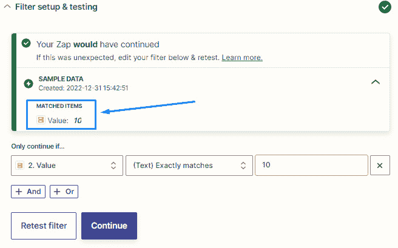
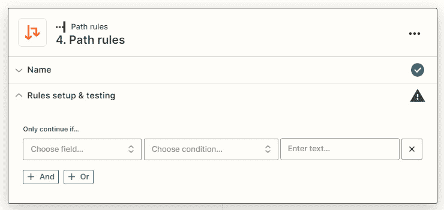

# 7

# 使用内置应用程序入门

当你创建你的 Zaps 时，你将指定你希望你的工作流在什么事件上被触发，以及之后要采取的操作。你可能会发现，在某些情况下，除非满足某些条件，否则你希望创建条件来阻止你的工作流运行，或者根据特定要求运行不同的操作。你可能还希望在触发工作流后的一段时间后运行一些操作，或者在特定时间触发。使用 Zapier 的内置应用程序，我们可以应用条件逻辑并在我们的工作流中运行条件来实现这一点。

在本章中，我们将介绍四个内置的 Zapier 应用程序，它们允许你通过过滤、延迟、调度或选择路径来控制运行条件或在工作流中使用条件逻辑。我们将介绍它们的功能，并提供如何使用它们的实用提示。

在本章中，我们将涵盖以下关键主题：

+   Filter by Zapier – 将条件逻辑应用于你的 Zaps

+   Paths by Zapier – 向你的 Zaps 添加分支逻辑

+   Delay by Zapier – 向你的 Zaps 添加延迟

+   Schedule by Zapier – 定期运行你的 Zaps

+   练习 – 创建一个带有定期触发器、搜索操作、过滤器、路径和延迟的多步骤 Zap

一旦你完成了这些主题的学习，你将知道如何应用条件和分支逻辑，并向你的工作流添加延迟或调度。

# 技术要求

要完成本章内容的学习，你需要访问 Zapier 帐户。要构建多步骤 Zaps 并使用过滤器，你需要至少订阅 Zapier Starter 计划。要在你的 Zaps 中添加分支逻辑的“Paths by Zapier”部分，你需要访问 Professional 计划或更高版本以能够使用 Paths by Zapier 应用程序。

# Filter by Zapier – 将条件逻辑应用于你的 Zaps

一旦你的工作流被触发，你可能希望控制它们是否继续运行并跟随后续操作步骤。这对于阻止你的 Zaps 运行除非你指定的触发器或先前操作步骤满足特定条件是很有用的。我们可以使用内置的 Filter by Zapier 应用程序中内置的“如果这样，那么”的条件逻辑来实现这一点。

下面是你可以在你的 Zaps 中使用条件逻辑的几个示例：

+   你可能会在一个 **Smartsheet** 电子表格上记录所有账单及其付款的详细信息。这些是通过信用卡自动支付和需要银行转账来结算的账单的组合。你用 **Paid** 标记一列，并相应地标记为 **Yes** 或 **No**。如果账单需要付款（如果 **Paid** 列中的数据是 **No**），你可能希望在你的 Smartsheet 电子表格中添加新行时向你的财务团队发送电子邮件通知。

+   您可能希望将一封电子邮件的副本添加到 `My Favorite Blog` 标签，并且只希望这些电子邮件被添加到 Evernote 中。

在这些场景中，您可以使用 Filter by Zapier 应用程序在您的 Zaps 中设置条件逻辑。

提示

若要获取更多灵感并访问预先构建的模板，您可以查看 [`zapier.com/apps/filter/integrations`](https://zapier.com/apps/filter/integrations) 上的 Filter by Zapier 内置应用程序配置文件页面。

在你的 Zaps 中使用过滤器是控制自动化的一种聪明方式。

重要说明

仅当数据成功传递时，过滤器才会计入您的月度任务使用量，从而使工作流能够继续执行下一个操作步骤。这非常重要，因为有了此功能，您可以更好地控制您的任务使用量，并更加有效地利用您分配的任务配额。

现在，让我们看看如何使用 Filter by Zapier。

## 设置 Filter by Zapier 应用程序

Filter by Zapier 只能作为一个操作事件使用，您可以通过设置规则来自定义它，以指定工作流何时应继续执行下一步。您可以在触发步骤之后的任何地方添加该应用程序，并在一个 Zap 中使用多个过滤器。

### 添加一个过滤器步骤并自定义您的规则

一旦您添加了一个操作步骤，无论是选择 **Action** 步骤还是点击 **+** 图标，并选择 **Filter by Zapier** 作为应用程序以及 **Only continue if…** 作为操作事件，您可以编辑 **Filter Setup & Testing** 部分中的字段，如下所示：

+   **选择字段…**：使用下拉菜单选择前几步骤中的字段以输入动态数据值。这是您希望过滤器检查的值。由于该值是动态的，因此每次运行 Zap 时都很可能会更改，并且将用于决定 Zap 是否应通过过滤器步骤。

+   **选择条件…**：使用下拉菜单选择一个条件（或逻辑），以将动态值与参考键进行交叉引用。我们将在下一节中详细讨论过滤器条件。

+   **输入文本或插入数据…**：此字段包含将用作参考值以检查动态数据值和条件的数据值。

例如，您可能只希望工作流在前一步骤的动态值为 `10` 时继续。这在下面的截图中显示：

图 7.1 – 使用 Filter by Zapier 应用程序设置过滤器的概览

接下来，您可以自定义您的过滤器，使其具有多个标准，使用 **+ And** 和 **+ Or** 按钮。如果您希望过滤器仅在满足两个或更多条件时通过，请使用 **+ And** 逻辑。或者，如果您希望过滤器在满足任一要求时通过，请使用 **+ Or** 逻辑。然后，单击 **Continue**。

### 测试您的过滤器

然后，Zapier 将根据工作流中的示例数据测试您的条件。如果条件通过，并且 Zap 将继续，将会指示如下，如下面的截图所示：

图 7.2 – Filter by Zapier 应用中已通过测试过滤器的概览

但是，如果过滤条件不通过，则会停止 Zap。这将会指示如下，如下面的截图所示：

图 7.3 – Filter by Zapier 应用中已停止测试过滤器的概览

您可以相应地更改条件，或单击**关闭**按钮继续，然后继续添加一个或多个操作步骤。无论哪种情况，如果您单击向下箭头图标，都会显示与箭头在*图 7**.2* 中指示的项目匹配或不匹配的内容。这将帮助您验证对过滤器的测试。

现在，让我们探讨不同类型的过滤条件和用例。

## 理解过滤条件

Zapier 已经将多个条件内置到应用中，以使您能够处理各种情况。当从**Filter Setup & Testing**部分的**选择条件...**下拉菜单中选择条件时，您将看到涉及五种类型的过滤器规则的逻辑选项：**文本**、**数字**、**日期/时间**、**布尔值**和**通用**。如下面的截图所示：

图 7.4 – Filter by Zapier 应用中逻辑选项选择概览

重要提示

每个条件只能与括号中指定的过滤器规则类型一起使用，除非它是通用的。

让我们依次查看每种过滤器类型。

### 文本过滤器

有一系列可供选择的文本过滤器，这取决于您使用的规则类型是否区分大小写。唯一区分大小写的规则是**(文本) 完全匹配**和**(文本) 不** **完全匹配**。

以下是文本过滤器选项列表：

+   **(文本) 包含**：此条件检查动态数据值是否包含参考值

+   **(文本) 不包含**：此条件是**(文本) 包含**的相反，并检查动态数据值是否不包含参考值

+   **(文本) 完全匹配**：此条件检查动态数据值是否与参考值完全匹配，逐字符匹配

+   **(文本) 不完全匹配**：此条件检查动态数据值是否不与参考值完全匹配，逐字符匹配

+   **(文本) 在**：此条件检查动态数据值是否在指定的参考值列表中

+   **(文本) 不在**：此条件检查动态数据值是否不在指定的参考值列表中

+   **(Text) Starts with**: 此条件检查动态数据值是否以参考值开头。

+   **(Text) Does not start with**: 此条件检查动态数据值是否不以参考值开头。

+   **(Text) Ends with**: 此条件检查动态数据值是否以参考值结尾。

+   **(Text) Does not end with**: 此条件检查动态数据值是否不以参考值结尾。

接下来，让我们看一下数字过滤器。

### 数字过滤器

在*第三章*，*构建您的第一个自动化工作流（Zap）*，我们讨论了使用数字（整数）字段类型。数字过滤器的工作方式相同，您只能使用数值，如`9.5`或`334`。

以下是数字过滤器选项列表：

+   **(Number) Greater than**: 此条件检查动态数据值是否大于参考数字值。

+   **(Number) Less than**: 此条件检查动态数据值是否小于参考数字值。

现在，让我们回顾日期/时间过滤器。

### 日期/时间过滤器

在*第三章*，*构建您的第一个自动化工作流（Zap）*，我们讨论了使用日期/时间字段类型。日期/时间过滤器的工作方式相同，您可以使用各种日期/时间格式，但不能使用文本，如`today`或`tomorrow at` `9 a.m.`。

以下是日期/时间过滤器选项列表：

+   **(Date/time) After**: 此条件检查动态数据值是否在参考日期值之后。

+   **(Date/time) Before**: 此条件检查动态数据值是否在参考日期值之前。

+   **(Date/time) Equals**: 此条件检查动态数据值是否等于（相同）参考日期值。

接下来，让我们看一下布尔过滤器。

### 布尔过滤器

正如我们在*第三章*中讨论的那样，*构建您的第一个自动化工作流（Zap）*，布尔值要么为真，要么为假。

以下是布尔过滤器选项列表：

+   **(Boolean) Is true**: 此条件检查动态数据值是否为真。

+   **(Boolean) Is false**: 此条件检查动态数据值是否为假。

最后，让我们回顾一下通用过滤器。

### 通用过滤器

通用过滤器可用于任何类型的字段。

以下是通用过滤器选项列表：

+   **Exists**: 检查值是否存在（可用于任何类型的字段）。

+   **Does not exist**: 检查值是否不存在（可用于任何类型的字段）。

您现在应该更好地了解如何何时使用 Zapier 应用程序进行条件逻辑应用于您的 Zaps。接下来，让我们深入了解如何在您的 Zaps 中使用 Zapier 内置应用程序的分支逻辑。

# Zapier 路径 - 为您的 Zaps 添加分支逻辑

Paths by Zapier 允许你向你的 Zaps 添加分支逻辑。这意味着你可以根据设置的条件允许不同的路径执行不同的操作。这基于你学到的关于使用 Filter by Zapier 的内容，并进一步允许你创建多步工作流自动化路径，具体取决于你指定的内容。让我们看看如何使用 Paths by Zapier 的几个示例：

+   你可能是一家在线零售商，拥有一个电子商务商店，并且有各种需要以稍微不同方式处理的产品。产品 A 可能是一个需要发送到 **Printful** 进行打印、发货和履行的数字产品。产品 B 可能需要在发货前进行组装，并且你需要通过电子邮件通知仓库团队，向 Trello 添加卡片，并打印发货单。

+   你的网站上可能有一个 **Gravity Forms** 表单用于客户服务查询，并且你允许客户指定他们的问题是否与培训、技术问题或账单相关。业务中的每个支持查询都由不同的团队处理，因此你可能希望通过向部门频道发送 Slack 消息并在 **Asana** 中为该团队的所有成员分配任务，将每个查询路由到不同的部门。

在这两个示例中，你可以使用 Paths by Zapier 创建条件，只允许在满足这些条件时执行每个路径。为了帮助你想象这可能是什么样子，我创建了一个简单的工作流程图来代表之前提到的第二个示例：

图 7.5 – 使用 Paths by Zapier 可视化的工作流程

Paths by Zapier 允许你将 Zaps 中的条件逻辑应用提升到另一个层次。

小贴士

要获取更多灵感和访问预构建的模板，你可以查看 [`zapier.com/apps/paths/integrations`](https://zapier.com/apps/paths/integrations) 上的 Paths by Zapier 内置应用程序配置页面。

Paths by Zapier 最适合用于简单的逻辑；然而，一旦你更熟悉使用它，需要记住的两个主要事项是，你只能在工作流程的最后使用 Paths by Zapier，而且你一开始只能创建三个分支。要获得更多分支的访问权限，账户管理员用户将需要联系 Zapier 支持。话虽如此，你可以在每个路径中使用多个 Paths by Zapier 应用程序来扩展你的范围。

重要提示

Zapier 对每个路径有 10 个分支的严格限制，以确保在 Zap 编辑器中保持稳定性，并防止由于潜在超时而导致的长时间运行。此外，Zapier 建议每个分支仅使用三个分支，并在每个分支中嵌套三个额外的路径。Zap 越大，越复杂，验证问题的可能性越大，您可能无法启动您的 Zap。通常情况下，分支数量越少，Zap 的性能越好。总的来说，您的场景越复杂，出现错误和数据损坏的风险就越大。这是一个提醒，保持简单！

创建复杂的路径需要对每个条件进行逻辑评估，并建议您对其进行映射。在考虑使用分支逻辑时，请考虑以下几点：

+   **以图形方式规划您的流程**：参考*第二章*，*准备自动化您的流程*，并使用流程映射技术来可视化您的流程，并在创建路径之前制定条件逻辑策略

+   **为未来做计划**：问问自己是否有可能在以后出现其他条件，因为这可能需要您稍后添加额外的路径，但请记住您可以添加的分支数量限制

如果一开始就做对，这将节省您大量时间。

小贴士

如果您未订阅支持 Paths by Zapier 的 Zapier 计划，则可以使用 Filter by Zapier 步骤作为一种妥协。如果您的工作流程足够简单，您可以复制一个本来需要使用 Paths by Zapier 的过程。您可以通过创建多个基于相同触发器运行的 Zaps，并在触发器步骤之后直接放置一个筛选器来实现这一点。每个工作流中的筛选器将在每个 Zap 中具有不同的筛选条件，从而复制 Paths by Zapier 步骤中每个分支筛选器中指定的那些条件。如果您需要添加超过三条唯一路径，则使用此解决方法也是适当的。

现在，让我们来看一下如何设置 Paths by Zapier 内置应用程序。

## 设置 Paths by Zapier 应用程序

要开始使用 Paths by Zapier，请在工作流的末尾添加 Paths by Zapier 应用程序，方法是选择**操作**步骤或单击**+**图标。将呈现两个路径选项，命名为**路径 A**和**路径 B**。单击**添加新路径**按钮将允许您创建一个额外的路径分支。

您还将在每个路径块中看到以下选项：

+   **三个点图标**：单击此图标将在下拉菜单中显示七个选项：

    +   **重命名**：选择此选项将允许您重命名路径

    +   **复制**：选择此选项将允许您复制路径

    +   **重新排序**：选择此选项将允许您将路径移动到不同的位置

    +   **复制**：选择此选项将允许你复制该路径，并将其添加到剪贴板，然后使用**粘贴下方**或**粘贴以** **替换**选项

    +   **粘贴下方**：与**复制**选项一起使用，以在所选路径下粘贴路径的副本

    +   **粘贴以替换**：与**复制**选项一起使用，以使用剪贴板中的复制品替换所选路径

    +   **删除**：选择此选项将允许你删除单个分支路径

如下截图所示：

图 7.6 - 使用 Zapier 应用程序设置分支概览

这些功能的工作方式与*第六章*中描述的*删除、复制、粘贴、重新排序和重命名 Zaps 中的步骤*部分中所述的方式相同，*创建多步骤 Zaps 和使用* *内置应用程序*。

接下来，让我们回顾如何自定义路径。

### 自定义路径

首先选择要处理的路径之一，比如**路径 A**，然后单击该块来自定义该路径的筛选条件。你将看到一个弹出屏幕，如下截图所示：

图 7.7 - 自定义 Zapier 步骤路径概述

如果需要，可以通过单击**名称**部分来自定义路径的名称。

接下来，让我们看看路径内的导航选项。

#### 在路径内导航

你将在顶部栏中看到以下导航选项：

+   **主页图标**：点击此图标将带你返回显示你的 Zap 步骤的 Zap 编辑器的主视图。

+   **路径菜单**：单击此菜单将呈现路径和相关嵌套步骤的下拉菜单。你可以使用此选项在你的路径之间轻松导航。

+   **X 图标**：点击此图标将关闭弹出窗口，并带你返回 Zap 编辑器的主视图。

如下截图所示：

图 7.8 - 自定义 Zapier 步骤路径概述

现在，让我们回顾如何自定义一个路径。

#### 自定义路径中的第一个步骤

路径的第一步现在代表了触发器和分支中后续操作步骤的组合。

按照以下步骤来自定义你的路径：

1.  在**名称**部分重命名你的路径。对于 Zap 的运行，此字段是必填的。不能留空。

正如我们在*第三章*中所讨论的，*构建您的第一个自动化工作流（Zap）*，在 Zap 中命名步骤将帮助您跟踪工作流的每一步所做的工作，并且使其更容易找到该工作流程中进一步的步骤和数据结果。当您使用 Zapier 路径时，正确命名每个路径同样很重要，因为可以帮助您总结您的过滤条件。然后，点击**继续**按钮。

1.  使用我们在*通过 Zapier 过滤–将条件逻辑应用于你的 Zaps*部分涵盖的指示来定制您的路径过滤器，在**规则设置和测试**部分根据示例数据点击**继续**按钮来测试条件。

1.  根据您的条件进行调整，或点击**继续**按钮继续。

然后，你可以继续添加一个或多个动作步骤。

重要提示

条件逻辑应谨慎应用。仔细评估您的逻辑，以确保您不会因为您设置了过滤器的方式而意外地允许多个路径运行。当然，您也可以有意地应用此逻辑。例如，您可以将您的 A 路径过滤器设置为如果*X*小于 10 则继续，将您的 B 路径过滤器设置为如果*X*小于 20 则继续，将您的 C 路径过滤器设置为如果*X*大于 20 则继续。在这个例子中，如果*X*等于 5，那么 A 路径和 B 路径将运行，但 C 路径不会。

现在，您应该更好地了解何时以及如何使用 Zapier 路径中内建的应用程序。现在，让我们看看如何向 Zaps 添加时间延迟。

# [Zapier 中的延迟](https://wiki.example.org/delay_by_zapier) – 为你的 Zaps 添加延迟

Zapier 中的延迟应用程序允许您向后续行动步骤添加时间延迟。这在简单和更复杂的工作流中非常有用，其中您可能希望在一段时间内或直到特定时间之前阻止进一步的行动步骤运行。

重要提示

延迟任务可以持续的最长时间是 1 个月 – 也就是 31 天。

该应用程序只能用作动作步骤，并在触发步骤之后或在动作步骤之间添加以延迟后续动作步骤的运行。下面的操作事件可以使用：

+   **延迟** **时间**（动作）

+   **延迟** **直到**（操作）

+   **延迟后** **排队**（操作）

让我们逐个看看。

## **延迟时间**操作事件

此操作事件在运行 Zaps 中的进一步操作前等待一段时间。以下是如何使用 Zapier 中的**延迟时间**操作事件的一些示例：

+   当一个**Typeform**网页表单被提交后，经过 10 分钟的延迟后使用 Gmail 发送电子邮件

+   当向**Microsoft Excel**电子表格添加新行时，在一小时延迟后将新任务添加到 Microsoft To Do

让我们探讨如何设置此操作事件。

### 设置**延迟时间**操作事件

一旦您添加了一个动作步骤，要么选择**动作**步骤，要么点击**+**图标，选择**Delay by Zapier**作为应用程序，**Delay For**作为动作事件后，您就可以在**设置动作**部分编辑字段，如下所示：

+   **延迟时间（值）**：输入一个需要的数字，可带有或不带有小数，由此十进制字段类型要求。您可以添加的最小延迟时间为一分钟。

+   **延迟时间（单位）**：从下拉菜单中选择分钟、小时、天或周的单位，或使用**自定义**选项卡添加前面步骤中的动态数据。

这两个都是必填字段，必须为 Zap 运行设定值。

下面是此示例的屏幕截图：

图 7.9 – 自定义延迟时间动作事件概述

点击**继续**按钮以进入**测试**部分。然后，您可以使用**测试**部分来测试此步骤，或者**跳过测试**。继续添加一个或多个延迟步骤后的动作步骤。

现在您应该可以使用**延迟时间**动作事件了。接下来，让我们看看**延迟至**动作事件。

## 延迟至动作事件

该动作事件等待直到您选择的时间或日期再运行任何进一步的操作。以下是如何使用 Zapier 的**延迟至**动作事件的几个示例：

+   当在**Asana**中完成了一个任务时，当天下午 2 点发送 Slack 消息

+   当向**Instagram**添加了图像或视频时，在第二天中午发送推文到 Twitter

让我们探讨如何设置该动作事件。

### 设置**延迟至**动作事件

一旦您添加了一个动作步骤，要么选择**动作**步骤，要么点击**+**图标，选择**Delay by Zapier**作为应用程序，**Delay Until**作为动作事件后，您就可以在**动作**部分编辑字段，如下所示：

+   **延迟至日期/时间**：使用我们在*第三章*中介绍的日期/时间字段类型格式示例，*创建您的第一个自动化工作流（Zap）*，以输入相对静态的日期/时间值或前面步骤中的动态日期/时间值。例如，您可能希望延迟到触发应用程序中指定的时间，比如截止日期。这是一个必填字段，并且必须为 Zap 运行设置一个值。

+   **我们应该如何处理过去的日期？**：此字段控制延迟任务的运行方式，如果**延迟至日期/时间**字段值包含过去日期/时间，则可以从下拉菜单中选择一个选项来允许延迟任务继续运行，无论值是否为过去 15 分钟、1 小时或 1 天，或者始终继续运行。默认设置为**如果是一天内（默认）则延迟继续**。

设置此动作事件的示例如下图所示：

图 7.10 - 自定义延迟直至操作事件概述

单击**继续**按钮以转到**测试**部分。您随后可以使用**测试**部分测试此步骤或**跳过测试**。继续添加一个或多个延迟步骤之后的一个或多个操作步骤。

重要提示

当仅使用时间时，如果时间已过去，延迟任务将立即完成，并且随后的操作将运行。为了防止这种情况发生，您可以在安排 by Zapier **延迟直至**操作步骤之后添加一个 Filter by Zapier 步骤，在那里您可以指定如果 Zap 触发的时间早于您在**延迟直至**步骤中指定的时间，则不希望 Zap 继续运行。

现在您应该能够使用**延迟直至**操作事件。接下来，让我们审查**延迟排队**操作事件。

## 延迟排队操作事件

此操作事件等待指定的时间量，以允许 Zap 运行依次进行，而不是一次性在运行任何进一步的动作之前运行。如果 Zap 在几秒钟内多次触发，或者多个 Zap 可能同时运行，并且您只希望它们按顺序运行，则这是有用的。此选项通常用于处理**竞争条件**（尝试同时执行两个或多个操作，这被认为是不可取的）或**速率限制**（您的 Zap 可能在短时间内多次触发）。您可以在此处阅读有关速率限制的更多信息：[`help.zapier.com/hc/en-us/articles/8496181445261-Rate-limits-and-throttling-in-Zapier#webhook-throttling-0-3`](https://help.zapier.com/hc/en-us/articles/8496181445261-Rate-limits-and-throttling-in-Zapier#webhook-throttling-0-3)。

Zap 将在该步骤延迟一段时间，然后通过 Zap 释放下一部分触发器信息。例如，当 Salesforce 中的机会更改阶段时，您可能希望执行一系列任务；然而，如果进行批量编辑时多个机会同时更改阶段，您的 Zap 将触发。您可能希望您的 Zap 在任何新数据通过 Zap 运行之前完全运行。您可以使用延迟 by Zapier **延迟排队**操作事件，在触发步骤之后的步骤中直接使用，以保留触发器数据一段时间，例如 5 分钟，以便允许 Zap 首先完全运行。

提示

估计您的 Zap 可能需要多长时间运行，并相应地添加您的排队时间。例如，如果您的 Zap 有 20 个步骤，每个步骤运行需要 5 秒，考虑指定您的排队时间为 5 分钟，以便完整运行整个 Zap。

让我们探讨如何设置此操作事件。

### 设置延迟排队操作事件

一旦您添加了一个操作步骤，无论是通过选择**操作**步骤还是单击**+**图标，并选择**Zapier 延迟**作为应用程序和**延迟后队列**作为操作事件，您都可以在**操作**部分完成字段，如下所示：

+   **队列标题**：使用静态或动态数据输入 32 个字符的标题。此字段是可选的。

+   **延迟时间（数值）**：输入一个带或不带小数点的数字，根据此十进制字段类型的要求。您可以添加的最小延迟时间为一分钟。这是一个必填字段，必须为 Zap 设置一个值。

+   **延迟时间（单位）**：从下拉菜单中选择分钟、小时、天或周的单位。这是一个必填字段，必须为 Zap 设置一个值。

下面是其中的一个示例截图：

图 7.11 - 自定义延迟后队列操作事件的概览

使用**测试**部分测试此步骤，并确保您的条件将得到满足。在延迟步骤之后添加一个或多个操作步骤。

您现在应该更好地了解何时以及如何使用**延迟后队列**操作事件，以及其他 Delay by Zapier 内置应用程序的操作事件。

重要说明

如果一个 Zap 包含延迟步骤，并且有尚未完成的现有 Zap 运行，因为任务由于延迟而被搁置，我们建议您慎重进行 Zap 的编辑。发布对具有数据在延迟中的活动 Zap 运行的更改可能会阻止这些运行继续进行。在进行已完成所有延迟运行之前，请等待您的 Zap 完成。

正如我们所描述的，Zapier 内置的 Delay 应用程序对于给您的 Zaps 添加时间延迟非常有用。

提示

要获得更多灵感并访问预先构建的模板，您可以查看 Delay by Zapier 内置应用程序的配置文件页面，网址为[`zapier.com/apps/delay/integrations`](https://zapier.com/apps/delay/integrations)。

现在，让我们深入了解如何使用 Schedule by Zapier 应用程序允许您的 Zaps 在预定间隔运行。

# 通过 Zapier 进行安排 - 定时运行您的 Zaps

Schedule by Zapier 应用程序允许您在设定的时间运行工作流程，例如每小时、每天的特定时间、每周的特定日期和时间，或每月的特定日期和时间。如果您希望自动化一系列重复任务，并且指定在指定时间进行而不是使用应用程序中的传统事件来触发工作流程，则这非常有用。这个 Zapier 内置应用程序只能作为工作流程的起始处的触发步骤来使用，取代传统的触发步骤。在 Schedule by Zapier 应用程序中指定时间时，您可以使用`hh:mm aa`、`hh:mm`或`hhmm`格式的自定义值 - 例如，`1:30 pm`、`13:30`或`1330`。

重要说明

当指定时间时，您的 Zaps 将根据您的账户或 Zap 时区设置触发。如果没有指定时区，则默认运行时区将为 UTC（GMT +00:00）。使用*第一章*中的说明，*使用 Zapier 进行业务流程自动化*，更改您的账户时区设置以及*第四章*，*管理您的 Zaps*，用于 Zap 设置。

您可以触发您的工作流程如下：

+   **每小时**（触发器）

+   **每日**（触发器）

+   **每周**（触发器）

+   **每月**（触发器）

让我们逐一查看。

## 每小时触发事件

如果选择，此触发事件可用于在工作日和周末每小时启动工作流程。此事件是四个调度触发事件中最基本的一个。

以下是如何使用 Schedule by Zapier **每小时**触发事件的几个示例：

+   每小时向**Basecamp 3**添加新任务

+   当日历事件到期时，每小时发送一条 Slack 消息提醒

让我们探讨如何设置此触发事件。

### 设置每小时触发事件

一旦您通过选择**1\. 触发器**并选择**Schedule by Zapier**作为应用程序以及**Every Hour**作为触发事件，已将触发步骤添加到您的工作流程的开头，您可以在**触发器**部分编辑**是否在周末触发**字段。此字段控制您是否希望您的 Zap 在周末触发。使用布尔字段下拉菜单选择**是**，如果您希望它在星期六和星期日触发，或选择**否**，如果您只想让它在周一至周五触发。

以下是屏幕截图：

图 7.12 – 自定义每小时触发事件概览

您随后可以使用**测试**部分测试触发器并检索一些数据以在您的操作步骤中使用。继续添加一个或多个操作步骤到您的 Zap，使用来自此触发步骤的数据。

提示

您可以使用 Filter by Zapier，如果只想让您计划的 Zaps 在工作时间内运行，则可以继续允许它们继续运行 – 例如，从上午 9 点到下午 5 点。

您现在应该能够在工作流程中使用**每小时**触发事件。接下来，让我们回顾一下**每日**触发事件。

## 每日触发事件

此触发事件可用于每天在特定时间启动工作流程。以下是如何使用 Schedule by Zapier **每天**触发事件的几个示例：

+   每个工作日上午 9 点将每日笔记添加到**Zoho Notebook**

+   每天上午 11 点向**Microsoft Teams**频道发布来自 GIPHY 的随机 GIF

让我们探讨如何设置此触发事件。

### 设置每日触发事件

一旦您在工作流程开头添加了一个触发步骤，选择**1\. 触发器**，并选择**Zapier 计划**作为应用程序，**每天**作为触发事件，您可以编辑**触发器**部分中的字段，如下所示：

+   **周末触发？**：与**每小时**触发事件一样，此字段控制您的 Zap 是否会在周末触发。使用布尔字段下拉菜单，在需要触发周六和周日时选择**是**，在仅需要触发周一至周五时选择**否**。

+   `hh:mm aa`、`hh:mm` 或 `hhmm` 格式，比如 `11:45`。这是一个必填字段，必须设置一个值才能运行 Zap。

如下截图所示：

图 7.13 – 每天触发事件定制概览

然后，您可以使用**测试**部分测试触发器并检索一些数据，以在操作步骤中使用。继续添加一个或多个操作步骤到您的 Zap，使用来自此触发器步骤的数据。

现在你应该能够在工作流程中使用**每天**触发事件了。接下来，让我们来看看**每周**触发事件。

## 每周触发事件

此触发事件可用于在您选择的某天和时间每周启动工作流程。以下是如何使用 Zapier 的**每周**触发事件的几个示例：

+   每周一上午 8 点向**MeisterTask**添加新任务。

+   每周星期三下午 2 点给自己发送短信提醒。

让我们来探讨如何设置这个触发事件。

### 设置每周触发事件

一旦您在工作流程开头添加了一个触发步骤，选择**1\. 触发器**，并选择**Zapier 计划**作为应用程序，**每周**作为触发事件，您可以编辑**触发器**部分中的字段，如下所示：

+   **星期几**：此字段控制您的 Zap 将在一周的哪一天触发。使用下拉菜单选择**星期一**至**星期日**的天数。

+   `hh:mm aa`、`hh:mm` 或 `hhmm` 格式，比如 `13:30`。

这两个字段都是必需的，必须为 Zap 设置一个值才能运行。

如下截图所示：

图 7.14 – 每周触发事件定制概览

然后，您可以使用**测试**部分测试触发器并检索一些数据，以在操作步骤中使用。继续添加一个或多个操作步骤到您的 Zap，使用来自此触发器步骤的数据。

现在你应该能够在工作流程中使用**每周**触发事件了。接下来，让我们来看看**每月**触发事件。

## 每月触发事件

此触发事件可用于在您选择的日期和时间每月启动工作流程。以下是如何使用 Zapier 的**每月**触发事件的几个示例：

+   在每个月的第 15 天上午 9 点，向客户发送一个月度循环发票。

+   在每个月的第一天下午 2 点，向客户发送一封提醒邮件和一个**Todoist**中的跟进任务。

让我们来探讨如何设置这个触发事件。

### 设置每月触发事件

一旦您在您的工作流中添加了一个触发器步骤，选择**1\. 触发器**，并选择**Zapier 调度**作为应用程序，**每月**作为触发事件，您可以编辑**触发器**部分中的字段，如下所示：

+   **日期天**: 该字段控制您的 Zap 会触发哪一天。使用下拉菜单选择**1**到**31**的日期。

+   `hh:mm aa`, `hh:mm`, 或 `hhmm` 格式，例如`9:15 p.m`。

这两个字段都是必填的，并且必须有一个值才能运行 Zap。

如下截图所示：

图 7.15 – 自定义每月触发事件

您可以使用**测试**部分测试触发器，并检索一些数据用于您的操作步骤。继续使用来自此触发器步骤的数据添加一个或多个操作步骤到您的 Zap 中。

您现在应该更好地了解了何时以及如何使用**每月**触发事件，以及其他 Schedule by Zapier 内置应用触发事件。

提示

要获取更多灵感和访问预构建的模板，您可以查看[`zapier.com/apps/schedule/integrations`](https://zapier.com/apps/schedule/integrations)上的 Schedule by Zapier 内置应用程序资料页面。

现在，让我们回顾一个示例，说明如何使用定时触发器、搜索操作、过滤器、路径和延迟创建一个多步骤的 Zap。

# 练习 – 创建一个具有定时触发器、搜索操作、过滤器、路径和延迟的多步骤 Zap

如果合适的话，您可以使用您在*第二章*中定义的流程之一来处理本节内容。尝试在工作流中整合多个应用程序。

您可以通过使用 Schedule by Zapier 作为触发器，在特定时间执行应用程序中的现有数据操作，添加搜索动作步骤以查找应用程序中的现有数据，在不满足某些条件的情况下停止 Zap 运行，延迟您的工作流一定的时间，然后根据运行的场景添加分支逻辑。例如，您可以使用 Airtable 基地与您的 **社交媒体经理** (**SMM**) 协作进行社交媒体发布。当 SMM 向基地记录添加帖子时，您会批准或拒绝它。您可能希望在工作日每天上午 9 点在 Facebook 群组和 LinkedIn 公司页面上添加新帖子，但仅在帖子已获批准时。由于 Facebook 和 LinkedIn 需要稍微不同的格式，您可能还需要在工作流中使用不同的逻辑。您还希望在 LinkedIn 公司页面上分享您的个人页面帖子，但要在两小时后进行，因为您知道您的个人页面连接更有可能在那个时间与您的帖子互动。

这是一个您可以构建以自动化此流程的工作流示例：

1.  **触发器**：将由 Zapier 提供的 **每天** 事件触发器添加到工作日的 9 P.M. 运行。

1.  **动作**：添加一个 **查找记录** 搜索动作，以搜索 Airtable 基地记录的日期。只允许 Zap 继续，如果找到记录。

1.  **动作**：添加一个带有 Zapier 过滤器的过滤器，只允许 Zap 继续进行，如果 **Approved** 字段标记为 **Yes**。

1.  **动作**：在 Paths by Zapier 中添加两个分支，其中 **路径 A** 仅在 **Platform** 字段为 **Facebook** 时继续，而 **路径 B** 仅在 **Platform** 字段为 **LinkedIn** 时继续。

1.  **动作 – 路径 A**：向 **Facebook 群组** 添加一个 **发布消息** 动作。

1.  **动作 – 路径 B**：在 **LinkedIn** 上添加一个 **创建公司更新** 动作事件。

1.  **动作 – 路径 B**：添加一个由 Zapier 提供的 **延迟** 动作步骤，您可以在其中指定 2 小时的延迟。您也可以使用 **延迟直到** 动作事件来指定运行时间为上午 11 点。

1.  **动作 – 路径 B**：在 LinkedIn 上添加一个 **创建共享更新** 动作事件。

不幸的是，Zapier 不允许您与 Paths by Zapier 步骤共享 Zap 模板，因此我们无法与您分享 Zap 模板。尝试为您已记录并且可以从自动化中受益的任何适当流程重复此练习以构建类似的流程。

您现在应该更好地理解了如何以及何时在您的 Zaps 中使用过滤器、路径、计划和延迟。

# 总结

在本章中，我们介绍了四个常用的 Zapier 内置应用，帮助你为工作流添加条件逻辑并运行条件。首先，我们介绍了如何使用 Filter by Zapier 应用在工作流中使用条件逻辑。接下来，我们回顾了如何使用 Paths by Zapier 应用进行分支逻辑。然后，我们探讨了如何使用 Delay by Zapier 应用中的时间延迟，以及如何使用 Schedule by Zapier 应用安排我们的工作流在特定时间运行。最后，我们进行了一项练习，演示了如何使用定时触发器、搜索动作、过滤器、路径和延迟。

你现在对如何在工作流自动化中使用过滤器、路径、延迟和计划有了更好的理解。

在下一章中，你将学习关于四个专门用于通信的内置 Zapier 应用；我们将描述它们的功能并提供如何使用它们的实用提示。

# 问题

1.  过滤器和路径是否计入任务使用量？

1.  Paths by Zapier 内置应用是否适用于 Starter 计划？

1.  延迟任务最长可以持续多久？

1.  你想每天早上 10 点收到天气预报，可以使用哪个内置应用作为你的 Zap 触发器？
