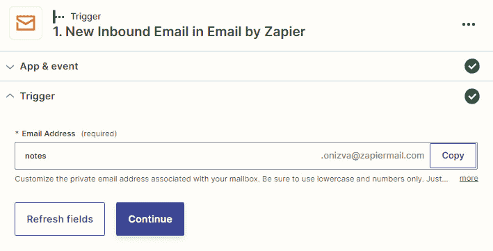

# 第八章：内置通信应用程序

与团队和客户进行沟通是经营任何业务的重要组成部分。利用我们可用的数字通信技术只会帮助使操作更加顺畅和高效。今天存在的大多数公司都使用电子邮件与他们的团队、客户、供应商以及在个人层面上与朋友进行沟通。一些公司将进一步采取措施，使用手机短信进行营销或发送会议自动提醒等。市场上有许多电子邮件消息和短信应用程序，其中许多与 Zapier 集成，以便您可以自动化电子邮件和短信处理流程，一些需付费。但是，在不需要保留历史记录的情况下，您可能希望通过电子邮件或短信发送简单的消息，而不会产生额外费用。这就是 Zapier 的四个内置通信应用程序（**SMS**、**Email**、**IMAP**和**SMTP**）发挥作用的地方。

在本章中，我们将介绍四个与通信相关的内置 Zapier 应用程序，描述其功能，并提供如何使用它们的实用技巧。

在本章中，我们将介绍以下主要内容：

+   Zapier 的 SMS - 发送短信

+   Zapier 的电子邮件 - 发送和接收电子邮件

+   Zapier 的 SMTP - 通过邮件服务器发送电子邮件

+   Zapier 的 IMAP - 从邮件服务器检索电子邮件

提示

考虑使用 AI 的魔力来帮助您撰写用于通信 Zaps 的响应。我们将在*第十九章*中更详细地介绍如何使用 AI，*AI* *和自动化*。

一旦您完成了这些主题的学习，您将知道如何发送文本消息和电子邮件，以及如何从邮件服务器发送和接收电子邮件。

# 技术要求

要学习本章内容，您需要访问 Zapier 帐户。要构建多步骤 Zaps，您至少需要订阅 Zapier 入门计划。

# Zapier 的 SMS - 发送短信

使用 Zapier 内置的 SMS 应用程序，您可以通过移动电话蜂窝网络通过**短消息服务**（**SMS**）发送 153 个字符长度的文本消息。此应用程序允许您向您拥有或可以访问的指定英国或美国号码发送有限数量的短信消息。

重要说明

为防止滥用应用程序，Zapier 要求您确认您可以访问您指定的号码。因此，您不能将该应用程序用于大规模营销或向您未经验证的号码发送外部提醒。

Zapier 的 SMS 对于向您有权访问的号码发送内部团队通知或向自己发送提醒非常有用。以下是如何使用 Zapier 的 SMS 应用程序的一些示例：

+   在您的 Shopify 电子商务商店进行销售时收到短信提醒

+   在**Google 日历**会议事件之前收到短信提醒

+   使用 Weather by Zapier 每日获取当天的天气预报的短信

这只是使用 SMS by Zapier 的几种方式；不过，可能性是无限的。

你可以将 SMS by Zapier 应用与我们在*第七章*中介绍的其他 Zapier 内置应用结合使用，如下所示：

+   使用 Filter by Zapier 来指定必须满足什么条件才能发送消息，例如，如果你想要在**WooCommerce**电子商务商店中出售高价值物品时仅收到短信

+   使用 Schedule by Zapier 在特定时间发送短信消息

+   使用 Delay by Zapier 在一定时间后发送短信消息

SMS by Zapier 已包含在你的 Zapier 订阅中，无需额外费用。然而，如果你想向各种号码、国际号码或大量号码发送短信消息，你可能需要尝试与 Zapier 集成的其他应用，如**Twilio**、**TextMagic**或**Voodoo SMS**。

提示

更多灵感和预先构建的模板，你可以查看[`zapier.com/apps/sms/integrations`](https://zapier.com/apps/sms/integrations)上的 SMS by Zapier 内置应用配置页面。

让我们来探索如何设置这个内置应用，以便我们可以开始发送我们的短信通知。

## 设置 SMS by Zapier

一旦你添加了一个操作步骤，并选择了**SMS by Zapier**作为应用程序，第一次使用时将要求你登录 SMS by Zapier。点击**登录到 SMS by Zapier**按钮，一个弹出窗口将出现，要求你验证一个要发送消息的号码，如下所示：

+   `+44`表示英国，`+1`表示美国，但不包括`+`符号）–例如，`4407565901203`。这是启用应用的必填字段。

+   **通过短信或电话进行确认？**：选择是通过短信还是语音电话接收 PIN 代码。这是可选字段，将默认通过短信发送 PIN 代码。

+   **确认 PIN**：使用**发送 PIN**按钮发送 PIN 码。一旦收到，输入到出现的字段中。这是启用应用的必填字段。

如下屏幕截图所示：

图 8.1 – 在 SMS by Zapier 应用中验证电话号码

一旦你验证了你的电话号码，Zapier 将通过短信向你发送确认消息。

提示

你可以向 SMS by Zapier 账户添加多个经过验证的手机号码，就像你可以为特定应用程序添加多个应用程序连接一样，例如 Gmail（允许你发送和接收任何你能够访问和认证的帐户的电子邮件）。这样可以让你向多个手机号发送定制消息。

接下来，我们可以继续编辑**操作**部分并填写以下字段：

+   **发送号码**：从固定号码的下拉列表中选择或选择**随机**。当选择固定号码时，Zapier 将尝试从该号码发送短信；然而，如果不可用，发送将默认为随机号码。不建议选择自定义值，因为这可能导致步骤出错。

+   **消息**：在此字段中添加静态文本、前面步骤的动态数据，或两者的组合。超过 153 个字符的消息将被截断。

使用我们在*第六章*的工作示例，*创建多步骤 Zaps 和使用内置应用程序*，我们可能想要发送短信通知我们，当新交易添加到 Pipedrive 时。我们在以下截图中说明了如何在**消息**字段中使用静态文本和动态数据：

图 8.2 – 自定义发送短信动作事件概述

您可以使用**测试**部分来测试这一步骤，或选择**跳过测试**。

继续添加一个或多个动作步骤到您的 Zap 中。

提示

对于静态消息，您可以在 Microsoft Excel 中使用 `LEN` 公式来检查您的短信包含多少个字符。当使用动态数据时，为了防止消息在超过 153 个字符时被截断，您可以使用 Formatter by Zapier 应用程序来转换文本、日期/时间和数字，以缩短您的数据或以不同的方式显示它。我们将在*第十四章*、*格式化日期和时间*，*第十五章*、*格式化数字*，*第十六章*、*Zapier 中的文本格式函数 – 第一部分*，*第十七章*、*Zapier 中的文本格式函数 – 第二部分*，以及*第十八章*、*Zapier 的实用程序函数*中涵盖使用 Formatter by Zapier 内置应用程序格式化数据。

现在，您应该更好地了解何时以及如何使用 SMS by Zapier 内置应用程序发送短信。

现在，让我们来看看如何使用 Email by Zapier 内置应用程序发送和接收电子邮件。

# Zapier 的电子邮件 – 发送和接收电子邮件

Email by Zapier 允许您通过使用唯一的 `zapiermail.com` 电子邮件地址发送和接收电子邮件，以用作触发器或动作步骤。因此，您无需使用标准电子邮件地址来发送提醒或通知给自己或您的团队，或将信息转发给任何一个您的应用程序，只需使用一个通用的电子邮件地址。

您随后可以发送出站电子邮件，如果您启用了已读回执，当有人打开您发送的电子邮件时就可以触发一个工作流程。您还可以在收到转发到 `zapiermail.com` 地址的电子邮件时触发运行 Zaps。

可用于使用以下触发器和动作事件：

+   **新的入站电子邮件**（触发器）

+   **发送出站电子邮件**（动作）

+   **新阅读** **回执**（触发器）

让我们来一起看看。

## 新的入站邮件触发事件

此触发事件可用于在收到新邮件时启动工作流程。这通过使用独特的`zapiermail.com`电子邮件地址实现，您可以将其用作电子邮件收件人。此触发事件特别适用于与允许您在收到新邮件时创建记录的应用程序一起使用，例如笔记、任务和保存附件。

以下是使用电子邮件 by Zapier 的**新的入站邮件**触发事件的几个示例：

+   将笔记通过电子邮件发送到 Slack 频道

+   通过电子邮件向 Evernote 添加新笔记

+   将新文件附件添加到**Dropbox**或**Google Drive**

让我们来探索如何设置此触发事件。

### 设置新的入站邮件触发事件

一旦将此触发步骤添加到您的工作流程的开始（到**1\. 触发**）并选择**电子邮件 by Zapier**作为应用程序和**新的入站邮件**作为触发事件，您可以编辑**触发器**部分中的**电子邮件地址**字段。此字段允许您自定义与您的邮箱相关联的唯一电子邮件地址。您只能使用小写字母和数字。如果您想将笔记转发到 Evernote，您可以选择为其命名为 notes，例如。

如下截图所示：

图 8.3 – 设置新的入站邮件触发事件的概述

如*图 8**.3*所示，我们独特的邮箱地址将是`notes.6fff9m@zapiermail.com`

然后，您可以点击**继续**以进入**测试**部分，在那里您将被指示向您的唯一电子邮件邮箱发送一封电子邮件。完成后，使用**测试触发器**按钮并检索您的测试数据以在操作步骤中使用。

继续通过使用此触发步骤的数据向您的 Zap 添加一个或多个操作步骤。

现在，您应该可以收到电子邮件并使用**新的入站邮件**触发器事件触发工作流程了

接下来，让我们来看看**发送外发邮件**的操作事件。

## 发送外发邮件的操作事件

类似于 Zapier 内置应用程序中的 SMS by Zapier，使用电子邮件 by Zapier 的**发送外发邮件**操作事件对发送消息、提醒和通知非常有用。您每小时可以发送最多 10 封电子邮件。以下是使用此操作事件的几个示例：

+   接收 Facebook Lead Ad 的新提醒邮件

+   当您的 CRM 中的交易失败或成功时，接收电子邮件通知

+   当您的 Zapier 任务使用达到一定百分比时，接收电子邮件提醒

让我们来探索如何设置此操作步骤。

### 设置发送外发邮件的操作事件

一旦您添加了一个操作步骤，并将**电子邮件 by Zapier**作为应用程序，并将**发送外发电子邮件**作为动作事件，您就可以按照以下方式编辑**操作**部分中的字段：

+   **收件人**：输入最多五个用逗号分隔的电子邮件地址。使用静态文本或前一步骤中的动态值。这是一个必填字段，必须至少有一个值才能运行 Zap。

+   **主题**：使用静态文本或前一步骤中的动态值为电子邮件输入主题。这是一个必填字段，必须至少有一些文本才能运行 Zap。

+   **正文（HTML 或纯文本）**：使用可自定义的**超文本标记语言**（**HTML**）或纯文本输入电子邮件正文。您可以使用静态文本或前一步骤中的动态值。在使用纯文本时，Zapier 将尝试将其转换为基本 HTML，以使其看起来更加舒适；或者，您可以使用免费或付费的 Markdown 编辑工具，如 **Haroopad** ([`pad.haroopress.com/`](http://pad.haroopress.com/)) 或 **HackMD** ([`hackmd.io/`](https://hackmd.io/)) 简单有效地将纯文本转换为 HTML 以进行更多定制。这是一个必填字段，必须至少有一个字符才能运行 Zap。

+   `.``txt` 文件。

+   **发件人姓名**：输入在接收邮件时显示的姓名。您可以使用静态文本或前一步骤中的动态值。

+   **回复地址**：输入收件人可以回复的电子邮件地址。

+   **抄送**：输入最多五个电子邮件地址，用逗号分隔为辅助接收者。使用静态文本或前一步骤中的动态值。

+   **密送**：输入最多五个电子邮件地址，用逗号分隔为盲目次要收件人。使用静态文本或前一步骤中的动态值。

+   **强制换行？**：使用此下拉布尔字段，如果您希望您的邮件带有换行符或间距，则选择**True**值。强制邮件文本使用换行符和间距使邮件文本看起来更好。

+   **启用已读回执？**：使用此下拉布尔字段，如果您希望使用此操作事件发送的邮件被收件人阅读时收到通知，则选择**True**值。您必须将其与**新读取回执**触发事件（我们将在下一节中讨论）和通知操作事件结合使用，例如短信、电子邮件或 Slack 消息，在单独的 Zap 中启用通知发送。

下图显示了以下字段：

图 8.4 – 在 Zapier 应用中设置发送出站邮件操作事件的概述（1）

步骤定制的第二部分如下图所示：

图 8.5 – 在 Zapier 应用中设置发送出站邮件操作事件的概述（2）

然后，您可以使用**测试**部分测试此步骤，或选择**跳过测试**。

提示

如果您希望将电子邮件发送给超过五个收件人，并且希望发送大于 10 MB 的文件，则可以使用其他电子邮件发送应用程序，如 Gmail、Microsoft Outlook、Mandrill 或 SMTP by Zapier。如果使用前面步骤中的动态数据添加了多个收件人，请确保这些值用逗号分隔。您可以使用 Formatter by Zapier 更改此类电子邮件值，以确保它们与**发送出站电子邮件**操作事件一起正常工作。我们将在*第十四章*、*日期和时间格式*，*第十五章*、*数字格式*，*第十六章*、*Zapier 中的文本格式化函数 – 第一部分*，*第十七章*、*Zapier 中的文本格式化函数 – 第二部分* 和 *第十八章*、*Zapier 的* *实用程序函数* 中详细介绍如何使用 Formatter by Zapier 内置应用程序格式化数据。

您现在应该能够使用**发送出站电子邮件**操作事件发送电子邮件消息。接下来，让我们审查**新阅读收据**触发器事件。

## 新收据已阅读触发器事件

此触发器事件可用于在使用**发送出站电子邮件**操作事件发送的电子邮件被打开时启动工作流程（如果**启用已读回执**布尔字段设置为**True**）。如果您希望在邮件被打开时保持警惕，此触发器事件非常有用。

以下是如何使用 Email by Zapier 的**新收据已阅读**触发器事件的几个示例：

+   当邮件已阅读时发送短信消息

+   当邮件已阅读时，更新 Salesforce 中的机会

让我们探索如何设置此触发器事件。

### 设置新阅读收据触发器事件

让我们按照以下步骤设置**新阅读收据**触发器事件：

1.  要使用此触发器事件，您必须设置相应的 Zap，该 Zap 使用**发送出站电子邮件**操作事件，并将**启用已读回执**布尔字段设置为**True**。您可以使用*发送出站电子邮件操作事件*部分中的说明来创建此 Zap。

1.  完成此操作后，请向您的电子邮件地址发送一封测试电子邮件并查看它。这将允许您在*步骤 4*中的相应**新收据已阅读**触发步骤中使用该测试数据。

1.  将此触发步骤添加到您的工作流程开头（到**1\. 触发器**）并选择**Email by Zapier**作为应用程序，**新收据已阅读**作为触发器事件。

1.  接下来，您可以跳过**触发器**部分，因为没有字段可自定义，然后选择**继续**以使用**测试**部分。您可以使用**测试触发器**按钮，并在另一个 Zap 的**发送出站电子邮件**操作步骤中检索静态测试数据或测试数据，就像我们在*步骤 2*中所做的那样。

现在，您可以根据自己的要求添加一个或多个操作步骤到您的 Zap 中，使用此触发步骤的数据。

现在您应该更好地了解了何时以及如何使用**New Read Receipt**触发器事件，以及 Zapier 电子邮件应用程序的其他触发器和动作事件。

小贴士

要获取更多灵感并访问预构建的模板，您可以查看 [`zapier.com/apps/email/integrations`](https://zapier.com/apps/email/integrations) 上的 Zapier 电子邮件内置应用程序配置文件页面。

接下来，让我们来看看如何使用 Zapier 的 SMTP 内置应用程序从邮件服务器发送电子邮件。

# Zapier 的 SMTP – 通过邮��服务器发送电子邮件

维基百科 ([`en.wikipedia.org/wiki/Simple_Mail_Transfer_Protocol`](https://en.wikipedia.org/wiki/Simple_Mail_Transfer_Protocol)) 定义了**Simple Mail Transfer Protocol**（**SMTP**）为“*一种用于电子邮件传输的通信协议*”。简而言之，SMTP 允许电子邮件客户端应用程序发送电子邮件。Zapier 允许您连接到许多常用的邮件客户端应用程序，例如 Gmail 或 Zoho 邮件。然而，您可能可以访问自己的邮件服务器，并希望独立发送电子邮件。您可以使用 Zapier 的 SMTP 来实现这一目的。Zapier 的 SMTP 类似于 Zapier 的电子邮件；然而，您可以发送没有数量、接收者和文件大小限制的电子邮件。

首先，详细说明一下邮件客户端与邮件服务器之间的区别可能会有所帮助。邮件服务器是在计算机服务器上运行的处理电子邮件通信的软件，例如 Microsoft Server Exchange。您可以在这里阅读更多关于邮件服务器的信息：[`en.wikipedia.org/wiki/Comparison_of_mail_servers`](https://en.wikipedia.org/wiki/Comparison_of_mail_servers)。

另一方面，邮件客户端是您用于查看、撰写和发送收发电子邮件的软件程序。您可以在这里查看邮件客户端的比较：[`en.wikipedia.org/wiki/Comparison_of_webmail_providers`](https://en.wikipedia.org/wiki/Comparison_of_webmail_providers)。

要发送和接收电子邮件，您需要同时拥有邮件客户端和邮件服务器。

以下图显示了在设置 Zapier 的 SMTP 应用程序时可能有用的一些常见 SMTP 设置列表：

图 8.6 – 常见的 SMTP 设置（由 Arclab 提供）

您可以从这个来源获取更多细节：[`www.arclab.com/en/kb/email/list-of-smtp-and-imap-servers-mailserver-list.html`](https://www.arclab.com/en/kb/email/list-of-smtp-and-imap-servers-mailserver-list.html)。

以下是如何使用 Zapier 的 SMTP 应用程序的一些示例：

+   在您的电子商务店铺中，当顾客购买产品时发送电子邮件

+   发送电子邮件警报以通知您的 Facebook 页面时间轴上的新帖子

与 Zapier 的短信和 Zapier 电子邮件的**发送外发邮件**动作事件一样，您可以将 Zapier 的 SMTP 与其他 Zapier 内置应用程序结合使用，例如 Zapier 的过滤器、Zapier 的计划和 Zapier 的延迟。

小贴士

欲获取更多灵感和访问预构建模板，您可以查看 SMTP by Zapier 内置应用程序的配置页面，网址为[`zapier.com/apps/smtp/integrations`](https://zapier.com/apps/smtp/integrations)。

让我们探讨如何设置此内置应用程序，以便您可以开始发送邮件。

## 设置 SMTP by Zapier 应用程序

一旦添加了动作步骤并选择了**Zapier 的 SMTP**作为应用程序，您将在第一次使用时被要求登录 SMTP by Zapier。单击**登录**按钮后，将弹出一个弹出窗口，要求您提供详细信息，以便您可以允许访问您的 SMTP by Zapier 帐户，如下所示：

+   **主机**：输入 Zapier 应连接的主机服务器。这是一个必填字段，必须添加有效值才能使 Zap 运行。

+   **电子邮件/用户名**：输入您的 SMTP 登录电子邮件地址或用户名凭据。这是一个必填字段，必须添加有效值才能使 Zap 运行。

+   **密码**：输入您的 SMTP 密码凭据。这是一个必填字段，必须添加有效值才能使 Zap 运行。

+   **使用 TLS？**：使用此布尔字段下拉框选择**是**或**否**以指定是否使用**传输层安全**（**TLS**）发送加密电子邮件。如果不确定，请检查您的电子邮件客户端帐户上是否有此信息。

+   默认将使用`25`。许多 SMTP 服务器通过端口`25`发送邮件。

+   **发件人邮件**：输入要显示为发送方的电子邮件地址。有时，添加此电子邮件地址可能会失败，可能需要定义一个特定的**发件人**地址。

这些选项显示在以下截图中，适用于 Gmail 帐户：

图 8.7 - 设置 SMTP by Zapier 应用程序

一旦单击**是，继续到 SMTP by Zapier**按钮，我们就可以继续编辑**操作**部分并填写字段，如下所示：

+   **发件人姓名**：输入接收电子邮件时将显示的姓名。您可以使用静态文本或前面步骤中的动态值。

+   **发件人邮件**：输入 Zapier 应尝试发送邮件的电子邮件地址。理想情况下，此电子邮件地址应与您的 SMTP 设置中的电子邮件地址匹配。这是一个必填字段，必须至少有一个值才能使 Zap 运行。

+   **回复至**：输入一个特定的电子邮件地址，接收者可以回复邮件，而不是**发件人**的电子邮件。使用静态文本或前面步骤中的动态值。

+   **收件人**：输入一个或多个用逗号分隔的电子邮件地址。使用静态文本或前面步骤中的动态值。这是一个必填字段，必须至少有一个值才能使 Zap 运行。

+   **主题**：使用静态文本或前面步骤中的动态值输入电子邮件的主题。这是一个必填字段，必须至少有一些文本才能使 Zap 运行。

+   **Body**：在纯文本中输入邮件正文。你可以使用静态文本或前面步骤中的动态值。这是一个必填字段，必须有一些字符才能让 Zap 运行。

+   **HTML Body**：在**Body**字段中输入你在邮件正文中使用的 HTML 复制内容。你可以使用静态文本或前面步骤中的动态值。你可以使用免费或付费的 Markdown 编辑工具，比如 Haroopad 或 HackMD，将纯文本简单有效地转换成 HTML，以便进行更多自定义。

+   `.``txt`文件。

选择**继续**后，你可以使用**测试**部分来测试这一步骤，或选择**跳过测试**。

提示

大多数邮件客户端都会有帮助文档，提供有关如何激活 IMAP/POP3/SMTP 设置的更多信息。

现在，你应该对何时何地使用 SMTP by Zapier 应用程序发送电子邮件有了更好的理解。现在，让我们回顾一下如何使用 IMAP by Zapier 内置应用程序从邮件服务器中检索电子邮件。

# IMAP by Zapier – 从邮件服务器检索电子邮件

维基百科（[`en.wikipedia.org/wiki/Internet_Message_Access_Protocol`](https://en.wikipedia.org/wi​ki/Internet_Message_Access_Protocol)）将**Internet Message Access Protocol**（**IMAP**）定义为“*一种由电子邮件客户端使用的因特网标准协议，用于通过 TCP/IP 连接从邮件服务器检索电子邮件*。” IMAP 允许电子邮件客户端应用程序从服务器检索电子邮件。如果你使用的是除 Gmail、Zoho Mail 或 Microsoft Office 365 之外的电子邮件服务器，你可以使用 IMAP by Zapier 从这些邮件服务器中检索电子邮件。例如，这些服务器可能包括 Rackspace、Zimbra 或 Microsoft Exchange Server。

下图显示了一些常见的 IMAP 设置列表，这些设置在设置 IMAP by Zapier 应用程序时会很有用：

图 8.8 – 常见 IMAP 服务器设置（由 Arclab 提供）

你可以从这个来源获取更多详细信息：[`www.arclab.com/en/kb/email/list-of-smtp-and-imap-servers-mailserver-list.html`](https://www.arclab.com/en/kb/email/list-of-smtp-and-imap-servers-mailserver-list.html)。

IMAP by Zapier 内置应用程序可用作触发器，以根据以下触发事件启动工作流程：

+   **新邮件**（触发器）：当收到新邮件时触发

+   **新邮箱**（触发器）：当创建新邮箱时触发

现在，让我们探讨如何开始使用 IMAP by Zapier 应用程序。

## 设置 IMAP by Zapier 应用程序

添加了一个动作步骤并选择了**IMAP by Zapier**作为应用程序后，第一次使用它时，你将被要求登录 IMAP by Zapier。点击**登录**按钮，一个弹出窗口将出现，要求你提供详细信息，以便允许访问你的 IMAP by Zapier 账户，如下所示：

+   **主机**：输入 Zapier 应连接到的主机服务器。这是一个必填字段，必须添加有效值以使 Zap 起作用。

+   **用户名**：输入您的 IMAP 登录用户名凭据。这是一个必填字段，必须添加有效值才能使 Zap 正常工作。

+   **密码**：输入您的 IMAP 密码凭据。这是一个必填字段，必须添加有效值才能使 Zap 正常工作。

+   `143`或`993`从数字（整数）字段下拉菜单中选择。端口号`143`将被用作默认值。

这些选项显示在 Gmail 帐户的下述截图中：

图 8.9- 设置 IMAP by Zapier 应用程序

然后，选择**是，继续到 IMAP by Zapier**按钮以验证连接。

提示

大多数邮件客户端都将有帮助文档，以提供有关如何激活 IMAP/POP3/SMTP 设置的更多信息。检查您的邮件帐户设置中是否允许 IMAP。

**新邮件**和**新邮箱**触发事件在配置上略有不同。接下来我们将介绍这一点，先从**新邮件**触发事件开始。

## 自定义并使用新邮件触发事件

一旦我们已经验证了我们的 IMAP 连接，我们就可以继续编辑**触发**部分并选择要使用的邮箱，如下：

+   **邮箱名称**：来自您的电子邮件帐户的邮箱文件夹或标签将被带入，并且您可以从下拉菜单中选择要使用的邮箱。如果您希望收到所有新邮件的通知，则选择**收件箱**，或者根据您如何归档它们的方式指定文件夹或标签。这是一个必填字段，必须至少有一个值才能使 Zap 运行。

选择**继续**后，您可以使用**测试**部分测试此步骤或**跳过测试**。

以下是您可以使用 IMAP by Zapier**新邮件**触发事件的一些示例：

+   为新的 IMAP 邮件创建新的 Trello 卡

+   发送 Slack 频道消息以获取新的 IMAP 邮件

现在，让我们来看一下**新邮箱**触发事件。

## 自定义新邮箱的触发事件

一旦我们已经验证了我们的 IMAP 连接，我们可以跳过**触发**部分，因为这将在该 IMAP 帐户中创建任何新邮箱时触发。选择**继续**后，您可以使用**测试**部分测试此步骤或选择**跳过测试**。

以下是您可以使用 IMAP by Zapier**新邮箱**触发事件的一些示例：

+   当新的 IMAP 邮箱被创建时，在 Google Sheets 电子表格中添加新行

+   创建当新的 IMAP 邮箱被创建时发送电子邮件

您可以在 Zap 中如何同时使用**新邮件**和**新邮箱**触发事件的许多可能性。

提示

有关更多灵感和访问预构建模板，请查看[Zapier 内置应用程序简介页面](https://zapier.com/apps/imap/integrations)的 IMAP by Zapier。

您现在应该更好地了解何时以及如何使用 IMAP by Zapier 应用程序了。

# 摘要

在本章中，我们帮助您掌握了使用四个与通信相关的 Zapier 内置应用程序的方法。我们介绍了如何使用 SMS by Zapier 发送文本消息作为通知和提醒。接下来，我们讨论了如何使用 Email by Zapier 在收到电子邮件时触发工作流程以及如何发送电子邮件。最后，我们回顾了如何使用 IMAP by Zapier 从邮件服务器检索电子邮件，并使用 SMTP by Zapier 从邮件服务器发送电子邮件。

您现在已经知道如何使用 Zapier 的内置通信应用程序发送短信和电子邮件，以及在收到电子邮件和阅读电子邮件时触发工作流程。

在下一章中，我们将向您介绍 Zapier 内置应用程序的另外一些功能。我们将涵盖特定功能，例如如何从电子邮件中提取数据（使用解析），如何在自动化中使用 RSS 订阅，以及如何将数据编译成摘要。

# 问题

1.  SMS by Zapier 可以用来向多个号码发送短信吗？

1.  使用 SMS by Zapier 可以发送超过 153 个字符的文本消息吗？

1.  在 Email by Zapier 和 SMTP by Zapier 中，您可以使用粗体、嵌入式超链接和斜体格式化电子邮件中的文本吗？
