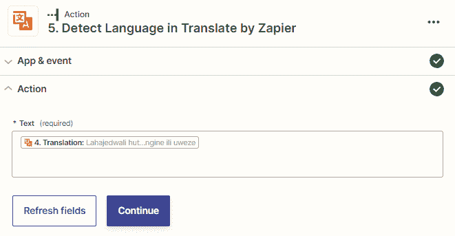
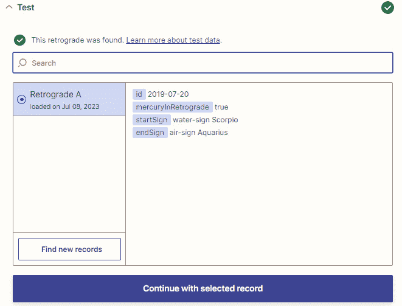

# 第十章：Zapier 的其他有用内置应用程序

在上一章中，我们回顾了三个 Zapier 内置应用程序，以提取和编制数据。在本章中，我们将继续探讨 Zapier 提供的更多内置功能，以及其各种内置应用程序的描述和如何使用它们的实用提示。

首先，我们将探讨如何使用 Zapier Chrome 浏览器扩展（以前称为 Push by Zapier）从互联网上的任何页面启动一次性自动化，以及如何使用 Zapier 的 URL 缩短器缩短 URL。然后，我们将讨论如何使用 Zapier 的 Translate 应用程序翻译不同语言的文本，以及如何使用 Zapier 的 Lead Score 应用程序对潜在客户信息进行评分。最后，我们将介绍如何使用 Zapier 的 Weather 应用程序使用天气情况的数据，以及如何使用 Zapier 的 Retrograde 应用程序使用占星预测。

在本章中，我们将涵盖以下关键内容：

+   Zapier Chrome 浏览器扩展 – 从任何网页触发一次性自动化

+   URL 缩短器 by Zapier – 在您的 Zaps 中缩短 URL

+   由 Zapier 翻译 – 翻译文本

+   Lead Score by Zapier – 对潜在客户信息进行评分和检索

+   Weather by Zapier – 在您的 Zaps 中使用天气情况

+   Retrograde by Zapier – 在您的 Zaps 中使用占星预测

一旦您完成了每个主题的学习，您将知道如何从任何网页启动一次性工作流程，缩短 URL，翻译文本，评分和检索潜在客户信息，并在您的 Zaps 中使用天气情况和占星预测。

# 技术要求

要充分利用本章内容和练习，您需要访问 Zapier 账户。Zapier Starter 计划足以构建多步骤的 Zaps。

# Zapier Chrome 浏览器扩展 – 从任何网页触发一次性自动化

Zapier Chrome 浏览器扩展内置应用程序，以前称为**Push by Zapier**，使用**Google Chrome 扩展**手动触发网页中的一次性自动化。您可以以数百甚至数千种方式使用此应用程序，为您增加生产力。Zapier Chrome 浏览器扩展内置应用程序可用作工作流程的触发步骤的起始部分，也可以用作操作步骤，如下所示：

+   **新** **推送**（触发）

+   **回复到** **Chrome**（操作）

在 Zaps 中使用 Zapier Chrome 浏览器扩展内置应用程序之前，您必须在浏览器中安装 Google Chrome 扩展。让我们来看看如何将 Google Chrome 扩展添加到浏览器中。

## 在浏览器上设置 Google Chrome 扩展程序

为了使用 Zapier Chrome 浏览器扩展内置应用程序，我们需要在浏览器中安装 Google Chrome 扩展。按照以下步骤安装扩展程序：

1.  从 Google Chrome 浏览器窗口导航到 [`chrome.google.com/webstore/detail/zapier/ngghlnfmdgnpegcmbpgehkbhkhkbkjpj`](https://chrome.google.com/webstore/detail/zapier/ngghlnfmdgnpegcmbpgehkbhkhkbkjpj)，或在 Google 中搜索 `Zapier` `Chrome 扩展`。

1.  点击**添加到 Chrome**按钮。

1.  在弹出窗口中，点击**添加扩展程序**来验证安装。

1.  点击拼图图标，然后在下拉菜单中的 Zapier Chrome 扩展旁边的图钉图标，即可将 Zapier Chrome 扩展固定到您的浏览器视图中，这将确保您可以随时触发工作流。

下一件需要做的事是设置您的工作流程。在您的浏览器中，点击**Zapier Chrome 扩展**图标，以显示一个下拉窗口，其中包含以下选项：

+   **Zaps**：此选项卡显示了一些关于如何使用扩展程序的说明，并链接到一些预构建的 Zap 模板以帮助你开始。点击任何一个将带你进入 Zap 编辑器，以使用该模板。或者，你可以点击**创建 Zap**按钮，在 Zap 编辑器中从头开始创建 Zap。您还将看到与您的 Zapier 帐户关联的电子邮件地址。一旦您构建了一些已启用的 Zapier Chrome 扩展 Zap，它们将显示在列表中，允许您选择其中一个来使用。

+   **操作（测试版）**：此选项卡链接到 Zapier 的**自然语言操作**（**NLA**）AI 功能。您可以点击**登录 NLA**按钮来启用您对 Zapier Chrome 扩展的 NLA 访问权限。我们将在 *第十九章*, *AI* *和自动化* 中更详细地介绍此功能。

现在，让我们探索如何设置触发事件。

## 新的 Push 触发事件。

**新 Push** 触发事件允许你在点击 Zapier Chrome 扩展的按钮时检索活动浏览器标签的标题和 URL 的详细信息，并在指定的自定义字段中添加静态数据，然后你可以在你的操作步骤中使用这些字段。同时，也将检索事件发生的时间。

以下是一些您可以使用从 Google Chrome 浏览器中提取的内容使用 Zapier Chrome 扩展的**新 Push**触发事件的示例：

+   在 Teamwork Projects 中创建新任务，以查看您在浏览互联网时遇到的文章内容。

+   当你收到新邮件时，在 Slack 中发送消息。

+   当你看到可能想与你的听众分享的内容时，将数据添加到 Smartsheet 中的新行中。

让我们使用一个例子来演示如何设置**新 Push**触发事件，例如您可能想要为自己创建一个 Trello 任务来查看收到的邮件，该邮件包含发送者的姓名、电子邮件地址和简短的消息。

### 设置新的 Push 触发事件。

一旦您通过选择 **1\. Trigger** 并将 **Zapier Chrome 扩展** 作为应用程序和 **New Push** 作为触发事件添加了一个触发步骤到您的工作流程的开头，点击 **Continue** 按钮。然后，在 **Trigger** 部分编辑 **Input Fields** 表单，如下所示：

1.  在每个字段中输入一个描述性字段名称。

1.  通过将鼠标悬停在左侧的六点图标上并拖放来重新排列字段顺序。

1.  使用右侧的 **X** 图标删除不必要的字段。

重要提示

**Input Fields** 部分是可选的，您可以在没有手动输入字段的情况下触发您的 Zap。

使用前面描述的示例，如下截图所示：

图 10.1 – 自定义 New Push 触发事件概览

1.  单击 **Continue** 按钮继续。

1.  在 **Trigger** 部分，使用 **Test trigger** 按钮获取一些示例数据以使用并从 Zapier Chrome 扩展触发您的 Zap。然后，您可以向您的 Zap 添加操作步骤，并在完成后打开您的 Zap。

1.  转到 `Untitled Zap`。单击 Zap 的名称以显示字段标签并输入相关详细信息。单击 **Send** 按钮以激活推送。一旦成功，文本将以绿色突出显示，并带有一个绿色的勾号图标。

详细信息屏幕如下截图所示：

图 10.2 – 在浏览器中使用 Zapier Chrome 扩展概述，并使用 New Push 触发事件

您可以通过单击铅笔图标调整您的 Zap。

小贴士

您可以使用您检索到的时间戳数据为您的任务操作步骤添加截止日期。我们将在 *第十四章* 和 *第二十四章* 中更详细地讨论使用和格式化日期和时间，*日期和时间格式化* 和 *增强您的生产力的提示、技巧和最佳实践*。

现在，让我们讨论如何设置操作事件。

## 回复 Chrome 操作事件

**Reply to Chrome** 操作事件允许您从由 **New Push** 触发步骤触发的 Zap 中发送步骤结果回 Chrome 扩展。以下是您可以如何使用 Zapier Chrome 扩展的 **Reply to Chrome** 操作事件将数据从您的 Zap 发送回 Chrome 扩展的几个示例：

+   通过从 Zapier Chrome 扩展触发一个 Zap 来获取明天的天气

+   通过从 Zapier Chrome 扩展触发一个 Zap 来搜索潜在客户的领先分数

+   通过从 Zapier Chrome 扩展触发一个 Zap 来缩短您浏览器中的 URL

让我们使用获取明天天气的示例来演示如何使用 **Reply to Chrome** 操作事件。

### 设置回复 Chrome 操作事件

让我们一起走过如何使用**回复到 Chrome**操作事件的步骤：

1.  从设置一个 Zap 开始，使用**Zapier Chrome 扩展**内置应用的**新推送**触发事件。如果您不需要从浏览器收集任何额外数据，则无需使用**输入字段**部分。

1.  通过选择**操作**步骤或单击**+**图标，添加一个操作步骤。在我们的示例中，操作步骤将包含**获取明天的天气预报**操作事件，位于**Weather by Zapier**内置应用中。您可以阅读有关如何使用 Weather by Zapier 内置应用的更多信息，详情请见*Weather by Zapier – 使用您的 Zap 中的天气条件*部分。

1.  通过选择**操作**步骤或单击**+**图标，添加另一个操作步骤。通过选择应用程序为**Zapier Chrome 扩展**，操作事件为**回复到 Chrome**，然后您可以编辑**操作**部分中的以下字段：

    +   **消息标题**：使用此字段输入静态 URL 值、来自先前步骤的动态值或两者的组合。这是一个必填字段，必须为 Zap 提供一个值才能运行。

    +   **消息详情**：使用此字段输入静态 URL 值、来自先前步骤的动态值或两者的组合。这是一个必填字段，必须为 Zap 提供一个值才能运行。

下面的屏幕截图显示了一个示例：

图 10.3 – 设置 Zapier Chrome 扩展回复到 Chrome 操作事件的概述

1.  单击**继续**按钮。然后，您可以使用**测试操作**按钮测试此步骤，或者单击**跳过测试**以跳过。

1.  单击**发布**按钮以发布和启用您的 Zap，然后转到 Chrome 浏览器，通过单击**发送**按钮触发 Zap。

您的 Zap 和映射步骤的结果将显示在您的 Zapier Chrome 扩展中，如下面的屏幕截图所示：

图 10.4 – 使用 Zapier Chrome 扩展在浏览器中的概述，带有回复到 Chrome 操作事件

接下来，如果需要，您可以继续添加更多操作步骤。

提示

如需更多灵感和访问预构建的模板，您可以查看 Zapier Chrome 扩展内置应用的个人资料页面，网址为[`zapier.com/apps/zapier-chrome-extension/integrations`](https://zapier.com/apps/zapier-chrome-extension/integrations)。

这是一个 Zapier 社区示例，说明了 Zapier Chrome 扩展的使用：[`community.zapier.com/featured-articles-65/the-zapier-google-chrome-extension-trigger-zaps-without-leaving-your-browser-10796`](https://community.zapier.com/featured-articles-65/the-zapier-google-chrome-extension-trigger-zaps-without-leaving-your-browser-10796)。

现在，您应该更好地了解何时以及如何使用 Zapier Chrome 扩展内置应用程序了。

提示

您可以利用 AI 的魔力在您的 Zaps 中运行 AI 动作

使用简单提示的 Zapier Chrome 扩展。我们将在*第十九章*中更详细地介绍 Zapier Chrome 扩展 NLA 和 AI 操作，*AI* *和自动化*。

现在，让我们回顾如何使用 Zapier 的 URL 缩短器内置应用程序来缩短 URL。

# Zapier 的 URL 缩短器 – 在您的 Zaps 中缩短 URL

如果你想要生成长而凌乱的 `zpr.io/` 前缀和唯一的字母数字后缀。这类似于使用**Bitly**生成的缩短网址。

以下是您可以使用 Zapier 的 URL 缩短器应用程序的一些示例：

+   在短信中发送缩短的 URL 或在发布推文到 Twitter 时发送。它们都有文本限制限制。

+   向客户发送一封电子邮件，其中包含指向长 URL 的网页链接。

+   将新博客文章的缩短网址添加到 Airtable 中。

Zapier 的 URL 缩短器只能作为**缩短 URL**操作事件的操作步骤使用。

以下是 Zapier 博客中使用 URL 缩短器的一些示例：[`zapier.com/blog/automate-url-shorteners/`](https://zapier.com/blog/automate-url-shorteners/)。

提示

欲获取更多灵感和访问预构建模板，您可以查看 Zapier 的 URL 缩短器内置应用程序配置页面：[`zapier.com/apps/url-shortener/integrations`](https://zapier.com/apps/url-shortener/integrations)。

让我们探索如何设置和使用此操作事件。

## 设置缩短 URL 操作事件

一旦设置了触发步骤，您就可以使用**缩短 URL**操作事件。

一旦您添加了一个操作步骤，可以通过选择**操作**步骤或点击**+**图标，并选择**Zapier 的 URL 缩短器**作为应用程序和**缩短 URL**作为操作事件，您可以编辑**操作**部分的**URL**字段。使用此字段输入静态 URL 值、前一步骤的动态值或两者的组合。这是一个必填字段，必须为 Zap 运行提供值。

以下是屏幕截图示例：

图 10.5 – 自定义缩短 URL 操作事件概述

点击**继续**按钮。然后您可以使用**操作**部分测试此步骤以生成缩短的 URL。如下屏幕截图所示：

图 10.6 – 使用 Zapier 的 URL 缩短器概述的缩短 URL 结果

在您的**缩短 URL**步骤之后，继续添加一个或多个操作步骤，然后发布您的 Zap。

您现在应该更好地了解何时以及如何使用 URL 缩短器内置应用程序了。

现在，让我们讨论如何使用 Translate by Zapier 内置应用将文本翻译成不同的语言并检测文本中的语言。

# Translate by Zapier – 翻译文本

Translate by Zapier 内置应用允许您将文本翻译成超过 100 种不同的语言。它还可用于检测一组文本中的语言。

以下是您可以使用此应用的几个示例：

+   将从德语翻译成英语的接收到的电子邮件翻译并添加到您的 **客户关系管理**（**CRM**）工具中

+   检测网页上的语言并为您的多语言团队的特定成员提出 **Zendesk** 票务申请

Translate by Zapier 内置应用非常方便，如果您经常使用多种语言工作的话。

这是 Zapier 社区的一个示例，演示了您如何使用 Translate by Zapier：[`community.zapier.com/show-tell-5/small-business-series-translate-by-zapier-22197`](https://community.zapier.com/show-tell-5/small-business-series-translate-by-zapier-22197)。

提示

要获取更多灵感并访问预先构建的模板，您可以查看 Translate by Zapier 内置应用的配置文件页面，网址为[`zapier.com/apps/translate/integrations`](https://zapier.com/apps/translate/integrations)。

此应用只能用作操作步骤。以下操作事件可供使用：

+   **翻译文本**（操作）

+   **检测语言**（操作）

让我们一起来看看每个。

## 翻译文本操作事件

**Translate Text** 操作事件允许您将长达 1000 个字符的单词、短语和网页翻译成超过 100 种语言。

让我们探讨如何设置此操作事件。

### 设置翻译文本操作事件

一旦您设置好触发步骤，就可以使用 **Translate Text** 操作事件。

一旦您添加了一个操作步骤，无论是选择 **操作** 步骤还是单击 **+** 图标，并选择 **Translate by Zapier** 作为应用和 **Translate Text** 作为操作事件，您就可以编辑 **操作** 部分中的字段，如下所示：

+   **源语言**：如果您知道您正在使用的源文本的语言，请从下拉列表中选择一种语言。您还可以将之前步骤中的动态字段映射进来。如果您之前的步骤中已经指定了语言，这很有用——例如，如果您在 Google Sheets 电子表格中或 CRM 中拥有这些数据。您也可以将字段留空，Zapier 将会检测源语言。

+   **文本**：在此字段中，输入您希望翻译的静态文本、映射之前步骤中的动态数据，或者两者的组合。结果中将会对超过 1000 个字符的文本进行修剪。这是一个必填字段，必须为 Zap 设置一个值才能运行。

+   **目标语言**：此字段控制您希望文本翻译成的语言。从下拉列表中选择一种语言或将之前步骤中的动态字段映射进来。这是一个必填字段，必须为 Zap 设置一个值才能运行。

例如，我们可能想将 Zapier 博客文章描述从拉丁文翻译成斯瓦希里文。如下截图所示：

图 10.7 – 自定义翻译文本操作事件概览

点击**继续**按钮。一旦完成此操作，您可以使用**操作**按钮测试此步骤或**跳过测试**。

继续添加一个或多个操作步骤或发布您的 Zap。

现在，让我们讨论如何使用**检测语言**操作事件在文本中检测语言。

## 检测语言操作事件

**检测语言**操作事件允许您在一组文本中检测多达 100 种语言中的一种。

让我们探讨如何设置此操作事件。

### 设置检测语言操作事件

一旦设置了触发步骤，您就可以使用**检测语言**操作事件。

一旦添加了一个操作步骤，无论是选择**操作**步骤还是点击**+**图标，并选择**Translate by Zapier**作为应用程序和**检测语言**作为操作事件，您都可以编辑**操作**部分中的以下字段：

+   **文本**：在此字段中，输入您要翻译的静态文本、映射来自先前步骤的动态数据或二者的组合。这是一个必填字段，必须为 Zap 提供值才能运行。

使用斯瓦希里文的同一文本示例，如下截图所示：

图 10.8 – 自定义检测语言操作事件概览

点击**继续**按钮。一旦完成此操作，您可以使用**测试操作**按钮测试此步骤或**跳过测试**。

结果将显示 Zapier 所假定的语言，并生成一个置信度评分。继续添加一个或多个操作步骤或发布您的 Zap。

现在，您应该更好地理解何时以及如何使用 Zapier 内置的 Translate 应用程序。

接下来，让我们来看看如何使用 Zapier 内置的 Lead Score 应用程序对线索进行评分和检索信息。

# 通过 Zapier 进行线索评分和检索 – 使用邮箱地址收集信息

Zapier 的**Lead Score**内置应用程序允许您使用其电子邮件地址从网络收集关于联系人及其关联公司的信息。搜索还根据各种数据点产生客户适配资格评分。该应用程序使用来自 [MadKudu.com](https://MadKudu.com) 的数据丰富服务的数据，作为独立服务，对于小型企业和初创企业来说可能相当昂贵。使用 Lead Score by Zapier 应用程序，您可以每月免费执行多达 500 次此服务的搜索。但是，如果您可能需要更多的搜索次数，您可以注册付费计划，而不是使用 Lead Score by Zapier，而是使用 [MadKudu.com](http://MadKudu.com) 和 Zapier-**MadKudu**集成。

您希望使用 Lead Score by Zapier 的最常见原因是丰富联系人数据，线索优先级和资格评估，因此使您能够更好地决定首先跟进哪些线索并更好地了解您的联系人。 这将使您能够创建更适用的沟通和更好的体验，适用于您的线索和客户。 Lead Score by Zapier 可以节省您手动搜索此数据的麻烦，并且可以让您访问可能不会显示在您的 CRM 的本机联系人和关联公司搜索数据中的其他数据，例如 Salesforce 或**HubSpot**中显示的数据。

以下是您可以使用 Lead Score by Zapier 内置应用程序的一些示例：

+   如果新线索提交了网络表单，您可能想了解联系人公司的更多细节，例如公司规模和位置

+   当新联系人添加到您的 CRM 时，丰富联系人数据并获得客户资格评分

+   当新订阅者添加到您的电子邮件营销工具**Klaviyo**时，获取联系人的更多个人信息

在您的 Zaps 中使用 Lead Score by Zapier 还有许多其他方法。

提示

若要获取更多灵感并访问预构建的模板，请查看 [`zapier.com/apps/lead-information/integrations`](https://zapier.com/apps/lead-information/integrations) 上的 Lead Score by Zapier 内置应用程序配置文件页面。

Lead Score by Zapier 可以使用**查找人员和公司信息**搜索操作事件作为搜索操作步骤。 让我们看看如何使用此搜索操作事件。

## 查找人员和公司信息搜索操作事件

**查找人员和公司信息**搜索操作事件允许您使用电子邮件地址在 [MadKudu.com](http://MadKudu.com) 上搜索联系人和关联公司的数据。

让我们探索如何设置此搜索操作事件。

### 设置查找人员和公司信息搜索操作事件

一旦设置了触发步骤，您就可以使用**查找人员和公司信息**搜索操作事件。

一旦添加了操作步骤，无论是选择**操作**步骤还是单击**+**图标，并选择**Lead Score by Zapier**作为应用程序以及**查找人员和公司信息**作为操作事件，您都可以编辑**操作**部分中的字段，如下所示：

+   `joe@company.com`。 这是一个必填字段，必须有值才能运行 Zap。

+   **Should this step be considered a “success” when nothing is found?**：使用此布尔字段从下拉菜单中选择 **True** 或 **False**，输入文本，或从前面的步骤插入数据，以便在搜索中未找到任何内容时将此步骤视为“成功”。此字段的默认值为 **False**，如果您希望在此处未找到任何内容时停止 Zap 运行，则应选择此项；这是最常见的用例。这意味着所有后续步骤都将被跳过。如果您希望允许 Zap 继续运行并运行后续步骤，则使用 **True** 选项。然后，通过添加 Filter by Zapier 或 Paths by Zapier 条件逻辑来为您的工作流程添加更多控制，根据搜索是否返回结果来允许这些步骤通过或停止。

例如，我们可能希望检索与 `joebloggs@zapier.com` 电子邮件地址相关的信息。如下截图所示：

图 10.9 – 定制查找个人和公司信息搜索操作事件的概述

单击 **Continue** 按钮。完成后，您可以使用 **Test** 部分来测试此步骤或 **Skip Test**。

以下屏幕截图显示了针对 `joebloggs@zapier.com` 返回的数据示例：

图 10.10 – Lead Score by Zapier 搜索操作检索的数据概述

您可以继续添加一个或多个操作步骤或发布您的 Zap。

搜索结果会生成一系列属性，如下所示：

+   `first_name`, `last_name`, `domain`, `is_student`, `is_personal_email`, `is_spam`, `customer_fit`, `segment`, `score`, `top_signals` 和 `grade_emoji`

+   `name`, `domain`, `location`, `state`, `state_code`, `country`, `country_code`, `employees`, 和 `industry`

提示

当您的软件对 API 调用有限制时，比如您只能在一定周期内创建或更改固定数量的属性，将 **Should this step be considered a “success” when nothing is found?** 的 **True** 选项打开将会很有用，以停止您的 Zap 运行。然后，您可以在下一步中添加筛选条件。

您现在应该更好地了解了何时以及如何使用 Lead Score by Zapier 内置应用。

现在，让我们来了解如何使用 Weather by Zapier 内置应用在您的工作流程中使用天气条件。

# 使用天气条件在您的 Zaps 中的 [Weather by Zapier](https://example.org/weather_by_zapier) - Zapier 天气

内置应用程式 Weather by Zapier 可以让您根据纬度和经度坐标来获取指定地区的天气状况。您可以使用它来获取每日天气通知，并且仅在当天有雨的情况下触发操作（基于 Zapier 时区设置的本地区域）。您还可以搜索指定位置的实时天气状况和明天的天气预报。该应用程序非常适合个人使用，或者如果您和您的团队在户外工作，例如建筑、景观或遛狗行业。Weather by Zapier 与后续步骤中的通知操作（例如发送电子邮件或短信）最搭配使用。

重要提示

Weather by Zapier 应用程式使用您帐户中指定的时区设置执行准确的触发器和搜索操作，请确保已适当调整时区设置。

Weather by Zapier 可以用作触发器和操作步骤，并提供以下事件：

+   **今天会下雨吗**（触发器）

+   **今天的** **预报**（触发器）

+   **获取当前天气**（搜索动作）

+   **获取明天的预报**（搜索动作）

让我们逐一探索如何设置这些内容。

## 降雨判断（Will It Rain Today?）触发事件

当天气预报显示当天将下雨时，Will It Rain Today?触发事件可用于启动工作流。该应用程序会在早上大约 7 点（根据您的时区设置）检查当天的天气预报，只有在有雨的预报情况下触发。

以下是您可以使用**今天会下雨吗**触发事件的几个示例：

+   如果今天会下雨，向自己发送短信

+   如果你的团队在户外工作，如果今天会下雨，请给他们发一封电子邮件。

让我们逐一探索如何设置此触发事件。

### 设置降雨判断（Will It Rain Today?）触发事件

在将此触发步骤添加到您的工作流（作为**1. 触发程序**）并选择 Weather by Zapier 作为应用程序，将 Will It Rain Today?作为触发事件后，您可以选择继续。然后，您可以编辑**触发程序**部分中的字段，如下所示：

+   **纬度**：输入要检查的位置的纬度的十进制值。如果不知道纬度，可以使用[`www.latlong.net/`](https://www.latlong.net/)来找到纬度。这是一个必填字段，Zap 需要填写值才能运行。

+   **经度**：输入要检查的位置的经度的十进制值。如果不知道经度，可以使用[`www.latlong.net/`](https://www.latlong.net/)来找到经度。这是一个必填字段，Zap 需要填写值才能运行。

+   **单位**：此下拉字段允许您选择在**摄氏度**或**华氏度**中显示预报结果。默认为**华氏度**。

以法国巴黎为例，如下截图所示：

图 10.11 - 自定义“今天会下雨吗？”触发事件的概述

然后选择**继续**，在**测试**部分使用**测试触发器**按钮来检索你的测试数据，这样你就可以在操作步骤中使用它。

你可以使用从触发步骤检索到的各种数据，如降水强度和概率、最高和最低温度、风速和紫外线指数。

使用此触发步骤的数据，添加一个或多个操作步骤到你的 Zap。

现在你应该能够使用**今天会下雨吗？**触发事件了。接下来，让我们来看一下**今日天气预报**触发事件。

## 今日天气预报触发事件

**今日天气预报**触发事件可用于启动显示当天天气预报的工作流程。该应用在当地时间约早上 7 点（基于你的时区设置）检查当天的天气预报，并且只有在预报有雨的情况下触发。

这里有一些使用**今日天气预报**触发事件的例子：

+   发送 Slack 频道消息，包含当天的天气预报

+   当天气预报显示将会是晴天时，在 Twitter 上发送一条带有太阳表情的推文（使用 Zapier 进行条件过滤）。

让我们来探讨如何设置这个触发事件。

### 设置今日天气预报触发事件

一旦你将这个触发步骤添加到你的工作流（作为**第 1 步触发器**）的开始处，并选择**Zapier 天气**作为应用程序，**今日天气预报**作为触发事件，你就可以选择**继续**。然后，你可以编辑**触发器**部分的字段，如下所示：

+   **纬度**：输入你想要检查的地点的纬度的十进制值。如果你不知道它，你可以使用[`www.latlong.net/`](https://www.latlong.net/)来找到纬度。这是一个必填字段，Zap 才能运行。

+   **经度**：输入你想要检查的地点的经度的十进制值。如果你不知道它，你可以使用[`www.latlong.net/`](https://www.latlong.net/)来找到经度。这是一个必填字段，Zap 才能运行。

+   **单位**：这个下拉菜单字段允许你选择以**摄氏度**或**华氏度**来显示预报结果。默认是**华氏度**。

然后选择**继续**，在**测试**部分使用**测试触发器**按钮来检索你的测试数据，这样你就可以在操作步骤中使用它。

你可以使用从触发步骤检索到的各种数据，如预报摘要、湿度、降水强度和概率、最高和最低温度、风速和紫外线指数。

使用此触发步骤的数据，添加一个或多个操作步骤到你的 Zap。

现在你应该能够使用**今日天气预报**触发事件了。接下来，让我们来看一下**获取当前天气**搜索动作事件。

## 获取当前天气搜索动作事件

当您需要立即知道天气或某个特定时间的天气时，**Get Current Weather**搜索操作事件是理想的选择。

以下是如何使用**Get Current Weather**搜索操作事件的几个示例：

+   当您要开会时，发送带有天气预报的通知。

+   当您想要在某个时间点检查天气时，而不是使用谷歌搜索时，请使用 Zapier Chrome 扩展程序触发工作流来检查天气并向您发送短信

让我们来探讨如何设置此搜索操作事件。

### 设置 Get Current Weather 搜索操作事件

在设置了触发步骤后，就可以使用**Get Current Weather**搜索操作事件。

一旦您添加了一个动作步骤，通过选择**Action**步骤或点击**+**图标，并选择**Weather by Zapier**作为应用程序和**Get Current Weather**作为操作事件，您可以按照以下步骤编辑**设置动作**部分的字段：

+   **纬度**：输入您要检查的位置的纬度的十进制值。如果不知道，可以使用[`www.latlong.net/`](https://www.latlong.net/)找到纬度。这是一个必填字段，必须为 Zap 提供一个值才能运行。

+   **经度**：输入您要检查的位置的经度的十进制值。如果不知道，可以使用[`www.latlong.net/`](https://www.latlong.net/)找到经度。这是一个必填字段，必须为 Zap 提供一个值才能运行。

+   **单位**：此下拉字段允许您选择以**摄氏度**或**华氏度**显示天气预报结果。默认为**华氏度**。

+   **当未找到任何内容时，此步骤是否应被视为“成功”？**：使用此布尔字段从下拉菜单中选择**True**或**False**，输入文本，或在此步骤被视为“成功”时在此步骤中插入来自先前步骤的数据。此字段的默认值为**False**，如果您希望 Zap 在此处找不到任何内容时停止运行，则应选择此选项；这是最常见的用例。这意味着所有后续步骤将被跳过。当您希望允许 Zap 继续运行并运行后续步骤时，请使用**True**选项。然后，通过添加 Filter by Zapier 或 Paths by Zapier 条件逻辑来为您的工作流程添加更多控制，并允许这些步骤根据搜索是否返回结果来通过或停止。

使用伦敦，英国的示例，如下屏幕截图所示：

图 10.12 – 定制 Get Current Weather 搜索操作事件的概述

点击**Continue**按钮。完成此操作后，您可以使用**Test**部分来测试此步骤或**跳过测试**。

以下屏幕截图显示了一些示例数据的结果：

图 10.13 - 来自“获取当前天气”搜索操作事件检索数据的概述

你可以继续添加一个或多个操作步骤，或者发布你的 Zap。

你现在应该能够使用**获取当前天气**搜索操作事件。接下来，我们将看一下**明天的天气预报**搜索操作事件。

## 明天的天气预报搜索操作事件

**明天的天气预报**搜索操作事件非常适合在你需要知道下一天天气预报时使用。

以下是你可以使用**明天的天气预报**搜索操作事件的一些示例：

+   发送一封带有明天工作列表的邮件给你的团队，以及天气预报

+   使用 Schedule by Zapier 触发自动化，每天下午 5 点检查明天的天气并发送短信给你

让我们来探讨如何设置这个搜索操作事件。

### 设置明天的天气预报搜索操作事件

一旦你设置了触发步骤，你就可以使用**明天的天气预报**搜索操作事件。

一旦你添加了一个操作步骤，要么选择**操作**步骤，要么点击**+**图标，然后选择应用程序为**Weather by Zapier**，操作事件为**明天的天气预报**，你可以编辑**操作**部分中的字段，如下所示：

+   **纬度**：输入你想要检查的位置的纬度的十进制值。如果不知道，可以使用[`www.latlong.net/`](https://www.latlong.net/)找到纬度。这是一个必填字段，Zap 运行时必须有值。

+   **经度**：输入所要检查的位置的经度的十进制值。如果不知道，可以使用[`www.latlong.net/`](https://www.latlong.net/)找到经度。这是一个必填字段，Zap 运行时必须有值。

+   **单位**：这个下拉框可以让你选择以**摄氏度**或**华氏度**显示天气预报结果。默认情况下是**华氏度**。

+   **当没有找到任何内容时，这一步应被视为“成功”吗？**：使用这个布尔字段从下拉菜单中选择**True**或**False**，输入文本，或者从以前的步骤中插入数据，以便如果在搜索中没有找到任何内容，这一步被视为“成功”。这个字段的默认值是**False**，如果希望 Zap 在这一点停止运行，如果没有找到任何内容，则选择这个选项；这是最常见的用法。这意味着所有的后续步骤都将被跳过。如果希望允许 Zap 继续运行并运行后续步骤，则选择**True**选项。然后，通过添加 Filter by Zapier 或 Paths by Zapier 的条件逻辑来为你的工作流程添加更多控制，让那些步骤根据搜索是否返回结果来决定是否通过或停止。

点击**继续**按钮。一旦你这样做了，你可以使用**测试操作**按钮测试这一步，或者选择**跳过测试**。

您可以继续添加一个或多个动作步骤，或者发布您的 Zap。

您现在应该更好地了解何时以及如何使用 Weather by Zapier 应用程序。

小贴士

欲获得更多灵感和访问预先构建的模板，您可以查看[Weather by Zapier](https://zapier.com/apps/weather/integrations)内置应用程序页。接下来，让我们讨论如何使用逆行应用程序来在您的自动化中使用占星预测。

# 逆行应用程序 - 在您的 Zaps 中使用占星预测

您可以使用**Zapier 内置应用程序的逆行**来根据水星逆行的占星预测来触发您的工作流程。您可以选择在水星进入或离开逆行时触发工作流程，或者在水星逆行时每天触发一次工作流程。

小贴士

欲获得更多灵感和访问预先构建的模板，您可以查看[Zapier 内置应用程序页](https://zapier.com/apps/retrograde-by-zapier/integrations)上的逆行应用程序概要页面。

以下是逆行应用程序提供的触发事件选项列表：

+   **水星进入逆行**（触发）：此事件在水星进入逆行时触发一次

+   **水星逆行**（触发）：此事件在水星逆行时每天触发一次

+   **水星离开逆行**（触发）：此事件在水星离开逆行时触发一次

每个触发器的设置方式都相似；然而它们返回的数据略有不同。让我们来探索如何设置和使用这些触发事件。

## 设置逆行应用程序的触发事件

一旦您在工作流程的开始处添加了一个触发步骤（点击**1. 触发**），并选择了**Retrograde by Zapier**作为应用程序，并选择了**水星进入逆行**、**水星在逆行**或**水星离开逆行**作为触发事件，您可以选择**继续**。因为没有需要编辑的字段，在**测试**部分，使用**测试触发**按钮来检索您的测试数据，以便您可以在动作步骤中使用它。

继续添加一个或多个动作步骤，以使用此触发步骤中的数据来构建您的 Zap。

现在，让我们来查看每个触发事件返回的数据类型。

### 检索水星进入逆行触发事件的数据

以下截图显示了**水星进入逆行**触发事件返回的数据示例：

图 10.14 - 水星进入逆行触发事件返回示例数据的概述

接下来，让我们讨论**水星在逆行**触发事件返回的数据类型。

### 水星逆行触发事件返回的数据

以下截图显示了**水星在逆行**触发事件返回的数据示例：

图 10.15 – 水星逆行触发事件返回示例数据概览

接下来，让我们讨论 **水星离开逆行** 触发事件返回的数据类型。

### 水星离开逆行触发事件返回的数据

以下截图显示了 **水星离开逆行** 触发事件返回的数据示例：

图 10.16 – 水星离开逆行触发事件返回示例数据概览

有了这些，您现在应该对何时以及如何使用 Zapier 的逆行应用程序有了更好的了解。

# 概要

在本章中，我们学习了一些 Zapier 的更多内置应用程序。我们涵盖了特定功能，例如如何使用 Zapier Chrome 扩展程序从互联网上的任何页面启动一次性自动化，如何使用 Zapier 的 URL 缩短器缩短 URL，以及如何使用 Zapier 的翻译器翻译和检测来自不同语言的文本。我们还讨论了如何使用 Zapier 的线索评分器检索和评分线索信息，如何使用 Zapier 的天气应用程序使用天气条件数据，以及如何在自动化中使用 Zapier 的逆行应用程序进行占星预测。

在下一章中，您将学习更高级的内置应用程序。我们将回顾如何使用 webhooks 和轮询触发器，进行 API 调用，并在我们的 Zaps 中使用 JavaScript 和 Python 代码，以及如何存储数据。

# 问题

1.  Zapier 内置应用程序中，哪个应用程序允许您从互联网上的任何页面手动触发自动化？

1.  如何使用 Zapier 自动化创建缩短的 URL 链接？

1.  如果您每个月需要执行超过 500 个线索评分搜索，您可以使用什么付费替代品来代替 Zapier 的线索评分器？
