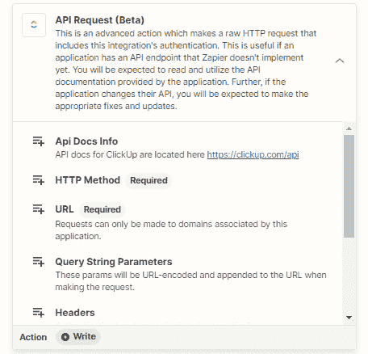
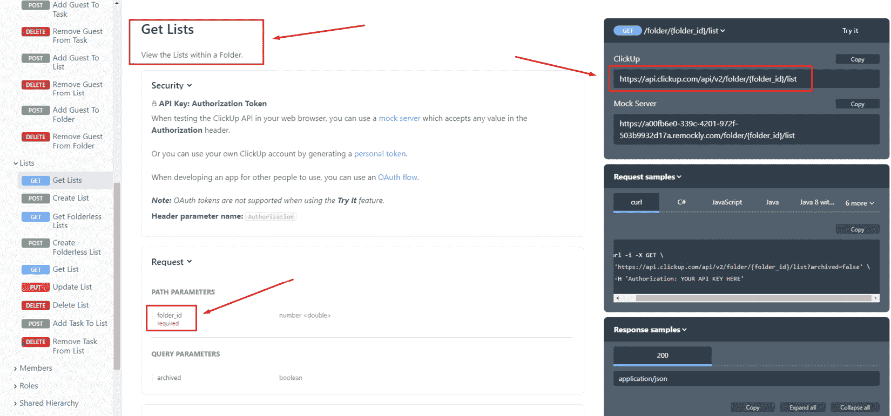
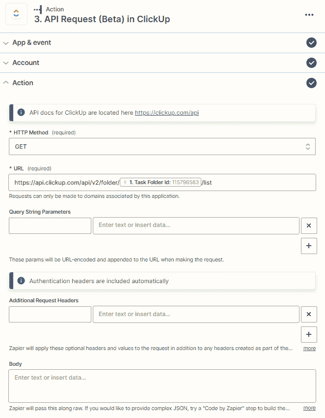
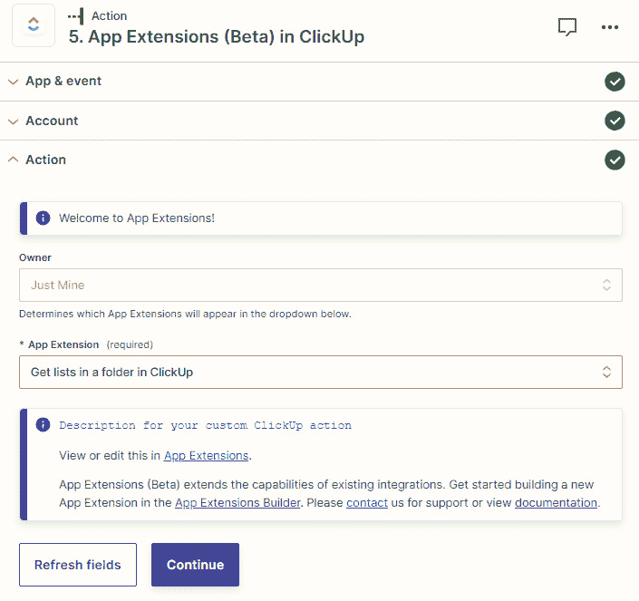
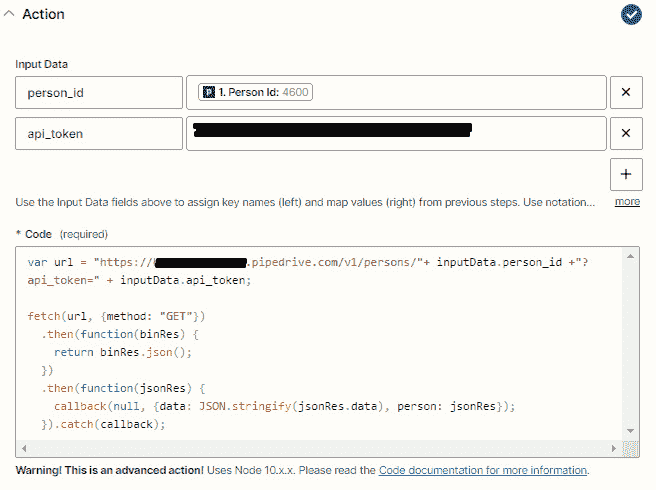
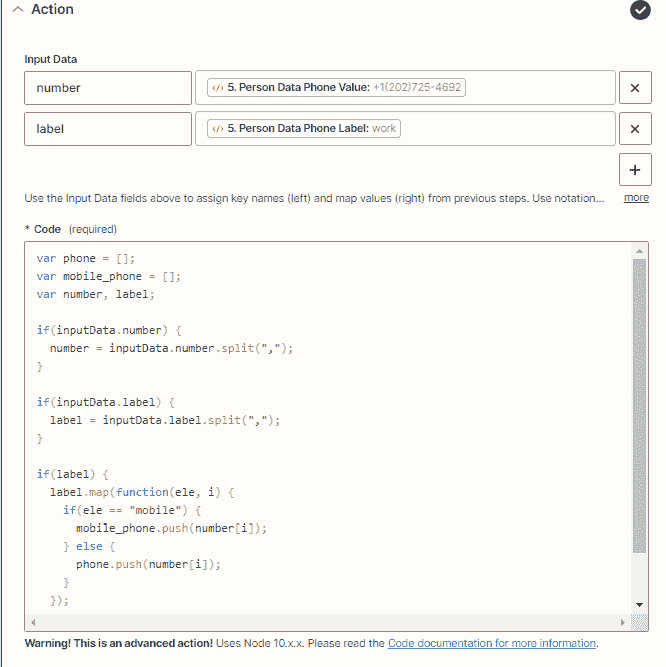
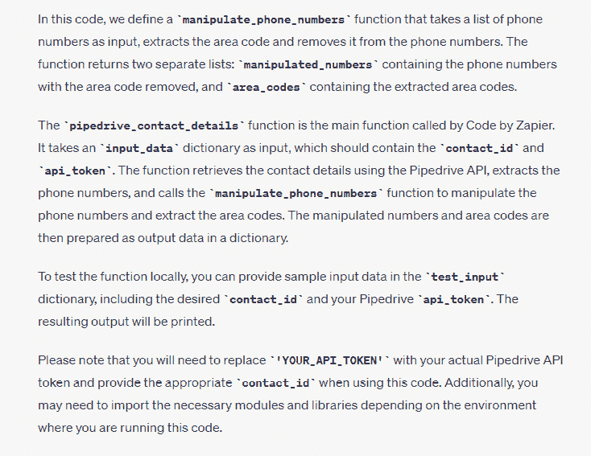
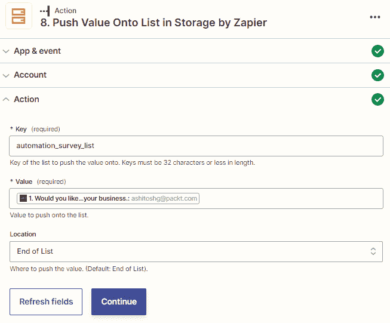

# 11

# Zapier 的高级内置应用

Zapier 的强大之处在于利用内置应用提供的广泛功能，而无需编码。使用这些应用程序，您可以完成各种各样的自动化。然而，您会发现，在使用标准的无代码内置应用功能或使用 Zapier 中的现有集成时，可能会遇到想要使用 Zap 实现的某些功能是不可能的。当发生这种情况时，就是使用 webhooks、代码和 API 请求的时候了，从而为您提供更多的可能性来自动化您的手动和重复性任务。您可以分别使用 Webhooks by Zapier、Code by Zapier 和**API 请求**操作步骤来实现这一点。

还有一个有用的内置应用可用于存储和检索小型数据集时。您可以使用 Storage by Zapier 在每次运行 Zap 时存储参考数据，然后通过检索它与其他 Zap 共享。

在本章中，我们将为您提供有关 Zapier 中更高级的内置应用的概述。这些应用允许您使用 webhooks 和轮询触发器，使用 Webhooks by Zapier 发出 HTTP 请求，在操作步骤中使用经过身份验证的连接进行 API 调用，使用多个 Zap 中的**App 扩展**，在您的 Zap 中使用 JavaScript 或 Python 代码（Code by Zapier），以及存储和检索数据（Storage by Zapier）。我们还将简要介绍如何使用 ChatGPT 为您的 Code by Zapier 步骤生成代码。这些应用和内置功能被 Zapier 归类为**开发者工具**，由于这些是高级主题，我们只会对它们的功能提供一个简要的概述，而不会过多地详细讨论。但是，我们会为您提供一些用例和进一步的参考资料。

对于具有较高技术技能的 Zapier 用户，本章将非常有用。了解 API 使用相关概念，包括阅读 API 文档和使用 Python 和 JavaScript 等编程语言，将会对你有益。然而，我们将涵盖的内容将为非技术用户提供这些内置应用的功能介绍。

我们在本章中将涵盖以下主要内容：

+   了解 API 文档的资源

+   Webhooks by Zapier - 在您的 Zap 中使用 webhooks 和 HTTP 请求

+   使用 API 请求操作步骤（测试功能）

+   在多个 Zap 中使用 App 扩展（测试功能）

+   Code by Zapier - 在您的 Zap 中使用 JavaScript 或 Python 代码

+   Storage by Zapier - 保存和存储数据

在您查看了这些主题之后，您将了解如何在您的 Zap 中使用 webhooks、代码和 API 请求，以及如何保存和存储数据。

# 技术要求

为了充分利用本章内容，你将需要访问 Zapier 账户。Zapier 免费计划将足够使用。你将需要 Zapier 启动计划来创建多步工作流程，并使用 Zapier 内置应用程序中的 Webhooks。

# 理解 API 文档的资源

在*第一章*，*使用 Zapier 进行业务流程自动化的介绍*中，我们介绍了集成是如何从一个应用程序请求数据，在另一个应用程序中产生响应的。信息请求通常以创建新资源、检索现有资源、编辑/更新现有资源或删除现有资源的形式进行。在**超文本传输协议**（**HTTP** - 互联网数据传输的基础）术语中，这些请求被表示为以下方法：

+   **POST**：用于创建新资源

+   **GET**：用于检索现有资源

+   **PUT**：用于编辑或更新现有资源

+   **DELETE**：用于删除现有资源

正如你所知，已经在 Zapier 和其他应用程序之间创建的 API 集成具有特定的触发器、操作和搜索事件，你可以在你的 Zaps 中使用。

尽管在大多数情况下，使用 Zapier 构建的集成覆盖了用户可能需要的最常见请求事件，但通常，应用程序的 API 允许进行更多事件，因此增加了灵活性。如果一个应用程序拥有开放的 API，在大多数情况下将会在 SaaS 提供商的网站上提供有关如何使用 API 的**API 文档**的信息。了解如何阅读和理解 API 文档是了解如何在 Zapier 与每个应用的标准集成之外使用 API 创建自定义触发器和操作的重要先决条件。这是一个庞大的主题，超出了本书的范围。但是，以下是一些有用的资源，将帮助你掌握阅读 API 文档的方法：

+   *理解 API 和 RESTful API 入门课程 [**视频]** ([`www.packtpub.com/product/understanding-apis-and-restful-apis-crash-course-video/9781800564121`](https://www.packtpub.com/product/understanding-apis-and-restful-apis-crash-course-video/9781800564121))

+   *API 文档是什么*？([`blog.hubspot.com/website/api-documentation`](https://blog.hubspot.com/website/api-documentation))

如果你想更深入地了解如何全面理解 API，这个 Zapier 资源将有所帮助：[`zapier.com/resources/guides/apis`](https://zapier.com/resources/guides/apis)。

一旦你查阅了应用的 API 文档，评估了可能的其他事件，那么你就可以使用 webhooks（如果可用）来触发你的 Zaps，使用内置应用程序 Webhooks by Zapier，进行动作步骤和轮询触发的 HTTP 请求，再次使用 Webhooks by Zapier，利用 Zapier 中某些应用程序集成的 API 请求动作步骤（这仍然是测试版功能），并使用 Code by Zapier 来利用这些选项。应用的 API 文档通常也会清楚地说明如何进行身份验证或授权请求以及如何配置它们。

重要提示

如果你在你的 Zaps 中创建了自定义的 HTTP 请求，请记住，如果应用程序更改其 API，这可能会导致你的 Zaps 发生中断或错误，导致它们无法正常工作。你需要相应地调整你的自定义步骤。

接下来，我们将概述如何使用 Webhooks by Zapier 内置应用程序。

# [Zapier 的 Webhooks](https://wiki.example.org/webhooks_by_zapier) - 在你的 Zaps 中使用 webhooks 和 HTTP 请求

首先，重要的是要提到，或许这个内置应用的名字的选择并不正确地描述了它的功能，并且可能会暗示它只与 webhooks 一起使用。**Webhooks by Zapier** 内置应用允许你使用 webhooks 作为即时触发器，创建轮询触发器，并向 API 发送 HTTP 请求。因此，最好根据事件类型将这些用途进行分开。让我们来看看每一个。

## Webhooks by Zapier 触发事件

正如我们在*第一章*中所讨论的那样，*使用 Zapier 进行业务流程自动化的简介*，应用程序中的事件变化可以通过轮询方法或使用 webhooks 来识别，然后导致你的 Zaps 中的触发步骤运行。轮询方法涉及定期检查计划间隔内的新信息。然而，使用 webhooks，则是提供一个 URL，你的起始应用程序会不断监视以获取新事件，因此可以实时接收信息。Webhooks 是一种即时、因此更高效的通信事件信息的方式。这意味着使用 webhooks 触发的 Zaps 比触发步骤使用轮询方法的其他 Zaps 要快得多。

Webhooks by Zapier 内置应用可以用于以下 webhook 和轮询触发事件：

+   **检索轮询**（触发器）：此触发事件会轮询一个 URL 并搜索新条目。此轮询触发器将根据你的 Zapier 订阅计划指定的更新时间周期性地搜索新条目。

+   `POST`、`GET` 或 `PUT` 通知到由 Zapier 提供的 URL。

+   `POST`、`GET` 或 `PUT` 通知到由 Zapier 提供的 URL。这是**捕获钩子**触发事件的更详细版本，并以未解析的数据形式提供请求体。它还包括标题。

**Catch Hook** 和 **Catch Raw Hook** 触发事件都需要您在希望接收事件通知的应用程序中设置 webhook。这些 webhook 将需要指向 Zapier 为这些触发事件提供的 URL。应用程序的 API 文档通常会清楚地说明如何配置、验证或授权新的 webhook 连接。例如，Trello 的 API 文档，包括 webhooks，可以在[`developer.atlassian.com/cloud/trello/guides/rest-api/webhooks/`](https://developer.atlassian.com/cloud/trello/guides/rest-api/webhooks/)找到。

如果您使用的应用程序在 API 中没有可用的 webhook，那么您需要使用**Retrieve Poll**触发事件，使用应用程序 API 文档中指定的端点。

## Zapier 的 Webhooks 动作事件

现在，让我们看看如何使用 Zapier 的 Webhooks 来发出 HTTP 请求。

Zapier 内置应用程序可与以下 HTTP 请求动作事件一起使用：

+   **Custom Request**（操作）：此动作事件通过提供原始数据发送自定义请求

+   **POST**（操作）：此动作事件发送单个请求以创建新资源

+   **GET**（动作）：此动作事件发送单个请求以检索现有资源

+   **PUT**（操作）：此操作事件发送单个请求以更新现有资源

如果您的应用程序或业务工具不支持 Zapier 集成，使用 Zapier 的 Webhooks 特别有用。Zapier 的 Webhooks 允许熟悉您工具的开发人员在不需要理解新 API 文档的情况下在不同工具之间创建请求。例如，当新用户注册以创建免费试用帐户时，您可以创建一个`POST`请求在 CRM 和会计系统中创建新联系人。如果与 Zapier 集成不支持您需要的特定触发器、动作或搜索事件，通过使用 Zapier 内置应用程序进行评估 API 文档是否可能实现总是值得的。

提示

您可以使用 Zapier 内置应用程序中的 Webhooks 来合并一个或多个 Zaps。例如，Zapier 内置应用程序的 Looping 的一个限制是在 Zap 中只能有一个循环。如果在 Zap 中有几条路径，每条路径都需要一个循环，您可以在每条路径的末尾使用 Zapier 的 Webhooks 中的**POST**动作事件将数据推送到不同的循环 Zaps。这将为每个**POST**动作事件指定一个**Catch Hook**触发事件与自定义 URL。

Zapier 已经创建了一些非常有用的帮助文档，以帮助您开始使用 webhooks。您可以在[`zapier.com/help/doc/how-get-started-webhooks-zapier`](https://zapier.com/help/doc/how-get-started-webhooks-zapier)了解有关 webhooks 的更多信息，以及如何在 Zapier 中使用 webhooks 在[`zapier.com/blog/what-are-webhooks/`](https://zapier.com/blog/what-are-webhooks/)

重要说明

Webhooks by Zapier 是一款高级应用程序，只能与 Zapier Starter 计划或更高版本一起使用。

让我们再具体探讨一些使用 Webhooks by Zapier 实现自动化的例子，不受现有的 Zapier 触发器和操作的限制。

## 使用 Webhooks by Zapier 的 Catch Hook 触发器事件的示例

当 ActiveCampaign 记录中联系人的名字仅更改时，你可能希望在 Zapier 中启动一个工作流程。尽管 ActiveCampaign 与 Zapier 集成中存在一个 **更新联系人** 触发器事件，但很难确定名字改变了什么来过滤仅更改了名字的情况。这是一个很好的解决方法：在 ActiveCampaign 中创建一个包含正确条件的触发器的自动化，然后在 Zapier 中的 webhook URL 中发送信息。通过使用 Zapier 中的 **Catch Hook** 触发器事件，你可以生成一个唯一的 webhook URL，然后将其复制并粘贴到 ActiveCampaign 中相应的自动化步骤中。

以下截图显示了在 Webhooks by Zapier 的 **Catch Hook** 触发器事件中会出现什么样的示例：

图 11.1 – Webhooks by Zapier 中使用 Catch Hook 触发器事件的概述

图 11.1 – Webhooks by Zapier 中使用 Catch Hook 触发器事件的概述

以下截图显示了带有 Zapier webhook URL 的 ActiveCampaign 自动化：

图 11.2 – 在 ActiveCampaign 中使用 webhook 步骤指定 webhook URL

图 11.2 – 在 ActiveCampaign 中使用 webhook 步骤指定 webhook URL

让我们看一个涉及操作事件的示例。

## 使用 Webhooks by Zapier 中的 PUT 操作事件的示例

你可能希望在 `PUT` 请求中创建一个新公司以更新公司（[`developers.freshdesk.com/api/#update_company`](https://developers.freshdesk.com/api/#update_company)），这意味着你可以使用 Webhooks by Zapier 通过 **PUT** 操作事件来完成此操作。

以下截图显示了如何设置 Webhooks by Zapier 的 **PUT** 操作事件示例：

图 11.3 – Webhooks by Zapier 中使用 PUT 操作事件的概述

图 11.3 – Webhooks by Zapier 中使用 PUT 操作事件的概述

**Header** 下的 **Authorization** 字段将包含 API 密钥，如 API 文档中所示。

提示

要获取更多启发和访问预构建模板，请查看 Webhooks by Zapier 内置应用程序简介页面：[`zapier.com/apps/webhook/integrations`](https://zapier.com/apps/webhook/integrations)。

现在，你应该更好地了解了何时以及如何使用 Webhooks by Zapier 内置应用程序。

接下来，让我们看一下如何使用 **API 请求 (测试版)** 操作事件。

# 使用 API 请求操作事件（测试版功能）

使用 Zapier 的 Webhooks 可能会看起来相当复杂，特别是如果你不得不解读 API 文档。一个更简单的方法是在整个平台上使用当前处于 Beta 阶段的新功能。Zapier 已经开始升级某些集成，使用`PUT`，`GET`和`POST` HTTP 请求。在许多应用集成中引入这种新的操作事件允许以更简单、无需编码的方式进行 API 请求。与使用 Zapier 的 Webhooks 不同，你已经将应用程序连接到了你的 Zapier 帐户，并且不需要提供任何进一步的身份验证细节，比如 API 密钥。在许多情况下，你可以进行简单的 HTTP 请求，而无需理解复杂的 API 文档术语。你只需要知道如何找到所需的终点 URL 以及哪些请求参数是必不可少的。

在讨论如何使用 Zapier 的 Webhooks 时，我们看了触发器和操作示例。现在，让我们探索如何使用**API 请求（Beta）**操作事件来执行 Zapier 集成中无法进行的搜索操作。

如果你是一个`https://api.clickup.com/api/v2/folder/{folder_id}/list`)，那么你需要实现这个操作。你可以在 URL 中指定`folder_id`，通过使用 API 进行`GET`请求。`folder_id`是请求成功所必要的参数。

以下屏幕截图显示了 ClickUp 集成配置页面上**API 请求（Beta）**操作事件（[`zapier.com/apps/clickup/integrations`](https://zapier.com/apps/clickup/integrations)）：

图 11.4 – 在 ClickUp 集成配置页面上 API 请求操作事件的概述

以下截图显示了 ClickUp API 文档，其中显示了**获取列表**终点的必需参数和 URL：

图 11.5 – 显示了 ClickUp API 文档中的获取列表终点

以下截图显示了如何使用**API 请求（Beta）**操作事件来检索 ClickUp 文件夹中所有列表的详细信息：

图 11.6 – 用于在 ClickUp 文件夹中检索所有列表的**API 请求（Beta）**操作事件的概述

你可以在 Zapier 资源中找到关于如何设置 API 请求操作步骤的更详细说明：[`help.zapier.com/hc/en-us/articles/12899607716493-Set-up-an-API-request-action-Beta`](https://help.zapier.com/hc/en-us/articles/12899607716493-Set-up-an-API-request-action-Beta)。

现在你应该更好地了解了何时以及如何使用**API 请求（Beta）**操作步骤。接下来，让我们回顾一下如何创建和使用**App Extensions**。

# 在多个 Zaps 中使用 App 扩展（Beta 功能）

如果您在几个不同的 Zaps 中使用了相同的**API 请求（测试版）**操作步骤，则通常需要将一个 Zap 中的信息复制到另一个 Zap 中。但是，**应用扩展**操作事件将**API 请求（测试版）**操作事件功能的功能向前推进几步，并允许您在**应用扩展**构建器中创建应用扩展，从而允许您设置可以在多个 Zaps 中使用的 API 调用设置。与**API 请求（测试版）**操作事件一样，**应用扩展（测试版）**操作事件允许您使用已通过认证的应用连接信息，因此您只需创建一个可用于多个 Zaps 的**应用扩展模板**，并在团队中共享，如果您使用的是团队或公司帐户。与**API 请求（测试版）**操作事件一样，**应用扩展（测试版）**操作事件目前仅可用于有限数量的应用。您可以在此处找到支持的应用程序列表：[`help.zapier.com/hc/en-us/articles/16276574838925`](https://help.zapier.com/hc/en-us/articles/16276574838925)。您还需要基本了解如何阅读 API 文档、发送 HTTP 请求以及选择在应用扩展中使用哪个 API 端点。

我们将使用在“使用 API 请求操作事件（测试版功能）”部分讨论的示例来说明使用 API 请求时 GET 请求的差异，通过在 URL 中指定`folder_id`。 `folder_id`是成功请求的必需参数。以下截图显示了`在 ClickUp 文件夹中获取列表`应用扩展来检索 ClickUp 文件夹中所有列表的详细信息：

图 11.7 – 使用应用扩展操作事件概述，检索 ClickUp 文件夹中的所有列表

您可以在 Zapier 资源中找到有关如何设置、编辑和使用应用扩展的更详细说明：

+   [`help.zapier.com/hc/en-us/articles/16277139110157`](https://help.zapier.com/hc/en-us/articles/16277139110157)

+   [`help.zapier.com/hc/en-us/articles/16277147937805`](https://help.zapier.com/hc/en-us/articles/16277147937805)

+   [`help.zapier.com/hc/en-us/articles/16277375114637`](https://help.zapier.com/hc/en-us/articles/16277375114637)

温馨提示

您可以使用 AI 的魔力为您起草应用扩展。我们将在*第十九章*中更详细地介绍由 AI 驱动的应用扩展，*AI* 和自动化。

现在，您应该更好地了解如何何时使用**应用扩展**了。接下来，让我们回顾如何使用内置的 Code by Zapier 应用。

# Code by Zapier – 在您的 Zaps 中使用 JavaScript 或 Python 代码

在您的 Zap 中使用 Webhooks 和 API 请求的下一个步骤是在您无法通过无代码内置应用程序、Webhooks by Zapier 或 API 请求动作步骤实现所需操作时使用代码。您可以使用 JavaScript 或 Python 编程语言编写自定义代码，并在 Code by Zapier 中使用它们以触发工作流程或执行各种任务以转换和定制您的数据。

Code by Zapier 内置应用程序可通过以下触发器和动作事件使用：

+   **运行 JavaScript**（触发器）：此触发器事件允许您使用 JavaScript 启动工作流程

+   **运行 Python**（触发器）：此触发器事件允许您使用 Python 启动工作流程

+   **运行 JavaScript**（动作）：此动作事件允许您在 Zap 中作为动作步骤运行 JavaScript

+   **运行 Python**（动作）：此动作事件允许您在 Zap 中作为动作步骤运行 Python

让我们探讨一个示例，说明何时可以使用 Code by Zapier 在您的自动化中实现更多，并且不受现有 Zapier 触发器、动作和搜索事件的限制。

## 使用 Code by Zapier 的运行 JavaScript 动作事件的示例

一旦触发了您的工作流程，您可能希望检索与 Pipedrive 联系人相关的详细信息，例如联系人关联的所有电话号码。然后，您可能希望操作这些电话号码以提取区号。Pipedrive 与 Zapier 的集成具有一个 **查找联系人** 搜索动作事件，仅允许检索一个电话号码。Pipedrive API 允许请求有关联系人的信息（[`developers.pipedrive.com/docs/api/v1/#!/Persons/getPerson`](https://developers.pipedrive.com/docs/api/v1/#!/Persons/getPerson)），因此您可以使用 Code by Zapier 使用 **运行 JavaScript** 或 **运行 Python** 动作事件来执行此操作。

让我们将其分解为两个步骤。以下截图显示了向 Pipedrive 发送 HTTP 请求以检索人员详情的第一步：

图 11.8 – 在 Code by Zapier 中使用运行 JavaScript 动作事件概述，以检索 Pipedrive 联系人的电话号码

根据 API 文档，在您的 Pipedrive 帐户中的 API 令牌将显示在 `api_token` 字段中，并且您的 Pipedrive 帐户的 URL 将添加到代码中。

接下来的步骤将涉及仅从电话号码中提取区号。如下截图所示：

图 11.9 – 在 Code by Zapier 中使用运行 JavaScript 动作事件概述，以提取电话号码的区号

提示

你可以使用 Code by Zapier 步骤来合并多个操作，这通常需要几个步骤。这可以减少任务使用量。需要注意的是，Zapier 不支持 Code by Zapier 步骤中使用的代码，用户有责任维护代码。例如，如果对 API 或从 API 接收到的数据进行了更改，则可能会“打破”代码步骤。

让我们简要地介绍一下如何使用人工智能来生成用于 Code by Zapier 的代码步骤。

## 使用 ChatGPT 生成 JavaScript 或 Python 代码

随着 OpenAI 的 ChatGPT 的发布，现在您可以要求 AI chatbot 为您生成代码，以在您的 Code by Zapier 步骤中使用。如果您不是程序员，不知道如何编写代码，那么这非常有用。使用我们之前讨论的示例，我们给 ChatGPT 提供了以下提示：

*“我想使用 Code by Zapier 检索有关 Pipedrive 联系人的详细信息，例如与联系人相关的所有电话号码。我还想操纵这些电话号码，从电话号码中提取区号并将这些结果显示为两个单独的值。Pipedrive API 允许请求有关人员的信息，* [*https://developers.pipedrive.com/docs/api/v1/#!/persons/getperson*](https://developers.pipedrive.com/docs/api/v1/#!/persons/getperson)*。请为我编写一些 Python 代码以执行此操作，好吗？”*

结果如下截图所示：

图 11.10-使用 ChatGPT 生成 Python 代码用于 Code by Zapier 步骤的概述

下面的屏幕截图显示了 ChatGPT 生成的附加说明：

图 11.11-ChatGPT 提供的有关如何修改 Code by Zapier 中代码的说明

提示

您可以使用人工智能的魔力，从您的 Code by Zapier 步骤中编写代码。我们将在*第十九章*更详细地介绍由人工智能驱动的 Code by Zapier 步骤。

Zapier 创建了一些非常有用的帮助文档，以帮助您开始使用 Code by Zapier：

+   [`zapier.com/blog/code-by-zapier-guide/`](https://zapier.com/blog/code-by-zapier-guide/)https://help.zapier.com/hc/en-us/articles/8496326417549

+   [`help.zapier.com/hc/en-us/articles/8496197098253-JavaScript-code-examples-in-Zaps`](https://help.zapier.com/hc/en-us/articles/8496197098253-JavaScript-code-examples-in-Zaps)

+   [`help.zapier.com/hc/en-us/articles/8496197130893-Python-code-examples-in-Zaps`](https://help.zapier.com/hc/en-us/articles/8496197130893-Python-code-examples-in-Zaps)

提示

要获取更多灵感并访问预构建的模板，您可以查看 [`zapier.com/apps/code/integrations`](https://zapier.com/apps/code/integrations) 上的 Code by Zapier 内置应用程序配置页面。

现在，您应该更好地了解何时以及如何使用内置的 Code by Zapier 应用程序。

接下来，让我们回顾一下如何使用内置的 Storage by Zapier 应用程序。

# Storage by Zapier – 保存和存储数据

可能有许多场景需要您能够存储小数据集以供工作流使用。内置的 Storage by Zapier 应用程序允许您保存和检索小数据值。使用它，您可以在每次运行 Zap 时存储参考数据，然后通过检索它与其他 Zaps 共享。

Storage by Zapier 不与用户帐户一起使用。相反，您必须指定以 **UUID4** 格式的 **通用唯一标识符**（**UUID4**），它类似于密码，用于识别和分组存储数据的 **秘密存储密钥**。然后，您将使用此秘密存储密钥来标识要从何处添加数据以及从何处检索数据。通过这样做，您可以有多个标识您存储位置的存储密钥。

您可以存储单个值或值列表。如果您想要存储和检索与唯一标识符相关的多个值，您还可以使用 **子值**（数据的嵌套值）–例如，特定联系人的姓名和电子邮件地址。

内置的 Storage by Zapier 应用程序可通过以下操作和搜索操作事件使用：

+   **设置子值**（操作）：此操作事件允许您设置存储在指定键上的一个或多个子值。

+   **设置值**（操作）：此操作事件允许您设置存储在指定键上的值。

+   **增量值**（操作）：此操作事件允许您逐渐在指定键上添加值。

+   **从列表中弹出值**（操作）：此操作事件允许您从值列表中删除一个值。但是，如果列表为空，它将返回您定义的默认值。

+   **将值推送到列表中**（操作）：此操作事件允许您将一个值推送到现有值列表中。

+   **删除所有值**（操作）：此操作事件允许您从连接到 Storage by Zapier 的帐户中删除所有值。

+   **删除子值**（操作）：此操作事件允许您删除存储在指定键上的一个或多个子值。

+   **删除值**（操作）：此操作事件允许您删除存储在指定键上的值或值列表。

+   **设置多个值**（操作）：此操作事件允许您设置存储在指定键上的多个值。

+   **如果设置值**（操作）：此操作事件允许您在存储的值匹配先前定义的值的情况下有条件地设置存储在指定键上的值。

+   **获取子值**（搜索操作）：此搜索操作事件允许您检索存储在指定键上的子值。如果尚未存储任何子值，您还可以创建新的子值。

+   **获取值**（搜索操作）：这个搜索操作事件允许你检索存储在指定键中的值。如果尚未存储任何值，你也可以创建一个新值。

+   **获取所有值**（搜索操作）：这个搜索操作事件允许你检索所有存储的值。

+   **获取列表值**（搜索操作）：这个搜索操作事件允许你检索列表中的所有值，并将输出格式化为一个值。

+   **获取多个值**（搜索操作）：这个搜索操作事件允许你检索存储在指定键中的多个值。

+   **获取秘密**（搜索操作）：这个搜索操作事件允许你将你的秘密存储键检索为一个值，以便在 Code by Zapier 步骤中使用。

重要提示

使用**获取秘密**搜索操作时，请注意这将暴露你的秘钥，应谨慎使用。

以下是如何使用 Storage by Zapier 的几个示例：

+   你可能想要对各种关键绩效指标和分析进行持续汇总，比如一天内有多少个新潜在客户添加到你的 CRM 中，或者你一周内的销售量。你可以使用**增加值**操作事件来将值累积添加到不同的键中，然后在一个单独的 Zap 中使用**删除值**操作事件和 Schedule by Zapier 触发事件来定期清除值（例如，每天或每月）。然后，你可以在诸如 Databox 或 Geckoboard 这样的仪表板报告工具中显示这些值。

+   你可能想要存储每个订阅你的电子邮件列表的新用户的姓名和电子邮件地址。你可以使用**设置子值**操作事件，并将用户 ID 指定为秘密存储键，将姓名和电子邮件地址作为子值。然后，你可以在一个单独的 Zap 中使用**获取子值**搜索操作事件来检索这些值。

以下截图展示了`automation_survey_list`作为列表的键值的示例：

图 11.12 – 使用 Storage by Zapier 向列表添加值的概述

然后，你可以使用**获取值**、**获取所有值**或**获取列表值**搜索操作事件来检索数据，具体取决于你希望如何呈现它。

Zapier 创建了有用的帮助文档，帮助你开始使用 Storage by Zapier，你可以在这里找到：[`help.zapier.com/hc/en-us/articles/8496293271053`](https://help.zapier.com/hc/en-us/articles/8496293271053)。

你也可以通过在工作流程中使用 Code by Zapier 步骤来访问你的存储数据，如在 Zapier 帮助文档中描述的那样：[`help.zapier.com/hc/en-us/articles/8496062115597`](https://help.zapier.com/hc/en-us/articles/8496062115597)。

提示

获取更多灵感和访问预构建模板，你可以查看 Code by Zapier 内置应用程序配置页面：[`zapier.com/apps/storage/integrations`](https://zapier.com/apps/storage/integrations)。

你现在应该更好地了解如何和何时使用 Zapier 内置应用中的 Storage by Zapier。

# 总结

在本章中，我们讨论了三个由 Zapier 开发的高级内置应用和一个新的测试功能。我们首先回顾了使用 Webhooks by Zapier 和进行 HTTP 请求的方法。然后，我们探讨了如何使用**API 请求**动作事件功能（测试版）。接下来，我们介绍了如何使用 JavaScript 或 Python 代码与 Code by Zapier 一起使用，并使用 ChatGPT 生成代码。最后，我们探讨了如何使用 Storage by Zapier 来存储和检索数据。

你现在了解了 Webhooks by Zapier、Code by Zapier 和 Storage by Zapier 内置应用，以及**API 请求**动作事件的用途。

在下一章中，你将学习如何使用两个 Zapier 内置应用来管理你的 Zapier 帐户：App Status by Zapier 和 Zapier Manager。我们将介绍如何使用 App Status by Zapier 来获取集成问题的通知，并回顾 Zapier Manager 的各种触发器、动作和搜索动作事件，以便管理你的 Zapier 帐户中的错误和变更。

# 问题

1.  哪三个内置应用或功能可以用于进行 HTTP 请求？

1.  如果你想要秘密且安全地存储小的数值，你可以使用哪个 Zapier 内置应用？
