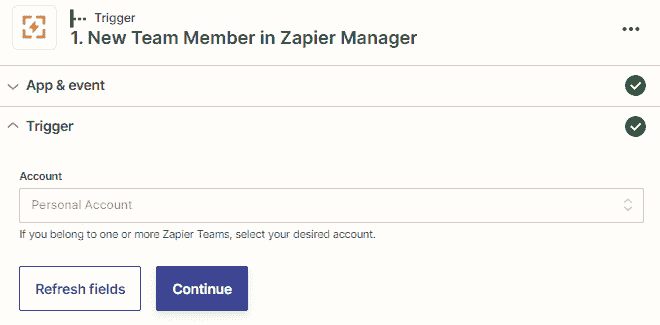

# 第十二章：使用内置应用程序管理您的 Zapier 帐户

一旦您了解了 Zapier 的内部工作原理并创建了几个 Zaps，您将希望知道您的自动化是否在您日常业务中顺利运行。当出现问题时，例如您的连接应用程序经历停机，您的 Zaps 存在错误或您的 Zapier 帐户发生更改时，您也会希望立即得知。幸运的是，Zapier 创建了两个内置应用程序，将帮助您掌握这些情况。通常情况下，当使用这些内置应用程序的触发事件时，您可以使用各种操作步骤作为警报，例如发送电子邮件、短信或 Slack 消息，或将任务或活动添加到您的任务管理应用程序或 CRM 中。

在本章中，我们将讨论两个用于管理您的 Zapier 帐户的内置应用程序。我们将首先介绍 App Status by Zapier，以获取集成问题的通知。然后，我们将介绍 Zapier Manager 用于管理 Zapier 帐户中的问题和更改。最后，我们将涵盖一些使用案例。

本章对于负责管理企业内系统并且需要密切关注系统维护的用户最有用。当团队中的多个用户创建自动化并且专门使用团队和公司计划帐户时，尤其重要，并且通过自动化监控 Zapier 帐户的管理方面是有益的。然而，值得一提的是，即使是单用户帐户所有者也会受益于创建一些警报通知 Zaps，例如与错误和任务使用相关的警报。

在本章中，我们将涵盖以下关键主题：

+   通过 Zapier 的 App Status 获取集成事件通知

+   Zapier 管理员 - 管理错误和帐户更改

+   使用案例

一旦您熟悉了这些主题中的每一个，您将知道如何设置工作流程来管理应用程序集成事故的通知，以及如何管理您的 Zapier 帐户中的错误和更改。

# 技术要求

要充分利用本章内容和练习，您需要访问 Zapier 帐户。 Zapier 的免费计划就足够了。本章中的一些示例涉及多步骤工作流程，因此您将需要 Starter 计划或更高级别的计划。对于 *团队和公司帐户用户管理事件* 部分，您需要使用团队或公司帐户。

# 通过 Zapier 的 App Status 获取集成事件通知

在 *第五章*，*故障排除和处理 Zap 错误* 中，我们讨论了如何通过监视 Zapier **Status** 页面和创建警报工作流程来管理连接应用程序的状态警报。这是我们介绍了由 Zapier 创建的 App Status 内置应用程序的地方。

Zapier 内置应用程序 App Status 只能用作触发步骤，并且可用作**新建或更新的应用事件**触发事件。

这个事件将会从您指定的应用中触发新的、更新的、和解决的应用状态事件。

以下是您可以使用此应用程序的一些示例：

+   当 Mailchimp 有新的、更新的、或解决的事件时发送电子邮件

+   当 **Zoho Campaigns** 和 **Zoho CRM** 有新的事件时，在 **Wrike** 中添加新任务

请参考*第五章*的*使用 App Status by Zapier 内置应用设置应用状态警报工作流*部分，*故障排除和处理 Zap 错误*，以获取如何使用此内置应用程序创建公共应用的新、更新和解决事件的警报通知的详细说明。我们还在该章节讨论了如何在该章节从 Zapier **状态** 页面直接创建预建 Zaps 模板来创建警报 Zaps。

提示

欲获取更多灵感和预建模板，请查看[`zapier.com/apps/app-status/integrations`](https://zapier.com/apps/app-status/integrations)上的 App Status by Zapier 内置应用程序的配置页面。

现在，您应该对何时以及如何使用内置应用程序 App Status by Zapier 有了更好的理解。

接下来，让我们学习如何使用内置应用程序 Zapier 管理器来管理 Zapier 账户中的错误和账户更改。

# Zapier 管理器 – 管理错误和账户更改

我们在*第五章*介绍了 Zapier 管理器内置应用程序，*故障排除和处理 Zap 错误*，在那里我们讨论了如何使用它来管理错误警报，例如 Zaps 的错误，Zaps 被关闭，或者任务被暂停。

您还可以使用 Zapier Manager 来通知您和您的团队有新的公共应用添加到 Zapier, 您账户的更改，例如新文件夹或 Zaps 被创建，任务使用限制被达到，或者新的 Zapier 发票发布。您可以搜索 Zap 或公共应用，以及开启或关闭 Zaps。如果您使用的是团队账户，您可以使用 Zapier Manager 邀请新用户加入您的 Zapier 团队，或者通知有新成员加入您的团队。

提示

欲获取更多灵感和预建模板，请查看[`zapier.com/apps/zapier-manager/integrations`](https://zapier.com/apps/zapier-manager/integrations)上的 Zapier Manager by Zapier 内置应用程序的配置页面。

以下是一个探讨如何使用 Zapier Manager 进行错误警报系统的 Zapier 社区文章: [`community.zapier.com/featured-articles-65/alert-notification-system-for-business-critical-zaps-10800`](https://community.zapier.com/featured-articles-65/alert-notification-system-for-business-critical-zaps-10800)。

Zapier Manager 内置应用程序可用于多个触发、操作和搜索事件，我们已将其分类如下：

1.  管理 Zap 错误和警报：

    +   **新的 Zap 错误**（触发）

    +   **Zap 已关闭**（触发器）

    +   **新任务已暂停**（触发器）

1.  管理应用程序、Zaps 和文件夹：

    +   **新公共应用**（触发器）

    +   **查找应用**（搜索操作）

    +   **新建文件夹**（触发器）

    +   **新建 Zap**（触发器）

    +   **打开/关闭 Zap**（操作）

    +   **查找 Zap**（搜索操作）

    +   **创建 Zap 报告**（**Beta 版**）（操作）

1.  Zapier 账户管理：

    +   **任务使用限制已达到**（触发器）

    +   **新建发票**（触发器）

1.  团队和公司账户用户管理：

    +   **新团队成员**（触发器）

    +   **创建团队邀请**（操作）

让我们依次看看每一个。

## 管理 Zap 错误和警报的事件

在*第五章*，*故障排除和处理 Zap 错误*中，我们讨论了如何使用 Zapier Manager 内置应用程序使用三个触发事件管理错误警报，如下所示：

+   **新的 Zap 错误**（触发器）

+   **Zap 已关闭**（触发器）

+   **新任务已暂停**（触发器）

以下是何时使用这些触发事件的几个示例：

+   **新的 Zap 错误**：当 Zap 中发生错误时，在**Twist**中发布消息

+   **Zap 已关闭**：当 Zap 被关闭时，将任务添加到**Podio**

+   **新任务已暂停**：当任务暂停时，发送短信

在*第五章*，*故障排除和处理 Zap 错误*中，请参阅*使用 Zapier Manager 内置应用程序设置错误警报工作流程*部分，详细说明了如何使用此内置应用程序为 Zap 错误、已关闭的 Zap 或已暂停的任务创建警报。

现在，让我们回顾如何使用各种触发器、操作和搜索操作事件来管理您的 Zapier 账户中的应用程序、Zaps 和文件夹。

## 用于管理应用程序、Zaps 和文件夹的事件

在*第四章*，*管理您的 Zaps*中，我们讨论了如何管理您连接的应用程序，以及充分命名您的 Zaps 并将其分类到文件夹中以保持整洁和有组织的 Zapier 账户的重要性。考虑到这一点，如果您的团队共享 Zapier 账户，您可能想知道何时连接了新的公共应用程序，以及何时创建了新的文件夹和 Zaps。您还可能希望搜索有关应用程序或 Zap 的信息，并在某些场景中打开或关闭 Zap。

用于这些目的的六个 Zapier Manager 内置应用程序触发器、操作和搜索操作事件如下：

+   **新公共应用**（触发器）

+   **查找应用**（搜索操作）

+   **新建文件夹**（触发器）

+   **新建 Zap**（触发器）

+   **打开/关闭 Zap**（操作）

+   **查找 Zap**（搜索操作）

+   **创建 Zap 报告**（**Beta 版**）（操作）

让我们逐个看一下。

### 新公共应用触发事件

**新公共应用**触发事件可用于在 Zapier 宣布与平台集成新的公共应用时启动工作流程。如果您的业务中使用某些尚未与 Zapier 集成的应用程序，则及时了解这些警报非常有用。

以下是您可以使用此触发事件的几个示例：

+   在公布新公共应用程序时发送电子邮件

+   在 Zapier 平台上发布新公共应用程序时发送 Twitter 消息

让我们来探讨如何设置此触发事件。

#### 设置新公共应用程序触发事件

一旦您在工作流程的开始部分添加了此触发步骤（到**1\. 触发**），并选择了**Zapier 管理器**作为应用程序，选择**新公共应用程序**作为触发事件，您可以选择**继续**。然后，您可以编辑**触发器**部分中的**分类**字段。从字母下拉列表中选择您希望触发器触发的应用程序类别。如果您希望收到所有应用程序的通知或指定类别，可以选择**全部**。类别基于您在应用程序生态系统目录中找到的信息：[`zapier.com/apps`](https://zapier.com/apps)。每个字段中添加一个类别；一旦在每个字段中确认了类别，附加字段将出现。通过单击字段末尾的**X**按钮删除任何字段行。您还可以在每个字段中输入静态值。

如下截图所示：

图 12.1 – 自定义新公共应用程序触发事件概述

然后，您可以选择**继续**，在**触发器**部分中使用**测试触发器**按钮检索您的测试数据，以便在您的操作步骤中使用。

触发器提取以下数据，所有这些数据都可以在您的操作步骤中使用：

+   应用程序 ID

+   应用程序标题

+   应用程序描述

+   应用程序站点 URL

+   Zapier 上的应用程序页面 URL

+   列出的类别

继续使用来自此触发步骤的数据添加一个或多个操作步骤到您的 Zap 中。

这是一个 Zapier 社区示例，展示了如何使用**新公共应用程序**操作事件：[`community.zapier.com/featured-articles-65/send-yourself-a-weekly-digest-of-newly-added-zapier-integrations-12489`](https://community.zapier.com/featured-articles-65/send-yourself-a-weekly-digest-of-newly-added-zapier-integrations-12489)。

您现在应该可以使用**新公共应用程序**触发事件。接下来，让我们来看看**查找应用程序**搜索操作事件。

### 查找应用程序搜索操作事件

当您想要检索关于公共应用程序的信息时，**查找应用程序**搜索操作事件非常有用。例如，假设您想要监视应用程序（如**Cascade**）在其所列的类别发生的更改。在这种情况下，您可以设置**按时间表执行**作为每 4 周触发一次的触发器，然后使用**查找应用程序**搜索操作来查找 Cascade 应用程序的相关信息，然后将数据添加到 Google Sheets 电子表格中。

让我们来探讨如何设置此操作事件。

#### 设置查找应用程序搜索操作事件

一旦设置了触发步骤，您可以使用**查找应用程序**搜索操作事件。

一旦添加了操作步骤（通过选择**操作**步骤或单击**+**图标），并且已将**Zapier 管理器**作为应用程序，并将**查找应用程序**作为操作事件，您可以编辑**操作**部分中的字段，如下所示：

+   **名称**：输入应用程序的名称，可以通过键入静态数据、使用**自定义**选项卡从以前的步骤映射动态数据，或两者组合来完成。

+   **当未找到任何内容时，此步骤是否应视为“成功”？**：使用此布尔字段从下拉菜单中选择**是**或**否**，输入文本，或在此步骤中插入来自前面步骤的数据，以便在搜索中未找到内容时将此步骤视为“成功”。此字段的默认值为**否**，如果您希望在没有找到任何内容时停止运行 Zap，则应选择此项；这是最常见的用例。这意味着所有后续步骤将被跳过。如果要允许 Zap 继续运行并运行后续步骤，则使用**是**选项。然后，您可以通过添加 Filter by Zapier 或 Paths by Zapier 条件逻辑来为工作流程添加更多控制，并根据搜索是否返回结果来允许这些步骤通过或停止。

这些显示在以下屏幕截图中：

图 12.2 – 自定义查找应用程序搜索动作事件概览

单击**继续**按钮，然后在**测试**部分，使用**测试**按钮测试此步骤，或者单击**跳过测试**。

继续添加一个或多个操作步骤，然后打开您的 Zap。

您现在应该能够使用**查找应用程序**搜索动作事件。接下来，让我们看看**新文件夹**触发事件。

### 新文件夹触发事件

**新文件夹**触发事件可用于在向您的 Zapier 账户或您有权限访问的其他帐户添加新文件夹时启动工作流程。如果您的团队中有几个人使用同一个账户，并且您想知道何时创建了新文件夹以及它们包含什么 Zaps，或者如果您想要在某个地方记录此信息，则此功能尤其有用。

以下是您可以使用此触发事件的几个示例：

+   创建新文件夹时在 **Chatwork** 中发送群聊消息

+   当创建新文件夹时，向 Google Sheets 电子表格添加新行

让我们探讨如何设置此触发事件。

#### 设置新文件夹触发事件

一旦将此触发器步骤添加到工作流程的开头（对于`Joe Bloggs' Team`。如果您只能访问一个帐户，请选择相关帐户（如果不是团队或公司帐户，则通常由**个人帐户**表示）。您还可以使用**自定义**选项卡然后键入静态值。如果此字段留空，触发器将会为您有权限访问的所有 Zapier 帐户中创建的新文件夹触发。

这在以下屏幕截图中显示：

图 12.3 – 自定义新文件夹触发事件概览

然后你可以选择 **继续**，在 **测试** 部分使用 **测试触发器** 按钮来检索你的测试数据，以便你可以在你的操作步骤中使用它。

触发器提取以下数据，所有这些数据都可以用在你的操作步骤中：

+   文件夹 ID

+   文件夹标题

+   文件夹是否已共享

+   创建文件夹的用户的电子邮件地址

继续添加一个或多个操作步骤到你的 Zap 中，使用这个触发步骤的数据。

现在你应该能够使用 **新文件夹** 触发事件了。接下来，让我们看一下 **新的 Zap** 触发事件。

### 新的 Zap 触发事件

**新的 Zap** 触发事件可用于在将新 Zap 添加到你的 Zapier 帐户或你可以访问的帐户时启动工作流程。与 **新文件夹** 触发事件一样，如果你的团队中有几个人使用同一个帐户，并且你想知道何时创建了新的 Zaps，或者如果你想要在某处记录这些信息，那么这将特别有用。

以下是一些你可以使用此触发事件的示例：

+   在新建 Zap 时发送电子邮件

+   当创建新的 Zap 时，在 **Airtable** 中添加一条新记录

让我们探讨如何设置此触发事件。

#### 设置新的 Zap 触发事件

一旦你在工作流程的开始添加了这个触发步骤（到 **1\. 触发器**）并选择了 **Zapier 管理器** 作为应用程序和 **新的 Zap** 作为触发事件，你就可以选择 **继续**。然后你可以编辑 **触发器** 部分的字段，如下所示：

+   `Joe Bloggs' 团队`。如果你只能访问一个帐户，请选择相关帐户（通常用 **个人帐户** 表示，如果不是团队或公司帐户）。你还可以使用 **自定义** 选项卡来输入一个静态值。如果此字段留空，触发器将会触发你可以访问的所有 Zapier 帐户中创建的新的 Zap。

+   **文件夹**：从下拉列表中选择一个你想要触发器触发的文件夹。你也可以使用 **自定义** 选项卡来输入一个静态值。由于这是一个数字（整数）字段，所以在映射到 **自定义** 选项卡时，你应该使用文件夹 ID 而不是文件夹名称。如果此字段留空，触发器将在创建的所有新 Zap 上触发。

如下截图所示：

图 12.4 – 自定义新 Zap 触发事件概览

然后你可以选择 **继续**，在 **测试** 部分使用 **测试触发器** 按钮来检索你的测试数据，以便你可以在你的操作步骤中使用它。

触发器提取以下数据，所有这些数据都可以用在你的操作步骤中：

+   文件夹根 ID

+   Zap 标题

+   Zap URL

+   Zap 任务历史记录 URL

+   Zap 是否已暂停

+   Zap 是否已打开或关闭（状态）

+   最后编辑 Zap 的用户的电子邮件地址

+   Zap 上次运行的日期和时间

+   Zap 上次暂停的日期和时间

继续使用此触发步骤中的数据添加一个或多个动作步骤到您的 Zap 中。

现在应该能够使用**新建 Zap**触发事件。接下来，让我们来看看**启用/停用 Zap**动作事件。

### 启用/停用 Zap 动作事件

当您想要在特定的触发事件发生时启用或停用 Zap 时，**启用/停用 Zap**动作事件就很有用。例如，关闭一个 Zap 可能会与错误触发事件之一结合使用，例如**新建 Zap 错误**。您可能想要关闭 Zap，然后在您的项目管理工具中创建一个任务，告诉您的团队对问题进行评估。一旦完成了此任务，您可以再次启用 Zap。

以下是一些如何使用此触发事件的示例：

+   当出现 Zap 错误时，关闭 Zap 并在**MeisterTask**中添加一个任务

+   当在 MeisterTask 中完成一个任务时，开启 Zap

让我们来探讨如何设置此动作事件。

#### 设置启用/停用 Zap 动作事件

一旦设置了触发步骤，就可以使用**启用/停用 Zap**动作事件。

一旦添加了一个动作步骤，通过选择**操作**步骤或单击**+**图标，并选择**Zapier 管理器**作为应用程序和**启用/停用 Zap**作为动作事件，您可以编辑**操作**部分中的字段，如下：

+   **所需的 Zap 状态**：从下拉列表中选择要转换 Zap 的状态。选项包括**关闭 Zap**，**开启 Zap**和**切换 Zap 状态**。如果选择**切换 Zap 状态**，则 Zap 的状态会根据其当前状态而改变。例如，如果它是打开的，这个动作事件会把它关闭，反之亦然。您还可以使用**自定义**选项卡输入静态值，使用前面步骤中的动态值，或者使用两者的组合。请注意，如果您使用的是静态或动态值而不是下拉列表，那么该字段的识别值为**关闭 Zap** = **0**，**开启 Zap** = **1**，**切换 Zap 状态** = **2**。这是一个必填字段，并且必须为该步骤赋值才能成功运行。

+   `Joe Bloggs' 团队`。如果您只能访问一个帐户，请选择相关的帐户（通常由**个人帐户**表示，如果不是团队或公司帐户）。您还可以使用**自定义**选项卡输入静态值，使用前面步骤中的动态值，或者使用两者的组合。

+   **文件夹**：从下拉列表中选择一个文件夹。您还可以使用**自定义**选项卡输入静态值，使用前面步骤中的动态值，或者两者的组合。由于这是一个数字（整数）字段，因此在映射到**自定义**选项卡时，应使用文件夹 ID 而不是文件夹名称。

+   **Zap**：从下拉列表中指定一个 Zap。您还可以使用**自定义**选项卡输入静态值，使用前几个步骤中的动态值，或两者结合使用。由于这是一个数字（整数）字段，在映射到**自定义**选项卡时，应使用 Zap ID 而不是 Zap 的名称。这是一个必填字段，步骤才能成功运行。

这些字段显示在以下截图中：

图 12.5 – 自定义打开/关闭操作事件的概览

单击**继续**按钮，然后在**测试**部分中，使用**测试**按钮测试此步骤，或单击**跳过测试**。

继续添加一个或多个操作步骤并启用 Zap。

这里是一个 Zapier 社区的示例，演示了如何使用**打开/关闭 Zap**操作事件：[`community.zapier.com/featured-articles-65/how-to-turn-a-zap-off-and-on-with-a-schedule-11673`](https://community.zapier.com/featured-articles-65/how-to-turn-a-zap-off-and-on-with-a-schedule-11673)。

您现在应该能够使用**打开/关闭 Zap**操作事件。接下来，让我们看看**查找 Zap**搜索操作事件。

### 查找 Zap 搜索操作事件

**查找 Zap**搜索操作事件在您想要检索有关特定 Zap 的信息时非常方便。例如，您可能希望使用此操作事件来监视 Zap 的更改，例如如果 Zap 被移到另一个文件夹中。

以下是您可以使用此搜索操作事件的几个示例：

+   使用 Schedule by Zapier 在特定 Zap 上每周安排一次维护检查，搜索以检索 Zap 上的数据，并将其添加到 Airtable 中的新记录中。

+   当任务中止时，在 Zap 上搜索更多信息并向您的团队发送 Slack 消息

让我们来看看如何设置这个操作事件。

#### 设置查找 Zap 搜索操作事件

一旦设置了触发步骤，您就可以使用**查找 Zap**搜索操作事件。

一旦添加了一个操作步骤（通过选择**操作**步骤或单击**+**图标），并将**Zapier Manager**作为应用程序和**查找 Zap**作为操作事件，您就可以编辑**操作**部分中的字段，如下所示：

+   `Joe Bloggs' Team`。如果您只能访问一个帐户，请选择相关帐户（如果不是团队或公司帐户，则通常表示为**个人帐户**）。您还可以使用**自定义**选项卡输入静态值，使用前几个步骤中的动态值，或两者结合使用。

+   **名称**：通过输入静态数据、使用**自定义**选项卡从前几个步骤中映射动态数据，或两者结合使用来输入 Zap 的名称。这是一个必填字段，步骤才能成功运行。

+   **当没有找到内容时，此步骤是否应被视为“成功”？**：使用此布尔字段从下拉菜单中选择**是**或**否**，输入文本，或从先前步骤中插入数据，如果在搜索中没有找到东西，则此步骤应被视为“成功”。此字段的默认值为**假**，如果您希望在此处找不到东西时停止 Zap 的运行，则选择此值；这是最常见的用例。这意味着所有后续步骤将被跳过。选择**真**选项时，您希望允许 Zap 继续运行，并允许后续步骤运行。然后，通过添加 Filter by Zapier 或 Paths by Zapier 条件逻辑来控制工作流程，并允许这些步骤基于搜索是否返回结果而通过或停止。

这些字段显示在以下截图中：

图 12.6 - 自定义查找 Zap 搜索动作事件的概述

点击**Continue**按钮，在**测试**部分，使用**测试**按钮测试这一步骤，或点击**跳过测试**。

搜索产生以下数据，所有这些数据都可以在进一步的动作步骤中使用：

+   Zap ID

+   Zap 标题

+   Zap URL

+   Zap 历史 URL

+   Zap 是否暂停、打开或关闭，并且配置正确

+   最后编辑 Zap 的用户的电子邮件地址

+   Zap 最后一次活跃和最后一次暂停的时间戳

如果搜索产生了 true 或 false 结果，请继续添加一个或多个动作步骤，然后启动您的 Zap。

现在，您应该能够使用**查找 Zap**搜索动作事件了。接下来，让我们看看**创建 Zap 报告**（**Beta**）动作事件。

### 创建 Zap 报告（Beta）动作事件

**创建 Zap 报告**动作事件，目前仍处于测试阶段，在您希望检索通过 Zap 运行的数据的信息时非常有用。

以下是一些使用此触发事件的示例：

+   当出现 Zap 错误时，运行一个 Zap 报告，并发送一封带有`.csv`文件附件的邮件给自己。

+   每个月运行一个 Zap 报告，提取通过具有高任务量的特定 Zap 传递的所有数据。使用 Schedule by Zapier 触发器事件触发此 Zap，然后为团队成员在 Asana 中创建并分配一个任务来分析数据。

让我们探索如何设置此动作事件。

#### 设置创建 Zap 报告动作事件

一旦设置了触发步骤，您可以使用**创建 Zap 报告**动作事件。

一旦您添加了一个动作步骤，要么选择**动作**步骤，要么点击**+**图标，选择**Zapier 管理器**作为应用程序，**创建 Zap 报告**作为动作事件，您可以编辑**动作**部分中的字段，如下所示：

+   `乔·布洛格斯的团队`。如果只能访问一个帐户，请选择相关帐户（如果不是团队或公司帐户，则通常表示为**个人帐户**）。您还可以使用**自定义**选项卡输入静态值，使用先前步骤的动态值，或者使用组合。

+   **Zap**：从下拉列表中指定一个 Zap。您还可以使用**自定义**选项卡输入静态值，使用先前步骤的动态值或组合。由于这是一个数字（整数）字段，因此在映射到**自定义**选项卡时，您应该使用 Zap ID 而不是 Zap 的名称。这是一个必填字段，必须为步骤成功运行。

这些显示在以下截图中：

图 12.7–自定义创建 Zap 报告（Beta）动作事件的概述

点击**继续**按钮，在**测试**部分，使用**测试**按钮测试此步骤，或点击**跳过测试**。

然后添加一个或多个操作步骤，然后打开您的 Zap。

现在，让我们回顾一下可以用于 Zapier 帐户管理的各种触发事件的使用方法。

## Zapier 帐户管理事件

从管理的角度来看，监视您的帐户以识别何时发生变化或需要紧急关注是很方便的。您可能想知道您目前的计划的任务限制何时将会达到，以便您知道何时升级您的定价计划。这确保了在您意外达到帐户任务限制时，您的自动化服务的连续性可能会受到影响。同样，如果您的团队成员已将您的帐户升级到更高的定价计划，您可能希望在生成新的发票时收到提醒。

可用于此目的的两个内置应用触发事件为 Zapier 管理员如下：

+   **任务使用限制已达**（触发器）

+   **新** **发票**（触发器）

让我们逐个看看。

### 任务使用限制已达触发事件

**任务使用限制已达**触发事件可用于在您的 Zapier 帐户任务使用量达到指定阈值时启动工作流，该阈值可以是百分比或您的 Zapier 定价计划所指定的分配任务数量的任务数。

以下是您可以使用此触发事件的一些示例：

+   如果您的任务使用量已达到限制的 70%，请向自己发送短信

+   如果您的任务使用量达到了 1,000 个任务中的 950 个，请向您的团队发送电子邮件

让我们探讨如何设置这个触发事件。

#### 设置任务使用限制已达触发事件

一旦您在工作流程的开始位置添加了此触发步骤（到**1\. 触发**）并选择了 Zapier 管理员作为应用程序，**任务使用限制已达**作为触发事件，您可以选择**继续**。然后，您可以编辑**触发器**部分中的字段，如下所示：

+   `Joe Bloggs' 团队`。如果您只能访问一个帐户，选择相关帐户（如果不是团队或公司帐户，则通常以**个人帐户**表示）。您还可以使用**自定义**选项卡输入静态值。如果此字段留空，则触发器将针对您可以访问的所有 Zapier 帐户中已达到的任务使用限制触发。

+   **使用阈值（百分比）**：使用此下拉菜单选择范围为 10 到 90 之间的百分比，以 10 的增量指定。您还可以输入静态文本，映射前述步骤中的动态数据（使用**自定义**选项卡），或者两者结合使用。当您的任务使用量达到定价计划中包含的任务的百分比时，触发器将触发。如果您没有指定值，则默认值为 80%。

+   **使用阈值（任务）**：使用此数字字段键入小于您的定价计划中包含的总任务数的数值。当您的任务使用量达到此金额时，触发器将触发。如果您还在**使用阈值（百分比）**字段中指定了百分比，则触发器将在两者中先达到的金额上触发。

这些信息显示在以下截图中：

图 12.8 – 自定义任务使用限制已达到触发事件概览

然后，您可以点击 **继续** 并在 **测试** 部分中使用 **测试触发器** 按钮来检索您的测试数据，以供在操作步骤中使用。

触发器提取以下数据，所有这些数据都可以用在操作步骤中：

+   ID

+   任务计数

+   任务限额

+   百分比

+   到达计费日期之前剩余的时间（和任务数量更新）

进行以下操作，通过使用此触发步骤的数据，为您的 Zap 添加一个或多个操作步骤。

您现在应该能够使用 **任务使用限制已达到** 触发事件。接下来，让我们看看 **新发票** 触发事件。

### 新发票触发事件

**新发票** 触发事件可用于在您的 Zapier 帐户中生成新发票时启动工作流程，或者在您在团队或公司帐户上有访问权限的帐户上生成。如果您希望收到有关任何新的 Zapier 定价计划升级的通知，或者您希望提醒会计团队已生成新发票，则此功能非常有用。

这里有几个示例，您可以使用此触发事件：

+   当生成新发票时发送 Microsoft Teams 消息，从而提醒您有一个定价计划更改

+   当生成新发票时，向您的会计团队发送电子邮件

让我们看看如何设置此触发事件。

#### 设置新发票触发事件

一旦您将此触发步骤添加到您的工作流程的开始（到`Joe Bloggs' Team`），如果您只能访问一个帐户，请选择相关帐户（通常由**个人帐户**表示，如果不是团队或公司帐户）。您也可以使用**自定义**选项卡来输入静态值。如果此字段留空，触发器将对您访问的所有 Zapier 帐户中生成的新发票触发。

这在以下屏幕截图中显示：

图 12.9 – 定制新发票触发器事件概述

然后您可以选择**继续**，在**测试**部分，使用**测试触发器**按钮来检索您的测试数据，以便您可以在您的操作步骤中使用它。

触发器提取以下数据，所有这些数据都可以在您的操作步骤中使用：

+   发票 ID

+   发票创建日期

+   发票金额

+   应付金额

+   发票 URL

继续为您的 Zap 添加一个或多个操作步骤，并使用此触发步骤的数据。

现在，您应该能够使用**新发票**触发事件了。现在，让我们回顾如何使用触发和操作事件来管理团队和公司帐户用户。

## 用于团队和公司帐户用户管理的事件

如果您拥有团队或公司 Zapier 帐户，您肯定希望更容易地监控新用户的添加，并自动创建新用户帐户邀请。可用于此目的的两个内置应用触发事件是：

+   **新团队成员**（触发器）

+   **创建团队** **邀请**（操作）

让我们逐个查看。

### 新团队成员触发事件

当新用户被添加到您的 Zapier 团队帐户时，可以使用**新团队成员**触发器事件来启动工作流程。特别是当您或您的团队成员希望在新团队成员被添加为用户时收到提醒时，这将非常有用。

以下是您可以使用此触发事件的几个示例：

+   当新团队成员被添加时向自己发送短信

+   当新团队成员被添加时向您的团队发送电子邮件

让我们探索如何设置此触发事件。

#### 设置新团队成员触发事件

一旦您将此触发步骤添加到工作流程的开始（到**1. 触发**），并选择**Zap 管理器**作为应用程序，并选择**新团队成员**作为触发事件，您可以选择**继续**。然后，您可以编辑**触发**部分的**帐户**字段。

如果您是多个团队或公司帐户的成员，请使用下拉菜单指定您要接收警报的帐户。这些帐户将以帐户名称表示 - 例如，`Joe Bloggs' Team`。如果您只有一个帐户的访问权限，请选择相关的帐户（如果不是团队或公司帐户，则通常以 **个人帐户** 表示）。您还可以使用 **自定义** 选项卡输入静态值。如果此字段为空，则触发器将对已添加到您可以访问的所有 Zapier 帐户的新用户触发。

下图显示如下：

图 12.10 – 自定义新团队成员触发事件概览

然后，您可以选择 **继续**，在 **测试** 部分使用 **测试触发器** 按钮检索您的测试数据，以便您可以在您的操作步骤中使用它。

触发器提取以下数据，所有这些数据都可以在您的操作步骤中使用：

+   用户 ID

+   用户电子邮件地址

+   用户名

+   团队名称

继续通过使用此触发器步骤中的数据来添加一个或多个操作步骤到您的 Zap。

您现在应该能够使用 **新团队成员** 触发事件了。接下来，让我们来看看 **创建团队邀请** 动作事件。

### 创建团队邀请动作事件

**创建团队邀请**动作事件允许您将一个新用户添加到您的团队或公司 Zapier 帐户中。Zapier 将向用户发送电子邮件邀请，要求他们在 30 天内接受邀请并访问帐户。

使用此动作事件的一个示例是当 ClickUp 中完成新员工入职任务时；您可以向 Zapier 添加一个新用户并向您的团队发送电子邮件。

让我们来探索如何设置此动作事件。

#### 设置创建团队邀请动作事件

当您设置了触发器步骤，并且有要推送到 Zapier 管理器的相关触发器数据后，您可以使用 **创建团队邀请** 动作事件。

一旦您添加了一个操作步骤，无论是选择 **操作** 步骤还是单击 **+** 图标，并且选择了 **Zapier 管理器** 作为应用程序，**创建团队邀请** 作为操作事件，您都可以编辑 **操作** 部分中的字段，如下所示：

+   **受邀邮箱**：通过键入的静态值、来自先前步骤的动态数据（使用 **自定义** 选项卡）或二者的组合来输入电子邮件地址。这是一个必填字段，必须为 Zap 继续提供值。

+   **团队**：如果您是多个团队或公司帐户的成员，请使用下拉菜单指定您要接收警报的帐户。如果您只有一个帐户的访问权限，请选择相关的帐户。您还可以使用 **自定义** 选项卡选择先前步骤中的动态值。

这些在下图中显示：

图 12.11 – 自定义创建团队邀请动作事件的概述

点击**继续**按钮，并在**测试**部分，使用**测试动作**按钮来测试此步骤，或者点击**跳过测试**。

如有需要，继续向您的 Zaps 添加一个或多个操作步骤，然后打开您的 Zap。

您现在应该更好地理解何时以及如何使用**创建团队邀请**动作事件，以及 Zapier Manager 内置应用程序的所有其他触发器、动作和搜索动作事件。

接下来，让我们看看有几种情况可以使用 App Status by Zapier 和 Zapier Manager 来管理您的 Zapier 账户。

# 用例

正如本章前面提到的，设置自动化来管理 Zapier 账户的各个方面最适合的情况是在多个用户访问团队和企业账户的 Zapier，并且许多流程被自动化时。系统管理员会希望掌握账户中发生的情况，监视任务使用情况和错误，并根据特定标准自动采取行动。

最常见的情况涉及使用您喜爱的通知工具，例如电子邮件或 Slack，创建警报以触发 App Status by Zapier 或 Zapier Manager 中的任何触发器事件。对于维护目的，Zap 错误、暂停的任务以及关闭的 Zaps 和应用程序状态警报将是最常见的。但是，如果您在一个团队中，了解另一位团队成员何时创建新文件夹，或者更具体地说，创建新的 Zap，会很有用。然后，您可以执行其他步骤，例如向 Google Sheets 电子表格添加信息。

例如，当达到任务限制的 90%时，将高任务使用 Zaps 关闭将非常方便，此时可使用**启用/禁用 Zap**动作。您可以使用**任务使用量达到限制**触发器启动工作流，并选择要关闭的特定高使用 Zap。然后，在下个月任务使用量刷新时，可以使用**新发票**触发器重新启动工作流。

您可以在[`zapier.com/blog/updates/1594/new-zapier-manager-automate-your-automations`](https://zapier.com/blog/updates/1594/new-zapier-manager-automate-your-automations)和[`community.zapier.com/featured-articles-65/the-zapier-manager-app-what-the-heck-is-it-and-what-can-it-be-used-for-6994`](https://community.zapier.com/featured-articles-65/the-zapier-manager-app-what-the-heck-is-it-and-what-can-it-be-used-for-6994)获取更多灵感。

您现在应该更好地理解何时以及如何使用 App Status by Zapier 和 Zapier Manager 来管理您的 Zapier 账户。

# 总结

在本章中，我们讨论了两个内置应用程序，可用于管理您的 Zapier 账户，这两个应用程序我们都在 *第五章* 中介绍过，*故障排除和处理 Zap 错误*。我们首先回顾了 App Status by Zapier，以获取集成问题的通知；然后，我们介绍了 Zapier Manager 具有用于管理 Zapier 账户中错误和更改的各种触发、操作和搜索操作事件。

现在，您知道如何使用 App Status by Zapier 和 Zapier Manager 来获取有关应用程序集成问题的警报，并管理 Zapier 账户中的问题和更改。

在下一章中，您将学习如何使用 Zapier 内置应用程序和模块的最新版本。我们将介绍如何获取早期发布功能的访问权限，并深入了解 Looping by Zapier、Sub-Zap by Zapier、Web Parser by Zapier、Transfer、Interfaces 和 Tables。

# 问题

1.  如果您想要在 Zap 被关闭后自动重新启动它，哪个 Zapier Manager 内置应用程序的触发和操作事件最适合使用？

1.  哪两个 Zapier 管理器触发事件可用于 Zapier 账户管理工作流自动化？
