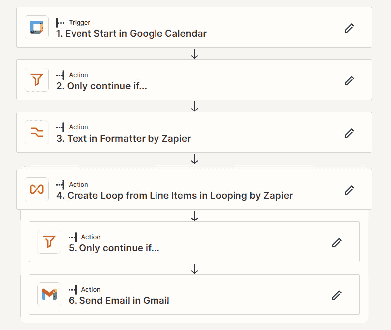

# 第十三章：最新发布的应用程序和功能

在前几章中，我们探索了 Zapier 内置应用程序的广泛范围以及它们用于自动化任务的能力。在本章中，我们将更深入地了解自上一版本（2021 年出版）以来发布的内置 Zapier 应用程序，这些应用程序提供的功能可以进一步增强您的自动化工作流程。在出版时，其中一些仍处于**测试版**用户测试阶段。我们将提供这些功能的描述，并提供有关如何充分利用它们的实用技巧。

首先，我们将介绍如何提前访问新的 Zapier 功能。然后，我们将深入了解 Zapier 的 Looping，这是一个内置应用程序，旨在帮助您处理具有多个值的数据集。接下来，我们将探讨 Zapier 的 Sub-Zap，这是一个模块化自动化的改变者，允许您将复杂的 Zaps 拆分为多个链接组件。然后，我们将深入了解 Zapier 的 Web 解析器，它允许您从网页上抓取数据。接下来，我们将转移到 Zapier 的转移功能，这是 Zapier 用于应用程序之间无缝批量数据传输的功能。然后，我们将探索 Zapier 接口，这是一个动态模块，可以帮助您创建自定义表单、聊天机器人和可视化界面，接着是 Zapier 表格功能，这是 Zapier 用于管理和存储数据的强大解决方案。

Zapier 中的 Looping 和 Sub-Zaps 被归类为**开发者工具**，由于这些是高级话题，我们将只对它们的功能进行简要概述，而不会过多展开。同样，由于 Zapier 接口和 Zapier 表格仍处于测试阶段，其功能可能会发生变化，我们将只对其功能进行简要概述，而不会过多展开。不过，我们将为您提供一些使用案例和进一步的参考资料。

我们将在本章中涵盖以下关键内容：

+   新功能的提前访问

+   Zapier 的 Looping - 使用循环处理数据集

+   Zapier 的 Sub-Zap（测试版功能）- 构建模块化流程

+   Zapier 的 Web 解析器 - 从网页上抓取数据

+   Zapier 的转移功能 - 在应用程序之间移动批量数据

+   Zapier 接口（测试版功能）- 构建自定义表单、聊天机器人和可视化界面

+   Zapier 表格（测试版功能）- 在表格中存储和结构化数据

在本章结束时，您将对自第一版本出版以来发布的内置 Zapier 应用程序和功能有深入的了解。从循环遍历数据集到模块化您的 Zaps，从网页上抓取数据到创建交互式界面，以及在表格中管理数据，您将具备将自动化能力提升到新水平的能力。 

# 技术要求

要充分利用本章内容，您将需要访问 Zapier 帐户。Zapier 入门计划将为您提供必要的功能，以有效地构建和实施多步骤 Zaps，并使用本章讨论的功能。

# 新功能的早期访问

Zapier 团队努力开发将使用户受益的新功能。这些功能首先在 **alpha** 阶段发布给一部分测试用户，然后在足够的测试完成后以分阶段发布给用户群体的 **beta** 阶段。换句话说，即使某个功能可能已经在 beta 版中发布，您可能也无法访问该功能。不过，您可以注册 Zapier 的 **早期访问计划**，以包含在早期用户测试组中。您可以在 [`zapier.com/early-access`](https://zapier.com/early-access) 进行注册。您还可以注册获取有关新 AI 功能发布的通知，网址是 [`zapier.com/ai`](https://zapier.com/ai)。

接下来，让我们深入了解 **Zapier 循环** 内置应用程序的概述。

# Zapier 循环 – 使用循环处理数据集

当您有多个数据集中的项目并且需要针对每个单独项目执行一个或多个操作而不是作为一个整体集合时，**Zapier 循环** 内置应用程序将成为您 Zap 构建工具包中的一个方便工具。此内置应用程序使您能够利用循环功能来遍历数据集，从而可以自动执行批量操作，高效处理大型数据集，并轻松处理复杂的工作流程。下图说明了 Zapier 循环的工作原理：

图 13.1 – Zapier 循环工作原理

以下是几个使用 Zapier 循环会有用的示例：

+   对于您在日历中设置的会议，您将希望在会议开始时间的 1 小时前向每个被邀请者发送个性化的电子邮件，其中包含 Zoom 链接。您可以使用 Zapier 循环遍历列表并向每个参与者发送电子邮件，而不是为每个地址设置单独的电子邮件操作。

+   您收到了一个大量的支持票据信息数据集，并且您需要将其分配给不同的团队成员进行解决。您可以使用 Zapier 循环遍历列表并在 Trello 中创建卡片，其中包含指定的成员和通过 Slack 发送的通知。

使用内置的 Zapier 循环应用程序可以创建包含行项目、数字和文本的数据循环，并具有以下操作事件：

+   **从行项目创建循环**

+   **从数字创建循环**

+   **从文本创建循环**

了解如何在您的 Zaps 中使用行项目将帮助您利用 Zapier 循环内置应用程序的功能。我们将在*第十八章*，*Zapier 实用函数* 的 *操作行项目* 部分介绍行项目。

让我们看看使用 Looping by Zapier 的 Zap 会是什么样子。

## 使用 Looping by Zapier 的从行项目创建循环动作事件的一个例子

我们将使用前文提到的示例，在您的 Google 日历中安排的特定会议中，您希望在会议开始前 1 小时向每位受邀者发送个性化的带有 Zoom 链接的电子邮件。在 Zap 中，将有一个筛选步骤来指定我们希望 Zap 继续运行的会议类型，格式化步骤来从会议描述中提取 Zoom URL，包含进一步筛选以指定哪些受邀者应该收到电子邮件的循环，然后最后是发送电子邮件的步骤。以下屏幕截图显示了这将是什么样子的一个例子：

图 13.2 – 一个包含了 Looping by Zapier 的 Zap 示例

在 Looping by Zapier 行动步骤中，您需要在`Attendees email`地址和`Attendee response`确认下添加一个或多个字段，以便在发送电子邮件和筛选步骤中使用。如下图所示：

图 13.3 – 如何设置 Looping by Zapier 行动步骤的概览

您可以在[`help.zapier.com/hc/en-us/articles/8496106701453`](https://help.zapier.com/hc/en-us/articles/8496106701453)中详细了解如何设置 Looping by Zapier 以及此内置应用的限制。您可以从以下文章中获取有关使用 Looping by Zapier 的详细信息，该文章提供了全面的例子：[`community.zapier.com/featured-articles-65/by-zapier-learn-about-looping-11670`](https://community.zapier.com/featured-articles-65/by-zapier-learn-about-looping-11670)。

提示

欲获取更多灵感并访问预构建模板，您可以查看 Looping by Zapier 内置应用的详细资料页面：[`zapier.com/apps/looping/integrations`](https://zapier.com/apps/looping/integrations)。

您现在对何时如何使用 Looping by Zapier 内置应用应该有了更好的理解。

现在，让我们来看看如何使用**Sub-Zap by Zapier**功能将您的 Zap 拆分成可重复使用的组件。

# Sub-Zap by Zapier（测试版功能）–构建模块化流程

使用**Sub-Zap by Zapier**内置应用，您现在可以将您的 Zap 拆分成称为**Sub-Zaps**的可重复使用的组件。这意味着您可以将您的 Zap 连接到 Sub-Zaps 以在您的起始或父 Zap 之外运行任务。

由于 Sub-Zap by Zapier 目前处于测试阶段并被视为开发者工具，我们将仅提供内置应用的简要概述，然后提供更多详细信息的进一步有用资源。

以下是使用 Sub-Zap by Zapier 有用的一些示例：

+   当您想要使用 Formatter by Zapier 步骤创建可在具有不同触发事件的多个 Zaps 中重复使用的公式时。您可以使用 Sub-Zap by Zapier 调用执行所需步骤并将结果传递给父 Zap 的子 Zap，而不是拥有具有相同步骤的多个 Zaps。您可以在 [`community.zapier.com/featured-articles-65/using-sub-zaps-to-create-reusable-formulas-10326`](https://community.zapier.com/featured-articles-65/using-sub-zaps-to-create-reusable-formulas-10326) 上阅读更多关于此示例的信息。

+   当您想要使用 Webhooks by Zapier 或 API 请求动作事件在主 Zap 之外检索 API 访问令牌时。您可以使用 Sub-Zap by Zapier 来完成此操作。您可以在 [`community.zapier.com/featured-articles-65/an-example-of-using-sub-zaps-by-zapier-to-retrieve-an-access-token-11001`](https://community.zapier.com/featured-articles-65/an-example-of-using-sub-zaps-by-zapier-to-retrieve-an-access-token-11001) 上阅读更多关于此示例的信息。

Sub-Zap by Zapier 内置应用可与以下触发器和动作事件一起使用：

+   **启动子 Zap**（触发器）

+   **从子 Zap 返回**（动作）

+   **调用** **子 Zap**（动作）

这些动作和触发事件必须一起使用才能使您的子 Zap 成功运行。发起的 Zap 必须具有 **调用子 Zap** 动作事件，而您的子 Zap 必须具有 **启动子 Zap** 触发事件以及最终步骤，其中包含 **从子 Zap 返回** 动作事件。父 Zap 的示例如下图所示：

图 13.4 – 包含调用子 Zap 动作步骤的父 Zap 示例

相关的子 Zap 如下截图所示：

图 13.5 – 显示启动子 Zap 触发器和返回子 Zap 动作步骤的子 Zap 示例

您可以在 [`help.zapier.com/hc/en-us/articles/8496308527629-Build-reusable-Sub-Zaps`](https://help.zapier.com/hc/en-us/articles/8496308527629-Build-reusable-Sub-Zaps) 上查看如何创建子 Zap 的简短概述以及 Sub-Zap by Zapier 的限制的进一步详细信息。您可以通过阅读以下文章获得有关使用 Sub-Zaps 的详细示例：[`community.zapier.com/featured-articles-65/by-zapier-sub-zaps-and-how-to-use-them-11497`](https://community.zapier.com/featured-articles-65/by-zapier-sub-zaps-and-how-to-use-them-11497)。

提示

欲获取更多灵感并访问预先构建的模板，您可以查看 [`zapier.com/apps/sub-zap-by-zapier/integrations`](https://zapier.com/apps/sub-zap-by-zapier/integrations) 上的 Sub-Zap by Zapier 内置应用概要页面。

您现在应该更好地了解何时以及如何使用 Sub-Zaps by Zapier 内置应用。

现在，让我们来了解如何使用**Web Parser by Zapier**功能从网页中提取数据。

# Web Parser by Zapier – 从网页中提取数据

Web 解析器应用程序可以灵活地从网站中提取和解析相关数据，并可成为自动化数据收集、研究和监控任务的有价值工具。通过使用内置应用的**Web Parser by Zapier**，您可以自动化工作流程，从多个网站中收集和提取产品详情、定价信息、职位列表、新闻文章等各种信息。这可实现高效的数据比较、汇总和分析，节省时间和精力。它有助于将基于网络的信息无缝集成到更广泛的工作流程中，使组织和个人能够充分利用网络数据的力量，提高效率、决策能力和生产力。

以下是使用 Web Parser by Zapier 会有用的几个示例：

+   在进行竞争对手研究时，您可以使用 Web Parser by Zapier 从不同的电子商务网站中提取产品信息和价格。这使您可以在不需要手动访问每个网站的情况下比较不同网站的价格。

+   如果您正在搜索工作机会，Web Parser by Zapier 可以从职位列表网站中提取职位标题、描述、地点和申请链接。这使您能够自动收集和组织多个来源的工作职位，特别是在工作网站没有警报功能时非常有用。

+   Web Parser by Zapier 可以从网站中提取特定信息，如产品评论、用户评级或客户反馈。这些数据随后可以用于市场调研、情绪分析或其他基于数据的决策过程。

还有许多使用 Web Parser by Zapier 在您的 Zaps 中的方式。

提示

要获取更多灵感并访问预先构建的模板，您可以查看[Zapier 内置应用配置页面](https://zapier.com/apps/web-parser-by-zapier/integrations)上的 Web Parser 应用配置页面。

Web Parser by Zapier 内置应用只能用于**解析网页**操作事件。接下来，让我们探索如何使用这个内置应用和操作事件。

## 设置解析网页操作事件

一旦设置了触发器步骤，您可以使用**解析网页**操作事件。

一旦添加了一个操作步骤，无论是选择**操作**步骤还是点击**+**图标，并选择**Web Parser by Zapier**作为应用和**解析网页**作为操作事件，您可以编辑**设置操作**部分中的字段如下所示：

+   **要解析的 URL**：通过添加静态文本或映射以前步骤中的动态值，或两者结合使用，添加您要从中解析数据的 URL。这是一个必填字段，必须为 Zap 添加一个值来运行。

+   **内容输出格式**：从下拉列表中选择**HTML**、**Markdown**或**Plaintext**。您还可以使用**自定义**选项添加静态文本或从先前步骤中映射动态字段值。

+   **继续失败**：使用此布尔字段从下拉菜单中选择**True**或**False**，输入文本，或者在搜索中找不到任何内容或操作失败时将此步骤视为“成功”。此字段的默认值为**False**，如果希望在找不到任何内容时停止运行 Zap，则应选择此值；这是最常见的用例。这意味着所有依赖步骤将被跳过。如果要允许 Zap 继续运行并运行后续步骤，则选择**True**选项。然后，通过添加 Filter by Zapier 或 Paths by Zapier 条件逻辑，可以为工作流程添加更多控制，并根据搜索是否返回结果来允许这些步骤通过或停止。Filter by Zapier 和 Paths by Zapier 在*第七章*中已涵盖，*入门内置应用*。

让我们以搜索工作网站 Reed 上的客户服务工作机会为例。您可能希望每天上午 9 点使用 Schedule by Zapier 作为触发应用程序，使用 Web Parser by Zapier 解析网站数据，然后更新 Google 表格。您可以开始设置筛选器并复制 URL，例如 [`www.reed.co.uk/jobs/customer-service-jobs?keywords=customer-service&parentsector=customer-service`](https://www.reed.co.uk/jobs/customer-service-jobs?keywords=customer-service&parentsector=customer-service)。如下屏幕截图所示：

图 13.6 - 自定义 Parse Webpage 操作事件

单击**继续**按钮。现在，您可以使用**测试操作**部分测试此步骤，或单击**跳过测试**。

此解析的结果显示在以下屏幕截图中：

图 13.7 - 来自 Parse Webpage 操作步骤的结果

然后，您可以继续添加一个或多个操作步骤，然后发布您的 Zap。

现在，您应该更好地了解何时以及如何使用 Web Parser by Zapier 内置应用程序了。

现在，让我们来看一下如何使用**转移**功能来在应用程序之间批量移动数据。

# 通过 Zapier 进行转移 - 在应用程序之间移动大量数据

有时，批量在您的应用程序之间移动数据很有用。使用**转移**功能，您可以在某些应用程序中执行此操作。**转移**功能是独立的，允许您在应用程序之间批量、按需或定期频率移动数据。换句话说，此功能与您的 Zaps 没有关联。

当您想要执行以下操作时，使用此功能可能会很有用：

+   移动您现有 Zaps 的历史数据

+   创建一次性按需数据转移

+   在开始使用一个或多个新应用程序时移动数据

+   定期安排批量转移

在使用**转移**功能之前，您需要了解以下内容：

+   **频率**：这指定您希望转移运行多少次。这可以设置为**运行一次**或根据**计划**定期运行。

+   **源应用程序**：你想要从中发送数据的应用程序 - 例如，EventBrite。只支持某些应用程序。

+   **源数据**：你想要从**源应用程序**中提取数据的记录类型。例如，在 EventBrite 中，这可以是**参与者**或**事件**。

+   **目标应用程序**：您想要发送数据的应用程序 - 例如，Google Drive。

+   **目标操作**：您希望执行的操作事件，将数据推送到**目标应用程序**，基于该应用程序的现有操作事件。例如，在 Google Drive 中，这可以是**复制文件**或**创建文件夹**。某些应用程序，例如 Shopify，QuickBooks 和 Zendesk，除了该应用程序的标准操作事件外，还支持**创建或更新**操作事件。

您还需要知道您想要从**源应用程序**映射到**目标应用程序**的数据。

提示

所有与 Zapier 集成的应用程序都可以用作目标应用程序。但是，有限的源应用程序和目标应用程序支持**转移**功能中的更新或创建操作事件。您可以在[`help.zapier.com/hc/en-us/articles/8496260754957-Which-apps-does-Transfer-support`](https://help.zapier.com/hc/en-us/articles/8496260754957-Which-apps-does-Transfer-support)中找到当前列表。如果您想要请求将应用程序添加到支持应用程序列表中，可以填写此表单：[`zapier.typeform.com/to/t9z7NNlx`](https://zapier.typeform.com/to/t9z7NNlx)。如果您的应用程序不存在作为源应用程序，那么一个解决方法是将数据添加到 Google 表格中，并将其用作您的源。查看此处的文章以了解更多详细信息：[`community.zapier.com/show-tell-5/use-google-sheets-to-import-existing-data-from-your-apps-12143`](https://community.zapier.com/show-tell-5/use-google-sheets-to-import-existing-data-from-your-apps-12143)。

接下来，让我们深入了解如何使用此功能。

## 在应用程序之间设置转移

一旦您决定了转移的频率、应用程序、记录和操作事件，就按照以下步骤设置您的转移：

1.  通过单击左侧导航菜单中的**转移**链接导航到**转移**仪表板。

1.  在下一个屏幕上，点击**新** **转移**按钮。

1.  在下一个屏幕上，选择一次性转移的**运行一次**按钮，或者定期安排转移的**计划**按钮。

1.  在下一个屏幕上，点击**创建新** **转移**按钮。

1.  在下一个屏幕上，选择您的**源应用程序**，**源数据**，**目标应用程序**和**目标操作**值，然后点击**下一步**按钮。以下是一个示例截图：

图 13.8 - 设置转账功能示例

1.  在下一个屏幕上，选择您想要使用的**源应用程序**帐户，然后点击**下一步**按钮。

1.  对于一些具有分层结构的应用程序，例如数据库，您可能需要指定数据的位置。例如，在 Airtable 中，这可以是**Base**和**Table**，以及**限制视图**。点击**下一步**按钮后，Zapier 将从您选择的应用程序中检索数据。

1.  在下一个屏幕上，选择您想要使用的**目标应用程序**帐户，然后点击**下一步**按钮。

1.  在下一个屏幕上，根据需要映射您**目标应用程序**帐户中的相关字段。

1.  在下一个屏幕上，检查预览以确保所有数据已正确映射。点击**编辑字段**按钮进行更改，或点击**看起来不错**按钮继续。

1.  在下一个屏幕上，如果您选择了预定转账，选择您希望转账运行的频率。您可以选择**每小时**，**每天**，**每周**或**每月**，然后点击**下一步**按钮以选择相应的小时和周或月的日期。

1.  在下一个屏幕上，添加任何过滤器以阻止您的转账运行，除非数据满足某些条件，然后点击**确认计划**，如果是预定转账，或点击**发送数据**，如果是一次性转账。

1.  一旦确认了您的转账，点击**转到我的转账**返回**转账**仪表板，在那里您将看到您的转账列表。

在设置您的转账时，您随时可以点击**重新开始**或**返回**按钮，分别从头开始或返回上一步。

现在，让我们来探讨如何管理转账。

## 管理您的转账

从**转账**仪表板，您将看到每笔转账的情况，所有者是谁，它们何时创建，涉及的应用程序以及它们是**预定**还是**一次性**转账。您可以点击标题编辑转账设置，或点击三个点图标以访问包含以下选项的下拉菜单：

+   **编辑转账设置**：使用此菜单选项编辑您转账的任何部分

+   **详情**：使用此菜单选项查看**详情**屏幕，类似于 Zap 编辑器中的**Zap 详情**菜单项

+   **历史记录**：使用此菜单选项查看**转账历史记录**，类似于 Zap 编辑器中的**Zap 历史记录**菜单项

+   **重命名**：使用此菜单选项重命名您的转账

+   **删除**：使用此菜单选项删除您的转账

以下是一个示例截图：

图 13.9-从 Transfers 仪表板管理您的 transfers

提示

有关可能的问题和注意事项的更多详细信息，请查看此有用的 Zapier 文章，该文章介绍了有关 **Transfers** 功能的内容。链接为：[`help.zapier.com/hc/en-us/articles/8496274335885-Bulk-import-data-into-apps-with-Transfer`](https://help.zapier.com/hc/en-us/articles/8496274335885-Bulk-import-data-into-apps-with-Transfer)。

接下来，让我们看一下如何从 Zap 中转移现有数据。

## 从您的 Zap 中转移现有数据

如果已存在 Zap 具有 **Transfers** 功能支持的触发器，您将能够将现有数据从该 Zap 中转移。您将在 Zap 管理区域中的三个点标志中看到 **转移现有数据** 选项。以下是这个选项的示例截图：

图 13.10-如何从您的 Zap 中转移现有数据

选中此选项后，您将进入 **Transfers** 模块，提示筛选数据，并要求您选择要转移的记录。单击**下一步**，然后单击**发送数据**。

现在，您应该更好地了解何时何地使用 Zapier 的 Transfers 功能了。

现在，让我们回顾如何使用 **Interfaces** 功能构建视觉界面，如表格和聊天机器人。

# Zapier 接口（测试版功能）- 构建自定义表单、聊天机器人和视觉界面

新的 **Zapier Interfaces** 功能使您能够设计用户友好的界面来收集数据并轻松触发 Zaps。您可以利用用户交互的潜力通过构建表单和聊天机器人来加速自动化工作流，全部在您的 Zapier 帐户中完成。

在 Zapier Interfaces 中，您可以创建页面，然后向这些页面添加 **组件**。组件可以是 **表单**、**文本**、**表格**（使用 **Zapier 表格**）、**看板**、**链接卡**、**AI 提示**、**聊天机器人**、**分隔线** 和 **媒体**。您可以在 [`help.zapier.com/hc/en-us/articles/15930394291341-Types-of-components-in-Zapier-Interfaces`](https://help.zapier.com/hc/en-us/articles/15930394291341-Types-of-components-in-Zapier-Interfaces) 中了解更多有关不同类型的组件的信息。

Zapier 接口在所有 Zapier 计划中都可免费使用，但存在一些限制。您可以通过升级到 **接口高级版** 来获取几种高级功能，比如跟踪访问者、自定义品牌、去除 Zapier 标志、限制用户访问以及将 OpenAI 连接以使用聊天机器人组件中的其他 AI 模型，这需要额外的月费。不同的定价计划如下图所示：

图 13.11 - Zapier 接口功能的定价选项概述

您可以在 [`interfaces.zapier.com/pricing`](https://interfaces.zapier.com/pricing) 找到有关 Zapier 接口定价以及不同价格的比较的更多详细信息。

让我们看看如何开始使用 Zapier 接口。

## 开始使用 Zapier 接口

要了解有关 **接口** 功能的一些见解，您可以通过在左侧导航菜单中单击 **接口（beta）** 链接或导航到 [`interfaces.zapier.com/`](https://interfaces.zapier.com/) 来找到 **接口** 仪表板。您的仪表板将类似于以下屏幕截图所示：

图 13.12 – Zapier 接口仪表板

如果您单击 **+ 创建** 按钮，您可以开始创建您的接口。要做到这一点，首先，您必须选择通过单击 **从头开始** 按钮来从头构建，选择来自表单或聊天机器人的众多模板之一，或选择从现有表中创建您的接口。以下是示例屏幕截图：

图 13.13 – 使用 Zapier 接口模板

由于此功能仍处于测试阶段并可能发生更改，我们将不涵盖创建和管理接口的所有详细信息。相反，您可以通过阅读这些有用的文章了解最佳实践，这些文章将帮助您了解如何使用 Zapier 接口：

+   **如何创建页面和** **应用程序**：[`help.zapier.com/hc/en-us/articles/14490267815949-使用-Zapier-接口-Beta-创建交互式页面和应用程序-`](https://help.zapier.com/hc/en-us/articles/14490267815949-使用-Zapier-接口-Beta-

)

+   **如何自定义您的 Zapier 接口** **项目**：[`help.zapier.com/hc/en-us/articles/15932034572685-自定义您的-Zapier-接口项目`](https://help.zapier.com/hc/en-us/articles/15932034572685-自定义您的-Zapier-接口项目

)

+   **如何在 Zapier 的接口中使用表单** **功能**：[`help.zapier.com/hc/en-us/articles/15927500577037-在-Zapier-接口中使用表单`](https://help.zapier.com/hc/en-us/articles/15927500577037-在-Zapier-接口中使用表单

)

+   **如何使用 Zapier 创建聊天机器人** **接口**：[`help.zapier.com/hc/en-us/articles/15931071482509-在-Zapier-接口中创建聊天机器人`](https://help.zapier.com/hc/en-us/articles/15931071482509-在-Zapier-接口中创建聊天机器人

)

+   **如何在使用 Zapier 构建的聊天机器人中修复错误的** **接口**：[`help.zapier.com/hc/en-us/articles/16451058327693-修复-Zapier-接口聊天机器人中的错误`](https://help.zapier.com/hc/en-us/articles/16451058327693-修复-Zapier-接口聊天机器人中的错误

)

您现在应该更好地了解了何时以及如何使用 Zapier 接口功能。

现在，让我们回顾一下如何使用 **Zapier Tables** 功能来存储表格记录。

# Zapier Tables（beta 版功能）– 在表格中存储和结构化数据

新的 **Zapier Tables** 功能允许您创建、编辑、访问和共享表格记录，所有这些都存储在 Zapier 中，而不是使用诸如 Google Sheets 或 Airtable 等电子表格或数据库存储简单数据。不需要使用额外的工具意味着您可以总体减少任务历史，并且有一个存储特定数据的地方。

重要提示

此功能正在进行 beta 用户测试，仍在积极开发中。您应该注意到功能可能会更改，可能明智地在另一个应用程序中备份您的数据。

Zapier Tables 是 Zapier 接口的完美补充，您可以在其中收集表单提交数据并将其制表在 Zapier 中，从而实现数据存储和传输的一个简单集合点到您的其他应用程序。

您将能够将您的 Tables 链接到 Zaps 并从接口中提供数据，创建过滤器以指定要在您的 Tables 中显示的记录，选择您要隐藏或显示的字段，并与团队中的个人及公共链接共享 Tables。

您的 Zapier 价格计划确定您可以创建多少 **Tables**、**Fields**、**Records** 和 **Views**（即将发布的功能），以及您将获得的功能，例如公共共享、在表格中使用按钮的能力以及您将获得的座位数。这在以下截图中显示：

图 13.14 – Zapier Tables 功能定价

让我们看看如何开始使用 Zapier Tables。

## 使用 Zapier Tables 入门

为了让您更好地了解 **Zapier Tables** 功能，您可以通过单击左侧导航菜单中的 **Tables（beta）** 链接或导航至 [`tables.zapier.com/`](https://tables.zapier.com/) 找到 **Tables** 仪表板。您的仪表板将类似于以下截图所示：

图 13.15 – Zapier Tables 仪表板

如果您单击 **+ 创建** 按钮，您可以开始创建您的表格。以下是一个示例截图：

图 13.16 – 使用 Zapier Tables 创建表格

由于此功能仍处于 beta 版且可能会更改，我们不会涵盖如何创建和管理您的 Tables 的所有细节。相反，您可以通过阅读 Zapier 的这些有用文章了解最佳实践，以帮助您了解如何使用 Zapier Tables：

+   **如何创建新表格和编辑表格设置**：[`help.zapier.com/hc/en-us/articles/9804340895245-Store-data-with-Zapier-Tables`](https://help.zapier.com/hc/en-us/articles/9804340895245-Store-data-with-Zapier-Tables

)

+   **在表格中使用不同的字段类型**：[`help.zapier.com/hc/en-us/articles/9775472454157-Different-field-types-in-Zapier-Tables`](https://help.zapier.com/hc/en-us/articles/9775472454157-Different-field-types-in-Zapier-Tables

)

+   **从表格记录创建 Zaps，并从记录手动或自动触发 Zap，包括特定字段**：[`help.zapier.com/hc/en-us/articles/9881673906701-Trigger-and-continue-Zaps-from-records`](https://help.zapier.com/hc/en-us/articles/9881673906701-Trigger-and-continue-Zaps-from-records

)

+   **通过在您的表格中使用按钮字段触发 Zaps 运行或运行诸如批准步骤之类的操作**：[`help.zapier.com/hc/en-us/articles/15720961080717-Use-button-fields-in-Zapier-Tables`](https://help.zapier.com/hc/en-us/articles/15720961080717-Use-button-fields-in-Zapier-Tables

)

+   **共享您的表格并管理用户权限**：[`help.zapier.com/hc/en-us/articles/16021760381453-Manage-permissions-in-Zapier-Tables`](https://help.zapier.com/hc/en-us/articles/16021760381453-Manage-permissions-in-Zapier-Tables

)

+   **了解与字段、计划和计划限制有关的限制**：[`help.zapier.com/hc/en-us/articles/15721386410765-Zapier-Tables-usage-limits`](https://help.zapier.com/hc/en-us/articles/15721386410765-Zapier-Tables-usage-limits

)

现在你应该更好地了解何时可以使用 Zapier Tables 功能。

# 总结

在本章中，首先，我们介绍了如何提前访问新的 Zapier 功能，并在我们的 Zaps 中使用 Looping by Zapier、Sub-Zap by Zapier 和 Web Parser by Zapier 内置应用程序。然后，我们探讨了如何使用 Transfer by Zapier 在应用程序之间传输数据。接着，我们介绍了如何使用可定制的**界面**模块创建表单、聊天机器人和可视界面。最后，我们看了一下如何使用**表格**模块来管理和存储数据。

现在你应该知道如何通过 Zapier 的循环功能处理数据集，在 Zaps 中使用 Sub-Zap by Zapier 打破复杂性，使用 Web Parser by Zapier 从网页中提取数据，使用 Transfers by Zapier 模块无缝移动应用程序，创建界面，并用表格有效地管理数据。

在下一章节中，你将学习如何使用多功能的 Formatter by Zapier 内置应用程序处理日期和时间。我们将介绍如何将日期和时间值转换和调整为不同的格式，以及如何加减时间。

# 问题

1.  如果你想从一个应用批量传输数据到另一个应用，你应该使用什么 Zapier 功能？

1.  目前有哪两个 Zapier beta 功能可以很好地合作，在表格中捕获数据并将其存储在其中？
